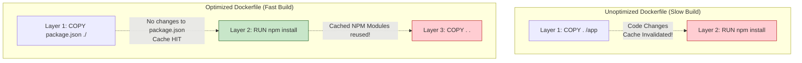
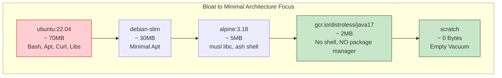

# Dockerfile Deep Dive

## Overview

The `Dockerfile` is the foundational blueprint of containerization. It is a declarative script containing sequential instructions that assemble a Docker Image. For a Junior Developer, a Dockerfile is simply a way to get their app running. For a Senior/Staff Platform Engineer in enterprise banking, the Dockerfile is a massive attack vector, a central pillar of CI/CD build performance, and a critical cost-control mechanism.

Poorly crafted Dockerfiles result in gigantic images (sometimes exceeding 2GB for a simple Node.js app), introducing agonizingly slow pull times in dynamically scaling Kubernetes clusters. Unoptimized caching means CI pipelines crawl, infuriating developers. Most dangerously, using bloated base images (like full Ubuntu) injects hundreds of unused system libraries into production—each a potential CVE (Common Vulnerability and Exposure) waiting to be flagged by security auditors.

Interviewers will intensely scrutinize your Dockerfile knowledge. They will ask you to optimize a broken Dockerfile, differentiate between visually similar commands (`CMD` vs `ENTRYPOINT`, `COPY` vs `ADD`), and explain the security implications of running as root.

---

## Foundational Concepts

### The Layered Immutability Rule
Every instruction in a Dockerfile (specifically `RUN`, `COPY`, and `ADD`) creates a new, immutable read-only layer using the Union Filesystem. 
If an instruction hasn't changed, and the files it operates on haven't changed, Docker utilizes a local cache layer instead of re-executing it. However, **if a layer's cache is invalidated, ALL subsequent layers must be rebuilt from scratch**. Therefore, the most critical rule of Dockerfile construction is:
> **Order instructions from least frequently changed (OS updates, Base Images) to most frequently changed (Application Source Code).**

---

## Technical Deep Dive

### Analyzing Crucial Instructions

#### 1. `FROM`
The foundation of the image. It specifies the parent image.
```dockerfile
# BAD: Unpredictable. Might be Java 11 today, Java 21 tomorrow. Will break builds.
FROM maven:latest 

# GOOD: Deterministic, minimal, and secure.
FROM eclipse-temurin:21-jre-alpine@sha256:1a2b3c...
```
*Enterprise Note*: Always pin to specific tags. Pinning to sha256 digests guarantees cryptographic immutability, preventing "supply chain" attacks where an attacker updates a tag on DockerHub.

#### 2. `COPY` vs `ADD`
*   `COPY`: Transmits local files/directories from the build context (your laptop/CI runner) into the container image.
*   `ADD`: Does the same, but has "magic" features. It automatically extracts local `.tar.gz` archives and can download files from remote URLs.
*   *Best Practice*: **Always use `COPY`**. `ADD` is discouraged because its implicit decompression causes unexpected layer bloat. If you need to download a file from a URL, use `RUN curl ... && tar ... && rm ...` in a single orchestrated layer so the archive doesn't permanently occupy space in the final image geometry.

#### 3. `CMD` vs `ENTRYPOINT`
These instructions declare what process runs when the container starts. This is the most frequently asked interview question.
*   `ENTRYPOINT`: Configures the executable that should always run. It makes the container behave like a raw binary.
*   `CMD`: Provides the *default arguments* to the `ENTRYPOINT`. Or, if no `ENTRYPOINT` exists, it acts as the executable itself.

```dockerfile
ENTRYPOINT ["java", "-jar", "app.jar"]
CMD ["--spring.profiles.active=prod"]
```
*   If you run `docker run my-app`, it executes: `java -jar app.jar --spring.profiles.active=prod`
*   If you run `docker run my-app --spring.profiles.active=dev`, the CLI argument **overrides the `CMD` completely**, resulting in: `java -jar app.jar --spring.profiles.active=dev`

**Shell Form vs Exec Form (The PID 1 Problem)**
*   *Shell Form*: `CMD java -jar app.jar`. Docker wraps your command in `/bin/sh -c`. The shell becomes PID 1. When Kubernetes tries to gracefully stop the pod, it sends `SIGTERM` to PID 1 (the shell). The shell intercepts it, fails to pass it to the Java process, and Kubernetes eventually violently `SIGKILL`s the container, corrupting database transactions.
*   *Exec Form*: `CMD ["java", "-jar", "app.jar"]`. Docker bypasses the shell. Java becomes PID 1. It receives `SIGTERM` directly and shuts down gracefully. **Always use Exec Form.**

#### 4. `ENV` vs `ARG`
*   `ARG`: Build-time variables. Available ONLY during `docker build`. They evaporate once the build completes. (e.g., `ARG BUILD_VERSION=1.0`). **Never use ARG for secrets (API Keys, Passwords)**, as they are permanently written in plain text to the image's metadata history (`docker history my-app`).
*   `ENV`: Run-time variables. They persist in the final image and are present in the running container environment.

#### 5. `USER`
Switches the operational user for subsequent instructions and for the final running process.
By default, Docker containers run as `root` (UID 0). In a banking environment, this is strictly forbidden. If an attacker achieves Remote Code Execution (RCE) inside a container, and the container runs as root, escaping to the host machine is exponentially easier.
```dockerfile
# Create a group and user
RUN addgroup -S appgroup && adduser -S appuser -G appgroup
# Switch context
USER appuser:appgroup
```

#### 6. `WORKDIR`
Sets the active directory. If it doesn't exist, Docker creates it. Use this instead of `RUN mkdir /app && cd /app`.

---

## Visual Representations

### Layer Caching Architecture



### Base Image Hierarchy



---

## Code/Configuration Examples

### An Enterprise-Grade React/Node Dockerfile (Multi-Stage)

```dockerfile
# ==========================================
# STAGE 1: Build Stage
# ==========================================
FROM node:20-alpine AS builder

# Crucial: Setup working directory
WORKDIR /app

# Cache Optimization: Only copy package manifests first
COPY package.json package-lock.json ./

# Install all dependencies (including heavy devDependencies)
# Use 'ci' for reproducible builds, enforcing lockfile
RUN npm ci

# Copy the actual source code (changes frequently)
COPY tsconfig.json .
COPY src ./src
COPY public ./public

# Compile TypeScript/React to static assets
RUN npm run build

# ==========================================
# STAGE 2: Production Runtime Stage
# ==========================================
FROM nginx:1.25-alpine AS production

# Security: Remove default Nginx config and HTML
RUN rm -rf /usr/share/nginx/html/* && \
    rm /etc/nginx/conf.d/default.conf

# Add custom hardened Nginx configuration
COPY nginx.conf /etc/nginx/conf.d/

# Copy ONLY the compiled static assets from the builder stage
COPY --from=builder /app/build /usr/share/nginx/html

# Security: Nginx master process runs as root to bind port 80, 
# but we configure the worker processes in nginx.conf to run as 'nginx' user.
# Ensure correct ownership of the HTML files
RUN chown -R nginx:nginx /usr/share/nginx/html

# Metadata
EXPOSE 80
HEALTHCHECK --interval=30s --timeout=5s --start-period=5s --retries=3 \
  CMD wget --quiet --tries=1 --spider http://localhost/ || exit 1

# Exec form for graceful shutdown
CMD ["nginx", "-g", "daemon off;"]
```

---

## Interview Questions & Model Answers

### Q1: I am reviewing a Dockerfile and it has: `RUN apt-get update` on line 4, and `RUN apt-get install -y postgresql-client` on line 5. Why will this break in the future, and how do you fix it?
**Model Answer**: This is the classic caching anti-pattern. Because they are on separate lines, Docker caches them as separate layers. Imagine `apt-get update` ran today and cached successfully. Three months from now, someone adds a new dependency. Docker reuses the 3-month-old cache for `apt-get update` (Layer 4), and then attempts to execute Layer 5. The Debian repositories will have retired the 3-month-old packages, causing a 404 Not Found error during installation. 
**The Fix**: You must chain them together sequentially in a single layer and explicitly purge the downloaded list indices to save space: 
`RUN apt-get update && apt-get install -y postgresql-client && rm -rf /var/lib/apt/lists/*`

### Q2: What is a distroless image, and why would an enterprise bank mandate its use?
**Model Answer**: "Distroless" images (popularized by Google) contain absolutely zero OS tools. They contain only the application and its runtime dependencies (e.g., just the JVM, or just the glibc linker for a Go binary). There is no shell (`/bin/sh`), no package manager (`apt`/`apk`), and no networking tools (`curl`). 
A bank mandates this for security. If an attacker finds a Remote Code Execution (RCE) vulnerability in your Java code, their first step is usually to open a reverse shell or download a payload using `curl`. In a distroless container, this is impossible because the tools to exploit the vulnerability simply do not exist in the filesystem, drastically limiting the blast radius.

### Q3: How do you supply a highly sensitive SSH private key to a Dockerfile to clone a private Git repository during the build without leaving the key in the image history?
**Model Answer**: You must absolutely never use `COPY ~/.ssh/id_rsa /root/.ssh/` or `ARG SSH_KEY`, as these bake the plaintext key into the image layer history permanently. Instead, you use BuildKit's temporary secret mounting. 
You execute the build with SSH forwarding: `docker buildx build --ssh default .`. 
In the Dockerfile, you specify: `RUN --mount=type=ssh git clone git@github.com:mybank/private-repo.git`. The SSH capability is bridged temporarily via memory to the `RUN` command and vanishes immediately after execution, leaving zero trace in the OCI image.

### Q4: Explain the difference between `COPY` and `ADD`. Why does Docker documentation recommend `COPY`?
**Model Answer**: Both inject files from the host into the container. However, `ADD` is overloaded with extra functionality: it automatically un-tars compressed archives, and it can reach out to remote URLs to download files. `COPY` is transparent, deterministic, and does exactly what it says. `ADD` is generally discouraged because downloading files via `ADD` adds an immutable layer containing the archive. If you untar it in the next step, you now have the archive AND the extracted contents permanently eating space in the image. Best practice dictates using `RUN curl ... && tar ... && rm ...` to leave only the extracted files.

### Q5: Can you explain the importance of the `.dockerignore` file regarding both performance and security?
**Model Answer**: 
*   **Performance**: When you type `docker build .`, the Docker CLI constructs a tarball of everything in the current directory (the "Build Context") and sends it to the Docker Daemon. If you have a 2GB `node_modules` folder, a `.git` repository history, or an IDE `.idea` folder, compiling that payload takes massive time and CPU before the build even begins. `.dockerignore` prevents this.
*   **Security**: Often, developers possess local `.env` files containing production AWS keys or `application-prod.yml` secrets. If a Dockerfile executes `COPY . /app`, those secrets are inadvertently stamped permanently into the image layers. `.dockerignore` acts as a fail-safe firewall preventing local secrets from ever traversing into the build process.

---

## Real-World Enterprise Scenarios

### Legacy Monolith CI Migration
**Scenario**: You are tasked with containerizing a massive 15-year old legacy Java monolith. The developers wrote a Dockerfile that starts with `FROM centos:7`. It copies the 2GB source code, installs Maven, compiles it, and starts Tomcat. The resulting image is 4.5 GB. Deployments to Kubernetes take 8 minutes just to pull the image over the network.
**Solution**: 
1.  **Multi-Stage Rescues**: Implement a Multi-Stage Dockerfile. Stage 1 utilizes `maven:3.9-eclipse-temurin-17` to execute the build. Stage 2 utilizes `eclipse-temurin:17-jre-alpine` (or Tomcat minimal equivalents).
2.  **Artifact Isolation**: Only the compiled `.war` or `.jar` artifact is `COPY --from=builder` into Stage 2. The 2GB source code and Maven dependencies are completely discarded.
3.  **Result**: The final image drops from 4.5 GB down to ~350 MB. Network pull times drop to 15 seconds, and vulnerabilities mapped to CentOS 7 are completely eliminated.

---

## Common Pitfalls & Best Practices

*   **Anti-Pattern (The Zombie PID 1)**: Using `CMD java -jar app.jar`. The shell becomes PID 1. It ignores `SIGTERM`. Your app crashes violently upon scaling down. **Best Practice**: Use `CMD ["java", "-jar", "app.jar"]`.
*   **Anti-Pattern (Latest Tagging)**: Using `FROM python:latest`. Tomorrow, Python 3.12 drops, your code is incompatible, and the pipeline shatters globally. **Best Practice**: `FROM python:3.11.4-slim-bookworm`.
*   **Anti-Pattern (Multiple Chowns)**: `COPY src /app` followed by `RUN chown -R user:group /app`. The `COPY` command allocates the space. The `chown` command modifies the metadata of every single file, forcing the Union Filesystem to copy every single file up to the new layer, essentially doubling the image size instantly. **Best Practice**: `COPY --chown=user:group src /app`.

---

## Key Takeaways

1.  **Every `RUN`, `COPY`, `ADD` creates an immutable layer.** Minimize them, and chain logical operations.
2.  **Order matters for caching.** Install static OS libs first, copy application source code last.
3.  **Exec Form `[]` is mandatory** for `CMD` and `ENTRYPOINT` to ensure proper Linux signal handling.
4.  **Run as Non-Root**. Apply `USER 10001` to restrict container escapement possibilities.
5.  **Use specific, minimal tags** (Alpine, Slim, or Distroless) rather than generic OS distributions.

## Appendix A: Dockerfile Instructions Quick Reference

| Instruction | Primary Function | Creates an Image Layer? |
| :--- | :--- | :--- |
| `FROM` | Initializes build stage and sets Base Image. | Yes (Pulls Parent Layers) |
| `RUN` | Executes command in shell or exec form; commits outcome. | **Yes** |
| `COPY` | Copies from host to container filesystem. | **Yes** |
| `ADD` | Copies + unpacks tars + supports remote URLs. | **Yes** |
| `CMD` | Default runtime command / arguments for ENTRYPOINT. | No (Metadata only) |
| `ENTRYPOINT` | Sets the container to run as a specific executable. | No (Metadata only) |
| `ENV` | Sets persistent environment variables. | No (Metadata only) |
| `USER` | Sets UID/GID for successive RUNs and the final app. | No (Metadata only) |
| `WORKDIR` | Sets active directory; creates it if missing. | Yes (If creating directory) |
| `EXPOSE` | Documentation only; informs which ports are used. | No (Metadata only) |
| `HEALTHCHECK` | Tells Docker how to dynamically test if container is working. | No (Metadata only) |

## Further Reading
*   [Docker Official Best Practices](https://docs.docker.com/develop/develop-images/dockerfile_best-practices/)
*   [Google Best Practices for Building Containers](https://cloud.google.com/architecture/best-practices-for-building-containers)
*   [Trivy Vulnerability Scanner](https://aquasecurity.github.io/trivy/)
