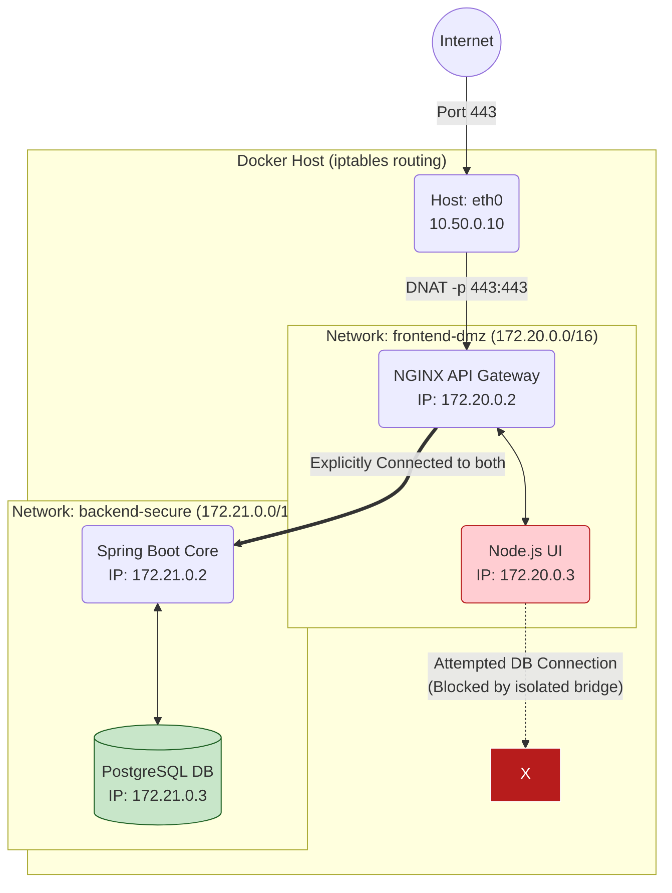

# Docker Networking

## Overview

Networking in containerized systems abstracts physical hardware concepts (switches, routers, firewalls) into software-defined iptables rules and virtual bridges. While developers often interact with Docker networking superficially via simple port mapping (`-p 8080:80`), a Senior Platform Engineer or Architect must understand the deep routing mechanics. 

In enterprise banking and financial systems, network segmentation is a foundational pillar of regulatory compliance (e.g., PCI-DSS). A compromised public-facing web container must be physically and logically barred from establishing a TCP handshake with the backend core banking database container. If you do not understand how Docker orchestrates `bridge` networks versus `overlay` networks, or how it circumvents host firewall rules (like `ufw` or `firewalld`), you will inadvertently expose critical financial data to the internet. 

Interviewers will intensely probe your understanding of the Container Network Model (CNM), the mechanics of container DNS service discovery, and how to architect high-performance networking solutions for legacy monolithic applications migrating to containers.

---

## Foundational Concepts

### The Container Network Model (CNM)
Docker networking is pluggable, adhering to the Container Network Model. This specification defines three primary constructs:
1.  **Sandbox**: The isolated environment mapping to the Linux `NET` Namespace. It contains the container's interfaces, routing tables, and DNS configuration.
2.  **Endpoint**: The virtual interface (`veth` pair) that connects the Sandbox to a Network.
3.  **Network**: A software implementation of a switch (typically an 802.1d bridge) that groups Endpoints together so they can interact.

---

## Technical Deep Dive: The Native Drivers

Docker ships with several core network drivers, each serving distinct architectural patterns.

### 1. `bridge` (The Default Workhorse)
A bridge network acts as an isolated software switch on the physical Docker host.
*   **The Default `docker0`**: When Docker installs, it creates `docker0`. If you run a container without specifying a network, it attaches here. Containers on `docker0` can ping each other via assigned IPs.
    *   *Critical Flaw*: `docker0` **does not support automatic DNS resolution**. You cannot `ping db-container` by name. It is retained purely for backward legacy compatibility.
*   **User-Defined Bridges**: Created via `docker network create my-net`. These are isolated from `docker0`. 
    *   *Superpower*: They include an **embedded DNS server**. Containers on a user-defined bridge can resolve each other by container name or network alias automatically. This is the bedrock of microservice communication.

### 2. `host`
The ultimate performance bypass. The container completely discards its own `NET` namespace sandbox and shares the Docker Host's physical network stack.
*   **Mechanics**: If the container binds to port 80, it is actually bound directly to the physical server's port 80.
*   **Trade-offs**: You gain maximum throughput (no NAT overhead), but you completely lose port mapping capabilities and isolation. You cannot run two containers on `--network host` that both want port 80.

### 3. `none`
The absolute isolation driver. The container receives only a loopback interface (`lo`). It has no external routes, no `eth0`, and no internet access. 
*   **Enterprise Use Case**: Processing highly classified or sensitive offline batch operations (e.g., nightly cryptographic key rotations) where the explicit threat model demands zero possibility of network data exfiltration.

### 4. `overlay`
Designed for distributed orchestrators (like Docker Swarm). It stretches a unified subnet across multiple physical Docker hosts.
*   **Mechanics**: Utilizes VXLAN (Virtual Extensible LAN) encapsulation. When a container on Host A pings a container on Host B, traffic is encapsulated in UDP packets, securely routed over the physical network, and un-encapsulated at the destination.
*   **Security**: By passing the `--opt encrypted` flag, the engine automatically encrypts all control and data plane traffic using IPsec AES-GCM.

### 5. `macvlan`
Makes a container look completely identical to a physical server on the network.
*   **Mechanics**: Bypasses the Linux bridge entirely. It assigns a unique, physical MAC address directly to the container's virtual interface. The container pulls an IP directly from the physical network's DHCP server.
*   **Enterprise Use Case**: Migrating ancient, legacy banking systems that require broadcast/multicast capabilities, or must sit on a specific hardware VLAN structure that cannot accommodate NAT routing.

---

## Technical Deep Dive: Service Discovery and DNS

Containers are ephemeral. They die, scale up, and restart, constantly changing their IP addresses. Hardcoding IPs in configuration files is a junior mistake.

**The Embedded DNS Server (`127.0.0.11`)**
When you create a user-defined bridge, Docker runs a lightweight DNS resolver inside the container's `.11` address.
1. When your `frontend` container tries to `curl http://backend:8080`, it asks `127.0.0.11` "Where is backend?"
2. Docker intercepts this. Since `backend` is on the same user-defined bridge, Docker's IPAM (IP Address Management) actively monitors the state and replies with the current internal IP (e.g., `172.18.0.4`).
3. If the request is for `google.com`, Docker fails to resolve it internally and intelligently forwards it to the upstream DNS servers configured on the physical host machine.

---

## Technical Deep Dive: Port Mapping & iptables

Since containers reside on private subnets (e.g., `172.17.0.0/16`), external traffic hitting the server cannot reach them. 
When you specify `docker run -p 8080:80`, Docker manipulates the Host's kernel `iptables` rules.

*   Traffic hits the physical server NIC (e.g., `192.168.1.50:8080`).
*   The `PREROUTING` chain in `iptables` detects it.
*   It performs DNAT (Destination Network Address Translation), rewriting the packet destination to `172.17.0.2:80` (the container).

**The Security Nightmare**: 
Docker injects its `iptables` rules *ahead* of the standard `ufw` or `firewalld` filtering chains. If you use `ufw deny 8080` to block internet traffic, but run `docker run -p 8080:80`, **Docker bypasses the firewall and exposes the container directly to the internet**. (See Interview Questions for the fix).

---

## Visual Representations

### Multi-Tier Bridge Isolation (PCI-DSS Model)

*Architecture*: The `WEB` container has absolutely no physical or routing path to the `DB` container. They sit on separate virtual switches. Only the `NGINX` / API Gateway container is mapped to both networks. This satisfies stringent auditor requirements for segmentation.

---

## Interview Questions & Model Answers

### Q1: Why should you never use the default `docker0` bridge network in a production environment?
**Model Answer**: The default `docker0` bridge violates multiple enterprise best practices. Foremost, it lacks automatic DNS service discovery; you cannot resolve containers by their names, forcing reliance on brittle IP addresses or deprecated `--link` flags. Secondary, it provides zero network isolation—every unconnected container dumps onto `docker0`, meaning any compromised container has total line-of-sight to every other container on the bridge. Production demands explicitly crafted, user-defined bridge networks for discrete application stacks to ensure segmentation and functional service discovery.

### Q2: You deploy a Postgres database with `docker run -p 5432:5432 postgres`. Your SysAdmin creates a strict `ufw` firewall rule blocking all external traffic to 5432. A week later, a security scan reveals your database is wide open to the public internet. What happened?
**Model Answer**: This is a classic Docker security pitfall. Docker actively manipulates Linux `iptables` to enable routing to the proprietary bridge networks. It inserts the `DOCKER` routing chain at the very top, preempting standard userspace firewalls like `ufw` or `firewalld`. Thus, the traffic hits Docker's DNAT rule and routes to the database before the firewall ever has a chance to drop the packet.
**The Fix**: Never map exposed ports to `0.0.0.0` (all interfaces) unless strictly necessary. To secure a database port intended only for local/adjacent connections, explicitly bind the port to localhost: `docker run -p 127.0.0.1:5432:5432 postgres`.

### Q3: Explain how `macvlan` differs from standard `bridge` networking, and describe an enterprise migration scenario where it is required.
**Model Answer**: A `bridge` uses network address translation (NAT). The container exists on a private internal subnet and uses the Docker Host's IP to route outbound to the real world. Under `macvlan`, Docker attaches a unique, distinct hardware MAC address directly to the container's virtual ethernet interface. The container bypasses the host networking stack computationally, presenting itself to the physical switch as an entirely separate physical server. 
**Scenario**: In banking, legacy applications (like older FIX protocol engines or specialized trading appliances) often rely on Layer 2 capabilities, such as broadcast messages, multicast discovery, or strict requirements from network hardware appliances (F5 load balancers) expecting direct IP routing without NAT traversal overhead. `macvlan` fulfills this lift-and-shift requirement flawlessly.

### Q4: We are deploying containers using `--network=host`. A junior engineer complains that macOS Docker Desktop throws network errors when they use this flag locally, but it works perfectly in the Linux CI/CD pipeline. Why?
**Model Answer**: The `host` network driver instructs the container to explicitly share the networking namespace (`NET`) of the underlying kernel. On a native Linux machine (like the CI/CD pipeline), the container accurately binds directly to the server's pure hardware interfaces (`eth0`). However, on macOS (or Windows), Docker Desktop does not run natively; it operates inside a hidden, ultra-lightweight Linux Virtual Machine. Consequently, applying `--network=host` on a Mac binds the container to the *hidden VM's* network interfaces, not your physical MacBook's Wi-Fi interface. It is syntactically valid but functionally useless on macOS for exposing ports to your local host.

### Q5: How do two containers on the exact same user-defined bridge network communicate? Do the packets traverse the physical host NIC?
**Model Answer**: When Container A talks to Container B on the same bridge (e.g., `my-net`), the traffic never touches the physical host network interface card (NIC like `eth0` or `ens33`). It traverses entirely in-memory within the Linux kernel. The kernel routes the packets from Container A's `veth` endpoint, across the software bridge interface (`br-xxxx`), directly into Container B's `veth` endpoint. This provides incredibly fast, almost near line-rate bandwidth speeds bound only by CPU and memory constraints.

---

## Real-World Enterprise Scenarios

### Zero Trust Multi-Tenancy Architecture
**Context**: A SaaS financial platform provides dedicated isolated reporting instances for clients (Client A, Client B).
**Architectural Execution**:
If both clients run on the same VM Node to save costs, placing them on `docker0` guarantees cross-contamination. 
We orchestrate isolated User-Defined Bridges during deployment: `client-a-net` and `client-b-net`. 
To ensure maximum security, we configure the daemon with the ICC flag disabled (`--icc=false`), which instructs iptables to drop any packet attempting to cross between the internal container bridges. For the containers to reach the internet (for software updates), outbound NAT mapping is allowed, but lateral traversal is cryptographically and topologically severed at the Linux kernel level.

---

## Common Pitfalls & Best Practices

1.  **Anti-Pattern (Overlapping Subnets)**: Manually creating a user-defined bridge without specifying the `--subnet` flag. Docker will assign `172.18.0.0/16`, then `172.19.0.0/16`. If your corporate VPN happens to operate on those ranges, routing collisions occur. Any request heading to the VPN drops into the container blackhole instead.
    *   **Best Practice**: explicitly curate the default address pool in `/etc/docker/daemon.json` (`bip` and `default-address-pools`) ensuring Docker utilizes a safely allocated, non-routable CIDR block explicitly cleared by the enterprise network team.
2.  **Anti-Pattern (Relying on IPs)**: Hardcoding IPs inside configuration files (e.g. `JDBC_URL=jdbc:postgresql://172.18.0.3/db`). 
    *   **Best Practice**: Container IPAM is dynamic. A deployment or crash reshuffles IPs. Always rely on internal DNS capability `JDBC_URL=jdbc:postgresql://db-service:5432/db`.

---

## Comparison Tables

### Network Driver Selection Matrix

| Driver | Overhead/Latency | Primary Use Case | Network Isolation |
| :--- | :--- | :--- | :--- |
| **Bridge** | Low (NAT Overhead) | Standard web applications, databases | High (Sandboxed) |
| **Host** | **Zero** | High-Frequency Trading, massive port ranges | **None** (Shares Host) |
| **None** | Zero | Offline batch, top-secret key generations | Complete |
| **Overlay** | Medium (VXLAN) | Docker Swarm, multi-node communication | High |
| **Macvlan** | Low | Legacy systems requiring physical IPs / L2 | Medium (Bypasses Host Firewall) |

---

## Key Takeaways

*   **Never use `docker0`**. Create custom bridges to unlock DNS service discovery and isolate stacks.
*   The internal Docker DNS server binds strictly to `127.0.0.11` via interception.
*   Publishing ports (`-p`) creates `iptables` DNAT rules that proactively bypass standard host firewalls.
*   `--network host` disables network isolation entirely for raw, unadulterated performance.
*   `macvlan` forces containers to appear as physical hardware devices on external enterprise VLANs.

## Further Reading
*   [Docker Networking Architecture Documentation (Docker Docs)](https://docs.docker.com/network/)
*   [Deep Dive into Docker's network namespace manipulation](https://iximiuz.com/en/tags/networking/)
*   [Securing Docker Networks](https://docs.docker.com/engine/security/)
