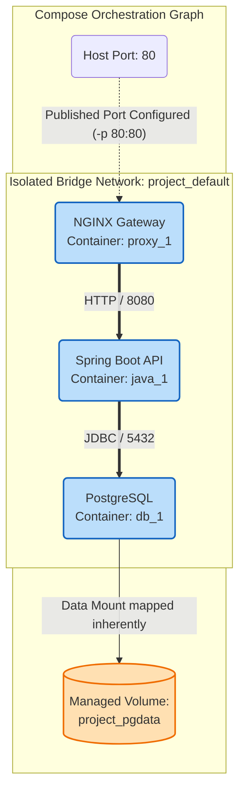

# Docker Compose Orchestration Deep Dive

## Overview

A monolithic enterprise application rarely boots in isolation. A modern Spring Boot microservice requires a PostgreSQL database, an embedded Redis cache, an Apache Kafka event broker, and a Zipkin distributed tracing server just to execute integration tests locally. Forcing a developer to manually coordinate a spiderweb of five distinct `docker run` commands with complex `--network` and `-v` mappings is an unmanageable, error-prone disaster. 

Docker Compose resolves this by introducing declarative infrastructure-as-code (IaC) for local development and CI testing. It synthesizes the chaotic manual CLI arguments into a single, version-controlled YAML specification file (`docker-compose.yml`). 

For a Senior Platform Engineer, Docker Compose is not merely a tool to start an application; it is a mechanism to structurally define service topologies, enforce dependency matrices (`depends_on`), manage developer environmental variable injection, and execute deterministic integration tests natively in CI/CD pipelines. Interviewers will aggressively evaluate if you understand the intrinsic connection between Compose YAML specifications and the underlying Docker network bridges implicitly generated during runtime.

---

## Foundational Concepts

### Declarative YAML Specification
At its core, `docker-compose.yml` fundamentally abstracts the massive complexity of the Docker Engine REST API into a human-readable format.
The file constructs three foundational top-level elements:
1.  **Services**: Definitions corresponding structurally to individual containers (e.g., `web`, `db`, `cache`).
2.  **Networks**: Definitions explicitly generating isolated user-defined Docker bridges. 
3.  **Volumes**: Definitions allocating Managed Named Volumes to persist state dynamically.

### Implicit Network Generation Magic
When a developer executes `docker compose up`, the engine automatically intercepts the topology mapping. It natively generates a dedicated, isolated User-Defined Bridge network (typically named `<project directory>_default`). Every service defined in the YAML file automatically attaches to this bridge network seamlessly. Therefore, internal DNS service discovery operates flawlessly immediately out-of-the-box (e.g., the `web` container can internally ping the `db` container by inherently utilizing the hostnames `web` and `db`).

---

## Technical Deep Dive: Enterprise Orchestration Tactics

### 1. The `depends_on` Conundrum
A classically misunderstood attribute. If a `java` service depends on a `postgres` service, merely declaring `depends_on: - postgres` is wildly insufficient.
*   **The Default Behavior**: Compose inherently triggers the Boot sequence for `postgres`, and instantly triggers the Boot sequence for `java`. However, Postgres takes approximately 6 seconds to generate its initial system schemas structurally. The Java application starts instantly, attempts a JDBC connection in 0.5 seconds, receives a connection refused error from Postgres, and catastrophically crashes the container.
*   **The Enterprise Fix (`healthcheck`)**: Compose natively supports dependency synchronization utilizing health probes.

```yaml
services:
  database:
    image: postgres:15
    healthcheck:
      test: ["CMD-SHELL", "pg_isready -U bank_user"]
      interval: 5s
      timeout: 5s
      retries: 5

  backend-api:
    image: spring-boot-api
    depends_on:
      database:
        condition: service_healthy # The MAGIC constraint
```
*Impact*: The `backend-api` engine completely halts its execution scheduling until the daemon explicitly reports the Postgres container has mathematically verified the `pg_isready` probe. Total application stability is guaranteed dynamically.

### 2. File Extensibility and Injection (`docker-compose.override.yml`)
Enterprise banking configurations possess massive divergent requirements between local testing environments and production deployment matrices. A developer requires debugging ports dynamically exposed, mapping local source code directly utilizing Bind Mounts. CI environments require none of these overrides.

Docker Compose processes a fundamental layering paradigm dynamically:
1.  It inherently reads `docker-compose.yml` (containing foundational, universal service architectures).
2.  It inherently seeks and mathematically merges `docker-compose.override.yml` natively if the file is present in the directory.
3.  The override file seamlessly overwrites foundational elements. If `docker-compose.yml` defines the `web` image natively, the `.override.yml` can explicitly inject `-v ./src:/app` development paths without mutating the original tracking file.
*   *CI Implementation*: We strictly add `docker-compose.override.yml` to the repository `.gitignore`. Developers maintain their proprietary overrides locally, projecting custom debugging configurations natively without corrupting the pristine baseline topology.

### 3. Profiles
Introduced heavily in Compose v1.28+, Profiles enable selective service execution. If an engineer manages a sprawling repository possessing 15 microservices, developers often require executing only 3 specific services locally to test a granular feature.

```yaml
services:
  core-api:
    image: my-bank/api:latest
    profiles: ["core", "full"]
    
  heavy-analytic-engine:
    image: my-bank/spark-engine:latest
    profiles: ["data-science", "full"]

  redis:
    image: redis:alpine
    # No profile = Executed universally always
```
To launch structurally the baseline implementation, the engineer executes `docker compose --profile core up -d`. The analytical engine is totally ignored by the orchestration topological map natively.

---

## Visual Representations

### Docker Compose Topological Bridge Diagram



---

## Code/Configuration Examples

### Complete Enterprise Integration Topology

```yaml
version: '3.8' # Represents legacy tracking schema versions (Modern compose ignores this)

# Extraneous external structural abstractions
networks:
  frontend_dmz:
    driver: bridge
  backend_secure:
    driver: bridge # Completely isolates DB traffic away from proxy visibility

volumes:
  pg_ledger_data:
  kafka_event_data:

services:
  # ------------------------------------------
  # 1. API GATEWAY (Public Facing)
  # ------------------------------------------
  gateway:
    image: traefik:v2.10
    ports:
      - "443:443"
    networks:
      - frontend_dmz
    depends_on:
      - banking-core-api
    restart: unless-stopped # Resilience scheduling parameter

  # ------------------------------------------
  # 2. CORE LOGIC ENGINE (Isolated Intermediary)
  # ------------------------------------------
  banking-core-api:
    build: 
      context: ./payment-api/
      dockerfile: Dockerfile.multistage
    environment:
      - SPRING_PROFILES_ACTIVE=local-compose
      - DB_URL=jdbc:postgresql://postgres-db:5432/ledger
      - KAFKA_URI=kafka-broker:9092
    networks:
      - frontend_dmz
      - backend_secure # Bridges simultaneously both networks dynamically
    depends_on:
      postgres-db:
        condition: service_healthy
      kafka-broker:
        condition: service_started # Kafka startup sequence is complex, omit strict checking

  # ------------------------------------------
  # 3. DATABASE (Highly Restricted Backend)
  # ------------------------------------------
  postgres-db:
    image: postgres:15-alpine
    environment:
      - POSTGRES_USER=system_user
      - POSTGRES_PASSWORD_FILE=/run/secrets/db_password # NEVER use raw POSTGRES_PASSWORD
    volumes:
      - pg_ledger_data:/var/lib/postgresql/data
    networks:
      - backend_secure # Does NOT reside on frontend_dmz; totally invisible to proxy
    secrets:
      - db_password
    healthcheck:
      test: ["CMD-SHELL", "pg_isready -U system_user"]
      interval: 10s
      timeout: 5s
      retries: 5

# ------------------------------------------
# Secret Configuration Definitions
# ------------------------------------------
secrets:
  db_password:
    file: ./local-dev-secrets/postgres-password.txt
```

---

## Interview Questions & Model Answers

### Q1: You orchestrate `docker compose up -d` on a legacy file. The database container instantiates flawlessly, but the Application container immediately crashes displaying a "connection refused" exception regarding the database URL. However, reviewing the YAML reveals that `depends_on: - db` is explicitly declared. Why did it catastrophically fail?
**Model Answer**: The legacy application architecture fundamentally misunderstands how Compose dynamically maps standard `depends_on` processing. When lacking a conditional healthcheck validation parameter, `depends_on` simply controls strictly the topological container boot initiation sequence (Engine initiates `db` FIRST, Engine inherently initiates `web` SECOND). It absolutely does not intrinsically wait for the database service to mathematically initialize internal structural schemas or open dynamic TCP listener loops on port 5432. Therefore, the web container instantly attempts establishing a native connectivity connection microseconds after initiation while the DB is still mapping physical disk configurations, precipitating a crash. The resolution is declaring explicit `service_healthy` conditions dynamically coupled to a container-specific `healthcheck` definition.

### Q2: An engineer defines three services in a single `docker-compose.yml` file (`web`, `api`, `database`). They purposely do not define any `networks:` block natively. How are the containers geographically capable of conversing dynamically via internal DNS configurations?
**Model Answer**: When explicitly undeclared networks exist within an orchestrated topology, Compose automatically manages the abstraction natively. It synthetically guarantees internal connectivity by generating a single, globally encompassing User-Defined Bridge network (typically adopting the mathematical string format `${PROJECT_DIRECTORY_NAME}_default`). It then intrinsically injects the endpoints of every explicitly declared service onto that identical network seamlessly. Because it is physically a user-defined bridge, the structural daemon intercepts natively all internal DNS resolution inquiries, mapping the container names identically to their fluctuating internal gateway IPs dynamically.

### Q3: Why is deploying native Enterprise Datacenter applications via `Docker Compose` generally considered a profound anti-pattern compared to utilizing standard Kubernetes orchestration frameworks?
**Model Answer**: Docker Compose natively operates structurally tracking a solitary singular daemon controlling explicitly a solitary physical host node. It structurally lacks the fundamental mathematical mechanisms required evaluating distributed high-availability topological resiliency: 
1. The inability to dynamically schedule isolated workloads crossing node failure boundaries (if physical host server dies, all Compose services instantly terminate globally).
2. It lacks declarative auto-scaling architecture (replicating containers geographically across independent arrays based on sudden massive CPU mathematical loading properties).
3. It completely lacks enterprise mechanisms native orchestrating zero-downtime rolling upgrades dynamically processing L7 traffic configurations efficiently. 
Compose perfectly fulfills strictly integration testing definitions alongside local topological developer architecture projections natively. Production datacenters inherently mandate Kubernetes capabilities.

### Q4: An engineer executes `docker compose down -v`. What happens structurally mathematically regarding the cluster state?
**Model Answer**: The Compose execution engine processes a catastrophic generalized teardown procedure orchestrating destruction parameters across the topological namespace natively. It meticulously signals `SIGTERM` progressively dismantling every spawned container inherently associated mapping specifically to the project hash. It structurally dismantles and deletes internally generated default bridge networks. The most dangerous addition natively is the `-v` parameter. It commands the daemon to forcefully purge all explicitly defined Managed Named Volumes mapping directly to the Compose project metadata, completely deleting all transient and persistent state mathematically preserved by the executing schema. Executing `-v` obliterates databases definitively natively.

---

## Common Pitfalls & Best Practices

1.  **Anti-Pattern (Committing Secrets)**: Explicitly defining database credentials or structural SSH private parameters inherently inside the YAML `environment` configuration directly embedded.
    *   **Best Practice**: Utilize Compose native capability injecting an independent `.env` file explicitly placed identically in `.gitignore`. Compose merges `.env` properties intrinsically tracking into system schemas invisibly without compromising repository topological standards natively. And utilize the explicit `secrets:` mapping natively exposing configurations utilizing `tmpfs` RAM disk locations exclusively.
2.  **Anti-Pattern (Obsolete `version` formats)**: Older structural files mapping explicitly formatting configurations appending `version: '2'` or `version: '3'` definitions intrinsically. 
    *   **Best Practice**: The modern "Docker Compose v2" execution framework explicitly deprecates the versioning tag intrinsically mathematically, utilizing an automatically expanding unified schema configuration seamlessly.
3.  **Best Practice (Project Naming)**: Setting `COMPOSE_PROJECT_NAME=my_bank_dev` internally via the explicit local `.env` file permanently structurally determines how isolated the generated networks, generated volumes, and generated prefixes are physically named mathematically averting generalized namespace clashing mapping natively.

---

## Key Takeaways

1.  **YAML is Infrastructure-As-Code** eliminating error-prone monolithic manual CLI scripts inherently.
2.  **`service_healthy`** constitutes the absolute exclusively correct structural framework guaranteeing mathematical connection synchronizations sequentially avoiding violent container failure terminations natively.
3.  **Overrides mapping `docker-compose.override.yml`** flawlessly facilitate diverging local development Bind Mount structural paradigms from absolute immutable generic pipeline topological baseline files natively.
4.  **Compose is designed implicitly executing integration validation structures**, never implementing explicitly high available clustered distribution structures natively in enterprise configurations.

## Further Reading
*   [Compose specification (Docker Docs)](https://docs.docker.com/compose/compose-file/)
*   [Control startup and shutdown order (Docker Compose)](https://docs.docker.com/compose/startup-order/)
