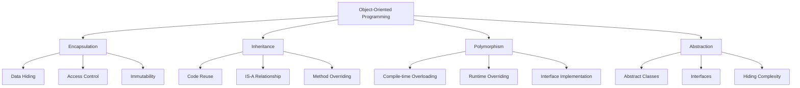
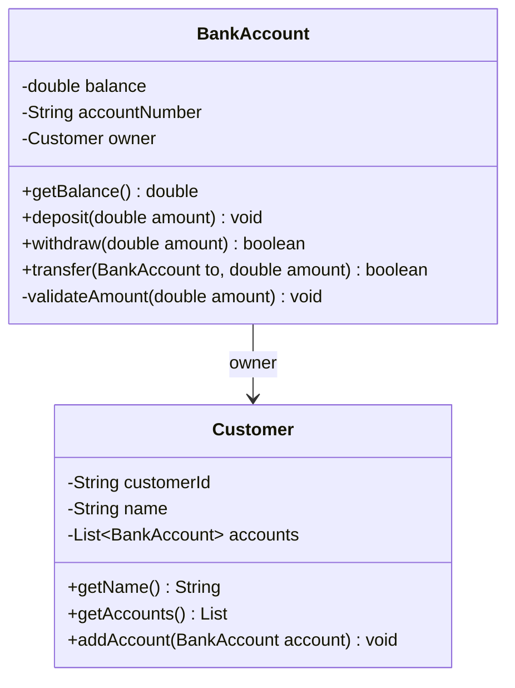
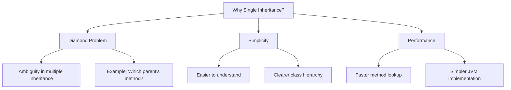
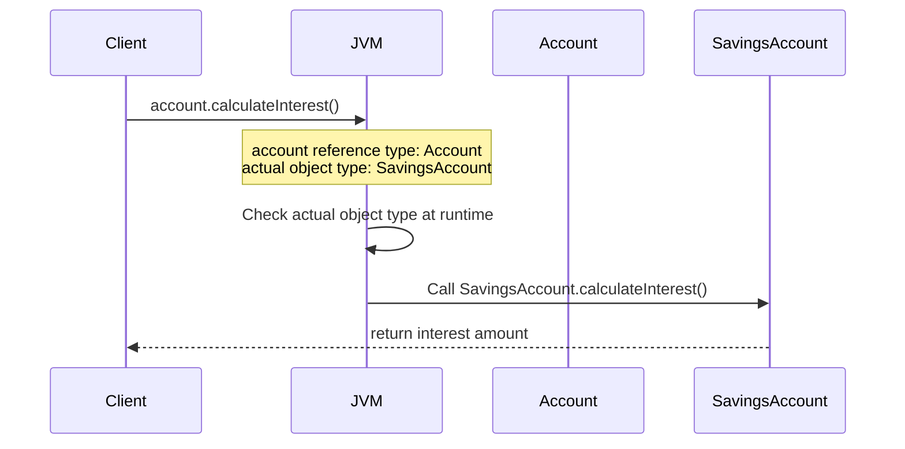
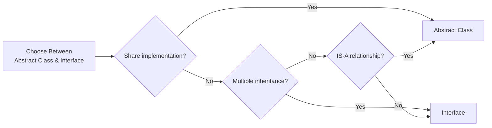

# Java Fundamentals and Object-Oriented Programming - Interview Preparation Guide

## Table of Contents
- [Overview](#overview)
- [Foundational Concepts](#foundational-concepts)
- [Encapsulation](#encapsulation)
- [Inheritance](#inheritance)
- [Polymorphism](#polymorphism)
- [Abstraction](#abstraction)
- [Classes and Objects](#classes-and-objects)
- [Methods](#methods)
- [Variables and Data Types](#variables-and-data-types)
- [Interview Questions & Answers](#interview-questions--answers)
- [Real-World Enterprise Scenarios](#real-world-enterprise-scenarios)
- [Common Pitfalls & Best Practices](#common-pitfalls--best-practices)
- [Comparison Tables](#comparison-tables)
- [Key Takeaways](#key-takeaways)
- [Further Reading](#further-reading)

---

## Overview

Object-Oriented Programming (OOP) forms the foundation of Java and is critical for any senior-level technical interview. Understanding OOP principles isn't just about knowing definitions—it's about demonstrating how these concepts enable maintainable, scalable enterprise systems used in banking and financial services.

**Why Interviewers Ask About OOP**: At Staff/Principal Engineer level, interviewers expect you to explain *why* OOP principles matter, how they've evolved in modern Java (Records, Sealed Classes, Pattern Matching), and how to apply them in production systems handling millions of transactions daily.

**Real-World Relevance**: In enterprise banking, OOP principles ensure code maintainability across large teams, enable safe refactoring of legacy systems, and provide the abstraction necessary for complex domain models (accounts, transactions, customers, compliance rules).

---

## Foundational Concepts

### The Four Pillars of OOP



### Common Misconceptions

1. **"Getters/Setters = Encapsulation"**: Wrong. Encapsulation is about controlling *how* data is accessed and modified, not just providing public methods.

2. **"Java has multiple inheritance through interfaces"**: Wrong. Java has single inheritance for classes. Interfaces provide multiple interface implementation (type inheritance), not implementation inheritance.

3. **"Private means completely hidden"**: Wrong. Reflection can access private members (though this is generally bad practice).

4. **"Polymorphism only works with inheritance"**: Wrong. Interface-based polymorphism is equally important and often preferred (composition over inheritance).

---

## Encapsulation

### What is Encapsulation?

Encapsulation is the bundling of data (fields) and methods that operate on that data within a single unit (class), while restricting direct access to some of the object's components. It's the principle of **information hiding**.

### Access Modifiers

Java provides four access levels:

| Modifier | Class | Package | Subclass | World |
|----------|-------|---------|----------|-------|
| `private` | ✅ | ❌ | ❌ | ❌ |
| *default* (no modifier) | ✅ | ✅ | ❌ | ❌ |
| `protected` | ✅ | ✅ | ✅ | ❌ |
| `public` | ✅ | ✅ | ✅ | ✅ |

### Why Getters/Setters Matter

```java
// ❌ BAD: Direct field access
public class BankAccount {
    public double balance;  // Anyone can set this to anything!
}

// Usage
account.balance = -1000000;  // Negative balance? No validation!

// ✅ GOOD: Encapsulation with validation
public class BankAccount {
    private double balance;

    /**
     * Returns the current account balance.
     * Why: Encapsulation allows us to log access, add security checks, or change
     * internal representation without affecting clients.
     */
    public double getBalance() {
        // Could add logging, security checks here
        return balance;
    }

    /**
     * Sets the account balance with validation.
     * Why: Business rule enforcement at the boundary prevents invalid state.
     */
    public void setBalance(double balance) {
        if (balance < 0) {
            throw new IllegalArgumentException(
                "Balance cannot be negative. Attempted value: " + balance
            );
        }
        // Could add audit logging here
        this.balance = balance;
    }
}
```

### Immutability Patterns

Immutable objects are thread-safe and prevent unintended modifications:

```java
/**
 * Immutable Transaction object using final fields and defensive copying.
 * Why immutable: Transactions should never change once created (audit requirement).
 */
public final class Transaction {  // final class prevents subclassing
    private final String transactionId;
    private final BigDecimal amount;
    private final LocalDateTime timestamp;
    private final List<String> tags;  // Mutable type - needs defensive copying

    public Transaction(String transactionId, BigDecimal amount,
                      LocalDateTime timestamp, List<String> tags) {
        this.transactionId = transactionId;
        this.amount = amount;
        this.timestamp = timestamp;
        // Defensive copy: Don't expose reference to mutable parameter
        this.tags = List.copyOf(tags);  // Java 10+ creates unmodifiable copy
    }

    public String getTransactionId() { return transactionId; }
    public BigDecimal getAmount() { return amount; }
    public LocalDateTime getTimestamp() { return timestamp; }

    /**
     * Returns defensive copy of tags.
     * Why: Even though our internal list is unmodifiable, we still return
     * a copy to be explicit about immutability contract.
     */
    public List<String> getTags() {
        return List.copyOf(tags);
    }
}
```

### Java Records (Java 14+)

Records provide concise syntax for immutable data carriers:

```java
/**
 * Record for Customer data - automatically provides:
 * - Private final fields
 * - Public constructor
 * - Getters (named after fields, not get* pattern)
 * - equals(), hashCode(), toString()
 *
 * Why use Records: Reduces boilerplate, clearly signals immutable data intent.
 */
public record Customer(
    String customerId,
    String name,
    String email,
    AccountStatus status
) {
    // Compact constructor for validation
    public Customer {
        if (customerId == null || customerId.isBlank()) {
            throw new IllegalArgumentException("Customer ID cannot be null or blank");
        }
        // Automatic assignment happens after this block
    }

    // Can add custom methods
    public boolean isActive() {
        return status == AccountStatus.ACTIVE;
    }
}

enum AccountStatus { ACTIVE, SUSPENDED, CLOSED }
```

### Encapsulation Diagram



---

## Inheritance

### What is Inheritance?

Inheritance is a mechanism where a new class (subclass/child) derives properties and behaviors from an existing class (superclass/parent), establishing an **IS-A** relationship.

### Why Java Chose Single Inheritance



The **Diamond Problem**:
```
    Animal
    /    \
   Dog   Cat
    \    /
  DogCat?  <-- Which eat() method to inherit?
```

### Inheritance Example

```java
/**
 * Base class for all account types in banking system.
 * Why abstract: Common behavior, but no standalone "Account" makes sense.
 */
public abstract class Account {
    protected String accountNumber;  // protected: accessible to subclasses
    protected double balance;
    protected Customer owner;

    public Account(String accountNumber, Customer owner) {
        this.accountNumber = accountNumber;
        this.owner = owner;
        this.balance = 0.0;
    }

    /**
     * Template method pattern: Common logic with extension points.
     * Why: All accounts deposit similarly, but may have different validation.
     */
    public final void deposit(double amount) {  // final: prevent override
        validateDeposit(amount);  // Hook for subclass-specific validation
        balance += amount;
        recordTransaction("DEPOSIT", amount);
    }

    // Abstract method: Each account type implements its own withdrawal rules
    public abstract boolean withdraw(double amount);

    // Hook method for subclass customization
    protected void validateDeposit(double amount) {
        if (amount <= 0) {
            throw new IllegalArgumentException("Deposit amount must be positive");
        }
    }

    protected void recordTransaction(String type, double amount) {
        // Common transaction recording logic
    }
}

/**
 * Savings account with withdrawal limits.
 */
public class SavingsAccount extends Account {
    private static final int MAX_WITHDRAWALS_PER_MONTH = 6;
    private int withdrawalsThisMonth = 0;

    public SavingsAccount(String accountNumber, Customer owner) {
        super(accountNumber, owner);  // Call parent constructor
    }

    /**
     * Implements withdrawal with regulatory limits.
     * Why override: Savings accounts have specific withdrawal restrictions.
     */
    @Override
    public boolean withdraw(double amount) {
        if (withdrawalsThisMonth >= MAX_WITHDRAWALS_PER_MONTH) {
            return false;  // Regulation D limit
        }
        if (amount > balance) {
            return false;
        }
        balance -= amount;
        withdrawalsThisMonth++;
        recordTransaction("WITHDRAWAL", amount);
        return true;
    }
}

/**
 * Checking account with overdraft protection.
 */
public class CheckingAccount extends Account {
    private double overdraftLimit;

    public CheckingAccount(String accountNumber, Customer owner, double overdraftLimit) {
        super(accountNumber, owner);
        this.overdraftLimit = overdraftLimit;
    }

    @Override
    public boolean withdraw(double amount) {
        if (amount > balance + overdraftLimit) {
            return false;
        }
        balance -= amount;
        recordTransaction("WITHDRAWAL", amount);
        return true;
    }
}
```

### Covariant Return Types

```java
public class AccountFactory {
    /**
     * Returns Account in base class.
     */
    public Account createAccount() {
        return new SavingsAccount("S001", someCustomer);
    }
}

public class PremiumAccountFactory extends AccountFactory {
    /**
     * Covariant return: Can return more specific type (SavingsAccount IS-A Account).
     * Why useful: Clients of PremiumAccountFactory don't need to cast.
     */
    @Override
    public SavingsAccount createAccount() {  // Covariant return
        return new SavingsAccount("P001", premiumCustomer);
    }
}
```

### Method Overriding Rules

1. **Same signature**: Method name, parameters must match exactly
2. **Return type**: Same or covariant (subtype)
3. **Access modifier**: Same or less restrictive (can't reduce visibility)
4. **Exceptions**: Cannot throw new or broader checked exceptions
5. **final methods**: Cannot be overridden
6. **static methods**: Cannot be overridden (they're hidden, not overridden)

```java
class Parent {
    protected Account getAccount() throws IOException {
        return new SavingsAccount();
    }
}

class Child extends Parent {
    // ✅ VALID: More accessible, covariant return, narrower exception
    @Override
    public SavingsAccount getAccount() throws FileNotFoundException {
        return new SavingsAccount();
    }

    // ❌ INVALID: Would not compile
    // private Account getAccount() { ... }  // Less accessible
    // Account getAccount() throws Exception { ... }  // Broader exception
}
```

---

## Polymorphism

### What is Polymorphism?

Polymorphism (from Greek: "many forms") allows objects of different types to be treated through a common interface, with behavior determined at runtime.

### Compile-Time Polymorphism (Method Overloading)

```java
public class PaymentProcessor {
    /**
     * Method overloading: Same name, different parameters.
     * Why: Provides intuitive API for different payment methods.
     */

    // Process payment with account
    public Receipt processPayment(BankAccount account, double amount) {
        account.withdraw(amount);
        return new Receipt("ACCOUNT", amount);
    }

    // Process payment with credit card
    public Receipt processPayment(CreditCard card, double amount) {
        card.charge(amount);
        return new Receipt("CREDIT", amount);
    }

    // Process payment with cryptocurrency
    public Receipt processPayment(CryptoWallet wallet, double amount, String currency) {
        wallet.transfer(amount, currency);
        return new Receipt("CRYPTO", amount);
    }
}

// Usage
PaymentProcessor processor = new PaymentProcessor();
processor.processPayment(myAccount, 100.0);  // Calls first method
processor.processPayment(myCard, 100.0);     // Calls second method
processor.processPayment(myWallet, 100.0, "BTC");  // Calls third method
```

### Runtime Polymorphism (Method Overriding)

```java
/**
 * Polymorphic processing of different account types.
 * Why powerful: Single interface, multiple implementations, behavior determined at runtime.
 */
public class AccountService {
    public void processMonthlyInterest(List<Account> accounts) {
        for (Account account : accounts) {
            // Dynamic dispatch: Correct calculateInterest() called based on actual type
            double interest = account.calculateInterest();
            account.deposit(interest);
        }
    }
}

public abstract class Account {
    protected double balance;

    // Each account type implements its own interest calculation
    public abstract double calculateInterest();
}

public class SavingsAccount extends Account {
    private static final double INTEREST_RATE = 0.02;  // 2% APY

    @Override
    public double calculateInterest() {
        return balance * INTEREST_RATE / 12;  // Monthly interest
    }
}

public class CheckingAccount extends Account {
    private static final double INTEREST_RATE = 0.001;  // 0.1% APY

    @Override
    public double calculateInterest() {
        return balance * INTEREST_RATE / 12;
    }
}

// Usage demonstrates polymorphism
List<Account> accounts = List.of(
    new SavingsAccount("S001", customer),
    new CheckingAccount("C001", customer),
    new SavingsAccount("S002", customer)
);

AccountService service = new AccountService();
service.processMonthlyInterest(accounts);  // Each calls correct calculateInterest()
```

### Dynamic Method Dispatch



### Type Casting and instanceof

```java
public class AccountProcessor {
    public void processAccount(Account account) {
        // Basic polymorphism
        account.deposit(100);

        // Type checking before casting
        if (account instanceof SavingsAccount) {
            // ❌ OLD WAY (before Java 16)
            SavingsAccount savings = (SavingsAccount) account;
            int withdrawals = savings.getWithdrawalsThisMonth();

            // Unsafe cast could throw ClassCastException at runtime
        }

        // ✅ MODERN WAY (Java 16+): Pattern Matching for instanceof
        if (account instanceof SavingsAccount savings) {  // Pattern variable
            // savings is automatically cast and scoped
            int withdrawals = savings.getWithdrawalsThisMonth();
            // No explicit cast needed, compiler does it
        }

        // Pattern variable only in scope where type is guaranteed
        // savings.getWithdrawalsThisMonth();  // ❌ Would not compile here
    }
}
```

### Polymorphism with Interfaces

```java
/**
 * Interface-based polymorphism (preferred over inheritance).
 * Why: Composition over inheritance, supports multiple contracts.
 */
public interface Transferable {
    boolean transfer(Transferable destination, double amount);
}

public interface Auditable {
    List<AuditEntry> getAuditTrail();
}

// Account can implement multiple interfaces
public class SavingsAccount extends Account
    implements Transferable, Auditable {

    @Override
    public boolean transfer(Transferable destination, double amount) {
        if (withdraw(amount)) {
            destination.deposit(amount);
            return true;
        }
        return false;
    }

    @Override
    public List<AuditEntry> getAuditTrail() {
        // Return audit trail
        return auditEntries;
    }
}

// Usage: Polymorphism through interfaces
public void transferFunds(Transferable source, Transferable destination, double amount) {
    // Don't care about concrete types, only that they're Transferable
    source.transfer(destination, amount);
}
```

---

## Abstraction

### What is Abstraction?

Abstraction is hiding implementation details while showing only essential features. It's about defining **what** an object does, not **how** it does it.

### Abstract Classes

```java
/**
 * Abstract class: Partial implementation for related classes.
 * When to use:
 * - Common code to share among subclasses
 * - Some methods need default implementation
 * - IS-A relationship makes sense
 */
public abstract class FinancialInstrument {
    protected String instrumentId;
    protected BigDecimal currentValue;
    protected LocalDateTime lastUpdated;

    public FinancialInstrument(String instrumentId) {
        this.instrumentId = instrumentId;
    }

    // Concrete method with implementation
    public void updateValue(BigDecimal newValue) {
        this.currentValue = newValue;
        this.lastUpdated = LocalDateTime.now();
        notifyObservers();  // Template method pattern
    }

    // Abstract methods: Subclasses must implement
    public abstract BigDecimal calculateRisk();
    public abstract BigDecimal projectValue(int years);

    // Hook method for observers
    protected void notifyObservers() {
        // Default implementation (can be overridden)
    }
}

public class Stock extends FinancialInstrument {
    private String ticker;
    private int shares;
    private BigDecimal volatility;

    public Stock(String instrumentId, String ticker, int shares) {
        super(instrumentId);
        this.ticker = ticker;
        this.shares = shares;
    }

    @Override
    public BigDecimal calculateRisk() {
        // Stock-specific risk calculation using volatility
        return currentValue.multiply(volatility);
    }

    @Override
    public BigDecimal projectValue(int years) {
        // Historical average return calculation
        return currentValue.multiply(
            BigDecimal.valueOf(Math.pow(1.07, years))  // 7% average
        );
    }
}

public class Bond extends FinancialInstrument {
    private BigDecimal couponRate;
    private LocalDate maturityDate;

    public Bond(String instrumentId, BigDecimal couponRate, LocalDate maturityDate) {
        super(instrumentId);
        this.couponRate = couponRate;
        this.maturityDate = maturityDate;
    }

    @Override
    public BigDecimal calculateRisk() {
        // Bond-specific risk (duration-based)
        long yearsToMaturity = ChronoUnit.YEARS.between(LocalDate.now(), maturityDate);
        return currentValue.multiply(BigDecimal.valueOf(yearsToMaturity * 0.01));
    }

    @Override
    public BigDecimal projectValue(int years) {
        // Fixed income projection
        return currentValue.multiply(
            BigDecimal.ONE.add(couponRate.multiply(BigDecimal.valueOf(years)))
        );
    }
}
```

### Interfaces Evolution

```java
/**
 * Java 8+: Interfaces with default and static methods.
 * Why: Allows evolution of interfaces without breaking implementations.
 */
public interface PaymentMethod {
    // Abstract method (all implementations must provide)
    boolean processPayment(BigDecimal amount);

    // Default method (Java 8+): Provides default implementation
    // Why: Can add new methods without breaking existing implementations
    default boolean supportsRefunds() {
        return true;  // Default: most payment methods support refunds
    }

    // Default method with logic
    default Receipt processPaymentWithReceipt(BigDecimal amount) {
        boolean success = processPayment(amount);
        return new Receipt(success, amount, LocalDateTime.now());
    }

    // Static method (Java 8+): Utility method related to interface
    static boolean isValidAmount(BigDecimal amount) {
        return amount != null && amount.compareTo(BigDecimal.ZERO) > 0;
    }

    // Private method (Java 9+): Helper for default methods
    private void logTransaction(String message) {
        // Can't be called from outside, only by default methods
        System.out.println("[PaymentMethod] " + message);
    }
}

public class CreditCardPayment implements PaymentMethod {
    @Override
    public boolean processPayment(BigDecimal amount) {
        // Only need to implement abstract method
        // Get supportsRefunds() and processPaymentWithReceipt() for free
        return true;
    }

    // Can override default if needed
    @Override
    public boolean supportsRefunds() {
        return false;  // This credit card doesn't support refunds
    }
}
```

### Sealed Classes (Java 17+)

```java
/**
 * Sealed classes: Restrict which classes can extend/implement.
 * Why: Control inheritance hierarchy, enable exhaustive pattern matching.
 */
public sealed class PaymentResult
    permits SuccessfulPayment, FailedPayment, PendingPayment {
    // Only these three classes can extend PaymentResult
}

public final class SuccessfulPayment extends PaymentResult {
    private final String transactionId;
    private final BigDecimal amount;

    public SuccessfulPayment(String transactionId, BigDecimal amount) {
        this.transactionId = transactionId;
        this.amount = amount;
    }
}

public final class FailedPayment extends PaymentResult {
    private final String errorCode;
    private final String errorMessage;

    public FailedPayment(String errorCode, String errorMessage) {
        this.errorCode = errorCode;
        this.errorMessage = errorMessage;
    }
}

public final class PendingPayment extends PaymentResult {
    private final String referenceId;

    public PendingPayment(String referenceId) {
        this.referenceId = referenceId;
    }
}

// Usage with exhaustive pattern matching (Java 17+)
public String handlePayment(PaymentResult result) {
    return switch (result) {
        case SuccessfulPayment s -> "Success: " + s.transactionId;
        case FailedPayment f -> "Failed: " + f.errorMessage;
        case PendingPayment p -> "Pending: " + p.referenceId;
        // No default needed - compiler knows all cases covered
    };
}
```

### Abstract Class vs Interface



---

## Classes and Objects

### Class Structure

```java
/**
 * Complete class anatomy demonstrating all components.
 */
public class BankAccount {
    // 1. Static fields (class-level)
    private static int accountCounter = 0;
    private static final double MIN_BALANCE = 0.0;

    // 2. Static initialization block (runs once when class loads)
    static {
        System.out.println("BankAccount class loaded");
        accountCounter = 1000;  // Start account numbers at 1000
    }

    // 3. Instance fields
    private final String accountNumber;
    private double balance;
    private Customer owner;

    // 4. Instance initialization block (runs before constructor)
    {
        System.out.println("Creating new account");
        // Could initialize complex objects here
    }

    // 5. Constructors
    public BankAccount(Customer owner) {
        this.accountNumber = "ACC" + (accountCounter++);
        this.owner = owner;
        this.balance = 0.0;
    }

    public BankAccount(Customer owner, double initialDeposit) {
        this(owner);  // Constructor chaining
        this.balance = initialDeposit;
    }

    // 6. Instance methods
    public void deposit(double amount) {
        this.balance += amount;  // 'this' refers to current instance
    }

    // 7. Static methods
    public static int getTotalAccountsCreated() {
        return accountCounter;
    }
}
```

### Object Initialization Order

```java
public class InitializationDemo {
    // Step 1: Static fields initialized
    private static String staticField = initStatic();

    // Step 2: Static blocks execute (in order)
    static {
        System.out.println("2. Static block");
    }

    // Step 3: Instance fields initialized
    private String instanceField = initInstance();

    // Step 4: Instance blocks execute (in order)
    {
        System.out.println("4. Instance block");
    }

    // Step 5: Constructor executes
    public InitializationDemo() {
        System.out.println("5. Constructor");
    }

    private static String initStatic() {
        System.out.println("1. Static field init");
        return "static";
    }

    private String initInstance() {
        System.out.println("3. Instance field init");
        return "instance";
    }
}

// Output when creating: new InitializationDemo()
// 1. Static field init
// 2. Static block
// 3. Instance field init
// 4. Instance block
// 5. Constructor
```

### Inner Classes

```java
public class OuterClass {
    private String outerField = "outer";

    // 1. Static Nested Class
    // Has access only to static members of outer class
    public static class StaticNested {
        public void method() {
            // Can access: static members of OuterClass
            // Cannot access: instance members of OuterClass
        }
    }

    // 2. Inner Class (non-static)
    // Has access to all members of outer class
    public class Inner {
        public void method() {
            // Can access outerField
            System.out.println(outerField);
            // Can access outer instance
            System.out.println(OuterClass.this.outerField);
        }
    }

    // 3. Local Class (inside method)
    public void methodWithLocalClass() {
        final String localVar = "local";

        class LocalClass {
            public void method() {
                // Can access: outer members + final/effectively final local variables
                System.out.println(outerField + " " + localVar);
            }
        }

        LocalClass local = new LocalClass();
        local.method();
    }

    // 4. Anonymous Class
    public Comparator<Account> getComparator() {
        return new Comparator<Account>() {  // Anonymous class
            @Override
            public int compare(Account a1, Account a2) {
                return Double.compare(a1.getBalance(), a2.getBalance());
            }
        };
    }
}

// Real-world banking example: Event handlers with anonymous classes
public class TransactionMonitor {
    public void monitorTransactions(List<Transaction> transactions) {
        transactions.forEach(new Consumer<Transaction>() {  // Anonymous class
            @Override
            public void accept(Transaction t) {
                if (t.getAmount().compareTo(new BigDecimal("10000")) > 0) {
                    // Flag for review
                    flagForCompliance(t);
                }
            }
        });

        // Modern equivalent with lambda (more concise)
        transactions.forEach(t -> {
            if (t.getAmount().compareTo(new BigDecimal("10000")) > 0) {
                flagForCompliance(t);
            }
        });
    }
}
```

---

## Methods

### Method Signatures and Overloading

```java
public class Calculator {
    // Method signature = name + parameter types (not return type!)

    // These two methods can coexist (different parameter types)
    public int add(int a, int b) {
        return a + b;
    }

    public double add(double a, double b) {
        return a + b;
    }

    // Different number of parameters
    public int add(int a, int b, int c) {
        return a + b + c;
    }

    // ❌ INVALID: Return type alone doesn't differentiate
    // public double add(int a, int b) { ... }  // Would not compile

    // ✅ VALID: Different parameter order
    public void process(String name, int value) { }
    public void process(int value, String name) { }  // Different signature
}
```

### Varargs

```java
public class MathUtils {
    /**
     * Varargs: Variable number of arguments.
     * Why: Convenient API for methods that accept arbitrary number of values.
     * Limitation: Only one varargs parameter, must be last.
     */
    public static int sum(int... numbers) {  // int... = int[]
        int total = 0;
        for (int num : numbers) {
            total += num;
        }
        return total;
    }

    // Usage
    public static void main(String[] args) {
        sum(1, 2);           // 3
        sum(1, 2, 3, 4, 5);  // 15
        sum();               // 0 (empty array)

        int[] array = {1, 2, 3};
        sum(array);          // Can pass array directly
    }

    // Combining varargs with other parameters
    public void log(String level, String message, Object... args) {
        // level and message are required, args is optional
        String formatted = String.format(message, args);
        System.out.println("[" + level + "] " + formatted);
    }
}
```

### Pass-by-Value Semantics

```java
/**
 * Java is ALWAYS pass-by-value.
 * Why confusing: For objects, the VALUE is the reference (memory address).
 */
public class PassByValueDemo {
    public static void main(String[] args) {
        // Primitive: Value is copied
        int x = 10;
        modifyPrimitive(x);
        System.out.println(x);  // Still 10 (original unchanged)

        // Object: Reference value is copied
        BankAccount account = new BankAccount("ACC001");
        account.setBalance(100);

        modifyObject(account);
        System.out.println(account.getBalance());  // 200 (object was modified)

        reassignObject(account);
        System.out.println(account.getBalance());  // Still 200 (reference unchanged)
    }

    public static void modifyPrimitive(int value) {
        value = 999;  // Only modifies local copy
    }

    public static void modifyObject(BankAccount acc) {
        // acc contains COPY of reference, but points to same object
        acc.setBalance(200);  // Modifies the actual object
    }

    public static void reassignObject(BankAccount acc) {
        // acc contains COPY of reference
        acc = new BankAccount("ACC002");  // Only reassigns local copy
        // Original reference in main() still points to original object
    }
}
```

### Method References (Java 8+)

```java
public class MethodReferenceExamples {
    // 1. Static method reference
    public static void processAccounts(List<Account> accounts) {
        accounts.sort(Comparator.comparing(Account::getBalance));  // Static reference
        // Equivalent to: accounts.sort(Comparator.comparing(a -> a.getBalance()));
    }

    // 2. Instance method reference (specific instance)
    public void printBalances(List<Account> accounts) {
        accounts.forEach(System.out::println);  // Instance method of System.out
        // Equivalent to: accounts.forEach(a -> System.out.println(a));
    }

    // 3. Instance method reference (arbitrary object)
    public void sortByName(List<String> names) {
        names.sort(String::compareToIgnoreCase);  // Method of String class
        // Equivalent to: names.sort((s1, s2) -> s1.compareToIgnoreCase(s2));
    }

    // 4. Constructor reference
    public List<Account> createAccounts(List<String> accountNumbers) {
        return accountNumbers.stream()
            .map(Account::new)  // Constructor reference
            .toList();
        // Equivalent to: .map(num -> new Account(num))
    }
}
```

---

## Variables and Data Types

### Primitive Types and Wrappers

```java
/**
 * Java has 8 primitive types and corresponding wrapper classes.
 * Why wrappers: Needed for collections, nullability, utility methods.
 */
public class PrimitivesDemo {
    // Primitive types (stored on stack)
    byte b = 127;           // 8-bit signed (-128 to 127)
    short s = 32767;        // 16-bit signed
    int i = 2147483647;     // 32-bit signed (most common)
    long l = 9223372036854775807L;  // 64-bit signed (note 'L' suffix)

    float f = 3.14f;        // 32-bit floating (note 'f' suffix)
    double d = 3.14159;     // 64-bit floating (default for decimals)

    char c = 'A';           // 16-bit Unicode character
    boolean bool = true;    // true or false

    // Wrapper classes (objects, stored on heap)
    Byte bWrapper = 127;
    Short sWrapper = 32767;
    Integer iWrapper = 2147483647;
    Long lWrapper = 9223372036854775807L;
    Float fWrapper = 3.14f;
    Double dWrapper = 3.14159;
    Character cWrapper = 'A';
    Boolean boolWrapper = Boolean.TRUE;
}
```

### Autoboxing and Unboxing

```java
public class AutoboxingDemo {
    public static void main(String[] args) {
        // Autoboxing: Automatic conversion from primitive to wrapper
        Integer wrapped = 42;  // Compiler: Integer.valueOf(42)

        // Unboxing: Automatic conversion from wrapper to primitive
        int primitive = wrapped;  // Compiler: wrapped.intValue()

        // ⚠️ GOTCHA: Integer caching (-128 to 127)
        Integer a = 127;
        Integer b = 127;
        System.out.println(a == b);  // true (cached, same object)

        Integer x = 128;
        Integer y = 128;
        System.out.println(x == y);  // false (not cached, different objects)
        System.out.println(x.equals(y));  // true (value comparison)

        // ⚠️ GOTCHA: NullPointerException with unboxing
        Integer nullWrapper = null;
        // int value = nullWrapper;  // NPE at runtime!

        // Safe unboxing
        int value = (nullWrapper != null) ? nullWrapper : 0;
    }

    // Performance consideration
    public static long sumWithAutoboxing(List<Integer> numbers) {
        Long sum = 0L;  // ❌ BAD: Each iteration creates new Long object
        for (Integer num : numbers) {
            sum += num;  // Unbox num, add, box result - very slow!
        }
        return sum;
    }

    public static long sumWithPrimitive(List<Integer> numbers) {
        long sum = 0L;  // ✅ GOOD: Use primitive for accumulator
        for (Integer num : numbers) {
            sum += num;  // Only unboxing, no boxing
        }
        return sum;
    }
}
```

### Type Inference with var (Java 10+)

```java
public class VarDemo {
    public void demonstrateVar() {
        // ✅ Good uses of var: Type is obvious from right side
        var accountNumber = "ACC12345";  // Clearly String
        var balance = 1000.50;           // Clearly double
        var account = new SavingsAccount("S001", customer);  // Clear type
        var accounts = List.of(account1, account2);  // List<Account>

        // ❌ Bad uses: Type unclear
        // var result = processAccount();  // What type is result?
        // var value = null;  // Cannot infer type
        // var lambda = () -> "test";  // Cannot infer functional interface

        // ✅ Great for reducing verbosity with generics
        // Before var:
        Map<String, List<AccountTransaction>> oldWay = new HashMap<>();

        // With var:
        var transactions = new HashMap<String, List<AccountTransaction>>();

        // ⚠️ Limitations: Only for local variables
        // Cannot use for: fields, method parameters, method return types
    }
}
```

---

## Interview Questions & Answers

### Q1: Explain the four pillars of OOP and give real-world banking examples.

**Answer**:
The four pillars are **Encapsulation**, **Inheritance**, **Polymorphism**, and **Abstraction**.

1. **Encapsulation**: Bundling data and methods while hiding internals. In banking, a `BankAccount` class encapsulates balance (private field) with `deposit()` and `withdraw()` methods that enforce business rules (no negative balance, logging, etc.). Clients can't directly manipulate balance.

2. **Inheritance**: IS-A relationship enabling code reuse. `SavingsAccount` and `CheckingAccount` inherit from `Account` base class, sharing common behavior (deposit, balance management) while providing specific implementations (withdrawal limits for savings, overdraft for checking).

3. **Polymorphism**: Single interface, multiple implementations. A `List<Account>` can hold different account types, and calling `calculateInterest()` invokes the correct implementation at runtime based on actual object type.

4. **Abstraction**: Hiding complexity, showing only essentials. A `PaymentProcessor` interface defines `processPayment()` without exposing whether it uses credit card, bank transfer, or cryptocurrency—clients just call the method.

**Follow-up**: How do Records (Java 14+) relate to encapsulation?
**Answer**: Records enforce immutability automatically (final fields, no setters), representing the strongest form of encapsulation for data carriers. Perfect for DTOs in banking APIs.

---

### Q2: Why did Java choose single inheritance for classes? How do interfaces address this limitation?

**Answer**:
Java chose single inheritance to avoid the **Diamond Problem**:
```
    Animal
    /    \
   Dog   Cat
    \    /
  DogCat  <-- If both Dog and Cat have eat(), which one does DogCat inherit?
```

This creates ambiguity that complicates language semantics and JVM implementation.

**Interfaces solve this** by allowing multiple interface implementation. The key difference: interfaces (pre-Java 8) had no implementation, so no ambiguity. With Java 8+ default methods, if two interfaces have the same default method, the implementing class **must** override it, making the choice explicit.

```java
interface A { default void method() { } }
interface B { default void method() { } }
class C implements A, B {
    @Override
    public void method() {  // MUST override to resolve ambiguity
        A.super.method();  // Can explicitly call interface method
    }
}
```

**Enterprise context**: Prefer composition over inheritance. Instead of deep inheritance hierarchies, use interfaces to define contracts and composition to combine behaviors.

---

### Q3: Explain method overloading vs overriding with examples. Can you override a static method?

**Answer**:

**Overloading** (Compile-time polymorphism):
- Same method name, different parameters
- Resolved at compile time based on reference type
- Can change return type, access modifier, exceptions

```java
void transfer(Account from, Account to, double amount) { }
void transfer(Account from, Account to, double amount, String memo) { }
```

**Overriding** (Runtime polymorphism):
- Same signature as parent method
- Resolved at runtime based on object type
- Must have compatible return type (same or covariant)
- Cannot reduce visibility or throw broader exceptions

```java
class Account {
    public double calculateInterest() { return 0; }
}
class SavingsAccount extends Account {
    @Override
    public double calculateInterest() { return balance * 0.02; }
}
```

**Static methods**: Cannot be overridden, only **hidden**. Static methods belong to the class, not instances, so polymorphism doesn't apply. If subclass defines same static method, it's a new method hiding the parent's.

```java
class Parent {
    static void method() { System.out.println("Parent"); }
}
class Child extends Parent {
    static void method() { System.out.println("Child"); }  // Hiding, not overriding
}

Parent p = new Child();
p.method();  // Prints "Parent" (resolved at compile time by reference type)
```

---

### Q4: What is the Diamond Problem? How does Java handle it?

**Answer**:
The Diamond Problem occurs in multiple inheritance when a class inherits from two classes that share a common ancestor:

```
     Vehicle
     /     \
  Car     Boat
     \     /
   AmphibiousCar
```

If both Car and Boat override `startEngine()` from Vehicle, which implementation does AmphibiousCar inherit?

**Java's solutions**:

1. **Classes**: Single inheritance only—problem avoided entirely.

2. **Interfaces (Java 8+)**: Can have default methods, creating potential for diamond problem:
```java
interface Vehicle { default void start() { } }
interface Car extends Vehicle { default void start() { } }
interface Boat extends Vehicle { default void start() { } }

class AmphibiousCar implements Car, Boat {
    // MUST override start() to resolve conflict
    @Override
    public void start() {
        Car.super.start();  // Explicit choice
    }
}
```

**Why this works**: Compiler forces explicit resolution, no ambiguity.

---

### Q5: Explain covariant return types with an example.

**Answer**:
Covariant return types allow an overriding method to return a more specific type (subtype) than the parent method.

```java
class AccountFactory {
    // Parent returns Account
    public Account createAccount() {
        return new Account();
    }
}

class SavingsAccountFactory extends AccountFactory {
    // Child can return more specific type (SavingsAccount IS-A Account)
    @Override
    public SavingsAccount createAccount() {
        return new SavingsAccount();  // More specific return type
    }
}

// Benefit: No casting needed
SavingsAccountFactory factory = new SavingsAccountFactory();
SavingsAccount savings = factory.createAccount();  // No cast needed!
```

**Why useful**: Type safety without casting. Clients of subclass get more specific type automatically.

**Rules**:
- Return type must be subtype of parent's return type
- Introduced in Java 5
- Works with classes and interfaces

---

### Q6: What's the difference between abstract classes and interfaces? When would you use each?

**Answer**:

| Aspect | Abstract Class | Interface |
|--------|---------------|-----------|
| Purpose | IS-A relationship, shared implementation | CAN-DO capability, contract |
| Methods | Can have concrete and abstract methods | Abstract by default, default/static allowed (Java 8+) |
| Fields | Can have instance variables (state) | Only static final constants |
| Inheritance | Single inheritance | Multiple implementation |
| Constructor | Can have constructors | Cannot have constructors |
| Access Modifiers | Any modifier | Public or default (package-private in Java 9+) |

**When to use Abstract Class**:
```java
// Common implementation for related classes
public abstract class Account {
    protected double balance;  // Shared state

    // Concrete method: All accounts deposit the same way
    public void deposit(double amount) {
        balance += amount;
    }

    // Abstract: Each account type withdraws differently
    public abstract boolean withdraw(double amount);
}
```

**When to use Interface**:
```java
// Define capability, no IS-A relationship needed
public interface Transferable {
    boolean transfer(Transferable destination, double amount);
}

// Account, CryptoWallet, PayPalAccount can all be Transferable
// without being related through inheritance
```

**Modern best practice**: Prefer interfaces + composition over abstract classes. Use abstract classes only when you have significant shared implementation.

---

### Q7: Explain the difference between == and equals() for objects. Why does Integer caching matter?

**Answer**:

**==** compares **references** (memory addresses):
```java
String s1 = new String("hello");
String s2 = new String("hello");
System.out.println(s1 == s2);  // false (different objects in memory)
```

**equals()** compares **values** (if overridden properly):
```java
System.out.println(s1.equals(s2));  // true (same content)
```

**Integer caching** (and other wrapper classes):
Java caches Integer objects from -128 to 127:

```java
Integer a = 127;
Integer b = 127;
System.out.println(a == b);  // true (same cached object)

Integer x = 128;
Integer y = 128;
System.out.println(x == y);  // false (different objects, not cached)
System.out.println(x.equals(y));  // true (value comparison)
```

**Why it matters in banking**:
```java
Integer amount1 = transaction1.getAmount();
Integer amount2 = transaction2.getAmount();

if (amount1 == amount2) {  // ❌ WRONG: Only works for cached values
    // Bug: Fails for amounts > 127
}

if (amount1.equals(amount2)) {  // ✅ CORRECT: Always compares values
    // Works for all amounts
}
```

**Rule**: Always use `equals()` for object comparison, never `==` (unless checking for null).

---

### Q8: What is the purpose of the final keyword? Explain its use with classes, methods, and variables.

**Answer**:

**final class**: Cannot be extended
```java
public final class ImmutableTransaction {
    // Prevents subclassing (security, immutability guarantee)
}
// class Extended extends ImmutableTransaction { }  // ❌ Won't compile
```

**final method**: Cannot be overridden
```java
public class Account {
    // Template method pattern: Prevent subclasses from changing algorithm
    public final void processTransaction(Transaction t) {
        validate(t);
        execute(t);
        audit(t);
    }

    protected void validate(Transaction t) { }  // Can be overridden
}
```

**final variable**: Cannot be reassigned
```java
public class BankAccount {
    private final String accountNumber;  // Must initialize in constructor

    public BankAccount(String accountNumber) {
        this.accountNumber = accountNumber;  // OK: First assignment
        // this.accountNumber = "other";  // ❌ Won't compile
    }

    // ⚠️ GOTCHA: final only prevents reassignment, not mutation
    private final List<Transaction> transactions = new ArrayList<>();

    public void addTransaction(Transaction t) {
        transactions.add(t);  // ✅ OK: Not reassigning, just mutating
        // transactions = new ArrayList<>();  // ❌ Won't compile
    }
}
```

**Benefits**:
- **Security**: Prevent unexpected behavior in inheritance
- **Optimization**: JVM can inline final methods
- **Clarity**: Signals immutability intent
- **Thread safety**: final fields are safely published

---

### Q9: Explain pass-by-value in Java. Why do people think Java is pass-by-reference for objects?

**Answer**:
**Java is ALWAYS pass-by-value**. The confusion arises because for objects, the value being passed is a **reference** (memory address).

```java
public void demo() {
    BankAccount account = new BankAccount();
    account.setBalance(100);

    // Pass-by-value: COPY of reference is passed
    modifyAccount(account);
    System.out.println(account.getBalance());  // 200 (object modified)

    reassignAccount(account);
    System.out.println(account.getBalance());  // Still 200 (reference not changed)
}

public void modifyAccount(BankAccount acc) {
    // acc is a COPY of the reference, but points to same object
    acc.setBalance(200);  // Modifies the actual object ✅
}

public void reassignAccount(BankAccount acc) {
    // acc is a COPY of the reference
    acc = new BankAccount();  // Only reassigns the copy ❌
    acc.setBalance(300);
    // Original reference in demo() still points to original object
}
```

**Visual**:
```
demo():           modifyAccount(acc):
account ──────>   acc ──────> [BankAccount object]
(reference)      (copy of reference)  (same object!)
```

**Why it matters**: You can modify object internals, but cannot change which object the original reference points to.

---

### Q10: What are inner classes? Explain the four types with banking examples.

**Answer**:

**1. Static Nested Class**: Like a regular class, but nested for organization
```java
public class Bank {
    // Accessible without Bank instance
    public static class BankingConstants {
        public static final int ROUTING_NUMBER_LENGTH = 9;
        public static final String SWIFT_CODE_PREFIX = "BNK";
    }
}
// Usage: Bank.BankingConstants.ROUTING_NUMBER_LENGTH
```

**2. Inner Class (Non-static)**: Has access to outer class instance
```java
public class Account {
    private double balance;

    // Transaction needs access to Account's balance
    public class Transaction {
        private double amount;

        public void execute() {
            balance += amount;  // Can access outer class field
        }
    }
}
```

**3. Local Class**: Defined inside a method
```java
public class AccountService {
    public void processAccounts(List<Account> accounts) {
        final double threshold = 10000;

        // Local class for filtering
        class HighValueFilter implements Predicate<Account> {
            public boolean test(Account a) {
                return a.getBalance() > threshold;  // Access final local var
            }
        }

        accounts.stream().filter(new HighValueFilter())...
    }
}
```

**4. Anonymous Class**: One-time use implementation
```java
public class TransactionProcessor {
    public void sortTransactions(List<Transaction> transactions) {
        // Anonymous Comparator
        transactions.sort(new Comparator<Transaction>() {
            @Override
            public int compare(Transaction t1, Transaction t2) {
                return t1.getAmount().compareTo(t2.getAmount());
            }
        });

        // Modern equivalent: Lambda
        transactions.sort((t1, t2) ->
            t1.getAmount().compareTo(t2.getAmount())
        );
    }
}
```

---

### Q11: What is the initialization order in Java? Include static vs instance blocks.

**Answer**:

**Order**:
1. Static fields (in declaration order)
2. Static blocks (in declaration order)
3. Instance fields (in declaration order)
4. Instance blocks (in declaration order)
5. Constructor

```java
public class BankAccount {
    // 1. Static field initialized
    private static int accountCounter = initCounter();

    // 2. Static block executes
    static {
        System.out.println("Class loaded, counter: " + accountCounter);
    }

    // 3. Instance field initialized
    private String accountNumber = generateAccountNumber();

    // 4. Instance block executes
    {
        System.out.println("Creating account: " + accountNumber);
    }

    // 5. Constructor executes
    public BankAccount() {
        System.out.println("Constructor called");
    }

    private static int initCounter() {
        System.out.println("Initializing static counter");
        return 1000;
    }

    private String generateAccountNumber() {
        System.out.println("Generating account number");
        return "ACC" + accountCounter++;
    }
}

// First time BankAccount is referenced:
// Output:
// Initializing static counter
// Class loaded, counter: 1000

// new BankAccount():
// Generating account number
// Creating account: ACC1000
// Constructor called
```

**Why it matters**: Understanding order prevents bugs when fields depend on each other during initialization.

---

### Q12: Explain sealed classes (Java 17+). When would you use them in a banking application?

**Answer**:
Sealed classes restrict which classes can extend or implement them, providing controlled inheritance.

```java
/**
 * Only these three classes can extend PaymentStatus.
 * Why: Finite set of payment states enables exhaustive pattern matching.
 */
public sealed class PaymentStatus
    permits Pending, Completed, Failed {
}

public final class Pending extends PaymentStatus {
    private final LocalDateTime submittedAt;
    // ...
}

public final class Completed extends PaymentStatus {
    private final String confirmationNumber;
    private final LocalDateTime completedAt;
    // ...
}

public final class Failed extends PaymentStatus {
    private final String errorCode;
    private final String reason;
    // ...
}

// Exhaustive pattern matching (no default needed)
public String getStatusMessage(PaymentStatus status) {
    return switch (status) {
        case Pending p -> "Payment pending since " + p.submittedAt;
        case Completed c -> "Completed: " + c.confirmationNumber;
        case Failed f -> "Failed: " + f.reason;
        // Compiler knows all cases covered, no default needed
    };
}
```

**Benefits in banking**:
1. **Domain modeling**: Payment can only be in known states
2. **Compiler verification**: Adding new status forces updating all switches
3. **Security**: Prevents unexpected subclasses
4. **Documentation**: Sealed hierarchy shows all possible states

**When to use**:
- Finite set of subtypes known at design time
- State machines (payment status, account status, transaction status)
- Result types (Success, Failure, Pending)

---

### Q13: What's the difference between String, StringBuilder, and StringBuffer?

**Answer**:

| Aspect | String | StringBuilder | StringBuffer |
|--------|--------|---------------|--------------|
| Mutability | Immutable | Mutable | Mutable |
| Thread Safety | Thread-safe (immutable) | Not thread-safe | Thread-safe (synchronized) |
| Performance | Slow for concatenation | Fast | Slower than StringBuilder |
| Use Case | Constant strings | Single-threaded string building | Multi-threaded string building |

```java
// ❌ SLOW: Creates new String object on each concatenation
public String buildStatement(List<Transaction> transactions) {
    String statement = "";
    for (Transaction t : transactions) {
        statement += t.getDescription() + "\n";  // Creates new String each time!
    }
    return statement;
}

// ✅ FAST: Single-threaded string building
public String buildStatement(List<Transaction> transactions) {
    StringBuilder sb = new StringBuilder();
    for (Transaction t : transactions) {
        sb.append(t.getDescription()).append("\n");
    }
    return sb.toString();
}

// StringBuffer: Multi-threaded (rarely needed with modern concurrency)
public synchronized String buildStatementThreadSafe(List<Transaction> transactions) {
    StringBuffer sb = new StringBuffer();  // Synchronized methods
    for (Transaction t : transactions) {
        sb.append(t.getDescription()).append("\n");
    }
    return sb.toString();
}
```

**When to use**:
- **String**: Constant values, method parameters, immutable data
- **StringBuilder**: Building strings in loops (95% of cases)
- **StringBuffer**: Legacy code (prefer StringBuilder + proper synchronization)

---

### Q14: Explain autoboxing and its performance implications.

**Answer**:
Autoboxing is automatic conversion between primitives and wrapper objects.

```java
// Autoboxing: int → Integer
Integer wrapped = 42;  // Compiler: Integer.valueOf(42)

// Unboxing: Integer → int
int primitive = wrapped;  // Compiler: wrapped.intValue()
```

**Performance implications**:

```java
// ❌ TERRIBLE performance: Boxing/unboxing in loop
public Long sumAmounts(List<Integer> amounts) {
    Long sum = 0L;  // Wrapper
    for (Integer amount : amounts) {
        sum += amount;  // Unbox amount, add to sum, box result, assign to sum
        // Each iteration: unbox, box → creates new Long object
    }
    return sum;
}

// ✅ GOOD performance: Use primitive accumulator
public long sumAmounts(List<Integer> amounts) {
    long sum = 0L;  // Primitive
    for (Integer amount : amounts) {
        sum += amount;  // Only unboxing, no boxing
    }
    return sum;
}
```

**Benchmark** (1 million iterations):
- Wrapper accumulator: ~50ms, creates 1 million objects
- Primitive accumulator: ~5ms, no object creation

**Other gotchas**:
```java
// NPE with unboxing
Integer nullValue = null;
// int value = nullValue;  // NullPointerException at runtime!

// Prefer primitives in performance-critical code
public class HighFrequencyTrading {
    // ❌ Wrapper creates garbage
    private Map<String, List<Double>> prices;

    // ✅ Primitive specialized collections (e.g., Trove, FastUtil)
    private TLongDoubleMap prices;  // long→double, no boxing
}
```

---

### Q15: What is the var keyword (Java 10+)? What are its limitations?

**Answer**:
`var` enables local variable type inference—compiler infers type from initializer.

```java
// ✅ Good uses: Type obvious from right-hand side
public void processTransactions() {
    var accountNumber = "ACC12345";  // Inferred: String
    var balance = 1000.50;           // Inferred: double
    var account = new SavingsAccount(accountNumber, balance);  // Inferred: SavingsAccount
    var transactions = new ArrayList<Transaction>();  // Inferred: ArrayList<Transaction>

    // Reduces verbosity with generics
    var map = new HashMap<String, List<TransactionHistory>>();
    // vs
    HashMap<String, List<TransactionHistory>> map2 = new HashMap<>();
}

// ❌ Bad uses: Type unclear
public void badExamples() {
    // var result = processAccount();  // What type? Unclear without IDE
    // var value = null;  // Cannot infer type from null
    // var lambda = () -> "test";  // Cannot infer functional interface type
    // var array = {1, 2, 3};  // Array initializer not supported
}
```

**Limitations**:
1. **Local variables only**: Cannot use for fields, parameters, return types
2. **Must have initializer**: `var x;` is invalid
3. **Cannot infer from null**: `var x = null;` is invalid
4. **Cannot use with lambda**: Type ambiguous
5. **Cannot use with array initializer**: `var arr = {1, 2, 3};` is invalid

**When to use**:
- Long generic types with obvious right-hand side
- Loop variables: `for (var entry : map.entrySet())`
- Try-with-resources: `try (var reader = new BufferedReader(...))`

**When NOT to use**:
- Type not obvious from initializer
- Would reduce readability
- API boundaries (parameters, return types)

---

## Real-World Enterprise Scenarios

### Scenario 1: Account Hierarchy with Template Method Pattern

```java
/**
 * Enterprise banking: Multiple account types with common workflow.
 * Template Method Pattern ensures consistent processing with customization points.
 */
public abstract class Account {
    protected final String accountNumber;
    protected BigDecimal balance;
    protected final AuditLog auditLog;

    public Account(String accountNumber) {
        this.accountNumber = accountNumber;
        this.balance = BigDecimal.ZERO;
        this.auditLog = new AuditLog(accountNumber);
    }

    /**
     * Template method: Defines algorithm skeleton, delegates specifics to subclasses.
     * Final prevents subclasses from changing the algorithm.
     */
    public final TransactionResult withdraw(BigDecimal amount) {
        // Step 1: Pre-validation (common)
        if (amount.compareTo(BigDecimal.ZERO) <= 0) {
            return TransactionResult.failure("Amount must be positive");
        }

        // Step 2: Account-specific validation (hook method)
        ValidationResult validation = validateWithdrawal(amount);
        if (!validation.isValid()) {
            return TransactionResult.failure(validation.getMessage());
        }

        // Step 3: Execute withdrawal (hook method)
        boolean success = executeWithdrawal(amount);
        if (!success) {
            return TransactionResult.failure("Insufficient funds");
        }

        // Step 4: Post-processing (common)
        auditLog.record("WITHDRAWAL", amount);
        notifyMonitoring(amount);

        return TransactionResult.success(amount);
    }

    // Hook methods for subclass customization
    protected abstract ValidationResult validateWithdrawal(BigDecimal amount);
    protected abstract boolean executeWithdrawal(BigDecimal amount);

    // Optional hook with default implementation
    protected void notifyMonitoring(BigDecimal amount) {
        if (amount.compareTo(new BigDecimal("10000")) > 0) {
            // Default: Flag large withdrawals
            MonitoringService.flagLargeWithdrawal(accountNumber, amount);
        }
    }
}

public class SavingsAccount extends Account {
    private static final int MAX_WITHDRAWALS = 6;
    private int withdrawalsThisMonth = 0;

    @Override
    protected ValidationResult validateWithdrawal(BigDecimal amount) {
        if (withdrawalsThisMonth >= MAX_WITHDRAWALS) {
            return ValidationResult.invalid("Exceeded monthly withdrawal limit (Regulation D)");
        }
        return ValidationResult.valid();
    }

    @Override
    protected boolean executeWithdrawal(BigDecimal amount) {
        if (balance.compareTo(amount) >= 0) {
            balance = balance.subtract(amount);
            withdrawalsThisMonth++;
            return true;
        }
        return false;
    }
}

public class CheckingAccount extends Account {
    private final BigDecimal overdraftLimit;

    @Override
    protected ValidationResult validateWithdrawal(BigDecimal amount) {
        BigDecimal available = balance.add(overdraftLimit);
        if (amount.compareTo(available) > 0) {
            return ValidationResult.invalid("Exceeds available balance + overdraft");
        }
        return ValidationResult.valid();
    }

    @Override
    protected boolean executeWithdrawal(BigDecimal amount) {
        balance = balance.subtract(amount);
        return true;  // Overdraft allowed
    }

    @Override
    protected void notifyMonitoring(BigDecimal amount) {
        super.notifyMonitoring(amount);
        // Additional monitoring for overdrafts
        if (balance.compareTo(BigDecimal.ZERO) < 0) {
            MonitoringService.flagOverdraft(accountNumber, balance);
        }
    }
}
```

**Why this design**:
- **Consistency**: All withdrawals follow same workflow
- **Compliance**: Audit logging cannot be skipped
- **Flexibility**: Each account type customizes validation/execution
- **Maintainability**: Adding new account type requires implementing only specific logic

---

### Scenario 2: Payment Processing with Interface Polymorphism

```java
/**
 * Enterprise payment system: Multiple payment methods with common interface.
 * Composition over inheritance: Payment methods aren't related by IS-A.
 */
public interface PaymentMethod {
    PaymentResult processPayment(PaymentRequest request);
    boolean supportsRefund();
    RefundResult processRefund(String transactionId, BigDecimal amount);

    // Java 8+ default method
    default boolean supportsInstallments() {
        return false;  // Most payment methods don't support installments
    }
}

public class CreditCardPayment implements PaymentMethod {
    private final PaymentGateway gateway;

    @Override
    public PaymentResult processPayment(PaymentRequest request) {
        // Credit card specific processing
        CreditCardToken token = tokenizeCard(request.getCardDetails());
        GatewayResponse response = gateway.charge(token, request.getAmount());

        return response.isSuccessful()
            ? PaymentResult.success(response.getTransactionId())
            : PaymentResult.failure(response.getErrorCode());
    }

    @Override
    public boolean supportsRefund() {
        return true;
    }

    @Override
    public RefundResult processRefund(String transactionId, BigDecimal amount) {
        return gateway.refund(transactionId, amount);
    }

    @Override
    public boolean supportsInstallments() {
        return true;  // Credit cards support installments
    }
}

public class BankTransferPayment implements PaymentMethod {
    private final ACHService achService;

    @Override
    public PaymentResult processPayment(PaymentRequest request) {
        // Bank transfer specific processing
        ACHTransfer transfer = new ACHTransfer(
            request.getAccountNumber(),
            request.getRoutingNumber(),
            request.getAmount()
        );

        String transferId = achService.initiate(transfer);
        return PaymentResult.pending(transferId);  // Bank transfers aren't instant
    }

    @Override
    public boolean supportsRefund() {
        return true;
    }

    @Override
    public RefundResult processRefund(String transactionId, BigDecimal amount) {
        return achService.reverse(transactionId, amount);
    }
}

public class CryptocurrencyPayment implements PaymentMethod {
    private final BlockchainService blockchain;

    @Override
    public PaymentResult processPayment(PaymentRequest request) {
        String txHash = blockchain.sendTransaction(
            request.getWalletAddress(),
            request.getAmount(),
            request.getCurrency()
        );
        return PaymentResult.pending(txHash);
    }

    @Override
    public boolean supportsRefund() {
        return false;  // Crypto transactions are irreversible
    }

    @Override
    public RefundResult processRefund(String transactionId, BigDecimal amount) {
        throw new UnsupportedOperationException("Cryptocurrency payments cannot be refunded");
    }
}

/**
 * Payment processor uses polymorphism to handle different payment methods uniformly.
 */
public class PaymentProcessor {
    private final Map<PaymentType, PaymentMethod> paymentMethods;

    public PaymentProcessor() {
        this.paymentMethods = Map.of(
            PaymentType.CREDIT_CARD, new CreditCardPayment(gateway),
            PaymentType.BANK_TRANSFER, new BankTransferPayment(achService),
            PaymentType.CRYPTOCURRENCY, new CryptocurrencyPayment(blockchain)
        );
    }

    public PaymentResult processPayment(PaymentRequest request) {
        PaymentMethod method = paymentMethods.get(request.getPaymentType());

        if (method == null) {
            return PaymentResult.failure("Unsupported payment method");
        }

        // Polymorphic call: Correct implementation invoked at runtime
        return method.processPayment(request);
    }

    public RefundResult processRefund(String transactionId, PaymentType paymentType, BigDecimal amount) {
        PaymentMethod method = paymentMethods.get(paymentType);

        if (method == null || !method.supportsRefund()) {
            return RefundResult.failure("Refund not supported for this payment method");
        }

        return method.processRefund(transactionId, amount);
    }
}
```

**Benefits**:
- **Open-Closed Principle**: Add new payment methods without modifying existing code
- **Single Responsibility**: Each payment method handles its own logic
- **Testability**: Each payment method can be tested in isolation
- **Flexibility**: Easy to enable/disable payment methods at runtime

---

## Common Pitfalls & Best Practices

### Pitfall 1: Breaking Encapsulation with Public Fields

```java
// ❌ BAD: Direct field access
public class Account {
    public double balance;  // Anyone can modify!
}

// Client code can break invariants
account.balance = -1000;  // Negative balance!
account.balance = Double.MAX_VALUE;  // Overflow

// ✅ GOOD: Encapsulate with validation
public class Account {
    private double balance;

    public void setBalance(double balance) {
        if (balance < 0) {
            throw new IllegalArgumentException("Balance cannot be negative");
        }
        this.balance = balance;
    }
}
```

**Best Practice**: Always use private fields with controlled access through methods.

---

### Pitfall 2: Mutable Static Fields

```java
// ❌ BAD: Mutable static state (thread-unsafe, hard to test)
public class Configuration {
    public static String databaseUrl = "jdbc:mysql://localhost";  // Mutable!
    public static int maxConnections = 10;

    // Any thread can modify at any time
}

// ✅ GOOD: Immutable configuration
public final class Configuration {
    private static final String DATABASE_URL = "jdbc:mysql://localhost";
    private static final int MAX_CONNECTIONS = 10;

    public static String getDatabaseUrl() { return DATABASE_URL; }
    public static int getMaxConnections() { return MAX_CONNECTIONS; }
}

// ✅ BETTER: Dependency injection (testable, flexible)
public class AccountService {
    private final Configuration config;

    public AccountService(Configuration config) {
        this.config = config;  // Injected, not global
    }
}
```

---

### Pitfall 3: Forgetting to Override equals() and hashCode() Together

```java
// ❌ BAD: Only overriding equals()
public class Transaction {
    private String transactionId;

    @Override
    public boolean equals(Object obj) {
        if (!(obj instanceof Transaction)) return false;
        Transaction other = (Transaction) obj;
        return transactionId.equals(other.transactionId);
    }

    // hashCode() not overridden! Uses Object.hashCode()
}

// Problem: Breaks HashMap/HashSet
Set<Transaction> set = new HashSet<>();
set.add(new Transaction("TX001"));
set.contains(new Transaction("TX001"));  // false! (different hash codes)

// ✅ GOOD: Override both equals() and hashCode()
public class Transaction {
    private String transactionId;

    @Override
    public boolean equals(Object obj) {
        if (!(obj instanceof Transaction)) return false;
        Transaction other = (Transaction) obj;
        return transactionId.equals(other.transactionId);
    }

    @Override
    public int hashCode() {
        return Objects.hash(transactionId);  // Use Objects.hash() for multiple fields
    }
}
```

**Rule**: If you override `equals()`, you **must** override `hashCode()` to maintain the contract.

---

### Pitfall 4: Using == Instead of equals() for Strings/Objects

```java
// ❌ WRONG: Using == for String comparison
String input = getUserInput();  // Returns "ACC001" from user
if (input == "ACC001") {  // Bug: Compares references, not values
    // Might work for literals (string pool), but fails for runtime strings
}

// ✅ CORRECT: Use equals()
if ("ACC001".equals(input)) {  // Always works
    // Also prevents NPE if input is null (literal first)
}
```

---

### Pitfall 5: Exposing Mutable Internal State

```java
// ❌ BAD: Returning reference to mutable field
public class Account {
    private List<Transaction> transactions = new ArrayList<>();

    public List<Transaction> getTransactions() {
        return transactions;  // Client can modify internal state!
    }
}

// Client code can break encapsulation
account.getTransactions().clear();  // Oops, cleared all transactions!

// ✅ GOOD: Return defensive copy
public List<Transaction> getTransactions() {
    return new ArrayList<>(transactions);  // Copy
}

// ✅ BETTER: Return unmodifiable view (Java 10+)
public List<Transaction> getTransactions() {
    return List.copyOf(transactions);  // Unmodifiable copy
}
```

---

### Pitfall 6: Deep Inheritance Hierarchies

```java
// ❌ BAD: Deep inheritance (fragile, hard to maintain)
class Account extends BankingEntity extends AuditableEntity extends BaseEntity extends Object

// Changes to BaseEntity can break everything
// Difficult to understand behavior
// Violates "composition over inheritance"

// ✅ GOOD: Favor composition
public class Account {
    private final EntityMetadata metadata;      // Composition
    private final AuditTrail auditTrail;        // Composition
    private final AccountDetails details;        // Composition

    // Behavior delegated to composed objects
    public void recordAudit(String event) {
        auditTrail.record(event);
    }
}
```

**Best Practice**: Limit inheritance depth to 2-3 levels maximum. Prefer composition for flexibility.

---

## Comparison Tables

### Abstract Class vs Interface

| Aspect | Abstract Class | Interface |
|--------|---------------|-----------|
| **Purpose** | IS-A relationship, shared implementation | CAN-DO capability, contract |
| **Inheritance** | Single (extends one class) | Multiple (implements many interfaces) |
| **Methods** | Abstract + concrete | Abstract + default (Java 8+) + static |
| **Fields** | Instance variables (any type) | Only static final constants |
| **Constructors** | Yes (for subclass initialization) | No |
| **Access Modifiers** | Any (public, protected, private) | Public (or private for methods Java 9+) |
| **When to Use** | Common implementation among related classes | Contract for unrelated classes |
| **Example** | `Account` for `SavingsAccount`, `CheckingAccount` | `Comparable`, `Serializable`, `Runnable` |

---

### == vs equals()

| Aspect | == | equals() |
|--------|-----|----------|
| **For Primitives** | Compares values | N/A (primitives don't have methods) |
| **For Objects** | Compares references (memory address) | Compares values (if overridden) |
| **String Literals** | `"hello" == "hello"` is `true` (string pool) | Always use `equals()` for safety |
| **New Objects** | `new String("a") == new String("a")` is `false` | `equals()` is `true` |
| **Null Safety** | Safe (`null == null` is `true`) | Throws NPE if not handled |
| **Performance** | Fastest (reference comparison) | Depends on implementation |

---

### Overloading vs Overriding

| Aspect | Overloading | Overriding |
|--------|-------------|------------|
| **Definition** | Same name, different parameters | Same signature as parent |
| **Polymorphism** | Compile-time (static) | Runtime (dynamic) |
| **Scope** | Within same class or subclass | Subclass only |
| **Return Type** | Can be different | Must be same or covariant |
| **Access Modifier** | Can be any | Cannot be more restrictive |
| **Exceptions** | Can throw any | Cannot throw broader checked exceptions |
| **static/final** | Can overload static/final methods | Cannot override static/final methods |
| **@Override** | Not used | Should always use |

---

## Key Takeaways

1. **Encapsulation** hides implementation details and enforces invariants through controlled access (private fields, public methods with validation).

2. **Java uses single inheritance for classes** to avoid the Diamond Problem; interfaces enable multiple type inheritance without implementation conflicts.

3. **Polymorphism** (runtime method dispatch) enables writing flexible code that works with abstractions, letting actual behavior be determined by object type at runtime.

4. **Abstract classes share implementation** among related classes (IS-A); **interfaces define contracts** for unrelated classes (CAN-DO). Prefer composition over inheritance.

5. **Sealed classes (Java 17+)** restrict inheritance hierarchies, enabling exhaustive pattern matching and better domain modeling for finite type sets.

6. **Records (Java 14+)** provide concise, immutable data carriers with automatic equals(), hashCode(), and toString()—ideal for DTOs and value objects.

7. **Java is always pass-by-value**: For objects, the value passed is a reference copy, allowing modification of object internals but not reassignment of the original reference.

8. **Use equals() for object comparison**, never == (except for null checks). Override both equals() and hashCode() together to maintain the contract.

9. **Autoboxing/unboxing** is convenient but has performance costs in loops; use primitives for accumulation and performance-critical code.

10. **var (Java 10+)** reduces verbosity for local variables with obvious types but cannot be used for fields, parameters, or return types.

---

## Further Reading

### Official Documentation
- [Java Language Specification](https://docs.oracle.com/javase/specs/)
- [Java SE Documentation](https://docs.oracle.com/en/java/)
- [JEP 360: Sealed Classes](https://openjdk.org/jeps/360)
- [JEP 395: Records](https://openjdk.org/jeps/395)
- [JEP 394: Pattern Matching for instanceof](https://openjdk.org/jeps/394)

### Books
- **Effective Java (3rd Edition)** by Joshua Bloch
  - Items 15-24: Classes and Interfaces
  - Item 10-14: equals(), hashCode(), toString()
- **Core Java Volume I** by Cay Horstmann
  - Chapters 4-5: Objects and Classes, Inheritance
- **Java Concurrency in Practice** by Brian Goetz
  - Chapter 3: Sharing Objects (immutability, encapsulation)

### Articles
- [Oracle: Object-Oriented Programming Concepts](https://docs.oracle.com/javase/tutorial/java/concepts/)
- [Oracle: Classes and Objects Tutorial](https://docs.oracle.com/javase/tutorial/java/javaOO/)
- [Baeldung: Java OOP Concepts](https://www.baeldung.com/java-oop)
