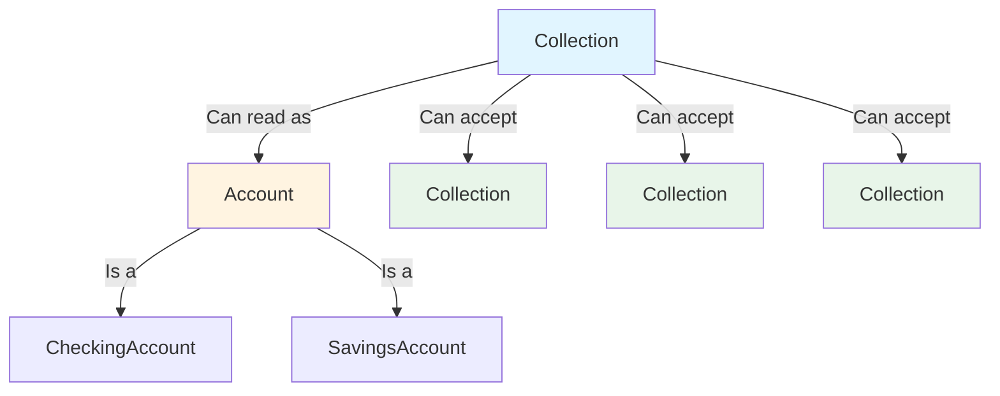
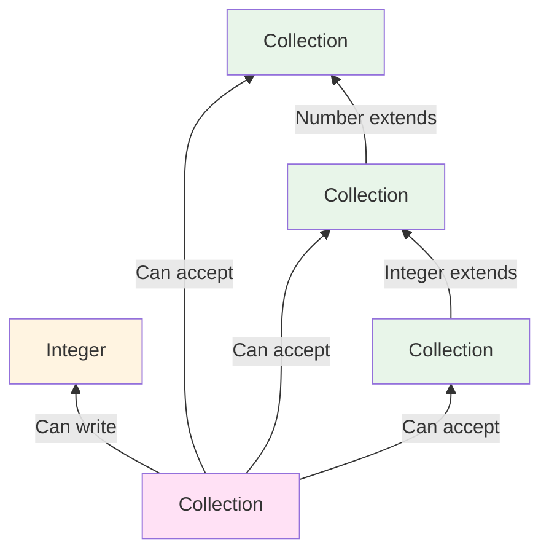
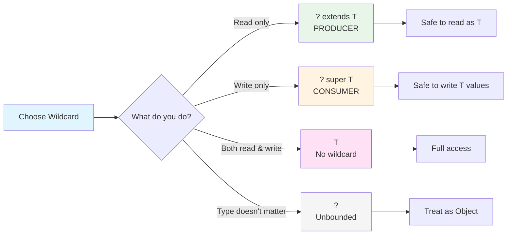
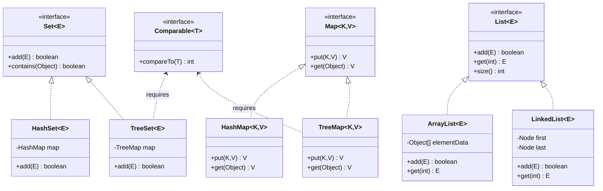
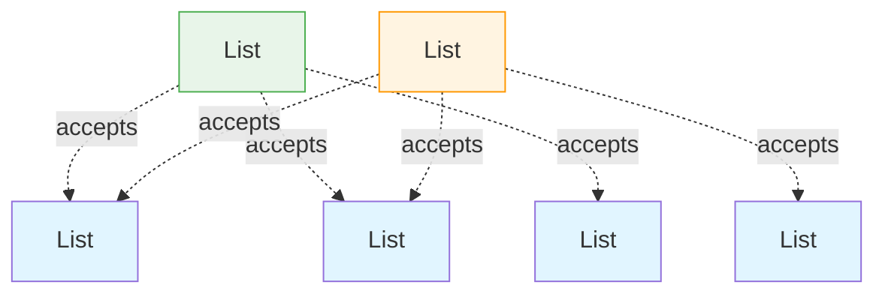
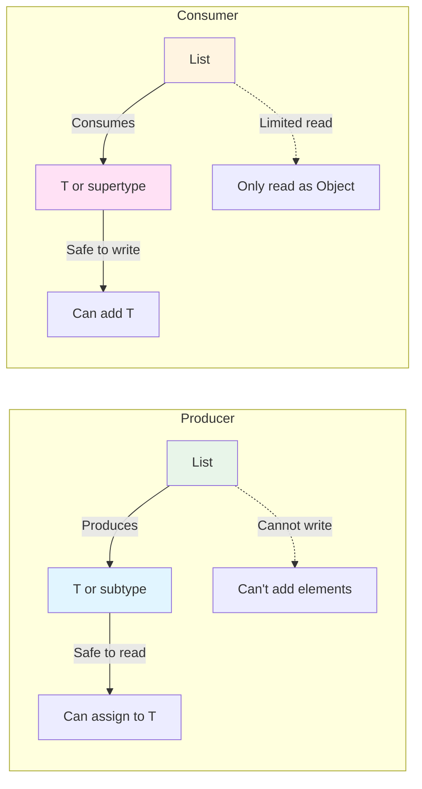
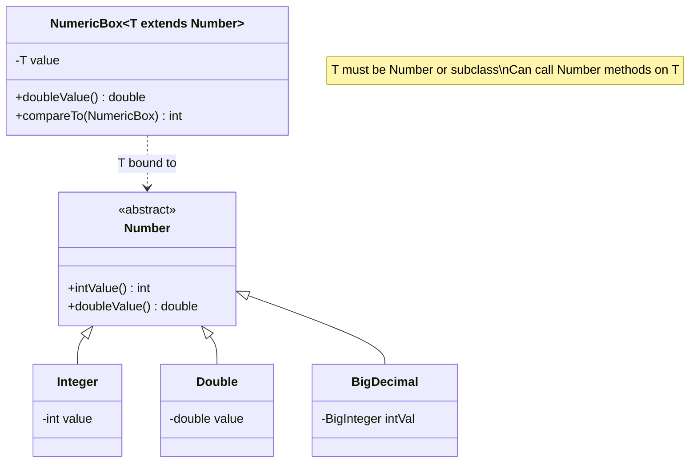
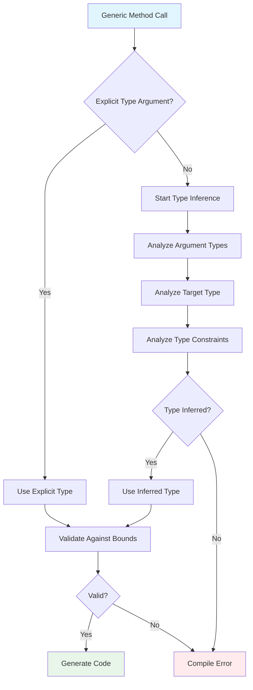

# Java Generics - Deep Dive Interview Preparation Guide

## Overview

Generics, introduced in Java 5 (2004), represent one of the most significant enhancements to the Java type system. They enable types (classes and interfaces) to be parameters when defining classes, interfaces, and methods, providing stronger type-checking at compile-time and eliminating the need for casting.

**Why Interviewers Focus on Generics:**
- Tests understanding of type safety and compile-time checking
- Reveals knowledge of Java's type system and type erasure
- Demonstrates ability to write reusable, type-safe code
- Separates mid-level from senior developers (PECS principle, bounded types)
- Critical for framework development and API design

**Real-World Relevance in Enterprise Banking:**
In financial systems, type safety is paramount. Generics enable:
- Type-safe collections for transactions, accounts, and portfolios
- Generic DAO/Repository patterns for different entity types
- Type-safe event processors in Kafka consumer implementations
- Generic API response wrappers with consistent structure
- Reusable validation frameworks that work across different domain objects

Without generics, enterprise codebases would be filled with unsafe casts, runtime ClassCastExceptions, and code duplication. Generics make banking applications more maintainable, safer, and easier to refactor.

---

## Foundational Concepts

### What Are Generics?

Generics allow you to write classes, interfaces, and methods that operate on types specified by the client code. Instead of writing separate implementations for `List<String>`, `List<Integer>`, etc., you write one generic `List<E>` that works with any type.

**Before Generics (Java 1.4 and earlier):**
```java
// Unsafe, requires casting, runtime errors possible
List list = new ArrayList();
list.add("Transaction");
list.add(Integer.valueOf(100)); // No compile error!

String transaction = (String) list.get(0); // Cast required
String amount = (String) list.get(1);      // ClassCastException at runtime!
```

**With Generics (Java 5+):**
```java
// Type-safe, no casting, compile-time checking
List<String> list = new ArrayList<>();
list.add("Transaction");
// list.add(Integer.valueOf(100)); // Compile error - type mismatch!

String transaction = list.get(0); // No cast needed
// Type safety guaranteed at compile-time
```

### Type Parameters and Naming Conventions

Type parameters are placeholders for types. Common conventions:
- `E` - Element (used extensively by the Java Collections Framework)
- `K` - Key (used in Map)
- `V` - Value (used in Map)
- `N` - Number
- `T` - Type
- `S`, `U`, `V` etc. - 2nd, 3rd, 4th types

```java
// Single type parameter
public class Box<T> {
    private T content;

    public void set(T content) { this.content = content; }
    public T get() { return content; }
}

// Multiple type parameters
public class Pair<K, V> {
    private K key;
    private V value;

    public Pair(K key, V value) {
        this.key = key;
        this.value = value;
    }
}

// Usage in banking context
Box<AccountNumber> accountBox = new Box<>();
Pair<TransactionId, Amount> txPair = new Pair<>(txId, amount);
```

### Common Misconceptions

**Misconception 1**: "Generics provide runtime type safety"
- **Reality**: Generics are a compile-time feature. Type information is erased at runtime (type erasure).

**Misconception 2**: "List&lt;Object&gt; is a supertype of List&lt;String&gt;"
- **Reality**: Generic types are invariant. List&lt;Object&gt; and List&lt;String&gt; have no subtype relationship.

**Misconception 3**: "You can create arrays of generic types"
- **Reality**: Generic array creation is prohibited: `new T[10]` won't compile.

**Misconception 4**: "Wildcards and type parameters are the same"
- **Reality**: Type parameters can be used in method bodies; wildcards cannot.

---

## Technical Deep Dive

### 1. Generic Classes and Interfaces

#### Generic Class Declaration

```java
/**
 * Generic repository pattern - commonly used in enterprise applications
 * Demonstrates: Single type parameter, type-safe operations
 */
public class GenericRepository<T> {
    private Map<Long, T> storage = new ConcurrentHashMap<>();
    private AtomicLong idGenerator = new AtomicLong();

    /**
     * Save entity and return generated ID
     * Type parameter T ensures only entities of the declared type can be saved
     */
    public Long save(T entity) {
        Long id = idGenerator.incrementAndGet();
        storage.put(id, entity);
        return id;
    }

    /**
     * Retrieve entity by ID
     * Return type is T, providing type safety without casting
     */
    public Optional<T> findById(Long id) {
        return Optional.ofNullable(storage.get(id));
    }

    /**
     * Find all entities
     * Returns Collection<T>, maintaining type safety
     */
    public Collection<T> findAll() {
        return new ArrayList<>(storage.values());
    }
}

// Usage in banking application
GenericRepository<Account> accountRepo = new GenericRepository<>();
Long id = accountRepo.save(new Account("123456789", 1000.00));
Optional<Account> account = accountRepo.findById(id);  // Returns Optional<Account>

GenericRepository<Transaction> txRepo = new GenericRepository<>();
txRepo.save(new Transaction("TXN001", 500.00));
// Type safety: Can't mix accounts and transactions
// accountRepo.save(new Transaction(...));  // Compile error!
```

#### Generic Interfaces

```java
/**
 * Generic interface for entity validation
 * Banking systems require extensive validation logic
 */
public interface Validator<T> {
    /**
     * Validate entity and return validation result
     */
    ValidationResult validate(T entity);

    /**
     * Check if entity is valid
     */
    default boolean isValid(T entity) {
        return validate(entity).isSuccess();
    }
}

/**
 * Implementation for Account validation
 * Type parameter is bound to Account
 */
public class AccountValidator implements Validator<Account> {

    @Override
    public ValidationResult validate(Account account) {
        ValidationResult result = new ValidationResult();

        // Account number validation
        if (account.getAccountNumber() == null ||
            account.getAccountNumber().length() != 9) {
            result.addError("Invalid account number format");
        }

        // Balance validation
        if (account.getBalance() < 0) {
            result.addError("Balance cannot be negative");
        }

        return result;
    }
}

// Usage
Validator<Account> validator = new AccountValidator();
Account account = new Account("12345678", -100.00);
if (!validator.isValid(account)) {
    // Handle validation failure
}
```

#### Multiple Type Parameters

```java
/**
 * Generic cache with key-value pairs
 * Demonstrates: Multiple type parameters, bounded operations
 */
public class Cache<K, V> {
    private final Map<K, CacheEntry<V>> cache = new ConcurrentHashMap<>();
    private final long ttlMillis;

    public Cache(long ttlMillis) {
        this.ttlMillis = ttlMillis;
    }

    /**
     * Put value with key
     * K and V are independent type parameters
     */
    public void put(K key, V value) {
        cache.put(key, new CacheEntry<>(value, System.currentTimeMillis()));
    }

    /**
     * Get value by key with expiration check
     */
    public Optional<V> get(K key) {
        CacheEntry<V> entry = cache.get(key);
        if (entry == null) {
            return Optional.empty();
        }

        if (System.currentTimeMillis() - entry.timestamp > ttlMillis) {
            cache.remove(key);
            return Optional.empty();
        }

        return Optional.of(entry.value);
    }

    private static class CacheEntry<V> {
        final V value;
        final long timestamp;

        CacheEntry(V value, long timestamp) {
            this.value = value;
            this.timestamp = timestamp;
        }
    }
}

// Usage in banking - caching exchange rates
Cache<CurrencyPair, ExchangeRate> rateCache = new Cache<>(60_000); // 1 minute TTL
rateCache.put(new CurrencyPair("USD", "EUR"), new ExchangeRate(0.85));
Optional<ExchangeRate> rate = rateCache.get(new CurrencyPair("USD", "EUR"));
```

### 2. Generic Methods

Generic methods introduce their own type parameters, independent of the class type parameters.

```java
/**
 * Utility class with generic methods
 * Demonstrates: Generic static methods, type inference
 */
public class CollectionUtils {

    /**
     * Generic method to filter collection based on predicate
     * Type parameter <T> is declared before return type
     *
     * @param <T> the type of elements in the collection
     * @param collection the collection to filter
     * @param predicate the filter condition
     * @return filtered list
     */
    public static <T> List<T> filter(Collection<T> collection, Predicate<T> predicate) {
        return collection.stream()
                         .filter(predicate)
                         .collect(Collectors.toList());
    }

    /**
     * Generic method to transform collection
     * Demonstrates: Two type parameters in method signature
     *
     * @param <T> input type
     * @param <R> result type
     */
    public static <T, R> List<R> transform(Collection<T> collection, Function<T, R> mapper) {
        return collection.stream()
                         .map(mapper)
                         .collect(Collectors.toList());
    }

    /**
     * Generic method to find first matching element
     */
    public static <T> Optional<T> findFirst(Collection<T> collection, Predicate<T> predicate) {
        return collection.stream()
                         .filter(predicate)
                         .findFirst();
    }
}

// Usage in banking application
List<Transaction> transactions = getTransactions();

// Type inference: compiler infers T = Transaction
List<Transaction> largeTransactions = CollectionUtils.filter(
    transactions,
    tx -> tx.getAmount() > 10000.00
);

// Type inference: T = Transaction, R = String
List<String> transactionIds = CollectionUtils.transform(
    transactions,
    Transaction::getId
);

// Explicit type parameters (rarely needed)
List<String> ids = CollectionUtils.<Transaction, String>transform(
    transactions,
    Transaction::getId
);
```

#### Generic Constructors

```java
/**
 * Generic constructor in a non-generic class
 * Demonstrates: Constructor-level type parameters
 */
public class TransactionProcessor {

    /**
     * Generic constructor that accepts any collection type
     * Type parameter T is scoped to the constructor only
     */
    public <T extends Transaction> TransactionProcessor(Collection<T> transactions) {
        // Process different transaction subtypes
        for (T transaction : transactions) {
            process(transaction);
        }
    }

    private void process(Transaction transaction) {
        // Processing logic
    }
}

// Usage - works with different Transaction subtypes
List<WireTransfer> wires = getWireTransfers();
TransactionProcessor processor1 = new TransactionProcessor(wires);

List<ACHTransfer> ach = getACHTransfers();
TransactionProcessor processor2 = new TransactionProcessor(ach);
```

### 3. Bounded Type Parameters

Bounded type parameters restrict the types that can be used as type arguments.

#### Upper Bounds (extends)

```java
/**
 * Generic class with upper bound
 * T must be Number or a subclass of Number
 */
public class NumericBox<T extends Number> {
    private T value;

    public NumericBox(T value) {
        this.value = value;
    }

    /**
     * Because T extends Number, we can call Number methods
     */
    public double doubleValue() {
        return value.doubleValue();
    }

    public int compareTo(NumericBox<T> other) {
        return Double.compare(this.doubleValue(), other.doubleValue());
    }
}

// Valid instantiations
NumericBox<Integer> intBox = new NumericBox<>(42);
NumericBox<Double> doubleBox = new NumericBox<>(3.14);
NumericBox<BigDecimal> decimalBox = new NumericBox<>(new BigDecimal("1000.50"));

// Compile error: String is not a subtype of Number
// NumericBox<String> stringBox = new NumericBox<>("invalid");

/**
 * Banking example: Generic calculator for numeric values
 */
public class AmountCalculator<T extends Number> {

    /**
     * Calculate sum of amounts
     * Works with any Number subtype
     */
    public BigDecimal sum(List<T> amounts) {
        return amounts.stream()
                      .map(Number::doubleValue)
                      .map(BigDecimal::valueOf)
                      .reduce(BigDecimal.ZERO, BigDecimal::add);
    }

    /**
     * Find maximum amount
     */
    public Optional<T> max(List<T> amounts) {
        return amounts.stream()
                      .max(Comparator.comparingDouble(Number::doubleValue));
    }
}

// Usage
AmountCalculator<BigDecimal> calculator = new AmountCalculator<>();
List<BigDecimal> balances = Arrays.asList(
    new BigDecimal("1000.50"),
    new BigDecimal("2500.75"),
    new BigDecimal("500.00")
);
BigDecimal total = calculator.sum(balances);  // 4001.25
```

#### Multiple Bounds

A type parameter can have multiple bounds, separated by `&`. The first bound can be a class or interface, but all subsequent bounds must be interfaces.

```java
/**
 * Type parameter with multiple bounds
 * T must extend Account AND implement Comparable AND Serializable
 */
public class SortableRepository<T extends Account & Comparable<T> & Serializable> {
    private List<T> entities = new ArrayList<>();

    public void add(T entity) {
        entities.add(entity);
    }

    /**
     * Can call compareTo because T extends Comparable<T>
     */
    public List<T> getSorted() {
        List<T> sorted = new ArrayList<>(entities);
        Collections.sort(sorted);  // Uses Comparable.compareTo
        return sorted;
    }

    /**
     * Can serialize because T implements Serializable
     */
    public byte[] serialize(T entity) throws IOException {
        ByteArrayOutputStream baos = new ByteArrayOutputStream();
        ObjectOutputStream oos = new ObjectOutputStream(baos);
        oos.writeObject(entity);  // Safe because T is Serializable
        return baos.toByteArray();
    }
}

/**
 * Account implementation meeting all bounds
 */
public class CheckingAccount extends Account
                              implements Comparable<CheckingAccount>, Serializable {

    @Override
    public int compareTo(CheckingAccount other) {
        return this.getAccountNumber().compareTo(other.getAccountNumber());
    }
}

// Valid usage
SortableRepository<CheckingAccount> repo = new SortableRepository<>();
repo.add(new CheckingAccount("123456789", 1000.00));
List<CheckingAccount> sorted = repo.getSorted();
```

**Important Rules for Multiple Bounds:**
1. Class bound (if present) must come first
2. Interface bounds follow, separated by `&`
3. Only one class bound allowed, multiple interface bounds allowed

```java
// Valid
<T extends Account & Comparable<T> & Serializable>

// Invalid: interface before class
// <T extends Serializable & Account>

// Invalid: multiple class bounds
// <T extends Account & SavingsAccount>
```

#### Recursive Type Bounds

Recursive type bounds are commonly used with `Comparable`:

```java
/**
 * Recursive type bound pattern
 * T must be comparable to itself
 */
public class ComparableExample<T extends Comparable<T>> {

    /**
     * Find maximum element
     * Works because T can be compared to T
     */
    public static <T extends Comparable<T>> T max(Collection<T> collection) {
        if (collection.isEmpty()) {
            throw new IllegalArgumentException("Collection is empty");
        }

        T max = null;
        for (T element : collection) {
            if (max == null || element.compareTo(max) > 0) {
                max = element;
            }
        }
        return max;
    }
}

/**
 * Banking example: Transaction implements Comparable<Transaction>
 */
public class Transaction implements Comparable<Transaction> {
    private LocalDateTime timestamp;
    private BigDecimal amount;

    @Override
    public int compareTo(Transaction other) {
        return this.timestamp.compareTo(other.timestamp);
    }
}

// Usage
List<Transaction> transactions = getTransactions();
Transaction latest = ComparableExample.max(transactions);
```

### 4. Wildcards - The Heart of Flexible Generic Code

Wildcards (`?`) represent an unknown type and are used when you want to work with a family of types.

#### 4.1 Unbounded Wildcards (?)

Use `?` when you don't care about the actual type.

```java
/**
 * Print any list, regardless of type
 * Unbounded wildcard allows List of any type
 */
public static void printList(List<?> list) {
    for (Object element : list) {  // Can only treat elements as Object
        System.out.println(element);
    }
}

// Works with any List
printList(new ArrayList<String>());
printList(new ArrayList<Integer>());
printList(new ArrayList<Transaction>());

/**
 * Get size of any collection
 */
public static int getSize(Collection<?> collection) {
    return collection.size();  // Size doesn't depend on element type
}

/**
 * Check if collection is empty
 * Element type doesn't matter
 */
public static boolean isEmpty(Collection<?> collection) {
    return collection.isEmpty();
}
```

**When to Use Unbounded Wildcard:**
- When functionality depends only on Object methods
- When you're reading from the structure but type doesn't matter
- When you want to work with the "shape" of the generic, not the type

**Limitations:**
```java
public static void limitationsDemo(List<?> list) {
    // Cannot add elements (except null)
    // list.add("string");     // Compile error
    // list.add(new Object()); // Compile error
    list.add(null);  // Only null is allowed

    // Can only read as Object
    Object obj = list.get(0);  // OK

    // Can call methods that don't depend on type
    int size = list.size();          // OK
    boolean empty = list.isEmpty();  // OK
    list.clear();                    // OK
}
```

#### 4.2 Upper Bounded Wildcards (? extends T)

`? extends T` means "any type that is T or a subtype of T". Used when you want to **read** from a structure.

```java
/**
 * Calculate total balance from any collection of Accounts
 * ? extends Account means: Account or any subclass (CheckingAccount, SavingsAccount, etc.)
 */
public static BigDecimal calculateTotalBalance(Collection<? extends Account> accounts) {
    BigDecimal total = BigDecimal.ZERO;

    // Can read as Account (safe covariance)
    for (Account account : accounts) {
        total = total.add(account.getBalance());
    }

    return total;
    // Cannot add to accounts here (type safety)
    // accounts.add(new CheckingAccount(...));  // Compile error!
}

// Works with Account and all subtypes
List<Account> accounts = getAccounts();
List<CheckingAccount> checkingAccounts = getCheckingAccounts();
List<SavingsAccount> savingsAccounts = getSavingsAccounts();

BigDecimal total1 = calculateTotalBalance(accounts);
BigDecimal total2 = calculateTotalBalance(checkingAccounts);
BigDecimal total3 = calculateTotalBalance(savingsAccounts);
```



**Producer Extends - Reading Data:**

```java
/**
 * Copy elements from source to destination
 * Source uses ? extends T (read from source)
 */
public static <T> void copy(List<? extends T> source, List<T> destination) {
    for (T element : source) {  // Reading from source - safe
        destination.add(element);
    }
}

// Usage
List<Number> numbers = new ArrayList<>();
List<Integer> integers = Arrays.asList(1, 2, 3);

copy(integers, numbers);  // Integer extends Number, so this works
```

**Why Can't You Add to ? extends T?**

```java
public static void whyCantAdd(List<? extends Number> list) {
    // list could be List<Integer> or List<Double> or List<Number>
    // Compiler doesn't know which specific type

    // list.add(Integer.valueOf(42));  // What if list is List<Double>?
    // list.add(Double.valueOf(3.14)); // What if list is List<Integer>?
    // list.add(new Number() {...});   // Number is abstract!

    // Only null is safe (null is assignable to any reference type)
    list.add(null);
}
```

#### 4.3 Lower Bounded Wildcards (? super T)

`? super T` means "any type that is T or a supertype of T". Used when you want to **write** to a structure.

```java
/**
 * Add integers to any collection that can hold integers or supertypes
 * ? super Integer means: Integer, Number, or Object
 */
public static void addIntegers(List<? super Integer> list) {
    // Can add Integer (and its subtypes)
    list.add(Integer.valueOf(1));
    list.add(Integer.valueOf(2));
    list.add(Integer.valueOf(3));

    // Cannot add supertypes
    // list.add(new Number() {...});  // Compile error
    // list.add(new Object());        // Compile error

    // Reading gives Object (lowest common denominator)
    Object obj = list.get(0);  // Can only read as Object
}

// Works with Integer and supertypes
List<Integer> integers = new ArrayList<>();
List<Number> numbers = new ArrayList<>();
List<Object> objects = new ArrayList<>();

addIntegers(integers);  // OK
addIntegers(numbers);   // OK
addIntegers(objects);   // OK
```



**Consumer Super - Writing Data:**

```java
/**
 * Transfer amounts to any collection that can hold them
 * Destination uses ? super BigDecimal (write to destination)
 */
public static void transferAmounts(
        List<BigDecimal> source,
        List<? super BigDecimal> destination) {

    for (BigDecimal amount : source) {
        destination.add(amount);  // Writing to destination - safe
    }
}

// Usage
List<BigDecimal> amounts = getAmounts();
List<Number> numbers = new ArrayList<>();
List<Object> objects = new ArrayList<>();

transferAmounts(amounts, amounts);   // OK: BigDecimal super BigDecimal
transferAmounts(amounts, numbers);   // OK: Number super BigDecimal
transferAmounts(amounts, objects);   // OK: Object super BigDecimal
```

### 4.4 PECS Principle (Producer Extends, Consumer Super)

**The Golden Rule of Wildcards:**
- Use `? extends T` when you only **get** values (producer)
- Use `? super T` when you only **put** values (consumer)
- Don't use wildcards when you both get and put

```java
/**
 * PECS in action: Collections.copy method signature
 *
 * public static <T> void copy(
 *     List<? super T> dest,     // Consumer - writing to dest
 *     List<? extends T> src     // Producer - reading from src
 * )
 */

/**
 * Banking example: Transfer transactions between accounts
 */
public class TransactionService {

    /**
     * Transfer transactions from source account to destination
     *
     * @param source produces Transaction or subtypes (WireTransfer, ACHTransfer, etc.)
     * @param destination consumes Transaction or supertypes (Transaction, Object)
     */
    public static void transferTransactions(
            Collection<? extends Transaction> source,    // Producer extends
            Collection<? super Transaction> destination) {  // Consumer super

        for (Transaction tx : source) {  // Reading from producer
            destination.add(tx);          // Writing to consumer
        }
    }
}

// Usage examples
List<WireTransfer> wireTransfers = getWireTransfers();
List<ACHTransfer> achTransfers = getACHTransfers();
List<Transaction> allTransactions = new ArrayList<>();
List<Object> objects = new ArrayList<>();

// Flexibility from PECS:
transferTransactions(wireTransfers, allTransactions);  // Produces WireTransfer, consumes Transaction
transferTransactions(achTransfers, allTransactions);   // Produces ACHTransfer, consumes Transaction
transferTransactions(wireTransfers, objects);          // Produces WireTransfer, consumes Object
transferTransactions(allTransactions, allTransactions); // Produces Transaction, consumes Transaction
```

**Real-World PECS Example from Collections API:**

```java
/**
 * Analyzing Collections.addAll signature
 */
public interface Collection<E> {
    // Uses ? extends E because c is a producer (we read from it)
    boolean addAll(Collection<? extends E> c);
}

// Allows this flexibility:
List<Number> numbers = new ArrayList<>();
List<Integer> integers = Arrays.asList(1, 2, 3);
List<Double> doubles = Arrays.asList(1.1, 2.2, 3.3);

numbers.addAll(integers);  // OK: Integer extends Number
numbers.addAll(doubles);   // OK: Double extends Number

/**
 * Analyzing Collections.copy signature
 */
public class Collections {
    public static <T> void copy(
        List<? super T> dest,   // dest is consumer (we write to it)
        List<? extends T> src   // src is producer (we read from it)
    ) {
        for (T element : src) {
            dest.add(element);
        }
    }
}

// Flexibility:
List<Integer> integers = Arrays.asList(1, 2, 3);
List<Number> numbers = new ArrayList<>();
List<Object> objects = new ArrayList<>();

Collections.copy(numbers, integers);  // OK: dest=Number super Integer, src=Integer extends Integer
Collections.copy(objects, integers);  // OK: dest=Object super Integer, src=Integer extends Integer
```

**PECS Comparison Table:**

| Scenario | Wildcard | Reason | Example |
|----------|----------|--------|---------|
| Reading only | `? extends T` | Producer - you get T or subtypes | `calculateTotal(List<? extends Account>)` |
| Writing only | `? super T` | Consumer - you put T or supertypes | `addAll(Collection<? super Integer>)` |
| Reading and Writing | No wildcard (just `T`) | Need exact type | `swap(List<T>, int, int)` |
| Type doesn't matter | `?` | Unbounded | `printSize(List<?>)` |



### 5. Type Erasure - How Generics Actually Work

Type erasure is the process by which the Java compiler removes all generic type information after compilation, replacing type parameters with their bounds or Object.

#### 5.1 What Happens During Type Erasure

**Before Erasure (Source Code):**
```java
public class Box<T> {
    private T content;

    public void set(T content) {
        this.content = content;
    }

    public T get() {
        return content;
    }
}

Box<String> stringBox = new Box<>();
stringBox.set("Hello");
String value = stringBox.get();
```

**After Erasure (Bytecode):**
```java
public class Box {
    private Object content;  // T replaced with Object

    public void set(Object content) {
        this.content = content;
    }

    public Object get() {
        return content;
    }
}

Box stringBox = new Box();
stringBox.set("Hello");
String value = (String) stringBox.get();  // Compiler inserts cast
```

**With Bounded Type Parameters:**

```java
// Before erasure
public class BoundedBox<T extends Number> {
    private T content;

    public T get() {
        return content;
    }
}

// After erasure
public class BoundedBox {
    private Number content;  // T replaced with its bound (Number)

    public Number get() {
        return content;
    }
}
```

#### 5.2 Bridge Methods

Bridge methods are synthetic methods created by the compiler to preserve polymorphism after type erasure.

```java
/**
 * Generic interface
 */
public interface Processor<T> {
    void process(T item);
}

/**
 * Implementation with specific type
 */
public class StringProcessor implements Processor<String> {

    @Override
    public void process(String item) {
        System.out.println("Processing: " + item);
    }
}

// After type erasure, Processor becomes:
public interface Processor {
    void process(Object item);
}

// StringProcessor has:
public class StringProcessor implements Processor {

    // Your method
    public void process(String item) {
        System.out.println("Processing: " + item);
    }

    // Bridge method (compiler-generated)
    public void process(Object item) {
        process((String) item);  // Calls the String version
    }
}
```

**Why Bridge Methods Are Needed:**

Without bridge methods, this would break:
```java
Processor<String> processor = new StringProcessor();
processor.process("test");  // Which method to call?

// After erasure:
Processor processor = new StringProcessor();
processor.process("test");  // Needs to call process(Object) from interface
                            // Bridge method ensures it delegates to process(String)
```

#### 5.3 Reification vs. Erasure

- **Reified types**: Type information available at runtime (arrays in Java)
- **Erased types**: Type information removed at runtime (generics in Java)

```java
/**
 * Arrays are reified - type known at runtime
 */
String[] stringArray = new String[10];
Object[] objectArray = stringArray;
// objectArray[0] = Integer.valueOf(42);  // ArrayStoreException at RUNTIME

/**
 * Generics are erased - type NOT known at runtime
 */
List<String> stringList = new ArrayList<>();
// List<Object> objectList = stringList;  // Compile error
// Prevented at compile-time because runtime type is just ArrayList
```

#### 5.4 Limitations Due to Type Erasure

**1. Cannot Create Generic Arrays**

```java
// Cannot do this:
// T[] array = new T[10];  // Compile error
// List<String>[] arrays = new List<String>[10];  // Compile error

/**
 * Workaround: Use List or Array.newInstance
 */
public class GenericArray<T> {
    private Object[] array;

    public GenericArray(int size) {
        array = new Object[size];  // Must use Object[]
    }

    @SuppressWarnings("unchecked")
    public T get(int index) {
        return (T) array[index];  // Unchecked cast
    }

    public void set(int index, T value) {
        array[index] = value;
    }
}

/**
 * Type-safe alternative using Class<T>
 */
public class TypedArray<T> {
    private T[] array;

    @SuppressWarnings("unchecked")
    public TypedArray(Class<T> type, int size) {
        // Use Array.newInstance for type-safe array creation
        array = (T[]) Array.newInstance(type, size);
    }

    public T get(int index) {
        return array[index];
    }

    public void set(int index, T value) {
        array[index] = value;
    }
}

// Usage
TypedArray<String> strings = new TypedArray<>(String.class, 10);
```

**Why Generic Arrays Are Prohibited:**

```java
// If this were allowed:
List<String>[] stringLists = new List<String>[10];  // Hypothetical

// After erasure, it would be:
List[] stringLists = new List[10];

// Then this would compile:
Object[] objects = stringLists;  // Array covariance
objects[0] = Arrays.asList(42);  // Puts List<Integer> in List<String>[]

// This would fail at runtime:
String s = stringLists[0].get(0);  // ClassCastException!

// Java prevents this by disallowing generic array creation
```

**2. Cannot Use instanceof with Parameterized Types**

```java
public static <T> void checkType(Object obj) {
    // if (obj instanceof List<String>) { }  // Compile error

    // Can only check raw type
    if (obj instanceof List) {  // OK
        List<?> list = (List<?>) obj;  // Unchecked cast warning
    }

    // Cannot check type parameter
    // if (obj instanceof T) { }  // Compile error
}
```

**3. Cannot Create Instances of Type Parameters**

```java
public class Factory<T> {
    public T create() {
        // return new T();  // Compile error - T is erased to Object
        return null;  // Must use other mechanisms
    }
}

/**
 * Workaround: Pass Class<T> or Supplier<T>
 */
public class TypedFactory<T> {
    private final Supplier<T> constructor;

    public TypedFactory(Supplier<T> constructor) {
        this.constructor = constructor;
    }

    public T create() {
        return constructor.get();
    }
}

// Usage
TypedFactory<Account> factory = new TypedFactory<>(Account::new);
Account account = factory.create();

/**
 * Using Class<T> with reflection
 */
public class ReflectiveFactory<T> {
    private final Class<T> type;

    public ReflectiveFactory(Class<T> type) {
        this.type = type;
    }

    public T create() throws Exception {
        return type.getDeclaredConstructor().newInstance();
    }
}
```

**4. Cannot Have Static Fields of Type Parameter**

```java
public class GenericClass<T> {
    // private static T instance;  // Compile error

    // Static field is shared across all generic instantiations
    // What would be the type? String for GenericClass<String>?
    // Integer for GenericClass<Integer>? Impossible!

    private static Object instance;  // OK - not parameterized
}
```

**5. Cannot Catch or Throw Generic Exceptions**

```java
// Cannot extend Throwable with type parameter
// public class GenericException<T> extends Exception { }  // Compile error

public static <T extends Exception> void method() throws T {  // OK in signature
    try {
        // Some operation
    } catch (T e) {  // Compile error - cannot catch type parameter
        // ...
    }
}
```

### 6. Advanced Generics Concepts

#### 6.1 Type Inference and Diamond Operator

**Type Inference (Java 7+):**

```java
// Before Java 7
Map<String, List<Transaction>> map = new HashMap<String, List<Transaction>>();

// Java 7+ with diamond operator <>
Map<String, List<Transaction>> map = new HashMap<>();  // Type inferred

// Java 8+ with method references and lambdas
List<String> ids = transactions.stream()
                               .map(Transaction::getId)  // Type inferred
                               .collect(Collectors.toList());
```

**Generic Method Type Inference:**

```java
public static <T> List<T> asList(T... elements) {
    return Arrays.asList(elements);
}

// Type inference from arguments
List<String> strings = asList("a", "b", "c");  // T inferred as String
List<Integer> integers = asList(1, 2, 3);      // T inferred as Integer

// Explicit type parameter (rarely needed)
List<String> explicit = GenericUtils.<String>asList("a", "b");
```

**Target Type Inference (Java 8+):**

```java
// Return type helps inference
public List<String> getIds() {
    return Collections.emptyList();  // Inferred as List<String>
}

// Lambda parameter types inferred from context
Comparator<Transaction> comparator = (tx1, tx2) ->
    tx1.getAmount().compareTo(tx2.getAmount());  // tx1 and tx2 inferred as Transaction
```

#### 6.2 Wildcard Capture

The compiler "captures" a wildcard to work with it as a specific type.

```java
/**
 * Swap doesn't work with wildcards directly
 */
public static void swap(List<?> list, int i, int j) {
    // Object temp = list.get(i);
    // list.set(i, list.get(j));  // Compile error: can't add to List<?>
    // list.set(j, temp);

    // Solution: delegate to helper with captured type
    swapHelper(list, i, j);
}

/**
 * Helper method captures the wildcard
 * Compiler creates a fresh type parameter for the unknown type
 */
private static <T> void swapHelper(List<T> list, int i, int j) {
    T temp = list.get(i);    // Now works because T is a concrete type parameter
    list.set(i, list.get(j));
    list.set(j, temp);
}

// Usage
List<String> strings = new ArrayList<>(Arrays.asList("a", "b", "c"));
swap(strings, 0, 2);  // Wildcard captured as String in helper
```

#### 6.3 Heterogeneous Containers

Type-safe heterogeneous container pattern allows storing different types in the same container.

```java
/**
 * Type-safe heterogeneous container
 * From Effective Java, Item 33
 */
public class TypeSafeMap {
    private Map<Class<?>, Object> map = new HashMap<>();

    /**
     * Put value with type safety
     * Class object serves as type token
     */
    public <T> void put(Class<T> type, T instance) {
        map.put(type, type.cast(instance));  // Runtime type safety
    }

    /**
     * Get value with type safety
     * Return type matches the Class parameter
     */
    public <T> T get(Class<T> type) {
        return type.cast(map.get(type));
    }
}

// Usage in banking application - storing different config types
TypeSafeMap config = new TypeSafeMap();

config.put(String.class, "connection-string");
config.put(Integer.class, 5000);
config.put(BigDecimal.class, new BigDecimal("0.05"));

String connectionString = config.get(String.class);  // Type-safe, no cast needed
Integer timeout = config.get(Integer.class);
BigDecimal interestRate = config.get(BigDecimal.class);

// Compile error if types don't match:
// String wrong = config.get(Integer.class);  // Type mismatch
```

**Real-World Enterprise Example:**

```java
/**
 * Configuration service with type-safe property access
 */
public class ConfigurationService {
    private final TypeSafeMap properties = new TypeSafeMap();

    /**
     * Register property with type
     */
    public <T> void registerProperty(String key, Class<T> type, T defaultValue) {
        properties.put(type, defaultValue);
    }

    /**
     * Get property with type safety
     */
    public <T> T getProperty(String key, Class<T> type) {
        T value = properties.get(type);
        if (value == null) {
            throw new IllegalArgumentException("Property not found: " + key);
        }
        return value;
    }
}

// Usage
ConfigurationService config = new ConfigurationService();
config.registerProperty("db.timeout", Integer.class, 30000);
config.registerProperty("db.url", String.class, "jdbc:postgresql://localhost:5432/bank");
config.registerProperty("interest.rate", BigDecimal.class, new BigDecimal("0.025"));

// Type-safe retrieval
Integer timeout = config.getProperty("db.timeout", Integer.class);
String url = config.getProperty("db.url", String.class);
BigDecimal rate = config.getProperty("interest.rate", BigDecimal.class);
```

---

## Visual Representations

### Generic Type Hierarchy



### Wildcard Variance Relationships



### PECS Principle Visualization



### Type Erasure Process

```mermaid
sequenceDiagram
    participant SC as Source Code
    participant C as Compiler
    participant BC as Bytecode
    participant JVM as JVM Runtime

    SC->>C: class Box<T> { T value; }
    C->>C: Replace T with Object
    C->>C: Insert casts where needed
    C->>C: Generate bridge methods
    C->>BC: class Box { Object value; }
    BC->>JVM: Load class (no generic info)
    JVM->>JVM: Execute with casts

    Note over C,BC: Type parameters erased
    Note over JVM: Only raw types at runtime
```

### Bounded Type Parameters Relationships



### Generic Method Type Inference Flow



---

## Interview Questions & Model Answers

### Foundational Level

**Q1: What are generics in Java and why were they introduced?**

**Answer:**
Generics were introduced in Java 5 to provide compile-time type safety and eliminate the need for explicit casting. Before generics, collections could hold any object type, leading to runtime ClassCastException errors.

**Key points to mention:**
- Type safety at compile-time
- Elimination of casting
- Enable generic algorithms
- Better code readability and maintainability

**Example to discuss:**
```java
// Before generics - unsafe
List list = new ArrayList();
list.add("String");
Integer i = (Integer) list.get(0); // ClassCastException at runtime!

// With generics - safe
List<String> list = new ArrayList<>();
list.add("String");
String s = list.get(0); // No cast needed, compile-time safety
```

**Follow-up questions interviewers might ask:**
- "What happens to generic type information at runtime?" → Type erasure
- "Can you have a List<int>?" → No, only reference types, use List<Integer>

---

**Q2: What is the difference between List<Object> and List<?>?**

**Answer:**
```java
List<Object> objectList = new ArrayList<Object>();
objectList.add("String");  // OK
objectList.add(42);        // OK

List<?> wildcardList = new ArrayList<String>();
// wildcardList.add("String");  // Compile error!
wildcardList.add(null);         // Only null allowed
```

**Key differences:**
- `List<Object>` is a list specifically of Object type
- `List<?>` is a list of unknown type
- You can add any Object to List<Object>
- You cannot add anything (except null) to List<?>
- List<?> can refer to List<String>, List<Integer>, etc.
- List<Object> cannot refer to List<String> (generics are invariant)

**When to use:**
- Use List<Object> when you specifically want to work with Objects
- Use List<?> when you want to accept a list of any type but don't need to modify it

---

**Q3: Explain the difference between <T extends Comparable<T>> and <T> implements Comparable<T>**

**Answer:**
This is about bounded type parameters vs. interface implementation:

```java
// Bounded type parameter - used in generic method/class definition
public static <T extends Comparable<T>> T max(List<T> list) {
    // T must be a type that implements Comparable<T>
    // This is a constraint on the type parameter
}

// Interface implementation - used in class definition
public class Account implements Comparable<Account> {
    // This class implements the Comparable interface
    @Override
    public int compareTo(Account other) { ... }
}
```

**Key distinction:**
- `<T extends Comparable<T>>` is a generic constraint
- `implements Comparable<T>` is an interface implementation
- The first is used when defining generic code
- The second is used when creating a comparable class

---

### Intermediate Level

**Q4: Explain the PECS principle with examples.**

**Answer:**
PECS stands for "Producer Extends, Consumer Super" - a guideline for using wildcards in generic APIs.

**Producer Extends (? extends T):**
When you read from a structure (it produces values for you):
```java
// Source produces values - use extends
public static void processAccounts(List<? extends Account> accounts) {
    for (Account account : accounts) {  // Reading - safe
        process(account);
    }
    // accounts.add(new Account(...));  // Can't write - compile error
}

// Works with Account and all subtypes
List<CheckingAccount> checking = getCheckingAccounts();
processAccounts(checking);  // OK - CheckingAccount extends Account
```

**Consumer Super (? super T):**
When you write to a structure (it consumes values from you):
```java
// Destination consumes values - use super
public static void addTransactions(List<? super Transaction> destination) {
    destination.add(new Transaction(...));  // Writing - safe
    // Transaction tx = destination.get(0);  // Can only read as Object
}

// Works with Transaction and all supertypes
List<Object> objects = new ArrayList<>();
addTransactions(objects);  // OK - Object is supertype of Transaction
```

**Real example from Collections API:**
```java
public static <T> void copy(
    List<? super T> dest,    // Consumer - we write to it
    List<? extends T> src)   // Producer - we read from it
```

---

**Q5: Why can't you create a generic array in Java?**

**Answer:**
Generic array creation is prohibited due to type erasure and array covariance, which together would break type safety.

**The problem:**
```java
// If this were allowed (it's not):
List<String>[] stringLists = new List<String>[10];

// After erasure:
List[] stringLists = new List[10];

// Array covariance allows this:
Object[] objects = stringLists;

// Now we can put wrong type:
objects[0] = Arrays.asList(42);  // List<Integer> in List<String>[]

// This would fail:
String s = stringLists[0].get(0);  // ClassCastException!
```

**Why arrays are different:**
- Arrays are reified (type known at runtime)
- Generics are erased (type removed at runtime)
- Arrays are covariant (String[] is a subtype of Object[])
- Generics are invariant (List<String> is NOT a subtype of List<Object>)

**Workarounds:**
```java
// Use List instead
List<List<String>> listOfLists = new ArrayList<>();

// Use Object[] and cast
Object[] array = new Object[10];
@SuppressWarnings("unchecked")
List<String>[] lists = (List<String>[]) array;

// Use Array.newInstance with Class<T>
@SuppressWarnings("unchecked")
T[] array = (T[]) Array.newInstance(type, size);
```

---

**Q6: What are bridge methods and why are they needed?**

**Answer:**
Bridge methods are synthetic methods generated by the compiler to preserve polymorphism after type erasure.

**Example:**
```java
public interface Processor<T> {
    void process(T item);
}

public class StringProcessor implements Processor<String> {
    @Override
    public void process(String item) {
        System.out.println(item);
    }
}
```

**After type erasure:**
```java
// Interface becomes:
public interface Processor {
    void process(Object item);  // T erased to Object
}

// Class needs both methods:
public class StringProcessor implements Processor {
    // Your method
    public void process(String item) { ... }

    // Bridge method (compiler-generated)
    public void process(Object item) {
        process((String) item);  // Delegates to your method
    }
}
```

**Why needed:**
Without the bridge method, calling `processor.process(obj)` on a `Processor` reference wouldn't find the String version, breaking polymorphism.

**How to detect:**
```java
for (Method method : StringProcessor.class.getDeclaredMethods()) {
    System.out.println(method.getName() + " bridge=" + method.isBridge());
}
// Output:
// process bridge=false
// process bridge=true
```

---

### Advanced Level

**Q7: Explain wildcard capture and provide an example where it's necessary.**

**Answer:**
Wildcard capture is when the compiler "captures" an unknown wildcard type and treats it as a specific type variable within a limited scope.

**The problem:**
```java
public static void swap(List<?> list, int i, int j) {
    Object temp = list.get(i);
    // list.set(i, list.get(j));  // ERROR: can't add to List<?>
}
```

**The solution using wildcard capture:**
```java
public static void swap(List<?> list, int i, int j) {
    swapHelper(list, i, j);  // Capture the wildcard here
}

// Compiler captures the wildcard as a fresh type parameter T
private static <T> void swapHelper(List<T> list, int i, int j) {
    T temp = list.get(i);     // Now works!
    list.set(i, list.get(j));
    list.set(j, temp);
}
```

**What happens:**
When `swap(List<String> list, ...)` is called:
1. Compiler captures `?` as some unknown type `CAP#1`
2. `swapHelper` is invoked with type parameter `T = CAP#1`
3. Inside helper, `T` is concrete enough to allow get and set operations

**Real-world usage in Collections:**
```java
public static void reverse(List<?> list) {
    reverseHelper(list);
}

private static <T> void reverseHelper(List<T> list) {
    int size = list.size();
    for (int i = 0; i < size / 2; i++) {
        T temp = list.get(i);
        list.set(i, list.get(size - i - 1));
        list.set(size - i - 1, temp);
    }
}
```

---

**Q8: Can you have a generic singleton? How would you implement it?**

**Answer:**
Yes, you can create a generic singleton using a type-safe heterogeneous container pattern or parameterized factory method.

**Approach 1: Generic Factory Method**
```java
public class GenericSingleton {
    // One instance map for all types
    private static final Map<Class<?>, Object> instances = new ConcurrentHashMap<>();

    @SuppressWarnings("unchecked")
    public static <T> T getInstance(Class<T> type, Supplier<T> creator) {
        return (T) instances.computeIfAbsent(type, k -> creator.get());
    }
}

// Usage
Account account1 = GenericSingleton.getInstance(Account.class, Account::new);
Account account2 = GenericSingleton.getInstance(Account.class, Account::new);
// account1 == account2 (same instance)

Transaction tx1 = GenericSingleton.getInstance(Transaction.class, Transaction::new);
// tx1 is different from account instances
```

**Approach 2: Enum-based Generic Singleton (preferred)**
```java
public enum GenericSingleton {
    INSTANCE;

    private final Map<Class<?>, Object> map = new ConcurrentHashMap<>();

    @SuppressWarnings("unchecked")
    public <T> T get(Class<T> type, Supplier<T> creator) {
        return (T) map.computeIfAbsent(type, k -> creator.get());
    }
}

// Usage
Configuration config = GenericSingleton.INSTANCE.get(
    Configuration.class,
    Configuration::new
);
```

**Why this works:**
- Each `Class<T>` object serves as a type token
- The map stores different types safely
- Type safety is maintained through the `Class<T>` parameter
- Thread-safe using ConcurrentHashMap

---

**Q9: Explain type erasure and its implications. Why was it implemented this way?**

**Answer:**

**What is Type Erasure:**
Type erasure is the process where the compiler removes all generic type information after compilation, replacing type parameters with their bounds (or Object if unbounded).

```java
// Source code
public class Box<T extends Number> {
    private T value;
    public T get() { return value; }
}

// After erasure (bytecode)
public class Box {
    private Number value;  // T replaced with bound
    public Number get() { return value; }
}
```

**Why was it done this way:**
1. **Backward compatibility**: Java 5 generics had to work with pre-Java 5 code
2. **No JVM changes**: Generics implemented purely by compiler, no JVM modifications needed
3. **Migration path**: Existing code using raw types could interoperate with generic code

**Implications:**

**1. No runtime type information:**
```java
List<String> strings = new ArrayList<>();
List<Integer> integers = new ArrayList<>();
// At runtime, both are just ArrayList - can't distinguish
strings.getClass() == integers.getClass();  // true!
```

**2. Cannot use instanceof with parameterized types:**
```java
if (obj instanceof List<String>) { }  // Compile error
if (obj instanceof List<?>) { }       // OK
if (obj instanceof List) { }          // OK (raw type)
```

**3. Cannot create generic arrays:**
```java
T[] array = new T[10];  // Compile error
List<String>[] arrays = new List<String>[10];  // Compile error
```

**4. Cannot create instances of type parameters:**
```java
T instance = new T();  // Compile error - T erased to Object/bound
```

**5. Bridge methods needed:**
```java
class StringList implements List<String> {
    public String get(int index) { ... }  // Your method
    public Object get(int index) { ... }  // Bridge method (synthetic)
}
```

**6. Heap pollution possible:**
```java
@SafeVarargs
public static <T> void dangerous(T... elements) {
    Object[] array = elements;  // T[] erased to Object[]
    array[0] = "Wrong type";    // Compiles but dangerous
}
```

**Alternative approaches in other languages:**
- **C# generics**: Reified at runtime (different bytecode for each type)
- **C++ templates**: Code generation for each instantiation
- **Scala**: Builds on Java's erasure but adds type tags where needed

---

**Q10: What is the difference between <T> and <T extends Object>? What about <T> and <?>?**

**Answer:**

**<T> vs <T extends Object>:**
These are effectively the same:
```java
public <T> void method1(List<T> list) { }
public <T extends Object> void method2(List<T> list) { }

// Both T is bounded by Object by default
// After erasure, both become Object
```

**However, explicit `extends Object` can clarify intent:**
```java
// Shows you want to call Object methods
public <T extends Object> void printHashCodes(List<T> list) {
    for (T element : list) {
        System.out.println(element.hashCode());  // Clearly an Object method
    }
}
```

**<T> vs <?>:**
This is more significant:

**Type Parameter <T>:**
- Can use T in method body
- Can call methods with T as parameter
- Can have return type of T
- Can have multiple occurrences related to same type

```java
public static <T> void copy(List<T> dest, List<T> src) {
    // T appears multiple times - must be same type
    for (T element : src) {
        dest.add(element);  // Can use T
    }
}
```

**Wildcard <?>:**
- Cannot use ? in method body
- Cannot call methods that require the type
- Can only read as Object
- Each ? is independent

```java
public static void print(List<?> list) {
    for (Object element : list) {  // Can only treat as Object
        System.out.println(element);
    }
    // Cannot add anything except null
}

// These are DIFFERENT types:
void method(List<?> list1, List<?> list2) {
    // list1 and list2 can be different types
}
```

**When to use which:**

| Scenario | Use | Example |
|----------|-----|---------|
| Multiple related occurrences | `<T>` | `void copy(List<T> dest, List<T> src)` |
| Return generic type | `<T>` | `<T> T getFirst(List<T> list)` |
| Use type in method body | `<T>` | `<T> void process(T element)` |
| Type doesn't matter | `<?>` | `int size(List<?> list)` |
| Independent types | `<?>` | `void merge(List<?> a, List<?> b)` |

---

### Tricky / Gotcha Questions

**Q11: What's wrong with this code and how would you fix it?**

```java
public static <T> T[] toArray(Collection<T> collection) {
    T[] array = new T[collection.size()];  // What's wrong?
    int i = 0;
    for (T element : collection) {
        array[i++] = element;
    }
    return array;
}
```

**Answer:**
The problem is you cannot create a generic array with `new T[size]` due to type erasure.

**Why it doesn't work:**
```java
// After erasure, T becomes Object:
Object[] array = new Object[collection.size()];

// But you're returning T[]
return (T[]) array;  // This is a dangerous cast

// Later:
String[] strings = toArray(stringList);
// strings is actually Object[] at runtime
// strings[0] = "test";  // ArrayStoreException!
```

**Solutions:**

**Solution 1: Pass Class<T> and use Array.newInstance:**
```java
@SuppressWarnings("unchecked")
public static <T> T[] toArray(Collection<T> collection, Class<T> type) {
    T[] array = (T[]) Array.newInstance(type, collection.size());
    int i = 0;
    for (T element : collection) {
        array[i++] = element;
    }
    return array;
}

// Usage
String[] strings = toArray(stringList, String.class);
```

**Solution 2: Pass an array (like Collections does):**
```java
@SuppressWarnings("unchecked")
public static <T> T[] toArray(Collection<T> collection, T[] array) {
    if (array.length < collection.size()) {
        array = (T[]) Array.newInstance(
            array.getClass().getComponentType(),
            collection.size()
        );
    }
    int i = 0;
    for (T element : collection) {
        array[i++] = element;
    }
    return array;
}

// Usage (similar to List.toArray)
String[] strings = toArray(stringList, new String[0]);
```

**Solution 3: Return List instead:**
```java
public static <T> List<T> toList(Collection<T> collection) {
    return new ArrayList<>(collection);
}
```

---

**Q12: Is this code valid? If so, what happens? If not, why not?**

```java
List<String> strings = new ArrayList<>();
List<Object> objects = strings;  // Valid?
```

**Answer:**
**Not valid** - this will not compile. Generics are **invariant**.

**Why it's not allowed:**
```java
// If it were allowed:
List<String> strings = new ArrayList<>();
List<Object> objects = strings;  // Hypothetically allowed

// Then you could do:
objects.add(42);  // Adding Integer to List<Object>
objects.add(new Date());  // Adding Date to List<Object>

// But strings is actually List<String>:
String s = strings.get(0);  // ClassCastException - it's an Integer!
```

**This is different from arrays (which are covariant):**
```java
String[] stringArray = new String[10];
Object[] objectArray = stringArray;  // Legal! (array covariance)

objectArray[0] = "string";  // OK
objectArray[1] = 42;        // ArrayStoreException at RUNTIME

// Arrays check type at runtime
// Generics check type at compile-time (then erase)
```

**How to make it work:**

**Option 1: Use wildcard:**
```java
List<String> strings = new ArrayList<>();
List<? extends Object> objects = strings;  // OK with wildcard
// But now you can't add to objects (except null)
```

**Option 2: Copy to new list:**
```java
List<String> strings = Arrays.asList("a", "b", "c");
List<Object> objects = new ArrayList<>(strings);  // Copy
// Now they're independent
```

---

**Q13: What's the output of this code?**

```java
public class GenericTest {
    public static void main(String[] args) {
        List<Integer> ints = new ArrayList<>();
        ints.add(1);
        ints.add(2);

        List<Number> nums = new ArrayList<>();
        nums.add(3);
        nums.add(4.0);

        swap(ints, nums);

        System.out.println(ints);
        System.out.println(nums);
    }

    public static void swap(List<?> list1, List<?> list2) {
        Object temp = list1.get(0);
        list1.set(0, list2.get(0));
        list2.set(0, temp);
    }
}
```

**Answer:**
**This code will not compile!**

**Why:**
```java
public static void swap(List<?> list1, List<?> list2) {
    Object temp = list1.get(0);        // OK - reading
    list1.set(0, list2.get(0));        // COMPILE ERROR!
    //          ^^^^^^^^^^^^^^
    //          Returns Object, but List<?> won't accept Object
    list2.set(0, temp);                // COMPILE ERROR!
    //          ^^^^
    //          Can't add anything to List<?> except null
}
```

**Why it doesn't work:**
- `List<?>` can read as `Object`
- But `List<?>` cannot accept `Object` for writing
- You can't add anything to `List<?>` (except `null`)

**How to fix - use wildcard capture:**
```java
public static void swap(List<?> list1, List<?> list2) {
    swapHelper(list1, list2);
}

private static <T> void swapHelper(List<T> list1, List<T> list2) {
    T temp = list1.get(0);
    list1.set(0, list2.get(0));
    list2.set(0, temp);
}

// Output:
// [3, 2]
// [1, 4.0]
```

**But wait - there's still a problem!**
Even with the fix, there's a subtle issue:
```java
private static <T> void swapHelper(List<T> list1, List<T> list2) {
    // This requires list1 and list2 to be the same type T
}

// But:
swap(ints, nums);  // List<Integer> and List<Number> - different types!
```

This actually won't compile either! The correct signature should be:
```java
private static <T, S> void swapHelper(List<T> list1, List<S> list2) {
    // But then you can't do: list1.set(0, list2.get(0))
    // because S might not be assignable to T
}
```

**The real lesson:** This swap operation is fundamentally type-unsafe for lists of different types, which is why the compiler prevents it!

---

**Q14: Explain the difference between these two methods:**

```java
public static <T> void method1(List<T> list) { }
public static void method2(List<?> list) { }
```

**Answer:**

Both methods accept a list of any type, but they differ in what you can do inside:

**Method 1: `<T>` creates a type parameter**
```java
public static <T> void method1(List<T> list) {
    // Can use T in the method
    T first = list.get(0);     // OK - typed as T
    list.add(first);            // OK - can add T

    // Can call other methods with T
    T result = processElement(first);
    list.add(result);
}

private static <T> T processElement(T element) {
    return element;
}

// Multiple parameters can share the same T
public static <T> void copy(List<T> dest, List<T> src) {
    // Both lists must be the same type
}
```

**Method 2: `<?>` is a wildcard**
```java
public static void method2(List<?> list) {
    // Can only read as Object
    Object first = list.get(0);  // OK - but only as Object

    // Cannot add anything except null
    // list.add(first);  // COMPILE ERROR
    list.add(null);      // Only null works

    // Can call methods that don't need the type
    int size = list.size();
    boolean empty = list.isEmpty();
    list.clear();
}

// Multiple parameters are independent
public static void method3(List<?> list1, List<?> list2) {
    // list1 and list2 can be different types
}
```

**When to use which:**

| Requirement | Use |
|-------------|-----|
| Need to know the type | `<T>` |
| Return the generic type | `<T>` |
| Add elements to collection | `<T>` |
| Multiple parameters same type | `<T>` |
| Only reading, type doesn't matter | `<?>` |
| Independent type parameters | `<?>` |

**Example demonstrating the difference:**
```java
// This works - uses T
public static <T> T getFirst(List<T> list) {
    return list.isEmpty() ? null : list.get(0);
}

// This doesn't work - can't return ?
// public static ? getFirst(List<?> list) { ... }  // INVALID

// Wildcard alternative returns Object
public static Object getFirst(List<?> list) {
    return list.isEmpty() ? null : list.get(0);
}
```

---

**Q15: What happens when you try to use a generic type with varargs?**

```java
public static <T> List<T> asList(T... elements) {
    return Arrays.asList(elements);
}
```

**Answer:**
This causes a **heap pollution warning** because generic varargs create a generic array internally.

**The problem:**
```java
// Varargs T... is actually T[]
public static <T> List<T> asList(T... elements) {
    // elements is T[]
    // But you can't create T[] directly!
    // The compiler creates it anyway for varargs
}

// After type erasure:
public static List asList(Object... elements) {
    // elements is Object[]
}
```

**Heap pollution example:**
```java
public static <T> void dangerous(T... elements) {
    Object[] array = elements;  // T[] becomes Object[] after erasure
    array[0] = "Wrong type";    // Compiles but dangerous!
}

List<Integer>[] lists = new List[] { Arrays.asList(1, 2) };
dangerous(lists);  // Heap pollution
```

**Solutions:**

**1. Suppress the warning if safe:**
```java
@SafeVarargs  // Promises you won't cause heap pollution
public static <T> List<T> asList(T... elements) {
    return Arrays.asList(elements);
}
```

**2. Use @SuppressWarnings if you can't use @SafeVarargs:**
```java
@SuppressWarnings("unchecked")
public <T> void method(T... elements) {
    // ...
}
```

**When is @SafeVarargs safe?**
- Method doesn't write to the varargs array
- Method doesn't leak the varargs array to untrusted code
- Method is final, static, or private (can't be overridden)

**Safe example:**
```java
@SafeVarargs
public static <T> List<T> listOf(T... elements) {
    List<T> list = new ArrayList<>();
    for (T element : elements) {  // Only reading - safe
        list.add(element);
    }
    return list;  // Not leaking the array - safe
}
```

**Unsafe example:**
```java
// DON'T DO THIS - not actually safe!
@SafeVarargs
public static <T> T[] dangerous(T... elements) {
    return elements;  // Leaking the array - UNSAFE!
}

String[] strings = dangerous("a", "b");  // Returns Object[] at runtime!
strings[0] = "c";  // ArrayStoreException!
```

---

## Real-World Enterprise Scenarios

### Scenario 1: Generic DAO/Repository Pattern

```java
/**
 * Generic repository interface for entity persistence
 * Reduces code duplication across different entity types
 */
public interface Repository<T, ID> {
    Optional<T> findById(ID id);
    List<T> findAll();
    T save(T entity);
    void delete(T entity);
    boolean existsById(ID id);
}

/**
 * Abstract base implementation with common logic
 * Uses bounded type to ensure entities have identifiers
 */
public abstract class AbstractRepository<T extends Identifiable<ID>, ID>
        implements Repository<T, ID> {

    protected final Map<ID, T> storage = new ConcurrentHashMap<>();

    @Override
    public Optional<T> findById(ID id) {
        return Optional.ofNullable(storage.get(id));
    }

    @Override
    public List<T> findAll() {
        return new ArrayList<>(storage.values());
    }

    @Override
    public T save(T entity) {
        storage.put(entity.getId(), entity);
        return entity;
    }

    @Override
    public void delete(T entity) {
        storage.remove(entity.getId());
    }

    @Override
    public boolean existsById(ID id) {
        return storage.containsKey(id);
    }
}

/**
 * Concrete repository for Account entities
 */
@Component
public class AccountRepository extends AbstractRepository<Account, String> {

    /**
     * Domain-specific query methods
     */
    public List<Account> findByCustomerId(String customerId) {
        return findAll().stream()
                        .filter(a -> a.getCustomerId().equals(customerId))
                        .collect(Collectors.toList());
    }

    public List<Account> findByBalanceGreaterThan(BigDecimal amount) {
        return findAll().stream()
                        .filter(a -> a.getBalance().compareTo(amount) > 0)
                        .collect(Collectors.toList());
    }
}

// Usage in service layer
@Service
public class AccountService {
    private final AccountRepository accountRepository;

    public AccountService(AccountRepository accountRepository) {
        this.accountRepository = accountRepository;
    }

    public Optional<Account> getAccount(String accountId) {
        return accountRepository.findById(accountId);
    }

    public List<Account> getHighValueAccounts() {
        return accountRepository.findByBalanceGreaterThan(
            new BigDecimal("100000.00")
        );
    }
}
```

### Scenario 2: Generic Kafka Event Handler

```java
/**
 * Generic event handler for Kafka consumers
 * Handles deserialization and processing of different event types
 */
public interface EventHandler<T> {
    void handle(T event);
    Class<T> getEventType();
}

/**
 * Generic Kafka consumer that routes events to appropriate handlers
 */
@Component
public class GenericEventConsumer {

    private final Map<Class<?>, EventHandler<?>> handlers = new ConcurrentHashMap<>();
    private final ObjectMapper objectMapper;

    public GenericEventConsumer(ObjectMapper objectMapper) {
        this.objectMapper = objectMapper;
    }

    /**
     * Register handler for specific event type
     * Uses bounded type to ensure type safety
     */
    public <T> void registerHandler(EventHandler<T> handler) {
        handlers.put(handler.getEventType(), handler);
    }

    /**
     * Process incoming message from Kafka
     * Uses generics to deserialize to correct type
     */
    @KafkaListener(topics = "events")
    public void consume(String message) {
        try {
            // Parse to determine event type
            JsonNode node = objectMapper.readTree(message);
            String eventType = node.get("type").asText();

            // Find appropriate handler
            Class<?> type = getEventClass(eventType);
            EventHandler handler = handlers.get(type);

            if (handler != null) {
                Object event = objectMapper.readValue(message, type);
                processEvent(handler, event);
            }
        } catch (Exception e) {
            log.error("Error processing event", e);
        }
    }

    /**
     * Type-safe event processing using wildcard capture
     */
    @SuppressWarnings("unchecked")
    private <T> void processEvent(EventHandler<T> handler, Object event) {
        handler.handle((T) event);
    }

    private Class<?> getEventClass(String eventType) {
        // Map event type string to class
        switch (eventType) {
            case "TRANSACTION": return TransactionEvent.class;
            case "ACCOUNT": return AccountEvent.class;
            default: throw new IllegalArgumentException("Unknown event type: " + eventType);
        }
    }
}

/**
 * Specific event handler implementations
 */
@Component
public class TransactionEventHandler implements EventHandler<TransactionEvent> {

    @Override
    public void handle(TransactionEvent event) {
        log.info("Processing transaction event: {}", event.getTransactionId());
        // Process transaction
    }

    @Override
    public Class<TransactionEvent> getEventType() {
        return TransactionEvent.class;
    }
}

@Component
public class AccountEventHandler implements EventHandler<AccountEvent> {

    @Override
    public void handle(AccountEvent event) {
        log.info("Processing account event: {}", event.getAccountId());
        // Process account
    }

    @Override
    public Class<AccountEvent> getEventType() {
        return AccountEvent.class;
    }
}
```

### Scenario 3: Generic API Response Wrapper

```java
/**
 * Generic API response wrapper
 * Provides consistent structure across all API endpoints
 */
public class ApiResponse<T> {
    private final boolean success;
    private final T data;
    private final List<String> errors;
    private final LocalDateTime timestamp;

    private ApiResponse(boolean success, T data, List<String> errors) {
        this.success = success;
        this.data = data;
        this.errors = errors;
        this.timestamp = LocalDateTime.now();
    }

    /**
     * Create successful response
     */
    public static <T> ApiResponse<T> success(T data) {
        return new ApiResponse<>(true, data, Collections.emptyList());
    }

    /**
     * Create error response
     * Uses wildcard because error responses don't have data
     */
    public static ApiResponse<?> error(String... errors) {
        return new ApiResponse<>(false, null, Arrays.asList(errors));
    }

    /**
     * Create error response with exception
     */
    public static ApiResponse<?> error(Exception e) {
        return error(e.getMessage());
    }

    // Getters
    public boolean isSuccess() { return success; }
    public T getData() { return data; }
    public List<String> getErrors() { return errors; }
    public LocalDateTime getTimestamp() { return timestamp; }
}

/**
 * REST controller using generic response wrapper
 */
@RestController
@RequestMapping("/api/accounts")
public class AccountController {

    private final AccountService accountService;

    /**
     * Get account by ID
     * Returns ApiResponse<Account>
     */
    @GetMapping("/{accountId}")
    public ApiResponse<Account> getAccount(@PathVariable String accountId) {
        try {
            return accountService.getAccount(accountId)
                                .map(ApiResponse::success)
                                .orElseGet(() -> ApiResponse.error("Account not found"));
        } catch (Exception e) {
            return ApiResponse.error(e);
        }
    }

    /**
     * Get all accounts for customer
     * Returns ApiResponse<List<Account>>
     */
    @GetMapping("/customer/{customerId}")
    public ApiResponse<List<Account>> getCustomerAccounts(@PathVariable String customerId) {
        try {
            List<Account> accounts = accountService.getAccountsByCustomer(customerId);
            return ApiResponse.success(accounts);
        } catch (Exception e) {
            return ApiResponse.error(e);
        }
    }

    /**
     * Create account
     * Uses bounded type to validate request
     */
    @PostMapping
    public <T extends AccountRequest> ApiResponse<Account> createAccount(@RequestBody T request) {
        try {
            Account account = accountService.createAccount(request);
            return ApiResponse.success(account);
        } catch (ValidationException e) {
            return ApiResponse.error(e.getErrors().toArray(new String[0]));
        } catch (Exception e) {
            return ApiResponse.error(e);
        }
    }
}
```

### Scenario 4: Generic Validation Framework

```java
/**
 * Generic validation rule
 */
@FunctionalInterface
public interface ValidationRule<T> {
    ValidationResult validate(T value);
}

/**
 * Validation result
 */
public class ValidationResult {
    private final boolean valid;
    private final List<String> errors;

    private ValidationResult(boolean valid, List<String> errors) {
        this.valid = valid;
        this.errors = errors;
    }

    public static ValidationResult success() {
        return new ValidationResult(true, Collections.emptyList());
    }

    public static ValidationResult failure(String... errors) {
        return new ValidationResult(false, Arrays.asList(errors));
    }

    public boolean isValid() { return valid; }
    public List<String> getErrors() { return errors; }
}

/**
 * Generic validator that composes multiple rules
 */
public class Validator<T> {
    private final List<ValidationRule<T>> rules = new ArrayList<>();

    /**
     * Add validation rule
     * Returns this for fluent interface
     */
    public Validator<T> addRule(ValidationRule<T> rule) {
        rules.add(rule);
        return this;
    }

    /**
     * Validate value against all rules
     */
    public ValidationResult validate(T value) {
        List<String> allErrors = new ArrayList<>();

        for (ValidationRule<T> rule : rules) {
            ValidationResult result = rule.validate(value);
            if (!result.isValid()) {
                allErrors.addAll(result.getErrors());
            }
        }

        return allErrors.isEmpty()
            ? ValidationResult.success()
            : ValidationResult.failure(allErrors.toArray(new String[0]));
    }
}

/**
 * Banking-specific validators
 */
public class BankingValidators {

    /**
     * Account number validator
     */
    public static Validator<Account> accountValidator() {
        return new Validator<Account>()
            .addRule(account -> {
                if (account.getAccountNumber() == null ||
                    account.getAccountNumber().length() != 9) {
                    return ValidationResult.failure("Invalid account number");
                }
                return ValidationResult.success();
            })
            .addRule(account -> {
                if (account.getBalance().compareTo(BigDecimal.ZERO) < 0) {
                    return ValidationResult.failure("Balance cannot be negative");
                }
                return ValidationResult.success();
            });
    }

    /**
     * Transaction validator with amount limits
     */
    public static Validator<Transaction> transactionValidator(BigDecimal maxAmount) {
        return new Validator<Transaction>()
            .addRule(tx -> {
                if (tx.getAmount().compareTo(BigDecimal.ZERO) <= 0) {
                    return ValidationResult.failure("Amount must be positive");
                }
                return ValidationResult.success();
            })
            .addRule(tx -> {
                if (tx.getAmount().compareTo(maxAmount) > 0) {
                    return ValidationResult.failure(
                        "Amount exceeds maximum: " + maxAmount
                    );
                }
                return ValidationResult.success();
            });
    }
}

// Usage
Validator<Account> accountValidator = BankingValidators.accountValidator();
ValidationResult result = accountValidator.validate(account);

if (!result.isValid()) {
    throw new ValidationException(result.getErrors());
}
```

---

## Common Pitfalls & Best Practices

### Pitfall 1: Raw Types

**DON'T:**
```java
// Raw type - no type safety
List list = new ArrayList();
list.add("String");
list.add(42);
Integer i = (Integer) list.get(0);  // ClassCastException at runtime!
```

**DO:**
```java
// Parameterized type - compile-time safety
List<String> list = new ArrayList<>();
list.add("String");
// list.add(42);  // Compile error!
String s = list.get(0);  // No cast needed
```

**Why:** Raw types bypass generic type checking and lose type safety. They exist only for backward compatibility with pre-Java 5 code.

---

### Pitfall 2: Unchecked Casts

**DON'T:**
```java
@SuppressWarnings("unchecked")
public <T> List<T> dangerousCast(List list) {
    return (List<T>) list;  // Unchecked cast - runtime danger!
}

// Later:
List rawList = Arrays.asList("a", "b", 42);
List<String> strings = dangerousCast(rawList);  // Compiles
String s = strings.get(2);  // ClassCastException!
```

**DO:**
```java
// Validate before casting
public <T> List<T> safeCast(List<?> list, Class<T> type) {
    List<T> result = new ArrayList<>();
    for (Object element : list) {
        if (!type.isInstance(element)) {
            throw new IllegalArgumentException(
                "List contains non-" + type.getSimpleName() + " element"
            );
        }
        result.add(type.cast(element));
    }
    return result;
}
```

---

### Pitfall 3: Misusing Wildcards

**DON'T:**
```java
// Too restrictive - can't add anything
public void addStrings(List<? extends String> list) {
    // list.add("string");  // Won't compile!
}

// Too permissive - loses type information
public Object getFirst(List<?> list) {
    return list.get(0);  // Returns Object
}
```

**DO:**
```java
// Use type parameter when you need to modify
public void addStrings(List<String> list) {
    list.add("string");  // Works!
}

// Use bounded wildcard when reading
public int countLargeAccounts(List<? extends Account> accounts) {
    return (int) accounts.stream()
                         .filter(a -> a.getBalance().compareTo(new BigDecimal("10000")) > 0)
                         .count();
}

// Use PECS for maximum flexibility
public static <T> void copy(List<? super T> dest, List<? extends T> src) {
    for (T element : src) {
        dest.add(element);
    }
}
```

---

### Pitfall 4: Forgetting Type Erasure Limitations

**DON'T:**
```java
public <T> void problematic(T value) {
    if (value instanceof T) { }  // Won't compile
    T instance = new T();        // Won't compile
    T[] array = new T[10];       // Won't compile

    List<String>[] arrays = new List<String>[10];  // Won't compile
}
```

**DO:**
```java
// Pass Class<T> for runtime type information
public <T> void better(T value, Class<T> type) {
    if (type.isInstance(value)) { }  // Works

    try {
        T instance = type.getDeclaredConstructor().newInstance();  // Works
    } catch (Exception e) {
        // Handle
    }

    @SuppressWarnings("unchecked")
    T[] array = (T[]) Array.newInstance(type, 10);  // Works
}

// Use List instead of generic arrays
List<List<String>> listOfLists = new ArrayList<>();  // Works
```

---

### Pitfall 5: Overusing Generics

**DON'T:**
```java
// Over-engineered for simple use case
public class GenericStringProcessor<T extends CharSequence & Comparable<T>> {
    public <R extends Comparable<R>> List<R> process(
        Collection<? extends T> input,
        Function<? super T, ? extends R> mapper
    ) {
        // ...
    }
}
```

**DO:**
```java
// Simple and clear
public class StringProcessor {
    public List<String> process(List<String> input) {
        return input.stream()
                    .map(String::toUpperCase)
                    .collect(Collectors.toList());
    }
}
```

**Rule:** Only use generics when you genuinely need parameterization. Don't make code generic "just in case."

---

## Best Practices

### 1. Favor Lists Over Arrays for Generic Types

```java
// Prefer this
List<String> list = new ArrayList<>();

// Over this
String[] array = new String[10];

// Why: Lists work naturally with generics, arrays don't
// List<List<String>> works, List<String>[] doesn't
```

### 2. Use Bounded Wildcards to Increase API Flexibility

```java
// Instead of:
public void processAccounts(List<Account> accounts) { }

// Use:
public void processAccounts(List<? extends Account> accounts) { }

// Now accepts List<CheckingAccount>, List<SavingsAccount>, etc.
```

### 3. Use @SafeVarargs on Safe Varargs Methods

```java
@SafeVarargs
public static <T> List<T> listOf(T... elements) {
    return Arrays.asList(elements);  // Safe - not modifying array
}
```

### 4. Document Generic Type Parameters

```java
/**
 * Generic repository for entity persistence
 *
 * @param <T> the entity type, must implement Identifiable
 * @param <ID> the identifier type
 */
public interface Repository<T extends Identifiable<ID>, ID> {
    // ...
}
```

### 5. Return Empty Collections, Not Null

```java
// Good
public <T> List<T> findAll() {
    return Collections.emptyList();  // Type-safe empty list
}

// Bad
public <T> List<T> findAll() {
    return null;  // Forces null checks
}
```

---

## Comparison Tables

### Wildcard Usage Decision Matrix

| Scenario | Use | Can Read? | Can Write? | Example |
|----------|-----|-----------|------------|---------|
| Read only, any subtype | `? extends T` | Yes (as T) | No | `sum(List<? extends Number>)` |
| Write only, any supertype | `? super T` | Only as Object | Yes (T values) | `addAll(List<? super Integer>)` |
| Read and write | `T` | Yes (as T) | Yes (T values) | `swap(List<T>, int, int)` |
| Type irrelevant | `?` | Only as Object | No | `size(List<?>)` |
| Multiple related occurrences | `T` | Yes (as T) | Yes (T values) | `copy(List<T>, List<T>)` |

### Type Parameter vs. Wildcard

| Feature | Type Parameter `<T>` | Wildcard `<?>` |
|---------|---------------------|----------------|
| Usage in method body | Can use T as type | Cannot use ? as type |
| Return type | Can return T | Cannot return ? |
| Multiple occurrences | Must be same type | Each ? is independent |
| Adding to collection | Can add T values | Cannot add anything |
| Reading from collection | Can read as T | Can only read as Object |
| When to use | Need type in body | Type doesn't matter |

### Generic Collections Performance

| Collection | Type Safety | Performance Impact | Notes |
|------------|-------------|-------------------|-------|
| `List<T>` | Compile-time | None (type erasure) | Same as raw List at runtime |
| `List<? extends T>` | Compile-time | None | Restricts writes only |
| `List<? super T>` | Compile-time | None | Restricts reads only |
| Raw `List` | None | None | Backward compatibility only |

### Bounded Type Parameters Comparison

| Bound Type | Syntax | Accepts | Can Call | Example |
|------------|--------|---------|----------|---------|
| Unbounded | `<T>` | Any type | Only Object methods | `<T> void print(T value)` |
| Upper bound | `<T extends Number>` | Number and subclasses | Number methods | `<T extends Number> double sum(List<T>)` |
| Multiple bounds | `<T extends A & B & C>` | Must satisfy all | Methods from all | `<T extends Number & Comparable<T>>` |
| Recursive bound | `<T extends Comparable<T>>` | Self-comparable types | compareTo(T) | `<T extends Comparable<T>> T max(List<T>)` |

---

## Key Takeaways

1. **Generics provide compile-time type safety** through parameterized types, eliminating casts and preventing ClassCastException.

2. **Type erasure means generic type information is removed at runtime** - replaced with bounds or Object. This has implications for arrays, instanceof, and runtime type checks.

3. **PECS (Producer Extends, Consumer Super)** is the golden rule for wildcards:
   - Use `? extends T` when reading (producing values)
   - Use `? super T` when writing (consuming values)

4. **Bounded type parameters restrict acceptable types**:
   - `<T extends Number>` limits T to Number and subclasses
   - Multiple bounds allowed: `<T extends A & B & C>`
   - First bound can be class, rest must be interfaces

5. **Generic arrays cannot be created** due to type erasure and array covariance. Use List instead or pass Class<T> for Array.newInstance.

6. **Wildcards provide flexibility but limit operations**:
   - `List<?>` can't add elements (except null)
   - `List<? extends T>` is read-only (produces T)
   - `List<? super T>` is write-only (consumes T)

7. **Type parameters vs. wildcards serve different purposes**:
   - Use `<T>` when you need the type in the method body
   - Use `<?>` when the type doesn't matter

8. **Bridge methods preserve polymorphism** after type erasure, automatically generated by the compiler.

9. **Heterogeneous containers use Class<T> as type tokens** for type-safe storage of different types in the same container.

10. **Prefer generic methods to raw types** always. Raw types exist only for backward compatibility and bypass type safety.

---

## Further Reading

### Official Documentation
- [Oracle Java Tutorials - Generics](https://docs.oracle.com/javase/tutorial/java/generics/)
- [JLS Chapter 4.5 - Parameterized Types](https://docs.oracle.com/javase/specs/jls/se17/html/jls-4.html#jls-4.5)
- [JLS Chapter 4.6 - Type Erasure](https://docs.oracle.com/javase/specs/jls/se17/html/jls-4.html#jls-4.6)
- [JLS Chapter 5.1.10 - Capture Conversion](https://docs.oracle.com/javase/specs/jls/se17/html/jls-5.html#jls-5.1.10)

### Authoritative Books
- **Effective Java (3rd Edition)** by Joshua Bloch
  - Item 26: Don't use raw types
  - Item 28: Prefer lists to arrays
  - Item 31: Use bounded wildcards to increase API flexibility
  - Item 32: Combine generics and varargs judiciously
  - Item 33: Consider typesafe heterogeneous containers

- **Java Generics and Collections** by Maurice Naftalin and Philip Wadler
  - Comprehensive coverage of generics design and implementation
  - Deep dive into PECS principle

### JDK Enhancement Proposals (JEPs)
- [JEP 301: Enhanced Enums](https://openjdk.org/jeps/301)
- Type inference improvements across Java versions

### Articles and Blog Posts
- [The Get and Put Principle](https://www.cs.cornell.edu/courses/JavaAndDS/files/generics.pdf) - Cornell CS
- [Java Generics FAQs](http://www.angelikalanger.com/GenericsFAQ/JavaGenericsFAQ.html) - Angelika Langer (comprehensive resource)

### Related Topics to Study
- Collections Framework (deep integration with generics)
- Functional Interfaces (generic functional programming)
- Stream API (heavy use of generics and wildcards)
- Reflection with Generics (ParameterizedType, TypeVariable)

---

**Remember**: Generics are a compile-time mechanism for type safety. Understanding type erasure and the PECS principle will solve 90% of generics challenges you encounter in interviews and real-world code. Practice writing generic code for repositories, utilities, and event handlers to solidify your understanding.
