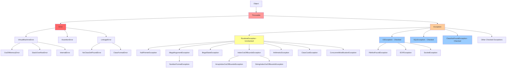
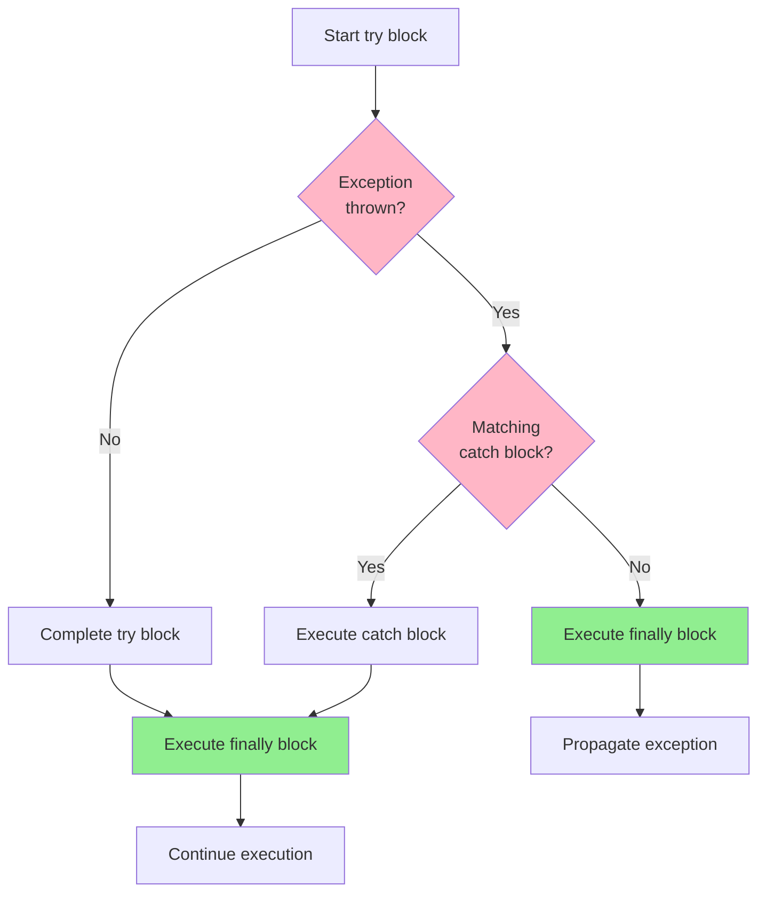
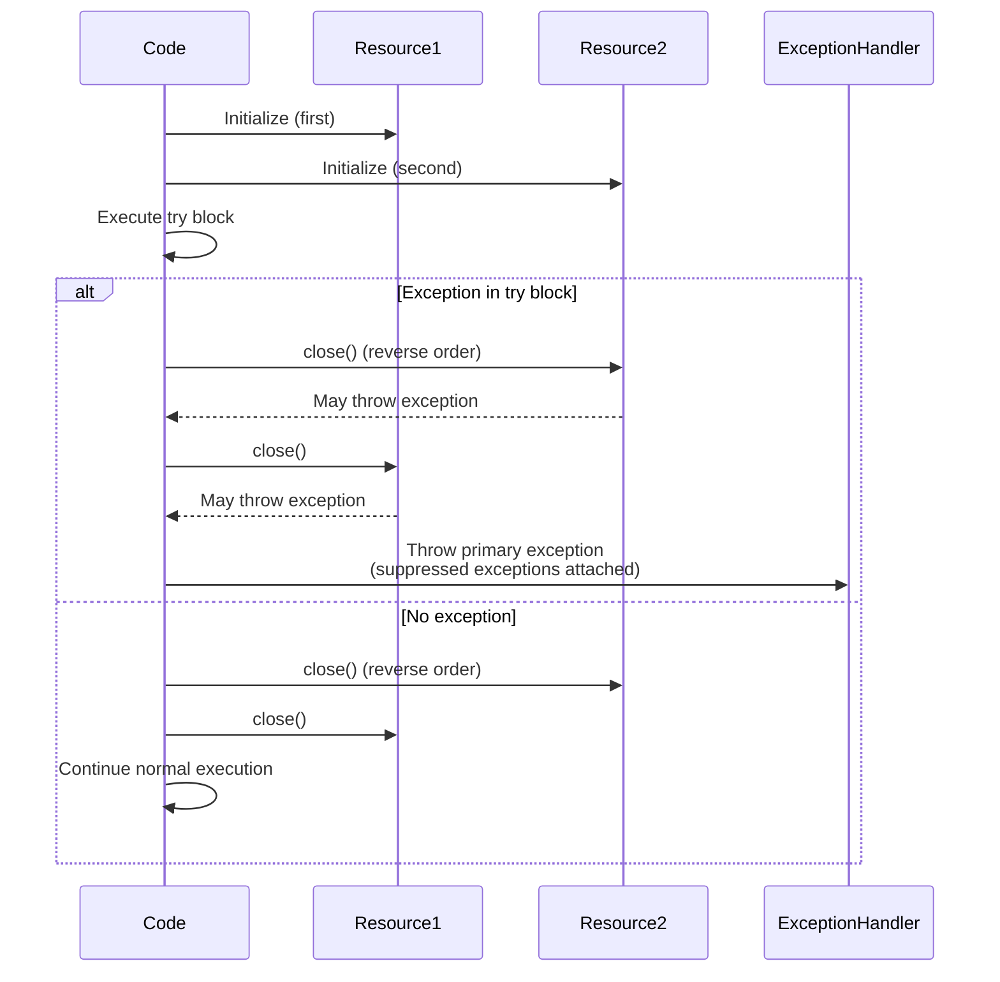
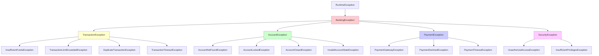

# Exception Handling in Java - Complete Interview Guide

## Overview

Exception handling is a fundamental mechanism in Java for managing runtime errors and abnormal conditions in a controlled and predictable manner. Rather than allowing programs to crash unexpectedly, Java's exception handling framework provides a structured way to detect, report, and recover from errors.

For enterprise banking systems processing millions of financial transactions daily, proper exception handling is not just a best practice - it's mission-critical. A poorly handled exception in a payment processing system could result in lost transactions, incorrect account balances, compliance violations, or system downtime. Interviewers at senior levels expect candidates to not only understand the technical mechanics of try-catch blocks but also demonstrate judgment about when to use checked vs unchecked exceptions, how to design robust error handling strategies, and how to maintain system reliability under failure conditions.

Exception handling directly impacts system reliability, maintainability, debuggability, and user experience. Senior engineers must understand the entire exception hierarchy, the implications of different exception types, the performance costs of exception handling, and best practices for creating resilient enterprise applications. This guide covers everything from foundational concepts to advanced patterns used in production banking systems.

## Foundational Concepts

### What is an Exception?

An **exception** is an event that disrupts the normal flow of program execution. When an exceptional condition occurs, Java creates an exception object containing information about the error (type, state, location) and "throws" it to the runtime system. The runtime then attempts to find code that can handle the exception by traversing the call stack backward from the method where the error occurred.

**Key characteristics:**
- Exceptions are objects - instances of classes that extend `java.lang.Throwable`
- Exceptions represent abnormal conditions that can potentially be recovered from
- Exception handling separates error-handling code from normal business logic
- Exceptions propagate up the call stack until caught or until they terminate the program

### Exception vs Error

A critical distinction exists between **exceptions** and **errors** in Java:

**Exceptions** (`java.lang.Exception` and subclasses):
- Represent conditions that applications **should** catch and handle
- Generally recoverable situations (file not found, invalid input, network timeout)
- Applications are expected to handle these programmatically
- Examples: `IOException`, `SQLException`, `IllegalArgumentException`

**Errors** (`java.lang.Error` and subclasses):
- Represent serious problems that applications **should not** try to catch
- Usually indicate problems with the runtime environment or system
- Not expected to be recovered from in application code
- Examples: `OutOfMemoryError`, `StackOverflowError`, `VirtualMachineError`

**Banking context:** In a payment processing system, a `SQLException` during a transaction is an exception you should catch and handle (retry, log, rollback). An `OutOfMemoryError` indicates a systemic problem requiring operational intervention, not application-level handling.

### Checked vs Unchecked Exceptions

Java uniquely categorizes exceptions into **checked** and **unchecked** exceptions, a design decision that remains controversial but is fundamental to Java programming:

**Checked Exceptions** (compile-time exceptions):
- Must be explicitly handled (caught) or declared (throws clause) by the programmer
- Compiler enforces handling at compile time
- Extend `Exception` but not `RuntimeException`
- Represent recoverable conditions that well-written applications should anticipate
- Examples: `IOException`, `SQLException`, `ClassNotFoundException`

**Unchecked Exceptions** (runtime exceptions):
- Not required to be caught or declared
- Can occur during program execution without compiler warnings
- Extend `RuntimeException`
- Typically represent programming errors or conditions that can't reasonably be recovered from
- Examples: `NullPointerException`, `IllegalArgumentException`, `ArrayIndexOutOfBoundsException`

**Common Misconception:** "Unchecked exceptions can't be caught" - FALSE. All exceptions can be caught; "unchecked" only means the compiler doesn't force you to handle them.

### Exception Propagation

When an exception is thrown, Java's runtime system searches the call stack for a method containing an exception handler (catch block) that can handle that type of exception:

1. **Method throws exception**: Exception object is created
2. **Runtime searches call stack**: Looks for matching catch block
3. **Handler found**: Control transfers to catch block
4. **No handler found**: Thread terminates, stack trace is printed

```java
// Exception propagation example
public void methodA() {
    try {
        methodB();  // methodB throws exception
    } catch (IOException e) {
        // Exception caught here after propagating from methodD
        System.out.println("Handled in methodA");
    }
}

public void methodB() throws IOException {
    methodC();  // Propagates exception up
}

public void methodC() throws IOException {
    methodD();  // Propagates exception up
}

public void methodD() throws IOException {
    throw new IOException("Error in methodD");  // Origin of exception
}
```

## Exception Hierarchy

Understanding Java's exception hierarchy is fundamental for proper exception handling. The hierarchy determines inheritance relationships, which exceptions must be handled, and how exceptions can be caught.

### Complete Exception Hierarchy



### Throwable - The Root Class

`java.lang.Throwable` is the superclass of all errors and exceptions. Only objects that are instances of this class (or its subclasses) can be thrown by the JVM or by a `throw` statement.

**Key methods of Throwable:**
- `getMessage()`: Returns the detail message string
- `getCause()`: Returns the cause of this throwable (exception chaining)
- `printStackTrace()`: Prints the stack trace to standard error
- `getStackTrace()`: Returns stack trace as an array of `StackTraceElement` objects
- `fillInStackTrace()`: Fills in the execution stack trace
- `initCause(Throwable cause)`: Initializes the cause for exception chaining
- `addSuppressed(Throwable exception)`: Appends suppressed exception (try-with-resources)
- `getSuppressed()`: Returns array of suppressed exceptions

### Error Hierarchy

**java.lang.Error and subclasses** represent serious problems that applications should not try to handle:

| Error Type | Description | When It Occurs | Should Catch? |
|------------|-------------|----------------|---------------|
| `OutOfMemoryError` | JVM cannot allocate object due to insufficient memory | Heap exhaustion, memory leaks | No - fix root cause |
| `StackOverflowError` | Stack memory exhausted (usually infinite recursion) | Deep/infinite recursion | No - fix algorithm |
| `VirtualMachineError` | JVM broken or has run out of resources | JVM internal errors | No - JVM issue |
| `NoClassDefFoundError` | Class was available at compile time but not at runtime | Classpath issues, missing JARs | No - fix deployment |
| `LinkageError` | Class has incompatible dependency | Version conflicts | No - fix dependencies |
| `AssertionError` | Assertion failed (from assert statement) | Logic error in assertions | No - fix assertion logic |

**Banking Context:** If your payment processing service encounters an `OutOfMemoryError`, catching it won't help - you need to investigate memory leaks, tune JVM heap size, or scale infrastructure. These are operational issues, not application-level exceptions.

### Exception Hierarchy - Checked Exceptions

**Checked exceptions** extend `Exception` but NOT `RuntimeException`. Common checked exceptions:

| Exception | Package | Typical Cause | Banking Example |
|-----------|---------|---------------|-----------------|
| `IOException` | java.io | I/O operations failure | Reading transaction file fails |
| `FileNotFoundException` | java.io | File doesn't exist | Config file missing |
| `SQLException` | java.sql | Database access error | Connection timeout during query |
| `ClassNotFoundException` | java.lang | Class not found at runtime | Dynamic class loading fails |
| `InterruptedException` | java.lang | Thread interrupted while waiting | Shutdown signal during batch processing |
| `TimeoutException` | java.util.concurrent | Operation timed out | Payment gateway response timeout |
| `ParseException` | java.text | String parsing failed | Invalid date format in transaction |
| `CloneNotSupportedException` | java.lang | Cloning not supported | Attempting to clone non-Cloneable object |

### Exception Hierarchy - Unchecked Exceptions (RuntimeException)

**Unchecked exceptions** extend `RuntimeException`. These typically represent programming errors:

| Exception | Typical Cause | Prevention | Banking Example |
|-----------|---------------|------------|-----------------|
| `NullPointerException` | Dereferencing null reference | Null checks, Optional, Objects.requireNonNull() | Accessing account.getBalance() when account is null |
| `IllegalArgumentException` | Method received inappropriate argument | Input validation | Negative amount in transfer(amount) |
| `IllegalStateException` | Object in inappropriate state for operation | State validation | Attempting to withdraw from closed account |
| `IndexOutOfBoundsException` | Invalid array/collection index | Bounds checking | Accessing transactions.get(100) when size is 50 |
| `ArrayIndexOutOfBoundsException` | Invalid array index | Array bounds checking | array[10] when array.length is 5 |
| `ClassCastException` | Invalid type cast | instanceof checks, type safety | Casting Object to Transaction when it's not |
| `NumberFormatException` | String to number conversion failed | Validation before parsing | Integer.parseInt("abc") |
| `ArithmeticException` | Arithmetic error (divide by zero) | Denominator validation | amount / 0 |
| `ConcurrentModificationException` | Collection modified during iteration | Synchronized access, Iterator.remove() | Modifying list while iterating |
| `UnsupportedOperationException` | Operation not supported | Check before calling | Modifying Collections.unmodifiableList() |

### Common Exception Patterns

**IOException Family** (all checked):
```
IOException
├── FileNotFoundException (file doesn't exist)
├── EOFException (end of file reached unexpectedly)
├── SocketException (socket operation failed)
│   └── ConnectException (connection refused)
├── InterruptedIOException (I/O interrupted)
└── MalformedURLException (invalid URL format)
```

**RuntimeException Family** (all unchecked):
```
RuntimeException
├── NullPointerException
├── IllegalArgumentException
│   └── NumberFormatException
├── IllegalStateException
├── IndexOutOfBoundsException
│   ├── ArrayIndexOutOfBoundsException
│   └── StringIndexOutOfBoundsException
├── ClassCastException
├── ArithmeticException
├── UnsupportedOperationException
├── ConcurrentModificationException
└── SecurityException
```

## Try-Catch-Finally Mechanism

The `try-catch-finally` block is the foundation of Java's exception handling mechanism. Understanding its behavior is crucial for writing robust enterprise applications.

### Basic Try-Catch Structure

```java
try {
    // Code that might throw an exception
    // Protected code block
} catch (ExceptionType e) {
    // Code to handle the exception
    // Exception handler
}
```

**Flow of execution:**
1. Code in `try` block executes normally
2. If exception occurs, execution immediately jumps to matching `catch` block
3. Code after the exception point in `try` block is **skipped**
4. After `catch` block completes, execution continues after try-catch

```java
// Example: Demonstrating try-catch flow
public class TryCatchFlow {
    public void processTransaction(String transactionId) {
        System.out.println("1. Starting transaction processing");

        try {
            System.out.println("2. Inside try block - before exception");

            // Simulate exception
            if (transactionId == null) {
                throw new IllegalArgumentException("Transaction ID cannot be null");
            }

            System.out.println("3. This line is SKIPPED if exception occurs");
            System.out.println("4. Processing transaction: " + transactionId);

        } catch (IllegalArgumentException e) {
            System.out.println("5. Exception caught: " + e.getMessage());
            // Log exception, notify monitoring system, etc.
        }

        System.out.println("6. After try-catch - execution continues");
    }
}

// When transactionId is null:
// Output: 1 → 2 → 5 → 6 (lines 3 and 4 are skipped)
```

### Multiple Catch Blocks

A single `try` block can have multiple `catch` blocks to handle different exception types:

```java
public void processPayment(String accountId, BigDecimal amount) {
    try {
        // Multiple potential exceptions
        Account account = accountRepository.findById(accountId);  // May throw SQLException
        validateAccount(account);  // May throw IllegalStateException
        account.withdraw(amount);  // May throw InsufficientFundsException

    } catch (SQLException e) {
        // Handle database errors
        logger.error("Database error during payment processing", e);
        throw new PaymentProcessingException("Database unavailable", e);

    } catch (IllegalStateException e) {
        // Handle account state errors
        logger.warn("Invalid account state: {}", e.getMessage());
        throw new PaymentProcessingException("Account not eligible for transaction", e);

    } catch (InsufficientFundsException e) {
        // Handle insufficient funds
        logger.info("Insufficient funds for account {}", accountId);
        throw new PaymentProcessingException("Insufficient funds", e);
    }
}
```

### Catch Block Order - Critical Rule

**CRITICAL RULE:** Catch blocks must be ordered from **most specific to most general** exception types. The compiler enforces this for checked exceptions.

```java
// ❌ WRONG - Won't compile (unreachable catch block)
try {
    // code
} catch (Exception e) {  // Too general - catches everything
    // handle
} catch (IOException e) {  // UNREACHABLE - IOException is subclass of Exception
    // never executed
}

// ✅ CORRECT - Specific to general
try {
    // code
} catch (FileNotFoundException e) {  // Most specific
    // Handle file not found
} catch (IOException e) {  // More general
    // Handle other I/O errors
} catch (Exception e) {  // Most general
    // Handle any other exception
}
```

**Why this matters:** Exception matching uses inheritance. The first catch block that matches the exception type (including parent types) will be executed. Subsequent catch blocks are never evaluated.

```java
// Banking example: Specific exception handling
public void executeTransaction(Transaction txn) {
    try {
        validateTransaction(txn);
        persistTransaction(txn);
        notifyCustomer(txn);

    } catch (TransactionValidationException e) {
        // Specific handling for validation errors
        logger.warn("Transaction validation failed: {}", e.getMessage());
        txn.setStatus(TransactionStatus.REJECTED);
        // Don't retry validation errors

    } catch (DatabaseTimeoutException e) {
        // Specific handling for timeouts
        logger.error("Database timeout: {}", e.getMessage());
        txn.setStatus(TransactionStatus.PENDING_RETRY);
        // Queue for retry

    } catch (SQLException e) {
        // General database errors
        logger.error("Database error: {}", e.getMessage(), e);
        txn.setStatus(TransactionStatus.FAILED);

    } catch (Exception e) {
        // Catch-all for unexpected errors
        logger.error("Unexpected error processing transaction", e);
        txn.setStatus(TransactionStatus.FAILED);
        // Alert operations team
    }
}
```

### Finally Block - Guaranteed Execution

The `finally` block **always executes**, regardless of whether an exception was thrown or caught. This makes it ideal for cleanup operations.

**Finally block guarantees:**
- ✅ Executes after try block completes normally
- ✅ Executes after catch block handles exception
- ✅ Executes even if try/catch has return statement
- ✅ Executes even if exception is not caught
- ⚠️ Does NOT execute if JVM exits (System.exit()) or thread is killed

```java
public String readTransactionFile(String filePath) {
    BufferedReader reader = null;
    try {
        reader = new BufferedReader(new FileReader(filePath));
        return reader.readLine();
        // Even though we return here, finally STILL executes

    } catch (IOException e) {
        logger.error("Error reading file: {}", filePath, e);
        return null;  // Finally executes before this return

    } finally {
        // Cleanup ALWAYS happens
        if (reader != null) {
            try {
                reader.close();  // Close resource even if exception occurred
            } catch (IOException e) {
                logger.error("Error closing reader", e);
            }
        }
    }
}
```

### Finally Execution Flow Diagram



### Try-With-Resources (Java 7+)

**Try-with-resources** is a significant improvement introduced in Java 7 that automatically closes resources implementing `AutoCloseable` or `Closeable`:

```java
// Old way (Java 6 and earlier) - verbose and error-prone
public String readFile(String path) throws IOException {
    BufferedReader reader = null;
    try {
        reader = new BufferedReader(new FileReader(path));
        return reader.readLine();
    } finally {
        if (reader != null) {
            try {
                reader.close();
            } catch (IOException e) {
                // What to do here? Can't easily propagate
                logger.error("Error closing reader", e);
            }
        }
    }
}

// ✅ New way (Java 7+) - clean and automatic
public String readFile(String path) throws IOException {
    try (BufferedReader reader = new BufferedReader(new FileReader(path))) {
        return reader.readLine();
    }
    // reader.close() called AUTOMATICALLY, even if exception occurs
}

// Multiple resources (Java 7+)
public void copyFile(String source, String destination) throws IOException {
    try (BufferedReader reader = new BufferedReader(new FileReader(source));
         BufferedWriter writer = new BufferedWriter(new FileWriter(destination))) {

        String line;
        while ((line = reader.readLine()) != null) {
            writer.write(line);
            writer.newLine();
        }
    }
    // Both reader and writer closed automatically in reverse order
}

// Java 9+ improvement - resources declared outside
public void processTransaction(Connection connection) throws SQLException {
    // connection created outside try-with-resources
    try (connection) {  // Java 9+: can use effectively final variables
        // use connection
    }
    // connection closed automatically
}
```

**Try-with-resources execution order:**
1. Resources are initialized in order of declaration
2. Try block executes
3. Resources are closed in **reverse order** of declaration (like finally blocks)
4. If both try block and close() throw exceptions, try block exception is primary, close() exceptions are suppressed

### Try-With-Resources Flow



### Suppressed Exceptions

When using try-with-resources, if both the try block and the `close()` method throw exceptions, the try block's exception is thrown and the close() exception is **suppressed**:

```java
public class SuppressedExceptionDemo {

    public static void main(String[] args) {
        try {
            testSuppressedException();
        } catch (Exception e) {
            System.out.println("Primary exception: " + e.getMessage());

            // Access suppressed exceptions
            Throwable[] suppressed = e.getSuppressed();
            for (Throwable t : suppressed) {
                System.out.println("Suppressed exception: " + t.getMessage());
            }
        }
    }

    public static void testSuppressedException() throws Exception {
        try (FailingResource resource = new FailingResource()) {
            throw new Exception("Exception from try block");  // Primary
        }
        // resource.close() throws exception, but it's suppressed
    }

    static class FailingResource implements AutoCloseable {
        @Override
        public void close() throws Exception {
            throw new Exception("Exception from close()");  // Suppressed
        }
    }
}

/* Output:
Primary exception: Exception from try block
Suppressed exception: Exception from close()
*/
```

**Why suppressed exceptions matter:** In production, you need to log ALL exceptions, not just the primary one. A suppressed exception during resource cleanup could indicate serious problems (database connection issues, file system errors, etc.).

```java
// Best practice: Log suppressed exceptions
try (Connection conn = dataSource.getConnection()) {
    // database operations
} catch (SQLException e) {
    logger.error("Database operation failed: {}", e.getMessage(), e);

    // Log suppressed exceptions separately
    for (Throwable suppressed : e.getSuppressed()) {
        logger.error("Suppressed exception during cleanup: {}",
                     suppressed.getMessage(), suppressed);
    }

    throw e;
}
```

### Multi-Catch (Java 7+)

Java 7 introduced **multi-catch** to handle multiple exception types in a single catch block:

```java
// Before Java 7 - duplicate code
try {
    // code that may throw different exceptions
} catch (IOException e) {
    logger.error("Error occurred: " + e.getMessage(), e);
    handleError(e);
} catch (SQLException e) {
    logger.error("Error occurred: " + e.getMessage(), e);
    handleError(e);
}

// ✅ Java 7+ multi-catch - cleaner
try {
    // code that may throw different exceptions
} catch (IOException | SQLException e) {
    logger.error("Error occurred: " + e.getMessage(), e);
    handleError(e);
}
```

**Multi-catch rules:**
- Exception types must be separated by `|` (pipe)
- Exception types cannot be related by inheritance (compiler error)
- Catch parameter is **implicitly final** (cannot be reassigned)

```java
// ❌ WRONG - Cannot catch related exception types
try {
    // code
} catch (IOException | FileNotFoundException e) {  // Compile error!
    // FileNotFoundException extends IOException - not allowed
}

// ✅ CORRECT - Unrelated exception types
try {
    processPayment();
} catch (SQLException | TimeoutException | ValidationException e) {
    // All unrelated exceptions
    logger.error("Payment processing failed", e);
}

// Note: e is implicitly final
try {
    // code
} catch (IOException | SQLException e) {
    e = new IOException();  // ❌ Compile error - cannot reassign
}
```

### Banking Example: Complete Try-Catch-Finally Pattern

```java
/**
 * Enterprise-grade transaction processing with comprehensive exception handling.
 * This example demonstrates proper exception handling in a banking context.
 */
public class TransactionProcessor {

    private static final Logger logger = LoggerFactory.getLogger(TransactionProcessor.class);
    private final DataSource dataSource;
    private final AuditService auditService;

    public TransactionResult processTransfer(
            String fromAccount,
            String toAccount,
            BigDecimal amount) throws TransactionFailedException {

        // Track transaction ID for auditing
        String txnId = generateTransactionId();
        Connection connection = null;
        boolean committed = false;

        try {
            // Acquire database connection (must be released in finally)
            connection = dataSource.getConnection();
            connection.setAutoCommit(false);

            // Try-with-resources for prepared statements
            try (PreparedStatement debitStmt = connection.prepareStatement(
                     "UPDATE accounts SET balance = balance - ? WHERE account_id = ?");
                 PreparedStatement creditStmt = connection.prepareStatement(
                     "UPDATE accounts SET balance = balance + ? WHERE account_id = ?")) {

                // Validate sufficient balance
                BigDecimal balance = getAccountBalance(connection, fromAccount);
                if (balance.compareTo(amount) < 0) {
                    throw new InsufficientFundsException(
                        "Insufficient funds in account " + fromAccount);
                }

                // Execute debit
                debitStmt.setBigDecimal(1, amount);
                debitStmt.setString(2, fromAccount);
                int debitRows = debitStmt.executeUpdate();

                if (debitRows == 0) {
                    throw new AccountNotFoundException("Account not found: " + fromAccount);
                }

                // Execute credit
                creditStmt.setBigDecimal(1, amount);
                creditStmt.setString(2, toAccount);
                int creditRows = creditStmt.executeUpdate();

                if (creditRows == 0) {
                    throw new AccountNotFoundException("Account not found: " + toAccount);
                }

                // Commit transaction
                connection.commit();
                committed = true;

                logger.info("Transaction {} completed successfully", txnId);
                return new TransactionResult(txnId, TransactionStatus.SUCCESS);

            } // PreparedStatements auto-closed here

        } catch (InsufficientFundsException e) {
            // Business exception - expected scenario
            logger.warn("Transaction {} failed: {}", txnId, e.getMessage());
            rollbackQuietly(connection);
            auditService.logFailedTransaction(txnId, "INSUFFICIENT_FUNDS", e);
            throw new TransactionFailedException("Insufficient funds", e);

        } catch (AccountNotFoundException e) {
            // Business exception - data issue
            logger.error("Transaction {} failed: {}", txnId, e.getMessage());
            rollbackQuietly(connection);
            auditService.logFailedTransaction(txnId, "ACCOUNT_NOT_FOUND", e);
            throw new TransactionFailedException("Account not found", e);

        } catch (SQLException e) {
            // Technical exception - database issue
            logger.error("Transaction {} failed due to database error", txnId, e);
            rollbackQuietly(connection);
            auditService.logFailedTransaction(txnId, "DATABASE_ERROR", e);
            throw new TransactionFailedException("Database error", e);

        } catch (Exception e) {
            // Catch-all for unexpected exceptions
            logger.error("Transaction {} failed due to unexpected error", txnId, e);
            rollbackQuietly(connection);
            auditService.logFailedTransaction(txnId, "UNEXPECTED_ERROR", e);
            throw new TransactionFailedException("Unexpected error", e);

        } finally {
            // ALWAYS close connection, even if exception occurred
            if (connection != null) {
                try {
                    // Only close if not already committed
                    if (!committed) {
                        connection.rollback();  // Rollback if not yet committed
                    }
                    connection.close();
                } catch (SQLException e) {
                    // Log but don't throw - we're already handling an exception
                    logger.error("Error closing connection for transaction {}", txnId, e);
                }
            }

            // Audit completed (success or failure)
            auditService.finalizeTransaction(txnId);
        }
    }

    private void rollbackQuietly(Connection connection) {
        if (connection != null) {
            try {
                connection.rollback();
            } catch (SQLException e) {
                logger.error("Error during rollback", e);
            }
        }
    }
}
```

## Custom Exceptions

Creating custom exceptions is a powerful way to model domain-specific error conditions in your application. Custom exceptions make code more readable, improve error handling, and provide meaningful context for failures.

### When to Create Custom Exceptions

**Create custom exceptions when:**

1. **Domain-specific errors:** Business rules violations that are specific to your domain
   - Example: `InsufficientFundsException`, `AccountLockedException`, `TransactionLimitExceededException`

2. **Additional context needed:** Standard exceptions don't convey enough information
   - Example: `PaymentProcessingException` with transaction ID, amount, and failure reason

3. **Different handling required:** Different exception types need different handling strategies
   - Example: `RetryableException` vs `FatalException` in distributed systems

4. **API contract clarity:** Your API needs clear exception contracts for clients
   - Example: Public API declares specific exceptions clients must handle

5. **Improved debugging:** Custom exceptions with detailed messages and context
   - Example: Exception includes all relevant state for troubleshooting

**Don't create custom exceptions when:**
- Standard JDK exceptions sufficiently describe the error
- You're just wrapping exceptions without adding value
- Exception won't be caught differently than its parent class

### Custom Exception Best Practices

```java
/**
 * ✅ GOOD: Well-designed custom exception
 *
 * Best practices demonstrated:
 * 1. Extends appropriate base exception (checked vs unchecked)
 * 2. Provides multiple constructors for different use cases
 * 3. Includes meaningful fields for context
 * 4. Immutable after construction
 * 5. Proper JavaDoc documentation
 * 6. Support for exception chaining
 */
public class InsufficientFundsException extends TransactionException {

    // Contextual information (immutable)
    private final String accountId;
    private final BigDecimal requestedAmount;
    private final BigDecimal availableBalance;

    /**
     * Constructs an InsufficientFundsException with full context.
     *
     * @param accountId the account that has insufficient funds
     * @param requestedAmount the amount that was requested
     * @param availableBalance the available balance
     */
    public InsufficientFundsException(String accountId,
                                       BigDecimal requestedAmount,
                                       BigDecimal availableBalance) {
        super(String.format(
            "Insufficient funds in account %s: requested %s, available %s",
            accountId, requestedAmount, availableBalance));
        this.accountId = accountId;
        this.requestedAmount = requestedAmount;
        this.availableBalance = availableBalance;
    }

    /**
     * Constructs an InsufficientFundsException with cause.
     * Useful when wrapping lower-level exceptions.
     */
    public InsufficientFundsException(String accountId,
                                       BigDecimal requestedAmount,
                                       BigDecimal availableBalance,
                                       Throwable cause) {
        super(String.format(
            "Insufficient funds in account %s: requested %s, available %s",
            accountId, requestedAmount, availableBalance), cause);
        this.accountId = accountId;
        this.requestedAmount = requestedAmount;
        this.availableBalance = availableBalance;
    }

    /**
     * Simplified constructor for cases where detailed amounts are unavailable.
     */
    public InsufficientFundsException(String message) {
        super(message);
        this.accountId = null;
        this.requestedAmount = null;
        this.availableBalance = null;
    }

    // Getters for contextual information
    public String getAccountId() {
        return accountId;
    }

    public BigDecimal getRequestedAmount() {
        return requestedAmount;
    }

    public BigDecimal getAvailableBalance() {
        return availableBalance;
    }

    /**
     * Returns structured data for logging/monitoring systems.
     */
    public Map<String, Object> toStructuredLog() {
        Map<String, Object> log = new HashMap<>();
        log.put("exceptionType", "InsufficientFunds");
        log.put("accountId", accountId);
        log.put("requestedAmount", requestedAmount);
        log.put("availableBalance", availableBalance);
        log.put("shortfall", requestedAmount.subtract(availableBalance));
        return log;
    }
}
```

### Custom Exception Hierarchy

In enterprise applications, it's common to create an exception hierarchy that mirrors your domain:

```java
/**
 * Base exception for all banking domain exceptions.
 * Extends RuntimeException (unchecked) because most business rule violations
 * cannot be recovered from and represent programming errors or invalid state.
 */
public abstract class BankingException extends RuntimeException {

    private final String errorCode;
    private final Instant timestamp;

    protected BankingException(String message, String errorCode) {
        super(message);
        this.errorCode = errorCode;
        this.timestamp = Instant.now();
    }

    protected BankingException(String message, String errorCode, Throwable cause) {
        super(message, cause);
        this.errorCode = errorCode;
        this.timestamp = Instant.now();
    }

    public String getErrorCode() {
        return errorCode;
    }

    public Instant getTimestamp() {
        return timestamp;
    }
}

/**
 * Transaction-related exceptions.
 */
public class TransactionException extends BankingException {

    private final String transactionId;

    public TransactionException(String message, String errorCode, String transactionId) {
        super(message, errorCode);
        this.transactionId = transactionId;
    }

    public TransactionException(String message, String errorCode,
                                 String transactionId, Throwable cause) {
        super(message, errorCode, cause);
        this.transactionId = transactionId;
    }

    public String getTransactionId() {
        return transactionId;
    }
}

/**
 * Specific transaction exceptions.
 */
public class TransactionLimitExceededException extends TransactionException {
    public TransactionLimitExceededException(String transactionId,
                                              BigDecimal amount,
                                              BigDecimal limit) {
        super(String.format("Transaction amount %s exceeds limit %s", amount, limit),
              "TXN_LIMIT_EXCEEDED",
              transactionId);
    }
}

public class DuplicateTransactionException extends TransactionException {
    public DuplicateTransactionException(String transactionId) {
        super("Transaction already processed",
              "TXN_DUPLICATE",
              transactionId);
    }
}

/**
 * Account-related exceptions.
 */
public class AccountException extends BankingException {

    private final String accountId;

    public AccountException(String message, String errorCode, String accountId) {
        super(message, errorCode);
        this.accountId = accountId;
    }

    public String getAccountId() {
        return accountId;
    }
}

public class AccountNotFoundException extends AccountException {
    public AccountNotFoundException(String accountId) {
        super("Account not found: " + accountId,
              "ACCOUNT_NOT_FOUND",
              accountId);
    }
}

public class AccountLockedException extends AccountException {
    public AccountLockedException(String accountId, String reason) {
        super("Account is locked: " + reason,
              "ACCOUNT_LOCKED",
              accountId);
    }
}
```

**Exception hierarchy diagram:**



### Exception Chaining

**Exception chaining** (wrapping) is the practice of catching a lower-level exception and throwing a higher-level exception that includes the original as its cause:

```java
/**
 * Exception chaining example.
 * Lower-level technical exceptions are wrapped in higher-level business exceptions.
 */
public class AccountService {

    public Account getAccount(String accountId) throws AccountException {
        try {
            // Database layer might throw SQLException
            return accountRepository.findById(accountId);

        } catch (SQLException e) {
            // Wrap low-level SQLException in business exception
            // Original exception is preserved as "cause"
            throw new AccountException(
                "Failed to retrieve account: " + accountId,
                "ACCOUNT_RETRIEVAL_ERROR",
                accountId,
                e  // ← Original exception becomes the cause
            );
        }
    }

    public void transferFunds(String fromAccount, String toAccount, BigDecimal amount) {
        try {
            Account from = getAccount(fromAccount);  // May throw AccountException
            Account to = getAccount(toAccount);

            // Business logic that may throw various exceptions
            validateTransfer(from, to, amount);
            executeTransfer(from, to, amount);

        } catch (AccountException e) {
            // Wrap in transaction-specific exception
            String txnId = generateTransactionId();
            throw new TransactionException(
                "Transfer failed: " + e.getMessage(),
                "TRANSFER_FAILED",
                txnId,
                e  // ← AccountException becomes the cause
            );
        }
    }
}
```

**Benefits of exception chaining:**
1. **Preserves root cause:** Original exception available for debugging
2. **Abstraction:** High-level code doesn't need to know about low-level exceptions
3. **Context:** Each layer adds relevant context
4. **Stack trace:** Complete stack trace preserved

**Accessing the exception chain:**
```java
try {
    accountService.transferFunds("ACC001", "ACC002", new BigDecimal("1000"));
} catch (TransactionException e) {
    System.out.println("Transaction failed: " + e.getMessage());

    // Access the cause
    Throwable cause = e.getCause();  // AccountException
    if (cause != null) {
        System.out.println("Caused by: " + cause.getMessage());

        // Access the root cause
        Throwable rootCause = cause.getCause();  // SQLException
        if (rootCause != null) {
            System.out.println("Root cause: " + rootCause.getMessage());
        }
    }

    // Print full chain
    e.printStackTrace();
}
```

**Best practices for exception chaining:**
- ✅ Always include the cause when wrapping exceptions
- ✅ Add meaningful context at each layer
- ✅ Use domain-specific exceptions at higher layers
- ✅ Preserve original exception for debugging
- ❌ Don't chain unnecessarily if not adding value
- ❌ Don't lose the original exception

### Custom Exception Anti-Patterns

```java
// ❌ ANTI-PATTERN 1: Exception with no additional value
public class MyException extends Exception {
    // Just wraps another exception without adding context
}

// ❌ ANTI-PATTERN 2: Mutable exception state
public class BadException extends Exception {
    private String errorCode;  // Mutable field

    public void setErrorCode(String code) {  // Shouldn't be mutable
        this.errorCode = code;
    }
}

// ❌ ANTI-PATTERN 3: Exception doing too much
public class OverlyComplexException extends Exception {
    public OverlyComplexException() {
        super();
        // Sending email in constructor!?
        EmailService.sendEmail("Error occurred");
        // Writing to database!?
        LoggingDatabase.writeLog(this);
    }
}

// ❌ ANTI-PATTERN 4: Generic exception names
public class ErrorException extends Exception { }
public class FailureException extends Exception { }
// Use specific, descriptive names

// ❌ ANTI-PATTERN 5: Exception for control flow
try {
    throw new UserNotAuthenticatedException();  // Don't use for control flow
} catch (UserNotAuthenticatedException e) {
    redirectToLogin();
}
// Just check: if (!isAuthenticated()) redirectToLogin();
```

## Best Practices

### Checked vs Unchecked: When to Use Which

One of the most debated topics in Java exception handling is when to use checked vs unchecked exceptions. Understanding this distinction is critical for designing robust APIs.

#### Comparison Table: Checked vs Unchecked Exceptions

| Aspect | Checked Exceptions | Unchecked Exceptions |
|--------|-------------------|----------------------|
| **Extends** | `Exception` (but not `RuntimeException`) | `RuntimeException` or `Error` |
| **Compiler enforcement** | Must be caught or declared | No compiler enforcement |
| **Typical cause** | External factors beyond program control | Programming errors |
| **Recovery expectation** | Caller expected to recover | Usually can't recover programmatically |
| **When to use** | Recoverable conditions, external failures | Programming bugs, precondition violations |
| **Examples** | `IOException`, `SQLException`, `TimeoutException` | `NullPointerException`, `IllegalArgumentException`, `IllegalStateException` |
| **API design** | Forces clients to handle or declare | Cleaner API but easier to ignore |
| **Performance** | No performance difference | No performance difference |

#### Use Checked Exceptions When:

1. **Caller can reasonably recover:**
   ```java
   // File may not exist - caller should handle this
   public Configuration loadConfiguration(String filePath) throws FileNotFoundException {
       return parser.parse(new File(filePath));
   }
   ```

2. **External system failures:**
   ```java
   // Network, database, or external service calls
   public PaymentResponse processPayment(Payment payment)
           throws PaymentGatewayException, TimeoutException {
       return paymentGateway.submit(payment);
   }
   ```

3. **Business rule violations that are expected:**
   ```java
   // These are expected scenarios in business logic
   public void withdrawFunds(String accountId, BigDecimal amount)
           throws InsufficientFundsException, AccountLockedException {
       // Business validation
   }
   ```

#### Use Unchecked Exceptions When:

1. **Programming errors (bugs):**
   ```java
   public void setAccountBalance(BigDecimal balance) {
       if (balance == null) {
           throw new IllegalArgumentException("Balance cannot be null");
       }
       if (balance.compareTo(BigDecimal.ZERO) < 0) {
           throw new IllegalArgumentException("Balance cannot be negative");
       }
       this.balance = balance;
   }
   ```

2. **Precondition violations:**
   ```java
   public Account getAccount(String accountId) {
       Objects.requireNonNull(accountId, "Account ID cannot be null");
       // If null is passed, it's a programming error
   }
   ```

3. **Unrecoverable system failures:**
   ```java
   public void initialize() {
       try {
           config = loadConfiguration();
       } catch (IOException e) {
           // Can't operate without configuration
           throw new IllegalStateException("Failed to load configuration", e);
       }
   }
   ```

### Fail-Fast vs Fail-Safe

**Fail-fast:** Detect and report errors immediately when they occur.

**Fail-safe:** Try to continue operation even in the presence of errors.

```java
// ✅ FAIL-FAST: Validate immediately (preferred for most applications)
public void processTransaction(Transaction txn) {
    Objects.requireNonNull(txn, "Transaction cannot be null");
    Objects.requireNonNull(txn.getAccountId(), "Account ID cannot be null");

    if (txn.getAmount().compareTo(BigDecimal.ZERO) <= 0) {
        throw new IllegalArgumentException("Amount must be positive");
    }

    if (txn.getStatus() != TransactionStatus.PENDING) {
        throw new IllegalStateException("Transaction must be in PENDING status");
    }

    // Now safe to process
    execute(txn);
}

// ❌ FAIL-SAFE: Continue despite errors (risky)
public void processTransaction(Transaction txn) {
    if (txn == null) {
        logger.warn("Null transaction, skipping");
        return;  // Silently fail
    }

    if (txn.getAmount() == null || txn.getAmount().compareTo(BigDecimal.ZERO) <= 0) {
        txn.setAmount(BigDecimal.ZERO);  // "Fix" the data
    }

    // Process with potentially bad data
    execute(txn);
}
```

**When to fail-fast (most enterprise applications):**
- Banking/financial systems (data integrity critical)
- Health care systems
- Safety-critical systems
- During development and testing

**When to fail-safe (rare cases):**
- Logging systems (don't crash app if logging fails)
- Monitoring systems
- Non-critical background tasks
- Degraded mode operation

### Never Swallow Exceptions

```java
// ❌ TERRIBLE: Swallowing exceptions (empty catch block)
try {
    processPayment(payment);
} catch (Exception e) {
    // Silent failure - worst practice
}

// ❌ BAD: Just logging without appropriate action
try {
    processPayment(payment);
} catch (PaymentException e) {
    logger.error("Payment failed");  // No stack trace, no context
    // Continues as if nothing happened
}

// ✅ GOOD: Log with full context and take appropriate action
try {
    processPayment(payment);
} catch (PaymentException e) {
    logger.error("Payment processing failed for payment ID {}: {}",
                 payment.getId(), e.getMessage(), e);

    // Take appropriate action based on exception type
    if (e.isRetryable()) {
        retryQueue.add(payment);
    } else {
        payment.setStatus(PaymentStatus.FAILED);
        paymentRepository.save(payment);
        notificationService.notifyFailure(payment);
    }
}

// ✅ GOOD: Wrap and rethrow with added context
try {
    accountRepository.save(account);
} catch (SQLException e) {
    logger.error("Failed to save account {}: {}",
                 account.getId(), e.getMessage(), e);
    throw new AccountException("Failed to persist account",
                                "ACCOUNT_SAVE_ERROR",
                                account.getId(),
                                e);
}
```

### Logging Exceptions Properly

```java
public class ExceptionLoggingBestPractices {

    private static final Logger logger = LoggerFactory.getLogger(
        ExceptionLoggingBestPractices.class);

    // ✅ GOOD: Structured logging with context
    public void processTransaction(Transaction txn) {
        try {
            execute(txn);
        } catch (InsufficientFundsException e) {
            // Log with structured context
            logger.warn("Insufficient funds - AccountId: {}, RequestedAmount: {}, " +
                       "AvailableBalance: {}",
                       e.getAccountId(),
                       e.getRequestedAmount(),
                       e.getAvailableBalance());
            throw e;

        } catch (SQLException e) {
            // Log with full stack trace for technical exceptions
            logger.error("Database error processing transaction {}",
                        txn.getId(), e);  // Note: exception as last parameter
            throw new TransactionException("Database error",
                                          "DB_ERROR",
                                          txn.getId(),
                                          e);
        }
    }

    // ✅ GOOD: Log at appropriate levels
    public void handleException(Exception e) {
        if (e instanceof ValidationException) {
            logger.warn("Validation failed: {}", e.getMessage());  // WARN level
        } else if (e instanceof BusinessException) {
            logger.error("Business error: {}", e.getMessage(), e);  // ERROR level
        } else {
            logger.error("Unexpected error", e);  // ERROR with full stack trace
        }
    }

    // ✅ GOOD: Include correlation ID for distributed tracing
    public void processWithCorrelation(String correlationId, Transaction txn) {
        try (MDC.MDCCloseable ignored = MDC.putCloseable("correlationId", correlationId)) {
            logger.info("Processing transaction {}", txn.getId());
            execute(txn);
        } catch (Exception e) {
            // correlationId automatically included in log output
            logger.error("Transaction processing failed", e);
            throw e;
        }
    }
}
```

### Exception Handling Anti-Patterns

```java
// ❌ ANTI-PATTERN 1: Catch Exception (too broad)
try {
    processPayment(payment);
} catch (Exception e) {  // Catches EVERYTHING including RuntimeException
    logger.error("Error", e);
}
// Problem: Catches errors you didn't anticipate and can't handle properly

// ✅ BETTER: Catch specific exceptions
try {
    processPayment(payment);
} catch (PaymentTimeoutException e) {
    retry(payment);
} catch (PaymentDeclinedException e) {
    notifyCustomer(payment);
} catch (PaymentException e) {
    logger.error("Payment failed", e);
}

// ❌ ANTI-PATTERN 2: Catching Throwable (even worse)
try {
    processPayment(payment);
} catch (Throwable t) {  // Catches EVERYTHING including Error
    logger.error("Error", t);
}
// Problem: Catches OutOfMemoryError, StackOverflowError, etc. - should not be caught

// ❌ ANTI-PATTERN 3: Exception for control flow
public Integer parseIntOrNull(String value) {
    try {
        return Integer.parseInt(value);
    } catch (NumberFormatException e) {
        return null;  // Using exception for control flow
    }
}
// ✅ BETTER: Use validation
public Integer parseIntOrNull(String value) {
    if (value == null || !value.matches("-?\\d+")) {
        return null;
    }
    return Integer.parseInt(value);
}

// ❌ ANTI-PATTERN 4: Returning null on exception
public Account getAccount(String id) {
    try {
        return accountRepository.findById(id);
    } catch (SQLException e) {
        logger.error("Database error", e);
        return null;  // Hides the error, caller doesn't know what happened
    }
}
// ✅ BETTER: Propagate or wrap exception
public Account getAccount(String id) throws AccountException {
    try {
        return accountRepository.findById(id);
    } catch (SQLException e) {
        throw new AccountException("Failed to retrieve account",
                                  "ACCOUNT_RETRIEVAL_ERROR",
                                  id,
                                  e);
    }
}

// ❌ ANTI-PATTERN 5: Generic exception messages
throw new Exception("Error");  // Useless
throw new RuntimeException("Something went wrong");  // Useless
// ✅ BETTER: Specific, actionable messages
throw new InsufficientFundsException(
    accountId,
    requestedAmount,
    availableBalance);

// ❌ ANTI-PATTERN 6: Nested try-catch hell
try {
    try {
        try {
            operation1();
        } catch (Exception1 e1) {
            handle1(e1);
        }
        operation2();
    } catch (Exception2 e2) {
        handle2(e2);
    }
    operation3();
} catch (Exception3 e3) {
    handle3(e3);
}
// ✅ BETTER: Separate into methods, use try-with-resources
```

### Performance Implications

**Key facts about exception performance:**

1. **Creating exceptions is expensive** (filling stack trace is costly)
2. **Throwing and catching is relatively cheap** (compared to creating)
3. **Normal flow should never rely on exceptions**
4. **Exceptions should be exceptional**

```java
// ❌ VERY SLOW: Using exceptions in hot path
public boolean isValidAccount(String accountId) {
    try {
        Account account = getAccount(accountId);  // Throws if not found
        return true;
    } catch (AccountNotFoundException e) {
        return false;  // Exception for control flow in frequent operation
    }
}
// This method might be called millions of times - DON'T use exceptions

// ✅ FAST: Avoid exceptions in normal flow
public boolean isValidAccount(String accountId) {
    return accountRepository.exists(accountId);  // Simple query, no exception
}

// Performance comparison (approximate):
// Method call: 1 nanosecond
// Creating exception: 1,000-10,000 nanoseconds
// Throwing + catching: 100 nanoseconds
// Normal if-statement: 1 nanosecond
```

**When performance matters:**
- High-frequency operations (millions per second)
- Hot paths in critical code
- Tight loops
- Real-time systems

**Exception performance optimization:**
```java
// Optimization 1: Reuse exception instances (no stack trace fill)
public class OptimizedException extends RuntimeException {
    private static final OptimizedException INSTANCE = new OptimizedException();

    private OptimizedException() {
        super(null, null, false, false);  // Don't fill in stack trace
    }

    public static OptimizedException getInstance() {
        return INSTANCE;
    }
}
// Use sparingly - only when exception is truly in hot path and
// stack trace is not needed

// Optimization 2: Lazy stack trace filling
public class LazyException extends RuntimeException {
    @Override
    public synchronized Throwable fillInStackTrace() {
        // Only fill if explicitly requested
        if (needsStackTrace()) {
            return super.fillInStackTrace();
        }
        return this;
    }
}
```

### Banking Context: Transaction Exception Handling Strategy

```java
/**
 * Complete exception handling strategy for banking transaction processing.
 * Demonstrates enterprise-grade patterns used in production systems.
 */
public class TransactionExceptionStrategy {

    private static final Logger logger = LoggerFactory.getLogger(
        TransactionExceptionStrategy.class);

    /**
     * Categorizes exceptions into actionable categories.
     */
    public enum ExceptionCategory {
        RETRYABLE,          // Temporary failures, can retry
        NON_RETRYABLE,      // Permanent failures, cannot retry
        BUSINESS_RULE,      // Business rule violations
        SYSTEM_ERROR,       // Internal system errors
        EXTERNAL_FAILURE    // External service failures
    }

    public TransactionResult processTransaction(Transaction txn) {
        String txnId = txn.getId();

        try {
            // Validate transaction
            validate(txn);

            // Execute transaction
            TransactionResult result = execute(txn);

            // Audit success
            auditService.logSuccess(txn, result);

            return result;

        } catch (ValidationException e) {
            // Business rule violation - don't retry
            return handleBusinessRuleViolation(txn, e);

        } catch (ConcurrentModificationException e) {
            // Optimistic locking failure - retry
            return handleRetryableError(txn, e);

        } catch (DataIntegrityViolationException e) {
            // Database constraint violation - don't retry
            return handleDataIntegrityViolation(txn, e);

        } catch (QueryTimeoutException e) {
            // Database timeout - retry
            return handleRetryableError(txn, e);

        } catch (ExternalServiceException e) {
            // External service failure - retry with circuit breaker
            return handleExternalServiceFailure(txn, e);

        } catch (Exception e) {
            // Unexpected error - log and escalate
            return handleUnexpectedException(txn, e);
        }
    }

    private TransactionResult handleBusinessRuleViolation(
            Transaction txn, ValidationException e) {

        logger.warn("Transaction {} validation failed: {}",
                   txn.getId(), e.getMessage());

        // Mark as rejected (permanent failure)
        txn.setStatus(TransactionStatus.REJECTED);
        txn.setFailureReason(e.getMessage());
        transactionRepository.save(txn);

        // Notify customer
        notificationService.notifyRejection(txn, e.getMessage());

        // Audit
        auditService.logRejection(txn, ExceptionCategory.BUSINESS_RULE, e);

        return TransactionResult.rejected(txn.getId(), e.getMessage());
    }

    private TransactionResult handleRetryableError(
            Transaction txn, Exception e) {

        logger.warn("Retryable error for transaction {}: {}",
                   txn.getId(), e.getMessage());

        // Check retry count
        int retryCount = txn.getRetryCount();
        if (retryCount < MAX_RETRIES) {
            // Schedule retry with exponential backoff
            Duration delay = calculateBackoff(retryCount);
            retryScheduler.scheduleRetry(txn, delay);

            txn.setStatus(TransactionStatus.PENDING_RETRY);
            txn.setRetryCount(retryCount + 1);
            transactionRepository.save(txn);

            auditService.logRetry(txn, retryCount + 1, delay);

            return TransactionResult.pendingRetry(txn.getId(), retryCount + 1);
        } else {
            // Max retries exceeded
            logger.error("Max retries exceeded for transaction {}", txn.getId());
            return handleMaxRetriesExceeded(txn, e);
        }
    }

    private TransactionResult handleExternalServiceFailure(
            Transaction txn, ExternalServiceException e) {

        logger.error("External service failure for transaction {}: {}",
                    txn.getId(), e.getMessage(), e);

        // Check circuit breaker state
        if (circuitBreaker.isOpen()) {
            logger.warn("Circuit breaker open, fast-failing transaction {}",
                       txn.getId());
            return handleCircuitBreakerOpen(txn);
        }

        // Check if retryable
        if (e.isRetryable()) {
            return handleRetryableError(txn, e);
        } else {
            return handleNonRetryableError(txn, e);
        }
    }

    private TransactionResult handleUnexpectedException(
            Transaction txn, Exception e) {

        // Unexpected exceptions are critical - full logging and alerting
        logger.error("CRITICAL: Unexpected exception processing transaction {}",
                    txn.getId(), e);

        // Alert operations team
        alertingService.sendCriticalAlert(
            "Unexpected exception in transaction processing",
            txn.getId(),
            e);

        // Mark as failed
        txn.setStatus(TransactionStatus.SYSTEM_ERROR);
        txn.setFailureReason("Internal system error");
        transactionRepository.save(txn);

        // Audit
        auditService.logSystemError(txn, ExceptionCategory.SYSTEM_ERROR, e);

        return TransactionResult.systemError(txn.getId());
    }

    /**
     * Categorizes exception for handling strategy.
     */
    private ExceptionCategory categorizeException(Exception e) {
        if (e instanceof ValidationException ||
            e instanceof BusinessRuleException) {
            return ExceptionCategory.BUSINESS_RULE;
        }

        if (e instanceof QueryTimeoutException ||
            e instanceof ConcurrentModificationException ||
            (e instanceof ExternalServiceException &&
             ((ExternalServiceException) e).isRetryable())) {
            return ExceptionCategory.RETRYABLE;
        }

        if (e instanceof ExternalServiceException) {
            return ExceptionCategory.EXTERNAL_FAILURE;
        }

        if (e instanceof DataIntegrityViolationException ||
            e instanceof ConstraintViolationException) {
            return ExceptionCategory.NON_RETRYABLE;
        }

        return ExceptionCategory.SYSTEM_ERROR;
    }
}
```

## Interview Questions & Model Answers

### Foundational Level (Junior)

**Q1: What is an exception in Java?**

**Answer:** An exception is an event that disrupts the normal flow of program execution. When an error occurs during runtime, Java creates an exception object containing information about the error (type, message, location in code) and throws it. The exception propagates up the call stack until it's caught by a catch block or terminates the program. Exceptions allow programs to handle errors gracefully rather than crashing, and they separate error-handling code from normal business logic.

---

**Q2: What is the difference between checked and unchecked exceptions?**

**Answer:**
- **Checked exceptions** extend `Exception` but not `RuntimeException`. The compiler forces you to either catch them or declare them with `throws`. They represent recoverable conditions like `IOException` or `SQLException`. The philosophy is that well-written programs should anticipate these conditions.

- **Unchecked exceptions** extend `RuntimeException`. The compiler doesn't enforce handling. They typically represent programming errors like `NullPointerException` or `IllegalArgumentException` that could have been prevented by proper coding practices.

**Follow-up - Why did Java choose this design?**
Java's designers wanted to force programmers to handle recoverable errors explicitly while not cluttering code with handlers for programming bugs. This remains controversial - languages like C# don't have checked exceptions.

---

**Q3: What is the purpose of the finally block?**

**Answer:** The `finally` block always executes, regardless of whether an exception was thrown or caught. It's used for cleanup operations like closing files, database connections, or releasing locks. The finally block executes:
- After the try block completes normally
- After a catch block handles an exception
- Even if the try or catch block contains a return statement
- Even if an exception is thrown but not caught (before propagating)

The only scenarios where finally doesn't execute are if the JVM exits (System.exit()) or the thread is killed.

---

**Q4: Can you catch multiple exceptions in a single catch block?**

**Answer:** Yes, starting in Java 7, you can use multi-catch to handle multiple exception types in a single catch block using the pipe (`|`) operator:

```java
try {
    // code
} catch (IOException | SQLException e) {
    // handle both exception types
}
```

The exception types must not be related by inheritance (can't catch IOException and FileNotFoundException together since the latter extends the former). The catch parameter is implicitly final, so you cannot reassign it.

---

**Q5: What happens if an exception is not caught?**

**Answer:** If an exception is not caught anywhere in the call stack, it propagates all the way to the top of the thread. The thread's uncaught exception handler is invoked (if set), or the default behavior occurs: the exception's stack trace is printed to standard error and the thread terminates. If the exception occurs in the main thread, the entire program terminates. In a multi-threaded application, only the thread where the unchecked exception occurred terminates; other threads continue running.

### Intermediate Level (Mid-Senior)

**Q6: Explain the difference between Error and Exception. Should you catch Errors?**

**Answer:** Both extend `Throwable`, but they represent different categories of problems:

**Error** represents serious system problems that applications should not try to catch:
- Examples: `OutOfMemoryError`, `StackOverflowError`, `VirtualMachineError`
- Indicate problems with the runtime environment or system
- Usually unrecoverable - catching won't help
- Catching Errors is generally bad practice

**Exception** represents conditions that applications can and should handle:
- Examples: `IOException`, `SQLException`, business exceptions
- Generally recoverable through proper error handling
- Part of normal application error handling strategy

**Why you shouldn't catch Errors:** If you catch an `OutOfMemoryError`, your application is already in an unstable state. Any recovery attempt might fail or cause undefined behavior. These issues need operational intervention (increase heap size, fix memory leaks), not application-level handling.

---

**Q7: Explain try-with-resources and how it compares to try-finally.**

**Answer:** Try-with-resources, introduced in Java 7, automatically closes resources that implement `AutoCloseable` or `Closeable`:

**Benefits over try-finally:**
1. **Automatic resource management:** No need for explicit finally block
2. **Cleaner code:** Less boilerplate
3. **Suppressed exceptions:** If both try and close() throw exceptions, try's exception is primary and close()'s exception is attached as suppressed
4. **Multiple resources:** Can declare multiple resources separated by semicolons
5. **Less error-prone:** Can't forget to close resources

**How it works:**
- Resources are initialized in the try statement parentheses
- Resources must implement AutoCloseable
- Resources are closed in reverse order of declaration
- Closing happens before any catch or finally blocks execute

**Java 9 improvement:** Can use effectively final variables declared outside:
```java
Connection conn = getConnection();
try (conn) {  // Java 9+
    // use conn
}
```

---

**Q8: What are suppressed exceptions and when do they occur?**

**Answer:** Suppressed exceptions occur in try-with-resources when both the try block and the resource's `close()` method throw exceptions. The exception from the try block becomes the primary exception that's thrown, and the exception from `close()` is "suppressed" and attached to the primary exception.

You can access suppressed exceptions using `Throwable.getSuppressed()`, which returns an array of suppressed exceptions.

**Why this matters:** In production systems, you need to log all exceptions, not just the primary one. A suppressed exception during resource cleanup could indicate serious problems (database connection pool exhaustion, file system errors) that need investigation even if the primary exception seems more important.

---

**Q9: When should you create a custom exception vs using a standard JDK exception?**

**Answer:** Create custom exceptions when:

1. **Domain-specific context:** You need to represent business-specific error conditions (InsufficientFundsException, AccountLockedException)
2. **Additional information:** You need to carry extra context (account ID, transaction amount, failure reason)
3. **Different handling:** Different exception types require different handling strategies
4. **API clarity:** Your public API needs clear exception contracts
5. **Improved debugging:** Custom exceptions with detailed messages aid troubleshooting

Use standard JDK exceptions when:
- Standard exceptions accurately describe the error (IllegalArgumentException, IllegalStateException)
- You're not adding any additional context
- Your exception won't be caught and handled differently

**Key principle:** Don't create custom exceptions just for the sake of it. Only create them when they add value over standard exceptions.

---

**Q10: How do you design an exception hierarchy for an enterprise application?**

**Answer:** A well-designed exception hierarchy typically follows this pattern:

1. **Base exception:** Create an abstract base exception for your domain
   - Extends RuntimeException (unchecked) for most business exceptions
   - Includes common fields (error code, timestamp, correlation ID)

2. **Layer-specific exceptions:** Create exceptions for each layer
   - ServiceException (service layer)
   - RepositoryException (data access layer)
   - ValidationException (validation)

3. **Feature-specific exceptions:** Create specific exceptions for features
   - TransactionException → InsufficientFundsException, TransactionLimitExceededException
   - AccountException → AccountNotFoundException, AccountLockedException

4. **Include rich context:** Each exception should carry relevant information
   - Transaction ID, account ID, amounts, timestamps

5. **Categorization:** Consider categorizing by handling strategy
   - RetryableException (can retry)
   - FatalException (cannot recover)
   - ValidationException (user input error)

The hierarchy should mirror your domain model and make it clear how exceptions should be handled.

### Advanced Level (Senior/Staff)

**Q11: Explain exception chaining. Why is it important and how does it work?**

**Answer:** Exception chaining is the practice of catching a low-level exception and throwing a higher-level exception that includes the original exception as its "cause". This is done using the constructor `Exception(String message, Throwable cause)` or the `initCause()` method.

**Why it's important:**

1. **Abstraction:** Higher layers don't need to know about implementation details
   - Service layer throws BusinessException, not SQLException
   - Client code is decoupled from implementation

2. **Context preservation:** Each layer adds relevant context
   - Data layer: "Database query failed"
   - Service layer: "Failed to retrieve account ACC123"
   - Controller layer: "Account lookup failed for user request"

3. **Root cause analysis:** Original exception is preserved for debugging
   - Complete stack trace available
   - Can traverse exception chain with getCause()

4. **Clean architecture:** Maintains dependency rules
   - Domain layer exceptions don't depend on infrastructure exceptions

**How it works:**
```java
// Lower layer
try {
    executeQuery();
} catch (SQLException e) {
    throw new DataAccessException("Query failed", e);  // Chain
}

// Higher layer
try {
    repository.findAccount(id);
} catch (DataAccessException e) {
    throw new AccountException("Account retrieval failed", id, e);  // Chain again
}
```

The complete chain is preserved: AccountException → DataAccessException → SQLException

---

**Q12: What is the performance cost of exceptions? When does it matter?**

**Answer:** Exceptions have performance implications:

**Cost breakdown:**
1. **Creating exception:** 1,000-10,000x slower than a method call
   - Filling stack trace is the expensive part (captures call stack)
2. **Throwing/catching:** 100-1000x slower than a method call
   - Relatively cheap compared to creation
3. **Normal code flow:** No overhead if exception not thrown

**When it matters:**
- High-frequency operations (millions/second)
- Tight loops
- Hot paths in performance-critical code
- Real-time systems with strict latency requirements

**When it doesn't matter:**
- I/O operations (I/O is much slower than exception overhead)
- Infrequent operations
- One-time initialization
- Exception truly is exceptional

**Key principle:** Exceptions should be exceptional. If you're catching exceptions as part of normal flow in a hot path, you have a design problem. Use validation and conditional logic instead of exceptions for normal control flow.

**Optimization techniques:**
- Reuse exception instances (no stack trace) for hot paths
- Lazy stack trace filling
- Alternative designs that avoid exceptions in normal flow

---

**Q13: How would you implement a retry mechanism with exception handling for a banking transaction?**

**Answer:** A production-grade retry mechanism should consider:

1. **Exception categorization:** Not all exceptions are retryable
   - Retryable: timeouts, connection failures, optimistic locking failures
   - Non-retryable: validation errors, business rule violations, authentication failures

2. **Retry configuration:**
   - Maximum retry attempts
   - Backoff strategy (exponential with jitter)
   - Timeout configuration

3. **Idempotency:** Ensure retries don't duplicate transactions
   - Use idempotency keys
   - Check transaction status before retry

4. **Circuit breaker:** Prevent cascading failures
   - Open circuit after threshold failures
   - Fail fast when circuit open

5. **Observability:** Log all retry attempts
   - Include correlation IDs
   - Track retry metrics

```java
public TransactionResult processWithRetry(Transaction txn) {
    int attempt = 0;
    Exception lastException = null;

    while (attempt < MAX_RETRIES) {
        try {
            return execute(txn);

        } catch (TransientException e) {
            lastException = e;
            attempt++;

            if (attempt < MAX_RETRIES) {
                Duration delay = calculateBackoff(attempt);
                logger.warn("Attempt {} failed, retrying in {}",
                           attempt, delay);
                Thread.sleep(delay.toMillis());
            }

        } catch (PermanentException e) {
            // Don't retry
            throw e;
        }
    }

    throw new MaxRetriesExceededException(MAX_RETRIES, lastException);
}

private Duration calculateBackoff(int attempt) {
    // Exponential backoff with jitter
    long baseDelay = 100L * (1L << attempt);  // 100ms, 200ms, 400ms...
    long jitter = ThreadLocalRandom.current().nextLong(baseDelay / 2);
    return Duration.ofMillis(baseDelay + jitter);
}
```

---

**Q14: How do you handle exceptions in a microservices architecture where exceptions need to cross service boundaries?**

**Answer:** Exception handling in microservices is complex because exceptions can't be directly propagated across network boundaries. Strategies include:

1. **Error responses (HTTP status codes):**
   - 400-series: Client errors (validation, business rules)
   - 500-series: Server errors (system failures)
   - Include error details in response body

2. **Standardized error format:**
   ```json
   {
     "errorCode": "INSUFFICIENT_FUNDS",
     "message": "Insufficient funds in account",
     "timestamp": "2024-01-15T10:30:00Z",
     "correlationId": "abc-123",
     "details": {
       "accountId": "ACC123",
       "requestedAmount": 1000,
       "availableBalance": 500
     }
   }
   ```

3. **Exception translation at boundaries:**
   - Internal exceptions → HTTP responses at API gateway
   - HTTP error responses → domain exceptions in client
   - Preserve error codes and correlation IDs

4. **Circuit breaker pattern:**
   - Fail fast when downstream services unavailable
   - Prevent cascading failures

5. **Distributed tracing:**
   - Correlation IDs across services
   - Centralized logging with structured context
   - Trace exceptions through entire request chain

6. **Resilience patterns:**
   - Timeouts with reasonable defaults
   - Fallback strategies
   - Bulkhead pattern for resource isolation

7. **Documentation:**
   - Document all possible error codes in API contracts
   - OpenAPI/Swagger specifications with error responses

**Example:**
```java
@RestControllerAdvice
public class GlobalExceptionHandler {

    @ExceptionHandler(InsufficientFundsException.class)
    public ResponseEntity<ErrorResponse> handleInsufficientFunds(
            InsufficientFundsException e) {

        ErrorResponse error = ErrorResponse.builder()
            .errorCode("INSUFFICIENT_FUNDS")
            .message(e.getMessage())
            .timestamp(Instant.now())
            .correlationId(MDC.get("correlationId"))
            .details(Map.of(
                "accountId", e.getAccountId(),
                "requestedAmount", e.getRequestedAmount(),
                "availableBalance", e.getAvailableBalance()
            ))
            .build();

        return ResponseEntity
            .status(HttpStatus.BAD_REQUEST)
            .body(error);
    }
}
```

---

**Q15: Explain the checked exception controversy. What are the arguments for and against checked exceptions?**

**Answer:** This is one of the most debated aspects of Java's design.

**Arguments FOR checked exceptions:**

1. **Explicit contract:** API clearly declares what can go wrong
2. **Forces error handling:** Compiler ensures errors are handled or documented
3. **Fail-safe by default:** Can't accidentally ignore errors
4. **Documentation:** Method signature shows potential failures
5. **Compile-time safety:** Catch errors at compile time vs runtime

**Arguments AGAINST checked exceptions:**

1. **Boilerplate code:** Forces try-catch blocks even when you can't do anything useful
2. **Breaks abstraction:** Implementation details (SQLException) leak to higher layers
3. **Encourages bad practices:** Empty catch blocks, catching Exception, etc.
4. **Difficult with lambdas/streams:** Checked exceptions don't work well with functional interfaces
5. **Not adopted by other languages:** C#, Scala, Kotlin don't have checked exceptions
6. **Forces unnecessary declarations:** Methods declare exceptions they don't throw directly

**Modern perspective:**
Many modern frameworks (Spring, Hibernate) wrap checked exceptions in unchecked ones. The trend is toward unchecked exceptions with good documentation. Java's newer features (streams, CompletableFuture) work poorly with checked exceptions.

**Best practice:**
- Use checked exceptions sparingly for truly recoverable conditions
- Prefer unchecked exceptions for programming errors
- Document exceptions thoroughly in JavaDoc
- Don't force clients to handle exceptions they can't recover from

### Tricky/Gotcha Questions (Staff/Principal)

**Q16: What happens if a finally block throws an exception?**

**Answer:** If a finally block throws an exception, it suppresses any exception thrown in the try or catch block. This is dangerous because you lose the original exception:

```java
try {
    throw new Exception("Original exception");
} finally {
    throw new RuntimeException("Finally exception");
}
// RuntimeException is thrown, original exception is LOST!
```

This is a significant problem. If the try block had an important exception (database failure, business rule violation), it's completely lost.

**Best practice:**
- Never allow exceptions to escape from finally blocks
- Wrap cleanup code in its own try-catch
- Log exceptions in finally but don't rethrow

```java
try {
    // main logic
} finally {
    try {
        resource.close();
    } catch (Exception e) {
        logger.error("Error during cleanup", e);
        // Don't rethrow - preserve original exception
    }
}
```

**Note:** Try-with-resources handles this correctly using suppressed exceptions.

---

**Q17: Can a constructor throw an exception? What are the implications?**

**Answer:** Yes, constructors can throw both checked and unchecked exceptions. Implications:

**Memory implications:**
- If constructor throws exception, object is partially constructed
- Memory is eligible for garbage collection
- Finalizers won't run (object never fully constructed)

**Resource leaks:**
```java
class ResourceHolder {
    private final Resource r1;
    private final Resource r2;

    // ❌ DANGEROUS: If r2 initialization fails, r1 is leaked
    public ResourceHolder() throws Exception {
        this.r1 = new Resource();  // Successfully created
        this.r2 = new Resource();  // Throws exception
        // r1 is never closed!
    }

    // ✅ SAFE: Use try-with-resources or careful cleanup
    public ResourceHolder() throws Exception {
        Resource r1 = null;
        try {
            r1 = new Resource();
            Resource r2 = new Resource();
            this.r1 = r1;
            this.r2 = r2;
        } catch (Exception e) {
            if (r1 != null) {
                r1.close();
            }
            throw e;
        }
    }
}
```

**Best practices:**
- Keep constructors simple
- Consider factory methods for complex initialization
- Use try-finally for resource cleanup in constructors
- Prefer dependency injection over resource creation in constructors

---

**Q18: What's wrong with this code: `catch (Exception e) { throw e; }` ?**

**Answer:** This is a pointless catch block that doesn't add value:

**Problems:**
1. **No added value:** Doesn't handle the exception, just rethrows
2. **Obscures stack trace:** Adds unnecessary frame to stack trace
3. **Misleading:** Suggests handling when there is none
4. **Performance:** Adds overhead for no benefit

**When it might be justified:**
```java
try {
    // code
} catch (Exception e) {
    logger.error("Operation failed", e);  // Log before propagating
    auditService.logFailure(e);            // Audit before propagating
    throw e;  // Now adding value
}

// Or wrapping with context
try {
    // code
} catch (Exception e) {
    throw new BusinessException("Operation failed: " + context, e);  // Add context
}
```

**Better approach:** Let exception propagate naturally, handle at appropriate layer.

---

**Q19: Why can't you catch generic exceptions: `catch (T e)` where `T extends Exception`?**

**Answer:** This is prohibited because of **type erasure**. At runtime, generic type information is erased, so the JVM can't determine what exception type to match.

```java
public <T extends Exception> void process() {
    try {
        // code
    } catch (T e) {  // ❌ Compile error
        // What type to catch? Unknown at runtime due to erasure
    }
}
```

**Why it's a problem:**
- At runtime, T is just Exception
- JVM needs concrete type to match exceptions
- Would catch all exceptions, not just T

**Workaround:** Pass Class object:
```java
public <T extends Exception> void process(Class<T> exceptionClass) {
    try {
        // code
    } catch (Exception e) {
        if (exceptionClass.isInstance(e)) {
            T typed = exceptionClass.cast(e);
            // handle
        } else {
            throw e;
        }
    }
}
```

---

**Q20: Explain the interaction between exceptions and transactions in Spring. What happens if an exception is thrown in a @Transactional method?**

**Answer:** Spring's transaction management has specific rules for exception handling:

**Default behavior:**
- **Unchecked exceptions (RuntimeException):** Transaction is rolled back
- **Checked exceptions:** Transaction is **committed** (surprising!)

**Why this design:**
- Checked exceptions considered "recoverable" → transaction succeeds
- Unchecked exceptions considered "programming errors" → rollback

**Problems with defaults:**
- Often counterintuitive
- Business exceptions (checked) might need rollback
- Easy to introduce bugs

**Best practice - be explicit:**
```java
@Transactional(rollbackFor = Exception.class)  // Roll back on all exceptions
public void processPayment(Payment payment) throws PaymentException {
    // If any exception occurs, rollback
}

@Transactional(noRollbackFor = ValidationException.class)  // Don't rollback validation errors
public void processWithValidation(Payment payment) {
    // Validation errors don't rollback
}
```

**Banking context:**
In banking, almost all exceptions during transactions should cause rollback. Never want partial transaction commits. Always explicitly configure rollback behavior.

**Additional complexities:**
- Proxy-based AOP: exception must propagate outside @Transactional method
- Catching exception inside method prevents rollback
- Manual transaction control: `TransactionAspectSupport.currentTransactionStatus().setRollbackOnly()`

```java
@Transactional
public void processTransaction(Transaction txn) {
    try {
        // business logic
    } catch (SpecificException e) {
        // Want to handle exception but still rollback
        TransactionAspectSupport.currentTransactionStatus().setRollbackOnly();
        // handle exception
    }
}
```

## Key Takeaways

1. **Exception hierarchy matters:** Understand the distinction between Error (don't catch), checked Exception (must handle), and RuntimeException (programming errors).

2. **Checked vs unchecked is about recoverability:** Use checked exceptions for recoverable external failures, unchecked for programming errors and unrecoverable conditions.

3. **Try-with-resources is superior:** Always use try-with-resources over try-finally for resource management. It's cleaner, safer, and handles suppressed exceptions properly.

4. **Never swallow exceptions:** Empty catch blocks are one of the worst anti-patterns. Always log with full context and take appropriate action.

5. **Exception chaining preserves context:** Wrap lower-level exceptions in domain exceptions, always including the cause for debugging. Each layer adds relevant context.

6. **Fail-fast in enterprise systems:** Detect and report errors immediately in banking systems. Don't continue with invalid state.

7. **Performance: exceptions should be exceptional:** Don't use exceptions for control flow in hot paths. Exception creation is expensive (1,000-10,000x method call).

8. **Custom exceptions add domain clarity:** Create custom exceptions when they add context, improve debugging, or enable different handling strategies. Don't create them unnecessarily.

9. **Finally always executes (almost):** The finally block executes even with return statements, but not if JVM exits or thread is killed. Critical for cleanup.

10. **Catch specific exceptions in order:** Always catch from most specific to most general. Catching Exception or Throwable too early is an anti-pattern.

11. **Document exception contracts:** Use JavaDoc @throws to document all exceptions, especially for public APIs. This is critical when checked exceptions aren't enforced.

12. **Distributed systems need exception translation:** In microservices, translate exceptions to standardized error responses with correlation IDs for tracing.

## Further Reading

### Official Documentation
- [The Java Tutorials - Exceptions](https://docs.oracle.com/javase/tutorial/essential/exceptions/) - Oracle's official exception handling tutorial
- [Java Language Specification - Chapter 11: Exceptions](https://docs.oracle.com/javase/specs/jls/se17/html/jls-11.html) - Formal specification of exception behavior
- [Java API: java.lang.Throwable](https://docs.oracle.com/en/java/javase/17/docs/api/java.base/java/lang/Throwable.html) - Javadoc for Throwable class

### Books
- **Effective Java (3rd Edition)** by Joshua Bloch
  - Item 69: Use exceptions only for exceptional conditions
  - Item 70: Use checked exceptions for recoverable conditions and runtime exceptions for programming errors
  - Item 71: Avoid unnecessary use of checked exceptions
  - Item 72: Favor the use of standard exceptions
  - Item 73: Throw exceptions appropriate to the abstraction
  - Item 74: Document all exceptions thrown by each method
  - Item 75: Include failure-capture information in detail messages
  - Item 76: Strive for failure atomicity
  - Item 77: Don't ignore exceptions

- **Java Concurrency in Practice** by Brian Goetz
  - Chapter 7.1: Task Cancellation (InterruptedException handling)
  - Exception handling in concurrent applications

### Articles and Resources
- [Java Exception Handling Best Practices](https://stackify.com/best-practices-exceptions-java/) - Comprehensive best practices guide
- [Checked vs Unchecked Exceptions in Java](https://www.baeldung.com/java-checked-unchecked-exceptions) - Baeldung tutorial
- [Try-With-Resources Statement](https://www.baeldung.com/java-try-with-resources) - Detailed try-with-resources guide

### JEPs (JDK Enhancement Proposals)
- [JEP 264: Platform Logging API and Service](https://openjdk.org/jeps/264) - Relevant for exception logging
- Note: Most exception handling is core Java, not subject to JEPs

### Spring Framework Resources
- [Spring Transaction Management](https://docs.spring.io/spring-framework/docs/current/reference/html/data-access.html#transaction) - Exception handling in transactions
- [Spring @ControllerAdvice](https://spring.io/blog/2013/11/01/exception-handling-in-spring-mvc) - Global exception handling

### Production Practices
- [Google Java Style Guide - Exceptions](https://google.github.io/styleguide/javaguide.html#s6.2-caught-exceptions) - Industry best practices
- [AWS Lambda Error Handling](https://docs.aws.amazon.com/lambda/latest/dg/java-exceptions.html) - Exception handling in serverless
- [Resilience4j](https://resilience4j.readme.io/) - Circuit breaker and retry patterns for microservices
