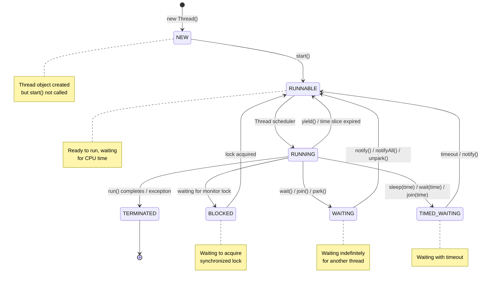
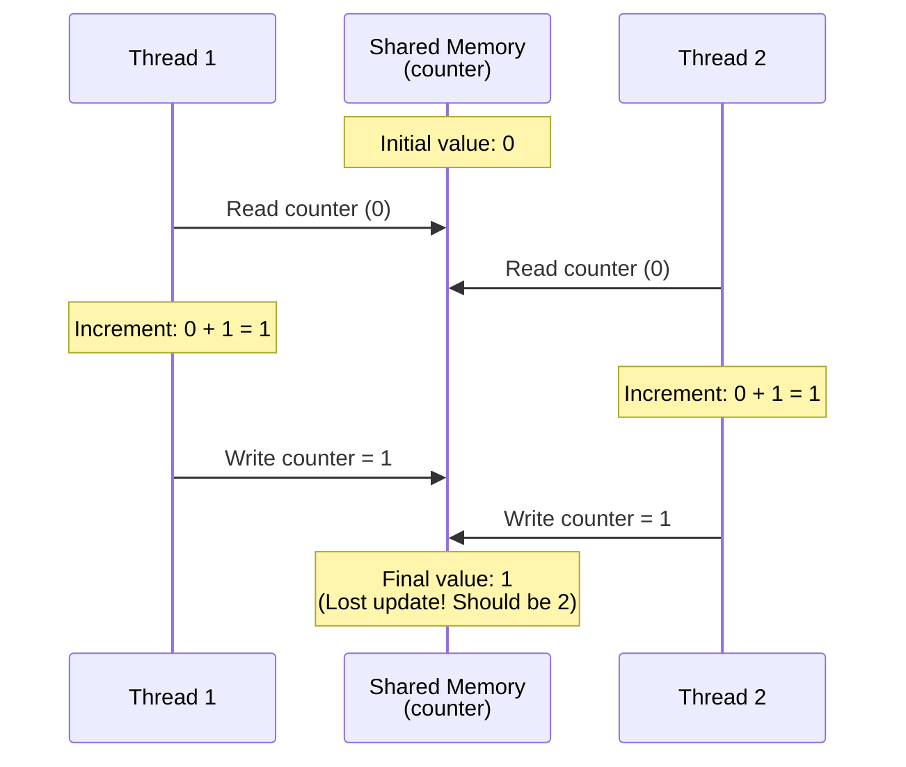
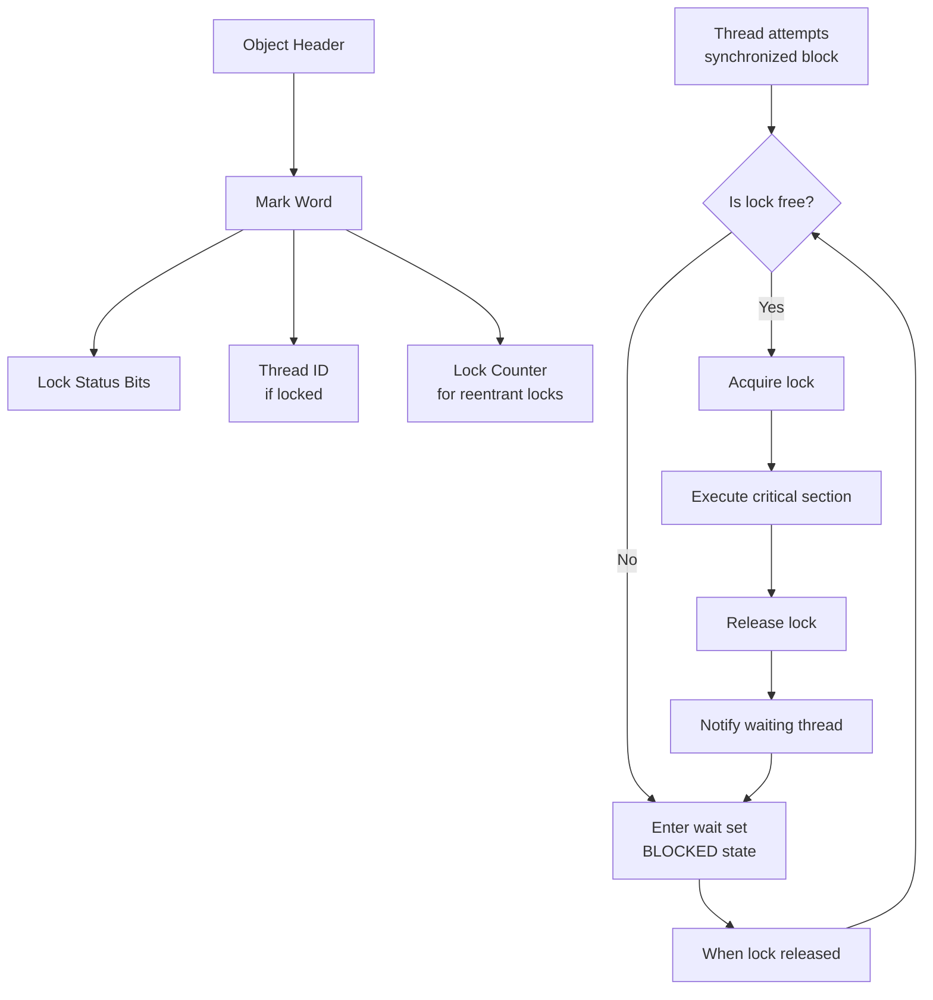
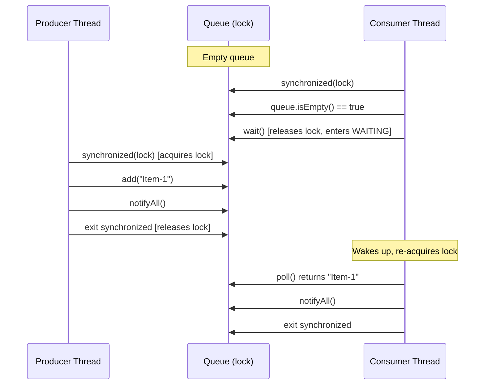
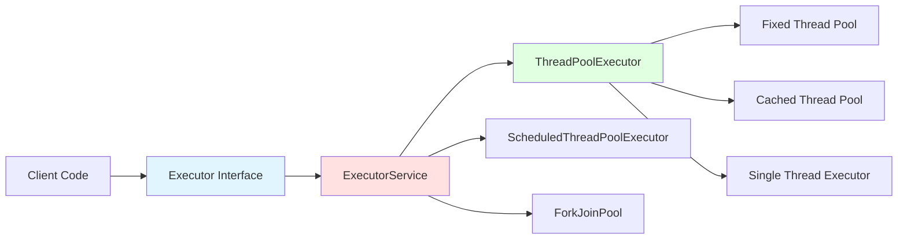
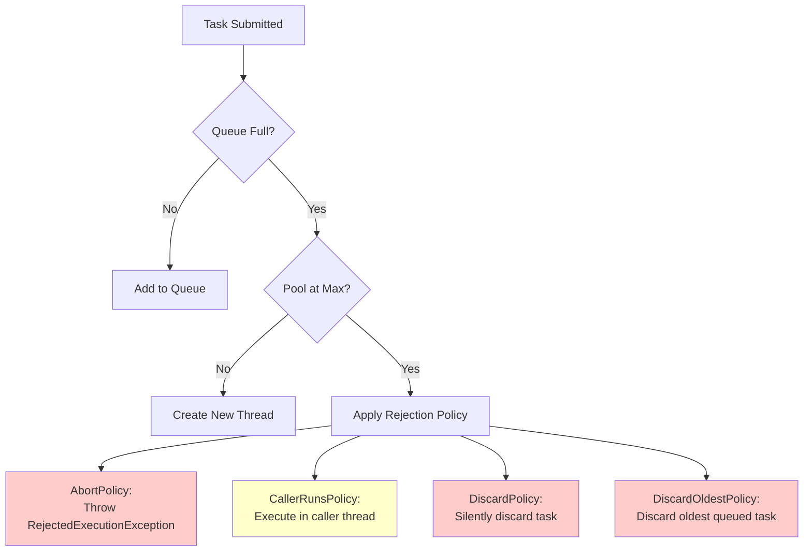
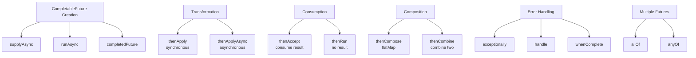

# Java Concurrency Fundamentals - Complete Interview Guide

## Overview

Java concurrency is the ability to execute multiple sequences of operations (threads) simultaneously to achieve better CPU utilization, responsiveness, and throughput. In enterprise banking systems, concurrency is critical for handling thousands of simultaneous transactions, real-time account updates, payment processing, and market data streaming.

Understanding concurrency is essential for senior developers because:
- **Performance**: Modern applications must leverage multi-core processors to handle high-volume transaction processing
- **Scalability**: Concurrent systems can serve multiple users simultaneously without blocking
- **Correctness**: Thread safety issues are among the most difficult bugs to detect and fix, especially in financial systems where data integrity is paramount

Interviewers focus heavily on concurrency for senior roles because it reveals your understanding of:
- Low-level system behaviour and memory models
- Trade-offs between performance and correctness
- Debugging complex production issues
- Designing thread-safe components for enterprise systems

In banking applications, concurrency manifests in:
- **Real-time payment processing**: Multiple concurrent payment requests requiring atomic account updates
- **Market data feeds**: High-frequency data streams requiring concurrent processing without blocking
- **Batch processing**: Parallel processing of large transaction files during end-of-day reconciliation
- **API gateways**: Handling thousands of concurrent API requests with proper thread pool management

---

## Foundational Concepts

### What is Concurrency vs Parallelism?

**Concurrency** is about dealing with multiple tasks at once (structure), while **parallelism** is about doing multiple tasks at once (execution):

- **Concurrency**: Multiple tasks making progress, possibly through time-slicing on a single core
- **Parallelism**: Multiple tasks executing simultaneously on multiple cores

```java
// Concurrency example: One thread switches between tasks
Thread t1 = new Thread(() -> processPayment());
Thread t2 = new Thread(() -> updateAccount());
// Both threads may run on the same CPU core via time-slicing

// Parallelism example: Tasks run simultaneously on different cores
ForkJoinPool.commonPool().submit(() -> processPayment());
ForkJoinPool.commonPool().submit(() -> updateAccount());
// These genuinely execute at the same time on different cores
```

### Why Multithreading?

1. **Better CPU utilization**: Modern CPUs have multiple cores; single-threaded applications waste resources
2. **Improved responsiveness**: UI remains responsive while background tasks execute
3. **Faster execution**: Parallel processing of independent tasks reduces overall time
4. **Asynchronous operations**: Non-blocking I/O operations (network calls, database queries)

### The Concurrency Challenge

While concurrency provides benefits, it introduces complexity:
- **Race conditions**: Multiple threads accessing shared data without proper synchronization
- **Deadlocks**: Threads waiting for each other to release locks
- **Visibility issues**: Changes made by one thread not visible to others
- **Atomicity violations**: Compound operations not executing as a single unit
- **Performance overhead**: Synchronization mechanisms have costs

---

## Part 1: Thread Basics

### 1.1 Thread Creation

There are four main ways to create threads in Java:

#### Method 1: Extending Thread Class

```java
/**
 * Traditional approach: Extend Thread class and override run()
 *
 * Disadvantages:
 * - Cannot extend another class (single inheritance limitation)
 * - Tightly couples thread behaviour with Thread class
 * - Less flexible for reuse
 */
public class PaymentProcessor extends Thread {
    private final String paymentId;

    public PaymentProcessor(String paymentId) {
        this.paymentId = paymentId;
    }

    @Override
    public void run() {
        // This code executes in a separate thread
        System.out.println("Processing payment: " + paymentId +
                         " in thread: " + Thread.currentThread().getName());

        try {
            // Simulate payment processing
            Thread.sleep(2000);
            System.out.println("Payment " + paymentId + " completed");
        } catch (InterruptedException e) {
            // Thread was interrupted during sleep
            Thread.currentThread().interrupt(); // Restore interrupt status
            System.err.println("Payment processing interrupted");
        }
    }

    public static void main(String[] args) {
        PaymentProcessor processor = new PaymentProcessor("PAY-001");
        processor.start(); // Start the thread (calls run() internally)
        // processor.run(); // WRONG! This executes in the main thread, not a new thread
    }
}
```

#### Method 2: Implementing Runnable Interface (Preferred)

```java
/**
 * Preferred approach: Implement Runnable interface
 *
 * Advantages:
 * - Can extend another class if needed
 * - Better separation of task from thread execution
 * - More flexible and reusable
 * - Can be used with Executor framework
 */
public class AccountUpdateTask implements Runnable {
    private final String accountId;
    private final BigDecimal amount;

    public AccountUpdateTask(String accountId, BigDecimal amount) {
        this.accountId = accountId;
        this.amount = amount;
    }

    @Override
    public void run() {
        System.out.println("Updating account: " + accountId +
                         " with amount: " + amount);

        try {
            // Simulate database update
            Thread.sleep(1000);
            System.out.println("Account " + accountId + " updated successfully");
        } catch (InterruptedException e) {
            Thread.currentThread().interrupt();
            System.err.println("Account update interrupted");
        }
    }

    public static void main(String[] args) {
        Runnable task = new AccountUpdateTask("ACC-12345", new BigDecimal("1000.00"));
        Thread thread = new Thread(task);
        thread.start();
    }
}
```

#### Method 3: Lambda Expressions (Java 8+)

```java
/**
 * Modern approach: Use lambda expressions for simple tasks
 * Cleaner and more concise for simple operations
 */
public class ConcurrencyExample {
    public static void main(String[] args) {
        // Simple inline task
        Thread t1 = new Thread(() -> {
            System.out.println("Processing transaction in: " +
                             Thread.currentThread().getName());
        });
        t1.start();

        // More complex task with multiple statements
        Thread t2 = new Thread(() -> {
            for (int i = 0; i < 5; i++) {
                System.out.println("Transaction " + i + " processed");
                try {
                    Thread.sleep(500);
                } catch (InterruptedException e) {
                    Thread.currentThread().interrupt();
                }
            }
        });
        t2.start();
    }
}
```

#### Method 4: Using Callable with ExecutorService (Returns Result)

```java
import java.util.concurrent.*;

/**
 * Callable interface for tasks that return a result
 * This is covered in detail in the Executor framework section
 */
public class CallableExample {
    public static void main(String[] args) throws ExecutionException, InterruptedException {
        Callable<BigDecimal> balanceCalculation = () -> {
            // Simulate complex calculation
            Thread.sleep(1000);
            return new BigDecimal("50000.00");
        };

        ExecutorService executor = Executors.newSingleThreadExecutor();
        Future<BigDecimal> future = executor.submit(balanceCalculation);

        // Do other work while calculation runs
        System.out.println("Calculation in progress...");

        // Get the result (blocks if not ready)
        BigDecimal balance = future.get();
        System.out.println("Calculated balance: " + balance);

        executor.shutdown();
    }
}
```

### 1.2 Thread Lifecycle

A thread goes through several states during its lifetime:



#### Thread States Explained

```java
/**
 * Demonstrating different thread states
 */
public class ThreadStateDemo {
    public static void main(String[] args) throws InterruptedException {
        final Object lock = new Object();

        // NEW state
        Thread t1 = new Thread(() -> {
            synchronized (lock) {
                try {
                    lock.wait(); // WAITING state
                } catch (InterruptedException e) {
                    Thread.currentThread().interrupt();
                }
            }
        });
        System.out.println("T1 state after creation: " + t1.getState()); // NEW

        t1.start();
        Thread.sleep(100); // Give t1 time to acquire lock and wait
        System.out.println("T1 state after wait(): " + t1.getState()); // WAITING

        // TIMED_WAITING state
        Thread t2 = new Thread(() -> {
            try {
                Thread.sleep(10000); // Sleep for 10 seconds
            } catch (InterruptedException e) {
                Thread.currentThread().interrupt();
            }
        });
        t2.start();
        Thread.sleep(100);
        System.out.println("T2 state during sleep(): " + t2.getState()); // TIMED_WAITING

        // BLOCKED state
        Thread t3 = new Thread(() -> {
            synchronized (lock) { // Will be blocked as t1 holds the lock
                System.out.println("T3 acquired lock");
            }
        });
        t3.start();
        Thread.sleep(100);
        System.out.println("T3 state while waiting for lock: " + t3.getState()); // BLOCKED

        // Cleanup
        synchronized (lock) {
            lock.notify(); // Wake up t1
        }
        t1.join();
        t2.interrupt();
        t3.join();
    }
}
```

### 1.3 Thread Methods

#### start() vs run()

```java
/**
 * Critical difference: start() creates a new thread, run() doesn't
 */
public class StartVsRun {
    public static void main(String[] args) {
        Thread t1 = new Thread(() -> {
            System.out.println("Running in: " + Thread.currentThread().getName());
        });

        // Correct: Creates new thread
        t1.start(); // Output: Running in: Thread-0

        // Incorrect: Executes in main thread (no new thread created)
        t1.run();   // Output: Running in: main
    }
}
```

#### join() - Waiting for Thread Completion

```java
/**
 * join() makes the current thread wait until the specified thread completes
 * Essential for coordinating thread execution order
 */
public class JoinExample {
    public static void main(String[] args) throws InterruptedException {
        Thread dataFetch = new Thread(() -> {
            System.out.println("Fetching customer data...");
            try {
                Thread.sleep(2000); // Simulate database query
            } catch (InterruptedException e) {
                Thread.currentThread().interrupt();
            }
            System.out.println("Data fetched");
        });

        Thread dataProcess = new Thread(() -> {
            System.out.println("Processing customer data...");
            try {
                Thread.sleep(1000);
            } catch (InterruptedException e) {
                Thread.currentThread().interrupt();
            }
            System.out.println("Data processed");
        });

        dataFetch.start();
        dataFetch.join(); // Wait for data fetch to complete before processing

        dataProcess.start();
        dataProcess.join(); // Wait for processing to complete

        System.out.println("All operations completed");
    }
}
```

#### sleep() - Pausing Thread Execution

```java
/**
 * Thread.sleep() pauses the current thread for specified milliseconds
 * - Does NOT release locks (unlike wait())
 * - Can be interrupted (throws InterruptedException)
 */
public class SleepExample {
    public static void main(String[] args) {
        Thread retryMechanism = new Thread(() -> {
            int attempts = 0;
            while (attempts < 3) {
                try {
                    System.out.println("Attempt " + (++attempts) + " to connect to payment gateway");

                    // Simulate connection attempt
                    if (Math.random() > 0.7) { // 30% success rate
                        System.out.println("Connected successfully!");
                        break;
                    } else {
                        System.out.println("Connection failed, retrying in 2 seconds...");
                        Thread.sleep(2000); // Wait before retry
                    }
                } catch (InterruptedException e) {
                    Thread.currentThread().interrupt();
                    System.err.println("Retry interrupted");
                    break;
                }
            }
        });

        retryMechanism.start();
    }
}
```

#### yield() - Suggesting Thread Scheduler

```java
/**
 * Thread.yield() is a hint to the scheduler that the current thread
 * is willing to yield its current use of the CPU
 *
 * Note: This is rarely used in practice and behaviour is platform-dependent
 */
public class YieldExample {
    public static void main(String[] args) {
        Runnable task = () -> {
            for (int i = 0; i < 5; i++) {
                System.out.println(Thread.currentThread().getName() + " - Count: " + i);
                Thread.yield(); // Hint to scheduler to give other threads a chance
            }
        };

        Thread t1 = new Thread(task, "Thread-1");
        Thread t2 = new Thread(task, "Thread-2");

        t1.start();
        t2.start();
    }
}
```

#### interrupt() - Interrupting a Thread

```java
/**
 * Interrupting is a cooperative mechanism - thread must check and respond
 * Used for graceful shutdown of long-running tasks
 */
public class InterruptExample {
    public static void main(String[] args) throws InterruptedException {
        Thread longRunningTask = new Thread(() -> {
            try {
                while (!Thread.currentThread().isInterrupted()) {
                    System.out.println("Processing batch transactions...");

                    // Simulate processing
                    Thread.sleep(1000);

                    // Periodically check interrupt status
                    if (Thread.interrupted()) { // Clears interrupt flag
                        System.out.println("Interrupt detected, cleaning up...");
                        break;
                    }
                }
            } catch (InterruptedException e) {
                // InterruptedException clears the interrupt flag
                // Restore it if needed for higher-level code
                Thread.currentThread().interrupt();
                System.out.println("Task interrupted during sleep");
            }

            System.out.println("Task shutdown complete");
        });

        longRunningTask.start();
        Thread.sleep(3500); // Let it run for 3.5 seconds

        System.out.println("Requesting task interruption...");
        longRunningTask.interrupt(); // Request interruption

        longRunningTask.join(); // Wait for graceful shutdown
        System.out.println("Main thread completed");
    }
}
```

### 1.4 Daemon Threads

```java
/**
 * Daemon threads are background threads that don't prevent JVM shutdown
 *
 * Use cases:
 * - Garbage collection
 * - Background monitoring
 * - Housekeeping tasks
 *
 * Important: JVM terminates when only daemon threads remain
 */
public class DaemonThreadExample {
    public static void main(String[] args) throws InterruptedException {
        // Non-daemon thread (user thread)
        Thread userThread = new Thread(() -> {
            System.out.println("User thread started");
            try {
                Thread.sleep(2000);
            } catch (InterruptedException e) {
                Thread.currentThread().interrupt();
            }
            System.out.println("User thread completed");
        });

        // Daemon thread for monitoring
        Thread daemonThread = new Thread(() -> {
            while (true) {
                System.out.println("Daemon: Monitoring system...");
                try {
                    Thread.sleep(500);
                } catch (InterruptedException e) {
                    Thread.currentThread().interrupt();
                    break;
                }
            }
            // This might not print as JVM may exit before this line
            System.out.println("Daemon thread terminated");
        });

        daemonThread.setDaemon(true); // MUST be called before start()

        userThread.start();
        daemonThread.start();

        // Main thread waits for user thread
        userThread.join();

        System.out.println("Main thread ending - daemon will be terminated");
        // JVM exits, daemon thread is abruptly terminated
    }
}
```

### Thread Priority

```java
/**
 * Thread priority is a hint to the thread scheduler
 * Range: Thread.MIN_PRIORITY (1) to Thread.MAX_PRIORITY (10)
 * Default: Thread.NORM_PRIORITY (5)
 *
 * Note: Priority behaviour is platform-dependent and not guaranteed
 */
public class ThreadPriorityExample {
    public static void main(String[] args) {
        Thread highPriority = new Thread(() -> {
            System.out.println("High priority task: Real-time payment processing");
        });

        Thread lowPriority = new Thread(() -> {
            System.out.println("Low priority task: Report generation");
        });

        highPriority.setPriority(Thread.MAX_PRIORITY);   // 10
        lowPriority.setPriority(Thread.MIN_PRIORITY);    // 1

        // Higher priority threads have better chance of being scheduled first
        // but this is NOT guaranteed
        lowPriority.start();
        highPriority.start();
    }
}
```

---

## Part 2: Synchronization

### 2.1 The Need for Synchronization

Without synchronization, concurrent access to shared mutable data leads to **race conditions**:

```java
/**
 * BROKEN CODE: Race condition example
 * Multiple threads accessing shared counter without synchronization
 */
public class RaceConditionExample {
    private static int counter = 0; // Shared mutable state

    public static void main(String[] args) throws InterruptedException {
        Runnable increment = () -> {
            for (int i = 0; i < 1000; i++) {
                counter++; // NOT atomic! Read-Modify-Write operation
            }
        };

        Thread t1 = new Thread(increment);
        Thread t2 = new Thread(increment);

        t1.start();
        t2.start();

        t1.join();
        t2.join();

        // Expected: 2000, Actual: Usually less (e.g., 1543, 1891, etc.)
        System.out.println("Counter value: " + counter);
    }
}
```

**Why does this fail?**

The operation `counter++` is not atomic. It consists of three steps:
1. **Read**: Load current value from memory
2. **Modify**: Increment the value
3. **Write**: Store updated value back to memory



### 2.2 synchronized Keyword

The `synchronized` keyword ensures **mutual exclusion** - only one thread can execute a synchronized block/method at a time.

#### Method-Level Synchronization

```java
/**
 * Method-level synchronization
 * Synchronized instance methods lock on 'this'
 * Synchronized static methods lock on the Class object
 */
public class BankAccount {
    private BigDecimal balance;

    public BankAccount(BigDecimal initialBalance) {
        this.balance = initialBalance;
    }

    /**
     * Synchronized instance method - locks on 'this' object
     * Only one thread can execute this method on a particular instance at a time
     */
    public synchronized void deposit(BigDecimal amount) {
        System.out.println(Thread.currentThread().getName() + " depositing: " + amount);

        // Simulate processing time
        try {
            Thread.sleep(100);
        } catch (InterruptedException e) {
            Thread.currentThread().interrupt();
        }

        balance = balance.add(amount);
        System.out.println(Thread.currentThread().getName() + " new balance: " + balance);
    }

    /**
     * Synchronized instance method - also locks on 'this'
     */
    public synchronized void withdraw(BigDecimal amount) {
        if (balance.compareTo(amount) >= 0) {
            balance = balance.subtract(amount);
            System.out.println("Withdrawn: " + amount + ", remaining: " + balance);
        } else {
            System.out.println("Insufficient funds");
        }
    }

    /**
     * Synchronized getter - ensures visibility of balance changes
     */
    public synchronized BigDecimal getBalance() {
        return balance;
    }

    /**
     * Static synchronized method - locks on BankAccount.class object
     */
    public static synchronized void printBankInfo() {
        System.out.println("Banking System v1.0");
    }
}
```

#### Block-Level Synchronization (Preferred)

```java
/**
 * Block-level synchronization provides finer-grained control
 * Only synchronize the critical section, not the entire method
 */
public class BankAccountOptimized {
    private BigDecimal balance;
    private final Object lock = new Object(); // Dedicated lock object

    public BankAccountOptimized(BigDecimal initialBalance) {
        this.balance = initialBalance;
    }

    public void deposit(BigDecimal amount) {
        // Pre-processing (no synchronization needed)
        validateAmount(amount);
        logTransaction("DEPOSIT", amount);

        // Critical section - only this needs synchronization
        synchronized (lock) {
            balance = balance.add(amount);
        }

        // Post-processing (no synchronization needed)
        notifyCustomer("Deposit successful");
    }

    public void withdraw(BigDecimal amount) {
        synchronized (lock) {
            if (balance.compareTo(amount) >= 0) {
                balance = balance.subtract(amount);
            } else {
                throw new IllegalStateException("Insufficient funds");
            }
        }
    }

    public BigDecimal getBalance() {
        synchronized (lock) {
            return balance;
        }
    }

    private void validateAmount(BigDecimal amount) {
        if (amount.compareTo(BigDecimal.ZERO) <= 0) {
            throw new IllegalArgumentException("Amount must be positive");
        }
    }

    private void logTransaction(String type, BigDecimal amount) {
        // Logging logic (can be slow, should not be synchronized)
    }

    private void notifyCustomer(String message) {
        // Notification logic
    }
}
```

### 2.3 Intrinsic Locks (Monitors)

Every Java object has an intrinsic lock (monitor):



**Key Characteristics:**

1. **Reentrant**: A thread can acquire the same lock multiple times
2. **Exclusive**: Only one thread can hold the lock at a time
3. **Automatic**: Lock is automatically released when exiting synchronized block (even with exceptions)

```java
/**
 * Demonstrating lock reentrance
 */
public class ReentrantLockDemo {
    public synchronized void methodA() {
        System.out.println("In methodA");
        methodB(); // Can call another synchronized method - reentrant
    }

    public synchronized void methodB() {
        System.out.println("In methodB");
        // Same thread can acquire the same lock multiple times
    }

    public static void main(String[] args) {
        ReentrantLockDemo demo = new ReentrantLockDemo();
        demo.methodA(); // Works fine - lock acquired twice, released twice
    }
}
```

### 2.4 Visibility and Atomicity

Synchronization provides two guarantees:

1. **Mutual Exclusion** (Atomicity): Only one thread executes synchronized code at a time
2. **Memory Visibility**: Changes made by one thread are visible to other threads

```java
/**
 * Demonstrating visibility issues
 */
public class VisibilityProblem {
    private static boolean flag = false;

    public static void main(String[] args) throws InterruptedException {
        // Reader thread
        Thread reader = new Thread(() -> {
            while (!flag) {
                // Without synchronization or volatile, this might loop forever
                // JVM might cache 'flag' value and never see the update
            }
            System.out.println("Flag is now true!");
        });

        reader.start();
        Thread.sleep(1000);

        // Writer thread
        flag = true; // Without proper synchronization, reader might not see this
        System.out.println("Flag set to true");

        reader.join();
    }
}
```

### 2.5 volatile Keyword

`volatile` ensures visibility without mutual exclusion:

```java
/**
 * volatile guarantees:
 * 1. Visibility: Writes to volatile variables are immediately visible to all threads
 * 2. Ordering: Prevents instruction reordering around volatile variables
 *
 * Does NOT guarantee atomicity for compound operations
 */
public class VolatileExample {
    private volatile boolean shutdownRequested = false;
    private volatile int counter = 0; // Visibility guaranteed, atomicity NOT guaranteed

    public void shutdown() {
        shutdownRequested = true; // Immediately visible to all threads
    }

    public void run() {
        while (!shutdownRequested) {
            // Process tasks
            // shutdownRequested changes will be immediately visible
        }
        System.out.println("Shutdown gracefully");
    }

    public void incrementCounter() {
        counter++; // STILL NOT THREAD-SAFE!
        // counter++ is read-modify-write, not atomic even with volatile
    }
}
```

**When to use volatile:**
- Single writes, multiple reads (e.g., status flags)
- No compound operations (like increment)
- When you need visibility but not atomicity

**Volatile vs Synchronized:**

| Feature | volatile | synchronized |
|---------|----------|--------------|
| Visibility | Yes | Yes |
| Atomicity | No | Yes |
| Can block threads | No | Yes (if lock not available) |
| Performance | Faster (no locking) | Slower (locking overhead) |
| Use case | Simple flags, status variables | Critical sections with compound operations |

### 2.6 wait(), notify(), and notifyAll()

These methods enable **inter-thread communication** and must be called from synchronized context:

```java
/**
 * Producer-Consumer pattern using wait/notify
 * Classic example of thread coordination
 */
public class ProducerConsumer {
    private final Queue<String> queue = new LinkedList<>();
    private final int MAX_SIZE = 5;
    private final Object lock = new Object();

    /**
     * Producer adds items to queue
     * Waits if queue is full
     */
    public void produce(String item) throws InterruptedException {
        synchronized (lock) {
            // Wait while queue is full
            while (queue.size() == MAX_SIZE) {
                System.out.println("Queue full, producer waiting...");
                lock.wait(); // Releases lock and waits
            }

            queue.add(item);
            System.out.println("Produced: " + item + ", Queue size: " + queue.size());

            lock.notifyAll(); // Notify waiting consumers
        }
    }

    /**
     * Consumer removes items from queue
     * Waits if queue is empty
     */
    public String consume() throws InterruptedException {
        synchronized (lock) {
            // Wait while queue is empty
            while (queue.isEmpty()) {
                System.out.println("Queue empty, consumer waiting...");
                lock.wait(); // Releases lock and waits
            }

            String item = queue.poll();
            System.out.println("Consumed: " + item + ", Queue size: " + queue.size());

            lock.notifyAll(); // Notify waiting producers
            return item;
        }
    }

    public static void main(String[] args) {
        ProducerConsumer pc = new ProducerConsumer();

        // Producer thread
        Thread producer = new Thread(() -> {
            try {
                for (int i = 1; i <= 10; i++) {
                    pc.produce("Item-" + i);
                    Thread.sleep(100);
                }
            } catch (InterruptedException e) {
                Thread.currentThread().interrupt();
            }
        });

        // Consumer thread
        Thread consumer = new Thread(() -> {
            try {
                for (int i = 1; i <= 10; i++) {
                    pc.consume();
                    Thread.sleep(300); // Slower than producer
                }
            } catch (InterruptedException e) {
                Thread.currentThread().interrupt();
            }
        });

        producer.start();
        consumer.start();
    }
}
```

**wait() vs sleep():**

| Feature | wait() | sleep() |
|---------|--------|---------|
| Must be in synchronized block | Yes | No |
| Releases lock | Yes | No |
| Can be woken up | Yes (notify/notifyAll) | No (only timeout or interrupt) |
| Method location | Object class | Thread class |
| Purpose | Thread coordination | Pause execution |



**Critical Rules:**
1. Always use `wait()` in a loop (check condition after waking up)
2. Always call from synchronized context
3. Prefer `notifyAll()` over `notify()` (safer, avoids missed signals)

---

## Part 3: Concurrency Utilities (java.util.concurrent)

The `java.util.concurrent` package (Java 5+) provides high-level concurrency tools that are more powerful and less error-prone than low-level synchronization.

### 3.1 Executor Framework

The Executor framework separates task submission from task execution:



#### Basic Executor Interface

```java
import java.util.concurrent.*;

/**
 * Executor provides a simple way to execute tasks
 */
public class ExecutorBasics {
    public static void main(String[] args) {
        // Simple executor
        Executor executor = (Runnable r) -> new Thread(r).start();

        executor.execute(() -> System.out.println("Task executed"));

        // More useful: ExecutorService
        ExecutorService service = Executors.newFixedThreadPool(3);

        // Submit multiple tasks
        for (int i = 1; i <= 5; i++) {
            final int taskId = i;
            service.execute(() -> {
                System.out.println("Task " + taskId + " executing in: " +
                                 Thread.currentThread().getName());
            });
        }

        // Shutdown executor
        service.shutdown(); // Graceful shutdown (waits for tasks to complete)
        // service.shutdownNow(); // Forceful shutdown (interrupts running tasks)
    }
}
```

### 3.2 Thread Pools

Thread pools reuse threads to avoid overhead of creating new threads for each task:

#### FixedThreadPool

```java
/**
 * Fixed number of threads
 * Use case: Bounded number of concurrent tasks, predictable load
 */
public class FixedThreadPoolExample {
    public static void main(String[] args) throws InterruptedException {
        // Pool with 4 threads
        ExecutorService executor = Executors.newFixedThreadPool(4);

        // Submit 10 tasks - only 4 execute concurrently
        for (int i = 1; i <= 10; i++) {
            final int taskId = i;
            executor.submit(() -> {
                System.out.println("Task " + taskId + " started in: " +
                                 Thread.currentThread().getName());
                try {
                    Thread.sleep(2000); // Simulate work
                } catch (InterruptedException e) {
                    Thread.currentThread().interrupt();
                }
                System.out.println("Task " + taskId + " completed");
                return taskId;
            });
        }

        executor.shutdown();
        executor.awaitTermination(1, TimeUnit.MINUTES);
        System.out.println("All tasks completed");
    }
}
```

#### CachedThreadPool

```java
/**
 * Creates threads as needed, reuses idle threads
 * Use case: Many short-lived tasks, unpredictable load
 * Warning: Can create unlimited threads if tasks arrive faster than completion
 */
public class CachedThreadPoolExample {
    public static void main(String[] args) {
        ExecutorService executor = Executors.newCachedThreadPool();

        // Submit 100 very short tasks
        for (int i = 1; i <= 100; i++) {
            final int taskId = i;
            executor.submit(() -> {
                System.out.println("Task " + taskId + " in: " +
                                 Thread.currentThread().getName());
                try {
                    Thread.sleep(100); // Very short task
                } catch (InterruptedException e) {
                    Thread.currentThread().interrupt();
                }
            });
        }

        executor.shutdown();
    }
}
```

#### SingleThreadExecutor

```java
/**
 * Single worker thread processes tasks sequentially
 * Use case: Sequential task processing, ordering guarantees needed
 */
public class SingleThreadExecutorExample {
    public static void main(String[] args) {
        ExecutorService executor = Executors.newSingleThreadExecutor();

        // All tasks execute sequentially in same thread
        for (int i = 1; i <= 5; i++) {
            final int taskId = i;
            executor.submit(() -> {
                System.out.println("Processing transaction " + taskId);
                try {
                    Thread.sleep(1000);
                } catch (InterruptedException e) {
                    Thread.currentThread().interrupt();
                }
            });
        }

        executor.shutdown();
    }
}
```

#### ScheduledThreadPool

```java
import java.time.LocalDateTime;
import java.time.format.DateTimeFormatter;
import java.util.concurrent.*;

/**
 * Schedules tasks to run after delay or periodically
 * Use case: Scheduled jobs, periodic health checks, rate limiters
 */
public class ScheduledExecutorExample {
    public static void main(String[] args) throws InterruptedException {
        ScheduledExecutorService scheduler = Executors.newScheduledThreadPool(2);
        DateTimeFormatter formatter = DateTimeFormatter.ofPattern("HH:mm:ss");

        System.out.println("Current time: " + LocalDateTime.now().format(formatter));

        // One-time delayed task
        scheduler.schedule(() -> {
            System.out.println("Delayed task executed at: " +
                             LocalDateTime.now().format(formatter));
        }, 3, TimeUnit.SECONDS);

        // Periodic task with fixed rate (ignores execution time)
        // Executes every 2 seconds from start time
        scheduler.scheduleAtFixedRate(() -> {
            System.out.println("Fixed rate task at: " +
                             LocalDateTime.now().format(formatter));
        }, 0, 2, TimeUnit.SECONDS);

        // Periodic task with fixed delay (waits after completion)
        // Waits 1 second after previous task completes
        scheduler.scheduleWithFixedDelay(() -> {
            System.out.println("Fixed delay task at: " +
                             LocalDateTime.now().format(formatter));
            try {
                Thread.sleep(500); // Simulate work
            } catch (InterruptedException e) {
                Thread.currentThread().interrupt();
            }
        }, 0, 1, TimeUnit.SECONDS);

        Thread.sleep(10000); // Let it run for 10 seconds
        scheduler.shutdown();
    }
}
```

**Thread Pool Comparison:**

| Pool Type | Threads | Queue | Use Case |
|-----------|---------|-------|----------|
| FixedThreadPool | Fixed (n) | Unbounded | Predictable load, resource limits |
| CachedThreadPool | 0 to Integer.MAX | SynchronousQueue | Many short tasks, unpredictable load |
| SingleThreadExecutor | 1 | Unbounded | Sequential processing, ordering |
| ScheduledThreadPool | Fixed (n) | DelayQueue | Scheduled/periodic tasks |
| WorkStealingPool (Java 8+) | CPU cores | Fork-Join | CPU-intensive parallel tasks |

### 3.3 ThreadPoolExecutor - Custom Configuration

```java
/**
 * Custom thread pool configuration for fine-grained control
 * Essential for production banking applications
 */
public class CustomThreadPoolExample {
    public static void main(String[] args) {
        // Custom thread pool parameters
        int corePoolSize = 5;        // Minimum threads to keep alive
        int maximumPoolSize = 10;    // Maximum threads
        long keepAliveTime = 60;     // Time to keep idle threads alive
        TimeUnit unit = TimeUnit.SECONDS;

        // Bounded queue to prevent memory issues
        BlockingQueue<Runnable> workQueue = new LinkedBlockingQueue<>(100);

        // Custom thread factory for meaningful thread names
        ThreadFactory threadFactory = new ThreadFactory() {
            private int counter = 1;

            @Override
            public Thread newThread(Runnable r) {
                Thread t = new Thread(r, "PaymentProcessor-" + counter++);
                t.setDaemon(false); // User threads
                t.setPriority(Thread.NORM_PRIORITY);
                return t;
            }
        };

        // Rejection policy when queue is full
        RejectedExecutionHandler rejectionHandler = new RejectedExecutionHandler() {
            @Override
            public void rejectedExecution(Runnable r, ThreadPoolExecutor executor) {
                // Log rejection and handle gracefully
                System.err.println("Task rejected: " + r.toString());
                // In production: Log to monitoring system, send alert
            }
        };

        ThreadPoolExecutor executor = new ThreadPoolExecutor(
            corePoolSize,
            maximumPoolSize,
            keepAliveTime,
            unit,
            workQueue,
            threadFactory,
            rejectionHandler
        );

        // Enable core thread timeout (allows core threads to die if idle)
        executor.allowCoreThreadTimeOut(true);

        // Monitor thread pool
        executor.submit(() -> {
            System.out.println("Active threads: " + executor.getActiveCount());
            System.out.println("Pool size: " + executor.getPoolSize());
            System.out.println("Queue size: " + executor.getQueue().size());
        });

        executor.shutdown();
    }
}
```

**Rejection Policies:**



### 3.4 Callable and Future

Unlike `Runnable`, `Callable` can return results and throw checked exceptions:

```java
import java.util.concurrent.*;
import java.math.BigDecimal;

/**
 * Callable returns a result, Future represents pending result
 */
public class CallableFutureExample {
    public static void main(String[] args) throws ExecutionException, InterruptedException {
        ExecutorService executor = Executors.newFixedThreadPool(3);

        // Callable for complex calculation
        Callable<BigDecimal> calculateInterest = () -> {
            System.out.println("Calculating interest...");
            Thread.sleep(2000); // Simulate complex calculation

            BigDecimal principal = new BigDecimal("100000");
            BigDecimal rate = new BigDecimal("0.05");
            BigDecimal years = new BigDecimal("10");

            // Simple interest calculation
            return principal.multiply(rate).multiply(years);
        };

        // Submit Callable, get Future
        Future<BigDecimal> future = executor.submit(calculateInterest);

        System.out.println("Calculation submitted, doing other work...");

        // Do other work while calculation runs
        Thread.sleep(1000);

        // Check if calculation is complete
        if (!future.isDone()) {
            System.out.println("Calculation still in progress...");
        }

        // Get result (blocks if not ready)
        BigDecimal interest = future.get(); // Blocking call
        System.out.println("Calculated interest: " + interest);

        // Example with timeout
        Callable<String> apiCall = () -> {
            Thread.sleep(5000); // Slow API call
            return "API Response";
        };

        Future<String> apiFuture = executor.submit(apiCall);

        try {
            // Wait maximum 2 seconds for result
            String result = apiFuture.get(2, TimeUnit.SECONDS);
            System.out.println("API result: " + result);
        } catch (TimeoutException e) {
            System.err.println("API call timed out");
            apiFuture.cancel(true); // Cancel the task
        }

        executor.shutdown();
    }
}
```

**Future Methods:**

```java
/**
 * Future interface methods
 */
public class FutureMethodsExample {
    public static void main(String[] args) throws ExecutionException, InterruptedException {
        ExecutorService executor = Executors.newSingleThreadExecutor();

        Future<String> future = executor.submit(() -> {
            Thread.sleep(3000);
            return "Task result";
        });

        // Check if task is done
        boolean done = future.isDone(); // false initially

        // Check if task was cancelled
        boolean cancelled = future.isCancelled(); // false

        // Cancel the task (mayInterruptIfRunning = true)
        // future.cancel(true);

        // Get result (blocks until ready)
        String result = future.get();

        // Get result with timeout
        // String result2 = future.get(5, TimeUnit.SECONDS);

        executor.shutdown();
    }
}
```

### 3.5 CompletableFuture (Java 8+)

`CompletableFuture` provides a more powerful and flexible way to handle asynchronous programming:

```java
import java.util.concurrent.CompletableFuture;
import java.util.concurrent.ExecutionException;

/**
 * CompletableFuture for advanced asynchronous programming
 * Supports chaining, combining, and composing asynchronous operations
 */
public class CompletableFutureExample {

    public static void main(String[] args) throws ExecutionException, InterruptedException {

        // 1. Simple async task
        CompletableFuture<String> future1 = CompletableFuture.supplyAsync(() -> {
            System.out.println("Fetching customer data in: " + Thread.currentThread().getName());
            sleep(1000);
            return "Customer-12345";
        });

        // 2. Chaining operations with thenApply (synchronous transformation)
        CompletableFuture<String> future2 = future1.thenApply(customerId -> {
            System.out.println("Processing customer: " + customerId);
            return "Account for " + customerId;
        });

        // 3. Chaining with thenAccept (consume result, no return)
        future2.thenAccept(account -> {
            System.out.println("Final result: " + account);
        });

        // 4. Async chaining with thenApplyAsync (runs in different thread)
        CompletableFuture<BigDecimal> balanceFuture = CompletableFuture.supplyAsync(() -> {
            return "ACC-001";
        }).thenApplyAsync(accountId -> {
            System.out.println("Fetching balance for: " + accountId +
                             " in: " + Thread.currentThread().getName());
            sleep(1000);
            return new BigDecimal("50000.00");
        });

        // 5. Combining two independent futures
        CompletableFuture<String> customerFuture = CompletableFuture.supplyAsync(() -> {
            sleep(1000);
            return "John Doe";
        });

        CompletableFuture<String> addressFuture = CompletableFuture.supplyAsync(() -> {
            sleep(1500);
            return "123 Main St";
        });

        // Combine both results
        CompletableFuture<String> combinedFuture = customerFuture.thenCombine(
            addressFuture,
            (customer, address) -> customer + " lives at " + address
        );

        System.out.println("Combined: " + combinedFuture.get());

        // 6. Composing futures (flatMap equivalent)
        CompletableFuture<String> composedFuture = CompletableFuture.supplyAsync(() -> {
            return "CUST-123";
        }).thenCompose(customerId -> {
            // Return another CompletableFuture
            return CompletableFuture.supplyAsync(() -> {
                sleep(1000);
                return "Account for " + customerId;
            });
        });

        // 7. Exception handling
        CompletableFuture<String> futureWithError = CompletableFuture.supplyAsync(() -> {
            if (Math.random() > 0.5) {
                throw new RuntimeException("Random failure");
            }
            return "Success";
        }).exceptionally(ex -> {
            System.err.println("Error occurred: " + ex.getMessage());
            return "Default value";
        }).thenApply(result -> {
            return "Final: " + result;
        });

        System.out.println("Result with error handling: " + futureWithError.get());

        // 8. All of - wait for all futures to complete
        CompletableFuture<String> f1 = CompletableFuture.supplyAsync(() -> {
            sleep(1000);
            return "Task 1";
        });

        CompletableFuture<String> f2 = CompletableFuture.supplyAsync(() -> {
            sleep(1500);
            return "Task 2";
        });

        CompletableFuture<String> f3 = CompletableFuture.supplyAsync(() -> {
            sleep(800);
            return "Task 3";
        });

        CompletableFuture<Void> allOf = CompletableFuture.allOf(f1, f2, f3);
        allOf.thenRun(() -> {
            System.out.println("All tasks completed");
        }).get();

        // 9. Any of - wait for first future to complete
        CompletableFuture<Object> anyOf = CompletableFuture.anyOf(f1, f2, f3);
        System.out.println("First completed: " + anyOf.get());

        Thread.sleep(3000); // Wait for all async tasks to complete
    }

    private static void sleep(long millis) {
        try {
            Thread.sleep(millis);
        } catch (InterruptedException e) {
            Thread.currentThread().interrupt();
        }
    }
}
```

**CompletableFuture Methods:**



### 3.6 Locks (ReentrantLock, ReadWriteLock)

`java.util.concurrent.locks` provides more flexible locking than `synchronized`:

#### ReentrantLock

```java
import java.util.concurrent.locks.Lock;
import java.util.concurrent.locks.ReentrantLock;

/**
 * ReentrantLock provides more features than synchronized:
 * - tryLock() for non-blocking lock attempts
 * - lockInterruptibly() for interruptible lock acquisition
 * - Fairness option
 * - Explicit lock/unlock (more control, but error-prone)
 */
public class ReentrantLockExample {
    private final Lock lock = new ReentrantLock();
    private int balance = 0;

    public void deposit(int amount) {
        lock.lock(); // Acquire lock
        try {
            // Critical section
            balance += amount;
            System.out.println("Deposited: " + amount + ", Balance: " + balance);
        } finally {
            lock.unlock(); // MUST unlock in finally block
        }
    }

    public boolean tryDeposit(int amount) {
        // Try to acquire lock without blocking
        if (lock.tryLock()) {
            try {
                balance += amount;
                System.out.println("Deposited: " + amount);
                return true;
            } finally {
                lock.unlock();
            }
        } else {
            System.out.println("Could not acquire lock, skipping deposit");
            return false;
        }
    }

    public void depositWithTimeout(int amount) throws InterruptedException {
        // Try to acquire lock with timeout
        if (lock.tryLock(2, TimeUnit.SECONDS)) {
            try {
                balance += amount;
                System.out.println("Deposited: " + amount);
            } finally {
                lock.unlock();
            }
        } else {
            System.out.println("Timeout waiting for lock");
        }
    }

    public void depositInterruptibly(int amount) throws InterruptedException {
        // Can be interrupted while waiting for lock
        lock.lockInterruptibly();
        try {
            balance += amount;
        } finally {
            lock.unlock();
        }
    }
}
```

#### Fair vs Unfair Locks

```java
/**
 * Fairness ensures longest-waiting thread gets lock first
 * Unfair (default) allows barging - better performance, less predictable
 */
public class FairLockExample {
    // Fair lock - threads acquire in FIFO order
    private final Lock fairLock = new ReentrantLock(true);

    // Unfair lock (default) - higher throughput, possible starvation
    private final Lock unfairLock = new ReentrantLock(false);

    public void processFairly() {
        fairLock.lock();
        try {
            // Thread that waited longest gets lock first
            System.out.println("Processing in order");
        } finally {
            fairLock.unlock();
        }
    }
}
```

#### ReadWriteLock

```java
import java.util.concurrent.locks.ReadWriteLock;
import java.util.concurrent.locks.ReentrantReadWriteLock;
import java.util.HashMap;
import java.util.Map;

/**
 * ReadWriteLock allows:
 * - Multiple concurrent readers (when no writer)
 * - Single exclusive writer (when no readers/writers)
 *
 * Use case: Mostly reads, infrequent writes (e.g., cache)
 */
public class ReadWriteLockExample {
    private final Map<String, String> cache = new HashMap<>();
    private final ReadWriteLock rwLock = new ReentrantReadWriteLock();

    /**
     * Multiple threads can read concurrently
     */
    public String read(String key) {
        rwLock.readLock().lock();
        try {
            System.out.println(Thread.currentThread().getName() + " reading");
            return cache.get(key);
        } finally {
            rwLock.readLock().unlock();
        }
    }

    /**
     * Only one thread can write at a time
     * Blocks all readers and writers
     */
    public void write(String key, String value) {
        rwLock.writeLock().lock();
        try {
            System.out.println(Thread.currentThread().getName() + " writing");
            Thread.sleep(100); // Simulate slow write
            cache.put(key, value);
        } catch (InterruptedException e) {
            Thread.currentThread().interrupt();
        } finally {
            rwLock.writeLock().unlock();
        }
    }

    public static void main(String[] args) {
        ReadWriteLockExample example = new ReadWriteLockExample();

        // 5 reader threads - can execute concurrently
        for (int i = 0; i < 5; i++) {
            new Thread(() -> {
                example.read("key1");
            }, "Reader-" + i).start();
        }

        // 2 writer threads - execute exclusively
        for (int i = 0; i < 2; i++) {
            final int writerNum = i;
            new Thread(() -> {
                example.write("key" + writerNum, "value" + writerNum);
            }, "Writer-" + i).start();
        }
    }
}
```

**Lock vs Synchronized:**

| Feature | ReentrantLock | synchronized |
|---------|---------------|--------------|
| API | Explicit lock/unlock | Implicit |
| Try lock | Yes (`tryLock()`) | No |
| Timeout | Yes (`tryLock(time)`) | No |
| Interruptible | Yes (`lockInterruptibly()`) | No |
| Fairness | Optional | No |
| Condition variables | Multiple (`newCondition()`) | Single (wait/notify) |
| Performance | Similar | Similar |
| Error-prone | Yes (must unlock in finally) | No (automatic) |
| Flexibility | High | Low |

### 3.7 Atomic Variables

Atomic classes provide lock-free thread-safe operations on single variables:

```java
import java.util.concurrent.atomic.*;

/**
 * Atomic variables use CAS (Compare-And-Swap) operations
 * Lock-free, better performance than synchronized for single variables
 */
public class AtomicExample {

    // Atomic integer
    private AtomicInteger counter = new AtomicInteger(0);

    // Atomic reference
    private AtomicReference<String> status = new AtomicReference<>("IDLE");

    // Atomic long for IDs
    private AtomicLong idGenerator = new AtomicLong(0);

    public void incrementCounter() {
        // Atomic increment - thread-safe without lock
        int newValue = counter.incrementAndGet();
        System.out.println("Counter: " + newValue);
    }

    public void decrementCounter() {
        int newValue = counter.decrementAndGet();
        System.out.println("Counter: " + newValue);
    }

    public void addToCounter(int delta) {
        int newValue = counter.addAndGet(delta);
        System.out.println("Counter: " + newValue);
    }

    public boolean compareAndSetStatus(String expected, String newStatus) {
        // CAS operation: set newStatus only if current value is expected
        boolean updated = status.compareAndSet(expected, newStatus);
        System.out.println("Status update " + (updated ? "succeeded" : "failed"));
        return updated;
    }

    public long generateId() {
        // Thread-safe ID generation
        return idGenerator.incrementAndGet();
    }

    public static void main(String[] args) throws InterruptedException {
        AtomicExample example = new AtomicExample();

        // 100 threads incrementing counter concurrently
        Thread[] threads = new Thread[100];
        for (int i = 0; i < 100; i++) {
            threads[i] = new Thread(() -> {
                for (int j = 0; j < 100; j++) {
                    example.incrementCounter();
                }
            });
            threads[i].start();
        }

        // Wait for all threads
        for (Thread t : threads) {
            t.join();
        }

        System.out.println("Final counter value: " + example.counter.get()); // 10000
    }
}
```

**Common Atomic Classes:**

| Class | Purpose | Use Case |
|-------|---------|----------|
| AtomicInteger | Thread-safe int | Counters, sequence numbers |
| AtomicLong | Thread-safe long | ID generators, large counters |
| AtomicBoolean | Thread-safe boolean | Flags, state indicators |
| AtomicReference<V> | Thread-safe object reference | Immutable object updates |
| AtomicIntegerArray | Thread-safe int array | Parallel computations |
| AtomicReferenceArray<V> | Thread-safe object array | Concurrent data structures |
| LongAdder (Java 8+) | High contention counter | Better than AtomicLong for writes |
| LongAccumulator (Java 8+) | Custom accumulation | Flexible aggregation |

### 3.8 Synchronizers

#### CountDownLatch

```java
import java.util.concurrent.CountDownLatch;

/**
 * CountDownLatch allows threads to wait until a set of operations complete
 * Use case: Wait for multiple services to start before proceeding
 */
public class CountDownLatchExample {
    public static void main(String[] args) throws InterruptedException {
        int numServices = 3;
        CountDownLatch latch = new CountDownLatch(numServices);

        // Service 1: Database initialization
        new Thread(() -> {
            System.out.println("Initializing database...");
            sleep(2000);
            System.out.println("Database ready");
            latch.countDown(); // Decrement count
        }).start();

        // Service 2: Cache initialization
        new Thread(() -> {
            System.out.println("Initializing cache...");
            sleep(1500);
            System.out.println("Cache ready");
            latch.countDown();
        }).start();

        // Service 3: Message queue initialization
        new Thread(() -> {
            System.out.println("Initializing message queue...");
            sleep(1000);
            System.out.println("Message queue ready");
            latch.countDown();
        }).start();

        System.out.println("Waiting for all services to start...");
        latch.await(); // Block until count reaches zero

        System.out.println("All services started, application ready!");
    }

    private static void sleep(long millis) {
        try {
            Thread.sleep(millis);
        } catch (InterruptedException e) {
            Thread.currentThread().interrupt();
        }
    }
}
```

#### CyclicBarrier

```java
import java.util.concurrent.CyclicBarrier;
import java.util.concurrent.BrokenBarrierException;

/**
 * CyclicBarrier allows threads to wait for each other at a common point
 * Reusable (cyclic) - can be used multiple times
 *
 * Use case: Parallel computation where all threads must complete a phase
 * before any can proceed to next phase
 */
public class CyclicBarrierExample {
    public static void main(String[] args) {
        int numWorkers = 3;

        // Barrier action executes when all threads reach barrier
        Runnable barrierAction = () -> {
            System.out.println("All workers completed phase, starting next phase");
        };

        CyclicBarrier barrier = new CyclicBarrier(numWorkers, barrierAction);

        for (int i = 1; i <= numWorkers; i++) {
            final int workerId = i;
            new Thread(() -> {
                try {
                    // Phase 1
                    System.out.println("Worker " + workerId + " - Phase 1");
                    sleep(1000 * workerId);
                    System.out.println("Worker " + workerId + " completed Phase 1");
                    barrier.await(); // Wait for others

                    // Phase 2
                    System.out.println("Worker " + workerId + " - Phase 2");
                    sleep(500 * workerId);
                    System.out.println("Worker " + workerId + " completed Phase 2");
                    barrier.await(); // Wait for others

                    // Phase 3
                    System.out.println("Worker " + workerId + " - Phase 3");

                } catch (InterruptedException | BrokenBarrierException e) {
                    e.printStackTrace();
                }
            }).start();
        }
    }

    private static void sleep(long millis) {
        try {
            Thread.sleep(millis);
        } catch (InterruptedException e) {
            Thread.currentThread().interrupt();
        }
    }
}
```

#### Semaphore

```java
import java.util.concurrent.Semaphore;

/**
 * Semaphore controls access to shared resources with limited capacity
 *
 * Use case: Connection pool, rate limiting, resource throttling
 */
public class SemaphoreExample {
    public static void main(String[] args) {
        // Database connection pool with 3 connections
        Semaphore connectionPool = new Semaphore(3);

        // 10 tasks trying to use database
        for (int i = 1; i <= 10; i++) {
            final int taskId = i;
            new Thread(() -> {
                try {
                    System.out.println("Task " + taskId + " waiting for connection...");
                    connectionPool.acquire(); // Acquire permit (blocks if none available)

                    System.out.println("Task " + taskId + " acquired connection");
                    // Use database connection
                    Thread.sleep(2000);
                    System.out.println("Task " + taskId + " completed");

                } catch (InterruptedException e) {
                    Thread.currentThread().interrupt();
                } finally {
                    connectionPool.release(); // Release permit
                    System.out.println("Task " + taskId + " released connection");
                }
            }).start();
        }
    }
}
```

#### Phaser (Java 7+)

```java
import java.util.concurrent.Phaser;

/**
 * Phaser is a more flexible alternative to CyclicBarrier and CountDownLatch
 * Supports dynamic number of parties and multiple phases
 *
 * Use case: Multi-phase parallel algorithms
 */
public class PhaserExample {
    public static void main(String[] args) {
        Phaser phaser = new Phaser(1); // Register main thread

        for (int i = 1; i <= 3; i++) {
            final int workerId = i;
            phaser.register(); // Register each worker

            new Thread(() -> {
                // Phase 0
                System.out.println("Worker " + workerId + " - Phase 0");
                phaser.arriveAndAwaitAdvance(); // Wait for all

                // Phase 1
                System.out.println("Worker " + workerId + " - Phase 1");
                phaser.arriveAndAwaitAdvance();

                // Phase 2
                System.out.println("Worker " + workerId + " - Phase 2");
                phaser.arriveAndDeregister(); // Final phase, deregister

            }).start();
        }

        // Main thread participates in phases
        phaser.arriveAndAwaitAdvance(); // Phase 0
        System.out.println("Main: Phase 0 complete");

        phaser.arriveAndAwaitAdvance(); // Phase 1
        System.out.println("Main: Phase 1 complete");

        phaser.arriveAndDeregister(); // Final phase
        System.out.println("Main: All phases complete");
    }
}
```

**Synchronizer Comparison:**

| Synchronizer | Purpose | Reusable | Parties | Use Case |
|--------------|---------|----------|---------|----------|
| CountDownLatch | Wait for N operations | No | Fixed | Service startup, batch completion |
| CyclicBarrier | Sync at common point | Yes | Fixed | Multi-phase parallel algorithms |
| Semaphore | Limit concurrent access | Yes | Variable | Resource pools, rate limiting |
| Phaser | Multi-phase coordination | Yes | Dynamic | Complex parallel workflows |

---

## Part 4: Java Memory Model and Thread Safety

### 4.1 Happens-Before Relationship

The happens-before relationship guarantees memory visibility between actions:

```mermaid
graph TD
    A[Thread 1 Action] -->|Happens-Before| B[Thread 2 Action]

    C[Write to variable] -->|Happens-Before| D[Read of same variable<br/>if synchronized]

    E[Rules] --> F[Program Order Rule:<br/>Each action in thread<br/>happens-before subsequent actions]
    E --> G[Monitor Lock Rule:<br/>Unlock happens-before<br/>subsequent lock]
    E --> H[Volatile Variable Rule:<br/>Write happens-before<br/>subsequent read]
    E --> I[Thread Start Rule:<br/>start() happens-before<br/>any action in started thread]
    E --> J[Thread Termination Rule:<br/>Actions in thread happen-before<br/>join() returns]
    E --> K[Interruption Rule:<br/>interrupt() happens-before<br/>detecting interrupt]
    E --> L[Finalizer Rule:<br/>Constructor happens-before<br/>finalizer]
    E --> M[Transitivity:<br/>A happens-before B,<br/>B happens-before C<br/>=> A happens-before C]
```

### 4.2 Thread-Safe Collections

```java
import java.util.concurrent.*;
import java.util.*;

/**
 * Thread-safe collection alternatives
 */
public class ThreadSafeCollections {

    public static void main(String[] args) {
        // 1. ConcurrentHashMap - thread-safe HashMap
        Map<String, Integer> concurrentMap = new ConcurrentHashMap<>();
        concurrentMap.put("key1", 1);
        concurrentMap.putIfAbsent("key2", 2); // Atomic operation
        concurrentMap.compute("key1", (k, v) -> v + 1); // Atomic update

        // 2. CopyOnWriteArrayList - thread-safe ArrayList
        // Best for mostly reads, infrequent writes
        List<String> cowList = new CopyOnWriteArrayList<>();
        cowList.add("Item1");
        // Writes create copy of underlying array

        // 3. ConcurrentLinkedQueue - thread-safe queue
        Queue<String> queue = new ConcurrentLinkedQueue<>();
        queue.offer("Task1");
        String task = queue.poll();

        // 4. BlockingQueue - thread-safe queue with blocking operations
        BlockingQueue<String> blockingQueue = new LinkedBlockingQueue<>(10);
        try {
            blockingQueue.put("Task"); // Blocks if queue full
            String item = blockingQueue.take(); // Blocks if queue empty
        } catch (InterruptedException e) {
            Thread.currentThread().interrupt();
        }

        // 5. ConcurrentSkipListMap - thread-safe sorted map
        ConcurrentNavigableMap<String, Integer> sortedMap = new ConcurrentSkipListMap<>();
        sortedMap.put("A", 1);
        sortedMap.put("C", 3);
        sortedMap.put("B", 2);

        // 6. Synchronized wrappers (legacy approach, less efficient)
        List<String> syncList = Collections.synchronizedList(new ArrayList<>());
        synchronized (syncList) { // Must synchronize for iteration
            for (String s : syncList) {
                System.out.println(s);
            }
        }
    }
}
```

**Thread-Safe Collection Performance:**

| Collection | Read Performance | Write Performance | Use Case |
|------------|------------------|-------------------|----------|
| ConcurrentHashMap | Excellent | Good | General-purpose map |
| CopyOnWriteArrayList | Excellent | Poor | Mostly reads |
| ConcurrentLinkedQueue | Good | Good | Non-blocking queue |
| LinkedBlockingQueue | Good | Good | Producer-consumer |
| ConcurrentSkipListMap | Good | Good | Sorted concurrent map |
| Synchronized wrappers | Poor | Poor | Legacy code only |

---

## Interview Questions & Answers

### Foundational Questions (Junior/Mid-Level)

**Q1: What is the difference between `start()` and `run()` methods in Thread?**

**Answer:**
- `start()`: Creates a new thread and executes the `run()` method in that new thread. Each thread object can only call `start()` once.
- `run()`: Simply executes the code in the current thread (like any regular method call). No new thread is created.

```java
Thread t = new Thread(() -> System.out.println(Thread.currentThread().getName()));
t.start(); // Output: Thread-0 (new thread)
t.run();   // Output: main (current thread)
```

**Q2: What are the different states of a thread?**

**Answer:**
A thread goes through six states:
1. **NEW**: Thread created but not started
2. **RUNNABLE**: Thread executing or ready to execute (waiting for CPU)
3. **BLOCKED**: Waiting to acquire a monitor lock
4. **WAITING**: Waiting indefinitely for another thread (via `wait()`, `join()`, `park()`)
5. **TIMED_WAITING**: Waiting for specified time (via `sleep()`, `wait(timeout)`, `join(timeout)`)
6. **TERMINATED**: Thread has completed execution

**Q3: What is the difference between `sleep()` and `wait()`?**

**Answer:**

| Feature | sleep() | wait() |
|---------|---------|--------|
| Lock release | Does NOT release lock | Releases lock |
| Class | Thread class | Object class |
| Synchronized context | Not required | Required (must be in synchronized) |
| Wake up | Only by timeout or interrupt | By notify/notifyAll or timeout |
| Purpose | Pause execution | Thread coordination |

**Q4: What is a daemon thread?**

**Answer:**
A daemon thread is a background thread that doesn't prevent JVM shutdown. When only daemon threads remain, JVM terminates automatically. Used for housekeeping tasks like garbage collection.

```java
Thread daemon = new Thread(() -> {
    while (true) {
        // Monitoring task
    }
});
daemon.setDaemon(true); // Must be called before start()
daemon.start();
```

**Q5: What is synchronization and why is it needed?**

**Answer:**
Synchronization is a mechanism to control access to shared resources by multiple threads. It's needed to:
1. **Prevent race conditions**: Ensure thread-safe access to shared mutable data
2. **Ensure visibility**: Make changes by one thread visible to others
3. **Provide atomicity**: Ensure compound operations execute as a single unit

Without synchronization, concurrent access can lead to data corruption, lost updates, and inconsistent state.

### Intermediate Questions (Mid/Senior-Level)

**Q6: Explain the difference between synchronized method and synchronized block.**

**Answer:**
- **Synchronized method**: Entire method is synchronized, locks on `this` (instance methods) or Class object (static methods)
- **Synchronized block**: Only specific section is synchronized, can lock on any object

Synchronized blocks are preferred because:
1. **Finer granularity**: Only critical section is locked
2. **Better performance**: Reduces lock contention
3. **Flexible**: Can choose lock object

```java
// Synchronized method - locks entire method
public synchronized void deposit(int amount) {
    balance += amount;
}

// Synchronized block - only critical section locked
public void depositOptimized(int amount) {
    validateAmount(amount); // No lock needed
    synchronized (lock) {
        balance += amount; // Only this needs lock
    }
    logTransaction(amount); // No lock needed
}
```

**Q7: What is the volatile keyword and when should you use it?**

**Answer:**
`volatile` ensures:
1. **Visibility**: Writes are immediately visible to all threads (no caching)
2. **Ordering**: Prevents instruction reordering around volatile variables

Use when:
- Simple flag or status variable
- Single writes, multiple reads
- No compound operations (like increment)

Does NOT provide atomicity for operations like `++`.

```java
private volatile boolean shutdownFlag = false; // Good use

private volatile int counter = 0;
public void increment() {
    counter++; // BAD! Not thread-safe despite volatile
}
```

**Q8: What is the difference between CountDownLatch and CyclicBarrier?**

**Answer:**

| Feature | CountDownLatch | CyclicBarrier |
|---------|----------------|---------------|
| Reusable | No | Yes (cyclic) |
| Waiting threads | Waiting threads don't decrement | All threads wait for each other |
| Use case | Wait for N operations | Synchronize N threads at common point |
| Reset | Cannot reset | Resets automatically |

**CountDownLatch**: Main thread waits for worker threads
```java
CountDownLatch latch = new CountDownLatch(3);
// Workers call latch.countDown()
latch.await(); // Main waits
```

**CyclicBarrier**: All threads wait for each other
```java
CyclicBarrier barrier = new CyclicBarrier(3);
// All threads call barrier.await()
```

**Q9: Explain the Executor framework and different types of thread pools.**

**Answer:**
Executor framework separates task submission from execution. Main thread pools:

1. **FixedThreadPool**: Fixed number of threads, unbounded queue
   - Use: Predictable load, resource limits

2. **CachedThreadPool**: Creates threads as needed, reuses idle threads
   - Use: Many short tasks, unpredictable load

3. **SingleThreadExecutor**: Single thread, sequential execution
   - Use: Ordering guarantees needed

4. **ScheduledThreadPool**: Schedules tasks with delay or periodically
   - Use: Scheduled/periodic jobs

**Q10: What is the difference between Callable and Runnable?**

**Answer:**

| Feature | Runnable | Callable |
|---------|----------|----------|
| Return value | No (void) | Yes (generic type) |
| Exception | Cannot throw checked | Can throw checked exceptions |
| Method | run() | call() |
| Usage | execute() | submit() returns Future |

```java
Runnable task = () -> System.out.println("Task");

Callable<String> callableTask = () -> {
    return "Result"; // Can return value
};
```

### Advanced Questions (Senior/Staff-Level)

**Q11: Explain the Java Memory Model and happens-before relationship.**

**Answer:**
The Java Memory Model (JMM) defines how threads interact through memory. The happens-before relationship guarantees memory visibility.

**Key rules:**
1. **Program Order**: Actions in a thread happen-before subsequent actions
2. **Monitor Lock**: Unlock happens-before subsequent lock on same monitor
3. **Volatile**: Write to volatile happens-before subsequent reads
4. **Thread Start**: `start()` happens-before any action in started thread
5. **Thread Termination**: Actions in thread happen-before `join()` returns
6. **Transitivity**: If A happens-before B and B happens-before C, then A happens-before C

**Real-world impact in banking:**
Without proper happens-before guarantees, one thread updating account balance might not be visible to another thread checking the balance, leading to incorrect calculations.

**Q12: What is a spurious wakeup and how do you handle it?**

**Answer:**
A spurious wakeup is when a thread wakes up from `wait()` without being notified. This can happen due to OS-level optimizations.

**Solution**: Always use `wait()` in a loop, checking the condition:

```java
synchronized (lock) {
    while (!condition) { // Loop, not if
        lock.wait();
    }
    // Proceed only if condition is true
}
```

**Why this matters:** In financial systems, spurious wakeups could cause premature processing. The loop ensures the actual condition (e.g., "sufficient funds available") is met before proceeding.

**Q13: Explain the internal workings of ConcurrentHashMap.**

**Answer:**

**Java 7**: Segment-based locking
- Divided into 16 segments, each with its own lock
- Allows 16 concurrent writers
- Good concurrency but still some contention

**Java 8+**: CAS + synchronized
- No segments, uses CAS operations for updates
- Locks individual buckets only when necessary
- Tree bins for hash collisions (> 8 entries)
- Much better concurrency

**Key operations:**
```java
// Atomic operations without external synchronization
map.putIfAbsent(key, value);
map.compute(key, (k, v) -> newValue);
map.merge(key, value, (old, new) -> old + new);
```

**Q14: What is the difference between ReentrantLock and synchronized?**

**Answer:**

**ReentrantLock advantages:**
1. **tryLock()**: Non-blocking lock attempts
2. **Timeout**: `tryLock(time, unit)`
3. **Interruptible**: `lockInterruptibly()`
4. **Fairness**: Optional fair ordering
5. **Multiple conditions**: `newCondition()`
6. **Try lock across methods**: More flexible

**synchronized advantages:**
1. **Simpler**: No manual unlock needed
2. **Less error-prone**: Automatic lock release
3. **JVM optimizations**: Biased locking, lock coarsening
4. **Compact**: Less code

**Use ReentrantLock when:**
- Need tryLock or timeout
- Need fairness guarantees
- Need multiple condition variables
- Need interruptible locking

**Use synchronized when:**
- Simple mutual exclusion
- Don't need advanced features
- Prefer simpler code

**Q15: How does ThreadPoolExecutor handle task rejection?**

**Answer:**
When queue is full and pool is at maximum size, rejection policy applies:

1. **AbortPolicy (default)**: Throws `RejectedExecutionException`
   - Use: Fail fast, let caller handle

2. **CallerRunsPolicy**: Execute in caller's thread
   - Use: Natural throttling (slows down submitter)

3. **DiscardPolicy**: Silently discard task
   - Use: Tasks are optional, can afford to lose some

4. **DiscardOldestPolicy**: Discard oldest queued task, retry
   - Use: Latest tasks are more important

**Banking context:**
For payment processing, use **AbortPolicy** with retry logic - cannot afford to silently lose transactions.

For non-critical analytics, **DiscardPolicy** might be acceptable.

```java
ThreadPoolExecutor executor = new ThreadPoolExecutor(
    5, 10, 60, TimeUnit.SECONDS,
    new LinkedBlockingQueue<>(100),
    new ThreadPoolExecutor.CallerRunsPolicy() // Throttling
);
```

### Tricky/Gotcha Questions (Staff/Principal-Level)

**Q16: Why should you use `notifyAll()` instead of `notify()`?**

**Answer:**
`notify()` wakes up a single arbitrary waiting thread, which can cause:
1. **Missed signals**: Wrong thread woken up
2. **Deadlock**: All threads waiting for condition that was just met
3. **Liveness issues**: Specific thread never woken

**Example problem with notify():**
```java
// Multiple consumers waiting for different conditions
synchronized (lock) {
    while (queue.isEmpty()) wait();
    // Consumer 1 wants withdrawals
}

synchronized (lock) {
    while (!depositReady) wait();
    // Consumer 2 wants deposits
}

// Producer
synchronized (lock) {
    depositReady = true;
    notify(); // Might wake Consumer 1, not Consumer 2!
}
```

**Solution with notifyAll():**
```java
synchronized (lock) {
    depositReady = true;
    notifyAll(); // Wake all, each checks its condition
}
```

**Q17: What is a memory leak in the context of thread pools?**

**Answer:**
Common thread pool memory leaks:

1. **Not shutting down executor:**
```java
ExecutorService executor = Executors.newFixedThreadPool(10);
// ... use executor
// LEAK: executor never shutdown, threads keep running
```

2. **ThreadLocal leaks in pooled threads:**
```java
ThreadLocal<LargeObject> threadLocal = new ThreadLocal<>();
executor.submit(() -> {
    threadLocal.set(new LargeObject()); // Stored in thread
    // Never removed - thread reused, object retained
});
```

**Solution:**
```java
executor.submit(() -> {
    try {
        threadLocal.set(new LargeObject());
        // Use threadLocal
    } finally {
        threadLocal.remove(); // Clean up
    }
});

// Proper shutdown
executor.shutdown();
executor.awaitTermination(60, TimeUnit.SECONDS);
```

**Q18: Explain the double-checked locking problem and its solution.**

**Answer:**
**Broken double-checked locking (pre-Java 5):**
```java
private static Resource instance;

public static Resource getInstance() {
    if (instance == null) { // Check 1 (not synchronized)
        synchronized (Resource.class) {
            if (instance == null) { // Check 2 (synchronized)
                instance = new Resource(); // PROBLEM!
            }
        }
    }
    return instance;
}
```

**Problem:** Object construction is not atomic:
1. Allocate memory
2. Initialize object
3. Assign to variable

Steps 2 and 3 can be reordered, causing thread to see partially constructed object.

**Solution: Use volatile (Java 5+):**
```java
private static volatile Resource instance; // volatile prevents reordering

public static Resource getInstance() {
    if (instance == null) {
        synchronized (Resource.class) {
            if (instance == null) {
                instance = new Resource(); // Safe with volatile
            }
        }
    }
    return instance;
}
```

**Better solution: Initialization-on-demand holder idiom:**
```java
public class Resource {
    private Resource() {}

    private static class Holder {
        static final Resource INSTANCE = new Resource();
    }

    public static Resource getInstance() {
        return Holder.INSTANCE; // Thread-safe, lazy, no synchronization
    }
}
```

**Q19: What is the ABA problem and how does AtomicStampedReference solve it?**

**Answer:**
**ABA Problem:** In CAS operations, value changes from A to B and back to A. CAS succeeds even though value was modified.

**Example:**
```java
AtomicReference<Integer> ref = new AtomicReference<>(100);

// Thread 1
int current = ref.get(); // 100
// ... pauses

// Thread 2
ref.compareAndSet(100, 200); // Success
ref.compareAndSet(200, 100); // Back to 100

// Thread 1 resumes
ref.compareAndSet(current, 150); // Success! Doesn't know about intervening changes
```

**Solution: AtomicStampedReference** (version/stamp with value):
```java
AtomicStampedReference<Integer> ref = new AtomicStampedReference<>(100, 0);

int[] stampHolder = new int[1];
Integer current = ref.get(stampHolder);
int stamp = stampHolder[0];

// CAS with stamp - fails if value changed and changed back
ref.compareAndSet(current, 150, stamp, stamp + 1);
```

**Banking relevance:** Account balance going 1000 → 500 → 1000 looks unchanged but two transactions occurred. Stamped reference detects this.

**Q20: How do you handle deadlock situations?**

**Answer:**
**Deadlock occurs when:**
1. Mutual exclusion
2. Hold and wait
3. No preemption
4. Circular wait

**Prevention strategies:**

1. **Lock ordering** (most common):
```java
// Always acquire locks in same order
synchronized (getLock(accountA, accountB)) {
    synchronized (getLock(accountB, accountA)) {
        // Transfer funds
    }
}

private Object getLock(Account a, Account b) {
    return a.getId() < b.getId() ? a : b; // Consistent ordering
}
```

2. **Timeout with tryLock:**
```java
if (lock1.tryLock(1, TimeUnit.SECONDS)) {
    try {
        if (lock2.tryLock(1, TimeUnit.SECONDS)) {
            try {
                // Both locks acquired
            } finally {
                lock2.unlock();
            }
        }
    } finally {
        lock1.unlock();
    }
}
```

3. **Deadlock detection:**
```java
ThreadMXBean bean = ManagementFactory.getThreadMXBean();
long[] deadlockedThreads = bean.findDeadlockedThreads();
if (deadlockedThreads != null) {
    // Log and alert
}
```

---

## Real-World Enterprise Scenarios

### Scenario 1: Payment Processing System

**Requirement:** Process 10,000 concurrent payment requests with thread safety.

```java
/**
 * Production-grade payment processor
 */
public class PaymentProcessor {
    // Thread-safe account balance storage
    private final ConcurrentHashMap<String, AtomicReference<BigDecimal>> accounts
        = new ConcurrentHashMap<>();

    // Custom thread pool for payment processing
    private final ExecutorService paymentExecutor;

    public PaymentProcessor() {
        // Custom thread pool configuration
        this.paymentExecutor = new ThreadPoolExecutor(
            10,  // Core threads
            50,  // Max threads
            60, TimeUnit.SECONDS,
            new LinkedBlockingQueue<>(1000), // Bounded queue
            new ThreadFactory() {
                private int counter = 1;
                public Thread newThread(Runnable r) {
                    Thread t = new Thread(r, "Payment-Worker-" + counter++);
                    t.setUncaughtExceptionHandler((thread, ex) -> {
                        log.error("Uncaught exception in payment thread", ex);
                    });
                    return t;
                }
            },
            new ThreadPoolExecutor.CallerRunsPolicy() // Throttle on overload
        );
    }

    /**
     * Process payment asynchronously
     */
    public CompletableFuture<PaymentResult> processPayment(Payment payment) {
        return CompletableFuture.supplyAsync(() -> {
            try {
                // Validate payment
                validatePayment(payment);

                // Acquire locks on both accounts (ordered to prevent deadlock)
                String fromAccount = payment.getFromAccount();
                String toAccount = payment.getToAccount();

                // Lock ordering: always lock account with smaller ID first
                String firstLock = fromAccount.compareTo(toAccount) < 0
                    ? fromAccount : toAccount;
                String secondLock = fromAccount.compareTo(toAccount) < 0
                    ? toAccount : fromAccount;

                synchronized (getAccountLock(firstLock)) {
                    synchronized (getAccountLock(secondLock)) {
                        // Debit from source
                        BigDecimal fromBalance = getBalance(fromAccount);
                        if (fromBalance.compareTo(payment.getAmount()) < 0) {
                            throw new InsufficientFundsException();
                        }

                        updateBalance(fromAccount,
                            fromBalance.subtract(payment.getAmount()));

                        // Credit to destination
                        BigDecimal toBalance = getBalance(toAccount);
                        updateBalance(toAccount,
                            toBalance.add(payment.getAmount()));

                        return PaymentResult.success(payment.getId());
                    }
                }
            } catch (Exception e) {
                log.error("Payment failed", e);
                return PaymentResult.failure(payment.getId(), e.getMessage());
            }
        }, paymentExecutor);
    }

    private Object getAccountLock(String accountId) {
        // Intern ensures same lock object for same account
        return accountId.intern();
    }

    private BigDecimal getBalance(String accountId) {
        return accounts.computeIfAbsent(accountId,
            k -> new AtomicReference<>(BigDecimal.ZERO)).get();
    }

    private void updateBalance(String accountId, BigDecimal newBalance) {
        accounts.get(accountId).set(newBalance);
    }
}
```

### Scenario 2: Market Data Feed Processing

**Requirement:** Process high-frequency market data updates with minimal latency.

```java
/**
 * Low-latency market data processor using concurrent queues
 */
public class MarketDataProcessor {
    // Disruptor-style ring buffer would be better, but showing java.util.concurrent
    private final ConcurrentLinkedQueue<MarketData> dataQueue
        = new ConcurrentLinkedQueue<>();

    // Latest prices (lock-free updates)
    private final ConcurrentHashMap<String, AtomicReference<Price>> latestPrices
        = new ConcurrentHashMap<>();

    // Worker threads
    private final ExecutorService processorPool;
    private volatile boolean running = true;

    public MarketDataProcessor(int numWorkers) {
        this.processorPool = Executors.newFixedThreadPool(numWorkers);
        startWorkers(numWorkers);
    }

    /**
     * Receive market data (called by multiple feed handlers)
     */
    public void onMarketData(MarketData data) {
        // Non-blocking add to queue
        dataQueue.offer(data);
    }

    /**
     * Start worker threads to process queue
     */
    private void startWorkers(int numWorkers) {
        for (int i = 0; i < numWorkers; i++) {
            processorPool.submit(() -> {
                while (running) {
                    MarketData data = dataQueue.poll();
                    if (data != null) {
                        processData(data);
                    } else {
                        // Queue empty, brief pause
                        LockSupport.parkNanos(1000); // 1 microsecond
                    }
                }
            });
        }
    }

    private void processData(MarketData data) {
        String symbol = data.getSymbol();

        // Update latest price (lock-free)
        latestPrices.compute(symbol, (k, currentPrice) -> {
            Price newPrice = data.getPrice();
            if (currentPrice == null || newPrice.getTimestamp() > currentPrice.getTimestamp()) {
                return new AtomicReference<>(newPrice);
            }
            return currentPrice;
        });

        // Trigger downstream processing
        notifySubscribers(symbol, data.getPrice());
    }

    /**
     * Get latest price (thread-safe read)
     */
    public Price getLatestPrice(String symbol) {
        AtomicReference<Price> priceRef = latestPrices.get(symbol);
        return priceRef != null ? priceRef.get() : null;
    }

    public void shutdown() {
        running = false;
        processorPool.shutdown();
    }
}
```

### Scenario 3: Batch Processing with Parallel Execution

**Requirement:** End-of-day batch processing of 1 million transactions.

```java
/**
 * Parallel batch processor with work stealing
 */
public class BatchProcessor {
    private final ForkJoinPool forkJoinPool;

    public BatchProcessor() {
        // Use all available processors
        this.forkJoinPool = new ForkJoinPool(
            Runtime.getRuntime().availableProcessors()
        );
    }

    /**
     * Process large batch in parallel
     */
    public void processBatch(List<Transaction> transactions) {
        int batchSize = 10000; // Process in chunks

        List<CompletableFuture<Void>> futures = new ArrayList<>();

        for (int i = 0; i < transactions.size(); i += batchSize) {
            int start = i;
            int end = Math.min(i + batchSize, transactions.size());
            List<Transaction> batch = transactions.subList(start, end);

            CompletableFuture<Void> future = CompletableFuture.runAsync(() -> {
                processBatchChunk(batch);
            }, forkJoinPool);

            futures.add(future);
        }

        // Wait for all chunks to complete
        CompletableFuture.allOf(futures.toArray(new CompletableFuture[0]))
            .join();

        System.out.println("Batch processing complete");
    }

    private void processBatchChunk(List<Transaction> batch) {
        // Use parallel stream for CPU-intensive processing
        batch.parallelStream().forEach(transaction -> {
            validateTransaction(transaction);
            enrichTransaction(transaction);
            saveTransaction(transaction);
        });
    }

    private void validateTransaction(Transaction tx) {
        // Validation logic
    }

    private void enrichTransaction(Transaction tx) {
        // Enrichment logic
    }

    private void saveTransaction(Transaction tx) {
        // Save to database
    }
}
```

---

## Common Pitfalls & Best Practices

### Pitfall 1: Forgetting to Interrupt Threads

```java
// BAD: Thread never checks interrupt status
while (true) {
    processTask();
}

// GOOD: Check interrupt status
while (!Thread.currentThread().isInterrupted()) {
    processTask();
}
```

### Pitfall 2: Not Using finally for Lock Release

```java
// BAD: Lock might not be released if exception occurs
lock.lock();
updateSharedState();
lock.unlock();

// GOOD: Always unlock in finally
lock.lock();
try {
    updateSharedState();
} finally {
    lock.unlock();
}
```

### Pitfall 3: Using synchronized on String Literals

```java
// BAD: String literals are interned, unexpected lock sharing
synchronized ("LOCK") { // Different code might use same string!
    // Critical section
}

// GOOD: Use dedicated lock object
private final Object lock = new Object();
synchronized (lock) {
    // Critical section
}
```

### Pitfall 4: Not Shutting Down ExecutorService

```java
// BAD: Threads keep running, JVM doesn't exit
ExecutorService executor = Executors.newFixedThreadPool(10);
// ... use executor
// Never shutdown

// GOOD: Always shutdown
executor.shutdown();
executor.awaitTermination(60, TimeUnit.SECONDS);
```

### Pitfall 5: Excessive Synchronization

```java
// BAD: Synchronizing entire method when only part needs it
public synchronized void processRequest() {
    logRequest();        // Doesn't need sync
    validateRequest();   // Doesn't need sync
    updateSharedState(); // ONLY this needs sync
    sendResponse();      // Doesn't need sync
}

// GOOD: Synchronize only critical section
public void processRequest() {
    logRequest();
    validateRequest();
    synchronized (lock) {
        updateSharedState();
    }
    sendResponse();
}
```

---

## Key Takeaways

1. **Thread Creation**: Use `Runnable` over extending `Thread`; prefer Executors over manual thread creation
2. **Synchronization**: Use `synchronized` for simplicity, `Lock` for advanced features
3. **Visibility**: Use `volatile` for flags, `synchronized` for compound operations
4. **Thread Pools**: Choose appropriate pool type; always shutdown executors
5. **Atomic Variables**: Use for lock-free single-variable updates
6. **CompletableFuture**: Modern asynchronous programming, better than raw Future
7. **Happens-Before**: Understand memory visibility guarantees
8. **Deadlock Prevention**: Lock ordering, timeouts, minimize lock scope
9. **Thread-Safe Collections**: Use `ConcurrentHashMap`, `CopyOnWriteArrayList`, etc.
10. **Best Practice**: Always test concurrent code under load

---

## Further Reading

### Official Documentation
- [Java Concurrency Tutorial](https://docs.oracle.com/javase/tutorial/essential/concurrency/)
- [java.util.concurrent Package](https://docs.oracle.com/javase/8/docs/api/java/util/concurrent/package-summary.html)
- [JDK Enhancement Proposal (JEP) 444: Virtual Threads](https://openjdk.org/jeps/444)

### Books
- **Java Concurrency in Practice** by Brian Goetz (essential reading)
- **Effective Java** (3rd Edition) by Joshua Bloch - Items 78-84
- **The Art of Multiprocessor Programming** by Maurice Herlihy

### Articles
- [JSR 133 (Java Memory Model) FAQ](https://www.cs.umd.edu/~pugh/java/memoryModel/jsr-133-faq.html)
- [A Primer on Java Memory Model](https://shipilev.net/blog/2014/jmm-pragmatics/)
- [Concurrent Collections in Java](https://www.baeldung.com/java-concurrent-map)
