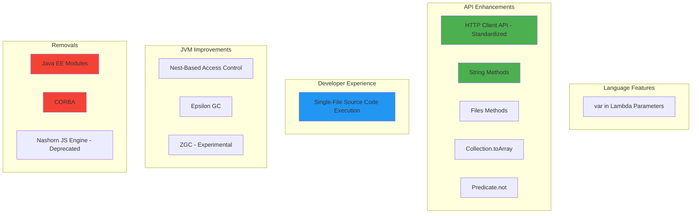
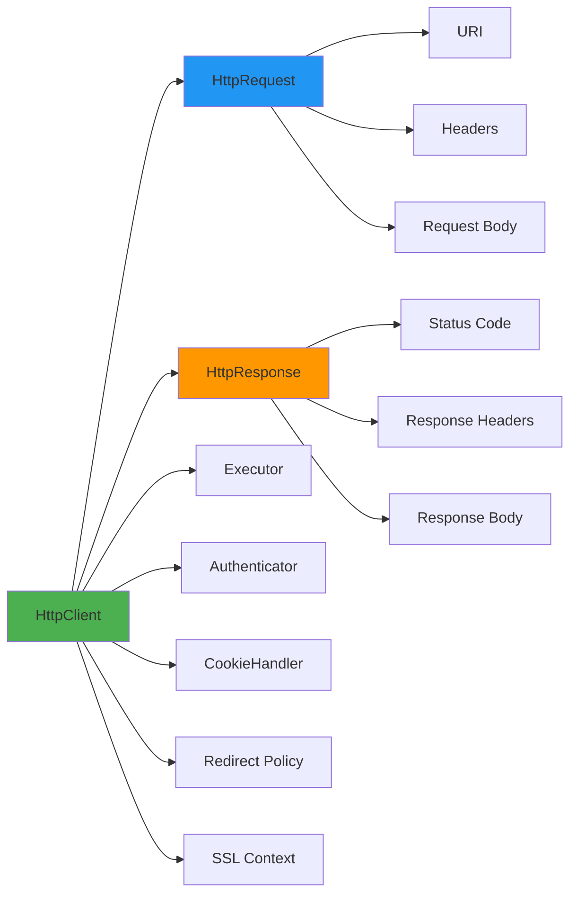
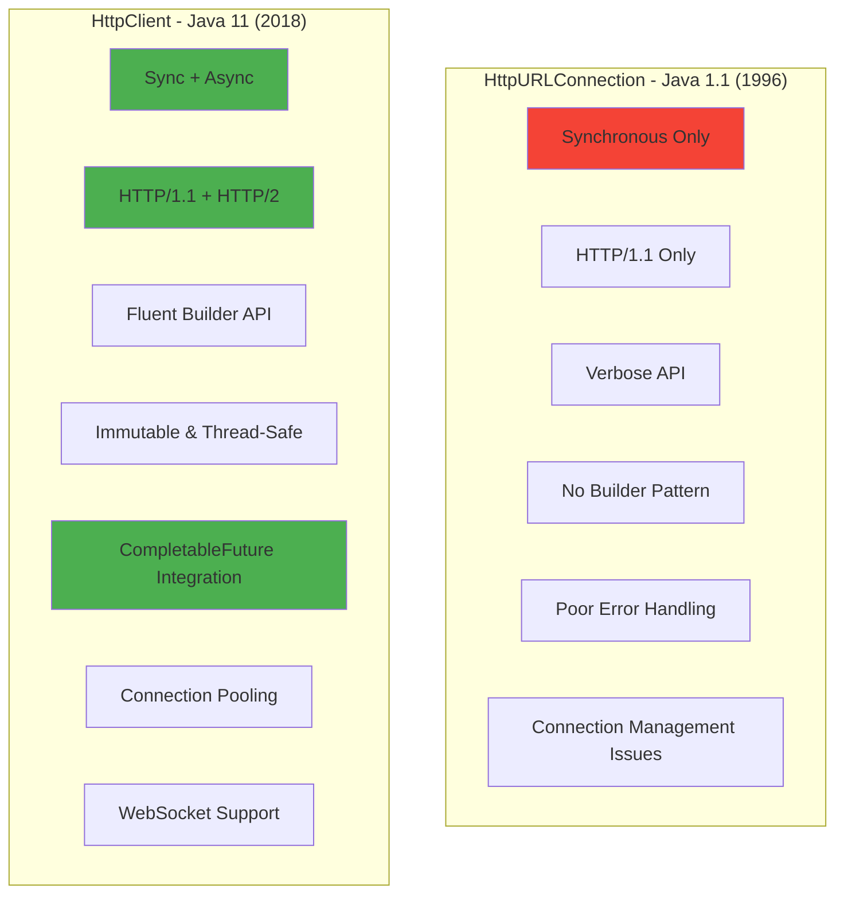
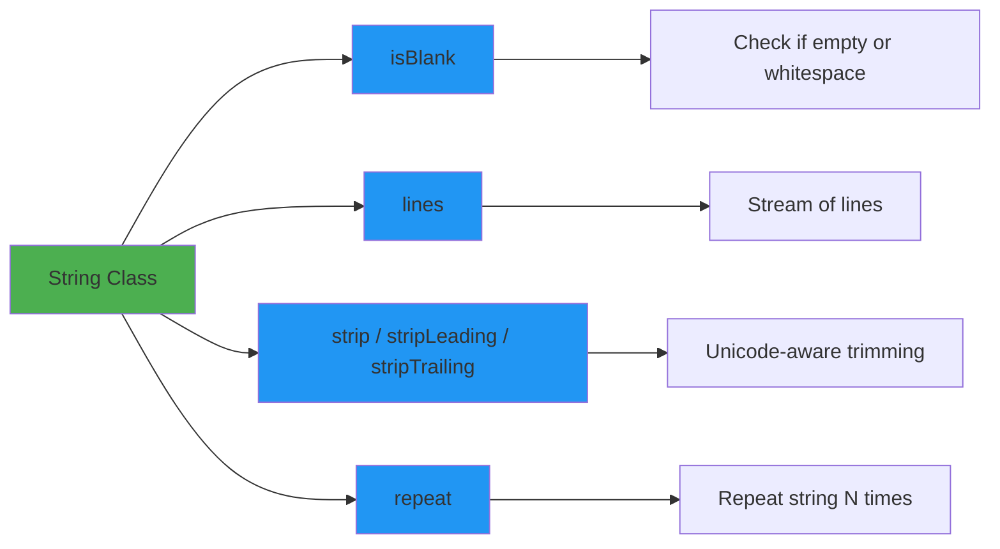
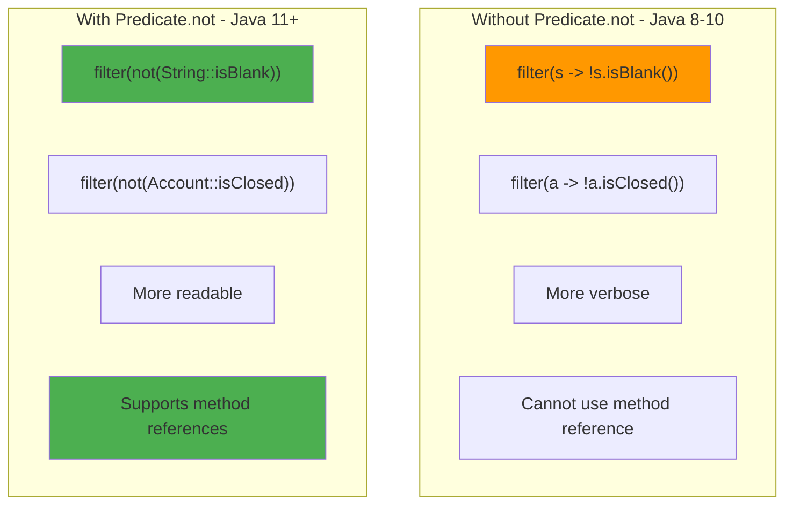
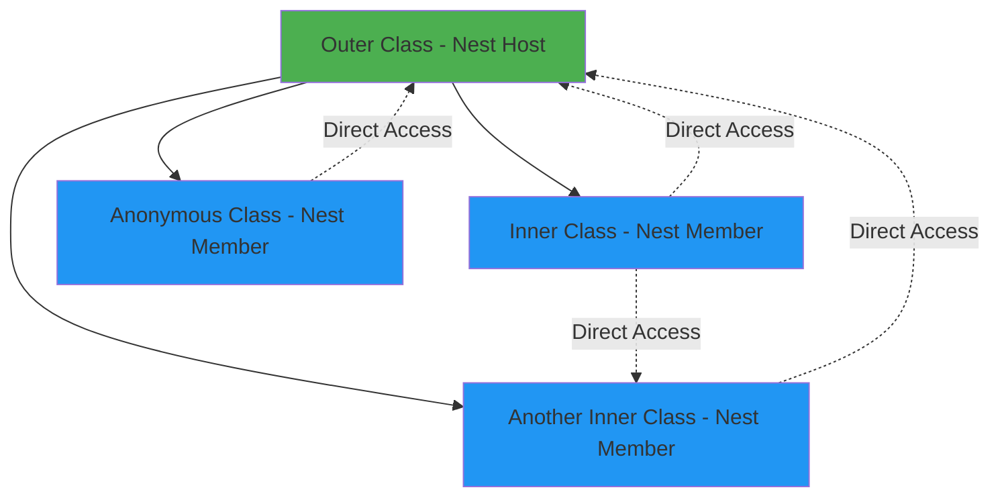
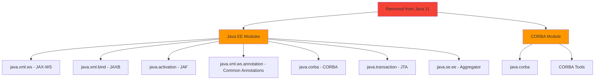
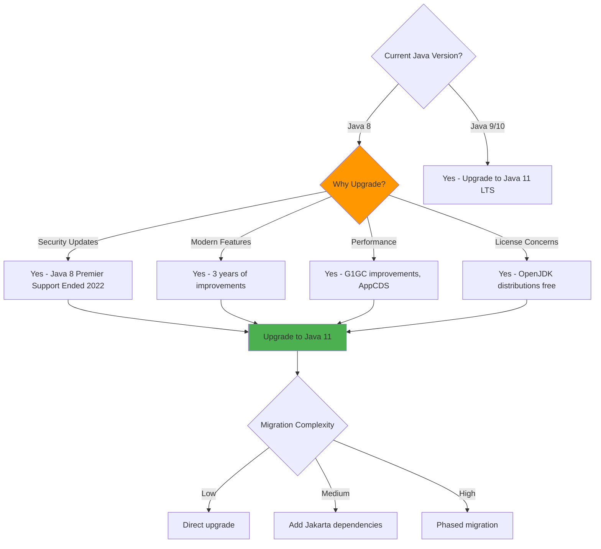

# Java 11 LTS Features - Complete Interview Guide

## Overview

Java 11, released in September 2018, marked a pivotal moment in Java's history as the **first LTS (Long-Term Support) release under Oracle's new six-month release cycle**. After Java 8 LTS (2014), Java 11 became the de facto standard for enterprise applications, especially in banking and financial services sectors, where stability and long-term support are paramount.

Java 11 introduced several production-ready features that modernized Java development, including the standardized HTTP Client API, enhanced String methods for cleaner code, simplified file I/O, and lambda parameter improvements. It also marked a significant shift by **removing Java EE and CORBA modules**, forcing enterprises to migrate to Jakarta EE or other alternatives.

For enterprise banking systems, Java 11's combination of stability, performance improvements (G1GC enhancements), and modern APIs made it the primary migration target from Java 8. Understanding Java 11 is critical for senior developers because most production systems in 2025 still run on either Java 11 or Java 17 LTS. Interviewers frequently ask about migration strategies, the rationale for specific Java 11 features, and how these features improve code quality in large-scale systems.

## Why Java 11 Matters for Enterprise Banking

### Industry Adoption Context

**Java 11 became the enterprise standard** for several reasons:
- **First LTS after Java 8**: Four years of feature accumulation (Java 9, 10, 11)
- **Oracle license changes**: Oracle JDK became commercial, pushing adoption of OpenJDK distributions (Azul Zulu, Amazon Corretto, Adoptium Eclipse Temurin)
- **Stability + Modern features**: Mature enough for production with significant improvements
- **Long-term support**: Premier support until 2023, extended support until 2032
- **Performance improvements**: Better G1GC, Application Class-Data Sharing (AppCDS), reduced memory footprint

**Banking/Financial Services Migration Pattern**:
```
Java 8 (2014-2019) → Java 11 (2019-2023) → Java 17 (2023+) → Java 21 (2024+)
```

Most major banks (JP Morgan, Goldman Sachs, UBS, Morgan Stanley) standardized on Java 11 between 2019-2022. As of 2025, many are actively migrating to Java 17 or Java 21, but Java 11 knowledge remains essential because:
1. Legacy systems still run Java 11
2. Interview questions test migration knowledge
3. Understanding the evolution from Java 8 → 11 → 17 demonstrates depth

## Java 11 Feature Categories

### Feature Classification



## 1. HTTP Client API (Standardized) - JEP 321

### Overview

The **HTTP Client API** was introduced as an **incubator module in Java 9** (JEP 110) and **standardized in Java 11**. It replaced the ancient `HttpURLConnection` (from Java 1.1) with a modern, fully-featured HTTP client that supports:
- HTTP/1.1 and **HTTP/2** (multiplexing, server push)
- **WebSocket** protocol
- **Asynchronous** request/response (CompletableFuture-based)
- **Synchronous** blocking calls
- Reactive Streams (Flow API) for request/response bodies

This was a game-changer for enterprise applications that previously relied on third-party libraries like Apache HttpClient or OkHttp.

### HTTP Client Architecture



### Key Components

#### 1. HttpClient

The main entry point for sending HTTP requests. Instances are **immutable and thread-safe** (can be shared across threads).

**Builder Pattern Creation**:
```java
import java.net.http.HttpClient;
import java.time.Duration;

// Creating HttpClient with builder pattern
HttpClient client = HttpClient.newBuilder()
    .version(HttpClient.Version.HTTP_2)           // Prefer HTTP/2
    .followRedirects(HttpClient.Redirect.NORMAL)  // Follow redirects
    .connectTimeout(Duration.ofSeconds(20))        // Connection timeout
    .build();

// Simple default client (HTTP/2, no redirect following)
HttpClient simpleClient = HttpClient.newHttpClient();
```

**Thread Safety & Reusability**:
```java
// In enterprise banking systems, create ONE client instance and reuse
// This is critical for connection pooling and performance

public class PaymentServiceClient {
    // Single, shared HttpClient instance (thread-safe)
    private static final HttpClient HTTP_CLIENT = HttpClient.newBuilder()
        .version(HttpClient.Version.HTTP_2)
        .connectTimeout(Duration.ofSeconds(10))
        .executor(Executors.newFixedThreadPool(20)) // Custom thread pool
        .build();

    public CompletableFuture<PaymentResponse> processPayment(PaymentRequest request) {
        HttpRequest httpRequest = HttpRequest.newBuilder()
            .uri(URI.create("https://payment-gateway.bank.com/process"))
            .header("Content-Type", "application/json")
            .header("Authorization", "Bearer " + getToken())
            .POST(HttpRequest.BodyPublishers.ofString(toJson(request)))
            .build();

        // Asynchronous call - non-blocking
        return HTTP_CLIENT.sendAsync(httpRequest, HttpResponse.BodyHandlers.ofString())
            .thenApply(HttpResponse::body)
            .thenApply(this::parsePaymentResponse);
    }
}
```

#### 2. HttpRequest

Represents an HTTP request with URI, headers, method, and body. Also **immutable**.

```java
import java.net.URI;
import java.net.http.HttpRequest;
import java.net.http.HttpRequest.BodyPublishers;

// GET request (most common in banking: retrieve account info)
HttpRequest getRequest = HttpRequest.newBuilder()
    .uri(URI.create("https://api.bank.com/accounts/12345"))
    .header("Accept", "application/json")
    .header("Authorization", "Bearer " + token)
    .GET()  // Explicit GET (default if no method specified)
    .build();

// POST request (create transaction)
String jsonPayload = """
    {
        "fromAccount": "123456789",
        "toAccount": "987654321",
        "amount": 1000.00,
        "currency": "USD"
    }
    """;

HttpRequest postRequest = HttpRequest.newBuilder()
    .uri(URI.create("https://api.bank.com/transactions"))
    .header("Content-Type", "application/json")
    .header("X-Idempotency-Key", UUID.randomUUID().toString()) // Critical for banking!
    .POST(BodyPublishers.ofString(jsonPayload))
    .timeout(Duration.ofSeconds(30)) // Request-specific timeout
    .build();

// PUT request (update account settings)
HttpRequest putRequest = HttpRequest.newBuilder()
    .uri(URI.create("https://api.bank.com/accounts/12345/settings"))
    .PUT(BodyPublishers.ofString(settingsJson))
    .build();

// DELETE request (close account)
HttpRequest deleteRequest = HttpRequest.newBuilder()
    .uri(URI.create("https://api.bank.com/accounts/12345"))
    .DELETE()
    .build();
```

**BodyPublishers Variants**:
```java
// String body
BodyPublishers.ofString("plain text", StandardCharsets.UTF_8);

// Byte array (binary data like encrypted transaction data)
byte[] encryptedData = encrypt(transactionData);
BodyPublishers.ofByteArray(encryptedData);

// File upload (document verification in KYC process)
Path documentPath = Paths.get("/tmp/passport.pdf");
BodyPublishers.ofFile(documentPath);

// InputStream (streaming large files)
InputStream inputStream = getDocumentStream();
BodyPublishers.ofInputStream(() -> inputStream);

// No body (GET, DELETE)
BodyPublishers.noBody();
```

#### 3. HttpResponse

Contains response status, headers, and body.

```java
import java.net.http.HttpResponse;
import java.net.http.HttpResponse.BodyHandlers;

// Synchronous call
HttpResponse<String> response = client.send(request, BodyHandlers.ofString());

// Inspect response
int statusCode = response.statusCode();           // 200, 404, 500, etc.
HttpHeaders headers = response.headers();         // All response headers
String body = response.body();                    // Response body
URI uri = response.uri();                         // Final URI (after redirects)
HttpClient.Version version = response.version();  // HTTP/1.1 or HTTP/2

// Handling different status codes (critical in banking for error handling)
switch (statusCode) {
    case 200 -> processSuccess(body);
    case 400 -> throw new BadRequestException("Invalid transaction: " + body);
    case 401 -> throw new UnauthorizedException("Token expired");
    case 403 -> throw new ForbiddenException("Insufficient permissions");
    case 409 -> throw new ConflictException("Duplicate transaction detected");
    case 500 -> throw new ServerErrorException("Payment gateway error");
    default -> throw new UnexpectedResponseException("Status: " + statusCode);
}
```

**BodyHandlers Variants**:
```java
// String response (most common for JSON APIs)
BodyHandlers.ofString();

// Byte array (binary data like PDF statements)
BodyHandlers.ofByteArray();

// File download (large reports)
BodyHandlers.ofFile(Paths.get("/tmp/statement.pdf"));

// InputStream (streaming large responses)
BodyHandlers.ofInputStream();

// Discard body (HEAD requests or when only status code matters)
BodyHandlers.discarding();

// Lines (streaming line-by-line for large CSVs)
BodyHandlers.ofLines();
```

### Synchronous vs Asynchronous

#### Synchronous (Blocking)

```java
import java.net.http.HttpClient;
import java.net.http.HttpRequest;
import java.net.http.HttpResponse;

public class SynchronousExample {
    public static void main(String[] args) throws Exception {
        HttpClient client = HttpClient.newHttpClient();

        HttpRequest request = HttpRequest.newBuilder()
            .uri(URI.create("https://api.bank.com/accounts/12345"))
            .build();

        // send() blocks until response is received
        // Thread waits here - NOT recommended for high-throughput systems
        HttpResponse<String> response = client.send(request,
                                                    HttpResponse.BodyHandlers.ofString());

        System.out.println("Status: " + response.statusCode());
        System.out.println("Body: " + response.body());
    }
}
```

**When to use**:
- Simple scripts or batch jobs
- Single-threaded applications
- Sequential processing required
- **Not recommended** for web servers or high-concurrency systems

#### Asynchronous (Non-blocking)

```java
import java.net.http.HttpClient;
import java.net.http.HttpRequest;
import java.net.http.HttpResponse;
import java.util.concurrent.CompletableFuture;

public class AsynchronousExample {
    public static void main(String[] args) {
        HttpClient client = HttpClient.newHttpClient();

        HttpRequest request = HttpRequest.newBuilder()
            .uri(URI.create("https://api.bank.com/accounts/12345"))
            .build();

        // sendAsync() returns immediately with CompletableFuture
        // Thread is free to do other work
        CompletableFuture<HttpResponse<String>> futureResponse =
            client.sendAsync(request, HttpResponse.BodyHandlers.ofString());

        // Asynchronous processing chain
        futureResponse
            .thenApply(HttpResponse::body)              // Extract body
            .thenApply(this::parseJson)                 // Parse JSON
            .thenApply(this::validateAccount)           // Business logic
            .thenAccept(account -> {                    // Final action
                System.out.println("Account balance: " + account.getBalance());
            })
            .exceptionally(throwable -> {               // Error handling
                System.err.println("Error: " + throwable.getMessage());
                return null;
            });

        // Main thread continues immediately
        System.out.println("Request sent, doing other work...");

        // Keep application alive to see async results
        futureResponse.join(); // Wait for completion
    }
}
```

**Enterprise Banking Example - Multiple Parallel Calls**:
```java
/**
 * Real-world scenario: Account aggregation service
 * Fetches account balances from multiple internal services in parallel
 */
public class AccountAggregationService {
    private final HttpClient httpClient = HttpClient.newHttpClient();

    public CompletableFuture<CustomerSummary> getCustomerSummary(String customerId) {
        // Fire all requests in parallel
        CompletableFuture<AccountBalance> checkingFuture =
            getCheckingBalance(customerId);
        CompletableFuture<AccountBalance> savingsFuture =
            getSavingsBalance(customerId);
        CompletableFuture<CreditCardBalance> creditFuture =
            getCreditCardBalance(customerId);
        CompletableFuture<LoanBalance> loanFuture =
            getLoanBalance(customerId);

        // Combine all results
        return CompletableFuture.allOf(
            checkingFuture, savingsFuture, creditFuture, loanFuture
        ).thenApply(v -> new CustomerSummary(
            checkingFuture.join(),
            savingsFuture.join(),
            creditFuture.join(),
            loanFuture.join()
        ));
    }

    private CompletableFuture<AccountBalance> getCheckingBalance(String customerId) {
        HttpRequest request = HttpRequest.newBuilder()
            .uri(URI.create("https://checking-service.bank.internal/balance/" + customerId))
            .timeout(Duration.ofSeconds(5))
            .build();

        return httpClient.sendAsync(request, HttpResponse.BodyHandlers.ofString())
            .thenApply(HttpResponse::body)
            .thenApply(this::parseAccountBalance);
    }

    // Similar methods for other account types...
}
```

### HTTP/2 Support

Java 11's HTTP Client supports **HTTP/2 by default** with automatic fallback to HTTP/1.1.

**HTTP/2 Benefits**:
- **Multiplexing**: Multiple requests over single TCP connection
- **Header compression**: Reduces overhead (critical for microservices)
- **Server push**: Server can send resources proactively
- **Stream prioritization**: Important requests get priority

```java
// HTTP/2 is preferred by default
HttpClient http2Client = HttpClient.newBuilder()
    .version(HttpClient.Version.HTTP_2)  // Prefer HTTP/2, fallback to HTTP/1.1
    .build();

// Force HTTP/1.1 (legacy system compatibility)
HttpClient http1Client = HttpClient.newBuilder()
    .version(HttpClient.Version.HTTP_1_1)
    .build();

// Check actual version used
HttpResponse<String> response = http2Client.send(request, BodyHandlers.ofString());
System.out.println("Protocol: " + response.version()); // HTTP_2 or HTTP_1_1
```

**Banking Use Case - High-Volume Transaction Processing**:
```java
/**
 * In payment gateways, HTTP/2 multiplexing reduces connection overhead
 * Single connection can handle 1000s of concurrent payment validations
 */
public class PaymentGateway {
    private static final HttpClient CLIENT = HttpClient.newBuilder()
        .version(HttpClient.Version.HTTP_2)
        .connectTimeout(Duration.ofSeconds(10))
        .build();

    public List<CompletableFuture<ValidationResult>> validateBatch(
            List<Transaction> transactions) {
        // All requests multiplex over same HTTP/2 connection
        return transactions.stream()
            .map(this::validateTransactionAsync)
            .collect(Collectors.toList());
    }
}
```

### WebSocket Support

```java
import java.net.http.WebSocket;

// WebSocket for real-time trading platform
WebSocket ws = HttpClient.newHttpClient()
    .newWebSocketBuilder()
    .buildAsync(
        URI.create("wss://trading.bank.com/market-data"),
        new WebSocket.Listener() {
            @Override
            public CompletionStage<?> onText(WebSocket webSocket,
                                             CharSequence data,
                                             boolean last) {
                // Handle market data updates
                System.out.println("Market update: " + data);
                webSocket.request(1); // Request next message
                return null;
            }

            @Override
            public void onError(WebSocket webSocket, Throwable error) {
                System.err.println("WebSocket error: " + error.getMessage());
            }
        }
    ).join();

// Send message
ws.sendText("SUBSCRIBE:AAPL,GOOGL", true);
```

### Comparison: Old vs New HTTP Client



**Old Way (HttpURLConnection)**:
```java
// Verbose, error-prone, synchronous only
URL url = new URL("https://api.bank.com/accounts/12345");
HttpURLConnection connection = (HttpURLConnection) url.openConnection();
connection.setRequestMethod("GET");
connection.setRequestProperty("Authorization", "Bearer " + token);

int responseCode = connection.getResponseCode();
if (responseCode == 200) {
    BufferedReader reader = new BufferedReader(
        new InputStreamReader(connection.getInputStream()));
    StringBuilder response = new StringBuilder();
    String line;
    while ((line = reader.readLine()) != null) {
        response.append(line);
    }
    reader.close();
    // Process response...
} else {
    // Handle error...
}
connection.disconnect();
```

**New Way (HttpClient)**:
```java
// Clean, concise, async-capable
HttpClient client = HttpClient.newHttpClient();
HttpRequest request = HttpRequest.newBuilder()
    .uri(URI.create("https://api.bank.com/accounts/12345"))
    .header("Authorization", "Bearer " + token)
    .build();

HttpResponse<String> response = client.send(request, BodyHandlers.ofString());
String body = response.body();
```

## 2. var in Lambda Parameters - JEP 323

### Overview

Java 11 allows using `var` (introduced in Java 10 for local variables) in **lambda parameter declarations**. This might seem redundant at first, but it serves a specific purpose: **enabling annotations on lambda parameters**.

### The Problem It Solves

Before Java 11, you couldn't add annotations to lambda parameters without explicit types:

```java
// Before Java 11: If you want to annotate parameters, you MUST use explicit types
BiFunction<String, String, String> concat =
    (@NonNull String s1, @NonNull String s2) -> s1 + s2;

// Without annotations, you could use implicit types (no var needed)
BiFunction<String, String, String> concat = (s1, s2) -> s1 + s2;

// But you CANNOT mix explicit types with implicit types
// This is INVALID:
// BiFunction<String, String, String> concat = (@NonNull s1, s2) -> s1 + s2;
```

**Java 11 Solution**: Use `var` to enable annotations while keeping concise syntax:

```java
// Java 11: var allows annotations on implicitly-typed parameters
BiFunction<String, String, String> concat =
    (@NonNull var s1, @NonNull var s2) -> s1 + s2;
```

### Syntax Rules

```java
import javax.annotation.Nonnull;
import java.util.function.BiFunction;

// ✅ VALID: All parameters use var
BiFunction<String, String, String> func1 = (var s1, var s2) -> s1 + s2;

// ✅ VALID: All parameters use explicit types
BiFunction<String, String, String> func2 = (String s1, String s2) -> s1 + s2;

// ✅ VALID: All parameters use implicit types (no var)
BiFunction<String, String, String> func3 = (s1, s2) -> s1 + s2;

// ✅ VALID: var with annotations
BiFunction<String, String, String> func4 =
    (@Nonnull var s1, @Nonnull var s2) -> s1 + s2;

// ❌ INVALID: Cannot mix var with explicit types
// BiFunction<String, String, String> invalid1 = (var s1, String s2) -> s1 + s2;

// ❌ INVALID: Cannot mix var with implicit types
// BiFunction<String, String, String> invalid2 = (var s1, s2) -> s1 + s2;

// ❌ INVALID: If one parameter uses var, ALL must use var
// BiFunction<String, String, String> invalid3 = (var s1, s2, s3) -> s1 + s2 + s3;
```

### Real-World Banking Example

```java
import javax.validation.constraints.NotNull;
import javax.validation.constraints.Positive;

/**
 * Payment processing with validated lambda parameters
 */
public class PaymentProcessor {

    // Using var to apply validation annotations
    public void processPayment() {
        BiFunction<@NotNull var account, @Positive var amount, PaymentResult> processor =
            (account, amount) -> {
                // Type inference still works: account is Account, amount is BigDecimal
                validateAccountBalance(account, amount);
                return executePayment(account, amount);
            };

        Account fromAccount = getAccount("12345");
        BigDecimal transferAmount = new BigDecimal("1000.00");
        PaymentResult result = processor.apply(fromAccount, transferAmount);
    }

    // Custom annotation example for security context
    public void auditTransaction() {
        Consumer<@AuditLog var transaction> auditor = transaction -> {
            // The @AuditLog annotation triggers aspect-oriented logging
            logTransactionDetails(transaction);
        };

        Transaction txn = new Transaction(/* ... */);
        auditor.accept(txn);
    }
}
```

### When to Use var in Lambdas

**Use `var` when**:
- ✅ You need to add annotations to lambda parameters
- ✅ Your team coding standards require consistent use of `var`
- ✅ You want explicit visual indication that types are inferred

**Don't use `var` when**:
- ❌ No annotations needed (implicit types are cleaner)
- ❌ It reduces readability (complex inferred types)
- ❌ Team prefers explicit types or implicit types

**Interview Tip**: This is a **minor feature** but often appears in interviews to test detailed knowledge. Emphasize that it's primarily for **annotation support**, not just "var for the sake of var."

## 3. String API Enhancements

### Overview

Java 11 added **five new convenience methods** to the `String` class that simplify common string operations. These methods reduce the need for external libraries like Apache Commons Lang.



### 1. isBlank()

**Purpose**: Check if string is empty or contains **only whitespace** (including Unicode whitespace).

```java
// isBlank() vs isEmpty()

String empty = "";
String whitespace = "   ";
String tab = "\t";
String unicodeWhitespace = "\u2000"; // EN QUAD (Unicode whitespace)
String content = "Hello";

// isEmpty() - only checks for zero length
System.out.println(empty.isEmpty());          // true
System.out.println(whitespace.isEmpty());     // false (length = 3)
System.out.println(content.isEmpty());        // false

// isBlank() - checks for empty OR only whitespace (Unicode-aware)
System.out.println(empty.isBlank());              // true
System.out.println(whitespace.isBlank());         // true ✅ Key difference
System.out.println(tab.isBlank());                // true
System.out.println(unicodeWhitespace.isBlank());  // true ✅ Unicode-aware
System.out.println(content.isBlank());            // false
```

**Banking Use Case - Input Validation**:
```java
/**
 * Validating user input in banking forms
 * Common issue: Users submitting forms with just spaces
 */
public class TransactionValidator {

    public void validateTransferRequest(TransferRequest request) {
        // Old way: Verbose and misses Unicode whitespace
        if (request.getBeneficiaryName() == null ||
            request.getBeneficiaryName().trim().isEmpty()) {
            throw new ValidationException("Beneficiary name is required");
        }

        // New way: Concise and handles all whitespace including Unicode
        if (request.getBeneficiaryName() == null ||
            request.getBeneficiaryName().isBlank()) {
            throw new ValidationException("Beneficiary name is required");
        }

        // Even better with Optional
        Optional.ofNullable(request.getBeneficiaryName())
            .filter(name -> !name.isBlank())
            .orElseThrow(() -> new ValidationException("Beneficiary name is required"));
    }

    // Checking multiple fields
    public boolean hasValidInput(CustomerData data) {
        return Stream.of(
            data.getFirstName(),
            data.getLastName(),
            data.getEmail(),
            data.getPhoneNumber()
        ).noneMatch(String::isBlank); // Method reference!
    }
}
```

### 2. lines()

**Purpose**: Returns a **Stream of lines** extracted from the string, split by line terminators (`\n`, `\r`, `\r\n`).

```java
String multiline = """
    Account: 123456789
    Balance: $10,000.00
    Status: Active
    """;

// lines() returns Stream<String> - enables functional processing
long lineCount = multiline.lines().count();  // 3

multiline.lines()
    .filter(line -> !line.isBlank())           // Remove blank lines
    .map(String::strip)                        // Trim each line
    .forEach(System.out::println);

// Output:
// Account: 123456789
// Balance: $10,000.00
// Status: Active
```

**Banking Use Case - Processing CSV/Log Files**:
```java
/**
 * Processing transaction logs or CSV reports
 */
public class TransactionLogProcessor {

    public List<Transaction> parseTransactionLog(String logContent) {
        return logContent.lines()
            .filter(line -> !line.isBlank())              // Skip empty lines
            .filter(line -> !line.startsWith("#"))        // Skip comments
            .map(this::parseTransactionLine)              // Parse each line
            .collect(Collectors.toList());
    }

    // Processing daily transaction report
    public TransactionSummary analyzeDailyReport(String report) {
        Map<String, List<String>> sections = report.lines()
            .collect(Collectors.groupingBy(line -> {
                if (line.startsWith("CREDIT")) return "CREDITS";
                if (line.startsWith("DEBIT")) return "DEBITS";
                return "OTHER";
            }));

        return new TransactionSummary(
            sections.get("CREDITS"),
            sections.get("DEBITS")
        );
    }

    // Finding suspicious patterns in logs
    public List<String> findSuspiciousTransactions(String auditLog) {
        return auditLog.lines()
            .filter(line -> line.contains("FAILED_AUTH") ||
                           line.contains("AMOUNT_THRESHOLD_EXCEEDED"))
            .collect(Collectors.toList());
    }
}
```

**Comparison with Old Approach**:
```java
// Before Java 11: Manual splitting
String[] linesArray = multiline.split("\\r?\\n");
for (String line : linesArray) {
    if (!line.trim().isEmpty()) {
        process(line);
    }
}

// Java 11: Functional and cleaner
multiline.lines()
    .filter(line -> !line.isBlank())
    .forEach(this::process);
```

### 3. strip(), stripLeading(), stripTrailing()

**Purpose**: Remove leading/trailing whitespace, but **Unicode-aware** (unlike `trim()`).

**Key Difference from trim()**:
- `trim()`: Removes ASCII control characters ≤ U+0020 (space)
- `strip()`: Removes **all Unicode whitespace** characters

```java
String withWhitespace = "  \t Hello World \u2000 \n ";

// trim() - only removes ASCII whitespace ≤ U+0020
System.out.println("'" + withWhitespace.trim() + "'");
// Output: '	 Hello World   ' (Unicode space U+2000 remains!)

// strip() - removes ALL Unicode whitespace
System.out.println("'" + withWhitespace.strip() + "'");
// Output: 'Hello World' ✅

// stripLeading() - removes leading whitespace only
System.out.println("'" + withWhitespace.stripLeading() + "'");
// Output: 'Hello World   \n '

// stripTrailing() - removes trailing whitespace only
System.out.println("'" + withWhitespace.stripTrailing() + "'");
// Output: '  	 Hello World'
```

**Unicode Whitespace Examples**:
```java
// Various Unicode whitespace characters that strip() handles but trim() doesn't
String unicodeSpaces =
    "\u0009" +  // CHARACTER TABULATION
    "\u0020" +  // SPACE (ASCII)
    "\u00A0" +  // NO-BREAK SPACE
    "\u1680" +  // OGHAM SPACE MARK
    "\u2000" +  // EN QUAD
    "\u2001" +  // EM QUAD
    "\u202F" +  // NARROW NO-BREAK SPACE
    "\u3000" +  // IDEOGRAPHIC SPACE
    "Hello";

System.out.println(unicodeSpaces.trim().length());   // Still has Unicode spaces!
System.out.println(unicodeSpaces.strip().length());  // 5 (just "Hello")
```

**Banking Use Case - International Customer Names**:
```java
/**
 * Handling customer data from international markets
 * Customer names may contain Unicode whitespace from various locales
 */
public class CustomerDataProcessor {

    public Customer processCustomerInput(String rawName, String rawAddress) {
        // strip() properly handles international whitespace characters
        String cleanName = Optional.ofNullable(rawName)
            .map(String::strip)                    // Remove all Unicode whitespace
            .filter(name -> !name.isBlank())
            .orElseThrow(() -> new ValidationException("Name is required"));

        // Processing multi-line address
        String cleanAddress = Optional.ofNullable(rawAddress)
            .map(addr -> addr.lines()              // Split into lines
                .map(String::strip)                // Strip each line
                .filter(line -> !line.isBlank())   // Remove blank lines
                .collect(Collectors.joining("\n")) // Rejoin
            )
            .orElse("");

        return new Customer(cleanName, cleanAddress);
    }

    // Parsing international IBAN with potential Unicode whitespace
    public String normalizeIBAN(String iban) {
        return iban.strip()
            .replaceAll("\\s+", "")  // Remove all whitespace (including Unicode)
            .toUpperCase();
    }
}
```

### 4. repeat(int count)

**Purpose**: Returns a string whose value is the concatenation of this string **repeated** `count` times.

```java
String star = "*";
System.out.println(star.repeat(10));
// Output: **********

String dash = "-";
System.out.println(dash.repeat(50));
// Output: --------------------------------------------------

// Empty string or zero count
System.out.println("test".repeat(0));  // "" (empty string)
System.out.println("".repeat(5));      // "" (empty string)

// Negative count throws IllegalArgumentException
try {
    "test".repeat(-1);
} catch (IllegalArgumentException e) {
    System.out.println("Cannot repeat negative times");
}
```

**Banking Use Case - Report Formatting**:
```java
/**
 * Generating formatted text reports
 */
public class ReportGenerator {

    public String generateAccountStatement(Account account, List<Transaction> transactions) {
        StringBuilder report = new StringBuilder();

        // Header with border
        String border = "=".repeat(80);
        report.append(border).append("\n");
        report.append("ACCOUNT STATEMENT".center(80)).append("\n"); // center() is custom
        report.append(border).append("\n\n");

        // Account info
        report.append("Account Number: ").append(account.getNumber()).append("\n");
        report.append("Account Holder: ").append(account.getHolderName()).append("\n");
        report.append("-".repeat(80)).append("\n\n");

        // Transaction table header
        report.append(String.format("%-15s %-40s %15s%n", "Date", "Description", "Amount"));
        report.append("-".repeat(80)).append("\n");

        // Transactions
        for (Transaction txn : transactions) {
            report.append(String.format("%-15s %-40s %15s%n",
                txn.getDate(),
                txn.getDescription(),
                formatCurrency(txn.getAmount())));
        }

        // Footer
        report.append(border).append("\n");
        report.append(String.format("%56s %15s%n",
            "Closing Balance:",
            formatCurrency(account.getBalance())));
        report.append(border).append("\n");

        return report.toString();
    }

    // Progress bar for batch processing
    public void showProgress(int processed, int total) {
        int percentage = (processed * 100) / total;
        int bars = percentage / 2; // 50 characters max

        String progressBar = "█".repeat(bars) + "░".repeat(50 - bars);
        System.out.printf("\rProcessing: [%s] %d%%", progressBar, percentage);
    }

    // Indentation for JSON or hierarchical data
    public String indent(int level) {
        return "  ".repeat(level); // 2 spaces per level
    }
}
```

**Before Java 11 (Verbose)**:
```java
// Creating repeated strings was cumbersome
StringBuilder sb = new StringBuilder();
for (int i = 0; i < 50; i++) {
    sb.append("-");
}
String border = sb.toString();

// Or using external libraries
String border = StringUtils.repeat("-", 50); // Apache Commons Lang
```

**Java 11 (Concise)**:
```java
String border = "-".repeat(50);
```

### String Methods Comparison Table

| Method | Purpose | Unicode-Aware | Returns | Use Case |
|--------|---------|---------------|---------|----------|
| `isBlank()` | Check if empty or only whitespace | ✅ Yes | `boolean` | Form validation |
| `isEmpty()` | Check if length is 0 | N/A | `boolean` | Basic null checks |
| `lines()` | Split into stream of lines | N/A | `Stream<String>` | Log processing, CSV parsing |
| `strip()` | Remove leading & trailing whitespace | ✅ Yes | `String` | International data cleanup |
| `stripLeading()` | Remove leading whitespace | ✅ Yes | `String` | Left-align text |
| `stripTrailing()` | Remove trailing whitespace | ✅ Yes | `String` | Right-align text |
| `trim()` | Remove ASCII whitespace ≤ U+0020 | ❌ No | `String` | Legacy code (avoid) |
| `repeat(n)` | Repeat string n times | N/A | `String` | Formatting, borders |

## 4. Files API Enhancements

### Overview

Java 11 added **convenience methods** to `java.nio.file.Files` for reading/writing entire file contents as strings. This simplifies the most common file I/O operations.

### readString() and writeString()

```java
import java.nio.file.Files;
import java.nio.file.Path;
import java.nio.file.Paths;
import java.nio.charset.StandardCharsets;

public class FilesExample {

    // Reading entire file as String
    public void readFile() throws IOException {
        Path filePath = Paths.get("/data/config.json");

        // Java 11: One-liner (uses UTF-8 by default)
        String content = Files.readString(filePath);

        // With explicit charset
        String content2 = Files.readString(filePath, StandardCharsets.ISO_8859_1);
    }

    // Writing String to file
    public void writeFile() throws IOException {
        Path filePath = Paths.get("/data/output.txt");
        String content = "Transaction processed successfully";

        // Java 11: One-liner (overwrites file, creates if doesn't exist)
        Files.writeString(filePath, content);

        // With explicit charset
        Files.writeString(filePath, content, StandardCharsets.UTF_8);

        // With options (append mode)
        Files.writeString(filePath, content,
            StandardOpenOption.CREATE,
            StandardOpenOption.APPEND);
    }
}
```

**Before Java 11 (Verbose)**:
```java
// Reading file
Path path = Paths.get("/data/config.json");
byte[] bytes = Files.readAllBytes(path);
String content = new String(bytes, StandardCharsets.UTF_8);

// Or with BufferedReader
StringBuilder sb = new StringBuilder();
try (BufferedReader reader = Files.newBufferedReader(path)) {
    String line;
    while ((line = reader.readLine()) != null) {
        sb.append(line).append("\n");
    }
}
String content = sb.toString();

// Writing file
String content = "data";
byte[] bytes = content.getBytes(StandardCharsets.UTF_8);
Files.write(path, bytes);
```

**Java 11 (Concise)**:
```java
// Reading
String content = Files.readString(path);

// Writing
Files.writeString(path, content);
```

**Banking Use Case - Configuration Management**:
```java
/**
 * Loading/saving configuration files in microservices
 */
public class ConfigurationManager {

    private final Path configPath;

    public ConfigurationManager(String configFile) {
        this.configPath = Paths.get(configFile);
    }

    // Load application config
    public AppConfig loadConfig() throws IOException {
        String jsonContent = Files.readString(configPath);
        return parseJson(jsonContent, AppConfig.class);
    }

    // Save updated config
    public void saveConfig(AppConfig config) throws IOException {
        String jsonContent = toJson(config);
        Files.writeString(configPath, jsonContent);
    }

    // Reading API key from secure file
    public String loadApiKey() throws IOException {
        Path keyPath = Paths.get("/secure/api-key.txt");
        return Files.readString(keyPath).strip(); // Remove any whitespace
    }

    // Logging transaction details to audit file
    public void logTransaction(Transaction txn) throws IOException {
        Path auditLog = Paths.get("/logs/audit.log");
        String logEntry = String.format("[%s] %s: %s%n",
            LocalDateTime.now(),
            txn.getId(),
            txn.getDescription());

        // Append to log file
        Files.writeString(auditLog, logEntry,
            StandardOpenOption.CREATE,
            StandardOpenOption.APPEND);
    }
}
```

**Important Notes**:
- Default charset is **UTF-8** (change with Java 18, earlier versions may use system default)
- `readString()` reads **entire file into memory** (not suitable for large files)
- For large files, use `Files.lines()` to stream line-by-line
- These methods are for **text files** only (use `readAllBytes()`/`write()` for binary)

## 5. Collection.toArray(IntFunction) - JEP 330

### Overview

Java 11 added an **overloaded `toArray()` method** that accepts an `IntFunction` generator, eliminating the need to pre-allocate arrays.

### The Problem It Solves

**Before Java 11**:
```java
List<String> list = List.of("Apple", "Banana", "Cherry");

// Convert to array - had to provide pre-sized array
String[] array = list.toArray(new String[list.size()]); // Verbose

// Or rely on zero-length array idiom (JVM optimization)
String[] array2 = list.toArray(new String[0]); // Common idiom, but not intuitive
```

**Java 11**:
```java
List<String> list = List.of("Apple", "Banana", "Cherry");

// Clean, intuitive syntax using method reference
String[] array = list.toArray(String[]::new);
```

### How It Works

The new method signature:
```java
<T> T[] toArray(IntFunction<T[]> generator)
```

The `IntFunction` receives the size and creates an array:
```java
// Under the hood, this is what happens:
IntFunction<String[]> generator = size -> new String[size];

// Which is exactly what String[]::new does
String[] array = list.toArray(String[]::new);
```

### Comparison of All toArray() Variants

```java
List<String> fruits = List.of("Apple", "Banana", "Cherry");

// 1. toArray() - Returns Object[]
Object[] objArray = fruits.toArray();
// Problem: Type is Object[], need cast for String operations
// String first = objArray[0]; // ❌ Compilation error
String first = (String) objArray[0]; // ✅ Requires cast

// 2. toArray(T[] a) - Pre-Java 11 way
String[] array1 = fruits.toArray(new String[fruits.size()]); // Exact size
String[] array2 = fruits.toArray(new String[0]);             // Zero-length (common idiom)

// 3. toArray(IntFunction<T[]> generator) - Java 11+
String[] array3 = fruits.toArray(String[]::new); // ✅ Clean and type-safe

// All three arrays (array1, array2, array3) contain the same data
// array3 is the most concise and readable
```

### Banking Use Case

```java
/**
 * Converting collections to arrays for legacy APIs or performance
 */
public class TransactionProcessor {

    // Legacy API requires array
    public void processTransactions(List<Transaction> transactions) {
        // Java 11: Clean conversion
        Transaction[] txnArray = transactions.toArray(Transaction[]::new);

        // Call legacy API
        legacyBatchProcessor.process(txnArray);
    }

    // Converting set to array for deterministic processing
    public void processAccounts(Set<Account> accounts) {
        // Convert Set to Array for indexed access
        Account[] accountArray = accounts.toArray(Account[]::new);

        // Process in parallel with known array indices
        IntStream.range(0, accountArray.length)
            .parallel()
            .forEach(i -> processAccount(accountArray[i], i));
    }

    // Stream to array
    public Customer[] getActiveCustomers() {
        return customerRepository.findAll().stream()
            .filter(Customer::isActive)
            .toArray(Customer[]::new); // Direct from stream to array
    }
}
```

### Why This Matters

**Performance**: The zero-length array idiom `toArray(new String[0])` relied on a JVM optimization. The new method makes it clearer and doesn't depend on JVM tricks.

**Readability**: `String[]::new` is more expressive than `new String[0]`.

**Type Safety**: The compiler can infer types better.

**Interview Insight**: This is a **minor convenience feature** but demonstrates knowledge of modern Java APIs. Mention that it pairs well with streams and method references.

## 6. Predicate.not() - JEP 323

### Overview

Java 11 added a **static method `Predicate.not()`** to negate predicates in a more readable way, especially when using method references.

### The Problem It Solves

**Before Java 11**:
```java
List<String> items = List.of("", "Apple", "  ", "Banana", "Cherry", "   ");

// Filtering out blank strings - had to use lambda
List<String> nonBlank = items.stream()
    .filter(s -> !s.isBlank()) // Lambda required for negation
    .collect(Collectors.toList());

// Couldn't use method reference with negation
// This is INVALID:
// .filter(!String::isBlank) // ❌ Syntax error
```

**Java 11**:
```java
import static java.util.function.Predicate.not;

List<String> items = List.of("", "Apple", "  ", "Banana", "Cherry", "   ");

// Clean negation with method reference
List<String> nonBlank = items.stream()
    .filter(not(String::isBlank)) // ✅ Reads like English: "filter not blank"
    .collect(Collectors.toList());
```

### Syntax and Usage

```java
import java.util.function.Predicate;
import static java.util.function.Predicate.not;

// not() is a static method that returns a negated predicate
public static <T> Predicate<T> not(Predicate<? super T> target) {
    return target.negate();
}

// Usage examples
List<String> strings = List.of("hello", "", "world", "  ", "java");

// With method reference
List<String> nonBlank = strings.stream()
    .filter(not(String::isBlank))
    .collect(Collectors.toList());

// With lambda (less concise)
List<String> nonBlank2 = strings.stream()
    .filter(s -> !s.isBlank())
    .collect(Collectors.toList());

// Multiple method references
List<String> result = strings.stream()
    .filter(not(String::isEmpty))      // Not empty
    .filter(not(String::isBlank))      // Not blank
    .map(String::toUpperCase)
    .collect(Collectors.toList());
```

### Banking Use Cases

```java
import static java.util.function.Predicate.not;

/**
 * Real-world filtering scenarios in banking
 */
public class AccountService {

    // Filter out closed accounts
    public List<Account> getActiveAccounts(List<Account> allAccounts) {
        return allAccounts.stream()
            .filter(not(Account::isClosed))        // Reads naturally
            .collect(Collectors.toList());
    }

    // Find non-fraudulent transactions
    public List<Transaction> getLegitTransactions(List<Transaction> transactions) {
        return transactions.stream()
            .filter(not(Transaction::isFlagged))
            .filter(not(Transaction::isReversed))
            .collect(Collectors.toList());
    }

    // Get customers without pending KYC
    public List<Customer> getVerifiedCustomers(List<Customer> customers) {
        return customers.stream()
            .filter(not(Customer::hasPendingKYC))
            .filter(Customer::isActive)
            .collect(Collectors.toList());
    }

    // Complex filtering with multiple negations
    public List<Transaction> getSettledTransactions(List<Transaction> transactions) {
        return transactions.stream()
            .filter(not(Transaction::isPending))
            .filter(not(Transaction::isFailed))
            .filter(not(Transaction::isCancelled))
            .collect(Collectors.toList());
    }

    // Combining with other predicates
    public List<Account> getEligibleForInterest(List<Account> accounts) {
        Predicate<Account> eligible = not(Account::isClosed)
            .and(not(Account::isDormant))
            .and(Account::hasMinimumBalance);

        return accounts.stream()
            .filter(eligible)
            .collect(Collectors.toList());
    }
}
```

### Comparison: Lambda vs not()



**Readability Comparison**:
```java
// Lambda (Java 8+)
transactions.stream()
    .filter(t -> !t.isPending())
    .filter(t -> !t.isFailed())
    .collect(Collectors.toList());

// Predicate.not (Java 11+) - Reads more naturally
transactions.stream()
    .filter(not(Transaction::isPending))
    .filter(not(Transaction::isFailed))
    .collect(Collectors.toList());
```

### When to Use Predicate.not()

**Use when**:
- ✅ Negating a method reference (primary use case)
- ✅ Code reads more like English
- ✅ Consistent style across your stream pipeline

**Don't use when**:
- ❌ Already using lambda for complex condition (stick with `!`)
- ❌ Team unfamiliar with Java 11+ (readability for team)
- ❌ Negation is part of larger condition

```java
// ❌ Don't use not() for complex conditions - lambda is clearer
filter(not(txn -> txn.getAmount().compareTo(BigDecimal.ZERO) > 0))

// ✅ Use lambda for complex logic
filter(txn -> txn.getAmount().compareTo(BigDecimal.ZERO) <= 0)

// ✅ But use not() for simple method references
filter(not(Transaction::isPositive))
```

## 7. Single-File Source Code Execution - JEP 330

### Overview

Java 11 allows **running Java source files directly** without explicit compilation. The `java` command (not `javac`) can now execute a single-file program, compiling it in-memory.

### How It Works

**Before Java 11**:
```bash
# Two-step process: compile then run
javac HelloWorld.java   # Creates HelloWorld.class
java HelloWorld         # Runs the class file
```

**Java 11+**:
```bash
# One-step process: compile and run
java HelloWorld.java    # Compiles in-memory and executes immediately
```

### Example

**HelloWorld.java**:
```java
public class HelloWorld {
    public static void main(String[] args) {
        System.out.println("Hello, Java 11!");
    }
}
```

**Execution**:
```bash
$ java HelloWorld.java
Hello, Java 11!
```

### Rules and Limitations

✅ **What's Allowed**:
- Single source file only
- File can contain multiple classes (but only one public class)
- Shebang (`#!/usr/bin/java --source 11`) for scripting
- Can accept command-line arguments

❌ **What's NOT Allowed**:
- Multiple source files
- Dependencies on other source files (compiled classes are OK)
- Complex classpath scenarios (limited classpath support)

### Shebang Scripts (Unix/Linux/macOS)

Create executable Java scripts like shell scripts:

**script.java**:
```java
#!/usr/bin/java --source 11

public class Script {
    public static void main(String[] args) {
        System.out.println("Running as a script!");
        System.out.println("Arguments: " + String.join(", ", args));
    }
}
```

Make it executable and run:
```bash
$ chmod +x script.java
$ ./script.java arg1 arg2
Running as a script!
Arguments: arg1, arg2
```

### Banking Use Cases

**1. Quick Utility Scripts**:
```java
#!/usr/bin/java --source 11

import java.math.BigDecimal;
import java.math.RoundingMode;

/**
 * Quick interest calculator script
 * Usage: ./calculateInterest.java 10000 3.5 12
 */
public class InterestCalculator {
    public static void main(String[] args) {
        if (args.length != 3) {
            System.err.println("Usage: principal rate months");
            System.exit(1);
        }

        BigDecimal principal = new BigDecimal(args[0]);
        BigDecimal rate = new BigDecimal(args[1]);
        int months = Integer.parseInt(args[2]);

        BigDecimal interest = principal
            .multiply(rate)
            .multiply(BigDecimal.valueOf(months))
            .divide(BigDecimal.valueOf(1200), 2, RoundingMode.HALF_UP);

        System.out.printf("Principal: $%s%n", principal);
        System.out.printf("Rate: %s%%%n", rate);
        System.out.printf("Months: %d%n", months);
        System.out.printf("Interest: $%s%n", interest);
        System.out.printf("Total: $%s%n", principal.add(interest));
    }
}
```

```bash
$ java InterestCalculator.java 10000 3.5 12
Principal: $10000
Rate: 3.5%
Months: 12
Interest: $350.00
Total: $10350.00
```

**2. Log Analysis**:
```java
#!/usr/bin/java --source 11

import java.nio.file.Files;
import java.nio.file.Paths;
import java.util.stream.Collectors;

/**
 * Analyze transaction logs
 * Usage: ./analyzeLog.java /logs/transactions.log
 */
public class LogAnalyzer {
    public static void main(String[] args) throws Exception {
        String logFile = args[0];

        var summary = Files.lines(Paths.get(logFile))
            .filter(line -> !line.isBlank())
            .collect(Collectors.groupingBy(
                line -> line.contains("ERROR") ? "ERRORS" : "SUCCESS",
                Collectors.counting()
            ));

        System.out.println("Log Analysis:");
        summary.forEach((key, count) ->
            System.out.printf("%s: %d%n", key, count));
    }
}
```

**3. Data Conversion**:
```java
#!/usr/bin/java --source 11

import java.nio.file.Files;
import java.nio.file.Paths;

/**
 * Convert CSV to JSON (simple version)
 * Usage: ./csvToJson.java input.csv output.json
 */
public class CsvToJson {
    public static void main(String[] args) throws Exception {
        var lines = Files.readAllLines(Paths.get(args[0]));
        var headers = lines.get(0).split(",");

        var json = lines.stream()
            .skip(1)
            .map(line -> {
                var values = line.split(",");
                var obj = new StringBuilder("{");
                for (int i = 0; i < headers.length; i++) {
                    obj.append(String.format("\"%s\":\"%s\"",
                        headers[i], values[i]));
                    if (i < headers.length - 1) obj.append(",");
                }
                obj.append("}");
                return obj.toString();
            })
            .collect(Collectors.joining(",\n", "[\n", "\n]"));

        Files.writeString(Paths.get(args[1]), json);
        System.out.println("Conversion complete!");
    }
}
```

### Benefits

✅ **Rapid Prototyping**: Test ideas without build setup
✅ **Scripting**: Java can now be used for system administration tasks
✅ **Education**: Easier for beginners (no compilation step)
✅ **DevOps**: Java-based automation scripts

### Limitations

❌ **Not for production**: No optimization, no artifacts
❌ **Single file only**: Can't split code across multiple files
❌ **Performance**: Compilation happens every execution
❌ **Limited dependencies**: Hard to manage external libraries

**Interview Tip**: This is a **convenience feature** for scripting and learning. Emphasize that it's not meant to replace proper build tools (Maven/Gradle) for production applications. It's similar to Python/Ruby's direct execution model.

## 8. Nest-Based Access Control - JEP 181

### Overview

Java 11 introduced **nest-based access control** to improve the JVM's understanding of nested classes. This fixes a long-standing issue where the compiler generated **synthetic bridge methods** for private member access between inner and outer classes.

### The Problem

**Before Java 11**, when an inner class accessed private members of its outer class (or vice versa), the compiler generated **synthetic bridge methods** to work around access restrictions:

```java
public class Outer {
    private int secret = 42;

    class Inner {
        void printSecret() {
            // Accessing private field of outer class
            System.out.println(secret); // This works, but HOW?
        }
    }
}
```

**Under the hood (Java 10 and earlier)**:
```java
// Compiler generates synthetic bridge method (visible via reflection)
public class Outer {
    private int secret = 42;

    // Compiler-generated bridge method (package-private)
    static int access$000(Outer outer) {
        return outer.secret; // Bypass private access
    }

    class Inner {
        void printSecret() {
            // Actually calls: Outer.access$000(Outer.this)
            System.out.println(Outer.access$000(Outer.this));
        }
    }
}
```

**Problems**:
- ❌ Breaks encapsulation at bytecode level
- ❌ Increases class file size
- ❌ Slows down execution (extra method calls)
- ❌ Reflection sees synthetic methods
- ❌ Security: Private members exposed via bridge methods

### Java 11 Solution: Nests

Java 11 introduced the concept of **nests** in the JVM. Classes in the same nest can access each other's private members **directly** without bridge methods.

**New Classfile Attributes**:
- `NestHost`: Points to the top-level class (nest host)
- `NestMembers`: Lists all classes in the nest



### Example: Before and After

**Source Code** (same in both Java versions):
```java
public class BankAccount {
    private String accountNumber = "123456789";
    private BigDecimal balance = new BigDecimal("1000.00");

    class Transaction {
        void processDebit(BigDecimal amount) {
            // Access private fields of outer class
            balance = balance.subtract(amount);
            System.out.println("Account: " + accountNumber +
                             " New balance: " + balance);
        }
    }

    public void withdraw(BigDecimal amount) {
        Transaction txn = new Transaction();
        txn.processDebit(amount); // Transaction accesses private balance
    }
}
```

**Java 10 Bytecode** (simplified):
```java
// Bridge methods generated
static String access$100(BankAccount acct) { return acct.accountNumber; }
static BigDecimal access$200(BankAccount acct) { return acct.balance; }
static void access$300(BankAccount acct, BigDecimal val) { acct.balance = val; }

// Inner class calls bridge methods
class Transaction {
    void processDebit(BigDecimal amount) {
        BigDecimal current = BankAccount.access$200(outer);
        BigDecimal newBalance = current.subtract(amount);
        BankAccount.access$300(outer, newBalance);
    }
}
```

**Java 11 Bytecode** (simplified):
```java
// NO bridge methods! Direct access via nest membership
class Transaction {
    void processDebit(BigDecimal amount) {
        // Direct field access (JVM allows it because same nest)
        outer.balance = outer.balance.subtract(amount);
    }
}
```

### Reflection API Enhancements

Java 11 added new reflection methods to inspect nests:

```java
import java.util.Set;

public class NestReflectionExample {
    public static void main(String[] args) {
        // Outer class is the nest host
        Class<?> outerClass = BankAccount.class;
        Class<?> innerClass = BankAccount.Transaction.class;

        // New reflection methods
        boolean isNestmate = outerClass.isNestmateOf(innerClass);
        System.out.println("Is nestmate: " + isNestmate); // true

        // Get nest host (top-level class)
        Class<?> nestHost = innerClass.getNestHost();
        System.out.println("Nest host: " + nestHost.getName()); // BankAccount

        // Get all nest members
        Class<?>[] nestMembers = outerClass.getNestMembers();
        System.out.println("Nest members:");
        for (Class<?> member : nestMembers) {
            System.out.println("  - " + member.getName());
        }
        // Output:
        //   - BankAccount
        //   - BankAccount$Transaction
    }
}
```

### Benefits

✅ **Performance**: No synthetic bridge methods = faster execution
✅ **Security**: True private access enforcement
✅ **Reflection**: Cleaner reflection (no synthetic methods)
✅ **Bytecode**: Smaller class files
✅ **Encapsulation**: Proper JVM support for nested classes

### Interview Insights

**This is an internal JVM improvement** - most developers won't directly interact with it, but it's important for:
1. **Performance optimization**: Faster nested class access
2. **Security**: Better encapsulation enforcement
3. **Framework developers**: Important for reflection-heavy frameworks

**Interview Answer Template**:
> "Nest-based access control (JEP 181) is a JVM-level improvement in Java 11 that allows nested classes to access private members of their enclosing class directly, without compiler-generated bridge methods. This improves performance, reduces class file size, and better enforces encapsulation. The JVM now understands 'nests' - groups of classes that can access each other's private members. This is particularly important for enterprise applications with complex class hierarchies and frameworks that rely heavily on reflection."

## 9. Removed Java EE and CORBA Modules - JEP 320

### Overview

Java 11 **permanently removed** Java EE and CORBA modules that were **deprecated in Java 9**. This was a critical change for enterprise applications, forcing migration to Jakarta EE or alternative implementations.

### Removed Modules



### Removed Java EE APIs

| Module | API | Replacement |
|--------|-----|-------------|
| `java.xml.ws` | JAX-WS (SOAP Web Services) | Jakarta XML Web Services |
| `java.xml.bind` | JAXB (XML Binding) | Jakarta XML Binding (JAXB) |
| `java.activation` | JAF (JavaBeans Activation) | Jakarta Activation |
| `java.xml.ws.annotation` | Common Annotations | Jakarta Annotations |
| `java.corba` | CORBA | Remove CORBA dependencies |
| `java.transaction` | JTA | Jakarta Transactions |

### Why Removed?

**Oracle's Rationale**:
1. **Maintenance burden**: Java EE had moved to Eclipse Foundation (Jakarta EE)
2. **Modularity**: Modular JDK (Project Jigsaw) benefits from smaller core
3. **Flexibility**: Allow independent evolution of Jakarta EE
4. **Size reduction**: Smaller JDK footprint
5. **Rarely used**: Most developers didn't use CORBA

**Enterprise Impact**:
- ❌ Breaking change for existing applications using these APIs
- ⚠️ Migration required for Java 8 → Java 11
- ✅ Forces adoption of modern alternatives (Jakarta EE, REST, gRPC)

### Migration Strategies

#### 1. JAXB (XML Binding) Migration

**Problem**: JAXB classes no longer available in JDK 11+

**Before Java 11** (JAXB in JDK):
```java
import javax.xml.bind.JAXBContext;
import javax.xml.bind.JAXBException;
import javax.xml.bind.Marshaller;

public class XmlProcessor {
    public String convertToXml(Transaction transaction) throws JAXBException {
        JAXBContext context = JAXBContext.newInstance(Transaction.class);
        Marshaller marshaller = context.createMarshaller();
        // ... marshal to XML
    }
}
```

**Java 11+ Solution 1: Add Jakarta JAXB Dependency**
```xml
<!-- Maven pom.xml -->
<dependencies>
    <!-- Jakarta XML Binding API -->
    <dependency>
        <groupId>jakarta.xml.bind</groupId>
        <artifactId>jakarta.xml.bind-api</artifactId>
        <version>3.0.1</version>
    </dependency>

    <!-- JAXB Runtime Implementation -->
    <dependency>
        <groupId>org.glassfish.jaxb</groupId>
        <artifactId>jaxb-runtime</artifactId>
        <version>3.0.2</version>
        <scope>runtime</scope>
    </dependency>
</dependencies>
```

**Java 11+ Solution 2: Use Jackson or Gson (Modern Alternative)**
```java
// Replace JAXB with Jackson (more flexible, better JSON support)
import com.fasterxml.jackson.dataformat.xml.XmlMapper;

public class XmlProcessor {
    private final XmlMapper xmlMapper = new XmlMapper();

    public String convertToXml(Transaction transaction) throws Exception {
        return xmlMapper.writeValueAsString(transaction);
    }

    public Transaction parseXml(String xml) throws Exception {
        return xmlMapper.readValue(xml, Transaction.class);
    }
}
```

#### 2. JAX-WS (SOAP Web Services) Migration

**Before Java 11**:
```java
import javax.xml.ws.Service;
import javax.xml.ws.WebServiceClient;

@WebServiceClient
public class PaymentServiceClient {
    private final PaymentService service;

    public PaymentServiceClient() {
        Service svc = Service.create(new URL(wsdlUrl), serviceName);
        service = svc.getPort(PaymentService.class);
    }
}
```

**Java 11+ Solution 1: Add Jakarta XML Web Services**
```xml
<dependency>
    <groupId>jakarta.xml.ws</groupId>
    <artifactId>jakarta.xml.ws-api</artifactId>
    <version>3.0.1</version>
</dependency>
<dependency>
    <groupId>com.sun.xml.ws</groupId>
    <artifactId>jaxws-rt</artifactId>
    <version>3.0.2</version>
    <scope>runtime</scope>
</dependency>
```

**Java 11+ Solution 2: Migrate to REST (Recommended)**
```java
// Replace SOAP with REST using HttpClient (Java 11+)
public class PaymentServiceClient {
    private final HttpClient httpClient = HttpClient.newHttpClient();

    public PaymentResult processPayment(PaymentRequest request) {
        String jsonPayload = toJson(request);

        HttpRequest httpRequest = HttpRequest.newBuilder()
            .uri(URI.create("https://api.bank.com/payments"))
            .header("Content-Type", "application/json")
            .POST(HttpRequest.BodyPublishers.ofString(jsonPayload))
            .build();

        HttpResponse<String> response = httpClient.send(httpRequest,
            HttpResponse.BodyHandlers.ofString());

        return parseJson(response.body(), PaymentResult.class);
    }
}
```

#### 3. Common Annotations (@PostConstruct, @PreDestroy)

**Before Java 11**:
```java
import javax.annotation.PostConstruct;
import javax.annotation.PreDestroy;

public class DatabaseConnectionPool {
    @PostConstruct
    public void initialize() {
        // Initialize connection pool
    }

    @PreDestroy
    public void cleanup() {
        // Close connections
    }
}
```

**Java 11+ Solution**:
```xml
<!-- Add Jakarta Annotations -->
<dependency>
    <groupId>jakarta.annotation</groupId>
    <artifactId>jakarta.annotation-api</artifactId>
    <version>2.1.1</version>
</dependency>
```

Or use Spring's alternatives:
```java
import org.springframework.beans.factory.InitializingBean;
import org.springframework.beans.factory.DisposableBean;

public class DatabaseConnectionPool implements InitializingBean, DisposableBean {
    @Override
    public void afterPropertiesSet() {
        // Initialize
    }

    @Override
    public void destroy() {
        // Cleanup
    }
}
```

### Banking Enterprise Migration Example

**Typical Java 8 Banking Application Dependencies**:
```xml
<!-- Java 8: These were in the JDK -->
<!-- NO external dependencies needed! -->
```

**Java 11 Migration - Add Dependencies**:
```xml
<properties>
    <jakarta.xml.bind.version>3.0.1</jakarta.xml.bind.version>
    <jakarta.annotation.version>2.1.1</jakarta.annotation.version>
</properties>

<dependencies>
    <!-- JAXB for XML processing (regulatory reports) -->
    <dependency>
        <groupId>jakarta.xml.bind</groupId>
        <artifactId>jakarta.xml.bind-api</artifactId>
        <version>${jakarta.xml.bind.version}</version>
    </dependency>
    <dependency>
        <groupId>org.glassfish.jaxb</groupId>
        <artifactId>jaxb-runtime</artifactId>
        <version>3.0.2</version>
        <scope>runtime</scope>
    </dependency>

    <!-- Common Annotations -->
    <dependency>
        <groupId>jakarta.annotation</groupId>
        <artifactId>jakarta.annotation-api</artifactId>
        <version>${jakarta.annotation.version}</version>
    </dependency>
</dependencies>
```

### Interview Strategy: Java 8 to 11 Migration

When asked about Java 11 migration, structure your answer around these points:

**1. Assessment Phase**:
```
- Analyze current Java EE API usage (JAXB, JAX-WS, annotations)
- Identify CORBA dependencies (rare in modern apps)
- Check for deprecated API warnings in Java 9/10
- Review third-party library compatibility
```

**2. Migration Options**:
```
- Add Jakarta EE dependencies (maintain existing code)
- Modernize to REST/JSON (better long-term strategy)
- Update Spring Boot version (handles dependencies)
```

**3. Testing Strategy**:
```
- Comprehensive integration tests
- Regression testing for XML processing
- Performance benchmarking
- Gradual rollout (canary deployments)
```

**4. Timeline Consideration**:
```
- Small apps: 1-2 weeks
- Medium microservices: 1-2 months
- Large monoliths: 3-6 months
- Bank-wide migration: 1-2 years (phased approach)
```

## 10. Other Notable Changes in Java 11

### Epsilon GC (No-Op Garbage Collector) - JEP 318

**Purpose**: A garbage collector that **does NOT collect garbage**. Useful for:
- Performance testing (eliminate GC as variable)
- Short-lived applications (no GC overhead)
- Memory allocation pressure testing

```bash
# Enable Epsilon GC
java -XX:+UnlockExperimentalVMOptions -XX:+UseEpsilonGC -jar app.jar

# Application will run until heap is exhausted, then crash
# Useful for: benchmarking, testing, ultra-short-lived apps
```

**Banking Use Case**: Batch jobs that process data and exit (no need for GC).

### ZGC (Experimental) - JEP 333

**Z Garbage Collector**: Low-latency GC targeting **pause times < 10ms** regardless of heap size.

```bash
# Enable ZGC (experimental in Java 11)
java -XX:+UnlockExperimentalVMOptions -XX:+UseZGC -jar app.jar
```

**Key Features**:
- Handles heaps from 8MB to 16TB
- Pause times don't increase with heap size
- Concurrent (doesn't stop application threads)

**Banking Use Case**: Real-time trading platforms where latency matters.

### Flight Recorder (JFR) Now Open Source - JEP 328

**Java Flight Recorder** (previously commercial feature) is now free and open source.

```bash
# Start application with Flight Recorder
java -XX:StartFlightRecording=duration=60s,filename=myrecording.jfr -jar app.jar

# Analyze with JDK Mission Control (JMC)
jmc
```

**Banking Use Case**: Production profiling, performance troubleshooting.

### Dynamic Class-File Constants - JEP 309

Low-level improvement for library developers (not application developers).

### Launch Single-File Source-Code Programs - JEP 330

Covered in detail above (Section 7).

## Java 11 Migration from Java 8: Key Considerations

### Decision Matrix: Should You Upgrade to Java 11?



### Migration Checklist

#### Pre-Migration
- [ ] Inventory Java EE API usage (JAXB, JAX-WS, annotations)
- [ ] Check third-party library compatibility (https://foojay.io)
- [ ] Review deprecated API warnings
- [ ] Assess CORBA usage (rare)
- [ ] Update build tools (Maven/Gradle)
- [ ] Verify IDE support (IntelliJ/Eclipse)

#### Migration Phase
- [ ] Update JDK to 11 (Adoptium/Azul Zulu/Amazon Corretto)
- [ ] Add Jakarta EE dependencies (if needed)
- [ ] Update compiler target: `<maven.compiler.target>11</maven.compiler.target>`
- [ ] Update plugins (Maven Compiler Plugin, Surefire, etc.)
- [ ] Fix compilation errors
- [ ] Update Spring Boot version (if applicable) to 2.1+
- [ ] Run full test suite
- [ ] Performance testing

#### Post-Migration
- [ ] Enable G1GC (default in Java 11)
- [ ] Consider ZGC for low-latency requirements
- [ ] Review JVM flags (some removed in Java 11)
- [ ] Update CI/CD pipelines
- [ ] Monitor production performance
- [ ] Document changes for team

### Breaking Changes (Java 8 → 11)

| Issue | Impact | Solution |
|-------|--------|----------|
| Java EE modules removed | Compilation error | Add Jakarta dependencies |
| Nashorn deprecated | JavaScript execution fails | Use GraalVM or migrate to Node.js |
| `sun.misc.Unsafe` restricted | Reflection errors | Use VarHandles (Java 9+) |
| Some JVM flags removed | JVM fails to start | Remove outdated flags |
| TLS 1.0/1.1 disabled by default | Connection failures | Enable TLS 1.2+ |

## Interview Questions on Java 11 LTS Features

### Foundational Questions (Junior/Mid-Level)

#### Q1: What is Java 11, and why is it significant?

**Answer**:
> Java 11, released in September 2018, is the first LTS release after Java 8 under Oracle's new six-month release cycle. It's significant because it represents four years of accumulated improvements (Java 9, 10, 11) and became the standard migration target for enterprises moving from Java 8. Java 11 introduced production-ready features like the standardized HTTP Client API, enhanced String methods, and improved performance, while also removing Java EE and CORBA modules, forcing modernization.

**Follow-up**: Why did enterprises skip Java 9 and 10?
> Java 9 and 10 were non-LTS releases with only six months of support. Enterprises need long-term stability and support (5+ years), so they waited for Java 11 LTS. Upgrading every six months is not practical for banking systems with rigorous testing and compliance requirements.

#### Q2: What new HTTP Client features does Java 11 provide?

**Answer**:
> Java 11 standardized the HTTP Client API (incubated in Java 9) as a replacement for the ancient HttpURLConnection. Key features include:
> 1. **HTTP/2 support** with multiplexing
> 2. **Synchronous and asynchronous** request/response
> 3. **WebSocket** support
> 4. **CompletableFuture** integration for async calls
> 5. **Immutable and thread-safe** design
> 6. **Builder pattern** for fluent API
>
> Example:
> ```java
> HttpClient client = HttpClient.newHttpClient();
> HttpRequest request = HttpRequest.newBuilder()
>     .uri(URI.create("https://api.bank.com/accounts"))
>     .build();
> HttpResponse<String> response = client.send(request,
>     HttpResponse.BodyHandlers.ofString());
> ```

**Follow-up**: When would you use synchronous vs asynchronous HTTP calls?
> Use **synchronous** (`send()`) for simple scripts, batch jobs, or when sequential processing is required. Use **asynchronous** (`sendAsync()`) for web servers, high-throughput systems, or when making multiple parallel requests (e.g., aggregating data from multiple microservices). In banking, async is preferred for real-time APIs to avoid thread blocking.

#### Q3: Explain the new String methods in Java 11.

**Answer**:
> Java 11 added five String methods:
> 1. **isBlank()**: Check if empty or only whitespace (Unicode-aware)
> 2. **lines()**: Returns Stream<String> of lines
> 3. **strip()**: Remove leading/trailing Unicode whitespace
> 4. **stripLeading()**: Remove leading Unicode whitespace
> 5. **repeat(n)**: Repeat string n times
>
> **isBlank() vs isEmpty()**:
> - `isEmpty()` only checks length == 0
> - `isBlank()` returns true if empty OR only whitespace (including Unicode)
>
> **strip() vs trim()**:
> - `trim()` removes ASCII whitespace ≤ U+0020
> - `strip()` removes ALL Unicode whitespace (better for international data)
>
> Example:
> ```java
> String input = "  Hello  ";
> input.isBlank();        // false
> input.strip();          // "Hello"
> "-".repeat(10);         // "----------"
> multiline.lines().forEach(System.out::println); // Stream of lines
> ```

#### Q4: What is `Predicate.not()` and when would you use it?

**Answer**:
> `Predicate.not()` is a static method introduced in Java 11 to negate predicates in streams, especially with method references. Before Java 11, you couldn't negate method references without using lambdas.
>
> **Before Java 11**:
> ```java
> list.stream()
>     .filter(s -> !s.isBlank()) // Had to use lambda
>     .collect(Collectors.toList());
> ```
>
> **Java 11**:
> ```java
> list.stream()
>     .filter(not(String::isBlank)) // Method reference + negation
>     .collect(Collectors.toList());
> ```
>
> It makes code more readable, especially when filtering collections with method references. Common in banking for filtering:
> ```java
> accounts.stream()
>     .filter(not(Account::isClosed))
>     .filter(not(Account::isDormant))
>     .collect(Collectors.toList());
> ```

#### Q5: What does "single-file source-code execution" mean in Java 11?

**Answer**:
> Java 11 allows running Java source files directly without explicit compilation. The `java` command (not `javac`) can execute a single `.java` file, compiling it in-memory first.
>
> **Before Java 11**:
> ```bash
> javac HelloWorld.java  # Compile
> java HelloWorld        # Run
> ```
>
> **Java 11**:
> ```bash
> java HelloWorld.java   # Compile + Run in one step
> ```
>
> This enables Java scripting with shebang (`#!/usr/bin/java --source 11`) for utilities, log analysis, or quick prototypes. However, it's limited to single files and not suitable for production applications.

### Intermediate Questions (Senior Level)

#### Q6: How does var in lambda parameters work, and why was it introduced?

**Answer**:
> Java 11 allows using `var` (introduced in Java 10) in lambda parameter declarations. The primary purpose is to **enable annotations on lambda parameters** while keeping concise syntax.
>
> **The Problem**: Before Java 11, you couldn't annotate lambda parameters without explicit types:
> ```java
> // Can't do this:
> BiFunction<String, String, String> f = (@NonNull s1, s2) -> s1 + s2; // ❌
>
> // Had to use explicit types for ALL parameters:
> BiFunction<String, String, String> f = (@NonNull String s1, String s2) -> s1 + s2; // ✅
> ```
>
> **Java 11 Solution**: Use `var` for all parameters:
> ```java
> BiFunction<String, String, String> f = (@NonNull var s1, @NonNull var s2) -> s1 + s2;
> ```
>
> **Rules**: If one parameter uses `var`, ALL must use `var` (can't mix with implicit or explicit types).
>
> **Use Case**: Validation frameworks, Spring's `@Validated`, or custom annotations on lambda parameters.

**Follow-up**: Why not just use explicit types?
> Explicit types work but are more verbose, especially for long type names. `var` keeps it concise while enabling annotations. It's a balance between brevity and functionality.

#### Q7: Explain the Collection.toArray(IntFunction) enhancement.

**Answer**:
> Java 11 added an overload of `toArray()` that accepts an `IntFunction<T[]>` generator, eliminating the need to pre-allocate arrays.
>
> **Before Java 11**:
> ```java
> List<String> list = List.of("A", "B", "C");
> String[] array = list.toArray(new String[list.size()]); // Verbose
> // Or the zero-length idiom:
> String[] array = list.toArray(new String[0]); // Common but non-intuitive
> ```
>
> **Java 11**:
> ```java
> String[] array = list.toArray(String[]::new); // Clean and intuitive
> ```
>
> **How it works**: The `IntFunction` receives the collection size and creates an appropriately-sized array:
> ```java
> IntFunction<String[]> generator = size -> new String[size];
> // String[]::new is method reference equivalent
> ```
>
> **Benefits**: More readable, type-safe, and doesn't rely on JVM optimizations of zero-length arrays.

#### Q8: What is nest-based access control, and why does it matter?

**Answer**:
> Nest-based access control (JEP 181) is a JVM-level improvement that allows nested classes to access private members of their enclosing class **directly**, without compiler-generated synthetic bridge methods.
>
> **The Problem (Java 10 and earlier)**:
> When an inner class accessed private members of its outer class, the compiler generated package-private bridge methods to bypass access restrictions:
> ```java
> public class Outer {
>     private int secret = 42;
>     class Inner {
>         void print() {
>             System.out.println(secret); // Actually calls Outer.access$000(this)
>         }
>     }
>     // Compiler-generated bridge:
>     static int access$000(Outer o) { return o.secret; }
> }
> ```
>
> **Java 11 Solution**: The JVM now understands "nests" - groups of classes that can access each other's private members directly. No bridge methods needed.
>
> **Benefits**:
> 1. **Performance**: Fewer method calls
> 2. **Security**: True encapsulation (no bridge methods visible via reflection)
> 3. **Bytecode size**: Smaller class files
>
> **New Reflection APIs**:
> ```java
> Class<?> nestHost = innerClass.getNestHost();
> Class<?>[] nestMembers = outerClass.getNestMembers();
> boolean isNestmate = outerClass.isNestmateOf(innerClass);
> ```

**Follow-up**: How does this affect existing applications?
> It's transparent - existing bytecode continues to work, but recompiling with Java 11 generates optimized bytecode without bridge methods. Applications automatically benefit from improved performance.

#### Q9: Why were Java EE and CORBA modules removed, and how do you migrate?

**Answer**:
> Java EE and CORBA modules were removed in Java 11 (deprecated in Java 9) for several reasons:
> 1. **Maintenance burden**: Java EE moved to Eclipse Foundation (Jakarta EE)
> 2. **Modularity**: Smaller JDK footprint (Project Jigsaw)
> 3. **Flexibility**: Independent evolution of Jakarta EE
> 4. **Obsolescence**: CORBA rarely used in modern applications
>
> **Removed Modules**:
> - `java.xml.ws` (JAX-WS)
> - `java.xml.bind` (JAXB)
> - `java.activation` (JAF)
> - `java.xml.ws.annotation` (Common Annotations)
> - `java.corba` (CORBA)
> - `java.transaction` (JTA)
>
> **Migration Strategies**:
> 1. **Add Jakarta EE dependencies**:
> ```xml
> <dependency>
>     <groupId>jakarta.xml.bind</groupId>
>     <artifactId>jakarta.xml.bind-api</artifactId>
>     <version>3.0.1</version>
> </dependency>
> <dependency>
>     <groupId>org.glassfish.jaxb</groupId>
>     <artifactId>jaxb-runtime</artifactId>
>     <version>3.0.2</version>
> </dependency>
> ```
>
> 2. **Modernize to REST/JSON**: Replace SOAP with REST using Java 11's HTTP Client
> 3. **Use Spring Boot 2.1+**: Automatically includes Jakarta dependencies
>
> **Banking Impact**: Most banks used JAXB for regulatory XML reports. Migration involved adding dependencies and testing extensively.

#### Q10: Compare Java 8, Java 11, and Java 17 from an enterprise perspective.

**Answer**:
> From an enterprise banking perspective:
>
> | Feature | Java 8 LTS (2014) | Java 11 LTS (2018) | Java 17 LTS (2021) |
> |---------|-------------------|--------------------|--------------------|
> | **Support** | Extended until 2030 | Extended until 2032 | Extended until 2029 |
> | **Key Features** | Lambdas, Streams, Optional | HTTP Client, String enhancements | Sealed Classes, Pattern Matching |
> | **HTTP Client** | HttpURLConnection (legacy) | Modern HTTP/2 client | Same as 11 |
> | **Java EE** | Included in JDK | Removed (Jakarta EE) | Removed |
> | **GC** | Parallel GC default | G1GC default | G1GC default, ZGC production-ready |
> | **Modules** | No (monolithic) | Yes (JPMS) | Yes |
> | **Text Blocks** | No | No | Yes |
> | **Records** | No | No | Yes |
> | **var** | No | Yes (lambdas) | Yes |
> | **Performance** | Baseline | ~10% faster | ~15% faster |
> | **License** | Oracle JDK commercial | OpenJDK free | OpenJDK free |
>
> **Enterprise Migration Path**:
> - Java 8 → Java 11 (2019-2022): Major effort, Jakarta EE migration
> - Java 11 → Java 17 (2023-2024): Easier, mostly language features
> - Java 17 → Java 21 (2024-2025): Current trend, virtual threads
>
> **Recommendation**: Java 11 is the minimum for new projects in 2025. Java 17 is ideal for greenfield. Java 21 for teams ready for virtual threads.

### Advanced Questions (Staff/Principal Level)

#### Q11: Discuss the performance implications of HTTP Client's synchronous vs asynchronous modes in a high-throughput banking system.

**Answer**:
> In a high-throughput banking system processing thousands of transactions per second, the choice between synchronous and asynchronous HTTP calls has significant implications:
>
> **Synchronous (send())**:
> - **Blocking**: Thread waits for response (thread-per-request model)
> - **Thread Pool Exhaustion**: 1000 concurrent requests = 1000 threads (high memory overhead)
> - **Context Switching**: OS overhead switching between many threads
> - **Memory**: Each thread requires ~1MB stack space (1000 threads = 1GB)
> - **Throughput Limit**: ~10k requests/sec on typical hardware
>
> **Asynchronous (sendAsync())**:
> - **Non-blocking**: Thread returns immediately, CompletableFuture tracks progress
> - **Thread Efficiency**: Few threads handle many requests (reactive model)
> - **CompletableFuture Chain**: Enables functional composition (`thenApply`, `thenCompose`)
> - **Memory**: Minimal thread overhead, scales to millions of requests
> - **Throughput**: ~100k+ requests/sec (limited by network, not threads)
>
> **Banking Example - Account Aggregation**:
> ```java
> // Synchronous: Fetches sequentially (slow)
> Account checking = getCheckingAccount(customerId);   // Blocks 100ms
> Account savings = getSavingsAccount(customerId);     // Blocks 100ms
> CreditCard card = getCreditCard(customerId);         // Blocks 100ms
> // Total: 300ms per customer
>
> // Asynchronous: Fetches in parallel (fast)
> CompletableFuture<Account> checkingFuture = getCheckingAccountAsync(customerId);
> CompletableFuture<Account> savingsFuture = getSavingsAccountAsync(customerId);
> CompletableFuture<CreditCard> cardFuture = getCreditCardAsync(customerId);
> CompletableFuture.allOf(checkingFuture, savingsFuture, cardFuture).join();
> // Total: ~100ms per customer (parallel execution)
> ```
>
> **Recommendation**: Use asynchronous for **external API calls**, **microservice communication**, and **high-volume transaction processing**. Use synchronous only for **batch jobs**, **simple scripts**, or when **sequential order** is required.

**Follow-up**: How do you handle errors in asynchronous HTTP calls?
> Use `CompletableFuture`'s exception handling:
> ```java
> client.sendAsync(request, BodyHandlers.ofString())
>     .thenApply(HttpResponse::body)
>     .exceptionally(throwable -> {
>         log.error("HTTP call failed", throwable);
>         return fallbackResponse();
>     })
>     .thenAccept(this::processResponse);
> ```
> In banking, implement **circuit breakers** (Resilience4j) to prevent cascading failures and **retry with exponential backoff** for transient errors.

#### Q12: How does HTTP/2 multiplexing benefit microservices communication, and what are the trade-offs?

**Answer**:
> HTTP/2 multiplexing allows **multiple concurrent requests over a single TCP connection**, which is crucial for microservices architectures.
>
> **Benefits in Microservices**:
> 1. **Connection Pooling**: Single connection handles multiple requests (reduced overhead)
> 2. **Reduced Latency**: No connection establishment delay for each request
> 3. **Header Compression**: HPACK algorithm reduces overhead (critical for service meshes with many headers)
> 4. **Server Push**: Server can proactively send resources (rarely used in microservices)
> 5. **Stream Prioritization**: Critical requests get higher priority
>
> **Banking Example - Payment Gateway**:
> ```
> HTTP/1.1 (6 requests, 6 connections):
> Payment Validation: 50ms (connection setup) + 20ms (request) = 70ms
> Fraud Check: 50ms + 30ms = 80ms
> Balance Check: 50ms + 15ms = 65ms
> Account Lookup: 50ms + 10ms = 60ms
> Transaction Log: 50ms + 5ms = 55ms
> Notification: 50ms + 10ms = 60ms
> Total: 390ms (sequential) or 80ms (parallel with 6 connections)
>
> HTTP/2 (6 requests, 1 connection):
> All requests multiplex over single connection:
> Total: 50ms (one-time setup) + 30ms (longest request) = 80ms
> ```
>
> **Trade-offs**:
> - ❌ **Complex**: More complex implementation (but Java 11 handles it)
> - ❌ **Single Point of Failure**: One connection failure affects all streams
> - ❌ **Head-of-Line Blocking**: TCP-level (mitigated in HTTP/3 with QUIC)
> - ❌ **Server Load**: Server must handle multiplexed streams (more CPU)
> - ✅ **Better for many small requests**: Ideal for microservices
> - ✅ **Reduced firewall/NAT overhead**: Fewer connections to track
>
> **When NOT to use HTTP/2**:
> - Legacy systems that don't support it (fallback to HTTP/1.1 automatic in Java 11)
> - Bulk data transfer (HTTP/1.1 may be sufficient)
> - Simple client-server with infrequent requests

#### Q13: Explain the internals of nest-based access control and its implications for security and reflection.

**Answer**:
> Nest-based access control fundamentally changes how the JVM enforces access rules for nested classes.
>
> **Pre-Java 11 Access Control**:
> 1. Inner class tries to access outer class's private field
> 2. Java compiler sees this violates private access
> 3. Compiler generates synthetic bridge method (package-private)
> 4. Inner class calls bridge method instead of direct access
> 5. Bridge method has access, so it returns the private field
>
> **Java 11 Nest-Based Access**:
> 1. Compiler emits `NestHost` and `NestMembers` attributes in classfile
> 2. At runtime, JVM checks if classes are in same nest
> 3. If yes, JVM allows direct private access (no bridge method)
> 4. Access check: `if (accessor.getNestHost() == target.getNestHost()) allow_access;`
>
> **Classfile Attributes**:
> ```java
> // Outer.class
> NestMembers: [Outer$Inner, Outer$Another]
>
> // Outer$Inner.class
> NestHost: Outer
> ```
>
> **Security Implications**:
> 1. **Reflection Exploitation**: Before Java 11, attackers could call bridge methods via reflection to access private fields:
> ```java
> // Pre-Java 11: Bridge method visible via reflection
> Method bridge = Outer.class.getDeclaredMethod("access$000", Outer.class);
> bridge.setAccessible(true);
> Object secretValue = bridge.invoke(null, outerInstance); // ❌ Bypassed private access
> ```
>
> 2. **Java 11**: No bridge methods = no reflection exploitation via bridges
>
> **Reflection API Changes**:
> ```java
> // New methods to inspect nests
> Class<?> outerClass = BankAccount.class;
> Class<?> innerClass = BankAccount.Transaction.class;
>
> // Check nest membership
> if (outerClass.isNestmateOf(innerClass)) {
>     // Same nest, can access private members
> }
>
> // Get all nest members (for security auditing)
> Class<?>[] members = outerClass.getNestMembers();
> for (Class<?> member : members) {
>     // Validate all classes in nest are from trusted source
>     if (!isTrustedClass(member)) {
>         throw new SecurityException("Untrusted nest member: " + member);
>     }
> }
> ```
>
> **Framework Implications** (Hibernate, Spring, Jackson):
> - **Before**: Frameworks saw synthetic bridge methods, had to filter them out
> - **After**: Cleaner reflection, fewer methods to process
> - **Performance**: Faster framework initialization (less reflection overhead)
>
> **Bytecode Size Impact**:
> ```
> Pre-Java 11: Outer.class (3KB) + Inner.class (2KB) + Bridge methods (500 bytes) = 5.5KB
> Java 11: Outer.class (3KB) + Inner.class (2KB) + Nest attributes (50 bytes) = 5.05KB
> ```
> For large applications with thousands of nested classes, this saves megabytes.

#### Q14: Design a migration strategy for a large banking application moving from Java 8 to Java 11, considering risk, timeline, and dependencies.

**Answer**:
> **Phase 1: Assessment (4-6 weeks)**
> 1. **Dependency Analysis**:
>    - Identify JAXB/JAX-WS usage (XML processing, SOAP services)
>    - Check third-party library compatibility (https://foojay.io, vendor docs)
>    - Analyze custom use of `sun.misc.Unsafe` or internal APIs
>    - Scan for deprecated API usage warnings (Java 9/10 compiler)
>
> 2. **Impact Assessment**:
>    - Regulatory reports using JAXB → HIGH RISK
>    - SOAP web services → MEDIUM RISK (can add Jakarta dependencies)
>    - REST APIs only → LOW RISK
>    - Legacy applets → N/A (already removed in Java 9)
>
> 3. **Environment Inventory**:
>    - Development machines (easy)
>    - CI/CD pipelines (Docker images)
>    - QA/UAT environments
>    - Production servers (OS, JVM tuning)
>
> **Phase 2: Proof of Concept (2-3 weeks)**
> 1. Select representative microservice (medium complexity)
> 2. Create Java 11 branch
> 3. Add Jakarta dependencies:
> ```xml
> <dependency>
>     <groupId>jakarta.xml.bind</groupId>
>     <artifactId>jakarta.xml.bind-api</artifactId>
>     <version>3.0.1</version>
> </dependency>
> <dependency>
>     <groupId>org.glassfish.jaxb</groupId>
>     <artifactId>jaxb-runtime</artifactId>
>     <version>3.0.2</version>
> </dependency>
> <dependency>
>     <groupId>jakarta.annotation</groupId>
>     <artifactId>jakarta.annotation-api</artifactId>
>     <version>2.1.1</version>
> </dependency>
> ```
> 4. Update Spring Boot to 2.1+ (includes Java 11 support)
> 5. Run full test suite
> 6. Performance benchmarking (baseline vs Java 11)
> 7. Document issues and solutions
>
> **Phase 3: Pilot Migration (6-8 weeks)**
> 1. **Select Pilot Applications**:
>    - Low-criticality microservices first
>    - Gradually move to higher-criticality services
>    - Keep core payment systems for last
>
> 2. **Update Build Configuration**:
> ```xml
> <properties>
>     <java.version>11</java.version>
>     <maven.compiler.source>11</maven.compiler.source>
>     <maven.compiler.target>11</maven.compiler.target>
> </properties>
> ```
>
> 3. **CI/CD Pipeline Updates**:
> ```dockerfile
> # Update Docker base images
> FROM openjdk:11-jre-slim  # Or Adoptium, Azul Zulu, Amazon Corretto
> ```
>
> 4. **Testing Strategy**:
>    - Unit tests (100% pass required)
>    - Integration tests (critical paths)
>    - Performance tests (SLA compliance)
>    - Security scanning (dependency vulnerabilities)
>    - Regression tests (compare Java 8 vs Java 11 behavior)
>
> **Phase 4: Incremental Rollout (3-6 months)**
> 1. **Wave 1**: Non-critical microservices (20% of apps)
>    - Deploy to production with canary deployment (5% traffic)
>    - Monitor for 2 weeks
>    - Full rollout if stable
>
> 2. **Wave 2**: Medium-criticality services (30% of apps)
>    - Customer-facing APIs (non-payment)
>    - Reporting services
>    - Admin dashboards
>
> 3. **Wave 3**: Business-critical services (30% of apps)
>    - Account management
>    - Transaction processing (non-payment)
>    - Fraud detection
>
> 4. **Wave 4**: Core payment systems (20% of apps)
>    - Payment gateways
>    - Settlement systems
>    - Core banking platform
>    - Extensive testing in production-like environment first
>
> **Phase 5: Production Optimization (Ongoing)**
> 1. **JVM Tuning**:
> ```bash
> # G1GC is default in Java 11 (tune for your workload)
> java -Xms4g -Xmx4g \
>      -XX:+UseG1GC \
>      -XX:MaxGCPauseMillis=200 \
>      -XX:+UnlockExperimentalVMOptions \
>      -XX:G1NewSizePercent=30 \
>      -XX:G1MaxNewSizePercent=40 \
>      -jar app.jar
> ```
>
> 2. **Monitoring**:
>    - GC pause times (JFR, JMC)
>    - Memory usage patterns
>    - CPU utilization
>    - Request latency (p50, p95, p99)
>
> 3. **Rollback Plan**:
>    - Keep Java 8 artifacts for 3 months
>    - Automated rollback if critical issues detected
>    - Feature flags for gradual activation
>
> **Risk Mitigation**:
> - **Parallel Deployment**: Run Java 8 and Java 11 side-by-side initially
> - **Dark Launches**: Process requests on both versions, compare results
> - **Incremental Traffic**: Route 1%, 5%, 10%, 50%, 100% traffic gradually
> - **Rollback Capability**: Instant rollback if error rate spikes
>
> **Timeline Summary**:
> ```
> Month 1-2: Assessment + PoC
> Month 3-4: Pilot migration + testing
> Month 5-10: Incremental rollout (waves 1-4)
> Month 11+: Optimization + monitoring
> Total: 12-18 months for large bank (100+ microservices)
> ```

#### Q15: Discuss the trade-offs between using Java 11's HTTP Client vs Spring WebClient for reactive microservices communication.

**Answer**:
> Both provide asynchronous HTTP capabilities, but they serve different purposes and have different trade-offs:
>
> **Java 11 HTTP Client**:
> - **Pros**:
>   - ✅ No external dependencies (part of JDK)
>   - ✅ Lightweight and fast
>   - ✅ HTTP/2 support out-of-the-box
>   - ✅ CompletableFuture-based (familiar to Java developers)
>   - ✅ Suitable for simple HTTP calls
>   - ✅ WebSocket support
>
> - **Cons**:
>   - ❌ No Reactor integration (Project Reactor uses Mono/Flux, not CompletableFuture)
>   - ❌ Basic error handling (no built-in retry, circuit breaker)
>   - ❌ Manual JSON parsing (need Jackson/Gson)
>   - ❌ No Spring integration (no `@RestController` parity)
>   - ❌ Limited resilience patterns (no backpressure handling)
>
> **Spring WebClient (Spring WebFlux)**:
> - **Pros**:
>   - ✅ Full reactive streams (Project Reactor: Mono/Flux)
>   - ✅ Built-in JSON/XML codecs
>   - ✅ Spring ecosystem integration (security, metrics, tracing)
>   - ✅ Resilience patterns (Retry, CircuitBreaker via Resilience4j)
>   - ✅ Backpressure support
>   - ✅ Declarative API (similar to RestTemplate)
>
> - **Cons**:
>   - ❌ Requires Spring WebFlux dependency
>   - ❌ Learning curve (reactive programming paradigm)
>   - ❌ Heavier than HTTP Client
>   - ❌ Debugging can be harder (async stack traces)
>
> **Comparison Table**:
>
> | Feature | Java 11 HTTP Client | Spring WebClient |
> |---------|---------------------|------------------|
> | **Dependency** | None (JDK) | Spring WebFlux |
> | **Async Model** | CompletableFuture | Mono/Flux (Reactor) |
> | **HTTP/2** | Yes | Yes (via Netty/Jetty) |
> | **JSON Parsing** | Manual (Jackson) | Built-in |
> | **Retry Logic** | Manual | Built-in |
> | **Circuit Breaker** | Manual | Resilience4j integration |
> | **Backpressure** | No | Yes |
> | **Learning Curve** | Low | Medium-High |
> | **Spring Integration** | None | Full |
> | **Performance** | Excellent | Excellent |
>
> **Banking Use Case Decision Matrix**:
>
> **Use Java 11 HTTP Client when**:
> - ✅ Simple HTTP calls (no complex reactive flows)
> - ✅ Non-Spring applications (standalone Java)
> - ✅ Minimal dependencies required
> - ✅ Performance-critical (zero overhead)
> - ✅ Example: Batch job calling external API
>
> **Use Spring WebClient when**:
> - ✅ Reactive microservices architecture
> - ✅ Spring Boot applications
> - ✅ Need resilience patterns (retry, circuit breaker)
> - ✅ Complex reactive chains (flatMap, zip, merge)
> - ✅ Backpressure handling required
> - ✅ Example: API gateway aggregating multiple services
>
> **Code Comparison**:
>
> **Java 11 HTTP Client**:
> ```java
> HttpClient client = HttpClient.newHttpClient();
> HttpRequest request = HttpRequest.newBuilder()
>     .uri(URI.create("https://api.bank.com/accounts/12345"))
>     .header("Authorization", "Bearer " + token)
>     .build();
>
> CompletableFuture<Account> accountFuture = client
>     .sendAsync(request, HttpResponse.BodyHandlers.ofString())
>     .thenApply(HttpResponse::body)
>     .thenApply(json -> objectMapper.readValue(json, Account.class));
> ```
>
> **Spring WebClient**:
> ```java
> @Autowired
> private WebClient webClient;
>
> Mono<Account> accountMono = webClient
>     .get()
>     .uri("https://api.bank.com/accounts/{id}", "12345")
>     .header("Authorization", "Bearer " + token)
>     .retrieve()
>     .onStatus(HttpStatus::is4xxClientError, response ->
>         Mono.error(new ClientException("Invalid request")))
>     .bodyToMono(Account.class); // Automatic JSON parsing
> ```
>
> **Recommendation for Banking**:
> - **New Spring Boot microservices**: Use Spring WebClient (better Spring integration)
> - **Standalone utilities/batch jobs**: Use Java 11 HTTP Client (no dependencies)
> - **Hybrid approach**: Use both (HTTP Client for simple calls, WebClient for complex reactive flows)

## Key Takeaways

### Must-Remember Facts for Interviews

1. **Java 11 is the first LTS after Java 8** (September 2018), representing 4 years of accumulated improvements.

2. **HTTP Client API** is the flagship feature: Modern, HTTP/2-capable, async-first replacement for HttpURLConnection.

3. **Java EE/CORBA removal** is the biggest breaking change: Requires adding Jakarta EE dependencies.

4. **String enhancements** (isBlank, lines, strip, repeat) are high-frequency interview topics.

5. **var in lambdas** exists primarily for **annotation support**, not just convenience.

6. **Predicate.not()** enables method reference negation: `filter(not(String::isBlank))`.

7. **Single-file execution** (`java HelloWorld.java`) is for scripting/learning, not production.

8. **Nest-based access control** is a JVM optimization (no bridge methods), not a language feature.

9. **Enterprise migration** from Java 8 to 11 is primarily about **Jakarta EE dependencies**.

10. **Long-term support** until 2032 makes Java 11 enterprise-ready.

### Interview Answer Framework

When asked about Java 11 features:
1. **Context**: Mention it's the first LTS after Java 8, representing 4 years of improvements
2. **Key Features**: HTTP Client, String enhancements, Java EE removal
3. **Enterprise Impact**: Migration strategy, Jakarta EE dependencies
4. **Comparison**: Java 8 vs 11 vs 17 (LTS versions)
5. **Recommendation**: Java 11 is minimum for new projects in 2025; Java 17/21 preferred

### Common Interview Gotchas

- **Don't confuse**: Java 9's modules with Java 11's features
- **HTTP Client** was incubated in Java 9, **standardized** in Java 11
- **var** was introduced in Java 10 (local variables), extended in Java 11 (lambdas)
- **JAXB removal** affects **all XML processing**, not just web services
- **strip() vs trim()**: Unicode-aware vs ASCII-only (critical for international systems)

## Further Reading

### Official Documentation
- [JDK 11 Release Notes](https://www.oracle.com/java/technologies/javase/11-relnote-issues.html)
- [JEP 321: HTTP Client](https://openjdk.org/jeps/321)
- [JEP 323: Local-Variable Syntax for Lambda Parameters](https://openjdk.org/jeps/323)
- [JEP 330: Launch Single-File Source-Code Programs](https://openjdk.org/jeps/330)
- [JEP 181: Nest-Based Access Control](https://openjdk.org/jeps/181)
- [JEP 320: Remove Java EE and CORBA Modules](https://openjdk.org/jeps/320)

### Books
- **Effective Java (3rd Edition)** by Joshua Bloch - Covers Java 9-11 features
- **Modern Java in Action** by Raoul-Gabriel Urma - HTTP Client and reactive patterns
- **Java 9 Modularity** by Sander Mak - Understanding JPMS (relevant for Java 11 context)

### Articles and Guides
- [Java 11 Migration Guide](https://docs.oracle.com/en/java/javase/11/migrate/index.html)
- [Jakarta EE Migration](https://jakarta.ee/specifications/)
- [HTTP Client Tutorial](https://openjdk.org/groups/net/httpclient/intro.html)

### Tools
- [Foojay - Java Library Compatibility](https://foojay.io)
- [JDeps - Dependency Analysis Tool](https://docs.oracle.com/en/java/javase/11/tools/jdeps.html)
- [OpenJDK Distributions](https://adoptium.net) - Adoptium Eclipse Temurin

---

**Document Version**: 1.0
**Last Updated**: 2025
**Target Audience**: Senior Java Developers (13+ years) preparing for Staff/Principal Engineer interviews in enterprise banking/financial services
