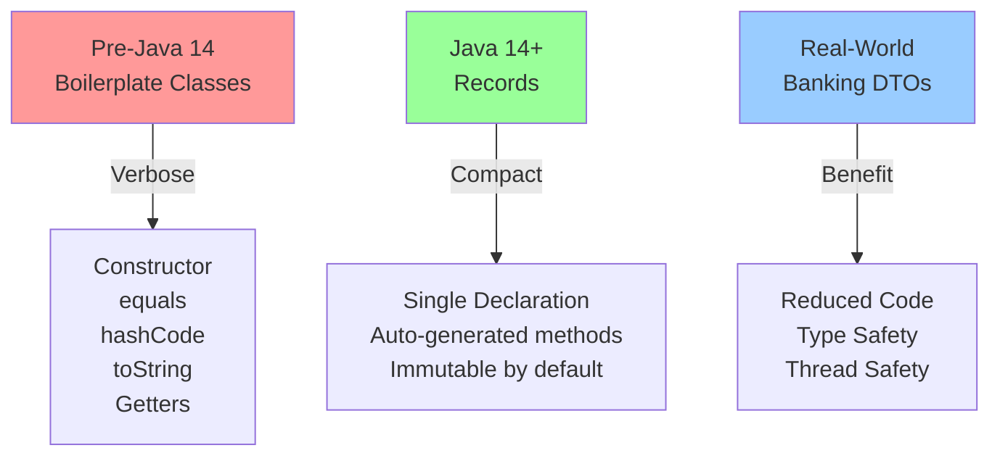
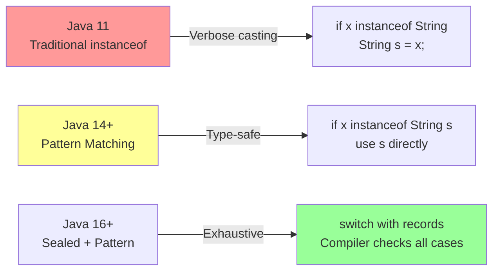
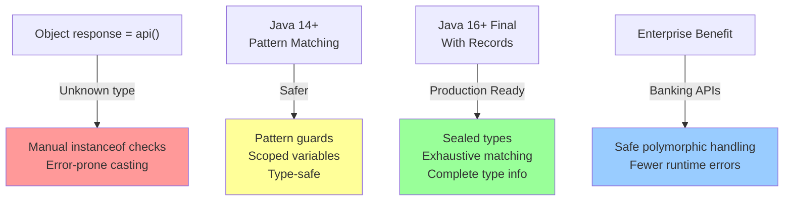

# Java 12-16 Features

## Overview

Java 12-16 represent a transformative period in Java's evolution, introducing **language-level modernizations** that significantly improve readability and expressiveness. This range introduced Records, Pattern Matching, Text Blocks, and Sealed Classes - features that fundamentally changed how we write Java code.

**Why This Matters for Interviews:**
- These features are now standard in production code (Java 17 LTS is widely adopted)
- Understanding the preview→final progression demonstrates language evolution awareness
- Interviewers expect knowledge of modern Java idioms, particularly Records and Pattern Matching
- Several of these features align with enterprise needs (Records reduce boilerplate, Text Blocks improve readability)

**Enterprise Context:**
At major banks, migration from Java 8/11 to Java 17+ is ongoing. Understanding these intermediate features helps explain architectural decisions and migration strategies.

---

## Java 12: Incremental Improvements

### Switch Expressions (Preview)

**What Changed:**
Java 12 introduced switch expressions as a **preview feature** - a significant enhancement to traditional switch statements. Traditional switch statements were statements-only; switch expressions return values and support modern syntax.

#### Traditional Switch vs. Switch Expression

```
Traditional (Java 11):
String message;
switch(day) {
    case MONDAY:
        message = "Start of week";
        break;
    case FRIDAY:
        message = "Almost there";
        break;
    default:
        message = "Mid-week";
}

Java 12+ Switch Expression:
String message = switch(day) {
    case MONDAY -> "Start of week";
    case FRIDAY -> "Almost there";
    default -> "Mid-week";
};
```

#### Key Improvements

| Feature | Traditional | Expression |
|---------|-----------|-----------|
| Return Value | No | Yes |
| Fallthrough | Default behavior | Prevented by design |
| Syntax | Case labels + break | Arrow labels (->)  |
| Exhaustiveness | Compile-time warning | Compile-time error |
| Complex Logic | Separate statements | Code blocks with yield |

#### Advanced Pattern: Using yield with Code Blocks

```java
// Complex logic in switch expression - requires Java 14+
int result = switch(operation) {
    case ADD -> a + b;
    case MULTIPLY -> {
        int temp = a * b;
        // Validation logic
        yield temp > 1000 ? temp : 0;
    }
    default -> throw new IllegalArgumentException("Unknown op");
};
```

**Interview Angle:**
- Why did Java move from statements to expressions? (Functional programming influence, immutability)
- How does exhaustiveness checking prevent bugs? (Compiler guarantees all cases covered)
- When would you still use traditional switch? (Rarely - most modern code uses expressions)

---

### Teeing Collector

**What It Solves:**
The `teeing()` collector allows you to pass a stream through **two different collectors simultaneously**, merging results. Solves the pattern where you need multiple aggregations from one stream pass.

#### Without Teeing (Pre-Java 12)

```java
List<Integer> numbers = Arrays.asList(1, 2, 3, 4, 5);

// Two separate passes through data
long count = numbers.stream().count();
int sum = numbers.stream().mapToInt(Integer::intValue).sum();

// Result: Count=5, Sum=15
```

#### With Teeing (Java 12+)

```java
// Single pass, two collectors
var result = numbers.stream()
    .collect(Collectors.teeing(
        Collectors.counting(),           // First collector
        Collectors.summingInt(Integer::intValue),  // Second collector
        (count, sum) -> new Stats(count, sum)      // Merger function
    ));

// Result: Stats(count=5, sum=15)
```

#### Real-World Example: Stream Statistics

```java
// Single pass computing min, max, average
record StreamStats(long count, long min, long max, double average) {}

StreamStats stats = data.stream()
    .collect(Collectors.teeing(
        Collectors.minBy(Integer::compareTo),
        Collectors.maxBy(Integer::compareTo),
        (min, max) -> calculateStats(data, min, max)
    ));
```

**Interview Angle:**
- Performance implications of single vs. multiple stream passes
- When teeing is better than intermediate collections
- Combining collectors for complex aggregations

---

### String Methods

**New Methods Added:**

| Method | Purpose |
|--------|---------|
| `String.indent(int n)` | Add/remove leading whitespace (useful for text blocks) |
| `String.transform(Function)` | Apply transformation function to string |
| `String.describeConstable()` | Return Optional describing string constant (JEP 334) |

```java
// indent() - useful for formatting
String text = "Hello\nWorld";
String indented = text.indent(4);  // Adds 4 spaces to each line

// transform() - functional approach
String result = "hello"
    .transform(s -> s.toUpperCase())
    .transform(s -> s + "!");  // Fluent chaining
```

---

## Java 13: Text Blocks (Preview)

### What Problem Does It Solve?

**Pre-Java 13 - String Concatenation Hell:**

```java
String json = "{\"name\": \"John\", " +
              "\"age\": 30, " +
              "\"city\": \"NYC\"}";

String html = "<html>\n" +
              "  <body>\n" +
              "    <h1>Title</h1>\n" +
              "  </body>\n" +
              "</html>";

String sql = "SELECT * FROM users " +
             "WHERE age > 18 " +
             "AND status = 'active'";
```

**Java 13+ - Text Blocks:**

```java
String json = """
    {
        "name": "John",
        "age": 30,
        "city": "NYC"
    }
    """;

String html = """
    <html>
        <body>
            <h1>Title</h1>
        </body>
    </html>
    """;

String sql = """
    SELECT * FROM users
    WHERE age > 18
    AND status = 'active'
    """;
```

### Text Block Semantics

```java
// Escaping is handled intelligently
String escaped = """
    Line with "quotes" inside
    Path: C:\\Users\\John\\file.txt
    Special: \t (tab), \n (newline)
    """;

// Leading whitespace management
String preservesIndent = """
        Indented
        Text
        """;  // 8 leading spaces

// stripIndent() and stripTrailing()
String stripped = """
    Text
    """.stripIndent();  // Removes common leading whitespace
```

### Why This Matters

- **Readability**: No more escape character noise
- **Maintenance**: Multi-line strings are common in banking (queries, XML, JSON payloads)
- **SQL Queries**: Critical for database access patterns
- **Configuration**: JSON/YAML embedded in code

**Interview Angle:**
- How does Java calculate common leading whitespace? (Incidental vs. essential)
- What's the difference between a text block and a regular string? (Runtime - they're identical)
- Enterprise use case: Why are text blocks valuable in microservices?

---

## Java 14: Major Milestone - Records & Pattern Matching Preview

### Records (Preview in 14, Final in 16)

#### The Problem Records Solve

Traditional data carrier classes in Java require significant boilerplate:

```java
// Pre-Java 14: Boilerplate nightmare
class Person {
    private final String name;
    private final int age;

    public Person(String name, int age) {
        this.name = name;
        this.age = age;
    }

    @Override
    public boolean equals(Object o) {
        if (this == o) return true;
        if (!(o instanceof Person)) return false;
        Person person = (Person) o;
        return age == person.age &&
               Objects.equals(name, person.name);
    }

    @Override
    public int hashCode() {
        return Objects.hash(name, age);
    }

    @Override
    public String toString() {
        return "Person{" +
               "name='" + name + '\'' +
               ", age=" + age +
               '}';
    }

    public String name() { return name; }
    public int age() { return age; }
}
```

#### Java 14+ Records: Compact and Clear

```java
// Entire class replaced with single line
record Person(String name, int age) {}

// Usage - same interface, zero boilerplate
Person p = new Person("Alice", 30);
System.out.println(p);  // Person[name=Alice, age=30]
System.out.println(p.name());  // Alice
System.out.println(p.equals(new Person("Alice", 30)));  // true
```

#### Advanced Record Features

**Custom Constructor and Validation:**

```java
record Person(String name, int age) {
    // Compact constructor - validates before field assignment
    public Person {
        Objects.requireNonNull(name);
        if (age < 0) throw new IllegalArgumentException("Age must be positive");
    }
}

record BankAccount(String accountNumber, BigDecimal balance) {
    // Custom constructor with business logic
    public BankAccount {
        if (!accountNumber.matches("[0-9]{10}")) {
            throw new IllegalArgumentException("Invalid account number");
        }
    }

    // Static factory method
    public static BankAccount newZeroBalance(String accountNumber) {
        return new BankAccount(accountNumber, BigDecimal.ZERO);
    }
}
```

**Instance Methods in Records:**

```java
record Transaction(String id, BigDecimal amount, LocalDateTime timestamp) {
    public boolean isRecent(Duration threshold) {
        return Duration.between(timestamp, LocalDateTime.now())
            .compareTo(threshold) < 0;
    }
}
```

**Records Cannot:**
- Extend another class (but can implement interfaces)
- Declare instance fields (only via components)
- Use instance initializers
- Be abstract

**Interview Angle:**
- Why eliminate mutable state from records? (Predictable behavior, thread-safety)
- Compare records to Lombok @Data - benefits and trade-offs
- When would you NOT use a record? (Complex business logic, mutable state needed)
- Enterprise impact: Reducing boilerplate in microservices DTO layers

---

### Pattern Matching for instanceof (Preview in 14, Final in 16)

#### Traditional instanceof Pattern

```java
// Pre-Java 14: Verbose type checking and casting
Object obj = getObject();

if (obj instanceof String) {
    String str = (String) obj;  // Redundant cast
    System.out.println(str.length());
}

if (obj instanceof Integer) {
    Integer num = (Integer) obj;  // Redundant cast
    System.out.println(num * 2);
}
```

#### Java 14+ Pattern Matching

```java
// Clean pattern with implicit casting
Object obj = getObject();

if (obj instanceof String str) {
    System.out.println(str.length());  // str already cast
}

if (obj instanceof Integer num) {
    System.out.println(num * 2);
}
```

#### Guarded Patterns (Java 17+, requires Java 14 foundation)

```java
// Combining instanceof pattern with condition
record Transaction(String type, BigDecimal amount) {}

Object payment = new Transaction("credit", BigDecimal.valueOf(100));

if (payment instanceof Transaction t && t.amount().compareTo(BigDecimal.valueOf(1000)) > 0) {
    // Only handles large transactions
    System.out.println("Large payment: " + t.amount());
}
```

**Interview Angle:**
- Why is this safer than manual casting? (Scope of variable, prevents errors)
- How does pattern matching prepare for destructuring? (Java 20+ record patterns)
- Real-world application: Polymorphic API responses in banking systems

---

### Switch Expressions (Finalized)

Java 14 **finalized** switch expressions that were preview in Java 12.

```java
// Now stable in Java 14+
String dayType = switch(dayOfWeek) {
    case MONDAY, TUESDAY, WEDNESDAY, THURSDAY, FRIDAY -> "Weekday";
    case SATURDAY, SUNDAY -> "Weekend";
};

// With yield for complex logic
int category = switch(score) {
    case 0, 1, 2, 3, 4 -> 1;
    case 5, 6, 7 -> {
        // Complex logic
        int scaled = score * 10;
        yield scaled / 7;
    }
    default -> throw new IllegalArgumentException("Invalid score");
};
```

---

### Helpful NullPointerExceptions (JEP 358)

**Pre-Java 14:**
```
Exception in thread "main" java.lang.NullPointerException
    at Example.main(Example.java:5)
```

**Java 14+:**
```
Exception in thread "main" java.lang.NullPointerException:
Cannot invoke method "toUpperCase()" because "user.getName()" is null
    at Example.main(Example.java:5)
```

The JVM now analyzes bytecode to determine **which specific field/method access caused the NPE**, dramatically improving debugging.

**Interview Angle:**
- How does this improve production debugging? (Reduced time to identify null sources)
- Enterprise benefit: Banking systems with complex object graphs

---

## Java 15: Text Blocks (Final) & Sealed Classes (Preview)

### Text Blocks Finalized

Text blocks moved from preview to **final** in Java 15. No API changes, but now production-ready.

```java
// Now stable - no --enable-preview flag needed
String json = """
    {
        "transaction": {
            "id": "TXN123",
            "amount": 1000
        }
    }
    """;
```

---

### Sealed Classes (Preview in 15, Final in 17)

#### The Problem Sealed Classes Solve

Traditional class hierarchies lack **explicit control** over which classes can extend them. This can lead to:
- Unexpected subclasses in library code
- Difficulty reasoning about inheritance trees
- Architectural violations

```java
// Pre-Java 15: No way to restrict who extends this
public class PaymentProcessor {
    public void process(Payment p) {
        // Payment could be extended by anything
    }
}

// Anywhere in the codebase:
class MaliciousPayment extends Payment { }  // Nothing prevents this
```

#### Java 15+ Sealed Classes

```java
// Sealed class: explicitly lists permitted subclasses
sealed abstract class Payment
    permits CreditCardPayment, BankTransferPayment, WireTransferPayment {
    abstract void process();
}

// These classes can extend Payment
final class CreditCardPayment extends Payment {
    @Override
    void process() { /* ... */ }
}

final class BankTransferPayment extends Payment {
    @Override
    void process() { /* ... */ }
}

// Non-final subclass allowed (can be extended further)
non-sealed class WireTransferPayment extends Payment {
    @Override
    void process() { /* ... */ }
}
```

#### Sealed Classes Hierarchy Rules

```
sealed class
├── final class (cannot be extended)
├── sealed class (further restricts)
└── non-sealed class (can be freely extended)
```

#### Combined with Pattern Matching

```java
// Sealed classes + pattern matching = exhaustive checking
String process(Payment payment) {
    return switch(payment) {
        case CreditCardPayment cc -> handleCreditCard(cc);
        case BankTransferPayment bt -> handleBankTransfer(bt);
        case WireTransferPayment wt -> handleWireTransfer(wt);
        // Compiler knows all cases - no default needed!
    };
}
```

**Interview Angle:**
- Why does sealing classes improve type safety? (Exhaustiveness in pattern matching)
- Banking context: Restricting Payment implementations to predefined types
- Design philosophy: Sealed vs. Open/Closed Principle

---

## Java 16: Records & Pattern Matching Finalized + Stream.toList()

### Records (Final)

Records are now **production-ready**, moving from preview in Java 14 to final in Java 16.

```java
// Standard usage - now production-safe
record Order(String orderId, List<LineItem> items, BigDecimal totalAmount) {
    public Order {
        Objects.requireNonNull(orderId);
        Objects.requireNonNull(items);
        if (totalAmount.compareTo(BigDecimal.ZERO) < 0) {
            throw new IllegalArgumentException("Total cannot be negative");
        }
    }
}

// Enterprise DTO layer - Records shine here
record CustomerDTO(String customerId, String name, String email) {}

// API Response wrapper
record ApiResponse<T>(int statusCode, String message, T data) {}
```

**Real-World Banking Example:**

```java
sealed interface Transaction
    permits DebitTransaction, CreditTransaction;

record DebitTransaction(
    String transactionId,
    BigDecimal amount,
    LocalDateTime timestamp,
    String reference
) implements Transaction {}

record CreditTransaction(
    String transactionId,
    BigDecimal amount,
    LocalDateTime timestamp,
    String reference
) implements Transaction {}

// Usage with pattern matching
BigDecimal totalDebits = transactions.stream()
    .filter(t -> t instanceof DebitTransaction)
    .mapToLong(t -> ((DebitTransaction) t).amount().longValue())
    .sum();
```

---

### Pattern Matching for instanceof (Final)

Pattern matching for instanceof is now **stable and production-ready**.

```java
// Full compatibility with records
record PaymentInfo(String type, BigDecimal amount, String account) {}

Object response = apiCall();

if (response instanceof PaymentInfo pi) {
    System.out.println("Processing payment: " + pi.amount());
    // Clean, type-safe access
}

// Pattern matching + records + sealed types = type-safe polymorphism
void handleMessage(Message message) {
    switch(message) {
        case LoginRequest lr -> authenticate(lr.username(), lr.password());
        case DataQuery dq -> queryDatabase(dq.table(), dq.filter());
        case ConfigUpdate cu -> updateConfig(cu.key(), cu.value());
    }
}
```

---

### Stream.toList() (New Convenience Method)

#### The Problem

Pre-Java 16, collecting streams to lists required verbose syntax:

```java
// Pre-Java 16: Verbose
List<String> names = stream
    .map(Person::name)
    .collect(Collectors.toList());

List<String> names2 = stream
    .map(Person::name)
    .collect(Collectors.toUnmodifiableList());  // Immutable version
```

#### Java 16+ Solution

```java
// Clean and clear
List<String> names = stream
    .map(Person::name)
    .toList();  // Equivalent to toUnmodifiableList()

// Returns unmodifiable list
List<Integer> numbers = Arrays.asList(1, 2, 3).stream()
    .map(n -> n * 2)
    .toList();

// numbers.add(5);  // throws UnsupportedOperationException
```

**Important Distinction:**

| Method | Result Type | Mutability |
|--------|------------|-----------|
| `.collect(Collectors.toList())` | ArrayList | Mutable |
| `.collect(Collectors.toUnmodifiableList())` | Immutable List | Immutable |
| `.toList()` (Java 16+) | Immutable List | Immutable |

**Interview Angle:**
- Why is immutability important in stream results? (Thread-safety, predictability)
- Performance implications: ArrayList vs. immutable list
- When would you NOT use .toList()? (Need mutable list, compatibility with older Java)

---

## Preview → Final Progression Summary

```
┌─────────────────────────────────────────────────────────┐
│ Java 12  │ Switch Expressions (PREVIEW)                 │
│          │ Teeing Collector                             │
│          │ String methods (indent, transform)           │
├─────────────────────────────────────────────────────────┤
│ Java 13  │ Text Blocks (PREVIEW)                         │
├─────────────────────────────────────────────────────────┤
│ Java 14  │ Switch Expressions (FINAL)                    │
│          │ Records (PREVIEW)                            │
│          │ Pattern Matching instanceof (PREVIEW)        │
│          │ Helpful NPEs                                 │
├─────────────────────────────────────────────────────────┤
│ Java 15  │ Text Blocks (FINAL)                           │
│          │ Sealed Classes (PREVIEW)                     │
├─────────────────────────────────────────────────────────┤
│ Java 16  │ Records (FINAL)                               │
│          │ Pattern Matching instanceof (FINAL)          │
│          │ Stream.toList()                              │
├─────────────────────────────────────────────────────────┤
│ Java 17  │ Sealed Classes (FINAL)                        │
│          │ LTS Release - Production Standard             │
└─────────────────────────────────────────────────────────┘
```

---

## Mermaid Diagrams

### Records Evolution



### Pattern Matching Evolution



### Text Blocks Readability

```mermaid
graph TB
    A["Pre-Java 13<br/>String Concatenation"] -->|Escaping Hell| B["Line 1: String json = '{\"name\":' +<br/>Line 2: '\"John\", \"age\": ' +<br/>Line 3: '30}'"]
    C["Java 13+<br/>Text Blocks"] -->|Crystal Clear| D['String json = \"\"\"<br/>{<br/>    \"name\": \"John\",<br/>    \"age\": 30<br/>}\"\"\"']
    style A fill:#ff9999
    style C fill:#99ff99
```

### Type Safety Progression



---

## Interview Questions

### Question 1: Switch Expressions vs. Statements
**Q: Why did Java introduce switch expressions instead of keeping only statements?**

**Answer Points:**
- Expressions return values; statements don't
- Prevents accidental fallthrough (-> syntax)
- Enables functional-style code
- Compiler enforces exhaustiveness
- Example: Returning status from switch instead of assigning variable

**Follow-up:** Can you still use traditional switch statements? (Yes, but discouraged; expressions are preferred)

---

### Question 2: Records and Boilerplate
**Q: How do Records reduce boilerplate, and what are their limitations?**

**Answer Points:**
- Auto-generates equals, hashCode, toString, getters
- Immutable by default (final fields, no setters)
- Cannot extend classes (but can implement interfaces)
- Constructor validation via compact constructor
- Enterprise use: Perfect for DTOs, microservices data transfer
- When NOT to use: Complex mutable entities, existing class hierarchy

**Code Example:**
```java
// Before: 50+ lines
class TransactionRequest {
    private final String txnId;
    private final BigDecimal amount;
    // Constructor, equals, hashCode, toString...
}

// After: 1 line
record TransactionRequest(String txnId, BigDecimal amount) {}
```

---

### Question 3: Pattern Matching Safety
**Q: How does pattern matching with instanceof improve code safety?**

**Answer Points:**
- Eliminates redundant casting
- Scopes variable to the if block
- Compiler catches missing casts
- Prevents ClassCastException
- Prepares for sealed classes exhaustiveness

**Evolution:**
```
Java 11: if (obj instanceof String) { String s = (String) obj; }
Java 14: if (obj instanceof String s) { use s directly }
Java 16: sealed types + switch = exhaustive checking
```

---

### Question 4: Text Blocks in Banking
**Q: What are practical benefits of text blocks in banking applications?**

**Answer Points:**
- SQL queries (much more readable)
- JSON payloads for APIs
- XML configurations
- No escape character noise
- Maintenance: Easier to update multi-line content
- Example: Payment processing XML templates

**Real Example:**
```java
String paymentXml = """
    <Payment>
        <Type>ACH</Type>
        <Amount>5000.00</Amount>
        <Account>4567890123</Account>
    </Payment>
    """;
```

---

### Question 5: Sealed Classes and Inheritance
**Q: Why would you use sealed classes instead of final classes?**

**Answer Points:**
- Sealed allows specific subclasses; final allows none
- Documents intent: "This can only be extended by X, Y, Z"
- Works with pattern matching for exhaustiveness
- non-sealed allows further extension
- Banking example: Payment hierarchy (CreditCard, BankTransfer, Wire)

**Sealed Advantage:**
```java
// Sealed: Clear intent about extensibility
sealed abstract class Payment permits CreditCard, BankTransfer { }

// vs.
// Final: Cannot be extended at all
final class PaymentBase { }
```

---

### Question 6: Teeing Collector Performance
**Q: When would teeing be better than two separate stream passes?**

**Answer Points:**
- Single stream traversal (better for large datasets)
- Combined aggregations (count + sum, min + max)
- Reduces memory overhead
- Cannot use for dependent operations (second depends on first)
- Trade-off: Slight complexity vs. performance

**When NOT to use:**
```java
// Bad: Second needs result of first
// This needs sequential processing, not teeing
long count = stream.count();
int filtered = stream.filter(x -> x > count).count();
```

---

### Question 7: Stream.toList() vs. Collectors.toList()
**Q: What's the difference between .toList() and .collect(toList())?**

**Answer Points:**
- .toList() returns immutable list (Java 16+)
- .collect(toList()) returns mutable ArrayList
- .collect(toUnmodifiableList()) also immutable but verbose
- Thread-safety: Immutable is safer
- When to use each:
  - .toList(): Default choice in modern Java
  - .collect(toList()): Need mutability
  - Legacy compatibility

**Performance Impact:**
```java
// .toList() - immutable, often backed by single array
List<String> names = stream.toList();

// .collect(toList()) - mutable, ArrayList internally
List<String> names = stream.collect(toList());

// .toList() safer for concurrent code
```

---

### Question 8: Preview Features and Production
**Q: How should you handle preview features in production code?**

**Answer Points:**
- Preview = may change before becoming final
- Requires --enable-preview flag to compile
- Not recommended for libraries or long-term code
- Wait for final release (1-2 versions usually)
- Timeline example:
  - Java 12: Switch expressions preview
  - Java 14: Final
  - Safe to use in Java 14+

**Strategy:**
```
Evaluate in Java N (preview)
  ↓
Wait for Java N+2 (final release)
  ↓
Adopt in production code
```

---

### Question 9: Records with Business Logic
**Q: Can records handle complex business logic, or are they just for simple data?**

**Answer Points:**
- Records can have methods and static factories
- Validation in compact constructor
- Cannot have mutable state (by design)
- Business logic should be in services, not records
- Records + sealed = type-safe domain models

**Example:**
```java
record BankAccount(String accountNumber, BigDecimal balance) {
    // Validation
    public BankAccount {
        if (balance.compareTo(MINIMUM_BALANCE) < 0) {
            throw new IllegalArgumentException("Insufficient balance");
        }
    }

    // Business method
    public boolean canTransfer(BigDecimal amount) {
        return balance.compareTo(amount) >= 0;
    }

    // Static factory
    static BankAccount newAccount(String number) {
        return new BankAccount(number, MINIMUM_BALANCE);
    }
}
```

---

### Question 10: Sealed Classes with Microservices
**Q: How would you use sealed classes in a microservices architecture?**

**Answer Points:**
- Model bounded domain types (Payment, User, etc.)
- Ensure API contract consistency across services
- Pattern matching for message handlers
- Prevent unexpected implementations
- Clear architectural boundaries

**Example:**
```java
// Service A defines sealed API response
sealed interface ApiResponse permits SuccessResponse, ErrorResponse { }

record SuccessResponse(Object data) implements ApiResponse { }
record ErrorResponse(String message, int code) implements ApiResponse { }

// Service B consumes safely
ApiResponse response = callRemoteService();
String result = switch(response) {
    case SuccessResponse sr -> sr.data().toString();
    case ErrorResponse er -> "Error: " + er.message();
};
```

---

### Question 11: Text Block Whitespace Handling
**Q: How does Java handle indentation in text blocks?**

**Answer Points:**
- Common leading whitespace is automatically removed
- Incidental vs. essential whitespace distinction
- .stripIndent() method available
- stripTrailing() removes trailing whitespace
- Important for SQL and XML formatting

**Example:**
```java
String sql = """
    SELECT * FROM accounts
    WHERE status = 'ACTIVE'
    """;
// Common 4-space indent removed automatically

String preservedIndent = """
        Data
            More indented
        """;
// 8-space common indent removed, relative indentation preserved
```

---

### Question 12: Migration Path Java 11 → 17
**Q: How would you incrementally adopt Java 12-16 features?**

**Answer Points:**
- Java 11 → 14: Use switch expressions, pattern matching
- Java 14 → 16: Migrate DTOs to records, use .toList()
- Java 16 → 17: Adopt sealed classes for domain models
- Text blocks: Safe to adopt from Java 15+ (finalized)
- Preview features: Avoid in production until final

**Practical Timeline:**
```
Year 1: Upgrade to Java 14-16
- Switch expressions in new code
- Records for DTOs
- Pattern matching in polymorphic code

Year 2: Java 17 LTS migration
- Sealed classes for domain models
- Complete text blocks adoption
- Clean up legacy instanceof patterns
```

---

## Key Takeaways for Banking/Enterprise

1. **Records revolutionize DTOs** - massive boilerplate reduction in microservices
2. **Pattern matching + sealed types** - type-safe polymorphism, exhaustive handling
3. **Text blocks improve readability** - critical for SQL and XML payloads
4. **Switch expressions prevent bugs** - no accidental fallthrough
5. **Stream.toList()** - safer immutable collections by default

**Production Readiness (Java 17+ standard):**
- Records: Enterprise standard for data transfer
- Pattern Matching: Safe API response handling
- Text Blocks: Standard for SQL/XML
- Sealed Classes: Domain model definition
- Switch Expressions: Idiomatic Java code

---

## References

- [JEP 361: Switch Expressions (Standard)](https://openjdk.org/jeps/361)
- [JEP 359: Records (Preview)](https://openjdk.org/jeps/359)
- [JEP 375: Pattern Matching for instanceof (Preview)](https://openjdk.org/jeps/375)
- [JEP 368: Text Blocks (Final)](https://openjdk.org/jeps/368)
- [JEP 409: Sealed Classes (Final)](https://openjdk.org/jeps/409)
- [Java 16 Release Notes](https://www.oracle.com/java/technologies/javase/16-relnotes.html)
- [Baeldung: Java Records Guide](https://www.baeldung.com/java-records)
