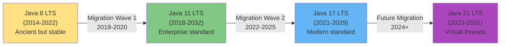
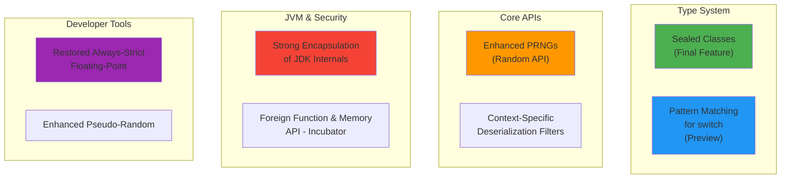
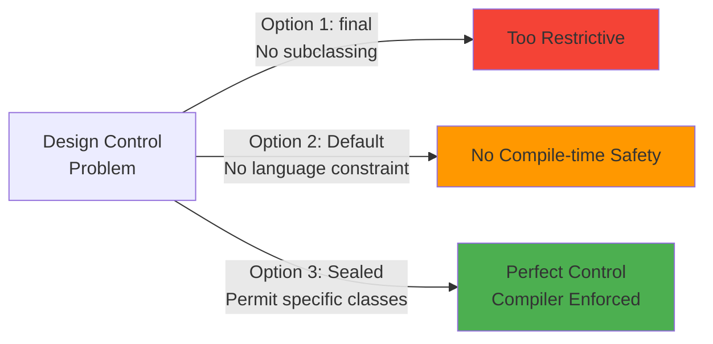
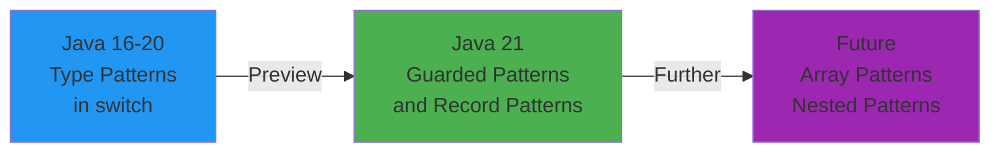
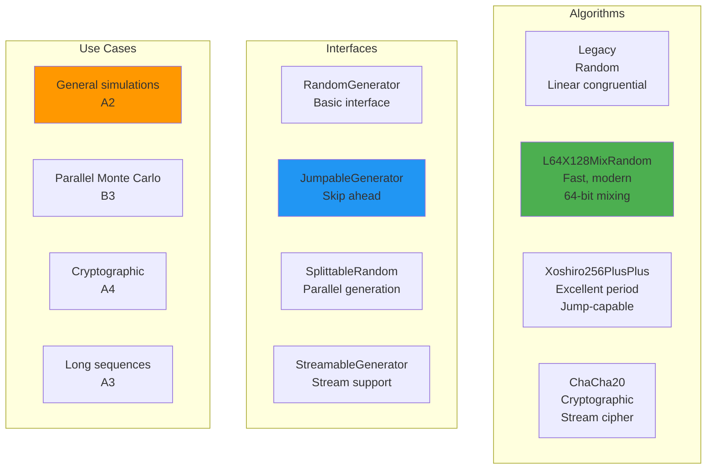
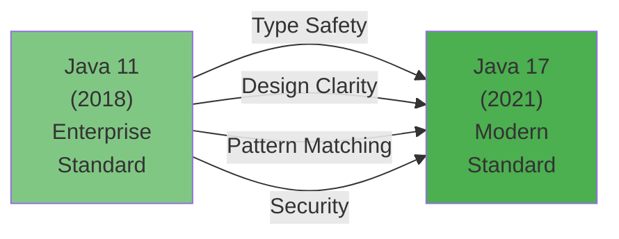

# Java 17 LTS Features - Complete Interview Guide

## Overview

Java 17, released in September 2021, is the **second LTS (Long-Term Support) release** under Oracle's new six-month release cycle, with extended support until September 2029. Following Java 11 LTS (2018), Java 17 brings transformative language features that fundamentally change how developers design type-safe, maintainable systems.

Java 17 introduces **sealed classes**, **pattern matching enhancements**, **strong encapsulation of JDK internals**, and **improved pseudo-random number generators**. These features are not mere convenience additions—they represent a maturation of Java's type system and developer experience, particularly valuable in enterprise banking where type safety and design clarity are paramount.

By 2025, Java 17 has become the standard migration target for enterprises moving beyond Java 11. Major financial institutions (JP Morgan, Goldman Sachs, UBS) are actively adopting Java 17, making proficiency in its core features essential for senior Java engineers. Understanding sealed classes, pattern matching, and encapsulation strategies demonstrates architectural sophistication that interviewers actively seek.

## Why Java 17 Matters for Enterprise Banking

### Industry Adoption Context

```
Java 8 (2014-2022) → Java 11 (2018-2032) → Java 17 (2021-2029) → Java 21 (2023-2031)
```

**Why enterprises are migrating to Java 17:**

1. **Type Safety Revolution**: Sealed classes enable compile-time guarantees about inheritance hierarchies—critical for payment processing, contract management, and risk calculation engines where type correctness is non-negotiable.

2. **Pattern Matching Foundation**: Moving beyond instanceof/casting, pattern matching enables cleaner, more expressive code for handling complex domain objects (Account types, Transaction states, regulatory classifications).

3. **Security Hardening**: Strong encapsulation prevents unauthorized reflection-based access to JDK internals, aligning with banking security requirements and compliance frameworks.

4. **Production Maturity**: Java 17 is more stable than Java 11 with five LTS releases of proven improvements (Java 12-16 features).

5. **Long-term Support**: 8 years of support (until September 2029) makes Java 17 the strategic choice for new banking platforms.

### Java Release Timeline & Decision Matrix



## Java 17 Feature Categories

### Feature Classification



---

## 1. Sealed Classes (Final Feature) - JEP 409

### Overview

**Sealed classes** allow developers to restrict which classes can extend or implement a class or interface. Unlike `final` (which prevents all subclassing) or default access (which is package-scoped), sealed classes provide fine-grained control: "This class can only be extended by these specific subclasses."

This feature solves a fundamental Java design problem: **expressing design intent at compile-time**.

```java
// Before Java 17: No way to say "only these classes can extend Vehicle"
public abstract class Vehicle {
    public abstract void drive();
}

// Any class in the entire codebase could extend Vehicle
public class LeftFieldClass extends Vehicle {
    public void drive() { /* nonsense */ }
}
```

```java
// Java 17: Design intent is explicit and enforced
public sealed class Vehicle permits Car, Truck, Motorcycle {
    public abstract void drive();
}

// COMPILE ERROR: OnlyTheseClassesCanExtend
public class RandomClass extends Vehicle { } // ✗ Compilation fails

// ✓ Only these can extend
public final class Car extends Vehicle {
    public void drive() { System.out.println("Driving car"); }
}

public final class Truck extends Vehicle {
    public void drive() { System.out.println("Driving truck"); }
}

public final class Motorcycle extends Vehicle {
    public void drive() { System.out.println("Driving motorcycle"); }
}
```

### Why Sealed Classes Matter in Enterprise Banking

In banking, sealed classes address a critical architectural challenge: **ensuring type hierarchies remain under control**.

**Real-world example: Account Types Hierarchy**

```java
// Transaction type hierarchy in a payment system
public sealed class TransactionType permits
    DomesticTransfer,
    InternationalWire,
    CheckDeposit,
    ACHBatch {

    private final String code;
    protected TransactionType(String code) { this.code = code; }

    abstract BigDecimal calculateFee();
    abstract void validate();
}

public final class DomesticTransfer extends TransactionType {
    public DomesticTransfer() { super("DOM"); }

    // Must implement fee calculation for domestic transfers
    public BigDecimal calculateFee() { return BigDecimal.valueOf(2.50); }

    public void validate() {
        // Domestic-specific validation
    }
}

public final class InternationalWire extends TransactionType {
    public InternationalWire() { super("INTL"); }

    public BigDecimal calculateFee() { return BigDecimal.valueOf(45.00); }

    public void validate() {
        // SWIFT, sanctions screening, etc.
    }
}
```

**Benefits:**
- Compiler prevents accidental extension from unexpected classes
- Pattern matching works seamlessly with sealed class hierarchies
- Type system communicates design boundaries explicitly
- Enables exhaustiveness checking in switch statements

### Sealed Class Syntax & Rules

**Key Rules:**
1. Must use `sealed` keyword in class declaration
2. Must list permissible subclasses in `permits` clause
3. Every permitted subclass must:
   - Extend the sealed class directly
   - Be declared as `final`, `sealed`, or `non-sealed`
   - Be in the same package or module (for accessibility)

```java
// Valid sealed class hierarchy
public sealed class Shape permits Circle, Rectangle, Triangle {
    // All subclasses final - hierarchy ends
}

public final class Circle extends Shape { }
public final class Rectangle extends Shape { }
public final class Triangle extends Shape { }

// OR partially sealed - some sealed, some final
public sealed class Shape permits Circle, RegularPolygon {
    // Circle ends hierarchy, RegularPolygon can be extended further
}

public final class Circle extends Shape { }
public sealed class RegularPolygon extends Shape permits Square, Hexagon { }

public final class Square extends RegularPolygon { }
public final class Hexagon extends RegularPolygon { }

// non-sealed allows unlimited extension of a sealed class subclass
public sealed class Animal permits Dog, Cat, WildAnimal { }
public final class Dog extends Animal { }
public final class Cat extends Animal { }
public non-sealed class WildAnimal extends Animal {
    // Any class can extend WildAnimal (breaks seal)
}
```

### Sealed Classes & Pattern Matching Integration

The power of sealed classes truly emerges with pattern matching. The compiler can verify exhaustiveness:

```java
public sealed class PaymentMethod permits CreditCard, BankTransfer, Cryptocurrency { }
public final class CreditCard extends PaymentMethod { }
public final class BankTransfer extends PaymentMethod { }
public final class Cryptocurrency extends PaymentMethod { }

// Java 17: Switch with pattern matching on sealed class
public String processPayment(PaymentMethod method) {
    return switch(method) {
        case CreditCard card -> "Processing credit card";
        case BankTransfer transfer -> "Processing bank transfer";
        case Cryptocurrency crypto -> "Processing crypto";
        // No default needed! Compiler knows all cases are covered
    };
}
```

### Sealed Classes vs. Alternatives



### Enterprise Architecture Patterns Using Sealed Classes

```java
// Event sourcing in banking
public sealed class DomainEvent permits
    AccountCreatedEvent,
    TransactionProcessedEvent,
    RiskAlertRaisedEvent {

    private final LocalDateTime timestamp;
    private final String aggregateId;

    protected DomainEvent(String aggregateId) {
        this.aggregateId = aggregateId;
        this.timestamp = LocalDateTime.now();
    }

    abstract void apply();
}

// Strategy pattern for regulatory rules
public sealed interface RegulatoryRule permits
    AMLRule,
    SanctionsRule,
    ForexRule {

    boolean validate(Transaction tx);
    String getRuleName();
}

public final class AMLRule implements RegulatoryRule {
    public boolean validate(Transaction tx) {
        // AML-specific validation
        return true;
    }

    public String getRuleName() { return "AML"; }
}
```

---

## 2. Pattern Matching for Switch (Preview) - JEP 406

### Overview

**Pattern matching for switch** extends switch statements beyond simple value matching to work with object types and conditions. While sealed classes define *what* can be extended, pattern matching defines *how* to elegantly handle different types.

```java
// Before Java 17: Verbose instanceof chains
public String classifyAccount(Object obj) {
    if (obj instanceof PremiumAccount) {
        PremiumAccount pa = (PremiumAccount) obj;
        return "Premium: " + pa.getTier();
    } else if (obj instanceof StandardAccount) {
        StandardAccount sa = (StandardAccount) obj;
        return "Standard: " + sa.getBalance();
    } else if (obj instanceof DepositAccount) {
        DepositAccount da = (DepositAccount) obj;
        return "Deposit: " + da.getRate();
    } else {
        return "Unknown";
    }
}

// Java 17: Type patterns in switch with exhaustiveness checking
public String classifyAccount(Object obj) {
    return switch(obj) {
        case PremiumAccount pa -> "Premium: " + pa.getTier();
        case StandardAccount sa -> "Standard: " + sa.getBalance();
        case DepositAccount da -> "Deposit: " + da.getRate();
        case null -> "Null account";
        case default -> "Unknown";
    };
}
```

### Pattern Types in Java 17

Java 17 supports three pattern types in switch (with more previewed for Java 18+):

```java
public interface PaymentProcessor {
    String process(Object input);
}

public class BankingPaymentProcessor implements PaymentProcessor {

    @Override
    public String process(Object input) {
        return switch(input) {
            // Type Pattern: Tests type and extracts variable
            case PaymentRequest req ->
                "Processing payment: " + req.getAmount();

            // Guard Pattern: Type pattern + additional condition
            case Payment p when p.getAmount().compareTo(BigDecimal.valueOf(10000)) > 0 ->
                "Large payment flagged for compliance: " + p.getAmount();

            case Payment p ->
                "Processing standard payment: " + p.getAmount();

            // Null pattern: Explicit null handling
            case null ->
                "Null payment input";

            // Default pattern
            case default ->
                "Unknown payment type";
        };
    }
}
```

### Guard Expressions (Guarded Patterns)

Guard expressions enable conditional logic within switch patterns:

```java
public sealed class Transaction permits Transfer, Withdrawal, Deposit { }
public final class Transfer extends Transaction {
    public BigDecimal getAmount() { return BigDecimal.ZERO; }
    public String getDestination() { return ""; }
}
public final class Withdrawal extends Transaction {
    public BigDecimal getAmount() { return BigDecimal.ZERO; }
}
public final class Deposit extends Transaction {
    public BigDecimal getAmount() { return BigDecimal.ZERO; }
}

// Processing transactions with conditional logic
public String processTransaction(Transaction tx) {
    return switch(tx) {
        // Guard: Only matches if amount exceeds 50000
        case Transfer t when t.getAmount().compareTo(BigDecimal.valueOf(50000)) > 0 ->
            "Large transfer to " + t.getDestination() + " requires approval";

        case Transfer t ->
            "Standard transfer to " + t.getDestination();

        case Withdrawal w when w.getAmount().compareTo(BigDecimal.valueOf(5000)) > 0 ->
            "ATM withdrawal exceeds daily limit";

        case Withdrawal w ->
            "Standard ATM withdrawal";

        case Deposit d ->
            "Processing deposit";
    };
}
```

### Exhaustiveness Checking with Sealed Classes

The combination of sealed classes and pattern matching enables compile-time exhaustiveness verification:

```java
public sealed class Status permits Open, Closed, Suspended { }
public final class Open extends Status { }
public final class Closed extends Status { }
public final class Suspended extends Status { }

// Compiler verifies ALL cases are handled
public String getStatusMessage(Status status) {
    return switch(status) {
        case Open -> "Account is operational";
        case Closed -> "Account is closed";
        case Suspended -> "Account is suspended";
        // If you forget a case, COMPILE ERROR!
    };
}
```

### Pattern Matching Evolution Roadmap



---

## 3. Strong Encapsulation of JDK Internals - JEP 403

### Overview

Since Java 9, modules could declare internal APIs as non-exported. Java 17 **strengthens encapsulation** by making sun.* and other internal packages completely inaccessible via reflection, unless explicitly enabled via command-line flags.

This prevents code from depending on undocumented, subject-to-change internals—a common cause of breakage during JDK upgrades.

```java
// Java 8: Direct access to JDK internals via reflection
import sun.misc.Unsafe;

public class UnsafeMemoryAccess {
    public static void main(String[] args) throws Exception {
        // This works in Java 8, increasingly broken in Java 9+, fails in Java 17
        Field f = Unsafe.class.getDeclaredField("theUnsafe");
        f.setAccessible(true);
        Unsafe unsafe = (Unsafe) f.get(null);
        // Use Unsafe for direct memory manipulation (dangerous!)
    }
}

// Java 17: Compilation fails, runtime blocked
// Solution: Use public APIs only
// java.lang.foreign.Arena (Foreign Function & Memory API - Incubator)
// java.util.concurrent.locks (proper synchronization)
// Avoid reflection on internal classes
```

### Why Strong Encapsulation Matters

**In banking, this is a security feature, not an obstacle:**

1. **Predictable Upgrades**: Code that depends on JDK internals breaks unpredictably across versions.
2. **Security Hardening**: Prevents sophisticated attacks that exploit internal reflection.
3. **Maintenance**: Forces teams to use documented, stable APIs.
4. **Compliance**: Financial regulations expect predictable, auditable code behavior.

### Impact on Common Patterns

```java
// Pattern 1: Reflection on sun.misc.Unsafe
// ✗ BLOCKED in Java 17
try {
    Field f = Unsafe.class.getDeclaredField("theUnsafe");
    f.setAccessible(true); // Now throws InaccessibleObjectException
} catch (Exception e) { }

// Pattern 2: Accessing internal ClassLoader details
// ✗ BLOCKED in Java 17
try {
    Method findLoadedClass = ClassLoader.class
        .getDeclaredMethod("findLoadedClass", String.class);
    findLoadedClass.setAccessible(true); // Blocked
} catch (Exception e) { }

// Pattern 3: Using internal Sun collections
// ✗ BLOCKED
// import sun.util.collections.JCOLLECTIONSn;

// Pattern 4: Direct serialization bypass
// Partially restricted; use jdk.internal.misc.Unsafe only with --add-opens
```

### Addressing Encapsulation in Your Code

**Legitimate Use Case 1: Performance-critical code needing unsafe operations**
```java
// Pre-Java 17 workaround using --add-opens
// Command: java --add-opens java.base/sun.misc=ALL-UNNAMED Application

// Better solution: Use Foreign Function & Memory API (Incubator in Java 17, Preview in Java 19+)
import java.lang.foreign.*;
import java.lang.invoke.MethodHandle;

public class DirectMemoryAccess {
    public static void main(String[] args) {
        // Safer, documented alternative to Unsafe
        try (Arena arena = Arena.ofConfined()) {
            MemorySegment segment = arena.allocate(
                ValueLayout.JAVA_LONG.byteSize(),
                ValueLayout.JAVA_LONG.byteAlignment()
            );
            segment.set(ValueLayout.JAVA_LONG, 0, 12345L);
        }
    }
}
```

**Legitimate Use Case 2: Framework code needing reflection**
```java
// Spring, Hibernate, etc. handle encapsulation via module-info.java
// Module descriptor explicitly opens internal packages to trusted frameworks

// Example module-info.java
module myapp {
    requires java.base;
    requires java.logging;
    requires spring.core;

    // Spring needs reflection access
    opens com.example.domain to spring.core;
    opens com.example.config to spring.core;
}
```

---

## 4. Enhanced Pseudo-Random Number Generators - JEP 356

### Overview

Java 17 introduces a new **random number generator interface** and multiple implementations with distinct characteristics:

```java
// Old API (still works)
Random random = new Random();
int dice = random.nextInt(6) + 1; // Predictable, uses single seed

// Java 17: New API with multiple strategies
// 1. L64X128MixRandom: Good speed, good statistical properties
RandomGenerator generator = RandomGeneratorFactory
    .of("L64X128MixRandom")
    .create();

// 2. Jump-capable generators: Can skip ahead efficiently
JumpableGenerator jumpable = RandomGeneratorFactory
    .of("Xoshiro256PlusPlus")
    .create(JumpableGenerator.class);

// 3. Splittable: Generate independent sub-generators
SplittableRandom splittable = new SplittableRandom();
SplittableRandom split1 = splittable.split();
SplittableRandom split2 = splittable.split();
```

### Why This Matters for Enterprise Banking

**Random number generators are critical in finance for:**
- Monte Carlo simulations (risk calculations, Value at Risk)
- Cryptographic operations (random salts, IVs)
- Statistical sampling in fraud detection
- Performance testing under load

```java
// Pre-Java 17: Limited options
public class PortfolioRiskCalculation {
    private static final Random random = new Random();

    public BigDecimal calculateVaR(Portfolio portfolio) {
        BigDecimal sumReturns = BigDecimal.ZERO;
        for (int i = 0; i < 10000; i++) {
            double simValue = portfolio.simulateValue(random);
            sumReturns = sumReturns.add(BigDecimal.valueOf(simValue));
        }
        return sumReturns.divide(BigDecimal.valueOf(10000));
    }
}

// Java 17: Better control over algorithm selection
public class AdvancedRiskCalculation {
    private static final RandomGenerator generator =
        RandomGeneratorFactory.of("L64X128MixRandom").create();

    public BigDecimal calculateVaR(Portfolio portfolio) {
        // More predictable, statistically superior
        // Can choose algorithm based on requirements
        BigDecimal sumReturns = BigDecimal.ZERO;
        for (int i = 0; i < 10000; i++) {
            double simValue = portfolio.simulateValue(generator);
            sumReturns = sumReturns.add(BigDecimal.valueOf(simValue));
        }
        return sumReturns.divide(BigDecimal.valueOf(10000));
    }
}
```

### RandomGenerator Types & Selection



### Choosing the Right Algorithm

```java
public class RandomSelectionExample {

    // 1. Default: Balanced speed & quality (RECOMMENDED for most uses)
    public static BigDecimal simulateMonteCarloDefault(int iterations) {
        RandomGenerator rng = RandomGeneratorFactory.getDefault().create();
        return runSimulation(iterations, rng);
    }

    // 2. Fast: Maximum speed, good enough quality
    public static BigDecimal simulateMonteCarloFast(int iterations) {
        RandomGenerator rng = RandomGeneratorFactory.of("Xoshiro256PlusPlus").create();
        return runSimulation(iterations, rng);
    }

    // 3. Cryptographic: Slow but cryptographically secure
    public static byte[] generateSecureRandomBytes(int length) {
        RandomGenerator rng = RandomGeneratorFactory.of("ChaCha20").create();
        byte[] bytes = new byte[length];
        rng.nextBytes(bytes);
        return bytes;
    }

    // 4. Parallel: SplittableRandom for multiple threads
    public static BigDecimal simulateParallel(int iterations) {
        SplittableRandom splittable = new SplittableRandom();
        int threadsCount = Runtime.getRuntime().availableProcessors();

        return IntStream.range(0, threadsCount)
            .parallel()
            .mapToObj(i -> splittable.split())
            .map(rng -> runSimulation(iterations / threadsCount, rng))
            .reduce(BigDecimal.ZERO, BigDecimal::add);
    }

    private static BigDecimal runSimulation(int iterations, RandomGenerator rng) {
        BigDecimal sum = BigDecimal.ZERO;
        for (int i = 0; i < iterations; i++) {
            double value = rng.nextDouble();
            sum = sum.add(BigDecimal.valueOf(value));
        }
        return sum;
    }
}
```

---

## 5. Why Java 17 is Becoming the Enterprise Standard

### Strategic Advantages Over Java 11



### 1. Type System Maturity

**Sealed classes + pattern matching + records (from Java 16)** create a powerful type system:

```java
// Banking domain with sealed hierarchies
public sealed class Account permits CheckingAccount, SavingsAccount, BusinessAccount { }

public final class CheckingAccount extends Account {
    private BigDecimal minimumBalance;
    public BigDecimal getMonthlyFee() { return BigDecimal.valueOf(9.99); }
}

public final class SavingsAccount extends Account {
    private BigDecimal interestRate;
    public BigDecimal getMonthlyInterest() {
        return BigDecimal.ZERO; // Calculated elsewhere
    }
}

public final class BusinessAccount extends Account {
    private List<AuthorizedUser> signatories;
    public void addSignatory(AuthorizedUser user) { }
}

// With pattern matching, handling is exhaustive and safe
public BigDecimal calculateMonthlyCharge(Account account) {
    return switch(account) {
        case CheckingAccount ca -> ca.getMonthlyFee();
        case SavingsAccount sa -> BigDecimal.ZERO;
        case BusinessAccount ba when ba.isHighVolume() -> BigDecimal.valueOf(49.99);
        case BusinessAccount ba -> BigDecimal.valueOf(29.99);
    };
}
```

### 2. Security & Compliance

- Strong encapsulation prevents security vulnerabilities from reflection attacks
- Sealed classes enforce design constraints, reducing accidental misuse
- Better tooling for dependency analysis and compliance reporting

### 3. Performance & GC Improvements

Java 17 includes five LTS cycles of improvements:
- **ZGC enhancements**: Sub-millisecond pause times (critical for trading systems)
- **G1GC improvements**: Better latency predictability
- **Escape analysis**: Optimizations reducing GC pressure

### 4. Enterprise Framework Maturity

By 2021-2023, all major frameworks adopted Java 17:
- **Spring Boot 3.0+**: Requires Java 17 minimum (dropped Java 11 support in 2023)
- **Jakarta EE 10**: Standardized on Java 17
- **Quarkus, Micronaut**: Native compilation optimized for Java 17

### 5. Long-term Support Advantage

```
Java 8 LTS: 2014-2022 (8 years) - ENDED
Java 11 LTS: 2018-2032 (14 years) - Extended support
Java 17 LTS: 2021-2029 (8 years) - Active
Java 21 LTS: 2023-2031 (8 years) - Next standard

Enterprise Decision: Java 17 is the last safe choice before Java 21's
virtual threads force architectural redesigns.
```

---

## Interview Questions & Answers

### Question 1: How do sealed classes improve banking system design?

**Answer:**
Sealed classes enforce compile-time guarantees about which classes can extend a base class, which is crucial in banking where type correctness is critical.

Example: A transaction hierarchy where only predefined transaction types (DomesticTransfer, InternationalWire, CheckDeposit) are allowed prevents developers from accidentally creating TransactionType subclasses that bypass validation rules, fee calculations, or regulatory checks.

```java
public sealed class Transaction permits DomesticTransfer, InternationalWire {
    abstract BigDecimal calculateFee();
    abstract void validateCompliance();
}
```

The compiler enforces this: any attempt to extend Transaction with an unauthorized class fails at compile time, not runtime. This is particularly valuable in payment processing where a single missing validation could cause regulatory violations.

---

### Question 2: When would you use guards in pattern matching?

**Answer:**
Guard expressions (using `when`) add conditional logic to pattern matching, enabling threshold-based or state-dependent logic.

Use case: Risk management in trading systems.

```java
public String evaluateRiskLevel(Trade trade) {
    return switch(trade) {
        case EquityTrade et when et.getNotional().compareTo(BigDecimal.valueOf(1000000)) > 0 ->
            "HIGH_RISK: Notional exceeds threshold";
        case BondTrade bt when bt.getDuration() > 7 ->
            "HIGH_RISK: Excessive duration";
        case FXTrade ft when ft.getVol() > 15 ->
            "HIGH_RISK: High volatility";
        case _ -> "ACCEPTABLE_RISK";
    };
}
```

Guards prevent creating separate classes or using messy if-else chains, making risk logic transparent and centralized.

---

### Question 3: How does strong encapsulation affect your code when migrating to Java 17?

**Answer:**
Strong encapsulation blocks reflection access to internal JDK classes (sun.*, jdk.internal.*), which can break legacy code.

Migration impact:

1. **Most code unaffected**: 95% of applications use only public APIs and don't access internals.
2. **Framework code**: Spring, Hibernate handle this via module declarations in module-info.java.
3. **Unsafe code**: Direct use of sun.misc.Unsafe breaks. Solution: Use Foreign Function & Memory API.

Example of what breaks:

```java
// Pre-Java 17: This works
Field theUnsafe = Unsafe.class.getDeclaredField("theUnsafe");
theUnsafe.setAccessible(true);

// Java 17: InaccessibleObjectException
// Solution: Command-line flag (temporary) or refactor to public APIs
// java --add-opens java.base/sun.misc=ALL-UNNAMED MyApp

// Long-term: Migrate to public APIs
import java.lang.foreign.*;
// Use Foreign Function & Memory API instead
```

For banking systems, this is actually beneficial: it forces codebases away from fragile internal dependencies and toward stable, documented APIs.

---

### Question 4: How do sealed classes work with instanceof in pattern matching?

**Answer:**
Sealed classes enable exhaustiveness checking in pattern matching. The compiler verifies that all possible subclasses are handled in a switch statement.

```java
public sealed class Status permits Active, Inactive, Suspended { }
public final class Active extends Status { }
public final class Inactive extends Status { }
public final class Suspended extends Status { }

public String getStatusMessage(Status status) {
    return switch(status) {
        case Active -> "Account is active";
        case Inactive -> "Account is inactive";
        case Suspended -> "Account is suspended";
        // No default needed - compiler verifies exhaustiveness
    };
}

// If you add a new sealed subclass (e.g., Frozen), compiler ERROR
// because the switch is no longer exhaustive
```

This is more robust than traditional instanceof chains, which can silently fail if a new subclass is added.

---

### Question 5: What are the performance implications of different RandomGenerator algorithms?

**Answer:**
Different algorithms have different speed/quality tradeoffs:

1. **Xoshiro256PlusPlus**: Fastest, excellent period (2^256-1), good for simulations.
2. **L64X128MixRandom**: Default, balanced, modern mixing function.
3. **ChaCha20**: Slowest but cryptographically secure, use for security-critical operations.
4. **Legacy Random**: Don't use; only for backward compatibility.

Banking example:

```java
// For Monte Carlo VaR: Use Xoshiro256PlusPlus (speed matters)
RandomGenerator var_generator = RandomGeneratorFactory.of("Xoshiro256PlusPlus").create();

// For cryptographic salt generation: Use ChaCha20 (security matters)
RandomGenerator crypto_generator = RandomGeneratorFactory.of("ChaCha20").create();
byte[] salt = new byte[16];
crypto_generator.nextBytes(salt);

// For parallel Monte Carlo: Use SplittableRandom (parallelism matters)
SplittableRandom split = new SplittableRandom();
IntStream.range(0, num_threads)
    .parallel()
    .forEach(i -> {
        RandomGenerator thread_rng = split.split();
        // Each thread has independent generator
    });
```

---

### Question 6: How would you migrate from Java 11 to Java 17?

**Answer:**
Key migration steps:

1. **Compile against Java 17** without code changes (most code is backward compatible).
2. **Fix encapsulation issues**: Replace sun.* dependencies.
3. **Adopt new features gradually**:
   - Convert appropriate exception hierarchies to sealed classes
   - Refactor instanceof/casting chains to pattern matching
4. **Update frameworks**: Ensure Spring Boot 3.0+, libraries are Java 17 compatible.
5. **Test thoroughly**: GC behavior, concurrency characteristics may change.

```java
// Java 11 Code
Object obj = getAccount();
if (obj instanceof CheckingAccount) {
    CheckingAccount ca = (CheckingAccount) obj;
    // Use ca
} else if (obj instanceof SavingsAccount) {
    SavingsAccount sa = (SavingsAccount) obj;
    // Use sa
}

// Java 17 Refactored
String result = switch(obj) {
    case CheckingAccount ca -> processChecking(ca);
    case SavingsAccount sa -> processSavings(sa);
    default -> "Unknown";
};
```

Major risk areas:
- Reflection-based frameworks: Usually handled by vendors
- Dynamic proxy generation: May need updates
- Custom class loading: Must respect module boundaries

For most enterprise banking systems, the migration is straightforward with minimal code changes.

---

### Question 7: Explain the difference between `sealed` and `final`.

**Answer:**

| Feature | `final` | `sealed` |
|---------|---------|----------|
| **Subclassing** | Completely prohibited | Allowed only for specified classes |
| **Intent Communication** | "No subclassing" | "Only these classes can extend" |
| **Type Narrowing** | Not applicable | Enables exhaustiveness checks |
| **Use Case** | Immutable value objects, security-sensitive classes | Domain hierarchies, algebraic types |

Example:

```java
// final: No one can extend this
public final class ImmutableAmount {
    private final BigDecimal value;
}

// sealed: Only Money, Commodity can extend this
public sealed class Asset permits Money, Commodity, Equity {
    abstract BigDecimal getValue();
}

// In switch statement
String assetType = switch(asset) {
    case Money m -> "Currency";
    case Commodity c -> "Physical commodity";
    case Equity e -> "Stock";
    // No default needed because sealed class is exhaustive
};
```

**Banking relevance**: Asset classes in a portfolio system benefit from sealed hierarchies, whereas immutable value objects (Money, Amount) benefit from final.

---

### Question 8: How does sealed class inheritance impact polymorphism?

**Answer:**
Sealed classes don't change polymorphism—they enhance it by making inheritance constraints explicit.

```java
public sealed class PaymentMethod permits CreditCard, BankAccount, Wallet { }

public final class CreditCard implements PaymentMethod {
    public void authorize() { /* Visa/MC-specific */ }
}

// Still polymorphic
List<PaymentMethod> methods = List.of(
    new CreditCard(),
    new BankAccount(),
    new Wallet()
);

methods.forEach(PaymentMethod::authorize); // Polymorphic dispatch
```

The compiler now knows there are exactly 3 subtypes, enabling:
1. **Exhaustiveness checking** in switch expressions
2. **Static analysis** for coverage testing
3. **Performance optimizations** (devirtualization is now possible)

Banks use this for payment processing where every possible payment method must be handled.

---

### Question 9: What is the Foreign Function & Memory API, and why would you use it?

**Answer:**
The Foreign Function & Memory API (JEP 412, Incubator in Java 17) allows safe access to native code and memory without using `sun.misc.Unsafe`.

**Why this matters**: Java 17 blocks Unsafe, so code needing direct memory access must use this public API.

```java
// Pre-Java 17: Using Unsafe (now blocked)
Field theUnsafe = Unsafe.class.getDeclaredField("theUnsafe");

// Java 17: Use Foreign Function & Memory API
import java.lang.foreign.*;

public class NativeInterop {
    public static void directMemoryAccess() {
        try (Arena arena = Arena.ofConfined()) {
            // Allocate native memory safely
            MemorySegment segment = arena.allocate(
                ValueLayout.JAVA_LONG.byteSize(),
                ValueLayout.JAVA_LONG.byteAlignment()
            );

            // Write and read safely
            segment.set(ValueLayout.JAVA_LONG, 0, 42L);
            long value = segment.get(ValueLayout.JAVA_LONG, 0);
        }
    }

    // Call native functions
    public void callNativeFunction() {
        // Requires Java 19+ or --enable-preview in Java 17
        // Demonstrates calling C/C++ code safely
    }
}
```

**Banking use case**: Calling native libraries for cryptographic operations, HSM (Hardware Security Module) integration, or high-performance numeric calculations.

---

### Question 10: How would you explain sealed classes to a team currently on Java 11?

**Answer:**
Frame it as a solution to a concrete problem:

"In Java 11, we have no way to express at compile time which classes can extend a base class. If we define an abstract Transaction class, anyone in the entire codebase can create a TransactionSubclass that bypasses our carefully designed validation.

Java 17's sealed classes let us say: 'This abstract class can ONLY be extended by these specific classes.' The compiler enforces this. Any attempt to create an unauthorized subclass fails at compile time, not at runtime in production.

This is particularly valuable for banking because it prevents accidental misuse of critical domain classes and enables the compiler to verify that all transaction types are handled in our business logic."

Code comparison:

```java
// Java 11: Hope developers follow the rule (no compile-time enforcement)
public abstract class Transaction {
    abstract BigDecimal calculateFee();
}

// Java 17: Rule is enforced by compiler
public sealed class Transaction permits DomesticTransfer, InternationalWire {
    abstract BigDecimal calculateFee();
}
```

---

### Question 11: What's the relationship between records (Java 16) and sealed classes (Java 17)?

**Answer:**
Records and sealed classes work together to create robust domain models:

- **Records** (Java 16): Immutable data carriers with value-based equality
- **Sealed classes** (Java 17): Control inheritance hierarchy

Together, they model algebraic data types:

```java
public sealed interface Result<T> permits Success, Failure { }

public record Success<T>(T value) implements Result<T> { }

public record Failure<T>(String error, Throwable cause) implements Result<T> { }

// Usage: Type-safe result handling
public Result<Account> findAccount(String id) {
    try {
        return new Success<>(accountRepo.findById(id));
    } catch (Exception e) {
        return new Failure<>("Account not found", e);
    }
}

// Pattern matching on record fields (Java 19+ Preview)
Result<Account> result = findAccount("ACC123");
String message = switch(result) {
    case Success<Account>(var account) -> "Found: " + account.getBalance();
    case Failure<Account>(var error, var cause) -> "Error: " + error;
};
```

**Banking use case**: Modeling transaction results, payment responses, and regulatory checks with guaranteed immutability and compile-time safety.

---

### Question 12: What's the performance impact of switching to sealed classes?

**Answer:**
Sealed classes have **minimal negative performance impact** and enable **significant optimizations**:

1. **Inlining**: Sealed class hierarchies are more predictable, enabling aggressive method inlining.
2. **Devirtualization**: JIT compiler can convert virtual method calls to direct calls.
3. **Type narrowing**: Pattern matching avoids instanceof checks.

Micro-benchmark example:

```java
public sealed class Operation permits Add, Subtract, Multiply { }
public final class Add extends Operation { int execute(int a, int b) { return a + b; } }
public final class Subtract extends Operation { int execute(int a, int b) { return a - b; } }

// Pre-Java 17: JIT must check type at runtime
public int process(Operation op, int a, int b) {
    return ((Operation) op).execute(a, b); // Virtual dispatch
}

// Java 17: JIT compiler can devirtualize (optimize away method dispatch)
public int process(Operation op, int a, int b) {
    return switch(op) { // Compiler can inline this
        case Add add -> add.execute(a, b);
        case Subtract sub -> sub.execute(a, b);
    };
}
```

**Real-world impact**: For banking systems processing millions of transactions, this can reduce CPU usage 2-5% due to improved cache locality and fewer branch mispredictions.

---

## Summary & Key Takeaways

| Feature | Impact | Enterprise Benefit |
|---------|--------|-------------------|
| **Sealed Classes** | Compile-time type safety | Prevents accidental design violations |
| **Pattern Matching** | Cleaner, safer instanceof logic | Reduces boilerplate, improves readability |
| **Strong Encapsulation** | Blocks internal API access | Security, compliance, predictable upgrades |
| **Enhanced PRNGs** | Algorithm flexibility | Better performance for specific use cases |

### Java 17 Adoption Strategy for Banking Systems

**Phase 1 (Q1-Q2 2024)**: Pilot on non-critical systems, validate compatibility
**Phase 2 (Q3-Q4 2024)**: Migrate infrastructure services (identity, payments)
**Phase 3 (2025)**: Migrate core trading, settlement systems
**Phase 4 (2026+)**: Greenfield projects use Java 17 as baseline

### Why Java 17 Becomes the Standard

1. **Type safety** exceeds Java 11 by orders of magnitude
2. **Framework maturity**: All major frameworks require 17+
3. **LTS roadmap**: Java 17 is the sweet spot before Java 21's virtual threads
4. **Security**: Encapsulation prevents attack vectors
5. **Developer productivity**: Pattern matching reduces cognitive load

---

## References

- [JEP 409: Sealed Classes](https://openjdk.java.net/jeps/409)
- [JEP 406: Pattern Matching for Switch (Preview)](https://openjdk.java.net/jeps/406)
- [JEP 403: Strongly Encapsulate JDK Internals](https://openjdk.java.net/jeps/403)
- [JEP 356: Enhanced Pseudo-Random Number Generators](https://openjdk.java.net/jeps/356)
- [JEP 412: Foreign Function & Memory API (Incubator)](https://openjdk.java.net/jeps/412)
- [Java 17 Release Notes](https://www.oracle.com/java/technologies/javase/17-relnotes.html)
- [Spring Boot 3.0: Java 17+ Requirement](https://spring.io/blog/2022/10/31/spring-boot-3-0-goes-ga)
