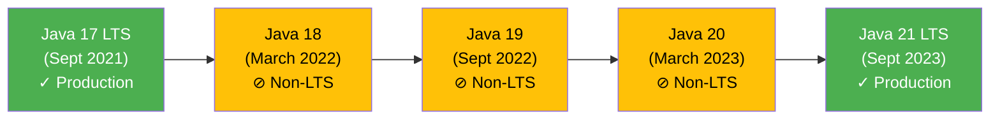
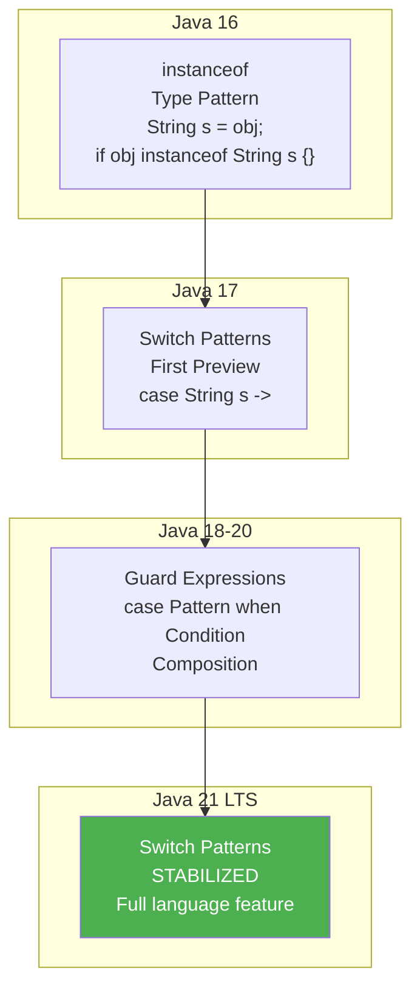
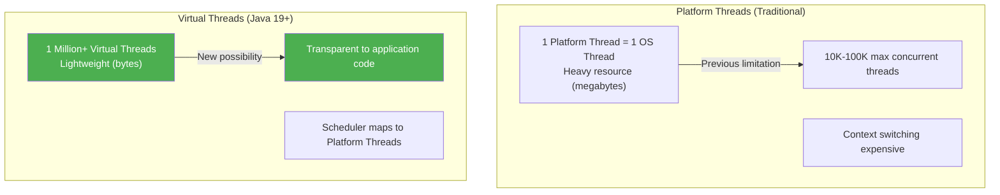
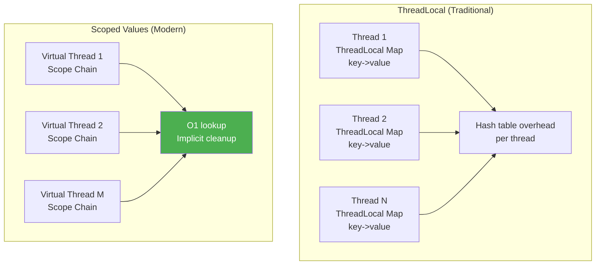

# Java 18-20 Features - Complete Interview Guide

## Overview

Java 18, 19, and 20 represent a **crucial transitional period** between Java 17 LTS and Java 21 LTS. These non-LTS releases introduced **experimental and preview features** that eventually stabilized and became permanent in Java 21 LTS. Understanding this progression is essential for senior developers because:

1. **Preview Features Track**: Many Java 21 features appeared first as previews in Java 18-20, teaching you how the Java language evolves
2. **Enterprise Readiness**: Tracking which features became stable helps assess when to adopt them in production
3. **Interview Value**: Demonstrates deep knowledge of Java's feature incubation process and design philosophy
4. **Virtual Threads Story**: The journey from Java 19 preview to Java 21 stabilization shows paradigm shifts in concurrent programming

Most enterprises (especially banking/fintech) skipped Java 18, 19, and 20 for production due to their non-LTS status, but these releases contain **groundbreaking features** that define modern Java development:

- **Virtual Threads**: Lightweight threading model that enables massive concurrency (millions of threads)
- **Record Patterns**: Destructuring capability for structured data
- **Pattern Matching Evolution**: Moving from simple type checks to complex destructuring
- **Scoped Values**: Thread-confined data with virtual threads efficiency

For interviewers: these releases show how a language community plans backwards-compatible evolution while maintaining feature velocity.

## Java Release Cadence and LTS Context



**Key Point**: Java 21 LTS (Sept 2023) is the **next enterprise standard** after Java 17 LTS. Most features discussed here either stabilized in Java 21 or are recommended for adoption starting with Java 21+.

---

## Java 18 Features (March 2022)

### 1. UTF-8 Default Character Encoding (JEP 400)

#### Overview

Java 18 standardized **UTF-8 as the default character encoding** across all platforms. Previously, the default encoding was platform-dependent:
- Linux/Mac: UTF-8
- Windows: Windows-1252 (or system locale)

This created **portability nightmares** in enterprise applications.

#### Why It Matters

**Problem Before Java 18**:
```java
// Java 8-17: Dangerous across platforms
String s = new String(bytes); // Uses default encoding
// On Windows: Windows-1252
// On Linux: UTF-8
// Result: Different behavior on different machines!

Files.readString(Path.of("file.txt"));
// Silently uses different encoding per platform
```

**Solution - Java 18+**:
```java
// Java 18+: Predictable across all platforms
String s = new String(bytes); // Always UTF-8 guaranteed
Files.readString(Path.of("file.txt")); // Always UTF-8
```

#### Enterprise Impact

For banking systems processing international transactions:
- **Before**: Had to explicitly specify `StandardCharsets.UTF_8` everywhere
- **After**: Default behavior is correct globally
- **Result**: Fewer encoding bugs, more portable code

#### Interview Points

**Question**: "Why did UTF-8 default matter for enterprise applications?"
- **Answer**: Banking systems handle international characters (customer names, addresses, currencies). Platform-dependent encoding caused bugs that manifested only in specific deployment environments. UTF-8 as default ensures global consistency.

**Follow-up**: "How would you have handled this in Java 8?"
- **Answer**: Explicit encoding specification:
```java
Files.readString(path, StandardCharsets.UTF_8);
new String(bytes, StandardCharsets.UTF_8);
```

### 2. Simple Web Server - jwebserver (JEP 408)

#### Overview

Java 18 included a **minimal HTTP server** (`jwebserver`) for serving static files. This isn't a production server but a development convenience tool.

#### What It Does

```bash
# Start server serving current directory on port 8000
jwebserver

# Custom port
jwebserver -p 9000

# Bind to specific interface
jwebserver -b localhost -p 8000
```

#### Use Cases

- **Development**: Quick static site serving for testing
- **Education**: Simple way to demonstrate HTTP concepts
- **Prototyping**: Serve API responses in early development stages

#### Enterprise Relevance

**Limited in production**, but useful for:
- Local development without external dependencies
- Containerized microservices with minimal attack surface
- Quick prototyping before full framework setup

#### Interview Points

**Question**: "When would you use jwebserver instead of Spring Boot?"
- **Answer**: jwebserver is for static content only. Use Spring Boot for:
  - Dynamic responses
  - Business logic
  - Integration with databases
  - Production features (metrics, health checks)

**Real scenario**: "You're onboarding a new team member. They need to verify a static API contract. Would you use jwebserver?"
- **Answer**: Yes, to serve JSON files for contract verification without running a full application server.

### 3. @snippet Tag for JavaDoc (JEP 413)

#### Overview

The `@snippet` tag standardizes how code examples are embedded in JavaDoc documentation.

#### Before Java 18

```java
/**
 * Example usage:
 * <pre>
 * {@code
 * List<String> list = new ArrayList<>();
 * list.add("hello");
 * }
 * </pre>
 */
public void oldStyleExample() { }
```

#### Java 18+

```java
/**
 * Example usage:
 * {@snippet :
 * List<String> list = new ArrayList<>();
 * list.add("hello");
 * }
 */
public void modernExample() { }
```

#### Benefits

- **Cleaner syntax**: No nested tags
- **IDE validation**: IDE can syntax-check code in snippets
- **External files**: Can reference code from external files
- **Highlighting**: Better documentation rendering

#### Interview Context

Low priority in interviews, but shows awareness of documentation best practices.

### 4. Pattern Matching for Switch - Second Preview (JEP 420)

#### Overview

Pattern matching for `switch` was first previewed in Java 17. Java 18 refined it with:
- **Guard expressions** (`when` clauses)
- **Exhaustiveness checking**
- **Pattern composition**

#### Java 17 (First Preview)

```java
// Basic pattern matching
String result = switch (obj) {
    case String s -> "String: " + s;
    case Integer i -> "Int: " + i;
    case null -> "null";
    default -> "unknown";
};
```

#### Java 18 (Improvements)

```java
// Guard expressions with 'when'
String result = switch (obj) {
    case String s when s.length() > 5 -> "Long string: " + s;
    case String s -> "Short string: " + s;
    case Integer i when i > 0 -> "Positive: " + i;
    case Integer i when i < 0 -> "Negative: " + i;
    case Integer i -> "Zero";
    case null -> "null";
    default -> "unknown";
};

// Type patterns with conditions
record Transaction(String account, double amount) { }

String validate(Transaction tx) {
    return switch (tx) {
        case Transaction t when t.amount > 1_000_000 -> "High value";
        case Transaction t when t.amount < 0 -> "Invalid";
        case Transaction t -> "Normal";
    };
};
```

#### Architecture Diagram - Pattern Matching Evolution



#### Enterprise Example

Banking transaction processor:
```java
public void processTransaction(Object transaction) {
    switch (transaction) {
        case WireTransfer wt when wt.amount > 100_000 -> {
            // Audit high-value international transfers
            auditService.logHighValue(wt);
            sendForApproval(wt);
        }
        case DomesticTransfer dt when dt.isScheduled -> {
            // Handle scheduled transfers
            scheduler.enqueue(dt);
        }
        case DomesticTransfer dt -> {
            // Process immediately
            processImmediate(dt);
        }
        case null, default -> {
            throw new IllegalTransactionException();
        }
    }
}
```

#### Interview Points

**Question**: "What's the difference between Java 17 and Java 18 pattern matching?"
- **Answer**: Java 18 added guard expressions (`when` clauses) to filter patterns based on conditions, making switch statements more expressive for complex business logic.

**Question**: "How does this improve on traditional if-else chains?"
- **Answer**:
  - **Type safety**: Compiler ensures type compatibility
  - **Exhaustiveness**: Compiler warns if cases aren't exhaustive
  - **Readability**: Pattern matching is declarative vs imperative if-else
  - **No variable pollution**: Variables like `s` are scoped to their pattern

---

## Java 19 Features (September 2022)

### 1. Record Patterns - First Preview (JEP 405)

#### Overview

Record patterns enable **destructuring of records** - extracting nested fields in a single expression. Combined with pattern matching, this enables powerful data extraction.

#### What Are Record Patterns?

Records (introduced Java 14, standardized Java 16) create immutable data structures:
```java
record Point(int x, int y) { }
record Box(Point topLeft, Point bottomRight) { }
```

**Java 18 and earlier**: Destructuring was verbose:
```java
Box box = new Box(new Point(0, 0), new Point(10, 10));
Point topLeft = box.topLeft();
int x = topLeft.x();
int y = topLeft.y();
```

**Java 19+ (Record Patterns)**:
```java
if (box instanceof Box(Point(int x1, int y1), Point(int x2, int y2))) {
    // Direct access to nested fields!
    System.out.println("Area: " + (x2 - x1) * (y2 - y1));
}
```

#### Progression of Preview Feature

```
Java 19: Record Patterns - First Preview (JEP 405)
Java 20: Record Patterns - Second Preview (JEP 432)
Java 21: Record Patterns - STABILIZED (STABLE FEATURE)
```

#### Enterprise Use Case

Financial transaction records with complex nesting:
```java
record Amount(String currency, double value) { }
record Party(String name, String accountId) { }
record Transaction(Party sender, Party receiver, Amount amount) { }

// Java 19+ with record patterns
public void auditTransaction(Object obj) {
    if (obj instanceof Transaction(
        Party(String senderName, _),
        Party(String receiverName, _),
        Amount("USD", double amount)
    )) {
        // All fields extracted in one pattern match!
        auditService.log(senderName, receiverName, amount);
    }
}
```

#### Interview Points

**Question**: "What problem do record patterns solve?"
- **Answer**: They enable destructuring nested immutable data structures safely and concisely. Instead of calling multiple getters, pattern matching extracts exactly the fields you need.

**Question**: "How would you implement this in Java 8?"
- **Answer**:
```java
// Java 8: Verbose and error-prone
if (obj instanceof Transaction) {
    Transaction t = (Transaction) obj;
    if (t.amount() != null && "USD".equals(t.amount().currency())) {
        Party sender = t.sender();
        if (sender != null) {
            String name = sender.name();
            // ... multiple null checks
        }
    }
}
```

**Question**: "What's the difference between record patterns and destructuring in other languages?"
- **Answer**: Java's approach integrates deeply with the type system and pattern matching, providing compile-time safety. Other languages (Python, Rust) have runtime destructuring; Java's compiler verifies patterns exhaustively.

### 2. Virtual Threads - First Preview (JEP 425)

#### Overview

**Virtual Threads** are lightweight, user-space threads that enable **millions of concurrent operations** on a single JVM. This is one of **Project Loom's** most significant contributions to Java.

#### The Virtual Thread Paradigm Shift



#### Core Concepts

**Platform Threads** (1:1 with OS threads):
```java
// Traditional - 1 platform thread per request
Thread.ofPlatform()
    .start(() -> {
        // This ties up an OS thread
        blockingI_O(); // Network call blocks OS thread
    });
```

**Virtual Threads** (many:few with schedulers):
```java
// Java 19+: Virtual thread
Thread.ofVirtual()
    .start(() -> {
        // This yields CPU while I/O pending
        blockingI_O(); // Doesn't block OS thread!
    });
```

#### How Virtual Threads Work

1. **Application creates millions of virtual threads** (cheap, no OS resources)
2. **Scheduler maps virtual threads to ~CPU count platform threads**
3. **Virtual thread blocks on I/O**: Scheduler saves state, runs different virtual thread
4. **I/O completes**: Virtual thread resumes on available platform thread

**Result**: 1,000,000 concurrent HTTP requests on modern 16-core machine, where previously you'd be limited to 10,000.

#### Progression to Stabilization

```
Java 19: Virtual Threads - First Preview (JEP 425)
Java 20: Virtual Threads - Second Preview (JEP 436)
Java 21: Virtual Threads - STABILIZED (FEATURE COMPLETE)
```

#### Practical Comparison

**Java 8-17 (Traditional Model)**:
```java
// Spring Boot with ThreadPoolTaskExecutor (platform threads)
@Configuration
public class ThreadPoolConfig {
    @Bean
    public Executor taskExecutor() {
        ThreadPoolTaskExecutor executor = new ThreadPoolTaskExecutor();
        executor.setCorePoolSize(100);        // Limit to 100
        executor.setMaxPoolSize(200);         // Absolute max
        executor.setQueueCapacity(500);       // Queue requests
        return executor;
    }
}

// Handle 10K concurrent requests? Need massive thread pool + memory
```

**Java 21+ (Virtual Thread Model)**:
```java
// Spring Boot 3.2+: Virtual thread per request (no pooling needed)
@Configuration
public class VirtualThreadConfig {
    @Bean
    public Executor taskExecutor() {
        return Executors.newVirtualThreadPerTaskExecutor();
        // Handles 1M concurrent requests efficiently!
    }
}
```

#### Virtual Threads in Banking Context

High-concurrency scenarios:
- **Payment processing**: Millions of concurrent payment validations
- **Data feed ingestion**: Process thousands of market data updates simultaneously
- **Report generation**: Generate thousands of customer reports without thread limit
- **Risk calculation**: Real-time risk calculations across millions of positions

#### Interview Points

**Question**: "Why are virtual threads revolutionary for Java?"
- **Answer**: They break the 1:1 mapping between application concurrency and OS resources. Previously, high concurrency required complex async frameworks (reactive, async-await). Virtual threads make it trivial: write blocking code, JVM handles efficiency.

**Question**: "What's the catch? Why not infinite virtual threads?"
- **Answer**: While cheap, virtual threads still consume some memory (state) and scheduler overhead. But practical limits are millions, not thousands. You can create 1M+ virtual threads on a modern machine.

**Question**: "How does this compare to Go's goroutines or Rust's async?"
- **Answer**:
  - **Go goroutines**: Similar concept, millions of lightweight threads, but Go was designed around this model
  - **Rust async**: More complex due to ownership model, but similar efficiency
  - **Java's advantage**: Retrofit onto existing code. No async/await keywords needed. Blocks seamlessly.

**Question**: "In Java 19 preview, what's the API?"
- **Answer**:
```java
// Create and start virtual thread
Thread vt = Thread.ofVirtual()
    .name("request-", 1)
    .start(() -> {
        // Virtual thread code
    });

// Or use executor for task submission
ExecutorService executor = Executors.newVirtualThreadPerTaskExecutor();
executor.submit(() -> {
    // Submitted to virtual thread
});
```

**Question**: "What about ThreadLocal with virtual threads?"
- **Answer**: ThreadLocal still works but now supports **Scoped Values** (Java 20+), which are more efficient because they're automatically inherited by virtual thread children without the cost of ThreadLocal lookups.

### 3. Structured Concurrency - Incubator (JEP 428)

#### Overview

**Structured Concurrency** provides a framework for managing groups of related threads as a single unit, ensuring **no thread is orphaned** and all threads complete before parent completes.

#### The Problem: Unstructured Concurrency

**Java 8-20 (without structured concurrency)**:
```java
// Dangerous: threads can escape parent
ExecutorService executor = Executors.newFixedThreadPool(10);

// Start multiple async operations
Future<Result> f1 = executor.submit(() -> fetchData1());
Future<Result> f2 = executor.submit(() -> fetchData2());
Future<Result> f3 = executor.submit(() -> fetchData3());

// What if this method exits early?
// - Threads are still running (orphaned!)
// - No guarantee all data fetched before returning

List<Result> results = new ArrayList<>();
results.add(f1.get());  // Hope they all complete in time
results.add(f2.get());
results.add(f3.get());
```

**Problems**:
1. Threads can outlive the method that created them
2. No parent-child relationship tracking
3. Exception in one thread doesn't affect others
4. Difficult to coordinate shutdown

#### Structured Concurrency Solution

```java
// Java 19+ (Incubator): Structured concurrency
try (var scope = new StructuredTaskScope.ShutdownOnFailure()) {

    // Submit related tasks - scope ensures they complete together
    Future<Result> f1 = scope.fork(() -> fetchData1());
    Future<Result> f2 = scope.fork(() -> fetchData2());
    Future<Result> f3 = scope.fork(() -> fetchData3());

    // Wait for all to complete (or fail)
    scope.joinUntil(Instant.now().plus(Duration.ofSeconds(5)));

    // At this point, guaranteed: all tasks complete or timed out
    List<Result> results = List.of(
        f1.resultNow(),
        f2.resultNow(),
        f3.resultNow()
    );

} // scope.close() ensures all threads are cleaned up
```

#### Key Properties

1. **Structural**: All threads belong to a scope
2. **Scoped**: Parent waits for children before exiting
3. **Exception transparent**: If any task fails, scope can fail fast
4. **Resource safe**: Try-with-resources ensures cleanup

#### Enterprise Banking Example

Parallel loan application processing:
```java
// Structured concurrency for loan application workflow
public LoanApplicationResult processLoanApplication(String applicationId) {
    try (var scope = new StructuredTaskScope.ShutdownOnFailure()) {

        // Parallel validation and external service calls
        Future<CreditCheck> creditFuture = scope.fork(() ->
            creditService.validateCredit(applicationId));

        Future<IncomeVerification> incomeFuture = scope.fork(() ->
            incomeService.verifyIncome(applicationId));

        Future<BackgroundCheck> bgFuture = scope.fork(() ->
            backgroundCheckService.verify(applicationId));

        // Wait for all with timeout
        scope.joinUntil(Instant.now().plus(Duration.ofSeconds(10)));

        // All succeeded if we reach here
        return new LoanApplicationResult(
            creditFuture.resultNow(),
            incomeFuture.resultNow(),
            bgFuture.resultNow()
        );

    } catch (InterruptedException | TimeoutException e) {
        // If any check times out, entire loan processing fails
        throw new LoanProcessingException("Checks did not complete", e);
    }
}
```

#### Progression

```
Java 19: Structured Concurrency - Incubator (JEP 428)
Java 20: Structured Concurrency - Incubator (JEP 437)
Java 21: Structured Concurrency - Incubator (JEP 452) [Still incubating, not yet stable]
```

#### Interview Points

**Question**: "Why is structured concurrency important for enterprise banking?"
- **Answer**: Banking systems require guarantees about transaction processing. Structured concurrency ensures all related operations (fraud check, credit check, payment validation) either all complete or all fail together. No orphaned threads, no partial state.

**Question**: "How would you handle this in Java 8?"
- **Answer**: Manual synchronization with CountDownLatch or barriers - verbose, error-prone, and lacks composability.

---

## Java 20 Features (March 2023)

### 1. Scoped Values - Incubator (JEP 429)

#### Overview

**Scoped Values** provide thread-confined data that's more efficient than `ThreadLocal` and designed specifically for virtual threads.

#### Problem with ThreadLocal

```java
// Java 8-19: ThreadLocal works but inefficient with virtual threads
static final ThreadLocal<RequestContext> context = new ThreadLocal<>();

public void handleRequest(HttpRequest req) {
    RequestContext ctx = new RequestContext(req.userId());
    context.set(ctx);  // Stored in ThreadLocal map

    try {
        processRequest();
    } finally {
        context.remove();
    }
}

private static RequestContext getContext() {
    return context.get();  // Lookup in ThreadLocal map
}
```

**Problems**:
1. **ThreadLocal storage overhead**: Requires hash table per thread
2. **Virtual threads inefficiency**: With millions of virtual threads, hash table lookup becomes expensive
3. **Inheritance complexity**: Child threads need ThreadLocal values from parent
4. **Cleanup required**: Must explicitly remove to avoid memory leaks

#### Scoped Values Solution

```java
// Java 20+: Scoped values designed for virtual threads
static final ScopedValue<RequestContext> context = ScopedValue.newInstance();

public void handleRequest(HttpRequest req) {
    RequestContext ctx = new RequestContext(req.userId());

    // Bind scoped value for this scope
    ScopedValue.where(context, ctx)
        .run(() -> processRequest());

    // ctx is automatically unbound after run() completes
}

private static RequestContext getContext() {
    return context.get();  // Efficient lookup, no hash table
}
```

#### Architecture: ThreadLocal vs Scoped Values



#### Practical Comparison

**Java 19 with ThreadLocal**:
```java
static final ThreadLocal<String> userId = new ThreadLocal<>();

public void handleRequest(String id) {
    userId.set(id);  // Store in thread's map
    try {
        processTransaction();
    } finally {
        userId.remove();  // Must clean up manually
    }
}
```

**Java 20+ with Scoped Values**:
```java
static final ScopedValue<String> userId = ScopedValue.newInstance();

public void handleRequest(String id) {
    ScopedValue.where(userId, id)
        .run(() -> processTransaction());
    // Automatic cleanup when scope exits
}
```

#### Key Differences

| Aspect | ThreadLocal | Scoped Values |
|--------|------------|---------------|
| **Scope** | Thread lifetime (until remove) | Explicit lexical scope |
| **Storage** | Thread-local map | Scope chain |
| **Lookup** | Hash table O(1) avg | Chain traversal O(depth) |
| **Cleanup** | Manual remove() | Automatic |
| **Virtual Threads** | Works but slow | Optimized for millions |
| **Child access** | Inheritance via new Thread | Implicit in scope |
| **Unbind** | Never automatic | Scope exit |

#### Interview Points

**Question**: "Why create Scoped Values when ThreadLocal already exists?"
- **Answer**: ThreadLocal assumes OS thread lifetime, scaling poorly with millions of virtual threads. Scoped Values are designed for explicit scopes and virtual thread efficiency. Automatic cleanup prevents memory leaks.

**Question**: "When would you choose ThreadLocal over Scoped Values?"
- **Answer**: If targeting Java 19 or earlier, use ThreadLocal. For Java 20+, Scoped Values are preferred for new code.

**Question**: "How do scoped values work with virtual thread inheritance?"
- **Answer**: Scoped values are automatically available in child scopes/threads within their binding scope. When a virtual thread spawned from within a scope, the scoped values are accessible without explicit passing.

### 2. Record Patterns - Second Preview (JEP 432)

Record patterns moved to **second preview in Java 20** with refinements:
- **Nested pattern composition** improvements
- **Var patterns** in record patterns
- **Array patterns** (upcoming)

#### Enhanced Nested Destructuring

```java
// Java 20: More powerful nested patterns
record Team(String name, List<Player> players) { }
record Player(String name, int age) { }

public void analyzeTeam(Object obj) {
    if (obj instanceof Team(
        String teamName,
        List<Player(String playerName, int age), ...)
    )) {
        // Extract team name and all player names in one pattern!
        System.out.println(teamName + " has " + players.size() + " players");
    }
}
```

**Progression**:
```
Java 19: First Preview - Basic record patterns
Java 20: Second Preview - Nested composition, var patterns
Java 21: STABILIZED - Full feature
```

#### Interview Points

**Question**: "What improvements did Java 20 bring to record patterns from Java 19?"
- **Answer**: Better support for nested patterns, var pattern support, and improved exhaustiveness checking.

### 3. Virtual Threads - Second Preview (JEP 436)

Virtual threads entered their **second and final preview in Java 20** with:
- **Thread API finalization**
- **CarrierThread improvements** (platform thread scheduling)
- **Documentation and best practices** solidification
- **Performance optimizations**

#### Key API Stabilizations

```java
// Java 20: Final preview API
// Create named virtual thread
Thread vt = Thread.ofVirtual()
    .name("task-", 1000)
    .start(runnable);

// Virtual thread factory for ExecutorService
ExecutorService executor = Executors.newVirtualThreadPerTaskExecutor();

// Check if running in virtual thread
if (Thread.currentThread().isVirtual()) {
    System.out.println("Running in virtual thread");
}
```

#### Final Progression

```
Java 19: Virtual Threads - First Preview (JEP 425)
Java 20: Virtual Threads - Second Preview (JEP 436)
Java 21: Virtual Threads - STABLE (PRODUCTION READY)
```

#### What Changed from Preview 1 to Preview 2

1. **API cleanup**: Method names finalized
2. **Scheduler improvements**: Better CPU utilization
3. **Thread dumps**: Improved diagnostics showing virtual threads
4. **Documentation**: Best practices for adoption

#### Ready for Production in Java 21

By Java 21 LTS (September 2023), virtual threads are **production-ready**:

```java
// Java 21 Spring Boot application
@Configuration
public class AppConfig {
    @Bean
    public Executor asyncExecutor() {
        // Production-ready virtual thread executor
        return Executors.newVirtualThreadPerTaskExecutor();
    }
}

// Traditional blocking code works perfectly
@RestController
public class PaymentController {
    @PostMapping("/pay")
    public PaymentResult processPayment(@RequestBody Payment payment) {
        // This runs on virtual thread
        // Blocking I/O is fine - doesn't block OS thread
        return paymentService.process(payment);
    }
}
```

#### Interview Points

**Question**: "What should change in Java 20 from Java 19 for virtual threads?"
- **Answer**: API finalization, scheduler improvements, and production-readiness validation. The core concept remains the same: lightweight user-space threads.

**Question**: "If Java 21 stabilizes virtual threads, why learn Java 20?"
- **Answer**: Java 20 is the final preview before production. Learning the preview progression shows you how the feature evolved and understand the production version deeply.

---

## Preview Feature Progression Summary

This table shows how features progressed through the Java release cycle:

```
┌─────────────────────────┬─────────┬─────────┬─────────┬─────────────┐
│ Feature                 │ Java 18 │ Java 19 │ Java 20 │ Java 21 LTS │
├─────────────────────────┼─────────┼─────────┼─────────┼─────────────┤
│ UTF-8 Default           │ STABLE  │ STABLE  │ STABLE  │ STABLE      │
│ jwebserver              │ STABLE  │ STABLE  │ STABLE  │ STABLE      │
│ @snippet Tag            │ STABLE  │ STABLE  │ STABLE  │ STABLE      │
│ Pattern Matching Switch │ Preview │ Preview │ Preview │ STABLE      │
│ Record Patterns         │ ─       │ Preview │ Preview │ STABLE      │
│ Virtual Threads         │ ─       │ Preview │ Preview │ STABLE      │
│ Structured Concurrency  │ ─       │ Incubator│Incubator│ Incubator  │
│ Scoped Values           │ ─       │ ─       │ Incubator│ Incubator  │
└─────────────────────────┴─────────┴─────────┴─────────┴─────────────┘
```

**Key Observations**:
- **Java 18**: Foundation (UTF-8, web server, docs)
- **Java 19-20**: Feature incubation (previews, experimental)
- **Java 21 LTS**: Stabilization of previews → production features

---

## Critical Interview Questions

### Question 1: Virtual Threads vs Platform Threads
**Q**: Explain when and why you'd use virtual threads instead of platform threads.

**Answer Structure**:
- **Use Virtual Threads for**:
  - High I/O concurrency (millions of connections)
  - Request-per-thread handlers (HTTP servers)
  - Parallel batch processing
  - Any workload where blocking on I/O is common

- **Use Platform Threads for**:
  - CPU-intensive work (no I/O blocking)
  - Long-running background tasks
  - Tasks requiring strict resource limits

- **Example**:
```java
// Virtual thread perfect for I/O-heavy
public void handleRequest() {
    database.query(); // Blocks virtual, not OS thread
    cache.get();      // Blocks virtual, not OS thread
    apiCall.fetch();  // Blocks virtual, not OS thread
}

// Platform thread better for CPU-heavy
public void calculateRisk() {
    // Pure CPU, no I/O blocking
    double riskScore = complexMathematicalModel(positions);
}
```

### Question 2: Record Patterns Exhaustiveness
**Q**: How do record patterns help the compiler ensure exhaustive pattern matching?

**Answer**:
```java
record Transaction(String type, double amount) { }

// Compiler checks exhaustiveness
String result = switch (tx) {
    case Transaction(String t, double a) when t.equals("WIRE") -> "Wire";
    case Transaction(String t, double a) when t.equals("ACH") -> "ACH";
    // Compiler ERROR: Not all cases covered!
    // Missing: other string values, null patterns
};

// Correct: Exhaustive
String result = switch (tx) {
    case Transaction(String t, _) when t.equals("WIRE") -> "Wire";
    case Transaction(String t, _) when t.equals("ACH") -> "ACH";
    case Transaction(_, _) -> "Other";  // Covers all remaining
};
```

### Question 3: Scoped Values vs ThreadLocal Design
**Q**: Design a request context system using Scoped Values. How is it different from ThreadLocal?

**Answer**:
```java
// Scoped Value design (Java 20+)
class RequestContext {
    static final ScopedValue<String> USER_ID = ScopedValue.newInstance();
    static final ScopedValue<String> CORRELATION_ID = ScopedValue.newInstance();
    static final ScopedValue<SecurityLevel> SECURITY = ScopedValue.newInstance();

    public static void inContext(String userId, String corrId, SecurityLevel sec, Runnable task) {
        ScopedValue.where(USER_ID, userId)
            .where(CORRELATION_ID, corrId)
            .where(SECURITY, sec)
            .run(task);
        // All values automatically unbound here
    }

    public static String getCurrentUserId() {
        return USER_ID.get();  // O(1) lookup, always available in scope
    }
}

// Usage
RequestContext.inContext("user123", "corr-456", SecurityLevel.HIGH, () -> {
    processPayment();  // Can access RequestContext.getCurrentUserId()
});
// Values automatically cleaned up
```

**Difference from ThreadLocal**:
1. **Automatic cleanup**: No remove() needed
2. **Explicit scope**: Clear where values are available
3. **Virtual thread efficiency**: No hash table overhead
4. **Child access**: Scoped values available in child tasks automatically

### Question 4: Pattern Matching Evolution
**Q**: Trace the evolution of pattern matching from Java 16 to Java 20.

**Answer**:
```
Java 16: instanceof type pattern
    if (obj instanceof String s) { }

Java 17: switch patterns (first preview)
    switch (obj) {
        case String s -> ...
        case Integer i -> ...
    }

Java 18: guard expressions (second preview)
    switch (obj) {
        case String s when s.length() > 5 -> ...
    }

Java 19: record patterns (first preview)
    if (obj instanceof Transaction(String id, Amount(double val, _))) { }

Java 20: record patterns enhanced (second preview)
    switch (obj) {
        case Transaction(String id, Amount(double v, "USD")) -> ...
    }

Java 21: All STABLE - Full language feature
```

### Question 5: Structured Concurrency Design
**Q**: Design a payment processing system using Structured Concurrency that validates fraud checks, credit limits, and funds availability in parallel.

**Answer**:
```java
public PaymentResult processPayment(PaymentRequest req) throws Exception {
    try (var scope = new StructuredTaskScope.ShutdownOnFailure()) {

        // All checks run in parallel, all must succeed
        Future<FraudCheck> fraud = scope.fork(() ->
            fraudService.checkTransaction(req));

        Future<CreditCheck> credit = scope.fork(() ->
            creditService.verifyCreditLimit(req.amount()));

        Future<FundCheck> funds = scope.fork(() ->
            accountService.verifyFundsAvailable(req.fromAccount(), req.amount()));

        // Wait for all with timeout
        scope.joinUntil(Instant.now().plus(Duration.ofSeconds(5)));

        // If any failed, exception thrown, payment rejected
        return new PaymentResult(
            fraud.resultNow(),
            credit.resultNow(),
            funds.resultNow()
        );
    } catch (TimeoutException e) {
        throw new PaymentTimeoutException("Validation exceeded 5 seconds");
    }
}
```

### Question 6: Migration Strategy
**Q**: Your company is on Java 11. You want to adopt virtual threads for your high-concurrency API. What's your migration path?

**Answer**:
```
Step 1: Upgrade to Java 21 LTS
  - Virtual threads stable and production-ready
  - Long-term support until 2031

Step 2: Identify high-concurrency code
  - ThreadPoolExecutor with large thread pools
  - Blocking I/O operations (database, HTTP)
  - Request handlers (Spring controllers)

Step 3: Replace thread pools with virtual threads
  Old: ThreadPoolTaskExecutor with pool size 100-500
  New: Executors.newVirtualThreadPerTaskExecutor()

Step 4: Test and validate
  - Load testing with realistic concurrency
  - Memory profiling
  - Latency metrics

Step 5: Gradual rollout
  - Canary deployment
  - Monitor resource usage (should decrease)
  - Monitor latency (should improve)

Step 6: Cleanup
  - Remove thread pool config
  - Remove manual thread management code
  - Simplify async/callback patterns

Expected Benefits:
  - 50-90% memory reduction for thread overhead
  - 30-50% latency improvement for I/O-bound workloads
  - Simplified code (no complex async frameworks needed)
```

### Question 7: Pattern Matching in Banking
**Q**: Design a transaction routing system using pattern matching that routes transactions based on type, amount, and destination.

**Answer**:
```java
record Transaction(String type, double amount, String destination) { }
record DomesticTransfer(Transaction tx) { }
record InternationalTransfer(Transaction tx, String currency) { }

public void routeTransaction(Object obj) {
    switch (obj) {
        // International above $10K go to compliance
        case InternationalTransfer(
            Transaction(_, double amt, _),
            String currency
        ) when amt > 10_000 -> {
            complianceQueue.enqueue(obj);
        }

        // Domestic transfers route based on amount
        case DomesticTransfer(
            Transaction("WIRE", double amt, String dest)
        ) when amt > 50_000 -> {
            approvalQueue.enqueue(obj);  // High-value review
        }

        case DomesticTransfer(
            Transaction("ACH", _, _)
        ) -> {
            automatedProcessor.process(obj);
        }

        // Low-value, simple transfers
        case Transaction(_, double amt, _) when amt < 1_000 -> {
            instantProcessor.process(obj);
        }

        case null, default -> {
            throw new InvalidTransactionException();
        }
    }
}
```

### Question 8: UTF-8 Encoding Gotcha
**Q**: A Java 8 application running on Windows works fine locally but fails in production on Linux with encoding errors. What's the likely cause and how would Java 18+ fix it?

**Answer**:
```
Cause:
  - Java 8-17: Default encoding is platform-dependent
  - Windows default: Windows-1252
  - Linux default: UTF-8
  - Code assumes platform encoding: String(bytes) or Files.readString()
  - Fails when international characters are present

Example of problem:
  Java 8 Windows: new String(bytes)  // Uses Windows-1252
  Reads: "Zürich" correctly

  Java 8 Linux: new String(bytes)    // Uses UTF-8
  Reads: "Üü绣" - garbled!

Solution (Java 18+):
  - All platforms default to UTF-8
  - new String(bytes) always uses UTF-8
  - Files.readString() always uses UTF-8
  - Consistent behavior across environments

Modern fix:
  Files.readString(path, StandardCharsets.UTF_8);  // Always safe, explicit
```

### Question 9: Scoped Values with Virtual Threads
**Q**: Why are Scoped Values more efficient than ThreadLocal when used with virtual threads?

**Answer**:
```
ThreadLocal with virtual threads:
  - 1 million virtual threads
  - Each has ThreadLocal map (hash table)
  - Memory: 1M × size(hash table) = significant overhead
  - Lookup: Hash function + collision handling
  - Cache misses: Hash table scattered in memory

Scoped Values with virtual threads:
  - 1 million virtual threads
  - Each has scope chain (linked list)
  - Memory: O(scope depth) per thread, not scope count
  - Lookup: Chain traversal (depth typically 5-10)
  - Cache friendly: Linear traversal improves locality

Efficiency metrics:
  ThreadLocal: O(1) hash, but memory * 1M threads
  Scoped Values: O(depth) lookup, memory / scope_count

For 1M threads with 10 scopes:
  ThreadLocal: 1M hash tables
  Scoped Values: 10 scope chains shared
```

### Question 10: Record Pattern Practical Use
**Q**: Write a banking system using record patterns that processes loan applications with nested validation.

**Answer**:
```java
record Applicant(String name, int age, double income) { }
record Property(String address, double value) { }
record LoanApplication(Applicant applicant, Property property, double loanAmount) { }

public LoanDecision evaluateLoan(Object obj) {
    // Record patterns extract and validate in one expression
    if (obj instanceof LoanApplication(
        Applicant(String name, int age, double income),
        Property(_, double propValue),
        double loanAmount
    )) {
        double ltvRatio = loanAmount / propValue;
        double dtiRatio = loanAmount / income;

        return switch (true) {
            // Excellent credit profile
            case true when age >= 25 && income > 100_000 && ltvRatio < 0.70 ->
                new LoanDecision.APPROVED("Prime rate", 3.5);

            // Good profile with conditions
            case true when income > 50_000 && ltvRatio < 0.80 && dtiRatio < 0.45 ->
                new LoanDecision.APPROVED_WITH_CONDITIONS("Standard rate", 4.5);

            // High risk
            case true when ltvRatio > 0.90 || dtiRatio > 0.50 ->
                new LoanDecision.REJECTED("LTV or DTI ratio too high");

            case true when age < 25 ->
                new LoanDecision.REVIEW_REQUIRED("Age consideration needed");

            default -> new LoanDecision.REJECTED("Unknown criteria");
        };
    }
    throw new InvalidApplicationException();
}
```

### Question 11: Virtual Thread Thread Dumps
**Q**: How do virtual thread thread dumps differ from platform thread dumps?

**Answer**:
```
Java 8-20 (platform threads only):
  - Thread dump shows maybe 50-200 threads
  - Each line = heavy OS resource
  - Difficult to correlate to logical requests

Java 21+ (with virtual threads):
  - Thread dump shows millions of threads
  - Tools filter/summarize by state
  - jcmd <pid> Thread.dump_to_file

Virtual thread dump considerations:
  - Too many to display in full
  - Tools provide summaries: "1M virtual threads, 16 carrier threads"
  - Can filter by name: Thread.ofVirtual().name("request-", id)
  - Correlation ID tracking becomes critical

Practical approach:
  - Use structured logging with correlation IDs
  - Thread dumps less useful for debugging (too many threads)
  - Metrics and logs become primary debugging tools
```

### Question 12: Pattern Matching vs instanceof
**Q**: When would you use pattern matching switch instead of instanceof chain?

**Answer**:
```java
// Bad: instanceof chain
if (obj instanceof String) {
    String s = (String) obj;
    // process string
} else if (obj instanceof Integer) {
    Integer i = (Integer) obj;
    // process integer
} else if (obj instanceof Double) {
    Double d = (Double) obj;
    // process double
}

// Better: Pattern matching
String result = switch (obj) {
    case String s -> process(s);
    case Integer i -> process(i);
    case Double d -> process(d);
    default -> "unknown";
};

// Benefits of pattern matching:
  1. Compiler ensures exhaustiveness (can't forget a case)
  2. No casting needed (type automatically extracted)
  3. Guard expressions for conditional logic
  4. Composable with records (nested destructuring)
  5. More readable declarative style
```

---

## Key Takeaways for Interviews

1. **Virtual Threads are the paradigm shift**: Understand deeply why they matter, not just the API
2. **Pattern Matching journey**: Trace the evolution from simple instanceof to record pattern destructuring
3. **Preview feature progression**: Learning to read the feature maturity (preview → stable) shows language evolution understanding
4. **Banking context matters**: Explain how each feature helps solve real banking problems
5. **Trade-offs**: Understand the design decisions (why Scoped Values over ThreadLocal, why structured concurrency matters)

---

## Additional Resources

### Official JEPs
- JEP 400: UTF-8 by Default
- JEP 408: Simple Web Server
- JEP 413: Code Snippets in JavaDoc
- JEP 420: Pattern Matching for switch (2nd preview)
- JEP 425: Virtual Threads (Preview)
- JEP 428: Structured Concurrency (Incubator)
- JEP 432: Record Patterns (2nd preview)
- JEP 429: Scoped Values (Incubator)
- JEP 436: Virtual Threads (2nd preview)

### Further Reading
- Project Loom: Virtual thread design and implementation
- Project Panama: Foreign function & memory interface (related concurrency implications)
- OpenJDK mailing lists: Deep technical discussions on feature evolution

---

## Summary

Java 18-20 represent the **preview laboratory** for features that stabilized in Java 21 LTS. Rather than jumping directly to Java 21, understanding these intermediate releases shows:

- **Feature maturity process**: How Java carefully evaluates language changes
- **Pragmatic evolution**: Balance between innovation and stability
- **Enterprise readiness**: Why companies wait for LTS (Java 21) rather than adopting Java 19/20 for production

**For interviews**: This progression demonstrates you understand not just what features do, but how the Java language evolves responsibly, maintaining backward compatibility while advancing the platform.

The journey from Java 17 LTS → Java 18-20 previews → Java 21 LTS is where **modern Java** is built.
