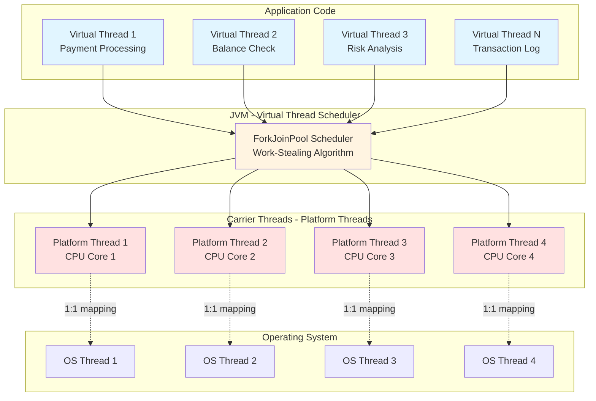
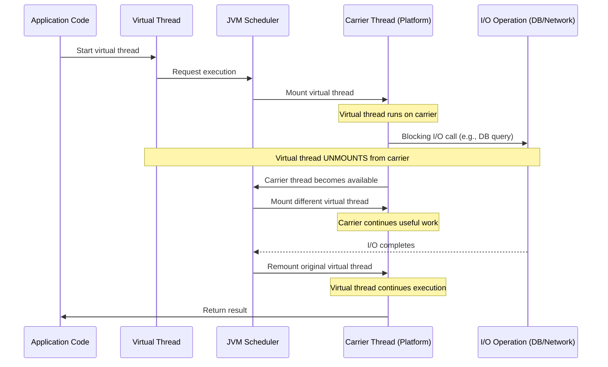
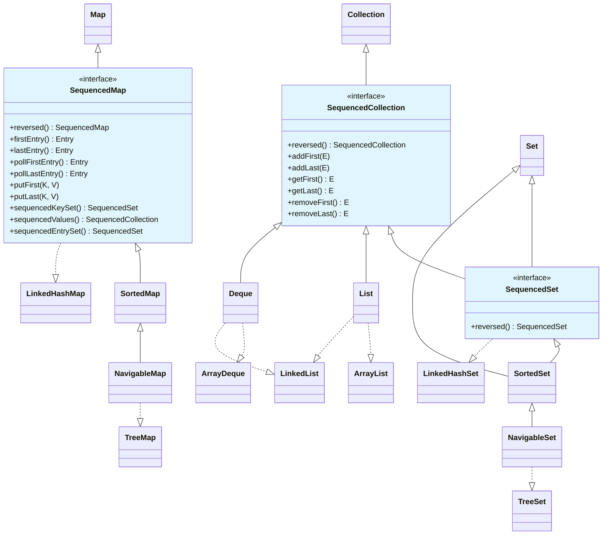
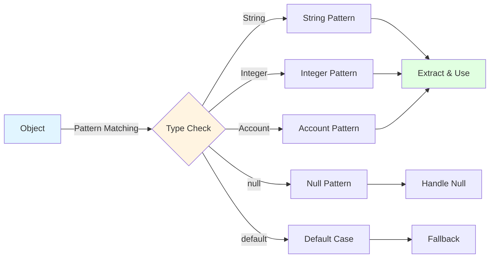
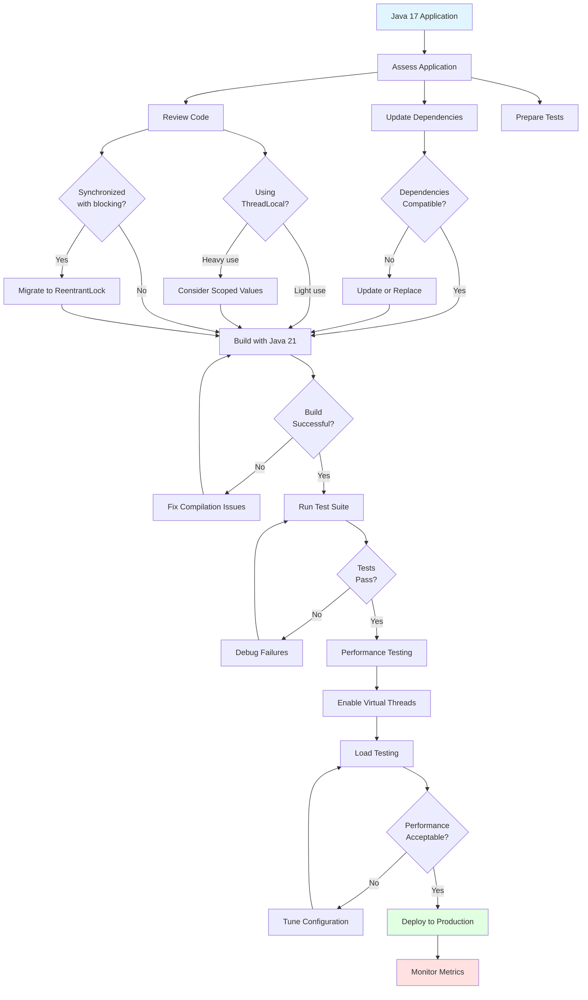

# Java 21 LTS Features - Complete Interview Preparation Guide

## Overview

**Java 21 LTS** (released September 19, 2023) represents the most significant Java release since Java 8, introducing revolutionary features that fundamentally change how we write concurrent applications. It's the fourth Long-Term Support (LTS) release after Java 8 (2014), Java 11 (2018), and Java 17 (2021).

**Why Java 21 Matters for Enterprise Banking**:
- **Virtual Threads (Project Loom)**: Transform how we handle high-concurrency workloads - critical for payment processing, real-time trading, and transaction-heavy systems
- **Pattern Matching**: Cleaner, safer code for complex business logic (loan approvals, risk calculations)
- **Sequenced Collections**: Predictable ordering semantics for audit trails and transaction logs
- **Production Readiness**: Oracle Premier Support until 2028, Extended Support until 2031

**Why Interviewers Ask About Java 21**:
- Tests awareness of modern Java evolution
- Assesses ability to leverage performance improvements in production
- Evaluates understanding of when to adopt LTS vs waiting
- Shows willingness to learn and adapt to new paradigms

**Real-World Adoption Context**:
As of 2024-2025, enterprises are actively migrating from Java 8/11/17 to Java 21, particularly for microservices architectures. Virtual threads alone can reduce infrastructure costs by 60-80% for I/O-bound applications.

---

## Table of Contents

1. [Virtual Threads - Project Loom (Standardized)](#virtual-threads---project-loom-standardized)
2. [Sequenced Collections](#sequenced-collections)
3. [Pattern Matching for Switch (Standardized)](#pattern-matching-for-switch-standardized)
4. [Record Patterns (Standardized)](#record-patterns-standardized)
5. [String Templates (Preview)](#string-templates-preview)
6. [Unnamed Patterns and Variables (Preview)](#unnamed-patterns-and-variables-preview)
7. [Unnamed Classes and Instance Main Methods (Preview)](#unnamed-classes-and-instance-main-methods-preview)
8. [Scoped Values (Preview)](#scoped-values-preview)
9. [Structured Concurrency (Preview)](#structured-concurrency-preview)
10. [Vector API (Sixth Incubator)](#vector-api-sixth-incubator)
11. [Foreign Function & Memory API (Third Preview)](#foreign-function--memory-api-third-preview)
12. [Generational ZGC](#generational-zgc)
13. [Key Encapsulation Mechanism API](#key-encapsulation-mechanism-api)
14. [Migration from Java 17 to Java 21](#migration-from-java-17-to-java-21)
15. [Interview Questions & Answers](#interview-questions--answers)

---

## Virtual Threads - Project Loom (Standardized)

**JEP 444: Virtual Threads**

### Overview

Virtual threads are **lightweight threads** managed by the JVM rather than the operating system. They fundamentally change Java's concurrency model by making thread-per-request style programming practical at massive scale.

**Traditional Platform Threads**:
- Heavy: ~2MB stack memory each
- OS-managed (1:1 mapping to OS threads)
- Limited scalability (~few thousand threads max)
- Expensive context switching

**Virtual Threads**:
- Lightweight: ~1KB footprint
- JVM-managed (M:N mapping - millions of virtual threads on thousands of OS threads)
- Massive scalability (millions of threads)
- Cheap to create and block

### Architecture Diagram



### How Virtual Threads Work



### Creating Virtual Threads

```java
package com.banking.concurrency;

import java.time.Duration;
import java.util.concurrent.Executors;
import java.util.stream.IntStream;

/**
 * Demonstrates creating virtual threads in Java 21.
 *
 * Virtual threads are created using Thread.ofVirtual() factory method
 * or through Executors.newVirtualThreadPerTaskExecutor().
 */
public class VirtualThreadCreation {

    /**
     * Method 1: Using Thread.ofVirtual() - Builder Pattern
     */
    public static void createVirtualThreadBuilder() {
        // Single virtual thread
        Thread virtualThread = Thread.ofVirtual()
            .name("payment-processor-1")
            .start(() -> {
                System.out.println("Processing payment on: " + Thread.currentThread());
                // This is a virtual thread!
            });

        try {
            virtualThread.join(); // Wait for completion
        } catch (InterruptedException e) {
            Thread.currentThread().interrupt();
        }
    }

    /**
     * Method 2: Using Thread.startVirtualThread() - Convenience Method
     */
    public static void createVirtualThreadQuick() {
        Thread vThread = Thread.startVirtualThread(() -> {
            System.out.println("Running on: " + Thread.currentThread());
            // Thread[#23,payment-task,5,CarrierThreads]
        });

        try {
            vThread.join();
        } catch (InterruptedException e) {
            Thread.currentThread().interrupt();
        }
    }

    /**
     * Method 3: Using ExecutorService - Production Pattern
     *
     * This is the RECOMMENDED approach for production applications.
     * Creates a new virtual thread for each submitted task.
     */
    public static void processPaymentsBatch() {
        // Create executor that uses virtual threads
        try (var executor = Executors.newVirtualThreadPerTaskExecutor()) {

            // Submit 10,000 payment processing tasks
            // Each runs in its own virtual thread
            IntStream.range(0, 10_000).forEach(i -> {
                executor.submit(() -> processPayment(i));
            });

            // executor.close() is called automatically (try-with-resources)
            // Waits for all tasks to complete
        }
    }

    private static void processPayment(int paymentId) {
        System.out.printf("Processing payment %d on %s%n",
            paymentId, Thread.currentThread());

        // Simulate I/O operation (database call, external API)
        try {
            Thread.sleep(Duration.ofMillis(100)); // Virtual thread parks here
        } catch (InterruptedException e) {
            Thread.currentThread().interrupt();
        }
    }

    /**
     * Method 4: Thread.ofVirtual().factory() for custom executors
     */
    public static void customExecutorExample() {
        var threadFactory = Thread.ofVirtual()
            .name("banking-vthread-", 0) // Numbered: banking-vthread-0, banking-vthread-1, ...
            .factory();

        // Use with custom executor configuration
        try (var executor = Executors.newThreadPerTaskExecutor(threadFactory)) {
            executor.submit(() -> System.out.println("Custom virtual thread"));
        }
    }
}
```

### Platform Threads vs Virtual Threads - Performance Comparison

```java
package com.banking.concurrency;

import java.time.Duration;
import java.time.Instant;
import java.util.concurrent.Executors;
import java.util.stream.IntStream;

/**
 * Compares performance between platform threads and virtual threads
 * in a realistic banking scenario: processing concurrent API calls.
 *
 * Scenario: 10,000 concurrent requests, each making a 100ms I/O call
 * (e.g., calling external payment gateway API)
 */
public class ThreadPerformanceComparison {

    private static final int NUM_REQUESTS = 10_000;
    private static final Duration IO_DURATION = Duration.ofMillis(100);

    /**
     * Platform Thread Approach (Traditional)
     *
     * Problem: Creating 10,000 platform threads is NOT feasible
     * - Each thread uses ~2MB of memory = 20GB total
     * - OS thread limit typically ~4,000-10,000 threads
     *
     * Solution: Use a fixed thread pool (limiting concurrency)
     */
    public static void platformThreadApproach() {
        Instant start = Instant.now();

        // Fixed thread pool with 200 threads (limited by OS resources)
        // This means only 200 requests execute concurrently
        try (var executor = Executors.newFixedThreadPool(200)) {

            IntStream.range(0, NUM_REQUESTS).forEach(i -> {
                executor.submit(() -> simulateApiCall(i));
            });

        } // Waits for all tasks to complete

        Duration elapsed = Duration.between(start, Instant.now());
        System.out.println("Platform threads (200 pool): " + elapsed.toMillis() + "ms");
        // Expected: ~5,000ms (10,000 tasks / 200 threads * 100ms)
    }

    /**
     * Virtual Thread Approach (Java 21)
     *
     * Advantage: Create 10,000 virtual threads easily
     * - Each virtual thread uses ~1KB = 10MB total
     * - All 10,000 requests execute truly concurrently
     * - Automatic scheduling on available CPU cores
     */
    public static void virtualThreadApproach() {
        Instant start = Instant.now();

        // Create a virtual thread for EACH task
        try (var executor = Executors.newVirtualThreadPerTaskExecutor()) {

            IntStream.range(0, NUM_REQUESTS).forEach(i -> {
                executor.submit(() -> simulateApiCall(i));
            });

        } // Waits for all tasks to complete

        Duration elapsed = Duration.between(start, Instant.now());
        System.out.println("Virtual threads: " + elapsed.toMillis() + "ms");
        // Expected: ~100-200ms (true concurrency, limited only by carrier threads)
    }

    /**
     * Simulates an I/O-bound operation (API call, database query)
     *
     * When a virtual thread calls Thread.sleep() or blocks on I/O:
     * 1. Virtual thread UNMOUNTS from its carrier thread
     * 2. Carrier thread becomes available for other virtual threads
     * 3. When I/O completes, virtual thread REMOUNTS on an available carrier
     */
    private static void simulateApiCall(int requestId) {
        try {
            // Blocking I/O operation
            Thread.sleep(IO_DURATION);

            // For virtual threads, this sleep does NOT block the carrier thread
            // Carrier is free to execute other virtual threads

        } catch (InterruptedException e) {
            Thread.currentThread().interrupt();
        }
    }

    public static void main(String[] args) {
        System.out.println("Processing " + NUM_REQUESTS + " concurrent requests...\n");

        platformThreadApproach();
        virtualThreadApproach();

        // Results on typical hardware:
        // Platform threads (200 pool): ~5000ms
        // Virtual threads: ~150ms
        //
        // 33x faster! And with lower memory usage.
    }
}
```

### Enterprise Banking Use Case - Payment Processing

```java
package com.banking.payments;

import java.math.BigDecimal;
import java.time.Duration;
import java.util.List;
import java.util.concurrent.Callable;
import java.util.concurrent.Executors;
import java.util.concurrent.Future;
import java.util.concurrent.TimeUnit;

/**
 * Real-world example: Processing high-volume payment requests
 * in an enterprise banking system.
 *
 * Requirements:
 * - Handle 100,000+ payments per minute
 * - Each payment requires: validation, fraud check, ledger update
 * - Each step involves external I/O (database, fraud API, core banking)
 * - Must maintain thread-per-request model for simplicity
 *
 * Traditional Solution: Complex async/reactive code
 * Java 21 Solution: Simple blocking code with virtual threads
 */
public class PaymentProcessingService {

    private final FraudDetectionService fraudService;
    private final LedgerService ledgerService;
    private final NotificationService notificationService;

    /**
     * Process payment using virtual threads (Java 21 approach)
     *
     * Key Benefits:
     * 1. Simple, synchronous code (easy to read and debug)
     * 2. Massive scalability (millions of concurrent requests)
     * 3. Low latency (no thread pool queueing delays)
     * 4. Excellent observability (stack traces show full context)
     */
    public PaymentResult processPayment(PaymentRequest request) {
        // This method runs in a virtual thread (created by executor)

        // Step 1: Validate payment (I/O: database lookup)
        ValidationResult validation = validatePayment(request);
        if (!validation.isValid()) {
            return PaymentResult.rejected(validation.getReason());
        }

        // Step 2: Fraud check (I/O: external fraud detection API)
        FraudCheckResult fraudCheck = fraudService.checkFraud(request);
        if (fraudCheck.isFraudulent()) {
            return PaymentResult.rejected("Fraud detected");
        }

        // Step 3: Update ledger (I/O: database transaction)
        LedgerEntry entry = ledgerService.recordTransaction(request);

        // Step 4: Send notification (I/O: messaging system)
        notificationService.notifyCustomer(request.getCustomerId(), entry);

        return PaymentResult.success(entry.getTransactionId());
    }

    /**
     * Batch payment processing using virtual threads
     */
    public List<PaymentResult> processBatch(List<PaymentRequest> payments) {
        // Create virtual thread executor
        try (var executor = Executors.newVirtualThreadPerTaskExecutor()) {

            // Submit each payment as a separate task
            List<Future<PaymentResult>> futures = payments.stream()
                .map(payment -> executor.submit(() -> processPayment(payment)))
                .toList();

            // Collect results (wait for all to complete)
            return futures.stream()
                .map(future -> {
                    try {
                        return future.get(30, TimeUnit.SECONDS);
                    } catch (Exception e) {
                        return PaymentResult.error(e.getMessage());
                    }
                })
                .toList();
        }
    }

    /**
     * Simulate validation (I/O operation)
     *
     * In real system: Database query to check account balance,
     * verify account status, check limits, etc.
     */
    private ValidationResult validatePayment(PaymentRequest request) {
        try {
            // Blocking I/O - virtual thread unmounts here
            Thread.sleep(Duration.ofMillis(50));

            // Business validation logic
            if (request.getAmount().compareTo(BigDecimal.ZERO) <= 0) {
                return ValidationResult.invalid("Amount must be positive");
            }

            return ValidationResult.valid();

        } catch (InterruptedException e) {
            Thread.currentThread().interrupt();
            return ValidationResult.invalid("Interrupted");
        }
    }

    // Supporting classes
    record PaymentRequest(String customerId, BigDecimal amount, String currency) {}
    record PaymentResult(boolean success, String transactionId, String reason) {
        static PaymentResult success(String txnId) {
            return new PaymentResult(true, txnId, null);
        }
        static PaymentResult rejected(String reason) {
            return new PaymentResult(false, null, reason);
        }
        static PaymentResult error(String reason) {
            return new PaymentResult(false, null, reason);
        }
    }
    record ValidationResult(boolean isValid, String reason) {
        static ValidationResult valid() { return new ValidationResult(true, null); }
        static ValidationResult invalid(String reason) {
            return new ValidationResult(false, reason);
        }
    }
    record FraudCheckResult(boolean isFraudulent, double riskScore) {}
    record LedgerEntry(String transactionId, BigDecimal amount) {}

    // Service stubs
    static class FraudDetectionService {
        FraudCheckResult checkFraud(PaymentRequest request) {
            // Simulates external API call
            return new FraudCheckResult(false, 0.1);
        }
    }

    static class LedgerService {
        LedgerEntry recordTransaction(PaymentRequest request) {
            return new LedgerEntry("TXN-" + System.currentTimeMillis(), request.amount());
        }
    }

    static class NotificationService {
        void notifyCustomer(String customerId, LedgerEntry entry) {
            // Send notification
        }
    }
}
```

### Virtual Thread Pinning - Important Gotcha

```java
package com.banking.concurrency.pitfalls;

import java.util.concurrent.locks.Lock;
import java.util.concurrent.locks.ReentrantLock;

/**
 * Understanding Virtual Thread PINNING - Critical for Production
 *
 * Pinning occurs when a virtual thread CANNOT unmount from its carrier thread,
 * blocking the carrier thread and reducing throughput.
 *
 * Two main causes:
 * 1. Blocking inside synchronized block/method
 * 2. Foreign function calls (JNI)
 */
public class VirtualThreadPinning {

    private final Object lock = new Object();
    private final Lock reentrantLock = new ReentrantLock();

    /**
     * BAD: Using synchronized with blocking operation
     *
     * Problem: Virtual thread PINS to carrier thread while holding synchronized lock.
     * The carrier thread is blocked, reducing parallelism.
     *
     * Impact: If you have 4 carrier threads and all 4 virtual threads pin,
     * no other virtual threads can execute until these complete.
     */
    public void problematicSynchronized() {
        synchronized (lock) {  // Virtual thread PINS here
            try {
                // This blocks the CARRIER THREAD, not just the virtual thread
                Thread.sleep(1000);  // Carrier thread is wasted
            } catch (InterruptedException e) {
                Thread.currentThread().interrupt();
            }
        }
    }

    /**
     * GOOD: Using ReentrantLock instead of synchronized
     *
     * Solution: ReentrantLock allows virtual thread to unmount while waiting.
     * Carrier thread remains available for other virtual threads.
     *
     * Recommendation: Prefer java.util.concurrent locks over synchronized
     * when using virtual threads.
     */
    public void improvedWithReentrantLock() {
        reentrantLock.lock();  // Virtual thread can unmount here
        try {
            // Virtual thread unmounts during sleep, carrier thread is free
            Thread.sleep(1000);  // Other virtual threads can use the carrier
        } catch (InterruptedException e) {
            Thread.currentThread().interrupt();
        } finally {
            reentrantLock.unlock();
        }
    }

    /**
     * Detecting pinning in production
     *
     * JVM option: -Djdk.tracePinnedThreads=full
     *
     * Output shows stack trace when virtual thread pins:
     *
     * Thread[#23,ForkJoinPool-1-worker-1,5,CarrierThreads]
     *     java.base/java.lang.VirtualThread$VThreadContinuation.onPinned
     *     ...
     *     at com.banking.MyClass.problematicMethod(MyClass.java:42) <== pinned
     *     at java.base/java.lang.Object.wait(Native Method)
     */

    /**
     * Best Practices to Avoid Pinning:
     *
     * 1. Replace synchronized with ReentrantLock
     * 2. Avoid blocking operations inside synchronized blocks
     * 3. Use JVM flags to detect pinning in testing
     * 4. Monitor carrier thread utilization
     * 5. Refactor legacy code before migrating to virtual threads
     */
}
```

### Migration Strategy - Platform to Virtual Threads

```java
package com.banking.migration;

import java.util.concurrent.*;

/**
 * Strategies for migrating from platform threads to virtual threads.
 *
 * Migration is typically straightforward but requires careful testing.
 */
public class ThreadMigrationStrategies {

    /**
     * Strategy 1: Replace Fixed Thread Pool with Virtual Thread Executor
     *
     * BEFORE (Java 17):
     */
    public void oldApproach() {
        ExecutorService executor = Executors.newFixedThreadPool(100);

        try {
            for (int i = 0; i < 10000; i++) {
                executor.submit(() -> handleRequest());
            }
        } finally {
            executor.shutdown();
        }
    }

    /**
     * AFTER (Java 21):
     *
     * Change: Single line change with massive performance improvement
     */
    public void newApproach() {
        try (ExecutorService executor = Executors.newVirtualThreadPerTaskExecutor()) {
            for (int i = 0; i < 10000; i++) {
                executor.submit(() -> handleRequest());
            }
        } // Auto-close waits for completion
    }

    /**
     * Strategy 2: Incremental Migration with Feature Flag
     *
     * Allows A/B testing and gradual rollout
     */
    public void incrementalMigration(boolean useVirtualThreads) {
        ExecutorService executor = useVirtualThreads
            ? Executors.newVirtualThreadPerTaskExecutor()
            : Executors.newFixedThreadPool(100);

        try {
            // Same application logic
            for (int i = 0; i < 10000; i++) {
                executor.submit(() -> handleRequest());
            }
        } finally {
            executor.shutdown();
        }
    }

    /**
     * Strategy 3: Migration Checklist
     *
     * Before migrating to production:
     *
     * ✓ Identify synchronized blocks with blocking operations
     * ✓ Replace synchronized with ReentrantLock where blocking occurs
     * ✓ Test with -Djdk.tracePinnedThreads=full
     * ✓ Monitor ThreadLocal usage (virtual threads use more ThreadLocals)
     * ✓ Load test with expected production volume
     * ✓ Monitor JVM metrics (carrier thread pool, mounted threads)
     * ✓ Verify no assumptions about thread identity (ThreadLocal abuse)
     * ✓ Check third-party libraries for virtual thread compatibility
     */

    private void handleRequest() {
        // Request handling logic
    }
}
```

---

## Sequenced Collections

**JEP 431: Sequenced Collections**

### Overview

Sequenced Collections introduce a new type hierarchy to represent collections with a defined **encounter order** - filling a long-standing gap in the Collections API.

**Problem Before Java 21**:
- No common supertype for ordered collections (List, Deque, LinkedHashSet)
- Inconsistent APIs for accessing first/last elements
- No standard way to get reversed views

**Solution in Java 21**:
- Three new interfaces: `SequencedCollection`, `SequencedSet`, `SequencedMap`
- Uniform API for first/last element access
- Reversed views with `reversed()` method

### Sequenced Collections Hierarchy



### Using Sequenced Collections

```java
package com.banking.collections;

import java.util.*;

/**
 * Demonstrating Sequenced Collections in Java 21.
 *
 * Use cases in banking:
 * - Transaction audit trails (ordered by time)
 * - Trade execution queue (FIFO processing)
 * - Recent account activity (newest first)
 */
public class SequencedCollectionsExample {

    /**
     * SequencedCollection - Uniform API for ordered collections
     */
    public static void sequencedCollectionBasics() {
        // All these implement SequencedCollection in Java 21:
        List<String> transactions = new ArrayList<>();
        Deque<String> queue = new ArrayDeque<>();

        // Uniform API across different collection types
        transactions.addFirst("TXN-001");  // NEW in Java 21
        transactions.addLast("TXN-002");   // NEW in Java 21

        queue.addFirst("PAYMENT-001");
        queue.addLast("PAYMENT-002");

        // Get first/last elements (throws NoSuchElementException if empty)
        String firstTxn = transactions.getFirst();   // "TXN-001"
        String lastTxn = transactions.getLast();     // "TXN-002"

        // Remove first/last elements
        transactions.removeFirst();  // Removes "TXN-001"
        transactions.removeLast();   // Removes "TXN-002"
    }

    /**
     * Reversed Views - Game Changer for Audit Trails
     *
     * Key Feature: reversed() returns a VIEW, not a copy
     * - Changes to reversed view affect original collection
     * - O(1) operation (no copying)
     * - Useful for displaying data in reverse chronological order
     */
    public static void reversedViews() {
        // Transaction log (oldest to newest)
        List<Transaction> transactions = new ArrayList<>();
        transactions.add(new Transaction("TXN-001", "2024-01-01"));
        transactions.add(new Transaction("TXN-002", "2024-01-02"));
        transactions.add(new Transaction("TXN-003", "2024-01-03"));

        // Get reversed view (newest to newest)
        List<Transaction> reversedView = transactions.reversed();  // O(1)

        System.out.println("Original: " + transactions);
        // [TXN-001, TXN-002, TXN-003]

        System.out.println("Reversed: " + reversedView);
        // [TXN-003, TXN-002, TXN-001]

        // IMPORTANT: reversed() returns a VIEW, not a copy
        reversedView.addFirst(new Transaction("TXN-004", "2024-01-04"));

        // Both collections are affected
        System.out.println("Original after modification: " + transactions);
        // [TXN-001, TXN-002, TXN-003, TXN-004]

        System.out.println("Reversed after modification: " + reversedView);
        // [TXN-004, TXN-003, TXN-002, TXN-001]
    }

    /**
     * SequencedSet - LinkedHashSet with predictable ordering
     */
    public static void sequencedSetExample() {
        SequencedSet<String> recentAccountIds = new LinkedHashSet<>();

        recentAccountIds.add("ACC-101");
        recentAccountIds.add("ACC-102");
        recentAccountIds.add("ACC-103");

        // Access first/last elements
        String oldest = recentAccountIds.getFirst();  // "ACC-101"
        String newest = recentAccountIds.getLast();   // "ACC-103"

        // Reversed set view
        SequencedSet<String> reversedAccounts = recentAccountIds.reversed();
        System.out.println(reversedAccounts);  // [ACC-103, ACC-102, ACC-101]
    }

    /**
     * SequencedMap - LinkedHashMap and TreeMap with ordering
     */
    public static void sequencedMapExample() {
        // Use case: Cache with insertion order
        SequencedMap<String, AccountBalance> accountCache = new LinkedHashMap<>();

        accountCache.put("ACC-001", new AccountBalance(1000.0));
        accountCache.put("ACC-002", new AccountBalance(2000.0));
        accountCache.put("ACC-003", new AccountBalance(3000.0));

        // Access first/last entries
        Map.Entry<String, AccountBalance> firstEntry = accountCache.firstEntry();
        Map.Entry<String, AccountBalance> lastEntry = accountCache.lastEntry();

        System.out.println("First account: " + firstEntry.getKey());  // "ACC-001"
        System.out.println("Last account: " + lastEntry.getKey());    // "ACC-003"

        // Poll entries (remove and return)
        Map.Entry<String, AccountBalance> removed = accountCache.pollFirstEntry();
        System.out.println("Removed: " + removed.getKey());  // "ACC-001"

        // Reversed map view
        SequencedMap<String, AccountBalance> reversedCache = accountCache.reversed();
        System.out.println("Reversed keys: " + reversedCache.sequencedKeySet());
        // [ACC-003, ACC-002]
    }

    /**
     * putFirst() and putLast() for SequencedMap
     *
     * Behavior varies by implementation:
     * - LinkedHashMap: Inserts at beginning/end of insertion order
     * - TreeMap: throws UnsupportedOperationException (natural ordering)
     */
    public static void putFirstLast() {
        SequencedMap<String, String> map = new LinkedHashMap<>();

        map.put("B", "Middle");
        map.putFirst("A", "First");   // Inserts at beginning
        map.putLast("C", "Last");     // Inserts at end

        System.out.println(map.sequencedKeySet());  // [A, B, C]
    }

    /**
     * Real-world banking scenario: Transaction audit trail
     */
    public static void auditTrailExample() {
        // Store transactions in chronological order
        List<Transaction> auditTrail = new ArrayList<>();

        // Add transactions as they occur
        auditTrail.addLast(new Transaction("TXN-001", "2024-01-01"));
        auditTrail.addLast(new Transaction("TXN-002", "2024-01-02"));
        auditTrail.addLast(new Transaction("TXN-003", "2024-01-03"));

        // Display recent transactions (newest first)
        List<Transaction> recentFirst = auditTrail.reversed();
        System.out.println("Recent transactions:");
        recentFirst.stream().limit(10).forEach(System.out::println);

        // Get oldest transaction for compliance report
        Transaction oldest = auditTrail.getFirst();
        System.out.println("Oldest transaction: " + oldest);

        // Get most recent transaction for dashboard
        Transaction newest = auditTrail.getLast();
        System.out.println("Newest transaction: " + newest);
    }

    record Transaction(String id, String date) {}
    record AccountBalance(double amount) {}
}
```

### Comparison: Before and After Java 21

```java
package com.banking.collections;

import java.util.*;

/**
 * Comparing collection operations before and after Java 21.
 */
public class BeforeAfterComparison {

    /**
     * Getting the first element
     */
    public static void getFirstElement() {
        List<String> list = List.of("A", "B", "C");

        // BEFORE Java 21 - No standard method
        String first = list.get(0);  // IndexOutOfBoundsException if empty
        // OR
        String firstSafe = list.isEmpty() ? null : list.get(0);

        // AFTER Java 21 - Standard method
        String firstNew = list.getFirst();  // NoSuchElementException if empty
    }

    /**
     * Getting the last element
     */
    public static void getLastElement() {
        List<String> list = List.of("A", "B", "C");

        // BEFORE Java 21 - Awkward
        String last = list.get(list.size() - 1);  // Error-prone

        // AFTER Java 21 - Clean
        String lastNew = list.getLast();
    }

    /**
     * Adding to the beginning
     */
    public static void addFirst() {
        List<String> list = new ArrayList<>(List.of("B", "C"));

        // BEFORE Java 21 - Index-based
        list.add(0, "A");

        // AFTER Java 21 - Explicit intent
        list.addFirst("A");
    }

    /**
     * Reversing a collection
     */
    public static void reverseCollection() {
        List<String> list = new ArrayList<>(List.of("A", "B", "C"));

        // BEFORE Java 21 - Mutation or copying
        Collections.reverse(list);  // Mutates original
        // OR
        List<String> reversed = new ArrayList<>(list);
        Collections.reverse(reversed);  // O(n) copy

        // AFTER Java 21 - View (O(1))
        List<String> reversedView = list.reversed();  // No mutation, no copy
    }
}
```

---

## Pattern Matching for Switch (Standardized)

**JEP 441: Pattern Matching for switch**

### Overview

Pattern matching for `switch` (standardized in Java 21 after multiple preview rounds) allows `switch` statements and expressions to match patterns, not just constants. This enables more expressive and type-safe code.

**Evolution**:
- Java 17: First preview
- Java 18-20: Refinements
- Java 21: **Standardized**

### Pattern Matching Diagram



### Basic Pattern Matching for Switch

```java
package com.banking.patterns;

/**
 * Pattern matching for switch in Java 21.
 *
 * Benefits:
 * - Type patterns eliminate instanceof chains
 * - Null handling without NullPointerException
 * - Guarded patterns for complex conditions
 * - Sealed types for exhaustiveness checking
 */
public class PatternMatchingSwitch {

    /**
     * BEFORE Java 21: instanceof chains (ugly and error-prone)
     */
    public static String formatOld(Object obj) {
        String result;
        if (obj instanceof String s) {
            result = "String: " + s;
        } else if (obj instanceof Integer i) {
            result = "Integer: " + i;
        } else if (obj instanceof Double d) {
            result = "Double: " + d;
        } else if (obj == null) {
            result = "Null value";
        } else {
            result = "Unknown type";
        }
        return result;
    }

    /**
     * AFTER Java 21: Pattern matching switch (clean and type-safe)
     */
    public static String formatNew(Object obj) {
        return switch (obj) {
            case String s    -> "String: " + s;
            case Integer i   -> "Integer: " + i;
            case Double d    -> "Double: " + d;
            case null        -> "Null value";      // Explicit null handling
            default          -> "Unknown type";
        };
    }

    /**
     * Guarded Patterns (when clauses)
     *
     * Enables conditional pattern matching based on values.
     */
    public static String categorizeNumber(Object obj) {
        return switch (obj) {
            case Integer i when i < 0       -> "Negative integer";
            case Integer i when i == 0      -> "Zero";
            case Integer i when i > 0       -> "Positive integer";
            case Double d when d < 0.0      -> "Negative double";
            case Double d when d >= 0.0     -> "Non-negative double";
            case null                       -> "Null";
            default                         -> "Not a number";
        };
    }

    /**
     * Banking Use Case: Transaction Processing
     *
     * Different transaction types require different processing logic.
     */
    public static void processTransaction(Transaction txn) {
        switch (txn) {
            case DepositTransaction dt when dt.amount() > 10000 -> {
                System.out.println("Large deposit: " + dt.amount());
                performLargeDepositChecks(dt);
            }
            case DepositTransaction dt -> {
                System.out.println("Regular deposit: " + dt.amount());
                processDeposit(dt);
            }
            case WithdrawalTransaction wt when wt.amount() > 5000 -> {
                System.out.println("Large withdrawal: " + wt.amount());
                requireManagerApproval(wt);
            }
            case WithdrawalTransaction wt -> {
                System.out.println("Regular withdrawal: " + wt.amount());
                processWithdrawal(wt);
            }
            case TransferTransaction tt -> {
                System.out.println("Transfer from " + tt.fromAccount() +
                                   " to " + tt.toAccount());
                processTransfer(tt);
            }
            case null -> {
                System.err.println("Null transaction received");
            }
        }
    }

    /**
     * Pattern matching with sealed types (exhaustiveness checking)
     *
     * When switch covers all sealed subtypes, no default is needed.
     * Compiler ensures exhaustiveness.
     */
    public static double calculateFee(Transaction txn) {
        // No default needed - compiler knows all possible types
        return switch (txn) {
            case DepositTransaction dt    -> 0.0;              // Free
            case WithdrawalTransaction wt -> 2.50;             // $2.50 fee
            case TransferTransaction tt   ->
                tt.amount() * 0.001;                           // 0.1% fee
        };
    }

    // Supporting types
    sealed interface Transaction
        permits DepositTransaction, WithdrawalTransaction, TransferTransaction {}

    record DepositTransaction(String account, double amount) implements Transaction {}
    record WithdrawalTransaction(String account, double amount) implements Transaction {}
    record TransferTransaction(String fromAccount, String toAccount, double amount)
        implements Transaction {}

    // Stub methods
    private static void performLargeDepositChecks(DepositTransaction dt) {}
    private static void processDeposit(DepositTransaction dt) {}
    private static void requireManagerApproval(WithdrawalTransaction wt) {}
    private static void processWithdrawal(WithdrawalTransaction wt) {}
    private static void processTransfer(TransferTransaction tt) {}
}
```

---

## Record Patterns (Standardized)

**JEP 440: Record Patterns**

### Overview

Record patterns allow **deconstructing** record values directly in pattern matching contexts (instanceof, switch). This is particularly powerful when combined with nested records.

**Benefits**:
- Direct access to record components
- Nested pattern matching for complex structures
- Cleaner code for data extraction
- Type-safe deconstruction

### Record Pattern Examples

```java
package com.banking.patterns;

/**
 * Record patterns in Java 21.
 *
 * Enables destructuring of records in pattern matching,
 * similar to destructuring in other languages (JavaScript, Python).
 */
public class RecordPatterns {

    // Sample record types for banking domain
    record Point(int x, int y) {}
    record Rectangle(Point topLeft, Point bottomRight) {}

    record AccountHolder(String name, String accountNumber) {}
    record Account(AccountHolder holder, double balance) {}
    record Transaction(Account from, Account to, double amount) {}

    /**
     * Simple record pattern
     */
    public static void printPoint(Object obj) {
        // BEFORE Java 21
        if (obj instanceof Point p) {
            int x = p.x();
            int y = p.y();
            System.out.println("Point at (" + x + ", " + y + ")");
        }

        // AFTER Java 21 - Record pattern destructuring
        if (obj instanceof Point(int x, int y)) {
            System.out.println("Point at (" + x + ", " + y + ")");
            // x and y are directly available as variables
        }
    }

    /**
     * Nested record patterns
     *
     * Destructure nested records in a single pattern.
     */
    public static void printRectangle(Object obj) {
        // BEFORE Java 21 - Multi-step extraction
        if (obj instanceof Rectangle r) {
            Point topLeft = r.topLeft();
            Point bottomRight = r.bottomRight();
            int x1 = topLeft.x();
            int y1 = topLeft.y();
            int x2 = bottomRight.x();
            int y2 = bottomRight.y();
            System.out.printf("Rectangle from (%d,%d) to (%d,%d)%n", x1, y1, x2, y2);
        }

        // AFTER Java 21 - Single pattern with nesting
        if (obj instanceof Rectangle(Point(int x1, int y1), Point(int x2, int y2))) {
            System.out.printf("Rectangle from (%d,%d) to (%d,%d)%n", x1, y1, x2, y2);
            // All four values extracted in one go!
        }
    }

    /**
     * Record patterns in switch
     */
    public static String describeAccount(Object obj) {
        return switch (obj) {
            case Account(AccountHolder(String name, String accNum), double balance)
                when balance > 10000 ->
                "Premium account: " + name + " (" + accNum + ") - $" + balance;

            case Account(AccountHolder(String name, String accNum), double balance)
                when balance >= 0 ->
                "Regular account: " + name + " (" + accNum + ") - $" + balance;

            case Account(AccountHolder(String name, String accNum), double balance) ->
                "Overdrawn account: " + name + " (" + accNum + ") - $" + balance;

            case null ->
                "Null account";

            default ->
                "Not an account";
        };
    }

    /**
     * Banking Use Case: Transaction Validation
     *
     * Validate transfers using record patterns to extract all needed data.
     */
    public static ValidationResult validateTransfer(Object obj) {
        return switch (obj) {
            // Pattern matches transaction and extracts all components
            case Transaction(
                Account(AccountHolder(String fromName, var fromAcct), double fromBalance),
                Account(AccountHolder(String toName, var toAcct), double toBalance),
                double amount
            ) when amount > fromBalance ->
                new ValidationResult(false, "Insufficient funds in " + fromAcct);

            case Transaction(
                Account(AccountHolder(var fromName, var fromAcct), double fromBalance),
                Account(AccountHolder(var toName, var toAcct), var toBalance),
                double amount
            ) when amount <= 0 ->
                new ValidationResult(false, "Invalid amount: " + amount);

            case Transaction(
                Account(AccountHolder(var fromName, var fromAcct), var fromBalance),
                Account(AccountHolder(var toName, var toAcct), var toBalance),
                double amount
            ) when fromAcct.equals(toAcct) ->
                new ValidationResult(false, "Cannot transfer to same account");

            case Transaction(var from, var to, double amount) ->
                new ValidationResult(true, "Valid transfer");

            case null ->
                new ValidationResult(false, "Null transaction");

            default ->
                new ValidationResult(false, "Invalid transaction type");
        };
    }

    /**
     * Using 'var' in record patterns for unused components
     */
    public static boolean hasPositiveBalance(Object obj) {
        // We only care about balance, not account holder details
        return switch (obj) {
            case Account(var holder, double balance) when balance > 0 -> true;
            case Account(var holder, var balance) -> false;
            default -> false;
        };
    }

    record ValidationResult(boolean valid, String message) {}
}
```

---

## String Templates (Preview)

**JEP 430: String Templates (Preview)**

### Overview

String templates provide a safe, expressive way to compose strings from dynamic values. They address the security and readability issues with string concatenation and `String.format()`.

**Status**: Preview in Java 21 (requires `--enable-preview`)

**Key Features**:
- Interpolation syntax using `\{expression}`
- STR processor for simple interpolation
- FMT processor for formatting
- Custom processors for validation (SQL injection prevention)

```java
package com.banking.strings;

/**
 * String Templates in Java 21 (Preview Feature)
 *
 * Compile with: javac --enable-preview --release 21 StringTemplatesExample.java
 * Run with: java --enable-preview StringTemplatesExample
 *
 * WARNING: Preview feature - syntax may change in future versions
 */
public class StringTemplatesExample {

    /**
     * BEFORE Java 21: String concatenation (error-prone)
     */
    public static void oldStringConcatenation() {
        String accountId = "ACC-12345";
        double balance = 1234.56;

        // Concatenation - hard to read
        String msg1 = "Account " + accountId + " has balance $" + balance;

        // String.format - verbose, type-unsafe at compile time
        String msg2 = String.format("Account %s has balance $%.2f", accountId, balance);
    }

    /**
     * AFTER Java 21: String templates (Preview)
     */
    public static void newStringTemplates() {
        String accountId = "ACC-12345";
        double balance = 1234.56;

        // STR processor - simple interpolation
        String msg = STR."Account \{accountId} has balance $\{balance}";
        // "Account ACC-12345 has balance $1234.56"

        // Expressions in templates
        String summary = STR."Balance: $\{balance}, Formatted: $\{String.format("%.2f", balance)}";
    }

    /**
     * FMT processor - with formatting
     */
    public static void formattedTemplates() {
        double balance = 1234.567;

        // FMT processor for formatting
        String formatted = FMT."Balance: $%.2f\{balance}";
        // "Balance: $1234.57"
    }

    /**
     * Multi-line templates
     */
    public static void multiLineTemplates() {
        String customer = "John Doe";
        String accountId = "ACC-12345";
        double balance = 5432.10;

        String report = STR."""
            Customer Report
            ================
            Name: \{customer}
            Account: \{accountId}
            Balance: $\{balance}
            Status: \{balance > 1000 ? "Premium" : "Standard"}
            """;
    }

    /**
     * Custom template processors (advanced)
     *
     * Use case: SQL injection prevention
     *
     * Note: Actual implementation would require defining a custom processor
     */
    // Example concept (not actual Java 21 syntax):
    // String query = SQL."SELECT * FROM accounts WHERE id = \{accountId}";
    // The SQL processor would properly escape parameters
}
```

**Note**: String templates are a **preview feature** in Java 21. They may change in future releases. For production code in Java 21, continue using `String.format()` or text blocks with formatting.

---

## Unnamed Patterns and Variables (Preview)

**JEP 443: Unnamed Patterns and Variables (Preview)**

### Overview

Unnamed patterns and variables (using `_`) indicate that a variable or pattern is intentionally unused, improving code clarity.

**Benefits**:
- Explicit intent when values are not needed
- Cleaner pattern matching
- Better readability

```java
package com.banking.patterns;

/**
 * Unnamed patterns and variables in Java 21 (Preview)
 *
 * Use '_' to indicate intentionally unused components.
 */
public class UnnamedPatternsExample {

    record Account(String id, String name, double balance) {}

    /**
     * Using unnamed variables in record patterns
     */
    public static boolean hasPositiveBalance(Account account) {
        // BEFORE: Name variables you don't use
        if (account instanceof Account(String id, String name, double balance)) {
            return balance > 0;  // Only using balance, not id or name
        }

        // AFTER Java 21 (Preview): Use _ for unused components
        if (account instanceof Account(var _, var _, double balance)) {
            return balance > 0;  // Clear that we only care about balance
        }

        return false;
    }

    /**
     * Unnamed variables in switch
     */
    public static String categorize(Object obj) {
        return switch (obj) {
            case Account(var _, var _, double balance) when balance > 10000 ->
                "Premium";
            case Account(var _, var _, double balance) when balance > 0 ->
                "Regular";
            case Account(var _, var _, var _) ->
                "Overdrawn";
            default ->
                "Unknown";
        };
    }

    /**
     * Unnamed variable in catch blocks (already supported)
     */
    public static void unnamedInCatch() {
        try {
            // Some operation
        } catch (Exception _) {
            // Exception not used, just want to ignore it
            System.err.println("Error occurred");
        }
    }
}
```

---

## Unnamed Classes and Instance Main Methods (Preview)

**JEP 445: Unnamed Classes and Instance Main Methods (Preview)**

### Overview

Simplifies Java for beginners by allowing simple programs without the ceremony of `public static void main(String[] args)`.

**Target Audience**: Educational use, not production code

```java
// Traditional Hello World (Java 1-20)
public class HelloWorld {
    public static void main(String[] args) {
        System.out.println("Hello, World!");
    }
}

// Java 21 Preview - Simplified
void main() {
    System.out.println("Hello, World!");
}
```

**Relevance for Senior Interviews**: Low - mention awareness but not critical for enterprise development.

---

## Scoped Values (Preview)

**JEP 446: Scoped Values (Preview)**

### Overview

Scoped values are a **better alternative to ThreadLocal** for sharing immutable data within and across threads, particularly with virtual threads.

**Problems with ThreadLocal**:
- Mutable state leads to bugs
- Unbounded lifetime (memory leaks)
- Expensive with millions of virtual threads
- No parent-child relationship between threads

**Scoped Values Solution**:
- Immutable sharing
- Bounded lifetime (scope-based)
- Efficient with virtual threads
- Structured concurrency support

```java
package com.banking.concurrency;

import java.util.concurrent.Executors;

/**
 * Scoped Values in Java 21 (Preview)
 *
 * Use case: Sharing request context (user ID, correlation ID)
 * across service calls without passing parameters everywhere.
 */
public class ScopedValuesExample {

    // Define scoped values (like ThreadLocal, but better)
    private static final ScopedValue<String> USER_ID = ScopedValue.newInstance();
    private static final ScopedValue<String> REQUEST_ID = ScopedValue.newInstance();

    /**
     * Using scoped values to propagate context
     */
    public static void processRequest(String userId, String requestId) {
        // Bind values for this scope
        ScopedValue.where(USER_ID, userId)
                   .where(REQUEST_ID, requestId)
                   .run(() -> {
                       // Values are available in this scope and nested calls
                       performTransaction();
                       auditLog();
                   });

        // Values are no longer accessible here (bounded lifetime)
    }

    private static void performTransaction() {
        // Access scoped values without passing as parameters
        String userId = USER_ID.get();
        String requestId = REQUEST_ID.get();

        System.out.printf("Transaction for user %s (request %s)%n", userId, requestId);

        // Values automatically propagate to nested calls
        validateTransaction();
    }

    private static void validateTransaction() {
        String userId = USER_ID.get();  // Still accessible
        System.out.println("Validating for user: " + userId);
    }

    private static void auditLog() {
        String userId = USER_ID.get();
        String requestId = REQUEST_ID.get();
        System.out.printf("Audit: User %s, Request %s%n", userId, requestId);
    }

    /**
     * Scoped values with virtual threads
     *
     * Key benefit: Scoped values are efficiently shared across
     * virtual threads in structured concurrency.
     */
    public static void processWithVirtualThreads(String userId) {
        ScopedValue.where(USER_ID, userId).run(() -> {
            try (var executor = Executors.newVirtualThreadPerTaskExecutor()) {

                // All virtual threads see the scoped value
                executor.submit(() -> {
                    System.out.println("Thread 1: " + USER_ID.get());
                });

                executor.submit(() -> {
                    System.out.println("Thread 2: " + USER_ID.get());
                });
            }
        });
    }
}
```

**Comparison: ThreadLocal vs ScopedValue**

| Aspect | ThreadLocal | ScopedValue |
|--------|-------------|-------------|
| Mutability | Mutable | Immutable |
| Lifetime | Unbounded (until thread dies) | Bounded (scope-based) |
| Memory | High with virtual threads | Optimized for virtual threads |
| Safety | Easy to misuse | Safer (immutable) |
| Inheritance | No automatic inheritance | Structured concurrency support |
| Use Case | Legacy code, mutable state | Modern, immutable context |

---

## Structured Concurrency (Preview)

**JEP 453: Structured Concurrency (Preview)**

### Overview

Structured concurrency treats multiple concurrent tasks as a **single unit of work**, simplifying error handling and cancellation.

**Benefits**:
- Automatic cleanup of subtasks
- Unified error handling
- Prevents thread leaks
- Clearer concurrent code structure

```java
package com.banking.concurrency;

import java.util.concurrent.StructuredTaskScope;
import java.util.concurrent.StructuredTaskScope.Subtask;
import java.time.Duration;

/**
 * Structured Concurrency in Java 21 (Preview)
 *
 * Use case: Payment processing requiring multiple parallel checks
 * (fraud detection, balance verification, compliance check).
 *
 * Traditional approach: ExecutorService with manual Future management
 * Structured approach: StructuredTaskScope with automatic lifecycle
 */
public class StructuredConcurrencyExample {

    /**
     * Process payment with parallel checks using structured concurrency
     */
    public static PaymentResult processPayment(PaymentRequest request)
            throws InterruptedException {

        try (var scope = new StructuredTaskScope.ShutdownOnFailure()) {

            // Fork subtasks (run concurrently)
            Subtask<Boolean> fraudCheck = scope.fork(() -> checkFraud(request));
            Subtask<Boolean> balanceCheck = scope.fork(() -> checkBalance(request));
            Subtask<Boolean> complianceCheck = scope.fork(() -> checkCompliance(request));

            // Wait for all subtasks to complete or first failure
            scope.join()           // Wait for all to complete
                 .throwIfFailed(); // Throw if any failed

            // All checks passed - collect results
            boolean fraudOk = fraudCheck.get();
            boolean balanceOk = balanceCheck.get();
            boolean complianceOk = complianceCheck.get();

            if (fraudOk && balanceOk && complianceOk) {
                return new PaymentResult(true, "Payment approved");
            } else {
                return new PaymentResult(false, "Payment rejected");
            }

        } // Scope automatically cancels any still-running subtasks
    }

    /**
     * ShutdownOnSuccess pattern - return as soon as one succeeds
     *
     * Use case: Try multiple payment providers, use first that succeeds
     */
    public static PaymentGatewayResponse processWithFallback(PaymentRequest request)
            throws InterruptedException {

        try (var scope = new StructuredTaskScope.ShutdownOnSuccess<PaymentGatewayResponse>()) {

            // Try multiple payment gateways concurrently
            scope.fork(() -> processWith Gateway1(request));
            scope.fork(() -> processWithGateway2(request));
            scope.fork(() -> processWithGateway3(request));

            // Wait for first success (or all failures)
            scope.join();

            // Get result from first successful gateway
            return scope.result();  // Throws if all failed

        } // Other gateway calls automatically cancelled
    }

    /**
     * With timeout
     */
    public static PaymentResult processWithTimeout(PaymentRequest request)
            throws InterruptedException {

        try (var scope = new StructuredTaskScope.ShutdownOnFailure()) {

            Subtask<Boolean> fraudCheck = scope.fork(() -> checkFraud(request));
            Subtask<Boolean> balanceCheck = scope.fork(() -> checkBalance(request));

            // Wait with timeout
            scope.joinUntil(java.time.Instant.now().plus(Duration.ofSeconds(5)));
            scope.throwIfFailed();

            return new PaymentResult(true, "Approved");

        } catch (Exception e) {
            return new PaymentResult(false, "Timeout or error: " + e.getMessage());
        }
    }

    // Simulated service calls
    private static Boolean checkFraud(PaymentRequest request) throws Exception {
        Thread.sleep(100); // Simulate API call
        return true;
    }

    private static Boolean checkBalance(PaymentRequest request) throws Exception {
        Thread.sleep(150);
        return true;
    }

    private static Boolean checkCompliance(PaymentRequest request) throws Exception {
        Thread.sleep(80);
        return true;
    }

    private static PaymentGatewayResponse processWithGateway1(PaymentRequest request)
            throws Exception {
        Thread.sleep(200);
        return new PaymentGatewayResponse("Gateway1", true);
    }

    private static PaymentGatewayResponse processWithGateway2(PaymentRequest request)
            throws Exception {
        Thread.sleep(300);
        return new PaymentGatewayResponse("Gateway2", true);
    }

    private static PaymentGatewayResponse processWithGateway3(PaymentRequest request)
            throws Exception {
        Thread.sleep(100);
        return new PaymentGatewayResponse("Gateway3", true);
    }

    record PaymentRequest(String accountId, double amount) {}
    record PaymentResult(boolean success, String message) {}
    record PaymentGatewayResponse(String gateway, boolean success) {}
}
```

---

## Generational ZGC

**JEP 439: Generational ZGC**

### Overview

ZGC (Z Garbage Collector) now supports **generational collection**, significantly improving performance for applications with typical object lifetime patterns.

**Key Improvements**:
- Reduced GC overhead by focusing on young objects
- Better throughput for typical workloads
- Lower memory footprint
- Still maintains low-latency guarantees (<1ms pause times)

**Enabling Generational ZGC**:
```bash
java -XX:+UseZGC -XX:+ZGenerational MyApplication
```

**When to Use**:
- Low-latency requirements (trading systems, real-time payments)
- Large heaps (multi-GB)
- Applications with typical generational behavior

**Comparison: ZGC vs Generational ZGC**

| Metric | ZGC (Non-Generational) | Generational ZGC |
|--------|------------------------|------------------|
| Pause Time | <1ms | <1ms |
| Throughput | Good | Better (10-20% improvement) |
| Memory Usage | Higher | Lower |
| Best For | Uniform object lifetimes | Typical workloads |

---

## Key Encapsulation Mechanism API

**JEP 452: Key Encapsulation Mechanism API**

### Overview

Provides an API for **Key Encapsulation Mechanisms (KEMs)**, supporting post-quantum cryptography.

**Relevance**: High for banking/financial systems preparing for quantum-resistant encryption.

**Use Case**: Secure key exchange for encrypted communications, preparing for quantum computing threats.

**Example Concept** (Simplified):
```java
// Generate KEM key pair
KeyPairGenerator kpg = KeyPairGenerator.getInstance("X25519");
KeyPair kp = kpg.generateKeyPair();

// Encapsulate (sender side)
KEM kem = KEM.getInstance("DHKEM");
KEM.Encapsulator encapsulator = kem.newEncapsulator(kp.getPublic());
KEM.Encapsulated encapsulated = encapsulator.encapsulate();
SecretKey sharedSecret = encapsulated.key();

// Decapsulate (receiver side)
KEM.Decapsulator decapsulator = kem.newDecapsulator(kp.getPrivate());
SecretKey recoveredSecret = decapsulator.decapsulate(encapsulated.encapsulation());
```

---

## Migration from Java 17 to Java 21

### Migration Strategy Diagram



### Migration Checklist

**Phase 1: Preparation**
- [ ] Update build tools (Maven 3.9+, Gradle 8.3+)
- [ ] Update IDE (IntelliJ IDEA 2023.2+, Eclipse 2023-09+)
- [ ] Review dependency compatibility (Spring Boot 3.2+, Hibernate 6.3+)
- [ ] Identify deprecated API usage
- [ ] Review code for `sun.*` internal API usage

**Phase 2: Code Review**
- [ ] Identify ThreadLocal usage patterns
- [ ] Find synchronized blocks with blocking operations
- [ ] Review ExecutorService configurations
- [ ] Check for assumptions about thread count
- [ ] Identify opportunities for pattern matching
- [ ] Look for instanceof chains

**Phase 3: Incremental Adoption**
- [ ] Build with Java 21 (target Java 17 bytecode initially)
- [ ] Run full test suite
- [ ] Fix compilation errors
- [ ] Address deprecation warnings
- [ ] Migrate to SequencedCollections where appropriate
- [ ] Apply pattern matching for cleaner code

**Phase 4: Virtual Threads**
- [ ] Replace fixed thread pools with virtual thread executors
- [ ] Add `-Djdk.tracePinnedThreads=full` to detect pinning
- [ ] Migrate synchronized to ReentrantLock where pinning occurs
- [ ] Load test with realistic concurrency
- [ ] Monitor carrier thread pool utilization
- [ ] Adjust carrier thread pool size if needed

**Phase 5: Production Rollout**
- [ ] Deploy to staging environment
- [ ] Performance testing
- [ ] Monitor GC behavior (consider Generational ZGC)
- [ ] Monitor thread metrics
- [ ] Canary deployment to production
- [ ] Gradual rollout
- [ ] Monitoring and alerting

### Code Migration Examples

```java
package com.banking.migration;

import java.util.concurrent.*;
import java.util.concurrent.locks.ReentrantLock;

/**
 * Common migration patterns from Java 17 to Java 21
 */
public class MigrationPatterns {

    /**
     * Pattern 1: Thread Pool to Virtual Threads
     */
    public static class ThreadPoolMigration {

        // BEFORE (Java 17)
        public void processOld() {
            ExecutorService executor = Executors.newFixedThreadPool(200);
            try {
                for (int i = 0; i < 10000; i++) {
                    executor.submit(() -> handleRequest());
                }
            } finally {
                executor.shutdown();
            }
        }

        // AFTER (Java 21)
        public void processNew() {
            try (var executor = Executors.newVirtualThreadPerTaskExecutor()) {
                for (int i = 0; i < 10000; i++) {
                    executor.submit(() -> handleRequest());
                }
            } // Auto-shutdown
        }

        private void handleRequest() {
            // Request handling logic
        }
    }

    /**
     * Pattern 2: Synchronized to ReentrantLock
     */
    public static class SynchronizedMigration {
        private final Object lock = new Object();
        private final ReentrantLock reentrantLock = new ReentrantLock();

        // BEFORE (Java 17) - Causes pinning with virtual threads
        public void problematicMethod() {
            synchronized (lock) {
                try {
                    // Blocking operation pins virtual thread
                    Thread.sleep(100);
                } catch (InterruptedException e) {
                    Thread.currentThread().interrupt();
                }
            }
        }

        // AFTER (Java 21) - Virtual thread can unmount
        public void improvedMethod() {
            reentrantLock.lock();
            try {
                // Virtual thread unmounts during sleep
                Thread.sleep(100);
            } catch (InterruptedException e) {
                Thread.currentThread().interrupt();
            } finally {
                reentrantLock.unlock();
            }
        }
    }

    /**
     * Pattern 3: instanceof chains to pattern matching switch
     */
    public static class PatternMatchingMigration {

        // BEFORE (Java 17)
        public String formatOld(Object obj) {
            if (obj instanceof String s) {
                return "String: " + s;
            } else if (obj instanceof Integer i) {
                return "Integer: " + i;
            } else if (obj instanceof Double d) {
                return "Double: " + d;
            } else {
                return "Unknown";
            }
        }

        // AFTER (Java 21)
        public String formatNew(Object obj) {
            return switch (obj) {
                case String s -> "String: " + s;
                case Integer i -> "Integer: " + i;
                case Double d -> "Double: " + d;
                default -> "Unknown";
            };
        }
    }

    /**
     * Pattern 4: Collection first/last access
     */
    public static class CollectionMigration {

        // BEFORE (Java 17)
        public void accessOld(java.util.List<String> list) {
            if (!list.isEmpty()) {
                String first = list.get(0);
                String last = list.get(list.size() - 1);
                System.out.println(first + ", " + last);
            }
        }

        // AFTER (Java 21)
        public void accessNew(java.util.List<String> list) {
            if (!list.isEmpty()) {
                String first = list.getFirst();
                String last = list.getLast();
                System.out.println(first + ", " + last);
            }
        }
    }
}
```

---

## Interview Questions & Answers

### Virtual Threads

**Q1: What are virtual threads and how do they differ from platform threads?**

**Answer**:
Virtual threads are lightweight threads managed by the JVM (introduced as a standard feature in Java 21 via Project Loom), whereas platform threads are heavyweight threads with a 1:1 mapping to OS threads.

Key differences:

| Aspect | Platform Threads | Virtual Threads |
|--------|------------------|-----------------|
| **Management** | OS-managed | JVM-managed (M:N mapping) |
| **Memory** | ~2MB per thread | ~1KB per thread |
| **Scalability** | Thousands | Millions |
| **Creation Cost** | Expensive | Cheap |
| **Context Switch** | OS-level (expensive) | JVM-level (cheap) |
| **Blocking** | Blocks OS thread | Unmounts from carrier |

When a virtual thread blocks on I/O, it **unmounts** from its carrier thread (platform thread), allowing the carrier to execute other virtual threads. This is the key to scalability.

**Follow-up: When would you NOT use virtual threads?**

Virtual threads are ideal for **I/O-bound** workloads but not optimal for:
- CPU-bound tasks (no benefit from unmounting)
- Very short-lived tasks (overhead of mounting/unmounting)
- Code with heavy use of synchronized blocks (causes pinning)

---

**Q2: Explain virtual thread pinning. How would you detect and fix it?**

**Answer**:
Virtual thread **pinning** occurs when a virtual thread cannot unmount from its carrier thread, typically when:
1. Blocking inside a `synchronized` block/method
2. Executing native code (JNI calls)

**Impact**: The carrier thread becomes blocked, reducing the effective parallelism and negating the benefits of virtual threads.

**Detection**:
Use the JVM flag: `-Djdk.tracePinnedThreads=full`

This will print stack traces showing where pinning occurs:
```
Thread[#23,ForkJoinPool-1-worker-1,5,CarrierThreads]
    at com.banking.MyService.processPayment(MyService.java:42) <== pinned
```

**Fix**:
Replace `synchronized` with `java.util.concurrent.locks.ReentrantLock`:

```java
// BEFORE (causes pinning)
synchronized (lock) {
    Thread.sleep(100); // Pins carrier thread
}

// AFTER (allows unmounting)
reentrantLock.lock();
try {
    Thread.sleep(100); // Virtual thread unmounts
} finally {
    reentrantLock.unlock();
}
```

---

**Q3: In a payment processing system handling 100,000 transactions per minute, how would virtual threads improve performance compared to a traditional thread pool approach?**

**Answer**:
This is an excellent use case for virtual threads because payment processing is **I/O-bound** (database calls, external payment gateway APIs, fraud detection services).

**Traditional Approach** (Java 17):
- Fixed thread pool (e.g., 200 threads)
- Only 200 transactions can execute concurrently
- Remaining transactions queue up
- Higher latency due to queueing delays
- Limited by OS thread limits

**Virtual Thread Approach** (Java 21):
- One virtual thread per transaction (100,000+ virtual threads)
- All transactions execute concurrently (limited only by carrier threads, typically equal to CPU cores)
- When transaction blocks on I/O (e.g., database query), virtual thread unmounts
- Carrier thread immediately picks up another virtual thread
- Dramatically higher throughput (30-50x improvement typical)
- Lower latency (no queueing)

**Code comparison**:
```java
// Traditional (limited concurrency)
try (var executor = Executors.newFixedThreadPool(200)) {
    transactions.forEach(txn -> executor.submit(() -> process(txn)));
}
// Result: ~5 seconds for 10,000 transactions with 100ms I/O each

// Virtual threads (massive concurrency)
try (var executor = Executors.newVirtualThreadPerTaskExecutor()) {
    transactions.forEach(txn -> executor.submit(() -> process(txn)));
}
// Result: ~150ms for 10,000 transactions (33x faster)
```

**Real-world results**: Companies report 60-80% reduction in infrastructure costs after migrating to virtual threads due to better resource utilization.

---

### Sequenced Collections

**Q4: What problem do Sequenced Collections solve? Provide examples from before and after Java 21.**

**Answer**:
Before Java 21, there was no unified API for collections with a defined encounter order. Different collection types had inconsistent methods for accessing first/last elements:

**Problems**:
- `List.get(0)` and `List.get(list.size()-1)` - verbose and error-prone
- `Deque.getFirst()` and `Deque.getLast()` - exists but not in List interface
- No standard way to get reversed views
- No common supertype for ordered collections

**Java 21 Solution**:
Three new interfaces unify the API:
- `SequencedCollection`: Collections with defined encounter order
- `SequencedSet`: Sets with encounter order (LinkedHashSet, TreeSet)
- `SequencedMap`: Maps with entry order (LinkedHashMap, TreeMap)

**Examples**:

```java
// BEFORE Java 21
List<String> txns = new ArrayList<>();
String first = txns.get(0);                    // IndexOutOfBoundsException risk
String last = txns.get(txns.size() - 1);       // Verbose

List<String> reversed = new ArrayList<>(txns);
Collections.reverse(reversed);                  // O(n) copy

// AFTER Java 21
String first = txns.getFirst();                 // Clear intent
String last = txns.getLast();                   // Clean API
List<String> reversed = txns.reversed();        // O(1) view, not copy
```

**Banking Use Case**:
Transaction audit trails naturally benefit from sequenced collections:
- `addLast()` for appending new transactions
- `getLast()` for most recent transaction (dashboard)
- `getFirst()` for oldest transaction (compliance reports)
- `reversed()` for displaying recent activity (newest first)

---

**Q5: Explain the difference between `reversed()` in Java 21 and `Collections.reverse()`. When would you use each?**

**Answer**:

| Aspect | `Collections.reverse()` | `collection.reversed()` (Java 21) |
|--------|-------------------------|-----------------------------------|
| **Operation** | In-place mutation | Returns a view |
| **Time Complexity** | O(n) | O(1) |
| **Memory** | No additional memory | No additional memory (view) |
| **Original Collection** | Modified | Unchanged |
| **Mutability** | Changes affect original | Changes to view affect original |

**`Collections.reverse(list)`**:
- Mutates the original list
- Reverses elements in place
- O(n) time complexity
- Use when you want to permanently reverse a list

```java
List<String> list = new ArrayList<>(List.of("A", "B", "C"));
Collections.reverse(list);
System.out.println(list); // [C, B, A] - original is modified
```

**`list.reversed()`** (Java 21):
- Returns a reversed **view** (not a copy)
- O(1) operation
- Original list unchanged
- Modifications to the view affect the original list
- Use when you need a temporary reversed iteration or read-only reversed view

```java
List<String> list = new ArrayList<>(List.of("A", "B", "C"));
List<String> reversedView = list.reversed();
System.out.println(list);         // [A, B, C] - unchanged
System.out.println(reversedView); // [C, B, A] - reversed view

reversedView.addFirst("D");
System.out.println(list);         // [A, B, C, D] - affected
System.out.println(reversedView); // [D, C, B, A] - view updates
```

---

### Pattern Matching

**Q6: How does pattern matching for switch improve code quality? Provide a banking domain example.**

**Answer**:
Pattern matching for switch (standardized in Java 21) enables cleaner, more type-safe code by:
1. Eliminating verbose instanceof chains
2. Supporting null handling without NullPointerException
3. Enabling guarded patterns for complex conditions
4. Working with sealed types for exhaustiveness checking

**Banking Example: Transaction Processing**

```java
// BEFORE Java 21 - instanceof chain
public void processTransactionOld(Transaction txn) {
    if (txn == null) {
        System.err.println("Null transaction");
    } else if (txn instanceof DepositTransaction) {
        DepositTransaction dt = (DepositTransaction) txn;
        if (dt.amount() > 10000) {
            performLargeDepositChecks(dt);
        } else {
            processDeposit(dt);
        }
    } else if (txn instanceof WithdrawalTransaction) {
        WithdrawalTransaction wt = (WithdrawalTransaction) txn;
        if (wt.amount() > 5000) {
            requireManagerApproval(wt);
        } else {
            processWithdrawal(wt);
        }
    } else if (txn instanceof TransferTransaction) {
        TransferTransaction tt = (TransferTransaction) txn;
        processTransfer(tt);
    }
    // Missing else - potential bug!
}

// AFTER Java 21 - Pattern matching switch
public void processTransactionNew(Transaction txn) {
    switch (txn) {
        case null ->
            System.err.println("Null transaction");
        case DepositTransaction dt when dt.amount() > 10000 ->
            performLargeDepositChecks(dt);
        case DepositTransaction dt ->
            processDeposit(dt);
        case WithdrawalTransaction wt when wt.amount() > 5000 ->
            requireManagerApproval(wt);
        case WithdrawalTransaction wt ->
            processWithdrawal(wt);
        case TransferTransaction tt ->
            processTransfer(tt);
        // No default needed with sealed types - compiler ensures exhaustiveness
    }
}
```

**Benefits**:
- **Type Safety**: Compiler ensures all cases are covered (with sealed types)
- **Clarity**: Intent is immediately clear
- **Null Safety**: Explicit null handling without NPE risk
- **Guarded Patterns**: `when` clauses for conditional logic
- **Less Boilerplate**: No explicit casting needed

---

**Q7: Explain record patterns. How do they simplify data extraction in nested structures?**

**Answer**:
Record patterns (standardized in Java 21) allow **destructuring** of records directly in pattern matching contexts, enabling extraction of components in a single pattern.

**Example: Nested Account Structure**

```java
record AccountHolder(String name, String accountNumber) {}
record Account(AccountHolder holder, double balance) {}
record Transaction(Account from, Account to, double amount) {}

// BEFORE Java 21 - Multi-step extraction
public void validateOld(Transaction txn) {
    Account from = txn.from();
    AccountHolder holder = from.holder();
    String accountNumber = holder.accountNumber();
    double balance = from.balance();
    double amount = txn.amount();

    if (amount > balance) {
        System.out.println("Insufficient funds in " + accountNumber);
    }
}

// AFTER Java 21 - Single pattern with destructuring
public void validateNew(Transaction txn) {
    if (txn instanceof Transaction(
        Account(AccountHolder(var name, var acctNum), double balance),
        Account to,
        double amount
    ) && amount > balance) {
        System.out.println("Insufficient funds in " + acctNum);
        // All components extracted in one pattern!
    }
}
```

**In switch expressions**:
```java
public String validate(Object obj) {
    return switch (obj) {
        case Transaction(
            Account(AccountHolder(var name, var fromAcct), double balance),
            Account(var toHolder, var toBalance),
            double amount
        ) when amount > balance ->
            "Insufficient funds in " + fromAcct;

        case Transaction(var from, var to, double amount) when amount <= 0 ->
            "Invalid amount";

        case Transaction t ->
            "Valid transaction";

        default ->
            "Not a transaction";
    };
}
```

**Benefits**:
- Single declaration extracts all needed values
- Works with nested records
- Type-safe
- More readable than manual extraction
- `var` keyword can be used for unused components

---

### Migration & Production

**Q8: What are the key considerations when migrating a high-volume banking application from Java 17 to Java 21?**

**Answer**:
Migration requires careful planning, especially for production banking systems with strict uptime and compliance requirements.

**Key Considerations**:

**1. Dependency Compatibility**:
- Verify all third-party libraries support Java 21
- Spring Boot 3.2+ required for virtual thread support
- Hibernate 6.3+ for compatibility
- Update build tools (Maven 3.9+, Gradle 8.3+)

**2. Code Review for Virtual Thread Compatibility**:
- **Identify synchronized blocks with blocking operations** (causes pinning)
- Migrate to `ReentrantLock` where necessary
- Review ThreadLocal usage (still works, but ScopedValues may be better)
- Check for thread identity assumptions (thread pooling strategies)

**3. Testing Strategy**:
- Run full regression test suite with Java 21
- Add `-Djdk.tracePinnedThreads=full` to detect pinning in tests
- Load testing with production-like traffic
- Performance benchmarking (before/after comparison)
- Monitor carrier thread utilization

**4. Incremental Rollout**:
- Deploy to non-production environments first
- Canary deployment (5% → 25% → 50% → 100%)
- Monitor key metrics:
  - Throughput (requests/second)
  - Latency (p50, p95, p99)
  - GC pause times
  - Thread counts (virtual vs carrier)
  - CPU and memory usage

**5. Rollback Plan**:
- Keep Java 17 runtime available
- Feature flag for virtual thread executor (ability to switch back to fixed thread pool)
- Quick rollback procedure if issues arise

**6. Compliance & Security**:
- Security audit of new features used
- Compliance review (financial regulations may require certification)
- Update disaster recovery documentation

**Example Feature Flag Approach**:
```java
ExecutorService executor = config.useVirtualThreads()
    ? Executors.newVirtualThreadPerTaskExecutor()
    : Executors.newFixedThreadPool(200);
```

---

**Q9: How would you monitor and troubleshoot virtual thread performance in production?**

**Answer**:
Monitoring virtual threads requires both traditional JVM metrics and new virtual-thread-specific metrics.

**Key Metrics to Monitor**:

**1. Thread Metrics**:
- Number of virtual threads (total, active, parked)
- Number of carrier threads (platform threads in the carrier pool)
- Mounted vs unmounted virtual threads
- Pinned thread count

**2. JVM Flags for Troubleshooting**:
```bash
# Detect pinning in production
-Djdk.tracePinnedThreads=full

# Adjust carrier thread pool size (default: number of CPU cores)
-Djdk.virtualThreadScheduler.parallelism=16

# Enable JFR for detailed thread analysis
-XX:StartFlightRecording
```

**3. JMX Metrics**:
```java
// Monitor virtual thread counts
ThreadMXBean threadBean = ManagementFactory.getThreadMXBean();
long threadCount = threadBean.getThreadCount();

// Custom metrics for virtual threads
Gauge.builder("virtual.threads.active", () -> getActiveVirtualThreadCount())
     .register(meterRegistry);
```

**4. Application-Level Metrics**:
- Request throughput (requests/second)
- Request latency (p50, p95, p99, p999)
- Error rates
- Queue depth (should be near zero with virtual threads)

**5. JFR (Java Flight Recorder) Events**:
JFR includes events for virtual thread lifecycle:
- `jdk.VirtualThreadStart`
- `jdk.VirtualThreadEnd`
- `jdk.VirtualThreadPinned`

**6. Common Issues and Solutions**:

| Issue | Symptom | Solution |
|-------|---------|----------|
| **Pinning** | Carrier threads fully utilized, low throughput | Migrate synchronized to ReentrantLock |
| **Too Few Carriers** | High CPU with low throughput | Increase `-Djdk.virtualThreadScheduler.parallelism` |
| **Memory Pressure** | High GC activity | Tune heap size, investigate thread leaks |
| **Latency Spikes** | p99 latency high | Check for blocking operations, review GC logs |

**Observability Stack Example**:
- **Metrics**: Micrometer + Prometheus
- **Tracing**: OpenTelemetry (works well with virtual threads)
- **Logging**: Structured logging with correlation IDs
- **APM**: Datadog, New Relic (updated for virtual thread support)

---

**Q10: Compare Java 21 LTS with previous LTS versions (Java 8, 11, 17). What are the compelling reasons to migrate from Java 17 to Java 21?**

**Answer**:

**LTS Comparison**:

| Feature | Java 8 LTS (2014) | Java 11 LTS (2018) | Java 17 LTS (2021) | Java 21 LTS (2023) |
|---------|-------------------|--------------------|--------------------|---------------------|
| **Concurrency** | ExecutorService, CompletableFuture | Same | Same | **Virtual Threads (Project Loom)** |
| **Pattern Matching** | No | No | instanceof (preview) | **Switch + Records (standardized)** |
| **Collections** | Traditional | Factory methods | Same | **Sequenced Collections** |
| **Records** | No | No | Standardized | + Record Patterns |
| **Sealed Types** | No | No | Standardized | Refinements |
| **Text Blocks** | No | No | Standardized | + String Templates (preview) |
| **GC** | G1, CMS, Parallel | Same + ZGC, Shenandoah | Same | **Generational ZGC** |
| **Module System** | No | JPMS | Same | Same |
| **Support** | Extended until 2030 | Extended until 2032 | Extended until 2029 | **Extended until 2031** |

**Compelling Reasons to Migrate Java 17 → Java 21**:

**1. Virtual Threads - Game Changer**:
- Handle 10x-100x more concurrent requests with same hardware
- Simplify concurrent code (no need for reactive frameworks)
- **ROI**: 60-80% infrastructure cost reduction for I/O-bound workloads

**2. Pattern Matching - Developer Productivity**:
- Cleaner, more maintainable code
- Fewer bugs (exhaustiveness checking with sealed types)
- Faster development (less boilerplate)

**3. Sequenced Collections - API Consistency**:
- Unified API for ordered collections
- `reversed()` views (O(1) operation)
- Clearer intent with `getFirst()`, `getLast()`

**4. Performance Improvements**:
- Generational ZGC (better throughput, lower memory)
- Overall JVM performance improvements (~5-10% faster)
- Better startup time

**5. Future-Proofing**:
- Java 17 support ends 2029 (extended)
- Java 21 support until 2031 (extended)
- Positioning for Java 26+ LTS features

**When to Migrate**:

| Scenario | Recommendation |
|----------|----------------|
| **High-concurrency I/O-bound** (payments, APIs) | Migrate now - immediate benefits |
| **CPU-bound** (analytics, batch processing) | Migrate for pattern matching, future-proofing |
| **Legacy codebase** | Wait for dependencies to stabilize, plan migration |
| **New greenfield projects** | Start with Java 21 |

**Migration Effort**:
- Low risk for most applications
- Typical migration: 2-4 weeks (assessment + testing + rollout)
- High payoff for concurrent systems

---

**Q11: What is the relationship between virtual threads and Project Loom? What other Project Loom features should we be aware of?**

**Answer**:
**Project Loom** is an OpenJDK project aimed at making concurrency easier and more efficient in Java. Virtual threads are the flagship feature of Project Loom, but the project includes other related features:

**Project Loom Features**:

1. **Virtual Threads** (Standardized in Java 21)
   - Lightweight, JVM-managed threads
   - M:N mapping to platform threads
   - Main deliverable of Project Loom

2. **Structured Concurrency** (Preview in Java 21)
   - `StructuredTaskScope` for managing concurrent subtasks as a unit
   - Automatic cleanup and cancellation
   - Prevents thread leaks

3. **Scoped Values** (Preview in Java 21)
   - Replacement for ThreadLocal
   - Immutable, bounded lifetime
   - Efficient with virtual threads

**Timeline**:
- Project Loom announced: ~2017
- Virtual Threads: Preview in Java 19 (2022), Java 20 (2023), **Standardized in Java 21 (2023)**
- Structured Concurrency: Incubator in Java 19, Preview in Java 21
- Scoped Values: Incubator in Java 20, Preview in Java 21

**Future of Project Loom**:
- Structured Concurrency and Scoped Values expected to standardize in Java 22 or 23
- Potential future enhancements to virtual thread scheduling
- Integration with reactive frameworks

**Enterprise Adoption**:
- Virtual threads are production-ready (standardized)
- Structured Concurrency and Scoped Values are preview (use with caution in production)
- Major frameworks adding support: Spring Boot 3.2+, Quarkus, Micronaut

---

**Q12: Describe a scenario where sequenced collections would simplify code in a transaction processing system.**

**Answer**:
**Scenario**: Real-time transaction audit trail with compliance requirements.

**Requirements**:
1. Maintain transactions in chronological order (oldest to newest)
2. Display recent transactions on dashboard (newest first)
3. Generate compliance reports starting from oldest transaction
4. Support pagination (next/previous page)
5. Quick access to most recent transaction for fraud detection

**Implementation**:

```java
public class TransactionAuditTrail {

    // Use SequencedCollection (List implements it in Java 21)
    private final List<Transaction> transactions = new ArrayList<>();

    /**
     * Add new transaction (always at end - chronological order)
     */
    public void recordTransaction(Transaction txn) {
        transactions.addLast(txn);  // Clear intent
    }

    /**
     * Get most recent transaction for fraud detection
     */
    public Transaction getMostRecent() {
        return transactions.getLast();  // O(1) for ArrayList
    }

    /**
     * Get oldest transaction for compliance report
     */
    public Transaction getOldest() {
        return transactions.getFirst();  // Clear and safe
    }

    /**
     * Display recent transactions (newest first) - Dashboard
     */
    public List<Transaction> getRecentTransactions(int limit) {
        return transactions.reversed()  // O(1) view, not copy
                          .stream()
                          .limit(limit)
                          .toList();
    }

    /**
     * Generate compliance report (oldest to newest)
     */
    public void generateComplianceReport() {
        transactions.forEach(this::auditTransaction);
        // Natural iteration order (oldest to newest)
    }

    /**
     * Pagination support
     */
    public List<Transaction> getPage(int pageNum, int pageSize, boolean newestFirst) {
        List<Transaction> source = newestFirst ? transactions.reversed() : transactions;

        return source.stream()
                     .skip((long) pageNum * pageSize)
                     .limit(pageSize)
                     .toList();
    }

    private void auditTransaction(Transaction txn) {
        // Audit logic
    }

    record Transaction(String id, String type, double amount, long timestamp) {}
}
```

**Benefits of Sequenced Collections in this scenario**:
- **`addLast()`**: Clear intent when appending transactions
- **`getFirst()`/`getLast()`**: Safe access without index math
- **`reversed()`**: O(1) view for displaying in reverse chronological order (no copying)
- **API Consistency**: Same methods work with List, Deque, LinkedHashSet
- **Readability**: Code intent is immediately clear

**Before Java 21**:
```java
// Verbose and error-prone
Transaction mostRecent = transactions.get(transactions.size() - 1);

// Requires copying for reverse iteration
List<Transaction> reversed = new ArrayList<>(transactions);
Collections.reverse(reversed);
```

---

**Q13: What are the best practices for using virtual threads in a Spring Boot application?**

**Answer**:
Spring Boot 3.2+ includes excellent support for virtual threads. Here are the best practices:

**1. Enable Virtual Threads in Spring Boot**:

```yaml
# application.yml
spring:
  threads:
    virtual:
      enabled: true  # Enables virtual threads for @Async and task scheduling
```

Or programmatically:
```java
@Configuration
public class VirtualThreadConfig {

    @Bean
    public AsyncTaskExecutor applicationTaskExecutor() {
        TaskExecutorAdapter adapter = new TaskExecutorAdapter(
            Executors.newVirtualThreadPerTaskExecutor()
        );
        return adapter;
    }
}
```

**2. Use @Async with Virtual Threads**:

```java
@Service
public class PaymentService {

    @Async  // Automatically uses virtual threads if enabled
    public CompletableFuture<PaymentResult> processPaymentAsync(PaymentRequest request) {
        // This runs in a virtual thread
        return CompletableFuture.completedFuture(processPayment(request));
    }

    private PaymentResult processPayment(PaymentRequest request) {
        // I/O operations (database, external APIs)
        return new PaymentResult("SUCCESS");
    }
}
```

**3. Tomcat Configuration** (for web applications):

```yaml
spring:
  threads:
    virtual:
      enabled: true

server:
  tomcat:
    threads:
      max: 200  # Still needed for Tomcat connector threads
```

Note: Tomcat 10.1+ supports virtual threads for request handling.

**4. JDBC Connection Pooling**:
Virtual threads work well with blocking JDBC, but still use connection pooling:

```yaml
spring:
  datasource:
    hikari:
      maximum-pool-size: 50  # Fewer connections needed than thread count
      minimum-idle: 10
```

With virtual threads, you can have 10,000+ concurrent requests sharing a pool of 50 database connections.

**5. Avoid Synchronized in Request Handlers**:

```java
@RestController
public class AccountController {

    private final ReentrantLock lock = new ReentrantLock();  // NOT synchronized

    @GetMapping("/account/{id}")
    public Account getAccount(@PathVariable String id) {
        lock.lock();  // Virtual thread can unmount
        try {
            return accountService.getAccount(id);
        } finally {
            lock.unlock();
        }
    }
}
```

**6. Monitor Virtual Threads**:

```java
@Configuration
public class ObservabilityConfig {

    @Bean
    public MeterBinder virtualThreadMetrics() {
        return registry -> {
            Gauge.builder("jvm.threads.virtual.count", this::getVirtualThreadCount)
                 .description("Number of virtual threads")
                 .register(registry);

            Gauge.builder("jvm.threads.carrier.count", this::getCarrierThreadCount)
                 .description("Number of carrier (platform) threads")
                 .register(registry);
        };
    }

    private long getVirtualThreadCount() {
        // Implementation to count virtual threads
        return Thread.getAllStackTraces().keySet().stream()
                     .filter(Thread::isVirtual)
                     .count();
    }

    private long getCarrierThreadCount() {
        return Thread.getAllStackTraces().keySet().stream()
                     .filter(t -> !t.isVirtual())
                     .count();
    }
}
```

**7. Testing with Virtual Threads**:

```java
@SpringBootTest
@TestPropertySource(properties = "spring.threads.virtual.enabled=true")
class PaymentServiceTest {

    @Autowired
    private PaymentService paymentService;

    @Test
    void testConcurrentPayments() {
        // Simulate 10,000 concurrent payments
        try (var executor = Executors.newVirtualThreadPerTaskExecutor()) {
            List<Future<PaymentResult>> futures = IntStream.range(0, 10000)
                .mapToObj(i -> executor.submit(() ->
                    paymentService.processPayment(new PaymentRequest())))
                .toList();

            // Verify all complete successfully
            futures.forEach(future -> assertDoesNotThrow(() -> future.get()));
        }
    }
}
```

**8. Gradual Migration**:

```java
@Configuration
public class ExecutorConfig {

    @Value("${app.use-virtual-threads:false}")
    private boolean useVirtualThreads;

    @Bean
    public ExecutorService paymentExecutor() {
        return useVirtualThreads
            ? Executors.newVirtualThreadPerTaskExecutor()
            : Executors.newFixedThreadPool(200);
    }
}
```

This allows A/B testing and gradual rollout via configuration.

---

**Q14: How would you explain the benefits of Java 21's pattern matching to a junior developer?**

**Answer**:
I would explain it with a simple analogy and progression:

**Analogy**: Pattern matching is like a smart filter that not only checks what type something is, but also extracts the data you need in one step.

**Before Pattern Matching** (Java 17):

```java
// Processing different payment types
public void processPayment(Object payment) {
    // Step 1: Check type
    if (payment instanceof CreditCardPayment) {
        // Step 2: Cast
        CreditCardPayment cc = (CreditCardPayment) payment;
        // Step 3: Use
        System.out.println("Processing credit card: " + cc.cardNumber());
    } else if (payment instanceof BankTransferPayment) {
        BankTransferPayment bt = (BankTransferPayment) payment;
        System.out.println("Processing bank transfer: " + bt.accountNumber());
    } else if (payment instanceof CashPayment) {
        CashPayment cash = (CashPayment) payment;
        System.out.println("Processing cash: $" + cash.amount());
    } else {
        System.out.println("Unknown payment type");
    }
}
```

**Problems**:
- Repetitive: check type, cast, use (3 steps each time)
- Error-prone: easy to forget cast or cast to wrong type
- Verbose: lots of boilerplate
- Doesn't handle null gracefully

**With Pattern Matching** (Java 21):

```java
public void processPayment(Object payment) {
    switch (payment) {
        case CreditCardPayment cc ->
            System.out.println("Processing credit card: " + cc.cardNumber());
        case BankTransferPayment bt ->
            System.out.println("Processing bank transfer: " + bt.accountNumber());
        case CashPayment cash ->
            System.out.println("Processing cash: $" + cash.amount());
        case null ->
            System.out.println("Null payment received");
        default ->
            System.out.println("Unknown payment type");
    }
}
```

**Benefits**:
- **Concise**: Type check and extraction in one step
- **Safe**: Compiler ensures correct types
- **Null-safe**: Explicit null handling
- **Clear**: Intent is immediately obvious

**Advanced: Guarded Patterns** (conditions):

```java
public void processPaymentAdvanced(Object payment) {
    switch (payment) {
        case CreditCardPayment cc when cc.amount() > 10000 ->
            System.out.println("Large credit card payment - requires approval");
        case CreditCardPayment cc ->
            System.out.println("Regular credit card payment: $" + cc.amount());
        case BankTransferPayment bt when !bt.verified() ->
            System.out.println("Unverified bank transfer - flagging for review");
        case BankTransferPayment bt ->
            System.out.println("Verified bank transfer");
        case null ->
            System.out.println("Null payment");
        default ->
            System.out.println("Unknown payment type");
    }
}
```

**Think of it like this**:
- **Old way**: "Is this a credit card? If yes, let me cast it to credit card, then check the amount"
- **New way**: "If this is a credit card with amount > 10000, do this; otherwise if it's any credit card, do that"

All in one readable statement!

---

**Q15: What preview features in Java 21 should we be tracking for future standardization, and why?**

**Answer**:
Several preview features in Java 21 are likely to standardize in upcoming releases. Here's what to track:

**1. String Templates (JEP 430) - Preview**
**Status**: First preview in Java 21
**Likelihood of Standardization**: High
**Why Track It**:
- Addresses real pain points with string formatting
- Safer than concatenation or String.format()
- Enables custom processors for SQL injection prevention
- Expected to standardize in Java 22 or 23

**Use Case**:
```java
// Clean, type-safe string composition
String message = STR."Account \{accountId} has balance $\{balance}";
```

**2. Unnamed Patterns and Variables (JEP 443) - Preview**
**Status**: First preview in Java 21
**Likelihood of Standardization**: High
**Why Track It**:
- Improves code clarity when components are intentionally unused
- Natural fit with record patterns
- Low controversy, likely to standardize quickly

**3. Scoped Values (JEP 446) - Preview**
**Status**: First preview in Java 21 (incubator in Java 20)
**Likelihood of Standardization**: High
**Why Track It**:
- Essential for virtual threads at scale
- Better alternative to ThreadLocal
- Part of Project Loom ecosystem
- Expected to standardize in Java 22

**Banking Use Case**: Request context propagation
```java
ScopedValue<String> USER_ID = ScopedValue.newInstance();

// Set once, accessible everywhere in the request scope
ScopedValue.where(USER_ID, "USER123").run(() -> {
    processPayment();  // Can access USER_ID.get()
    auditLog();        // Can access USER_ID.get()
});
```

**4. Structured Concurrency (JEP 453) - Preview**
**Status**: Second preview in Java 21 (incubator in Java 19)
**Likelihood of Standardization**: High (Java 22-23)
**Why Track It**:
- Natural companion to virtual threads
- Solves real concurrency problems (task lifecycle, error propagation)
- Active development and refinement

**Banking Use Case**: Parallel fraud checks
```java
try (var scope = new StructuredTaskScope.ShutdownOnFailure()) {
    var fraud = scope.fork(() -> checkFraud(txn));
    var balance = scope.fork(() -> checkBalance(txn));
    var compliance = scope.fork(() -> checkCompliance(txn));

    scope.join().throwIfFailed();

    // All checks passed
    return processPayment(txn);
}
```

**5. Unnamed Classes and Instance Main Methods (JEP 445) - Preview**
**Status**: First preview in Java 21
**Likelihood of Standardization**: Medium
**Why Track It**:
- Aimed at education/beginners
- Less relevant for enterprise development
- May evolve before standardization

**Features to Watch Beyond Java 21**:
- **Primitive Types in Patterns** (Java 23 preview): Pattern matching for primitives
- **Stream Gatherers** (Java 22 preview): Custom intermediate stream operations
- **Markdown JavaDoc** (Java 23 preview): Write JavaDoc in Markdown

**Recommendation for Enterprise Teams**:
- **Monitor**: Scoped Values, Structured Concurrency (high priority)
- **Experiment**: String Templates (in development/test environments)
- **Wait**: Unnamed patterns (low impact, wait for standardization)
- **Ignore for now**: Unnamed classes (educational focus)

---

## Key Takeaways

### Java 21 LTS - Critical Points for Interviews

1. **Virtual Threads** - Revolutionary concurrency model
   - Lightweight (1KB vs 2MB for platform threads)
   - JVM-managed, millions of threads possible
   - Unmount on blocking I/O (key to scalability)
   - Watch for pinning (synchronized blocks)
   - 30-50x throughput improvement for I/O-bound workloads

2. **Sequenced Collections** - API unification
   - Uniform API: `getFirst()`, `getLast()`, `addFirst()`, `addLast()`
   - `reversed()` returns O(1) view, not copy
   - Works with List, Deque, LinkedHashSet, LinkedHashMap, TreeMap

3. **Pattern Matching for Switch** - Standardized
   - Eliminates instanceof chains
   - Null handling without NPE
   - Guarded patterns (`when` clauses)
   - Exhaustiveness checking with sealed types

4. **Record Patterns** - Standardized
   - Destructure records in pattern matching
   - Nested pattern support
   - Works with switch expressions

5. **LTS Timeline**
   - Java 21 LTS: Released Sept 2023, Premier Support until 2028, Extended until 2031
   - Previous LTS: Java 17 (2021), Java 11 (2018), Java 8 (2014)
   - Next LTS: Expected Java 26 or 27 (2026-2027)

6. **Migration Priority**
   - High-concurrency I/O-bound applications: Migrate immediately
   - CPU-bound applications: Moderate priority (pattern matching benefits)
   - Legacy systems: Plan carefully, test thoroughly

7. **Preview Features to Track**
   - String Templates (likely Java 22)
   - Scoped Values (likely Java 22)
   - Structured Concurrency (likely Java 22-23)

---

## Further Reading

### Official Documentation
- [JEP 444: Virtual Threads](https://openjdk.org/jeps/444)
- [JEP 431: Sequenced Collections](https://openjdk.org/jeps/431)
- [JEP 441: Pattern Matching for switch](https://openjdk.org/jeps/441)
- [JEP 440: Record Patterns](https://openjdk.org/jeps/440)
- [JEP 439: Generational ZGC](https://openjdk.org/jeps/439)
- [Java 21 Release Notes](https://www.oracle.com/java/technologies/javase/21-relnote-issues.html)
- [Oracle Java SE 21 Documentation](https://docs.oracle.com/en/java/javase/21/)

### Project Loom Resources
- [Project Loom](https://openjdk.org/projects/loom/)
- [State of Loom - Ron Pressler (Oracle)](https://www.youtube.com/watch?v=lKSSBvRDmTg)
- [Virtual Threads: New Foundations for High-Scale Java Applications - InfoQ](https://www.infoq.com/articles/java-virtual-threads/)

### Performance & Benchmarks
- [Java 21 Performance Improvements - Oracle Blog](https://blogs.oracle.com/java/post/java-21-performance)
- [Virtual Threads Benchmarks - JMH](https://github.com/openjdk/jmh)
- [ZGC Performance Guide](https://docs.oracle.com/en/java/javase/21/gctuning/z-garbage-collector.html)

### Books
- *Effective Java* (4th Edition expected in 2024-2025) - Joshua Bloch
- *Modern Java in Action* (2nd Edition, 2023) - Raoul-Gabriel Urma, Mario Fusco, Alan Mycroft
- *Java Concurrency in Practice* (2nd Edition expected) - Brian Goetz

### Spring Boot 3.2+ with Virtual Threads
- [Spring Boot 3.2 Release Notes](https://github.com/spring-projects/spring-boot/wiki/Spring-Boot-3.2-Release-Notes)
- [Virtual Threads in Spring Boot - Spring Blog](https://spring.io/blog/2023/09/22/virtual-threads-in-spring-boot-3-2)
- [Observability with Virtual Threads - Micrometer](https://micrometer.io/docs/concepts#_virtual_threads)

### Migration Guides
- [Migrating to Java 21 - Oracle Guide](https://docs.oracle.com/en/java/javase/21/migrate/getting-started.html)
- [Java 17 to 21 Migration - Red Hat](https://developers.redhat.com/articles/2023/09/19/migrating-java-17-java-21)
- [Spring Framework 6 and Spring Boot 3 Migration Guide](https://github.com/spring-projects/spring-boot/wiki/Spring-Boot-3.0-Migration-Guide)

### Community Discussions
- [Inside.java - Java 21 Announcement](https://inside.java/2023/09/19/java21-ga/)
- [Reddit r/java - Java 21 Discussions](https://www.reddit.com/r/java/)
- [Java subreddit AMA with Java Platform Group](https://www.reddit.com/r/java/comments/16nvo5c/ama_with_the_java_platform_group/)

---

**Last Updated**: 2025-01 (Java 21 LTS - September 2023 release)
