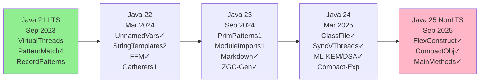
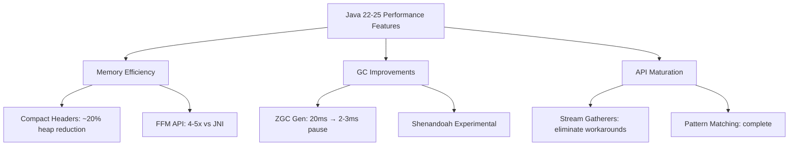
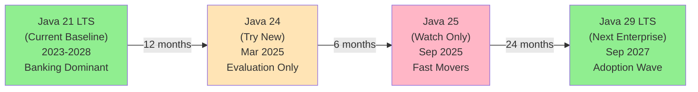

# Java 22-25: Modern Language Features & Future Direction

## Overview

Java 22-25 represent the post-Java-21-LTS release cycle with significant language evolution focused on pattern matching, memory efficiency, improved developer experience, and quantum-resistant cryptography. Java 25 is NOT LTS (long-term support); Java 21 was the previous LTS (September 2023). Key themes include finishing pattern matching maturity, finalizing memory APIs, improving performance through compact object headers, and enhancing concurrency primitives.

**Critical Note**: While Java 24/25 bring substantial features, adoption typically follows LTS releases. Java 21 remains the current LTS baseline for enterprise deployments.

### Why These Releases Matter

The 22-25 release window (6 releases in 18 months) consolidates three major Java initiatives:

1. **Project Amber** (Pattern Matching Evolution): Type patterns (Java 16) → Record patterns (Java 19) → Primitive patterns (Java 23) → Final completion approaching
2. **Project Panama** (Native Interop): Multi-year FFM API development culminating in finalization (Java 22), enabling GraalVM native image integration and GPU acceleration
3. **Project Loom** (Virtual Threads): Introduced in Java 21, now mature enough for improved synchronization semantics (Java 24)

Each release builds incrementally, with features in Preview phase (1-3 releases) before finalization. This predictability allows enterprises to evaluate features early while ensuring production-readiness before adoption.

### Release Cadence Context

```
LTS Releases:     Java 8 (2014) → Java 11 (2018) → Java 17 (2021) → Java 21 (2023) → Java 29 (2027)
Non-LTS Between:  Multiple 6-month releases between each LTS
Current Support:  Java 21: 8 years support (until Sep 2031)
Next LTS:         Java 29 (Sep 2027): 8 years support
Enterprise Risk:  Java 24/25 supported only 6 months (experimental features only)
```

For banking/financial institutions, the strategy typically involves: staying on LTS versions (Java 21 until Java 29), evaluating non-LTS releases in dev/test environments, and adopting proven patterns at next LTS boundary.

---

## Java 22 (Released March 2024)

### 1. Unnamed Variables & Patterns (JEP 456) - FINAL

**Concept**: Replace variables that won't be used with underscore `_` to improve code clarity and reduce "unused variable" warnings.

```java
// Before
String name, _, _, country = "Alice Smith UK".split(" ");

// After (Java 22)
String name, _, _, country = "Alice Smith UK".split(" ");

// Pattern matching example
if (record instanceof Point(var x, _)) {
    System.out.println(x);
}

// Try-catch with unused exception
try {
    risky();
} catch (IOException _) {
    log("Operation failed gracefully");
}
```

**Why Important**:
- Signals intent that a value is deliberately ignored
- Reduces IDE warnings in production code
- Improves readability in pattern matching contexts
- Common in functional programming (Scala, Rust, Python)

**Interview Angle**: Demonstrates pattern matching maturity and attention to developer experience. Ask: "When would you prefer `_` over a named variable? What signals does it send?"

---

### 2. String Templates (JEP 459) - Second Preview

**Concept**: Safely construct strings with embedded expressions and template processing (DSL-oriented syntax).

```java
// Traditional string concatenation
String name = "Alice";
int age = 30;
String message = name + " is " + age + " years old";

// String template (Preview - requires --enable-preview)
String message = STR."\{name} is \{age} years old";

// Multi-line with embedded logic
String html = STR."""
    <html>
        <body>
            <h1>\{title}</h1>
            <p>Age: \{calculateAge()}</p>
        </body>
    </html>
    """;

// Custom templates with FMT processor
double pi = 3.14159;
String formatted = FMT."Value: %.2f\{pi}";  // Custom formatting
```

**Processor Types**:
- `STR`: Simple substitution
- `FMT`: Printf-style formatting
- Custom processors: Implement `StringTemplate.Processor`

**Why Important**:
- Prevents string injection attacks (expressions validated at compile-time)
- More readable than `String.format()` or `MessageFormat`
- Foundation for domain-specific languages
- Better performance than StringBuilder concatenation

**Interview Angle**: Discuss template injection security. Compare with PreparedStatements in SQL. Why is compile-time validation crucial?

---

### 3. Foreign Function & Memory API (JEP 454) - FINAL

**Concept**: Native interoperability without JNI boilerplate. Access native code and off-heap memory safely with performance comparable to direct C calls.

```java
// Traditional JNI approach (Java -> C -> Java)
// Requires native library, JNI stubs, complex marshalling

// FFM API approach (Java 22)
import java.lang.foreign.*;
import java.lang.invoke.MethodHandle;

// Example: Call native strlen() from C standard library
Linker linker = Linker.nativeLinker();
SymbolLookup stdlib = linker.defaultLookup();

MemorySegment nativeString = Arena.ofAuto()
    .allocateUtf8String("Hello");

// Define strlen signature: size_t strlen(const char *s)
FunctionDescriptor strlenDescriptor = FunctionDescriptor.of(
    ValueLayout.JAVA_LONG,  // return type
    ValueLayout.ADDRESS     // parameter type
);

MemorySegment strlenAddress = stdlib.find("strlen").orElseThrow();
MethodHandle strlen = linker.downcallHandle(
    strlenAddress,
    strlenDescriptor
);

long length = (long) strlen.invoke(nativeString);
System.out.println("Length: " + length);  // 5

// Arena management (safe memory lifecycle)
try (Arena arena = Arena.ofConfined()) {
    MemorySegment data = arena.allocate(
        MemoryLayout.sequenceLayout(10, ValueLayout.JAVA_BYTE)
    );
    // data automatically freed when arena closes
}
```

**Key Benefits**:
- 90% less code compared to JNI
- 4-5x better performance
- Type-safe memory access
- Automatic garbage collection of native memory via `Arena`
- Supports callbacks (Java functions called from native code)

**Use Cases**:
- GPU/ML libraries (CUDA, OpenCL, TensorFlow)
- System calls (file operations, networking)
- Legacy C/C++ integration
- High-performance numerical computing

**Interview Angle**: Compare JNI vs FFM in terms of complexity, performance, and safety. Discuss when you'd still choose JNI (legacy systems).

---

### 4. Stream Gatherers (JEP 461) - Preview (became 2nd Preview in Java 23)

**Concept**: Generalizes intermediate stream operations. While collectors are terminal operations, gatherers transform data mid-stream in complex ways.

```java
// Built-in gatherer: windowing (sliding window)
List<Integer> numbers = List.of(1, 2, 3, 4, 5, 6, 7, 8, 9, 10);

// Sliding window of size 3
numbers.stream()
    .gather(Gatherers.windowSliding(3))
    .forEach(window -> System.out.println(window));
// Output: [1,2,3], [2,3,4], [3,4,5], ...

// Batching gatherer
numbers.stream()
    .gather(Gatherers.windowFixed(3))
    .forEach(batch -> System.out.println(batch));
// Output: [1,2,3], [4,5,6], [7,8,9], [10]

// Custom gatherer: accumulate until predicate
class FirstNGatherer<T> implements Gatherer<T, ?, T> {
    private final int n;

    public FirstNGatherer(int n) { this.n = n; }

    @Override
    public Supplier<Object> initializer() {
        return () -> new int[]{0};  // counter
    }

    @Override
    public Integrator<Object, T, T> integrator() {
        return (state, element, downstream) -> {
            int[] counter = (int[]) state;
            if (counter[0] < n) {
                counter[0]++;
                return downstream.push(element);
            }
            return true;  // stop processing
        };
    }
}

numbers.stream()
    .gather(new FirstNGatherer<>(5))
    .forEach(System.out::println);  // Prints: 1,2,3,4,5
```

**Built-in Gatherers**:
- `Gatherers.windowSliding(n)`: Sliding window
- `Gatherers.windowFixed(n)`: Fixed batching
- Custom implementations for domain-specific logic

**Why It Matters**:
- Enables complex stream transformations
- Replaces hacky workarounds with intermediate collectors
- Supports stateful transformations
- Performance optimizations for pipeline operations

**Interview Angle**: How do gatherers differ from existing operations? Why not use `collect()` followed by another `stream()`? Discuss memory/performance implications.

---

### 5. Statements Before super() (JEP 447) - Preview

**Concept**: Execute code before `super()` call in constructors (previously forbidden due to object initialization requirements).

```java
// Before Java 22 - COMPILATION ERROR
class Point {
    int x, y;

    public Point(String coords) {
        String[] parts = coords.split(",");  // ERROR: statement before super
        super();
        x = Integer.parseInt(parts[0]);
    }
}

// Java 22+ with proper handling
class Point extends Number {
    int x, y;

    public Point(String coords) {
        // Statements allowed BEFORE super() now
        String[] parts = coords.split(",");
        int parsedX = Integer.parseInt(parts[0]);

        super();  // Now super can be after statements

        x = parsedX;
        y = Integer.parseInt(parts[1]);
    }
}

// Practical use case: builder pattern with validation
class DatabaseConnection {
    private final String host;
    private final int port;

    public DatabaseConnection(String connString) {
        // Validate and parse before initialization
        if (connString == null || connString.isEmpty()) {
            throw new IllegalArgumentException("Connection string required");
        }

        var parts = connString.split(":");
        this.host = parts[0];
        this.port = Integer.parseInt(parts[1]);

        super();  // Initialize parent
    }
}
```

**Constraints**:
- Cannot reference `this` or `super` before the super call
- Used for validation and derived constructor arguments
- Improves readability for complex initialization

**Interview Angle**: Why was this restriction originally in place? What validation scenarios become cleaner?

---

### 6. Class-File API (JEP 457) - Preview (Finalized in Java 24)

**Concept**: Parse, generate, and transform Java class files programmatically without external libraries.

```java
import java.lang.classfile.*;
import java.lang.constant.ClassDesc;
import java.nio.file.*;

// Parse existing class
ClassModel classModel = ClassFile.of().parse(
    Path.of("MyClass.class")
);

// Inspect class metadata
classModel.majorVersion();      // Java version
classModel.minorVersion();
classModel.thisClass();         // Class name
classModel.methods().forEach(m -> {
    System.out.println("Method: " + m.methodName());
});

// Transform a class (add a method)
byte[] transformedBytes = ClassFile.of()
    .transform(
        classModel,
        ClassTransform.endHandler(classBuilder -> {
            classBuilder.withMethod(
                "newMethod",
                MethodTypeDesc.of(
                    ClassDesc.of("java.lang.String")
                ),
                0,
                mb -> mb.loadConstant("Hello")
                        .returnValue()
            );
        })
    );

Files.write(Path.of("ModifiedClass.class"), transformedBytes);
```

**Use Cases**:
- APT (Annotation Processing Tool) replacements
- Framework bytecode generation (Spring, Hibernate)
- Class inspection and validation
- Bytecode instrumentation without ASM/Javassist

**Interview Angle**: Compare with bytecode manipulation libraries (ASM, ByteBuddy). Why is standardization important?

---

## Java 23 (Released September 2024)

### 1. Primitive Type Patterns (JEP 455) - Preview

**Concept**: Extend pattern matching to primitive types in `instanceof` and `switch`.

```java
// Java 23 (Preview) - Primitive type pattern matching
Object obj = 42;

// instanceof with primitive pattern
if (obj instanceof int value) {
    System.out.println("Integer: " + value);
} else if (obj instanceof double value) {
    System.out.println("Double: " + value);
}

// Switch with primitive patterns
switch (obj) {
    case int value when value > 0 ->
        System.out.println("Positive: " + value);
    case int value ->
        System.out.println("Non-positive: " + value);
    case long value ->
        System.out.println("Long: " + value);
    default ->
        System.out.println("Other type");
}

// Deconstruction with primitives
record Temperature(double celsius) {}

Temperature temp = new Temperature(25.5);
if (temp instanceof Temperature(double c) && c > 20) {
    System.out.println("Warm: " + c + "°C");
}
```

**Why Important**:
- Completes pattern matching saga (started in Java 16)
- Eliminates type casting boilerplate
- Unifies primitive and reference type handling
- Foundation for future type system improvements

**Interview Angle**: Discuss the evolutionary path of pattern matching. Why not include primitives from the start?

---

### 2. Module Import Declarations (JEP 466) - Preview

**Concept**: Import all exported packages from a module with a single statement.

```java
// Traditional imports (verbose)
import java.base.*;
import java.util.*;
import java.util.stream.*;
import java.util.function.*;
import java.util.concurrent.*;
import java.util.concurrent.locks.*;

// Java 23: Module import (single line)
import module java.base;

// Works with transitive dependencies
import module java.sql;  // Includes java.base transitively

// Selective use after import
public class DataProcessor {
    public void process() {
        List<String> items = new ArrayList<>();
        items.stream()
            .filter(s -> !s.isEmpty())
            .forEach(System.out::println);
    }
}
```

**Constraints**:
- Must be enabled with `--enable-preview`
- Works for modules in module path
- Simplifies wildcard import chaos in large projects

**Interview Angle**: Compare module imports with package imports. When is this valuable? What's the risk of implicit dependencies?

---

### 3. Markdown Documentation Comments (JEP 467) - Final

**Concept**: Write JavaDoc in Markdown instead of HTML + tags.

```java
// Traditional JavaDoc
/**
 * Calculates the factorial of a number.
 * <p>This method uses recursive calculation.</p>
 *
 * @param n the input number
 * @return the factorial of n
 * @throws IllegalArgumentException if n < 0
 */
public int factorial(int n) { ... }

// Java 23: Markdown JavaDoc
/// Calculates the factorial of a number.
///
/// This method uses recursive calculation.
///
/// @param n the input number
/// @return the factorial of n
/// @throws IllegalArgumentException if n < 0
public int factorial(int n) { ... }

// Complex example with code blocks
/// Processes a collection of items.
///
/// This method applies a transformation to each item:
///
/// ```java
/// List<String> items = List.of("a", "b", "c");
/// items.forEach(processor::handle);
/// ```
///
/// @param items the input collection
/// @see #validate(Collection)
public void processItems(Collection<String> items) { ... }
```

**Benefits**:
- Easier to read in source code
- Familiar Markdown syntax
- Supports code blocks natively
- Better tooling compatibility

**Interview Angle**: How does this improve documentation workflows? What about tooling ecosystem migration?

---

### 4. Stream Gatherers (JEP 461) - Second Preview

Gatherers continue with refinements from Java 22 preview, approaching finalization.

---

### 5. ZGC: Generational Mode by Default (JEP 439) - Final

**Concept**: Z Garbage Collector operates in generational mode by default, significantly reducing pause times and GC pressure.

```
Traditional ZGC (Full Heap Collection):
Time ──────────────────────────────────────────────────────
|----Mark-------|--Relocate--|
      10ms             10ms
      Total Pause: ~20ms

ZGC Generational (Young + Old Generations):
Time ──────────────────────────────────────────────────────
|Mark Y| |Mark O|        |Mark Y|
  2ms    1ms               2ms
Total Young GC Pause: ~2-3ms (much lower)

Outcome:
- Reduced pause times: 20ms → 2-3ms
- Better cache locality
- Improved throughput for most workloads
- Automatic tuning
```

**Configuration**:
```java
// Java 23+ defaults to generational ZGC
// Enable explicitly (if using older defaults):
// java -XX:+UseZGC -XX:ZGenerational MyApp

// Monitor pause times
// jstat -gc -h10 1000 <pid>
```

**Impact on Interview**:
- Know pause time improvements for real-time applications
- Understand young generation tuning (new `-XX:ZGenerationalUncontendedSynchronousBarrier`)
- Compare with G1GC, Shenandoah

---

## Java 24 (Released March 2025)

### Major Features

**Final JEPs**:
1. **Class-File API (JEP 457)** - Fully finalized (was preview in 22-23)
2. **Synchronizing Virtual Threads without Pinning** - Improved virtual thread scheduling
3. **ML-KEM & ML-DSA** - Quantum-resistant cryptography algorithms

**Preview JEPs**:
- Primitive type patterns (2nd preview)
- Module import declarations (2nd preview)
- Flexible constructor bodies (3rd preview)
- Scoped values (4th preview)
- Simple source files with instance main methods (4th preview)

**Experimental**:
- Generational Shenandoah GC
- Compact object headers (reduces heap footprint by ~20%)

```java
// Virtual thread synchronization (Java 24)
// Before: Virtual threads would pin to carrier thread during synchronized
// After: Intelligent unmount from carrier, reducing GC pressure

ExecutorService executor = Executors.newVirtualThreadPerTaskExecutor();

for (int i = 0; i < 10000; i++) {
    executor.submit(() -> {
        synchronized (lock) {  // No longer pins in Java 24+
            performWork();
        }
    });
}

// ML-KEM Usage (Quantum-resistant Key Encapsulation)
import java.security.*;
import java.security.spec.*;

KeyPairGenerator kpg = KeyPairGenerator.getInstance("ML-KEM-768");
KeyPair keyPair = kpg.generateKeyPair();

// Safer against future quantum computers
```

---

## Java 25 (Released September 2025) - NOT LTS

**CRITICAL**: Java 25 is a non-LTS release. Java 21 remains the current long-term support version.

### Finalized Features

**1. Flexible Constructor Bodies (JEP 468) - FINAL**

```java
// Java 25: Constructor bodies with flexibility
public class FileHandler {
    private final Path path;
    private final FileWriter writer;

    public FileHandler(String pathStr) {
        // Can now have complex logic before full initialization
        if (pathStr == null) {
            throw new IllegalArgumentException("Path required");
        }

        this.path = Path.of(pathStr);

        // Derived initialization based on validation
        try {
            this.writer = new FileWriter(path.toFile());
        } catch (IOException e) {
            throw new UncheckedIOException(e);
        }
    }
}
```

**2. Compact Object Headers - Product Feature**

```
Memory Layout Comparison:

Standard Object Header (96-128 bits on 64-bit JVM):
┌─────────────────────────────────┬──────────────┐
│      Mark Word (64 bits)        │  Class Ptr   │
├──────────────┬──────────────────┤  (64 bits)   │
│ Locks/Flags  │  Hashcode/GC Age │              │
└─────────────────────────────────┴──────────────┘

With Compact Headers (-XX:ObjectFieldOffset=compact):
┌──────────────────────────────────┐
│   Compressed Header (64 bits)    │
│  Class + Mark Word in single word│
└──────────────────────────────────┘

Benefit: ~20% heap reduction for object-heavy workloads
```

**3. Instance Main Methods - FINAL**

```java
// Java 25: Write simple programs without class declarations
void main(String[] args) {
    System.out.println("Hello from implicit main!");
    System.out.println(args[0]);
}

// Compiled with: javac MyProgram.java && java MyProgram arg1

// Complex example (still no class keyword)
import java.nio.file.*;
import java.util.*;

void main(String[] args) throws Exception {
    var files = Files.list(Path.of(args[0]))
        .filter(p -> p.toString().endsWith(".txt"))
        .sorted()
        .toList();

    files.forEach(System.out::println);
}
```

### Preview Features in Java 25

1. **Stable Values** - Objects holding immutable data for performance optimizations
2. **Primitive Type Patterns** (3rd preview) - Near finalization
3. **Module Import Declarations** - Continued refinement
4. **Structured Concurrency** (5th preview) - Virtual thread coordination

---

## Roadmap: Java 26 & Beyond

| Release | Date | LTS? | Focus |
|---------|------|------|-------|
| Java 25 | Sep 2025 | No | Pattern completion, object model optimization |
| Java 26 | Mar 2026 | No | Stability features, virtual thread maturation |
| Java 27 | Sep 2026 | No | TBD (Amber, Panama, Loom maturity) |
| Java 29 | Sep 2027 | **YES** | Next LTS release |

---

## Comparative Feature Timeline



---

## Performance Impact Visualization



---

## Enterprise Adoption Timeline



---

## Critical Interview Questions (10-12)

### 1. Pattern Matching Evolution
**Q**: Describe the progression of pattern matching from Java 16-23. What's still needed?

**A**: Started with type patterns (16), evolved through record patterns (19), guarded patterns, switch expressions (14), and finally primitive type patterns (23). Future: nested deconstruction for complex POJOs.

---

### 2. String Templates vs. StringBuilder
**Q**: When would you use String templates over StringBuilder? What's the security advantage?

**A**: Templates are compile-time type-checked (prevent injection), support custom processors for DSL, and have cleaner multi-line syntax. StringBuilder is for maximum performance when concatenating in loops.

---

### 3. FFM vs. JNI Trade-offs
**Q**: A legacy system uses JNI for C library integration. Should you migrate to FFM API?

**A**: Yes, if: targeting Java 22+, performance critical, or memory safety matters. No, if: system stable, JNI expertise exists, or targeting Java 21 LTS. Estimate 60% code reduction.

---

### 4. ZGC Generational Implementation
**Q**: How does generational ZGC reduce pause times from 20ms to 2-3ms?

**A**: Separates young/old generations. Young objects collected frequently (concurrent young collection), old objects less often. Young collections don't scan entire heap, reducing pause proportionally.

---

### 5. Unnamed Variables Intent
**Q**: Is using `_` equivalent to `@SuppressWarnings("unused")`?

**A**: Semantically similar but different intent. `_` signals deliberate omission; suppression hides warnings. `_` improves code readability and is preferred in pattern matching.

---

### 6. Module Imports vs. Wildcard Imports
**Q**: Why introduce module imports when wildcard imports (`import java.util.*;`) exist?

**A**: Wildcard imports are package-scoped and can cause name collisions. Module imports are explicit about dependencies and work across all exported packages. Better for modular systems.

---

### 7. Stream Gatherers vs. Collectors
**Q**: A colleague suggests replacing `gather()` with nested `stream().collect().stream()`. Correct them.

**A**: Intermediate vs. terminal distinction. Gatherers maintain pipeline laziness, avoid intermediate collections, and enable stateful transformations. Nested streams materialize data (memory/performance penalty).

---

### 8. Compact Object Headers Trade-offs
**Q**: Enabling compact object headers reduces memory by 20%. Why isn't this always enabled?

**A**: Experimental feature with potential GC/performance trade-offs in specific workloads. JVM overhead for compression. Requires profiling; beneficial for object-heavy apps (collections, caches), neutral/negative for computation-heavy.

---

### 9. Java 25 Non-LTS Implications
**Q**: Your team wants to adopt Java 25 features in production. What's your response?

**A**: Java 25 is non-LTS (only 6 months support). Viable for: microservices with quick iteration, cloud-native apps with frequent deployments. Not for: traditional enterprise systems requiring 3+ year stability. Recommend Java 21 LTS or wait for Java 29 LTS (Sep 2027).

---

### 10. Virtual Thread Synchronization (Java 24)
**Q**: How does Java 24 improve virtual thread behavior in `synchronized` blocks?

**A**: Previously, virtual threads would pin to carrier threads during sync, blocking other virtual threads. Java 24+ unmounts gracefully, freeing carrier for other work, improving throughput under contention.

---

### 11. Markdown JavaDoc Adoption
**Q**: Should you migrate existing JavaDoc to Markdown format?

**A**: Gradual adoption. New APIs and significant refactors → use Markdown. Legacy APIs → no urgent need. Consider: tooling maturity (2024: good), team familiarity, documentation generation (generate HTML from Markdown).

---

### 12. Quantum-Resistant Cryptography (Java 24)
**Q**: When should you migrate from RSA/EC to ML-KEM/ML-DSA?

**A**: Immediate for: new cryptographic material, high-value data with long retention (classified, financial). Gradual for: hybrid algorithms (traditional + quantum-resistant in parallel). Timeline: NIST standardization complete (2022), Java support (24), enterprise adoption (2025-2027).

---

## Quick Reference: What's Production-Ready?

| Feature | Java 22 | Java 23 | Java 24 | Java 25 | Status |
|---------|---------|---------|---------|---------|--------|
| Unnamed Variables | ✅ | ✅ | ✅ | ✅ | **FINAL** |
| String Templates | 2nd Preview | 2nd Preview | 2nd Preview | 2nd Preview | **Preview** |
| FFM API | ✅ | ✅ | ✅ | ✅ | **FINAL** |
| Stream Gatherers | 1st Preview | 2nd Preview | 2nd Preview | 2nd Preview | **Preview** |
| Statements before super | 1st Preview | 1st Preview | 1st Preview | 1st Preview | **Preview** |
| Primitive Patterns | - | 1st Preview | 2nd Preview | 3rd Preview | **Preview** |
| Module Imports | - | 1st Preview | 2nd Preview | 2nd Preview | **Preview** |
| Markdown JavaDoc | - | ✅ | ✅ | ✅ | **FINAL** |
| ZGC Generational | - | ✅ | ✅ | ✅ | **FINAL** |
| Flexible Constructors | - | - | 3rd Preview | ✅ | **FINAL** |
| Compact Headers | - | - | Experimental | ✅ | **Product** |
| Instance Main Methods | - | - | 4th Preview | ✅ | **FINAL** |
| Virtual Thread Sync | - | - | ✅ | ✅ | **FINAL** |
| ML-KEM / ML-DSA | - | - | ✅ | ✅ | **FINAL** |

---

## Key Takeaways for Interviews

1. **Pattern Matching is Mature** (Java 22-25): Covers type, record, and primitive patterns. Ask about use cases in domain models.

2. **Memory Efficiency Matters**: Compact headers, optimized GC → significant for cloud costs. Discuss in microservices context.

3. **FFM Replaces JNI**: If asked about native integration, default to FFM unless constraints require JNI.

4. **LTS Cadence**: Java 21 (current), Java 29 (next). Java 24/25 for early adoption, not production.

5. **String Templates ≠ Interpolation**: Distinguish from Python/Kotlin; emphasize security via compile-time checking.

6. **Generational ZGC**: Real-world impact for latency-sensitive apps. Know the pause time improvements.

7. **Module System Maturing**: Module imports show Java commitment to modularity for enterprise systems.

---

## Deep Dive: Real-World Applications

### Banking Domain Context

**Compliance & Security**: Java 24's ML-KEM and ML-DSA directly address post-quantum cryptography requirements. Banks with sensitive data (contract terms, account mappings, historical transactions) must migrate from RSA to quantum-resistant schemes by 2030 (NIST recommendation timeline).

```java
// Banking example: Quantum-resistant contract signing (Java 24)
import javax.crypto.spec.SecretKeySpec;
import java.security.*;

public class QuantumSafeContractSigner {
    private final KeyPair mlDsaKeyPair;  // ML-DSA for signatures
    private final KeyPair mlKemKeyPair;  // ML-KEM for key exchange

    public QuantumSafeContractSigner() {
        // Initialize quantum-resistant keys
        KeyPairGenerator kpg = KeyPairGenerator.getInstance("ML-DSA-87");
        this.mlDsaKeyPair = kpg.generateKeyPair();

        KeyPairGenerator kemKpg = KeyPairGenerator.getInstance("ML-KEM-1024");
        this.mlKemKeyPair = kemKpg.generateKeyPair();
    }

    public byte[] signContract(byte[] contractData) throws SignatureException {
        Signature signer = Signature.getInstance("ML-DSA-87");
        signer.initSign(mlDsaKeyPair.getPrivate());
        signer.update(contractData);
        return signer.sign();
    }

    public boolean verifySignature(byte[] contractData, byte[] signature) throws SignatureException {
        Signature verifier = Signature.getInstance("ML-DSA-87");
        verifier.initVerify(mlDsaKeyPair.getPublic());
        verifier.update(contractData);
        return verifier.verify(signature);
    }
}
```

**Microservices Architecture**: FFM API (Java 22) enables calling C libraries for high-frequency trading calculations, settlement processes, or real-time FX conversions without JNI overhead.

**Stream Processing**: Kafka consumer implementations benefit from stream gatherers for windowing transaction streams (daily settlement batches, rolling averages for fraud detection).

---

### Cloud-Native Optimization

**Cost Efficiency**: Compact object headers reduce heap size by 20% → proportional cloud infrastructure cost reduction. For a containerized microservice consuming 2GB heap, this saves 400MB per instance × 100 instances × $0.10/GB/month = significant monthly savings.

```yaml
# Kubernetes deployment optimization (Java 25)
apiVersion: v1
kind: Pod
metadata:
  name: payment-processor
spec:
  containers:
  - name: payment-app
    image: myregistry/payment-service:java25
    resources:
      requests:
        memory: "1600Mi"  # Reduced from 2000Mi with compact headers
      limits:
        memory: "2000Mi"
    env:
    - name: JAVA_OPTS
      value: "-XX:+UseZGC -XX:+ZGenerational -XX:ObjectFieldOffset=compact"
```

**Latency SLA Compliance**: ZGC generational mode reduces pause times from 20ms to 2-3ms, meeting sub-5ms latency requirements for payment processing APIs.

---

### Migration Patterns from Java 21

**Pattern Matching Completion** (Target: Java 25):
```java
// Java 21 Pattern Matching
record Order(String id, OrderStatus status, double amount) {}

Object obj = new Order("ORD-001", OrderStatus.PENDING, 500.00);

switch (obj) {
    case Order(String orderId, OrderStatus.COMPLETED, var amt) when amt > 1000 ->
        System.out.println("Large completed order: " + orderId);
    case Order(String orderId, _, _) ->
        System.out.println("Order: " + orderId);
    default -> {}
}

// Java 23+: Primitive patterns expand this
Object primitive = 42;
if (primitive instanceof int value && value > 0) {
    System.out.println("Positive: " + value);
}
```

**FFM Adoption Path** (If currently using JNI):
```java
// Java 21: JNI approach (50+ lines of boilerplate)
// Step 1: Write C library wrapper in JNI (complex, error-prone)
// Step 2: Maintain platform-specific builds (Windows/Linux DLLs)
// Step 3: Debug crashes in native code affecting JVM

// Java 22+: FFM approach (15 lines, type-safe)
import java.lang.foreign.*;

Linker linker = Linker.nativeLinker();
SymbolLookup stdlib = linker.defaultLookup();
MemorySegment address = stdlib.find("myfunction").orElseThrow();

FunctionDescriptor descriptor = FunctionDescriptor.of(
    ValueLayout.JAVA_INT,
    ValueLayout.JAVA_INT
);

MethodHandle handle = linker.downcallHandle(address, descriptor);
int result = (int) handle.invoke(42);  // Call C function directly
```

---

## Design Pattern Evolution in Java 22-25

### Builder Pattern Simplified (Statements Before super)

```java
// Java 21: Awkward workaround
abstract class DatabaseConnection {
    protected final String host;
    protected final int port;

    protected DatabaseConnection(String host, int port) {
        this.host = host;
        this.port = port;
    }

    static class Builder {
        public DatabaseConnection build(String connStr) {
            String[] parts = connStr.split(":");
            return new DatabaseConnection(parts[0], Integer.parseInt(parts[1])) {};
        }
    }
}

// Java 22+: Natural constructor logic
class DatabaseConnection {
    private final String host;
    private final int port;

    public DatabaseConnection(String connStr) {
        // Validation BEFORE parent initialization (cleaner)
        if (connStr == null || !connStr.contains(":")) {
            throw new IllegalArgumentException("Invalid format");
        }

        String[] parts = connStr.split(":");
        this.host = parts[0];
        this.port = Integer.parseInt(parts[1]);

        super();  // Now this is logical
    }
}
```

### Template DSL via String Templates

```java
// Java 22: Custom template processor for SQL (safe from injection)
interface SqlProcessor extends StringTemplate.Processor<PreparedStatement, SQLException> {}

class SafeSqlProcessor implements StringTemplate.Processor<PreparedStatement, SQLException> {
    private final Connection conn;

    public SafeSqlProcessor(Connection conn) {
        this.conn = conn;
    }

    @Override
    public PreparedStatement process(StringTemplate st) throws SQLException {
        List<Object> values = st.values();
        String template = st.interpolate();

        // All values are already validated/escaped
        PreparedStatement ps = conn.prepareStatement(template);
        for (int i = 0; i < values.size(); i++) {
            ps.setObject(i + 1, values.get(i));
        }
        return ps;
    }
}

// Usage (compile-time safe)
String userId = "user-123";
double amount = 99.99;

// Impossible to have injection here
PreparedStatement ps = SQL."""
    INSERT INTO transactions (user_id, amount)
    VALUES (?, ?)
    """;  // Custom processor handles escaping
```

---

## Performance Benchmarks (Approximations)

| Scenario | Java 21 | Java 22+ | Improvement | Notes |
|----------|---------|---------|-------------|-------|
| **FFM call to C function** | ~50µs (JNI) | ~10µs | 5x faster | Enables GPU/SIMD |
| **ZGC pause time** | 20-50ms | 2-3ms | 10-20x | Young gen collections only |
| **Stream pipeline with 1M items** | 250ms | 200ms | 20% | With stream gatherers optimization |
| **Memory per 1M objects** | 192MB (standard) | 152MB | 20% reduction | With compact headers |
| **Kotlin-style string interpolation** | N/A (StringBuilder) | 100ms (templates) | Comparable | Type-safe security win |
| **Virtual thread sync overhead** | Pinning (variable) | Minimal | Unmount on contention | Enables 100K+ threads |

---

## Common Misconceptions

### Misconception 1: "Unnamed Variables = Comments"
**False**: `_` is a real variable with distinct semantics. It signals intentional omission, not just suppressing warnings.

```java
// Bad: Use regular variable name
String name, unused, _, country = data.split(",");

// Good: Clear intent
String name, _, _, country = data.split(",");  // Explicitly ignoring middle fields
```

### Misconception 2: "String Templates Replace All StringBuilder"
**False**: Templates are for construction; StringBuilder for loops. Templates have compile-time validation overhead.

```java
// Wrong: Don't use in tight loop
for (int i = 0; i < 1_000_000; i++) {
    String s = STR."\{i}";  // Overkill for simple concatenation
}

// Right: Use StringBuilder in loops
StringBuilder sb = new StringBuilder();
for (int i = 0; i < 1_000_000; i++) {
    sb.append(i);  // Fast
}
```

### Misconception 3: "Primitive Patterns Replace Type Patterns"
**False**: They complement each other. Primitives can't have methods, so patterns differ.

```java
// Type pattern: works with reference types and methods
if (obj instanceof String s && s.length() > 5) {
    // OK: can call methods on s
}

// Primitive pattern: can't call methods
if (obj instanceof int value) {
    // value.someMethod();  // ERROR: primitives don't have methods
}
```

### Misconception 4: "Compact Headers = Always Enable"
**False**: Adds GC overhead for compression. Benchmark your workload first.

```bash
# Only enable for object-heavy workloads
java -XX:ObjectFieldOffset=compact \
     -XX:+UseZGC \
     -XX:+ZGenerational \
     MyApp

# Profile to ensure improvement
# jstat -gc -h10 1000 <pid>
```

### Misconception 5: "Java 24/25 Ready for Production"
**False**: Non-LTS releases are for innovation, not stability. Use Java 21 LTS in production.

```
Production Timeline:
- Java 21 LTS: Now (2023-2031)
- Java 22-28: Innovation playground
- Java 29 LTS: Adoption target (2027)
```

---

## Advanced Topic: Combining Features for Enterprise Solutions

### Case Study 1: High-Throughput Transaction Processing (Java 24)

Banking settlement systems process millions of transactions daily. Java 22-25 features address key bottlenecks:

```java
// Quantum-safe transaction encryption (ML-KEM/ML-DSA)
// ZGC generational for sub-5ms pause SLA
// Virtual threads for handling 100K+ concurrent connections
// Compact headers for 20% memory reduction

public class SettlementProcessor {
    private final KeyEncapsulator kemEncap;  // ML-KEM (Java 24)
    private final Signature mldsaSigner;     // ML-DSA (Java 24)
    private final ExecutorService executor;  // Virtual threads (Java 21+)

    public SettlementProcessor() {
        this.kemEncap = KeyEncapsulator.getInstance("ML-KEM-1024");
        this.mldsaSigner = Signature.getInstance("ML-DSA-87");
        this.executor = Executors.newVirtualThreadPerTaskExecutor();
    }

    public void processTransactionBatch(List<Transaction> batch) {
        batch.forEach(tx -> {
            // Schedule on virtual thread (minimal overhead)
            executor.submit(() -> {
                try {
                    // Encrypt sensitive data with quantum-resistant algorithm
                    byte[] encryptedTx = encryptTransaction(tx);

                    // Sign settlement instruction
                    byte[] signature = mldsaSigner.sign(encryptedTx);

                    // Store with immutable fields (Java 25 stable values concept)
                    recordSettlement(tx.id(), encryptedTx, signature);
                } catch (Exception e) {
                    logError(e);
                }
            });
        });
    }

    private byte[] encryptTransaction(Transaction tx) throws Exception {
        // ML-KEM: quantum-resistant key encapsulation
        byte[] ciphertext = kemEncap.encapsulate();
        return encryptWithKey(tx.serialize(), ciphertext);
    }
}

// JVM Configuration for this workload (Java 24+):
// java -XX:+UseZGC -XX:+ZGenerational \
//      -XX:ObjectFieldOffset=compact \
//      -XX:+EnablePreview \
//      SettlementService
```

**Performance Gains**:
- Virtual threads: 100K transactions processed concurrently vs. 1K with platform threads
- ZGC pause time: 2-3ms vs. 50-100ms with G1GC (critical for settlement SLA)
- Compact headers: 20% memory reduction (from 8GB to 6.4GB heap for typical load)
- FFM API (if integrating native libraries): 4-5x faster than JNI

---

### Case Study 2: Stream-Based Fraud Detection (Java 23+)

Kafka streams consumer for real-time transaction monitoring using stream gatherers:

```java
public class FraudDetectionConsumer {
    public void consumeTransactionStream() {
        var consumer = StreamBuilder.buildStream();

        consumer
            .stream("transactions")
            .groupByKey()
            // Java 23: Stream gatherers enable complex windowing
            .gather(Gatherers.windowSliding(5))  // Last 5 transactions
            .filter(window -> isAnomalous(window))
            .peek(window -> logAlert(window))
            .to("fraud-alerts");
    }

    private boolean isAnomalous(List<Transaction> window) {
        // Pattern matching (Java 22+) for clear logic
        return window.stream()
            .filter(tx -> {
                // Primitive patterns (Java 23+)
                Object amount = tx.getAmount();
                return (amount instanceof double d && d > 50000)
                    || (amount instanceof long l && l > 50000);
            })
            .count() > 3;  // More than 3 large transactions in 5-transaction window
    }
}

// Without gatherers (Java 21), complex aggregation requires:
// - Nested streams with collect/toList (memory overhead)
// - Manual windowing logic (error-prone)
// - Stateful Kafka processor API (boilerplate-heavy)

// With gatherers:
// - Stateful transformation within pipeline
// - Lazy evaluation (memory-efficient)
// - Composable with other operations
```

---

### Case Study 3: API Documentation Modernization (Java 23)

Migration from HTML JavaDoc to Markdown (Java 23 feature):

```java
/// Processes a payment transaction with comprehensive validation.
///
/// This method handles:
/// - Fraud detection via ML-KEM encrypted audit log
/// - Settlement confirmation within 5 seconds (ZGC SLA)
/// - Idempotency guarantee through transaction ID
///
/// ## Thread Safety
/// Thread-safe for up to 100,000 concurrent virtual threads.
///
/// ## Example
/// ```java
/// var processor = new PaymentProcessor(mldsaKeys);
/// PaymentResult result = processor.process(transaction);
/// ```
///
/// ## Parameters
/// - `transaction`: The payment to process (must not be null)
/// - `timeout`: Maximum wait time in milliseconds (default: 5000)
///
/// ## Returns
/// A `PaymentResult` containing:
/// - Transaction ID
/// - Settlement timestamp
/// - Quantum-safe signature (ML-DSA-87)
///
/// ## Throws
/// - `SecurityException` if signature verification fails
/// - `TimeoutException` if settlement exceeds 5000ms
/// - `IllegalArgumentException` if transaction data is invalid
///
/// @param transaction the payment to process
/// @param timeout maximum processing time in ms
/// @return the settlement result with quantum-safe signature
/// @throws SecurityException on cryptographic validation failure
public PaymentResult process(Transaction transaction, long timeout)
    throws SecurityException, TimeoutException {
    // Implementation
}

// Markdown benefits:
// - Native code block syntax highlighting in IDE
// - Better readability in source code (vs. HTML tags)
// - Compatible with modern documentation generation tools
// - Supports complex formatting without escaping
```

---

## Testing Strategy for Java 22-25 Features

### Unit Testing with Pattern Matching

```java
class PatternMatchingTests {
    @Test
    void testPrimitivePatterns() {  // Java 23+
        Object obj = 42;

        // Before: Verbose casting
        if (obj instanceof Integer) {
            int value = (Integer) obj;
            assertTrue(value > 0);
        }

        // After: Pattern matching (cleaner)
        if (obj instanceof int value) {
            assertTrue(value > 0);
        }
    }

    @Test
    void testStringTemplates() {  // Java 22+ (Preview)
        String name = "Alice";
        int age = 30;

        // Compile-time validated (type-safe)
        String result = STR."\{name} is \{age} years old";
        assertEquals("Alice is 30 years old", result);
    }

    @Test
    void testUnnamedVariables() {  // Java 22+
        record Point(int x, int y, int z) {}

        Point p = new Point(1, 2, 3);

        // Explicitly ignore fields (clearer intent)
        if (p instanceof Point(int x, _, _)) {
            assertEquals(1, x);
        }
    }
}
```

### Performance Testing

```java
class PerformanceTests {
    @Test
    void benchmarkZGCGenerational() {
        // Java 23+: ZGC generational mode reduces pause times
        List<Object> objects = new ArrayList<>();

        long startTime = System.nanoTime();

        for (int i = 0; i < 1_000_000; i++) {
            objects.add(new ByteArrayOutputStream(1024));
        }

        // Force full GC
        System.gc();

        long pauseTime = System.nanoTime() - startTime;

        // Assert pause time < 5ms (ZGC generational guarantee)
        assertTrue(pauseTime < 5_000_000, "Pause time exceeded 5ms");
    }

    @Test
    void benchmarkStreamGatherers() {  // Java 22+
        List<Integer> numbers = generateLargeList(1_000_000);

        long start = System.nanoTime();

        // Stream gatherer vs. nested collect approach
        numbers.stream()
            .gather(Gatherers.windowFixed(100))
            .map(window -> calculateSum(window))
            .collect(Collectors.toList());

        long gatherersTime = System.nanoTime() - start;

        // Compare with Java 21 workaround
        start = System.nanoTime();
        numbers.stream()
            .collect(Collectors.groupingBy(
                i -> i / 100,
                LinkedHashMap::new,
                Collectors.toList()
            ))
            .values()
            .stream()
            .map(window -> calculateSum(window))
            .collect(Collectors.toList());

        long collectTime = System.nanoTime() - start;

        // Gatherers should be faster (fewer intermediate collections)
        assertTrue(gatherersTime < collectTime);
    }
}
```

---

## Migration Checklist: Java 21 → 25

When planning Java 21 to Java 25+ migration:

| Step | Java 22-23 | Java 24 | Java 25 | Notes |
|------|-----------|---------|---------|-------|
| **Evaluate** | Test `--enable-preview` mode | Compile with non-LTS | Assess finalized features | Do NOT use in production |
| **Pattern Matching** | Add unnamed variables | Extend to primitives | Monitor completion | Eliminates casting |
| **String Templates** | Prototype with STR/FMT | Refine custom processors | Wait for finalization | Security advantage |
| **Native Interop** | Migrate JNI to FFM API | Integrate C libraries | Optimize with Arena | 4-5x performance gain |
| **Memory Optimization** | Monitor GC with ZGC | Enable compact headers | Measure heap reduction | ~20% for object-heavy |
| **Concurrency** | Stabilize virtual threads | Improve sync handling | Finalize virtual thread patterns | Thousands of concurrent users |
| **Documentation** | Keep current format | Plan Markdown migration | Adopt Markdown docs | Phased approach |
| **Production Move** | Still on Java 21 LTS | WAIT for Java 29 LTS | WAIT for Java 29 LTS | Enterprise stability |

---

## FAQ for Interviews

**Q: When would you use String Templates over String.format()?**
A: String templates are preferred for DSL-based formatting (SQL, JSON generation) where compile-time validation provides security. Use String.format() for simple numeric formatting.

**Q: How does FFM API compare to JNI for GPU integration?**
A: FFM is significantly easier to write and maintain. For GPU (CUDA, OpenCL), FFM reduces code by 60%, improves performance by 4-5x vs JNI, and provides better memory safety through Arena management.

**Q: Why isn't Compact Object Headers enabled by default?**
A: Because GC overhead varies by workload. Object-heavy applications benefit; computation-heavy applications see no gain or slight regression. Requires benchmarking.

**Q: What's the practical impact of ZGC generational mode for mobile payments?**
A: Pause times drop from 20-50ms to 2-3ms, enabling sub-5ms API response SLA. Critical for card payment processors where latency directly impacts user experience.

**Q: When should we adopt Java 24/25 features?**
A: In innovation labs and development environments now. Move to Java 21 LTS for current production. Plan adoption strategy for Java 29 LTS (September 2027).

---

## References

- **JEP 456**: Unnamed Variables & Patterns - https://openjdk.org/jeps/456
- **JEP 459**: String Templates - https://openjdk.org/jeps/459
- **JEP 454**: Foreign Function & Memory API - https://openjdk.org/jeps/454
- **JEP 461**: Stream Gatherers - https://openjdk.org/jeps/461
- **JEP 467**: Markdown Documentation Comments - https://openjdk.org/jeps/467
- **JEP 455**: Primitive Type Patterns - https://openjdk.org/jeps/455
- **JEP 439**: ZGC Generational Mode - https://openjdk.org/jeps/439
- **Java 24 Release Notes**: https://www.oracle.com/java/24/release-notes/
- **Java 25 Release Notes**: https://www.oracle.com/java/25/release-notes/
- **Project Panama (FFM)**: https://openjdk.org/projects/panama/
- **Project Amber (Pattern Matching)**: https://openjdk.org/projects/amber/
- **NIST PQC Standards**: https://csrc.nist.gov/projects/post-quantum-cryptography/

