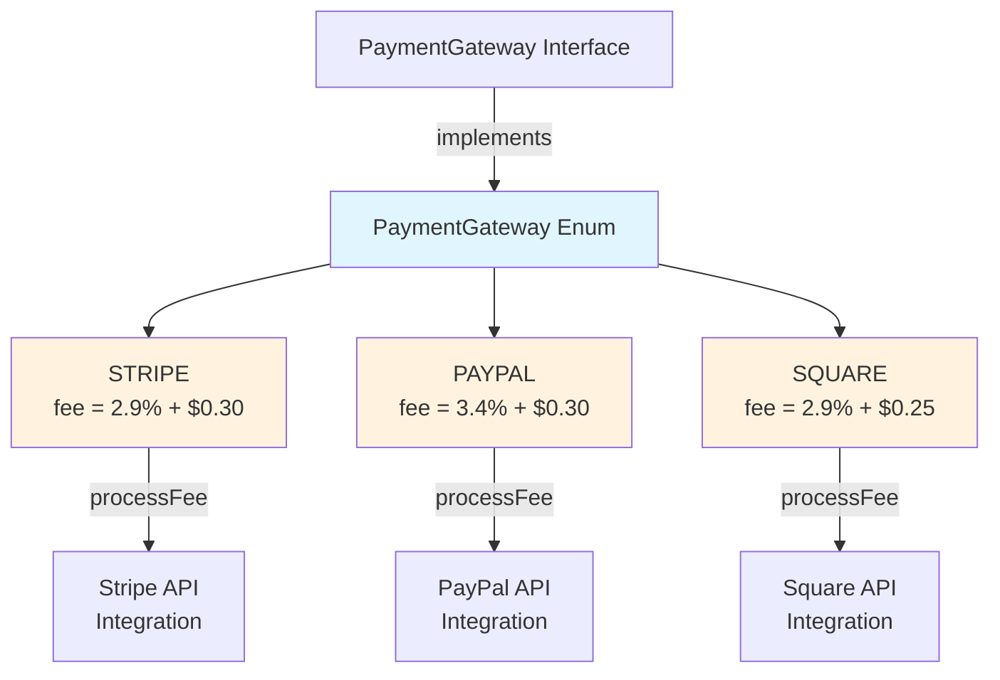
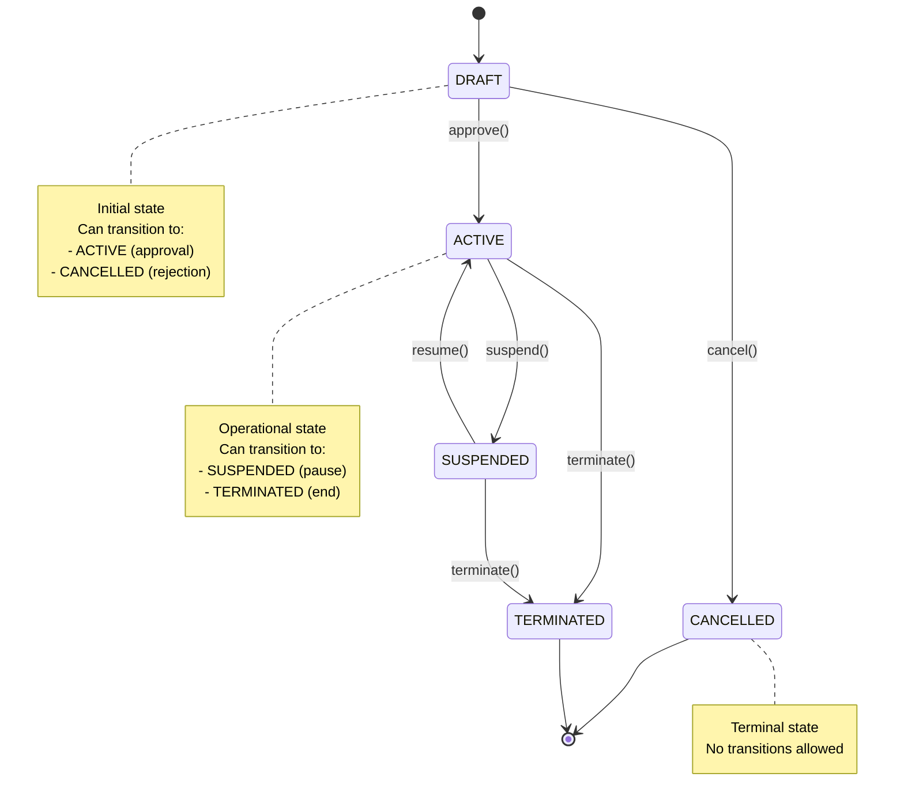
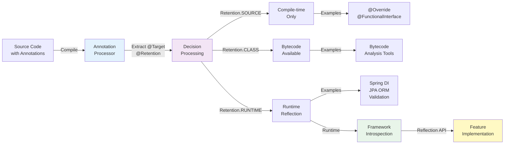

# Java Enums and Annotations: Advanced Patterns and Usage

## Table of Contents
1. [Java Enums](#java-enums)
2. [Java Annotations](#java-annotations)
3. [Interview Questions](#interview-questions)

---

## Java Enums

### Overview

Enums (enumerations) are a special Java type that allow you to define a fixed set of constants with type safety. Unlike strings or integers, enums provide compile-time checking, prevent invalid values, and enable IDE autocompletion. Introduced in Java 5, enums have evolved into sophisticated constructs supporting interfaces, abstract methods, and complex state management.

**Why Enums Matter in Interviews:**
- Type-safe alternatives to constants (prevent invalid states)
- Foundation for state machines and finite state automata
- Design patterns: Singleton, Strategy, State
- Performance implications in collections (EnumSet, EnumMap)
- Enterprise applications (order status, transaction types, user roles)

### Basic Enum Concepts

#### Simple Enum Declaration

```java
/**
 * Basic enum representing transaction types in a banking system.
 * Enums are inherently final and cannot be extended.
 */
public enum TransactionType {
    DEPOSIT,      // Ordinal 0
    WITHDRAWAL,   // Ordinal 1
    TRANSFER,     // Ordinal 2
    BILL_PAYMENT  // Ordinal 3
}

// Usage
TransactionType type = TransactionType.DEPOSIT;
System.out.println(type.ordinal());      // 0
System.out.println(type.name());         // "DEPOSIT"
```

#### Enums with Fields and Constructors

```java
/**
 * Enum with associated data.
 * Each constant must invoke the constructor.
 * Fields are implicitly final.
 */
public enum OrderStatus {
    PENDING("PND", "Order awaiting processing"),
    CONFIRMED("CNF", "Order has been confirmed"),
    SHIPPED("SHP", "Order is in transit"),
    DELIVERED("DLV", "Order has been delivered"),
    CANCELLED("CXL", "Order was cancelled");

    private final String code;
    private final String description;

    // Constructor is implicitly private
    OrderStatus(String code, String description) {
        this.code = code;
        this.description = description;
    }

    public String getCode() {
        return code;
    }

    public String getDescription() {
        return description;
    }

    /**
     * Lookup enum by code - common enterprise pattern.
     * Prevents returning invalid status objects.
     */
    public static OrderStatus fromCode(String code) {
        for (OrderStatus status : values()) {
            if (status.code.equals(code)) {
                return status;
            }
        }
        throw new IllegalArgumentException("Unknown status code: " + code);
    }
}
```

### Advanced Enum Patterns

#### Pattern 1: Enums Implementing Interfaces

```java
/**
 * Strategy pattern using enums.
 * Each enum constant can have different behavior.
 * Superior to inheritance for fixed set of strategies.
 */
public interface PaymentProcessor {
    BigDecimal processFee(BigDecimal amount);
    String getProvider();
}

public enum PaymentGateway implements PaymentProcessor {
    STRIPE(0.029) {
        @Override
        public BigDecimal processFee(BigDecimal amount) {
            return amount.multiply(new BigDecimal("0.029"))
                        .add(new BigDecimal("0.30"));  // 2.9% + $0.30
        }

        @Override
        public String getProvider() {
            return "Stripe";
        }
    },

    PAYPAL(0.034) {
        @Override
        public BigDecimal processFee(BigDecimal amount) {
            return amount.multiply(new BigDecimal("0.034"))
                        .add(new BigDecimal("0.30"));  // 3.4% + $0.30
        }

        @Override
        public String getProvider() {
            return "PayPal";
        }
    },

    SQUARE(0.029) {
        @Override
        public BigDecimal processFee(BigDecimal amount) {
            return amount.multiply(new BigDecimal("0.029"))
                        .add(new BigDecimal("0.25"));  // 2.9% + $0.25
        }

        @Override
        public String getProvider() {
            return "Square";
        }
    };

    private final double rate;

    PaymentGateway(double rate) {
        this.rate = rate;
    }
}

// Usage
PaymentGateway gateway = PaymentGateway.STRIPE;
BigDecimal fee = gateway.processFee(new BigDecimal("100.00"));
```

**Key Insight:** This pattern is superior to switch statements because:
- Adding new enum constants forces implementation of all interface methods
- Behavior is encapsulated with the constant
- No null pointer risks from missing cases
- Type-safe and compile-time checked

#### Pattern 2: Abstract Methods in Enums

```java
/**
 * Alternative to implementing interfaces - using abstract methods.
 * Each constant must provide implementation.
 * Useful when behavior is tightly coupled to the enum constant.
 */
public enum OperationResult {
    SUCCESS {
        @Override
        public void handle(String message) {
            System.out.println("✓ Success: " + message);
            // Log to success metrics
        }

        @Override
        public boolean isError() {
            return false;
        }
    },

    FAILURE {
        @Override
        public void handle(String message) {
            System.err.println("✗ Failure: " + message);
            // Log to error metrics
        }

        @Override
        public boolean isError() {
            return true;
        }
    },

    RETRY {
        @Override
        public void handle(String message) {
            System.out.println("↻ Retrying: " + message);
            // Trigger retry logic
        }

        @Override
        public boolean isError() {
            return true;  // Recoverable error
        }
    };

    public abstract void handle(String message);
    public abstract boolean isError();

    /**
     * Concrete method - shared across all constants.
     * Demonstrates mixing abstract and concrete methods.
     */
    public OperationResult ifFailureRetry() {
        return this == FAILURE ? RETRY : this;
    }
}
```

#### Pattern 3: Singleton Enum

```java
/**
 * Enum singleton - the best way to implement singletons in Java.
 * Advantages:
 * - Serialization-safe (prevents multiple instances)
 * - Reflection-proof (prevents instantiation via reflection)
 * - Thread-safe by design
 * - Cleaner syntax than eager/lazy initialization patterns
 *
 * This is what Joshua Bloch recommends in Effective Java.
 */
public enum DatabaseConnectionPool {
    INSTANCE;  // Single enum constant

    private static final int POOL_SIZE = 20;
    private final List<Connection> connections;
    private final Queue<Connection> availableConnections;

    DatabaseConnectionPool() {
        connections = Collections.synchronizedList(new ArrayList<>());
        availableConnections = new ConcurrentLinkedQueue<>();
        initializePool();
    }

    private void initializePool() {
        // Initialize 20 database connections
        for (int i = 0; i < POOL_SIZE; i++) {
            try {
                Connection conn = DriverManager.getConnection(
                    "jdbc:postgresql://localhost:5432/mydb");
                connections.add(conn);
                availableConnections.offer(conn);
            } catch (SQLException e) {
                throw new RuntimeException("Failed to initialize connection pool", e);
            }
        }
    }

    public Connection getConnection() throws SQLException {
        Connection conn = availableConnections.poll();
        if (conn == null) {
            throw new SQLException("No connections available from pool");
        }
        return conn;
    }

    public void releaseConnection(Connection conn) {
        if (conn != null) {
            availableConnections.offer(conn);
        }
    }

    public void shutdown() {
        connections.forEach(conn -> {
            try {
                conn.close();
            } catch (SQLException e) {
                System.err.println("Error closing connection: " + e.getMessage());
            }
        });
    }
}

// Usage
DatabaseConnectionPool pool = DatabaseConnectionPool.INSTANCE;
Connection conn = pool.getConnection();
try {
    // Use connection
} finally {
    pool.releaseConnection(conn);
}
```

**Why This Pattern:**
- Serialization safe: `readResolve()` automatically returns the same instance
- Reflection proof: Cannot instantiate via `Constructor.newInstance()`
- Thread-safe: JVM guarantees instance creation during class loading
- Simple syntax: No double-checked locking needed

#### Pattern 4: Enums for Bit Flags

```java
/**
 * Enum with bitwise operations for combining multiple flags.
 * Traditional approach before EnumSet became popular.
 * Useful for understanding low-level concepts.
 */
public enum Permission {
    READ(1),      // 0001
    WRITE(2),     // 0010
    DELETE(4),    // 0100
    EXECUTE(8);   // 1000

    private final int mask;

    Permission(int mask) {
        this.mask = mask;
    }

    /**
     * Combine multiple permissions using bitwise OR.
     * Returns an integer flag that can be stored/transmitted.
     */
    public static int combine(Permission... permissions) {
        int combined = 0;
        for (Permission p : permissions) {
            combined |= p.mask;
        }
        return combined;
    }

    /**
     * Check if permission is included in combined flag.
     */
    public static boolean hasPermission(int flags, Permission permission) {
        return (flags & permission.mask) == permission.mask;
    }
}

// Usage
int userPermissions = Permission.combine(Permission.READ, Permission.WRITE);
boolean canRead = Permission.hasPermission(userPermissions, Permission.READ);   // true
boolean canDelete = Permission.hasPermission(userPermissions, Permission.DELETE); // false
```

**Modern Alternative: EnumSet**
```java
// Preferred in modern code - clearer intent, type-safe
Set<Permission> permissions = EnumSet.of(Permission.READ, Permission.WRITE);
boolean canRead = permissions.contains(Permission.READ);  // true
```

#### Pattern 5: State Machine Using Enums

```java
/**
 * Finite State Machine (FSM) for contract lifecycle.
 * Each state knows valid transitions.
 * Prevents invalid state transitions at compile time.
 */
public enum ContractState {
    DRAFT {
        @Override
        public Set<ContractState> validTransitions() {
            return EnumSet.of(ACTIVE, CANCELLED);
        }

        @Override
        public String getDescription() {
            return "Contract is being drafted";
        }
    },

    ACTIVE {
        @Override
        public Set<ContractState> validTransitions() {
            return EnumSet.of(SUSPENDED, TERMINATED);
        }

        @Override
        public String getDescription() {
            return "Contract is active";
        }
    },

    SUSPENDED {
        @Override
        public Set<ContractState> validTransitions() {
            return EnumSet.of(ACTIVE, TERMINATED);
        }

        @Override
        public String getDescription() {
            return "Contract is temporarily suspended";
        }
    },

    TERMINATED {
        @Override
        public Set<ContractState> validTransitions() {
            return EnumSet.noneOf(ContractState.class);  // No transitions from terminal state
        }

        @Override
        public String getDescription() {
            return "Contract is terminated";
        }
    },

    CANCELLED {
        @Override
        public Set<ContractState> validTransitions() {
            return EnumSet.noneOf(ContractState.class);  // No transitions from terminal state
        }

        @Override
        public String getDescription() {
            return "Contract was cancelled before activation";
        }
    };

    public abstract Set<ContractState> validTransitions();
    public abstract String getDescription();

    public boolean canTransitionTo(ContractState nextState) {
        return validTransitions().contains(nextState);
    }
}

// Enforces valid transitions
public class Contract {
    private ContractState state = ContractState.DRAFT;

    public void transitionTo(ContractState nextState) {
        if (!state.canTransitionTo(nextState)) {
            throw new IllegalStateException(
                "Cannot transition from " + state + " to " + nextState);
        }
        this.state = nextState;
    }
}
```

### EnumSet and EnumMap

#### EnumSet - High Performance Set

```java
/**
 * EnumSet is backed by a bit vector (single long or long[]).
 * Extremely memory efficient and fast for enum operations.
 * Never use HashSet<Enum> - always prefer EnumSet.
 */

Set<OrderStatus> activeStatuses = EnumSet.of(
    OrderStatus.CONFIRMED,
    OrderStatus.SHIPPED
);

Set<OrderStatus> terminalStatuses = EnumSet.of(
    OrderStatus.DELIVERED,
    OrderStatus.CANCELLED
);

// Efficient operations
Set<OrderStatus> allStatuses = EnumSet.copyOf(activeStatuses);
allStatuses.addAll(terminalStatuses);

// Much faster iteration and containment checks
for (OrderStatus status : activeStatuses) {
    System.out.println(status);
}

// Performance comparison:
// HashSet: O(1) average, but with hash collisions and memory overhead
// EnumSet: O(1) guaranteed, ~1/3 memory of HashSet
```

**Performance Impact:**
- Memory: EnumSet uses a single `long` for up to 64 enum constants
- Speed: Bit operations are fastest CPU operations
- Iteration: Cache-friendly sequential access
- Never use `new HashSet<>(Arrays.asList(enum1, enum2))`

#### EnumMap - Type-Safe Lookups

```java
/**
 * EnumMap is like a switch statement but type-safe and dynamic.
 * Uses enum ordinal as index - O(1) lookup with minimal overhead.
 * Preferred over HashMap<Enum, V> for enum keys.
 */

Map<PaymentGateway, String> apiKeys = new EnumMap<>(PaymentGateway.class);
apiKeys.put(PaymentGateway.STRIPE, "sk_live_...");
apiKeys.put(PaymentGateway.PAYPAL, "live_...");
apiKeys.put(PaymentGateway.SQUARE, "sq_...");

// O(1) lookup using ordinal, not hashing
String stripeKey = apiKeys.get(PaymentGateway.STRIPE);

// Iteration is ordered by enum declaration order
for (Map.Entry<PaymentGateway, String> entry : apiKeys.entrySet()) {
    System.out.println(entry.getKey() + ": " + entry.getValue());
}

// Use case: Configuration mapping
Map<TransactionType, BigDecimal> fees = new EnumMap<>(TransactionType.class);
fees.put(TransactionType.DEPOSIT, new BigDecimal("0.00"));
fees.put(TransactionType.WITHDRAWAL, new BigDecimal("2.50"));
fees.put(TransactionType.TRANSFER, new BigDecimal("0.00"));
fees.put(TransactionType.BILL_PAYMENT, new BigDecimal("1.00"));

// Never do this: Map<TransactionType, BigDecimal> fees = new HashMap<>();
```

---

## Java Annotations

### Overview

Annotations are metadata about the program that don't directly affect the code execution. They provide information to the compiler, build-time processors, and runtime framework without changing program semantics. Annotations are the foundation of modern Java frameworks like Spring, JPA, and Lombok.

**Why Annotations Matter in Interviews:**
- Enables declarative programming (Spring's `@Component`, `@Autowired`)
- Marker of intent and configuration (compile-time checking via annotation processors)
- Framework integration (reflection-based and compile-time processing)
- Metaprogramming capabilities (AspectJ, Spring AOP)
- Enterprise patterns (dependency injection, cross-cutting concerns)

### Built-in Annotations

#### Standard Meta-Annotations

```java
/**
 * @Override: Marker annotation indicating method overrides parent.
 * - No arguments
 * - Compile-time checking only
 * - Compiler error if method doesn't actually override
 * - Best practice: Always use @Override
 */
public class BankAccount {
    @Override
    public String toString() {
        return "BankAccount{...}";
    }

    @Override
    public boolean equals(Object obj) {
        return super.equals(obj);
    }
}

/**
 * @Deprecated: Marks API as obsolete.
 * - Generates compiler warning
 * - Documents replacement in JavaDoc
 * - For enterprise systems: gradual API migration
 */
@Deprecated(since = "2.5.0", forRemoval = true)
public void legacyTransferMethod(String fromAccount, String toAccount) {
    // Use transferMoney(String, String) instead
}

/**
 * @FunctionalInterface: Marks interface as functional interface.
 * - Exactly one abstract method required
 * - Compiler error if contract violated
 * - Enables lambda expressions and method references
 */
@FunctionalInterface
public interface TransactionProcessor {
    void process(Transaction transaction);

    // Can have default methods and static methods
    default void logTransaction(Transaction t) {
        System.out.println("Processing: " + t.getId());
    }
}

/**
 * @SafeVarargs: Suppresses warnings for varargs with generics.
 * - Only on methods with final or static modifier
 * - Indicates method is safe - no unsafe operations on varargs
 * - Compiler-checked annotation
 */
@SafeVarargs
public static <T> List<T> createList(T... items) {
    return new ArrayList<>(Arrays.asList(items));
}

// Usage
List<String> accounts = createList("ACC001", "ACC002", "ACC003");
```

### Meta-Annotations

Meta-annotations are annotations that annotate annotations. They control how your custom annotations behave.

```java
/**
 * @Target: Specifies where annotation can be applied.
 * Common values:
 * - ANNOTATION_TYPE: On other annotations
 * - CLASS: On class declarations
 * - CONSTRUCTOR: On constructor declarations
 * - FIELD: On field declarations
 * - LOCAL_VARIABLE: On local variables
 * - METHOD: On method declarations
 * - PARAMETER: On method parameters
 * - TYPE: On types (class, interface, enum, annotation)
 * - TYPE_PARAMETER: On type parameters
 * - TYPE_USE: On any type usage (Java 8+)
 * - RECORD_COMPONENT: On record components (Java 14+)
 */
@Target(ElementType.METHOD)
public @interface Monitored {
    String category() default "general";
}

/**
 * @Retention: Specifies how long annotation is retained.
 * - SOURCE: Discarded by compiler (e.g., @Override)
 * - CLASS: Available at runtime via reflection (e.g., JPA, Spring)
 * - RUNTIME: Reflectively accessible (default if not specified)
 */
@Retention(RetentionPolicy.RUNTIME)
@Target(ElementType.METHOD)
public @interface CacheResult {
    long ttlSeconds() default 300;
}

/**
 * @Documented: Includes annotation in JavaDoc.
 * Meta-annotation for documentation purposes.
 */
@Documented
@Retention(RetentionPolicy.RUNTIME)
@Target(ElementType.METHOD)
public @interface PublicAPI {
    String since();
}

/**
 * @Inherited: Enables annotation inheritance.
 * - Applied to parent class, inherited by subclasses
 * - Only for class-level annotations
 * - Does NOT apply to implemented interfaces
 */
@Inherited
@Retention(RetentionPolicy.RUNTIME)
@Target(ElementType.TYPE)
public @interface Enterprise {
    String domain();
}

@Enterprise(domain = "banking")
public class BankService {
    // Will be marked @Enterprise
}

public class ChildBankService extends BankService {
    // Implicitly inherits @Enterprise annotation
}

/**
 * @Repeatable: Allows annotation to be applied multiple times.
 * - Requires container annotation
 * - Container holds array of repeatable annotations
 * - Java 8+ feature
 */
@Repeatable(Validators.class)
@Target(ElementType.FIELD)
@Retention(RetentionPolicy.RUNTIME)
public @interface Validate {
    String type();
    String message() default "";
}

@Target(ElementType.FIELD)
@Retention(RetentionPolicy.RUNTIME)
public @interface Validators {
    Validate[] value();
}

public class MoneyTransfer {
    @Validate(type = "min", message = "Amount must be positive")
    @Validate(type = "max", message = "Amount cannot exceed $1M")
    @Validate(type = "decimal", message = "Exactly 2 decimal places")
    private BigDecimal amount;
}

// Equivalent to:
// @Validators({
//     @Validate(type = "min", message = "Amount must be positive"),
//     @Validate(type = "max", message = "Amount cannot exceed $1M"),
//     @Validate(type = "decimal", message = "Exactly 2 decimal places")
// })
// private BigDecimal amount;
```

### Custom Annotations

#### Example 1: Simple Marker Annotation

```java
/**
 * Custom marker annotation for auditing.
 * Indicates that method calls should be logged to audit trail.
 * Typically processed by Spring AOP or AspectJ.
 */
@Target(ElementType.METHOD)
@Retention(RetentionPolicy.RUNTIME)
@Documented
public @interface Auditable {
    String action();  // e.g., "CREATE", "UPDATE", "DELETE"
}

public class AccountService {
    @Auditable(action = "CREATE")
    public Account createAccount(AccountRequest request) {
        // Implementation
    }

    @Auditable(action = "UPDATE")
    public void updateBalance(String accountId, BigDecimal amount) {
        // Implementation
    }
}

// Spring AOP would intercept and process these methods
@Aspect
@Component
public class AuditingAspect {
    @Around("@annotation(auditable)")
    public Object audit(ProceedingJoinPoint jp, Auditable auditable) throws Throwable {
        // Log action to audit trail
        System.out.println("Auditing: " + auditable.action());
        return jp.proceed();
    }
}
```

#### Example 2: Validation Annotation with Constraints

```java
/**
 * Custom constraint annotation for field validation.
 * Integrates with javax.validation (Jakarta Validation).
 * Enables declarative validation in enterprise applications.
 */
@Target(ElementType.FIELD)
@Retention(RetentionPolicy.RUNTIME)
@Constraint(validatedBy = IBANValidator.class)
public @interface ValidIBAN {
    String message() default "Invalid IBAN format";
    Class<?>[] groups() default {};
    Class<? extends Payload>[] payload() default {};
}

/**
 * Validator implementation - business logic for validation.
 * Called by Jakarta Validation framework.
 */
public class IBANValidator implements ConstraintValidator<ValidIBAN, String> {
    @Override
    public void initialize(ValidIBAN annotation) {
        // Initialize validator if needed
    }

    @Override
    public boolean isValid(String value, ConstraintValidatorContext context) {
        if (value == null) return true;  // @NotNull handles null

        // IBAN validation logic: length 15-34, starts with country code, etc.
        if (value.length() < 15 || value.length() > 34) {
            return false;
        }

        // Check IBAN checksum
        return validateIBANChecksum(value);
    }

    private boolean validateIBANChecksum(String iban) {
        // Luhn algorithm implementation
        return true;
    }
}

// Usage with Jakarta Validation
public class BankTransfer {
    @NotBlank(message = "Account number required")
    private String fromAccount;

    @ValidIBAN  // Uses custom validator
    private String toIBAN;

    @DecimalMin("0.01")
    @DecimalMax("1000000.00")
    private BigDecimal amount;
}
```

#### Example 3: Configuration Annotation

```java
/**
 * Custom configuration annotation for feature flags.
 * Processed at runtime by configuration system.
 * Common pattern in enterprise applications for feature toggles.
 */
@Target(ElementType.METHOD)
@Retention(RetentionPolicy.RUNTIME)
@Documented
public @interface FeatureToggle {
    String name();
    String description() default "";
    boolean enabledByDefault() default false;
}

public class PaymentService {
    @FeatureToggle(
        name = "paymentv2_enabled",
        description = "Enable new payment processing pipeline",
        enabledByDefault = false
    )
    public PaymentResult processPayment(PaymentRequest request) {
        // Use V2 implementation if feature is enabled
        // Fall back to V1 if disabled
    }
}

// Feature flag processor (Spring example)
@Aspect
@Component
public class FeatureToggleAspect {
    @Autowired
    private FeatureFlagService featureFlagService;

    @Around("@annotation(featureToggle)")
    public Object checkFeatureToggle(ProceedingJoinPoint jp, FeatureToggle featureToggle)
            throws Throwable {
        if (featureFlagService.isEnabled(featureToggle.name())) {
            return jp.proceed();
        } else {
            throw new FeatureDisabledException(featureToggle.name());
        }
    }
}
```

#### Example 4: Annotation Processing at Compile Time

```java
/**
 * Custom annotation for compile-time code generation.
 * Processed by annotation processor (not reflection).
 * Examples: Lombok @Data, MapStruct @Mapper, Protocol Buffers
 */
@Target(ElementType.TYPE)
@Retention(RetentionPolicy.SOURCE)  // Only needed at compile time
public @interface DomainEvent {
    String name() default "";
    String version() default "1.0";
}

/**
 * Processor runs during compilation and generates code.
 * Lombok uses similar approach to generate getters/setters.
 */
@SupportedAnnotationTypes("com.example.DomainEvent")
@SupportedSourceVersion(SourceVersion.RELEASE_21)
public class DomainEventProcessor extends AbstractProcessor {
    @Override
    public boolean process(Set<? extends TypeElement> annotations,
                          RoundEnvironment roundEnv) {
        // For each @DomainEvent annotation:
        // 1. Generate event class
        // 2. Generate serialization code
        // 3. Generate event handlers
        return true;
    }
}

// Usage
@DomainEvent(name = "AccountCreated", version = "1.0")
public class AccountCreatedEvent {
    private String accountId;
    private String customerId;
    private LocalDateTime createdAt;
    // Getters, equals, hashCode generated by processor
}
```

### Annotation Patterns in Spring Framework

```java
/**
 * Spring demonstrates annotation best practices:
 * - Clear intent (@Component, @Service, @Repository)
 * - Hierarchical composition (@RestController extends @Controller)
 * - Framework integration (@Autowired, @Qualifier)
 * - Aspect-oriented programming (@Transactional, @Cacheable)
 */

@RestController
@RequestMapping("/api/accounts")
public class AccountController {

    @Autowired
    private AccountService accountService;

    @PostMapping
    @Transactional
    public ResponseEntity<AccountDTO> create(@RequestBody AccountRequest request) {
        Account account = accountService.create(request);
        return ResponseEntity.created(URI.create("/" + account.getId()))
                            .body(AccountDTO.from(account));
    }

    @GetMapping("/{id}")
    @Cacheable(value = "accounts", key = "#id")
    public AccountDTO getById(@PathVariable String id) {
        return AccountDTO.from(accountService.getById(id));
    }
}

@Service
@Transactional(readOnly = true)
public class AccountService {

    @Autowired
    private AccountRepository repository;

    @Transactional  // Override class-level readOnly for this method
    public Account create(AccountRequest request) {
        Account account = new Account();
        account.setNumber(generateAccountNumber());
        account.setBalance(BigDecimal.ZERO);
        return repository.save(account);
    }

    public Account getById(String id) {
        return repository.findById(id)
                        .orElseThrow(() -> new AccountNotFoundException(id));
    }
}
```

---

## Interview Questions

### Enums

**1. What are the advantages of using enums over string constants?**

Enums provide type safety, preventing invalid values at compile time. Unlike strings, enums enable IDE autocompletion, are immutable, and work efficiently with collections (EnumSet/EnumMap). In a banking system, using an enum for `TransactionType` prevents accidentally assigning an invalid string like "TRANSFR" (typo).

```java
// Bad: Type-unsafe, runtime errors
String type = "TRANSFR";  // Typo goes unnoticed until runtime

// Good: Compile-time checking
TransactionType type = TransactionType.TRANSFER;  // Compiler catches typos
```

**2. Explain the enum singleton pattern and why it's preferred over traditional singleton patterns.**

The enum singleton is superior because it's serialization-safe, reflection-proof, and thread-safe by design. The JVM guarantees only one instance exists, and serialization/deserialization automatically returns the same instance.

```java
public enum DatabasePool {
    INSTANCE;
    // Serialization is safe - readResolve() automatically handles it
    // Cannot instantiate via reflection
    // No need for double-checked locking or eager initialization
}
```

**3. When would you implement an interface in an enum versus using abstract methods?**

Use interfaces when you want multiple enum types to follow the same contract (polymorphism). Use abstract methods when behavior is tightly coupled to a single enum's constants. Interfaces are more flexible if you need multiple implementations; abstract methods are simpler if there's only one enum type.

```java
// Interface: Multiple enums can implement PaymentProcessor
public enum PaymentGateway implements PaymentProcessor { ... }
public enum LegacyPaymentGateway implements PaymentProcessor { ... }

// Abstract: Behavior is specific to OperationResult
public enum OperationResult {
    SUCCESS { @Override public void handle(String msg) { ... } }
}
```

**4. What's the difference between EnumSet and HashSet when used with enums, and when should you use each?**

EnumSet is backed by a single `long` (or `long[]`), making it extremely memory-efficient and fast. Use EnumSet for enums, always. HashSet is only appropriate when you have a heterogeneous collection of different types.

Performance: EnumSet uses O(1) bit operations, HashSet uses hashing. Memory: EnumSet ~8 bytes for up to 64 constants, HashSet ~48+ bytes minimum.

**5. Design a finite state machine for an order lifecycle using enums. What invalid transitions should be prevented?**

```java
public enum OrderStatus {
    PENDING {
        @Override
        public Set<OrderStatus> validTransitions() {
            return EnumSet.of(CONFIRMED, CANCELLED);
        }
    },
    CONFIRMED {
        @Override
        public Set<OrderStatus> validTransitions() {
            return EnumSet.of(SHIPPED, CANCELLED);
        }
    },
    SHIPPED {
        @Override
        public Set<OrderStatus> validTransitions() {
            return EnumSet.of(DELIVERED, RETURNED);
        }
    },
    // ... terminal states

    public abstract Set<OrderStatus> validTransitions();
}

public class Order {
    private OrderStatus status = OrderStatus.PENDING;

    public void transitionTo(OrderStatus next) {
        if (!status.validTransitions().contains(next)) {
            throw new IllegalStateException(
                "Cannot transition from " + status + " to " + next);
        }
        this.status = next;
    }
}
```

Invalid transitions prevented: SHIPPED → CONFIRMED (already processed), DELIVERED → PENDING (cannot go backwards), CANCELLED → anything (terminal).

**6. How would you implement permissions using enums? Compare two approaches.**

**Approach 1: Bitwise operations (legacy)**
```java
int permissions = Permission.combine(Permission.READ, Permission.WRITE);
boolean canDelete = Permission.hasPermission(permissions, Permission.DELETE);
```

**Approach 2: EnumSet (modern, preferred)**
```java
Set<Permission> permissions = EnumSet.of(Permission.READ, Permission.WRITE);
boolean canDelete = permissions.contains(Permission.DELETE);
```

EnumSet is preferred because it's type-safe, clearer intent, and doesn't require understanding bitwise operations.

### Annotations

**7. Explain the difference between @Retention(SOURCE), @Retention(CLASS), and @Retention(RUNTIME). Give examples of when to use each.**

- **SOURCE**: Discarded by compiler. Example: `@Override` (compile-time checking only)
- **CLASS**: Available in compiled bytecode but not at runtime. Example: Bytecode-level processing tools
- **RUNTIME**: Reflectively accessible. Example: Spring's `@Transactional`, `@Autowired`, JPA's `@Entity`

For enterprise applications, use RUNTIME when frameworks need to inspect annotations at runtime (reflection).

**8. What is @FunctionalInterface and why is it important?**

`@FunctionalInterface` marks an interface as having exactly one abstract method, enabling lambda expressions and method references. The compiler enforces this contract, preventing accidental addition of multiple abstract methods.

```java
@FunctionalInterface
public interface TransactionProcessor {
    void process(Transaction t);
}

// Can use lambda
TransactionProcessor processor = transaction -> System.out.println(transaction);
```

Without the annotation, someone might accidentally add another abstract method, breaking lambda compatibility.

**9. Explain @Target and @Repeatable meta-annotations. How would you use @Repeatable in validation?**

`@Target` specifies where an annotation can be applied (METHOD, FIELD, CLASS, etc.). `@Repeatable` allows applying the same annotation multiple times to the same element.

```java
@Repeatable(Validations.class)
@Target(ElementType.FIELD)
public @interface Validate {
    String type();
    String message();
}

@Target(ElementType.FIELD)
public @interface Validations {
    Validate[] value();
}

public class Payment {
    @Validate(type = "min", message = "Must be positive")
    @Validate(type = "max", message = "Cannot exceed $1M")
    private BigDecimal amount;
}
```

Use case: Multiple validation constraints on a single field, declaratively.

**10. Design a custom annotation for audit logging and explain how you'd process it with Spring AOP.**

```java
@Target(ElementType.METHOD)
@Retention(RetentionPolicy.RUNTIME)
public @interface AuditLog {
    String action();
    String resource() default "";
}

@Aspect
@Component
public class AuditingAspect {

    @Around("@annotation(com.example.AuditLog)")
    public Object auditMethod(ProceedingJoinPoint jp) throws Throwable {
        AuditLog auditLog = getAnnotation(jp);

        long startTime = System.currentTimeMillis();
        try {
            Object result = jp.proceed();
            logAudit(auditLog.action(), "SUCCESS", System.currentTimeMillis() - startTime);
            return result;
        } catch (Exception e) {
            logAudit(auditLog.action(), "FAILED: " + e.getMessage(),
                    System.currentTimeMillis() - startTime);
            throw e;
        }
    }

    private void logAudit(String action, String status, long duration) {
        // Log to audit trail: user, action, resource, timestamp, duration
    }
}
```

Usage in service layer:
```java
@AuditLog(action = "TRANSFER", resource = "account")
public void transferMoney(String from, String to, BigDecimal amount) {
    // Implementation
}
```

**11. What's the difference between compile-time annotation processing and runtime reflection? When would you use each?**

- **Compile-time processing**: Annotations are processed during compilation, code is generated. Examples: Lombok, MapStruct, Protocol Buffers. Advantage: Zero runtime overhead. Disadvantage: Cannot be dynamic.
- **Runtime reflection**: Annotations are inspected at runtime using reflection. Examples: Spring, JPA, Validation framework. Advantage: Dynamic and flexible. Disadvantage: Reflection overhead.

Use compile-time for static code generation, runtime for dynamic behavior (dependency injection, transaction management).

**12. Explain the differences between @Component, @Service, @Repository, and @Controller in Spring and why they exist despite equivalent functionality.**

All are `@Component` variants that indicate intent and stereotypes:

- **@Component**: Generic Spring-managed bean
- **@Service**: Business logic layer (service/facade pattern)
- **@Repository**: Data access layer (DAO pattern), includes exception translation
- **@Controller**: Web/REST layer, handles HTTP requests

Intent is declared explicitly, making code self-documenting. `@Repository` uniquely translates database exceptions to Spring's `DataAccessException`, providing consistent exception handling.

```java
@RestController  // Web layer - handles HTTP
public class AccountController { ... }

@Service  // Business logic layer
public class AccountService { ... }

@Repository  // Data access layer - exception translation
public class AccountRepository { ... }
```

---

## Diagrams

### Diagram 1: Enum with Strategy Pattern



### Diagram 2: Finite State Machine with Enums



### Diagram 3: Annotation Processing Pipeline



---

## Summary

**Enums** are type-safe, performant, and enable sophisticated patterns like State Machines and Strategy implementations. EnumSet/EnumMap should be used for enum collections (never HashSet). The enum singleton is the preferred singleton pattern in Java.

**Annotations** enable declarative programming, reduce boilerplate, and are the foundation of modern Java frameworks. Understanding `@Target`, `@Retention`, and meta-annotations is critical for using and building enterprise frameworks effectively.

Both enums and annotations are essential for writing clean, maintainable enterprise Java applications and are frequent interview topics for senior roles.
