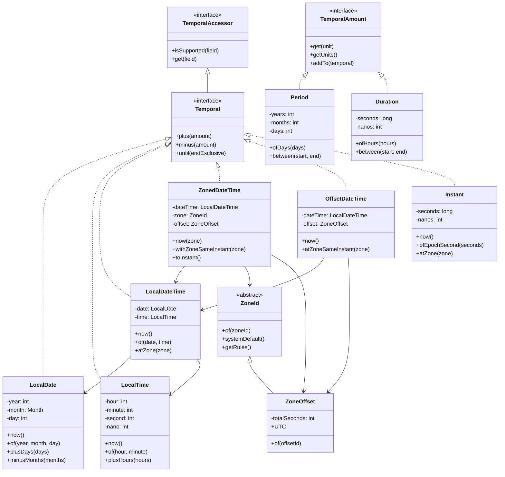
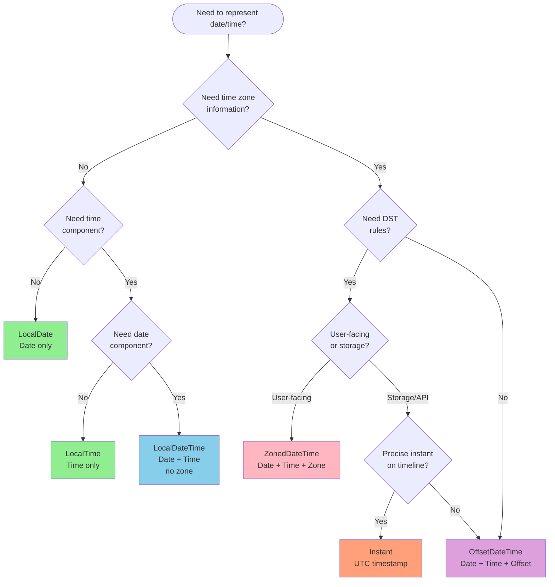
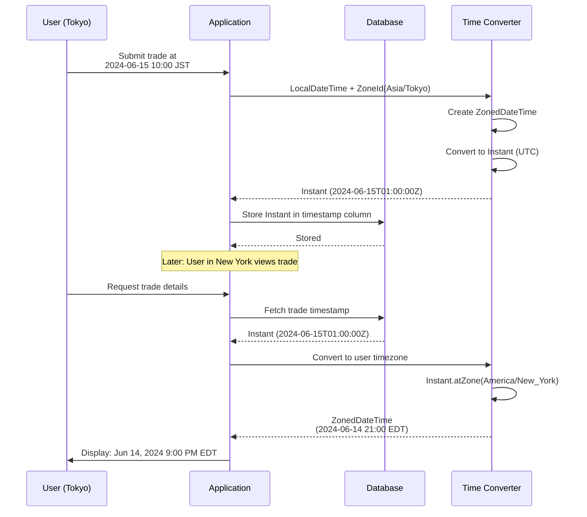
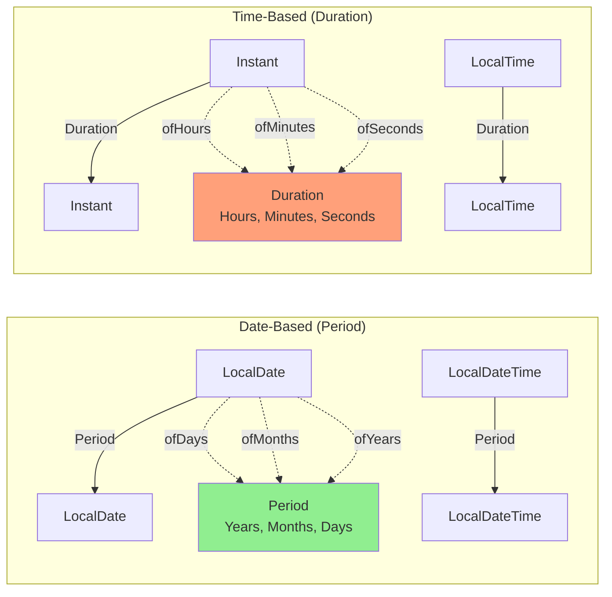
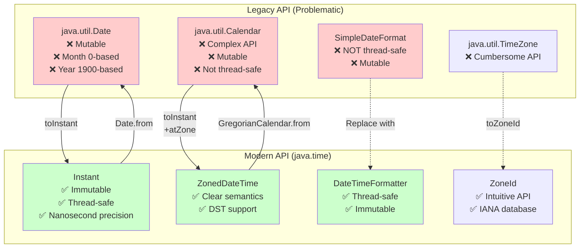

# Java Date and Time API - Complete Interview Guide

## Overview

The Java Date and Time API (`java.time` package), introduced in Java 8 as part of JSR-310, represents a complete redesign of how Java handles dates, times, and time zones. This modern API replaced the notoriously problematic legacy `java.util.Date` and `java.util.Calendar` classes with an immutable, thread-safe, and intuitive design inspired by the Joda-Time library.

**Why This Matters in Interviews**: Date and time handling is ubiquitous in enterprise applications, especially in banking and financial services where accurate timestamp management, time zone handling, and temporal calculations are critical for trade settlement, transaction processing, regulatory reporting, and audit trails. Interviewers assess your understanding of the modern API, your ability to handle time zones correctly, and your awareness of the pitfalls in legacy date/time handling.

**Real-World Relevance in Enterprise Banking**: In banking systems, you'll encounter scenarios like calculating bond maturity dates, handling trades across multiple time zones, scheduling batch jobs with precise timing, implementing SLA calculations, managing temporal data for regulatory compliance (GDPR's "right to be forgotten" with time-based expiry), and reconciling transactions that occurred in different geographical regions. The `java.time` API provides the robust foundation needed for these mission-critical operations.

## Foundational Concepts

### What is JSR-310?

JSR-310 (Java Specification Request 310) is the specification that introduced the modern Date-Time API in Java 8. It was led by Stephen Colebourne (creator of Joda-Time) and addressed fundamental issues with the legacy date/time classes:

- **Immutability**: All `java.time` classes are immutable and thread-safe
- **Clarity**: Clear separation between human time (dates, times) and machine time (timestamps)
- **Timezone awareness**: First-class support for time zones and offsets
- **Fluent API**: Method chaining with intuitive naming
- **ISO-8601 standard**: Based on international calendar system

### Human Time vs Machine Time

The API distinguishes between two perspectives:

**Human Time** (Local perspective):
- How humans read calendars and clocks
- `LocalDate`, `LocalTime`, `LocalDateTime`
- No time zone or offset information
- Example: "Meeting at 2 PM on June 15, 2024"

**Machine Time** (Timeline perspective):
- Precise instant on the global timeline
- `Instant` - nanoseconds since Unix epoch (1970-01-01T00:00:00Z)
- Used for timestamps, event logging, durations
- Example: "Transaction occurred at 1718467200 epoch seconds"

### Time Zones vs Offsets

**Time Zone** (`ZoneId`):
- Named region with daylight saving time rules
- Examples: "America/New_York", "Europe/London", "Asia/Tokyo"
- Rules change over time (governments modify DST rules)
- Use for user-facing dates/times

**Offset** (`ZoneOffset`):
- Fixed offset from UTC (e.g., +05:30, -04:00)
- No DST rules, just a time difference
- Use for storage, APIs, or when rules don't matter

### Common Misconceptions

1. **Misconception**: `LocalDateTime` includes time zone information
   - **Reality**: Local classes have NO time zone or offset; they represent a date/time in isolation

2. **Misconception**: `Instant` is the same as `LocalDateTime`
   - **Reality**: `Instant` is a point on the UTC timeline; `LocalDateTime` is a calendar date and wall-clock time

3. **Misconception**: You can always convert between `LocalDateTime` and `Instant` directly
   - **Reality**: You need a time zone context to convert between them

4. **Misconception**: Time zones never change
   - **Reality**: Governments frequently change DST rules and time zone offsets; always use timezone database updates

## Technical Deep Dive

### Core Date/Time Classes

#### 1. LocalDate - Date Without Time

Represents a date without time or time zone (year-month-day).

```java
// Creating LocalDate instances
LocalDate today = LocalDate.now(); // 2024-06-15
LocalDate specific = LocalDate.of(2024, 6, 15);
LocalDate fromString = LocalDate.parse("2024-06-15");

// Date arithmetic
LocalDate nextWeek = today.plusWeeks(1);
LocalDate lastMonth = today.minusMonths(1);
LocalDate firstDayOfMonth = today.withDayOfMonth(1);

// Querying
int year = today.getYear();
Month month = today.getMonth(); // Enum
int dayOfMonth = today.getDayOfMonth();
DayOfWeek dayOfWeek = today.getDayOfWeek(); // Enum
boolean isLeapYear = today.isLeapYear();

// Comparison
boolean isBefore = today.isBefore(nextWeek);
boolean isAfter = today.isAfter(lastMonth);
```

**Use Cases**:
- Birth dates, contract maturity dates
- Business date calculations (excluding weekends/holidays)
- Date-based reporting without time considerations

#### 2. LocalTime - Time Without Date

Represents a time without date or time zone (hour-minute-second-nanosecond).

```java
// Creating LocalTime instances
LocalTime now = LocalTime.now(); // 14:30:45.123456789
LocalTime specific = LocalTime.of(14, 30, 45);
LocalTime withNanos = LocalTime.of(14, 30, 45, 123_456_789);
LocalTime fromString = LocalTime.parse("14:30:45");

// Time arithmetic
LocalTime twoHoursLater = now.plusHours(2);
LocalTime thirtyMinutesEarlier = now.minusMinutes(30);

// Querying
int hour = now.getHour(); // 24-hour format
int minute = now.getMinute();
int second = now.getSecond();
int nano = now.getNano();

// Comparison
boolean isMorning = now.isBefore(LocalTime.NOON);
```

**Use Cases**:
- Business hours validation
- Scheduling without date dependency
- Time-of-day based logic (batch job schedules)

#### 3. LocalDateTime - Date and Time Without Zone

Combines `LocalDate` and `LocalTime` - still no time zone.

```java
// Creating LocalDateTime instances
LocalDateTime now = LocalDateTime.now();
LocalDateTime specific = LocalDateTime.of(2024, 6, 15, 14, 30, 45);
LocalDateTime fromDateAndTime = LocalDateTime.of(
    LocalDate.of(2024, 6, 15),
    LocalTime.of(14, 30)
);
LocalDateTime fromString = LocalDateTime.parse("2024-06-15T14:30:45");

// Conversion
LocalDate date = now.toLocalDate();
LocalTime time = now.toLocalTime();

// Arithmetic (combines both date and time operations)
LocalDateTime tomorrow = now.plusDays(1);
LocalDateTime threeHoursLater = now.plusHours(3);

// Formatting
String formatted = now.format(DateTimeFormatter.ISO_LOCAL_DATE_TIME);
// "2024-06-15T14:30:45"
```

**Use Cases**:
- Database timestamps (when stored in application timezone)
- Internal application logic before timezone conversion
- User input (before applying timezone)

#### 4. ZonedDateTime - Date, Time, and Time Zone

The most complete representation: date + time + time zone with DST rules.

```java
// Creating ZonedDateTime instances
ZonedDateTime nowInNewYork = ZonedDateTime.now(
    ZoneId.of("America/New_York")
);

ZonedDateTime specific = ZonedDateTime.of(
    LocalDateTime.of(2024, 6, 15, 14, 30),
    ZoneId.of("America/New_York")
);

// Converting between time zones
ZonedDateTime inTokyo = nowInNewYork.withZoneSameInstant(
    ZoneId.of("Asia/Tokyo")
);
// Same instant, different local time

ZonedDateTime sameLocalTimeInTokyo = nowInNewYork.withZoneSameLocal(
    ZoneId.of("Asia/Tokyo")
);
// Same local time, different instant

// Getting components
ZoneId zone = nowInNewYork.getZone();
ZoneOffset offset = nowInNewYork.getOffset(); // Current offset (e.g., -04:00)

// Converting to other types
Instant instant = nowInNewYork.toInstant();
LocalDateTime local = nowInNewYork.toLocalDateTime();
OffsetDateTime offsetDateTime = nowInNewYork.toOffsetDateTime();
```

**Use Cases**:
- Multi-timezone applications
- Displaying times to users in their local timezone
- Scheduling across time zones
- Trade settlement times in global markets

#### 5. OffsetDateTime - Date, Time, and Fixed Offset

Like `ZonedDateTime` but with a fixed offset instead of timezone rules.

```java
// Creating OffsetDateTime instances
OffsetDateTime now = OffsetDateTime.now();
OffsetDateTime specific = OffsetDateTime.of(
    LocalDateTime.of(2024, 6, 15, 14, 30),
    ZoneOffset.ofHours(-4)
);

// Parse ISO-8601 with offset
OffsetDateTime parsed = OffsetDateTime.parse("2024-06-15T14:30:45-04:00");

// Converting
ZonedDateTime zoned = now.atZoneSameInstant(ZoneId.of("America/New_York"));
Instant instant = now.toInstant();
```

**Use Cases**:
- RESTful API responses (ISO-8601 format with offset)
- Database storage (when you want to preserve original offset)
- Inter-system communication where timezone rules are unknown

#### 6. Instant - Point on Timeline

Represents a nanosecond-precise instant on the UTC timeline (machine time).

```java
// Creating Instant instances
Instant now = Instant.now();
Instant epoch = Instant.ofEpochSecond(0); // 1970-01-01T00:00:00Z
Instant fromMillis = Instant.ofEpochMilli(System.currentTimeMillis());
Instant parsed = Instant.parse("2024-06-15T14:30:45.123Z");

// Arithmetic (only with Duration, not Period)
Instant tenSecondsLater = now.plusSeconds(10);
Instant oneHourEarlier = now.minus(Duration.ofHours(1));

// Getting epoch values
long epochSecond = now.getEpochSecond();
long epochMilli = now.toEpochMilli();

// Converting to ZonedDateTime (requires timezone)
ZonedDateTime zoned = now.atZone(ZoneId.of("America/New_York"));

// Comparison
boolean isBefore = now.isBefore(tenSecondsLater);
```

**Use Cases**:
- Event timestamps in distributed systems
- Database audit fields (created_at, updated_at)
- Performance measurements
- Kafka message timestamps
- Transaction timestamps in banking

#### 7. Period - Date-Based Amount

Represents a date-based amount of time (years, months, days).

```java
// Creating Period instances
Period tenDays = Period.ofDays(10);
Period threeMonths = Period.ofMonths(3);
Period oneYear = Period.ofYears(1);
Period complex = Period.of(1, 6, 15); // 1 year, 6 months, 15 days

// Parsing ISO-8601 period format
Period parsed = Period.parse("P1Y6M15D"); // 1 year, 6 months, 15 days

// Using with LocalDate
LocalDate today = LocalDate.now();
LocalDate future = today.plus(tenDays);
LocalDate past = today.minus(threeMonths);

// Calculating period between dates
Period age = Period.between(
    LocalDate.of(1990, 5, 15),
    LocalDate.now()
);
int years = age.getYears();

// Note: Period doesn't work with LocalTime or Instant
```

**Use Cases**:
- Age calculations
- Contract duration (loan terms, subscription periods)
- Date-based SLA calculations
- Maturity date calculations for bonds

#### 8. Duration - Time-Based Amount

Represents a time-based amount (hours, minutes, seconds, nanoseconds).

```java
// Creating Duration instances
Duration fiveMinutes = Duration.ofMinutes(5);
Duration twoHours = Duration.ofHours(2);
Duration thirtySeconds = Duration.ofSeconds(30);
Duration withNanos = Duration.ofSeconds(1, 500_000_000); // 1.5 seconds

// Parsing ISO-8601 duration format
Duration parsed = Duration.parse("PT2H30M"); // 2 hours 30 minutes

// Using with time-based types
Instant now = Instant.now();
Instant later = now.plus(fiveMinutes);

LocalTime time = LocalTime.now();
LocalTime futureTime = time.plus(twoHours);

// Calculating duration between instants
Instant start = Instant.now();
// ... some operation ...
Instant end = Instant.now();
Duration elapsed = Duration.between(start, end);

long millis = elapsed.toMillis();
long seconds = elapsed.getSeconds();

// Note: Duration works with Instant, LocalTime, LocalDateTime, ZonedDateTime
```

**Use Cases**:
- Performance monitoring
- Time-based SLA tracking
- Elapsed time calculations
- Timeout implementations
- Trade execution time measurements

### Time Zone Handling

#### ZoneId - Time Zone with Rules

```java
// Getting available zone IDs
Set<String> allZones = ZoneId.getAvailableZoneIds();
// Over 600 time zones

// Creating ZoneId
ZoneId newYork = ZoneId.of("America/New_York");
ZoneId tokyo = ZoneId.of("Asia/Tokyo");
ZoneId systemDefault = ZoneId.systemDefault();

// Short IDs (not recommended for production)
ZoneId est = ZoneId.of("EST", ZoneId.SHORT_IDS);

// Getting zone rules
ZoneRules rules = newYork.getRules();
boolean isDST = rules.isDaylightSavings(Instant.now());
ZoneOffset currentOffset = rules.getOffset(Instant.now());

// Getting offset at specific instant
ZoneOffset winterOffset = newYork.getRules().getOffset(
    Instant.parse("2024-01-15T12:00:00Z")
); // -05:00 (EST)

ZoneOffset summerOffset = newYork.getRules().getOffset(
    Instant.parse("2024-07-15T12:00:00Z")
); // -04:00 (EDT)
```

#### ZoneOffset - Fixed Offset from UTC

```java
// Creating ZoneOffset
ZoneOffset utc = ZoneOffset.UTC; // +00:00
ZoneOffset plusFiveThirty = ZoneOffset.of("+05:30"); // India
ZoneOffset minusFour = ZoneOffset.ofHours(-4); // EDT
ZoneOffset detailed = ZoneOffset.ofHoursMinutes(5, 30);

// Using with OffsetDateTime
OffsetDateTime odt = OffsetDateTime.of(
    LocalDateTime.now(),
    ZoneOffset.ofHours(-4)
);

// Converting ZonedDateTime to OffsetDateTime
ZonedDateTime zdt = ZonedDateTime.now(ZoneId.of("America/New_York"));
OffsetDateTime fromZoned = zdt.toOffsetDateTime();
ZoneOffset offset = fromZoned.getOffset(); // Current offset
```

#### Time Zone Best Practices in Enterprise Applications

```java
/**
 * Enterprise pattern: Store in UTC, display in user timezone
 */
public class TradeService {

    // Store trade execution time as Instant (UTC)
    public void executeTrade(Trade trade) {
        Instant executionTime = Instant.now();
        trade.setExecutedAt(executionTime);
        // Save to database
    }

    // Display to user in their timezone
    public String getExecutionTimeForUser(Trade trade, String userTimezone) {
        Instant executedAt = trade.getExecutedAt();
        ZoneId userZone = ZoneId.of(userTimezone);

        ZonedDateTime userTime = executedAt.atZone(userZone);

        return userTime.format(
            DateTimeFormatter.ofPattern("yyyy-MM-dd HH:mm:ss z")
        );
    }

    // Calculate if trade executed during market hours (New York time)
    public boolean executedDuringMarketHours(Instant executionTime) {
        ZonedDateTime nyTime = executionTime.atZone(
            ZoneId.of("America/New_York")
        );

        LocalTime time = nyTime.toLocalTime();

        LocalTime marketOpen = LocalTime.of(9, 30);
        LocalTime marketClose = LocalTime.of(16, 0);

        return !time.isBefore(marketOpen) && !time.isAfter(marketClose);
    }
}
```

### Formatting and Parsing

#### DateTimeFormatter

```java
// Predefined formatters
DateTimeFormatter isoDateTime = DateTimeFormatter.ISO_DATE_TIME;
// 2024-06-15T14:30:45

DateTimeFormatter isoDate = DateTimeFormatter.ISO_DATE;
// 2024-06-15

// Custom patterns
DateTimeFormatter custom = DateTimeFormatter.ofPattern("dd/MM/yyyy HH:mm:ss");
DateTimeFormatter usFormat = DateTimeFormatter.ofPattern("MM/dd/yyyy");

// With locale
DateTimeFormatter localized = DateTimeFormatter.ofPattern(
    "dd MMMM yyyy",
    Locale.US
);

// Formatting
LocalDateTime now = LocalDateTime.now();
String formatted = now.format(custom);
// "15/06/2024 14:30:45"

// Parsing
LocalDate date = LocalDate.parse("15/06/2024",
    DateTimeFormatter.ofPattern("dd/MM/yyyy")
);

// Thread-safe and reusable (unlike SimpleDateFormat)
public class DateFormatters {
    public static final DateTimeFormatter ISO_TIMESTAMP =
        DateTimeFormatter.ofPattern("yyyy-MM-dd'T'HH:mm:ss.SSSXXX");

    public static final DateTimeFormatter BUSINESS_DATE =
        DateTimeFormatter.ofPattern("dd-MMM-yyyy");
}

// Pattern symbols
// y = year
// M = month (MM = 02, MMM = Jun, MMMM = June)
// d = day
// H = hour (24-hour)
// h = hour (12-hour)
// m = minute
// s = second
// S = fraction of second
// a = AM/PM
// z = timezone name
// Z = timezone offset
// X = ISO timezone offset
```

#### Handling Parse Errors

```java
public Optional<LocalDate> parseDate(String dateStr, String pattern) {
    try {
        DateTimeFormatter formatter = DateTimeFormatter.ofPattern(pattern);
        return Optional.of(LocalDate.parse(dateStr, formatter));
    } catch (DateTimeParseException e) {
        log.error("Failed to parse date: {}", dateStr, e);
        return Optional.empty();
    }
}

// Lenient parsing (accept invalid dates like Feb 30)
DateTimeFormatter lenient = DateTimeFormatter.ofPattern("dd/MM/yyyy")
    .withResolverStyle(ResolverStyle.LENIENT);

// Strict parsing (default, reject invalid dates)
DateTimeFormatter strict = DateTimeFormatter.ofPattern("dd/MM/yyyy")
    .withResolverStyle(ResolverStyle.STRICT);
```

### Legacy Date/Time API

#### Problems with java.util.Date and Calendar

```java
// 1. MUTABLE - Thread-unsafe
Date date = new Date();
date.setTime(System.currentTimeMillis()); // Can be modified!

// 2. CONFUSING API
Date d = new Date(2024, 6, 15); // Actually represents July 15, 3924!
// Year is 1900-based, month is 0-based

Calendar cal = Calendar.getInstance();
cal.set(2024, Calendar.JUNE, 15); // Have to use constant for month

// 3. POOR TIMEZONE SUPPORT
// TimeZone class is separate and cumbersome
TimeZone tz = TimeZone.getTimeZone("America/New_York");
cal.setTimeZone(tz);

// 4. INCONSISTENT DESIGN
// Date has time despite name
// Calendar is complex and unintuitive

// 5. NOT THREAD-SAFE
SimpleDateFormat sdf = new SimpleDateFormat("yyyy-MM-dd");
// MUST synchronize or use ThreadLocal in multi-threaded code
```

#### Converting Between Old and New APIs

```java
// Old to New conversions

// Date -> Instant
Date legacyDate = new Date();
Instant instant = legacyDate.toInstant();

// Instant -> Date
Instant instant = Instant.now();
Date date = Date.from(instant);

// Calendar -> ZonedDateTime
Calendar calendar = Calendar.getInstance();
ZonedDateTime zdt = calendar.toInstant()
    .atZone(calendar.getTimeZone().toZoneId());

// ZonedDateTime -> Calendar
ZonedDateTime zdt = ZonedDateTime.now();
Calendar calendar = GregorianCalendar.from(zdt);

// TimeZone -> ZoneId
TimeZone tz = TimeZone.getTimeZone("America/New_York");
ZoneId zoneId = tz.toZoneId();

// ZoneId -> TimeZone
ZoneId zoneId = ZoneId.of("America/New_York");
TimeZone tz = TimeZone.getTimeZone(zoneId);
```

#### Migration Strategy for Enterprise Applications

```java
/**
 * Adapter pattern for gradual migration
 */
public class DateTimeAdapter {

    // For database layers still using java.sql.Timestamp
    public static Instant fromTimestamp(Timestamp timestamp) {
        return timestamp.toInstant();
    }

    public static Timestamp toTimestamp(Instant instant) {
        return Timestamp.from(instant);
    }

    // For legacy APIs returning Date
    public static LocalDateTime fromLegacyDate(Date date, ZoneId zone) {
        return date.toInstant()
            .atZone(zone)
            .toLocalDateTime();
    }

    public static Date toLegacyDate(LocalDateTime ldt, ZoneId zone) {
        return Date.from(ldt.atZone(zone).toInstant());
    }
}

// JPA 2.2+ supports java.time directly
@Entity
public class Trade {
    @Id
    private Long id;

    // Old way (still supported)
    @Temporal(TemporalType.TIMESTAMP)
    private Date createdDate;

    // New way (JPA 2.2+)
    private Instant executedAt;
    private LocalDate settlementDate;
}
```

## Visual Representations

### 1. Java Date/Time Class Hierarchy



### 2. Date/Time Type Selection Decision Tree



### 3. Time Zone Conversion Flow



### 4. Period vs Duration Usage



### 5. Legacy vs Modern API Migration



## Code Examples

### Example 1: Trade Settlement Date Calculation

```java
/**
 * Calculate settlement date for trades, accounting for weekends and holidays.
 * Enterprise banking scenario: T+2 settlement (trade date + 2 business days)
 */
public class SettlementDateCalculator {

    private final Set<LocalDate> holidays;

    public SettlementDateCalculator(Set<LocalDate> holidays) {
        this.holidays = holidays;
    }

    /**
     * Calculate T+N settlement date
     * @param tradeDate Date when trade was executed
     * @param businessDays Number of business days to add (e.g., 2 for T+2)
     * @return Settlement date
     */
    public LocalDate calculateSettlementDate(LocalDate tradeDate, int businessDays) {
        LocalDate current = tradeDate;
        int daysAdded = 0;

        while (daysAdded < businessDays) {
            current = current.plusDays(1);

            // Skip weekends and holidays
            if (!isWeekend(current) && !isHoliday(current)) {
                daysAdded++;
            }
        }

        return current;
    }

    private boolean isWeekend(LocalDate date) {
        DayOfWeek day = date.getDayOfWeek();
        return day == DayOfWeek.SATURDAY || day == DayOfWeek.SUNDAY;
    }

    private boolean isHoliday(LocalDate date) {
        return holidays.contains(date);
    }

    /**
     * Check if markets are closed on given date
     */
    public boolean isBusinessDay(LocalDate date) {
        return !isWeekend(date) && !isHoliday(date);
    }

    /**
     * Calculate number of business days between two dates
     */
    public long countBusinessDays(LocalDate start, LocalDate end) {
        return start.datesUntil(end.plusDays(1))
            .filter(this::isBusinessDay)
            .count();
    }
}

// Usage
Set<LocalDate> usHolidays = Set.of(
    LocalDate.of(2024, 7, 4),   // Independence Day
    LocalDate.of(2024, 12, 25)  // Christmas
);

SettlementDateCalculator calculator = new SettlementDateCalculator(usHolidays);

LocalDate tradeDate = LocalDate.of(2024, 7, 3); // Wednesday
LocalDate settlementDate = calculator.calculateSettlementDate(tradeDate, 2);
// Result: 2024-07-08 (Monday) - skips July 4, weekend
```

### Example 2: Global Trade Time Coordination

```java
/**
 * Handle trades executed across multiple time zones
 * Scenario: New York trader executes trade, Tokyo back office processes it
 */
public class GlobalTradeService {

    public static class Trade {
        private final String tradeId;
        private final Instant executionTime;  // Always store in UTC
        private final String executionVenue;

        public Trade(String tradeId, Instant executionTime, String executionVenue) {
            this.tradeId = tradeId;
            this.executionTime = executionTime;
            this.executionVenue = executionVenue;
        }

        // Convert to venue local time for display
        public ZonedDateTime getVenueLocalTime() {
            ZoneId venueZone = getVenueTimeZone(executionVenue);
            return executionTime.atZone(venueZone);
        }

        // Check if executed during local market hours
        public boolean isDuringMarketHours() {
            ZonedDateTime venueTime = getVenueLocalTime();
            LocalTime executionTime = venueTime.toLocalTime();

            return switch (executionVenue) {
                case "NYSE" ->
                    !executionTime.isBefore(LocalTime.of(9, 30)) &&
                    !executionTime.isAfter(LocalTime.of(16, 0));
                case "TSE" -> // Tokyo Stock Exchange
                    !executionTime.isBefore(LocalTime.of(9, 0)) &&
                    !executionTime.isAfter(LocalTime.of(15, 0));
                case "LSE" -> // London Stock Exchange
                    !executionTime.isBefore(LocalTime.of(8, 0)) &&
                    !executionTime.isAfter(LocalTime.of(16, 30));
                default -> false;
            };
        }

        private ZoneId getVenueTimeZone(String venue) {
            return switch (venue) {
                case "NYSE" -> ZoneId.of("America/New_York");
                case "TSE" -> ZoneId.of("Asia/Tokyo");
                case "LSE" -> ZoneId.of("Europe/London");
                default -> ZoneId.of("UTC");
            };
        }

        public Instant getExecutionTime() {
            return executionTime;
        }
    }

    /**
     * Format trade time for different regional reports
     */
    public String formatForRegionalReport(Trade trade, String region) {
        ZoneId reportZone = switch (region) {
            case "APAC" -> ZoneId.of("Asia/Singapore");
            case "EMEA" -> ZoneId.of("Europe/London");
            case "AMERICAS" -> ZoneId.of("America/New_York");
            default -> ZoneId.of("UTC");
        };

        ZonedDateTime regionalTime = trade.getExecutionTime().atZone(reportZone);

        DateTimeFormatter formatter = DateTimeFormatter.ofPattern(
            "dd-MMM-yyyy HH:mm:ss z"
        );

        return regionalTime.format(formatter);
    }

    /**
     * Calculate if trade confirmation is late
     * Rule: Must be confirmed within 15 minutes of execution
     */
    public boolean isLateConfirmation(Instant executionTime, Instant confirmationTime) {
        Duration elapsed = Duration.between(executionTime, confirmationTime);
        Duration threshold = Duration.ofMinutes(15);

        return elapsed.compareTo(threshold) > 0;
    }
}
```

### Example 3: SLA Monitoring with Duration

```java
/**
 * Service Level Agreement monitoring for payment processing
 * SLA: 95% of payments processed within 30 seconds
 */
public class SLAMonitor {

    private final ConcurrentHashMap<String, PaymentMetrics> metrics =
        new ConcurrentHashMap<>();

    public static class PaymentMetrics {
        private final Instant startTime;
        private Instant endTime;
        private Duration processingTime;

        public PaymentMetrics(Instant startTime) {
            this.startTime = startTime;
        }

        public void complete() {
            this.endTime = Instant.now();
            this.processingTime = Duration.between(startTime, endTime);
        }

        public boolean withinSLA() {
            return processingTime.compareTo(Duration.ofSeconds(30)) <= 0;
        }

        public long getProcessingMillis() {
            return processingTime.toMillis();
        }
    }

    public void startPayment(String paymentId) {
        metrics.put(paymentId, new PaymentMetrics(Instant.now()));
    }

    public void completePayment(String paymentId) {
        PaymentMetrics metric = metrics.get(paymentId);
        if (metric != null) {
            metric.complete();

            if (!metric.withinSLA()) {
                logSLAViolation(paymentId, metric);
            }
        }
    }

    private void logSLAViolation(String paymentId, PaymentMetrics metric) {
        log.warn("SLA violated for payment {}: {} ms (threshold: 30000 ms)",
            paymentId, metric.getProcessingMillis());
    }

    /**
     * Calculate SLA compliance percentage for reporting period
     */
    public double calculateSLACompliance(LocalDate reportDate) {
        // Filter payments from report date
        List<PaymentMetrics> dayMetrics = metrics.values().stream()
            .filter(m -> m.startTime.atZone(ZoneId.systemDefault())
                .toLocalDate().equals(reportDate))
            .toList();

        if (dayMetrics.isEmpty()) {
            return 100.0;
        }

        long withinSLA = dayMetrics.stream()
            .filter(PaymentMetrics::withinSLA)
            .count();

        return (withinSLA * 100.0) / dayMetrics.size();
    }

    /**
     * Get average processing time for analysis
     */
    public Duration getAverageProcessingTime(LocalDate date) {
        List<PaymentMetrics> dayMetrics = metrics.values().stream()
            .filter(m -> m.startTime.atZone(ZoneId.systemDefault())
                .toLocalDate().equals(date))
            .toList();

        if (dayMetrics.isEmpty()) {
            return Duration.ZERO;
        }

        long totalMillis = dayMetrics.stream()
            .mapToLong(PaymentMetrics::getProcessingMillis)
            .sum();

        return Duration.ofMillis(totalMillis / dayMetrics.size());
    }
}
```

### Example 4: Time Zone-Aware Scheduling

```java
/**
 * Schedule batch jobs across different time zones
 * Requirement: Run report generation at 2 AM local time for each region
 */
public class BatchScheduler {

    public static class ScheduledJob {
        private final String jobName;
        private final LocalTime scheduledTime;
        private final ZoneId timezone;

        public ScheduledJob(String jobName, LocalTime scheduledTime, ZoneId timezone) {
            this.jobName = jobName;
            this.scheduledTime = scheduledTime;
            this.timezone = timezone;
        }

        /**
         * Get next execution time as Instant
         */
        public Instant getNextExecutionInstant() {
            ZonedDateTime now = ZonedDateTime.now(timezone);

            ZonedDateTime scheduledToday = now.toLocalDate()
                .atTime(scheduledTime)
                .atZone(timezone);

            // If time has passed today, schedule for tomorrow
            if (now.isAfter(scheduledToday)) {
                scheduledToday = scheduledToday.plusDays(1);
            }

            return scheduledToday.toInstant();
        }

        /**
         * Calculate delay until next execution
         */
        public Duration getDelayUntilNextExecution() {
            Instant next = getNextExecutionInstant();
            return Duration.between(Instant.now(), next);
        }

        /**
         * Check if should execute now (within 1-minute window)
         */
        public boolean shouldExecuteNow() {
            ZonedDateTime now = ZonedDateTime.now(timezone);
            LocalTime currentTime = now.toLocalTime();

            // Check if within 1 minute of scheduled time
            Duration diff = Duration.between(currentTime, scheduledTime).abs();
            return diff.compareTo(Duration.ofMinutes(1)) <= 0;
        }
    }

    /**
     * Schedule regional reports
     */
    public List<ScheduledJob> scheduleRegionalReports() {
        LocalTime reportTime = LocalTime.of(2, 0); // 2 AM local time

        return List.of(
            new ScheduledJob("APAC_Report", reportTime, ZoneId.of("Asia/Singapore")),
            new ScheduledJob("EMEA_Report", reportTime, ZoneId.of("Europe/London")),
            new ScheduledJob("AMER_Report", reportTime, ZoneId.of("America/New_York"))
        );
    }

    /**
     * Display next execution time in UTC and local time
     */
    public void displaySchedule(ScheduledJob job) {
        Instant nextExecution = job.getNextExecutionInstant();

        ZonedDateTime utc = nextExecution.atZone(ZoneId.of("UTC"));
        ZonedDateTime local = nextExecution.atZone(job.timezone);

        System.out.printf("%s will execute:%n", job.jobName);
        System.out.printf("  Local time: %s%n",
            local.format(DateTimeFormatter.RFC_1123_DATE_TIME));
        System.out.printf("  UTC time: %s%n",
            utc.format(DateTimeFormatter.RFC_1123_DATE_TIME));
        System.out.printf("  In: %s%n",
            formatDuration(job.getDelayUntilNextExecution()));
    }

    private String formatDuration(Duration duration) {
        long hours = duration.toHours();
        long minutes = duration.toMinutesPart();
        return String.format("%d hours, %d minutes", hours, minutes);
    }
}
```

### Example 5: Handling Daylight Saving Time

```java
/**
 * Demonstrate DST handling and edge cases
 */
public class DSTHandler {

    /**
     * Example: Spring forward (DST starts)
     * In US: 2 AM becomes 3 AM (2024-03-10)
     */
    public void demonstrateSpringForward() {
        ZoneId newYork = ZoneId.of("America/New_York");

        // Just before DST starts
        ZonedDateTime before = ZonedDateTime.of(
            LocalDateTime.of(2024, 3, 10, 1, 59),
            newYork
        );
        // Offset: -05:00 (EST)

        // One hour later
        ZonedDateTime after = before.plusHours(1);
        // Time: 2024-03-10T02:59-05:00 becomes 2024-03-10T03:59-04:00
        // Offset changed: -04:00 (EDT)

        System.out.println("Before: " + before); // 01:59 EST
        System.out.println("After:  " + after);  // 03:59 EDT (not 02:59!)

        // The 2:00-2:59 hour doesn't exist!
        // Java handles this gracefully
        ZonedDateTime during = ZonedDateTime.of(
            LocalDateTime.of(2024, 3, 10, 2, 30),
            newYork
        );
        System.out.println("During: " + during); // Becomes 03:30 EDT
    }

    /**
     * Example: Fall back (DST ends)
     * In US: 2 AM becomes 1 AM (2024-11-03)
     */
    public void demonstrateFallBack() {
        ZoneId newYork = ZoneId.of("America/New_York");

        // The 1:00-1:59 hour exists twice!

        // First occurrence (EDT, -04:00)
        ZonedDateTime first = ZonedDateTime.of(
            LocalDateTime.of(2024, 11, 3, 1, 30),
            newYork
        ).withEarlierOffsetAtOverlap();

        // Second occurrence (EST, -05:00)
        ZonedDateTime second = ZonedDateTime.of(
            LocalDateTime.of(2024, 11, 3, 1, 30),
            newYork
        ).withLaterOffsetAtOverlap();

        System.out.println("First:  " + first);  // 01:30 EDT (-04:00)
        System.out.println("Second: " + second); // 01:30 EST (-05:00)

        // They're different instants!
        Duration diff = Duration.between(first.toInstant(), second.toInstant());
        System.out.println("Difference: " + diff.toHours() + " hour");
    }

    /**
     * Safe approach: Always work with Instant for storage
     */
    public Instant scheduleTask(LocalDateTime userInput, ZoneId userZone) {
        try {
            ZonedDateTime zdt = userInput.atZone(userZone);
            return zdt.toInstant();
        } catch (DateTimeException e) {
            // Handle invalid time during DST transition
            log.error("Invalid time due to DST: {}", userInput, e);
            throw new IllegalArgumentException(
                "Time does not exist due to DST transition", e);
        }
    }

    /**
     * Check if a time zone has DST
     */
    public boolean hasDaylightSaving(ZoneId zoneId, Instant instant) {
        ZoneRules rules = zoneId.getRules();
        return rules.isDaylightSavings(instant);
    }
}
```

## Interview Questions & Model Answers

### Question 1: What are the main problems with java.util.Date and java.util.Calendar?

**Answer:**

The legacy `java.util.Date` and `Calendar` classes had several fundamental design flaws:

**1. Mutability and Thread-Safety Issues:**
- Both classes are mutable, making them inherently thread-unsafe
- In multi-threaded environments, you must synchronize access or use defensive copying
- `SimpleDateFormat` is also not thread-safe, requiring `ThreadLocal` or synchronization

**2. Poor API Design:**
- `Date` class name is misleading - it includes both date and time
- Month indexing is 0-based (0 = January), but day is 1-based - highly confusing
- Year is 1900-based for `Date` constructor (year 2024 = 124)
- `Calendar.set()` has unclear behavior with field overflow

**3. Time Zone Handling:**
- `Date` stores milliseconds from epoch but has confusing timezone-dependent `toString()`
- `TimeZone` class is cumbersome and separate from `Date`/`Calendar`
- DST transitions are error-prone

**4. Inconsistent Design:**
- Methods like `getYear()`, `getMonth()` deprecated without clear alternatives
- Multiple ways to do the same thing with different behavior
- `Calendar` is abstract with complex implementation hierarchy

**5. No Type Safety:**
- No distinction between date-only, time-only, or instant representations
- Easy to pass wrong type to methods expecting dates

The `java.time` API (JSR-310) addresses all these issues with immutability, clear semantics, thread-safety, and proper time zone handling.

### Question 2: Explain the difference between LocalDateTime, ZonedDateTime, and Instant. When would you use each?

**Answer:**

These three classes represent different perspectives of date/time:

**LocalDateTime:**
- Represents date and time without time zone or offset
- Think of it as "what a wall clock shows" - no geographical context
- Example: "Meeting at 2 PM on June 15, 2024" (but where?)
- **Use when:** User input before timezone is applied, intermediate calculations, database storage in application timezone
- **Cannot convert** to Instant without a timezone

**ZonedDateTime:**
- Represents date, time, time zone, AND the current offset
- Includes DST rules for the zone
- Example: "2024-06-15T14:00:00-04:00[America/New_York]"
- **Use when:** User-facing displays, scheduling across timezones, when DST rules matter
- **Can convert** to Instant and handles DST transitions

**Instant:**
- Represents a point on the UTC timeline (machine time)
- Nanosecond-precision count from Unix epoch (1970-01-01T00:00:00Z)
- No concept of timezone, date, or time - just a position on timeline
- **Use when:** Event timestamps, database audit fields, distributed system timestamps, performance measurements
- **Best for storage:** Independent of timezone changes

**Relationship Example:**
```java
// User in New York enters: "2024-06-15 14:00"
LocalDateTime local = LocalDateTime.of(2024, 6, 15, 14, 0);

// Convert to New York time
ZonedDateTime zoned = local.atZone(ZoneId.of("America/New_York"));
// 2024-06-15T14:00:00-04:00[America/New_York]

// Store as Instant (UTC)
Instant instant = zoned.toInstant();
// 2024-06-15T18:00:00Z (same moment, UTC)
```

**Rule of thumb:** Store `Instant`, display `ZonedDateTime`, intermediate work with `LocalDateTime`.

### Question 3: How do you handle Daylight Saving Time transitions correctly?

**Answer:**

DST transitions create two edge cases that must be handled:

**1. Spring Forward (Gap):**
When clocks move forward (e.g., 2 AM → 3 AM), a one-hour gap exists where times don't exist.

```java
ZoneId newYork = ZoneId.of("America/New_York");

// Trying to create time during the gap (2:30 AM on March 10, 2024)
ZonedDateTime result = ZonedDateTime.of(
    LocalDateTime.of(2024, 3, 10, 2, 30),
    newYork
);
// Result: 2024-03-10T03:30-04:00 (adjusted forward)
```

Java resolves this by shifting forward to the next valid time with the new offset.

**2. Fall Back (Overlap):**
When clocks move backward (e.g., 2 AM → 1 AM), a one-hour overlap exists where times occur twice.

```java
// First occurrence (before transition, EDT)
ZonedDateTime earlier = ZonedDateTime.of(
    LocalDateTime.of(2024, 11, 3, 1, 30),
    newYork
).withEarlierOffsetAtOverlap();

// Second occurrence (after transition, EST)
ZonedDateTime later = ZonedDateTime.of(
    LocalDateTime.of(2024, 11, 3, 1, 30),
    newYork
).withLaterOffsetAtOverlap();
```

**Best Practices:**

1. **Always store Instant in database:**
```java
// Store
Instant timestamp = ZonedDateTime.now(userZone).toInstant();

// Retrieve and display
ZonedDateTime userTime = timestamp.atZone(userZone);
```

2. **Use ZonedDateTime for calculations across DST:**
```java
// This handles DST correctly
ZonedDateTime future = ZonedDateTime.now(newYork).plusDays(180);
```

3. **Avoid LocalDateTime arithmetic near DST boundaries:**
```java
// BAD: Duration could be wrong near DST
LocalDateTime start = ...;
LocalDateTime end = start.plusHours(24); // Might be 23 or 25 actual hours!

// GOOD: Use ZonedDateTime
ZonedDateTime start = ...;
ZonedDateTime end = start.plusHours(24); // Always 24 actual hours
```

4. **Check for DST:**
```java
ZoneRules rules = zoneId.getRules();
boolean isDST = rules.isDaylightSavings(instant);
```

### Question 4: Explain Period vs Duration. Why can't you use Period with Instant?

**Answer:**

`Period` and `Duration` represent different types of time amounts:

**Period (Date-based):**
- Represents years, months, days
- Date-based and calendar-aware
- Example: "3 months and 5 days"
- Works with `LocalDate`, `LocalDateTime`, `ZonedDateTime`

**Duration (Time-based):**
- Represents hours, minutes, seconds, nanoseconds
- Exact time amount, not calendar-aware
- Example: "2 hours and 30 minutes"
- Works with `Instant`, `LocalTime`, `LocalDateTime`, `ZonedDateTime`

**Why Period doesn't work with Instant:**

`Instant` represents a precise point on the timeline - just a count of nanoseconds from epoch. It has no concept of dates, calendars, or months.

A `Period` like "1 month" is ambiguous on a timeline:
- Is it 28, 29, 30, or 31 days?
- Depends on which month, which year (leap years)

```java
// This doesn't compile - Period needs calendar context
Instant now = Instant.now();
Instant later = now.plus(Period.ofMonths(1)); // COMPILATION ERROR

// Duration works because it's exact
Instant later = now.plus(Duration.ofHours(24)); // OK - exactly 86400 seconds
```

**Correct usage:**

```java
// Period with date-based types
LocalDate today = LocalDate.now();
LocalDate future = today.plus(Period.ofMonths(3)); // 3 calendar months

// Period between dates
LocalDate birth = LocalDate.of(1990, 5, 15);
Period age = Period.between(birth, LocalDate.now());
System.out.printf("%d years, %d months, %d days",
    age.getYears(), age.getMonths(), age.getDays());

// Duration with time-based types
Instant start = Instant.now();
// ... operation ...
Instant end = Instant.now();
Duration elapsed = Duration.between(start, end);
System.out.printf("Took %d ms", elapsed.toMillis());
```

**When you need both:**
```java
// Calculate exact hours between dates (considering DST)
ZonedDateTime start = ZonedDateTime.of(
    LocalDateTime.of(2024, 3, 10, 1, 0),
    ZoneId.of("America/New_York")
);
ZonedDateTime end = start.plusDays(1); // Crosses DST boundary

Duration duration = Duration.between(start, end);
long hours = duration.toHours(); // 23 hours, not 24 (DST spring forward)
```

### Question 5: How do you convert between legacy java.util.Date and java.time classes?

**Answer:**

Java provides bidirectional conversion methods:

**1. Date ↔ Instant:**
```java
// Old to new
Date legacyDate = new Date();
Instant instant = legacyDate.toInstant();

// New to old
Instant instant = Instant.now();
Date date = Date.from(instant);
```

**2. Calendar ↔ ZonedDateTime:**
```java
// Old to new
Calendar calendar = Calendar.getInstance();
ZonedDateTime zdt = calendar.toInstant()
    .atZone(calendar.getTimeZone().toZoneId());

// New to old
ZonedDateTime zdt = ZonedDateTime.now();
Calendar calendar = GregorianCalendar.from(zdt);
```

**3. TimeZone ↔ ZoneId:**
```java
// Old to new
TimeZone tz = TimeZone.getTimeZone("America/New_York");
ZoneId zoneId = tz.toZoneId();

// New to old
ZoneId zoneId = ZoneId.of("America/New_York");
TimeZone tz = TimeZone.getTimeZone(zoneId);
```

**4. SQL Types:**
```java
// java.sql.Timestamp ↔ Instant
Timestamp timestamp = Timestamp.from(Instant.now());
Instant instant = timestamp.toInstant();

// java.sql.Date ↔ LocalDate
java.sql.Date sqlDate = java.sql.Date.valueOf(LocalDate.now());
LocalDate localDate = sqlDate.toLocalDate();

// java.sql.Time ↔ LocalTime
java.sql.Time sqlTime = java.sql.Time.valueOf(LocalTime.now());
LocalTime localTime = sqlTime.toLocalTime();
```

**Migration pattern in Spring Boot:**
```java
@Entity
public class AuditEntity {

    // Legacy field (keep for backward compatibility)
    @Column(name = "created_date")
    @Temporal(TemporalType.TIMESTAMP)
    private Date createdDate;

    // New field (preferred)
    @Column(name = "created_at")
    private Instant createdAt;

    @PrePersist
    void onCreate() {
        this.createdAt = Instant.now();
        this.createdDate = Date.from(createdAt); // Sync for legacy code
    }

    // Provide java.time accessors
    public Instant getCreatedInstant() {
        return createdAt != null ? createdAt : createdDate.toInstant();
    }
}
```

**Best practice:** In new code, use `java.time` exclusively. Only convert at boundaries where legacy APIs are required.

### Question 6: How do you format and parse dates in a thread-safe manner?

**Answer:**

Unlike legacy `SimpleDateFormat`, `DateTimeFormatter` is immutable and thread-safe.

**Formatting:**
```java
// Predefined formatters (thread-safe, reusable)
LocalDateTime now = LocalDateTime.now();

String iso = now.format(DateTimeFormatter.ISO_DATE_TIME);
// 2024-06-15T14:30:45

String isoDate = now.format(DateTimeFormatter.ISO_DATE);
// 2024-06-15

// Custom patterns (create once, reuse)
DateTimeFormatter custom = DateTimeFormatter.ofPattern("dd/MM/yyyy HH:mm:ss");
String formatted = now.format(custom);
// 15/06/2024 14:30:45

// With locale
DateTimeFormatter localized = DateTimeFormatter.ofPattern(
    "dd MMMM yyyy",
    Locale.FRENCH
);
String french = now.format(localized);
// 15 juin 2024
```

**Parsing:**
```java
// Parse with predefined formatter
LocalDate date = LocalDate.parse("2024-06-15", DateTimeFormatter.ISO_DATE);

// Parse with custom pattern
DateTimeFormatter formatter = DateTimeFormatter.ofPattern("dd/MM/yyyy");
LocalDate parsed = LocalDate.parse("15/06/2024", formatter);

// Handle parse errors
public Optional<LocalDate> safeParse(String dateStr, String pattern) {
    try {
        DateTimeFormatter formatter = DateTimeFormatter.ofPattern(pattern);
        return Optional.of(LocalDate.parse(dateStr, formatter));
    } catch (DateTimeParseException e) {
        log.error("Parse failed: {}", dateStr, e);
        return Optional.empty();
    }
}
```

**Enterprise pattern - shared formatters:**
```java
public class DateTimeFormatters {
    // Thread-safe, can be used concurrently
    public static final DateTimeFormatter ISO_INSTANT_FORMATTER =
        DateTimeFormatter.ISO_INSTANT;

    public static final DateTimeFormatter BUSINESS_DATE =
        DateTimeFormatter.ofPattern("dd-MMM-yyyy").withLocale(Locale.US);

    public static final DateTimeFormatter TIMESTAMP_FORMATTER =
        DateTimeFormatter.ofPattern("yyyy-MM-dd HH:mm:ss.SSS");

    public static final DateTimeFormatter API_RESPONSE_FORMATTER =
        DateTimeFormatter.ofPattern("yyyy-MM-dd'T'HH:mm:ss.SSSXXX");
}

// Usage across application
String businessDate = LocalDate.now()
    .format(DateTimeFormatters.BUSINESS_DATE);
```

**Comparison with SimpleDateFormat:**
```java
// BAD - SimpleDateFormat is NOT thread-safe
public class LegacyFormatter {
    private static final SimpleDateFormat formatter =
        new SimpleDateFormat("yyyy-MM-dd"); // DANGEROUS in multi-threaded code!

    // This will cause race conditions
    public String format(Date date) {
        return formatter.format(date);
    }
}

// GOOD - DateTimeFormatter is thread-safe
public class ModernFormatter {
    private static final DateTimeFormatter FORMATTER =
        DateTimeFormatter.ofPattern("yyyy-MM-dd"); // Safe to share

    public String format(LocalDate date) {
        return date.format(FORMATTER);
    }
}
```

### Question 7: In a banking application, how would you store and retrieve timestamps for audit trails?

**Answer:**

For audit trails in banking applications, you need:
- Precision (including fractional seconds)
- Time zone independence
- Immutability
- Compliance with regulatory requirements

**Best practice: Store Instant, display ZonedDateTime**

**Database layer:**
```java
@Entity
@Table(name = "trade_audit")
public class TradeAudit {

    @Id
    @GeneratedValue
    private Long id;

    @Column(name = "trade_id", nullable = false)
    private String tradeId;

    // Store as Instant (maps to TIMESTAMP WITH TIME ZONE or TIMESTAMP)
    @Column(name = "created_at", nullable = false, updatable = false)
    private Instant createdAt;

    @Column(name = "modified_at")
    private Instant modifiedAt;

    @Column(name = "action")
    private String action;

    @Column(name = "user_id")
    private String userId;

    @PrePersist
    void onCreate() {
        createdAt = Instant.now();
    }

    @PreUpdate
    void onUpdate() {
        modifiedAt = Instant.now();
    }
}
```

**PostgreSQL schema:**
```sql
CREATE TABLE trade_audit (
    id BIGSERIAL PRIMARY KEY,
    trade_id VARCHAR(50) NOT NULL,
    created_at TIMESTAMP WITH TIME ZONE NOT NULL,  -- Stores in UTC
    modified_at TIMESTAMP WITH TIME ZONE,
    action VARCHAR(50),
    user_id VARCHAR(50)
);

-- Index for time-based queries
CREATE INDEX idx_trade_audit_created ON trade_audit(created_at);
```

**Service layer - display in user timezone:**
```java
@Service
public class AuditService {

    @Autowired
    private AuditRepository auditRepository;

    public AuditDTO getAuditForUser(Long auditId, String userTimezone) {
        TradeAudit audit = auditRepository.findById(auditId)
            .orElseThrow(() -> new NotFoundException("Audit not found"));

        ZoneId userZone = ZoneId.of(userTimezone);

        return AuditDTO.builder()
            .id(audit.getId())
            .tradeId(audit.getTradeId())
            .createdAt(formatForUser(audit.getCreatedAt(), userZone))
            .modifiedAt(audit.getModifiedAt() != null ?
                formatForUser(audit.getModifiedAt(), userZone) : null)
            .action(audit.getAction())
            .userId(audit.getUserId())
            .build();
    }

    private String formatForUser(Instant instant, ZoneId userZone) {
        ZonedDateTime zdt = instant.atZone(userZone);
        return zdt.format(DateTimeFormatter.ofPattern("yyyy-MM-dd HH:mm:ss z"));
    }

    // Query audits within time range
    public List<TradeAudit> getAuditsInRange(
            LocalDate startDate,
            LocalDate endDate,
            ZoneId timezone) {

        // Convert local dates to Instant range
        Instant startInstant = startDate.atStartOfDay(timezone).toInstant();
        Instant endInstant = endDate.plusDays(1).atStartOfDay(timezone).toInstant();

        return auditRepository.findByCreatedAtBetween(startInstant, endInstant);
    }
}
```

**RESTful API response (ISO-8601 with offset):**
```java
@RestController
@RequestMapping("/api/audits")
public class AuditController {

    @GetMapping("/{id}")
    public ResponseEntity<AuditResponse> getAudit(@PathVariable Long id) {
        TradeAudit audit = auditService.findById(id);

        // Return ISO-8601 formatted timestamp with UTC offset
        AuditResponse response = new AuditResponse();
        response.setId(audit.getId());

        // Use OffsetDateTime for API responses (ISO-8601 compliant)
        response.setCreatedAt(
            audit.getCreatedAt().atOffset(ZoneOffset.UTC)
        );
        // JSON: "2024-06-15T14:30:45.123Z"

        return ResponseEntity.ok(response);
    }
}

// Jackson automatically serializes OffsetDateTime/Instant to ISO-8601
public class AuditResponse {
    private Long id;

    @JsonFormat(pattern = "yyyy-MM-dd'T'HH:mm:ss.SSSXXX")
    private OffsetDateTime createdAt;

    // Getters/setters
}
```

**Key principles:**
1. Store as `Instant` (UTC) in database
2. Query using `Instant` ranges
3. Display as `ZonedDateTime` in user's timezone
4. API responses use `OffsetDateTime` with ISO-8601 format
5. Immutability ensures audit integrity

### Question 8: How do you calculate business days between two dates, excluding weekends and holidays?

**Answer:**

See comprehensive example in Code Examples section (Example 1: Trade Settlement Date Calculation).

Key techniques:
```java
public long countBusinessDays(LocalDate start, LocalDate end, Set<LocalDate> holidays) {
    return start.datesUntil(end.plusDays(1))  // Stream of dates
        .filter(date -> !isWeekend(date))      // Exclude weekends
        .filter(date -> !holidays.contains(date)) // Exclude holidays
        .count();
}

private boolean isWeekend(LocalDate date) {
    DayOfWeek day = date.getDayOfWeek();
    return day == DayOfWeek.SATURDAY || day == DayOfWeek.SUNDAY;
}
```

**Advanced: Using TemporalAdjusters for next business day:**
```java
public class BusinessDayAdjuster implements TemporalAdjuster {
    private final Set<LocalDate> holidays;

    public BusinessDayAdjuster(Set<LocalDate> holidays) {
        this.holidays = holidays;
    }

    @Override
    public Temporal adjustInto(Temporal temporal) {
        LocalDate date = LocalDate.from(temporal);

        do {
            date = date.plusDays(1);
        } while (isWeekend(date) || holidays.contains(date));

        return date;
    }

    private boolean isWeekend(LocalDate date) {
        DayOfWeek day = date.getDayOfWeek();
        return day == DayOfWeek.SATURDAY || day == DayOfWeek.SUNDAY;
    }
}

// Usage
Set<LocalDate> holidays = loadHolidays();
BusinessDayAdjuster adjuster = new BusinessDayAdjuster(holidays);

LocalDate today = LocalDate.now();
LocalDate nextBusinessDay = today.with(adjuster);
```

### Question 9: Explain how you would handle recurring schedules (e.g., "every first Monday of the month").

**Answer:**

Use `TemporalAdjusters` for complex date patterns:

```java
import static java.time.temporal.TemporalAdjusters.*;

public class RecurringSchedules {

    /**
     * Get first Monday of month
     */
    public LocalDate getFirstMondayOfMonth(YearMonth yearMonth) {
        return yearMonth.atDay(1)
            .with(TemporalAdjusters.firstInMonth(DayOfWeek.MONDAY));
    }

    /**
     * Get last Friday of month
     */
    public LocalDate getLastFridayOfMonth(YearMonth yearMonth) {
        return yearMonth.atEndOfMonth()
            .with(TemporalAdjusters.lastInMonth(DayOfWeek.FRIDAY));
    }

    /**
     * Get all Mondays in a year
     */
    public List<LocalDate> getAllMondaysInYear(Year year) {
        List<LocalDate> mondays = new ArrayList<>();

        LocalDate date = year.atDay(1);
        LocalDate endOfYear = year.atDay(year.length());

        // Adjust to first Monday
        if (date.getDayOfWeek() != DayOfWeek.MONDAY) {
            date = date.with(TemporalAdjusters.next(DayOfWeek.MONDAY));
        }

        while (!date.isAfter(endOfYear)) {
            mondays.add(date);
            date = date.plusWeeks(1);
        }

        return mondays;
    }

    /**
     * Custom adjuster: Nth weekday of month
     * Example: 3rd Thursday
     */
    public static class NthWeekdayOfMonth implements TemporalAdjuster {
        private final int n;
        private final DayOfWeek dayOfWeek;

        public NthWeekdayOfMonth(int n, DayOfWeek dayOfWeek) {
            this.n = n;
            this.dayOfWeek = dayOfWeek;
        }

        @Override
        public Temporal adjustInto(Temporal temporal) {
            LocalDate date = LocalDate.from(temporal);
            LocalDate firstOfMonth = date.withDayOfMonth(1);

            // Find first occurrence of the weekday
            LocalDate first = firstOfMonth.with(
                TemporalAdjusters.nextOrSame(dayOfWeek)
            );

            // Add (n-1) weeks
            return first.plusWeeks(n - 1);
        }
    }

    /**
     * Example: Get all 3rd Thursdays in a year (stock options expiration)
     */
    public List<LocalDate> getOptionsExpirationDates(Year year) {
        List<LocalDate> dates = new ArrayList<>();
        NthWeekdayOfMonth adjuster = new NthWeekdayOfMonth(3, DayOfWeek.THURSDAY);

        for (int month = 1; month <= 12; month++) {
            LocalDate thirdThursday = YearMonth.of(year.getValue(), month)
                .atDay(1)
                .with(adjuster);
            dates.add(thirdThursday);
        }

        return dates;
    }
}
```

**Usage:**
```java
RecurringSchedules schedules = new RecurringSchedules();

// Board meeting: First Monday of every month
YearMonth currentMonth = YearMonth.now();
LocalDate boardMeeting = schedules.getFirstMondayOfMonth(currentMonth);

// Payroll: Last Friday of month
LocalDate payrollDate = schedules.getLastFridayOfMonth(currentMonth);

// Options expiration dates for 2024
List<LocalDate> expirations = schedules.getOptionsExpirationDates(Year.of(2024));
```

### Question 10: How do you handle time zones when multiple systems communicate (e.g., microservices)?

**Answer:**

**Best Practice: Use ISO-8601 with UTC offset for inter-service communication**

**1. API Contracts - Always include timezone information:**
```java
// REST API Request/Response
public class TradeRequest {
    private String symbol;
    private BigDecimal amount;

    // Use OffsetDateTime for API contracts (includes offset)
    @JsonFormat(pattern = "yyyy-MM-dd'T'HH:mm:ss.SSSXXX")
    private OffsetDateTime executionTime;
    // Example JSON: "2024-06-15T14:30:45.123-04:00"
}

// Jackson automatically handles OffsetDateTime serialization
@RestController
public class TradeController {

    @PostMapping("/trades")
    public ResponseEntity<TradeResponse> createTrade(@RequestBody TradeRequest request) {
        // Convert to Instant for processing
        Instant executionInstant = request.getExecutionTime().toInstant();

        // Process trade...

        // Return with UTC offset in response
        TradeResponse response = new TradeResponse();
        response.setExecutionTime(executionInstant.atOffset(ZoneOffset.UTC));

        return ResponseEntity.ok(response);
    }
}
```

**2. Kafka Messages - Store as Instant:**
```java
public class TradeEvent {
    private String tradeId;
    private String symbol;

    // Store as epoch milliseconds for language interoperability
    private long executionTimestampMillis;

    public Instant getExecutionTime() {
        return Instant.ofEpochMilli(executionTimestampMillis);
    }

    public void setExecutionTime(Instant instant) {
        this.executionTimestampMillis = instant.toEpochMilli();
    }
}

// Or use ISO-8601 string for readability
public class TradeEventV2 {
    private String tradeId;

    // Store as ISO-8601 string (timezone-aware)
    private String executionTime; // "2024-06-15T18:30:45.123Z"

    public Instant getExecutionTime() {
        return Instant.parse(executionTime);
    }

    public void setExecutionTime(Instant instant) {
        this.executionTime = instant.toString();
    }
}
```

**3. Database - UTC timestamps:**
```java
@Configuration
public class JpaConfig {

    @Bean
    public EntityManagerFactory entityManagerFactory() {
        // Configure Hibernate to use UTC
        Map<String, Object> properties = new HashMap<>();
        properties.put("hibernate.jdbc.time_zone", "UTC");

        // All timestamp columns will use UTC
        return ...;
    }
}

// Alternative: Use @TimeZoneStorage (Hibernate 6+)
@Entity
public class Trade {
    @Id
    private Long id;

    // Stored in UTC, converted to application timezone on read
    @Column(columnDefinition = "TIMESTAMP WITH TIME ZONE")
    private Instant executedAt;
}
```

**4. Centralized time zone configuration:**
```java
@Configuration
public class TimeZoneConfig {

    @PostConstruct
    void setUTCTimeZone() {
        // Set JVM default timezone to UTC for consistency
        TimeZone.setDefault(TimeZone.getTimeZone("UTC"));
    }
}

// Application properties
# application.yml
spring:
  jackson:
    time-zone: UTC
    serialization:
      write-dates-as-timestamps: false  # Use ISO-8601 strings
```

**5. Service-to-service with Feign/RestTemplate:**
```java
@FeignClient(name = "trade-service")
public interface TradeServiceClient {

    @GetMapping("/trades/{id}")
    TradeDTO getTrade(@PathVariable Long id);
}

public class TradeDTO {
    private Long id;

    // OffsetDateTime ensures timezone is preserved across services
    private OffsetDateTime executionTime;

    // Jackson handles serialization/deserialization automatically
}
```

**Key principles:**
- **Storage**: Always `Instant` (UTC)
- **APIs**: Use `OffsetDateTime` with ISO-8601 format
- **Display**: Convert to user's `ZoneId` only at presentation layer
- **Internal processing**: Use `Instant` for calculations
- **Never**: Send `LocalDateTime` between services (ambiguous!)

### Question 11: What are TemporalAdjusters and how do you use them?

**Answer:**

`TemporalAdjuster` is a functional interface for adjusting temporal objects (dates/times) using reusable strategies.

**Built-in adjusters (java.time.temporal.TemporalAdjusters):**
```java
import static java.time.temporal.TemporalAdjusters.*;

LocalDate date = LocalDate.of(2024, 6, 15); // Saturday

// First/Last day of month
LocalDate firstDay = date.with(firstDayOfMonth());     // 2024-06-01
LocalDate lastDay = date.with(lastDayOfMonth());       // 2024-06-30

// First/Last day of year
LocalDate firstDayOfYear = date.with(firstDayOfYear()); // 2024-01-01
LocalDate lastDayOfYear = date.with(lastDayOfYear());   // 2024-12-31

// Next/Previous day of week
LocalDate nextMonday = date.with(next(DayOfWeek.MONDAY));           // 2024-06-17
LocalDate previousMonday = date.with(previous(DayOfWeek.MONDAY));   // 2024-06-10

// Next or same (doesn't skip if already that day)
LocalDate nextOrSameMonday = date.with(nextOrSame(DayOfWeek.MONDAY)); // 2024-06-17

// First/Last occurrence of weekday in month
LocalDate firstMonday = date.with(firstInMonth(DayOfWeek.MONDAY));  // 2024-06-03
LocalDate lastFriday = date.with(lastInMonth(DayOfWeek.FRIDAY));    // 2024-06-28

// Day of week in month (e.g., 3rd Thursday)
LocalDate thirdThursday = date.with(dayOfWeekInMonth(3, DayOfWeek.THURSDAY));
```

**Custom TemporalAdjuster:**
```java
/**
 * Adjust to next quarter end (Mar 31, Jun 30, Sep 30, Dec 31)
 */
public class NextQuarterEnd implements TemporalAdjuster {

    @Override
    public Temporal adjustInto(Temporal temporal) {
        LocalDate date = LocalDate.from(temporal);
        int month = date.getMonthValue();
        int year = date.getYear();

        // Determine next quarter end month
        int quarterEndMonth = ((month - 1) / 3 + 1) * 3;

        LocalDate quarterEnd = LocalDate.of(year, quarterEndMonth, 1)
            .with(TemporalAdjusters.lastDayOfMonth());

        // If we're past this quarter end, move to next
        if (!date.isBefore(quarterEnd)) {
            quarterEndMonth += 3;
            if (quarterEndMonth > 12) {
                quarterEndMonth = 3;
                year++;
            }
            quarterEnd = LocalDate.of(year, quarterEndMonth, 1)
                .with(TemporalAdjusters.lastDayOfMonth());
        }

        return quarterEnd;
    }
}

// Usage
LocalDate today = LocalDate.now();
LocalDate nextQuarterEnd = today.with(new NextQuarterEnd());
```

**Practical banking example - Bond coupon payment dates:**
```java
/**
 * Calculate semi-annual coupon payment dates
 * Typically: June 30 and December 31
 */
public List<LocalDate> getCouponPaymentDates(LocalDate issueDate, LocalDate maturityDate) {
    List<LocalDate> paymentDates = new ArrayList<>();

    // Start from first payment date (6 months after issue)
    LocalDate current = issueDate.plusMonths(6);

    // Adjust to end of month (June 30 or Dec 31)
    current = current.with(TemporalAdjusters.lastDayOfMonth());

    while (!current.isAfter(maturityDate)) {
        paymentDates.add(current);
        current = current.plusMonths(6).with(TemporalAdjusters.lastDayOfMonth());
    }

    return paymentDates;
}
```

**Combining adjusters:**
```java
// Find last business day of month (excluding weekends)
public LocalDate getLastBusinessDayOfMonth(LocalDate date, Set<LocalDate> holidays) {
    LocalDate lastDay = date.with(TemporalAdjusters.lastDayOfMonth());

    // Move backward until we find a business day
    while (isWeekend(lastDay) || holidays.contains(lastDay)) {
        lastDay = lastDay.minusDays(1);
    }

    return lastDay;
}
```

### Question 12: How do you measure performance or elapsed time accurately in Java?

**Answer:**

For performance measurement, use `Instant` with `Duration`:

```java
/**
 * Simple performance measurement
 */
public class PerformanceMonitor {

    public void measureOperation() {
        Instant start = Instant.now();

        // Perform operation
        performExpensiveOperation();

        Instant end = Instant.now();
        Duration elapsed = Duration.between(start, end);

        log.info("Operation took {} ms", elapsed.toMillis());
        log.info("Operation took {} ns", elapsed.toNanos());
    }

    /**
     * For very precise measurements, use System.nanoTime()
     * (monotonic clock, not affected by system time adjustments)
     */
    public void preciseeMeasurement() {
        long startNanos = System.nanoTime();

        performExpensiveOperation();

        long endNanos = System.nanoTime();
        long elapsedNanos = endNanos - startNanos;

        log.info("Operation took {} ns", elapsedNanos);
        log.info("Operation took {} ms", elapsedNanos / 1_000_000);
    }
}
```

**Enterprise pattern - Stopwatch utility:**
```java
public class Stopwatch {
    private Instant startTime;
    private Duration totalElapsed = Duration.ZERO;
    private boolean running = false;

    public Stopwatch start() {
        if (running) {
            throw new IllegalStateException("Stopwatch already running");
        }
        running = true;
        startTime = Instant.now();
        return this;
    }

    public Stopwatch stop() {
        if (!running) {
            throw new IllegalStateException("Stopwatch not running");
        }
        totalElapsed = totalElapsed.plus(Duration.between(startTime, Instant.now()));
        running = false;
        return this;
    }

    public Duration elapsed() {
        Duration current = totalElapsed;
        if (running) {
            current = current.plus(Duration.between(startTime, Instant.now()));
        }
        return current;
    }

    public long elapsedMillis() {
        return elapsed().toMillis();
    }

    public void reset() {
        startTime = null;
        totalElapsed = Duration.ZERO;
        running = false;
    }
}

// Usage
Stopwatch stopwatch = new Stopwatch().start();

// Phase 1
performPhase1();
long phase1Time = stopwatch.elapsedMillis();

// Phase 2
performPhase2();
long phase2Time = stopwatch.elapsedMillis() - phase1Time;

stopwatch.stop();
log.info("Total: {} ms, Phase1: {} ms, Phase2: {} ms",
    stopwatch.elapsedMillis(), phase1Time, phase2Time);
```

**Spring AOP for automatic method timing:**
```java
@Aspect
@Component
public class PerformanceLoggingAspect {

    @Around("@annotation(Timed)")
    public Object logExecutionTime(ProceedingJoinPoint joinPoint) throws Throwable {
        Instant start = Instant.now();

        try {
            return joinPoint.proceed();
        } finally {
            Duration duration = Duration.between(start, Instant.now());
            log.info("{} executed in {} ms",
                joinPoint.getSignature().getName(),
                duration.toMillis());
        }
    }
}

// Usage
@Service
public class TradeService {

    @Timed
    public void processTrade(Trade trade) {
        // Method execution time automatically logged
    }
}
```

**Key points:**
- Use `Instant` + `Duration` for application-level timing
- Use `System.nanoTime()` for sub-millisecond precision (not affected by clock adjustments)
- Never use `System.currentTimeMillis()` for elapsed time (can jump backward!)
- For distributed tracing, include timestamps in logs/metrics

### Question 13: How would you implement a cache that expires entries based on time?

**Answer:**

Using `Instant` to track expiration:

```java
/**
 * Simple time-based expiring cache
 */
public class ExpiringCache<K, V> {

    private static class CacheEntry<V> {
        private final V value;
        private final Instant expiresAt;

        public CacheEntry(V value, Duration ttl) {
            this.value = value;
            this.expiresAt = Instant.now().plus(ttl);
        }

        public boolean isExpired() {
            return Instant.now().isAfter(expiresAt);
        }

        public V getValue() {
            return value;
        }
    }

    private final ConcurrentHashMap<K, CacheEntry<V>> cache = new ConcurrentHashMap<>();
    private final Duration defaultTtl;

    public ExpiringCache(Duration defaultTtl) {
        this.defaultTtl = defaultTtl;
        startEvictionThread();
    }

    public void put(K key, V value) {
        cache.put(key, new CacheEntry<>(value, defaultTtl));
    }

    public void put(K key, V value, Duration ttl) {
        cache.put(key, new CacheEntry<>(value, ttl));
    }

    public Optional<V> get(K key) {
        CacheEntry<V> entry = cache.get(key);

        if (entry == null) {
            return Optional.empty();
        }

        if (entry.isExpired()) {
            cache.remove(key);
            return Optional.empty();
        }

        return Optional.of(entry.getValue());
    }

    /**
     * Background thread to evict expired entries
     */
    private void startEvictionThread() {
        Thread evictionThread = new Thread(() -> {
            while (!Thread.currentThread().isInterrupted()) {
                try {
                    Thread.sleep(Duration.ofSeconds(60).toMillis());
                    evictExpiredEntries();
                } catch (InterruptedException e) {
                    Thread.currentThread().interrupt();
                }
            }
        });
        evictionThread.setDaemon(true);
        evictionThread.start();
    }

    private void evictExpiredEntries() {
        cache.entrySet().removeIf(entry -> entry.getValue().isExpired());
    }

    public int size() {
        return cache.size();
    }

    public void clear() {
        cache.clear();
    }
}

// Usage
ExpiringCache<String, String> cache = new ExpiringCache<>(Duration.ofMinutes(5));

cache.put("user:123", "John Doe");
cache.put("session:abc", "active", Duration.ofHours(1));

Optional<String> user = cache.get("user:123");
```

**Spring Cache with time-based expiration:**
```java
@Configuration
@EnableCaching
public class CacheConfig {

    @Bean
    public CacheManager cacheManager() {
        RedisCacheConfiguration config = RedisCacheConfiguration.defaultCacheConfig()
            .entryTtl(Duration.ofHours(1))  // Default TTL
            .serializeValuesWith(
                RedisSerializationContext.SerializationPair
                    .fromSerializer(new GenericJackson2JsonRedisSerializer())
            );

        return RedisCacheManager.builder(redisConnectionFactory())
            .cacheDefaults(config)
            .withCacheConfiguration("trades",
                RedisCacheConfiguration.defaultCacheConfig()
                    .entryTtl(Duration.ofMinutes(30)))  // Specific TTL for trades
            .build();
    }
}
```

## Real-World Enterprise Scenarios

### Scenario 1: Multi-Region Trade Processing

**Problem:** Your bank operates trading desks in New York, London, and Tokyo. Trades must be processed in the desk's local time but reconciled globally.

**Solution:**
```java
@Service
public class GlobalTradeProcessor {

    private static final Map<String, ZoneId> DESK_ZONES = Map.of(
        "NYSE", ZoneId.of("America/New_York"),
        "LSE", ZoneId.of("Europe/London"),
        "TSE", ZoneId.of("Asia/Tokyo")
    );

    public TradeRecord processTrade(TradeInput input) {
        // Store execution time as Instant (UTC)
        Instant executionTime = Instant.now();

        // Get desk timezone
        ZoneId deskZone = DESK_ZONES.get(input.getDeskCode());

        // Calculate settlement date in desk's timezone
        ZonedDateTime deskTime = executionTime.atZone(deskZone);
        LocalDate tradeDate = deskTime.toLocalDate();
        LocalDate settlementDate = calculateSettlement(tradeDate, deskZone);

        // Store everything as UTC/LocalDate
        return TradeRecord.builder()
            .executionTimeUtc(executionTime)
            .tradeDate(tradeDate)
            .settlementDate(settlementDate)
            .deskCode(input.getDeskCode())
            .build();
    }

    /**
     * Generate global reconciliation report
     * Show all trades in their local desk time
     */
    public GlobalTradeReport generateReport(LocalDate reportDate) {
        List<TradeRecord> trades = tradeRepository.findByTradeDate(reportDate);

        Map<String, List<TradeDisplay>> byDesk = trades.stream()
            .collect(Collectors.groupingBy(
                TradeRecord::getDeskCode,
                Collectors.mapping(this::toDisplayFormat, Collectors.toList())
            ));

        return new GlobalTradeReport(reportDate, byDesk);
    }

    private TradeDisplay toDisplayFormat(TradeRecord record) {
        ZoneId deskZone = DESK_ZONES.get(record.getDeskCode());
        ZonedDateTime localTime = record.getExecutionTimeUtc().atZone(deskZone);

        return TradeDisplay.builder()
            .tradeId(record.getId())
            .localExecutionTime(localTime.format(
                DateTimeFormatter.ofPattern("HH:mm:ss z")))
            .settlementDate(record.getSettlementDate())
            .build();
    }
}
```

### Scenario 2: Regulatory Reporting with Specific Date Formats

**Problem:** Different regulators require different date/time formats. SEC wants Eastern Time, FCA wants UTC, MAS wants Singapore time.

**Solution:**
```java
@Service
public class RegulatoryReportService {

    private static final DateTimeFormatter SEC_FORMAT =
        DateTimeFormatter.ofPattern("MM/dd/yyyy HH:mm:ss z");

    private static final DateTimeFormatter FCA_FORMAT =
        DateTimeFormatter.ISO_INSTANT;

    private static final DateTimeFormatter MAS_FORMAT =
        DateTimeFormatter.ofPattern("dd-MMM-yyyy HH:mm:ss");

    public String formatForRegulator(Instant timestamp, String regulator) {
        return switch (regulator) {
            case "SEC" -> {
                ZonedDateTime et = timestamp.atZone(ZoneId.of("America/New_York"));
                yield et.format(SEC_FORMAT);
            }
            case "FCA" -> timestamp.toString(); // ISO-8601 UTC
            case "MAS" -> {
                ZonedDateTime sg = timestamp.atZone(ZoneId.of("Asia/Singapore"));
                yield sg.format(MAS_FORMAT);
            }
            default -> throw new IllegalArgumentException("Unknown regulator");
        };
    }

    /**
     * Generate T+1 report (due next business day after trade date)
     */
    public void generateT1Report(LocalDate tradeDate) {
        LocalDate reportDue = calculateNextBusinessDay(tradeDate);

        if (LocalDate.now().isAfter(reportDue)) {
            alertCompliance("T+1 report overdue for trade date " + tradeDate);
        }

        // Generate report...
    }
}
```

### Scenario 3: SLA Monitoring for Payment Processing

See Code Example 3 for comprehensive implementation.

Key considerations:
- Track processing time with nanosecond precision
- Calculate 95th percentile SLA compliance
- Alert when SLA violations occur
- Generate daily/monthly compliance reports

### Scenario 4: Batch Job Scheduling Across Time Zones

See Code Example 4 for comprehensive implementation.

Real-world use case:
- EOD (End of Day) processing must run at local midnight for each region
- Regulatory reports due at specific local times
- Coordination between regional data centers

## Common Pitfalls & Best Practices

### Pitfall 1: Using LocalDateTime for timestamps

**Bad:**
```java
// Storing LocalDateTime loses timezone context!
@Entity
public class Trade {
    private LocalDateTime executedAt; // WRONG - ambiguous!
}
```

**Good:**
```java
@Entity
public class Trade {
    private Instant executedAt; // RIGHT - unambiguous UTC timestamp
}
```

**Why:** `LocalDateTime` has no timezone. If you store "2024-06-15 14:30", you don't know if that's EDT, PST, or another zone. Always use `Instant` for timestamps.

### Pitfall 2: Not handling DST transitions

**Bad:**
```java
// Adding 24 hours might not be 1 day!
LocalDateTime start = LocalDateTime.of(2024, 3, 10, 0, 0);
LocalDateTime end = start.plusHours(24);
// Problem: Doesn't account for DST
```

**Good:**
```java
// Use ZonedDateTime for date arithmetic near DST
ZonedDateTime start = ZonedDateTime.of(
    LocalDateTime.of(2024, 3, 10, 0, 0),
    ZoneId.of("America/New_York")
);
ZonedDateTime end = start.plusDays(1); // Correctly handles DST
```

### Pitfall 3: Comparing dates with different time zones

**Bad:**
```java
ZonedDateTime nyTime = ZonedDateTime.now(ZoneId.of("America/New_York"));
ZonedDateTime tokyoTime = ZonedDateTime.now(ZoneId.of("Asia/Tokyo"));

// This compares instant values, not local times!
if (nyTime.isAfter(tokyoTime)) { ... }
```

**Good:**
```java
// Convert to same timezone or use Instant for comparison
Instant nyInstant = nyTime.toInstant();
Instant tokyoInstant = tokyoTime.toInstant();

if (nyInstant.isAfter(tokyoInstant)) { ... }

// Or compare local times explicitly
if (nyTime.toLocalTime().isAfter(tokyoTime.toLocalTime())) { ... }
```

### Pitfall 4: Parsing without exception handling

**Bad:**
```java
LocalDate date = LocalDate.parse(userInput); // Can throw exception!
```

**Good:**
```java
try {
    LocalDate date = LocalDate.parse(userInput,
        DateTimeFormatter.ofPattern("dd/MM/yyyy"));
    return Optional.of(date);
} catch (DateTimeParseException e) {
    log.error("Invalid date: {}", userInput);
    return Optional.empty();
}
```

### Pitfall 5: Using SimpleDateFormat (legacy)

**Bad:**
```java
// NOT thread-safe!
private static final SimpleDateFormat formatter =
    new SimpleDateFormat("yyyy-MM-dd");

public String format(Date date) {
    return formatter.format(date); // Race condition in multi-threaded code!
}
```

**Good:**
```java
// Thread-safe
private static final DateTimeFormatter FORMATTER =
    DateTimeFormatter.ofPattern("yyyy-MM-dd");

public String format(LocalDate date) {
    return date.format(FORMATTER); // Safe to use concurrently
}
```

### Pitfall 6: Ignoring nanosecond precision

**Bad:**
```java
Instant now = Instant.now();
long millis = now.toEpochMilli(); // Loses nanosecond precision!
Instant restored = Instant.ofEpochMilli(millis);
// now != restored (nano part lost)
```

**Good:**
```java
Instant now = Instant.now();
long seconds = now.getEpochSecond();
int nanos = now.getNano();

Instant restored = Instant.ofEpochSecond(seconds, nanos);
// now == restored
```

### Best Practice 1: Store UTC, Display Local

```java
// ALWAYS store as Instant (UTC)
public void saveAudit(AuditRecord record) {
    record.setTimestamp(Instant.now());
    repository.save(record);
}

// Convert to user timezone only for display
public String displayToUser(AuditRecord record, String userTimezone) {
    ZonedDateTime userTime = record.getTimestamp()
        .atZone(ZoneId.of(userTimezone));
    return userTime.format(DateTimeFormatter.RFC_1123_DATE_TIME);
}
```

### Best Practice 2: Use Immutable Classes

All `java.time` classes are immutable:
```java
LocalDate date = LocalDate.of(2024, 6, 15);
LocalDate modified = date.plusDays(1); // Returns NEW instance

// date is unchanged - safe to share across threads
// No defensive copying needed
```

### Best Practice 3: Favor Built-in Formatters

```java
// Use predefined formatters when possible
DateTimeFormatter.ISO_DATE_TIME
DateTimeFormatter.ISO_INSTANT
DateTimeFormatter.RFC_1123_DATE_TIME

// Only create custom formatters when necessary
DateTimeFormatter custom = DateTimeFormatter.ofPattern("dd-MMM-yyyy");
```

### Best Practice 4: Use Clock for Testability

```java
public class OrderService {
    private final Clock clock;

    // Inject clock for testing
    public OrderService(Clock clock) {
        this.clock = clock;
    }

    public void createOrder(Order order) {
        order.setCreatedAt(Instant.now(clock));
        // ...
    }
}

// In production
OrderService service = new OrderService(Clock.systemUTC());

// In tests
Clock fixedClock = Clock.fixed(Instant.parse("2024-06-15T14:30:00Z"), ZoneId.of("UTC"));
OrderService testService = new OrderService(fixedClock);
```

### Best Practice 5: Document Timezone Assumptions

```java
/**
 * Processes end-of-day reports.
 *
 * @param businessDate The business date in the New York timezone (America/New_York)
 * @return Report containing all trades for the specified business date
 */
public Report processEOD(LocalDate businessDate) {
    ZoneId nyZone = ZoneId.of("America/New_York");

    Instant startOfDay = businessDate.atStartOfDay(nyZone).toInstant();
    Instant endOfDay = businessDate.plusDays(1).atStartOfDay(nyZone).toInstant();

    // ...
}
```

## Comparison Tables

### Table 1: Choosing the Right Date/Time Class

| Use Case | Class | Example |
|----------|-------|---------|
| Birth date, contract maturity | `LocalDate` | `LocalDate.of(1990, 5, 15)` |
| Business hours, meeting time | `LocalTime` | `LocalTime.of(14, 30)` |
| Database timestamp (app timezone) | `LocalDateTime` | `LocalDateTime.now()` |
| User-facing scheduled time | `ZonedDateTime` | `ZonedDateTime.now(zoneId)` |
| Database audit field | `Instant` | `Instant.now()` |
| API request/response | `OffsetDateTime` | `OffsetDateTime.now()` |
| Kafka message timestamp | `Instant` (as epoch millis) | `instant.toEpochMilli()` |
| Age calculation | `Period` | `Period.between(birth, now)` |
| Elapsed time | `Duration` | `Duration.between(start, end)` |

### Table 2: Period vs Duration

| Aspect | Period | Duration |
|--------|--------|----------|
| **Unit** | Years, months, days | Hours, minutes, seconds, nanos |
| **Type** | Calendar-based | Time-based |
| **Works with** | `LocalDate`, `LocalDateTime`, `ZonedDateTime` | `Instant`, `LocalTime`, `LocalDateTime`, `ZonedDateTime` |
| **Cannot use with** | `Instant`, `LocalTime` | `LocalDate` |
| **Example** | `Period.ofMonths(3)` | `Duration.ofHours(24)` |
| **Precision** | Days | Nanoseconds |
| **ISO format** | `P3M` (3 months) | `PT24H` (24 hours) |

### Table 3: Legacy vs Modern API

| Legacy | Modern | Notes |
|--------|--------|-------|
| `java.util.Date` | `Instant` | Mutable → Immutable |
| `java.util.Calendar` | `ZonedDateTime` | Complex → Simple |
| `SimpleDateFormat` | `DateTimeFormatter` | Not thread-safe → Thread-safe |
| `java.sql.Timestamp` | `Instant` | Use `Timestamp.from(instant)` |
| `java.sql.Date` | `LocalDate` | Use `Date.valueOf(localDate)` |
| `TimeZone` | `ZoneId` | Cumbersome → Intuitive |

### Table 4: Time Zone Classes Comparison

| Class | Contains | Use When |
|-------|----------|----------|
| `ZoneId` | Named region + DST rules | User-facing dates, scheduling |
| `ZoneOffset` | Fixed offset from UTC | API responses, storage |
| `ZonedDateTime` | DateTime + ZoneId + current offset | Display to user, DST-aware calculations |
| `OffsetDateTime` | DateTime + fixed offset | APIs, when rules don't matter |

### Table 5: DateTimeFormatter Pattern Symbols

| Symbol | Meaning | Example |
|--------|---------|---------|
| `y` | Year | 2024 |
| `M` | Month in year | 6 or Jun or June |
| `d` | Day in month | 15 |
| `H` | Hour (0-23) | 14 |
| `h` | Hour (1-12) | 2 |
| `m` | Minute | 30 |
| `s` | Second | 45 |
| `S` | Fraction of second | 123 (milliseconds) |
| `a` | AM/PM | PM |
| `z` | Time zone name | EDT |
| `Z` | Zone offset | -0400 |
| `X` | ISO zone offset | -04:00 or Z |

## Key Takeaways

1. **Immutability is King**: All `java.time` classes are immutable and thread-safe, eliminating concurrency issues present in legacy APIs.

2. **Store Instant, Display ZonedDateTime**: Always store timestamps as `Instant` (UTC) in databases and convert to user's timezone only for display.

3. **LocalDateTime is NOT a Timestamp**: `LocalDateTime` has no timezone context - don't use it for timestamps or inter-system communication.

4. **Handle DST Carefully**: Use `ZonedDateTime` for calculations that span DST transitions; it automatically adjusts offsets.

5. **Period vs Duration**: Use `Period` for date-based amounts (years/months/days), `Duration` for time-based amounts (hours/minutes/seconds).

6. **DateTimeFormatter is Thread-Safe**: Unlike `SimpleDateFormat`, you can safely share `DateTimeFormatter` instances across threads.

7. **ISO-8601 for APIs**: Use `OffsetDateTime` with ISO-8601 format for RESTful APIs to ensure timezone information is preserved.

8. **TemporalAdjusters for Complex Logic**: Leverage built-in and custom adjusters for recurring schedules and complex date calculations.

9. **Clock for Testability**: Inject `Clock` instances to make time-dependent code testable without changing system time.

10. **Update Timezone Database**: Keep JVM timezone database updated (`tzdata`) as governments frequently change DST rules.

## Further Reading

### Official Documentation
- [Java Date Time API (Oracle)](https://docs.oracle.com/en/java/javase/21/docs/api/java.base/java/time/package-summary.html)
- [JSR-310 Specification](https://jcp.org/en/jsr/detail?id=310)
- [Java SE 21 Date/Time Tutorial](https://docs.oracle.com/javase/tutorial/datetime/)

### Books
- **Effective Java (3rd Edition)** by Joshua Bloch
  - Item 67: Optimize judiciously (includes date/time performance)
  - Appendix: Date and Time API

- **Java 8 in Action** by Raoul-Gabriel Urma
  - Chapter 12: New Date and Time API

### Articles & Blogs
- [All About java.util.Date (Baeldung)](https://www.baeldung.com/java-8-date-time-intro)
- [Time Zone Database Updates (Oracle)](https://www.oracle.com/java/technologies/tzdata-versions.html)
- [JSR-310 Design Principles (Stephen Colebourne)](https://blog.joda.org/2009/11/why-jsr-310-isn-joda-time_4941.html)

### Standards
- [ISO-8601 Date/Time Format](https://en.wikipedia.org/wiki/ISO_8601)
- [IANA Time Zone Database](https://www.iana.org/time-zones)

### Tools
- [Timezone Converter](https://www.timeanddate.com/worldclock/converter.html)
- [Epoch Converter](https://www.epochconverter.com/)
- [Java Time Zone Updater](https://www.oracle.com/java/technologies/javase-tzupdater-downloads.html)

---

**End of Java Date and Time API Interview Guide**

This guide provides comprehensive coverage of the Java Date and Time API for senior-level interviews in enterprise banking and financial services. Practice with the code examples, understand the "why" behind each design decision, and be prepared to discuss trade-offs between different approaches.
