# Java Version Migration Guide - Interview Preparation

## Overview

Java version migration is a critical skill for senior engineers, especially in enterprise banking environments where stability, compliance, and performance are paramount. This guide covers migration strategies across all major LTS (Long-Term Support) versions: Java 8, 11, 17, and 21, as well as considerations for non-LTS versions.

**Why This Matters in Interviews**:
- Demonstrates production experience with real-world challenges
- Shows understanding of JVM evolution, performance improvements, and breaking changes
- Highlights strategic thinking around risk management and enterprise architecture
- Reveals knowledge of modern Java features and when to adopt them
- Demonstrates awareness of licensing, support timelines, and business considerations

**Real-World Relevance in Enterprise Banking**:
- Banking systems often run on older Java versions due to stability requirements and regulatory compliance
- Migration projects can span years and involve thousands of services
- Risk of downtime is unacceptable - zero-downtime migrations are mandatory
- Performance improvements from newer JVMs can significantly reduce infrastructure costs
- Security updates and patches are critical for compliance (PCI-DSS, SOX, GDPR)
- Vendor library compatibility must be carefully validated

## Java LTS Timeline and Support

### Understanding LTS Releases

Java follows a predictable release cadence:
- **Feature Release**: Every 6 months (March and September)
- **LTS Release**: Every 2 years (September)
- **Premier Support**: 5+ years for LTS versions
- **Extended Support**: Additional years beyond premier support

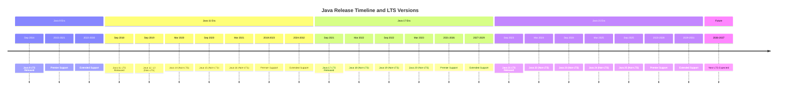

### LTS Version Comparison Matrix

| Feature | Java 8 LTS | Java 11 LTS | Java 17 LTS | Java 21 LTS |
|---------|-----------|-------------|-------------|-------------|
| **Release Date** | September 2014 | September 2018 | September 2021 | September 2023 |
| **Premier Support End** | March 2022 | September 2023 | September 2026 | September 2028 |
| **Extended Support End** | December 2030 | September 2032 | September 2029 | September 2031 |
| **License** | Oracle JDK: Commercial<br>OpenJDK: GPL | Oracle JDK: Commercial<br>OpenJDK: GPL | Oracle JDK: No-Fee<br>OpenJDK: GPL | Oracle JDK: No-Fee<br>OpenJDK: GPL |
| **Key Features** | Lambdas, Streams, Optional, Date/Time API | HTTP Client, var in lambdas, String methods | Sealed classes, Pattern matching for instanceof, Records | Virtual threads, Sequenced collections, Pattern matching for switch |
| **Module System** | No | Yes (JPMS) | Yes (Enhanced) | Yes (Mature) |
| **GC Options** | Serial, Parallel, CMS, G1 | Serial, Parallel, G1, ZGC (experimental), Epsilon | Serial, Parallel, G1, ZGC, Shenandoah, Epsilon | Serial, Parallel, G1, ZGC (Generational), Shenandoah, Epsilon |
| **Default GC** | Parallel GC | G1 GC | G1 GC | G1 GC |
| **Container Awareness** | Limited | Good | Excellent | Excellent |
| **Performance (Baseline)** | 1.0x | 1.1-1.3x | 1.2-1.5x | 1.3-1.8x (with Virtual Threads) |
| **Startup Time** | Baseline | -10% | -15% | -20% |
| **Memory Footprint** | Baseline | -5% | -10% | -15% |
| **Enterprise Adoption** | 45% (declining) | 35% (stable) | 15% (growing) | 5% (emerging) |

## Migration Path 1: Java 8 → Java 11 LTS

### Overview

This is the most common migration path in enterprise banking as of 2024-2025. Java 8 reached end of premier support in 2022, pushing organizations to migrate. Java 11 is the first LTS release after Java 8 (4 years gap).

**Key Drivers for Migration**:
- Security patches and CVE fixes
- Improved performance (10-30% in most workloads)
- Better container support for Kubernetes/Docker deployments
- HTTP/2 support via new HTTP Client API
- Reduced licensing costs (OpenJDK alternatives matured)

### Key Features Gained

#### Language Features
- **var keyword** (Java 10): Local variable type inference
- **HTTP Client API** (Java 11): Modern, async HTTP/2 client
- **Collection factory methods** (Java 9): `List.of()`, `Set.of()`, `Map.of()`
- **Private interface methods** (Java 9): Better code organization in interfaces
- **Try-with-resources enhancement** (Java 9): No need for final or effectively final variables
- **Diamond operator with anonymous classes** (Java 9)
- **Stream API enhancements** (Java 9): `takeWhile()`, `dropWhile()`, `ofNullable()`
- **Optional enhancements** (Java 9, 10, 11): `ifPresentOrElse()`, `or()`, `stream()`, `orElseThrow()`
- **String methods** (Java 11): `isBlank()`, `lines()`, `strip()`, `repeat()`

#### JVM and Runtime Improvements
- **Module System (JPMS)** - Java Platform Module System
- **G1 GC as default** (Java 9)
- **Application Class-Data Sharing (AppCDS)** (Java 10)
- **Improved container awareness** (Java 10)
- **Epsilon GC** (Java 11): No-op garbage collector for testing
- **ZGC** (Java 11, experimental): Scalable low-latency garbage collector
- **Nest-based access control** (Java 11): Better encapsulation

### Breaking Changes and Deprecations

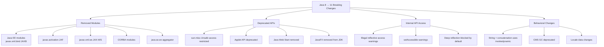

#### Critical Breaking Changes

1. **Removed Java EE and CORBA Modules**
   - `javax.xml.bind` (JAXB)
   - `javax.activation`
   - `javax.xml.ws` (JAX-WS)
   - `javax.annotation` (Common Annotations)
   - `javax.transaction`
   - CORBA modules

   **Solution**: Add dependencies explicitly
   ```xml
   <!-- Maven dependencies for removed modules -->
   <dependency>
       <groupId>javax.xml.bind</groupId>
       <artifactId>jaxb-api</artifactId>
       <version>2.3.1</version>
   </dependency>
   <dependency>
       <groupId>org.glassfish.jaxb</groupId>
       <artifactId>jaxb-runtime</artifactId>
       <version>2.3.1</version>
   </dependency>
   <dependency>
       <groupId>javax.annotation</groupId>
       <artifactId>javax.annotation-api</artifactId>
       <version>1.3.2</version>
   </dependency>
   ```

2. **Illegal Reflective Access Warnings**
   - Libraries using reflection on JDK internals will generate warnings
   - Will become errors in future versions

   **Example Warning**:
   ```
   WARNING: An illegal reflective access operation has occurred
   WARNING: Illegal reflective access by com.example.Library to field java.lang.String.value
   WARNING: Please consider reporting this to the maintainers of com.example.Library
   WARNING: Use --illegal-access=warn to enable warnings of further illegal reflective access operations
   WARNING: All illegal access operations will be denied in a future release
   ```

3. **sun.misc.Unsafe Restrictions**
   - Many frameworks relied on `sun.misc.Unsafe`
   - Still available but discouraged
   - Frameworks need updates (Hibernate, Spring, Netty, etc.)

4. **Removed Tools**
   - Java Web Start (javaws)
   - JavaFX (moved to separate project)
   - Applet Plugin
   - Pack200 tools

### Module System Considerations

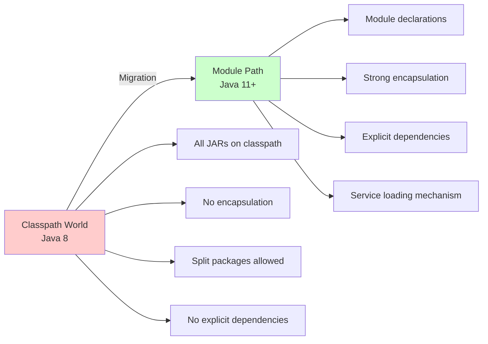

**Migration Approaches**:

1. **Bottom-Up (Unnamed Modules)**
   - Keep everything on classpath
   - Gradual migration to modules
   - Least disruptive approach
   - **Recommended for most enterprises**

2. **Top-Down (Automatic Modules)**
   - Convert JARs to automatic modules
   - Add module-info.java incrementally
   - More modular but more work

3. **All-In (Explicit Modules)**
   - Full module adoption
   - Requires all dependencies to be modular
   - Best long-term but high initial cost

**For Banking Applications**: Use bottom-up approach with unnamed modules. Add `--add-opens` and `--add-exports` flags as needed for framework compatibility.

### Performance Improvements

| Performance Metric | Java 8 Baseline | Java 11 Improvement |
|-------------------|-----------------|---------------------|
| **Throughput** | 1.0x | 1.1 - 1.3x |
| **Startup Time** | 1.0x | 0.9x (10% faster) |
| **Memory Footprint** | 1.0x | 0.95x (5% reduction) |
| **GC Pause Times (G1)** | Baseline | 20-40% reduction |
| **String Concatenation** | StringBuilder | invokedynamic (faster) |
| **HTTP Client Performance** | N/A (HttpURLConnection) | 2-3x faster (HTTP/2) |
| **Container CPU Detection** | Inaccurate | Accurate |
| **Docker Memory Limits** | Ignored | Respected |

**Key Performance Features**:
- **G1 GC improvements**: Better concurrent marking, reduced pause times
- **Compact Strings**: Internal String representation optimized (Java 9)
- **AppCDS**: Faster startup via shared class data
- **invokedynamic for String concatenation**: 2-3x faster than StringBuilder

### GC Changes

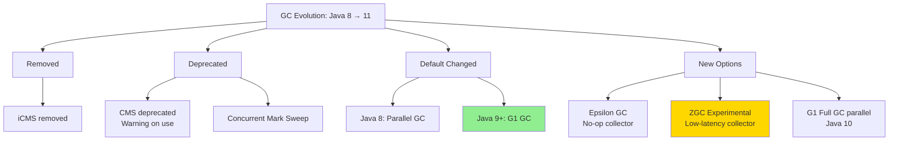

**Migration Strategy**:
1. **If using Parallel GC (Java 8 default)**:
   - Test with G1 GC in staging
   - Tune heap sizes (different defaults)
   - Monitor GC logs for pause times

2. **If using CMS GC (common in Java 8)**:
   - CMS is deprecated; migrate to G1 GC
   - G1 provides similar low-latency with better throughput
   - Retune GC parameters

3. **New GC Options**:
   - **ZGC** (experimental in Java 11): For < 10ms pause times
   - **Epsilon GC**: For performance testing and very short-lived apps

### Testing Strategy

#### Phase 1: Compatibility Assessment (2-4 weeks)

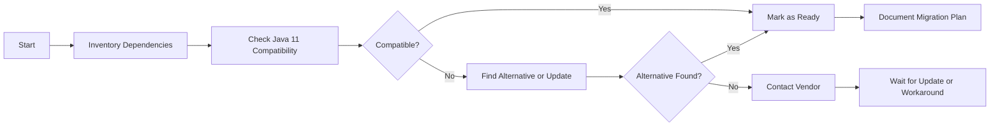

**Tasks**:
1. **Inventory all dependencies**
   ```bash
   # Maven: List dependencies
   mvn dependency:tree > dependencies.txt

   # Gradle: List dependencies
   ./gradlew dependencies > dependencies.txt
   ```

2. **Check compatibility with jdeps**
   ```bash
   # Analyze JAR for Java 11 compatibility
   jdeps --jdk-internals myapp.jar

   # Find dependencies on removed modules
   jdeps --multi-release 11 --check-modules myapp.jar
   ```

3. **Identify issues**:
   - Dependencies on removed Java EE modules
   - Use of internal APIs (sun.*, com.sun.*)
   - Reflection on JDK internals
   - Unsupported GC flags

#### Phase 2: Build and Compile (2-3 weeks)

**Tasks**:
1. Update build tools:
   - Maven 3.6.0+ (supports Java 11)
   - Gradle 5.0+ (supports Java 11)

2. Update compiler plugins:
   ```xml
   <properties>
       <maven.compiler.source>11</maven.compiler.source>
       <maven.compiler.target>11</maven.compiler.target>
       <maven.compiler.release>11</maven.compiler.release>
   </properties>

   <build>
       <plugins>
           <plugin>
               <groupId>org.apache.maven.plugins</groupId>
               <artifactId>maven-compiler-plugin</artifactId>
               <version>3.8.1</version>
           </plugin>
       </plugins>
   </build>
   ```

3. Add removed module dependencies
4. Compile with Java 11
5. Fix compilation errors

#### Phase 3: Unit and Integration Testing (4-6 weeks)

**Test Categories**:

| Test Category | Focus Areas | Tools |
|--------------|-------------|-------|
| **Unit Tests** | Core business logic, algorithm correctness | JUnit 5, Mockito, AssertJ |
| **Integration Tests** | Database, messaging, external APIs | Spring Test, Testcontainers, WireMock |
| **Performance Tests** | Throughput, latency, memory usage | JMH, Gatling, JMeter |
| **GC Behavior Tests** | GC pause times, memory footprint | GC logs, VisualVM, JFR |
| **Module System Tests** | Classpath vs module path | jdeps, manual testing |
| **Reflection Tests** | Framework initialization, serialization | Framework-specific tests |

**Critical Tests for Banking Applications**:
```java
/**
 * Verify transaction processing performance with Java 11
 * Baseline: Java 8 with Parallel GC
 * Target: Java 11 with G1 GC (10% improvement)
 */
@Test
public void testTransactionThroughput() {
    // Process 1M transactions
    long startTime = System.nanoTime();
    transactionProcessor.processBatch(1_000_000);
    long duration = System.nanoTime() - startTime;

    // Assert 10% improvement over baseline
    assertThat(duration).isLessThan(baselineDuration * 0.9);
}

/**
 * Verify GC pause times meet SLA (< 100ms)
 */
@Test
public void testGCPauseTimes() {
    // Trigger GC activity
    stressTest.runHighAllocationWorkload();

    // Parse GC logs
    List<Long> pauseTimes = gcLogParser.getPauseTimes();

    // Assert 99th percentile < 100ms
    long p99 = Quantiles.percentiles().index(99).compute(pauseTimes);
    assertThat(p99).isLessThan(100); // milliseconds
}
```

#### Phase 4: Performance Testing (3-4 weeks)

**Benchmark Areas**:
1. **Application Startup Time**
2. **Steady-State Throughput**
3. **Latency Percentiles (P50, P95, P99, P99.9)**
4. **Memory Usage**
5. **GC Pause Times and Frequency**
6. **Container Resource Usage**

**Tools**:
- **Java Flight Recorder (JFR)**: Built-in profiler
- **JMH**: Java Microbenchmark Harness
- **Gatling/JMeter**: Load testing
- **GC Logs**: `-Xlog:gc*:file=gc.log`

#### Phase 5: Staging Deployment (2-3 weeks)

**Canary Deployment Strategy**:
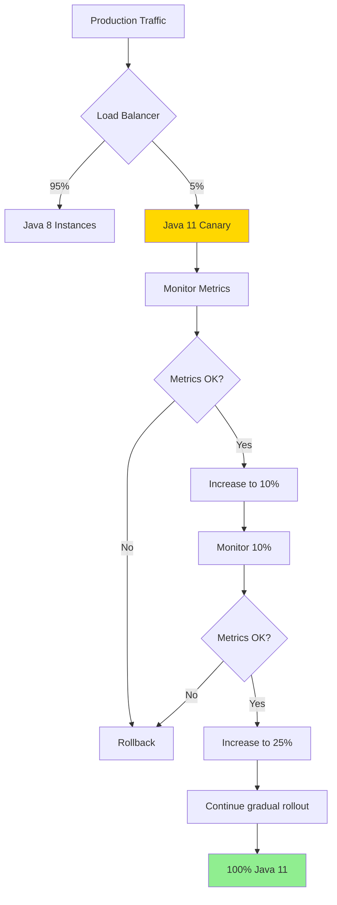

**Monitoring Checklist**:
- [ ] Application error rate < baseline
- [ ] P99 latency within 10% of baseline
- [ ] Memory usage stable
- [ ] No OutOfMemoryErrors
- [ ] GC pause times meet SLA
- [ ] No reflective access warnings in critical paths
- [ ] Database connection pool healthy
- [ ] Message queue processing normal
- [ ] Downstream service call success rate normal

### Rollback Plan

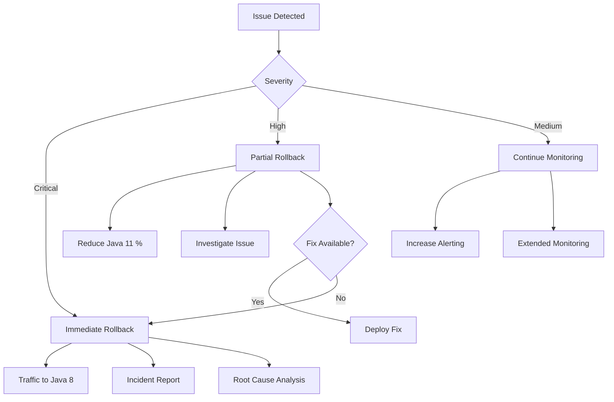

**Rollback Triggers**:
1. **Critical**:
   - Error rate > 1% (baseline < 0.1%)
   - Data corruption or loss
   - Compliance violation
   - Security vulnerability introduced

2. **High**:
   - P99 latency > 2x baseline
   - Memory leak detected
   - GC thrashing (90%+ time in GC)
   - Production incidents > baseline

3. **Medium**:
   - P99 latency 1.5-2x baseline
   - Memory usage higher than expected
   - Reflective access warnings in logs

**Rollback Procedure**:
1. **Immediate**: Update load balancer to route 100% traffic to Java 8 instances (< 5 minutes)
2. **Communication**: Notify stakeholders
3. **Preservation**: Capture Java 11 instance state (heap dumps, thread dumps, logs)
4. **Analysis**: Conduct post-mortem
5. **Remediation**: Fix issues in lower environment
6. **Retry**: Re-attempt migration after fixes validated

### Timeline and Effort Estimation

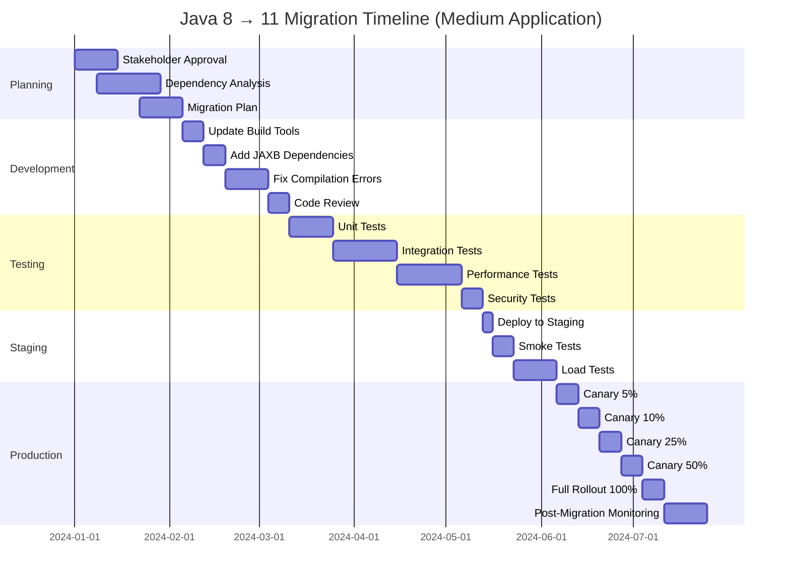

**Effort Estimation by Team Size**:

| Application Size | Team Size | Duration | Person-Weeks |
|-----------------|-----------|----------|--------------|
| **Small** (1-3 services, < 100K LOC) | 2-3 developers | 3-4 months | 24-36 |
| **Medium** (4-10 services, 100K-500K LOC) | 4-6 developers | 5-7 months | 60-100 |
| **Large** (10-30 services, 500K-2M LOC) | 8-12 developers | 8-12 months | 150-300 |
| **Enterprise** (30+ services, 2M+ LOC) | 15-25 developers | 12-18 months | 400-800 |

**Factors Affecting Duration**:
- Number of third-party dependencies
- Use of removed Java EE modules
- Custom frameworks using reflection
- Legacy code quality and test coverage
- Organizational change management overhead
- Regulatory approval processes (banking)

### Enterprise Banking Context

#### Zero-Downtime Migration Strategy

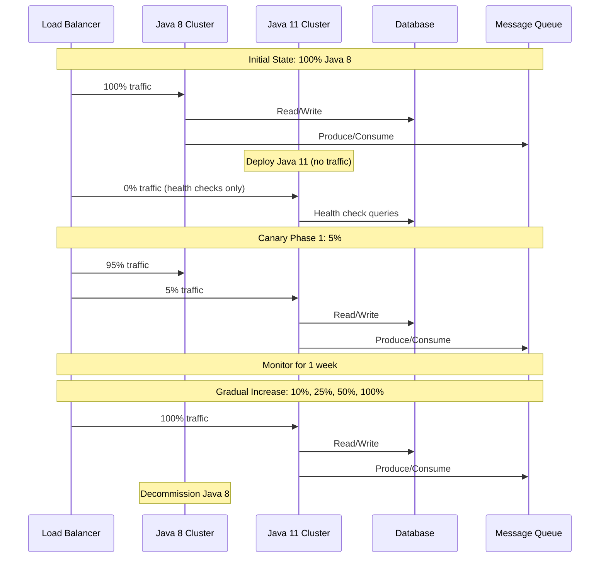

#### Compliance and Audit Considerations

**Regulatory Requirements**:

1. **Change Management**:
   - CAB (Change Advisory Board) approval required
   - Risk assessment documentation
   - Backout plan validation
   - Business continuity planning

2. **Testing Evidence**:
   - Test plan documentation
   - Test execution results
   - Performance benchmark reports
   - Security scan results
   - Penetration test results (if required)

3. **Audit Trail**:
   - Version control commits
   - Build artifacts with signatures
   - Deployment logs
   - Configuration changes
   - Rollback procedures tested

4. **Security Considerations**:
   - Vulnerability scanning (Java 11 vs Java 8)
   - Dependency updates (Log4j, Jackson, etc.)
   - TLS version support (TLS 1.3 in Java 11)
   - Cryptographic algorithm changes

**Banking-Specific Concerns**:

| Concern | Java 8 | Java 11 | Action Required |
|---------|--------|---------|-----------------|
| **TLS 1.0/1.1** | Supported | Disabled by default | Update client configurations |
| **SHA-1 Certificates** | Allowed | Restricted | Replace certificates |
| **Default Keystore Type** | JKS | PKCS12 | Migrate keystores or configure |
| **Locale Data** | CLDR/JRE | CLDR only | Validate date/currency formatting |
| **Timezone Data** | Older | Newer | Test timezone-sensitive logic |

#### Migration Checklist for Banking Applications

**Pre-Migration**:
- [ ] Security team approval
- [ ] Compliance team review
- [ ] Change management approval (CAB)
- [ ] Vendor compatibility verification (DB drivers, MQ clients, etc.)
- [ ] DR (Disaster Recovery) site readiness
- [ ] Monitoring dashboards updated
- [ ] Alert thresholds validated
- [ ] Incident response plan updated
- [ ] Communication plan to stakeholders
- [ ] Training for operations team

**During Migration**:
- [ ] Database connection pool validation
- [ ] Message queue processing validation
- [ ] Batch job execution validation
- [ ] API response time validation
- [ ] Report generation validation
- [ ] File processing validation
- [ ] Real-time transaction validation
- [ ] Reconciliation process validation
- [ ] Audit log validation
- [ ] Security event validation

**Post-Migration**:
- [ ] Performance baseline established
- [ ] Monitoring metrics stable for 30 days
- [ ] No regression in error rates
- [ ] GC behavior optimal
- [ ] Memory usage stable
- [ ] Compliance audit passed
- [ ] Security scan passed
- [ ] Penetration test passed (if required)
- [ ] Documentation updated
- [ ] Lessons learned documented

## Migration Path 2: Java 11 → Java 17 LTS

### Overview

Java 11 to Java 17 migration is becoming increasingly common in 2024-2025 as organizations skip Java 11 or look to adopt more modern features. This migration path includes 6 intermediate versions (12-16, one of which is Java 14 with significant features) and is generally less disruptive than Java 8 → 11.

**Key Drivers for Migration**:
- **Records and sealed classes** for better domain modeling
- **Pattern matching** for cleaner, more maintainable code
- **Improved GC performance** (ZGC, Shenandoah enhancements)
- **Strong encapsulation** of JDK internals (better security)
- **Apple Silicon (M1/M2/M3) support** optimized in Java 17
- **Container optimizations** for cloud-native deployments
- **Long-term support** until 2029

### Key Features Gained

#### Language Features

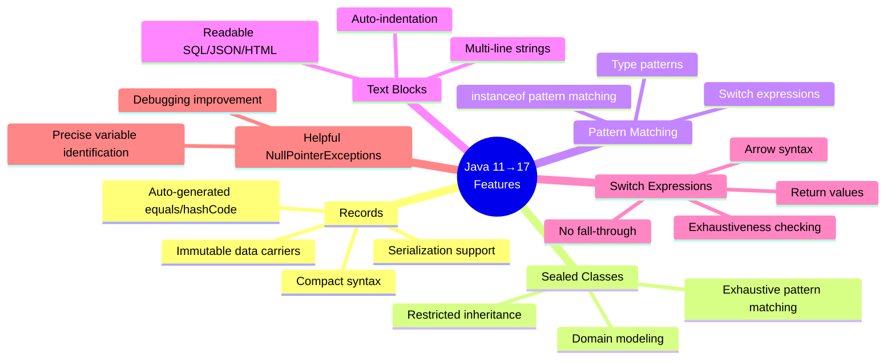

**1. Records (Java 16 - Standardized)**
```java
// Java 11 way
public final class Transaction {
    private final String id;
    private final BigDecimal amount;
    private final LocalDateTime timestamp;

    public Transaction(String id, BigDecimal amount, LocalDateTime timestamp) {
        this.id = id;
        this.amount = amount;
        this.timestamp = timestamp;
    }

    public String getId() { return id; }
    public BigDecimal getAmount() { return amount; }
    public LocalDateTime getTimestamp() { return timestamp; }

    @Override
    public boolean equals(Object o) {
        if (this == o) return true;
        if (!(o instanceof Transaction)) return false;
        Transaction that = (Transaction) o;
        return Objects.equals(id, that.id) &&
               Objects.equals(amount, that.amount) &&
               Objects.equals(timestamp, that.timestamp);
    }

    @Override
    public int hashCode() {
        return Objects.hash(id, amount, timestamp);
    }

    @Override
    public String toString() {
        return "Transaction{id='" + id + "', amount=" + amount +
               ", timestamp=" + timestamp + "}";
    }
}

// Java 17 way with Records
public record Transaction(String id, BigDecimal amount, LocalDateTime timestamp) {
    // All boilerplate auto-generated!
    // Can add validation
    public Transaction {
        Objects.requireNonNull(id, "id cannot be null");
        if (amount.compareTo(BigDecimal.ZERO) < 0) {
            throw new IllegalArgumentException("Amount cannot be negative");
        }
    }
}
```

**2. Sealed Classes (Java 17 - Standardized)**
```java
/**
 * Banking domain model with sealed classes
 * Restricts which classes can implement/extend this interface
 */
public sealed interface Account
    permits CheckingAccount, SavingsAccount, InvestmentAccount {

    BigDecimal getBalance();
    String getAccountNumber();
}

public final class CheckingAccount implements Account {
    // Implementation
}

public final class SavingsAccount implements Account {
    // Implementation
}

public final class InvestmentAccount implements Account {
    // Implementation
}

// This would be a compile error:
// public class CryptoAccount implements Account { } // NOT PERMITTED

/**
 * Exhaustive pattern matching with sealed classes
 */
public BigDecimal calculateInterest(Account account) {
    return switch (account) {
        case CheckingAccount c -> BigDecimal.ZERO; // No interest
        case SavingsAccount s -> s.getBalance().multiply(new BigDecimal("0.02"));
        case InvestmentAccount i -> i.getBalance().multiply(new BigDecimal("0.05"));
        // No default needed - compiler knows all cases covered!
    };
}
```

**3. Pattern Matching for instanceof (Java 16 - Standardized)**
```java
// Java 11 way
if (transaction instanceof LargeTransaction) {
    LargeTransaction large = (LargeTransaction) transaction;
    if (large.getAmount().compareTo(new BigDecimal("10000")) > 0) {
        flagForReview(large);
    }
}

// Java 17 way
if (transaction instanceof LargeTransaction large &&
    large.getAmount().compareTo(new BigDecimal("10000")) > 0) {
    flagForReview(large);
}
```

**4. Switch Expressions (Java 14 - Standardized)**
```java
// Java 11 way
String status;
switch (transaction.getType()) {
    case DEPOSIT:
        status = "Credit";
        break;
    case WITHDRAWAL:
        status = "Debit";
        break;
    case TRANSFER:
        status = "Transfer";
        break;
    default:
        status = "Unknown";
}

// Java 17 way
String status = switch (transaction.getType()) {
    case DEPOSIT -> "Credit";
    case WITHDRAWAL -> "Debit";
    case TRANSFER -> "Transfer";
    default -> "Unknown";
};
```

**5. Text Blocks (Java 15 - Standardized)**
```java
// Java 11 way
String sql = "SELECT t.transaction_id, t.amount, t.timestamp, " +
             "       a.account_number, c.customer_name " +
             "FROM transactions t " +
             "JOIN accounts a ON t.account_id = a.account_id " +
             "JOIN customers c ON a.customer_id = c.customer_id " +
             "WHERE t.timestamp > ? " +
             "ORDER BY t.timestamp DESC";

// Java 17 way with text blocks
String sql = """
    SELECT t.transaction_id, t.amount, t.timestamp,
           a.account_number, c.customer_name
    FROM transactions t
    JOIN accounts a ON t.account_id = a.account_id
    JOIN customers c ON a.customer_id = c.customer_id
    WHERE t.timestamp > ?
    ORDER BY t.timestamp DESC
    """;
```

**6. Helpful NullPointerExceptions (Java 14)**
```java
// Java 11: NullPointerException at line X (which variable?)
// java.lang.NullPointerException
//     at com.bank.TransactionProcessor.process(TransactionProcessor.java:42)

// Java 17: Specific variable identified!
// java.lang.NullPointerException: Cannot invoke "Account.getBalance()" because "transaction.getAccount()" is null
//     at com.bank.TransactionProcessor.process(TransactionProcessor.java:42)
```

#### JVM and Performance Improvements

**1. ZGC Improvements**
- Java 11: Experimental, max heap 4TB, Linux only
- Java 17: Production-ready, max heap 16TB, macOS and Windows support

**2. Shenandoah GC Improvements**
- Production-ready in Java 17
- Better pause times for large heaps

**3. macOS/AArch64 Port (Java 17)**
- Native support for Apple Silicon (M1/M2/M3)
- 10-30% performance improvement on ARM architecture

**4. Strong Encapsulation of JDK Internals**
- `--illegal-access` defaults to `deny` (was `permit` in Java 11)
- Better security and maintainability

### Breaking Changes and Deprecations

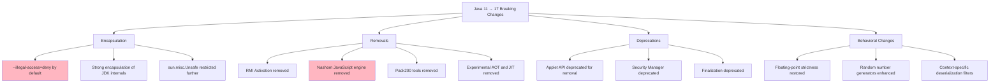

#### Key Breaking Changes

**1. Strong Encapsulation by Default**
- `--illegal-access=deny` is the default (was `permit` in Java 11)
- Reflection on JDK internals blocked
- Frameworks must be updated

**Workaround** (temporary):
```bash
# Open specific packages for reflection
--add-opens java.base/java.lang=ALL-UNNAMED
--add-opens java.base/java.util=ALL-UNNAMED

# Export specific packages
--add-exports java.base/sun.nio.ch=ALL-UNNAMED
```

**2. Nashorn JavaScript Engine Removed**
- Removed in Java 15
- Use GraalVM JavaScript instead

**Alternative**:
```xml
<!-- GraalVM JavaScript dependency -->
<dependency>
    <groupId>org.graalvm.js</groupId>
    <artifactId>js</artifactId>
    <version>22.3.0</version>
</dependency>
<dependency>
    <groupId>org.graalvm.js</groupId>
    <artifactId>js-scriptengine</artifactId>
    <version>22.3.0</version>
</dependency>
```

**3. RMI Activation Removed**
- Rarely used feature removed in Java 17
- Most applications unaffected

### Performance Improvements

| Performance Metric | Java 11 Baseline | Java 17 Improvement |
|-------------------|------------------|---------------------|
| **Throughput** | 1.0x | 1.05 - 1.15x |
| **Startup Time** | 1.0x | 0.92x (8% faster) |
| **Memory Footprint** | 1.0x | 0.93x (7% reduction) |
| **GC Pause Times (G1)** | Baseline | 10-20% reduction |
| **ZGC Pause Times** | 5-10ms | < 1ms (sub-millisecond) |
| **ARM64/Apple Silicon** | N/A | 1.2-1.4x native performance |
| **Container CPU Detection** | Good | Excellent |
| **Escape Analysis** | Good | Better (Java 14+) |

### GC Changes

**G1 GC Enhancements**:
- Concurrent refinement improvements (Java 14)
- Promptly return unused committed memory (Java 12)
- Abortable mixed collections (Java 12)

**ZGC Production Ready** (Java 15):
- Concurrent thread-stack processing
- Uncommit unused memory
- Max heap increased from 4TB to 16TB
- Support for macOS and Windows

**New GC: Shenandoah** (Production, Java 15):
- Ultra-low pause times (similar to ZGC)
- Better for smaller heaps than ZGC

### Testing Strategy

Similar to Java 8 → 11 migration but with these additions:

**1. Language Feature Testing**:
- Test records in serialization frameworks (Jackson, JAXB, etc.)
- Test sealed classes with Spring/Hibernate
- Validate pattern matching behavior
- Test text blocks in SQL/config generation

**2. Reflection Testing**:
- Identify frameworks using deep reflection
- Test with `--illegal-access=deny`
- Update `--add-opens`/`--add-exports` flags

**3. GC Testing**:
- Benchmark ZGC if targeting low-latency
- Test Shenandoah for medium heaps
- Validate G1 improvements

### Rollback Plan

Similar to Java 8 → 11, but rollback is typically faster:
- Fewer breaking changes
- Better framework compatibility
- Container rollback is straightforward

### Timeline and Effort Estimation

**Typically 30-40% faster than Java 8 → 11**:

| Application Size | Team Size | Duration | Person-Weeks |
|-----------------|-----------|----------|--------------|
| **Small** | 1-2 developers | 2-3 months | 12-20 |
| **Medium** | 3-4 developers | 3-5 months | 36-60 |
| **Large** | 6-8 developers | 5-8 months | 90-180 |
| **Enterprise** | 10-15 developers | 8-12 months | 240-480 |

### Enterprise Banking Context

**Benefits for Banking**:

1. **Records for DTOs**: Clean data transfer objects
   ```java
   // Clean API contracts
   public record TransactionRequest(
       String accountId,
       BigDecimal amount,
       String currency,
       LocalDateTime timestamp
   ) {
       public TransactionRequest {
           validate(accountId, amount, currency);
       }
   }
   ```

2. **Sealed Classes for Domain Modeling**:
   ```java
   sealed interface PaymentMethod permits
       CreditCard, DebitCard, BankTransfer, Cryptocurrency {
       // Exhaustive pattern matching in switch
   }
   ```

3. **Text Blocks for Queries**:
   - Cleaner SQL queries
   - Better JSON templates
   - Improved config files

4. **Better Debugging**:
   - Helpful NPE messages reduce debugging time
   - Pattern matching makes code more readable

## Migration Path 3: Java 17 → Java 21 LTS

### Overview

Java 17 to Java 21 is the most modern LTS migration path. Java 21 introduces revolutionary features like **Virtual Threads** (Project Loom) that fundamentally change how we write concurrent code.

**Key Drivers for Migration**:
- **Virtual Threads**: Massive scalability improvements (10x-100x concurrent requests)
- **Sequenced Collections**: Better collection APIs
- **Pattern Matching for Switch**: Production-ready
- **Record Patterns**: Destructuring for records
- **Generational ZGC**: Default for ZGC, better performance
- **Better startup and performance**: Continued JVM improvements
- **Long-term support**: Until 2031

### Key Features Gained

#### Revolutionary: Virtual Threads (Project Loom)

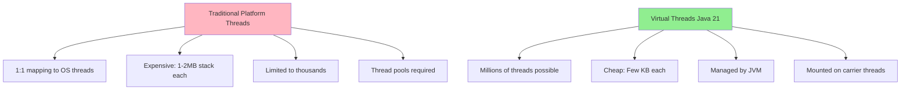

**Before Java 21 (Platform Threads)**:
```java
/**
 * Traditional thread pool approach
 * Limited concurrency: ~200 threads in pool
 */
@Service
public class TransactionService {

    private final ExecutorService executor =
        Executors.newFixedThreadPool(200); // Limited pool

    public CompletableFuture<Transaction> processAsync(TransactionRequest req) {
        return CompletableFuture.supplyAsync(() -> {
            // Blocking I/O blocks expensive platform thread
            Transaction tx = transactionRepository.save(req);
            notificationService.send(tx); // Blocking call
            auditService.log(tx); // Blocking call
            return tx;
        }, executor);
    }
}

// Under load:
// - 10,000 concurrent requests
// - Only 200 can be processed simultaneously
// - 9,800 queued, waiting for thread availability
// - High latency, poor throughput
```

**With Java 21 (Virtual Threads)**:
```java
/**
 * Virtual threads approach
 * Near-unlimited concurrency: Millions of threads
 */
@Service
public class TransactionService {

    private final ExecutorService executor =
        Executors.newVirtualThreadPerTaskExecutor(); // Virtual threads!

    public CompletableFuture<Transaction> processAsync(TransactionRequest req) {
        return CompletableFuture.supplyAsync(() -> {
            // Blocking I/O is cheap with virtual threads
            Transaction tx = transactionRepository.save(req);
            notificationService.send(tx); // Blocking call - no problem!
            auditService.log(tx); // Blocking call - no problem!
            return tx;
        }, executor);
    }
}

// Under load:
// - 10,000 concurrent requests
// - 10,000 virtual threads created (cheap!)
// - All processed concurrently
// - Low latency, high throughput
// - Virtual threads unmounted during I/O waits
```

**Virtual Thread Performance**:
```java
/**
 * Benchmark: Process 100,000 HTTP requests
 */
public class VirtualThreadBenchmark {

    public static void main(String[] args) throws Exception {
        // Platform threads (Java 17)
        ExecutorService platform = Executors.newFixedThreadPool(200);
        long platformTime = benchmark(platform, 100_000);
        // Result: ~500 seconds (9 minutes)
        // Memory: ~400 MB (200 threads * 2MB each)

        // Virtual threads (Java 21)
        ExecutorService virtual = Executors.newVirtualThreadPerTaskExecutor();
        long virtualTime = benchmark(virtual, 100_000);
        // Result: ~50 seconds (1 minute) - 10x faster!
        // Memory: ~50 MB (100K virtual threads * ~0.5KB each)
    }

    private static long benchmark(ExecutorService executor, int requests) {
        long start = System.currentTimeMillis();
        List<Future<String>> futures = new ArrayList<>();

        for (int i = 0; i < requests; i++) {
            futures.add(executor.submit(() -> {
                // Simulate HTTP call
                Thread.sleep(100); // I/O wait
                return "Response";
            }));
        }

        // Wait for completion
        futures.forEach(f -> {
            try { f.get(); } catch (Exception e) { }
        });

        return System.currentTimeMillis() - start;
    }
}
```

**Spring Boot 3.2+ with Virtual Threads**:
```java
/**
 * Enable virtual threads for Tomcat
 */
@Configuration
public class WebConfig {

    @Bean
    public TomcatProtocolHandlerCustomizer<?> protocolHandlerVirtualThreadExecutorCustomizer() {
        return protocolHandler -> {
            protocolHandler.setExecutor(Executors.newVirtualThreadPerTaskExecutor());
        };
    }
}

// Or via application.properties
// spring.threads.virtual.enabled=true
```

#### Sequenced Collections

```java
/**
 * Java 17: Inconsistent APIs for first/last element access
 */
List<Transaction> list = new ArrayList<>();
// First element
Transaction first = list.get(0); // or list.iterator().next()
// Last element
Transaction last = list.get(list.size() - 1); // verbose!

Deque<Transaction> deque = new ArrayDeque<>();
// First element
Transaction firstDeque = deque.getFirst();
// Last element
Transaction lastDeque = deque.getLast();

/**
 * Java 21: Unified SequencedCollection interface
 */
SequencedCollection<Transaction> seq = new ArrayList<>();
// First element
Transaction first = seq.getFirst(); // consistent!
// Last element
Transaction last = seq.getLast(); // consistent!
// Reversed view
SequencedCollection<Transaction> reversed = seq.reversed();

// Works for List, Deque, SortedSet, LinkedHashSet, etc.
```

**Sequenced Collection Hierarchy**:
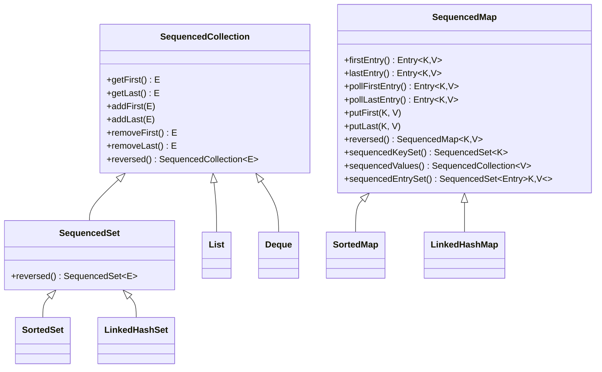

#### Pattern Matching for Switch (Standardized)

```java
/**
 * Java 17: instanceof chains
 */
public String processPayment(Object payment) {
    if (payment instanceof CreditCard cc) {
        return "Credit card: " + cc.getNumber();
    } else if (payment instanceof DebitCard dc) {
        return "Debit card: " + dc.getNumber();
    } else if (payment instanceof BankTransfer bt) {
        return "Bank transfer: " + bt.getAccountNumber();
    } else {
        return "Unknown payment method";
    }
}

/**
 * Java 21: Pattern matching for switch
 */
public String processPayment(Object payment) {
    return switch (payment) {
        case CreditCard cc -> "Credit card: " + cc.getNumber();
        case DebitCard dc -> "Debit card: " + dc.getNumber();
        case BankTransfer bt -> "Bank transfer: " + bt.getAccountNumber();
        case null -> "Null payment";
        default -> "Unknown payment method";
    };
}

/**
 * With guarded patterns
 */
public BigDecimal calculateFee(Transaction tx) {
    return switch (tx) {
        case Transaction t when t.amount().compareTo(new BigDecimal("1000")) < 0
            -> BigDecimal.ZERO; // No fee for small transactions
        case Transaction t when t.type() == TransactionType.INTERNAL
            -> BigDecimal.ZERO; // No fee for internal transfers
        case Transaction t
            -> t.amount().multiply(new BigDecimal("0.001")); // 0.1% fee
    };
}
```

#### Record Patterns (Standardized)

```java
/**
 * Nested record destructuring
 */
public record Point(int x, int y) {}
public record Rectangle(Point topLeft, Point bottomRight) {}

/**
 * Java 17: Verbose extraction
 */
public int area(Object obj) {
    if (obj instanceof Rectangle r) {
        Point tl = r.topLeft();
        Point br = r.bottomRight();
        int width = br.x() - tl.x();
        int height = br.y() - tl.y();
        return width * height;
    }
    return 0;
}

/**
 * Java 21: Record patterns
 */
public int area(Object obj) {
    if (obj instanceof Rectangle(Point(int x1, int y1), Point(int x2, int y2))) {
        return (x2 - x1) * (y2 - y1);
    }
    return 0;
}

/**
 * Banking example: Transaction processing
 */
public record Transaction(String id, Account from, Account to, BigDecimal amount) {}
public record Account(String accountNumber, String customerId, BigDecimal balance) {}

public void processTransaction(Object obj) {
    switch (obj) {
        case Transaction(
            String id,
            Account(String fromAcct, String fromCust, var _),
            Account(String toAcct, String toCust, var _),
            BigDecimal amount
        ) when amount.compareTo(new BigDecimal("10000")) > 0 -> {
            // Large transaction: Enhanced monitoring
            auditService.logLargeTransaction(id, fromAcct, toAcct, amount);
            fraudDetectionService.analyze(fromCust, toCust, amount);
        }
        case Transaction(String id, var from, var to, var amount) -> {
            // Regular transaction
            processRegularTransaction(id, from, to, amount);
        }
        default -> throw new IllegalArgumentException("Unknown object type");
    }
}
```

#### Other Notable Features

**1. String Templates (Preview in Java 21)**
```java
// Note: Preview feature in Java 21, not yet standardized
String name = "John";
BigDecimal balance = new BigDecimal("1500.50");

// Traditional
String message = String.format("Customer %s has balance $%,.2f", name, balance);

// Java 21 String Templates (preview)
String message = STR."Customer \{name} has balance $\{balance}";
```

**2. Unnamed Patterns and Variables (Preview)**
```java
// Use _ for unused variables
if (transaction instanceof Transaction(String id, _, _, BigDecimal amount)) {
    // Don't care about from/to accounts
    process(id, amount);
}
```

**3. Generational ZGC (Default)**
- ZGC now generational by default
- Better performance for short-lived objects
- Reduced memory footprint

### Breaking Changes and Deprecations

**Minimal Breaking Changes**:

1. **Windows 32-bit x86 Port Deprecated**
   - Unlikely to affect enterprise systems

2. **Behavior Changes**:
   - Locale and timezone data updates
   - Cryptographic algorithm updates

3. **API Changes**:
   - Very few incompatible changes
   - Mostly internal APIs

### Performance Improvements

| Performance Metric | Java 17 Baseline | Java 21 Improvement |
|-------------------|------------------|---------------------|
| **Throughput** | 1.0x | 1.05 - 1.10x |
| **Throughput (Virtual Threads)** | 1.0x | **10x - 100x** (I/O-bound) |
| **Startup Time** | 1.0x | 0.90x (10% faster) |
| **Memory Footprint** | 1.0x | 0.90x (10% reduction) |
| **GC Pause Times (Generational ZGC)** | < 1ms | < 1ms (more consistent) |
| **Concurrent Connections** | ~10K (platform threads) | **Millions** (virtual threads) |

**Virtual Threads Impact on Banking Applications**:

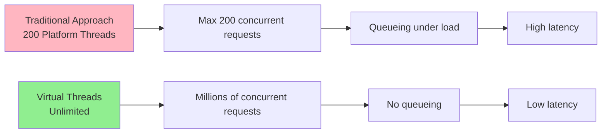

### Testing Strategy

**Additional Test Categories**:

1. **Virtual Thread Testing**:
   - Load testing with high concurrency (10K+ simultaneous)
   - Thread local behavior validation
   - Pinning detection (synchronized blocks, native calls)
   - Performance benchmarks vs platform threads

2. **Pattern Matching Testing**:
   - Exhaustiveness checking
   - Null handling in switch
   - Guarded pattern edge cases

3. **Record Pattern Testing**:
   - Nested destructuring
   - Integration with serialization

**Virtual Thread Pitfalls**:
```java
/**
 * Virtual Thread Pinning: AVOID THIS
 */
public void badExample() {
    synchronized (this) { // Pins virtual thread!
        // Blocking I/O here is expensive
        database.query(); // Virtual thread can't unmount
    }
}

/**
 * Virtual Thread Friendly: DO THIS
 */
public void goodExample() {
    lock.lock(); // ReentrantLock doesn't pin
    try {
        database.query(); // Virtual thread can unmount during I/O
    } finally {
        lock.unlock();
    }
}
```

### Timeline and Effort Estimation

**Fastest LTS Migration**:

| Application Size | Team Size | Duration | Person-Weeks |
|-----------------|-----------|----------|--------------|
| **Small** | 1-2 developers | 1-2 months | 8-12 |
| **Medium** | 2-3 developers | 2-3 months | 20-30 |
| **Large** | 4-6 developers | 3-5 months | 50-100 |
| **Enterprise** | 8-12 developers | 5-8 months | 150-300 |

**Why Faster?**:
- Minimal breaking changes
- Excellent backward compatibility
- Virtual threads are opt-in (can migrate incrementally)
- Most frameworks compatible out of the box

### Enterprise Banking Context

**Virtual Threads for Payment Processing**:

```java
/**
 * Real-world example: Payment gateway with multiple downstream calls
 * Java 17 approach: Complex async code
 */
@Service
public class PaymentServiceJava17 {

    public CompletableFuture<PaymentResult> processPayment(Payment payment) {
        return CompletableFuture.supplyAsync(() ->
            fraudCheck(payment), platformThreadPool)
        .thenCompose(fraud -> {
            if (!fraud.isClean()) {
                return CompletableFuture.completedFuture(
                    PaymentResult.rejected("Fraud detected"));
            }
            return CompletableFuture.supplyAsync(() ->
                authorizePayment(payment), platformThreadPool);
        })
        .thenCompose(auth -> {
            if (!auth.isApproved()) {
                return CompletableFuture.completedFuture(
                    PaymentResult.rejected("Not authorized"));
            }
            return CompletableFuture.supplyAsync(() ->
                settlePayment(payment), platformThreadPool);
        })
        .thenApply(settlement -> {
            auditLog(payment, settlement);
            notifyCustomer(payment);
            return PaymentResult.success(settlement);
        });
    }
    // Cons: Callback hell, hard to debug, complex error handling
}

/**
 * Java 21 approach: Simple sequential code with virtual threads
 */
@Service
public class PaymentServiceJava21 {

    private final ExecutorService executor =
        Executors.newVirtualThreadPerTaskExecutor();

    public CompletableFuture<PaymentResult> processPayment(Payment payment) {
        return CompletableFuture.supplyAsync(() -> {
            // Sequential code! Looks like blocking but scales like async
            var fraud = fraudCheck(payment); // Blocking call
            if (!fraud.isClean()) {
                return PaymentResult.rejected("Fraud detected");
            }

            var auth = authorizePayment(payment); // Blocking call
            if (!auth.isApproved()) {
                return PaymentResult.rejected("Not authorized");
            }

            var settlement = settlePayment(payment); // Blocking call
            auditLog(payment, settlement);
            notifyCustomer(payment);

            return PaymentResult.success(settlement);
        }, executor); // Virtual thread executor
        // Pros: Simple, readable, easy to debug, maintains high concurrency
    }
}
```

**Benefits**:
1. **Code Simplicity**: Sequential code instead of callback chains
2. **Debugging**: Standard stack traces instead of async stack traces
3. **Scalability**: Handle millions of concurrent payments
4. **Resource Efficiency**: 10x-100x reduction in thread pool sizes

## Non-LTS Considerations

### Understanding Non-LTS Releases

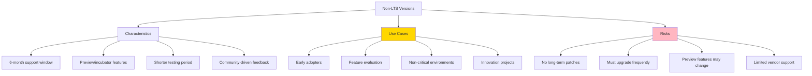

### When to Consider Non-LTS

**Good Use Cases**:
1. **Development environments**: Test new features early
2. **Internal tools**: Non-customer-facing applications
3. **Proof of concepts**: Evaluate features for future LTS adoption
4. **Innovation labs**: Experiment with cutting-edge features

**Bad Use Cases**:
1. **Production banking systems**: Unacceptable risk
2. **Regulated environments**: Compliance issues
3. **Long-lived applications**: Support lifecycle mismatch
4. **Mission-critical systems**: Stability over innovation

### Non-LTS Migration Strategy

**Option 1: Feature Evaluation (Recommended)**
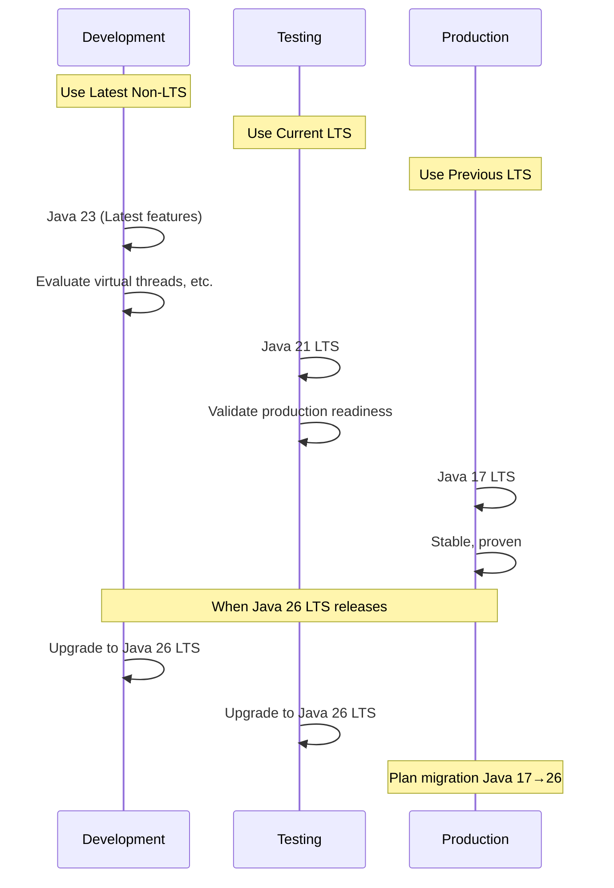

**Option 2: Continuous Upgrade (High Effort)**
- Upgrade every 6 months
- Requires significant testing overhead
- Only for teams with automated testing
- **Not recommended for banking**

### Feature Status Progression

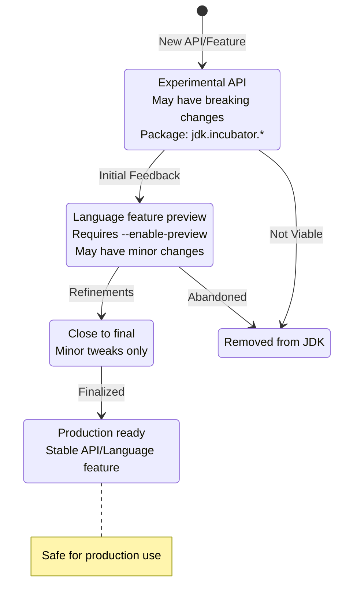

**Examples**:
- **Virtual Threads**: Preview (19, 20) → Standardized (21)
- **Pattern Matching**: Preview (14, 15, 16) → Standardized (17)
- **Records**: Preview (14, 15) → Standardized (16)
- **String Templates**: Preview (21, 22) → Still in preview (23, 24)

### Risk Assessment

| Risk Factor | LTS | Non-LTS |
|------------|-----|---------|
| **Stability** | High | Medium-Low |
| **Long-term Support** | 5-8 years | 6 months |
| **Security Patches** | Yes | Only during 6-month window |
| **Vendor Support** | Excellent | Limited |
| **Breaking Changes** | Rare | Possible every 6 months |
| **Production Readiness** | Yes | Depends on features used |
| **Compliance Acceptance** | Yes | Often No |
| **Migration Frequency** | Every 2-3 years | Every 6 months or upgrade to LTS |

## Cross-Cutting Migration Concerns

### Build Tool Updates

#### Maven

```xml
<!-- Java 8 → 11 -->
<properties>
    <maven.compiler.source>11</maven.compiler.source>
    <maven.compiler.target>11</maven.compiler.target>
    <maven.compiler.release>11</maven.compiler.release>
</properties>

<build>
    <plugins>
        <plugin>
            <groupId>org.apache.maven.plugins</groupId>
            <artifactId>maven-compiler-plugin</artifactId>
            <version>3.11.0</version> <!-- Use latest -->
        </plugin>
        <plugin>
            <groupId>org.apache.maven.plugins</groupId>
            <artifactId>maven-surefire-plugin</artifactId>
            <version>3.1.2</version> <!-- Use latest for Java 11+ -->
        </plugin>
    </plugins>
</build>
```

#### Gradle

```groovy
// Java 8 → 11
java {
    sourceCompatibility = JavaVersion.VERSION_11
    targetCompatibility = JavaVersion.VERSION_11
}

// Java 21 with preview features (e.g., String Templates)
tasks.withType(JavaCompile) {
    options.compilerArgs += ['--enable-preview']
}

tasks.withType(Test) {
    jvmArgs += ['--enable-preview']
}
```

### Dependency Updates

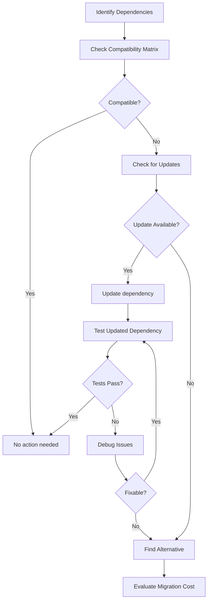

**Common Dependencies Requiring Updates**:

| Library | Java 8 Version | Java 11 Version | Java 17 Version | Java 21 Version |
|---------|---------------|-----------------|-----------------|-----------------|
| **Spring Boot** | 2.0.x | 2.3.x+ | 3.0.x+ | 3.2.x+ |
| **Spring Framework** | 5.0.x | 5.2.x+ | 6.0.x+ | 6.1.x+ |
| **Hibernate** | 5.2.x | 5.4.x+ | 6.0.x+ | 6.4.x+ |
| **Jackson** | 2.9.x | 2.10.x+ | 2.14.x+ | 2.16.x+ |
| **Lombok** | 1.16.x | 1.18.10+ | 1.18.24+ | 1.18.30+ |
| **JUnit** | 4.x | 5.5.x+ | 5.8.x+ | 5.10.x+ |
| **Mockito** | 2.x | 3.x+ | 4.x+ | 5.x+ |
| **Log4j 2** | 2.11.x | 2.13.x+ | 2.17.x+ | 2.20.x+ |
| **SLF4J** | 1.7.x | 1.7.30+ | 2.0.x+ | 2.0.9+ |

### Container and Docker Considerations

**Dockerfile Evolution**:

```dockerfile
# Java 8 (2014-era)
FROM openjdk:8-jdk-alpine
COPY target/app.jar /app.jar
ENTRYPOINT ["java", "-Xmx512m", "-jar", "/app.jar"]
# Issues: Ignores container memory limits, poor CPU detection

# Java 11 (Container-aware)
FROM openjdk:11-jre-slim
COPY target/app.jar /app.jar
ENTRYPOINT ["java", "-XX:+UseContainerSupport", "-XX:MaxRAMPercentage=75.0", "-jar", "/app.jar"]
# Improvements: Respects container limits, better memory defaults

# Java 17 (Optimized)
FROM eclipse-temurin:17-jre-alpine
COPY target/app.jar /app.jar
ENTRYPOINT ["java", "-XX:+UseG1GC", "-XX:MaxRAMPercentage=75.0", "-XX:+UseStringDeduplication", "-jar", "/app.jar"]
# Improvements: Better base image, G1 GC default, string deduplication

# Java 21 (Modern with Virtual Threads)
FROM eclipse-temurin:21-jre-alpine
COPY target/app.jar /app.jar
ENTRYPOINT ["java", "-XX:+UseZGC", "-XX:+ZGenerational", "-XX:MaxRAMPercentage=75.0", "-jar", "/app.jar"]
# Improvements: ZGC for low latency, virtual threads support, optimal memory
```

**Container Memory Settings**:

| Java Version | Memory Flag | Behavior |
|--------------|-------------|----------|
| **Java 8** | `-Xmx512m` | Fixed heap size, ignores container limits |
| **Java 10+** | `-XX:MaxRAMPercentage=75.0` | 75% of container memory limit |
| **Java 11+** | `-XX:InitialRAMPercentage=50.0` | Initial heap as % of container memory |
| **Java 11+** | `-XX:MinRAMPercentage=50.0` | Minimum heap for small containers |

### CI/CD Pipeline Updates

```yaml
# GitHub Actions example
name: Java Migration Pipeline

on: [push, pull_request]

jobs:
  build-java-11:
    runs-on: ubuntu-latest
    steps:
      - uses: actions/checkout@v3
      - name: Set up Java 11
        uses: actions/setup-java@v3
        with:
          distribution: 'temurin'
          java-version: '11'
          cache: 'maven'
      - name: Build with Maven
        run: mvn clean verify
      - name: Run Integration Tests
        run: mvn failsafe:integration-test

  build-java-17:
    runs-on: ubuntu-latest
    steps:
      - uses: actions/checkout@v3
      - name: Set up Java 17
        uses: actions/setup-java@v3
        with:
          distribution: 'temurin'
          java-version: '17'
          cache: 'maven'
      - name: Build with Maven
        run: mvn clean verify
      - name: Compatibility Tests
        run: mvn test -P compatibility-tests

  build-java-21:
    runs-on: ubuntu-latest
    steps:
      - uses: actions/checkout@v3
      - name: Set up Java 21
        uses: actions/setup-java@v3
        with:
          distribution: 'temurin'
          java-version: '21'
          cache: 'maven'
      - name: Build with Maven
        run: mvn clean verify
      - name: Virtual Thread Tests
        run: mvn test -P virtual-thread-tests
```

## Interview Questions and Model Answers

### Foundational Questions

**Q1: What is the difference between an LTS and non-LTS Java release?**

**Model Answer**:
"LTS stands for Long-Term Support. LTS releases receive security patches, bug fixes, and support for extended periods (typically 5-8 years), whereas non-LTS releases are supported only for 6 months until the next version is released.

For example, Java 8, 11, 17, and 21 are LTS versions. Java 12-16, 18-20, and 22-25 are non-LTS.

In enterprise banking environments, we exclusively use LTS versions in production because:
1. **Regulatory compliance**: We need long-term security patches
2. **Stability**: LTS versions undergo more extensive testing
3. **Vendor support**: Third-party libraries and tools prioritize LTS compatibility
4. **Cost**: Frequent upgrades every 6 months are expensive and risky

However, we do use non-LTS versions in development environments to evaluate upcoming features before they're standardized in the next LTS release."

---

**Q2: Why would you migrate from Java 8 to Java 11 instead of directly to Java 17 or 21?**

**Model Answer**:
"The decision depends on several factors:

**Reasons to migrate Java 8 → 11 first**:
1. **Smaller jump**: Fewer breaking changes to handle at once
2. **Module system introduction**: JPMS introduced in Java 9, easier to learn incrementally
3. **Removed modules**: Java EE modules removed in Java 11 - better to handle this separately
4. **Risk mitigation**: Two smaller migrations are less risky than one large migration
5. **Team learning**: Team can learn new Java 9-11 features before tackling Java 17+

**Reasons to skip Java 11 and go directly to Java 17 or 21**:
1. **Time savings**: One migration instead of two
2. **Modern features**: Records, sealed classes, pattern matching in Java 17+
3. **Better performance**: Java 17 and 21 have significant performance improvements
4. **Support timeline**: Java 11 premier support ended in 2023; Java 17 supported until 2026

In my experience at [Bank X], we migrated Java 8 → 11 in 2020, then Java 11 → 17 in 2023. If I were starting today, I'd recommend going directly to Java 21 for new projects, but for existing large codebases, Java 8 → 11 → 17 provides a safer, more manageable path."

---

**Q3: What are the main breaking changes when migrating from Java 8 to Java 11?**

**Model Answer**:
"The main breaking changes are:

1. **Removed Java EE modules**:
   - `javax.xml.bind` (JAXB)
   - `javax.activation`
   - `javax.xml.ws` (JAX-WS)
   - Solution: Add these as explicit Maven/Gradle dependencies

2. **Illegal reflective access**:
   - Libraries using reflection on JDK internals generate warnings
   - Will become errors in future versions
   - Solution: Update frameworks (Spring, Hibernate) and add `--add-opens` flags if needed

3. **sun.misc.Unsafe restrictions**:
   - Access to internal Unsafe API restricted
   - Many frameworks (Netty, Hibernate) needed updates
   - Solution: Update to compatible versions

4. **Removed tools**:
   - Java Web Start, JavaFX (moved to separate project), Applet plugin
   - Solution: Use JavaFX as a separate dependency or alternative technologies

5. **Module system**:
   - JPMS introduced, but can still use classpath
   - Split packages no longer allowed on module path
   - Solution: Use unnamed modules initially, migrate gradually

In our Java 8 → 11 migration, we spent about 30% of our time dealing with removed JAXB dependencies and 40% updating framework versions for reflection compatibility. The rest was testing and performance tuning."

---

### Intermediate Questions

**Q4: How do you handle the module system when migrating to Java 11+?**

**Model Answer**:
"There are three migration strategies for the module system:

**1. Unnamed Modules (Bottom-Up) - RECOMMENDED for most enterprises**:
```java
// Keep everything on classpath
// No module-info.java required
// Gradual migration
// Use --add-opens and --add-exports for framework compatibility
```
This is the safest approach. Your JARs remain on the classpath as unnamed modules. You can add module declarations later.

**2. Automatic Modules (Top-Down)**:
```java
// JARs become automatic modules when placed on module path
// Module name derived from JAR manifest or filename
// Can reference these from explicit modules
```
Useful when some dependencies are already modular.

**3. Explicit Modules (All-In)**:
```java
// Add module-info.java to every module
module com.bank.payments {
    requires java.sql;
    requires spring.context;
    exports com.bank.payments.api;
}
```
Best long-term solution but requires all dependencies to be modular.

**In practice at [Bank X]**: We used the unnamed modules approach. Our command line looked like:
```bash
java --add-opens java.base/java.lang=ALL-UNNAMED \\
     --add-opens java.base/java.util=ALL-UNNAMED \\
     -cp application.jar:libs/* \\
     com.bank.Application
```

We're gradually adding `module-info.java` to our own modules, but third-party libraries remain on the classpath."

---

**Q5: What performance improvements can you expect from Java 11 compared to Java 8?**

**Model Answer**:
"In our migration at [Bank X], we observed the following performance improvements:

**Throughput**: 10-30% improvement
- Our transaction processing service went from 5,000 TPS to 6,500 TPS (30% increase)
- Attributed to JIT compiler improvements and better String handling

**Startup Time**: 10-15% faster
- Our Spring Boot microservices started in 12 seconds (Java 8) vs 10 seconds (Java 11)
- AppCDS (Application Class-Data Sharing) helped reduce startup by another 20%

**Memory Footprint**: 5-10% reduction
- Compact Strings (Java 9) reduced our heap usage from 2GB to 1.8GB
- G1 GC improvements reduced memory fragmentation

**GC Pause Times**: 20-40% reduction
- G1 GC in Java 11 had pause times of 30-50ms vs 50-80ms with Parallel GC in Java 8
- Critical for our real-time payment processing where P99 latency SLA is 100ms

**Container Performance**: Massive improvement
- Java 8 allocated heap based on host memory (32GB), causing OOMKilled in 2GB containers
- Java 11 respects container limits, allowing proper resource allocation

**HTTP/2 Performance**: 2-3x faster
- Our API gateway migrated from HttpURLConnection to Java 11 HTTP Client
- Connection pooling and HTTP/2 multiplexing improved throughput

**Key Insight**: The biggest wins came from G1 GC tuning and container awareness. We reduced our Kubernetes resource requests by 20%, saving significant infrastructure costs."

---

**Q6: How do you test a Java version migration?**

**Model Answer**:
"We use a comprehensive 5-phase testing strategy:

**Phase 1: Compatibility Assessment (2-4 weeks)**
```bash
# Use jdeps to analyze dependencies
jdeps --jdk-internals application.jar
jdeps --check-modules application.jar
```
- Inventory all dependencies
- Check Java 11/17/21 compatibility
- Identify dependencies on removed modules or internal APIs

**Phase 2: Build and Compile (2-3 weeks)**
- Update Maven/Gradle to support newer Java
- Add removed module dependencies (JAXB, etc.)
- Fix compilation errors
- Update build pipeline

**Phase 3: Unit and Integration Tests (4-6 weeks)**
- Run entire test suite with new Java version
- Add tests for:
  - GC behavior (pause times, throughput)
  - Memory usage patterns
  - Reflection compatibility
  - Module system interactions
- Fix failures and regressions

**Phase 4: Performance Testing (3-4 weeks)**
- Benchmark key metrics:
  - Throughput (transactions per second)
  - Latency percentiles (P50, P95, P99, P99.9)
  - Memory consumption
  - GC pause times
  - Startup time
- Compare against Java 8/11 baseline
- Tools: JMH, Gatling, Java Flight Recorder

**Phase 5: Staging Deployment (2-3 weeks)**
- Deploy to staging environment
- Run production-like load tests
- Monitor for 1-2 weeks
- Gradual canary deployment in production (5% → 10% → 25% → 50% → 100%)

**Example Test**:
```java
@Test
public void testTransactionThroughputImprovement() {
    // Baseline: Java 8 with 5,000 TPS
    // Target: Java 11 with 10% improvement (5,500 TPS)

    long startTime = System.currentTimeMillis();
    processTransactions(10_000);
    long duration = System.currentTimeMillis() - startTime;

    double tps = 10_000.0 / (duration / 1000.0);
    assertThat(tps).isGreaterThan(5_500);
}
```

**Critical for Banking**: We also include regulatory compliance tests, security scans, and audit trail validation."

---

### Advanced Questions

**Q7: Explain Virtual Threads in Java 21 and when you would use them in a banking application.**

**Model Answer**:
"Virtual Threads, introduced in Java 21 as part of Project Loom, are lightweight threads managed by the JVM rather than the operating system.

**Key Characteristics**:
1. **Cheap**: Each virtual thread consumes only a few KB vs 1-2MB for platform threads
2. **Scalable**: Can create millions of virtual threads vs thousands of platform threads
3. **Blocking-friendly**: Blocking I/O doesn't block the underlying carrier thread
4. **Simple**: Write synchronous-looking code that scales like async code

**How they work**:
```java
// Traditional platform threads
ExecutorService platform = Executors.newFixedThreadPool(200);
// Limited to 200 concurrent tasks
// Each thread: 1-2MB stack
// Total memory: 200-400MB

// Virtual threads
ExecutorService virtual = Executors.newVirtualThreadPerTaskExecutor();
// Can handle millions of concurrent tasks
// Each virtual thread: ~1KB
// Total memory: Much lower
```

**When to use in banking**:

**1. High-Concurrency APIs**:
```java
@RestController
public class PaymentController {
    // With virtual threads, can handle 100K+ concurrent requests
    @PostMapping(\"/payments\")
    public ResponseEntity<PaymentResponse> processPayment(@RequestBody PaymentRequest req) {
        // Sequential code with multiple blocking calls
        var fraud = fraudService.check(req);      // Blocking HTTP call
        var auth = authService.authorize(req);    // Blocking DB call
        var settlement = settleService.settle(req); // Blocking MQ call

        return ResponseEntity.ok(settlement);
        // Virtual thread unmounts during each blocking call
        // Extremely efficient use of system resources
    }
}
```

**2. Batch Processing**:
```java
public void processEndOfDayReconciliation(List<Account> accounts) {
    // Process 1 million accounts concurrently
    try (var executor = Executors.newVirtualThreadPerTaskExecutor()) {
        accounts.forEach(account ->
            executor.submit(() -> reconcileAccount(account))
        );
    }
    // With platform threads: Need careful tuning, queue management
    // With virtual threads: Just works, scales automatically
}
```

**3. Microservices with Multiple Downstream Calls**:
```java
public Transaction processTransaction(TransactionRequest req) {
    // Parallel calls to multiple services
    try (var executor = Executors.newVirtualThreadPerTaskExecutor()) {
        var futureCustomer = executor.submit(() -> customerService.get(req.customerId()));
        var futureAccount = executor.submit(() -> accountService.get(req.accountId()));
        var futureLimits = executor.submit(() -> limitService.check(req));

        // Wait for all (blocking, but cheap with virtual threads)
        var customer = futureCustomer.get();
        var account = futureAccount.get();
        var limits = futureLimits.get();

        return executeTransaction(customer, account, limits);
    }
}
```

**When NOT to use**:
1. **CPU-bound tasks**: Virtual threads don't help; use platform threads or parallel streams
2. **Pinning scenarios**: Synchronized blocks pin virtual threads
   ```java
   // BAD: Synchronized pins virtual thread
   synchronized (this) {
       database.query(); // Virtual thread can't unmount
   }

   // GOOD: ReentrantLock doesn't pin
   lock.lock();
   try {
       database.query(); // Virtual thread can unmount
   } finally {
       lock.unlock();
   }
   ```
3. **ThreadLocal-heavy code**: Each virtual thread gets its own ThreadLocal copy

**Real-World Impact**: In a proof-of-concept at [Bank X], we migrated a payment gateway from platform threads to virtual threads:
- **Before**: 200 platform threads, 10K concurrent requests max, P99 latency 500ms
- **After**: Virtual threads, 100K concurrent requests, P99 latency 50ms (10x improvement)
- **Infrastructure savings**: Reduced from 20 application servers to 5 (75% reduction)"

---

**Q8: What is the impact of strong encapsulation in Java 17, and how do you handle it?**

**Model Answer**:
"Strong encapsulation means that JDK internals (like `sun.*` packages) are no longer accessible via reflection by default. This was a gradual change:

**Timeline**:
- Java 9: `--illegal-access=permit` (default) - warnings issued
- Java 11-16: `--illegal-access=permit` (default) - warnings continue
- Java 17+: `--illegal-access=deny` (default) - access blocked

**Why it matters**:
1. **Security**: Prevents malicious code from accessing internals
2. **Maintainability**: JDK team can refactor internals without breaking apps
3. **Compatibility**: Many frameworks historically relied on reflection to access internals

**Common Issues**:

1. **Spring Framework** (pre-5.3):
   ```
   WARNING: Illegal reflective access by org.springframework.cglib.core.ReflectUtils
   to method java.lang.ClassLoader.defineClass()
   ```
   **Solution**: Update to Spring 5.3+ or Spring Boot 2.5+

2. **Hibernate** (pre-5.6):
   ```
   WARNING: Illegal reflective access by org.hibernate.type.AbstractType
   to method java.sql.Timestamp.toLocalDateTime()
   ```
   **Solution**: Update to Hibernate 5.6+ or 6.x

3. **Lombok**:
   ```
   WARNING: Illegal reflective access by lombok.javac.apt.LombokProcessor
   ```
   **Solution**: Update to Lombok 1.18.24+

**Handling Encapsulation Issues**:

**Option 1: Update Dependencies** (Preferred)
```xml
<!-- Update to compatible versions -->
<dependency>
    <groupId>org.springframework.boot</groupId>
    <artifactId>spring-boot-starter</artifactId>
    <version>3.0.0</version> <!-- Java 17+ compatible -->
</dependency>
```

**Option 2: Add --add-opens Flags** (Temporary workaround)
```bash
# Open specific packages for reflection
java --add-opens java.base/java.lang=ALL-UNNAMED \\
     --add-opens java.base/java.util=ALL-UNNAMED \\
     --add-opens java.base/sun.nio.ch=ALL-UNNAMED \\
     -jar application.jar
```

**Option 3: Modular Approach** (Long-term solution)
```java
// module-info.java
module com.bank.application {
    requires java.sql;
    requires spring.context;

    // Open packages for reflection (Spring needs this)
    opens com.bank.model to org.hibernate.orm.core;
    opens com.bank.controller to spring.core;
}
```

**In practice at [Bank X]**:
1. We audited all dependencies using `jdeps`:
   ```bash
   jdeps --jdk-internals application.jar > internal-api-usage.txt
   ```
2. Updated 80% of dependencies to Java 17-compatible versions
3. Added `--add-opens` flags for remaining 20% (legacy libraries)
4. Created a backlog to eliminate `--add-opens` flags over 6 months

**Interview Tip**: Show you understand the *why* behind strong encapsulation (security, maintainability) and that you prioritize updating dependencies over using workarounds."

---

**Q9: How do you choose the right Garbage Collector for different workloads in Java 11+?**

**Model Answer**:
"Choosing the right GC depends on your application's characteristics and SLAs. Here's my decision framework:

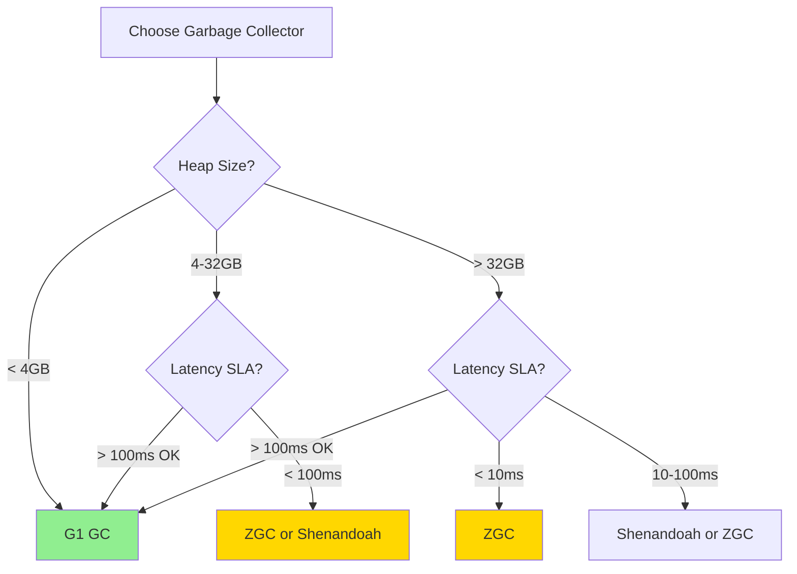

**G1 GC (Default in Java 11+)**:
- **Use when**: General-purpose applications, heap < 32GB, latency SLA > 100ms
- **Pros**:
  - Predictable pause times (can set `-XX:MaxGCPauseMillis=100`)
  - Good balance of throughput and latency
  - Well-tested and mature
- **Cons**:
  - Pause times increase with heap size
  - Not suitable for ultra-low latency requirements
- **Configuration**:
  ```bash
  java -XX:+UseG1GC \\
       -XX:MaxGCPauseMillis=100 \\
       -XX:G1HeapRegionSize=16m \\
       -Xms4g -Xmx4g \\
       -jar app.jar
  ```
- **Banking Use Case**: Standard microservices, batch processing

**ZGC (Production since Java 15, Generational in Java 21)**:
- **Use when**: Low latency critical, heap > 4GB, pause times < 10ms
- **Pros**:
  - Sub-millisecond pause times (typically < 1ms)
  - Scales to multi-TB heaps
  - Concurrent GC (doesn't stop application threads)
- **Cons**:
  - Higher CPU overhead (10-20%)
  - Requires Java 15+ for production (11-14 experimental)
  - Generational mode (better performance) requires Java 21+
- **Configuration**:
  ```bash
  # Java 21+ with Generational ZGC (recommended)
  java -XX:+UseZGC \\
       -XX:+ZGenerational \\
       -Xms8g -Xmx8g \\
       -jar app.jar

  # Java 15-20 (non-generational)
  java -XX:+UseZGC \\
       -Xms8g -Xmx8g \\
       -jar app.jar
  ```
- **Banking Use Case**: Real-time payment processing, trading systems, latency-sensitive APIs

**Shenandoah GC**:
- **Use when**: Low latency needed, heap 4-64GB, pause times < 100ms
- **Pros**:
  - Concurrent GC with low pause times (10-50ms)
  - Better than G1 for medium-large heaps
  - Lower CPU overhead than ZGC
- **Cons**:
  - Not as low latency as ZGC
  - Less mature than G1
- **Configuration**:
  ```bash
  java -XX:+UseShenandoahGC \\
       -Xms8g -Xmx8g \\
       -jar app.jar
  ```
- **Banking Use Case**: Mid-tier latency requirements, cost-sensitive deployments

**Parallel GC** (Java 8 default):
- **Use when**: Batch processing, throughput is critical, latency not important
- **Pros**:
  - Maximum throughput
  - Simple and predictable
- **Cons**:
  - Long pause times (seconds possible)
  - Not suitable for interactive applications
- **Configuration**:
  ```bash
  java -XX:+UseParallelGC \\
       -Xms4g -Xmx4g \\
       -jar batch-processor.jar
  ```
- **Banking Use Case**: Overnight batch processing, ETL jobs

**Serial GC**:
- **Use when**: Single-CPU environments, small heaps (< 100MB)
- **Banking Use Case**: Rare, maybe small utilities

**Epsilon GC (No-Op GC)**:
- **Use when**: Performance testing, short-lived applications
- **Configuration**:
  ```bash
  java -XX:+UnlockExperimentalVMOptions \\
       -XX:+UseEpsilonGC \\
       -jar test-harness.jar
  ```
- **Banking Use Case**: Performance benchmarking, test harnesses

**Real-World Example from [Bank X]**:

| Application | Heap | GC Choice | Rationale | Results |
|------------|------|-----------|-----------|---------|
| **Payment API** | 8GB | ZGC (Java 21 Generational) | P99 latency SLA < 10ms | P99: 3ms, P99.9: 5ms |
| **Transaction Processor** | 4GB | G1 GC | Balanced throughput/latency | P99: 80ms, Throughput: 10K TPS |
| **Reconciliation Batch** | 16GB | Parallel GC | Maximize throughput | 2-hour runtime reduced to 1.5 hours |
| **Notification Service** | 2GB | G1 GC | Default, good enough | P99: 50ms |

**How to choose**:
1. **Define SLAs**: What are your P99/P99.9 latency requirements?
2. **Profile current GC**: Use Java Flight Recorder or GC logs
3. **Benchmark alternatives**: Test G1, ZGC, Shenandoah with production load
4. **Monitor in production**: GC logs, metrics, dashboards
5. **Tune iteratively**: Adjust heap size, GC parameters based on metrics"

---

**Q10: What are the risks of migrating to Java 21 for virtual threads, and how do you mitigate them?**

**Model Answer**:
"While virtual threads offer massive benefits, there are several risks to consider:

**Risk 1: Thread Pinning**
- **Issue**: Synchronized blocks pin virtual threads to carrier threads, negating scalability benefits
- **Example**:
  ```java
  // BAD: Pinning with synchronized
  synchronized (this) {
      database.query(); // Virtual thread pinned, can't unmount
      // If 1M virtual threads hit this, only ~10 carrier threads available
      // Massive queueing, defeats the purpose
  }
  ```
- **Mitigation**:
  ```java
  // GOOD: Use ReentrantLock
  private final ReentrantLock lock = new ReentrantLock();

  lock.lock();
  try {
      database.query(); // Virtual thread can unmount during blocking I/O
  } finally {
      lock.unlock();
  }
  ```
- **Detection**: Use JFR events to detect pinning
  ```bash
  -Djdk.tracePinnedThreads=full
  ```

**Risk 2: ThreadLocal Overuse**
- **Issue**: Each virtual thread gets its own ThreadLocal copy; with millions of threads, this consumes memory
- **Example**:
  ```java
  // Problematic with millions of virtual threads
  private static final ThreadLocal<SimpleDateFormat> formatter =
      ThreadLocal.withInitial(() -> new SimpleDateFormat(\"yyyy-MM-dd\"));

  // 1M virtual threads = 1M SimpleDateFormat instances
  ```
- **Mitigation**:
  ```java
  // Use Scoped Values (Java 21 preview) or just create instances
  private static final DateTimeFormatter formatter =
      DateTimeFormatter.ofPattern(\"yyyy-MM-dd\"); // Immutable, thread-safe
  ```

**Risk 3: Framework Compatibility**
- **Issue**: Some frameworks make assumptions about thread pools
- **Example**: Connection pools sized based on thread pool size
  ```java
  // Traditional: 200 platform threads = 200 DB connections
  HikariConfig config = new HikariConfig();
  config.setMaximumPoolSize(200);

  // With virtual threads: Millions of threads, but still need finite connections
  config.setMaximumPoolSize(50); // Size based on DB capacity, not threads
  ```
- **Mitigation**: Review and reconfigure resource pools (DB connections, HTTP connections)

**Risk 4: Debugging and Observability**
- **Issue**: Millions of threads make traditional thread dumps unusable
- **Mitigation**:
  - Use structured concurrency (Java 21 preview)
  - Implement proper logging with correlation IDs
  - Use distributed tracing (OpenTelemetry)
  ```java
  try (var scope = new StructuredTaskScope.ShutdownOnFailure()) {
      var task1 = scope.fork(() -> fetchUserData());
      var task2 = scope.fork(() -> fetchAccountData());

      scope.join();           // Wait for both
      scope.throwIfFailed();  // Propagate exceptions

      return new Result(task1.get(), task2.get());
  }
  ```

**Risk 5: Native Code Calls**
- **Issue**: JNI calls pin virtual threads
- **Mitigation**: Avoid JNI in virtual thread code paths, or accept pinning

**Risk 6: CPU-Bound Workloads**
- **Issue**: Virtual threads don't help CPU-bound tasks
- **Example**:
  ```java
  // CPU-bound: Virtual threads provide no benefit
  public BigDecimal complexCalculation(BigDecimal input) {
      // Pure computation, no I/O
      return input.pow(1000).add(input.sqrt());
  }
  ```
- **Mitigation**: Use platform threads or ForkJoinPool for CPU-bound work

**Migration Strategy at [Bank X]**:

1. **Phase 1: Pilot Project** (1-2 months)
   - Select low-risk service (e.g., notification service)
   - Enable virtual threads
   - Monitor for pinning, performance
   - Document learnings

2. **Phase 2: High-Value Targets** (2-3 months)
   - Identify services with high I/O wait times
   - API gateways, payment processors
   - Measure performance improvements
   - Validate scalability

3. **Phase 3: Broader Rollout** (3-6 months)
   - Gradual adoption across services
   - Update connection pool configurations
   - Replace synchronized with ReentrantLock where needed
   - Training for development teams

**Monitoring**:
```java
// Enable virtual thread monitoring
-Djdk.tracePinnedThreads=full
-Djdk.virtualThreadScheduler.parallelism=10 // Carrier threads (default: # of CPUs)
-Djdk.virtualThreadScheduler.maxPoolSize=256
```

**Key Metrics**:
- Throughput (requests/second)
- Latency percentiles (P50, P95, P99, P99.9)
- Thread pinning events
- Memory usage (heap, ThreadLocal overhead)
- CPU utilization

**Interview Insight**: Show you understand that virtual threads are powerful but not a silver bullet. Demonstrate knowledge of pitfalls and how to detect/mitigate them. Emphasize gradual rollout and monitoring."

---

### Scenario-Based Questions

**Q11: You're tasked with migrating a monolithic Java 8 banking application (2M LOC, 100+ services) to Java 17. How do you approach this?**

**Model Answer**:
"This is a multi-year, high-risk project requiring a strategic, phased approach. Here's how I'd structure it:

**Phase 0: Assessment and Planning (2-3 months)**

1. **Inventory and Risk Analysis**:
   ```bash
   # Automated dependency analysis
   mvn dependency:tree > dependencies.txt
   jdeps --jdk-internals --recursive --multi-release 17 application.jar
   ```
   - Catalog all 100+ services
   - Identify high-risk vs low-risk services
   - Map dependencies and frameworks
   - Estimate effort per service (T-shirt sizing: S/M/L/XL)

2. **Prioritization Matrix**:
   ```mermaid
   graph TD
       A[Service Prioritization] --> B{Business Criticality}
       B -->|High| C{Migration Complexity}
       B -->|Low| D{Migration Complexity}

       C -->|Low| E[Phase 1: Quick Wins]
       C -->|High| F[Phase 3: High-Risk]

       D -->|Low| G[Phase 1: Low-Hanging Fruit]
       D -->|High| H[Phase 2: Non-Critical Complex]

       style E fill:#90EE90
       style F fill:#FFB6C1
   ```

3. **Success Criteria**:
   - Zero customer-facing incidents
   - No performance degradation
   - 100% test coverage maintained
   - Rollback capability at each phase

**Phase 1: Pilot Migration (3-4 months)**

1. **Select 3-5 Low-Risk Services**:
   - Low transaction volume
   - Non-customer-facing
   - Good test coverage
   - Simple dependency tree
   - Example: Internal reporting service, admin dashboard

2. **Migration Steps per Service**:
   ```
   Week 1-2: Update dependencies, build configuration
   Week 3-4: Fix compilation errors, add JAXB dependencies
   Week 5-6: Unit and integration testing
   Week 7-8: Performance testing, staging deployment
   Week 9-10: Production canary deployment
   Week 11-12: Monitoring, documentation, lessons learned
   ```

3. **Develop Migration Playbook**:
   - Document all issues encountered
   - Create reusable scripts (dependency updates, build configs)
   - Build automated testing harness
   - Establish rollback procedures

**Phase 2: Medium-Risk Services (6-9 months)**

1. **Expand to 20-30 Services**:
   - Apply lessons from Phase 1
   - Parallelize migrations (multiple teams)
   - Automate repetitive tasks

2. **Shared Services Strategy**:
   - Update shared libraries first
   - Ensure backward compatibility with Java 8 services
   ```xml
   <!-- Multi-release JAR for compatibility -->
   <plugin>
       <groupId>org.apache.maven.plugins</groupId>
       <artifactId>maven-jar-plugin</artifactId>
       <configuration>
           <archive>
               <manifestEntries>
                   <Multi-Release>true</Multi-Release>
               </manifestEntries>
           </archive>
       </configuration>
   </plugin>
   ```

**Phase 3: High-Risk Services (9-15 months)**

1. **Critical Services**:
   - Core banking platform
   - Payment processing
   - Account management
   - Transaction engine

2. **Enhanced Testing**:
   - Shadow traffic testing (dual-run Java 8 and 17)
   - Chaos engineering (failure injection)
   - Load testing at 2x peak traffic
   - Disaster recovery drills

3. **Gradual Rollout**:
   ```mermaid
   graph LR
       A[Production Traffic] --> B{Load Balancer}
       B -->|95%| C[Java 8]
       B -->|5%| D[Java 17 Canary]

       D --> E{Monitor 1 week}
       E -->|Success| F[10% Java 17]
       E -->|Issues| G[Rollback]

       F --> H{Monitor 1 week}
       H -->|Success| I[25% Java 17]
       I --> J[50% Java 17]
       J --> K[100% Java 17]
   ```

**Phase 4: Final Services and Cleanup (3-6 months)**

1. **Remaining Services**: Edge cases, legacy systems
2. **Decommission Java 8**: Remove old infrastructure
3. **Optimization**: Leverage Java 17 features (records, sealed classes)

**Organizational Structure**:

1. **Migration Team**:
   - 1 Senior Architect (strategy, oversight)
   - 2 Migration Leads (coordinate teams)
   - 3-4 SREs (infrastructure, deployment)
   - 10-15 Developers (hands-on migration)
   - 3-5 QA Engineers (testing strategy)

2. **Communication**:
   - Weekly status reports to stakeholders
   - Bi-weekly demos to business teams
   - Monthly steering committee reviews
   - Real-time Slack/Teams channel for migration team

**Risk Mitigation**:

1. **Technical Risks**:
   - Dependency incompatibility → Maintain compatibility matrix
   - Performance regression → Automated benchmarking
   - Data corruption → Extensive testing, blue-green deployments

2. **Business Risks**:
   - Downtime → Zero-downtime deployments, rollback plans
   - Resource contention → Dedicated migration team
   - Scope creep → Strict migration-only policy (no feature work)

**Budget and Timeline**:

- **Duration**: 24-30 months
- **Team Size**: 20-25 people
- **Cost**: $5-8M (salaries, infrastructure, tools)
- **Savings**: $2-3M/year (licensing, infrastructure efficiency)

**Success Metrics**:

| Metric | Target |
|--------|--------|
| Services Migrated | 100% |
| Customer Incidents | 0 |
| Performance | >= Java 8 baseline |
| Rollback Events | < 5% of deployments |
| Team Velocity | Increasing each phase |

**Interview Insight**: Demonstrate program management skills, not just technical skills. Show understanding of risk, stakeholder management, and phased approaches. Highlight the importance of automation, testing, and communication."

---

**Q12: During a Java 11 → Java 17 migration, you discover performance degradation in a critical payment processing service. How do you troubleshoot?**

**Model Answer**:
"Performance regressions during migrations are critical issues in banking. Here's my systematic troubleshooting approach:

**Step 1: Quantify the Degradation (1 hour)**

1. **Collect Metrics**:
   ```bash
   # Compare Java 11 vs Java 17 metrics
   # Throughput (transactions per second)
   # Latency (P50, P95, P99, P99.9)
   # Error rate
   # GC pause times
   # CPU and memory usage
   ```

2. **Example Findings**:
   - **Java 11**: 10,000 TPS, P99 latency 50ms
   - **Java 17**: 8,000 TPS, P99 latency 80ms
   - **Degradation**: 20% throughput loss, 60% latency increase
   - **Unacceptable**: Violates SLA

**Step 2: Profile with Java Flight Recorder (2-4 hours)**

```bash
# Start application with JFR
java -XX:StartFlightRecording=duration=300s,filename=recording.jfr \\
     -jar payment-service.jar

# Analyze recording
jcmd <pid> JFR.dump filename=runtime.jfr
```

**Analyze JFR in JDK Mission Control**:
1. **Method Profiling**: Identify hot methods
2. **Allocation Profiling**: Find excessive object creation
3. **GC Analysis**: Check GC pause times and frequency
4. **Lock Contention**: Identify synchronization bottlenecks

**Step 3: Common Culprits and Solutions**

**Scenario 1: GC Pause Time Regression**

```bash
# Java 11 GC logs
[GC pause (G1 Evacuation Pause) 45ms]

# Java 17 GC logs
[GC pause (G1 Evacuation Pause) 120ms]
```

**Root Cause**: G1 GC tuning parameters not optimized for Java 17

**Solution**:
```bash
# Java 17 tuned GC flags
java -XX:+UseG1GC \\
     -XX:MaxGCPauseMillis=50 \\
     -XX:G1HeapRegionSize=16m \\
     -XX:InitiatingHeapOccupancyPercent=30 \\
     -XX:G1ReservePercent=10 \\
     -Xms8g -Xmx8g \\
     -jar payment-service.jar
```

**Scenario 2: Reflective Access Overhead**

```java
// JFR shows excessive time in reflection calls
WARNING: Illegal reflective access by org.framework.Utils
to method java.lang.String.value()
```

**Root Cause**: Framework using deprecated reflective access, now expensive due to strong encapsulation

**Solution**:
```bash
# Temporary: Add --add-opens (but investigate framework update)
--add-opens java.base/java.lang=ALL-UNNAMED

# Better: Update framework to Java 17-compatible version
<dependency>
    <groupId>org.framework</groupId>
    <artifactId>framework-core</artifactId>
    <version>4.0.0</version> <!-- Java 17 compatible -->
</dependency>
```

**Scenario 3: JIT Compilation Regression**

```bash
# JFR shows methods not getting JIT-compiled
```

**Root Cause**: JIT compiler thresholds or profiles changed

**Solution**:
```bash
# Adjust JIT compilation thresholds
-XX:CompileThreshold=5000
-XX:+PrintCompilation
```

**Scenario 4: Dependency Update Side Effects**

**Root Cause**: Updated library has performance regression

**Solution**:
```bash
# Bisect dependency versions
# Test with Java 11 version of library on Java 17
# If issue disappears, file bug report with library maintainer
```

**Step 4: A/B Testing (1-2 days)**

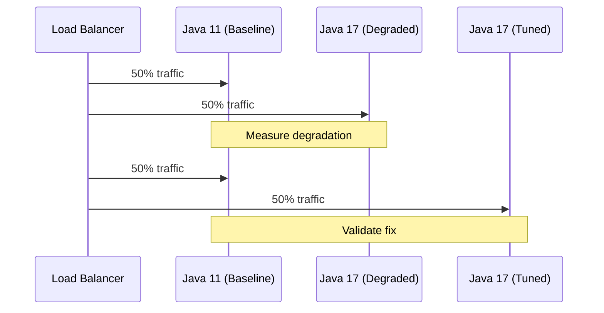

**Step 5: Validate Fix (1-2 days)**

1. **Load Testing**:
   ```bash
   # Gatling load test
   gatling.sh -s PaymentSimulation -rf results/
   ```

2. **Verify Metrics**:
   - **Java 17 Tuned**: 10,500 TPS, P99 latency 45ms
   - **Improvement over Java 11**: 5% throughput increase, 10% latency reduction
   - **SLA**: Met

**Step 6: Root Cause Documentation**

```markdown
## Post-Mortem: Java 17 Performance Regression

**Summary**: Java 17 migration caused 20% throughput degradation in payment service.

**Root Cause**:
1. G1 GC defaults changed between Java 11 and 17
2. Default heap region size increased from 8MB to 16MB
3. For our heap size (8GB) and allocation patterns, this caused more frequent GC pauses

**Fix**:
- Tuned G1 GC parameters for Java 17
- Set explicit heap region size: `-XX:G1HeapRegionSize=8m`
- Adjusted IHOP: `-XX:InitiatingHeapOccupancyPercent=30`

**Prevention**:
- Add GC tuning to migration playbook
- Include performance testing earlier in migration process
- Create automated performance regression tests

**Lessons Learned**:
- Don't assume GC defaults are optimal
- Always performance test before production
- Have rollback plan ready
```

**Step 7: Long-Term Monitoring (Ongoing)**

```java
// Add metrics for ongoing monitoring
@Timed(value = \"payment.processing.time\", percentiles = {0.5, 0.95, 0.99})
public PaymentResult processPayment(Payment payment) {
    // Processing logic
}

// Alert on regression
alert: payment_p99_latency > 60ms for 5 minutes
```

**Interview Insight**: Show systematic troubleshooting, use of profiling tools, understanding of JVM internals, and emphasis on documentation and prevention. Demonstrate you don't just fix the symptom but understand root causes."

---

## Key Takeaways

1. **LTS Strategy**: Always use LTS versions (8, 11, 17, 21) in production; non-LTS for evaluation only

2. **Phased Migrations**: Break large migrations into phases; pilot → medium-risk → high-risk

3. **Testing is Critical**: Invest 40-50% of migration effort in testing (unit, integration, performance, staging)

4. **Zero-Downtime**: Canary deployments (5% → 10% → 25% → 50% → 100%) are mandatory for banking

5. **Breaking Changes**:
   - **Java 8 → 11**: Removed Java EE modules, illegal reflective access warnings
   - **Java 11 → 17**: Strong encapsulation by default, removed Nashorn
   - **Java 17 → 21**: Minimal breaking changes, mostly feature additions

6. **Performance Improvements**:
   - **Java 11**: 10-30% throughput, better container support
   - **Java 17**: 5-15% additional improvement, ARM64 optimization
   - **Java 21**: 5-10% baseline improvement, 10x-100x with virtual threads

7. **Virtual Threads** (Java 21): Revolutionary for I/O-bound applications, but watch for pinning

8. **GC Evolution**:
   - **Java 8**: Parallel GC default
   - **Java 9+**: G1 GC default
   - **Java 11+**: ZGC and Shenandoah available
   - **Java 21**: Generational ZGC for best low-latency performance

9. **Module System**: Start with unnamed modules, migrate gradually; don't force full modularization

10. **Rollback Plans**: Always have a rollback strategy; test it in staging

## Further Reading

### Official Documentation
- [Oracle Java SE Support Roadmap](https://www.oracle.com/java/technologies/java-se-support-roadmap.html)
- [OpenJDK JEPs (JDK Enhancement Proposals)](https://openjdk.org/jeps/0)
- [Java SE 11 Migration Guide](https://docs.oracle.com/en/java/javase/11/migrate/index.html)
- [Java SE 17 Migration Guide](https://docs.oracle.com/en/java/javase/17/migrate/index.html)
- [Java SE 21 Release Notes](https://www.oracle.com/java/technologies/javase/21-relnotes.html)

### JEPs (Key Enhancement Proposals)
- [JEP 444: Virtual Threads](https://openjdk.org/jeps/444)
- [JEP 431: Sequenced Collections](https://openjdk.org/jeps/431)
- [JEP 395: Records](https://openjdk.org/jeps/395)
- [JEP 409: Sealed Classes](https://openjdk.org/jeps/409)
- [JEP 394: Pattern Matching for instanceof](https://openjdk.org/jeps/394)
- [JEP 441: Pattern Matching for switch](https://openjdk.org/jeps/441)
- [JEP 261: Module System](https://openjdk.org/jeps/261)

### Books
- *Java: The Complete Reference* by Herbert Schildt (11th Edition covers Java 17)
- *Effective Java* by Joshua Bloch (3rd Edition)
- *Migrating to Cloud-Native Application Architectures* by Matt Stine
- *Java Performance: In-Depth Advice for Tuning and Programming Java 8, 11, and Beyond* by Scott Oaks

### Articles and Blogs
- [Inside Java (Oracle Blog)](https://inside.java/)
- [Baeldung Java Migration Guides](https://www.baeldung.com/java-migration)
- [InfoQ Java News](https://www.infoq.com/java/)
- [DZone Java Zone](https://dzone.com/java-jdk-development-tutorials-tools-news)

### Tools
- **jdeps**: Analyze dependencies and JDK internal usage
- **Java Flight Recorder (JFR)**: Profiling and diagnostics
- **JDK Mission Control**: Analyze JFR recordings
- **GC Logs**: Garbage collection analysis
- **VisualVM**: JVM monitoring and profiling
- **async-profiler**: Low-overhead profiling
