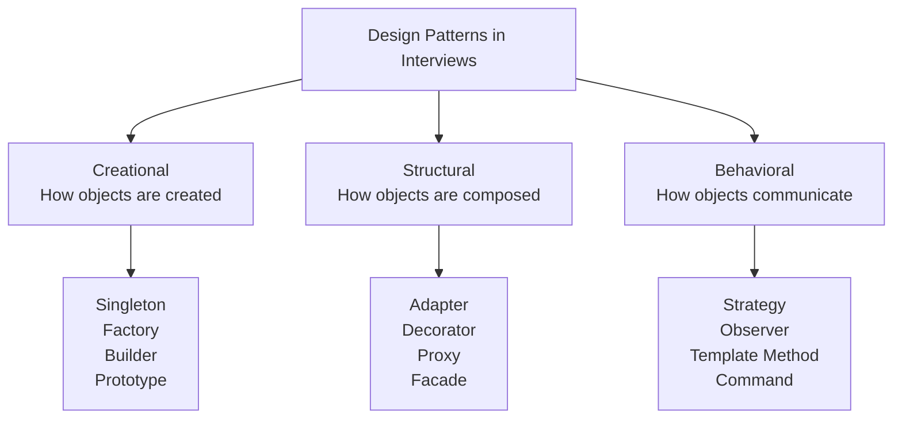
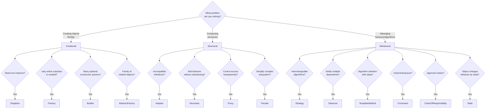

# Design Patterns — Complete Interview Preparation Guide

> **Target**: Senior/Staff/Principal Java Engineers in enterprise banking/financial services
> **Coverage**: GoF Creational, Structural, Behavioral patterns + Enterprise patterns

---

## Table of Contents

- [1. Why Design Patterns Matter in Interviews](#1-why-design-patterns-matter-in-interviews)
- [2. Creational Patterns](#2-creational-patterns)
  - [Singleton](#21-singleton)
  - [Factory Method](#22-factory-method)
  - [Abstract Factory](#23-abstract-factory)
  - [Builder](#24-builder)
  - [Prototype](#25-prototype)
- [3. Structural Patterns](#3-structural-patterns)
  - [Adapter](#31-adapter)
  - [Decorator](#32-decorator)
  - [Proxy](#33-proxy)
  - [Facade](#34-facade)
  - [Composite](#35-composite)
- [4. Behavioral Patterns](#4-behavioral-patterns)
  - [Strategy](#41-strategy)
  - [Observer](#42-observer)
  - [Template Method](#43-template-method)
  - [Command](#44-command)
  - [Chain of Responsibility](#45-chain-of-responsibility)
  - [State](#46-state)
- [5. Java + Spring Framework Patterns](#5-java--spring-framework-patterns)
- [6. Interview Questions & Answers](#6-interview-questions--answers)
- [7. Pattern Selection Guide](#7-pattern-selection-guide)

---

## 1. Why Design Patterns Matter in Interviews

At **Staff/Principal Engineer** level, interviewers expect you to:

1. **Identify patterns in existing code** — "What pattern is this? Why is it used here?"
2. **Propose patterns for new requirements** — "How would you design this feature?"
3. **Know the trade-offs** — When NOT to use a pattern is as important as when to use it
4. **Connect to frameworks** — Spring, Hibernate, Java APIs heavily use patterns internally



**Pattern Recognition Mindset**: When you see a problem in an interview, ask:
- "Do I need to **create** something flexibly?" → Creational
- "Do I need to **compose** or **wrap** something?" → Structural
- "Do I need to **define an algorithm** or **communicate between objects**?" → Behavioral

---

## 2. Creational Patterns

### 2.1 Singleton

**Intent**: Ensure a class has only one instance, providing a global access point.

**Banking Use Case**: Configuration manager, audit logger, connection pool coordinator.

```java
/**
 * Thread-safe Singleton using Double-Checked Locking (DCL).
 * Why volatile: Without volatile, an incompletely initialized instance
 * could be returned due to CPU instruction reordering.
 */
public class AuditLogger {
    // volatile ensures visibility of writes to all threads
    private static volatile AuditLogger instance;
    private final String logFile;

    private AuditLogger() {
        this.logFile = "/var/log/bank/audit.log";
    }

    public static AuditLogger getInstance() {
        if (instance == null) {                    // First check (no lock)
            synchronized (AuditLogger.class) {
                if (instance == null) {            // Second check (with lock)
                    instance = new AuditLogger();  // volatile prevents reordering
                }
            }
        }
        return instance;
    }

    public void log(String transactionId, String event) {
        // Thread-safe logging implementation
    }
}
```

**Best Practice — Enum Singleton** (Joshua Bloch's recommendation):

```java
/**
 * Enum Singleton: Thread-safe, serialization-safe, reflection-safe.
 * JVM guarantees only one enum instance per JVM.
 * This is THE recommended approach for singletons in modern Java.
 */
public enum ConfigurationManager {
    INSTANCE;

    private final Properties config;

    ConfigurationManager() {
        config = new Properties();
        loadConfig();
    }

    private void loadConfig() {
        // Load from environment/file
        config.setProperty("db.pool.size", "50");
        config.setProperty("api.timeout.ms", "5000");
    }

    public String getProperty(String key) {
        return config.getProperty(key);
    }

    public int getIntProperty(String key, int defaultValue) {
        String value = config.getProperty(key);
        return value != null ? Integer.parseInt(value) : defaultValue;
    }
}

// Usage
ConfigurationManager.INSTANCE.getProperty("db.pool.size");
```

**Pitfall — Static Class vs Singleton**:

```java
// ❌ Static utility class — NOT a Singleton
public class MathUtils {
    public static double calculateInterest(double principal, double rate) {
        return principal * rate;
    }
}

// ✅ Singleton — when you need state, lazy init, or interface polymorphism
public enum InterestCalculator {
    INSTANCE;
    private final Map<String, Double> rateCache = new ConcurrentHashMap<>();
    // Has state → needs to be a singleton, not static class
}
```

**Interview Q**: "What are the problems with the traditional Singleton pattern?"
- Difficult to unit test (can't mock easily)
- Violated Single Responsibility Principle (manages own lifecycle)
- Not inherently thread-safe without careful implementation
- Anti-pattern in some contexts — prefer dependency injection

---

### 2.2 Factory Method

**Intent**: Define an interface for creating objects, but let subclasses decide which class to instantiate.

**Banking Use Case**: Creating different payment processors based on payment type.

```java
/**
 * Factory Method Pattern.
 * Creator defines the factory method; subclasses provide implementations.
 */
public abstract class PaymentProcessorFactory {
    // Template method — uses the factory method
    public final PaymentResult processPayment(PaymentRequest request) {
        PaymentProcessor processor = createProcessor(request.getType()); // factory method
        return processor.process(request);
    }

    // Factory method — subclasses override to create specific processors
    protected abstract PaymentProcessor createProcessor(PaymentType type);
}

public class BankTransferFactory extends PaymentProcessorFactory {
    @Override
    protected PaymentProcessor createProcessor(PaymentType type) {
        return switch (type) {
            case DOMESTIC -> new DomesticTransferProcessor();
            case INTERNATIONAL -> new SWIFTTransferProcessor();
            case INSTANT -> new InstantPaymentProcessor();
            default -> throw new UnsupportedOperationException("Unknown type: " + type);
        };
    }
}

// Simple (static) Factory — NOT a GoF pattern but very common
public class PaymentProcessorRegistry {
    private static final Map<PaymentType, Supplier<PaymentProcessor>> REGISTRY = Map.of(
        PaymentType.CREDIT_CARD, CreditCardProcessor::new,
        PaymentType.BANK_TRANSFER, BankTransferProcessor::new,
        PaymentType.CRYPTO, CryptoProcessor::new
    );

    public static PaymentProcessor create(PaymentType type) {
        Supplier<PaymentProcessor> supplier = REGISTRY.get(type);
        if (supplier == null) throw new IllegalArgumentException("Unknown payment type: " + type);
        return supplier.get();
    }
}
```

---

### 2.3 Abstract Factory

**Intent**: Provide an interface for creating families of related objects without specifying concrete classes.

**Banking Use Case**: Creating different sets of components for different banking regions (EU, US, APAC).

```java
/**
 * Abstract Factory: Creates a family of related objects.
 * Use when: You need to create multiple related objects that must be used together.
 */
public interface BankingComponentFactory {
    PaymentValidator createPaymentValidator();
    FraudDetector createFraudDetector();
    ComplianceChecker createComplianceChecker();
}

// EU-specific factory (SEPA, GDPR compliance)
public class EUBankingFactory implements BankingComponentFactory {
    @Override
    public PaymentValidator createPaymentValidator() { return new SEPAPaymentValidator(); }
    @Override
    public FraudDetector createFraudDetector() { return new EUFraudDetector(); }
    @Override
    public ComplianceChecker createComplianceChecker() { return new GDPRComplianceChecker(); }
}

// US-specific factory (ACH, FINRA compliance)
public class USBankingFactory implements BankingComponentFactory {
    @Override
    public PaymentValidator createPaymentValidator() { return new ACHPaymentValidator(); }
    @Override
    public FraudDetector createFraudDetector() { return new USFraudDetector(); }
    @Override
    public ComplianceChecker createComplianceChecker() { return new FINRAComplianceChecker(); }
}

// Consumer — works with any factory, unaware of concrete types
public class PaymentService {
    private final PaymentValidator validator;
    private final FraudDetector fraudDetector;
    private final ComplianceChecker complianceChecker;

    public PaymentService(BankingComponentFactory factory) {
        this.validator = factory.createPaymentValidator();
        this.fraudDetector = factory.createFraudDetector();
        this.complianceChecker = factory.createComplianceChecker();
    }

    public PaymentResult processPayment(Payment payment) {
        validator.validate(payment);
        fraudDetector.check(payment);
        complianceChecker.verify(payment);
        return executePayment(payment);
    }
}
```

**Factory Method vs Abstract Factory**:

| Aspect | Factory Method | Abstract Factory |
|--------|---------------|------------------|
| Creates | One product | Family of related products |
| Mechanism | Inheritance (subclass overrides) | Composition (inject factory) |
| Use when | One type needs variation | Multiple related types need variation |

---

### 2.4 Builder

**Intent**: Construct complex objects step by step. Separate construction from representation.

**Banking Use Case**: Building complex transaction objects, API request objects.

```java
/**
 * Builder Pattern for complex Transaction.
 * Required fields enforced in constructor; optional fields via builder methods.
 * Immutable result — thread-safe.
 */
public final class Transaction {
    // Required fields
    private final String transactionId;
    private final String fromAccount;
    private final String toAccount;
    private final BigDecimal amount;
    private final Currency currency;
    // Optional fields
    private final String description;
    private final String referenceCode;
    private final Instant scheduledTime;
    private final Map<String, String> metadata;

    private Transaction(Builder builder) {
        this.transactionId = builder.transactionId;
        this.fromAccount = builder.fromAccount;
        this.toAccount = builder.toAccount;
        this.amount = builder.amount;
        this.currency = builder.currency;
        this.description = builder.description;
        this.referenceCode = builder.referenceCode;
        this.scheduledTime = builder.scheduledTime;
        this.metadata = Map.copyOf(builder.metadata);
    }

    public static class Builder {
        // Required
        private final String transactionId;
        private final String fromAccount;
        private final String toAccount;
        private final BigDecimal amount;
        private final Currency currency;
        // Optional (with defaults)
        private String description = "";
        private String referenceCode = null;
        private Instant scheduledTime = Instant.now();
        private Map<String, String> metadata = new HashMap<>();

        public Builder(String transactionId, String from, String to,
                       BigDecimal amount, Currency currency) {
            this.transactionId = Objects.requireNonNull(transactionId);
            this.fromAccount = Objects.requireNonNull(from);
            this.toAccount = Objects.requireNonNull(to);
            this.amount = Objects.requireNonNull(amount);
            this.currency = Objects.requireNonNull(currency);
            if (amount.compareTo(BigDecimal.ZERO) <= 0)
                throw new IllegalArgumentException("Amount must be positive");
        }

        public Builder description(String description) {
            this.description = description;
            return this; // fluent API - enables chaining
        }

        public Builder referenceCode(String code) {
            this.referenceCode = code;
            return this;
        }

        public Builder scheduledTime(Instant time) {
            this.scheduledTime = time;
            return this;
        }

        public Builder metadata(String key, String value) {
            this.metadata.put(key, value);
            return this;
        }

        public Transaction build() {
            return new Transaction(this);
        }
    }
}

// Usage — clean, readable, self-documenting
Transaction payment = new Transaction.Builder(
        "TXN-001", "ACC-123", "ACC-456",
        new BigDecimal("5000.00"), Currency.getInstance("GBP"))
    .description("Supplier payment - Invoice INV-2024-001")
    .referenceCode("REF-001")
    .metadata("channel", "API")
    .metadata("priority", "HIGH")
    .build();
```

**Modern Alternative — Java Records + static factories**:

```java
// For truly simple immutable DTOs, records eliminate builder boilerplate:
public record PaymentRequest(
    String fromAccount,
    String toAccount,
    BigDecimal amount,
    Currency currency
) {
    // Compact constructor for validation
    public PaymentRequest {
        Objects.requireNonNull(fromAccount, "fromAccount required");
        if (amount.compareTo(BigDecimal.ZERO) <= 0) throw new IllegalArgumentException("Amount must be positive");
    }
}
```

---

### 2.5 Prototype

**Intent**: Create new objects by cloning an existing object (the prototype).

**Banking Use Case**: Cloning base transaction templates for recurring payments.

```java
/**
 * Prototype Pattern — clone existing objects instead of creating from scratch.
 * Useful when object creation is expensive (database query, API call, complex setup).
 */
public class RecurringPaymentTemplate implements Cloneable {
    private String fromAccount;
    private String toAccount;
    private BigDecimal amount;
    private List<String> approvers;  // Mutable — needs deep copy!

    @Override
    public RecurringPaymentTemplate clone() {
        try {
            RecurringPaymentTemplate clone = (RecurringPaymentTemplate) super.clone();
            // Deep copy mutable fields to avoid shared state
            clone.approvers = new ArrayList<>(this.approvers);
            return clone;
        } catch (CloneNotSupportedException e) {
            throw new RuntimeException("Clone failed", e);
        }
    }
}

// Usage — cheaper than rebuilding the template each time
RecurringPaymentTemplate rentTemplate = loadTemplateFromDB("RENT_PAYMENT");  // expensive
RecurringPaymentTemplate marchPayment = rentTemplate.clone();  // cheap
marchPayment.setDescription("March 2024 Rent");
```

---

## 3. Structural Patterns

### 3.1 Adapter

**Intent**: Convert the interface of a class into another interface clients expect. Bridge between incompatible interfaces.

**Banking Use Case**: Integrating legacy payment system with new microservice API.

```java
/**
 * Adapter Pattern: Existing legacy system has different interface.
 * We create an Adapter that translates between the new and old interface.
 */

// New interface your system expects
public interface PaymentGateway {
    PaymentResult processPayment(PaymentRequest request);
    RefundResult processRefund(RefundRequest request);
}

// Legacy system — can't change this
public class LegacyPaymentSystem {
    public LegacyResponse executeTransaction(String accountFrom, String accountTo,
                                             double amount, String currency) { ... }
    public LegacyResponse reverseTransaction(String transactionId) { ... }
}

// Adapter — wraps legacy, implements new interface
public class LegacyPaymentAdapter implements PaymentGateway {
    private final LegacyPaymentSystem legacySystem;

    public LegacyPaymentAdapter(LegacyPaymentSystem legacySystem) {
        this.legacySystem = legacySystem;
    }

    @Override
    public PaymentResult processPayment(PaymentRequest request) {
        // Translate new interface → legacy call
        LegacyResponse response = legacySystem.executeTransaction(
            request.getFromAccount(),
            request.getToAccount(),
            request.getAmount().doubleValue(),  // BigDecimal → double
            request.getCurrency().getCurrencyCode()
        );
        // Translate legacy response → new interface
        return translateResponse(response);
    }

    @Override
    public RefundResult processRefund(RefundRequest request) {
        LegacyResponse response = legacySystem.reverseTransaction(request.getTransactionId());
        return translateRefundResponse(response);
    }

    private PaymentResult translateResponse(LegacyResponse response) {
        return response.getCode() == 0
            ? PaymentResult.success(response.getRef())
            : PaymentResult.failure(response.getMessage());
    }
}
```

---

### 3.2 Decorator

**Intent**: Attach additional responsibilities to an object dynamically. Provides a flexible alternative to subclassing.

**Banking Use Case**: Adding logging, metrics, caching, retry behavior to services.

```java
/**
 * Decorator Pattern: Add behavior without changing the original class.
 * Stack multiple decorators for combined behavior.
 */
public interface AccountService {
    Account getAccount(String accountId);
    void updateBalance(String accountId, BigDecimal amount);
}

// Core implementation
public class AccountServiceImpl implements AccountService {
    private final AccountRepository repository;

    @Override
    public Account getAccount(String accountId) {
        return repository.findById(accountId).orElseThrow();
    }

    @Override
    public void updateBalance(String accountId, BigDecimal amount) {
        repository.updateBalance(accountId, amount);
    }
}

// Decorator 1: Logging
public class LoggingAccountService implements AccountService {
    private final AccountService delegate;  // wrapped service
    private final Logger log = Logger.getLogger(this.getClass().getName());

    public LoggingAccountService(AccountService delegate) {
        this.delegate = delegate;
    }

    @Override
    public Account getAccount(String accountId) {
        log.info("Fetching account: " + accountId);
        long start = System.currentTimeMillis();
        Account result = delegate.getAccount(accountId);
        log.info("Fetched account in " + (System.currentTimeMillis() - start) + "ms");
        return result;
    }

    @Override
    public void updateBalance(String accountId, BigDecimal amount) {
        log.info("Updating balance for: " + accountId + " by " + amount);
        delegate.updateBalance(accountId, amount);
        log.info("Balance updated successfully");
    }
}

// Decorator 2: Caching
public class CachingAccountService implements AccountService {
    private final AccountService delegate;
    private final Map<String, Account> cache = new ConcurrentHashMap<>();

    public CachingAccountService(AccountService delegate) {
        this.delegate = delegate;
    }

    @Override
    public Account getAccount(String accountId) {
        return cache.computeIfAbsent(accountId, delegate::getAccount);
    }

    @Override
    public void updateBalance(String accountId, BigDecimal amount) {
        delegate.updateBalance(accountId, amount);
        cache.remove(accountId); // Invalidate cache on write
    }
}

// Usage — compose decorators
AccountService service = new LoggingAccountService(
    new CachingAccountService(
        new AccountServiceImpl(repository)
    )
);
```

**Real-World Java Examples of Decorator**:
- `BufferedInputStream(new FileInputStream(file))` — wraps InputStream
- `Collections.unmodifiableList(list)` — decorates with immutability
- Spring's `@Transactional` proxy wraps your service with transaction management

---

### 3.3 Proxy

**Intent**: Provide a surrogate/placeholder for another object to control access to it.

**Types**: Virtual proxy (lazy loading), Protection proxy (access control), Remote proxy (network access), Logging proxy.

```java
/**
 * Dynamic Proxy (Java reflection-based proxy).
 * Used internally by Spring AOP, Hibernate lazy loading.
 */
// Interface required for Java dynamic proxies
public interface TransactionService {
    TransactionResult processPayment(Payment payment);
    List<Transaction> getHistory(String accountId);
}

// Real implementation
public class TransactionServiceImpl implements TransactionService {
    @Override
    public TransactionResult processPayment(Payment payment) {
        // actual processing
    }
    @Override
    public List<Transaction> getHistory(String accountId) {
        return repository.findByAccount(accountId);
    }
}

// Dynamic Proxy for security + audit
public class SecurityAuditProxy implements InvocationHandler {
    private final Object target;
    private final SecurityContext securityContext;

    public SecurityAuditProxy(Object target, SecurityContext ctx) {
        this.target = target;
        this.securityContext = ctx;
    }

    @Override
    public Object invoke(Object proxy, Method method, Object[] args) throws Throwable {
        // Pre-invoke: authorization check
        if (!securityContext.isAuthorized(method.getName())) {
            throw new SecurityException("Access denied to: " + method.getName());
        }

        String auditId = UUID.randomUUID().toString();
        long start = System.currentTimeMillis();

        try {
            Object result = method.invoke(target, args);
            auditLog(auditId, method.getName(), args, "SUCCESS", System.currentTimeMillis() - start);
            return result;
        } catch (InvocationTargetException e) {
            auditLog(auditId, method.getName(), args, "FAILURE", System.currentTimeMillis() - start);
            throw e.getCause();
        }
    }

    // Creates proxy instance
    public static TransactionService createProxy(TransactionService service, SecurityContext ctx) {
        return (TransactionService) Proxy.newProxyInstance(
            service.getClass().getClassLoader(),
            new Class[]{TransactionService.class},
            new SecurityAuditProxy(service, ctx)
        );
    }
}
```

**Decorator vs Proxy**:

| Aspect | Decorator | Proxy |
|--------|-----------|-------|
| Purpose | Add behavior | Control access |
| Client awareness | Client chooses to decorate | Client unaware of proxy |
| Interface | Same as component | Same as component |
| Layers | Stackable | Usually one proxy |

---

### 3.4 Facade

**Intent**: Provide a simplified interface to a complex subsystem.

**Banking Use Case**: A single `PaymentFacade` that coordinates validation, fraud detection, account update, notification.

```java
/**
 * Facade Pattern: Simplify complex subsystem with a single interface.
 * Client doesn't need to know about internal subsystems.
 */
public class PaymentFacade {
    private final PaymentValidator validator;
    private final FraudDetectionService fraudService;
    private final AccountService accountService;
    private final NotificationService notificationService;
    private final AuditService auditService;
    private final ComplianceService complianceService;

    // Constructor injection — all dependencies
    public PaymentFacade(PaymentValidator validator, FraudDetectionService fraudService,
                         AccountService accountService, NotificationService notificationService,
                         AuditService auditService, ComplianceService complianceService) {
        this.validator = validator;
        this.fraudService = fraudService;
        this.accountService = accountService;
        this.notificationService = notificationService;
        this.auditService = auditService;
        this.complianceService = complianceService;
    }

    /**
     * Single entry point — hides all complexity from caller.
     * Client doesn't need to know about validation, fraud, compliance, audit steps.
     */
    public PaymentResult processPayment(PaymentRequest request) {
        // Orchestrates multiple subsystems
        validator.validate(request);
        complianceService.checkSanctions(request);
        fraudService.analyze(request);

        accountService.debit(request.getFromAccount(), request.getAmount());
        accountService.credit(request.getToAccount(), request.getAmount());

        String txnId = UUID.randomUUID().toString();
        auditService.recordTransaction(txnId, request);
        notificationService.notifyCustomer(request.getFromAccount(), txnId);

        return PaymentResult.success(txnId);
    }
}

// Client — beautifully simple
PaymentResult result = paymentFacade.processPayment(request);
```

---

### 3.5 Composite

**Intent**: Compose objects into tree structures. Treat individual objects and compositions uniformly.

**Banking Use Case**: Account grouping (individual → joint → corporate → holding company).

```java
public interface AccountComponent {
    BigDecimal getTotalBalance();
    void addComponent(AccountComponent component);
    List<AccountComponent> getComponents();
    String getName();
}

// Leaf — individual account
public class IndividualAccount implements AccountComponent {
    private final String name;
    private BigDecimal balance;

    @Override public BigDecimal getTotalBalance() { return balance; }
    @Override public void addComponent(AccountComponent c) { throw new UnsupportedOperationException(); }
    @Override public List<AccountComponent> getComponents() { return List.of(); }
    @Override public String getName() { return name; }
}

// Composite — group of accounts
public class AccountGroup implements AccountComponent {
    private final String name;
    private final List<AccountComponent> children = new ArrayList<>();

    @Override
    public BigDecimal getTotalBalance() {
        return children.stream()
            .map(AccountComponent::getTotalBalance)
            .reduce(BigDecimal.ZERO, BigDecimal::add);
    }

    @Override public void addComponent(AccountComponent c) { children.add(c); }
    @Override public List<AccountComponent> getComponents() { return List.copyOf(children); }
    @Override public String getName() { return name; }
}

// Usage — same interface regardless of depth
AccountGroup holdings = new AccountGroup("Goldman Holdings");
AccountGroup ukDivision = new AccountGroup("UK Division");
ukDivision.addComponent(new IndividualAccount("UK Current", new BigDecimal("500000")));
ukDivision.addComponent(new IndividualAccount("UK Savings", new BigDecimal("2000000")));
holdings.addComponent(ukDivision);
holdings.addComponent(new IndividualAccount("Offshore Reserve", new BigDecimal("5000000")));

// Works for any depth
System.out.println(holdings.getTotalBalance()); // Sum of everything
```

---

## 4. Behavioral Patterns

### 4.1 Strategy

**Intent**: Define a family of algorithms, encapsulate each one, make them interchangeable.

**Banking Use Case**: Different interest calculation strategies, different sorting/routing strategies.

```java
/**
 * Strategy Pattern: Encapsulate algorithms behind an interface.
 * Change behavior at runtime without changing context.
 */
@FunctionalInterface  // Strategy can be a functional interface
public interface InterestCalculationStrategy {
    BigDecimal calculate(BigDecimal principal, double rate, int months);
}

// Various strategies
public class SimpleInterestStrategy implements InterestCalculationStrategy {
    @Override
    public BigDecimal calculate(BigDecimal principal, double rate, int months) {
        // P * r * t
        return principal.multiply(BigDecimal.valueOf(rate * months / 12));
    }
}

public class CompoundInterestStrategy implements InterestCalculationStrategy {
    @Override
    public BigDecimal calculate(BigDecimal principal, double rate, int months) {
        // P * (1 + r/n)^(n*t)
        double factor = Math.pow(1 + rate / 12, months);
        return principal.multiply(BigDecimal.valueOf(factor)).subtract(principal);
    }
}

// Context — uses the strategy
public class SavingsAccount {
    private BigDecimal balance;
    private InterestCalculationStrategy interestStrategy;

    public SavingsAccount(BigDecimal balance, InterestCalculationStrategy strategy) {
        this.balance = balance;
        this.interestStrategy = strategy;
    }

    // Strategy can be changed at runtime
    public void setInterestStrategy(InterestCalculationStrategy strategy) {
        this.interestStrategy = strategy;
    }

    public BigDecimal applyMonthlyInterest(double rate) {
        BigDecimal interest = interestStrategy.calculate(balance, rate, 1);
        balance = balance.add(interest);
        return interest;
    }
}

// Modern Java — lambdas as strategies (no class needed for simple algorithms)
InterestCalculationStrategy flat = (principal, rate, months) ->
    principal.multiply(BigDecimal.valueOf(0.001));  // flat fee

SavingsAccount account = new SavingsAccount(new BigDecimal("10000"), flat);
account.setInterestStrategy(new CompoundInterestStrategy()); // swap at runtime
```

**Strategy vs Template Method**:
- **Strategy**: Algorithm is externalized; context calls strategy
- **Template Method**: Algorithm structure in base class; steps overridden by subclass

---

### 4.2 Observer

**Intent**: Define a one-to-many dependency so when one object changes state, all dependents are notified.

**Banking Use Case**: Transaction notification — SMS, email, fraud alert, balance update all triggered by one payment.

```java
/**
 * Observer Pattern: Decouple producer from consumers.
 */
public interface TransactionObserver {
    void onTransaction(TransactionEvent event);
}

public class TransactionEvent {
    private final String transactionId;
    private final String accountId;
    private final BigDecimal amount;
    private final TransactionType type;
    private final Instant timestamp;
    // constructor, getters...
}

// Subject (Observable)
public class TransactionProcessor {
    private final List<TransactionObserver> observers = new CopyOnWriteArrayList<>();

    public void subscribe(TransactionObserver observer) {
        observers.add(observer);
    }

    public void unsubscribe(TransactionObserver observer) {
        observers.remove(observer);
    }

    public PaymentResult processPayment(Payment payment) {
        // Core processing
        String txnId = executePayment(payment);

        // Notify all observers — decoupled from notification logic
        TransactionEvent event = new TransactionEvent(txnId, payment.getAccount(),
            payment.getAmount(), TransactionType.DEBIT, Instant.now());
        notifyObservers(event);

        return PaymentResult.success(txnId);
    }

    private void notifyObservers(TransactionEvent event) {
        observers.forEach(observer -> {
            try {
                observer.onTransaction(event);
            } catch (Exception e) {
                // One failing observer shouldn't stop others
                log.error("Observer failed: " + observer.getClass().getSimpleName(), e);
            }
        });
    }
}

// Concrete observers — all decoupled from each other
public class SMSNotificationObserver implements TransactionObserver {
    @Override
    public void onTransaction(TransactionEvent event) {
        smsService.send(event.getAccountId(), "Transaction: " + event.getAmount());
    }
}

public class FraudDetectionObserver implements TransactionObserver {
    @Override
    public void onTransaction(TransactionEvent event) {
        fraudEngine.analyze(event);  // Async fraud check
    }
}

public class BalanceUpdateObserver implements TransactionObserver {
    @Override
    public void onTransaction(TransactionEvent event) {
        accountService.refreshBalance(event.getAccountId());
    }
}

// Usage — clean registration
TransactionProcessor processor = new TransactionProcessor();
processor.subscribe(new SMSNotificationObserver(smsService));
processor.subscribe(new FraudDetectionObserver(fraudEngine));
processor.subscribe(new BalanceUpdateObserver(accountService));
```

**Modern Java — Event/Listener frameworks**:
- `java.util.EventListener` hierarchy
- Spring's `ApplicationEvent` / `@EventListener`
- Reactive Streams (`Publisher` / `Subscriber`)

---

### 4.3 Template Method

**Intent**: Define the skeleton of an algorithm in a base class, deferring some steps to subclasses.

**Banking Use Case**: Base transaction processing with hooks for specific transaction types.

```java
/**
 * Template Method: Define algorithm skeleton in abstract class.
 * Subclasses implement specific steps.
 */
public abstract class TransactionHandler {

    // Template method — defines the algorithm skeleton (final prevents override)
    public final TransactionResult handle(Transaction transaction) {
        validateTransaction(transaction);           // Abstract
        TransactionResult result = executeTransaction(transaction);  // Abstract
        postProcess(transaction, result);           // Hook (optional override)
        auditTransaction(transaction, result);      // Concrete (common to all)
        return result;
    }

    // Abstract steps — subclasses must implement
    protected abstract void validateTransaction(Transaction transaction);
    protected abstract TransactionResult executeTransaction(Transaction transaction);

    // Hook method — subclasses may optionally override
    protected void postProcess(Transaction transaction, TransactionResult result) {
        // Default: do nothing
    }

    // Common behavior — subclasses inherit, cannot override (final)
    private void auditTransaction(Transaction transaction, TransactionResult result) {
        auditLog.record(transaction.getId(), result.getStatus(), Instant.now());
    }
}

// Specific transaction type
public class WireTransferHandler extends TransactionHandler {
    @Override
    protected void validateTransaction(Transaction transaction) {
        if (transaction.getAmount().compareTo(new BigDecimal("10000")) > 0) {
            requireAdditionalApproval(transaction);  // Wire-specific validation
        }
    }

    @Override
    protected TransactionResult executeTransaction(Transaction transaction) {
        return swiftNetwork.submit(transaction);  // Wire-specific execution
    }

    @Override
    protected void postProcess(Transaction transaction, TransactionResult result) {
        // Wire-specific: delay until T+1
        scheduleSettlement(transaction, result);
    }
}

public class InternalTransferHandler extends TransactionHandler {
    @Override
    protected void validateTransaction(Transaction transaction) {
        accountService.checkSufficientFunds(transaction.getFromAccount(), transaction.getAmount());
    }

    @Override
    protected TransactionResult executeTransaction(Transaction transaction) {
        return ledger.immediateTransfer(transaction);  // Internal: instant settlement
    }
    // postProcess not overridden — uses default (does nothing)
}
```

---

### 4.4 Command

**Intent**: Encapsulate a request as an object, allowing parameterization, queueing, logging, and undo.

**Banking Use Case**: Transaction commands with undo/redo, scheduled payments queue.

```java
/**
 * Command Pattern: Encapsulate request as an object.
 * Supports: undo, redo, queuing, logging, retry.
 */
public interface Command {
    void execute();
    void undo();
    String getCommandId();
}

public class TransferCommand implements Command {
    private final String commandId = UUID.randomUUID().toString();
    private final AccountService accountService;
    private final String fromAccount;
    private final String toAccount;
    private final BigDecimal amount;
    private boolean executed = false;

    @Override
    public void execute() {
        if (executed) throw new IllegalStateException("Command already executed");
        accountService.debit(fromAccount, amount);
        accountService.credit(toAccount, amount);
        executed = true;
    }

    @Override
    public void undo() {
        if (!executed) throw new IllegalStateException("Command not executed yet");
        // Reverse the transfer
        accountService.debit(toAccount, amount);
        accountService.credit(fromAccount, amount);
        executed = false;
    }

    @Override
    public String getCommandId() { return commandId; }
}

// Invoker — manages command lifecycle
public class TransactionCommandProcessor {
    private final Deque<Command> executedCommands = new ArrayDeque<>();
    private final Queue<Command> pendingCommands = new LinkedList<>();

    public void schedule(Command command) {
        pendingCommands.offer(command);
    }

    public void processNext() {
        Command cmd = pendingCommands.poll();
        if (cmd != null) {
            cmd.execute();
            executedCommands.push(cmd);  // Track for undo
        }
    }

    public void undoLast() {
        if (!executedCommands.isEmpty()) {
            executedCommands.pop().undo();
        }
    }
}
```

---

### 4.5 Chain of Responsibility

**Intent**: Pass requests along a chain of handlers. Each handler decides to process or pass along.

**Banking Use Case**: Approval workflow — auto-approve → manager → VP → C-suite based on amount.

```java
/**
 * Chain of Responsibility: Process or pass to next handler in chain.
 */
public abstract class PaymentApprovalHandler {
    protected PaymentApprovalHandler nextHandler;

    public PaymentApprovalHandler setNext(PaymentApprovalHandler next) {
        this.nextHandler = next;
        return next; // Return next for fluent chaining
    }

    public abstract ApprovalResult handle(PaymentRequest request);

    protected ApprovalResult passToNext(PaymentRequest request) {
        if (nextHandler != null) {
            return nextHandler.handle(request);
        }
        return ApprovalResult.rejected("No approver found for amount: " + request.getAmount());
    }
}

public class AutoApprovalHandler extends PaymentApprovalHandler {
    private static final BigDecimal LIMIT = new BigDecimal("1000");

    @Override
    public ApprovalResult handle(PaymentRequest request) {
        if (request.getAmount().compareTo(LIMIT) <= 0) {
            return ApprovalResult.approved("AUTO"); // Handle it
        }
        return passToNext(request); // Too large — pass along
    }
}

public class ManagerApprovalHandler extends PaymentApprovalHandler {
    private static final BigDecimal LIMIT = new BigDecimal("50000");

    @Override
    public ApprovalResult handle(PaymentRequest request) {
        if (request.getAmount().compareTo(LIMIT) <= 0) {
            return requestManagerApproval(request);
        }
        return passToNext(request);
    }
}

public class ExecutiveApprovalHandler extends PaymentApprovalHandler {
    @Override
    public ApprovalResult handle(PaymentRequest request) {
        // Top of chain — handles everything that reaches here
        return requestExecutiveApproval(request);
    }
}

// Building the chain — fluent API
PaymentApprovalHandler chain = new AutoApprovalHandler();
chain.setNext(new ManagerApprovalHandler())
     .setNext(new ExecutiveApprovalHandler());

// Usage
ApprovalResult result = chain.handle(paymentRequest);
```

---

### 4.6 State

**Intent**: Allow an object to alter its behavior when its internal state changes. Object appears to change its class.

**Banking Use Case**: Account lifecycle — Active → Suspended → Closed.

```java
/**
 * State Pattern: Behavior changes based on current state.
 * Alternative to massive if-else chains of state checks.
 */
public interface AccountState {
    void deposit(BankAccount account, BigDecimal amount);
    void withdraw(BankAccount account, BigDecimal amount);
    void suspend(BankAccount account);
    void close(BankAccount account);
    String getStateName();
}

public class ActiveState implements AccountState {
    @Override
    public void deposit(BankAccount account, BigDecimal amount) {
        account.setBalance(account.getBalance().add(amount));
    }
    @Override
    public void withdraw(BankAccount account, BigDecimal amount) {
        if (amount.compareTo(account.getBalance()) > 0)
            throw new InsufficientFundsException();
        account.setBalance(account.getBalance().subtract(amount));
    }
    @Override
    public void suspend(BankAccount account) {
        account.setState(new SuspendedState());
    }
    @Override
    public void close(BankAccount account) {
        account.setState(new ClosedState());
    }
    @Override public String getStateName() { return "ACTIVE"; }
}

public class SuspendedState implements AccountState {
    @Override
    public void deposit(BankAccount account, BigDecimal amount) {
        throw new AccountSuspendedException("Cannot deposit to suspended account");
    }
    @Override
    public void withdraw(BankAccount account, BigDecimal amount) {
        throw new AccountSuspendedException("Cannot withdraw from suspended account");
    }
    @Override
    public void suspend(BankAccount account) { /* Already suspended */ }
    @Override
    public void close(BankAccount account) { account.setState(new ClosedState()); }
    @Override public String getStateName() { return "SUSPENDED"; }
}

public class BankAccount {
    private AccountState state;
    private BigDecimal balance;

    public BankAccount() { this.state = new ActiveState(); }

    public void deposit(BigDecimal amount) { state.deposit(this, amount); }
    public void withdraw(BigDecimal amount) { state.withdraw(this, amount); }
    public void suspend() { state.suspend(this); }
    public void close() { state.close(this); }

    void setState(AccountState newState) { this.state = newState; }
    public String getStatus() { return state.getStateName(); }
}
```

---

## 5. Java + Spring Framework Patterns

| Framework Behavior | Pattern Used |
|-------------------|--------------|
| `BeanFactory.getBean()` | Factory Method |
| Spring `@Configuration` classes | Abstract Factory |
| Spring AOP `@Transactional`, `@Cacheable` | Proxy |
| `HttpServletRequestWrapper` | Decorator |
| `RestTemplate` / `WebClient` | Facade |
| `ApplicationEvent` / `@EventListener` | Observer |
| `JdbcTemplate.execute(callback)` | Template Method |
| `HandlerInterceptor` chain | Chain of Responsibility |
| `SecurityContextHolder` | Singleton + Strategy |
| `CommandLineRunner` | Command |

---

## 6. Interview Questions & Answers

**Q1: What's the difference between Strategy and State patterns?**

> Both change behavior based on context, but:
> - **Strategy**: Context knows the algorithm, client typically chooses the strategy explicitly, strategies are interchangeable
> - **State**: Object itself transitions between states based on its own logic; client doesn't control which state is active

**Q2: When would you use Builder vs Factory?**

> **Factory**: When you want to hide which subclass to instantiate — "give me a PaymentProcessor, I don't care which type"
> **Builder**: When the object has many optional parameters and immutability matters — "build me a Transaction with exactly these fields set"
> Rule of thumb: if the constructor would have 4+ parameters or complex optional params → Builder

**Q3: How does Spring use the Proxy pattern for `@Transactional`?**

> Spring creates a JDK dynamic proxy (if interface exists) or CGLIB proxy (for classes) wrapping your bean. When you call a `@Transactional` method, the proxy intercepts it, opens a transaction, invokes the real method, then commits or rolls back. That's why `@Transactional` doesn't work for self-calls within the same class — you're calling `this` (the real object), bypassing the proxy.

**Q4: Decorator vs Proxy — how do you choose?**

> - Use **Decorator** when you want to add behavior and the client consciously stacks multiple behaviors (`new BufferedInputStream(new FileInputStream(...))`)
> - Use **Proxy** when you want to control access transparently — the client doesn't know a proxy exists
> In Spring: `@Transactional` = proxy (client unaware). Manual wrapping for caching = decorator.

**Q5: What's the risk with Singleton in a dependency injection framework?**

> Problems:
> 1. **Hard to test** — you can't inject a mock for a true Singleton
> 2. **Hidden dependencies** — `MySingleton.getInstance()` is a hidden dependency
> 3. **State sharing** — accidental global state bugs are subtle in concurrent systems
>
> Modern solution: Use Spring beans with `@Scope("singleton")` (the default). Let the DI container manage the lifecycle. This way, you get singleton behavior while keeping testability via injection.

---

## 7. Pattern Selection Guide



---

## Key Takeaways

1. **Singleton**: Use enum-based singletons; prefer DI over static getInstance()
2. **Factory**: Hides which class to instantiate; use when subclass varies
3. **Builder**: For objects with 4+ params; produces immutable objects
4. **Adapter**: Bridge old and new interfaces without changing either
5. **Decorator**: Add behavior by wrapping; stackable; Java I/O is the canonical example
6. **Proxy**: Control access transparently; Spring AOP is built on this
7. **Strategy**: Extract algorithms to be swappable; lambda-friendly in modern Java
8. **Observer**: Decouple publisher from subscribers; foundation of event-driven architecture
9. **Template Method**: Skeleton in base class, steps in subclasses; be careful with inheritance depth
10. **Chain of Responsibility**: Processing pipelines with ordered handlers; used in servlet filters, Spring Security
