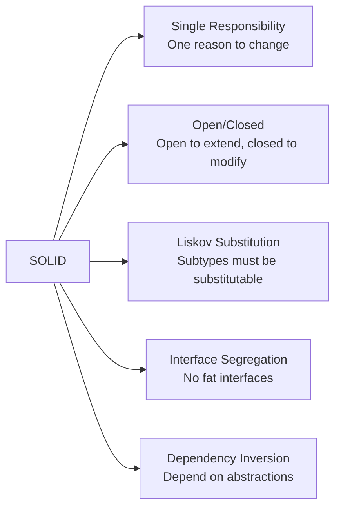

# SOLID Principles & Clean Code — Interview Preparation Guide

> **Target**: Senior/Staff/Principal Java Engineers
> **Scope**: SOLID, DRY, KISS, YAGNI — with Java examples, anti-patterns, and how to answer interview questions

---

## Table of Contents

- [1. Why SOLID Matters in Interviews](#1-why-solid-matters-in-interviews)
- [2. S — Single Responsibility Principle](#2-s--single-responsibility-principle)
- [3. O — Open/Closed Principle](#3-o--openclosed-principle)
- [4. L — Liskov Substitution Principle](#4-l--liskov-substitution-principle)
- [5. I — Interface Segregation Principle](#5-i--interface-segregation-principle)
- [6. D — Dependency Inversion Principle](#6-d--dependency-inversion-principle)
- [7. Supporting Principles: DRY, KISS, YAGNI](#7-supporting-principles-dry-kiss-yagni)
- [8. Putting It All Together — Refactoring Example](#8-putting-it-all-together--refactoring-example)
- [9. Interview Questions & Answers](#9-interview-questions--answers)

---

## 1. Why SOLID Matters in Interviews

SOLID principles are tested at **every** Staff/Principal level interview. You are expected to:

1. **Define each principle** with a real code example
2. **Identify violations** in given code (whiteboard exercise)
3. **Refactor** to fix the violation
4. **Explain trade-offs** — SOLID is a guideline, not dogma



**Key Interview Mindset**: SOLID isn't about following rules blindly. It's about making **code that is easy to change, test, and understand**.

---

## 2. S — Single Responsibility Principle

**Definition**: A class should have only **one reason to change**. It should have only one job.

### ❌ Violation — One Class Doing Too Much

```java
/**
 * GOD CLASS anti-pattern: This class handles business logic, persistence,
 * reporting, and notification. It has MANY reasons to change.
 */
public class TransactionProcessor {

    // Reason 1 to change: Business rules for transaction change
    public void processPayment(Payment payment) {
        if (payment.getAmount().compareTo(new BigDecimal("10000")) > 0) {
            applyHighValueCompliance(payment);
        }
        payment.setStatus("PROCESSED");

        // Reason 2 to change: Database schema changes
        String sql = "INSERT INTO transactions (id, amount, status) VALUES (?, ?, ?)";
        jdbcTemplate.update(sql, payment.getId(), payment.getAmount(), payment.getStatus());

        // Reason 3 to change: Report format changes
        String report = "Transaction: " + payment.getId() + " | Amount: " + payment.getAmount();
        Files.writeString(Paths.get("/reports/daily.txt"), report, StandardOpenOption.APPEND);

        // Reason 4 to change: Notification mechanism changes
        emailService.send(payment.getCustomerEmail(), "Payment processed: " + payment.getId());
        smsService.send(payment.getPhone(), "TXN " + payment.getId() + " processed");
    }
}
```

### ✅ Fixed — Each Class Has One Responsibility

```java
// Business logic ONLY
public class PaymentProcessor {
    private final ComplianceService complianceService;

    public ProcessedPayment process(Payment payment) {
        if (payment.getAmount().compareTo(new BigDecimal("10000")) > 0) {
            complianceService.applyHighValueRules(payment);
        }
        return new ProcessedPayment(payment, PaymentStatus.PROCESSED);
    }
}

// Persistence ONLY
public class TransactionRepository {
    private final JdbcTemplate jdbcTemplate;

    public void save(ProcessedPayment payment) {
        String sql = "INSERT INTO transactions (id, amount, status) VALUES (?, ?, ?)";
        jdbcTemplate.update(sql, payment.getId(), payment.getAmount(), payment.getStatus());
    }
}

// Reporting ONLY
public class TransactionReportService {
    public void appendToDailyReport(ProcessedPayment payment) {
        String entry = "Transaction: " + payment.getId() + " | Amount: " + payment.getAmount();
        Files.writeString(Paths.get("/reports/daily.txt"), entry, StandardOpenOption.APPEND);
    }
}

// Notification ONLY
public class PaymentNotificationService {
    public void notifyCustomer(ProcessedPayment payment, Customer customer) {
        emailService.send(customer.getEmail(), "Payment processed: " + payment.getId());
        smsService.send(customer.getPhone(), "TXN " + payment.getId() + " processed");
    }
}

// Orchestrator — coordinates the single-responsibility classes
public class PaymentService {
    public void handlePayment(Payment payment, Customer customer) {
        ProcessedPayment processed = paymentProcessor.process(payment);
        transactionRepository.save(processed);
        reportService.appendToDailyReport(processed);
        notificationService.notifyCustomer(processed, customer);
    }
}
```

**Test Benefit**: Each class now has a single, focused test. `PaymentProcessorTest` tests only business logic without DB, files, or emails.

---

## 3. O — Open/Closed Principle

**Definition**: Software entities should be **open for extension** but **closed for modification**. Add new behavior without touching existing code.

### ❌ Violation — Modified Every Time a New Payment Type Is Added

```java
// Every new payment type requires modifying this class → high risk
public class FeeCalculator {
    public BigDecimal calculateFee(Payment payment) {
        if (payment.getType() == PaymentType.CREDIT_CARD) {
            return payment.getAmount().multiply(new BigDecimal("0.02")); // 2%
        } else if (payment.getType() == PaymentType.BANK_TRANSFER) {
            return new BigDecimal("5.00"); // flat fee
        } else if (payment.getType() == PaymentType.CRYPTO) {
            return payment.getAmount().multiply(new BigDecimal("0.01")); // 1%
        }
        // Adding PAYPAL? Must modify THIS class again → violation!
        throw new IllegalArgumentException("Unknown payment type");
    }
}
```

### ✅ Fixed — Extend Without Modifying

```java
// Abstraction — closed for modification
@FunctionalInterface
public interface FeeStrategy {
    BigDecimal calculate(Payment payment);
}

// Open for extension — add new types without touching existing code
public class CreditCardFeeStrategy implements FeeStrategy {
    @Override
    public BigDecimal calculate(Payment payment) {
        return payment.getAmount().multiply(new BigDecimal("0.02"));
    }
}

public class BankTransferFeeStrategy implements FeeStrategy {
    @Override
    public BigDecimal calculate(Payment payment) {
        return new BigDecimal("5.00");
    }
}

// Adding PayPal? Create a new class — don't touch anything existing!
public class PayPalFeeStrategy implements FeeStrategy {
    @Override
    public BigDecimal calculate(Payment payment) {
        return payment.getAmount().multiply(new BigDecimal("0.029"))
                      .add(new BigDecimal("0.30")); // PayPal actual pricing
    }
}

// Calculator is now permanently closed for modification
public class FeeCalculator {
    private final Map<PaymentType, FeeStrategy> strategies;

    public FeeCalculator(Map<PaymentType, FeeStrategy> strategies) {
        this.strategies = Map.copyOf(strategies);
    }

    public BigDecimal calculateFee(Payment payment) {
        FeeStrategy strategy = strategies.get(payment.getType());
        if (strategy == null) throw new IllegalArgumentException("No fee strategy for: " + payment.getType());
        return strategy.calculate(payment);
    }
}
```

---

## 4. L — Liskov Substitution Principle

**Definition**: Objects of a superclass should be **replaceable with objects of a subclass** without breaking the program. If S is a subtype of T, S must honor all of T's contracts.

### ❌ Violation — Subclass Breaks Parent Contract

```java
public class SavingsAccount {
    protected BigDecimal balance;

    public void deposit(BigDecimal amount) {
        this.balance = this.balance.add(amount);
    }

    // Contract: withdraws any amount up to balance
    public void withdraw(BigDecimal amount) {
        if (balance.compareTo(amount) >= 0) {
            balance = balance.subtract(amount);
        }
    }
}

// ❌ FixedDepositAccount VIOLATES LSP:
// If you substitute FixedDepositAccount for SavingsAccount, withdrawal THROWS — broken!
public class FixedDepositAccount extends SavingsAccount {
    @Override
    public void withdraw(BigDecimal amount) {
        // Strengthen precondition: throws exception that parent never did
        throw new UnsupportedOperationException("Fixed deposits cannot be withdrawn before maturity!");
    }
}

// Code expecting SavingsAccount breaks when FixedDeposit is substituted
void processWithdrawal(SavingsAccount account, BigDecimal amount) {
    account.withdraw(amount); // ← CRASHES if FixedDepositAccount is passed
}
```

### ✅ Fixed — Proper Hierarchy That Respects Contracts

```java
// Narrow base contract: only what ALL account types can do
public interface Account {
    BigDecimal getBalance();
    void deposit(BigDecimal amount);
}

// Separate interface for accounts that support withdrawals
public interface WithdrawableAccount extends Account {
    void withdraw(BigDecimal amount) throws InsufficientFundsException;
}

public class SavingsAccount implements WithdrawableAccount {
    private BigDecimal balance;
    @Override public void deposit(BigDecimal amount) { balance = balance.add(amount); }
    @Override public void withdraw(BigDecimal amount) { balance = balance.subtract(amount); }
    @Override public BigDecimal getBalance() { return balance; }
}

public class FixedDepositAccount implements Account {
    private BigDecimal balance;
    @Override public void deposit(BigDecimal amount) { balance = balance.add(amount); }
    @Override public BigDecimal getBalance() { return balance; }
    // Does NOT implement WithdrawableAccount — no violation!

    public BigDecimal withdraw(LocalDate maturityDate) {  // Different signature — different concept
        if (LocalDate.now().isBefore(maturityDate)) throw new PrematureWithdrawalException();
        return balance;
    }
}

// Now code is honest about what it needs
void processWithdrawal(WithdrawableAccount account, BigDecimal amount) {
    account.withdraw(amount); // Only called on accounts that can withdraw
}
```

**LSP Checklist**:
- ✅ Subclass preconditions should be equal or weaker (don't add restrictions)
- ✅ Subclass postconditions should be equal or stronger (at least as good)
- ✅ Subclass should not throw new exception types not in parent's contract
- ✅ Subclass should preserve invariants of parent

---

## 5. I — Interface Segregation Principle

**Definition**: Clients should not be forced to depend upon interfaces they do not use. Create **small, focused interfaces** rather than large, fat ones.

### ❌ Violation — Fat Interface Forcing Unnecessary Methods

```java
// ❌ Fat interface — not all implementations need all methods
public interface AccountOperations {
    void deposit(BigDecimal amount);
    void withdraw(BigDecimal amount);
    BigDecimal getBalance();
    void applyInterest();       // Only for savings accounts
    BigDecimal getOverdraftLimit(); // Only for checking accounts
    void setFixedTermEnd(LocalDate date); // Only for fixed deposits
    List<Transaction> getHistory(); // Not all account types have history
}

// FixedDepositAccount is FORCED to implement overdraft and history methods it doesn't need
public class FixedDepositAccount implements AccountOperations {
    @Override public void withdraw(BigDecimal amount) { throw new UnsupportedOperationException(); }
    @Override public BigDecimal getOverdraftLimit() { throw new UnsupportedOperationException(); }
    @Override public List<Transaction> getHistory() { throw new UnsupportedOperationException(); }
    // ↑ Throwing on valid interface calls = ISP violation
}
```

### ✅ Fixed — Focused, Cohesive Interfaces

```java
// Core interface — every account has these
public interface Account {
    String getAccountId();
    BigDecimal getBalance();
    void deposit(BigDecimal amount);
}

// Supplementary interfaces — opt-in based on capability
public interface Withdrawable {
    void withdraw(BigDecimal amount) throws InsufficientFundsException;
}

public interface InterestBearing {
    void applyMonthlyInterest();
    double getAnnualInterestRate();
}

public interface Overdraftable {
    BigDecimal getOverdraftLimit();
    boolean isOverdrafted();
}

public interface Auditable {
    List<Transaction> getTransactionHistory(LocalDate from, LocalDate to);
}

// Implementations pick only what they need
public class SavingsAccount implements Account, Withdrawable, InterestBearing, Auditable {
    // Implements all four interfaces — makes sense for savings
}

public class CheckingAccount implements Account, Withdrawable, Overdraftable, Auditable {
    // No InterestBearing — checking accounts don't bear interest (in this bank)
}

public class FixedDepositAccount implements Account, InterestBearing {
    // No Withdrawable, no Overdraftable — fully honest about capabilities
}
```

**Benefits**:
- Tests are smaller and focused
- Adding a new feature to `InterestBearing` doesn't force non-interest accounts to change
- IDE shows only relevant methods when using the specific interface type

---

## 6. D — Dependency Inversion Principle

**Definition**:
1. High-level modules should not depend on low-level modules. Both should depend on **abstractions**.
2. Abstractions should not depend on details. **Details should depend on abstractions**.

### ❌ Violation — High-Level Class Directly Depends on Low-Level Concrete Class

```java
// Low-level module — concrete implementation detail
public class OracleDatabaseRepository {
    private final OracleDataSource dataSource = new OracleDataSource();  // Concrete!

    public Account findById(String id) {
        // Oracle-specific SQL
        return jdbcTemplate.queryForObject("SELECT * FROM accounts WHERE id = ?", ...);
    }
}

// High-level module — business logic DIRECTLY depends on Oracle implementation
// ❌ Changing DB from Oracle to PostgreSQL requires changing PaymentService!
public class PaymentService {
    private final OracleDatabaseRepository repository = new OracleDatabaseRepository(); // Concrete!

    public void processPayment(Payment payment) {
        Account account = repository.findById(payment.getAccountId()); // Tightly coupled
        // ...
    }
}
```

### ✅ Fixed — Both Depend on Abstraction

```java
// Abstraction — the contract both sides agree on
public interface AccountRepository {
    Optional<Account> findById(String id);
    void save(Account account);
    List<Account> findByCustomerId(String customerId);
}

// Low-level module — implements the abstraction
public class JdbcAccountRepository implements AccountRepository {
    private final JdbcTemplate jdbcTemplate;

    @Autowired
    public JdbcAccountRepository(JdbcTemplate jdbcTemplate) {
        this.jdbcTemplate = jdbcTemplate;
    }

    @Override
    public Optional<Account> findById(String id) {
        // Implementation detail — hidden behind interface
        return Optional.ofNullable(jdbcTemplate.queryForObject("SELECT * FROM accounts WHERE id = ?",
            new AccountRowMapper(), id));
    }

    @Override
    public void save(Account account) { ... }

    @Override
    public List<Account> findByCustomerId(String customerId) { ... }
}

// High-level module — depends ONLY on abstraction
@Service
public class PaymentService {
    private final AccountRepository accountRepository;  // Interface, not concrete!

    // Constructor injection — dependencies provided externally
    @Autowired
    public PaymentService(AccountRepository accountRepository) {
        this.accountRepository = accountRepository;
    }

    public void processPayment(Payment payment) {
        Account account = accountRepository.findById(payment.getAccountId())
            .orElseThrow(() -> new AccountNotFoundException(payment.getAccountId()));
        // ...
    }
}

// Test — inject a mock repository. No Oracle needed!
@Test
void testProcessPayment() {
    AccountRepository mockRepo = mock(AccountRepository.class);
    when(mockRepo.findById("ACC-001")).thenReturn(Optional.of(testAccount));

    PaymentService service = new PaymentService(mockRepo);
    service.processPayment(testPayment);
    // Assert as needed
}
```

**DIP in Spring**: Spring's DI container (ApplicationContext) IS the implementation of DIP at framework level. When you `@Autowire` an interface, Spring injects the appropriate concrete bean — high-level code never knows which implementation it gets.

---

## 7. Supporting Principles: DRY, KISS, YAGNI

### DRY — Don't Repeat Yourself

**Definition**: Every piece of knowledge must have a single, authoritative representation.

```java
// ❌ DRY Violation — same validation duplicated everywhere
public class PaymentController {
    public void createPayment(PaymentRequest req) {
        if (req.getAmount() == null || req.getAmount().compareTo(BigDecimal.ZERO) <= 0)
            throw new ValidationException("Invalid amount");
        if (req.getCurrency() == null || req.getCurrency().isBlank())
            throw new ValidationException("Currency required");
        // ...process...
    }
}

public class RefundController {
    public void createRefund(RefundRequest req) {
        // Same validation copied here — change once, forget to change here!
        if (req.getAmount() == null || req.getAmount().compareTo(BigDecimal.ZERO) <= 0)
            throw new ValidationException("Invalid amount");
        if (req.getCurrency() == null || req.getCurrency().isBlank())
            throw new ValidationException("Currency required");
        // ...process refund...
    }
}

// ✅ DRY Fixed — single source of truth
public class MonetaryAmountValidator {
    public void validate(BigDecimal amount, String currency) {
        if (amount == null || amount.compareTo(BigDecimal.ZERO) <= 0)
            throw new ValidationException("Amount must be positive");
        if (currency == null || currency.isBlank())
            throw new ValidationException("Currency is required");
    }
}
// Both controllers inject and call MonetaryAmountValidator
```

### KISS — Keep It Simple, Stupid

**Definition**: Most systems work best if they are kept simple rather than made complicated. Prefer the simplest solution that works.

```java
// ❌ Over-engineered — uses reflection + annotation scanning for simple config
@Payment(type = "CREDIT", processor = @ProcessorConfig(retries = 3, timeout = 5000))
public class CreditCardPaymentHandler { ... }

// Full reflection-based processor framework...
// 300 lines of annotation processors, factory chains, dynamic proxies...

// ✅ KISS — direct, clear, and simple
@Service
public class PaymentHandlerRegistry {
    private final Map<PaymentType, PaymentHandler> handlers;

    public PaymentHandlerRegistry(List<PaymentHandler> handlerList) {
        this.handlers = handlerList.stream()
            .collect(Collectors.toMap(PaymentHandler::getType, Function.identity()));
    }

    public PaymentResult handle(Payment payment) {
        return handlers.getOrDefault(payment.getType(), defaultHandler).handle(payment);
    }
}
```

### YAGNI — You Aren't Gonna Need It

**Definition**: Don't add functionality until it is needed. Avoid speculative generality.

```java
// ❌ YAGNI Violation — building flexible plugin system "just in case"
public class PaymentProcessor {
    private final List<PreProcessingPlugin> prePlugins = new ArrayList<>();
    private final List<PostProcessingPlugin> postPlugins = new ArrayList<>();
    private final List<ErrorHandlingPlugin> errorPlugins = new ArrayList<>();
    private final PluginLoader pluginLoader = new ClassPathPluginLoader();

    // 200 lines of plugin management code...
    // No one has asked for plugins. No use case exists yet.
}

// ✅ YAGNI — implement what's needed NOW, add extensibility WHEN a real need arises
public class PaymentProcessor {
    public PaymentResult process(Payment payment) {
        validate(payment);
        return execute(payment);
    }
}
// When the plugin requirement actually arrives, THEN refactor.
// Premature abstraction = technical debt.
```

---

## 8. Putting It All Together — Refactoring Example

**Before** — A real violation of multiple SOLID principles you might encounter:

```java
// GOD CLASS: SRP, OCP, DIP all violated
public class ReportGenerator {
    public void generateReport(String reportType, String format) {
        List<Transaction> transactions;

        // Violates SRP: doing SQL directly + report logic
        if (reportType.equals("DAILY")) {
            transactions = jdbcTemplate.queryForList("SELECT * FROM txns WHERE date = SYSDATE", ...);
        } else if (reportType.equals("MONTHLY")) {
            transactions = jdbcTemplate.queryForList("SELECT * FROM txns WHERE MONTH(date) = MONTH(SYSDATE)", ...);
        }

        // Violates OCP: adding new format requires modifying this class
        if (format.equals("CSV")) {
            // generate CSV...
        } else if (format.equals("PDF")) {
            // generate PDF...
        } else if (format.equals("EXCEL")) {
            // generate Excel...
        }
    }
}
```

**After** — Clean, SOLID design:

```java
// Abstraction for data source (DIP)
public interface TransactionQuery {
    List<Transaction> execute();
}

// Open for extension: new report periods = new class (OCP)
public class DailyTransactionQuery implements TransactionQuery {
    private final TransactionRepository repo;
    public List<Transaction> execute() { return repo.findForToday(); }
}

public class MonthlyTransactionQuery implements TransactionQuery {
    private final TransactionRepository repo;
    public List<Transaction> execute() { return repo.findForCurrentMonth(); }
}

// Abstraction for output format (DIP + ISP)
public interface ReportFormatter {
    byte[] format(List<Transaction> transactions);
    String getMimeType();
}

public class CsvReportFormatter implements ReportFormatter { ... }
public class PdfReportFormatter implements ReportFormatter { ... }

// Single Responsibility: orchestration only
public class ReportService {
    private final Map<String, TransactionQuery> queries;
    private final Map<String, ReportFormatter> formatters;

    // DIP: injected via constructor
    public ReportService(Map<String, TransactionQuery> queries,
                         Map<String, ReportFormatter> formatters) {
        this.queries = queries;
        this.formatters = formatters;
    }

    public ReportOutput generate(String queryKey, String formatterKey) {
        TransactionQuery query = queries.get(queryKey);
        ReportFormatter formatter = formatters.get(formatterKey);

        List<Transaction> data = query.execute();
        return new ReportOutput(formatter.format(data), formatter.getMimeType());
    }
}
```

---

## 9. Interview Questions & Answers

**Q1: How would you explain the Single Responsibility Principle to a junior developer?**

> "If you were describing what a class does and you say 'and' more than once, that class has more than one responsibility. `CustomerService` that creates customers **and** sends emails **and** logs to a file has three responsibilities. Split it. Each should have one reason to change."

**Q2: How does Spring enforce Dependency Inversion?**

> "Spring's IoC container is the practical embodiment of DIP. You declare dependencies via constructor injection with interface types — your high-level business code never knows which concrete implementation is wired in. The container resolves it at startup. This also makes tests trivial — inject mocks instead of real implementations without touching production code."

**Q3: Is it ever OK to violate SOLID?**

> "Yes. SOLID is a guide to managing change and complexity — not a law. For small scripts, utility classes, or genuinely simple code, applying full SOLID patterns creates unnecessary indirection. The cost of abstraction is added complexity. Only abstract things that are genuinely likely to change. The rule of three is useful: duplicate code once, extract on the third occurrence."

**Q4: How does `@Transactional` in Spring relate to SOLID?**

> "Spring's AOP proxy for `@Transactional` is the Open/Closed principle in action. You extend your service's behavior with transaction management **without modifying** the service class at all. The proxy wraps it transparently. It's also DIP — your code depends on the `@Transactional` annotation (abstraction), not on specific JDBC commit/rollback calls (detail)."

**Q5: Explain Liskov with the classic Rectangle/Square example.**

> "A Square IS-A Rectangle mathematically, but in code it violates LSP. A Rectangle's `setWidth()` and `setHeight()` are independent. A Square's `setWidth()` must also set the height (to stay square). Code that accepts a Rectangle and sets width to 5 and height to 10, then expects area of 50 — will return 100 if given a Square. The subtype (Square) broke the contract of the supertype (Rectangle). Solution: don't model this as an inheritance hierarchy — use composition instead."

---

## Key Takeaways

| Principle | One Line Summary | Code Signal |
|-----------|-----------------|-------------|
| **SRP** | One class, one job | Your class has "and" in its name/description |
| **OCP** | Extend, don't edit | You edit existing classes to add new types |
| **LSP** | Subtypes must honor parent contracts | Subclass throws for inherited methods |
| **ISP** | Small, focused interfaces | Implementation throws `UnsupportedOperationException` |
| **DIP** | Depend on interfaces, not concrete classes | `new ConcreteClass()` inside a high-level class |
| **DRY** | No repeated knowledge | Ctrl+F finds the same logic in 2+ places |
| **KISS** | Simplest solution that works | Can you understand it in 5 seconds? |
| **YAGNI** | Build now, not for imagined futures | Unused parameters, plugin systems with no plugins |
