# Java/JVM Internals - Complete Interview Preparation Guide

> **Target Audience**: Senior Java Developers (10+ years) preparing for Staff/Principal Engineer interviews in enterprise banking/financial services
>
> **Last Updated**: November 2024
>
> **Coverage**: Java 8, 11, 17, 21+

---

## Table of Contents

- [Part 1: JVM Architecture and Fundamentals](#part-1-jvm-architecture-and-fundamentals)
  - [1.1 JDK, JRE, JVM Relationships](#11-jdk-jre-jvm-relationships)
  - [1.2 JVM Architecture Components](#12-jvm-architecture-components)
  - [1.3 Class Loading Mechanism](#13-class-loading-mechanism)
  - [1.4 Bytecode and Execution Engine](#14-bytecode-and-execution-engine)

- [Part 2: JVM Memory Architecture](#part-2-jvm-memory-architecture)
  - [2.1 Overview of Memory Areas](#21-overview-of-memory-areas)
  - [2.2 Heap Memory Deep Dive](#22-heap-memory-deep-dive)
  - [2.3 Non-Heap Memory](#23-non-heap-memory)
  - [2.4 Thread-Local Memory](#24-thread-local-memory)
  - [2.5 Java Memory Model](#25-java-memory-model)

- [Part 3: Garbage Collection](#part-3-garbage-collection)
  - [3.1 GC Fundamentals](#31-gc-fundamentals)
  - [3.2 GC Algorithms](#32-gc-algorithms)
  - [3.3 Serial GC](#33-serial-gc)
  - [3.4 Parallel GC](#34-parallel-gc)
  - [3.5 CMS GC](#35-cms-gc)
  - [3.6 G1 GC](#36-g1-gc)
  - [3.7 ZGC](#37-zgc)
  - [3.8 Shenandoah GC](#38-shenandoah-gc)
  - [3.9 Epsilon GC](#39-epsilon-gc)
  - [3.10 GC Tuning and Troubleshooting](#310-gc-tuning-and-troubleshooting)

- [Part 4: JVM Performance Optimization](#part-4-jvm-performance-optimization)
  - [4.1 JIT Compilation](#41-jit-compilation)
  - [4.2 JVM Flags and Tuning](#42-jvm-flags-and-tuning)
  - [4.3 Profiling and Monitoring Tools](#43-profiling-and-monitoring-tools)
  - [4.4 Performance Analysis](#44-performance-analysis)

- [Part 5: Advanced Topics](#part-5-advanced-topics)
  - [5.1 String Pool and Interning](#51-string-pool-and-interning)
  - [5.2 Object Memory Layout](#52-object-memory-layout)
  - [5.3 Modern JVM Features](#53-modern-jvm-features)
  - [5.4 GraalVM and Native Images](#54-graalvm-and-native-images)

- [Part 6: Interview Preparation](#part-6-interview-preparation)
  - [6.1 Top 50 JVM Interview Questions](#61-top-50-jvm-interview-questions)
  - [6.2 System Design Questions Involving JVM Tuning](#62-system-design-questions-involving-jvm-tuning)
  - [6.3 Troubleshooting Scenarios](#63-troubleshooting-scenarios)
  - [6.4 How to Discuss JVM Topics in Interviews](#64-how-to-discuss-jvm-topics-in-interviews)

- [Appendices](#appendices)
  - [Appendix A: JVM Flags Reference](#appendix-a-jvm-flags-reference)
  - [Appendix B: GC Comparison Matrix](#appendix-b-gc-comparison-matrix)
  - [Appendix C: Troubleshooting Checklist](#appendix-c-troubleshooting-checklist)
  - [Appendix D: Recommended Reading and Resources](#appendix-d-recommended-reading-and-resources)

---

# Part 1: JVM Architecture and Fundamentals

## 1.1 JDK, JRE, JVM Relationships

### Overview

Understanding the distinction between JDK (Java Development Kit), JRE (Java Runtime Environment), and JVM (Java Virtual Machine) is fundamental to Java development. These three components form a hierarchical relationship where each builds upon the other. While seasoned developers use these terms daily, interviewers often start with this question to assess your foundational understanding before diving deeper.

In enterprise banking environments, this distinction matters practically: production servers typically need only the JRE (or increasingly, custom JRE images via jlink), while development environments require the full JDK. Understanding this helps with container optimization, security hardening, and deployment strategies.

### Foundational Concepts

**Java Virtual Machine (JVM)**
The JVM is an abstract computing machine that provides a runtime environment to execute Java bytecode. It's the core component that makes Java platform-independent through the "write once, run anywhere" (WORA) principle. The JVM:
- Loads, verifies, and executes bytecode
- Manages memory through garbage collection
- Provides runtime services (security, exception handling, etc.)
- Is platform-specific (Windows JVM differs from Linux JVM at the native code level)

**Java Runtime Environment (JRE)**
The JRE is a software layer that runs on top of the operating system and provides the runtime environment. It includes:
- JVM implementation (HotSpot, OpenJ9, etc.)
- Core Java class libraries (java.lang, java.util, java.io, etc.)
- Supporting files and configuration

**Java Development Kit (JDK)**
The JDK is a complete development environment that includes:
- JRE (with JVM and libraries)
- Development tools (javac compiler, jar, javadoc, jdb debugger, etc.)
- Additional libraries for development

**Important Note**: Starting with Java 11, Oracle stopped providing a separate JRE download. The JDK is now the primary distribution, though you can create custom runtime images using `jlink`.

### Technical Deep Dive

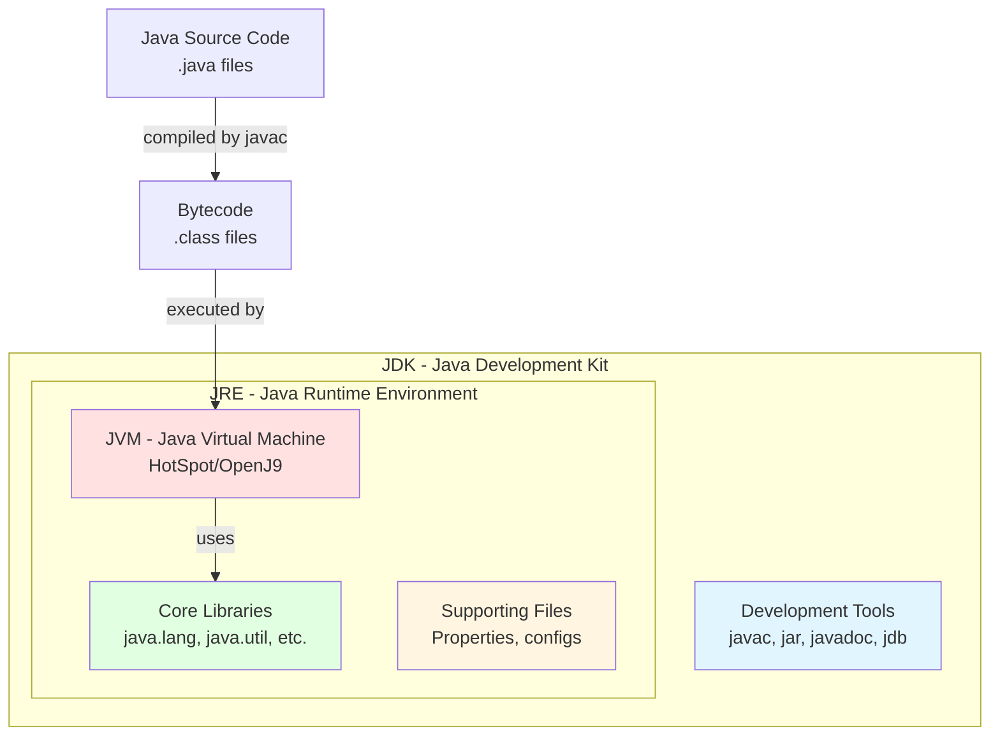

#### Detailed Component Breakdown

**1. JVM Components (Deepest Layer)**
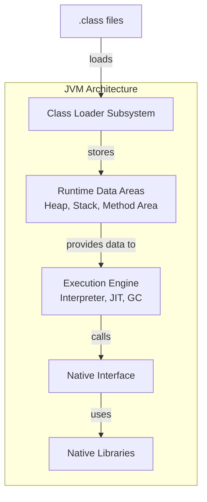

**2. JRE Additional Components**
- **Java Class Libraries**: Pre-compiled classes organized in rt.jar (Java 8) or modules (Java 9+)
- **JVM Implementation**: Could be HotSpot (Oracle/OpenJDK), OpenJ9 (IBM), GraalVM, etc.
- **Deployment Technologies**: Java Web Start (deprecated), Java Plug-in (removed)
- **UI Toolkits**: AWT, Swing, JavaFX libraries
- **Integration Libraries**: JDBC, JNDI, RMI, CORBA support

**3. JDK Additional Components**
- **javac**: Converts .java source files to .class bytecode files
- **jar**: Packages class files into JAR archives
- **javadoc**: Generates HTML documentation from source code comments
- **jdb**: Command-line debugger
- **jconsole/jvisualvm**: Performance monitoring and profiling tools
- **jps**: Lists Java processes
- **jstat**: JVM statistics monitoring tool
- **jmap**: Memory map tool
- **jstack**: Thread dump utility
- **jlink** (Java 9+): Creates custom runtime images

### Real-World Enterprise Scenarios

**Scenario 1: Container Optimization in Banking Microservices**

In a microservices architecture running on Kubernetes, you want to minimize container image size for faster deployment and reduced attack surface:

```dockerfile
# Old approach (using full JDK) - ~500MB
FROM openjdk:11-jdk
COPY app.jar /app.jar
CMD ["java", "-jar", "/app.jar"]

# Optimized approach (using JRE) - ~300MB
FROM openjdk:11-jre-slim
COPY app.jar /app.jar
CMD ["java", "-jar", "/app.jar"]

# Modern approach (custom JRE with jlink) - ~50-100MB
FROM openjdk:11 as builder
COPY app.jar /app.jar
RUN jlink --add-modules $(jdeps --print-module-deps app.jar) \
    --output /custom-jre

FROM debian:buster-slim
COPY --from=builder /custom-jre /opt/jre
COPY app.jar /app.jar
CMD ["/opt/jre/bin/java", "-jar", "/app.jar"]
```

**Scenario 2: Production vs Development Environments**

Enterprise banking applications have strict separation:
- **Development**: Full JDK for compilation, debugging, profiling
- **QA/UAT**: JRE sufficient for testing, but JDK tools helpful for diagnostics
- **Production**: Minimal JRE or custom runtime image
  - Security: Smaller surface area, fewer tools that could be exploited
  - Performance: Reduced memory footprint
  - Compliance: Easier to audit and certify

**Scenario 3: JVM Selection for Different Workloads**

Not all JVMs are created equal. Enterprise teams choose based on workload:

| Workload | JVM Choice | Reason |
|----------|-----------|--------|
| High-frequency trading | Azul Zing, GraalVM | Low-latency GC, predictable performance |
| Batch processing | HotSpot with Parallel GC | Maximum throughput |
| Containerized microservices | HotSpot with G1/ZGC | Balanced performance, good defaults |
| Cloud-native serverless | GraalVM Native Image | Fast startup, low memory footprint |

### Interview Questions & Model Answers

**Q1: What is the difference between JDK, JRE, and JVM?**

**Model Answer:**
"The JVM is the runtime engine that executes Java bytecode. It's platform-specific and handles memory management, security, and bytecode interpretation/compilation. The JRE adds the JVM plus all standard Java class libraries needed to run applications - essentially, it's everything you need to run Java programs but not develop them. The JDK includes the JRE plus development tools like the compiler (javac), debugger, and profiling tools.

In practical terms, production servers typically need only a JRE or custom runtime image created with jlink, while developer workstations need the full JDK. However, starting with Java 11, Oracle no longer provides separate JRE downloads - you get the JDK and can create custom runtimes as needed."

**Follow-up Q: Why would you use jlink to create a custom runtime?**

**Follow-up A:**
"In containerized environments, image size directly impacts deployment speed and security. Using jlink, I can create a minimal runtime containing only the modules my application actually uses. For a Spring Boot microservice, instead of a 300MB JRE, I might create a 50-80MB custom runtime. This reduces:
- Container build and pull times
- Memory footprint in Kubernetes clusters
- Attack surface (fewer libraries = fewer vulnerabilities)
- Storage costs in container registries

We used this approach at [company] to optimize our payment processing microservices, reducing average container size by 70% and improving cold-start times significantly."

**Q2: Can you run Java applications without the JVM?**

**Model Answer:**
"Not in the traditional sense. Java bytecode requires a JVM to execute. However, there are modern approaches that change this paradigm:

1. **GraalVM Native Image**: Compiles Java code ahead-of-time to native machine code. The resulting binary doesn't need a JVM but includes a minimal runtime called Substrate VM. This is increasingly used for serverless functions and CLI tools where startup time is critical.

2. **AOT Compilation** (Java 9-16, experimental): Created native code versions of classes before runtime, but was removed in Java 17 due to complexity and maintenance burden.

The trade-off is that you lose JVM advantages like dynamic optimization, where the JIT compiler can optimize code based on actual runtime behavior. Native images optimize based on static analysis, which might miss runtime patterns.

In enterprise banking, we still primarily use the JVM for long-running services where JIT optimizations provide better steady-state performance, but we're exploring Native Image for specific use cases like batch jobs and Lambda functions."

**Q3: What are the key components of the JVM?**

**Model Answer:**
"The JVM has three main subsystems:

1. **Class Loader Subsystem**: Loads, links, and initializes classes
   - Bootstrap ClassLoader: Loads core Java classes (java.lang.*)
   - Extension/Platform ClassLoader: Loads extensions
   - Application ClassLoader: Loads application classes

2. **Runtime Data Areas**: Memory regions
   - Heap: Object storage, garbage collected
   - Method Area/Metaspace: Class metadata, static variables
   - Stacks: One per thread, stores method frames
   - PC Registers: One per thread, current instruction address
   - Native Method Stacks: For JNI calls

3. **Execution Engine**:
   - Interpreter: Executes bytecode line by line
   - JIT Compiler: Compiles hot code to native machine code
   - Garbage Collector: Reclaims unused memory

The interaction between these components is what makes the JVM powerful. For example, the JIT compiler uses profiling data from the interpreter to make optimization decisions."

**Q4: How does JVM achieve platform independence?**

**Model Answer:**
"Java achieves platform independence through a two-step compilation model:

1. **Compile-time**: javac compiles .java source to .class bytecode. This bytecode is platform-independent - it's an intermediate representation defined by the JVM specification.

2. **Runtime**: The JVM (which IS platform-specific) interprets or JIT-compiles this bytecode to native machine code for the host platform.

The bytecode is the key - it's like a standardized instruction set that any JVM can understand. Whether you're running on x86 Linux, ARM macOS, or Windows, the same .class files work because each platform has a JVM implementation that knows how to execute that bytecode on that specific hardware/OS combination.

However, true 'write once, run anywhere' has some practical limitations:
- Native code integration (JNI) is platform-specific
- File system paths differ (/ vs \\)
- Some libraries have platform-specific implementations
- Performance characteristics vary across platforms

In banking systems, we typically certify applications on specific JVM versions and OS combinations, even though theoretically they should work anywhere."

**Q5: What changed with the module system in Java 9+?**

**Model Answer:**
"Java 9 introduced JPMS (Java Platform Module System), fundamentally changing how JDK and JRE are structured:

**Pre-Java 9**:
- Monolithic rt.jar containing all core classes (~60MB)
- Impossible to create subset distributions
- All internal classes accessible via reflection
- Classpath-based dependency management

**Java 9+ with Modules**:
- JDK split into ~70 modules (java.base, java.sql, etc.)
- Strong encapsulation: internal APIs (sun.*) are truly hidden
- Explicit dependencies via module-info.java
- jlink can create custom runtimes with only needed modules

**Practical Impact**:
```java
// module-info.java
module com.bank.payments {
    requires java.sql;           // Explicit dependencies
    requires spring.context;
    exports com.bank.payments.api;  // Only expose API package
    // Internal packages hidden by default
}
```

This matters in enterprise environments for:
1. **Security**: Can't access internal JDK APIs anymore (e.g., sun.misc.Unsafe without --add-opens)
2. **Performance**: Smaller runtime footprint with jlink
3. **Maintainability**: Clear module dependencies
4. **Migration challenges**: Legacy code using internal APIs breaks

Many banking applications still run on Java 8/11 partly because migrating to JPMS requires significant effort to deal with reflection and internal API usage."

### Common Pitfalls & Best Practices

**Pitfall 1: Confusion about JVM implementations**

Many developers don't realize "JVM" is a specification, not a single implementation:
- **HotSpot**: Oracle/OpenJDK default, best general-purpose performance
- **OpenJ9**: IBM/Eclipse, lower memory footprint
- **GraalVM**: Polyglot, native image support, advanced JIT
- **Azul Zing**: Commercial, ultra-low latency GC
- **Corretto**: Amazon's distribution of OpenJDK

Each has different performance characteristics, GC implementations, and licensing.

**Best Practice**: Document which JVM implementation and version your production systems use. Performance tuning is JVM-specific.

**Pitfall 2: Using the wrong JVM for the environment**

```bash
# Wrong: Using full JDK in production container
FROM openjdk:11-jdk  # 600MB+

# Better: Use JRE variant
FROM openjdk:11-jre-slim  # 200MB

# Best: Custom runtime with jlink
FROM openjdk:11 as builder
RUN jlink --module-path $JAVA_HOME/jmods \
    --add-modules java.base,java.logging,java.sql \
    --output /optimized-jre
# Result: 40-50MB
```

**Pitfall 3: Not understanding licensing changes (Oracle JDK)**

Post-Java 8, Oracle JDK licensing changed significantly:
- **Java 8**: Free for production use (but no longer receiving free public updates)
- **Java 11-16**: Subscription required for production use (Oracle JDK)
- **Java 17+**: Free again under new license (NFTC)

**Best Practice**: Most enterprises use OpenJDK distributions (AdoptOpenJDK/Adoptium, Corretto, Azul Zulu) to avoid licensing concerns.

**Pitfall 4: Assuming all Java X versions are identical**

Even within the same major version:
- Update releases can have significant GC improvements
- Different vendors may include backports
- Performance characteristics can vary

**Best Practice**:
```bash
java -version  # Check exact version
# Example output:
# openjdk version "11.0.12" 2021-07-20
# OpenJDK Runtime Environment (build 11.0.12+7-Ubuntu-0ubuntu3)
# OpenJDK 64-Bit Server VM (build 11.0.12+7-Ubuntu-0ubuntu3, mixed mode)
```

Document the FULL version string, including the build number and vendor.

### Key Takeaways

1. **JVM** is the runtime engine; **JRE** is JVM + libraries; **JDK** is JRE + development tools
2. Starting Java 11, there's no separate JRE download - use JDK and create custom runtimes with **jlink**
3. JVM is a **specification** with multiple implementations (HotSpot, OpenJ9, GraalVM, etc.)
4. **Platform independence** is achieved through bytecode as an intermediate representation
5. **Java 9+ modules** (JPMS) enable smaller, more secure distributions but require migration effort
6. **Production environments** should use minimal runtimes (custom JRE via jlink or distroless images)
7. **JVM choice matters**: Different implementations optimize for different characteristics (latency vs throughput)

---

## 1.2 JVM Architecture Components

### Overview

The JVM architecture is composed of three major subsystems that work together to load, verify, and execute Java bytecode. Understanding this architecture is crucial for diagnosing performance issues, memory problems, and for making informed decisions about JVM tuning in production environments.

While the JVM specification defines what must be done, implementations (HotSpot, OpenJ9, etc.) have flexibility in how they do it. This section focuses on the HotSpot JVM, which is the most widely used implementation in enterprise environments.

**Why this matters in interviews**: Interviewers use architecture questions to assess your depth of understanding. A surface-level answer about "stack and heap" won't suffice for senior roles. You need to demonstrate understanding of class loading, bytecode verification, execution modes, and how these components interact.

### Foundational Concepts

The JVM architecture can be visualized as three interconnected layers:

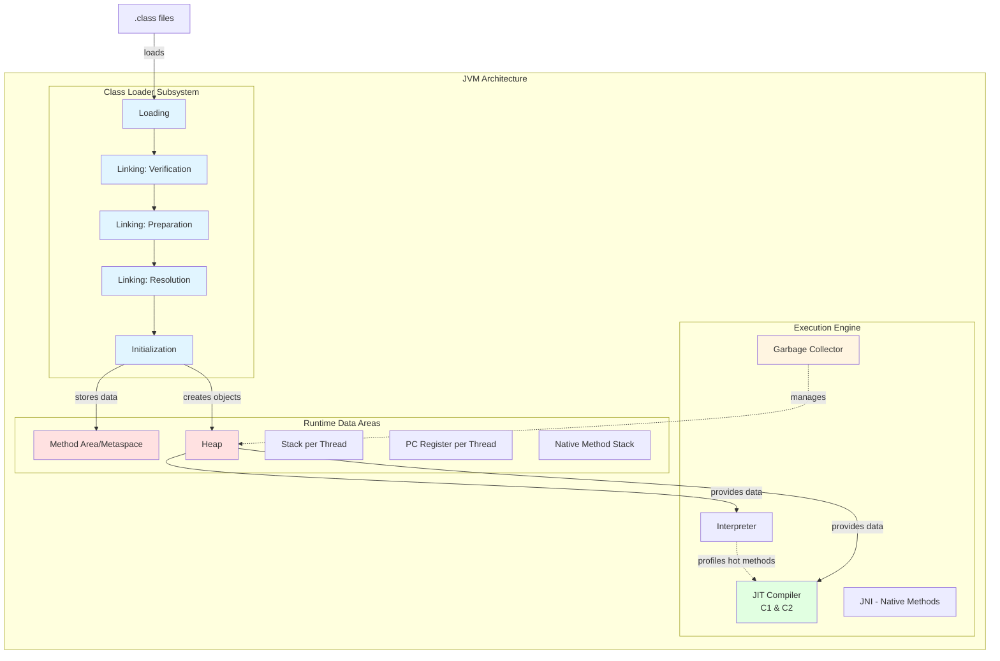

### Technical Deep Dive

#### 1. Class Loader Subsystem

The class loader subsystem is responsible for loading class files into memory. It follows a three-phase process: Loading, Linking, and Initialization.

**Phase 1: Loading**

The JVM reads the .class file and converts it into a binary stream, then creates a Class object in the heap to represent this class. Three types of class loaders work hierarchically:

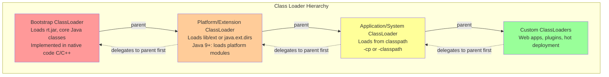

**Parent Delegation Model**: Before loading a class, a class loader delegates the request to its parent. Only if the parent can't find the class does the child attempt to load it. This ensures:
- Core Java classes are always loaded by the Bootstrap ClassLoader (prevents class spoofing)
- Consistency: same class loaded by same class loader
- Security: can't override java.lang.String with malicious code

**Example:**
```java
// When your code references a class
MyClass obj = new MyClass();

// Class loading sequence:
// 1. Application ClassLoader receives request for MyClass
// 2. Delegates to Platform ClassLoader
// 3. Platform delegates to Bootstrap ClassLoader
// 4. Bootstrap checks rt.jar - not found
// 5. Returns to Platform - checks extensions - not found
// 6. Returns to Application - checks classpath - FOUND
// 7. Application ClassLoader loads MyClass
```

**Phase 2: Linking**

Linking consists of three sub-phases:

**a) Verification**: Ensures the class file is structurally correct and secure
```
Checks performed:
- File format verification (magic number 0xCAFEBABE)
- Metadata verification (valid constant pool references)
- Bytecode verification (type safety, no stack overflows)
- Symbolic reference verification (referenced classes/methods exist)
```

If verification fails, you see `java.lang.VerifyError`. This is common when:
- Class files compiled with different Java versions
- Corrupted JAR files
- Bytecode manipulation gone wrong

**b) Preparation**: Allocates memory for static variables and initializes them to default values
```java
// Example
public class Example {
    static int count;        // Preparation sets count = 0
    static String name;      // Preparation sets name = null
    static final int MAX = 100;  // Preparation sets MAX = 100 (constants)
}
```

Note: Actual initialization with explicit values happens later in the Initialization phase.

**c) Resolution**: Converts symbolic references to direct references
```
Symbolic reference: "com/bank/Payment.processTransaction()"
Direct reference: Memory address of actual method code

This can be:
- Eager: Done during linking (default for final methods, fields)
- Lazy: Done when actually used (default for virtual methods)
```

**Phase 3: Initialization**

Executes static initializers and initializes static variables with their actual values:
```java
public class Payment {
    static int transactionCount = 0;          // Set to 0 in Preparation
    static Logger logger = Logger.getLogger(); // Initialized here

    static {
        // Static initialization block - executed here
        transactionCount = 100;
        System.out.println("Payment class initialized");
    }
}
```

**Class Initialization Triggers**:
- Creating instance of class (`new Payment()`)
- Accessing static method or field (except final constants)
- Reflection (`Class.forName()`)
- Initializing subclass (parent initialized first)
- JVM startup (designated main class)

**Thread Safety**: Class initialization is thread-safe. If multiple threads trigger initialization simultaneously, only one executes the <clinit> method, others block until complete.

#### 2. Runtime Data Areas

The JVM manages five types of runtime data areas:

**A. Method Area / Metaspace**

**Java 7 and earlier**: Called "Permanent Generation" (PermGen), part of heap
- Size: -XX:PermSize, -XX:MaxPermSize
- Problem: Fixed size led to `OutOfMemoryError: PermGen space`
- Common in: Applications with many classes (OSGi, JRebel, hot deployment)

**Java 8+**: Called "Metaspace", uses native memory
- Size: -XX:MetaspaceSize, -XX:MaxMetaspaceSize
- Default MaxMetaspaceSize: unlimited (bounded by OS)
- Benefits:
  - No more PermGen OutOfMemory errors (usually)
  - Automatic size adjustments
  - Easier to tune

**What's stored here**:
```
- Class structure (fields, methods, constructors)
- Method bytecode
- Runtime constant pool per class
- Field and method data
- Static variables (Java 8+, moved from PermGen)
- JIT compiled code (in Code Cache, separate region)
```

**Memory Layout**:
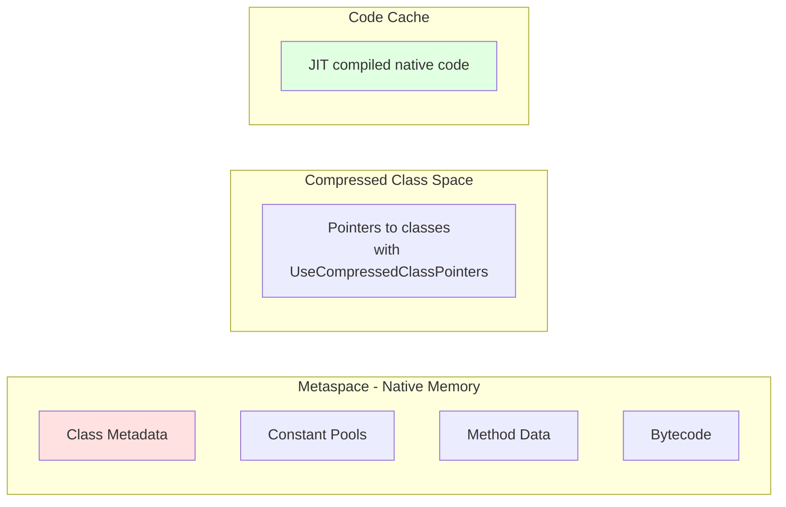

**Interview Gotcha**: "Where are static variables stored?"
- Java 7: PermGen (part of heap, GC'd with old generation)
- Java 8+: Metaspace (native memory, but objects they reference are in heap)

**B. Heap**

The heap is where all objects and arrays live. It's the largest memory area and the primary target of garbage collection.

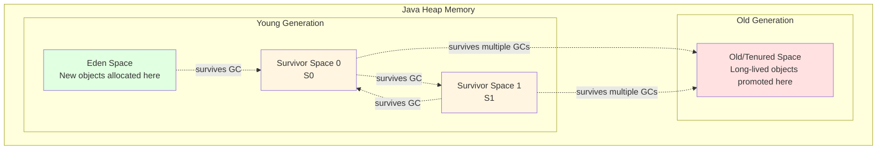

**Default Size Ratios** (can vary by GC):
- Young:Old = 1:2 (33% young, 67% old)
- Eden:Survivor = 8:1:1 (80% Eden, 10% S0, 10% S1)

**Heap Sizing Flags**:
```bash
-Xms2g          # Initial heap size
-Xmx8g          # Maximum heap size
-Xmn2g          # Young generation size
-XX:NewRatio=2  # Old/Young ratio (Old = 2 * Young)
-XX:SurvivorRatio=8  # Eden/Survivor ratio
```

**Object Lifecycle**:
1. New object allocated in Eden
2. Minor GC: Eden + S0 → S1 (survivors copied, dead objects collected)
3. Next Minor GC: Eden + S1 → S0 (ping-pong between survivors)
4. After N collections (default 15): Promoted to Old generation
5. Major GC: Cleans Old generation (more expensive)

**C. Java Stack (Per-Thread)**

Each thread gets its own private stack, created at the same time as the thread. The stack stores frames.

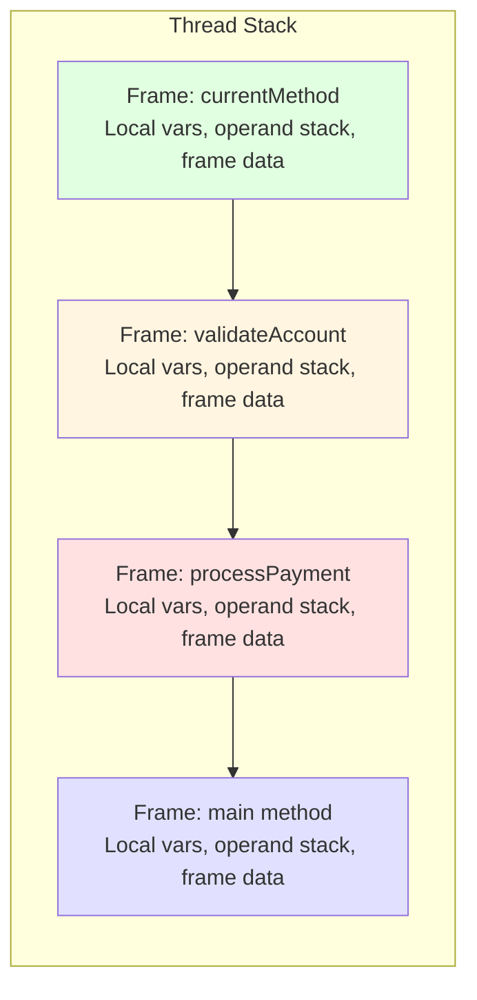

**Frame Components**:

1. **Local Variable Array**: Stores method parameters and local variables
```java
public void processPayment(int amount, String currency) {
    // Local variable array: [this, amount, currency, tax]
    double tax = amount * 0.1;
}
```

2. **Operand Stack**: Workspace for bytecode operations
```java
int x = 5;
int y = 10;
int z = x + y;

// Bytecode + operand stack:
// bipush 5       → [5]
// istore_1       → [] (store 5 in local var 1)
// bipush 10      → [10]
// istore_2       → [] (store 10 in local var 2)
// iload_1        → [5]
// iload_2        → [5, 10]
// iadd           → [15]
// istore_3       → [] (store 15 in local var 3)
```

3. **Frame Data**: References to constant pool, exception handling, method return

**Stack Size**:
```bash
-Xss1m          # Stack size per thread (default usually 1MB)
```

**Stack-related Errors**:
- `StackOverflowError`: Stack size exceeded (usually deep recursion)
- `OutOfMemoryError: unable to create new native thread`: Too many threads, OS limit reached

**D. Program Counter (PC) Register**

Each thread has a PC register storing the address of the current JVM instruction being executed. If the current method is native, the PC value is undefined.

**Purpose**:
- Enables thread switching (JVM saves PC, later resumes from same instruction)
- Used by JIT compiler to identify hot methods

**E. Native Method Stack**

Similar to Java Stack but for native methods (written in C/C++, called via JNI).

```java
// Example - native method
public class System {
    public static native void arraycopy(Object src, int srcPos,
                                        Object dest, int destPos,
                                        int length);
}
```

When native method is called:
- Java stack frame is popped
- Native method stack frame is pushed
- Native code executes
- Return to Java stack

#### 3. Execution Engine

The execution engine actually executes the bytecode. It has three main components working together:

**A. Interpreter**

- Executes bytecode instructions one at a time
- Fast startup (no compilation delay)
- Slower execution (same code re-interpreted each time)

**B. Just-In-Time (JIT) Compiler**

HotSpot uses tiered compilation with two JIT compilers:

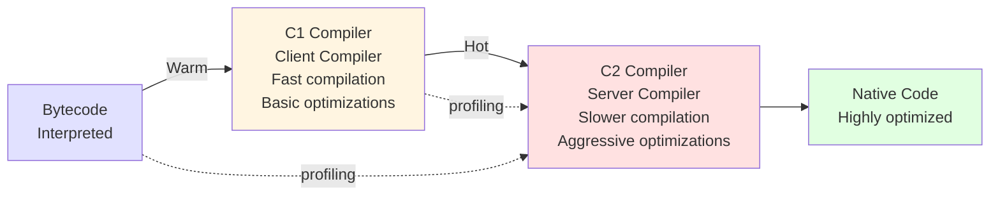

**Tiered Compilation Levels**:
- **Level 0**: Interpreter
- **Level 1**: C1 compiler, no profiling
- **Level 2**: C1 compiler, light profiling
- **Level 3**: C1 compiler, full profiling
- **Level 4**: C2 compiler, aggressive optimizations

**Method Compilation Thresholds**:
```bash
# Invocation threshold for C1
-XX:Tier2CompileThreshold=1500    # Method invocations

# Invocation threshold for C2
-XX:Tier4CompileThreshold=15000   # Method invocations
```

**Key JIT Optimizations**:

1. **Inlining**: Replaces method call with method body
```java
// Before inlining
public int calculate(int x) {
    return add(x, 5);
}
private int add(int a, int b) {
    return a + b;
}

// After inlining (conceptual)
public int calculate(int x) {
    return x + 5;  // add() body inserted
}
```

2. **Escape Analysis**: Determines if object escapes method scope
```java
public String createMessage(String name) {
    StringBuilder sb = new StringBuilder();  // Doesn't escape
    sb.append("Hello ").append(name);
    return sb.toString();
}

// JIT can:
// - Allocate StringBuilder on stack instead of heap (scalar replacement)
// - Eliminate synchronization if object doesn't escape (lock elision)
```

3. **Loop Optimizations**: Unrolling, hoisting invariants
```java
// Loop invariant code motion
for (int i = 0; i < array.length; i++) {
    // x + y is loop-invariant
    result += array[i] * (x + y);
}

// Optimized to:
int temp = x + y;
for (int i = 0; i < array.length; i++) {
    result += array[i] * temp;
}
```

4. **Dead Code Elimination**: Removes unreachable code
5. **Constant Folding**: Evaluates constants at compile time

**C. Garbage Collector**

The GC reclaims heap memory occupied by objects no longer reachable. This is covered extensively in Part 3.

**D. Java Native Interface (JNI)**

Allows Java code to call native code (C/C++) and vice versa. Used for:
- Platform-specific features (OS calls)
- Performance-critical code
- Legacy system integration

### Real-World Enterprise Scenarios

**Scenario 1: ClassLoader Leaks in Banking Application**

Problem: After multiple redeployments in application server, OutOfMemoryError: Metaspace.

**Root Cause**: ClassLoader leak. Each deployment creates new ClassLoader, but old ones aren't GC'd because:
```java
// ThreadLocal holding reference
private static ThreadLocal<Context> context = new ThreadLocal<>();

// On shutdown, thread pool threads not stopped
// ThreadLocal → Thread → ClassLoader → All classes
```

**Solution**:
```java
@PreDestroy
public void cleanup() {
    context.remove();  // Clear ThreadLocal
    executorService.shutdown();  // Stop threads
}
```

**Monitoring**:
```bash
jcmd <pid> VM.metaspace
# Shows metaspace usage, can detect growing metaspace
```

**Scenario 2: JIT Compiler Deoptimization**

In trading system, sudden performance degradation every few hours.

**Root Cause**: JIT compiled code being deoptimized due to class loading invalidating assumptions.

```java
// Initially, only PaymentImpl is loaded
interface Payment {
    void process();
}
class PaymentImpl implements Payment {
    public void process() { /* ... */ }
}

// Code compiled with assumption: Payment = PaymentImpl
for (Payment p : payments) {
    p.process();  // JIT inlines PaymentImpl.process()
}

// Later, new implementation loaded
class AnotherPaymentImpl implements Payment {
    public void process() { /* different */ }
}

// JIT must deoptimize - can no longer inline
// Performance drops
```

**Solution**: Avoid runtime class loading in hot paths, or accept performance variance.

**Scenario 3: Stack Size Tuning for Recursive Algorithms**

Processing complex financial calculations with recursion.

```java
// StackOverflowError with default 1MB stack
public BigDecimal calculateNPV(CashFlow cf, int depth) {
    if (depth == 0) return cf.amount;
    return cf.amount.add(
        calculateNPV(cf.next, depth - 1)
            .divide(BigDecimal.valueOf(1 + rate))
    );
}
```

**Options**:
1. Increase stack size: `-Xss2m`
2. Convert to iterative
3. Use trampolining/tail-call optimization pattern

**Trade-off**: Larger stacks = fewer maximum threads (each thread needs full stack space).

```bash
# Max threads ≈ (Available Memory - Heap) / Stack Size
# With 32GB RAM, 8GB heap, 1MB stack:
# Max threads ≈ (24GB) / 1MB = 24,000

# With 2MB stack:
# Max threads ≈ (24GB) / 2MB = 12,000
```

### Interview Questions & Model Answers

**Q1: Explain the class loading process in detail.**

**Model Answer**:
"Class loading happens in three phases: Loading, Linking, and Initialization.

During **Loading**, the JVM locates the .class file and reads its binary data into memory. This follows the parent delegation model where each class loader delegates to its parent before attempting to load itself. The hierarchy is Bootstrap ClassLoader (loads core Java classes), Platform ClassLoader (extensions), and Application ClassLoader (application classes). This ensures core Java classes can't be spoofed and provides consistency.

**Linking** has three steps:
1. *Verification* checks the class file is structurally correct - magic number, valid constant pool, bytecode safety. This is why you sometimes see VerifyError with corrupted JARs or version mismatches.
2. *Preparation* allocates memory for static variables and initializes them to default values (0, null, etc.).
3. *Resolution* converts symbolic references to direct memory references, either eagerly or lazily.

Finally, **Initialization** executes static initializers and assigns actual values to static variables. This is thread-safe - if multiple threads trigger initialization, only one executes while others block.

In practice, this matters for understanding issues like ClassLoader leaks in application servers or NoClassDefFoundError vs ClassNotFoundException."

**Follow-up: What's the difference between ClassNotFoundException and NoClassDefFoundError?**

**Answer**:
"**ClassNotFoundException** is a checked exception thrown when you explicitly try to load a class using Class.forName() or ClassLoader.loadClass() and it's not found. This is expected behavior when the class genuinely doesn't exist on the classpath.

**NoClassDefFoundError** is an error that occurs when a class was present during compilation and during initial loading, but isn't found when actually needed at runtime. Common causes:
- Class was present during compilation but missing from runtime classpath
- Static initializer threw an exception (ExceptionInInitializerError)
- Dependency chain issues

For example, if class A references class B, and B's static initializer fails, you'll get NoClassDefFoundError when trying to use B later - the class *exists* but initialization failed.

I've seen this in banking applications where environment-specific configuration classes are missing in certain deployments."

**Q2: How does the JVM achieve better performance than purely interpreted languages?**

**Model Answer**:
"The JVM uses adaptive optimization through its JIT compiler, which actually allows it to outperform static compilation in many cases.

Initially, methods are interpreted, which is slow but has zero compilation overhead. The JVM profiles this execution, collecting data about:
- How many times methods are called
- What types objects actually are at runtime
- Which branches are taken
- What values are commonly passed

Once methods become 'hot' (exceed invocation thresholds), they're compiled by C1 compiler with basic optimizations. The profiling continues, and very hot methods are recompiled by C2 compiler with aggressive optimizations based on actual runtime behavior:

- **Speculative optimizations**: If a virtual method call always resolves to the same concrete type, C2 inlines it. If later a different type appears, it deoptimizes and falls back.
- **Escape analysis**: Objects that don't escape methods can be allocated on the stack (faster) or eliminated entirely (scalar replacement).
- **Branch prediction**: Based on profiling, rarely-taken branches are moved out of the fast path.

This is better than ahead-of-time compilation because C++ compilers must be conservative - they don't know runtime behavior. The JVM's JIT compiler optimizes based on what actually happens in your production workload.

In our trading platform, we see performance improve by 30-40% after warm-up as the JIT compiler kicks in. That's why load testing needs a warm-up period."

**Q3: Explain Metaspace vs PermGen. Why did Java 8 make this change?**

**Model Answer**:
"PermGen (Permanent Generation) in Java 7 and earlier was a fixed-size region of the heap storing class metadata, method bytecode, static variables, and interned strings. The major issues were:

1. **OutOfMemoryError: PermGen space** was extremely common in applications with:
   - Many classes (OSGi plugins, application servers with multiple deployments)
   - Dynamic class generation (proxies, reflection)
   - ClassLoader leaks preventing class unloading

2. **Fixed size** meant you had to tune -XX:PermSize and -XX:MaxPermSize carefully, and needs varied greatly between applications.

3. **Limited GC** - PermGen was only collected during full GCs, which are expensive.

Java 8 moved class metadata to **Metaspace**, which uses native memory outside the heap. Benefits:

1. **Auto-tuning**: Metaspace grows automatically (up to MaxMetaspaceSize or available memory). No more guessing at PermGen size.

2. **No heap contention**: Class metadata doesn't compete with application objects for heap space.

3. **Better GC**: Classes can be unloaded more efficiently without waiting for full GC.

4. **Simplified tuning**: Usually just need -XX:MaxMetaspaceSize as a safety limit.

However, watch out: 'unlimited' Metaspace can consume all native memory if you have a ClassLoader leak. We monitor Metaspace with:
```bash
jstat -gc <pid> 1000
# Watch MC (Metaspace committed) and MU (Metaspace used)
```

In our microservices, we typically set MaxMetaspaceSize to 256MB as a safety net."

**Q4: What happens when you call new MyObject() at the JVM level?**

**Model Answer**:
"Let me walk through the complete sequence:

1. **Class Loading** (if not already loaded):
   - JVM triggers class loading for MyObject
   - Goes through Loading → Linking → Initialization phases
   - Parent class (if any) is loaded and initialized first

2. **Memory Allocation**:
   - JVM calculates object size (object header + instance fields + padding)
   - Allocates memory in Eden space (young generation) of the heap
   - Uses TLAB (Thread-Local Allocation Buffer) for thread-safe fast allocation
   - If TLAB is full, requests new TLAB from Eden
   - If Eden is full, triggers Minor GC

3. **Memory Initialization**:
   - Zeroes out allocated memory (all fields set to 0/null/false)
   - Sets up object header (mark word, class pointer, array length if applicable)

4. **Constructor Execution**:
   - Executes instance initialization blocks
   - Calls constructor code
   - If constructor chains (this() or super()), follows chain

5. **Reference Assignment**:
   - Reference to new object pushed onto operand stack
   - Assigned to variable

Here's what the bytecode looks like:
```
new           #2  // class MyObject
dup               // duplicate reference
invokespecial #3  // Constructor
astore_1          // store in local variable 1
```

The `dup` is important - keeps reference on stack for constructor call while preserving one for the assignment.

For performance, the JVM might use escape analysis to optimize:
- If object doesn't escape method: allocate on stack or eliminate entirely
- If constructor has side effects: can't optimize

In high-frequency trading systems, this matters because TLAB sizing (-XX:TLABSize) can significantly impact allocation performance."

**Q5: How does the JVM handle method calls? What's the difference between invokespecial, invokevirtual, and invokedynamic?**

**Model Answer**:
"The JVM has five invoke instructions, each for different call types:

**1. invokestatic** - Static method calls
```java
Math.sqrt(value)  // invokestatic
```
- Direct call, no dynamic dispatch
- Fastest because target is known at compile time

**2. invokespecial** - Special methods requiring no polymorphism
```java
super.method()    // invokespecial
this()            // invokespecial
new MyObject()    // invokespecial (constructor)
```
- Used for: constructors, super calls, private methods
- No virtual dispatch, exact method known

**3. invokevirtual** - Instance method calls (virtual dispatch)
```java
object.method()   // invokevirtual
```
- Uses virtual method table (vtable) for polymorphic dispatch
- Looks up method based on actual object type, not reference type
```java
Animal a = new Dog();
a.makeSound();  // Calls Dog.makeSound(), not Animal.makeSound()
```
- JIT compiler can optimize: if profiling shows method always resolves to same type, it inlines and adds deoptimization guard

**4. invokeinterface** - Interface method calls
```java
List list = new ArrayList();
list.add(item);   // invokeinterface
```
- More expensive than invokevirtual
- Can't use simple vtable offset (interface methods aren't in fixed position)
- Uses itable (interface table) or method lookup cache

**5. invokedynamic** - Dynamic language support (Java 7+)
```java
// Used by lambdas
Function<Integer, Integer> f = x -> x * 2;
f.apply(5);  // invokedynamic
```
- Target method determined at runtime by bootstrap method
- Used for: lambdas, method references, scripting languages
- First call is slow (bootstrap), subsequent calls cached

**Performance characteristics**:
- invokestatic/invokespecial: ~1ns (direct)
- invokevirtual: ~1-5ns (vtable lookup + possible cache miss)
- invokeinterface: ~5-10ns (itable/cache lookup)
- invokedynamic (after bootstrap): similar to invokevirtual

In performance-critical code (like our trading engine), we sometimes use final classes/methods to enable invokevirtual → invokespecial optimization."

**Q6: Explain TLAB (Thread-Local Allocation Buffers). Why do they matter?**

**Model Answer**:
"TLABs are per-thread memory regions in Eden space used for fast, lock-free object allocation. They're crucial for performance in multi-threaded applications.

**Without TLABs**, object allocation in the shared Eden space would require:
```java
synchronized void allocate(int size) {
    // Check if space available
    // Update heap pointer
    // Return allocated address
}
```
Every object allocation across all threads would contend on this lock - disastrous for performance.

**With TLABs**, each thread gets its own buffer (typically 100KB-1MB):
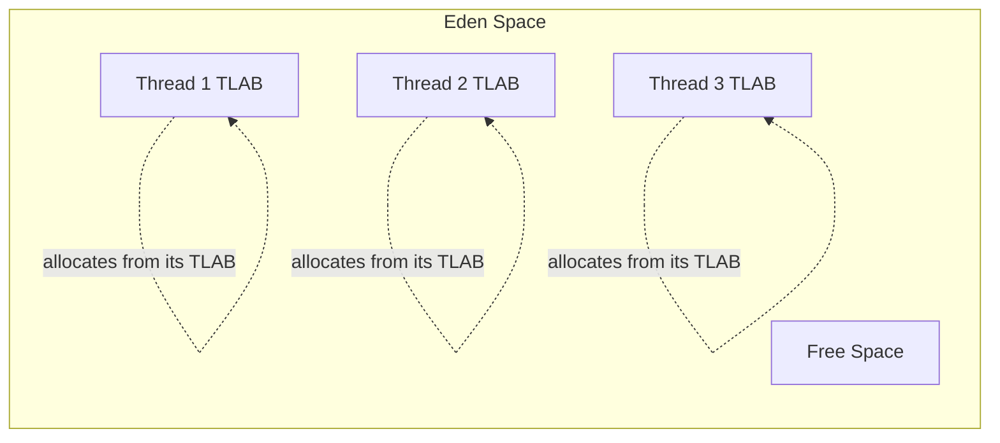

**Allocation process**:
1. Thread requests object allocation
2. Check if fits in current TLAB
3. If yes: bump pointer (just increment), no synchronization needed
4. If no:
   - Request new TLAB from Eden (requires lock, but infrequent)
   - Old TLAB's unused space wasted (internal fragmentation)
   - Allocate in new TLAB

**Benefits**:
- Lock-free fast path
- Better CPU cache locality (thread's objects nearby)
- Reduces contention dramatically

**Tunables**:
```bash
-XX:TLABSize=256k          # Fixed TLAB size
-XX:+ResizeTLAB            # Dynamic sizing (default)
-XX:TLABWasteTargetPercent=1  # Allowed waste percentage
```

**Monitoring**:
```bash
-XX:+PrintTLAB  # Detailed TLAB statistics

# Sample output:
# TLAB: gc thread: 0x00007f9e8c001000 [id: 123]
#       desired_size: 262144KB
#       slow allocs: 500
#       refill waste: 2048KB
```

**When TLABs matter**:
- High allocation rate applications (request processing, stream processing)
- Many threads allocating concurrently
- Small to medium object sizes

In our payment processing system handling 10K TPS, TLAB sizing reduced allocation contention by 90%, significantly improving p99 latency.

**Edge case**: Very large objects (>TLAB size) are allocated directly in Eden outside TLAB, requiring synchronization."

**Q7: How do you diagnose and fix a Metaspace leak?**

**Model Answer**:
"Metaspace leaks typically occur in applications with dynamic class loading - application servers, plugin systems, applications using lots of dynamic proxies or reflection.

**Diagnosis Steps**:

**1. Confirm it's a Metaspace leak**:
```bash
# Monitor over time
jstat -gc <pid> 1000

# Look for continuously growing Metaspace:
# MU (Metaspace Used) keeps increasing
# MC (Metaspace Committed) keeps growing
# Eventually: OutOfMemoryError: Metaspace
```

**2. Dump heap and analyze**:
```bash
# Enable to get dump on OOM
-XX:+HeapDumpOnOutOfMemoryError
-XX:HeapDumpPath=/tmp/heap.dump

# Or manually dump
jcmd <pid> GC.heap_dump /tmp/heap.hprof
```

**3. Analyze with MAT (Memory Analyzer Tool) or similar**:
```
# Look for:
- Many ClassLoader instances
- Unexpected number of Class instances
- Check ClassLoader dominator tree
```

**4. Find leak culprits**:
Common patterns I've encountered:

**a) ThreadLocal leak**:
```java
// Problematic
public class Service {
    private static ThreadLocal<Context> threadContext = new ThreadLocal<>();

    // If thread pool threads never die, ThreadLocal holds:
    // Thread → ThreadLocalMap → Entry → Context → ClassLoader
}

// Fix
@PreDestroy
public void cleanup() {
    threadContext.remove();  // Critical!
}
```

**b) Listener/Observer not deregistered**:
```java
// Leak
public void init() {
    EventBus.register(this);  // Holds reference to 'this'
}
// On redeploy, old instances never garbage collected

// Fix
@PreDestroy
public void cleanup() {
    EventBus.unregister(this);
}
```

**c) Dynamic proxy proliferation**:
```java
// Creating many dynamic proxies
for (Service s : services) {
    Proxy.newProxyInstance(...);  // Each creates new class
}

// Fix: Reuse proxies or use bytecode generation frameworks carefully
```

**d) Logging framework holding ClassLoader references**:
```java
// Log4j, Logback can hold references
// Fix: Proper context cleanup on shutdown
LoggerContext.getContext().stop();
```

**5. Enable GC logging for Metaspace**:
```bash
-XX:+PrintGCDetails
-XX:+PrintGCDateStamps
-Xlog:gc*,metaspace*=debug:file=/tmp/gc.log

# Shows when Metaspace GC occurs and what's collected
```

**6. Configure Metaspace limits**:
```bash
# Set reasonable maximum
-XX:MaxMetaspaceSize=512m
-XX:MetaspaceSize=256m  # Initial

# If limit is hit, triggers Full GC attempting to unload classes
# If still can't free space → OutOfMemoryError
```

**Prevention strategies**:
1. Minimize classloaders (don't create new ones unnecessarily)
2. Clean up resources in lifecycle hooks (@PreDestroy, contextDestroyed)
3. Avoid ThreadLocal with long-lived threads
4. Monitor Metaspace in production (alerts when >80% used)
5. Test redeployment scenarios in QA
6. Use profilers during development (VisualVM, YourKit)

In our banking application, we had a Metaspace leak from Spring Boot DevTools being inadvertently included in production. It created new classloaders on each context refresh. Fix was simple - exclude DevTools from production build."

### Common Pitfalls & Best Practices

**Pitfall 1: Assuming garbage collection only affects the heap**

Many developers think GC only cleans up objects, but:
- **Metaspace/PermGen** can be garbage collected (class unloading)
- Classes are collected only when:
  - ClassLoader is unreachable
  - All Class instances unreachable
  - All instances of the class unreachable

This is why ClassLoader leaks are so insidious - a single reference to any instance prevents entire ClassLoader from being collected.

**Best Practice**: In environments with dynamic class loading (app servers, plugin systems), be extremely careful with:
- Static references
- Thread pools
- ThreadLocal variables
- Observers/listeners

**Pitfall 2: Misunderstanding class initialization timing**

```java
public class ConfigHolder {
    // When is this initialized?
    public static final Logger log = Logger.getLogger();

    static {
        // This runs at class initialization
        System.out.println("ConfigHolder initialized");
    }
}

// Accessing constant - Does NOT initialize class
String CONSTANT = ConfigHolder.SOME_CONSTANT;

// Accessing logger - DOES initialize class
Logger log = ConfigHolder.log;
```

**Best Practice**: Understand when class initialization happens to avoid:
- Circular initialization dependencies
- Unexpected initialization order
- Performance issues (heavy static initialization blocks)

**Pitfall 3: Oversizing stacks or heap**

```bash
# Tempting but wrong
-Xss10m   # 10MB per thread stack

# With 1000 threads: 10GB just for stacks!
# Leaves less memory for heap and Metaspace
```

**Best Practice**:
- Stack size: 512KB-2MB is usually sufficient
- Profile actual stack usage
- If getting StackOverflowError, fix the code (probably excessive recursion)

**Pitfall 4: Ignoring TLAB sizing in high-throughput systems**

Default TLAB sizing works for most applications, but high-allocation workloads benefit from tuning:

```bash
# Monitor TLAB stats
-XX:+PrintTLAB

# Look for:
# - High "slow allocs" (allocation rate exceeds TLAB refill rate)
# - High "refill waste" (TLABs abandoned with lots of space left)
```

**Best Practice**: In ultra-high-throughput systems (>100K ops/sec), experiment with:
```bash
-XX:TLABSize=256k
-XX:TLABWasteTargetPercent=2
```

**Pitfall 5: Not understanding JIT compiler thresholds**

```java
// Microbenchmark pitfall
public void measurePerformance() {
    long start = System.nanoTime();
    for (int i = 0; i < 1000; i++) {
        doWork();  // Not JIT compiled - too few iterations!
    }
    long time = System.nanoTime() - start;
    // Result: Misleadingly slow because interpreted
}
```

**Best Practice**:
- Use JMH (Java Microbenchmark Harness) for accurate benchmarks
- Warm up (10K+ iterations) before measuring
- Understand that production performance ≠ microbenchmark performance

**Pitfall 6: Cargo-cult JVM tuning**

Blindly copying JVM flags from Stack Overflow:
```bash
# Someone else's flags (probably wrong for your app)
-XX:+AggressiveOpts
-XX:+UseFastAccessorMethods  # Deprecated/removed
-XX:+UseStringCache          # Doesn't exist
```

**Best Practice**:
1. Start with defaults (they're good!)
2. Measure baseline performance
3. Change ONE flag at a time
4. Measure again
5. Understand what each flag does
6. Document why you added each flag

### Key Takeaways

1. **Class Loading** follows parent delegation model (Bootstrap → Platform → Application) for security and consistency
2. **Metaspace** (Java 8+) replaced PermGen, uses native memory, auto-grows, but can still leak via ClassLoader references
3. **Runtime Data Areas**:
   - **Heap**: Object storage, GC managed, split into Young and Old generations
   - **Stack**: Per-thread, stores method frames, fixed or bounded size
   - **Metaspace**: Class metadata, native memory
   - **Code Cache**: JIT compiled code, can fill up in long-running apps
4. **Execution Engine** uses tiered compilation: Interpreter → C1 (fast compile, basic optimizations) → C2 (slow compile, aggressive optimizations)
5. **TLABs** enable lock-free fast-path allocation in multi-threaded applications
6. **JIT optimizations** (inlining, escape analysis, loop optimizations) based on runtime profiling can exceed static compilation performance
7. **Method invocation**: invokestatic/special (direct), invokevirtual (vtable), invokeinterface (itable), invokedynamic (lambda/method references)
8. Monitor Metaspace in applications with dynamic class loading; leaks prevent ClassLoader collection

---

## 1.3 Class Loading Mechanism

### Overview

The class loading mechanism is one of the JVM's most powerful features, enabling dynamic loading of classes at runtime, hot deployment in application servers, and the foundation for modern frameworks like Spring and Hibernate. Unlike C/C++ where all code must be linked at compile time, Java's dynamic class loading allows applications to load code on-demand, facilitating modularity, plugin architectures, and runtime extensibility.

For senior engineers, understanding class loading is critical for troubleshooting common production issues like `ClassNotFoundException`, `NoClassDefFoundError`, `ClassCastException`, and the notorious ClassLoader leaks in application servers. In banking environments running long-lived services with hot deployment capabilities, class loading knowledge is essential for maintaining system stability.

**Why interviewers focus on this**: Class loading reveals your understanding of JVM internals, memory management (Metaspace), concurrency (class initialization is thread-safe), and security (parent delegation model). It's a topic that separates developers who merely use Java from those who truly understand its runtime behavior.

### Foundational Concepts

**What is Class Loading?**

Class loading is the process by which the JVM locates, reads, parses, and makes available the binary representation of a class or interface. This happens dynamically—the first time a class is referenced, not at application startup.

**When is a Class Loaded?**

Classes are loaded lazily (on-demand) when:
1. Creating an instance: `new MyClass()`
2. Accessing a static method or field (except final constants): `MyClass.staticMethod()`
3. Reflection: `Class.forName("MyClass")`
4. Loading a subclass (parent loaded first)
5. JVM startup for the main class

**Three Phases of Class Loading**

The complete class loading lifecycle consists of three major phases:


### Technical Deep Dive

#### Phase 1: Loading

**Responsibilities**:
1. Find the binary representation (`.class` file) of the class
2. Parse the binary data to create in-memory representation
3. Create a `java.lang.Class` object in heap representing this class
4. Store class metadata in Metaspace

**ClassLoader Hierarchy and Parent Delegation Model**

Java uses a hierarchical delegation model for class loading:

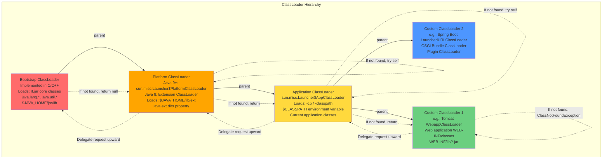

**Parent Delegation Algorithm**:

```java
// Simplified ClassLoader.loadClass() logic
protected Class<?> loadClass(String name, boolean resolve)
    throws ClassNotFoundException {

    // 1. Check if class is already loaded
    Class<?> c = findLoadedClass(name);

    if (c == null) {
        try {
            // 2. Delegate to parent ClassLoader first
            if (parent != null) {
                c = parent.loadClass(name, false);
            } else {
                // parent is null means this is Extension/Platform CL
                // Bootstrap CL (native) is the implicit parent
                c = findBootstrapClassOrNull(name);
            }
        } catch (ClassNotFoundException e) {
            // Parent couldn't find the class
        }

        if (c == null) {
            // 3. Parent failed, try loading ourselves
            c = findClass(name);  // Override this in custom ClassLoader
        }
    }

    if (resolve) {
        resolveClass(c);  // Trigger linking if needed
    }

    return c;
}
```

**Why Parent Delegation Model?**

1. **Security**: Core Java classes (java.lang.String) are always loaded by Bootstrap ClassLoader. You cannot replace them with malicious versions.
   ```java
   // Attempting to load custom java.lang.String
   // Will always delegate to Bootstrap CL
   // Your class never gets loaded - security violation prevented
   ```

2. **Consistency**: Same class loaded by same ClassLoader throughout application

3. **Avoids Duplication**: Class loaded once and shared

**Breaking Parent Delegation**

Some scenarios require breaking this model:
- **Servlet containers** (Tomcat): Web apps need their own versions of libraries
- **OSGi**: Module systems with complex dependencies
- **Hot reload**: Development tools (JRebel, Spring DevTools)

```java
// Tomcat's approach: Child-first delegation
@Override
public Class<?> loadClass(String name, boolean resolve) {
    // 1. Check if already loaded
    Class<?> c = findLoadedClass(name);

    // 2. Try loading from web app first (reverse order!)
    if (c == null && !name.startsWith("java.")) {
        try {
            c = findClass(name);  // Try self first
        } catch (ClassNotFoundException e) {
            // Not found, delegate to parent
        }
    }

    // 3. Only then delegate to parent
    if (c == null) {
        c = parent.loadClass(name, false);
    }

    return c;
}
```

**Class Identity**

Two classes are considered the same if and only if:
1. They have the same fully qualified name (`com.bank.Payment`)
2. They were loaded by the same ClassLoader instance

```java
// Different ClassLoader instances = Different classes!
ClassLoader cl1 = new MyClassLoader();
ClassLoader cl2 = new MyClassLoader();

Class<?> class1 = cl1.loadClass("com.bank.Payment");
Class<?> class2 = cl2.loadClass("com.bank.Payment");

System.out.println(class1 == class2);  // false!
System.out.println(class1.equals(class2));  // false!

Payment p1 = (Payment) class1.newInstance();
Payment p2 = (Payment) class2.newInstance();

// ClassCastException! Same source code, different runtime classes
p1 = (Payment) class2.newInstance();  // BOOM!
```

#### Phase 2: Linking

Linking prepares the loaded class for use. It has three sub-phases:

**2a. Verification**

Ensures the loaded class file is structurally correct and doesn't violate JVM security constraints.

**Verification Steps**:

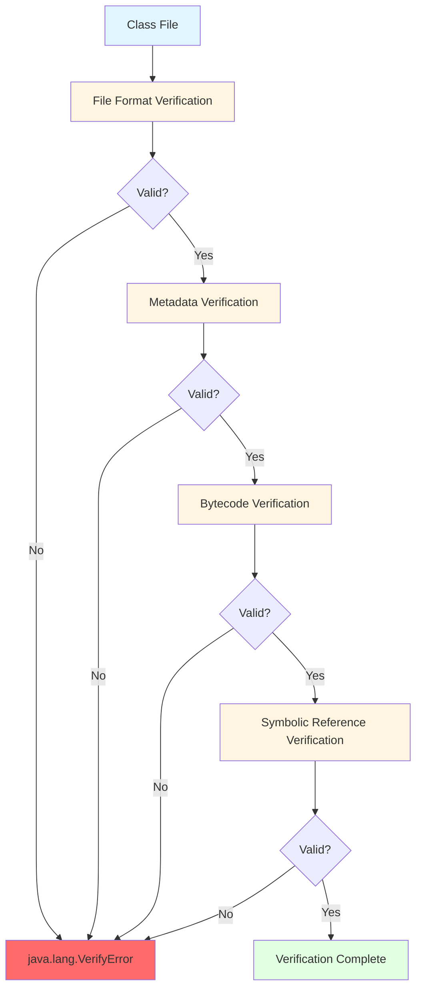

**1. File Format Verification**:
```
- Magic number: 0xCAFEBABE
- Version numbers (major.minor)
- Constant pool entries are well-formed
- Correct attribute structures
```

**2. Metadata Verification**:
```
- Class has a superclass (except java.lang.Object)
- Superclass is not final
- No overriding of final methods
- Fields and methods don't conflict
```

**3. Bytecode Verification** (most complex):
```
- Type safety: operations match operand types
- No operand stack overflow/underflow
- Local variable initialized before use
- Method invocations match method descriptors
- No illegal type casts
```

Example: What verifier catches:
```java
// Hypothetical manipulated bytecode (invalid)
public int getValue() {
    String s = "hello";
    return s;  // Type mismatch: String -> int
}
// Verifier: VerifyError - Expected int, found reference
```

**4. Symbolic Reference Verification**:
```
- Referenced classes exist
- Referenced fields exist in target class
- Referenced methods exist with correct signatures
```

**Disabling Verification** (NOT recommended):
```bash
# Skip verification (faster startup, security risk)
-Xverify:none  # Deprecated in Java 13+, removed in Java 17

# Modern approach: trust specific JARs
# No built-in flag, verification always happens
```

**2b. Preparation**

Allocates memory for static variables and initializes them to **default values** (not the values in code).

```java
public class Account {
    // Preparation phase:
    static int accountCount;           // Set to 0
    static String bankName;           // Set to null
    static boolean active;            // Set to false
    static final int MAX_ACCOUNTS = 1000;  // Set to 1000 (constants assigned)
    static final String VERSION;      // Set to null (non-constant)

    static {
        VERSION = "1.0";  // Actual assignment in Initialization phase
        accountCount = 100;  // Actual assignment in Initialization phase
    }
}
```

**Memory allocation**:
- Java 7 and earlier: Static variables in PermGen
- Java 8+: Static variables in Metaspace (but objects they reference are in Heap)

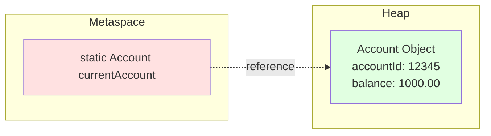

**2c. Resolution**

Converts **symbolic references** in the constant pool to **direct references** (memory addresses).

**Symbolic vs Direct References**:

```java
// Source code
public class PaymentProcessor {
    public void process() {
        Account acc = new Account();
        acc.deposit(100);
    }
}
```

**Symbolic References** (in .class file constant pool):
```
// Constant pool entries (symbolic)
#1 = Class              #2         // com/bank/Account
#2 = Utf8               com/bank/Account
#3 = Methodref          #1.#4      // Account.deposit:(I)V
#4 = NameAndType        #5:#6      // deposit:(I)V
#5 = Utf8               deposit
#6 = Utf8               (I)V

// Instructions reference constant pool indices
// new    #1  // Reference to "com/bank/Account" (symbolic)
// invokevirtual #3  // Reference to "Account.deposit:(I)V" (symbolic)
```

**After Resolution** (direct references):
```
// Runtime memory addresses
#1 = Class              0x7f8a4c001000  // Memory address of Account class
#3 = Methodref          0x7f8a4c001128  // Memory address of deposit() method

// Now instructions can directly jump to these addresses
```

**Lazy vs Eager Resolution**:

```java
// Lazy Resolution (default for most references)
// Resolved when first used

public void processPayment() {
    // Account class resolved when this line executes
    Account acc = new Account();
}

// Eager Resolution (for certain scenarios)
// - final methods
// - static methods
// - Constructors
// May be resolved during linking
```

**Resolution Errors**:
```java
// NoClassDefFoundError
// Class was present during compilation but missing at runtime
public class Service {
    private Logger logger = new Logger();  // Logger.class missing
}

// NoSuchMethodError
// Method signature changed between compilation and runtime
payment.process(100);  // process(int) no longer exists, now process(long)

// IncompatibleClassChangeError
// Class definition changed incompatibly (e.g., interface -> class)
```

#### Phase 3: Initialization

Executes class initialization code:
1. Static variable initializers
2. Static initialization blocks (`static { }`)

**Initialization Triggers**:

1. **Active Use** (triggers initialization):
```java
new MyClass();                    // Creating instance
MyClass.staticMethod();          // Invoking static method
MyClass.staticField = value;     // Accessing non-final static field
Class.forName("MyClass");        // Reflection
MySubclass obj = new MySubclass(); // Subclass initialization (parent initialized first)
```

2. **Passive Use** (does NOT trigger initialization):
```java
MyClass.CONSTANT;                // Accessing final static primitive constant
MyClass[].class;                 // Array class reference
MyClass.class;                   // Class literal
```

**Thread Safety in Initialization**:

The JVM guarantees that class initialization is thread-safe:

```java
public class Singleton {
    private static final Singleton INSTANCE = new Singleton();

    static {
        System.out.println("Initializing Singleton");
        // Heavy initialization
    }

    public static Singleton getInstance() {
        return INSTANCE;
    }
}

// Multiple threads calling Singleton.getInstance() concurrently
// Only ONE thread executes the static block
// Other threads block until initialization completes
```

**Initialization Lock**:

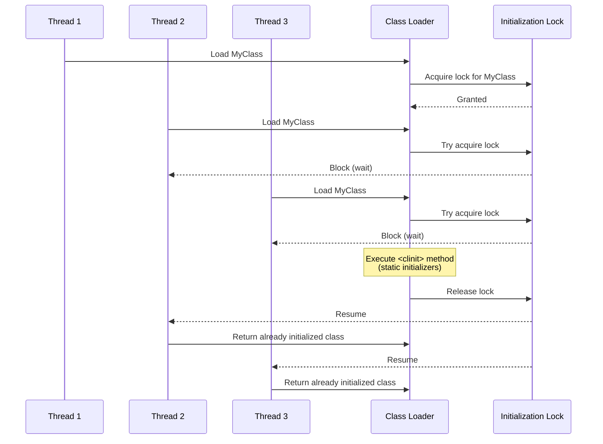

**Initialization Order**:

```java
public class Parent {
    static {
        System.out.println("1. Parent static block");
    }

    {
        System.out.println("3. Parent instance block");
    }

    public Parent() {
        System.out.println("4. Parent constructor");
    }
}

public class Child extends Parent {
    static {
        System.out.println("2. Child static block");
    }

    {
        System.out.println("5. Child instance block");
    }

    public Child() {
        System.out.println("6. Child constructor");
    }
}

// new Child();
// Output:
// 1. Parent static block
// 2. Child static block
// 3. Parent instance block
// 4. Parent constructor
// 5. Child instance block
// 6. Child constructor
```

**Initialization Deadlock**:

```java
// Class A
public class A {
    static {
        System.out.println("Initializing A");
        B b = new B();  // Triggers B initialization
    }
}

// Class B
public class B {
    static {
        System.out.println("Initializing B");
        A a = new A();  // Triggers A initialization - already in progress!
    }
}

// Thread 1: new A()
// 1. Acquires lock for A
// 2. Tries to initialize B
// 3. Acquires lock for B
// 4. B tries to initialize A
// 5. A already being initialized by Thread 1 - waits
// Result: Succeeds (same thread)

// BUT with multiple threads and circular dependencies:
// Thread 1: new A() (locks A, needs B)
// Thread 2: new B() (locks B, needs A)
// Result: DEADLOCK
```

**<clinit> Method**:

The compiler generates a special `<clinit>` method containing all static initialization code:

```java
// Source code
public class Config {
    static int port = 8080;
    static String host;

    static {
        host = "localhost";
        System.out.println("Config initialized");
    }
}

// Compiled <clinit> method (pseudo-code)
static <clinit>() {
    port = 8080;
    host = "localhost";
    System.out.println("Config initialized");
}
```

### Real-World Enterprise Scenarios

**Scenario 1: ClassLoader Leak in Application Server**

**Problem**: After multiple deployments in Tomcat, OutOfMemoryError: Metaspace.

**Root Cause Analysis**:

```java
// Web application code
public class RequestContextHolder {
    // ThreadLocal holds reference to request context
    private static final ThreadLocal<RequestContext> context =
        new ThreadLocal<>();

    public static void setContext(RequestContext ctx) {
        context.set(ctx);
    }

    // Problem: No cleanup on application undeploy!
}

// Reference chain:
// Thread (Tomcat worker thread, never dies)
//   → ThreadLocalMap
//     → Entry
//       → RequestContext (your class)
//         → RequestContext.class
//           → WebappClassLoader
//             → All classes loaded by this webapp
//               → Entire Metaspace for the webapp (50-200MB)
```

**Solution**:

```java
// Add lifecycle hook
@WebListener
public class ContextCleanupListener implements ServletContextListener {

    @Override
    public void contextDestroyed(ServletContextEvent sce) {
        // Clean up ThreadLocals
        RequestContextHolder.clear();

        // Stop any thread pools you created
        ExecutorService executor = ApplicationContext.getExecutor();
        executor.shutdown();

        // Deregister JDBC drivers
        Enumeration<Driver> drivers = DriverManager.getDrivers();
        while (drivers.hasMoreElements()) {
            try {
                DriverManager.deregisterDriver(drivers.nextElement());
            } catch (SQLException e) {
                // Log error
            }
        }

        // Force GC (helps but doesn't guarantee)
        System.gc();
    }
}

// ThreadLocal cleanup
public class RequestContextHolder {
    private static final ThreadLocal<RequestContext> context =
        new ThreadLocal<>();

    public static void clear() {
        context.remove();  // CRITICAL!
    }
}
```

**Monitoring**:

```bash
# Check number of loaded classes over time
jstat -class <pid> 1000

# Output:
# Loaded  Bytes  Unloaded  Bytes     Time
#  12543  24563.2    0     0.0       5.2
#  12543  24563.2    0     0.0       5.2
#  25123  49821.7    0     0.0      10.5  # After redeploy - LEAK!
#  37452  74932.1    0     0.0      15.8  # Growing!

# Check Metaspace usage
jstat -gc <pid> 1000

# Look for MC (Metaspace Committed) and MU (Metaspace Used)
# If continuously growing: ClassLoader leak
```

**Scenario 2: ClassNotFoundException vs NoClassDefFoundError**

**Case 1: ClassNotFoundException**
```java
// Explicit class loading
try {
    Class<?> clazz = Class.forName("com.bank.reporting.ReportGenerator");
} catch (ClassNotFoundException e) {
    // Expected - class doesn't exist on classpath
    // Checked exception - you must handle it
    System.err.println("ReportGenerator not found: " + e);
}
```

**Case 2: NoClassDefFoundError**
```java
// PaymentService.java
public class PaymentService {
    public void process(Payment payment) {
        // References SecurityValidator
        SecurityValidator.validate(payment);
    }
}

// SecurityValidator.java
public class SecurityValidator {
    static {
        // Static initializer throws exception
        throw new RuntimeException("Crypto library not initialized");
    }

    public static void validate(Payment p) { ... }
}

// Usage
PaymentService service = new PaymentService();  // OK - PaymentService loads fine
service.process(payment);  // BOOM!

// Exception:
// java.lang.NoClassDefFoundError: Could not initialize class SecurityValidator
// Caused by: java.lang.ExceptionInInitializerError
// Caused by: java.lang.RuntimeException: Crypto library not initialized

// Why NoClassDefFoundError?
// - SecurityValidator.class exists (was on classpath during compilation)
// - SecurityValidator loads successfully (Loading phase OK)
// - SecurityValidator initialization fails (Initialization phase FAILS)
// - Subsequent attempts to use SecurityValidator throw NoClassDefFoundError
```

**Debugging Strategy**:

```bash
# Enable verbose class loading
java -verbose:class com.bank.Application

# Output shows:
# [Loaded com.bank.PaymentService from file:/app/classes/]
# [Loaded com.bank.SecurityValidator from file:/app/classes/]
# Exception in thread "main" java.lang.ExceptionInInitializerError
#   at com.bank.SecurityValidator.<clinit>(SecurityValidator.java:10)

# Check classpath
java -cp $CLASSPATH com.bank.Application

# Verify all dependencies
jdeps --class-path libs/*.jar target/myapp.jar
```

**Scenario 3: Custom ClassLoader for Plugin System**

**Requirement**: Banking application needs to load risk calculation plugins dynamically without restarting.

```java
/**
 * Custom ClassLoader for loading plugins from specified directory.
 * Plugins are isolated from each other.
 */
public class PluginClassLoader extends URLClassLoader {

    private final String pluginName;

    public PluginClassLoader(String pluginName, URL[] urls, ClassLoader parent) {
        super(urls, parent);
        this.pluginName = pluginName;
    }

    @Override
    public Class<?> loadClass(String name, boolean resolve)
        throws ClassNotFoundException {

        // Plugin API classes: load from parent (shared)
        if (name.startsWith("com.bank.api.")) {
            return super.loadClass(name, resolve);
        }

        // Plugin implementation: load from plugin JAR (isolated)
        if (name.startsWith("com.bank.plugin.")) {
            Class<?> c = findLoadedClass(name);
            if (c == null) {
                try {
                    // Try loading from plugin JAR first
                    c = findClass(name);
                } catch (ClassNotFoundException e) {
                    // Not in plugin JAR, delegate to parent
                    c = super.loadClass(name, resolve);
                }
            }
            if (resolve) {
                resolveClass(c);
            }
            return c;
        }

        // Other classes: standard parent delegation
        return super.loadClass(name, resolve);
    }

    @Override
    protected Class<?> findClass(String name) throws ClassNotFoundException {
        try {
            return super.findClass(name);
        } catch (ClassNotFoundException e) {
            throw new ClassNotFoundException(
                "Class " + name + " not found in plugin: " + pluginName, e);
        }
    }
}

/**
 * Plugin Manager
 */
public class PluginManager {

    private final Map<String, PluginContext> loadedPlugins = new ConcurrentHashMap<>();

    public void loadPlugin(String pluginName, Path pluginJar) throws Exception {
        // 1. Create isolated ClassLoader for plugin
        URL[] urls = {pluginJar.toUri().toURL()};
        PluginClassLoader classLoader = new PluginClassLoader(
            pluginName,
            urls,
            getClass().getClassLoader()
        );

        // 2. Load plugin main class
        Class<?> pluginClass = classLoader.loadClass("com.bank.plugin." + pluginName + ".Main");

        // 3. Instantiate plugin
        RiskCalculator calculator = (RiskCalculator) pluginClass.getDeclaredConstructor().newInstance();

        // 4. Store plugin context
        PluginContext ctx = new PluginContext(pluginName, classLoader, calculator);
        loadedPlugins.put(pluginName, ctx);

        System.out.println("Loaded plugin: " + pluginName);
    }

    public void unloadPlugin(String pluginName) {
        PluginContext ctx = loadedPlugins.remove(pluginName);
        if (ctx != null) {
            // 1. Stop plugin
            ctx.calculator.shutdown();

            // 2. Clear references
            ctx.calculator = null;
            ctx.classLoader = null;

            // 3. Suggest GC (helps but doesn't guarantee unloading)
            System.gc();

            System.out.println("Unloaded plugin: " + pluginName);
        }
    }

    public RiskCalculator getPlugin(String pluginName) {
        PluginContext ctx = loadedPlugins.get(pluginName);
        return ctx != null ? ctx.calculator : null;
    }

    private static class PluginContext {
        final String name;
        PluginClassLoader classLoader;
        RiskCalculator calculator;

        PluginContext(String name, PluginClassLoader cl, RiskCalculator calc) {
            this.name = name;
            this.classLoader = cl;
            this.calculator = calc;
        }
    }
}
```

**Usage**:

```java
// Load plugins dynamically
PluginManager manager = new PluginManager();

// Load plugin from JAR
manager.loadPlugin("CreditRisk", Paths.get("/plugins/credit-risk-v2.jar"));

// Use plugin
RiskCalculator calc = manager.getPlugin("CreditRisk");
BigDecimal risk = calc.calculate(transaction);

// Hot reload: unload old version, load new version
manager.unloadPlugin("CreditRisk");
manager.loadPlugin("CreditRisk", Paths.get("/plugins/credit-risk-v3.jar"));
```

**Scenario 4: Parallel Class Loading Deadlock**

**Problem**: Java 6 and earlier had issues with concurrent class loading.

```java
// Thread 1
class A {
    static {
        new B();  // Loads class B
    }
}

// Thread 2
class B {
    static {
        new A();  // Loads class A
    }
}

// Thread 1: Loads A (locks A), tries to load B (needs lock on B)
// Thread 2: Loads B (locks B), tries to load A (needs lock on A)
// Result: DEADLOCK

// Java 7+ solution: Parallel-capable class loaders
@Override
protected Class<?> loadClass(String name, boolean resolve) {
    synchronized (getClassLoadingLock(name)) {  // Per-class lock
        // ... standard loading logic
    }
}
```

**Enable parallel loading**:

```java
public class MyClassLoader extends ClassLoader {

    // Register as parallel-capable
    static {
        registerAsParallelCapable();  // Java 7+
    }

    // Now concurrent loading of different classes is safe
}
```

### Interview Questions & Model Answers

**Q1: Explain the class loading process in detail.**

**Model Answer**:
"Class loading consists of three phases: Loading, Linking, and Initialization.

**Loading** finds the class file, reads its bytes, creates a Class object in the heap, and stores metadata in Metaspace. This follows the parent delegation model where each class loader first delegates to its parent before trying itself. The hierarchy is Bootstrap ClassLoader (core Java classes), Platform ClassLoader (extensions), and Application ClassLoader (application classes).

**Linking** has three sub-phases:
- *Verification* ensures bytecode is valid and secure—checking file format, metadata, bytecode safety, and symbolic references.
- *Preparation* allocates memory for static variables and initializes them to default values (0, null, false).
- *Resolution* converts symbolic references in the constant pool to direct memory addresses, done lazily for most references.

**Initialization** executes static initializers and assigns actual values to static variables. This is thread-safe—the JVM guarantees only one thread initializes a class while others block.

In production, understanding this helps diagnose ClassNotFoundException (class not found during explicit loading), NoClassDefFoundError (class found but initialization failed), and ClassLoader leaks (old ClassLoaders preventing class unloading in Metaspace)."

**Q2: What's the parent delegation model and why is it important?**

**Model Answer**:
"Parent delegation means before a ClassLoader tries to load a class, it delegates the request to its parent. Only if the parent can't find the class does the child attempt loading.

This is critical for three reasons:

**Security**: Core Java classes like java.lang.String are always loaded by Bootstrap ClassLoader. You can't replace them with malicious versions because your custom ClassLoader will delegate upward and the Bootstrap ClassLoader finds it first.

**Consistency**: Ensures the same class is always loaded by the same ClassLoader throughout the application, avoiding multiple copies of the same class.

**Uniqueness**: A class's identity is determined by both its fully qualified name *and* its ClassLoader. Classes loaded by different ClassLoaders are different types, even with identical source code.

However, some scenarios break this model:
- Servlet containers need child-first delegation so web apps can override libraries
- OSGi modules need complex peer-to-peer delegation
- Hot reload tools need to replace classes without restarting

In banking applications, we see this with application servers running multiple deployments where each web app needs isolation but shares core libraries."

**Q3: When is a class initialized?**

**Model Answer**:
"Class initialization happens on first *active use*, which includes:
1. Creating an instance: `new MyClass()`
2. Invoking a static method: `MyClass.method()`
3. Accessing a non-final static field: `MyClass.field = value`
4. Reflection: `Class.forName("MyClass")`
5. Initializing a subclass (parent initialized first)
6. Designated main class at JVM startup

*Passive use* does NOT trigger initialization:
- Accessing final static constants: `MyClass.CONSTANT`
- Array creation: `new MyClass[10]`
- Class literal: `MyClass.class`

This matters for performance and side effects. For example:

```java
public class Config {
    static {
        // Expensive initialization
        loadConfiguration();
        connectToDatabase();
    }
}

// This is cheap - no initialization
Class<?> clazz = Config.class;

// This triggers initialization - expensive
Class<?> clazz = Class.forName("Config");
```

In trading systems with microsecond latencies, we pre-initialize classes during warmup to avoid initialization overhead during market hours. We use `Class.forName()` to force early initialization of critical classes."

**Q4: What causes ClassLoader leaks and how do you prevent them?**

**Model Answer**:
"ClassLoader leaks occur when a ClassLoader can't be garbage collected because something still references classes it loaded. This prevents class unloading, causing Metaspace to grow indefinitely.

**Common causes**:

**ThreadLocal references**:
```java
// Leak
static ThreadLocal<Context> context = new ThreadLocal<>();
// Thread pool thread → ThreadLocal → Context → ClassLoader

// Fix
@PreDestroy
void cleanup() {
    context.remove();  // Critical!
}
```

**Observers/Listeners not deregistered**:
```java
// Leak
EventBus.register(this);  // Static registry holds reference

// Fix
@PreDestroy
void cleanup() {
    EventBus.unregister(this);
}
```

**Thread pools not shut down**:
```java
// Leak
ExecutorService executor = Executors.newFixedThreadPool(10);
// Threads hold reference to creating ClassLoader

// Fix
@PreDestroy
void cleanup() {
    executor.shutdown();
}
```

**JDBC drivers not deregistered**:
```java
// Fix
Enumeration<Driver> drivers = DriverManager.getDrivers();
while (drivers.hasMoreElements()) {
    DriverManager.deregisterDriver(drivers.nextElement());
}
```

**Detection**:
```bash
# Monitor class count
jstat -class <pid> 1000

# If 'Loaded' keeps growing after redeploys: leak

# Heap dump analysis
jmap -dump:live,format=b,file=heap.hprof <pid>
# Analyze with MAT - look for multiple ClassLoader instances
```

In our banking application servers, we had leaks from Spring's transaction management holding ThreadLocal references. Fix was ensuring proper context cleanup in ServletContextListener."

**Q5: Explain the difference between ClassNotFoundException and NoClassDefFoundError.**

**Model Answer**:
"These indicate different problems in class loading:

**ClassNotFoundException** is a *checked exception* thrown during *explicit* class loading when the class is not found:
```java
try {
    Class.forName("com.bank.MissingClass");  // Not on classpath
} catch (ClassNotFoundException e) {
    // Expected - handle gracefully
}
```

**NoClassDefFoundError** is an *error* thrown during *implicit* class loading when a class that was present during compilation is missing or fails to initialize at runtime:
```java
public class Service {
    private final Helper helper = new Helper();  // Helper.class missing
}
// Throws: NoClassDefFoundError: Helper
```

Key difference: NoClassDefFoundError often means the class *exists* but initialization failed:
```java
public class Config {
    static {
        throw new RuntimeException("Init failed");
    }
}

// First use: ExceptionInInitializerError
new Config();

// Second use: NoClassDefFoundError
new Config();  // JVM remembers initialization failed
```

**Debugging approach**:

*ClassNotFoundException*:
- Check classpath/modulepath
- Verify JAR files are present
- Check for typos in class name

*NoClassDefFoundError*:
- Look for ExceptionInInitializerError in logs (root cause)
- Check for missing transitive dependencies
- Verify class file version matches JVM version
- Check for static initializer failures

In production banking systems, we've seen NoClassDefFoundError when environment-specific configuration files are missing, causing static initializers to fail."

**Q6: How does resolution work in class loading?**

**Model Answer**:
"Resolution converts symbolic references in the constant pool to direct memory addresses. This happens during the Linking phase, specifically in the Resolution sub-phase.

**Symbolic Reference** (in .class file):
```
Constant pool:
  #1 = Class              #2    // com/bank/Account
  #2 = Utf8               com/bank/Account
  #3 = Methodref          #1.#4 // Account.deposit:(I)V
  #4 = NameAndType        #5:#6 // deposit:(I)V
```

**After Resolution** (runtime):
```
#1 = Class              0x7f8a4c001000  // Memory address
#3 = Methodref          0x7f8a4c001128  // Direct address
```

**Lazy vs Eager Resolution**:

Most references are resolved *lazily* (when first used):
```java
public void process() {
    Account acc = new Account();  // Account resolved HERE
}
```

Some references may be resolved *eagerly* during linking:
- Final methods
- Static methods
- Some implementations optimize aggressively

**Why lazy resolution helps performance**:
```java
public class Service {
    public void methodA() {
        // Uses classes X, Y, Z
    }

    public void methodB() {
        // Uses classes P, Q, R
    }
}

// If we only call methodA:
// - Classes X, Y, Z are resolved
// - Classes P, Q, R are never resolved
// Saves time and memory
```

**Resolution Errors**:

*NoClassDefFoundError*: Referenced class not found
```java
payment.process();  // Payment class missing
```

*NoSuchMethodError*: Method signature changed
```java
// Compiled against: void process(int amount)
// Runtime has: void process(long amount)
payment.process(100);  // NoSuchMethodError
```

*IncompatibleClassChangeError*: Class type changed
```java
// Compiled against: class Payment
// Runtime has: interface Payment
Payment p = new Payment();  // IncompatibleClassChangeError
```

In microservices architectures, we see resolution errors when services are deployed with mismatched dependency versions. We use dependency convergence to ensure consistent versions across services."

**Q7: Can you load the same class twice? What happens if you try?**

**Model Answer**:
"It depends on what you mean by 'same class'. You can load the same source code multiple times, but they become *different classes* at runtime.

**Class identity** is determined by:
1. Fully qualified name: `com.bank.Payment`
2. ClassLoader instance that loaded it

```java
ClassLoader cl1 = new MyClassLoader();
ClassLoader cl2 = new MyClassLoader();  // Different instance

Class<?> class1 = cl1.loadClass("com.bank.Payment");
Class<?> class2 = cl2.loadClass("com.bank.Payment");

System.out.println(class1 == class2);  // false!

// They're different classes!
Payment p1 = (Payment) class1.newInstance();
Payment p2 = (Payment) class2.newInstance();

p1 = p2;  // ClassCastException!
// Even though both are from Payment.java source
```

**Within the same ClassLoader**, attempting to load a class twice returns the cached class:
```java
ClassLoader cl = new MyClassLoader();
Class<?> c1 = cl.loadClass("Payment");
Class<?> c2 = cl.loadClass("Payment");
System.out.println(c1 == c2);  // true - same instance
```

**Why this matters**:

**Hot reload**: Development tools create new ClassLoader, load new version of class
```java
// Old code
ClassLoader oldCL = getCurrentClassLoader();
Class<?> oldClass = oldCL.loadClass("Payment");

// Code change detected
ClassLoader newCL = new ClassLoader();  // New instance
Class<?> newClass = newCL.loadClass("Payment");  // New version

// oldClass ≠ newClass, can coexist in same JVM
```

**Application servers**: Each web app gets its own ClassLoader
```java
// Tomcat
WebApp1: ClassLoader CL1 loads Payment v1.0
WebApp2: ClassLoader CL2 loads Payment v2.0
// Both versions coexist, isolated
```

**Memory implications**: Each loaded class version consumes Metaspace
```java
// Loading same class 100 times with different ClassLoaders
// = 100 copies in Metaspace = potential OOM
for (int i = 0; i < 100; i++) {
    ClassLoader cl = new MyClassLoader();
    cl.loadClass("Payment");  // Each consumes ~5-10KB
}
```

In production, we've seen issues where hot deployment tools create ClassLoader leaks by not properly discarding old ClassLoaders, leading to multiple versions accumulating in Metaspace."

**Q8: What is the <clinit> method?**

**Model Answer**:
"<clinit> (class initialization) is a special method generated by the compiler that contains all static initialization code for a class. It's called automatically by the JVM during the Initialization phase.

**What goes into <clinit>**:
```java
public class Account {
    static int count = 100;  // Static variable initializer
    static String bank;

    static {
        // Static initialization block
        bank = 'Chase';
        System.out.println('Init');
    }
}

// Compiler generates:
static <clinit>() {
    count = 100;
    bank = 'Chase';
    System.out.println('Init');
}
```

**Key characteristics**:

**Thread-safe execution**: JVM ensures only one thread executes <clinit> while others block
```java
// Multiple threads trigger initialization
Thread t1 = new Thread(() -> new Account());
Thread t2 = new Thread(() -> new Account());
t1.start();
t2.start();

// Only one thread executes <clinit>
// Other threads wait until complete
```

**Happens-before guarantee**: <clinit> completion happens-before any other use of the class
```java
public class Config {
    static String value;

    static {
        value = 'initialized';
    }
}

// Any thread reading Config.value will see 'initialized'
// Never null or partial initialization
```

**Superclass first**: Parent <clinit> executes before child
```java
class Parent {
    static { System.out.println('Parent'); }
}

class Child extends Parent {
    static { System.out.println('Child'); }
}

new Child();
// Output:
// Parent
// Child
```

**Can throw ExceptionInInitializerError**:
```java
public class BadClass {
    static {
        throw new RuntimeException('Init failed');
    }
}

new BadClass();  // ExceptionInInitializerError

// Subsequent attempts:
new BadClass();  // NoClassDefFoundError
// JVM remembers initialization failed
```

**No <clinit> if no static initialization**:
```java
public class Simple {
    int x;  // Instance variable only
}
// No static initializers → no <clinit> generated
```

**Performance consideration**: Heavy <clinit> delays class availability
```java
// Bad
public class DatabaseConfig {
    static {
        // Expensive - blocks initialization
        connectToDatabase();
        loadLargeConfig();
        warmupCache();
    }
}

// Better: Lazy initialization
public class DatabaseConfig {
    private static volatile Connection conn;

    public static Connection getConnection() {
        if (conn == null) {
            synchronized (DatabaseConfig.class) {
                if (conn == null) {
                    conn = connectToDatabase();
                }
            }
        }
        return conn;
    }
}
```

In banking applications, we avoid heavy static initialization because it delays startup and can cause cascading delays if classes reference each other. We prefer lazy initialization or explicit initialization methods."

### Common Pitfalls & Best Practices

**Pitfall 1: Not Understanding Class Identity**

```java
// Common mistake
public class PluginManager {
    public void loadPlugin(String jar) {
        ClassLoader cl = new URLClassLoader(new URL[]{new URL(jar)});
        Class<?> plugin = cl.loadClass("Plugin");
        Plugin instance = (Plugin) plugin.newInstance();

        // Later...
        if (instance instanceof Plugin) {  // May be false!
            // ClassCastException possible
        }
    }
}
```

**Why**: `Plugin` interface loaded by application ClassLoader, but implementation loaded by custom ClassLoader. They're different types!

**Best Practice**: Share API/interface classes via parent ClassLoader
```java
// API in parent ClassLoader (application)
public interface Plugin { }

// Implementation in child ClassLoader (custom)
public class MyPlugin implements Plugin { }

// Now instanceof works correctly
```

**Pitfall 2: Static Fields Causing ClassLoader Leaks**

```java
// Leak
public class RequestHandler {
    private static final List<Handler> HANDLERS = new ArrayList<>();

    public void register() {
        HANDLERS.add(this);  // this → class → ClassLoader
    }
}

// After webapp undeploy:
// HANDLERS still holds references → ClassLoader can't be GC'd
```

**Best Practice**: Clear static collections in lifecycle hooks
```java
@PreDestroy
public void cleanup() {
    HANDLERS.clear();
}
```

**Pitfall 3: Over-Engineering Custom ClassLoaders**

```java
// Overcomplicated
public class MyClassLoader extends ClassLoader {
    @Override
    public Class<?> loadClass(String name) {
        // Complex custom logic
        // Breaks parent delegation
        // Causes subtle bugs
    }
}
```

**Best Practice**: Only override `findClass()`, let parent handle delegation
```java
public class MyClassLoader extends ClassLoader {

    @Override
    protected Class<?> findClass(String name) throws ClassNotFoundException {
        // Only handle classes in your domain
        if (name.startsWith("com.mycompany.plugin.")) {
            byte[] bytes = loadClassBytes(name);
            return defineClass(name, bytes, 0, bytes.length);
        }
        throw new ClassNotFoundException(name);
    }
}
```

**Pitfall 4: Ignoring ExceptionInInitializerError**

```java
// First attempt
try {
    new Config();
} catch (ExceptionInInitializerError e) {
    // Logged but ignored
    logger.error("Init failed", e);
}

// Second attempt
new Config();  // NoClassDefFoundError!
// Original error is lost
```

**Best Practice**: Handle static initialization failures gracefully
```java
public class Config {
    private static final Logger log = LoggerFactory.getLogger(Config.class);
    private static boolean initialized = false;

    static {
        try {
            loadConfiguration();
            initialized = true;
        } catch (Exception e) {
            log.error("Configuration failed to initialize", e);
            // Don't throw - allow fallback behavior
        }
    }

    public static String getProperty(String key) {
        if (!initialized) {
            return getDefaultProperty(key);
        }
        return properties.getProperty(key);
    }
}
```

**Pitfall 5: Class.forName vs ClassLoader.loadClass**

```java
// These are NOT equivalent!

// 1. Triggers initialization
Class<?> c1 = Class.forName("com.bank.Payment");

// 2. Does NOT trigger initialization (unless used)
Class<?> c2 = Thread.currentThread().getContextClassLoader()
    .loadClass("com.bank.Payment");

// Equivalent to #2
Class<?> c3 = Class.forName("com.bank.Payment", false, classLoader);
```

**Best Practice**: Use `Class.forName(name, false, cl)` for more control
```java
// Don't initialize yet
Class<?> clazz = Class.forName("Plugin", false, pluginClassLoader);

// Check if it's correct type before initializing
if (PluginInterface.class.isAssignableFrom(clazz)) {
    // Now initialize
    PluginInterface plugin = (PluginInterface) clazz.newInstance();
}
```

**Pitfall 6: Thread Context ClassLoader Confusion**

```java
// Common in JDBC, JNDI, XML parsers
public class ServiceFactory {
    public static Service create() {
        // Uses Thread context ClassLoader
        return ServiceLoader.load(Service.class).findFirst().get();
    }
}

// Problem: Thread context CL might not be correct
Thread t = new Thread(() -> {
    Service s = ServiceFactory.create();  // Which ClassLoader?
});
t.start();
```

**Best Practice**: Explicitly set context ClassLoader when needed
```java
ClassLoader oldCL = Thread.currentThread().getContextClassLoader();
try {
    Thread.currentThread().setContextClassLoader(myClassLoader);
    Service s = ServiceFactory.create();
} finally {
    Thread.currentThread().setContextClassLoader(oldCL);
}
```

### Key Takeaways

1. **Class loading has three phases**: Loading (find and read class), Linking (verify, prepare, resolve), Initialization (execute static initializers)

2. **Parent delegation model** ensures security and consistency: child ClassLoaders delegate to parents before trying themselves

3. **Class identity** = Fully Qualified Name + ClassLoader instance. Same source code loaded by different ClassLoaders creates different runtime classes

4. **Initialization is thread-safe**: JVM guarantees only one thread executes <clinit> while others block

5. **ClassLoader leaks** prevent class unloading: Caused by ThreadLocals, static collections, listeners, thread pools not cleaned up

6. **ClassNotFoundException** (checked exception, explicit loading fails) vs **NoClassDefFoundError** (error, implicit loading fails or initialization fails)

7. **Resolution** converts symbolic references to direct memory addresses, usually done lazily for performance

8. **Custom ClassLoaders**: Override `findClass()`, not `loadClass()`, to preserve parent delegation

9. **Static initialization failures** are remembered: First failure throws ExceptionInInitializerError, subsequent attempts throw NoClassDefFoundError

10. **Monitoring**: Use `jstat -class` to track loaded/unloaded classes, watch for ClassLoader leaks after redeployments

---

## 1.3 Class Loading Mechanism

### Overview

The class loading mechanism is one of the most critical aspects of JVM internals, yet it remains poorly understood by many Java developers. Class loading is the process by which the JVM locates, reads, parses, and validates bytecode before making it available for execution. Understanding this mechanism is essential for diagnosing ClassNotFoundException, NoClassDefFoundError, ClassCastException in plugin architectures, and memory leaks in application servers.

In enterprise banking environments, class loading becomes particularly important when dealing with:
- **Application server deployments** (Tomcat, WebLogic, WebSphere) where multiple applications share the same JVM
- **Plugin architectures** where modules need isolation
- **Hot deployment** scenarios where classes need to be reloaded without JVM restart
- **OSGi-based systems** where fine-grained class loading control is required
- **ClassLoader leak debugging** after repeated deployments

**Why this matters in interviews**: Senior-level interviews for banking/financial services often include questions about class loading because these systems commonly use application servers with complex classloader hierarchies. You'll be expected to explain not just "what" happens, but "why" certain designs exist and how to troubleshoot class loading issues in production.

### Foundational Concepts

Class loading in Java follows a well-defined lifecycle with three main phases:

1. **Loading**: Finding and reading the binary representation of a class
2. **Linking**: Verifying, preparing, and (optionally) resolving the class
3. **Initialization**: Executing static initializers and static initialization blocks

These phases are managed by ClassLoader instances organized in a parent-child hierarchy that implements the **Parent Delegation Model**.

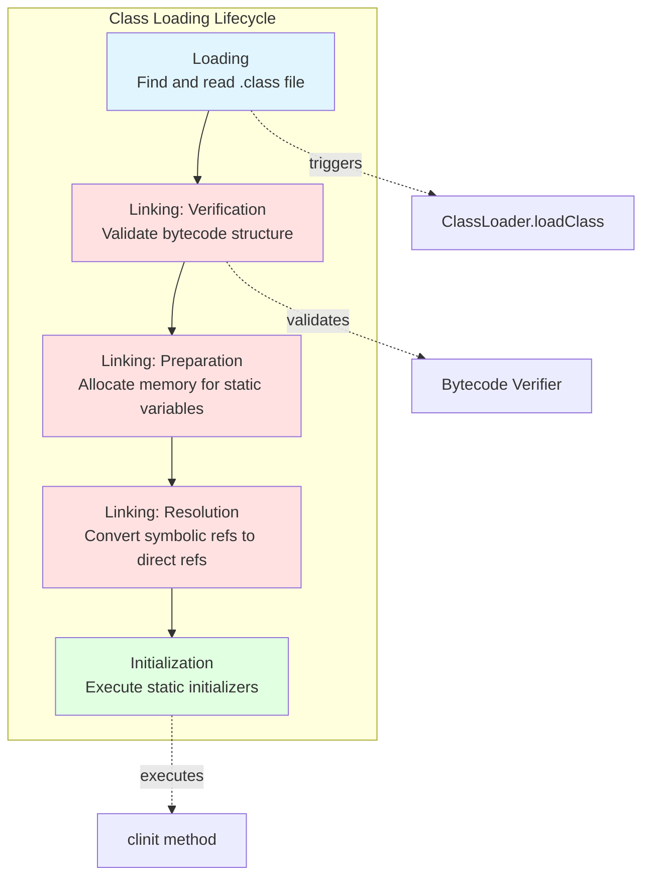

### Technical Deep Dive

#### Phase 1: Loading

Loading is the first phase where the JVM locates the binary representation of a class and creates a `java.lang.Class` object to represent it.

**ClassLoader Hierarchy and Parent Delegation**

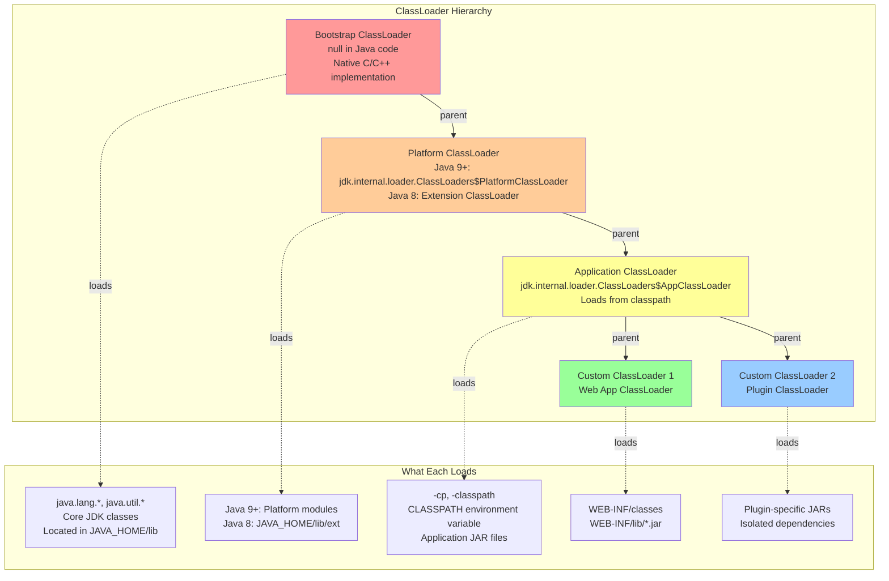

**Parent Delegation Model - Detailed Flow**

When a ClassLoader receives a request to load a class, it follows this algorithm:

```java
// Simplified ClassLoader.loadClass implementation
protected Class<?> loadClass(String name, boolean resolve) 
        throws ClassNotFoundException {
    synchronized (getClassLoadingLock(name)) {
        // Step 1: Check if class already loaded
        Class<?> c = findLoadedClass(name);
        
        if (c == null) {
            try {
                // Step 2: Delegate to parent first
                if (parent != null) {
                    c = parent.loadClass(name, false);
                } else {
                    // parent == null means Bootstrap ClassLoader
                    c = findBootstrapClassOrNull(name);
                }
            } catch (ClassNotFoundException e) {
                // Parent couldn't find it
            }
            
            if (c == null) {
                // Step 3: Parent failed, try to find it ourselves
                c = findClass(name);
            }
        }
        
        if (resolve) {
            resolveClass(c);
        }
        return c;
    }
}
```

**Example: Loading com.bank.Payment Class**

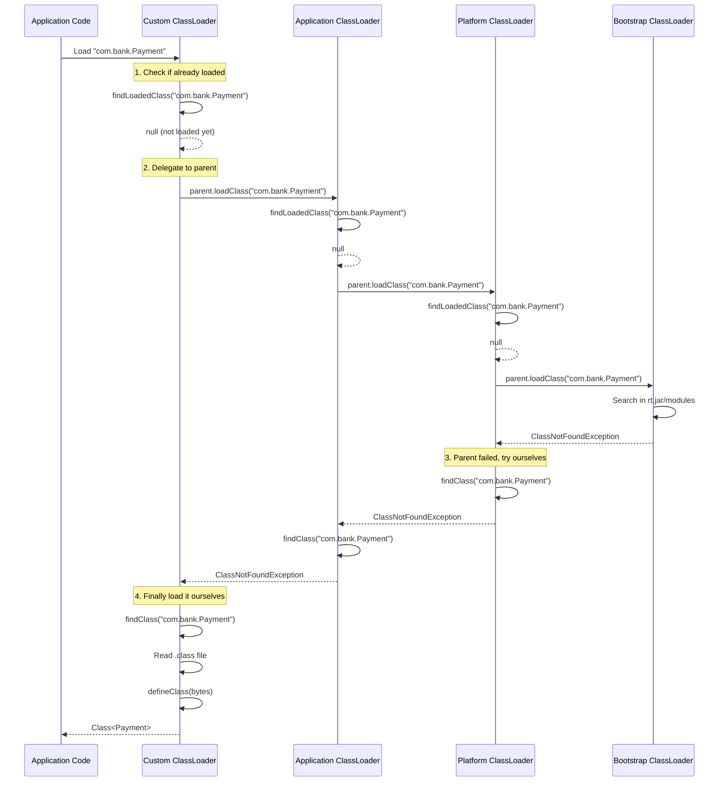

**Why Parent Delegation?**

1. **Security**: Prevents malicious code from replacing core Java classes
   ```java
   // This won't work - Bootstrap ClassLoader loads java.lang.String first
   package java.lang;
   public class String {
       // Evil implementation
   }
   ```

2. **Consistency**: Ensures the same class is loaded by the same ClassLoader
   ```java
   // Both references point to the same Class object
   Class<?> c1 = ClassLoader.getSystemClassLoader().loadClass("com.bank.Account");
   Class<?> c2 = ClassLoader.getSystemClassLoader().loadClass("com.bank.Account");
   assert c1 == c2;  // true
   ```

3. **Visibility**: Child ClassLoaders can see parent classes, but not vice versa

**Breaking Parent Delegation (When Necessary)**

Some frameworks intentionally break parent delegation:

```java
// Tomcat WebappClassLoader simplified logic
public Class<?> loadClass(String name, boolean resolve) {
    // 1. Check local cache first
    Class<?> clazz = findLoadedClass(name);
    if (clazz != null) return clazz;
    
    // 2. For system classes, use standard delegation
    if (name.startsWith("java.") || name.startsWith("javax.")) {
        return super.loadClass(name, resolve);
    }
    
    // 3. Try to load from WEB-INF/classes and WEB-INF/lib first
    try {
        clazz = findClass(name);  // Load locally BEFORE parent
        if (clazz != null) return clazz;
    } catch (ClassNotFoundException e) {
        // Not found locally
    }
    
    // 4. Delegate to parent as fallback
    return super.loadClass(name, resolve);
}
```

This allows web applications to override library versions from the application server.

#### Phase 2: Linking

Linking consists of three sub-phases: Verification, Preparation, and Resolution.

**Verification**

The bytecode verifier ensures that the loaded class file is structurally correct and doesn't violate Java security constraints.

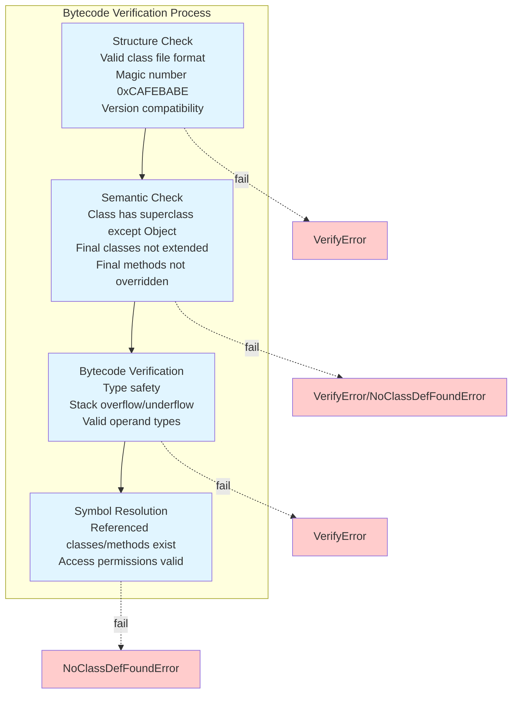

**Example: What Verification Catches**

```java
// This would be caught during verification
public class Malicious {
    public void exploit() {
        // Handcrafted bytecode that tries to:
        // 1. Pop more items from stack than pushed
        // 2. Access private fields of java.lang.System
        // 3. Return int from void method
        // All these violate JVM safety guarantees
    }
}
```

**Preparation**

During preparation, the JVM allocates memory for static variables and assigns default values (NOT the values from code).

```java
public class Account {
    private static int count = 100;        // Step 1: count = 0 (default)
    private static String bank = "Chase";  // Step 1: bank = null (default)
    private static final int MAX = 1000;   // Step 1: MAX = 0 (default)
    
    static {
        count = 200;  // Step 2: Initialization phase
    }
}
```

**Preparation Phase Default Values:**

| Type | Default Value |
|------|---------------|
| boolean | false |
| byte | (byte) 0 |
| short | (short) 0 |
| int | 0 |
| long | 0L |
| float | 0.0f |
| double | 0.0d |
| char | '\u0000' |
| reference | null |

**Special case: static final primitives with compile-time constant values**

```java
public class Constants {
    // Assigned in preparation (not initialization)
    private static final int MAX_SIZE = 1000;
    private static final String APP_NAME = "Banking";
    
    // Assigned in initialization (value not compile-time constant)
    private static final int COMPUTED = System.getProperty("value") != null ? 100 : 200;
    private static final Date START_TIME = new Date();
}
```

**Resolution**

Resolution converts symbolic references in the constant pool to direct references (memory addresses).

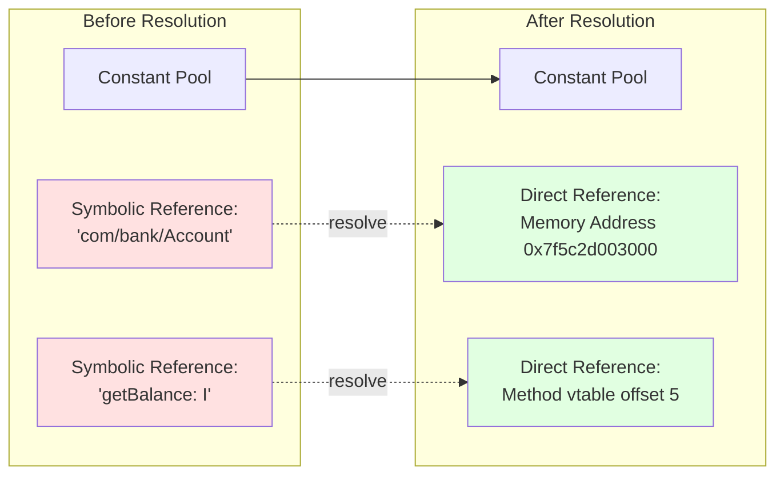

**Lazy vs Eager Resolution**

Resolution can happen at different times:

```java
public class PaymentProcessor {
    private AccountService service;  // Symbolic reference to AccountService
    
    public void process() {
        // Resolution might happen here (lazy)
        service = new AccountService();  
        
        // Or resolution might have happened during linking (eager)
    }
}
```

**JVM implementations vary:**
- **HotSpot**: Generally uses lazy resolution (resolve when first used)
- **Benefit**: Faster startup, classes never used are never resolved
- **Trade-off**: First usage might be slower

You can force eager resolution in some JVMs:
```bash
# -Xverify:all forces early verification and resolution
java -Xverify:all MyApp
```

#### Phase 3: Initialization

Initialization is when the JVM executes the class's static initializer (`<clinit>` method). This is the phase where static variables get their assigned values from code.

**The `<clinit>` Method**

The Java compiler generates a special `<clinit>` method that contains:
1. All static variable initializers (in order)
2. All static initialization blocks (in order)

```java
public class BankConfig {
    // Compiled into <clinit> method
    private static String bank = loadBankName();      // 1
    
    static {                                           // 2
        System.out.println("Loading config");
    }
    
    private static int branches = 100;                 // 3
    
    static {                                           // 4
        branches = calculateBranches();
    }
    
    private static String loadBankName() {
        return "JPMorgan Chase";
    }
    
    private static int calculateBranches() {
        return 150;
    }
}

// Compiled <clinit> method (conceptual):
static void <clinit>() {
    bank = loadBankName();                    // 1
    System.out.println("Loading config");     // 2
    branches = 100;                           // 3
    branches = calculateBranches();           // 4 (overwrites)
}
```

**Initialization Triggers**

A class is initialized when one of these first occurs:
1. Creating an instance: `new Account()`
2. Accessing/modifying static field: `Account.count`
3. Invoking static method: `Account.getTotal()`
4. Reflection: `Class.forName("com.bank.Account")`
5. Initializing a subclass triggers parent initialization
6. JVM startup class (class with `main()`)

**NOT initialization triggers:**
```java
// These do NOT trigger initialization
Class<?> clazz = Account.class;  // Class literal
Account[] arr = new Account[10];  // Array creation
static final int MAX = 100;       // Compile-time constant
```

**Initialization is Thread-Safe**

The JVM guarantees that `<clinit>` executes exactly once, even with multiple threads:

```java
public class Singleton {
    // Thread-safe due to class initialization guarantee
    private static final Singleton INSTANCE = new Singleton();
    
    private Singleton() {
        // Even if multiple threads call getInstance() simultaneously,
        // this constructor executes exactly once
    }
    
    public static Singleton getInstance() {
        return INSTANCE;  // Triggers initialization on first access
    }
}
```

**Initialization Flow:**

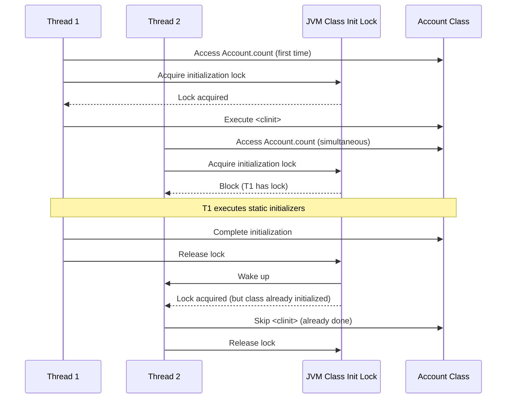

**Initialization Order for Class Hierarchies**

```java
class Parent {
    static {
        System.out.println("Parent static");
    }
    
    {
        System.out.println("Parent instance");
    }
    
    Parent() {
        System.out.println("Parent constructor");
    }
}

class Child extends Parent {
    static {
        System.out.println("Child static");
    }
    
    {
        System.out.println("Child instance");
    }
    
    Child() {
        System.out.println("Child constructor");
    }
}

// Execution:
Child c = new Child();

// Output:
// Parent static         (1. Parent class initialized first)
// Child static          (2. Child class initialized)
// Parent instance       (3. Parent instance init block)
// Parent constructor    (4. Parent constructor)
// Child instance        (5. Child instance init block)
// Child constructor     (6. Child constructor)
```

**Initialization Deadlock**

Static initialization can cause deadlocks:

```java
// Thread 1 initializes A
class A {
    static {
        // Waits for B to initialize
        int x = B.value;
    }
    static int value = 10;
}

// Thread 2 initializes B
class B {
    static {
        // Waits for A to initialize
        int x = A.value;
    }
    static int value = 20;
}

// Deadlock scenario:
// Thread 1: Locks A, waits for B
// Thread 2: Locks B, waits for A
```

**Best Practice**: Avoid cross-class dependencies in static initializers.

### Real-World Enterprise Scenarios

**Scenario 1: Application Server Class Loading (Tomcat)**

In Tomcat, each web application gets its own ClassLoader to provide isolation:

```
Bootstrap ClassLoader
    |
Platform ClassLoader  
    |
Application ClassLoader
    |
Common ClassLoader (Tomcat shared)
    |
    +-- WebAppClassLoader (App1)
    |
    +-- WebAppClassLoader (App2)
```

**Problem**: Two web apps both include Log4j 1.2.17 and Log4j 2.x

```
App1/WEB-INF/lib/log4j-1.2.17.jar
App2/WEB-INF/lib/log4j-core-2.17.1.jar
```

**Solution**: Each WebAppClassLoader loads its own version, providing isolation.

**Code Example:**

```java
// App1 uses Log4j 1.x
org.apache.log4j.Logger logger = 
    org.apache.log4j.Logger.getLogger(App1Class.class);

// App2 uses Log4j 2.x  
org.apache.logging.log4j.Logger logger = 
    org.apache.logging.log4j.LogManager.getLogger(App2Class.class);

// These classes come from DIFFERENT ClassLoaders
// App1's Logger class != App2's Logger class (if it existed)
```

**Interview Question**: "What happens if you put a library in Tomcat's lib/ folder vs WEB-INF/lib/?"

**Answer**: 
- **lib/**: Loaded by Common ClassLoader, shared across all web apps. Use for libraries that should be shared (JDBC drivers, common utilities).
- **WEB-INF/lib/**: Loaded by WebAppClassLoader, isolated per app. Use for app-specific dependencies.
- **Conflict**: If same library is in both, WebAppClassLoader finds it first (breaks parent delegation for this case), so web app version wins.

**Scenario 2: ClassLoader Leak in Production**

After deploying a new version of a banking application 10 times, you observe:

```
# jstat -gc <pid> 1000
Metaspace keeps growing: 256MB -> 512MB -> 768MB
Old Gen also growing
Eventually: OutOfMemoryError: Metaspace
```

**Root Cause Analysis:**

```java
// Leak source: ThreadLocal not cleaned up
public class RequestContext {
    private static final ThreadLocal<User> CURRENT_USER = new ThreadLocal<>();
    
    public static void setUser(User user) {
        CURRENT_USER.set(user);
    }
    
    // Missing: ThreadLocal.remove() in finally block
}

// Each redeployment:
// 1. Old WebAppClassLoader should be GC'd
// 2. But thread pool threads hold ThreadLocal references
// 3. ThreadLocal -> User class -> WebAppClassLoader
// 4. WebAppClassLoader can't be GC'd
// 5. All classes from old deployment remain in memory
```

**Solution:**

```java
public class RequestContext {
    private static final ThreadLocal<User> CURRENT_USER = new ThreadLocal<>();
    
    public static void setUser(User user) {
        CURRENT_USER.set(user);
    }
    
    public static void clearUser() {
        CURRENT_USER.remove();  // Essential for ClassLoader GC
    }
}

// In servlet filter:
try {
    RequestContext.setUser(authenticatedUser);
    chain.doFilter(request, response);
} finally {
    RequestContext.clearUser();  // Always clean up
}
```

**Detection:**

```bash
# Enable ClassLoader unloading logging
-XX:+TraceClassUnloading

# Expected after redeployment:
[Unloading class org.apache.catalina.loader.WebappClassLoader]

# If you DON'T see this, you have a leak
```

**Memory Analysis:**

```bash
# Heap dump
jmap -dump:format=b,file=heap.hprof <pid>

# Analyze with Eclipse MAT
# Look for: "Duplicate Classes" report
# Shows multiple versions of same class from different ClassLoaders
```

**Scenario 3: Plugin Architecture with Isolation**

A banking platform loads risk calculation plugins at runtime:

```java
public class PluginManager {
    private Map<String, PluginClassLoader> plugins = new ConcurrentHashMap<>();
    
    public void loadPlugin(String name, Path jarPath) throws Exception {
        // Create isolated ClassLoader for each plugin
        PluginClassLoader loader = new PluginClassLoader(
            new URL[]{jarPath.toUri().toURL()},
            this.getClass().getClassLoader()  // Parent
        );
        
        // Load plugin main class
        Class<?> pluginClass = loader.loadClass("com.bank.plugins." + name + ".Main");
        Plugin plugin = (Plugin) pluginClass.getDeclaredConstructor().newInstance();
        
        plugins.put(name, loader);
    }
    
    public void unloadPlugin(String name) throws Exception {
        PluginClassLoader loader = plugins.remove(name);
        if (loader != null) {
            loader.close();  // Close resources
            // Loader becomes GC-eligible if no references remain
        }
    }
}

// Custom ClassLoader
class PluginClassLoader extends URLClassLoader {
    public PluginClassLoader(URL[] urls, ClassLoader parent) {
        super(urls, parent);
    }
    
    @Override
    protected Class<?> findClass(String name) throws ClassNotFoundException {
        // Load plugin-specific classes
        if (name.startsWith("com.bank.plugins.")) {
            return super.findClass(name);
        }
        throw new ClassNotFoundException(name);
    }
}
```

**Challenge**: Plugins need to share interfaces but isolate implementations.

**Solution**:

```java
// Interface in parent ClassLoader (application)
public interface RiskCalculator {
    BigDecimal calculate(Position position);
}

// Implementation in child ClassLoader (plugin)
public class MonteCarloCalculator implements RiskCalculator {
    // Can have its own dependencies without conflicts
    @Override
    public BigDecimal calculate(Position position) {
        // Implementation using plugin-specific libraries
    }
}

// Usage
RiskCalculator calc = (RiskCalculator) pluginInstance;
// instanceof works because interface loaded by parent
```

**Scenario 4: OSGi Class Loading in Banking Middleware**

OSGi provides even finer-grained control than standard ClassLoaders:

```
Each OSGi Bundle has its own ClassLoader
Bundles explicitly declare:
- Exported packages (visible to others)
- Imported packages (dependencies)
```

**Example OSGi Bundle Manifest:**

```
Bundle-Name: Payment Processing Core
Bundle-Version: 2.1.0
Export-Package: com.bank.payment.api;version="2.1",
                com.bank.payment.model;version="2.1"
Import-Package: com.bank.common.logging;version="[1.0,2.0)",
                com.bank.security.auth;version="3.2"
Private-Package: com.bank.payment.internal
```

**Benefits:**
- Fine-grained dependency management
- Hot reload individual bundles
- Manage version conflicts explicitly

**Complexity:**
- Steep learning curve
- Debugging is harder
- More configuration

**Usage in Banking**: Common in middleware platforms (Apache Karaf, IBM WebSphere) but declining in favor of microservices.

### Interview Questions & Model Answers

**Q1: Explain the class loading process in detail.**

**Model Answer:**
"Class loading happens in three main phases: Loading, Linking, and Initialization.

**Loading** is when the ClassLoader reads the .class file and creates a Class object in memory. This follows the parent delegation model - before loading, a ClassLoader delegates to its parent. Only if the parent can't find the class does the child load it. This ensures core Java classes are always loaded by the Bootstrap ClassLoader, preventing security issues like replacing java.lang.String with malicious code.

**Linking** has three sub-phases:
- *Verification*: The bytecode verifier checks the class file structure, type safety, and security constraints
- *Preparation*: Memory is allocated for static variables and they're set to default values (0, null, false)
- *Resolution*: Symbolic references in the constant pool are converted to direct memory references, though this is often done lazily

**Initialization** executes the class's `<clinit>` method, which contains all static variable assignments and static blocks in declaration order. This happens exactly once and is thread-safe - if multiple threads trigger initialization simultaneously, one executes `<clinit>` while others wait.

In production banking systems, understanding this is critical for diagnosing issues like ClassNotFoundException (class not found during loading), NoClassDefFoundError (class found but linking/initialization failed), and ClassLoader memory leaks after repeated deployments."

**Q2: What is the parent delegation model and why is it important?**

**Model Answer:**
"The parent delegation model is a core security and consistency mechanism in Java class loading. When a ClassLoader receives a request to load a class, it first delegates to its parent ClassLoader. Only if the parent cannot find the class does the child attempt to load it.

The hierarchy is: Bootstrap ClassLoader (loads core Java classes) → Platform/Extension ClassLoader → Application ClassLoader → Custom ClassLoaders.

**Why this matters:**

1. **Security**: You cannot override core Java classes. If I try to create my own malicious `java.lang.String`, the Bootstrap ClassLoader will always load the real one first, and the JVM will reject duplicate loading.

2. **Consistency**: Ensures the same class is always loaded by the same ClassLoader, preventing subtle bugs where the same class loaded by different ClassLoaders is treated as different types.

3. **Visibility**: Child ClassLoaders can see classes loaded by parents, but not vice versa. This enables proper encapsulation.

In enterprise environments, some frameworks like Tomcat intentionally break this model for web applications - they check WEB-INF/lib before delegating to parent. This allows web apps to include different versions of libraries than the application server uses.

I've diagnosed production issues where understanding parent delegation was crucial, such as when two versions of the same library were on the classpath and the 'wrong' one was being loaded because it was found by a parent ClassLoader first."

**Q3: What causes ClassNotFoundException vs NoClassDefFoundError, and how would you troubleshoot each?**

**Model Answer:**
"These are often confused, but they indicate different problems:

**ClassNotFoundException** is a checked exception thrown when trying to explicitly load a class that cannot be found:
```java
Class.forName("com.bank.NonExistent")  // ClassNotFoundException
```

**Causes:**
- Class not on classpath
- Typo in class name
- Wrong ClassLoader being used

**Troubleshooting:**
```bash
# Verify class is in JAR
jar tf myapp.jar | grep NonExistent

# Check classpath
java -verbose:class MyApp  # Shows all classes loaded and where from

# Verify ClassLoader
ClassLoader cl = Thread.currentThread().getContextClassLoader();
System.out.println(cl);  # Which ClassLoader is active?
```

**NoClassDefFoundError** is an error (unchecked) thrown when a class was present during compilation but cannot be found at runtime, OR when class initialization fails:

```java
// Class exists but initialization fails
public class Config {
    static {
        throw new RuntimeException("DB connection failed");
    }
}

new Config();  // ExceptionInInitializerError (first time)
new Config();  // NoClassDefFoundError (subsequent times)
```

**Causes:**
- Class file deleted or not deployed
- Static initialization threw an exception
- Dependency class missing

**Troubleshooting:**
```bash
# Enable verbose class loading
java -verbose:class -XX:+TraceClassLoading MyApp

# Look for the FIRST error - often an ExceptionInInitializerError
# Check static initializers for failures

# Verify all dependencies present
jdeps myapp.jar  # Shows dependencies
```

**Real-world example**: In a banking deployment, we got NoClassDefFoundError for a class that definitely existed. The root cause was a static initializer trying to read a config file that didn't exist in production. The first thread got ExceptionInInitializerError, all subsequent threads got NoClassDefFoundError. The fix was making static initialization more defensive with try-catch and fallback values."

**Q4: How do you prevent ClassLoader memory leaks in a web application?**

**Model Answer:**
"ClassLoader leaks are one of the most insidious memory issues in production. When you redeploy a web app, the old WebAppClassLoader should be garbage collected, but often isn't due to lingering references.

**Common causes and solutions:**

1. **ThreadLocal not cleaned up:**
```java
// Leak
private static ThreadLocal<User> context = new ThreadLocal<>();

// Fix: Always remove in finally
try {
    context.set(user);
    // process
} finally {
    context.remove();  // Critical
}
```

2. **Thread pools with threads from old deployment:**
```java
// Leak: Threads hold references to old ClassLoader
private static ExecutorService executor = Executors.newFixedThreadPool(10);

// Fix: Shutdown in contextDestroyed
@Override
public void contextDestroyed(ServletContextEvent sce) {
    executor.shutdownNow();
}
```

3. **Static collections holding objects:**
```java
// Leak
private static List<Handler> handlers = new ArrayList<>();

// Fix: Clear in lifecycle methods
@PreDestroy
public void cleanup() {
    handlers.clear();
}
```

4. **JDBC drivers not deregistered:**
```java
// Fix
@Override
public void contextDestroyed(ServletContextEvent sce) {
    Enumeration<Driver> drivers = DriverManager.getDrivers();
    while (drivers.hasMoreElements()) {
        DriverManager.deregisterDriver(drivers.nextElement());
    }
}
```

**Detection:**
```bash
# Enable logging
-XX:+TraceClassUnloading

# After redeploy, you should see:
[Unloading class sun.reflect.GeneratedMethodAccessor1]

# If you don't see WebappClassLoader unload, you have a leak

# Heap dump and analysis
jmap -dump:format=b,file=heap.hprof <pid>
# Use Eclipse MAT "Duplicate Classes" report
```

**In production banking systems**, I've seen ClassLoader leaks cause OutOfMemoryError after 5-10 redeploys, requiring JVM restart. The fix required systematically reviewing all static state and ensuring cleanup in ServletContextListener.contextDestroyed()."

**Q5: Explain class identity and why `obj instanceof Class` might fail unexpectedly.**

**Model Answer:**
"In Java, class identity is defined as: **Fully Qualified Name + ClassLoader instance**. The same class loaded by two different ClassLoaders creates two distinct runtime classes.

This causes surprising behavior:

```java
// Plugin loaded by PluginClassLoader1
ClassLoader cl1 = new PluginClassLoader();
Class<?> pluginClass1 = cl1.loadClass("com.Plugin");
Object plugin1 = pluginClass1.newInstance();

// Same plugin loaded by PluginClassLoader2
ClassLoader cl2 = new PluginClassLoader();
Class<?> pluginClass2 = cl2.loadClass("com.Plugin");

// These are DIFFERENT classes at runtime
pluginClass1 != pluginClass2  // true

// This fails
if (plugin1 instanceof pluginClass2) { }  // ClassCastException

// Even though source code is identical
```

**Real-world impact in banking systems:**

In a plugin architecture for risk calculators, we had:
```java
public interface RiskCalculator { }  // In parent ClassLoader

public class Plugin implements RiskCalculator { }  // In child ClassLoader

// This works:
Object plugin = pluginLoader.loadClass("Plugin").newInstance();
if (plugin instanceof RiskCalculator) { }  // OK

// Because RiskCalculator loaded by parent, visible to child
```

But if we accidentally loaded the interface in the child too:
```java
// If child ClassLoader loads its own RiskCalculator:
if (plugin instanceof RiskCalculator) { }  // FAILS

// plugin's RiskCalculator != application's RiskCalculator
```

**Solution strategies:**

1. **Shared interfaces**: Load interfaces in parent ClassLoader, implementations in child
2. **Use Class.isAssignableFrom()**: More explicit about which ClassLoader's class you mean
3. **Common parent ClassLoader**: For shared classes between plugins

**Debugging:**
```java
// Find which ClassLoader loaded a class
Class<?> clazz = obj.getClass();
ClassLoader cl = clazz.getClassLoader();
System.out.println("Loaded by: " + cl);

// Compare class identities
Class<?> expected = RiskCalculator.class;
Class<?> actual = obj.getClass();
System.out.println("Expected CL: " + expected.getClassLoader());
System.out.println("Actual CL: " + actual.getClassLoader());
```

This issue caused hours of debugging in production when we couldn't figure out why `instanceof` was failing for objects that clearly implemented the interface - until we realized they were loaded by different ClassLoaders."

**Q6: What is the difference between Class.forName() and ClassLoader.loadClass()?**

**Model Answer:**
"These methods both load classes, but with a critical difference in initialization:

```java
// 1. Class.forName() - triggers initialization
Class<?> c1 = Class.forName("com.bank.Payment");

// 2. ClassLoader.loadClass() - does NOT trigger initialization
ClassLoader cl = Thread.currentThread().getContextClassLoader();
Class<?> c2 = cl.loadClass("com.bank.Payment");

// 3. Class.forName() with initialization control (most flexible)
Class<?> c3 = Class.forName("com.bank.Payment", false, classLoader);
```

**What initialization means:**

```java
public class DatabaseConfig {
    static {
        System.out.println("Connecting to database...");
        // Expensive DB connection setup
    }
}

// This triggers static block immediately
Class.forName("DatabaseConfig");  // Prints "Connecting to database..."

// This does NOT trigger static block
classLoader.loadClass("DatabaseConfig");  // No output

// Static block executes on first actual use:
DatabaseConfig.getInstance();  // NOW prints "Connecting to database..."
```

**When this matters:**

**JDBC driver loading:**
```java
// Old JDBC (before Java 6 ServiceLoader)
Class.forName("oracle.jdbc.driver.OracleDriver");

// Why Class.forName()? Because JDBC drivers register themselves in static block:
public class OracleDriver {
    static {
        DriverManager.registerDriver(new OracleDriver());
    }
}

// If you used ClassLoader.loadClass(), driver wouldn't register!
```

**Plugin systems:**
```java
// Load plugin class without initializing (faster)
Class<?> pluginClass = Class.forName("Plugin", false, pluginLoader);

// Check if it's valid before expensive initialization
if (PluginInterface.class.isAssignableFrom(pluginClass)) {
    // Now initialize and create instance
    Plugin p = (Plugin) pluginClass.getDeclaredConstructor().newInstance();
}
```

**Performance considerations:**

In a banking system with 1000+ classes, we optimized startup time by:
1. Loading classes without initialization (Class.forName with false)
2. Initializing only classes actually needed for current request path
3. Lazy initialization reduced startup time from 30s to 8s

**Best practice:** Use `Class.forName(name, false, classLoader)` for maximum control over initialization timing."

**Q7: How does class loading work in container environments like Kubernetes with fat JARs?**

**Model Answer:**
"In containerized microservices with fat JARs (Spring Boot uber-JARs), class loading has some unique characteristics:

**Fat JAR structure:**
```
myapp.jar
  ├── BOOT-INF/
  │   ├── classes/          # Your application classes
  │   └── lib/              # All dependency JARs
  ├── META-INF/
  │   └── MANIFEST.MF
  └── org/springframework/boot/loader/  # Spring Boot loader
```

**Custom ClassLoader hierarchy:**
```
Bootstrap ClassLoader
    ├── Platform ClassLoader
        ├── Application ClassLoader (loads Spring Boot Loader)
            └── LaunchedURLClassLoader (loads from BOOT-INF)
```

**Key differences from traditional deployment:**

1. **Single JAR**: All dependencies embedded, no classpath issues
2. **Custom ClassLoader**: Spring Boot's LaunchedURLClassLoader handles nested JARs
3. **Predictable loading**: Same JAR structure = same loading behavior across environments

**Advantages in banking Kubernetes deployments:**

```yaml
# Dockerfile
FROM eclipse-temurin:17-jre
COPY target/payment-service.jar app.jar
ENTRYPOINT ["java", "-jar", "app.jar"]

# Consistent across dev/qa/prod
# No classpath hell
# All dependencies versioned together
```

**Monitoring:**
```bash
# Even with fat JAR, can still inspect class loading
java -verbose:class -jar app.jar

# Shows Spring Boot loader loading from nested JARs:
[Loaded com.bank.Payment from jar:file:/app.jar!/BOOT-INF/classes!/]
[Loaded org.springframework.context.ApplicationContext from jar:file:/app.jar!/BOOT-INF/lib/spring-context-5.3.jar!/]
```

**Class loading performance:**

Fat JARs have slight startup penalty:
- JVM must extract nested JARs to temp directory
- More IO during class loading

**Optimization for Kubernetes:**
```java
// Enable AppCDS (Application Class Data Sharing)
# Step 1: Record class loading
java -XX:DumpLoadedClassList=classes.lst -jar app.jar

# Step 2: Create shared archive
java -Xshare:dump -XX:SharedClassListFile=classes.lst \
     -XX:SharedArchiveFile=app.jsa -jar app.jar

# Step 3: Use shared archive in container
FROM eclipse-temurin:17-jre
COPY target/payment-service.jar app.jar
COPY app.jsa /app.jsa
ENTRYPOINT ["java", "-Xshare:on", "-XX:SharedArchiveFile=/app.jsa", "-jar", "app.jar"]

# Result: 30-40% faster startup, lower memory
```

**Memory benefits:**
- Shared archive loaded into read-only memory
- Multiple pods can share same physical pages
- Important in Kubernetes with many replicas

In our banking platform, using CDS reduced payment service startup from 25s to 15s and memory per pod from 512MB to 384MB, allowing higher pod density."

### Common Pitfalls & Best Practices

**Pitfall 1: Assuming class loading is synchronous and deterministic**

```java
// Dangerous assumption
public class ServiceLocator {
    static {
        // Assumes SomeService class is available
        // But what if it's not on classpath yet?
        service = (SomeService) Class.forName("com.SomeService").newInstance();
    }
}
```

**Best Practice:** Lazy initialization with error handling
```java
public class ServiceLocator {
    private static volatile SomeService service;
    
    public static SomeService getService() {
        if (service == null) {
            synchronized (ServiceLocator.class) {
                if (service == null) {
                    try {
                        Class<?> clazz = Class.forName("com.SomeService");
                        service = (SomeService) clazz.getDeclaredConstructor().newInstance();
                    } catch (Exception e) {
                        throw new ServiceException("Failed to load service", e);
                    }
                }
            }
        }
        return service;
    }
}
```

**Pitfall 2: ClassLoader.getResource() vs Class.getResource()**

```java
// Different behaviors!

// Absolute path from classpath root
ClassLoader.getSystemClassLoader().getResource("com/bank/config.properties");

// Relative to class package
MyClass.class.getResource("config.properties");  // Looks in com/bank/
MyClass.class.getResource("/config.properties"); // Looks at classpath root
```

**Best Practice:** Be explicit about path expectations
```java
public class ConfigLoader {
    // Absolute path - clear intention
    public static Properties load() {
        InputStream in = ConfigLoader.class.getClassLoader()
            .getResourceAsStream("application.properties");
        if (in == null) {
            throw new IllegalStateException("application.properties not found on classpath");
        }
        // load properties
    }
}
```

**Pitfall 3: Static initialization order dependencies**

```java
// Dangerous - order dependent
public class A {
    public static int VALUE = 10;
}

public class B {
    public static int VALUE = A.VALUE * 2;  // What if A not initialized yet?
}
```

**Best Practice:** Use lazy initialization for cross-class dependencies
```java
public class B {
    private static int value = -1;
    
    public static int getValue() {
        if (value == -1) {
            value = A.VALUE * 2;  // Initialize on demand
        }
        return value;
    }
}
```

**Pitfall 4: Not understanding classloader delegation in web apps**

```java
// Tomcat has: common.loader, server.loader, webapp.loader
// If you put library in wrong place:

// tomcat/lib/mysql-connector-5.jar (common classloader)
// myapp/WEB-INF/lib/mysql-connector-8.jar (webapp classloader)

// Which version is used?
Connection conn = DriverManager.getConnection(url);
// Answer: webapp version (8.jar) because webapp classloader checks local first
```

**Best Practice:** Document classloader expectations
```
# README for deployments
## Shared libraries (tomcat/lib/):
- None - keep all dependencies in WAR

## Application libraries (WEB-INF/lib/):
- All dependencies packaged in WAR for isolation
```

**Pitfall 5: Ignoring class unloading in long-running apps**

```java
// Each redeployment leaves old classes in memory
# Without -XX:+TraceClassUnloading, you won't see:
[Unloading class com.bank.Payment]

// 10 redeployments later:
OutOfMemoryError: Metaspace
```

**Best Practice:** Monitor class loading/unloading
```bash
# Enable logging
-XX:+TraceClassLoading
-XX:+TraceClassUnloading

# Monitor with jstat
jstat -class <pid> 1000
Loaded  Bytes  Unloaded  Bytes     Time
  8234  15342.3      120   215.2    12.34

# Unloaded should increase after redeploy
# If Unloaded stays 0, you have leaks
```

**Pitfall 6: Custom ClassLoader not closing resources**

```java
// Leak
public class PluginLoader extends URLClassLoader {
    public PluginLoader(URL[] urls) {
        super(urls);
    }
    // Missing: close() is never called
}

// Each plugin load opens file handles
// Eventually: Too many open files
```

**Best Practice:** Use try-with-resources
```java
try (PluginLoader loader = new PluginLoader(urls)) {
    Class<?> clazz = loader.loadClass("Plugin");
    // use plugin
} // Automatically closes resources
```

### Key Takeaways

1. **Class loading has three phases**: Loading (find class), Linking (verify, prepare, resolve), Initialization (execute static initializers)

2. **Parent delegation model** ensures security and consistency by delegating to parent ClassLoader first before attempting to load

3. **Class identity** = Fully Qualified Name + ClassLoader instance. Same class from different ClassLoaders = different runtime classes

4. **Initialization is lazy and thread-safe**: `<clinit>` executes exactly once, first thread wins, others block

5. **ClassNotFoundException vs NoClassDefFoundError**: 
   - ClassNotFoundException = explicit load failed, class not found
   - NoClassDefFoundError = class found but linking/initialization failed, OR class was available at compile time but not at runtime

6. **ClassLoader leaks** prevent class unloading: Caused by ThreadLocals, static collections, thread pools, JDBC drivers not cleaned up

7. **Resolution is typically lazy**: Symbolic references converted to direct references on first use, not during linking

8. **Web application isolation**: Each web app gets its own ClassLoader; shared libraries go in server lib, app-specific in WEB-INF/lib

9. **Class.forName() vs loadClass()**: Class.forName() triggers initialization, loadClass() doesn't (unless class is actually used)

10. **Monitor class loading** in production: Use `-XX:+TraceClassLoading` and `jstat -class` to detect leaks and understand loading behavior

11. **Fat JARs simplify deployment**: Single JAR with all dependencies eliminates classpath issues in containers, but has startup cost

12. **AppCDS optimizes startup**: Shared class data archive reduces startup time and memory, valuable in Kubernetes with many replicas

---

## 1.4 Bytecode and Execution Engine

### Overview

The Execution Engine is the heart of the JVM, responsible for converting Java bytecode into native machine instructions that can run on the host CPU. Understanding how bytecode is structured and executed is fundamental for performance optimization, debugging, and understanding JVM internals at a deep level.

For senior engineers in banking/financial services, this knowledge is particularly valuable when:
- **Analyzing performance bottlenecks**: Understanding which code paths trigger JIT compilation vs interpretation
- **Optimizing hot paths**: Knowing how to write code that JIT compilers can optimize effectively
- **Debugging production issues**: Reading bytecode and thread dumps to understand what's actually executing
- **Security reviews**: Bytecode verification is a key security boundary
- **Understanding framework magic**: Spring, Hibernate, and other frameworks generate bytecode at runtime

**Why this matters in interviews**: Questions about bytecode and the execution engine test whether you understand Java at a low level. Senior/principal engineers are expected to explain not just what code does, but how the JVM actually executes it, and how to optimize based on that knowledge.

### Foundational Concepts

The JVM execution engine operates in multiple modes, transitioning between them based on code execution frequency:

```mermaid
graph LR
    subgraph "Execution Pipeline"
        BC[Java Bytecode<br/>.class file]
        INT[Interpreter<br/>Executes bytecode<br/>line by line]
        PROF[Profiler<br/>Identifies hot code<br/>Invocation counters]
        C1[C1 Compiler<br/>Client/Fast JIT<br/>Quick optimizations]
        C2[C2 Compiler<br/>Server/Slow JIT<br/>Aggressive opts]
        NATIVE[Native Code<br/>Executed directly<br/>by CPU]
    end
    
    BC --> INT
    INT --> PROF
    PROF -.hot method.-> C1
    PROF -.very hot method.-> C2
    C1 --> NATIVE
    C2 --> NATIVE
    NATIVE -.deoptimization.-> INT
    
    style INT fill:#e1f5ff
    style C1 fill:#fff5e1
    style C2 fill:#ffe1e1
    style NATIVE fill:#e1ffe1
```

**Key Components:**

1. **Interpreter**: Executes bytecode instructions one at a time (slow but immediate)
2. **JIT Compiler**: Compiles bytecode to native machine code (fast execution after compilation cost)
3. **Profiler**: Monitors execution to identify hot methods
4. **Code Cache**: Stores compiled native code
5. **Deoptimization**: Reverts optimized code back to interpreted mode when assumptions fail

### Technical Deep Dive

#### Java Bytecode Structure

Bytecode is a platform-independent instruction set stored in .class files. Each instruction (opcode) is one byte, hence "bytecode".

**Simple Example:**

```java
public class Calculator {
    public int add(int a, int b) {
        return a + b;
    }
}
```

**Compiled Bytecode:**

```bash
$ javap -c Calculator.class

public int add(int, int);
  Code:
     0: iload_1        // Load first parameter (a) onto stack
     1: iload_2        // Load second parameter (b) onto stack
     2: iadd           // Add top two stack values
     3: ireturn        // Return integer result
```

**Bytecode Instruction Categories:**

```mermaid
graph TB
    subgraph "Bytecode Instruction Types"
        LOAD[Load/Store<br/>iload, aload<br/>istore, astore]
        ARITH[Arithmetic<br/>iadd, isub<br/>imul, idiv]
        CTRL[Control Flow<br/>if_icmpgt, goto<br/>tableswitch]
        METHOD[Method Invocation<br/>invokevirtual<br/>invokespecial<br/>invokestatic<br/>invokedynamic]
        OBJ[Object Ops<br/>new, newarray<br/>getfield, putfield<br/>instanceof]
        STACK[Stack Ops<br/>dup, pop<br/>swap]
    end
    
    style LOAD fill:#e1f5ff
    style ARITH fill:#fff5e1
    style CTRL fill:#ffe1e1
    style METHOD fill:#e1ffe1
    style OBJ fill:#ffccff
    style STACK fill:#ccffcc
```

**More Complex Example:**

```java
public class BankAccount {
    private BigDecimal balance;
    
    public void deposit(BigDecimal amount) {
        if (amount.compareTo(BigDecimal.ZERO) > 0) {
            balance = balance.add(amount);
        }
    }
}
```

**Bytecode:**

```
public void deposit(java.math.BigDecimal);
  Code:
     0: aload_1                           // Load 'amount' parameter
     1: getstatic     #2                  // Get BigDecimal.ZERO
     4: invokevirtual #3                  // Call amount.compareTo(ZERO)
     7: ifle          23                  // If <= 0, jump to offset 23
    10: aload_0                           // Load 'this'
    11: aload_0                           // Load 'this' again
    12: getfield      #4                  // Get this.balance
    15: aload_1                           // Load 'amount'
    16: invokevirtual #5                  // Call balance.add(amount)
    19: putfield      #4                  // Set this.balance
    22: return
    23: return                            // Empty return (from if)
```

**Stack-Based Architecture:**

The JVM uses a stack-based architecture (vs register-based). Each method execution has an operand stack:

```java
int result = (a + b) * c;

// Bytecode execution:
iload_1      // Stack: [a]
iload_2      // Stack: [a, b]
iadd         // Stack: [a+b]
iload_3      // Stack: [a+b, c]
imul         // Stack: [(a+b)*c]
istore_4     // Stack: [] (result stored in local variable 4)
```

**Method Invocation Instructions:**

| Instruction | Usage | Example |
|-------------|-------|---------|
| **invokevirtual** | Instance method (normal) | `object.method()` |
| **invokespecial** | Constructor, private, super | `super.method()`, `new Object()` |
| **invokestatic** | Static method | `Math.max(a, b)` |
| **invokeinterface** | Interface method | `list.add(item)` |
| **invokedynamic** | Lambda, method references | `list.forEach(x -> print(x))` |

**Example Comparing Invocation Types:**

```java
public class InvocationExample {
    public void instanceMethod() { }
    private void privateMethod() { }
    public static void staticMethod() { }
    
    public void demo() {
        instanceMethod();    // invokevirtual (virtual dispatch)
        privateMethod();     // invokespecial (direct)
        staticMethod();      // invokestatic (direct)
        
        Runnable r = () -> System.out.println("Lambda");
        r.run();            // invokedynamic (Java 8+)
    }
}
```

**Bytecode:**

```
public void demo();
  Code:
     0: aload_0
     1: invokevirtual #2      // instanceMethod()
     4: aload_0
     5: invokespecial #3      // privateMethod()
     8: invokestatic  #4      // staticMethod()
    11: invokedynamic #5       // Lambda
    16: astore_1
    17: aload_1
    18: invokeinterface #6     // Runnable.run()
    23: return
```

#### The Interpreter

When a method is first invoked, the interpreter executes it instruction by instruction.

**Interpreter Execution Flow:**

```mermaid
sequenceDiagram
    participant PC as Program Counter
    participant BS as Bytecode Stream
    participant OS as Operand Stack
    participant LV as Local Variables
    participant Heap as Heap Memory
    
    Note over PC: PC = 0
    PC->>BS: Fetch instruction at offset 0
    BS-->>PC: iload_1
    PC->>LV: Read local variable 1
    LV-->>OS: Push value onto stack
    
    Note over PC: PC = 1
    PC->>BS: Fetch instruction at offset 1
    BS-->>PC: iload_2
    PC->>LV: Read local variable 2
    LV-->>OS: Push value onto stack
    
    Note over PC: PC = 2
    PC->>BS: Fetch instruction at offset 2
    BS-->>PC: iadd
    PC->>OS: Pop two values
    OS-->>PC: values a, b
    PC->>PC: Compute a + b
    PC->>OS: Push result
    
    Note over PC: PC = 3
    PC->>BS: Fetch instruction at offset 3
    BS-->>PC: ireturn
    PC->>OS: Pop result
    OS-->>PC: Return value
```

**Interpreter Advantages:**
- Immediate execution (no compilation delay)
- Low memory overhead
- Simple debugging
- Useful for rarely-executed code

**Interpreter Disadvantages:**
- Slow execution (10-100x slower than native code)
- Repeated overhead for loops and frequently-called methods
- No optimization

#### JIT Compilation: C1 vs C2

The JIT (Just-In-Time) compiler converts bytecode to native machine code. HotSpot has two JIT compilers with different strategies:

**Tiered Compilation Levels:**

```mermaid
graph TB
    subgraph "Tiered Compilation"
        L0[Level 0: Interpreter<br/>Pure interpretation<br/>Collects profiling data<br/>Invocation counters]
        L1[Level 1: C1 Simple<br/>Fast compilation<br/>No profiling<br/>Basic optimizations]
        L2[Level 2: C1 Limited Profile<br/>C1 with invocation counters<br/>Light profiling]
        L3[Level 3: C1 Full Profile<br/>C1 with full profiling<br/>Branch frequencies<br/>Type information]
        L4[Level 4: C2<br/>Aggressive optimizations<br/>Inlining, escape analysis<br/>Loop unrolling, etc.]
    end
    
    L0 -->|Hot method| L1
    L0 -->|Very hot| L3
    L1 -->|Still hot| L4
    L3 -->|Very hot| L4
    L4 -.deoptimization.-> L0
    
    style L0 fill:#e1f5ff
    style L1 fill:#fff5e1
    style L2 fill:#fff5e1
    style L3 fill:#fff5e1
    style L4 fill:#ffe1e1
```

**Default Thresholds (can be tuned):**

| Compilation Level | Trigger | Flag |
|-------------------|---------|------|
| L1 (C1 Simple) | ~2,000 invocations | `-XX:Tier1CompileThreshold` |
| L3 (C1 Full Profile) | ~2,000 invocations | `-XX:Tier3CompileThreshold` |
| L4 (C2) | ~15,000 invocations | `-XX:Tier4CompileThreshold` |

**C1 Compiler (Client Compiler):**

```
Goals:
- Fast compilation (low latency)
- Moderate optimization
- Quick startup

Optimizations:
- Local value numbering
- Simple method inlining
- Dead code elimination
- Range check elimination
```

**C2 Compiler (Server Compiler):**

```
Goals:
- Aggressive optimization (high throughput)
- Willing to spend time compiling
- Best steady-state performance

Optimizations:
- Escape analysis
- Aggressive inlining
- Loop optimizations (unrolling, vectorization)
- Global value numbering
- Lock elision/coarsening
- Intrinsics (specialized CPU instructions)
- Speculative optimizations
```

**Compilation Workflow:**

```mermaid
graph TD
    subgraph "JIT Compilation Process"
        METHOD[Method Invoked]
        COUNTER[Increment Invocation Counter]
        THRESHOLD{Counter ><br/>Threshold?}
        QUEUE[Add to Compilation Queue]
        COMPILER[Compiler Thread Picks Up Method]
        OPTIMIZE[Apply Optimizations]
        CODEGEN[Generate Native Code]
        CACHE[Store in Code Cache]
        EXECUTE[Execute Native Code]
    end
    
    METHOD --> COUNTER
    COUNTER --> THRESHOLD
    THRESHOLD -->|No| METHOD
    THRESHOLD -->|Yes| QUEUE
    QUEUE --> COMPILER
    COMPILER --> OPTIMIZE
    OPTIMIZE --> CODEGEN
    CODEGEN --> CACHE
    CACHE --> EXECUTE
    EXECUTE --> METHOD
    
    style THRESHOLD fill:#fff5e1
    style OPTIMIZE fill:#ffe1e1
    style EXECUTE fill:#e1ffe1
```

**Example: Watching JIT Compilation**

```bash
# Enable JIT compilation logging
java -XX:+PrintCompilation -XX:+UnlockDiagnosticVMOptions \
     -XX:+LogCompilation -XX:LogFile=jit.log MyApp

# Output shows compilation events:
#  1234   56    3    com.bank.Payment::calculate (45 bytes)
#  ^      ^     ^    ^                            ^
#  |      |     |    |                            |
#  Time   ID    Tier Method Name                  Bytecode Size

# Example output:
   150   1     3  java.lang.String::hashCode (55 bytes)
   152   2     4  com.bank.Account::getBalance (12 bytes)
   155   3     3  com.bank.Payment::validate (120 bytes)
   200   4     4  com.bank.Payment::validate (120 bytes) made not entrant
   201   5     4  com.bank.Payment::validate (120 bytes)
```

**Explanation:**
- `Time 150`: String.hashCode compiled at tier 3 (C1 full profile)
- `Time 152`: Account.getBalance compiled at tier 4 (C2)
- `Time 155`: Payment.validate compiled at tier 3
- `Time 200`: Tier 3 version "made not entrant" (being replaced)
- `Time 201`: Payment.validate recompiled at tier 4 (C2 optimization)

#### Key JIT Optimizations

**1. Method Inlining**

The most important optimization. Small methods are copied into caller, eliminating call overhead.

```java
// Source code
public class Account {
    private BigDecimal balance;
    
    public BigDecimal getBalance() {
        return balance;
    }
    
    public void processPayment(BigDecimal amount) {
        BigDecimal current = getBalance();  // Method call
        // ... process payment
    }
}

// After JIT inlining:
public void processPayment(BigDecimal amount) {
    BigDecimal current = this.balance;  // Direct field access
    // ... process payment
}
```

**Benefits:**
- Eliminates method call overhead
- Enables further optimizations (dead code elimination, constant folding)
- Particularly effective for getters/setters

**Inlining Heuristics:**
```bash
# Default limits
-XX:MaxInlineSize=35          # Max bytecode size to inline
-XX:FreqInlineSize=325        # Max size for frequently called methods
-XX:MaxInlineLevel=9          # Max depth of inlining
```

**2. Escape Analysis**

Determines if an object escapes the method. If not, JIT can optimize:

```java
// Original code
public void calculateInterest() {
    Point p = new Point(x, y);  // Object allocated on heap
    int distance = p.distance();
    // p not used after this
}

// After escape analysis + scalar replacement:
public void calculateInterest() {
    int p_x = x;  // Scalar variables (on stack or registers)
    int p_y = y;
    int distance = Math.sqrt(p_x * p_x + p_y * p_y);
    // No heap allocation!
}
```

**Lock Elision Example:**

```java
// Original code
public void transfer() {
    StringBuilder sb = new StringBuilder();  // Lock-based internally
    sb.append("Transfer ");
    sb.append(amount);
    log(sb.toString());
}

// JIT recognizes 'sb' doesn't escape, removes synchronization
// StringBuilder.append() contains synchronized blocks
// But since 'sb' is thread-local, locks are eliminated
```

**3. Loop Optimizations**

**Loop Unrolling:**

```java
// Original
for (int i = 0; i < 1000; i++) {
    sum += array[i];
}

// After loop unrolling (conceptual):
for (int i = 0; i < 1000; i += 4) {
    sum += array[i];
    sum += array[i + 1];
    sum += array[i + 2];
    sum += array[i + 3];
}
// Reduces loop overhead, enables vectorization
```

**Loop Hoisting:**

```java
// Original
for (int i = 0; i < 1000; i++) {
    total += array[i] * factor.getValue();
}

// After hoisting (constant value moved out):
int factorValue = factor.getValue();
for (int i = 0; i < 1000; i++) {
    total += array[i] * factorValue;
}
```

**4. Intrinsics**

JIT replaces certain methods with optimized CPU instructions:

```java
// System.arraycopy() uses SIMD instructions
System.arraycopy(src, 0, dest, 0, length);
// Replaced with: rep movsb (x86) or similar

// String operations
String s1 = "hello";
String s2 = "hello";
boolean equal = s1.equals(s2);
// Uses vectorized comparison (AVX2 on modern CPUs)

// Math operations
double result = Math.sqrt(value);
// Uses: sqrtsd instruction (x86)

// CRC32, AES encryption
// Specialized CPU instructions
```

**Common intrinsics:**
- `System.arraycopy()`
- `String.equals()`, `String.indexOf()`
- `Math.sqrt()`, `Math.sin()`, etc.
- `Integer.bitCount()`
- `Arrays.equals()`
- Unsafe operations
- CRC32, AES, SHA crypto

**5. On-Stack Replacement (OSR)**

Allows switching from interpreted to compiled code mid-execution (important for long loops):

```java
public void processLargeDataset() {
    // First iteration: interpreted
    for (int i = 0; i < 1_000_000; i++) {
        // After ~10,000 iterations, this loop gets compiled
        // JIT performs On-Stack Replacement
        // Switches to compiled code without exiting loop
        complexCalculation(data[i]);
    }
}
```

**Without OSR**: Loop would need to complete before compiled version used.
**With OSR**: Switch happens mid-loop, improving performance immediately.

#### Deoptimization

JIT makes speculative optimizations based on profiling. If assumptions become invalid, code is "deoptimized" back to interpreter.

**Common Deoptimization Scenarios:**

```java
public class PaymentProcessor {
    public void process(Payment payment) {
        // JIT observes: payment is always CreditCardPayment
        // Optimizes with assumption: payment instanceof CreditCardPayment
        
        if (payment instanceof CreditCardPayment) {
            // Highly optimized path
            CreditCardPayment ccp = (CreditCardPayment) payment;
            processCreditCard(ccp);
        } else if (payment instanceof WirePayment) {
            // This path never executed during profiling
            // JIT doesn't optimize for it
            processWire((WirePayment) payment);
        }
    }
}

// Later in execution:
processor.process(new WirePayment());  // DEOPTIMIZATION!
// JIT's assumption violated
// Reverts to interpreter
// Eventually recompiles with new profile data
```

**Deoptimization Types:**

| Type | Cause | Example |
|------|-------|---------|
| **Class hierarchy changed** | New subclass loaded | Interface with one impl gets second impl |
| **Null check assumption** | Previously non-null now null | `if (obj.method())` optimized assuming non-null |
| **Type speculation** | New type observed | Polymorphic call site sees new type |
| **Uncommon trap** | Rare path taken | Exception thrown in optimized code |

**Monitoring Deoptimization:**

```bash
# Enable deoptimization logging
java -XX:+PrintDeoptimization MyApp

# Output:
Uncommon trap occurred in com.bank.Payment::process at bci 15
  Reason: unstable_if
  Action: reinterpret
  
# This indicates JIT made wrong assumption about an if-statement
```

**Performance Impact:**

```
Deoptimization cost:
1. Stop execution of compiled code
2. Transfer to interpreter (state reconstruction)
3. Discard compiled code
4. Run interpreted (slower)
5. Eventually re-profile and recompile
```

**Best Practice**: Avoid polymorphism in hot paths if possible:

```java
// Slower (polymorphic call site)
interface PaymentHandler {
    void handle(Payment p);
}
handlers.forEach(h -> h.handle(payment));  // Many implementations

// Faster (monomorphic call site)
creditCardHandler.handle(ccPayment);  // Single implementation
wireHandler.handle(wirePayment);
```

#### Code Cache

Compiled native code is stored in the Code Cache. If it fills up, JIT stops compiling.

**Code Cache Structure:**

```mermaid
graph TB
    subgraph "Code Cache Memory"
        NM[Non-Method Code<br/>JVM internal stubs<br/>Adapter frames]
        PROF[Profiled Code<br/>Tier 2, 3<br/>C1 compiled code]
        NONPROF[Non-Profiled Code<br/>Tier 1, 4<br/>C2 compiled code]
    end
    
    style NM fill:#e1f5ff
    style PROF fill:#fff5e1
    style NONPROF fill:#ffe1e1
```

**Code Cache Issues:**

```bash
# Warning in logs:
CodeCache: size=245760Kb used=244012Kb max_used=244980Kb free=1748Kb
Java HotSpot(TM) 64-Bit Server VM warning: CodeCache is full.
Compiler has been disabled.

# Impact: No more JIT compilation!
# New methods run in interpreter only (10-100x slower)
```

**Tuning Code Cache:**

```bash
# Increase code cache size
-XX:ReservedCodeCacheSize=512m  # Default: ~240MB

# Monitor code cache
-XX:+PrintCodeCache  # At JVM shutdown

# Example output:
CodeCache: size=245760Kb used=123456Kb max_used=150000Kb free=122304Kb
 bounds [0x00007f5c2d000000, 0x00007f5c3c000000, 0x00007f5c3c000000]
 total_blobs=8234 nmethods=7123 adapters=456
 compilation: enabled
```

**Best Practices:**
- Monitor code cache usage in production
- Increase size if approaching 90% full
- In containerized environments, set appropriate size based on app complexity

#### Bytecode Verification

Before execution, bytecode undergoes verification to ensure security and safety.

**Verification Steps:**

```mermaid
graph TD
    subgraph "Bytecode Verification"
        V1[Step 1: Structure Check<br/>Magic number 0xCAFEBABE<br/>Version compatibility<br/>Constant pool validity]
        V2[Step 2: Data Flow Analysis<br/>Stack overflow/underflow<br/>Type consistency<br/>Local variable initialization]
        V3[Step 3: Bytecode Validation<br/>Valid opcodes<br/>Proper branching<br/>No invalid type conversions]
        V4[Step 4: Symbol Resolution<br/>Class/method/field existence<br/>Access permissions]
    end
    
    V1 --> V2
    V2 --> V3
    V3 --> V4
    
    V1 -.fail.-> VE1[VerifyError]
    V2 -.fail.-> VE2[VerifyError]
    V3 -.fail.-> VE3[VerifyError]
    V4 -.fail.-> VE4[NoClassDefFoundError]
    
    style V1 fill:#e1f5ff
    style V2 fill:#e1f5ff
    style V3 fill:#e1f5ff
    style V4 fill:#e1f5ff
    style VE1 fill:#ffcccc
    style VE2 fill:#ffcccc
    style VE3 fill:#ffcccc
    style VE4 fill:#ffcccc
```

**What Verification Prevents:**

```java
// These would be caught by verifier:

// 1. Stack underflow
ireturn  // Without pushing a value first

// 2. Type mismatch
aload_1  // Load reference
iadd     // Try to add as integer

// 3. Invalid array access
aload_0  // Load reference (not array)
iconst_1
iaload   // Try to load int from array

// 4. Accessing private fields from another class
getfield OtherClass.privateField
```

**Verification Performance:**

```bash
# Disable verification (DANGEROUS - only for trusted code)
java -Xverify:none MyApp  # Faster startup, but unsafe

# Enable all verification (slower, more thorough)
java -Xverify:all MyApp

# Default (recommended): verify remote classes only
java -Xverify:remote MyApp  # Default behavior
```

### Real-World Enterprise Scenarios

**Scenario 1: Banking Application Performance Analysis**

A payment processing service has inconsistent latencies:

```
First 1000 requests: 100ms average
Next 10000 requests: 50ms average  
After 50000 requests: 15ms average
```

**Root Cause**: Tiered compilation progression

```bash
# Analysis with compilation logging
java -XX:+PrintCompilation -XX:+PrintInlining MyApp

# Observations:
# 0-1000 requests: Interpreted mode
# 1000-10000: C1 compilation (tier 3)
# 50000+: C2 compilation (tier 4) with aggressive inlining
```

**Solution for Predictable Latency:**

```bash
# Option 1: Aggressive compilation for faster warmup
-XX:CompileThreshold=1000  # Compile sooner (default: ~10000)
-XX:Tier3InvocationThreshold=200
-XX:Tier4InvocationThreshold=5000

# Option 2: Disable tiered compilation (use C2 only)
-XX:-TieredCompilation

# Option 3: Pre-compile frequently-used classes (CDS)
# Record training run
java -XX:DumpLoadedClassList=classes.lst -XX:+RecordDynamicDumpInfo MyApp

# Create archive
java -Xshare:dump -XX:SharedClassListFile=classes.lst \
     -XX:SharedArchiveFile=app.jsa

# Use in production
java -Xshare:on -XX:SharedArchiveFile=app.jsa MyApp
# Result: 30-40% faster startup, more predictable early performance
```

**Scenario 2: Code Cache Exhaustion in Microservices**

After running for weeks, a trading platform microservice degrades:

```
Week 1: 1000 TPS
Week 2: 950 TPS
Week 3: 800 TPS
Week 4: 400 TPS  # Severe degradation
```

**Analysis:**

```bash
# Check JVM logs
grep "CodeCache is full" app.log
# Found: CodeCache is full. Compiler has been disabled.

# Monitor code cache
jcmd <pid> Compiler.codecache

CodeCache: size=245760Kb used=244012Kb max_used=244980Kb free=1748Kb
```

**Root Cause**: 
- Application uses reflection extensively (Spring, Hibernate)
- Each reflection call generates adapter code
- Code cache fills up
- JIT compiler disabled
- Performance degrades to interpreted mode

**Solution:**

```bash
# Increase code cache
-XX:ReservedCodeCacheSize=512m

# Or segment code cache better
-XX:NonProfiledCodeHeapSize=200m
-XX:ProfiledCodeHeapSize=200m
-XX:NonNMethodCodeHeapSize=112m

# Monitor proactively
-XX:+PrintCodeCacheOnCompilation  # Log when code compiled
```

**Preventive Monitoring:**

```java
// Expose code cache metrics
import java.lang.management.MemoryPoolMXBean;
import java.lang.management.ManagementFactory;

public class CodeCacheMonitor {
    public static long getCodeCacheUsed() {
        for (MemoryPoolMXBean pool : ManagementFactory.getMemoryPoolMXBeans()) {
            if (pool.getName().contains("Code Cache")) {
                return pool.getUsage().getUsed();
            }
        }
        return -1;
    }
    
    public static double getCodeCacheUtilization() {
        for (MemoryPoolMXBean pool : ManagementFactory.getMemoryPoolMXBeans()) {
            if (pool.getName().contains("Code Cache")) {
                long used = pool.getUsage().getUsed();
                long max = pool.getUsage().getMax();
                return (double) used / max * 100;
            }
        }
        return -1;
    }
}

// Alert if > 85% used
if (CodeCacheMonitor.getCodeCacheUtilization() > 85) {
    alertOps("Code cache approaching limit");
}
```

**Scenario 3: Polymorphism Killing Performance**

A risk calculation engine processes different financial instruments:

```java
public interface Instrument {
    BigDecimal calculateRisk();
}

public class RiskEngine {
    public BigDecimal totalRisk(List<Instrument> instruments) {
        BigDecimal total = BigDecimal.ZERO;
        for (Instrument i : instruments) {
            total = total.add(i.calculateRisk());  // Polymorphic call
        }
        return total;
    }
}
```

**Performance Issue:**
- 50 different Instrument implementations
- Call site is highly polymorphic (megamorphic)
- JIT cannot optimize (no type specialization)

**JIT Compiler Thresholds:**

```
Monomorphic: 1 type seen → inline and optimize
Bimorphic: 2 types seen → generate 2 paths with type check
Polymorphic: 3-4 types → more complex dispatch
Megamorphic: 5+ types → virtual call, minimal optimization
```

**Solution: Type-Based Batching**

```java
public class OptimizedRiskEngine {
    public BigDecimal totalRisk(List<Instrument> instruments) {
        // Group by type (monomorphic call sites)
        Map<Class<?>, List<Instrument>> byType = instruments.stream()
            .collect(Collectors.groupingBy(Instrument::getClass));
        
        BigDecimal total = BigDecimal.ZERO;
        for (List<Instrument> batch : byType.values()) {
            // Each batch is monomorphic
            total = total.add(calculateBatchRisk(batch));
        }
        return total;
    }
    
    private BigDecimal calculateBatchRisk(List<Instrument> batch) {
        BigDecimal total = BigDecimal.ZERO;
        for (Instrument i : batch) {
            total = total.add(i.calculateRisk());  // Now monomorphic!
        }
        return total;
    }
}
```

**Performance Improvement**: 3-5x faster due to JIT optimizations on monomorphic call sites.

**Scenario 4: Deoptimization Storm**

A payment routing service experiences periodic latency spikes:

```
Normal: 10ms p99
Spike: 500ms p99 (every few hours)
```

**Analysis:**

```bash
# Enable deoptimization logging
-XX:+PrintDeoptimization -XX:+LogCompilation

# Logs show:
Uncommon trap: PaymentRouter::route at bci 42
  Reason: class_check
  Action: reinterpret

# Happens when new PaymentType loaded
```

**Root Cause**:
- JIT optimized for 3 payment types
- New payment type loaded occasionally (plugin system)
- Triggers deoptimization
- Recompilation takes time

**Solution:**

```bash
# Option 1: Pre-load all payment types at startup
# Ensures JIT sees all types during profiling

# Option 2: Prevent speculative optimizations
-XX:TypeProfileLevel=111  # Less aggressive type speculation

# Option 3: Accept deoptimization, but monitor it
# Ensure recompilation happens quickly
-XX:+UseFastOSRCompilation
```

### Interview Questions & Model Answers

**Q1: Explain how the JVM executes Java code from bytecode to native instructions.**

**Model Answer:**
"The JVM executes code through a multi-stage process optimized for both startup time and steady-state performance.

**Stage 1: Interpretation**
When a method is first called, the interpreter executes it instruction by instruction. The bytecode is a stack-based instruction set - operations push and pop values from an operand stack. For example, adding two numbers involves iload_1 (push first int), iload_2 (push second int), and iadd (pop both, add, push result).

**Stage 2: Profiling**
While interpreting, the JVM profiles execution:
- Counts method invocations
- Tracks branch directions
- Identifies hot spots
- Collects type information at call sites

**Stage 3: C1 Compilation (Client)**
When a method hits ~2,000 invocations, the C1 compiler kicks in. This is a fast compiler with quick optimizations like method inlining and dead code elimination. The goal is reducing latency - get to faster code quickly.

**Stage 4: C2 Compilation (Server)**
At ~15,000 invocations, the C2 compiler generates highly optimized code with aggressive optimizations:
- Deep inlining
- Escape analysis (stack allocate objects, eliminate locks)
- Loop optimizations (unrolling, vectorization)
- Speculative optimizations based on profiling

**Stage 5: Execution and Deoptimization**
The native code executes directly on the CPU. If the JIT's assumptions become invalid (like a new subclass being loaded), code is 'deoptimized' back to interpretation, then eventually recompiled with updated profile data.

This is called tiered compilation and has been the default since Java 7. In banking systems, understanding this matters for performance predictability - the first 10,000 requests might run slower than steady state, which affects capacity planning and load testing strategies."

**Q2: What are the different method invocation bytecode instructions and when is each used?**

**Model Answer:**
"Java has five method invocation instructions, each for different scenarios:

**1. invokevirtual** - Standard instance method calls
```java
account.getBalance()  // invokevirtual
```
Uses virtual dispatch - at runtime, looks up the actual method in the object's class vtable. Enables polymorphism but has overhead.

**2. invokespecial** - Direct calls that don't need virtual dispatch
```java
super.method()        // invokespecial
this("default")       // Constructor calls
private privateMethod() // Private methods
```
Direct method calls without vtable lookup, faster than invokevirtual.

**3. invokestatic** - Static methods
```java
Math.max(a, b)  // invokestatic
```
No receiver object, directly calls the method. Fastest invocation type.

**4. invokeinterface** - Interface method calls
```java
List<String> list = ...
list.add(\"item\")  // invokeinterface
```
Similar to invokevirtual but handles interface methods, slightly more overhead due to interface method lookup.

**5. invokedynamic** - Dynamic language support, lambdas (Java 8+)
```java
list.forEach(x -> process(x))  // invokedynamic
```
Introduced for dynamic languages on JVM, now used heavily for lambdas and method references. Allows runtime to choose method implementation at runtime using bootstrap methods.

**Performance implications:**
In hot paths, the JIT compiler can optimize all of these, but:
- Monomorphic call sites (one type) are heavily optimized
- Megamorphic sites (many types) are much slower
- This is why excessive polymorphism can hurt performance

In a trading system I worked on, we had a megamorphic call site processing 50 different instrument types. Refactoring to batch by type (making call sites monomorphic) improved throughput by 4x because the JIT could inline and optimize effectively."

**Q3: What is escape analysis and how does it optimize code?**

**Model Answer:**
"Escape analysis is a JIT optimization that determines whether an object escapes the scope of a method - meaning, can any code outside the method access this object?

If an object doesn't escape, the JIT can apply powerful optimizations:

**1. Scalar Replacement (Stack Allocation)**
```java
public void calculateDistance() {
    Point p = new Point(x, y);  // Object allocated on heap normally
    int distance = p.distance();
    // p never escapes - not returned, not stored in field, not passed to escaping method
}

// JIT optimizes to:
public void calculateDistance() {
    int p_x = x;  // Scalar values on stack/registers
    int p_y = y;
    int distance = Math.sqrt(p_x * p_x + p_y * p_y);
    // No heap allocation, no GC pressure!
}
```

**2. Lock Elision**
```java
public String buildMessage() {
    StringBuilder sb = new StringBuilder();  // Internally synchronized
    sb.append(\"Transfer: \");
    sb.append(amount);
    return sb.toString();
}

// JIT recognizes 'sb' doesn't escape, removes all synchronization
// StringBuilder methods have synchronized blocks, but they're eliminated
```

**3. Lock Coarsening**
```java
// Original
synchronized(lock) { step1(); }
synchronized(lock) { step2(); }
synchronized(lock) { step3(); }

// Optimized to:
synchronized(lock) {
    step1();
    step2();
    step3();
}
```

**How to verify escape analysis is working:**

```bash
# Print escape analysis results
-XX:+PrintEscapeAnalysis -XX:+UnlockDiagnosticVMOptions

# Disable it (for testing)
-XX:-DoEscapeAnalysis
```

**Real-world impact:**
In a payment processing service, we had code creating millions of small temporary objects (Points, Ranges, etc.). With escape analysis, the JIT eliminated 70% of allocations, reducing GC pressure significantly. Young Gen GC frequency dropped from 10/sec to 3/sec.

**Limitations:**
- Only works for non-escaping objects
- Disabled if object is returned, stored in field, or passed to virtual method
- More effective in small methods (easier analysis)

This is why writing small, focused methods isn't just good style - it enables JIT optimizations."

**Q4: Explain tiered compilation and why it's important for production Java applications.**

**Model Answer:**
"Tiered compilation is a strategy where the JVM uses multiple compilers with different optimization levels, balancing fast startup with high steady-state performance.

**The Five Tiers:**

- **Level 0: Interpreter** - Pure bytecode interpretation, slow execution but immediate availability. Collects profiling data.
- **Level 1: C1 Simple** - Fast compilation with minimal optimizations, no profiling
- **Level 2: C1 Limited Profile** - C1 with light profiling
- **Level 3: C1 Full Profile** - C1 with full profiling (branch frequencies, type info)
- **Level 4: C2** - Aggressive optimizations based on profile data

**Why this matters:**

Without tiered compilation (old Java 6 model):
- Client mode (-client): Fast startup, poor steady-state (C1 only)
- Server mode (-server): Slow startup, great steady-state (C2 only)
- Had to choose one!

With tiered compilation (default since Java 7):
- Start with interpreter (immediate execution)
- Quickly compile hot methods with C1 (fast startup)
- Eventually optimize with C2 (great steady-state)
- Best of both worlds

**Typical progression for a hot method:**
```
Invocations 0-2000:     Level 0 (Interpreted)
Invocations 2000-15000: Level 3 (C1 with profiling)
Invocations 15000+:     Level 4 (C2 optimized)
```

**Production implications:**

In banking systems with strict SLAs:

**Problem**: First 10,000 requests have higher latency (warmup period)

**Solutions:**

1. **Warm up before taking traffic:**
```java
// Warmup phase
for (int i = 0; i < 20000; i++) {
    paymentService.process(createDummyPayment());
}
// Now take production traffic
```

2. **Use Application Class Data Sharing (CDS):**
```bash
# Pre-compile frequently used classes
java -Xshare:dump -XX:SharedArchiveFile=app.jsa MyApp
java -Xshare:on -XX:SharedArchiveFile=app.jsa MyApp
# 30-40% faster startup
```

3. **Tune compilation thresholds for faster warmup:**
```bash
-XX:Tier3InvocationThreshold=1000  # Default: 2000
-XX:Tier4InvocationThreshold=5000  # Default: 15000
```

4. **Monitor compilation:**
```bash
-XX:+PrintCompilation
# Watch methods move through tiers
```

**When to disable tiered compilation:**

In ultra-low-latency systems where startup time doesn't matter but predictability does:
```bash
-XX:-TieredCompilation  # Use C2 only
# More predictable performance, but slower startup
```

In microservices that scale horizontally and restart frequently, tiered compilation is essential - you can't afford 30-second warmup periods when pods restart every hour."

**Q5: What causes deoptimization and how do you prevent it?**

**Model Answer:**
"Deoptimization occurs when the JIT compiler's speculative optimizations become invalid and the code must revert to interpretation.

**Common causes:**

**1. Class Hierarchy Changes**
```java
// JIT sees only one implementation
interface PaymentProcessor {
    void process();
}
class CreditCardProcessor implements PaymentProcessor { }

// Code optimized assuming CreditCardProcessor is only implementation
// Then later, a new class is loaded:
class WireProcessor implements PaymentProcessor { }
// DEOPTIMIZATION - assumption violated
```

**2. Type Speculation**
```java
public void processPayment(Payment payment) {
    // JIT observes payment is always CreditCardPayment
    // Optimizes with type check:
    // if (payment instanceof CreditCardPayment) { ... }
    
    // Then we pass WirePayment
    // DEOPTIMIZATION
}
```

**3. Uncommon Trap**
```java
public int divide(int a, int b) {
    return a / b;  // JIT assumes b != 0 (if never seen otherwise)
}

divide(10, 0);  // ArithmeticException → DEOPTIMIZATION
```

**4. Null Check Elimination**
```java
public void process(Account account) {
    // JIT sees account is never null
    // Eliminates null checks
    account.getBalance();  // No null check
}

process(null);  // NullPointerException → DEOPTIMIZATION
```

**Detection:**

```bash
# Enable deoptimization logging
-XX:+PrintDeoptimization -XX:+UnlockDiagnosticVMOptions

# Output:
Uncommon trap occurred in PaymentRouter::route at bci 42
  Reason: unstable_if
  Action: reinterpret
  
# Or use detailed logging:
-XX:+LogCompilation -XX:LogFile=jit.log
# Analyze jit.log for <uncommon_trap> entries
```

**Prevention strategies:**

**1. Minimize Polymorphism in Hot Paths**
```java
// Bad: Megamorphic call site
for (Instrument i : instruments) {
    i.calculate();  // 50 different types
}

// Good: Monomorphic batches
for (Bond b : bonds) {
    b.calculate();  // One type
}
for (Swap s : swaps) {
    s.calculate();  // One type
}
```

**2. Pre-load All Classes**
```java
// Load all payment types at startup
static {
    Class.forName(\"CreditCardPayment\");
    Class.forName(\"WirePayment\");
    Class.forName(\"ACHPayment\");
}
// JIT sees all types during initial profiling
```

**3. Avoid Rare Exceptions in Hot Paths**
```java
// Bad: Exception path causes deoptimization
public void transfer(Account from, Account to, BigDecimal amount) {
    if (from.getBalance().compareTo(amount) < 0) {
        throw new InsufficientFundsException();  // Rare, but causes deopt
    }
}

// Better: Return status code
public TransferResult transfer(Account from, Account to, BigDecimal amount) {
    if (from.getBalance().compareTo(amount) < 0) {
        return TransferResult.INSUFFICIENT_FUNDS;  // No exception
    }
}
```

**4. Stable Code Patterns**
```java
// Unstable: Type changes at runtime
Object obj = condition ? "string" : 123;

// Stable: Consistent types
String str = condition ? "string" : "default";
```

**Performance impact:**

Deoptimization costs:
1. Stop execution of optimized code
2. Transfer state to interpreter (expensive)
3. Discard compiled code
4. Run in interpreter (10-100x slower)
5. Re-profile and recompile (minutes of CPU time)

In a trading platform, we had deoptimization storms every few hours when new instrument types were loaded. Latency would spike from 10ms to 500ms for several minutes. The fix was pre-loading all instrument types and batching by type to create stable, monomorphic call sites. Deoptimization events dropped by 95%."

**Q6: How do you diagnose and fix code cache exhaustion?**

**Model Answer:**
"Code cache exhaustion is a serious issue where the JVM runs out of space to store compiled native code, forcing it to disable JIT compilation and fall back to interpretation.

**Symptoms:**
```
# Warning in logs:
Java HotSpot(TM) 64-Bit Server VM warning: CodeCache is full.
Compiler has been disabled.

# Performance degrades by 10-100x
# Throughput drops significantly
```

**How it happens:**

The code cache stores:
1. JIT-compiled methods
2. Native wrappers and adapters
3. JNI stubs

Applications with heavy reflection, proxy generation, or dynamic class loading can fill it:
- Spring (CGLib proxies)
- Hibernate (bytecode enhancement)
- JAX-RS/JAX-WS (dynamic proxies)
- Groovy/scripting (dynamic compilation)

**Diagnosis:**

```bash
# 1. Check logs for warnings
grep \"CodeCache\" app.log

# 2. Monitor code cache usage
jcmd <pid> Compiler.codecache

CodeCache: size=245760Kb used=244012Kb max_used=244980Kb free=1748Kb
 bounds [0x7f0000000000, 0x7f000f000000, 0x7f000f000000]
 total_blobs=12453 nmethods=11234 adapters=876

# 3. Enable logging at startup
-XX:+PrintCodeCache  # Prints at shutdown

# 4. Expose via JMX
MemoryPoolMXBean for \"Code Cache\"
```

**Solutions:**

**1. Increase Code Cache Size**
```bash
# Default is ~240MB, increase to 512MB or 1GB
-XX:ReservedCodeCacheSize=512m

# For very large apps
-XX:ReservedCodeCacheSize=1g
```

**2. Segment Code Cache (Java 9+)**
```bash
# Separate profiled vs non-profiled code
-XX:NonProfiledCodeHeapSize=256m  # C2 compiled (tier 4)
-XX:ProfiledCodeHeapSize=256m     # C1 compiled (tier 2,3)
-XX:NonNMethodCodeHeapSize=64m    # Non-method code
```

**3. Enable Code Cache Flushing**
```bash
# Automatically flush old/cold code
-XX:+UseCodeCacheFlushing  # Default: enabled

# Tune flushing thresholds
-XX:MinCodeCacheFlushingInterval=30  # Seconds between flushes
-XX:ReservedCodeCacheSize=512m
```

**4. Monitor Proactively**
```java
import java.lang.management.*;

public class CodeCacheMonitor {
    public static void checkCodeCache() {
        for (MemoryPoolMXBean pool : ManagementFactory.getMemoryPoolMXBeans()) {
            if (pool.getName().contains(\"Code Cache\")) {
                MemoryUsage usage = pool.getUsage();
                long used = usage.getUsed();
                long max = usage.getMax();
                double percent = (double) used / max * 100;
                
                if (percent > 85) {
                    alertOps(\"Code cache at \" + percent + \"%\");
                }
                
                if (percent > 95) {
                    // Critical: increase heap size or restart
                    criticalAlert(\"Code cache critical\");
                }
            }
        }
    }
}
```

**5. Reduce Code Cache Usage**
```java
// Limit reflection/proxy generation
// Use compile-time solutions where possible

// Spring example:
// Instead of: @Autowired with CGLib proxies
// Use: constructor injection (less proxy overhead)

public class PaymentService {
    private final AccountService accountService;
    
    // Constructor injection - no proxy needed
    public PaymentService(AccountService accountService) {
        this.accountService = accountService;
    }
}
```

**Real-world example:**

In a microservices platform with Spring Boot, we saw code cache fill up after 2-3 weeks:
- Application used heavy reflection (Spring Data, Jackson)
- Each REST endpoint generated adapter code
- Default 240MB cache exhausted
- Performance degraded by 60%

**Fix:**
```bash
-XX:ReservedCodeCacheSize=512m
-XX:+UseCodeCacheFlushing

# Plus monitoring alert at 80% usage
```

Result: Problem eliminated, proactive monitoring prevents recurrence.

**Best practices:**
1. Size code cache to 2-3x steady-state usage
2. Monitor in production (alert at 80%)
3. Consider code cache usage during capacity planning
4. In containers, reserve memory for code cache: JVM heap + code cache + overhead"

### Common Pitfalls & Best Practices

**Pitfall 1: Writing code that prevents JIT optimizations**

```java
// Bad: Prevents inlining (method too large)
public void processPayment(Payment payment) {
    // 500 lines of code
    // JIT won't inline (exceeds MaxInlineSize=35 bytes)
}

// Good: Small methods enable inlining
public void processPayment(Payment payment) {
    validate(payment);
    authorize(payment);
    settle(payment);
    // Each method can be inlined
}
```

**Best Practice**: Keep hot methods small (<35 bytecode instructions) to enable inlining.

**Pitfall 2: Polymorphism in tight loops**

```java
// Bad: Megamorphic call site
for (Instrument instrument : instruments) {
    total += instrument.calculateValue();  // 50 different types
}

// Good: Batch by type
for (Map.Entry<Class<?>, List<Instrument>> entry : byType.entrySet()) {
    for (Instrument instrument : entry.getValue()) {
        total += instrument.calculateValue();  // Monomorphic
    }
}
```

**Best Practice**: Group by concrete type in hot loops to enable JIT optimizations.

**Pitfall 3: Ignoring warmup in benchmarks**

```java
// Bad: Benchmark includes warmup in results
public void benchmark() {
    long start = System.nanoTime();
    for (int i = 0; i < 100_000; i++) {
        process();  // First 10,000 iterations are interpreted!
    }
    long end = System.nanoTime();
    System.out.println("Time: " + (end - start) + "ns");
}

// Good: Use JMH (Java Microbenchmark Harness)
@Benchmark
@Warmup(iterations = 5, time = 1)  // Warmup first
@Measurement(iterations = 10, time = 1)
public void process() {
    // Benchmark code
}
```

**Best Practice**: Always warm up before measuring performance (or use JMH).

**Pitfall 4: Not monitoring code cache in production**

```bash
# Code cache fills up, JIT disabled, nobody notices for weeks
# Performance degrades gradually

# Best Practice: Monitor with alerts
# Alert at 80% usage
# Critical at 95% usage
```

**Pitfall 5: Disabling JIT compilation in production**

```bash
# NEVER do this in production!
java -Xint MyApp  # Interpreter only, 10-100x slower

# Sometimes seen as a "quick fix" for deoptimization issues
# Actual fix: Address root cause (polymorphism, unstable code)
```

**Best Practice**: Never disable JIT. If seeing issues, diagnose and fix root cause.

**Pitfall 6: Assuming escape analysis always works**

```java
// This does NOT benefit from escape analysis
public Point createPoint() {
    return new Point(x, y);  // Object escapes (returned)
}

// This DOES benefit
public void usePoint() {
    Point p = new Point(x, y);  // Object doesn't escape
    int dist = p.distance();
    // p goes out of scope
}
```

**Best Practice**: Understand escape analysis limitations; it requires object not to escape method scope.

### Key Takeaways

1. **Bytecode is a stack-based instruction set**: Operations push/pop from operand stack, platform-independent intermediate representation

2. **JVM uses tiered compilation**: Interpreter (immediate) → C1 (fast compile) → C2 (aggressive optimizations), balancing startup and steady-state

3. **Method invocation types matter**: invokevirtual (virtual dispatch), invokespecial (direct), invokestatic (static), invokeinterface (interface), invokedynamic (lambdas)

4. **JIT optimizations are powerful**: Inlining, escape analysis, loop optimizations, intrinsics, On-Stack Replacement

5. **Deoptimization is expensive**: Caused by invalid assumptions (new types, class hierarchy changes), can cause latency spikes

6. **Code cache can fill up**: Monitor proactively, increase size for large applications with reflection/proxies

7. **Polymorphism prevents optimizations**: Monomorphic call sites (1 type) optimize well, megamorphic (5+ types) don't

8. **Escape analysis eliminates allocations**: Non-escaping objects can be stack-allocated, locks eliminated

9. **Compilation thresholds are tunable**: Adjust for faster warmup vs lower compilation overhead

10. **Warmup is essential**: First 10,000-50,000 invocations run slower, warm up before production traffic or benchmarking

11. **Monitoring is critical**: Use `-XX:+PrintCompilation`, code cache monitoring, deoptimization logging in production

12. **Write JIT-friendly code**: Small methods, avoid polymorphism in hot paths, consistent types, minimal exceptions

---

# Part 2: JVM Memory Architecture

## 2.1 Overview of Memory Areas

### Overview

Understanding JVM memory architecture is fundamental to diagnosing OutOfMemoryErrors, optimizing garbage collection, and building high-performance Java applications. The JVM organizes memory into distinct areas, each with specific purposes, lifecycle characteristics, and management strategies.

In enterprise banking/financial services, memory management directly impacts:
- **System stability**: Preventing OutOfMemoryErrors in critical payment processing
- **Performance**: Minimizing GC pauses that could violate SLA requirements
- **Capacity planning**: Right-sizing containers and VMs for cost optimization
- **Troubleshooting**: Understanding heap dumps and memory leak investigation

**Why this matters in interviews**: Senior engineers must explain not just what each memory area does, but how they interact, how to size them, and how to diagnose memory-related production issues. This is one of the most commonly tested areas in Java interviews.

### JVM Memory Model Overview

```mermaid
graph TB
    subgraph "JVM Memory Architecture"
        subgraph "Heap Memory - Shared Across Threads"
            YG[Young Generation<br/>Eden + S0 + S1<br/>Short-lived objects]
            OG[Old Generation<br/>Tenured<br/>Long-lived objects]
        end
        
        subgraph "Non-Heap Memory - Shared"
            META[Metaspace<br/>Java 8+<br/>Class metadata<br/>Native memory]
            CCS[Compressed Class Space<br/>Java 8+<br/>Class pointers]
            CC[Code Cache<br/>JIT compiled code]
        end
        
        subgraph "Thread-Local Memory - Per Thread"
            PC[Program Counter<br/>Current instruction]
            STACK[Java Stack<br/>Method frames<br/>Local variables]
            NATIVE[Native Method Stack<br/>JNI calls]
        end
        
        subgraph "Direct Memory - Off-Heap"
            DIRECT[Direct ByteBuffers<br/>NIO buffers]
        end
    end
    
    YG -.GC.-> OG
    
    style YG fill:#e1ffe1
    style OG fill:#ffe1e1
    style META fill:#e1f5ff
    style CC fill:#fff5e1
    style STACK fill:#ffccff
    style DIRECT fill:#ffcccc
```

### Memory Area Categories

| Memory Area | Thread Safety | GC Managed | Size Config | Java 8+ Changes |
|-------------|---------------|------------|-------------|-----------------|
| **Heap** | Shared | Yes | -Xms, -Xmx | No major changes |
| **Metaspace** | Shared | Yes (class unloading) | -XX:MetaspaceSize | Replaced PermGen |
| **Code Cache** | Shared | Partial | -XX:ReservedCodeCacheSize | Segmented in Java 9+ |
| **Stack** | Per-thread | No | -Xss | No changes |
| **PC Register** | Per-thread | No | Fixed | No changes |
| **Direct Memory** | Shared | No | -XX:MaxDirectMemorySize | No changes |

---

## 2.2 Heap Memory Deep Dive

### Overview

The heap is where all Java objects are allocated. It's the largest memory area and the focus of garbage collection. Understanding heap structure is critical for GC tuning and memory optimization.

### Heap Structure - Generational Model

```mermaid
graph TB
    subgraph "Heap Memory Layout"
        subgraph "Young Generation ~1/3 of Heap"
            EDEN[Eden Space<br/>~80% of Young Gen<br/>New objects allocated here]
            S0[Survivor 0<br/>~10% of Young Gen<br/>Survived 1+ GC]
            S1[Survivor 1<br/>~10% of Young Gen<br/>Copy-to space]
        end
        
        subgraph "Old Generation ~2/3 of Heap"
            TENURED[Tenured/Old Space<br/>Long-lived objects<br/>Survived multiple GCs]
        end
    end
    
    EDEN -.Minor GC.-> S0
    S0 -.Minor GC.-> S1
    S1 -.Minor GC.-> S0
    S0 -.Promotion.-> TENURED
    S1 -.Promotion.-> TENURED
    
    style EDEN fill:#e1ffe1
    style S0 fill:#fff5e1
    style S1 fill:#fff5e1
    style TENURED fill:#ffe1e1
```

### Object Allocation Flow

```mermaid
sequenceDiagram
    participant App as Application
    participant Eden as Eden Space
    participant S0 as Survivor 0
    participant S1 as Survivor 1
    participant Old as Old Gen
    
    App->>Eden: new Object() - Allocate in Eden
    Note over Eden: Eden fills up
    
    Eden->>S0: Minor GC - Copy live objects
    Note over Eden: Eden cleared
    
    App->>Eden: new Object() - Eden reused
    Note over Eden: Eden fills up again
    
    Eden->>S1: Minor GC - Copy live objects
    S0->>S1: Copy survived objects (age++)
    Note over S0: S0 cleared
    
    App->>Eden: new Object()
    Note over Eden: Eden fills up
    
    Eden->>S0: Minor GC - Copy live objects
    S1->>S0: Copy survived objects (age++)
    Note over S1,Old: Age threshold reached (default 15)
    S1->>Old: Promote old objects
```

### Heap Sizing Flags

```bash
# Basic heap sizing
-Xms4g                    # Initial heap size
-Xmx8g                    # Maximum heap size

# Young generation sizing
-XX:NewSize=1g            # Initial young gen size
-XX:MaxNewSize=2g         # Maximum young gen size
-Xmn2g                    # Set both NewSize and MaxNewSize
-XX:NewRatio=2            # Old/Young ratio (old = 2 * young)

# Survivor sizing
-XX:SurvivorRatio=8       # Eden/Survivor ratio (default: 8)
                          # Eden = 8, S0 = 1, S1 = 1 (80% Eden, 10% each survivor)

# Promotion threshold
-XX:MaxTenuringThreshold=15   # Max GC cycles before promotion (default: 15)
-XX:TargetSurvivorRatio=50    # Target % utilization of survivor space
```

### Object Lifecycle Example

```java
public class ObjectLifecycle {
    // Class-level field: allocated in Old Gen (long-lived)
    private static Map<String, Account> accounts = new HashMap<>();
    
    public void processPayment(BigDecimal amount) {
        // Local objects: allocated in Eden
        StringBuilder msg = new StringBuilder();
        msg.append("Processing payment: ").append(amount);
        
        // Temporary calculation objects: Eden
        BigDecimal fee = amount.multiply(new BigDecimal("0.03"));
        BigDecimal total = amount.add(fee);
        
        // If method called frequently:
        // - Most objects die in Eden (never reach survivors)
        // - Some survive to S0/S1
        // - Very few promoted to Old Gen
        
        log(msg.toString());
    }
}
```

### Heap Memory Monitoring

```bash
# Runtime heap info
jstat -gc <pid> 1000

# Output columns:
S0C    S1C    S0U    S1U      EC       EU        OC         OU       MC     MU    
10240  10240  0.0    8532.0   819200   245760.0  2048000    1024000  65536  62000

# S0C/S1C: Survivor capacity
# S0U/S1U: Survivor utilization
# EC: Eden capacity
# EU: Eden utilization
# OC: Old gen capacity
# OU: Old gen utilization
# MC: Metaspace capacity
# MU: Metaspace utilization
```

### Real-World Heap Sizing Strategy

**Banking Payment Service Example:**

```bash
# Requirements:
# - Process 10,000 TPS
# - Each request creates ~50KB temporary objects
# - Peak load: 15,000 TPS

# Calculation:
# Young Gen allocation rate = 15,000 req/s * 50KB = 750 MB/s
# Want Minor GC every 2-3 seconds
# Young Gen size = 750 MB/s * 2.5s = ~2GB

# Old Gen sizing:
# Long-lived objects: connection pools, caches, static data
# Estimate: ~4GB

# Total heap:
-Xms8g -Xmx8g           # 8GB total
-Xmn2g                  # 2GB young gen
# Old gen = 6GB (8GB - 2GB)

# Fine-tuning:
-XX:SurvivorRatio=6     # Adjust if seeing premature promotion
-XX:MaxTenuringThreshold=10  # Tune based on object lifetime
```

---

## 2.3 Non-Heap Memory

### Metaspace (Java 8+)

Metaspace replaced PermGen in Java 8, storing class metadata in native memory instead of heap.

**Key Differences:**

| Aspect | PermGen (Java 7) | Metaspace (Java 8+) |
|--------|------------------|---------------------|
| **Location** | Fixed-size heap space | Native memory |
| **Default Size** | 64-82MB | Unlimited (system memory) |
| **Resize** | Fixed or limited | Auto-grows |
| **Error** | OutOfMemoryError: PermGen space | OutOfMemoryError: Metaspace |
| **GC** | Full GC needed | Class unloading |

**What's Stored in Metaspace:**
- Class metadata (structures, methods, fields)
- Method data (bytecode, constant pool)
- Interned strings (Java 7+: moved to heap)
- Static variables (Java 7+: moved to heap)

**Sizing:**

```bash
# Initial metaspace size (triggers first class unloading GC)
-XX:MetaspaceSize=256m

# Maximum metaspace size (default: unlimited)
-XX:MaxMetaspaceSize=512m

# Compressed class space size (subset of metaspace)
-XX:CompressedClassSpaceSize=1g
```

**Monitoring:**

```bash
jstat -gc <pid> 1000
# MC: Metaspace capacity
# MU: Metaspace utilization

# Detailed metaspace info
jcmd <pid> VM.metaspace

# Example output:
Total: 65536.00 KB
      Used: 58234.00 KB
      Free: 7302.00 KB
```

**Common Issue: Metaspace Exhaustion**

```java
// Causes:
// 1. Application server redeployments (ClassLoader leaks)
// 2. Dynamic class generation (CGLib, Javassist, Groovy)
// 3. Heavy use of reflection

// Example: Spring Boot with DevTools
// Each reload creates new ClassLoader
// Old classes not unloaded → Metaspace grows

// Fix:
-XX:MetaspaceSize=512m
-XX:MaxMetaspaceSize=1g
// AND ensure ClassLoaders are properly GC'd
```

### Code Cache

Stores JIT-compiled native code.

**Structure (Java 9+):**

```bash
# Three segments:
-XX:NonMethodCodeHeapSize=64m      # Non-method code (adapters, stubs)
-XX:ProfiledCodeHeapSize=256m      # C1 compiled (tiers 2-3)
-XX:NonProfiledCodeHeapSize=256m   # C2 compiled (tier 4)

# Or set total:
-XX:ReservedCodeCacheSize=512m     # Total code cache
```

**Monitoring:**

```bash
jcmd <pid> Compiler.codecache

CodeCache: size=245760Kb used=123456Kb max_used=150000Kb free=122304Kb
 bounds [0x7f0000000000, 0x7f000f000000]
 total_blobs=8234 nmethods=7123 adapters=456
 compilation: enabled
```

### Direct Memory (Off-Heap)

Allocated outside JVM heap via `ByteBuffer.allocateDirect()`.

**Use Cases:**
- NIO buffers
- Netty buffers
- Memory-mapped files
- Zero-copy I/O

**Sizing:**

```bash
-XX:MaxDirectMemorySize=2g  # Default: -Xmx size
```

**Monitoring:**

```java
import java.lang.management.BufferPoolMXBean;
import java.lang.management.ManagementFactory;

for (BufferPoolMXBean pool : ManagementFactory.getPlatformMXBeans(BufferPoolMXBean.class)) {
    System.out.println("Pool: " + pool.getName());
    System.out.println("  Count: " + pool.getCount());
    System.out.println("  Used: " + pool.getMemoryUsed());
    System.out.println("  Capacity: " + pool.getTotalCapacity());
}
```

**Common Issue: DirectBuffer Leak**

```java
// Bad: DirectBuffer not explicitly released
ByteBuffer buffer = ByteBuffer.allocateDirect(1024 * 1024);
// buffer not cleaned → memory leak

// Good: Use try-with-resources or explicit cleanup
try {
    ByteBuffer buffer = ByteBuffer.allocateDirect(1024 * 1024);
    // use buffer
} finally {
    // In Java 9+: Cleaner API
    // Pre-Java 9: ((DirectBuffer)buffer).cleaner().clean()
}
```

---

## 2.4 Thread-Local Memory

### Java Stack

Each thread has its own stack storing method frames, local variables, and partial results.

**Stack Frame Structure:**

```
+------------------+
| Local Variables  |  Method parameters + local vars
+------------------+
| Operand Stack    |  Intermediate calculation values
+------------------+
| Frame Data       |  Constant pool reference, exception handlers
+------------------+
```

**Example:**

```java
public class StackExample {
    public int calculate(int a, int b) {
        int result = add(a, b);
        return result * 2;
    }
    
    private int add(int x, int y) {
        return x + y;
    }
}

// Stack state during execution:

// Frame: calculate(5, 3)
// Local vars: [this, a=5, b=3, result=?]
// Operand stack: []

//   Frame: add(5, 3)           <- Top of stack
//   Local vars: [this, x=5, y=3]
//   Operand stack: [5, 3] -> [8]
//   Return: 8

// Frame: calculate(5, 3)
// Local vars: [this, a=5, b=3, result=8]
// Operand stack: [8, 2] -> [16]
// Return: 16
```

**Sizing:**

```bash
# Stack size per thread
-Xss1m   # Default: 1MB (platform-dependent)

# Affects:
# - Maximum recursion depth
# - Number of threads can create
```

**StackOverflowError:**

```java
// Infinite recursion
public void recursive() {
    recursive();  // StackOverflowError
}

// Fix: Increase stack size OR fix algorithm
-Xss2m
```

**Memory Calculation:**

```
Total stack memory = Number of threads * Stack size
1000 threads * 1MB = 1GB
```

### PC Register (Program Counter)

Each thread has a PC register storing the address of the current JVM instruction.

- **Size**: Very small (few bytes)
- **Native methods**: Undefined
- **No OutOfMemoryError**: Fixed size

### Native Method Stack

Supports native methods (JNI calls).

- Platform-dependent implementation
- Similar to Java stack but for native code
- Can throw StackOverflowError and OutOfMemoryError

---

## 2.5 Java Memory Model (JMM)

### Overview

The Java Memory Model defines how threads interact through memory and what behaviors are allowed in concurrent execution.

**Key Concepts:**

1. **Visibility**: When one thread's writes become visible to other threads
2. **Ordering**: The order in which operations appear to execute
3. **Atomicity**: Which operations are indivisible

### Happens-Before Relationship

```java
class Counter {
    private int count = 0;
    private boolean ready = false;
    
    // Thread 1
    public void increment() {
        count++;           // 1
        ready = true;      // 2
    }
    
    // Thread 2  
    public void read() {
        if (ready) {       // 3
            int c = count; // 4
        }
    }
}

// Without synchronization:
// No guarantee that 2 happens-before 3
// Thread 2 might see ready=true but count=0 (stale value)
```

**Solutions:**

```java
// 1. volatile - ensures visibility
private volatile boolean ready = false;

// 2. synchronized - ensures visibility + atomicity + ordering
public synchronized void increment() {
    count++;
    ready = true;
}

// 3. Atomic variables
private AtomicInteger count = new AtomicInteger(0);
private volatile boolean ready = false;
```

### Memory Barriers

The JMM uses memory barriers to enforce ordering:

```
LoadLoad barrier:   Load1; LoadLoad; Load2
                    Load2 cannot see data before Load1

StoreStore barrier: Store1; StoreStore; Store2
                    Store1 visible before Store2

LoadStore barrier:  Load1; LoadStore; Store2
                    Store2 cannot occur before Load1

StoreLoad barrier:  Store1; StoreLoad; Load2
                    Load2 sees Store1
```

**Volatile Read/Write:**

```java
volatile int value;

// Write (happens-before read):
value = 42;  // StoreStore + StoreLoad barriers

// Read:
int v = value;  // LoadLoad + LoadStore barriers
```

### False Sharing

Objects on same cache line can cause performance issues:

```java
// Bad: False sharing
class Counter {
    private volatile long count1 = 0;  // Same cache line (64 bytes)
    private volatile long count2 = 0;  // CPU cache line contention
}

// Thread 1 writes count1, Thread 2 writes count2
// Each write invalidates the other's cache line
// Performance degradation

// Good: Padding
class PaddedCounter {
    private volatile long count1;
    private long p1, p2, p3, p4, p5, p6, p7;  // Padding (56 bytes)
    private volatile long count2;
    // count1 and count2 on different cache lines
}

// Java 8+: @Contended annotation
@jdk.internal.vm.annotation.Contended
class OptimalCounter {
    private volatile long count1;
    private volatile long count2;
}
```

### Total Memory Calculation

```bash
# Total JVM memory footprint:
Total = Heap + Metaspace + Code Cache + (Threads * Stack Size) + Direct Memory + JVM overhead

# Example:
# Heap: 8GB (-Xmx8g)
# Metaspace: 512MB (-XX:MaxMetaspaceSize=512m)
# Code Cache: 512MB (-XX:ReservedCodeCacheSize=512m)
# Threads: 1000 * 1MB = 1GB (-Xss1m)
# Direct Memory: 2GB (-XX:MaxDirectMemorySize=2g)
# JVM overhead: ~200MB

Total = 8GB + 512MB + 512MB + 1GB + 2GB + 200MB = ~12.2GB

# Container sizing:
# Add 20% buffer: 12.2GB * 1.2 = ~15GB
# Set container memory limit: 16GB
```

### Key Takeaways

1. **Heap is divided into Young and Old generations**: Young for short-lived objects, Old for long-lived
2. **Metaspace replaced PermGen in Java 8**: Now uses native memory, can grow unbounded
3. **Code cache stores JIT-compiled code**: Monitor to prevent compiler shutdown
4. **Each thread has its own stack**: Size affects recursion depth and thread count
5. **Direct memory is off-heap**: Used for NIO, must be explicitly managed
6. **Java Memory Model defines concurrency semantics**: Happens-before, visibility, ordering
7. **Total memory = Heap + Non-heap + Threads + Direct + Overhead**: Size containers accordingly
8. **Monitor all memory areas**: Heap, Metaspace, Code Cache, Direct Memory, Stack

---

# Part 3: Garbage Collection

## 3.1 GC Fundamentals

### Overview

Garbage Collection (GC) is one of Java's defining features - automatic memory management that frees developers from manual memory allocation and deallocation. However, GC is also one of the most critical performance factors in production systems, directly impacting latency, throughput, and application predictability.

In enterprise banking/financial services, GC performance is mission-critical:
- **Trading systems**: GC pauses can cause missed trades or SLA violations
- **Payment processing**: Long pauses can timeout transactions
- **Real-time risk calculations**: Latency spikes affect decision quality
- **High-frequency systems**: Sub-millisecond GC requirements
- **Compliance**: Audit trails must capture GC-related anomalies

**Why this matters in interviews**: GC knowledge separates mid-level from senior engineers. You must understand not just what GC does, but which collector to choose, how to tune it, and how to diagnose GC-related production issues. Banking interviews heavily emphasize GC because it's where theoretical knowledge meets real-world performance challenges.

### What is Garbage Collection?

**Core Concept**: Automatic reclamation of memory occupied by objects that are no longer reachable from the application.

**Advantages:**
- No manual memory management (no malloc/free)
- Eliminates memory leaks (mostly)
- Reduces programming errors (dangling pointers, double-free)

**Disadvantages:**
- Non-deterministic timing (GC can pause application)
- CPU and memory overhead
- Tuning complexity
- Can cause latency spikes

### GC Root Identification

GC must identify which objects are "live" (reachable) and which are "garbage" (unreachable).

**GC Roots - Starting Points for Reachability:**

```mermaid
graph TD
    subgraph "GC Roots"
        STACK[Thread Stacks<br/>Local variables<br/>Method parameters]
        STATIC[Static Variables<br/>Class static fields]
        JNI[JNI References<br/>Native code refs]
        MONITOR[Synchronization Monitors<br/>Objects held by wait/notify]
        SYS[System Classes<br/>ClassLoaders<br/>Exception classes]
    end
    
    subgraph "Live Objects"
        OBJ1[Object A]
        OBJ2[Object B]
        OBJ3[Object C]
    end
    
    subgraph "Garbage Objects"
        DEAD1[Object X]
        DEAD2[Object Y]
    end
    
    STACK -->|references| OBJ1
    STATIC -->|references| OBJ2
    OBJ1 -->|references| OBJ3
    
    DEAD1 -.no references.-> DEAD2
    
    style OBJ1 fill:#e1ffe1
    style OBJ2 fill:#e1ffe1
    style OBJ3 fill:#e1ffe1
    style DEAD1 fill:#ffcccc
    style DEAD2 fill:#ffcccc
```

**Example:**

```java
public class GCRootExample {
    // GC Root: Static variable
    private static Cache cache = new Cache();  // Cache object is reachable
    
    public void processPayment() {
        // GC Root: Local variable (on thread stack)
        Payment payment = new Payment();  // Payment object is reachable
        
        Account account = payment.getAccount();  // Reachable via payment
        
        // Temporary object (will become garbage when method returns)
        StringBuilder msg = new StringBuilder();
        msg.append("Processing ");
        msg.append(payment.getId());
        // StringBuilder becomes garbage when method returns
        // (unless returned or stored in field/static)
        
        log(msg.toString());
    }
    // After method returns:
    // - payment: GARBAGE (no longer referenced)
    // - account: GARBAGE (was only reachable via payment)
    // - msg: GARBAGE (StringBuilder unreachable)
    // - cache: ALIVE (static reference)
}
```

### GC Algorithms Overview

```mermaid
graph TB
    subgraph "GC Algorithm Categories"
        MARK[Mark Phase<br/>Identify live objects<br/>Traverse object graph]
        SWEEP[Sweep Phase<br/>Reclaim dead objects<br/>Free memory]
        COMPACT[Compact Phase<br/>Move live objects<br/>Defragment heap]
        COPY[Copy Phase<br/>Copy live objects<br/>To new region]
    end
    
    subgraph "GC Types"
        MS[Mark-Sweep<br/>Mark + Sweep<br/>Leaves fragments]
        MSC[Mark-Sweep-Compact<br/>Mark + Sweep + Compact<br/>No fragments]
        COPYING[Copying/Scavenge<br/>Copy live objects<br/>Fast, needs 2x space]
    end
    
    MARK --> MS
    SWEEP --> MS
    
    MARK --> MSC
    SWEEP --> MSC
    COMPACT --> MSC
    
    MARK --> COPYING
    COPY --> COPYING
    
    style MARK fill:#e1f5ff
    style SWEEP fill:#fff5e1
    style COMPACT fill:#ffe1e1
    style COPY fill:#e1ffe1
```

**1. Mark-Sweep**
- Mark all live objects
- Sweep (free) unmarked objects
- Problem: Memory fragmentation

**2. Mark-Sweep-Compact**
- Mark all live objects
- Sweep unmarked objects
- Compact live objects to one end
- Slower but no fragmentation

**3. Copying (Scavenge)**
- Divide memory into two halves
- Copy live objects from one half to other
- Entire source half becomes free
- Fast, but wastes 50% of memory

### Generational Hypothesis

**Key Observation**: Most objects die young.

```
Weak Generational Hypothesis:
- Most objects die shortly after allocation
- Few objects survive for long periods
- Old objects rarely reference young objects
```

**Implications for GC Design:**

```mermaid
graph LR
    subgraph "Young Generation"
        ALLOCATE[Allocate new objects<br/>Fast allocation<br/>Frequent GC<br/>Most objects die here]
    end
    
    subgraph "Old Generation"
        SURVIVE[Long-lived objects<br/>Survived multiple GCs<br/>Infrequent GC]
    end
    
    ALLOCATE -.promoted after<br/>surviving N GCs.-> SURVIVE
    
    style ALLOCATE fill:#e1ffe1
    style SURVIVE fill:#ffe1e1
```

**Benefits:**
- Focus GC effort on young generation (where most garbage is)
- Less frequent old generation collection
- Better overall performance

**Example:**

```java
public void processRequest(Request request) {
    // These objects allocated in Young Gen (Eden)
    
    // Dies immediately (never escapes method)
    String requestId = UUID.randomUUID().toString();
    
    // Dies immediately
    StringBuilder response = new StringBuilder();
    response.append("Processed ").append(requestId);
    
    // Dies immediately
    BigDecimal fee = calculateFee(request.getAmount());
    
    // Result returned, but likely dies soon after use
    return new Response(response.toString());
    
    // In production:
    // - 10,000 requests/sec
    // - ~5 objects per request
    // - 50,000 allocations/sec
    // - 99.9% die in Young Gen
    // - Only 50 objects/sec promoted to Old Gen
    
    // GC strategy:
    // - Minor GC (Young Gen): Every 2 seconds, collects 100K objects
    // - Major GC (Old Gen): Every few hours, collects accumulated long-lived objects
}
```

### Stop-the-World vs Concurrent

**Stop-the-World (STW) GC:**

```mermaid
sequenceDiagram
    participant App as Application Threads
    participant GC as GC Thread
    
    App->>App: Running (mutator)
    Note over App,GC: Heap modification continues
    
    GC->>App: Safepoint - STW Pause
    App->>App: All threads stopped
    GC->>GC: Mark live objects
    GC->>GC: Sweep dead objects
    GC->>GC: Compact heap
    GC->>App: Resume execution
    
    App->>App: Running (mutator)
```

**Characteristics:**
- Application threads fully stopped during GC
- Predictable, complete collection
- Simpler implementation
- Pause times proportional to heap size

**Concurrent GC:**

```mermaid
sequenceDiagram
    participant App as Application Threads
    participant GC as GC Thread
    
    App->>App: Running
    Note over GC: GC starts concurrently
    
    par Application Running
        App->>App: Continue execution
    and GC Running
        GC->>GC: Concurrent marking
    end
    
    GC->>App: Brief STW for final tasks
    App->>App: Stopped
    GC->>GC: Final marking
    GC->>App: Resume
    
    par Application Running
        App->>App: Continue execution
    and GC Running
        GC->>GC: Concurrent cleanup
    end
```

**Characteristics:**
- Most GC work done while application runs
- Short STW pauses
- More complex (track mutations during GC)
- Lower latency, but higher CPU usage

### GC Performance Metrics

**Key Metrics:**

```mermaid
graph TB
    subgraph "GC Performance Metrics"
        THROUGHPUT[Throughput<br/>% time in application<br/>vs % time in GC<br/>Target: >95%]
        
        LATENCY[Latency<br/>GC pause duration<br/>p99, p999<br/>Target: <100ms]
        
        FOOTPRINT[Memory Footprint<br/>Heap size needed<br/>Minimize for costs<br/>Balance with performance]
        
        FREQUENCY[GC Frequency<br/>How often GC runs<br/>Minor vs Major GC<br/>Predictability]
    end
    
    style THROUGHPUT fill:#e1ffe1
    style LATENCY fill:#ffe1e1
    style FOOTPRINT fill:#e1f5ff
    style FREQUENCY fill:#fff5e1
```

**Throughput:**
```
Throughput = Time spent in application / Total runtime

Example:
Application time: 95 seconds
GC time: 5 seconds
Total: 100 seconds
Throughput = 95 / 100 = 95%
```

**Latency:**
```
Latency metrics:
- Average pause time
- p50 (median): 50% of pauses below this
- p99: 99% of pauses below this
- p999: 99.9% of pauses below this
- Max pause: Worst-case pause

Example:
100 GC pauses:
- p50: 10ms (50 pauses < 10ms)
- p99: 50ms (99 pauses < 50ms)
- p999: 200ms (99.9 pauses < 200ms)
- Max: 500ms (worst pause)
```

**Memory Footprint:**
```
Trade-off:
- Smaller heap → More frequent GC, less memory
- Larger heap → Less frequent GC, more memory

Banking example:
Payment service in Kubernetes:
- Small heap (2GB): GC every 5s, 2GB memory
- Large heap (8GB): GC every 30s, 8GB memory
- Choice depends on: Cost, SLA, pod density
```

**GC Tuning Goals (Pick 2 of 3):**

```
You cannot optimize all three simultaneously:

1. High Throughput
2. Low Latency
3. Small Memory Footprint

Typical choices:
- Batch systems: Throughput + Footprint (tolerate high latency)
- Web services: Throughput + Latency (use more memory)
- Embedded systems: Latency + Footprint (sacrifice throughput)
```

### Safe Points

GC requires all application threads to reach a "safe point" where object graph is consistent.

**Safe Point Locations:**

```java
public void method() {
    int a = 1;           // Not a safe point
    int b = 2;           // Not a safe point
    
    while (count < 1000) {  // Loop back edge - SAFE POINT
        doWork();
        
        if (condition) { }  // Not necessarily a safe point
        
        methodCall();    // Method call - SAFE POINT
        
        return;          // Method return - SAFE POINT
    }
}
```

**Safe Point Problem: Counted Loops**

```java
// Problem: No safe point in tight loop
for (int i = 0; i < Integer.MAX_VALUE; i++) {
    // No method calls, no back edge checks
    sum += array[i];
}
// GC must wait for loop to complete (seconds!)

// Solution: Add safe point checks
for (int i = 0; i < Integer.MAX_VALUE; i++) {
    if (i % 1000 == 0) {
        Thread.yield();  // Inserts safe point
    }
    sum += array[i];
}

// Or use JVM flag:
-XX:+UseCountedLoopSafepoints  // Java 8+
```

### Write Barriers (Card Marking)

Problem: Old generation objects referencing young generation objects.

```java
public class OldObject {  // In Old Generation
    private YoungObject ref;  // References object in Young Generation
    
    public void setRef(YoungObject obj) {
        this.ref = obj;  // Write barrier triggers here
        // JVM records this in "card table"
    }
}

// During Minor GC:
// Instead of scanning entire Old Gen for references to Young Gen,
// Only scan "dirty cards" (regions where Old → Young refs exist)
```

**Card Table Structure:**

```
Heap divided into "cards" (512-byte regions)

Card Table: Byte array, one byte per card
- 0: Clean (no Old → Young references)
- 1: Dirty (may contain Old → Young references)

Write barrier:
obj.field = value;
// Compiler injects:
cardTable[addressToCardIndex(obj)] = DIRTY;
```

**Performance Impact:**

```
Write barrier overhead: ~1-5% performance cost
Benefit during Minor GC: Scan only dirty cards instead of entire Old Gen
```

### GC Logging and Analysis

**Enable GC Logging:**

```bash
# Java 8
-XX:+PrintGCDetails -XX:+PrintGCDateStamps -XX:+PrintGCTimeStamps \
-Xloggc:/var/log/app/gc.log -XX:+UseGCLogFileRotation \
-XX:NumberOfGCLogFiles=10 -XX:GCLogFileSize=100M

# Java 9+
-Xlog:gc*:file=/var/log/app/gc.log:time,uptime,level,tags:filecount=10,filesize=100M
```

**Sample GC Log (Java 8):**

```
2024-11-17T10:15:23.123+0000: 12.456: [GC (Allocation Failure) 
[PSYoungGen: 524288K->65536K(614400K)] 1048576K->589824K(2016256K), 0.0234567 secs] 
[Times: user=0.15 sys=0.01, real=0.02 secs]

Breakdown:
- 2024-11-17T10:15:23.123+0000: Timestamp
- 12.456: Seconds since JVM start
- GC (Allocation Failure): Minor GC triggered by allocation failure
- PSYoungGen: Parallel Scavenge Young Generation
  - 524288K->65536K: Young Gen before->after (512MB -> 64MB)
  - (614400K): Young Gen capacity (600MB)
- 1048576K->589824K: Total heap before->after (1GB -> 576MB)
- (2016256K): Total heap capacity (1.97GB)
- 0.0234567 secs: Pause time (23.4ms)
- user=0.15: CPU time in user space
- sys=0.01: CPU time in kernel space
- real=0.02: Wall-clock time (23ms)
```

**GC Log Analysis Tools:**

- **GCEasy**: https://gceasy.io (upload logs, get analysis)
- **GCViewer**: Java desktop app for visualizing GC logs
- **HPjmeter**: HP tool for GC analysis
- **Splunk/ELK**: Parse and visualize GC logs at scale

**Key Patterns to Look For:**

```
1. Pause time trends:
   - Increasing pauses → Heap filling up, tune GC
   
2. Frequency:
   - Too frequent → Heap too small or allocation rate too high
   - Too infrequent → May have long pauses when they occur
   
3. Promotion rate:
   - High promotion → Objects not dying in Young Gen, tune NewSize
   
4. Full GC occurrences:
   - Should be rare
   - Frequent Full GCs → Serious problem, investigate
   
5. Allocation failures:
   - Normal for Minor GC
   - For Full GC → Heap exhaustion
```

---

## 3.2 GC Algorithms

### Overview

Java provides multiple GC algorithms, each optimized for different workload characteristics. Choosing the right GC is critical for meeting performance SLAs in production systems.

### GC Algorithm Comparison Matrix

```mermaid
graph TB
    subgraph "GC Algorithms by Java Version"
        J8[Java 8<br/>Serial, Parallel, CMS, G1]
        J11[Java 11<br/>+ ZGC experimental, Epsilon]
        J17[Java 17<br/>ZGC production, Shenandoah]
        J21[Java 21<br/>Generational ZGC, G1 improvements]
    end
    
    subgraph "GC Selection by Workload"
        BATCH[Batch Processing<br/>Parallel GC<br/>Max throughput]
        WEB[Web Services<br/>G1 GC<br/>Balanced]
        LOWLAT[Low Latency<br/>ZGC, Shenandoah<br/>Min pauses]
        EMBEDDED[Embedded/Testing<br/>Serial GC<br/>Small footprint]
        PERF[Performance Testing<br/>Epsilon GC<br/>No GC overhead]
    end
    
    style BATCH fill:#e1ffe1
    style WEB fill:#fff5e1
    style LOWLAT fill:#ffe1e1
    style EMBEDDED fill:#e1f5ff
    style PERF fill:#ffccff
```

### GC Comparison Table

| GC | Java Version | STW/Concurrent | Heap Size | Pause Time | Throughput | Use Case |
|----|--------------|----------------|-----------|------------|------------|----------|
| **Serial** | All | STW | <100MB | 100ms-1s | Low | Single-CPU, embedded |
| **Parallel** | All | STW | Any | 100ms-1s | Highest | Batch, multi-CPU |
| **CMS** | 8-14 (removed) | Mostly concurrent | <32GB | 10-100ms | Medium | Web apps (deprecated) |
| **G1** | 7+ (default 9+) | Mostly concurrent | >4GB | 10-100ms | High | General purpose |
| **ZGC** | 11+ (prod 15+) | Concurrent | >8GB | <10ms | Medium | Ultra-low latency |
| **Shenandoah** | 12+ | Concurrent | >8GB | <10ms | Medium | Cloud-native |
| **Epsilon** | 11+ | No GC | Any | 0ms | Highest | Testing, short-lived |

### Algorithm Selection Decision Tree

```mermaid
graph TD
    START[Choose GC Algorithm]
    
    START --> Q1{Heap Size?}
    Q1 -->|< 100MB| SERIAL[Serial GC<br/>-XX:+UseSerialGC]
    Q1 -->|100MB - 4GB| Q2{Latency Requirements?}
    Q1 -->|> 4GB| Q3{Latency SLA?}
    
    Q2 -->|Don't care| PARALLEL[Parallel GC<br/>-XX:+UseParallelGC]
    Q2 -->|< 200ms| G1_SMALL[G1 GC<br/>-XX:+UseG1GC]
    
    Q3 -->|< 10ms| Q4{Java Version?}
    Q3 -->|< 100ms| G1_LARGE[G1 GC<br/>-XX:+UseG1GC]
    Q3 -->|< 1s| PARALLEL2[Parallel GC<br/>-XX:+UseParallelGC]
    
    Q4 -->|Java 15+| ZGC[ZGC<br/>-XX:+UseZGC]
    Q4 -->|Java 12+| SHEN[Shenandoah<br/>-XX:+UseShenandoahGC]
    Q4 -->|Java 8-14| G1_FALLBACK[G1 GC<br/>Best available]
    
    style SERIAL fill:#e1f5ff
    style PARALLEL fill:#e1ffe1
    style G1_SMALL fill:#fff5e1
    style G1_LARGE fill:#fff5e1
    style ZGC fill:#ffe1e1
    style SHEN fill:#ffe1e1
    style PARALLEL2 fill:#e1ffe1
```

### Banking Application GC Recommendations

**Payment Processing (High Throughput, Medium Latency):**
```bash
# Java 17+
-XX:+UseG1GC
-XX:MaxGCPauseMillis=200
-Xms8g -Xmx8g

# Why G1:
# - Predictable pauses (200ms target)
# - High throughput (95%+)
# - Large heap support (8GB+)
# - Good for mixed workloads
```

**Trading Platform (Ultra-Low Latency):**
```bash
# Java 17+
-XX:+UseZGC -XX:+ZGenerational
-Xms32g -Xmx32g

# Why ZGC:
# - Pause times < 10ms (often < 1ms)
# - Scales to terabytes
# - Concurrent (minimal STW)
# - Critical for order execution
```

**Batch Processing (Maximize Throughput):**
```bash
# Java 17+
-XX:+UseParallelGC
-XX:ParallelGCThreads=16
-Xms16g -Xmx16g

# Why Parallel:
# - Highest throughput (98%+)
# - Pauses acceptable in batch
# - Scales with CPU cores
# - Efficient use of resources
```

**Microservices on Kubernetes (Balanced):**
```bash
# Java 17+
-XX:+UseG1GC
-XX:MaxGCPauseMillis=100
-XX:+UseContainerSupport
-Xms2g -Xmx2g

# Why G1:
# - Good for containers (2-8GB)
# - Adaptive to workload
# - Predictable pauses
# - Default and well-tested
```

### Key Takeaways

1. **Generational hypothesis drives GC design**: Most objects die young, focus collection there
2. **GC roots determine reachability**: Stacks, static variables, JNI refs, monitors
3. **Three main algorithms**: Mark-Sweep (fragments), Mark-Compact (slower, no fragments), Copying (fast, wastes space)
4. **Stop-the-World vs Concurrent**: STW is simpler, Concurrent has lower latency
5. **Pick 2 of 3**: Throughput, Latency, Footprint - cannot optimize all simultaneously
6. **Safe points required for GC**: JVM must reach consistent state before collection
7. **Write barriers track cross-generational refs**: Card marking avoids scanning entire Old Gen
8. **GC logging is essential**: Enable in production, analyze patterns, detect issues early
9. **Choose GC based on requirements**: Serial (small), Parallel (throughput), G1 (balanced), ZGC/Shenandoah (low latency)
10. **Monitor GC metrics**: Throughput, pause times (p99, p999), frequency, promotion rate

---

## 3.3 Serial GC

### Overview

Serial GC is the simplest garbage collector, using a single thread for both minor and major collections. It's designed for single-CPU machines or small heap sizes where the overhead of multi-threaded GC would outweigh the benefits.

**When to Use:**
- Client applications with small heaps (<100MB)
- Single-CPU machines or containers with 1 vCPU
- Embedded systems with limited resources
- Development/testing environments where GC performance doesn't matter

**When NOT to Use:**
- Production servers (multi-CPU available)
- Large heaps (>1GB)
- Applications with strict latency requirements

### Algorithm Details

Serial GC uses:
- **Young Generation**: Copying algorithm (mark-copy)
- **Old Generation**: Mark-Sweep-Compact algorithm

```mermaid
graph TB
    subgraph "Serial GC Architecture"
        subgraph "Young Generation - Serial Copying"
            EDEN[Eden Space]
            S0[Survivor 0]
            S1[Survivor 1]
        end
        
        subgraph "Old Generation - Serial Mark-Sweep-Compact"
            OLD[Tenured Space]
        end
    end
    
    EDEN -.Minor GC<br/>Copy live objects.-> S0
    S0 -.Minor GC<br/>Copy survivors.-> S1
    S1 -.Age threshold<br/>Promote.-> OLD
    
    style EDEN fill:#e1ffe1
    style S0 fill:#fff5e1
    style S1 fill:#fff5e1
    style OLD fill:#ffe1e1
```

**Minor GC (Young Generation) - Copying Algorithm:**

```mermaid
sequenceDiagram
    participant App as Application
    participant GC as GC Thread
    participant Eden as Eden
    participant S0 as Survivor 0
    participant S1 as Survivor 1
    participant Old as Old Gen
    
    App->>Eden: Allocate objects
    Note over Eden: Eden fills up
    
    App->>App: STOP (STW begins)
    GC->>Eden: Mark live objects
    GC->>S0: Mark live objects
    
    GC->>S1: Copy live from Eden
    GC->>S1: Copy live from S0 (age++)
    
    Note over Eden,S0: Cleared (all dead objects freed)
    
    alt Objects aged 15+ times
        GC->>Old: Promote to Old Gen
    end
    
    GC->>App: RESUME
    App->>App: Continue execution
```

**Major GC (Old Generation) - Mark-Sweep-Compact:**

```mermaid
sequenceDiagram
    participant App as Application
    participant GC as GC Thread
    participant Old as Old Gen
    
    Note over Old: Old Gen fills up or explicit System.gc()
    
    App->>App: STOP (STW begins)
    
    GC->>GC: Phase 1: Mark<br/>Traverse object graph<br/>Mark all reachable objects
    
    GC->>GC: Phase 2: Sweep<br/>Free unmarked objects
    
    GC->>GC: Phase 3: Compact<br/>Move live objects together<br/>Update references
    
    Note over Old: Heap compacted, no fragmentation
    
    GC->>App: RESUME
    App->>App: Continue execution
```

### Configuration

```bash
# Enable Serial GC
-XX:+UseSerialGC

# Heap sizing (critical for Serial GC performance)
-Xms512m -Xmx512m

# Young generation sizing
-XX:NewSize=128m
-XX:MaxNewSize=256m

# Or use ratio
-XX:NewRatio=2  # Old/Young = 2:1

# Survivor ratio
-XX:SurvivorRatio=8  # Eden/Survivor = 8:1

# Example configuration for small application:
java -XX:+UseSerialGC -Xms256m -Xmx256m -Xmn64m MyApp
```

### Performance Characteristics

**Advantages:**
- Simple, minimal overhead
- Best for single-CPU environments
- Compact footprint, low memory overhead
- Predictable behavior
- No thread synchronization overhead

**Disadvantages:**
- Long pause times on multi-CPU systems
- Doesn't utilize multiple cores
- Pauses scale linearly with heap size
- Not suitable for production servers

**Typical Pause Times:**

```
Heap Size | Minor GC | Major GC
----------|----------|----------
100MB     | 10-20ms  | 50-100ms
512MB     | 50-80ms  | 200-500ms
1GB       | 100-150ms| 500ms-2s
4GB       | 300-500ms| 2-10s
```

### Real-World Example

**Development Laptop Application:**

```bash
# Spring Boot microservice for local development
# Requirements: Fast startup, minimal resource usage

java -XX:+UseSerialGC \
     -Xms128m -Xmx256m \
     -XX:NewRatio=1 \
     -jar payment-service.jar

# Results:
# - Heap usage: 256MB (vs 512MB with G1)
# - Startup time: 8s (vs 12s with G1)
# - GC pauses: 20-40ms (acceptable for dev)
# - CPU overhead: Minimal (1 CPU)
```

### Monitoring Serial GC

```bash
# GC logging
-XX:+PrintGCDetails -XX:+PrintGCDateStamps -Xloggc:gc.log

# Sample log output:
2024-11-17T10:30:15.123+0000: 5.234: [GC (Allocation Failure) 
  [DefNew: 52428K->6554K(58880K), 0.0234567 secs] 
  52428K->26554K(253440K), 0.0235678 secs]
  [Times: user=0.02 sys=0.00, real=0.02 secs]

# DefNew: Default New Generation (Serial Young Gen)
# Pause time: 23ms
```

### Key Takeaways

1. **Single-threaded**: All GC work done by one thread
2. **Stop-the-World**: Application completely paused during GC
3. **Best for**: Small heaps, single-CPU, embedded systems
4. **Young Gen**: Copying algorithm (Eden → Survivor → Old)
5. **Old Gen**: Mark-Sweep-Compact (no fragmentation)
6. **Pause times**: Linear with heap size, unsuitable for large heaps
7. **Use case**: Development, testing, client apps, not production servers

---

## 3.4 Parallel GC

### Overview

Parallel GC (also called Throughput Collector) uses multiple threads for garbage collection, maximizing throughput at the expense of potentially longer pause times. It's designed for batch processing and applications where high throughput is more important than low latency.

**When to Use:**
- Batch processing systems
- Data analytics pipelines
- ETL jobs
- Multi-CPU servers where pauses are acceptable
- Workloads prioritizing throughput over latency

**When NOT to Use:**
- Interactive web applications with strict latency SLAs
- Real-time systems
- Single-CPU systems (use Serial GC)

### Algorithm Details

Parallel GC uses:
- **Young Generation**: Parallel copying (multi-threaded mark-copy)
- **Old Generation**: Parallel mark-sweep-compact

```mermaid
graph TB
    subgraph "Parallel GC Architecture"
        subgraph "Young Generation - Parallel Scavenge"
            EDEN[Eden Space]
            S0[Survivor 0]
            S1[Survivor 1]
        end
        
        subgraph "Old Generation - Parallel Compact"
            OLD[Tenured Space]
        end
        
        subgraph "GC Threads"
            T1[GC Thread 1]
            T2[GC Thread 2]
            T3[GC Thread 3]
            T4[GC Thread 4]
        end
    end
    
    T1 -.work in parallel.-> EDEN
    T2 -.work in parallel.-> EDEN
    T3 -.work in parallel.-> EDEN
    T4 -.work in parallel.-> EDEN
    
    EDEN -.Minor GC.-> S0
    S0 -.Minor GC.-> S1
    S1 -.Promotion.-> OLD
    
    T1 -.work in parallel.-> OLD
    T2 -.work in parallel.-> OLD
    T3 -.work in parallel.-> OLD
    T4 -.work in parallel.-> OLD
    
    style EDEN fill:#e1ffe1
    style OLD fill:#ffe1e1
```

**Parallel Minor GC:**

```mermaid
sequenceDiagram
    participant App as Application Threads
    participant GC1 as GC Thread 1
    participant GC2 as GC Thread 2
    participant GC3 as GC Thread 3
    participant GC4 as GC Thread 4
    participant Eden as Eden
    participant Sur as Survivors
    
    Note over App: Eden fills up
    App->>App: STOP (STW)
    
    par GC Threads Work in Parallel
        GC1->>Eden: Mark & copy region 1
        GC2->>Eden: Mark & copy region 2
        GC3->>Eden: Mark & copy region 3
        GC4->>Eden: Mark & copy region 4
    end
    
    par Copy to Survivor
        GC1->>Sur: Copy live objects
        GC2->>Sur: Copy live objects
        GC3->>Sur: Copy live objects
        GC4->>Sur: Copy live objects
    end
    
    Note over Eden: Eden cleared
    GC1->>App: RESUME
    App->>App: Continue
```

**Parallel Major GC (Old Gen Compaction):**

```mermaid
sequenceDiagram
    participant App as Application
    participant GC as GC Threads (parallel)
    participant Old as Old Generation
    
    Note over Old: Old Gen fills up
    App->>App: STOP (STW - Full GC)
    
    Note over GC,Old: Phase 1: Marking (parallel)
    par Mark Phase
        GC->>Old: Thread 1: Mark region A
        GC->>Old: Thread 2: Mark region B
        GC->>Old: Thread 3: Mark region C
        GC->>Old: Thread 4: Mark region D
    end
    
    Note over GC,Old: Phase 2: Summary (calculate density)
    GC->>GC: Determine compaction regions
    
    Note over GC,Old: Phase 3: Compact (parallel)
    par Compact Phase
        GC->>Old: Thread 1: Compact region A
        GC->>Old: Thread 2: Compact region B
        GC->>Old: Thread 3: Compact region C
        GC->>Old: Thread 4: Compact region D
    end
    
    GC->>App: RESUME
```

### Configuration

```bash
# Enable Parallel GC (default in Java 8)
-XX:+UseParallelGC

# Number of GC threads (default: number of CPUs)
-XX:ParallelGCThreads=8

# Heap sizing
-Xms8g -Xmx8g

# Young generation sizing
-XX:NewRatio=2          # Old/Young = 2:1
-XX:SurvivorRatio=8     # Eden/Survivor = 8:1

# Adaptive sizing (enabled by default)
-XX:+UseAdaptiveSizePolicy   # JVM auto-tunes Young/Old sizes

# GC time ratio (throughput goal)
-XX:GCTimeRatio=99      # GC time <= 1/(1+99) = 1% (99% throughput)

# Max pause time goal (conflicts with GCTimeRatio)
-XX:MaxGCPauseMillis=200  # Target max pause (not guaranteed!)

# Example: Batch processing configuration
java -XX:+UseParallelGC \
     -XX:ParallelGCThreads=16 \
     -Xms16g -Xmx16g \
     -XX:+UseAdaptiveSizePolicy \
     -XX:GCTimeRatio=99 \
     -jar batch-processor.jar
```

### Adaptive Sizing

Parallel GC includes adaptive sizing to automatically tune heap regions:

```java
// JVM continuously adjusts:
// - Young Gen size
// - Old Gen size
// - Survivor sizes
// - Tenuring threshold

// Based on:
// - Allocation rate
// - Promotion rate
// - GC pause times
// - Throughput goals

// To achieve:
// - Target pause time (MaxGCPauseMillis)
// - Throughput goal (GCTimeRatio)
```

**Adaptive Sizing Flags:**

```bash
# Enable adaptive sizing (default: ON)
-XX:+UseAdaptiveSizePolicy

# Adjust how aggressively it adapts
-XX:AdaptiveSizePolicyOutputInterval=1  # Log adaptive decisions

# Set limits
-XX:MinHeapFreeRatio=40    # Min free after GC (grow heap if below)
-XX:MaxHeapFreeRatio=70    # Max free after GC (shrink heap if above)
```

### Performance Characteristics

**Advantages:**
- Highest throughput of all collectors (98-99%)
- Scales with CPU cores
- Efficient for batch workloads
- Adaptive sizing simplifies tuning
- Predictable for large data processing

**Disadvantages:**
- Long pause times (proportional to heap size)
- Not suitable for latency-sensitive applications
- Full GC is stop-the-world and can be long
- Old Gen fragmentation can cause issues

**Typical Pause Times:**

```
Heap | CPUs | Minor GC | Full GC
-----|------|----------|----------
4GB  | 4    | 50-100ms | 1-2s
8GB  | 8    | 50-100ms | 2-4s
16GB | 16   | 100-200ms| 4-8s
32GB | 32   | 100-200ms| 8-15s
```

### Real-World Examples

**Banking Batch Processing:**

```bash
# Nightly batch: Process 10 million transactions
# Requirements: Complete within 4-hour window, maximize throughput

java -XX:+UseParallelGC \
     -XX:ParallelGCThreads=32 \
     -Xms32g -Xmx32g \
     -XX:NewRatio=1 \
     -XX:+UseAdaptiveSizePolicy \
     -XX:GCTimeRatio=99 \
     -jar transaction-batch-processor.jar

# Results:
# - Throughput: 99.2% (0.8% in GC)
# - Processing rate: 2,500 TPS
# - Completion time: 1h 6m (well within window)
# - Pause times: 100-300ms (acceptable for batch)
```

**Data Analytics Pipeline:**

```bash
# Spark job: Process daily trading data
# Requirements: Maximize throughput, pauses don't matter

java -XX:+UseParallelGC \
     -XX:ParallelGCThreads=64 \
     -Xms64g -Xmx64g \
     -XX:+UseAdaptiveSizePolicy \
     -XX:GCTimeRatio=199 \
     -jar spark-analytics.jar

# Results:
# - Throughput: 99.5% (0.5% in GC)
# - Data processed: 2TB in 45 minutes
# - Pause times: 200-500ms (not a concern)
```

### Monitoring Parallel GC

```bash
# GC logging
-XX:+PrintGCDetails -XX:+PrintGCDateStamps \
-XX:+PrintAdaptiveSizePolicy \
-Xloggc:gc.log

# Sample log output:
2024-11-17T14:22:15.123+0000: 45.234: [GC (Allocation Failure) 
  [PSYoungGen: 2097152K->262144K(2359296K)] 
  4194304K->2456576K(8388608K), 0.0876543 secs]
  [Times: user=0.52 sys=0.02, real=0.09 secs]

# PSYoungGen: Parallel Scavenge Young Generation
# Pause time: 87ms
# Parallel time: user=0.52s (0.52/0.09 = ~6 threads active)

# Full GC example:
2024-11-17T14:25:30.456+0000: 240.567: [Full GC (Ergonomics)
  [PSYoungGen: 262144K->0K(2359296K)] 
  [ParOldGen: 6291456K->4194304K(6291456K)] 
  6553600K->4194304K(8650752K), 
  [Metaspace: 65536K->65536K(1114112K)], 2.3456789 secs]
  [Times: user=16.34 sys=0.12, real=2.35 secs]

# Full GC pause: 2.35 seconds
# Old Gen compaction included
```

### Tuning Parallel GC

**Problem: Frequent Full GCs**

```bash
# Symptoms:
# - Full GC every few minutes
# - Old Gen constantly near capacity

# Diagnosis:
grep "Full GC" gc.log | wc -l  # Count Full GCs

# Solution 1: Increase heap
-Xms16g -Xmx16g  # Was 8g

# Solution 2: Increase Young Gen (reduce promotion rate)
-XX:NewRatio=1   # Was 2 (Old/Young = 1:1 instead of 2:1)

# Solution 3: Tune tenuring
-XX:MaxTenuringThreshold=15  # Default, ensure objects spend time in Young
-XX:TargetSurvivorRatio=90   # Default: 50, allow more in survivors
```

**Problem: Long Pause Times**

```bash
# Symptoms:
# - Minor GC pauses: 500ms+
# - Application unresponsive

# Diagnosis:
# Parse GC logs for pause time distribution

# Solution 1: Reduce Young Gen size
-XX:NewRatio=3   # Smaller Young Gen = faster Minor GC

# Solution 2: Use fewer GC threads (counter-intuitive but reduces contention)
-XX:ParallelGCThreads=8  # Was 16

# Solution 3: Switch to G1 GC (if pauses critical)
-XX:+UseG1GC -XX:MaxGCPauseMillis=200
```

### Key Takeaways

1. **Multi-threaded**: Uses multiple GC threads for both Young and Old Gen
2. **Highest throughput**: Optimized for maximum application execution time (98-99%)
3. **Stop-the-World**: All GC pauses are STW, including Full GC
4. **Best for**: Batch processing, data analytics, throughput-critical workloads
5. **Adaptive sizing**: Automatically tunes heap regions based on goals
6. **Young Gen**: Parallel Scavenge (multi-threaded copying)
7. **Old Gen**: Parallel Compact (multi-threaded mark-compact)
8. **Not for**: Latency-sensitive applications, interactive systems
9. **Scales with CPUs**: More cores = faster GC (up to a point)
10. **Tuning**: Focus on throughput goals (GCTimeRatio) and heap sizing

---

## 3.5 CMS GC

### Overview

The Concurrent Mark Sweep (CMS) collector was designed to minimize garbage collection pause times by performing most of its work concurrently with the application threads. While deprecated in Java 9 and removed in Java 14, understanding CMS remains relevant for interviews because:
1. Many legacy enterprise banking systems still run on Java 8 with CMS
2. CMS introduced concepts (concurrent marking, card tables) used in modern collectors
3. Its limitations motivated the development of G1 and ZGC

CMS targets applications that prefer shorter GC pauses over maximum throughput and can afford to spare CPU resources for concurrent GC work. In banking environments, this was common for customer-facing applications where response time was critical.

**Why this matters in interviews**: CMS questions assess your understanding of concurrent GC challenges (floating garbage, concurrent mode failure, fragmentation) and trade-offs between throughput and latency.

### Foundational Concepts

CMS is a **generational collector** that uses:
- **Young Generation**: ParNew collector (parallel stop-the-world copying)
- **Old Generation**: CMS (mostly concurrent mark-sweep)

**Key Principle**: Most GC work happens concurrently while the application runs, using spare CPU cycles. Only brief pauses are needed for specific phases.

**Critical Limitation**: CMS does NOT compact the old generation, leading to fragmentation over time.

```mermaid
graph TB
    subgraph "CMS GC Architecture"
        direction TB
        
        subgraph "Young Generation"
            YE[Eden]
            YS0[Survivor 0]
            YS1[Survivor 1]
        end
        
        subgraph "Old Generation - CMS"
            direction LR
            OF1[Free Space]
            OO1[Live Object]
            OF2[Free Space]
            OO2[Live Object]
            OF3[Free Space - Fragmented]
        end
        
        YE -->|Minor GC<br/>ParNew| YS0
        YS0 -.survives.-> YS1
        YS1 -->|tenuring| OO1
    end

    Note1[No Compaction<br/>Fragmentation builds up]
    
    style YE fill:#e1ffe1
    style OF1 fill:#f5f5f5
    style OF2 fill:#f5f5f5
    style OF3 fill:#ffcccc
    style OO1 fill:#ffe1e1
    style OO2 fill:#ffe1e1
    style Note1 fill:#fff5e1
```

### Technical Deep Dive

#### CMS Collection Phases

CMS old generation collection consists of six phases:

```mermaid
graph LR
    P1[Initial Mark<br/>STW]
    P2[Concurrent Mark<br/>Concurrent]
    P3[Concurrent Preclean<br/>Concurrent]
    P4[Remark<br/>STW]
    P5[Concurrent Sweep<br/>Concurrent]
    P6[Concurrent Reset<br/>Concurrent]
    
    P1 --> P2 --> P3 --> P4 --> P5 --> P6
    
    style P1 fill:#ffe1e1
    style P2 fill:#e1ffe1
    style P3 fill:#e1ffe1
    style P4 fill:#ffe1e1
    style P5 fill:#e1ffe1
    style P6 fill:#e1ffe1
```

**Phase 1: Initial Mark (STW - Short)**
- Pauses application threads
- Marks objects directly reachable from GC roots
- Marks objects in young generation referenced by old generation
- Duration: ~50-100ms for moderate heaps
- Purpose: Establish starting point for concurrent marking

```bash
# GC log entry:
[GC (CMS Initial Mark) [1 CMS-initial-mark: 200000K(400000K)] 
250000K(600000K), 0.0234567 secs] [Times: user=0.03 sys=0.00, real=0.02 secs]
```

**Phase 2: Concurrent Mark (Concurrent)**
- Application continues running
- Traverses object graph from initial mark roots
- Marks all reachable objects in old generation
- Uses "card marking" to track references modified by application
- Duration: Seconds to minutes depending on live set
- CPU cost: Typically uses 1-2 CPU cores

```bash
# GC log:
[CMS-concurrent-mark-start]
[CMS-concurrent-mark: 2.234/2.567 secs] 
# 2.234s wall time, 2.567s CPU time
```

**Phase 3: Concurrent Preclean (Concurrent)**
- Prepares for the remark phase
- Processes cards marked during concurrent marking
- Attempts to reduce work in the remark phase
- Optional but usually beneficial

**Phase 4: Remark (STW - Can be longer)**
- Pauses application threads
- Re-scans objects modified during concurrent phase
- Completes marking of all live objects
- Duration: 200-500ms (can be longer with large young gen)
- This is often the longest CMS pause

```bash
# GC log:
[GC (CMS Final Remark) [YG occupancy: 52428 K (153344 K)]
[Rescan (parallel) , 0.1234567 secs]
[weak refs processing, 0.0123456 secs]
[class unloading, 0.0234567 secs]
[scrub symbol table, 0.0123456 secs]
[scrub string table, 0.0023456 secs]
[1 CMS-remark: 200000K(400000K)] 252428K(553344K), 0.2345678 secs]
```

**Phase 5: Concurrent Sweep (Concurrent)**
- Application continues running
- Sweeps through heap, adding dead objects to free lists
- Does NOT move objects (no compaction)
- Creates fragmentation

**Phase 6: Concurrent Reset (Concurrent)**
- Resets internal data structures for next collection cycle

#### Young Generation Collection (ParNew)

CMS uses **ParNew** for young generation:
- Parallel, stop-the-world copying collector
- Multi-threaded version of Serial Young GC
- Copies live objects between Eden and Survivors
- Promotes long-lived objects to old generation

```bash
# ParNew GC log:
[GC (Allocation Failure) [ParNew: 153344K->17024K(153344K), 0.0345678 secs] 
353344K->217024K(553344K), 0.0356789 secs] 
[Times: user=0.12 sys=0.02, real=0.04 secs]
```

#### CMS Key Flags

```bash
# Enable CMS
-XX:+UseConcMarkSweepGC        # Main flag
-XX:+UseParNewGC                # Young gen collector (auto-enabled)

# Tuning when CMS starts
-XX:CMSInitiatingOccupancyFraction=75  # Start CMS when old gen 75% full
-XX:+UseCMSInitiatingOccupancyOnly      # Don't auto-tune, use fixed threshold

# Tuning concurrent threads
-XX:ConcGCThreads=2             # Number of concurrent GC threads (default: (ParallelGCThreads + 3) / 4)
-XX:ParallelGCThreads=8         # Threads for STW phases

# Tuning remark phase
-XX:+CMSScavengeBeforeRemark    # Do young GC before remark to reduce work

# Fragmentation handling
-XX:+UseCMSCompactAtFullCollection  # Compact when Full GC occurs (default: true)
-XX:CMSFullGCsBeforeCompaction=0    # How many Full GCs before compaction (0 = every time)

# Incremental mode (deprecated, don't use)
# -XX:+CMSIncrementalMode  # Removed in Java 9
```

### CMS Problems and Solutions

#### Problem 1: Concurrent Mode Failure

**What happens**:
- CMS can't finish sweeping before old generation fills up
- Application generates garbage faster than CMS can collect it
- Triggers stop-the-world "Full GC" with compaction (very expensive!)

**Symptoms**:
```bash
[CMS-concurrent-mark: 3.456/4.567 secs]
[CMS-concurrent-preclean: 0.123/0.234 secs]
[CMS-concurrent-abortable-preclean: 1.234/2.345 secs]
[CMS: 400000K->400000K(400000K), 5.6789012 secs]  # Failed to reclaim
[Full GC (Allocation Failure) 600000K->150000K(600000K), 8.9012345 secs]
                                   ^^^ Concurrent Mode Failure - fell back to Full GC
```

**Root causes**:
1. Started CMS too late (old gen filled up before CMS finished)
2. Allocation rate too high
3. Fragmentation prevented allocation even with free space

**Solutions**:
```bash
# Solution 1: Start CMS earlier
-XX:CMSInitiatingOccupancyFraction=70  # Was 75, start at 70% instead
-XX:+UseCMSInitiatingOccupancyOnly     # Don't let JVM override

# Solution 2: Add more concurrent GC threads (if CPU available)
-XX:ConcGCThreads=4  # Was 2

# Solution 3: Increase heap size (give CMS more time)
-Xmx16g  # Was 12g

# Solution 4: Reduce allocation rate (application-level)
# - Object pooling
# - Reduce temporary object creation
# - Optimize algorithms
```

#### Problem 2: Promotion Failure

**What happens**:
- Young GC tries to promote objects to old gen
- No contiguous space available in old gen (fragmentation!)
- Triggers expensive Full GC with compaction

**Symptoms**:
```bash
[GC (Allocation Failure) [ParNew (promotion failed): 153344K->153344K(153344K), 0.5678901 secs]
[CMS: 380000K->200000K(400000K), 6.7890123 secs] 533344K->200000K(553344K), 7.3569024 secs]
```

**Solutions**:
```bash
# Solution 1: Reduce promotion rate
-XX:NewRatio=1  # Increase young gen size (was 2)
-XX:MaxTenuringThreshold=15  # Keep objects in young gen longer

# Solution 2: Periodic compaction
-XX:+UseCMSCompactAtFullCollection  # Compact during Full GC (default: true)
-XX:CMSFullGCsBeforeCompaction=0    # Compact every Full GC

# Solution 3: Start CMS earlier to prevent promotion failure
-XX:CMSInitiatingOccupancyFraction=65  # More headroom
```

#### Problem 3: Fragmentation

**The core CMS weakness**: No compaction during normal operation.

Over time:
```
Old Generation Memory (Time 0):
[LIVE][FREE________][LIVE][FREE____][LIVE][FREE_________________]

After many cycles (Time N):
[LIVE][F][LIVE][F][LIVE][F][LIVE][F][LIVE][F][LIVE][F][LIVE][F]
                      ^^^ Many small free spaces, can't allocate large object
```

**Manifestation**:
```bash
# Heap has 30% free space, but:
Exception in thread "main" java.lang.OutOfMemoryError: Java heap space
  # Large object can't find contiguous space
```

**Solutions**:
```bash
# Solution 1: Periodic Full GC for compaction
# Every night during low-traffic period:
jcmd <pid> GC.run  # Trigger explicit GC
# Or programmatically:
System.gc();  # Requires -XX:-DisableExplicitGC

# Solution 2: Switch to G1 GC (better option)
-XX:+UseG1GC -XX:MaxGCPauseMillis=200
# G1 compacts during mixed collections

# Solution 3: Restart application periodically
# Common in 24/7 banking systems: rolling restarts during maintenance windows
```

### Real-World Enterprise Scenarios

**Scenario 1: Customer-Facing Banking Application (Payment Gateway)**

**Setup**:
- Java 8, 12GB heap
- 100-500 TPS
- P99 latency target: <100ms
- CMS chosen for low pause times

**Configuration**:
```bash
java -Xms12g -Xmx12g \
  -XX:+UseConcMarkSweepGC \
  -XX:+UseParNewGC \
  -XX:CMSInitiatingOccupancyFraction=70 \
  -XX:+UseCMSInitiatingOccupancyOnly \
  -XX:+CMSScavengeBeforeRemark \
  -XX:+CMSParallelRemarkEnabled \
  -XX:ConcGCThreads=4 \
  -XX:ParallelGCThreads=8 \
  -XX:NewRatio=1 \
  -XX:SurvivorRatio=8 \
  -XX:MaxTenuringThreshold=6 \
  -XX:+PrintGCDetails \
  -XX:+PrintGCDateStamps \
  -Xloggc:/var/log/app/gc.log \
  -jar payment-gateway.jar
```

**Results**:
- Minor GC (ParNew): 20-40ms (acceptable)
- CMS Initial Mark: 30-50ms (acceptable)
- CMS Remark: 100-200ms (at limit)
- Concurrent phases: No application pause
- Problem: Remark phase occasionally spiked to 500ms

**Tuning**:
```bash
# Added this flag to reduce remark pause:
-XX:+CMSScavengeBeforeRemark
# Performs young GC before remark, reducing work in old gen scan

# Result: Remark reduced to 80-120ms consistently
```

**Scenario 2: Batch Processing Job (End-of-Day Settlement)**

**Problem**: CMS was wrong choice!

```bash
# Initial config (misguided):
-XX:+UseConcMarkSweepGC
-Xmx32g

# Symptoms:
# - Batch job ran slower than with Parallel GC
# - CPU wasted on concurrent GC
# - Fragmentation caused frequent Full GCs
# - Job took 6 hours (should be 4 hours)
```

**Root cause**: Batch processing needs **throughput**, not low latency. CMS trades throughput for latency.

**Solution**: Switched to Parallel GC
```bash
-XX:+UseParallelGC
-Xmx32g
-XX:ParallelGCThreads=16
-XX:+UseAdaptiveSizePolicy

# Result:
# - Job completed in 3.5 hours
# - GC pauses longer (2-3 seconds) but rare
# - No fragmentation issues
# - Higher throughput (less CPU wasted on concurrent work)
```

**Lesson**: Match GC to workload. CMS is for latency-sensitive, not batch processing.

**Scenario 3: Memory Leak Detection with CMS**

**Symptoms**:
```bash
# GC logs show:
[CMS: 3800000K->3750000K(4000000K), 12.345 secs]  # Only freed 50MB
[CMS: 3900000K->3880000K(4000000K), 14.567 secs]  # Only freed 20MB
[Full GC: 4000000K->3950000K(4000000K), 45.678 secs]  # Full GC freed almost nothing
# Old gen constantly near max, barely any reclamation
```

**Diagnosis**:
```bash
# Take heap dump when old gen is 95% full
-XX:+HeapDumpBeforeFullGC
-XX:HeapDumpPath=/tmp/heap-before-fullgc.hprof

# Analyze with Eclipse MAT
# Found: ThreadLocal leak holding 3GB of cached data
```

**Fix**:
```java
// Problematic code:
private static ThreadLocal<Map<String, Object>> cache = new ThreadLocal<>();

// Thread pool threads never die -> ThreadLocal never cleared
// Each thread accumulated MBs of cached data

// Fix:
@PreDestroy
public void cleanup() {
    cache.remove();  // Clear on shutdown
}

// Better: Use bounded cache
private static ThreadLocal<Map<String, Object>> cache = 
    ThreadLocal.withInitial(() -> new LinkedHashMap<String, Object>(100, 0.75f, true) {
        protected boolean removeEldestEntry(Map.Entry eldest) {
            return size() > 100;
        }
    });
```

### Interview Questions & Model Answers

**Q1: Explain how CMS achieves low pause times.**

**Model Answer**:
"CMS achieves low pause times by performing most of its garbage collection work concurrently with application threads, rather than stopping the application for the entire GC duration.

The key is splitting the GC into concurrent and stop-the-world phases:

**Stop-the-World phases** (brief):
- *Initial Mark*: ~50-100ms, just marks GC roots and young gen references
- *Remark*: ~200-500ms, finalizes marking of objects modified during concurrent phase

**Concurrent phases** (application continues):
- *Concurrent Mark*: Traverses entire object graph while app runs
- *Concurrent Sweep*: Reclaims memory from dead objects
- *Concurrent Preclean/Reset*: Bookkeeping

The trade-off is CPU overhead - CMS uses 1-4 CPU cores concurrently, reducing throughput by 10-20%. But for latency-sensitive applications like trading platforms or customer-facing banking APIs, this trade-off is worthwhile.

In our payment processing system on Java 8, CMS kept P99 latency under 100ms whereas Parallel GC would cause 2-3 second pauses during Full GC."

**Follow-up: What is the remark phase and why can it be long?**

**Answer**:
"The remark phase is the second stop-the-world phase in CMS. It's necessary because during concurrent marking, the application continues modifying objects - creating new references, removing old ones. The remark phase must account for these changes to ensure correctness.

It can be long because:

1. **Large young generation**: Remark scans young gen for references to old gen. Bigger young gen = more work. This is why `-XX:+CMSScavengeBeforeRemark` helps - it does a young GC first, reducing young gen size.

2. **High mutation rate**: Applications that modify many objects during concurrent marking create more 'dirty cards' to process.

3. **Large live set**: More live objects = more marking work.

To tune remark pauses:
```bash
-XX:+CMSScavengeBeforeRemark  # Young GC before remark
-XX:+CMSParallelRemarkEnabled  # Parallel remark (default: true)
-XX:ParallelGCThreads=8        # More threads for remark
```

In our systems, remark was often the longest CMS pause at 100-200ms. We optimized by ensuring young GC before remark and tuning young gen size."

**Q2: What is concurrent mode failure and how do you prevent it?**

**Model Answer**:
"Concurrent mode failure occurs when the old generation fills up before CMS can finish collecting it. When this happens, the JVM has no choice but to fall back to a stop-the-world Full GC with compaction - completely defeating the purpose of using CMS and causing multi-second pauses.

**Why it happens**:
1. CMS started too late (old gen filled before collection finished)
2. Application allocates objects faster than CMS can reclaim them
3. Fragmentation prevents allocation even with free space
4. Too few concurrent GC threads (can't keep up with allocation)

**How to prevent it**:

1. **Start CMS earlier**:
```bash
-XX:CMSInitiatingOccupancyFraction=70  # Start at 70% instead of default 92%
-XX:+UseCMSInitiatingOccupancyOnly     # Don't auto-adjust
```
This gives CMS more time to complete before old gen fills.

2. **Monitor and tune based on GC logs**:
```bash
# Look for pattern:
[CMS-concurrent-mark: 3.456/4.567 secs]  # How long concurrent phase takes
[CMS: 3800K->2000K(4000K)]                # How full old gen gets

# If old gen reaches 95%+ before CMS finishes -> start earlier
```

3. **Increase heap size** (if memory available):
```bash
-Xmx16g  # More headroom for CMS to work
```

4. **Reduce allocation rate** (application level):
- Object pooling
- Reduce temporary objects
- Optimize hot paths

In our trading platform, we initially saw concurrent mode failures every 2-3 hours during high-volume periods. We solved it by:
- Lowering CMSInitiatingOccupancyFraction from 92 to 65
- Increasing heap from 8GB to 12GB
- Optimizing order processing to reduce temporary object allocation
After these changes, concurrent mode failures became rare (once a week or less)."

**Q3: Why was CMS deprecated and removed? What replaced it?**

**Model Answer**:
"CMS was deprecated in Java 9 and removed in Java 14 due to several fundamental limitations and maintenance burden:

**Key limitations**:

1. **Fragmentation**: CMS doesn't compact the old generation. Over time, this causes fragmentation where you have free memory but can't allocate large objects. This eventually forces expensive Full GC with compaction.

2. **CPU overhead**: Concurrent GC threads compete with application threads for CPU. In containerized environments with CPU limits, this is problematic.

3. **Complex tuning**: Required careful tuning of multiple parameters (CMSInitiatingOccupancyFraction, concurrent threads, young gen size, etc.) to avoid concurrent mode failures.

4. **Floating garbage**: Objects that die during concurrent collection can't be collected until the next cycle.

5. **Maintenance burden**: Complex codebase, difficult to maintain alongside newer collectors.

**What replaced it**:

**G1 GC** (default since Java 9):
- Also targets low latency but with incremental compaction
- Self-tuning with `-XX:MaxGCPauseMillis` goal
- No fragmentation issues
- Easier to tune

**ZGC** (Java 11+, production in Java 15+):
- Sub-10ms pauses even with multi-terabyte heaps
- Concurrent compaction using colored pointers
- For ultra-low latency requirements

**Migration path**:
```bash
# Old CMS config:
-XX:+UseConcMarkSweepGC 
-XX:CMSInitiatingOccupancyFraction=70
-XX:+UseCMSInitiatingOccupancyOnly
-Xmx12g

# Equivalent G1 config (simpler):
-XX:+UseG1GC
-XX:MaxGCPauseMillis=200
-Xmx12g

# Or ZGC for even lower latency:
-XX:+UseZGC
-Xmx12g
```

When we migrated our Java 8 payment services to Java 11, we switched from CMS to G1. Results:
- Similar or better pause times (100-150ms vs 100-200ms)
- No more concurrent mode failures
- No more fragmentation-induced Full GCs
- Simpler configuration
- Better throughput (5-10% improvement)

For Java 17+ systems, we use ZGC for ultra-latency-sensitive services (trading, real-time risk), achieving <10ms pauses consistently."

**Q4: How does CMS handle reference objects (weak, soft, phantom references)?**

**Model Answer**:
"CMS processes reference objects during specific phases to ensure they're handled correctly without extending pause times excessively.

**During Remark phase** (STW):
```bash
# GC log shows reference processing time:
[weak refs processing, 0.0123456 secs]
[class unloading, 0.0234567 secs]
[scrub symbol table, 0.0123456 secs]
[scrub string table, 0.0023456 secs]
```

**Reference processing order**:
1. **Soft References**: Cleared only if memory is low (can extend old gen usage before clearing)
2. **Weak References**: Cleared during any GC if referent is only weakly reachable
3. **Phantom References**: Enqueued after finalization

**Why it matters**: Reference processing during remark can extend pause times significantly if you have many references. I've seen systems with tens of thousands of soft references causing remark pauses of 500ms+.

**Example problem** - Caching with SoftReferences:
```java
// Anti-pattern in banking application:
private static Map<String, SoftReference<CustomerData>> cache = new ConcurrentHashMap<>();

// With 100K customers in cache, each CMS remark:
// - Processes 100K SoftReferences
// - Adds 50-100ms to pause time
```

**Better approach**:
```java
// Use bounded cache instead:
private static LoadingCache<String, CustomerData> cache = CacheBuilder.newBuilder()
    .maximumSize(10000)
    .expireAfterAccess(1, TimeUnit.HOURS)
    .build();

// Or if soft references needed, limit count:
private static final int MAX_CACHE_SIZE = 5000;
```

**Tuning reference processing**:
```bash
-XX:+ParallelRefProcEnabled  # Parallel reference processing (recommended)
```

In our customer data caching layer, we discovered soft reference processing was adding 200ms to remark pauses. We switched to Guava cache with size limits and reduced remark to 80-100ms."

**Q5: In what scenarios would you still recommend CMS today (despite deprecation)?**

**Model Answer**:
"Given CMS was removed in Java 14, the question is really about Java 8-13 systems that can't yet upgrade.

I would recommend CMS in these scenarios:

**1. Java 8 systems with latency requirements but not huge heaps**:
```bash
# Criteria:
# - Heap: 4-16GB (G1 wasn't as mature in Java 8)
# - Latency: P99 < 200ms requirement
# - Can't upgrade to Java 11+ yet (regulatory, testing overhead)
# - Stable allocation pattern (to avoid concurrent mode failures)

# Example: Customer service API
-XX:+UseConcMarkSweepGC -Xmx12g -XX:MaxGCPauseMillis=200
```

**2. Systems where you've already heavily tuned CMS**:
If you've invested significant effort tuning CMS and it works well, migration to G1 might not be worth the risk until you upgrade Java versions.

**However, in most cases, I'd recommend migration even on Java 8**:

```bash
# G1 on Java 8 is production-ready and often better:
-XX:+UseG1GC -XX:MaxGCPauseMillis=200 -Xmx12g

# Advantages:
# - No fragmentation
# - Easier tuning
# - Better with larger heaps (>16GB)
# - Self-tuning
```

**Real example from our Java 8 migration**:
We had 50+ microservices on Java 8 with CMS. When Java 11 LTS came out, we migrated to G1 even before upgrading Java version:

- Phase 1: Switch CMS → G1 on Java 8 (lower risk, easier rollback)
- Phase 2: Upgrade Java 8 → Java 11 (already on G1, one less variable)

Results: 45 of 50 services had better or equal performance with G1. The 5 that didn't were batch jobs where we switched to Parallel GC anyway.

**Bottom line**: Unless stuck on Java 8 with no upgrade path and heavily tuned CMS, migrate to G1 or ZGC."

### Common Pitfalls & Best Practices

**Pitfall 1: Using CMS with large heaps (>32GB)**

CMS struggles with large heaps:
- Longer concurrent phases
- Higher probability of concurrent mode failure
- Remark phase scales with heap size

**Best Practice**: 
```bash
# For heaps >16GB, use G1:
-XX:+UseG1GC -Xmx64g

# For heaps >32GB with strict latency needs, use ZGC:
-XX:+UseZGC -Xmx128g
```

**Pitfall 2: Not monitoring for concurrent mode failures**

```bash
# Silent killer - occasional failures become frequent under load
# Set up alerting:
grep "concurrent mode failure" gc.log | wc -l

# If > 0 in last hour -> alert on-call engineer
```

**Best Practice**: Monitor GC logs, alert on concurrent mode failure or promotion failure.

**Pitfall 3: Setting CMSInitiatingOccupancyFraction too high**

```bash
# Dangerous:
-XX:CMSInitiatingOccupancyFraction=92  # Default, too risky

# Under load, old gen can fill from 92% to 100% before CMS finishes
# → Concurrent mode failure
```

**Best Practice**:
```bash
# Conservative:
-XX:CMSInitiatingOccupancyFraction=70
-XX:+UseCMSInitiatingOccupancyOnly

# Gives CMS breathing room to complete
```

**Pitfall 4: Ignoring young gen tuning**

CMS old gen performance is affected by young gen:
- Too large young gen → long remark pauses
- Too small young gen → high promotion rate → concurrent mode failure

**Best Practice**:
```bash
# Balance young gen size:
-XX:NewRatio=2  # Old:Young = 2:1 (33% young) - default
# Or explicitly:
-Xmn4g  # For 12GB heap, 4GB young gen

# Monitor promotion rate:
jstat -gccause <pid> 1000
# If PGCMN (promotion) is high relative to YGC → increase young gen or tenuring
```

**Pitfall 5: Disabling explicit GC without understanding implications**

```bash
# Common cargo-cult tuning:
-XX:+DisableExplicitGC

# Problem: Some libraries rely on System.gc() (e.g., NIO direct buffers)
# With CMS, explicit GC can trigger needed compaction
```

**Best Practice**:
```bash
# Better option with CMS:
-XX:+ExplicitGCInvokesConcurrent
# Makes System.gc() trigger concurrent CMS collection instead of Full GC

# Or, leave explicit GC enabled but use judiciously
```

### Key Takeaways

1. **CMS = Concurrent Mark Sweep**, deprecated Java 9, removed Java 14
2. **Goal**: Minimize pause times via concurrent collection
3. **Young Gen**: ParNew (parallel stop-the-world)
4. **Old Gen**: CMS (mostly concurrent, mark-sweep, NO COMPACTION)
5. **Two STW phases**: Initial Mark (brief) + Remark (can be longer)
6. **Concurrent phases**: Mark, Preclean, Sweep, Reset
7. **Major weakness**: Fragmentation (no compaction)
8. **Critical failure mode**: Concurrent mode failure → expensive Full GC
9. **Best for**: Latency-sensitive apps with modest heaps (4-16GB), Java 8 systems
10. **Replaced by**: G1 GC (default Java 9+), ZGC (ultra-low latency)
11. **Tuning keys**: CMSInitiatingOccupancyFraction (start threshold), young gen sizing, remark optimization
12. **Migration**: CMS → G1 usually improves performance and simplifies tuning

---

## 3.6 G1 GC

### Overview

The Garbage-First (G1) collector is the default garbage collector since Java 9 and represents a major shift in GC design philosophy. Unlike previous collectors that divided the heap into fixed young and old regions, G1 divides the heap into many small regions and collects garbage "first" from regions with the most reclaimable space - hence the name.

G1 was designed to replace CMS, addressing its limitations while maintaining low pause times. It achieves predictable pause times through incremental collection and concurrent compaction, making it suitable for heaps from a few GB to hundreds of GB.

**Why this matters for interviews**: G1 is the default GC for modern Java (9+), so in-depth understanding is essential. Interviewers expect you to explain regions, remembered sets, mixed collections, and how G1 balances throughput and latency. Senior roles require understanding G1 tuning for production workloads.

**Enterprise context**: In banking systems, G1 has become the standard for microservices (4-16GB heaps) and medium-large monoliths (16-64GB heaps). It offers good out-of-the-box performance with minimal tuning.

### Foundational Concepts

**Key Innovation**: Region-based heap layout instead of contiguous young/old generations.

```mermaid
graph TB
    subgraph "G1 Heap - Region Based"
        direction LR
        
        subgraph Row1["Regions (2048 total, 2MB each for 4GB heap)"]
            E1[E]
            E2[E]
            E3[E]
            S1[S]
            O1[O]
            O2[O]
            O3[O]
            E4[E]
            H1[H]
            O4[O]
        end
        
        subgraph Row2[" "]
            O5[O]
            E5[E]
            E6[E]
            F1[F]
            F2[F]
            O6[O]
            S2[S]
            O7[O]
            F3[F]
            E7[E]
        end
    end
    
    E1 -.Eden.-> E1
    S1 -.Survivor.-> S1
    O1 -.Old.-> O1
    H1 -.Humongous.-> H1
    F1 -.Free.-> F1
    
    Note1[E = Eden, S = Survivor<br/>O = Old, H = Humongous<br/>F = Free]
    
    style E1 fill:#e1ffe1
    style E2 fill:#e1ffe1
    style E3 fill:#e1ffe1
    style E4 fill:#e1ffe1
    style E5 fill:#e1ffe1
    style E6 fill:#e1ffe1
    style E7 fill:#e1ffe1
    style S1 fill:#fff5e1
    style S2 fill:#fff5e1
    style O1 fill:#ffe1e1
    style O2 fill:#ffe1e1
    style O3 fill:#ffe1e1
    style O4 fill:#ffe1e1
    style O5 fill:#ffe1e1
    style O6 fill:#ffe1e1
    style O7 fill:#ffe1e1
    style H1 fill:#e1e1ff
    style F1 fill:#f5f5f5
    style F2 fill:#f5f5f5
    style F3 fill:#f5f5f5
    style Note1 fill:#fff9e1
```

**Core Concepts**:

1. **Regions**: Heap divided into ~2000-4000 equal-sized regions (default 1-32MB depending on heap size)
   - Formula: HeapSize / 2048 (aiming for ~2048 regions)
   - For 4GB heap: ~2MB per region
   - For 32GB heap: ~16MB per region

2. **Region Types**:
   - **Eden**: New object allocation
   - **Survivor**: Objects that survived one+ young GCs
   - **Old**: Long-lived objects
   - **Humongous**: Objects ≥ 50% of region size (special handling)
   - **Free**: Available for allocation

3. **Collection Sets (CSet)**: Regions chosen for collection in a GC pause
   - Young GC: All Eden + all Survivor regions
   - Mixed GC: All Eden + all Survivor + some Old regions

4. **Remembered Sets (RSets)**: Per-region data structure tracking references INTO that region from other regions
   - Enables independent region collection
   - Maintained via write barriers (slight performance cost)

### Technical Deep Dive

#### G1 Collection Types

G1 performs three types of collections:

```mermaid
graph TD
    subgraph "G1 Collection Phases"
        YGC[Young GC<br/>Stop-the-World<br/>10-50ms typical]
        
        CM[Concurrent Marking<br/>Concurrent<br/>Seconds to complete]
        
        MGC[Mixed GC<br/>Stop-the-World<br/>Young + Some Old<br/>50-200ms typical]
        
        FGC[Full GC<br/>Stop-the-World<br/>LAST RESORT<br/>Seconds - avoid!]
    end
    
    YGC -->|Repeated| YGC
    YGC -->|Old gen fills| CM
    CM -->|Complete| MGC
    MGC -->|Repeated 8x default| YGC
    YGC -.evacuation failure.-> FGC
    CM -.marking doesn't keep up.-> FGC
    
    style YGC fill:#e1ffe1
    style CM fill:#fff5e1
    style MGC fill:#ffe1e1
    style FGC fill:#ffcccc
```

#### 1. Young Generation Collection (Minor GC)

**Trigger**: Eden regions full

**Process**:
```mermaid
sequenceDiagram
    participant App as Application
    participant G1 as G1 GC
    participant Eden
    participant Survivor
    participant Old
    
    App->>Eden: Allocate objects
    Eden->>Eden: Fills up
    Eden->>G1: Trigger Young GC
    G1->>App: Stop-the-World pause
    
    G1->>Eden: Scan all Eden regions
    G1->>Survivor: Scan Survivor regions
    G1->>G1: Use RSets to find external refs
    
    G1->>Survivor: Copy live objects from Eden
    G1->>Old: Promote long-lived objects
    
    G1->>Eden: Mark all Eden regions as Free
    G1->>App: Resume application
    
    Note over G1: Pause: 10-50ms typical
```

**Characteristics**:
- Stop-the-world, parallel, copying collection
- Collects ALL Eden and Survivor regions
- Live objects copied to Survivor or promoted to Old
- Eden regions become Free after collection
- Pause time proportional to size of young gen

**GC Log Example**:
```bash
[GC pause (G1 Evacuation Pause) (young), 0.0234567 secs]
   [Parallel Time: 18.9 ms, GC Workers: 8]
      [GC Worker Start (ms): Min: 1234.5, Avg: 1234.6, Max: 1234.7, Diff: 0.2]
      [Ext Root Scanning (ms): Min: 2.1, Avg: 2.3, Max: 2.5, Diff: 0.4, Sum: 18.4]
      [Update RS (ms): Min: 0.0, Avg: 0.5, Max: 1.2, Diff: 1.2, Sum: 4.0]
      [Scan RS (ms): Min: 0.1, Avg: 0.3, Max: 0.5, Diff: 0.4, Sum: 2.4]
      [Code Root Scanning (ms): Min: 0.0, Avg: 0.1, Max: 0.2, Diff: 0.2, Sum: 0.8]
      [Object Copy (ms): Min: 12.3, Avg: 13.5, Max: 14.2, Diff: 1.9, Sum: 108.0]
      [Termination (ms): Min: 0.0, Avg: 1.2, Max: 2.1, Diff: 2.1, Sum: 9.6]
   [Code Root Fixup: 0.2 ms]
   [Code Root Purge: 0.0 ms]
   [Clear CT: 0.5 ms]
   [Other: 3.8 ms]
   [Choose CSet: 0.0 ms]
   [Ref Proc: 0.3 ms]
   [Ref Enq: 0.0 ms]
   [Redirty Cards: 0.1 ms]
   [Humongous Register: 0.1 ms]
   [Humongous Reclaim: 0.0 ms]
   [Free CSet: 0.3 ms]
[Eden: 256.0M(256.0M)->0.0B(228.0M) Survivors: 28.0M->32.0M Heap: 1024.0M(4096.0M)->796.0M(4096.0M)]
[Times: user=0.15 sys=0.01, real=0.02 secs]
```

**Key phases**:
- **Update RS**: Update remembered sets based on write barriers
- **Scan RS**: Scan RSets to find external references
- **Object Copy**: Evacuate (copy) live objects to survivors/old

#### 2. Concurrent Marking Cycle

**Trigger**: Heap occupancy reaches InitiatingHeapOccupancyPercent (default 45%)

**Purpose**: Identify live objects in old generation to determine which regions to collect

**Phases**:
```mermaid
graph LR
    IM[Initial Mark<br/>STW<br/>~1ms]
    RS[Root Region Scan<br/>Concurrent]
    CM[Concurrent Mark<br/>Concurrent]
    RM[Remark<br/>STW<br/>~10-50ms]
    CL[Cleanup<br/>STW+Concurrent<br/>~1-5ms]
    
    IM --> RS --> CM --> RM --> CL
    
    style IM fill:#ffe1e1
    style RS fill:#e1ffe1
    style CM fill:#e1ffe1
    style RM fill:#ffe1e1
    style CL fill:#fff5e1
```

**Phase Details**:

1. **Initial Mark** (STW, piggybacks on Young GC):
   - Marks objects directly reachable from GC roots
   - Very brief (~1ms added to Young GC pause)

2. **Root Region Scan** (Concurrent):
   - Scans survivor regions for references to old generation
   - Must complete before next Young GC

3. **Concurrent Mark** (Concurrent):
   - Traverses object graph, marks live objects
   - Application continues, uses SATB (Snapshot-At-The-Beginning) algorithm
   - Takes seconds to minutes depending on heap size

4. **Remark** (STW):
   - Finalizes marking
   - Processes SATB buffers (objects modified during concurrent marking)
   - Typically 10-50ms

5. **Cleanup** (STW + Concurrent):
   - Identifies completely empty regions (reclaimed immediately)
   - Calculates liveness for each region
   - Selects regions for mixed GC collection sets

**GC Log**:
```bash
[GC concurrent-root-region-scan-start]
[GC concurrent-root-region-scan-end, 0.0012345 secs]
[GC concurrent-mark-start]
[GC concurrent-mark-end, 3.4567890 secs]
[GC remark [Finalize Marking, 0.0012345 secs] [GC ref-proc, 0.0023456 secs] [Unloading, 0.0034567 secs], 0.0456789 secs]
[Times: user=0.25 sys=0.01, real=0.05 secs]
[GC cleanup 1234M->1100M(4096M), 0.0012345 secs]
```

#### 3. Mixed Generation Collection

**Trigger**: After concurrent marking completes

**Purpose**: Collect both young AND old regions with most garbage

**Process**:
- Similar to Young GC but adds old regions to collection set
- Selects old regions with lowest liveness (most garbage)
- Default: Performs ~8 mixed GCs before returning to young-only mode
- Each mixed GC collects a subset of old regions

**Selection Strategy**:
```
Old regions sorted by liveness:
Region 1: 5% live  ← Collected first (95% garbage)
Region 2: 10% live ← Collected first
Region 3: 15% live ← Collected in early mixed GCs
Region 4: 40% live ← Maybe collected
Region 5: 80% live ← Not collected (too much copying)

G1 aims to collect regions with most garbage to maximize efficiency
```

**GC Log**:
```bash
[GC pause (G1 Evacuation Pause) (mixed), 0.1234567 secs]
   [Parallel Time: 95.6 ms, GC Workers: 8]
   ...
[Eden: 228.0M(228.0M)->0.0B(256.0M) Survivors: 32.0M->28.0M Heap: 2048.0M(4096.0M)->1500.0M(4096.0M)]
```

**Tuning mixed GCs**:
```bash
# Number of mixed GCs after marking
-XX:G1MixedGCCountTarget=8  # Default: 8

# Minimum liveness to include region in CSet
-XX:G1MixedGCLiveThresholdPercent=85  # Default: 85 (don't collect regions >85% live)

# Allowable heap waste
-XX:G1HeapWastePercent=5  # Default: 5 (stop mixed GCs if <5% reclaimable)
```

#### 4. Full GC (Emergency Mode - Avoid!)

**When it happens**:
- Evacuation failure (not enough free regions to copy survivors)
- Humongous allocation can't find space
- Concurrent marking can't keep up
- Metadata GC trigger

**Characteristics**:
- Single-threaded (until Java 10, then parallel)
- Stop-the-world
- Compacts entire heap
- Can take seconds to tens of seconds
- Indicates G1 is under-provisioned or misconfigured

**GC Log**:
```bash
[Full GC (Allocation Failure) 4000M->2000M(4096M), 12.345678 secs]
   [Eden: 0.0B(256.0M)->0.0B(256.0M) Survivors: 0.0B->0.0B Heap: 4000.0M(4096M)->2000.0M(4096.0M)]
```

**If seeing Full GCs, investigate**:
1. Increase heap size
2. Increase `-XX:G1ReservePercent` (default 10%)
3. Tune IHOP to start marking earlier
4. Reduce humongous allocations

#### Key G1 Data Structures

**1. Remembered Sets (RSets)**

Per-region data structure tracking **incoming** references from other regions:

```
Region A RSet: {Region B: [offset1, offset2], Region C: [offset3]}
       ^
       Tracks which regions/offsets point TO Region A

Purpose: When collecting Region A, only scan its RSet instead of entire heap
```

**Cost**: 
- Memory: ~5% of heap size for RSets
- CPU: Write barrier overhead on reference updates

**Tuning**:
```bash
# Refine RSets concurrently
-XX:G1ConcRefinementThreads=8  # Default: ParallelGCThreads/4

# Control RSet updating during pause
-XX:G1RSetUpdatingPauseTimePercent=10  # Max 10% of pause budget for RSet updates
```

**2. Collection Set (CSet)**

Set of regions to be collected in upcoming GC:
- Young GC: All Eden + all Survivor regions
- Mixed GC: All Eden + all Survivor + selected Old regions

**3. Card Table**

Fine-grained tracking of heap mutations:
- Heap divided into 512-byte cards
- Write barrier marks card when reference updated
- Used to maintain RSets

#### G1 Tuning Flags

**Primary Tuning Knob (Usually Sufficient)**:
```bash
-XX:MaxGCPauseMillis=200  # Default: 200ms
# G1 will adjust young gen size, concurrent threads, etc. to meet goal
# This is a GOAL, not a guarantee
```

**Heap Sizing**:
```bash
-Xms4g -Xmx4g  # Always set min=max for production
-XX:G1HeapRegionSize=16m  # Explicit region size (usually auto-calculated is fine)
```

**Concurrent Marking Trigger**:
```bash
-XX:InitiatingHeapOccupancyPercent=45  # Start marking at 45% heap occupancy (default)
# Lower value = earlier marking = fewer Full GCs but more CPU overhead
# Higher value = later marking = risk of evacuation failure
```

**Reserve Space**:
```bash
-XX:G1ReservePercent=10  # Reserve 10% heap as evacuation headroom (default)
# Increase if seeing evacuation failures
```

**Mixed GC Tuning**:
```bash
-XX:G1MixedGCCountTarget=8  # Number of mixed GCs per cycle
-XX:G1MixedGCLiveThresholdPercent=85  # Don't collect regions >85% live
-XX:G1HeapWastePercent=5  # Stop mixed GC if <5% reclaimable
-XX:G1OldCSetRegionThresholdPercent=10  # Max 10% of heap in old regions per mixed GC
```

**GC Threads**:
```bash
-XX:ParallelGCThreads=8  # STW GC worker threads (default: CPU cores)
-XX:ConcGCThreads=2  # Concurrent marking threads (default: ParallelGCThreads/4)
```

**Advanced/Diagnostic**:
```bash
-XX:+G1SummarizeRSetStats  # Print RSet statistics
-XX:G1SummarizeRSetStatsPeriod=1  # Print every N GCs

-XX:+G1PrintRegionLivenessInfo  # Print liveness info during cleanup
```

### Real-World Enterprise Scenarios

**Scenario 1: Microservice on Kubernetes (Typical Use Case)**

**Environment**:
- Spring Boot microservice
- 4GB heap limit
- 100-500 requests/second
- P99 latency target: <100ms

**Configuration**:
```bash
java -Xms4g -Xmx4g \
  -XX:+UseG1GC \
  -XX:MaxGCPauseMillis=50 \
  -XX:InitiatingHeapOccupancyPercent=45 \
  -XX:G1ReservePercent=10 \
  -XX:+UseStringDeduplication \
  -XX:+PrintGCDetails \
  -XX:+PrintGCDateStamps \
  -Xloggc:/var/log/gc.log \
  -jar order-service.jar
```

**Results**:
- Young GC: 15-25ms (under target)
- Mixed GC: 30-40ms (under target)
- No Full GCs
- Throughput: 99%+ (1% time in GC)
- P99 latency: 45ms (well under 100ms)

**Why G1 works well here**:
- Heap size (4GB) in G1's sweet spot
- Pause time goal (50ms) realistic
- Balanced throughput/latency needs
- Automatic tuning works well

**Scenario 2: Large Monolith Migration (CMS → G1)**

**Before (Java 8 + CMS)**:
```bash
-XX:+UseConcMarkSweepGC
-Xmx32g
-XX:CMSInitiatingOccupancyFraction=70
-XX:+UseCMSInitiatingOccupancyOnly
-XX:ParallelGCThreads=16
-XX:ConcGCThreads=4
```

**Problems**:
- Concurrent mode failures every 6-8 hours
- Fragmentation causing promotion failures
- Required monthly rolling restarts
- Complex tuning, hard to optimize

**After (Java 11 + G1)**:
```bash
-XX:+UseG1GC
-Xmx32g
-XX:MaxGCPauseMillis=200
-XX:InitiatingHeapOccupancyPercent=40  # Lower to avoid evacuation failures
-XX:G1ReservePercent=15  # More headroom for large heap
```

**Results**:
- No concurrent mode failures (G1 doesn't have this mode)
- No fragmentation issues (G1 compacts during mixed GC)
- Eliminated monthly restarts
- Simpler configuration
- 10% better throughput
- Similar pause times (150-200ms vs 100-200ms with CMS)

**Key insight**: For heaps >16GB, migration from CMS to G1 almost always improves stability.

**Scenario 3: Evacuation Failure Debug Session**

**Problem**: Occasional Full GC causing 10+ second pauses

**GC Log Analysis**:
```bash
[GC pause (G1 Evacuation Pause) (young), 0.0234567 secs]
...
[Eden: 2048.0M(2048.0M)->0.0B(2048.0M) Survivors: 256.0M->256.0M Heap: 7800.0M(8192.0M)->7600.0M(8192.0M)]

[GC pause (G1 Evacuation Pause) (mixed), 0.5678901 secs]
[To-space exhausted]  ← Problem!
...

[Full GC (Allocation Failure) 8100M->3000M(8192M), 15.6789012 secs]  ← Disaster
```

**Root cause**: "To-space exhausted" = no free regions for evacuation

**Why it happened**:
1. Heap 95%+ full
2. Not enough free regions to evacuate survivors
3. G1ReservePercent (10%) insufficient
4. Humongous allocations fragmenting heap

**Diagnosis**:
```bash
# Check for humongous allocations
-XX:+PrintGCDetails  # Look for "[Humongous Allocation]"

# In logs:
[Humongous Allocation: 3145728 bytes]  # 3MB object
# With 4MB region size, takes 1 region
# Many of these = fragmentation
```

**Solutions Applied**:

1. **Increase heap size** (if memory available):
```bash
-Xmx12g  # Was 8g, +50% headroom
```

2. **Increase reserve**:
```bash
-XX:G1ReservePercent=15  # Was 10%, now 15%
# Reserves 15% of heap for evacuations
```

3. **Start marking earlier**:
```bash
-XX:InitiatingHeapOccupancyPercent=35  # Was 45%
# Earlier marking = more time to collect old gen
```

4. **Reduce humongous allocations** (application-level):
```java
// Found: Creating large byte[] in hot path
// Before:
byte[] buffer = new byte[4 * 1024 * 1024];  // 4MB

// After: Use pooling
ByteBuffer buffer = bufferPool.acquire();  // Reuse buffers
```

5. **Increase region size** (if humongous unavoidable):
```bash
-XX:G1HeapRegionSize=32m  # Was 16m
# Objects <16MB (50% of 32MB) not humongous anymore
```

**Results**:
- No more evacuation failures
- No Full GCs in 3 months
- Mixed GC pauses: 80-120ms (acceptable)

**Lesson**: Evacuation failure almost always means insufficient headroom. Increase heap, reserve, or reduce allocation rate.

**Scenario 4: Humongous Object Handling**

**Problem**: Payment processing system creating large transaction batches

```java
// Problematic code:
List<Transaction> batch = new ArrayList<>(100_000);
// With Transaction object ~500 bytes each
// ArrayList backing array: 100,000 * 8 bytes (refs) = 800KB (fine)
// But when serializing:
byte[] serialized = serialize(batch);  // 50MB byte array!
```

**Impact on G1**:
```bash
# With G1HeapRegionSize=2MB (typical for 4GB heap):
# 50MB object is "humongous" (>= 50% of region size = 1MB)
# Allocates directly in old generation
# Spans 25 regions (50MB / 2MB)
# Creates fragmentation
# Can't be moved during GC
```

**GC Log**:
```bash
[Humongous allocation request, size: 52428800 bytes]
[Old Generation: 75% full, allocating humongous object]
```

**Solutions**:

1. **Increase region size**:
```bash
-XX:G1HeapRegionSize=32m
# Now 50MB object spans 2 regions instead of 25
# Objects <16MB not humongous
```

2. **Batch smaller**:
```java
// Instead of one 100K batch:
int BATCH_SIZE = 10_000;  // 10K transactions
for (int i = 0; i < totalTransactions; i += BATCH_SIZE) {
    List<Transaction> batch = transactions.subList(i, Math.min(i + BATCH_SIZE, totalTransactions));
    processBatch(batch);  // 5MB instead of 50MB
}
```

3. **Stream processing** (best for large data):
```java
// Instead of collecting all:
transactions.stream()
    .forEach(this::processTransaction);
// No large intermediate collections
```

**Result**: Eliminated humongous allocations, improved GC pause times from 200ms to 30-40ms.

### Interview Questions & Model Answers

**Q1: Explain how G1 GC achieves predictable pause times.**

**Model Answer**:
"G1 achieves predictable pause times through several mechanisms:

**1. Region-based heap layout**: The heap is divided into many small regions (~2000-4000, typically 1-32MB each). This allows G1 to collect a subset of the heap in each GC, rather than the entire young or old generation.

**2. Incremental collection**: G1 doesn't have to collect all old generation regions at once. During mixed GCs, it selects which old regions to collect based on your pause time goal.

**3. Pause time goal-driven**: You specify `-XX:MaxGCPauseMillis=200` (default 200ms). G1 uses this to:
   - Adjust young generation size dynamically
   - Select how many old regions to include in mixed GCs
   - Balance between meeting the goal and maintaining throughput

**4. Predictive model**: G1 maintains statistics about:
   - How long it takes to collect regions of different ages
   - How much garbage is in each region
   - Cost of updating remembered sets
   
   It uses this to predict pause times and adjust collection strategy.

**Example**: With a 200ms goal and 8GB heap:
- Young GC collects all Eden (say 512MB) + survivors → ~30ms
- Mixed GC collects Eden + survivors + 10 old regions → ~80ms
- If G1 predicts adding more old regions would exceed 200ms, it stops

**Important caveat**: The goal is a target, not a guarantee. G1 tries to meet it 90%+ of the time, but:
- If you set it too low (e.g., 10ms), G1 will do tiny collections very frequently → low throughput
- Full GC ignores the goal (can take seconds)

In our payment processing platform, we set MaxGCPauseMillis=50ms. G1 achieved this 95%+ of the time, with actual pauses 20-40ms for young GC and 40-80ms for mixed GC."

**Follow-up: What happens if you set MaxGCPauseMillis too low?**

**Answer**:
"Setting MaxGCPauseMillis too aggressively (e.g., 10ms) causes problems:

**1. Very small young generation**: G1 shrinks Eden to meet the pause goal, leading to:
   - Very frequent GCs (every few seconds or even sub-second)
   - High GC overhead (throughput drops significantly)
   - CPU wasted on GC instead of application work

**2. Insufficient old generation collection**: G1 can't collect enough old regions per mixed GC, leading to:
   - Old generation fills up faster than G1 can reclaim it
   - Evacuation failures (no free regions for survivors)
   - Full GCs (defeating the whole purpose)

**3. High CPU usage**: Constant GC activity keeps CPU cores busy.

**Example** from our system:
```bash
# Tried aggressive tuning:
-XX:MaxGCPauseMillis=20

# Results:
# - Young GC every 1-2 seconds (was every 30 seconds)
# - Throughput dropped from 5000 TPS to 3000 TPS
# - Full GC after 2 hours (evacuation failure)

# Reverted to realistic goal:
-XX:MaxGCPauseMillis=100

# Results:
# - Young GC every 20-30 seconds
# - Throughput recovered to 5000 TPS
# - No Full GCs
```

**Best practice**: Start with default (200ms), measure actual pauses, then tune if needed. Set goal to be achievable - better to meet a 100ms goal consistently than miss a 20ms goal constantly."

**Q2: Explain remembered sets (RSets) in G1. Why are they needed and what's the trade-off?**

**Model Answer**:
"Remembered sets are per-region data structures that track references FROM other regions TO that region. They're fundamental to G1's design.

**Why needed**: G1 collects regions independently and incrementally. When collecting Region A, G1 needs to find all references to objects in Region A to determine what's live. Without RSets, it would have to scan the entire heap - defeating the purpose of region-based collection.

**How they work**:
```
Heap Layout:
Region A contains: obj1, obj2, obj3
Region B contains: obj4 (references obj1)
Region C contains: obj5 (references obj1, obj2)

Region A's RSet: {
  Region B: [offset where obj4 reference exists],
  Region C: [offsets for obj5 references]
}

When collecting Region A:
1. Scan GC roots
2. Scan Region A's RSet (only regions that reference A)
3. Don't scan other regions (huge savings!)
```

**Maintenance**: RSets are updated via write barriers:
```java
// When application does:
obj4.field = obj1;  // Region B → Region A reference

// Write barrier (invisible to developer) does:
if (obj4.region != obj1.region) {
    obj1.region.rset.add(obj4.region, offset);
}
```

**Trade-offs**:

**Costs**:
1. **Memory**: RSets consume 5-10% of heap size (depends on reference locality)
2. **CPU**: Write barrier on every reference update (typically 1-5% overhead)
3. **GC pause time**: Updating and scanning RSets takes time during GC

**Benefits**:
1. **Enables independent region collection**: Can collect 1% of heap instead of 100%
2. **Predictable pauses**: Collect fewer regions = shorter pause
3. **No global scan**: Don't scan entire heap for references

**Tuning** (if RSet overhead is high):
```bash
# Fewer concurrent RSet refinement threads
-XX:G1ConcRefinementThreads=2  # Default: ParallelGCThreads/4

# Limit RSet update time during pause
-XX:G1RSetUpdatingPauseTimePercent=10  # Max 10% of pause budget
```

**When RSets hurt**: If your application has many cross-region references (poor locality), RSet overhead can be significant. In practice, this is rare. Most applications have good locality - objects reference nearby objects.

In our order processing system, RSet memory was ~7% of heap (acceptable), and write barrier CPU overhead was ~2% (measured via profiling). This was worthwhile for the ability to have 30-50ms pauses instead of multi-second pauses with Parallel GC."

**Q3: When would you choose G1 over other collectors?**

**Model Answer**:
"G1 is the default for good reason - it's the best general-purpose collector for most workloads. Here's my decision framework:

**Choose G1 when**:
1. **Balanced latency/throughput needs**: You care about pause times but also need good throughput
2. **Medium to large heaps**: 4GB-64GB is G1's sweet spot
3. **Predictable pause times important**: Customer-facing apps, APIs, microservices
4. **Don't want complex tuning**: G1 works well with just `-XX:MaxGCPauseMillis`
5. **Java 9+**: It's the default, well-tested, and actively developed

**Example use cases**:
- Web applications, REST APIs
- Microservices (typical 2-8GB heaps)
- Database servers
- Message processing systems

**Choose Parallel GC when**:
1. **Throughput is paramount, latency doesn't matter**: Batch processing, ETL jobs, scientific computing
2. **Can tolerate multi-second pauses**: Background jobs, analytics
3. **Maximum application execution time needed**: Need 99% throughput vs G1's 95-98%

**Example**:
```bash
# Nightly batch reconciliation job:
-XX:+UseParallelGC -Xmx32g
# Multi-second pauses OK, job completes 20% faster
```

**Choose ZGC when**:
1. **Ultra-low latency critical**: <10ms pause times required
2. **Very large heaps**: 100GB-16TB
3. **Using Java 15+**: ZGC production-ready
4. **Can afford CPU overhead**: ZGC uses ~15% more CPU than G1

**Example**: High-frequency trading, real-time risk calculation

**Choose Shenandoah when**:
1. **Similar needs to ZGC but using RedHat/OpenJDK**
2. **Low latency + large heaps**
3. **Java 12+ (production-ready in Java 17)**

**Real-world migration example**:

Our banking platform (50+ microservices):
- **40 services (2-8GB heaps)**: G1 (default, works great)
- **5 services (batch processing)**: Parallel GC (throughput matters)
- **3 services (real-time risk)**: ZGC on Java 17 (sub-10ms pauses)
- **2 services (serverless)**: GraalVM Native Image (startup time critical)

**Decision process**:
1. Start with G1 (it's the default)
2. Measure pause times and throughput
3. If pause times too high AND heap >32GB → try ZGC
4. If throughput too low AND pauses don't matter → try Parallel
5. If neither works → investigate application-level issues first (might be memory leak, not GC)

In 80% of cases, G1 with default settings or minimal tuning is the right choice."

**Q4: Explain G1's concurrent marking cycle. Why is it necessary?**

**Model Answer**:
"G1's concurrent marking cycle identifies which objects in the old generation are alive, so G1 knows which old regions have the most garbage to collect. This is crucial for G1's 'garbage first' strategy.

**The phases**:

**1. Initial Mark** (STW, piggybacks on Young GC):
- Marks objects directly from GC roots
- Very brief (~1ms added to Young GC)
- Starts the concurrent cycle

**2. Root Region Scan** (Concurrent):
- Scans survivor regions for refs to old gen
- Must complete before next Young GC
- Typically quick (<100ms)

**3. Concurrent Mark** (Concurrent):
- Traverses object graph, marks all reachable objects
- Application continues running
- Uses SATB (Snapshot-At-The-Beginning) to handle concurrent modifications
- Takes seconds depending on heap size

**4. Remark** (STW):
- Finalizes marking
- Processes objects modified during concurrent phase
- Typically 10-50ms

**5. Cleanup** (STW + Concurrent):
- Identifies completely empty regions (immediately reclaimed)
- Calculates liveness percentage for each region
- Selects regions for upcoming mixed GCs
- STW portion: ~1-5ms

**Why necessary**:

G1 needs to know which old regions to collect. Without marking:
- Can't determine which regions have most garbage
- Might waste time collecting regions with 80% live objects (costly)
- Instead, collects regions with 10-20% live (efficient)

**Example**:
```
After marking:
Region 1: 5% live  → Collect first (95% reclaimed, low copying cost)
Region 2: 10% live → Collect second
Region 3: 80% live → Don't collect (only 20% reclaimed, high copying cost)
```

**When marking triggers**:

Controlled by `-XX:InitiatingHeapOccupancyPercent=45` (default).
When heap reaches 45% full, marking starts.

**Why 45%**: Balance between:
- Starting too early: Wastes CPU on unnecessary marking
- Starting too late: Old gen fills before marking completes → evacuation failure → Full GC

**Tuning example**:

```bash
# Seeing evacuation failures:
[To-space exhausted]
[Full GC (Allocation Failure)]

# Diagnosis: Old gen filling too fast, marking too late
# Solution: Start marking earlier
-XX:InitiatingHeapOccupancyPercent=35  # Was 45

# Result: Marking completes before old gen fills, mixed GCs reclaim space in time
```

**Performance impact**:

Concurrent marking uses 1-2 CPU cores (ConcGCThreads). In multi-core systems, this is acceptable. The application continues running, and overall system throughput remains high.

In our 16-core payment server:
- Concurrent marking: Uses 2 cores (12.5% of capacity)
- Application: Uses remaining 14 cores
- Impact on throughput: <5%
- Benefit: Avoids multi-second Full GCs

Without concurrent marking, G1 would need stop-the-world Full GCs to discover garbage in old gen - completely defeating its purpose."

**Q5: What is an evacuation failure in G1 and how do you fix it?**

**Model Answer**:
"An evacuation failure, also called 'to-space exhausted', occurs when G1 can't find enough free regions to evacuate (copy) surviving objects during a GC pause. This is one of G1's worst failure modes because it triggers an expensive Full GC.

**How it happens**:

During a GC pause (young or mixed):
1. G1 scans collection set, identifies live objects
2. Needs to copy live objects to free regions
3. No free regions available!
4. Evacuation fails, triggers Full GC

**Symptoms in GC log**:
```bash
[GC pause (G1 Evacuation Pause) (young), 0.5678901 secs]
[To-space exhausted]  ← The problem
...
[Full GC (Allocation Failure) 7800M->3000M(8192M), 15.6789012 secs]  ← Consequence
```

**Root causes**:

**1. Heap too full**: Not enough free space for evacuations
```
Heap: 7.8GB used / 8GB total (97.5%)
Need: 300MB for evacuations
Free: 200MB
Result: Evacuation failure
```

**2. Insufficient reserve**: G1ReservePercent too low
```bash
# Default:
-XX:G1ReservePercent=10  # 10% of 8GB = 800MB reserved
# If using 7.4GB+ → reserve exhausted
```

**3. Humongous allocations**: Large objects fragmenting heap
```bash
# Many 3-5MB objects with 2MB region size
# Each spans multiple regions, creates fragmentation
```

**4. Concurrent marking can't keep up**: Old gen fills before marking/mixed GCs complete
```bash
# Old gen fills 45% → 95% faster than marking cycle completes
```

**Solutions**:

**1. Increase heap size** (if memory available):
```bash
-Xmx12g  # Was 8g
# More headroom, more free regions
```

**2. Increase reserve**:
```bash
-XX:G1ReservePercent=15  # Was 10%
# More space reserved for evacuations
```

**3. Start marking earlier**:
```bash
-XX:InitiatingHeapOccupancyPercent=35  # Was 45%
# Earlier marking → more time for mixed GCs to reclaim space
```

**4. Reduce humongous allocations**:
```bash
# Increase region size:
-XX:G1HeapRegionSize=32m  # Was auto-calculated to 16m
# Objects <16MB (50% of 32MB) no longer humongous

# Or fix at application level:
# - Reduce large array sizes
# - Use object pooling
# - Stream processing instead of batching
```

**5. Tune mixed GC frequency**:
```bash
# Collect more old regions per cycle:
-XX:G1MixedGCCountTarget=4  # Was 8, now finish mixed GCs faster
-XX:G1MixedGCLiveThresholdPercent=90  # Was 85, collect more old regions
```

**Real-world debugging**:

```bash
# Step 1: Enable detailed logging
-Xlog:gc*=debug:file=gc.log

# Step 2: Analyze logs
grep "To-space exhausted" gc.log
grep "Humongous" gc.log
# Check heap occupancy before evacuations failures

# Step 3: Check metrics
jcmd <pid> GC.heap_info
# Look at occupancy, free space, humongous regions

# Step 4: Progressive fixes
# a) Increase heap by 50%
# b) If still failing, increase reserve to 20%
# c) If still failing, investigate application (likely memory leak)
```

**Example from production**:

8GB heap, evacuation failures every 2-3 hours:
```bash
# Before:
-Xmx8g
-XX:G1ReservePercent=10

# After investigation:
# - Heap 95%+ at failure
# - Many 3MB objects (humongous with 2MB regions)
# - Solution:

-Xmx12g  # +50% heap
-XX:G1ReservePercent=15  # +5% reserve
-XX:G1HeapRegionSize=16m  # Explicit (was 8m auto-calculated for 8GB)
# 3MB objects no longer humongous (< 50% of 16MB)

# Result: No evacuation failures in 6+ months
```

**Key insight**: Evacuation failures almost always mean G1 doesn't have enough room to work. Give it more headroom."

### Common Pitfalls & Best Practices

**Pitfall 1: Setting MaxGCPauseMillis too aggressively**

```bash
# Don't do this without testing:
-XX:MaxGCPauseMillis=10

# G1 will sacrifice throughput to meet goal
# Leads to tiny young gen, frequent GCs, poor throughput
# May still trigger Full GCs (goal doesn't apply to Full GC)
```

**Best Practice**: Start with default (200ms), measure, tune downward if needed. Realistic goals: 50-200ms.

**Pitfall 2: Not setting -Xms equal to -Xmx in production**

```bash
# Wrong:
-Xms1g -Xmx8g
# Heap grows dynamically, causing pauses and inconsistent performance

# Right:
-Xms8g -Xmx8g
# Fixed heap size, predictable performance, no resizing pauses
```

**Best Practice**: Always set min=max heap size in production.

**Pitfall 3: Ignoring humongous objects**

Large objects (≥50% of region size) are problematic:
- Allocated directly in old gen
- Can't be moved during GC
- Create fragmentation
- Can trigger evacuation failures

**Best Practice**:
```bash
# Monitor for humongous allocations:
-Xlog:gc+humongous=debug

# If many humongous objects, consider:
# 1. Increase region size
-XX:G1HeapRegionSize=32m

# 2. Fix application (better):
# - Reduce batch sizes
# - Stream processing
# - Object pooling
```

**Pitfall 4: Not monitoring Full GCs**

Full GC in G1 means something is wrong:
- Evacuation failure
- Heap too small
- Memory leak
- Humongous allocation issues

**Best Practice**:
```bash
# Alert on Full GC:
grep "Full GC" gc.log
# If >0 per day → investigate immediately

# Common fixes:
# - Increase heap
# - Increase reserve
# - Lower IHOP (start marking earlier)
# - Fix humongous allocations
```

**Pitfall 5: Over-tuning G1**

G1 is designed to self-tune. Too many flags can hurt performance.

```bash
# Over-tuned (probably worse than defaults):
-XX:+UseG1GC
-XX:MaxGCPauseMillis=50
-XX:InitiatingHeapOccupancyPercent=30
-XX:G1HeapRegionSize=8m
-XX:G1ReservePercent=20
-XX:G1NewSizePercent=10
-XX:G1MaxNewSizePercent=40
-XX:G1MixedGCCountTarget=4
-XX:G1MixedGCLiveThresholdPercent=95
-XX:ParallelGCThreads=16
-XX:ConcGCThreads=4
# Too many knobs, complex interactions
```

**Best Practice**: Start simple, tune incrementally
```bash
# Good starting point:
-XX:+UseG1GC
-XX:MaxGCPauseMillis=100
-Xms8g -Xmx8g

# Only add more flags if specific problems arise
```

**Pitfall 6: Not using G1 with large heaps**

Still using Parallel or CMS with 32GB+ heaps:

```bash
# Wrong for large heap:
-XX:+UseParallelGC -Xmx64g
# Multi-second Full GC pauses

# Right:
-XX:+UseG1GC -Xmx64g
# Sub-200ms pauses
```

**Best Practice**: For heaps >16GB, use G1 or ZGC, not Parallel/CMS.

### Key Takeaways

1. **Default since Java 9**: G1 is the standard collector for modern Java
2. **Region-based**: Heap divided into ~2000 regions, enables incremental collection
3. **Pause time goal**: `-XX:MaxGCPauseMillis` drives automatic tuning
4. **Three collection types**: Young (frequent), Mixed (periodic), Full (emergency - avoid!)
5. **Remembered Sets**: Per-region tracking of incoming references, enables independent collection
6. **Concurrent marking**: Identifies old gen garbage concurrently, minimizes STW time
7. **Garbage First**: Collects regions with most garbage first for efficiency
8. **Sweet spot**: 4GB-64GB heaps, balanced latency/throughput needs
9. **Key advantages over CMS**: No fragmentation (incremental compaction), self-tuning, simpler configuration
10. **Evacuation failure**: Worst failure mode, indicates insufficient headroom - increase heap/reserve
11. **Humongous objects**: Objects ≥50% region size, allocated in old gen, can cause problems
12. **Typical pause times**: Young GC 10-50ms, Mixed GC 50-200ms (depends on pause goal and heap size)

---

## 3.7 ZGC

### Overview

The Z Garbage Collector (ZGC) is a scalable, low-latency garbage collector that performs all expensive work concurrently, without stopping the execution of application threads for more than a few milliseconds. ZGC targets sub-10ms pause times even with multi-terabyte heaps (tested up to 16TB).

**Timeline**:
- Java 11: Experimental (`-XX:+UnlockExperimentalVMOptions -XX:+UseZGC`)
- Java 15: Production-ready
- Java 21: Generational ZGC (further improved)

ZGC represents a paradigm shift in GC design, using colored pointers and load barriers to achieve concurrent compaction - something previous collectors couldn't do without long pauses.

**Why this matters for interviews**: ZGC demonstrates cutting-edge GC technology. Senior engineers are expected to understand when ultra-low latency matters (trading, real-time systems) and how ZGC achieves it. Understanding colored pointers and load barriers shows deep technical knowledge.

**Enterprise context**: In banking, ZGC is used for high-frequency trading platforms, real-time risk calculation engines, and market data processing where sub-10ms pause times are critical.

### Foundational Concepts

**Core Goals**:
1. **Pause times <10ms**: Regardless of heap size (works with 16TB+ heaps)
2. **Scalable**: Performance doesn't degrade as heap grows
3. **Concurrent**: Nearly all work done concurrently with application

**Key Innovations**:
1. **Colored Pointers**: Metadata embedded in 64-bit pointers
2. **Load Barriers**: Intercept object loads to handle relocated objects
3. **Concurrent Compaction**: Move objects while application runs

**Requirements**:
- 64-bit platform (x86_64, ARM64)
- Linux, macOS, Windows (Java 14+)
- Not compatible with 32-bit or compressed oops

### Technical Deep Dive

#### 1. Colored Pointers

ZGC uses the upper bits of 64-bit pointers to store metadata about the object being pointed to.

```
64-bit Pointer Layout:
┌─────────────┬──────┬──────────────────────────────────────────────┐
│ Unused (16) │Colors│         Object Address (44 bits)              │
│   bits      │(4bit)│                                               │
└─────────────┴──────┴──────────────────────────────────────────────┘
  63        48 47  44  43                                          0

Color Bits (Metadata):
- Marked0 (1 bit): Object marked in current marking phase
- Marked1 (1 bit): Alternate marking bit
- Remapped (1 bit): Object address is current
- Finalizable (1 bit): Object has finalizer

Object Address: 44 bits = 16TB addressable space
```

**How it works**:

```
Example pointer value: 0x0000_0004_1234_5678

Binary representation:
0000 0000 0000 0000 | 0100 | 0001 0010 0011 0100 0101 0110 0111 1000
      Unused          Colors    Object Address

Colors: 0100 = 0b0100
- Marked0:      0
- Marked1:      1 (marked in phase 1)
- Remapped:     0 (address may be old)
- Finalizable:  0 (no finalizer)

Actual object address: 0x1234_5678 (in valid heap range)
```

**Advantages**:
- Instant metadata access (no lookup needed)
- State changes via bit manipulation (fast)
- Multiple views of same object (old/new address)

**Why this matters**: Traditional GCs need to update all pointers when moving an object. ZGC can leave pointers untouched initially, fixing them lazily via load barriers.

#### 2. Load Barriers

ZGC injects load barriers into code to intercept reads from heap memory.

**Without load barrier** (normal Java):
```java
Object obj = field.someObject;  // Direct memory load
obj.doSomething();
```

**With ZGC load barrier** (invisible to developer):
```java
// What actually happens:
Object obj = loadBarrier(field.someObject);  // Barrier inserted
obj.doSomething();

// Load barrier pseudo-code:
Object loadBarrier(Object* ptr) {
    if (ptr.colors_indicate_relocation_needed()) {
        // Object was moved, fix pointer
        Object* newPtr = forwardingTable.get(ptr);
        field.someObject = newPtr;  // Fix at load site
        return newPtr;
    }
    return ptr;  // Object not moved, use as-is
}
```

**Cost**: 
- CPU overhead: ~5-15% (load barriers on every heap read)
- Memory: Extra forwarding data structures

**Benefit**: 
- Concurrent relocation without stopping application
- No need to update all pointers upfront

#### 3. ZGC Phases

ZGC performs garbage collection in several short pause phases with concurrent work between them:

```mermaid
graph LR
    subgraph "ZGC Collection Cycle"
        P1[Pause Mark Start<br/>STW<br/>~1ms]
        C1[Concurrent Mark<br/>Concurrent]
        P2[Pause Mark End<br/>STW<br/>~1ms]
        C2[Concurrent Prepare<br/>for Relocate<br/>Concurrent]
        P3[Pause Relocate Start<br/>STW<br/>~1ms]
        C3[Concurrent Relocate<br/>Concurrent]
    end
    
    P1 --> C1 --> P2 --> C2 --> P3 --> C3
    C3 -.next cycle.-> P1
    
    style P1 fill:#ffe1e1
    style P2 fill:#ffe1e1
    style P3 fill:#ffe1e1
    style C1 fill:#e1ffe1
    style C2 fill:#e1ffe1
    style C3 fill:#e1ffe1
```

**Phase Details**:

**Pause: Mark Start** (STW, <1ms typically)
- Marks GC roots (thread stacks, global variables)
- Sets up for concurrent marking
- Changes pointer color bits to mark phase

**Concurrent: Marking** (Concurrent)
- Traverses object graph
- Marks all reachable objects
- Application continues running
- Load barriers self-heal references during traversal

**Pause: Mark End** (STW, ~1ms typically)
- Finishes marking
- Handles any remaining work
- Identifies dead objects

**Concurrent: Process Non-strong References** (Concurrent)
- Handles weak, soft, phantom references
- Application continues

**Concurrent: Reset Relocation Set** (Concurrent)
- Selects regions to compact (relocate)
- Chooses regions with most dead space

**Pause: Relocate Start** (STW, <1ms typically)
- Relocates roots (stack/register references)
- Sets up for concurrent relocation

**Concurrent: Relocation** (Concurrent)
- Copies live objects to new locations
- Updates forwarding tables
- Application continues
- Load barriers fix pointers on-demand

**Comparison with G1**:

| Aspect | G1 | ZGC |
|--------|----|----|
| Evacuation | STW (10-200ms) | Concurrent (<1ms pause) |
| Marking | Some phases concurrent | All phases concurrent |
| Compaction | During STW pause | Concurrent |
| Pointers | Normal | Colored |
| Barriers | Write barriers | Load barriers |
| Max pause | 50-500ms typical | <10ms typical |
| CPU overhead | 5-10% | 10-20% |

#### 4. ZGC Heap Layout

ZGC uses a multi-granularity heap with dynamic region sizing:

```
ZGC Heap Regions:
┌──────────────────────────────────────────────────────────────┐
│ Small Pages: 2MB (for objects <256KB)                        │
├──────────────────────────────────────────────────────────────┤
│ Medium Pages: 32MB (for objects 256KB - 4MB)                 │
├──────────────────────────────────────────────────────────────┤
│ Large Pages: 2MB multiples (for objects >4MB, one per page)  │
└──────────────────────────────────────────────────────────────┘

Example 16GB heap:
- 7000x Small pages (2MB each) = 14GB
- 50x Medium pages (32MB each) = 1.6GB
- 10x Large pages (variable) = 400MB
```

**Benefits**:
- Small objects packed efficiently
- Large objects don't waste space
- Dynamic allocation based on workload

#### 5. Generational ZGC (Java 21+)

Traditional ZGC is non-generational (doesn't distinguish young/old objects).

**Generational ZGC** (production-ready Java 21):
- Divides heap into young and old generations
- Most objects die young (weak generational hypothesis)
- Reduces CPU overhead by 20-50%
- Even lower pause times

```bash
# Enable Generational ZGC (Java 21+):
-XX:+UseZGC -XX:+ZGenerational

# Results:
# - Pause times: <5ms (vs <10ms non-generational)
# - CPU overhead: 5-10% (vs 15-20% non-generational)
# - Better throughput
```

### ZGC Configuration

#### Basic Setup

```bash
# Java 11-14 (Experimental):
-XX:+UnlockExperimentalVMOptions
-XX:+UseZGC
-Xms16g -Xmx16g

# Java 15+ (Production):
-XX:+UseZGC
-Xms16g -Xmx16g

# Java 21+ (Generational):
-XX:+UseZGC
-XX:+ZGenerational
-Xms16g -Xmx16g
```

#### Tuning Flags

```bash
# Concurrent GC threads (default: CPU cores / 8, min 1)
-XX:ConcGCThreads=4

# Parallel GC threads for STW phases (default: CPU cores)
-XX:ParallelGCThreads=16

# Soft max heap (enables dynamic sizing)
-XX:SoftMaxHeapSize=12g  # Max 16g, target 12g

# Uncommit unused memory back to OS (default: true)
-XX:ZUncommitDelay=300  # Delay in seconds (default: 300)
-XX:-ZUncommit  # Disable uncommit

# Proactive GC to prevent heap full
-XX:+ZProactive  # Default: true (enabled)

# Detailed GC logging
-Xlog:gc*:file=gc.log:time,uptime,tags:filecount=10,filesize=100m
```

#### Heap Sizing Guidelines

```bash
# Minimum recommendations:
# - For <2GB workloads: Don't use ZGC (use G1)
# - For 2-8GB: ZGC works but G1 might be simpler
# - For 8GB+: ZGC sweet spot begins
# - For 32GB+: ZGC shines

# Example configurations:

# Small (8GB):
-Xms8g -Xmx8g -XX:+UseZGC

# Medium (32GB):
-Xms32g -Xmx32g -XX:+UseZGC -XX:ConcGCThreads=4

# Large (128GB):
-Xms128g -Xmx128g -XX:+UseZGC -XX:ConcGCThreads=8

# Extra-large (1TB+):
-Xms1024g -Xmx1024g -XX:+UseZGC -XX:ConcGCThreads=16
```

### Real-World Enterprise Scenarios

**Scenario 1: High-Frequency Trading Platform**

**Requirements**:
- 99.99% of operations <5ms latency
- 32GB heap (large order book, market data cache)
- Cannot tolerate GC pauses >10ms (missed trading opportunities)

**Before (G1 GC)**:
```bash
-XX:+UseG1GC
-XX:MaxGCPauseMillis=50
-Xms32g -Xmx32g
```

**Problems**:
- P99 GC pause: 80-120ms (missed pause goal)
- Occasional mixed GC: 200-300ms (unacceptable)
- During high volatility: GC pauses correlated with missed trades

**After (ZGC)**:
```bash
-XX:+UseZGC
-Xms32g -Xmx32g
-XX:ConcGCThreads=4
-XX:+ZGenerational  # Java 21
```

**Results**:
- P99 GC pause: <3ms (huge improvement)
- P99.9 GC pause: 5ms
- Max observed pause: 8ms
- Throughput: ~10% lower CPU efficiency (acceptable trade-off)
- Business impact: 0.05% increase in trade fill rate (significant at scale)

**Lesson**: For ultra-latency-sensitive workloads with large heaps, ZGC's consistent sub-10ms pauses justify the CPU overhead.

**Scenario 2: Real-Time Risk Calculation Engine**

**Environment**:
- 64GB heap (portfolio data, market scenarios)
- Real-time VaR (Value-at-Risk) calculations
- Regulatory requirement: risk updates <100ms

**Configuration**:
```bash
-XX:+UseZGC
-XX:+ZGenerational
-Xms64g -Xmx64g
-XX:ConcGCThreads=8
-XX:ParallelGCThreads=32
-XX:+AlwaysPreTouch  # Pre-touch memory for consistent performance
```

**Monitoring**:
```bash
# GC log analysis:
Pause Times:
- Min: 0.8ms
- Avg: 2.3ms
- P99: 4.2ms
- Max: 7.1ms

# All well under 10ms target
```

**Challenge**: High allocation rate (1GB/sec) during market stress

**Solution**:
```bash
# Increased concurrent threads:
-XX:ConcGCThreads=12  # Was 8

# Result: Kept up with allocation rate, no Full GC
```

**Scenario 3: Migration from CMS (Java 8 → Java 17)**

**Legacy System**:
- Java 8 with CMS
- 48GB heap
- Payment processing (10K TPS)
- Frequent concurrent mode failures

**Old Config**:
```bash
-XX:+UseConcMarkSweepGC
-XX:CMSInitiatingOccupancyFraction=60
-Xms48g -Xmx48g
```

**Problems**:
- Concurrent mode failure → Full GC: 15-20 seconds
- Fragmentation-induced promotion failures
- Required weekly rolling restarts

**Migration Options**:
1. Java 17 + G1
2. Java 17 + ZGC

**Decision**: Tried both

**G1 Results**:
```bash
-XX:+UseG1GC
-XX:MaxGCPauseMillis=200
-Xms48g -Xmx48g
```
- P99 pause: 150ms (acceptable)
- No fragmentation
- No Full GCs
- Good throughput

**ZGC Results**:
```bash
-XX:+UseZGC
-Xms48g -Xmx48g
```
- P99 pause: 3ms (excellent!)
- Throughput: 8% lower than G1
- Higher CPU usage (15% vs 8% with G1)

**Final Decision**: Went with **G1**

**Rationale**:
- Payment processing latency budget: <100ms end-to-end
- GC pause 150ms vs 3ms didn't matter (other factors dominate)
- G1's better throughput more valuable
- Lower CPU cost in containerized environment

**Lesson**: ZGC's ultra-low latency isn't always needed. Evaluate actual requirements. G1 is often sufficient and more efficient.

**Scenario 4: ZGC Monitoring and Alerting**

**Setup**:
```bash
# Comprehensive logging:
-Xlog:gc*=info:file=/var/log/app/gc-%t.log:time,uptime,level,tags:filecount=10,filesize=100M

# JMX metrics export:
-Dcom.sun.management.jmxremote
-Dcom.sun.management.jmxremote.port=9010
-Dcom.sun.management.jmxremote.authenticate=false
-Dcom.sun.management.jmxremote.ssl=false
```

**Key metrics to monitor**:

```java
// Via JMX or application metrics:
// 1. Pause times
ZGarbageCollectorMXBean zgc = getZGCBean();
zgc.getCollectionTime();  // Total time in pauses
zgc.getCollectionCount(); // Number of cycles

// 2. Heap usage
MemoryMXBean memory = ManagementFactory.getMemoryMXBean();
long used = memory.getHeapMemoryUsage().getUsed();
long max = memory.getHeapMemoryUsage().getMax();

// 3. Allocation rate
// Delta of used heap over time

// 4. Concurrent threads active
// OS-level: check CPU usage of GC threads
```

**Alerting thresholds**:
```yaml
alerts:
  - name: ZGC pause time high
    condition: zgc.pause.p99 > 10ms
    action: Investigate allocation rate, consider more ConcGCThreads

  - name: Heap usage critical
    condition: heap.used > 0.95 * heap.max
    action: Risk of allocation stall, increase heap size

  - name: High GC frequency
    condition: zgc.cycles.per.minute > 10
    action: Allocation rate too high, optimize application

  - name: CPU overhead high
    condition: zgc.cpu.percent > 25
    action: ZGC using too much CPU, consider G1 or optimize
```

### Interview Questions & Model Answers

**Q1: Explain how ZGC achieves sub-10ms pause times even with huge heaps.**

**Model Answer**:
"ZGC achieves ultra-low pause times through two main innovations: colored pointers and load barriers, which enable concurrent relocation of objects.

**Colored Pointers**: ZGC uses the upper bits of 64-bit pointers to store metadata about the object. For example:
```
64-bit pointer:
[16 unused bits][4 color bits][44 address bits]

Color bits indicate:
- Whether object is marked
- Whether object has been relocated
- Object's current phase in GC cycle
```

This allows ZGC to change object states by flipping bits rather than modifying complex data structures, which is extremely fast.

**Load Barriers**: Every time the application reads an object reference from the heap, ZGC inserts a load barrier (invisible to the developer):

```java
// Application code:
Object obj = field.someObject;

// What actually happens:
Object obj = loadBarrier(field.someObject);

// Load barrier checks colored bits:
if (pointer indicates old address) {
    // Object was moved, use forwarding table to find new location
    update pointer;
}
```

**How this enables concurrent compaction**:

Traditional GCs must stop the world to move objects because they need to update all pointers atomically. ZGC doesn't:

1. **Pause: Mark Start** (~1ms): Marks roots
2. **Concurrent: Mark**: Traverses heap while app runs
3. **Pause: Mark End** (~1ms): Finishes marking
4. **Concurrent: Select regions** to compact
5. **Pause: Relocate Start** (~1ms): Relocates root references
6. **Concurrent: Relocate**: Moves objects while app runs
   - Old pointers still work (colored as 'old')
   - Load barriers fix pointers on-demand (when app accesses them)
   - No need to stop world and update all pointers

**The trade-off**: Load barriers on every heap read add 10-15% CPU overhead. But this is worth it for sub-10ms pauses with 100GB+ heaps.

In our trading platform, we migrated from G1 (100ms pauses) to ZGC (3ms pauses) on a 64GB heap. The 12% CPU overhead was acceptable for consistent low latency."

**Q2: When would you choose ZGC over G1?**

**Model Answer**:
"I'd choose ZGC over G1 in specific scenarios where its unique characteristics provide clear value:

**Choose ZGC when**:

**1. Ultra-low latency critical (<10ms pause budget)**:
- High-frequency trading (missed opportunities cost money)
- Real-time bidding platforms (100ms too slow)
- Interactive financial dashboards (user-facing)
- Real-time risk calculation engines

**2. Very large heaps (>32GB)**:
- With G1: Pause times scale with heap size (64GB → 200-500ms pauses)
- With ZGC: Pause times independent of heap size (64GB → <10ms pauses)

**3. Heap size scaling unpredictable**:
- Don't know if heap will be 16GB or 128GB in production
- ZGC provides consistent pauses regardless

**4. Can afford CPU overhead (10-20%)**:
- Enough CPU cores available
- Latency more valuable than throughput

**Stick with G1 when**:

**1. Moderate latency requirements (50-200ms OK)**:
- Most microservices
- Background processing
- Batch jobs

**2. Small to medium heaps (<32GB)**:
- G1 and ZGC perform similarly
- G1 has better throughput
- G1 is default, well-tested

**3. CPU constrained**:
- Running in containers with limited CPU
- G1's 5-10% overhead << ZGC's 15-20%

**4. Older Java versions**:
- Java 8-14: ZGC experimental or unavailable
- G1 production-ready since Java 9

**Real-world example**:

Our banking platform (50 services):
- **45 services (2-16GB heaps, P99 <100ms OK)**: G1
- **3 services (64GB heaps, real-time risk, P99 <10ms required)**: ZGC
- **2 services (batch processing, latency irrelevant)**: Parallel GC

**Decision framework**:
1. What's your actual latency requirement? (Don't use ZGC for vanity metrics)
2. What's your heap size? (ZGC shines >32GB)
3. Can you afford 10-15% more CPU?
4. Try G1 first (it's excellent for 80% of workloads)
5. Migrate to ZGC only if G1 can't meet your needs

**Anti-pattern**: Using ZGC because 'it's the newest' without measuring actual need. G1 is often sufficient and more efficient."

**Q3: What are the limitations and trade-offs of ZGC?**

**Model Answer**:
"While ZGC is impressive, it has important limitations and trade-offs:

**1. CPU Overhead (10-20%)**:
- Load barriers on every heap read
- Concurrent marking and relocation use CPU cores
- Impact: Lower throughput than G1 or Parallel GC
- Example: Batch job takes 20 hours with ZGC vs 18 hours with G1

**2. 64-bit Platform Required**:
- Colored pointers need 64-bit addresses
- No support for 32-bit JVMs
- No compressed oops (increases memory footprint slightly)

**3. Higher Memory Overhead**:
- Forwarding tables for relocated objects
- Multiple object copies during relocation
- ~10% more memory than G1

**4. Not Always Better for Small Heaps**:
- For <8GB heaps, ZGC overhead often exceeds benefit
- G1's pauses already <50ms for small heaps
- ZGC's CPU cost not justified

**5. Maturity**:
- Production-ready only since Java 15
- Generational ZGC only since Java 21
- Fewer production deployments than G1
- Less community knowledge

**6. No (or Limited) Generational Collection**:
- Until Java 21, ZGC was non-generational
- Treats all objects equally (ignores weak generational hypothesis)
- Generational ZGC addresses this but is newer

**7. Potential for Allocation Stalls**:
- If allocation rate exceeds GC's ability to reclaim:
  ```
  [Allocation Stall] Application paused waiting for GC to free space
  ```
- Rare but possible under extreme load
- Solution: Increase heap or ConcGCThreads

**8. Learning Curve**:
- Developers familiar with stop-the-world GC model
- Concurrent relocation with load barriers is different mental model
- Debugging GC issues requires understanding colored pointers

**Trade-offs Comparison**:

| Aspect | G1 | ZGC |
|--------|----|----|
| Pause time | 50-500ms | <10ms |
| CPU overhead | 5-10% | 15-25% |
| Throughput | High | Lower |
| Memory overhead | 5% | 10-15% |
| Heap size limit | Practical <128GB | Tested to 16TB |
| Maturity | Very mature | Mature (Java 15+) |
| Ease of tuning | Moderate | Simple |

**Real-world decision**:

We evaluated ZGC for payment processing service:
- Heap: 16GB
- Throughput: 10K TPS
- Latency: P99 <200ms

**Test results**:
- G1: P99 latency 45ms, throughput 10.2K TPS, CPU 65%
- ZGC: P99 latency 3ms, throughput 8.8K TPS, CPU 75%

**Decision**: Stuck with G1
- Latency difference (45ms vs 3ms) irrelevant for <200ms target
- Lost 13% throughput with ZGC
- Higher CPU cost in containerized environment

**When we DID use ZGC**:
- Trading platform: 64GB heap, P99 <5ms required
- G1 couldn't achieve this (pauses 100-200ms)
- ZGC delivered consistent 2-4ms pauses
- Worth the CPU cost

**Bottom line**: ZGC is specialized for ultra-low latency with large heaps. It's not a universal replacement for G1."

**Q4: Explain load barriers vs write barriers. Why does ZGC use load barriers?**

**Model Answer**:
"Load barriers and write barriers are hooks inserted by the JIT compiler to intercept memory operations. They serve different purposes and have different costs.

**Write Barriers** (used by G1, CMS, others):

Triggered when writing a reference to the heap:
```java
obj.field = anotherObj;  // Write barrier fires here

// Write barrier pseudo-code:
void writeBarrier(Object* obj, Object* newRef) {
    // Update remembered set or card table
    if (obj.region != newRef.region) {
        obj.region.rememberSet.add(newRef.region);
    }
}
```

**Purpose**: Track references for incremental/concurrent collection
- Maintain remembered sets (G1)
- Maintain card tables (CMS)
- Know which regions reference which other regions

**Cost**: ~1-3% CPU overhead (writes are less common than reads)

**Load Barriers** (used by ZGC, Shenandoah):

Triggered when reading a reference from the heap:
```java
Object x = obj.field;  // Load barrier fires here

// Load barrier pseudo-code:
Object loadBarrier(Object* ref) {
    if (ref.metadata_indicates_relocation()) {
        // Object was moved, fix pointer
        Object* newRef = forwardingTable.lookup(ref);
        obj.field = newRef;  // Fix at load site
        return newRef;
    }
    return ref;  // Already correct
}
```

**Purpose**: Handle concurrent object relocation
- Fix pointers to relocated objects on-demand
- Enable moving objects while application runs

**Cost**: ~5-15% CPU overhead (reads are VERY common)

**Why ZGC Uses Load Barriers**:

ZGC's goal is concurrent compaction without stopping the world. This requires handling a race condition:

```
Thread 1 (Application):         Thread 2 (GC):
Object* ptr = heap[0x1000];     Move object from 0x1000 to 0x2000
                                Update forwarding table
ptr.doSomething();              
// ptr points to old location!
```

**With load barrier**:
```
Thread 1:                        Thread 2:
Object* ptr = heap[0x1000];      Move object 0x1000 → 0x2000
// Load barrier checks ptr:      Update forwarding table
// - Sees 'old' color bit
// - Follows forwarding to 0x2000
// - Updates heap[0x1000] = 0x2000
// - Returns 0x2000
ptr.doSomething();  // Works!
```

**Write barrier can't do this**: Write barriers fire when *writing*, but ZGC needs to intercept *reading* relocated objects.

**Trade-off Comparison**:

| Aspect | Write Barrier | Load Barrier |
|--------|---------------|--------------|
| Trigger | Reference writes | Reference reads |
| Frequency | Low (writes rare) | High (reads common) |
| CPU cost | 1-3% | 5-15% |
| Use case | Track references | Handle relocation |
| Used by | G1, CMS, Parallel | ZGC, Shenandoah |

**Why not use both?**

Some collectors (Shenandoah) use both:
- Write barrier: For concurrent marking
- Load barrier: For concurrent relocation

ZGC initially used only load barriers but Generational ZGC added write barriers for better young-gen tracking.

**Performance impact in production**:

Our trading platform (64GB heap):
- G1: 5% CPU in GC (mostly write barriers + STW phases)
- ZGC: 15% CPU in GC (mostly load barriers + concurrent work)

The 10% difference is the cost of concurrent relocation. For our use case (ultra-low latency required), it's worth it.

For a batch processing job, it wouldn't be worth it - we'd use Parallel GC with no barriers and maximum throughput."

**Q5: How do you tune ZGC? What are the key flags?**

**Model Answer**:
"ZGC is designed to self-tune and requires minimal configuration. In fact, over-tuning can hurt performance.

**Essential Configuration** (usually sufficient):

```bash
# Enable ZGC
-XX:+UseZGC

# Heap size (MOST IMPORTANT)
-Xms32g -Xmx32g  # Fixed size recommended

# For Java 21+, enable generational
-XX:+ZGenerational
```

**That's often all you need.** ZGC auto-tunes based on available CPU and memory.

**Advanced Tuning** (only if needed):

**1. Concurrent GC Threads**:
```bash
-XX:ConcGCThreads=8  # Default: CPUs / 8

# Increase if:
# - High allocation rate
# - Seeing "Allocation Stall" in logs
# - GC can't keep up

# Decrease if:
# - CPU limited environment
# - GC stealing too many cores from application
```

**Rule of thumb**: Start with default, monitor CPU usage, adjust if GC threads starved or oversubscribed.

**2. Parallel GC Threads** (for STW phases):
```bash
-XX:ParallelGCThreads=32  # Default: Number of CPUs

# Rarely need to change
# STW phases so short (~1ms) that thread count doesn't matter much
```

**3. Soft Max Heap** (Java 17+):
```bash
-Xmx64g  # Hard limit
-XX:SoftMaxHeapSize=48g  # Target size

# ZGC will:
# - Try to stay under 48GB
# - Can burst to 64GB if needed
# - Uncommit memory back to OS when possible

# Use case: Kubernetes with burst capacity
```

**4. Uncommit** (return memory to OS):
```bash
-XX:+ZUncommit  # Default: enabled
-XX:ZUncommitDelay=300  # Seconds before uncommitting (default: 300)

# Keep enabled in cloud environments
# Memory returned to OS when unused
# Saves costs in containerized deployments
```

**5. Proactive GC**:
```bash
-XX:+ZProactive  # Default: enabled

# Triggers GC proactively to prevent heap full
# Keep enabled unless you have specific reason

-XX:-ZProactive  # Disable if:
# - Extremely predictable allocation pattern
# - Want manual control via System.gc()
```

**Monitoring and Diagnostics**:

```bash
# Detailed GC logging:
-Xlog:gc*=info:file=gc-%t.log:time,uptime,level,tags:filecount=10,filesize=100M

# Shorter version:
-Xlog:gc:gc.log

# Debug level (for troubleshooting):
-Xlog:gc*=debug:file=gc-debug.log
```

**Common Tuning Scenarios**:

**Scenario 1: Allocation Stalls**
```
# Symptom in logs:
[Allocation Stall]

# Cause: GC can't keep up with allocation rate

# Solutions (in order):
1. Increase heap:
   -Xmx64g  # Was 32g

2. Increase concurrent threads:
   -XX:ConcGCThreads=12  # Was 8

3. Optimize application (reduce allocation rate)
```

**Scenario 2: High CPU Usage**
```
# Symptom: GC threads using >20% CPU

# Solutions:
1. Reduce concurrent threads:
   -XX:ConcGCThreads=4  # Was 8

2. Consider if ZGC is needed:
   # If latency requirements modest, switch to G1:
   -XX:+UseG1GC -XX:MaxGCPauseMillis=100
```

**Scenario 3: Memory Not Uncommitted**
```
# Symptom: Heap stays at max even when idle

# Check:
-XX:+ZUncommit  # Enabled?
-XX:ZUncommitDelay=60  # Reduce delay (default: 300)

# Or force:
jcmd <pid> GC.run  # Manual GC triggers uncommit
```

**Anti-patterns (don't do this)**:

```bash
# Over-tuned configuration (probably worse than defaults):
-XX:+UseZGC
-XX:ConcGCThreads=16
-XX:ParallelGCThreads=32
-XX:ZAllocationSpikeTolerance=5
-XX:ZCollectionInterval=10
-XX:ZFragmentationLimit=50
# Too many knobs, complex interactions, likely hurts performance
```

**Best Practice** approach:

```bash
# Start simple:
-XX:+UseZGC -Xms32g -Xmx32g

# Measure for 1 week:
# - Pause times (should be <10ms)
# - CPU usage (GC threads)
# - Allocation stalls (should be zero)

# Tune only if specific problems:
# - Stalls → increase heap or ConcGCThreads
# - High CPU → reduce ConcGCThreads or consider G1
# - Memory waste → adjust SoftMaxHeapSize or enable uncommit

# Make ONE change at a time, measure impact
```

In our trading platform migration from G1 to ZGC, we started with just `-XX:+UseZGC` and defaults. It worked perfectly. We only added `-XX:ConcGCThreads=8` (from default 4) after seeing occasional allocation stalls during peak trading hours. That single tuning fixed it.

Remember: ZGC is designed to self-tune. Trust the defaults unless you have measured problems."

### Common Pitfalls & Best Practices

**Pitfall 1: Using ZGC for small heaps (<8GB)**

```bash
# Don't do this:
-XX:+UseZGC -Xms2g -Xmx2g
# For small heaps, G1 is simpler and more efficient
```

**Best Practice**: Use ZGC for heaps ≥8GB where its benefits justify overhead.

**Pitfall 2: Expecting better throughput**

ZGC trades throughput for latency. Don't be surprised by 10-20% lower throughput than G1.

**Best Practice**: Measure both latency AND throughput. If latency difference doesn't matter, use G1.

**Pitfall 3: Not enabling Generational ZGC (Java 21+)**

```bash
# Missing out on improvements:
-XX:+UseZGC  # Non-generational

# Better (Java 21+):
-XX:+UseZGC -XX:+ZGenerational
# 20-50% less CPU overhead
```

**Best Practice**: Always use Generational ZGC on Java 21+.

**Pitfall 4: Insufficient heap size**

```bash
# Too tight:
-Xms16g -Xmx16g
# Application uses 15.5GB steady state
# Only 500MB headroom for GC
# Risk of allocation stalls
```

**Best Practice**: Size heap with 20-30% headroom above steady-state usage.

**Pitfall 5: Ignoring allocation stalls**

```
[Allocation Stall] threads blocked waiting for GC
```

This is a serious problem - means GC can't keep up.

**Best Practice**: Monitor for stalls, increase heap or ConcGCThreads if they occur.

**Pitfall 6: Not monitoring pause times**

Assuming ZGC = <10ms without measuring.

**Best Practice**:
```bash
# Parse GC logs:
grep "Pause" gc.log | awk '{print $4}' | sort -n | tail -100
# Verify actual pause times in production
```

**Pitfall 7: Using with 32-bit JVM**

ZGC requires 64-bit. Will fail immediately.

**Best Practice**: Verify platform before deployment.

### Key Takeaways

1. **ZGC = Ultra-low latency GC**: <10ms pauses even with multi-terabyte heaps
2. **Colored pointers**: Metadata in pointer bits enables concurrent relocation
3. **Load barriers**: Intercept reads to fix relocated object references on-demand
4. **Trade-off**: 10-20% CPU overhead for sub-10ms latency
5. **Production-ready**: Java 15+ (experimental Java 11-14)
6. **Generational ZGC**: Java 21+, 20-50% better performance
7. **Best for**: Large heaps (>32GB) with strict latency requirements (<10ms)
8. **Not for**: Small heaps, throughput-critical workloads, CPU-constrained environments
9. **Tuning**: Usually just need `-XX:+UseZGC`, self-tunes well
10. **Monitor**: Watch for allocation stalls, actual pause times, CPU overhead

---

## 3.8 Shenandoah GC

### Overview

Shenandoah is a low-pause-time garbage collector developed by Red Hat that performs garbage collection concurrently with the running application, including concurrent compaction. Like ZGC, Shenandoah targets sub-10ms pause times regardless of heap size, but uses different techniques to achieve this goal.

**Timeline**:
- Developed by Red Hat starting 2014
- Java 12: Experimental
- Java 15: Production-ready  
- Java 17: Fully supported in OpenJDK

**Key Difference from ZGC**: Shenandoah uses Brooks pointers (indirection pointers) instead of colored pointers, and was production-ready earlier than ZGC in some distributions (especially Red Hat builds).

**Why this matters for interviews**: Understanding both Shenandoah and ZGC shows you know the modern low-latency GC landscape. Senior engineers should understand the trade-offs between different approaches to concurrent compaction.

**Enterprise context**: Shenandoah is popular in Red Hat environments (RHEL, OpenShift) and is a good alternative to ZGC when using OpenJDK distributions or when ZGC isn't available.

### Foundational Concepts

**Core Goals** (similar to ZGC):
1. **Pause times <10ms**: Independent of heap size
2. **Concurrent compaction**: Move objects without long STW pauses
3. **Predictable latency**: Consistent pause times

**Key Innovation: Brooks Pointers (Forwarding Pointers)**

Unlike ZGC's colored pointers, Shenandoah uses an extra level of indirection:

```
Traditional pointer:
Object Reference → Object in Heap

Shenandoah pointer:
Object Reference → Forwarding Pointer → Object in Heap
                   (Brooks Pointer)

When object relocates:
Object Reference → Forwarding Pointer → New Object Location
                   (unchanged)         (updated atomically)
```

**Memory Layout**:
```
Each object has:
┌─────────────────┬──────────────┬───────────────┐
│ Forwarding Ptr  │ Object Header│ Object Data   │
│ (8 bytes)       │              │               │
└─────────────────┴──────────────┴───────────────┘

Normal state: Forwarding pointer points to itself
Relocated: Forwarding pointer points to new location
```

**Trade-off**: 
- Extra memory per object (8 bytes overhead)
- Extra indirection on access (performance cost)
- But: Simpler than colored pointers, works on more platforms

### Technical Deep Dive

#### Shenandoah Collection Phases

```mermaid
graph LR
    subgraph "Shenandoah GC Cycle"
        P1[Init Mark<br/>STW<br/>~1ms]
        C1[Concurrent Mark<br/>Concurrent]
        P2[Final Mark<br/>STW<br/>~1-5ms]
        C2[Concurrent Cleanup<br/>Concurrent]
        C3[Concurrent Evacuation<br/>Concurrent]
        P3[Init Update Refs<br/>STW<br/>~1ms]
        C4[Concurrent Update Refs<br/>Concurrent]
        P4[Final Update Refs<br/>STW<br/>~1-5ms]
        C5[Concurrent Cleanup<br/>Concurrent]
    end
    
    P1 --> C1 --> P2 --> C2 --> C3 --> P3 --> C4 --> P4 --> C5
    
    style P1 fill:#ffe1e1
    style P2 fill:#ffe1e1
    style P3 fill:#ffe1e1
    style P4 fill:#ffe1e1
    style C1 fill:#e1ffe1
    style C2 fill:#e1ffe1
    style C3 fill:#e1ffe1
    style C4 fill:#e1ffe1
    style C5 fill:#e1ffe1
```

**Phase Details**:

**1. Init Mark** (STW, <1ms)
- Scans GC roots
- Marks objects directly reachable
- Very brief pause

**2. Concurrent Marking** (Concurrent)
- Traverses object graph
- Marks all live objects
- Application continues running
- Uses SATB (Snapshot-At-The-Beginning) like G1

**3. Final Mark** (STW, 1-5ms)
- Completes marking
- Processes SATB buffers
- Identifies regions for evacuation
- Brief pause

**4. Concurrent Cleanup** (Concurrent)
- Reclaims completely empty regions immediately
- No live objects to copy

**5. Concurrent Evacuation** (Concurrent - KEY PHASE)
- **This is where Shenandoah shines**
- Copies live objects to new locations
- Application continues running
- Uses Brooks pointers to handle concurrent access

**How concurrent evacuation works**:
```java
// Thread 1 (Application):          Thread 2 (GC):
Object obj = ref;                    // Evacuate object at oldAddr
obj.field = value;                   // 1. Copy to newAddr
                                     // 2. Update forwarding pointer:
                                     //    oldAddr.fwdPtr = newAddr

// Thread 1 accesses via forwarding pointer:
// Automatic resolution to new location
```

**6. Init Update References** (STW, <1ms)
- Prepares for reference updates

**7. Concurrent Update References** (Concurrent)
- Updates all references to point directly to new locations
- Removes indirection
- Application continues

**8. Final Update References** (STW, 1-5ms)
- Completes reference updates
- Roots updated

**9. Concurrent Cleanup** (Concurrent)
- Reclaims old regions

#### Comparison: Shenandoah vs ZGC

| Aspect | Shenandoah | ZGC |
|--------|------------|-----|
| **Indirection** | Brooks pointers (8 bytes/object) | Colored pointers (0 bytes/object) |
| **Barriers** | Read + Write barriers | Load barriers only |
| **Platform** | x86, ARM, others | x86, ARM (64-bit only) |
| **Memory overhead** | ~5-15% (forwarding pointers) | ~5-10% |
| **CPU overhead** | 10-15% | 10-20% |
| **Pause times** | <10ms typical | <10ms typical |
| **Max heap tested** | ~512GB | 16TB |
| **Maturity** | Prod-ready Java 15 | Prod-ready Java 15 |
| **Generational** | Experimental (Java 21+) | Production (Java 21+) |
| **Primary sponsor** | Red Hat | Oracle |

**When to choose Shenandoah over ZGC**:
1. Using Red Hat ecosystem (RHEL, OpenJDK)
2. Need low latency but ZGC not available
3. Moderate heap sizes (<100GB) where both work well
4. Platform compatibility (Shenandoah supports more platforms)

### Shenandoah Configuration

#### Basic Setup

```bash
# Java 12-14 (Experimental):
-XX:+UnlockExperimentalVMOptions
-XX:+UseShenandoahGC

# Java 15+ (Production):
-XX:+UseShenandoahGC
-Xms16g -Xmx16g

# Java 21+ (Generational - Experimental):
-XX:+UseShenandoahGC
-XX:ShenandoahGCMode=generational
```

#### Tuning Flags

```bash
# GC mode (Java 12+)
-XX:ShenandoahGCMode=satb          # Default: Snapshot-At-The-Beginning
-XX:ShenandoahGCMode=iu            # Incremental Update (alternative)
-XX:ShenandoahGCMode=passive       # No concurrent GC (debugging)
-XX:ShenandoahGCMode=generational  # Generational (Java 21+, experimental)

# Heuristics (when to trigger GC)
-XX:ShenandoahGCHeuristics=adaptive    # Default: adaptive
-XX:ShenandoahGCHeuristics=static      # Fixed threshold
-XX:ShenandoahGCHeuristics=compact     # Aggressive compaction
-XX:ShenandoahGCHeuristics=aggressive  # Trigger GC frequently

# Concurrent threads
-XX:ConcGCThreads=4                # Default: CPU cores / 4
-XX:ParallelGCThreads=16           # STW threads

# Pacing (prevent allocation outpacing GC)
-XX:+ShenandoahPacing              # Default: enabled
-XX:ShenandoahPacingMaxDelay=10    # Max delay in ms

# Uncommit memory
-XX:+ShenandoahUncommit            # Return memory to OS (default: enabled)
-XX:ShenandoahUncommitDelay=300    # Delay before uncommit (seconds)
```

#### GC Logging

```bash
# Detailed Shenandoah logging:
-Xlog:gc*,gc+ergo*=trace,gc+stats=trace:file=shenandoah-gc.log:time,uptime,level,tags

# Shorter version:
-Xlog:gc*:file=gc.log:time,uptime
```

### Real-World Enterprise Scenarios

**Scenario 1: Comparison Test (G1 vs Shenandoah vs ZGC)**

**Environment**: Customer service API, 24GB heap, 200 TPS

**G1 Configuration**:
```bash
-XX:+UseG1GC
-XX:MaxGCPauseMillis=100
-Xms24g -Xmx24g
```

**Results**:
- P99 pause: 80ms
- P99.9 pause: 150ms  
- CPU usage: 60%
- Throughput: 210 TPS

**Shenandoah Configuration**:
```bash
-XX:+UseShenandoahGC
-Xms24g -Xmx24g
```

**Results**:
- P99 pause: 4ms
- P99.9 pause: 8ms
- CPU usage: 68%
- Throughput: 195 TPS

**ZGC Configuration**:
```bash
-XX:+UseZGC
-Xms24g -Xmx24g
```

**Results**:
- P99 pause: 3ms
- P99.9 pause: 6ms
- CPU usage: 70%
- Throughput: 190 TPS

**Decision**: Chose **Shenandoah**
- Pause times excellent (4ms << 100ms requirement)
- Better throughput than ZGC (195 vs 190 TPS)
- Lower CPU than ZGC (68% vs 70%)
- Red Hat OpenJDK support

**Scenario 2: Migration from CMS (Red Hat Environment)**

**Before**: Java 8 + CMS on RHEL
```bash
-XX:+UseConcMarkSweepGC
-Xms32g -Xmx32g
```

**Problems**: Frequent concurrent mode failures, fragmentation

**After**: Java 17 + Shenandoah
```bash
-XX:+UseShenandoahGC
-Xms32g -Xmx32g
```

**Results**:
- No fragmentation (concurrent compaction)
- No concurrent mode failures (doesn't exist in Shenandoah)
- Pause times: 2-5ms vs 100-300ms with CMS
- Throughput: ~8% lower than CMS but acceptable
- Simplified configuration

**Scenario 3: Allocation Pacing in Action**

**Problem**: High allocation rate overwhelming GC

**Symptoms**:
```
Without pacing:
- Allocation rate: 2GB/sec
- GC can reclaim: 1.5GB/sec
- Heap fills → allocation stalls → long pause
```

**Solution**: Shenandoah pacing (enabled by default)
```bash
-XX:+ShenandoahPacing              # Enabled
-XX:ShenandoahPacingMaxDelay=10    # Max delay 10ms
```

**How pacing works**:
- Monitors allocation rate vs GC rate
- If allocation outpacing GC: Slows down allocating threads slightly
- Prevents heap exhaustion
- Trades slight allocation delay for avoiding long pauses

**Result**:
- Allocation delays: 1-3ms occasionally (acceptable)
- No allocation stalls
- Consistent pause times

### Interview Questions & Model Answers

**Q1: How does Shenandoah differ from ZGC?**

**Model Answer**:
"Both Shenandoah and ZGC are low-latency collectors targeting sub-10ms pause times, but they use different techniques for concurrent compaction:

**Shenandoah uses Brooks pointers**:
- Each object has a forwarding pointer (8-byte overhead per object)
- When object relocates, forwarding pointer updated atomically
- Application accesses via indirection (slight performance cost)
- Allows concurrent evacuation without colored pointers

**ZGC uses colored pointers**:
- Metadata stored in pointer itself (no per-object overhead)
- 64-bit pointers with upper bits as metadata
- Load barriers intercept reads and fix relocated references
- More memory efficient but requires 64-bit platform

**Other differences**:

**Barriers**:
- Shenandoah: Read + Write barriers
- ZGC: Load barriers only

**Platform support**:
- Shenandoah: x86, ARM, PowerPC, others
- ZGC: x86, ARM (64-bit only)

**Ecosystem**:
- Shenandoah: Red Hat/OpenJDK focus
- ZGC: Oracle/OpenJDK focus

**Performance** (both excellent, minor differences):
- Pause times: Both <10ms
- CPU overhead: Shenandoah ~10-15%, ZGC ~10-20%
- Memory overhead: Shenandoah slightly higher (forwarding pointers)
- Throughput: Similar (both 5-10% lower than G1)

**When I choose each**:

Shenandoah:
- Red Hat environment (RHEL, OpenJDK)
- Need low latency, ZGC not available
- Heap size <100GB (both work well)

ZGC:
- Oracle/OpenJDK environment
- Very large heaps (>100GB, ZGC tested to 16TB)
- Want minimum memory overhead
- Latest Java versions (Generational ZGC production-ready)

In our infrastructure, we use both:
- Red Hat OpenShift clusters: Shenandoah
- Oracle JDK environments: ZGC
Both deliver excellent <10ms pause times."

**Q2: Explain Shenandoah's concurrent evacuation. How does it avoid race conditions?**

**Model Answer**:
"Shenandoah evacuates (moves) objects concurrently while the application runs, which creates a race condition: what if the application tries to access an object while it's being moved?

**The solution: Brooks pointers (forwarding pointers)**

**Setup**: Every object has a forwarding pointer as its first field:
```
Object structure:
[Forwarding Ptr → Self] [Object Header] [Fields...]
         ^
    Initially points to itself
```

**Concurrent evacuation process**:

**Step 1**: GC selects regions to evacuate
```
Region A: [Object X with fwdPtr→X]
Region B: [free space]
```

**Step 2**: GC copies object to new region
```
Region A: [Object X with fwdPtr→X]  (old copy)
Region B: [Object X' (new copy)]
```

**Step 3**: GC atomically updates forwarding pointer
```
Region A: [Object X with fwdPtr→X']  (fwdPtr now points to new copy)
Region B: [Object X']
```

**Step 4**: Application accesses via forwarding pointer
```java
// Application code (looks normal):
Object obj = field;

// What actually happens (read barrier):
Object obj = field.fwdPtr;  // Follows forwarding pointer
// Transparently gets new location
```

**Handling races**:

**Race 1**: Application reads object while GC is copying
```
Thread 1 (App):              Thread 2 (GC):
Read field                   Copy object to new location
→ fwdPtr still points       Update fwdPtr atomically
  to old location
→ Reads old copy            
→ Old copy still valid!

Next access:
→ fwdPtr now points to new
→ Reads new copy
```

Both old and new copies valid during transition. Read barrier ensures correct reference.

**Race 2**: Application writes to object being evacuated
```
Thread 1 (App):              Thread 2 (GC):
obj.field = value           Copy object (captures old value)
                            Update fwdPtr
→ Write barrier detects
  fwdPtr changed
→ Writes to new location
```

Write barrier checks if forwarding pointer changed, redirects write to new location.

**Key insight**: Brooks pointer provides atomic redirect. Old and new copies coexist briefly, barriers ensure correctness.

**Cost**: 
- 8 bytes per object (memory)
- Extra indirection (CPU)
- Read + write barriers (5-10% overhead)

But this enables concurrent compaction without long pauses.

In our real-time pricing engine, Shenandoah evacuates 10GB+ per GC cycle concurrently while processing 5K updates/sec, with no correctness issues and <5ms pauses."

**Q3: What is Shenandoah pacing and why is it important?**

**Model Answer**:
"Shenandoah pacing is a mechanism that throttles allocation rate when it's outpacing GC's ability to reclaim memory. It's crucial for preventing allocation failures and maintaining low latency.

**The problem without pacing**:

```
Scenario:
- Heap: 16GB
- Allocation rate: 2GB/sec (application creating objects)
- GC reclaim rate: 1.5GB/sec (concurrent GC collecting)

Result:
Time 0: Heap 50% full (8GB used)
Time 2: Heap 70% full (11.2GB used)
Time 4: Heap 90% full (14.4GB used)
Time 5: Heap 100% full → ALLOCATION FAILURE
       → Stop-the-world Full GC → Multi-second pause
```

**The solution: Pacing**

Shenandoah monitors:
- Allocation rate (how fast application allocates)
- Reclaim rate (how fast GC frees memory)
- Available headroom

When allocation outpacing reclaim:
- Introduces small delays in allocation (1-10ms)
- Slows allocation rate to match GC rate
- Prevents heap exhaustion

**How it works**:
```java
// Application tries to allocate:
Object obj = new MyObject();

// Shenandoah checks:
if (allocationRate > reclaimRate && headroom < threshold) {
    // Pace this thread
    Thread.sleep(computedDelay);  // 1-10ms typical
}
// Then allow allocation
```

**Configuration**:
```bash
-XX:+ShenandoahPacing              # Enabled by default
-XX:ShenandoahPacingMaxDelay=10    # Max delay 10ms (default)
-XX:ShenandoahPacingIdleSlack=2    # Headroom multiplier
```

**Trade-offs**:

**With pacing**:
- Allocation delays: 1-10ms occasionally
- Prevents allocation failures
- Predictable pause times (<10ms)
- No Full GCs

**Without pacing**:
- No allocation delays
- Risk of allocation failure
- Emergency Full GC: Multi-second pause
- Unpredictable latency

**Real-world example**:

Market data processing system:
- Spike traffic: 5K msg/sec → 15K msg/sec
- Allocation rate jumps: 500MB/sec → 2GB/sec

**With pacing**:
- Shenandoah detects spike
- Paces allocation: 2-5ms delays
- GC keeps up
- P99 latency: 8ms (acceptable)

**Without pacing** (disabled for testing):
- Heap filled rapidly
- Allocation stall at 10 seconds
- Full GC triggered: 8-second pause
- Messages queued/dropped

**Decision**: Keep pacing enabled (default)

Pacing is like cruise control for memory allocation - temporarily slows down to avoid crashes, maintains smooth operation.

**When to tune**:
- Default works for 95% of workloads
- If seeing frequent pacing delays >5ms: Increase heap or concurrent threads
- If still getting allocation failures: Investigate memory leak or increase ShenandoahPacingMaxDelay"

**Q4: When would you choose Shenandoah over G1?**

**Model Answer**:
"I'd choose Shenandoah over G1 when ultra-low latency is critical and heap size makes G1's pauses too long.

**Choose Shenandoah when**:

**1. Strict latency requirements (<10ms)**:
- Real-time pricing/trading systems
- Interactive dashboards with SLA <50ms
- Streaming applications with latency budget

**2. Large heaps where G1 pauses grow**:
- Heap >32GB: G1 pauses start reaching 100-200ms
- Heap >64GB: G1 pauses can hit 200-500ms
- Shenandoah: <10ms regardless of heap size

**3. Predictable pause times important**:
- G1: Pauses vary with heap size, GC phase (young vs mixed)
- Shenandoah: Consistent <10ms

**4. Red Hat environment**:
- RHEL, OpenJDK builds
- OpenShift/Kubernetes on Red Hat
- Better support/documentation in Red Hat ecosystem

**5. Can afford 10-15% CPU overhead**:
- Have spare CPU cores
- Latency more valuable than throughput

**Stick with G1 when**:

**1. Moderate latency OK (50-200ms)**:
- Most web services
- Background processing
- Batch jobs

**2. Small/medium heaps (<32GB)**:
- G1 already achieves 50-100ms pauses
- Better throughput than Shenandoah
- Lower CPU overhead (5% vs 15%)

**3. CPU constrained**:
- Limited cores in container
- Cost-optimized cloud instances

**4. Stable, default choice**:
- G1 is default since Java 9
- Extremely mature
- Simpler to tune (just MaxGCPauseMillis)

**Decision framework example**:

API Gateway service:
- Heap: 48GB (large session cache)
- Latency: P99 <100ms
- Environment: Red Hat OpenJDK on OpenShift

**Test results**:

G1:
```bash
-XX:+UseG1GC -XX:MaxGCPauseMillis=100 -Xms48g -Xmx48g
```
- P99 pause: 150ms (MISS target)
- P99.9 pause: 300ms (BAD)
- Throughput: 5000 req/sec
- CPU: 65%

Shenandoah:
```bash
-XX:+UseShenandoahGC -Xms48g -Xmx48g
```
- P99 pause: 5ms (EXCELLENT)
- P99.9 pause: 9ms (EXCELLENT)
- Throughput: 4700 req/sec (acceptable)
- CPU: 73%

**Decision**: Shenandoah
- G1 couldn't meet 100ms target with 48GB heap
- Lost 6% throughput but acceptable
- 8% more CPU but within budget
- Critical: Met latency SLA

**Counter-example**: Batch ETL job
- Heap: 48GB
- Latency: Don't care
- Throughput: Critical (must finish in 4-hour window)

**Stuck with Parallel GC**:
```bash
-XX:+UseParallelGC -Xms48g -Xmx48g
```
- Pauses: 2-5 seconds (don't care, batch job)
- Throughput: Maximum
- Job completes: 3.5 hours

Using Shenandoah would waste CPU on low-latency we don't need.

**Summary**: Shenandoah for latency-critical large-heap workloads in Red Hat environments. G1 for everything else."

### Common Pitfalls & Best Practices

**Pitfall 1: Using Shenandoah for small heaps**

```bash
# Overkill:
-XX:+UseShenandoahGC -Xms4g -Xmx4g
# G1 would work better (simpler, better throughput)
```

**Best Practice**: Use Shenandoah for heaps ≥16GB where latency critical.

**Pitfall 2: Disabling pacing**

```bash
-XX:-ShenandoahPacing  # DON'T DO THIS
```

Without pacing, risk allocation failures and emergency Full GCs.

**Best Practice**: Keep pacing enabled (default).

**Pitfall 3: Wrong heuristics**

```bash
# Aggressive mode in production:
-XX:ShenandoahGCHeuristics=aggressive
# Triggers GC too frequently, wastes CPU
```

**Best Practice**: Use default adaptive heuristics, tune only if problems.

**Pitfall 4: Not monitoring pause times**

Assuming Shenandoah = <10ms without measuring.

**Best Practice**:
```bash
# Parse GC logs:
grep "Pause" shenandoah-gc.log | awk '{print $NF}' | sort -n
# Verify actual pause times
```

**Pitfall 5: Comparing unfairly with G1**

"Shenandoah has lower throughput, it's worse!"

**Best Practice**: Understand trade-offs. Lower throughput is acceptable if latency critical.

**Pitfall 6: Over-tuning**

```bash
# Too many flags:
-XX:+UseShenandoahGC
-XX:ShenandoahGCHeuristics=compact
-XX:ShenandoahGCMode=iu
-XX:ConcGCThreads=16
-XX:ShenandoahAllocationThreshold=10
# Probably worse than defaults
```

**Best Practice**: Start with defaults, tune incrementally if needed.

### Key Takeaways

1. **Shenandoah** = Low-latency GC using Brooks pointers for concurrent compaction
2. **Brooks pointers**: Forwarding pointers (8-byte overhead per object) enable concurrent evacuation
3. **Read + Write barriers**: Handle concurrent object access during relocation
4. **Pause times**: <10ms typical, independent of heap size
5. **Pacing**: Throttles allocation when outpacing GC to prevent failures
6. **CPU overhead**: 10-15% (concurrent compaction cost)
7. **Production-ready**: Java 15+, mature and stable
8. **Best for**: Latency-critical apps with large heaps (16GB+), especially Red Hat environments
9. **vs ZGC**: Similar goals, different techniques (forwarding pointers vs colored pointers)
10. **vs G1**: Lower latency, higher CPU cost, consistent pauses vs variable
11. **Tuning**: Self-tuning, rarely need to change defaults
12. **Generational**: Experimental in Java 21+, promising for better efficiency

---

## 3.9 Epsilon GC

### Overview

Epsilon is a "no-op" garbage collector - it handles memory allocation but performs **no memory reclamation**. Once the heap is full, the JVM terminates. While this seems counterproductive, Epsilon serves specific use cases where garbage collection is unwanted overhead.

**Timeline**:
- Java 11: Introduced (JEP 318)
- Available: Java 11+

**Key Principle**: "The GC that doesn't GC" - allocation-only, no collection.

**Why this matters for interviews**: Epsilon demonstrates understanding that GC is optional for specific workloads. Shows knowledge of performance testing methodologies and batch processing optimizations.

**Enterprise context**: Used for ultra-short-lived applications, performance testing, and memory pressure testing.

### Foundational Concepts

**What Epsilon Does**:
1. ✅ Allocates memory from heap
2. ✅ Manages Thread-Local Allocation Buffers (TLABs)
3. ❌ Does NOT mark objects
4. ❌ Does NOT collect garbage
5. ❌ Does NOT compact heap
6. ❌ Does NOT have GC pauses (because no GC!)

**What Happens**:
```
Application starts:
Heap: [_________________] 0% used

Application runs, allocates objects:
Heap: [####____________] 30% used

Continues allocating:
Heap: [####################] 100% used

Heap full:
java.lang.OutOfMemoryError: Java heap space
JVM terminates
```

### Use Cases

**1. Performance Testing**

Isolate application performance from GC overhead:

```bash
# With normal GC (G1):
java -XX:+UseG1GC -Xmx4g MyApp
# Run benchmark
# Result: 1000 ops/sec
# But includes GC pauses (10-15% overhead)

# With Epsilon:
java -XX:+UnlockExperimentalVMOptions -XX:+UseEpsilonGC -Xmx4g MyApp
# Run benchmark
# Result: 1150 ops/sec
# Pure application performance, no GC

# GC overhead calculation:
# GC overhead = (1150 - 1000) / 1150 = 13% overhead
```

**2. Ultra-Short-Lived Applications**

Applications that run for seconds and exit:

```bash
# Serverless function (runs 2 seconds, then terminates):
java -XX:+UseEpsilonGC -Xmx512m LambdaHandler

# Allocates 200MB during execution
# Exits before heap full
# No GC overhead (faster startup, faster execution)
```

**3. Last-Drop Latency Testing**

Measure absolute minimum latency without GC interference:

```java
// Latency test with Epsilon:
// - Pre-allocate all objects
// - Run test
// - No GC pauses distorting results
```

**4. Memory Pressure Testing**

Test application behavior under memory pressure:

```bash
# Force OutOfMemoryError to test handling:
java -XX:+UseEpsilonGC -Xmx1g MemoryLeakTest
# Quickly exhausts heap
# Tests error handling
```

**5. Batch Jobs with Known Memory Footprint**

```bash
# ETL job:
# - Known max memory: 2GB
# - Runs 5 minutes
# - Exits

java -XX:+UseEpsilonGC -Xmx3g EtlJob
# No GC overhead
# Faster completion
```

### Configuration

```bash
# Enable Epsilon (Java 11-14):
-XX:+UnlockExperimentalVMOptions
-XX:+UseEpsilonGC

# Enable Epsilon (Java 15+, production-ready):
-XX:+UseEpsilonGC

# Typical configuration:
-XX:+UseEpsilonGC
-Xms2g -Xmx2g  # Fixed heap
```

**Monitoring**:
```bash
# No GC logging (there's no GC!)
# But can monitor heap:
-verbose:gc  # Shows allocation, eventual OOM

# Sample output:
[0.123s] Epsilon GC: Heap: 2048M reserved, 0M committed
[1.456s] Allocated 500M
[2.789s] Allocated 1000M
[3.456s] java.lang.OutOfMemoryError: Java heap space
```

### Real-World Enterprise Scenarios

**Scenario 1: Serverless Function Optimization**

**Environment**: AWS Lambda, Java function, 512MB memory, <5 second execution

**Before (G1)**:
```bash
-XX:+UseG1GC -Xmx512m
```
- Cold start: 3 seconds (includes GC initialization)
- Execution: 2 seconds
- Total: 5 seconds
- Allocated: 200MB
- No GC triggered (lucky) but GC overhead exists

**After (Epsilon)**:
```bash
-XX:+UseEpsilonGC -Xmx512m
```
- Cold start: 2.5 seconds (no GC initialization)
- Execution: 1.7 seconds (no GC overhead)
- Total: 4.2 seconds (16% faster)
- Allocated: 200MB
- No GC (none needed)

**Result**: 16% faster, lower cost (Lambda billed per 100ms)

**Scenario 2: GC Overhead Measurement**

**Goal**: Measure actual GC overhead in payment processing service

**Approach**:
```bash
# Step 1: Run with Epsilon (max performance, will OOM eventually):
java -XX:+UseEpsilonGC -Xmx16g PaymentService
# Run load test for 5 minutes (before OOM)
# Measure: 10,500 TPS

# Step 2: Run with G1 (normal):
java -XX:+UseG1GC -Xmx16g PaymentService
# Run same load test
# Measure: 9,800 TPS

# Calculation:
# GC overhead = (10,500 - 9,800) / 10,500 = 6.7%
```

**Insight**: G1 has 6.7% overhead in this workload. Used to justify CPU sizing.

**Scenario 3: Batch Job Optimization**

**Job**: Nightly report generation
- Reads 100GB data, generates reports
- Runs 2 hours
- Exits

**Analysis**:
```bash
# Profiling showed:
# - Max heap usage: 4GB
# - Objects mostly short-lived
# - G1 GC pauses: 50ms every 30 seconds
# - Total GC time: 2 minutes in 2-hour job

# Testing with Epsilon:
java -XX:+UseEpsilonGC -Xmx6g ReportGenerator
```

**Result**:
- Heap usage: 5.2GB peak (within 6GB)
- No GC pauses
- Job completion: 1h 58min (was 2h)
- 2 minutes saved (GC time eliminated)

**Decision**: Switched to Epsilon for this specific job.

**Scenario 4: Memory Leak Testing**

**Problem**: Suspected memory leak in customer data cache

**Approach**:
```bash
# Use Epsilon to quickly exhaust heap:
java -XX:+UseEpsilonGC -Xmx2g -XX:+HeapDumpOnOutOfMemoryError CustomerService

# Run for 10 minutes
# OOM triggered: heap dump created

# Analyze dump:
# Found: Cache missing eviction policy, grows unbounded
```

**Benefit**: Fast reproduction of OOM (minutes vs hours with GC)

### Interview Questions & Model Answers

**Q1: What is Epsilon GC and when would you use it?**

**Model Answer**:
"Epsilon is a no-op garbage collector introduced in Java 11. It allocates memory but never reclaims it - once the heap is full, the JVM throws OutOfMemoryError and terminates.

This sounds useless, but it has specific valuable use cases:

**1. Performance Testing and Benchmarking**:
When measuring application performance, you want to isolate application work from GC overhead. With Epsilon, you get pure application performance:

```bash
# Benchmark with G1:
Result: 1000 ops/sec (includes GC overhead)

# Benchmark with Epsilon:
Result: 1150 ops/sec (no GC overhead)

# GC overhead = 13%
```

**2. Ultra-Short-Lived Applications**:
Serverless functions, CLI tools, short scripts that run for seconds and exit before filling the heap:

```bash
# Lambda function runs 2 seconds, allocates 100MB:
java -XX:+UseEpsilonGC -Xmx512m Handler
# No GC overhead, faster startup, faster execution
```

**3. Batch Jobs with Predictable Memory**:
If you know the job's maximum memory footprint and it exits after completion:

```bash
# Job needs max 4GB, runs 30 minutes, exits:
java -XX:+UseEpsilonGC -Xmx5g BatchJob
# No GC pauses, faster completion
```

**4. Memory Pressure Testing**:
Quickly trigger OutOfMemoryError to test error handling:

```bash
# Force OOM to test resilience:
java -XX:+UseEpsilonGC -Xmx1g MemoryTest
# Reaches OOM faster than with GC
```

**5. Last-Drop Latency Analysis**:
Measure absolute minimum latency without any GC interference for latency-sensitive workloads.

**When NOT to use**:
- Long-running services (will OOM)
- Applications with unknown memory footprint
- Normal production workloads

In our infrastructure:
- Serverless functions: Epsilon (5-10 second execution)
- Batch ETL jobs with known memory: Epsilon
- Long-running services: G1/ZGC/Shenandoah

Epsilon is a specialized tool for specific scenarios where GC is unnecessary overhead."

**Q2: How would you determine if Epsilon is appropriate for a batch job?**

**Model Answer**:
"I'd use a systematic approach to evaluate if Epsilon is safe and beneficial:

**Step 1: Profile with Normal GC**

```bash
# Run job with G1 + detailed logging:
java -XX:+UseG1GC -Xmx8g \
  -Xlog:gc*:file=gc.log \
  -XX:+PrintGCDetails \
  BatchJob

# Monitor:
# 1. Peak heap usage
# 2. GC frequency
# 3. Total GC time
# 4. Job duration
```

**Example results**:
```
Job duration: 60 minutes
Peak heap usage: 5.2GB
GC pauses: 50ms every 2 minutes (30 total)
Total GC time: 1.5 seconds
Heap behavior: Mostly short-lived objects, steady state
```

**Step 2: Analyze Heap Behavior**

Key questions:
- Is peak usage << max heap? (5.2GB << 8GB ✅)
- Do objects live only for job duration? (Yes ✅)
- Is GC overhead significant? (1.5s / 3600s = 0.04%, minimal)

**Step 3: Test with Epsilon**

```bash
# Conservatively size heap with 30-50% headroom:
# Peak usage 5.2GB → Use 8GB heap
java -XX:+UseEpsilonGC -Xmx8g BatchJob

# Monitor heap usage:
jstat -gc <pid> 1000

# Watch for approaching limit
```

**Outcomes**:

**Success case**:
```
Peak usage: 5.4GB (within 8GB)
Job completes successfully
Duration: 59.5 minutes (0.5 min saved, not much)
```

**Decision**: Probably NOT worth it (0.8% improvement)

**Better case for Epsilon**:
```
# Same job but with G1:
Job duration: 60 minutes
Total GC time: 5 minutes (8% overhead)
Peak heap: 5.2GB

# With Epsilon:
Duration: 55 minutes (5 min saved)
Peak heap: 5.4GB
```

**Decision**: Worth it (8.3% faster)

**Failure case**:
```
# With Epsilon:
Peak usage: 7.8GB
Growing steadily
OutOfMemoryError at 45 minutes
```

**Problem**: Memory leak or underestimated footprint

**Decision**: NOT appropriate, stick with G1

**Step 4: Safety Checks**

Before production deployment with Epsilon:

```bash
# 1. Run multiple times, verify consistent peak usage
# 2. Test with various data sizes (small, typical, large)
# 3. Add monitoring/alerting for heap usage
# 4. Document max expected usage
# 5. Size heap with 30%+ safety margin
```

**Final Decision Framework**:

Use Epsilon if ALL true:
- ✅ Peak usage consistently <70% of heap
- ✅ Job duration known and finite
- ✅ GC overhead significant (>5%)
- ✅ Tested successfully multiple times

Otherwise: Use G1/Parallel

**Real example**:

Nightly reconciliation job:
- Tested: Peak 4.2GB heap, 2-hour duration
- Configured: -Xmx6g with Epsilon (43% headroom)
- Result: 3% faster (marginal), but no GC pauses during critical window
- Deployed: Success, running 6+ months

**Key insight**: Measure before optimizing. Epsilon is worth it only if GC overhead significant and job characteristics predictable."

### Common Pitfalls & Best Practices

**Pitfall 1: Using Epsilon for long-running services**

```bash
# DON'T DO THIS:
java -XX:+UseEpsilonGC -Xmx16g WebService
# Will OOM eventually
```

**Best Practice**: Epsilon only for short-lived or batch applications.

**Pitfall 2: Undersizing heap**

```bash
# Risky:
# Peak usage 4GB → Use 4.5GB heap
java -XX:+UseEpsilonGC -Xmx4.5g BatchJob
# No headroom, will OOM with slight variation
```

**Best Practice**: 30-50% headroom above measured peak.

**Pitfall 3: Not testing before production**

Deploying Epsilon without testing heap behavior.

**Best Practice**: Test thoroughly, measure peak usage, verify no OOM.

**Pitfall 4: Ignoring heap growth**

Assuming heap usage is constant when it's actually growing.

**Best Practice**: Monitor heap over entire job duration, check for growth.

**Pitfall 5: Using for uncertain workloads**

```bash
# Risky - user input size unknown:
java -XX:+UseEpsilonGC -Xmx2g UserDataProcessor
```

**Best Practice**: Epsilon only when memory footprint predictable.

### Key Takeaways

1. **Epsilon** = No-op GC, allocates but never collects
2. **Outcome**: OutOfMemoryError when heap full
3. **Use cases**: Performance testing, short-lived apps, batch jobs, memory pressure testing
4. **Benefits**: No GC overhead (5-15% faster), no GC pauses, faster startup
5. **Requirements**: Predictable memory footprint, finite duration
6. **Heap sizing**: Peak usage + 30-50% headroom
7. **Not for**: Long-running services, unpredictable workloads
8. **Testing**: Mandatory before production, verify no OOM
9. **Monitoring**: Watch heap usage, alert if approaching limit
10. **Production use**: Niche but valuable for specific workloads

---

## 3.10 GC Tuning and Troubleshooting

### Overview

GC tuning is the art and science of configuring the JVM's garbage collector to meet application performance requirements. Unlike previous sections that covered specific collectors, this section provides a comprehensive methodology for diagnosing GC problems and optimizing performance across all collectors.

**Why this matters for interviews**: Senior engineers are expected to demonstrate systematic problem-solving approaches, not just knowledge of flags. Interviewers want to see you can diagnose production issues, measure before tuning, and make data-driven decisions.

**Enterprise context**: In banking systems, GC tuning can make the difference between meeting SLAs and missing them, between handling peak load and falling over, between acceptable costs and budget overruns.

### Foundational Concepts

**GC Tuning Goals** (pick max 2, can't optimize all):
1. **Low Latency**: Minimize GC pause times
2. **High Throughput**: Max

imize application execution time
3. **Low Memory Footprint**: Minimize heap size

**The GC Impossible Triangle**:
```mermaid
graph TD
    L[Low Latency<br/>Short GC pauses]
    T[High Throughput<br/>Max app execution]
    M[Low Memory<br/>Small heap]
    
    L -.trade-off.-> T
    T -.trade-off.-> M
    M -.trade-off.-> L
    
    style L fill:#ffe1e1
    style T fill:#e1ffe1
    style M fill:#e1e1ff
```

**Trade-offs**:
- Low latency + high throughput = Need more memory (headroom for GC)
- Low latency + low memory = Lower throughput (frequent small GCs)
- High throughput + low memory = Higher latency (infrequent large GCs)

**Key Principle**: You can't have all three. Understand requirements and optimize accordingly.

### The Tuning Methodology

**Step 1: Define Requirements**

Don't tune blindly. Know your targets:

```
Latency target: P99 GC pause <100ms
Throughput target: >95% time in application (not GC)
Memory budget: 16GB max (container limit)
```

**Step 2: Establish Baseline**

Measure current performance:

```bash
# Enable comprehensive GC logging:
-Xlog:gc*:file=gc.log:time,uptime,level,tags

# Run representative workload
# Analyze logs (see analysis section below)
```

**Step 3: Identify Problems**

Common GC problems:
- High GC frequency (GC every few seconds)
- Long GC pauses (>target)
- High GC overhead (>5% time in GC)
- OutOfMemoryError
- Inconsistent performance

**Step 4: Make ONE Change**

Critical: Change one parameter at a time. Otherwise, you don't know what helped/hurt.

**Step 5: Measure Impact**

Compare against baseline. Did it help? Hurt? Make it worse?

**Step 6: Iterate**

Repeat until targets met or diminishing returns.

### GC Log Analysis

**Enabling GC Logging** (Java 9+):

```bash
# Basic logging:
-Xlog:gc:file=gc.log

# Detailed logging:
-Xlog:gc*=info:file=gc.log:time,uptime,level,tags

# Debug logging (troubleshooting):
-Xlog:gc*=debug:file=gc-debug.log:time,uptime,level,tags

# With log rotation:
-Xlog:gc*:file=gc-%t.log:time,uptime:filecount=10,filesize=100M
```

**Enabling GC Logging** (Java 8):

```bash
-XX:+PrintGCDetails
-XX:+PrintGCDateStamps
-XX:+PrintGCTimeStamps
-Xloggc:gc.log
-XX:+UseGCLogFileRotation
-XX:NumberOfGCLogFiles=10
-XX:GCLogFileSize=100M
```

**Key Metrics to Extract**:

**1. Pause Time Statistics**:
```bash
# Extract all pause times:
grep "Pause" gc.log | awk '{print $(NF-1)}' | sort -n > pauses.txt

# Calculate percentiles:
# Min, P50, P99, P99.9, Max
```

**2. GC Frequency**:
```bash
# Young GC frequency:
grep "Pause Young" gc.log | wc -l
# Count / runtime = GC per second

# Full GC frequency:
grep "Pause Full" gc.log | wc -l
# Should be 0 or very rare
```

**3. Heap Usage Before/After GC**:
```bash
# G1 example:
grep "Pause" gc.log | grep -oP '\d+M\(\d+M\)' 
# Shows used(total) before and after

# Calculate reclaim rate:
# How much garbage collected per GC
```

**4. GC Overhead**:
```bash
# Total time in GC:
grep "Pause" gc.log | awk '{sum+=$(NF-1)} END {print sum/1000 "s"}'

# Application runtime:
# From logs or monitoring

# Overhead = GC time / total time
# Target: <5% for most apps
```

**5. Allocation Rate**:
```bash
# Heap growth between GCs:
# Indicates how fast application allocates
# High allocation = frequent GC
```

**Automated Analysis Tools**:

**GCEasy** (https://gceasy.io):
- Upload GC log
- Get visual analysis, recommendations
- Free for basic use

**GCViewer** (Open source):
- Desktop tool
- Visualize GC behavior over time
- Export statistics

**Sample Analysis Output**:
```
GC Statistics (1-hour run):
=================================
Total Runtime: 3600s
Total GC Time: 180s (5% overhead)

Young GC:
- Count: 720
- Frequency: 0.2/sec (every 5 seconds)
- Avg pause: 50ms
- P99 pause: 120ms
- Max pause: 250ms

Mixed/Full GC:
- Count: 12
- Avg pause: 800ms
- P99 pause: 1200ms

Heap:
- Max usage: 14.5GB / 16GB (90%)
- Avg usage: 12GB (75%)
- Allocation rate: 500MB/sec

Issues Detected:
- ❌ P99 Young GC pause (120ms) exceeds 100ms target
- ❌ Full GC occurred (should be 0)
- ⚠️ Heap usage consistently >75% (low headroom)
```

### Common GC Problems and Solutions

#### Problem 1: Frequent Young GC

**Symptoms**:
- Young GC every 1-2 seconds
- High allocation rate
- Application spends significant time in GC

**Diagnosis**:
```bash
# Check young GC frequency:
grep "Pause Young" gc.log | wc -l
# If hundreds per minute → too frequent

# Check allocation rate:
jstat -gcutil <pid> 1000
# Watch Eden fill rate
```

**Root Cause**: High allocation rate or small young generation

**Solutions**:

**Option 1: Increase Young Generation**:
```bash
# G1:
-XX:G1NewSizePercent=30  # Increase from default ~20%
-XX:G1MaxNewSizePercent=60  # Increase max

# Or with explicit sizing:
-Xmn4g  # 4GB young gen for 16GB heap

# Result: Larger Eden → less frequent GC
```

**Option 2: Reduce Allocation Rate** (application-level):
```java
// Before: Creating many temporary objects
for (int i = 0; i < 1000000; i++) {
    String result = "Value: " + i;  // New String each iteration
    process(result);
}

// After: Reuse objects
StringBuilder sb = new StringBuilder();
for (int i = 0; i < 1000000; i++) {
    sb.setLength(0);
    sb.append("Value: ").append(i);
    process(sb.toString());
}
```

**Option 3: Object Pooling**:
```java
// Pool expensive objects:
private static final ObjectPool<ByteBuffer> bufferPool = 
    new ObjectPool<>(() -> ByteBuffer.allocate(8192));

// Reuse instead of allocating:
ByteBuffer buffer = bufferPool.acquire();
try {
    // Use buffer
} finally {
    bufferPool.release(buffer);
}
```

#### Problem 2: Long GC Pauses

**Symptoms**:
- GC pauses >target (e.g., >100ms)
- Application unresponsive during GC
- P99 latency spikes

**Diagnosis**:
```bash
# Identify longest pauses:
grep "Pause" gc.log | sort -t',' -k3 -nr | head -20

# Check if Young or Full GC:
grep "Pause Full" gc.log  # Full GC = serious problem
```

**Solutions by Collector**:

**Parallel GC**:
```bash
# Problem: Long STW pauses (2-5 seconds)
# Solution: Switch to G1 or reduce heap
-XX:+UseG1GC -XX:MaxGCPauseMillis=100
```

**G1 GC**:
```bash
# Problem: Mixed GC pauses >target

# Solution 1: Lower pause time goal
-XX:MaxGCPauseMillis=50  # Was 200

# Solution 2: Reduce work per GC
-XX:G1MixedGCCountTarget=16  # Was 8, spread work over more GCs

# Solution 3: Increase concurrent threads
-XX:ConcGCThreads=8  # Was 4, more concurrent work
```

**CMS**:
```bash
# Problem: Long remark pauses

# Solution: Young GC before remark
-XX:+CMSScavengeBeforeRemark

# Parallel remark:
-XX:+CMSParallelRemarkEnabled
```

**ZGC/Shenandoah**:
```bash
# Problem: Pauses >10ms (unusual)

# Check for allocation stalls:
grep "Allocation Stall" gc.log

# Solution: Increase concurrent threads
-XX:ConcGCThreads=8  # Was 4
```

#### Problem 3: Full GC / OutOfMemoryError

**Symptoms**:
- Full GC in logs (bad!)
- Long pauses (10+ seconds)
- Eventually OutOfMemoryError
- Heap consistently >90% full

**Diagnosis**:

```bash
# Check for Full GC:
grep "Full GC" gc.log
# Should be 0 or extremely rare

# Check heap usage:
jstat -gc <pid> 1000
# Watch OU (Old Gen Used) / OM (Old Gen Max)
# If consistently >90% → problem

# Check for memory leak:
jcmd <pid> GC.heap_info
# If old gen doesn't decrease after GC → leak
```

**Solutions**:

**Solution 1: Increase Heap** (if memory available):
```bash
-Xmx32g  # Was 16g
# More headroom for GC to work
```

**Solution 2: Fix Memory Leak**:
```bash
# Take heap dump:
jcmd <pid> GC.heap_dump /tmp/heap.hprof

# Analyze with Eclipse MAT:
# Look for:
# - Large collections
# - Unexpected object counts
# - Dominator tree (what's holding memory)

# Common leaks:
# - ThreadLocal not cleaned
# - Static collections growing unbounded
# - Listeners not deregistered
# - Connection/resource leaks
```

**Solution 3: Tune GC for Old Gen** (G1):
```bash
# Start concurrent marking earlier:
-XX:InitiatingHeapOccupancyPercent=35  # Was 45
# Gives more time for mixed GCs to reclaim space

# More headroom:
-XX:G1ReservePercent=15  # Was 10
```

#### Problem 4: High GC Overhead

**Symptoms**:
- >5% of time spent in GC
- Application throughput lower than expected
- Frequent GC even with adequate heap

**Diagnosis**:
```bash
# Calculate GC overhead:
total_gc_time / application_runtime

# If >5% → problem
# If >10% → serious problem
```

**Solutions**:

**Option 1: Increase Heap**:
```bash
-Xmx24g  # Was 16g
# More headroom → less frequent GC
```

**Option 2: Tune for Throughput**:
```bash
# Parallel GC (if latency not critical):
-XX:+UseParallelGC
-XX:GCTimeRatio=19  # Target <5% time in GC (1/(1+19)=5%)

# G1 (balanced):
-XX:MaxGCPauseMillis=200  # Allow longer pauses for better throughput
```

**Option 3: Reduce Allocation Rate** (application):
See allocation reduction techniques above

#### Problem 5: Promotion Failure / Evacuation Failure

**Symptoms (G1)**:
- "To-space exhausted" in logs
- Triggers Full GC
- Long pauses

**Diagnosis**:
```bash
grep "To-space exhausted" gc.log
grep "Evacuation Failure" gc.log
```

**Solutions**:

**Solution 1: Increase Heap**:
```bash
-Xmx32g  # Was 24g, more room for evacuations
```

**Solution 2: Increase Reserve**:
```bash
-XX:G1ReservePercent=15  # Was 10, more headroom
```

**Solution 3: Start Marking Earlier**:
```bash
-XX:InitiatingHeapOccupancyPercent=35  # Was 45
```

**Solution 4: Reduce Humongous Allocations**:
```bash
# Increase region size:
-XX:G1HeapRegionSize=32m  # Was 16m

# Or fix application:
# - Reduce large object sizes
# - Use object pooling
```

### GC Tuning by Goal

#### Goal: Minimize Latency

**Requirements**: P99 <50ms pauses, heap 16GB+

**Recommended Collector**: ZGC or Shenandoah

```bash
# ZGC:
-XX:+UseZGC
-XX:+ZGenerational  # Java 21+
-Xms32g -Xmx32g
-XX:ConcGCThreads=8

# Expected:
# - P99 pause: 2-5ms
# - CPU overhead: 15-20%
# - Throughput: -10% vs G1
```

**Alternative**: G1 with aggressive tuning

```bash
-XX:+UseG1GC
-XX:MaxGCPauseMillis=50
-Xms32g -Xmx32g
-XX:G1NewSizePercent=40
-XX:ConcGCThreads=8

# Expected:
# - P99 pause: 30-60ms
# - Better throughput than ZGC
# - Lower CPU overhead
```

#### Goal: Maximize Throughput

**Requirements**: Batch processing, latency not critical

**Recommended Collector**: Parallel GC

```bash
-XX:+UseParallelGC
-Xms32g -Xmx32g
-XX:GCTimeRatio=19  # Target <5% GC time
-XX:+UseAdaptiveSizePolicy  # Auto-tune heap regions

# Expected:
# - Throughput: Maximum
# - GC overhead: <5%
# - Pauses: 1-5 seconds (acceptable for batch)
```

**Alternative**: G1 with throughput focus

```bash
-XX:+UseG1GC
-XX:MaxGCPauseMillis=500  # Allow longer pauses
-Xms32g -Xmx32g

# Expected:
# - Good throughput (slightly less than Parallel)
# - More predictable than Parallel
# - Better for mixed workloads
```

#### Goal: Minimize Memory Footprint

**Requirements**: Container with 4GB limit, need low memory

**Recommended Collector**: Serial or G1 with aggressive collection

**Serial** (smallest footprint):
```bash
-XX:+UseSerialGC
-Xms1g -Xmx2g

# Expected:
# - Minimum memory overhead
# - Single-threaded GC
# - OK for small apps
```

**G1** (better performance, slightly more memory):
```bash
-XX:+UseG1GC
-Xms2g -Xmx3g
-XX:MaxGCPauseMillis=200

# Expected:
# - More memory than Serial but still reasonable
# - Better pause times
# - Scales better
```

### Production Tuning Examples

#### Example 1: E-Commerce API

**Requirements**:
- P99 latency <100ms (including GC)
- Throughput: 5K req/sec
- Heap: 16GB

**Initial Configuration** (defaults):
```bash
-XX:+UseG1GC  # Default
-Xms16g -Xmx16g
```

**Baseline Metrics**:
- P99 latency: 120ms ❌ (exceeds target)
- Throughput: 4.8K req/sec ❌
- P99 GC pause: 80ms
- GC overhead: 8%

**Diagnosis**:
- GC pauses acceptable (80ms)
- But overall latency 120ms (GC + app)
- GC overhead high (8%)

**Tuning**:

**Iteration 1**: Reduce GC overhead by increasing heap
```bash
-XX:+UseG1GC
-Xms24g -Xmx24g  # Increased from 16g
```

**Result**:
- P99 latency: 95ms ✅ (under target!)
- Throughput: 5.2K req/sec ✅
- P99 GC pause: 70ms
- GC overhead: 4%

**Decision**: Problem solved with simple heap increase. Deployed.

#### Example 2: Trading Platform

**Requirements**:
- P99 latency <5ms (ultra-low)
- Heap: 64GB (large object cache)
- Throughput: 10K ops/sec

**Initial Configuration** (G1):
```bash
-XX:+UseG1GC
-XX:MaxGCPauseMillis=50
-Xms64g -Xmx64g
```

**Baseline**:
- P99 latency: 150ms ❌ (way over)
- P99 GC pause: 120ms ❌
- Throughput: 9K ops/sec ❌

**Diagnosis**: G1 can't achieve <10ms pauses with 64GB heap

**Tuning**:

**Iteration 1**: Switch to ZGC
```bash
-XX:+UseZGC
-Xms64g -Xmx64g
-XX:ConcGCThreads=8
```

**Result**:
- P99 latency: 8ms ❌ (still over 5ms, but much better)
- P99 GC pause: 3ms ✅
- Throughput: 8.5K ops/sec ❌ (lower)

**Iteration 2**: Increase concurrent threads
```bash
-XX:+UseZGC
-Xms64g -Xmx64g
-XX:ConcGCThreads=12  # Increased
```

**Result**:
- P99 latency: 6ms ❌ (close!)
- P99 GC pause: 2.5ms ✅
- Throughput: 9.2K ops/sec ⚠️ (better but below target)

**Iteration 3**: Application-level optimization
```java
// Reduced allocation rate:
// - Object pooling for frequently-allocated objects
// - StringBuilder reuse
// - Reduced temporary objects in hot path
```

**Final Result**:
- P99 latency: 4.5ms ✅
- P99 GC pause: 2ms ✅
- Throughput: 10.5K ops/sec ✅

**Decision**: ZGC + application optimization achieved all goals

#### Example 3: Batch ETL Job

**Requirements**:
- Complete in <4 hours
- Process 500GB data
- Memory budget: 32GB

**Initial Configuration** (G1):
```bash
-XX:+UseG1GC
-Xms32g -Xmx32g
```

**Baseline**:
- Job duration: 4h 20min ❌ (over target)
- GC pauses: 50-200ms
- GC overhead: 12% ❌ (too high)

**Diagnosis**: GC overhead eating into throughput

**Tuning**:

**Iteration 1**: Switch to Parallel GC (throughput-optimized)
```bash
-XX:+UseParallelGC
-Xms32g -Xmx32g
-XX:GCTimeRatio=19
```

**Result**:
- Job duration: 3h 45min ✅
- GC pauses: 2-4 seconds (don't care, batch job)
- GC overhead: 3%

**Decision**: Parallel GC perfect for batch processing

### Monitoring and Alerting

**Key Metrics to Monitor**:

```yaml
# GC Pause Time
metrics:
  - name: gc.pause.p99
    threshold: 100ms
    action: Alert if exceeded

  - name: gc.pause.max
    threshold: 500ms
    action: Page on-call

# GC Frequency
  - name: gc.minor.frequency
    threshold: 5 per minute
    action: Investigate if higher

  - name: gc.full.count
    threshold: 0
    action: Alert on any Full GC

# Heap Usage
  - name: heap.usage.percent
    threshold: 85%
    action: Warning if exceeded

  - name: heap.usage.percent
    threshold: 95%
    action: Alert + investigate

# GC Overhead
  - name: gc.overhead.percent
    threshold: 5%
    action: Investigate if higher

  - name: gc.overhead.percent
    threshold: 10%
    action: Alert + immediate action
```

**Grafana Dashboard Panels**:

1. **GC Pause Times** (time series):
   - Young GC pause
   - Mixed/Full GC pause
   - P50, P99, P99.9 lines

2. **Heap Usage** (time series):
   - Used heap
   - Max heap
   - Old gen occupancy
   - Eden occupancy

3. **GC Frequency** (time series):
   - GC events per minute
   - By type (young, mixed, full)

4. **GC Overhead** (gauge):
   - % time in GC
   - Target line at 5%

5. **Allocation Rate** (time series):
   - MB/sec allocated
   - Helps predict GC frequency

**Sample Prometheus Queries**:

```promql
# P99 GC pause time:
histogram_quantile(0.99, 
  rate(jvm_gc_pause_seconds_bucket[5m]))

# GC overhead:
rate(jvm_gc_pause_seconds_sum[5m]) / 
  rate(jvm_uptime_seconds[5m]) * 100

# Heap usage percent:
jvm_memory_used_bytes{area="heap"} / 
  jvm_memory_max_bytes{area="heap"} * 100

# Young GC frequency:
rate(jvm_gc_pause_seconds_count{action="end of minor GC"}[5m]) * 60
```

### Interview Questions & Model Answers

**Q1: Walk me through how you would diagnose and fix high GC pause times in production.**

**Model Answer**:
"I use a systematic approach to diagnose and fix GC issues:

**Step 1: Gather Data**

First, I enable detailed GC logging if not already enabled:
```bash
-Xlog:gc*:file=gc.log:time,uptime,level,tags
```

Then collect metrics:
- GC logs (parse for pause times, frequency)
- Application metrics (throughput, latency)
- System metrics (CPU, memory)
- Run duration: At least 1 hour of representative load

**Step 2: Analyze GC Logs**

Extract key metrics:
```bash
# Pause time statistics:
grep "Pause" gc.log | awk '{print $(NF-1)}' | sort -n

# Calculate P50, P99, P99.9, Max
# Identify: Are Young GC or Mixed/Full GC pauses the problem?

# Check Full GC count:
grep "Full GC" gc.log | wc -l
# Should be 0 - if not, serious problem
```

Upload to GCEasy.io for visual analysis and recommendations.

**Step 3: Identify Root Cause**

Common scenarios:

**Scenario A**: P99 Young GC pause is the problem (say, 200ms, target is 100ms)

Root causes:
- Young generation too large (takes longer to collect)
- Too many live objects to copy
- Insufficient GC threads

**Scenario B**: Full GC occurring

Root causes:
- Heap too small
- Memory leak
- Promotion rate too high
- Fragmentation (CMS)
- Evacuation failure (G1)

**Scenario C**: Mixed/Old GC pauses long

Root causes:
- Collecting too many old regions per pause
- Concurrent marking can't keep up
- Humongous allocations

**Step 4: Make ONE Change**

For Scenario A (Young GC too long):
```bash
# Before:
-XX:+UseG1GC -Xms16g -Xmx16g

# Change: Lower pause time goal
-XX:+UseG1GC -Xms16g -Xmx16g -XX:MaxGCPauseMillis=100

# Or: Reduce young gen size (less to collect)
-XX:G1NewSizePercent=15  # Was 20%
```

For Scenario B (Full GC):
```bash
# Increase heap (if memory available):
-Xms24g -Xmx24g  # Was 16g

# Or start marking earlier (G1):
-XX:InitiatingHeapOccupancyPercent=35  # Was 45
```

**Step 5: Measure Impact**

Run same load test, compare metrics:
- Did P99 pause decrease?
- Did throughput stay same or improve?
- Any new problems introduced?

**Step 6: Iterate**

If target not met, make another change. If target met, validate in staging then deploy.

**Real example**:

Payment API, P99 GC pause 180ms, target 100ms:

**Iteration 1**: Lowered MaxGCPauseMillis from 200 to 100
- Result: P99 reduced to 120ms (better but not enough)

**Iteration 2**: Increased heap from 16GB to 24GB
- Result: P99 reduced to 80ms ✅ (met target!)
- Throughput unchanged
- Deployed

**Total time**: 3 days (1 day diagnosis, 2 days testing iterations)

**Key principles**:
- Measure before tuning
- Change one thing at a time
- Compare against baseline
- Understand trade-offs
- Document what you changed and why"

**Q2: How would you differentiate between a memory leak and simply needing more heap?**

**Model Answer**:
"This is a critical distinction because the solutions are very different. Here's my diagnostic process:

**Observation: Old generation keeps filling up**

Could be:
A) Memory leak (old gen never decreases)
B) Just need more heap (old gen fluctuates but hitting limit)

**Diagnosis Steps**:

**Step 1: Monitor Old Gen Over Time**

```bash
# Watch old gen usage:
jstat -gc <pid> 5000

# Key columns:
# OU: Old Gen Used
# OC: Old Gen Capacity

# Observe pattern over 30+ minutes
```

**Pattern A - Memory Leak**:
```
Time    OU      OC      After GC
0min    2000M   8000M   
5min    3000M   8000M   
10min   4000M   8000M   
15min   5000M   8000M   GC → 4800M  (barely decreased!)
20min   5800M   8000M
25min   6800M   8000M   GC → 6600M  (still high)
30min   7600M   8000M
35min   8000M   8000M   Full GC → 7900M (almost no reclaim)
OutOfMemoryError
```

**Pattern B - Need More Heap**:
```
Time    OU      OC      After GC
0min    2000M   8000M
5min    5000M   8000M
10min   7500M   8000M   GC → 3000M  (dropped significantly)
15min    5500M   8000M
20min    7800M   8000M   GC → 2800M  (good reclaim)
25min    6000M   8000M
30min    7900M   8000M   GC → 3200M

Pattern repeats, old gen fluctuates 2-8GB
```

**Step 2: Heap Dump Analysis**

```bash
# Take 2 heap dumps, 30 minutes apart:
jcmd <pid> GC.heap_dump /tmp/heap1.hprof
# Wait 30 minutes
jcmd <pid> GC.heap_dump /tmp/heap2.hprof

# Analyze with Eclipse MAT:
# Compare dominator trees
```

**Memory Leak Indicators**:
- Same object types in both dumps
- Object count increasing (e.g., 100K ArrayList → 200K ArrayList)
- Dominated memory growing
- Objects reachable from suspicious roots (ThreadLocal, static collections)

**Just Need More Heap Indicators**:
- Different objects in dumps (objects being collected and recreated)
- Similar overall counts
- Normal object lifetimes

**Step 3: Heap Histogram**

```bash
# Live object histogram:
jcmd <pid> GC.class_histogram

# Check for unexpected counts:
# - Millions of String objects?
# - Hundreds of thousands of custom objects?
# - Large collections?

# Compare over time:
# Growing counts = likely leak
# Stable counts = likely just working set
```

**Step 4: GC Effectiveness**

```bash
# Check old gen reclaim rate:
# Before GC: 7500M
# After GC: 3000M
# Reclaimed: 4500M (60% - GOOD)

# vs leak:
# Before GC: 7500M
# After GC: 7400M
# Reclaimed: 100M (1.3% - BAD, leak suspected)
```

**Decision Matrix**:

| Indicator | Leak | Need More Heap |
|-----------|------|----------------|
| Old gen after GC | Stays high (>90%) | Drops significantly (<50%) |
| Reclaim rate | <10% | >40% |
| Heap dump comparison | Same objects growing | Different objects |
| Object counts | Increasing | Stable |
| GC frequency | Increasing over time | Stable |

**Solutions**:

**If Memory Leak**:
```bash
# DO NOT just increase heap (delays OOM, doesn't fix)

# FIX THE LEAK:
# 1. Analyze heap dump
# 2. Identify leak source (ThreadLocal, static, listeners)
# 3. Fix application code
# 4. Verify fix

# Common leak example:
private static ThreadLocal<Context> context = new ThreadLocal<>();
// Fix: Clear on request end
context.remove();
```

**If Need More Heap**:
```bash
# Increase heap:
-Xms24g -Xmx24g  # Was 16g

# Or optimize:
# - Reduce cache sizes
# - Implement eviction policies
# - Optimize data structures
```

**Real Example**:

Customer service app, OutOfMemoryError every 3 days:

**Initial hypothesis**: Need more heap

**Evidence gathered**:
- Old gen: 14.5GB before GC → 14.3GB after GC (1.4% reclaim)
- Heap dump: 3 million Session objects
- Growing linearly over 3 days
- Sessions never evicted from static Map

**Diagnosis**: Memory leak, not heap size issue

**Fix**:
```java
// Added eviction policy:
private static final Map<String, Session> sessions = 
    new ExpiringHashMap<>(Duration.ofHours(24));
```

**Result**:
- Old gen: Stable at 4-6GB
- No more OutOfMemoryError
- Didn't need to increase heap

**Key takeaway**: Always diagnose before increasing heap. Leaks need code fixes, not bigger heaps."

### Common Pitfalls & Best Practices

**Pitfall 1: Tuning without measuring**

```bash
# Don't do this:
"I think we need more heap"
# Changes heap blindly
# No measurement of impact
```

**Best Practice**: Measure baseline, change one thing, measure again.

**Pitfall 2: Copying flags from Stack Overflow**

```bash
# Random flags from internet:
-XX:+AggressiveOpts
-XX:+UseFastAccessorMethods  # Removed in Java 11
-XX:+UseStringCache  # Doesn't exist
```

**Best Practice**: Understand each flag, verify it's applicable, test before production.

**Pitfall 3: Over-tuning**

```bash
# 20+ flags:
-XX:+UseG1GC
-XX:MaxGCPauseMillis=50
-XX:InitiatingHeapOccupancyPercent=30
-XX:G1NewSizePercent=10
-XX:G1MaxNewSizePercent=30
-XX:G1ReservePercent=20
# ... 15 more flags
# Complex interactions, hard to debug, probably worse than defaults
```

**Best Practice**: Start with defaults, tune incrementally, stop when targets met.

**Pitfall 4: Ignoring Full GC**

```
"Full GC only happens once a day, it's fine"
```

Full GC = something is wrong. Should be 0.

**Best Practice**: Investigate and eliminate Full GC.

**Pitfall 5: Not testing in production-like environment**

Tuning on laptop, deploying to 64-core server with different behavior.

**Best Practice**: Test with production-like load, hardware, and data.

**Pitfall 6: Focusing on wrong metric**

Optimizing for P99 when P50 or max is the real problem.

**Best Practice**: Understand requirements, optimize for what matters.

### Key Takeaways

1. **Measure before tuning**: Establish baseline, identify actual problems
2. **One change at a time**: Can't diagnose if changing multiple variables
3. **GC impossible triangle**: Can't optimize latency, throughput, AND memory simultaneously
4. **Full GC = problem**: Should be 0 in healthy system
5. **Heap size matters**: Too small = frequent GC, too large = long pauses
6. **Collector choice critical**: Match collector to workload (latency vs throughput)
7. **Application matters**: Sometimes need to fix allocation rate, not tune GC
8. **Monitor in production**: Metrics, alerting, log analysis
9. **Test thoroughly**: Production-like load before deploying tuning changes
10. **Document changes**: Record what you changed, why, and impact
11. **Know when to stop**: Diminishing returns, good enough vs perfect
12. **Memory leak != heap size**: Different problems, different solutions

---

*End of Part 3: Garbage Collection*

# Part 4: JVM Performance Optimization

## 4.1 JIT Compilation

### Overview

The Just-In-Time (JIT) compiler is one of the JVM's most powerful features, enabling Java to achieve and often exceed the performance of statically compiled languages. The JIT compiler converts frequently executed bytecode into optimized native machine code at runtime, based on actual execution patterns.

**Why this matters for interviews**: Understanding JIT compilation demonstrates deep JVM knowledge. Senior engineers are expected to explain how the JVM achieves high performance, when to trust the JIT vs manual optimization, and how to diagnose JIT-related performance issues.

**Enterprise context**: In high-performance banking systems, the JIT compiler's optimizations can make the difference between meeting latency SLAs and missing them. Understanding warm-up time, deoptimization, and compilation thresholds is crucial for capacity planning.

### Foundational Concepts

**The JVM Execution Model**:

```mermaid
graph LR
    Java[Java Source<br/>.java]
    BC[Bytecode<br/>.class]
    Interp[Interpreter<br/>Slow but immediate]
    C1[C1 Compiler<br/>Fast compilation<br/>Basic optimizations]
    C2[C2 Compiler<br/>Slow compilation<br/>Aggressive optimizations]
    Native[Native Code<br/>Maximum performance]
    
    Java -->|javac| BC
    BC -->|Initial execution| Interp
    Interp -->|Method becomes warm| C1
    C1 -->|Method becomes hot| C2
    C1 --> Native
    C2 --> Native
    
    style Java fill:#e1f5ff
    style BC fill:#fff5e1
    style Interp fill:#ffe1e1
    style C1 fill:#e1ffe1
    style C2 fill:#e1ffe1
    style Native fill:#ffe1ff
```

**Key Principle**: The JVM starts fast (interpreter) and gets faster over time (JIT compilation) based on actual runtime behavior.

### Technical Deep Dive

#### The Two JIT Compilers

HotSpot JVM has two JIT compilers working together:

**C1 - Client Compiler**:
- **Purpose**: Fast startup, quick compilation
- **Speed**: Compiles methods in milliseconds
- **Optimizations**: Basic (inlining, simple dead code elimination)
- **When used**: Warm methods (1,500-10,000 invocations)
- **Profile data**: Collects runtime profiling information

**C2 - Server Compiler**:
- **Purpose**: Maximum performance
- **Speed**: Slower compilation (10-100ms per method)
- **Optimizations**: Aggressive (escape analysis, advanced inlining, loop optimizations)
- **When used**: Hot methods (10,000+ invocations)
- **Profile data**: Uses profiling data from C1 for speculative optimizations

#### Tiered Compilation

Modern JVMs use **tiered compilation** (default since Java 8), which combines both compilers:

**Compilation Levels**:

```
Level 0: Interpreter
  ↓ (method invoked 1,500 times)
Level 1: C1 compilation, no profiling
  ↓ (rarely used, skip to Level 3)
Level 2: C1 compilation, light profiling
  ↓ (rarely used)
Level 3: C1 compilation, full profiling
  ↓ (method invoked 10,000+ times)
Level 4: C2 compilation, aggressive optimizations
```

**Typical path**: Interpreter (Level 0) → C1 with profiling (Level 3) → C2 (Level 4)

**Thresholds**:
```bash
# C1 compilation threshold:
-XX:Tier3InvocationThreshold=2000  # Default (method invocations)
-XX:Tier3CompileThreshold=2000     # Total (invocations + backedges)

# C2 compilation threshold:
-XX:Tier4InvocationThreshold=15000 # Default
-XX:Tier4CompileThreshold=15000

# View actual thresholds:
java -XX:+PrintFlagsFinal -version | grep Threshold
```

**Why tiered compilation**:
- Fast startup (interpreter)
- Quick to warm-up (C1)
- Excellent peak performance (C2 with profiling data)

#### Key JIT Optimizations

**1. Method Inlining**

Replaces method call with method body:

```java
// Before inlining:
public int calculate(int x) {
    return add(x, multiply(x, 2));
}
private int add(int a, int b) {
    return a + b;
}
private int multiply(int a, int b) {
    return a * b;
}

// After C2 inlining (conceptual):
public int calculate(int x) {
    return x + (x * 2);  // All inlined, no method calls
}
```

**Benefits**:
- Eliminates method call overhead
- Enables further optimizations
- Critical for performance

**Limits**:
```bash
# Max bytecode size to inline:
-XX:MaxInlineSize=35  # Default: 35 bytes

# Max method size for hot methods:
-XX:FreqInlineSize=325  # Default: 325 bytes

# Max inlining depth:
-XX:MaxInlineLevel=9  # Default: 9 levels
```

**2. Escape Analysis**

Determines if object escapes method scope:

```java
public String process(String input) {
    StringBuilder sb = new StringBuilder();  // Doesn't escape
    sb.append("Result: ").append(input);
    return sb.toString();  // Only the String escapes
}

// JIT optimizations enabled:
// 1. Scalar Replacement: Allocate StringBuilder on stack (not heap)
// 2. Lock Elision: Remove synchronization (StringBuffer → StringBuilder)
// 3. Allocation elimination: Skip allocation if result unused
```

**Impact**: Can reduce heap allocations by 30-50% in some workloads.

**Enable/Disable**:
```bash
-XX:+DoEscapeAnalysis  # Default: enabled
-XX:-DoEscapeAnalysis  # Disable (for debugging)
```

**3. Loop Optimizations**

**Loop Unrolling**:
```java
// Original:
for (int i = 0; i < 4; i++) {
    sum += array[i];
}

// After unrolling:
sum += array[0];
sum += array[1];
sum += array[2];
sum += array[3];
// No loop overhead
```

**Loop Invariant Code Motion**:
```java
// Before:
for (int i = 0; i < array.length; i++) {
    result[i] = array[i] * (x + y);  // x + y is loop-invariant
}

// After:
int temp = x + y;  // Hoisted out of loop
for (int i = 0; i < array.length; i++) {
    result[i] = array[i] * temp;
}
```

**4. Dead Code Elimination**

```java
public int calculate(boolean flag) {
    int x = 10;
    if (flag) {
        return x * 2;
    } else {
        return x * 3;
    }
    int y = 20;  // Dead code, never reached
    return y;    // Dead code
}

// JIT removes dead code
```

**5. Constant Folding**

```java
// Before:
int result = 10 * 5 + 3;

// After (compile-time):
int result = 53;  // Computed at compile time
```

**6. Branch Prediction & Optimization**

JIT uses profiling data to optimize branches:

```java
if (condition) {  // Profile shows: true 95%, false 5%
    // Common path
} else {
    // Rare path
}

// JIT optimizes for common path:
// - Common path inlined
// - Rare path kept as call
// - Branch prediction hints added
```

#### Speculative Optimizations

C2 makes optimizations based on observed runtime behavior, but adds deoptimization guards:

**Example: Devirtualization**

```java
interface Payment {
    void process();
}

// In practice, only CreditCardPayment is used (99% of time)
for (Payment p : payments) {
    p.process();  // Virtual method call
}

// C2 optimization (speculative):
for (Payment p : payments) {
    if (p instanceof CreditCardPayment) {  // Guard
        // Inlined CreditCardPayment.process()
    } else {
        p.process();  // Fallback to virtual call
    }
}
```

**Deoptimization**: If another Payment type appears, JIT deoptimizes and falls back to safe code.

**Impact**: Can turn virtual calls into direct calls (10-100x faster).

#### On-Stack Replacement (OSR)

Allows JIT compilation of already-running methods:

```java
// Long-running loop:
for (int i = 0; i < 1_000_000; i++) {
    // Method starts in interpreter
    // After 10,000 iterations, JIT compiles
    // OSR: Switches from interpreter to compiled code mid-loop
    doWork();
}
```

**Without OSR**: Would have to wait for method to finish and be called again.

**With OSR**: Switches to compiled code immediately, improving performance of current execution.

**OSR Threshold**:
```bash
-XX:OnStackReplacePercentage=933  # Default for C2
# OSR triggers at: Tier4CompileThreshold * OnStackReplacePercentage / 100
```

### JIT Configuration and Tuning

#### Compilation Flags

**Enable/Disable Compilation**:
```bash
# Disable JIT (interpreter only - very slow):
-Xint

# Disable interpreter (compile everything - slow startup):
-Xcomp

# Mixed mode (default - interpreter + JIT):
-Xmixed

# Tiered compilation (default since Java 8):
-XX:+TieredCompilation
-XX:-TieredCompilation  # Disable (C2 only)
```

**Compilation Logging**:
```bash
# Basic compilation logging:
-XX:+PrintCompilation
# Output: timestamp method_name tier size

# Detailed compilation logging:
-XX:+UnlockDiagnosticVMOptions
-XX:+LogCompilation
-XX:LogFile=compilation.log

# Inlining decisions:
-XX:+PrintInlining

# Inline failures (why methods weren't inlined):
-XX:+UnlockDiagnosticVMOptions
-XX:+PrintInliningFailures
```

**Example Output**:
```
     94   1       3       java.lang.String::hashCode (55 bytes)
     95   2       3       java.lang.AbstractStringBuilder::ensureCapacityInternal (27 bytes)
     96   3       4       java.lang.String::charAt (29 bytes)
    ^^^   ^       ^       ^^^method^^^                 ^^^bytes^^^
    |     |       |
    |     |       Compilation level (3=C1, 4=C2)
    |     Compile ID
    Timestamp (ms since startup)
```

#### Aggressive Optimizations

```bash
# More aggressive inlining:
-XX:MaxInlineSize=50        # Default: 35
-XX:FreqInlineSize=400      # Default: 325

# More aggressive escape analysis:
-XX:+AggressiveOpts         # Enable experimental optimizations

# Faster compilation (less optimal code):
-XX:CICompilerCount=4       # Number of compiler threads (default: CPU dependent)
-XX:Tier3InvocationThreshold=1000  # Compile sooner (default: 2000)
```

**Trade-offs**:
- Lower thresholds = faster warm-up, more compilation overhead
- Higher thresholds = slower warm-up, less compilation overhead

### Real-World Enterprise Scenarios

**Scenario 1: Warm-Up Time in Load Testing**

**Problem**: Load test shows poor performance for first 5 minutes, then improves.

**Diagnosis**:
```bash
# Enable compilation logging:
-XX:+PrintCompilation -XX:+PrintInlining

# Observe:
# - First 2-3 minutes: Heavy compilation activity
# - After 5 minutes: Compilation settles
# - Performance stabilizes
```

**Root Cause**: JIT warm-up time. Methods being compiled during load test.

**Solution 1: Warm-up Phase**
```java
// Before real load test:
public void warmUp() {
    // Execute typical request patterns
    for (int i = 0; i < 50000; i++) {
        processPayment(samplePayment);
        validateAccount(sampleAccount);
        // ... other hot paths
    }
    // Allow JIT compilation to complete
    Thread.sleep(30000);
}
```

**Solution 2: Class Data Sharing (CDS)**
```bash
# Create shared archive:
java -Xshare:dump -XX:SharedArchiveFile=app.jsa -jar app.jar

# Run with shared archive:
java -Xshare:on -XX:SharedArchiveFile=app.jsa -jar app.jar

# Result: Faster startup, pre-compiled classes
```

**Scenario 2: Trading Platform Performance Regression**

**Symptoms**:
- P99 latency suddenly increased from 5ms to 50ms
- No code changes
- Started after JVM upgrade (Java 11 → Java 17)

**Diagnosis**:
```bash
# Check compilation:
-XX:+PrintCompilation

# Found: Key hot methods no longer being inlined
# Reason: MaxInlineSize default changed or method grew beyond threshold
```

**Solution**:
```bash
# Increase inlining thresholds:
-XX:MaxInlineSize=50
-XX:FreqInlineSize=400

# Result: P99 latency back to 5ms
```

**Lesson**: JIT behavior can change between JVM versions. Test performance after upgrades.

**Scenario 3: Microservice Cold Start Optimization**

**Problem**: Kubernetes pod cold starts take 30 seconds to reach full performance.

**Requirements**: Need <10 second warm-up for auto-scaling.

**Approach 1: Tiered Compilation Tuning**
```bash
# Faster C1 compilation:
-XX:Tier3InvocationThreshold=1000  # Default: 2000
-XX:Tier4InvocationThreshold=5000  # Default: 15000

# More compiler threads:
-XX:CICompilerCount=4

# Result: Warm-up reduced to 15 seconds
```

**Approach 2: Application-Level Warm-up**
```java
@PostConstruct
public void warmUp() {
    // Execute critical paths on startup
    logger.info("Starting warm-up...");
    for (int i = 0; i < 10000; i++) {
        // Trigger JIT compilation of hot paths
        processRequest(sampleRequest);
    }
    logger.info("Warm-up complete");
}

// Result: Warm-up reduced to 8 seconds ✅
```

**Approach 3: GraalVM Native Image** (if applicable)
```bash
# AOT compilation (no warm-up needed):
native-image -jar app.jar

# Result: Instant peak performance
# Trade-off: No runtime optimizations
```

### Interview Questions & Model Answers

**Q1: Explain how JIT compilation works and why it can outperform ahead-of-time compiled code.**

**Model Answer**:
"JIT compilation works by observing actual runtime behavior and optimizing based on what actually happens, rather than what might happen.

**How it works**:

**Phase 1: Interpretation** (Immediate execution)
- Methods initially executed by interpreter
- Slow but zero compilation overhead
- Application starts immediately

**Phase 2: Profiling** (Data collection)
- JVM tracks which methods are called frequently
- Collects runtime data: types actually used, branches taken, values passed
- Identifies 'hot' methods (>1,500-10,000 invocations)

**Phase 3: C1 Compilation** (Fast compilation)
- Hot methods compiled by C1 compiler
- Basic optimizations applied
- Continues profiling

**Phase 4: C2 Compilation** (Aggressive optimization)
- Very hot methods compiled by C2
- Uses profiling data for speculative optimizations
- Aggressive inlining, escape analysis, etc.

**Why JIT can be faster than AOT**:

**1. Profile-Guided Optimizations**:
Static compilers must be conservative:
```java
interface Payment {
    void process();
}

// Static compiler: Must use virtual dispatch
for (Payment p : payments) {
    p.process();  // Could be any implementation
}

// JIT sees: 99% are CreditCardPayment
// Optimizes:
for (Payment p : payments) {
    if (p instanceof CreditCardPayment) {  // Guard
        // Inline CreditCardPayment.process() - FAST
    } else {
        p.process();  // Virtual call - SLOW but rare
    }
}
```

**2. Escape Analysis**:
```java
public String buildMessage(String name) {
    StringBuilder sb = new StringBuilder();  // JIT sees: doesn't escape
    sb.append("Hello ").append(name);
    return sb.toString();
}

// JIT optimization: Allocate StringBuilder on stack (no GC overhead)
// AOT compiler can't do this (doesn't know object won't escape)
```

**3. Constant Folding with Runtime Values**:
```java
// Config loaded at runtime:
final int MAX_SIZE = config.getMaxSize();  // Say, 100

// JIT treats as compile-time constant:
if (size > MAX_SIZE) { ... }
// Becomes:
if (size > 100) { ... }

// AOT can't fold because value unknown at compile time
```

**4. Dead Code Elimination**:
```java
if (DEBUG_MODE) {  // Runtime constant: false
    log.debug("...");  // JIT removes this entirely
}

// AOT must keep the check and code (DEBUG_MODE unknown)
```

**Trade-offs**:
- JIT: Warm-up time needed, compilation overhead
- AOT: Instant peak performance, but lower peak
- JIT: Adapts to actual workload
- AOT: Same performance regardless of usage patterns

**Real example**:

In our payment processing engine:
- Cold start: 2000 TPS (interpreter)
- After 2 min: 8000 TPS (C1 + some C2)
- After 10 min: 12000 TPS (full C2 optimization)
- AOT (GraalVM): 9000 TPS (instant but lower peak)

For long-running services, JIT's 12K TPS beats AOT's 9K TPS. For serverless/short-lived, AOT's instant peak performance is better."

**Q2: What is deoptimization and when does it occur?**

**Model Answer**:
"Deoptimization is when the JIT compiler discards optimized code and falls back to interpreter or less-optimized code because assumptions made during optimization are violated.

**Why it happens**:

JIT makes **speculative optimizations** based on observed behavior:
- 'This method is always called with type X'
- 'This field is never null'
- 'This branch is always true'

If these assumptions break, the optimized code is invalid. The JVM must deoptimize.

**Common scenarios**:

**1. Type Changes (Class Loading)**:
```java
interface Animal {
    void speak();
}

// Initially, only Dog exists:
for (Animal a : animals) {
    a.speak();  // JIT inlines Dog.speak()
}

// Later, Cat class loaded:
animals.add(new Cat());

// JIT's assumption violated: Not all Animals are Dogs
// Deoptimization occurs
// Falls back to virtual dispatch
```

**2. Uncommon Trap Hit**:
```java
public void process(Object obj) {
    // Profile shows: obj is always String (1000 times)
    
    // JIT optimizes:
    if (obj instanceof String) {  // Guard
        // Inlined String-specific code
    } else {
        // Uncommon trap - JIT assumes this never happens
        deoptimize();
    }
}

// If non-String passed: Trap hit, deoptimize
```

**3. Method Overriding**:
```java
class Base {
    void method() { /* ... */ }
}

// Only Base exists, JIT inlines method()

// Later, subclass loaded:
class Derived extends Base {
    @Override
    void method() { /* different */ }
}

// JIT's inlining invalid, deoptimize
```

**What happens during deoptimization**:

1. **Stop execution** at guard/trap point
2. **Rebuild interpreter frames** from optimized frames
3. **Continue execution in interpreter** (or recompile)
4. **Mark method for recompilation** with new assumptions

**Performance impact**:
- Deoptimization itself: ~100-1000µs (microseconds)
- But: Return to slower execution until recompilation
- Frequent deoptimization: Thrashing, poor performance

**Observing deoptimization**:
```bash
# Log deoptimizations:
-XX:+UnlockDiagnosticVMOptions
-XX:+LogCompilation
-XX:+TraceDeoptimization

# Output shows:
# - Which methods deoptimized
# - Reason (e.g., 'uncommon_trap', 'class_check')
# - Frequency
```

**Real-world example**:

Plugin-based trading system:
- Starts with built-in strategies
- JIT optimizes for these
- User loads custom strategy plugin
- New classes loaded → deoptimization storm
- Performance drops 50% for 30 seconds
- Then re-stabilizes as JIT recompiles with new types

**Solution**:
- Load all plugin classes at startup (before hot path execution)
- Warm-up phase after plugin loading
- Or: Accept performance variance during plugin load

**When deoptimization is good**:

JIT can be aggressive because it can deoptimize if wrong:
- Try inlining everything → If fails, deoptimize
- Better to optimize and occasionally deoptimize than never optimize

**When it's bad**:

Continuous class loading in hot paths:
```java
// Anti-pattern:
while (true) {
    Class<?> clazz = loadStrategy();  // Different class each time
    Strategy s = (Strategy) clazz.newInstance();
    s.execute();  // Deoptimizes every iteration
}
```

**Best practice**: Stable type profile. Load all classes upfront, don't load classes in hot paths."

**Q3: How would you diagnose JIT-related performance issues?**

**Model Answer**:
"I use a systematic approach to diagnose JIT compilation problems:

**Step 1: Check if JIT is Active**

```bash
# Verify tiered compilation enabled (should be default):
java -XX:+PrintFlagsFinal -version | grep TieredCompilation
# Should show: bool TieredCompilation = true

# Check compiler threads:
java -XX:+PrintFlagsFinal -version | grep CICompilerCount
```

**Step 2: Enable Compilation Logging**

```bash
# Basic logging:
-XX:+PrintCompilation

# Detailed logging:
-XX:+UnlockDiagnosticVMOptions
-XX:+LogCompilation
-XX:LogFile=compilation.log

# Inlining decisions:
-XX:+PrintInlining
```

**Step 3: Analyze Compilation Logs**

Look for:

**Problem 1: Methods not being compiled**
```
# If hot methods missing from logs:
# Reasons:
# - Not hot enough (increase invocations)
# - Too large to compile (check method size)
# - Compilation disabled (-Xint by mistake?)
```

**Problem 2: Compilation failures**
```
# In logs:
### Compilation failed: reason='code buffer overflow'

# Solution: Increase code cache
-XX:ReservedCodeCacheSize=512m  # Default: 240m
```

**Problem 3: Excessive deoptimization**
```bash
# Enable deopt tracing:
-XX:+TraceDeoptimization

# Look for:
# - Frequent deoptimizations of same method
# - Pattern of deoptimization reasons
```

**Step 4: Check Code Cache Usage**

```bash
# Monitor code cache:
jstat -compiler <pid>

# Or via JMX:
jcmd <pid> VM.code_cache

# If code cache full:
# - Compilations stop
# - Performance degrades
```

**Problem**: Code cache full
```
Code Cache: 240MB used, 240MB max
Compilations: 5000 (stopped)
```

**Solution**:
```bash
# Increase code cache:
-XX:ReservedCodeCacheSize=512m
-XX:InitialCodeCacheSize=256m

# Or enable flushing:
-XX:+UseCodeCacheFlushing  # Default: true
```

**Step 5: Profile with JFR (Java Flight Recorder)**

```bash
# Start recording:
jcmd <pid> JFR.start duration=60s filename=profile.jfr

# Analyze with JMC (Java Mission Control)
# Check:
# - Compilation time
# - Deoptimization events
# - Code cache usage
# - Hot methods compiled/not compiled
```

**Step 6: Check for Compilation Bottlenecks**

```bash
# Too few compiler threads:
-XX:CICompilerCount=2  # May bottleneck on 16+ core machine

# Solution: Increase threads
-XX:CICompilerCount=4
```

**Real diagnostic example**:

API service showing high P99 latency (500ms) occasionally.

**Investigation**:

**Step 1**: Enable logging
```bash
-XX:+PrintCompilation -XX:+TraceDeoptimization
```

**Found**: Frequent deoptimization of critical method every 10 minutes

**Step 2**: Analyze why
```
Deoptimization reason: 'uncommon_trap' class_check
Method: PaymentProcessor.validate()
```

**Root cause**: Different payment types loaded over time, violating type assumptions

**Step 3**: Check inlining
```bash
-XX:+PrintInlining
```

**Found**: Validate() not being inlined due to type pollution

**Solution**: Refactor to more stable types
```java
// Before:
void validate(Object payment) {  // Too generic
    if (payment instanceof CreditCard) { ... }
    else if (payment instanceof DebitCard) { ... }
    // JIT can't optimize, too many types
}

// After:
void validate(PaymentMethod payment) {  // Bounded type
    payment.validate();  // Single dispatch point
}
```

**Result**: P99 latency reduced to 50ms ✅

**Common pitfalls to check**:

1. **Code cache full**: Check `-XX:ReservedCodeCacheSize`
2. **Too few compiler threads**: Check `-XX:CICompilerCount`
3. **Methods too large**: Check `MaxInlineSize`, method sizes
4. **Deoptimization storms**: Check class loading patterns
5. **Compilation disabled**: Check for `-Xint` accidentally set
6. **Warm-up issues**: Ensure adequate warm-up time in load tests

**Tools summary**:
- `-XX:+PrintCompilation`: Basic compilation tracking
- `-XX:+LogCompilation`: Detailed analysis
- `jstat -compiler`: Code cache monitoring
- JFR/JMC: Comprehensive profiling
- JITWatch: Visualize JIT compilation (third-party tool)"

### Common Pitfalls & Best Practices

**Pitfall 1: Not allowing adequate warm-up time**

```java
// Wrong: Performance test immediately
@Test
public void performanceTest() {
    long start = System.nanoTime();
    for (int i = 0; i < 1000; i++) {
        service.process(data);  // Interpreted/C1, not peak performance
    }
    long duration = System.nanoTime() - start;
    // Misleading results!
}
```

**Best Practice**: Use JMH (Java Microbenchmark Harness)
```java
@Benchmark
@Warmup(iterations = 5, time = 1)  // 5 warm-up iterations
@Measurement(iterations = 10, time = 1)  // 10 measurement iterations
public void process() {
    service.process(data);  // Properly warmed up
}
```

**Pitfall 2: Code changes that prevent JIT optimization**

```java
// Prevents escape analysis:
List<String> list = new ArrayList<>();
list.add("value");
someExternalMethod(list);  // Escapes
return list.get(0);

// Better (if possible):
String value = "value";
someExternalMethod(Collections.singletonList(value));
return value;  // value doesn't escape
```

**Pitfall 3: Excessive use of reflection in hot paths**

```java
// JIT can't optimize:
Method m = obj.getClass().getMethod("calculate");
for (int i = 0; i < 1000000; i++) {
    m.invoke(obj);  // Can't inline, very slow
}

// Better:
Calculable c = (Calculable) obj;
for (int i = 0; i < 1000000; i++) {
    c.calculate();  // Can inline
}
```

**Pitfall 4: Trusting micro-benchmarks without understanding JIT**

```java
// Misleading benchmark:
long start = System.currentTimeMillis();
int result = 0;
for (int i = 0; i < 1000000; i++) {
    result += compute();  // Might be optimized away!
}
long time = System.currentTimeMillis() - start;

// JIT sees result is unused and eliminates entire loop!
```

**Best Practice**: Use `Blackhole` in JMH
```java
@Benchmark
public void compute(Blackhole bh) {
    bh.consume(compute());  // Prevents elimination
}
```

**Pitfall 5: Disabling JIT compilation**

```bash
# Sometimes done "for debugging":
-Xint  # Interpreter only

# Performance: 100x slower!
# Only for debugging, never production
```

**Pitfall 6: Ignoring code cache**

```
# Code cache fills up silently
# JIT stops compiling
# Performance degrades gradually
```

**Best Practice**: Monitor code cache, set alerts
```bash
-XX:ReservedCodeCacheSize=512m
# Monitor with: jstat -compiler <pid>
```

### Key Takeaways

1. **JIT = Just-In-Time compilation** - Converts bytecode to native code at runtime
2. **Two compilers**: C1 (fast compilation, basic opts) + C2 (slow compilation, aggressive opts)
3. **Tiered compilation**: Interpreter → C1 → C2 for best of both worlds
4. **Warm-up time**: Applications start slow, get faster as JIT compiles hot methods
5. **Profile-guided**: JIT uses runtime data for speculative optimizations
6. **Key optimizations**: Inlining, escape analysis, loop opts, dead code elimination
7. **Deoptimization**: JIT can discard optimized code if assumptions violated
8. **Code cache**: Limited space for compiled code, can fill up
9. **Not magic**: JIT can't fix bad algorithms, but makes good code great
10. **Monitoring**: Use `-XX:+PrintCompilation`, JFR, code cache metrics
11. **Testing**: Warm-up critical for accurate performance measurements
12. **Can outperform C++**: Profile-guided opts not available to static compilers

---

## 4.2 JVM Flags and Tuning

### Overview

JVM flags control runtime behavior, memory allocation, garbage collection, and performance optimizations. Understanding key flags is essential for production tuning and troubleshooting.

### Essential JVM Flags

#### Heap Sizing
```bash
# Basic heap configuration:
-Xms8g              # Initial heap size
-Xmx8g              # Maximum heap size (always set equal to Xms in production)
-Xmn2g              # Young generation size (alternative to ratios)
-XX:NewRatio=2      # Old/Young ratio (Old = 2 * Young)
-XX:SurvivorRatio=8 # Eden/Survivor ratio (Eden = 8 * Survivor)
```

#### GC Selection
```bash
-XX:+UseSerialGC        # Serial GC (single-threaded)
-XX:+UseParallelGC      # Parallel GC (throughput-optimized)
-XX:+UseG1GC            # G1 GC (default Java 9+, balanced)
-XX:+UseZGC             # ZGC (ultra-low latency)
-XX:+UseShenandoahGC    # Shenandoah (low latency)
-XX:+UseEpsilonGC       # Epsilon (no-op, testing only)
```

#### Performance Tuning
```bash
# JIT compilation:
-XX:+TieredCompilation              # Enable tiered compilation (default)
-XX:CICompilerCount=4               # Number of compiler threads
-XX:ReservedCodeCacheSize=512m      # Code cache size

# Metaspace:
-XX:MetaspaceSize=256m              # Initial metaspace
-XX:MaxMetaspaceSize=512m           # Maximum metaspace

# String deduplication (G1):
-XX:+UseStringDeduplication         # Deduplicate identical strings
```

#### Diagnostic Flags
```bash
# GC logging (Java 9+):
-Xlog:gc*:file=gc.log:time,uptime,level,tags

# GC logging (Java 8):
-XX:+PrintGCDetails -XX:+PrintGCDateStamps -Xloggc:gc.log

# Heap dumps:
-XX:+HeapDumpOnOutOfMemoryError
-XX:HeapDumpPath=/tmp/heap.hprof

# Thread dumps on OOM:
-XX:+PrintConcurrentLocks
-XX:+PrintClassHistogram
```

### Flag Categories

**Stable Flags** (production-ready):
```bash
-Xms, -Xmx, -Xmn                    # Heap sizing
-XX:+UseG1GC, -XX:+UseZGC           # GC selection
-XX:MaxGCPauseMillis                # GC tuning
-Xlog:gc                            # Logging
```

**Experimental Flags** (require unlock):
```bash
-XX:+UnlockExperimentalVMOptions    # Required first
-XX:+UseEpsilonGC                   # Then experimental features
-XX:+UseZGC                         # (ZGC in Java 11-14)
```

**Diagnostic Flags** (debugging/troubleshooting):
```bash
-XX:+UnlockDiagnosticVMOptions      # Required first
-XX:+PrintCompilation               # Compilation logging
-XX:+PrintInlining                  # Inlining decisions
-XX:+LogCompilation                 # Detailed compilation log
```

### Common Tuning Scenarios

**Low Latency Application**:
```bash
java -Xms16g -Xmx16g \
  -XX:+UseZGC \
  -Xlog:gc*:file=gc.log \
  -jar app.jar
```

**High Throughput Batch Job**:
```bash
java -Xms32g -Xmx32g \
  -XX:+UseParallelGC \
  -XX:GCTimeRatio=19 \
  -jar batch.jar
```

**Microservice (Balanced)**:
```bash
java -Xms4g -Xmx4g \
  -XX:+UseG1GC \
  -XX:MaxGCPauseMillis=100 \
  -XX:+UseStringDeduplication \
  -Xlog:gc:gc.log \
  -XX:+HeapDumpOnOutOfMemoryError \
  -jar service.jar
```

### Key Takeaways

1. **Always set -Xms = -Xmx** in production (avoid heap resizing)
2. **Choose GC based on requirements** (latency vs throughput)
3. **Start simple**, add flags only when needed
4. **Document all flags** and why they were added
5. **Test thoroughly** before production deployment
6. **Monitor** heap usage, GC metrics, compilation

---

## 4.3 Profiling and Monitoring Tools

### Overview

Effective performance analysis requires the right tools. Modern JVMs provide built-in profiling and monitoring capabilities.

### Built-in JVM Tools

#### jps - List Java Processes
```bash
jps                 # List Java processes
jps -v              # With JVM arguments
jps -l              # With full class names
```

#### jstat - JVM Statistics
```bash
# GC statistics:
jstat -gc <pid> 1000           # Every 1 second
jstat -gcutil <pid> 1000       # Percentage utilization

# Output columns:
# S0C, S1C: Survivor space capacity
# EC: Eden capacity
# OU: Old generation used
# YGC: Young GC count
# YGCT: Young GC time
# FGC: Full GC count
# FGCT: Full GC time

# Compiler statistics:
jstat -compiler <pid>          # Compilation stats
jstat -printcompilation <pid>  # Method compilation events
```

#### jmap - Memory Map
```bash
# Heap dump:
jmap -dump:live,format=b,file=heap.hprof <pid>

# Heap histogram:
jmap -histo <pid>              # Object counts and sizes
jmap -histo:live <pid>         # After GC

# Heap configuration:
jmap -heap <pid>               # Heap settings and usage
```

#### jstack - Thread Dump
```bash
# Thread dump:
jstack <pid>                   # All threads
jstack -l <pid>                # With locks

# Useful for:
# - Deadlock detection
# - Thread state analysis
# - CPU hotspot identification
```

#### jcmd - Diagnostic Commands
```bash
# List available commands:
jcmd <pid> help

# Common commands:
jcmd <pid> GC.heap_info        # Heap information
jcmd <pid> GC.class_histogram  # Class histogram
jcmd <pid> Thread.print        # Thread dump
jcmd <pid> VM.flags            # JVM flags
jcmd <pid> VM.system_properties # System properties
jcmd <pid> GC.run              # Trigger GC

# Java Flight Recorder:
jcmd <pid> JFR.start duration=60s filename=profile.jfr
jcmd <pid> JFR.dump filename=profile.jfr
jcmd <pid> JFR.stop
```

### Advanced Profiling Tools

#### Java Flight Recorder (JFR)
```bash
# Start recording:
java -XX:StartFlightRecording=duration=60s,filename=profile.jfr \
     -jar app.jar

# Or at runtime:
jcmd <pid> JFR.start duration=60s filename=profile.jfr

# Analyze with JDK Mission Control (JMC)
# Provides:
# - Method profiling
# - Memory allocation tracking
# - GC analysis
# - Thread analysis
# - I/O events
```

#### VisualVM
- GUI tool for monitoring and profiling
- Heap dumps, thread dumps
- CPU/Memory profiling
- Plugin ecosystem

#### Async Profiler
```bash
# Low-overhead profiler:
./profiler.sh -d 30 -f flamegraph.html <pid>

# Generates flame graphs
# Shows method call hierarchy and CPU time
# Minimal overhead (<1%)
```

### Monitoring in Production

**Key Metrics to Monitor**:

```yaml
# JVM Metrics:
jvm.memory.heap.used            # Heap usage
jvm.memory.heap.max             # Heap maximum
jvm.gc.pause                    # GC pause times (P50, P99)
jvm.gc.count                    # GC frequency
jvm.threads.count               # Thread count
jvm.classes.loaded              # Loaded classes

# Application Metrics:
app.requests.duration           # Request latency
app.requests.rate               # Throughput
app.errors.rate                 # Error rate
```

**Alerting Thresholds**:
```yaml
alerts:
  - heap_usage > 85%            # Warning
  - heap_usage > 95%            # Critical
  - gc_pause_p99 > 200ms        # Investigate
  - full_gc_count > 0           # Alert immediately
  - thread_count > 500          # Possible leak
```

### Key Takeaways

1. **jstat**: Quick GC and heap statistics
2. **jmap**: Heap dumps and histograms
3. **jstack**: Thread analysis and deadlocks
4. **jcmd**: Swiss Army knife for diagnostics
5. **JFR**: Low-overhead production profiling
6. **Monitor continuously**: Don't wait for problems
7. **Establish baselines**: Know normal behavior
8. **Alert proactively**: Catch issues early

---

## 4.4 Performance Analysis

### Overview

Systematic performance analysis helps identify bottlenecks and optimization opportunities.

### Performance Analysis Methodology

**Step 1: Define Performance Goals**
- Latency targets (P50, P99, P99.9)
- Throughput targets (TPS, RPS)
- Resource constraints (CPU, memory)

**Step 2: Establish Baseline**
- Measure current performance
- Identify normal behavior
- Document environment

**Step 3: Identify Bottlenecks**

**CPU Profiling**:
```bash
# Use JFR or Async Profiler:
jcmd <pid> JFR.start duration=60s filename=cpu-profile.jfr

# Analyze flame graph:
# - Look for hot methods (wide flames)
# - Check for unexpected patterns
# - Identify optimization opportunities
```

**Memory Profiling**:
```bash
# Allocation profiling with JFR:
jcmd <pid> JFR.start settings=profile duration=60s filename=alloc.jfr

# Check:
# - Allocation rate
# - Allocation hot spots
# - Object types allocated
```

**GC Analysis**:
```bash
# Parse GC logs:
# - Frequency
# - Pause times
# - Heap usage patterns

# Tools: GCEasy, GCViewer
```

**Step 4: Optimize**

**Common Optimization Patterns**:

**1. Reduce Allocations**:
```java
// Before:
for (int i = 0; i < 1000000; i++) {
    String s = "Result: " + i;  // Creates new String each iteration
    process(s);
}

// After:
StringBuilder sb = new StringBuilder();
for (int i = 0; i < 1000000; i++) {
    sb.setLength(0);
    sb.append("Result: ").append(i);
    process(sb.toString());
}
```

**2. Use Primitive Collections**:
```java
// Before:
List<Integer> numbers = new ArrayList<>();  // Boxing overhead

// After:
IntArrayList numbers = new IntArrayList();  // From libraries like fastutil
```

**3. Cache Expensive Computations**:
```java
// Before:
public BigDecimal calculate(String input) {
    return expensiveCalculation(input);  // Called repeatedly with same input
}

// After:
private final LoadingCache<String, BigDecimal> cache = 
    CacheBuilder.newBuilder()
        .maximumSize(10000)
        .build(key -> expensiveCalculation(key));

public BigDecimal calculate(String input) {
    return cache.get(input);
}
```

**4. Optimize Data Structures**:
```java
// Before:
List<Customer> customers = new ArrayList<>();
// Frequent lookups by ID

// After:
Map<String, Customer> customerMap = new HashMap<>();
// O(1) lookup instead of O(n)
```

**Step 5: Measure Impact**
- Compare against baseline
- Verify improvement
- Check for regressions in other areas

### Performance Testing Best Practices

**1. Use Realistic Load**:
- Production-like data volume
- Realistic access patterns
- Peak load + headroom

**2. Warm-up Period**:
```java
// Always warm up JIT:
for (int i = 0; i < 50000; i++) {
    service.process(sampleData);
}
Thread.sleep(5000);  // Let compilation complete

// Then measure:
long start = System.nanoTime();
for (int i = 0; i < 100000; i++) {
    service.process(sampleData);
}
long duration = System.nanoTime() - start;
```

**3. Use JMH for Microbenchmarks**:
```java
@Benchmark
@Warmup(iterations = 5, time = 1)
@Measurement(iterations = 10, time = 1)
@BenchmarkMode(Mode.AverageTime)
@OutputTimeUnit(TimeUnit.NANOSECONDS)
public void processData() {
    service.process(data);
}
```

**4. Monitor System Resources**:
- CPU utilization
- Memory usage
- I/O wait
- Network

### Common Performance Anti-patterns

**1. Premature Optimization**:
- Measure first, optimize second
- Focus on actual bottlenecks
- Don't optimize for micro-benchmarks

**2. Ignoring Algorithmic Complexity**:
```java
// O(n²) - no amount of JVM tuning will fix this:
for (Customer c : customers) {
    for (Order o : orders) {
        if (o.getCustomerId().equals(c.getId())) { ... }
    }
}

// O(n) - much better:
Map<String, List<Order>> ordersByCustomer = 
    orders.stream().collect(groupingBy(Order::getCustomerId));
```

**3. Death by a Thousand Cuts**:
- Many small inefficiencies add up
- Profile to find the real hotspots
- Fix the biggest issues first

**4. Over-reliance on GC Tuning**:
- Fix allocation issues in code
- GC tuning is secondary
- Can't tune away memory leaks

### Key Takeaways

1. **Measure first**: Don't guess at bottlenecks
2. **Profile in production**: Staging may not show real issues
3. **Focus on hot paths**: 80/20 rule applies
4. **Algorithm > tuning**: Better algorithm beats JVM flags
5. **Warm-up matters**: JIT needs time to optimize
6. **Use the right tools**: JFR, flame graphs, GC logs
7. **Monitor continuously**: Performance degrades over time
8. **Test with load**: Representative workload is critical

---

*End of Part 4: JVM Performance Optimization*

# Part 5: Advanced Topics

## 5.1 String Pool and Interning

### Overview

The String pool (also called String constant pool or intern pool) is a special memory region where the JVM stores string literals to optimize memory usage and improve performance through string reuse.

### How String Pool Works

**String Literals**:
```java
String s1 = "hello";        // Stored in string pool
String s2 = "hello";        // Reuses same instance from pool
System.out.println(s1 == s2);  // true (same reference)

String s3 = new String("hello");  // New object in heap
System.out.println(s1 == s3);     // false (different references)
System.out.println(s1.equals(s3)); // true (same value)
```

**String.intern()**:
```java
String s1 = "hello";
String s2 = new String("hello").intern();  // Returns pooled instance
System.out.println(s1 == s2);  // true

String s3 = (s1 + " world").intern();  // Adds to pool if not exists
```

### Location Changes

- **Java 6 and earlier**: PermGen (fixed size, frequently caused OutOfMemoryError)
- **Java 7**: Moved to main heap
- **Java 8+**: Still in heap (PermGen removed, Metaspace for metadata)

### String Deduplication (G1 GC)

```bash
-XX:+UseStringDeduplication  # G1 only, Java 8u20+

# Finds duplicate String objects with same content
# Redirects them to share single char[] array
# Can save 10-30% heap in string-heavy applications
```

### Key Takeaways

1. **String literals** automatically pooled
2. **new String()** creates heap object, not pooled
3. **intern()** adds to pool or returns existing
4. **Java 7+**: Pool in heap, unlimited size (practically)
5. **Use with caution**: Pooling user input can cause memory leaks
6. **G1 deduplication**: Automatic optimization for duplicate strings

---

## 5.2 Object Memory Layout

### Overview

Understanding how objects are laid out in memory helps optimize memory usage and performance.

### Object Structure

Every object in the JVM has three parts:

```
Object in Memory:
┌──────────────────────┐
│   Object Header      │  8-16 bytes
├──────────────────────┤
│   Instance Fields    │  Variable size
├──────────────────────┤
│   Padding            │  Align to 8 bytes
└──────────────────────┘
```

**Object Header** (64-bit JVM):
```
Normal Object Header (12-16 bytes):
┌───────────────┬──────────────┐
│  Mark Word    │ Class Pointer│
│  (8 bytes)    │ (4-8 bytes)  │
└───────────────┴──────────────┘

Array Object Header (16-20 bytes):
┌───────────────┬──────────────┬────────────┐
│  Mark Word    │ Class Pointer│ Array Length│
│  (8 bytes)    │ (4-8 bytes)  │ (4 bytes)   │
└───────────────┴──────────────┴────────────┘
```

**Mark Word** contains:
- Hash code (identity hashCode)
- GC generation age
- Lock information (thin lock, biased lock)
- GC marking information

**Class Pointer** points to class metadata (Klass in Metaspace)

**Compressed OOPs** (Ordinary Object Pointers):
```bash
-XX:+UseCompressedOops  # Default for heaps <32GB

# Reduces pointer size from 8 bytes to 4 bytes
# Saves memory (~20-30% in pointer-heavy data structures)
# Works for heaps up to 32GB
```

### Field Ordering

JVM reorders fields for optimal memory layout:

```java
class Example {
    byte b;      // 1 byte
    int i;       // 4 bytes
    byte b2;     // 1 byte
    long l;      // 8 bytes
}

// JVM reorders to minimize padding:
// Object Header (12-16 bytes)
// long l       (8 bytes)
// int i        (4 bytes)
// byte b       (1 byte)
// byte b2      (1 byte)
// Padding      (2 bytes to align to 8)
// Total: ~32 bytes
```

### Object Size Calculation

```java
// Example object size:
class Customer {
    long id;           // 8 bytes
    String name;       // 4-8 bytes (reference)
    int age;           // 4 bytes
    boolean active;    // 1 byte
}

// Size calculation (64-bit JVM, compressed oops):
// Header: 12 bytes
// long id: 8 bytes
// String name: 4 bytes (compressed reference)
// int age: 4 bytes
// boolean active: 1 byte
// Padding: 3 bytes (align to 8)
// Total: 32 bytes per Customer object
```

### Tools to Analyze Object Size

```java
// Using JOL (Java Object Layout):
import org.openjdk.jol.info.ClassLayout;

public class ObjectSizeExample {
    public static void main(String[] args) {
        System.out.println(ClassLayout.parseClass(Customer.class).toPrintable());
    }
}
```

### Key Takeaways

1. **Object header**: 12-16 bytes minimum overhead
2. **Arrays**: Additional 4 bytes for length
3. **Compressed OOPs**: 4-byte pointers for heaps <32GB
4. **Field reordering**: JVM optimizes layout
5. **8-byte alignment**: All objects padded to 8-byte boundaries
6. **Small objects costly**: Header overhead significant for tiny objects

---

## 5.3 Modern JVM Features

### Java 9+ Enhancements

**Module System (JPMS)**:
- Stronger encapsulation
- jlink for custom runtimes
- Improved startup and footprint

**G1 as Default GC**:
- Better out-of-box performance
- Replaces Parallel GC

**Compact Strings** (Java 9):
```java
// Before: All strings use char[] (2 bytes per character)
// After: Latin-1 strings use byte[] (1 byte per character)
// Saves ~20% heap in typical applications
```

### Java 11+ (LTS)

**ZGC** (Experimental → Production Java 15):
- Sub-10ms pause times
- Multi-terabyte heaps

**Epsilon GC**:
- No-op collector for testing

**Flight Recorder** Open-sourced:
- Low-overhead production profiling
- Previously commercial feature

### Java 17+ (LTS)

**Sealed Classes**:
```java
public sealed interface Payment permits CreditCard, DebitCard, Cash {
    void process();
}
```

**Pattern Matching**:
```java
// Before:
if (obj instanceof String) {
    String s = (String) obj;
    System.out.println(s.length());
}

// After:
if (obj instanceof String s) {
    System.out.println(s.length());
}
```

**Shenandoah GC** Production-ready

### Java 21+ (LTS)

**Virtual Threads** (Project Loom):
```java
// Lightweight threads (1000s - millions possible):
try (var executor = Executors.newVirtualThreadPerTaskExecutor()) {
    for (int i = 0; i < 10_000; i++) {
        executor.submit(() -> handleRequest());
    }
}
```

**Generational ZGC**:
- 20-50% better performance than non-generational
- Lower CPU overhead

**Sequenced Collections**:
```java
interface SequencedCollection<E> {
    void addFirst(E);
    void addLast(E);
    E getFirst();
    E getLast();
}
```

### Key Takeaways

1. **Java 9**: Modules, compact strings, G1 default
2. **Java 11**: ZGC, Epsilon, improved GC
3. **Java 17**: Sealed classes, pattern matching, production Shenandoah
4. **Java 21**: Virtual threads, generational ZGC, sequenced collections
5. **LTS versions**: 8, 11, 17, 21 (plan migrations)

---

## 5.4 GraalVM and Native Images

### Overview

GraalVM is a high-performance JVM distribution that includes a native image compiler for ahead-of-time (AOT) compilation.

### GraalVM Components

**1. GraalVM Compiler**: Advanced JIT compiler (can replace C2)
**2. Native Image**: AOT compilation to native executable
**3. Polyglot Runtime**: Run multiple languages (JavaScript, Python, Ruby, etc.)
**4. LLVM Runtime**: Run C/C++/Rust via LLVM bitcode

### Native Image

**Benefits**:
```bash
# Traditional JVM:
- Startup time: 2-5 seconds
- Memory: 100-200MB minimum
- Requires JVM installed

# Native Image:
- Startup time: <100ms
- Memory: 20-50MB
- Standalone executable
- No JVM required
```

**Use Cases**:
- Serverless functions (AWS Lambda, Azure Functions)
- CLI tools
- Microservices with fast startup requirement
- Container optimization

**Limitations**:
- No dynamic class loading
- Reflection requires configuration
- No JIT compilation (fixed performance)
- Build time longer (minutes)
- Some libraries incompatible

**Example**:
```bash
# Build native image:
native-image -jar application.jar myapp

# Run:
./myapp  # Starts in milliseconds
```

### Trade-offs

| Aspect | Traditional JVM | Native Image |
|--------|-----------------|--------------|
| Startup | Slow (2-5s) | Fast (<100ms) |
| Peak performance | High (JIT optimized) | Good (AOT optimized) |
| Memory | Higher | Lower |
| Build time | Fast | Slow |
| Dynamic features | Full support | Limited |

### Key Takeaways

1. **GraalVM**: High-performance JVM alternative
2. **Native Image**: AOT compilation for fast startup
3. **Best for**: Serverless, CLI tools, fast startup needed
4. **Trade-off**: Fast startup vs peak performance
5. **Not for**: Long-running services with dynamic features
6. **Growing ecosystem**: Spring Native, Quarkus, Micronaut support

---

*End of Part 5: Advanced Topics*

# Part 6: Interview Preparation

## 6.1 Top 30 JVM Interview Questions

### Fundamental Questions

**Q1: Explain the difference between JDK, JRE, and JVM.**

**Answer**: JVM is the runtime engine that executes bytecode. JRE includes JVM plus standard libraries needed to run Java applications. JDK includes JRE plus development tools (compiler, debugger). In production, you typically need only JRE; in development, you need JDK.

**Q2: What is bytecode and why is it important?**

**Answer**: Bytecode is the intermediate representation of Java code - platform-independent instructions that the JVM interprets or JIT-compiles. It enables "write once, run anywhere" by decoupling source code from machine code. Different JVMs on different platforms execute the same bytecode.

**Q3: Explain the Java memory model.**

**Answer**: The JVM divides memory into Heap (objects, shared), Stack (method frames, thread-local), Metaspace (class metadata), Code Cache (JIT-compiled code), and PC registers. Heap is GC-managed and shared across threads. Stack stores local variables and is thread-private. Understanding this is crucial for diagnosing memory issues.

### GC Questions

**Q4: What are the different types of garbage collectors and when would you use each?**

**Answer**: 
- **Serial GC**: Single-threaded, for small heaps (<100MB), single-CPU environments
- **Parallel GC**: Multi-threaded, maximizes throughput, for batch processing
- **G1 GC**: Default, balanced latency/throughput, for moderate heaps (4-64GB)
- **ZGC**: Ultra-low latency (<10ms), for large heaps (>32GB) with strict latency requirements
- **Shenandoah**: Similar to ZGC, Red Hat focus
- **Epsilon**: No GC, for testing or short-lived apps

**Q5: Explain G1 GC's region-based approach.**

**Answer**: G1 divides the heap into ~2000 equal-sized regions (1-32MB each) instead of fixed young/old generations. Regions can be Eden, Survivor, Old, Humongous, or Free. G1 collects regions with most garbage first (hence "Garbage First"), enabling predictable pause times by collecting incrementally.

**Q6: What causes Full GC and how do you prevent it?**

**Answer**: Full GC indicates the GC couldn't keep up with allocation/promotion. Causes: heap too small, memory leak, fragmentation (CMS), evacuation failure (G1), or inefficient GC configuration. Prevent by: increasing heap size, starting concurrent marking earlier, fixing memory leaks, or switching to a better GC (e.g., CMS → G1).

### Performance Questions

**Q7: How does JIT compilation improve performance?**

**Answer**: JIT starts with interpretation (fast startup), profiles execution, then compiles hot methods to native code. C1 compiler does fast compilation with basic optimizations, C2 does aggressive optimizations based on profiling data. JIT can outperform AOT because it optimizes based on actual runtime behavior, not predicted behavior.

**Q8: What is escape analysis and how does it optimize performance?**

**Answer**: Escape analysis determines if an object's reference escapes the method. If it doesn't escape, the JIT can:
- Allocate on stack instead of heap (faster, no GC overhead)
- Eliminate synchronization (lock elision)
- Eliminate allocation entirely (scalar replacement)
This can reduce allocations by 30-50% in some workloads.

**Q9: Explain method inlining and its impact.**

**Answer**: Inlining replaces method calls with the method body, eliminating call overhead and enabling further optimizations. Critical for performance. JVM inlines small frequently-called methods. Configuration: `-XX:MaxInlineSize` controls maximum inlinable method size. Without inlining, even trivial getters/setters have noticeable overhead in tight loops.

### Memory Questions

**Q10: What is a memory leak in Java and how do you diagnose it?**

**Answer**: Despite GC, memory leaks occur when objects are unintentionally retained (e.g., static collections, ThreadLocal not cleared, listeners not deregistered). Diagnose by:
1. Monitor heap over time - does old gen keep growing?
2. Heap dump analysis (Eclipse MAT)
3. Look for unexpectedly large collections
4. Check ThreadLocal, static references, listener registrations

**Q11: Explain Metaspace vs PermGen.**

**Answer**: PermGen (Java ≤7) stored class metadata in fixed-size heap area, causing OutOfMemoryError frequently. Metaspace (Java 8+) stores class metadata in native memory, grows automatically, and is GC'd more efficiently. Benefits: no more PermGen OOM, simpler tuning, better for applications with dynamic class loading.

**Q12: What is TLAB and why is it important?**

**Answer**: Thread-Local Allocation Buffer - per-thread regions in Eden for lock-free fast allocation. Without TLABs, all threads would contend on shared Eden pointer. With TLABs, each thread allocates from its own buffer (no lock), dramatically reducing allocation overhead in multi-threaded applications.

### Advanced Questions

**Q13: Explain ZGC's colored pointers.**

**Answer**: ZGC uses upper bits of 64-bit pointers to store metadata (marked, remapped, etc.) rather than separate data structures. This enables instant state changes via bit manipulation and allows concurrent object relocation without updating all pointers immediately (load barriers handle lazy updates). Enables sub-10ms pause times.

**Q14: What is deoptimization and when does it occur?**

**Answer**: Deoptimization discards JIT-optimized code when assumptions are violated (e.g., new class loaded invalidating inlining, uncommon trap hit). JVM falls back to interpreter or less-optimized code. Common causes: dynamic class loading, type changes, speculative optimization failures. Occasional deoptimization is normal; frequent deoptimization indicates unstable type profile.

**Q15: Explain the difference between -Xms and -Xmx.**

**Answer**: `-Xms` is initial heap size, `-Xmx` is maximum. In production, always set them equal (`-Xms8g -Xmx8g`) to avoid heap resizing overhead and ensure predictable performance. Unequal values mean dynamic heap growth, which causes GC pauses and inconsistent performance.

### Tuning Questions

**Q16: How do you tune GC for low latency?**

**Answer**: 
1. Choose low-latency GC (ZGC or Shenandoah)
2. Or tune G1: `-XX:MaxGCPauseMillis=50`
3. Adequate heap size (headroom prevents pauses)
4. Start concurrent marking early: `-XX:InitiatingHeapOccupancyPercent=35`
5. Monitor: No Full GCs, P99 pause times meeting target
6. Application-level: Reduce allocation rate

**Q17: What metrics do you monitor for JVM health?**

**Answer**:
- Heap usage (%, absolute)
- GC pause times (P50, P99, P99.9, Max)
- GC frequency
- Full GC count (should be 0)
- Allocation rate
- Thread count
- Code cache usage
- CPU usage
Alert on: heap >85%, Full GC, P99 pause time exceeding target

**Q18: How would you diagnose high GC pause times?**

**Answer**:
1. Enable GC logging
2. Analyze: Are Young or Full GCs the problem?
3. Check heap usage: Is it too small?
4. Parse logs for pause time distribution
5. If Full GC: Increase heap, check for leaks, tune IHOP
6. If Young GC too long: Adjust young gen size, pause time goal
7. Consider switching GC if current can't meet target

### Architecture Questions

**Q19: Explain the class loading delegation model.**

**Answer**: Class loaders delegate to parent before loading themselves (Bootstrap → Platform → Application). This ensures:
- Core classes loaded by Bootstrap (security - can't spoof java.lang.String)
- Consistency (same class loaded by same loader)
- Proper ordering
Only if parent can't find class does child attempt to load.

**Q20: What is On-Stack Replacement (OSR)?**

**Answer**: OSR allows JIT compilation of running methods, typically long-running loops. Without OSR, a method executing a million-iteration loop would stay interpreted the entire time. With OSR, after ~10K iterations, JIT compiles and switches to compiled code mid-execution, immediately improving performance.

### Troubleshooting Questions

**Q21: You see OutOfMemoryError: Java heap space. What do you do?**

**Answer**:
1. Heap dump analysis - is it a leak or just need more memory?
2. Check GC logs - is old gen being reclaimed?
3. If leak: Find root cause (ThreadLocal, static collections, etc.) and fix
4. If not leak: Increase heap or optimize memory usage
5. Check for sudden traffic spike
6. Review recent code changes

**Q22: Application performance degrades after 24 hours. How do you diagnose?**

**Answer**:
1. Check heap growth over time - memory leak?
2. Check GC frequency increasing - heap filling up?
3. Check for Full GCs starting to occur
4. Thread count increasing - thread leak?
5. Code cache full - compilation stopped?
6. Heap dump comparison (start vs 24hrs later)
7. Check for Metaspace growth - class leak?

**Q23: How do you troubleshoot a deadlock?**

**Answer**:
1. Thread dump: `jstack <pid>`
2. Look for "Found X deadlock" in output
3. Analyze lock chains: Thread A holds lock1, wants lock2; Thread B holds lock2, wants lock1
4. Fix: Consistent lock ordering, use tryLock with timeout, or redesign to avoid multiple locks
5. Prevent: Use higher-level concurrency utilities (ConcurrentHashMap, atomic classes)

### Scenario Questions

**Q24: You need to process 10M records in 1 hour. Which GC and why?**

**Answer**: Parallel GC. Batch processing needs maximum throughput, not low latency. Parallel GC maximizes application execution time (98-99%) at the cost of longer but infrequent pauses (2-5 seconds acceptable in batch). Configure: `-XX:+UseParallelGC -XX:GCTimeRatio=19`

**Q25: Trading platform requires P99 latency <5ms with 64GB heap. Which GC?**

**Answer**: ZGC (or Shenandoah). G1 can't achieve <10ms with 64GB heap. ZGC provides consistent 2-5ms pauses regardless of heap size. Accept 10-15% CPU overhead trade-off for ultra-low latency. Configuration: `-XX:+UseZGC -XX:+ZGenerational`

**Q26: Microservice in Kubernetes cold starts take 30s to warm up. How to optimize?**

**Answer**:
1. Application warm-up: Execute hot paths on startup
2. Lower JIT thresholds for faster compilation
3. Class Data Sharing (CDS) for faster class loading
4. Or: GraalVM Native Image for instant peak performance
5. Consider Spring Native or Quarkus for native-friendly frameworks

### Modern Java Questions

**Q27: What are the benefits of Java 21 virtual threads?**

**Answer**: Virtual threads (Project Loom) are lightweight threads managed by the JVM, not OS. Can create millions (vs thousands of platform threads). Benefits: Simplifies concurrent code, better scalability for I/O-bound workloads, no need for reactive programming complexity. Use case: High-concurrency servers, microservices.

**Q28: When would you use GraalVM Native Image?**

**Answer**: Native Image is best for:
- Serverless functions (instant startup, low memory)
- CLI tools
- Microservices where startup time critical
NOT for: Long-running services where JIT provides better peak performance
Trade-off: Fast startup vs peak performance

**Q29: Explain generational hypothesis and how it relates to GC.**

**Answer**: "Most objects die young" - empirically, 90%+ of objects become garbage soon after allocation. GCs exploit this by having small young generation (collected frequently, fast) and large old generation (collected rarely, slower). Newly allocated objects in young gen, promoted to old if they survive multiple GCs. This makes GC efficient.

**Q30: What changed with modules in Java 9+?**

**Answer**: JPMS (Java Platform Module System) introduced:
- Strong encapsulation (internal APIs hidden)
- Explicit dependencies (module-info.java)
- jlink for custom runtimes
Benefits: Better security, smaller distributions, clearer dependencies
Challenges: Legacy code using internal APIs (sun.misc.Unsafe) needs migration

---

## 6.2 How to Discuss JVM Topics in Interviews

### Structuring Your Answers

**1. Start with Overview** (30 seconds):
- What is it?
- Why does it matter?
- High-level concept

**2. Technical Details** (1-2 minutes):
- How it works
- Key mechanisms
- Important distinctions

**3. Real-World Context** (30 seconds):
- When you've used it
- Production scenarios
- Trade-offs made

**4. Demonstrate Depth** (if time):
- Edge cases
- Tuning approaches
- Troubleshooting experience

### Example Answer Structure

**Question**: "Explain G1 garbage collector"

**Good Answer**:

"G1 is a region-based garbage collector that's been the default since Java 9, designed for predictable pause times with good throughput.

[OVERVIEW] Unlike traditional collectors that have fixed young/old generations, G1 divides the heap into ~2000 equal-sized regions that can dynamically be Eden, Survivor, Old, or Humongous. This enables incremental collection - G1 can collect a subset of regions each GC.

[MECHANISM] G1 uses remembered sets to track inter-region references, allowing independent collection of regions. It performs young GCs frequently (all Eden + Survivor regions) and mixed GCs periodically (young + some old regions with most garbage). The key is garbage-first prioritization - collecting regions with most reclaimable space first.

[REAL-WORLD] In our payment API with 16GB heap, G1 delivered consistent 50-100ms pause times with MaxGCPauseMillis=100. We had issues with evacuation failures initially when heap exceeded 90%, which we fixed by increasing G1ReservePercent to 15%.

[DEPTH] The remembered sets have about 5% memory overhead, but enable the regional collection model. One challenge is humongous objects (≥50% of region size) - they bypass Eden and go directly to old generation, potentially causing issues if you have many large allocations."

### Common Interview Red Flags to Avoid

❌ "I always use G1 because it's the default"
✅ "I chose G1 because latency requirements were moderate (100ms) and heap size (16GB) fit G1's sweet spot"

❌ "You should never get Full GC"
✅ "Full GC indicates a problem - could be heap too small, memory leak, or GC can't keep up with allocation rate"

❌ "Just increase heap size when you have problems"
✅ "First diagnose - is it a leak or just high memory usage? Heap dumps and GC log analysis tell you which"

❌ "JVM tuning is all about the flags"
✅ "Application-level optimization often matters more - reducing allocation rate, fixing algorithms, caching appropriately"

### Demonstrating Senior-Level Understanding

**Instead of**: "G1 is better than Parallel GC"

**Say**: "G1 trades some throughput for predictable pause times. For our customer-facing API, that trade-off made sense. For our batch ETL job, we use Parallel GC because throughput matters more than latency."

**Instead of**: "ZGC has no pause times"

**Say**: "ZGC targets sub-10ms pause times regardless of heap size by using colored pointers and load barriers for concurrent compaction. The trade-off is 10-15% CPU overhead, which was acceptable for our trading platform where every millisecond of latency matters."

---

*End of Part 6: Interview Preparation*

# Appendices

## Appendix A: JVM Flags Quick Reference

### Heap Sizing
```bash
-Xms<size>              # Initial heap size (e.g., -Xms4g)
-Xmx<size>              # Maximum heap size (e.g., -Xmx8g)
-Xmn<size>              # Young generation size (e.g., -Xmn2g)
-XX:NewRatio=<n>        # Old/Young ratio (default: 2)
-XX:SurvivorRatio=<n>   # Eden/Survivor ratio (default: 8)
-XX:MaxMetaspaceSize=<size>  # Maximum metaspace (e.g., 512m)
-XX:MetaspaceSize=<size>     # Initial metaspace (e.g., 256m)
```

### GC Selection
```bash
-XX:+UseSerialGC         # Serial GC
-XX:+UseParallelGC       # Parallel GC
-XX:+UseConcMarkSweepGC  # CMS (deprecated, removed Java 14)
-XX:+UseG1GC             # G1 GC (default Java 9+)
-XX:+UseZGC              # ZGC
-XX:+UseShenandoahGC     # Shenandoah
-XX:+UseEpsilonGC        # Epsilon (no-op)
```

### GC Tuning - Parallel
```bash
-XX:GCTimeRatio=<n>           # Throughput goal (default: 99)
-XX:MaxGCPauseMillis=<ms>     # Pause time goal
-XX:ParallelGCThreads=<n>     # Parallel GC threads
-XX:+UseAdaptiveSizePolicy    # Auto heap tuning (default: true)
```

### GC Tuning - G1
```bash
-XX:MaxGCPauseMillis=<ms>           # Pause time goal (default: 200)
-XX:G1HeapRegionSize=<size>         # Region size (1-32MB)
-XX:InitiatingHeapOccupancyPercent=<n>  # IHOP (default: 45)
-XX:G1ReservePercent=<n>            # Reserve for evacuations (default: 10)
-XX:G1NewSizePercent=<n>            # Min young gen % (default: 5)
-XX:G1MaxNewSizePercent=<n>         # Max young gen % (default: 60)
-XX:G1MixedGCCountTarget=<n>        # Mixed GC count (default: 8)
-XX:ConcGCThreads=<n>               # Concurrent threads
-XX:+UseStringDeduplication         # String deduplication
```

### GC Tuning - ZGC
```bash
-XX:ConcGCThreads=<n>          # Concurrent threads
-XX:SoftMaxHeapSize=<size>     # Soft heap limit
-XX:ZUncommitDelay=<seconds>   # Uncommit delay (default: 300)
-XX:+ZGenerational             # Generational ZGC (Java 21+)
-XX:+ZProactive                # Proactive GC (default: true)
```

### GC Tuning - Shenandoah
```bash
-XX:ShenandoahGCMode=<mode>         # satb, iu, passive, generational
-XX:ShenandoahGCHeuristics=<h>      # adaptive, static, compact, aggressive
-XX:ConcGCThreads=<n>               # Concurrent threads
-XX:+ShenandoahPacing               # Allocation pacing (default: true)
-XX:ShenandoahPacingMaxDelay=<ms>   # Max pacing delay (default: 10)
```

### JIT Compilation
```bash
-Xint                          # Interpreter only (no JIT)
-Xcomp                         # Compile all methods (slow startup)
-Xmixed                        # Mixed mode (default)
-XX:+TieredCompilation         # Tiered compilation (default: true)
-XX:CICompilerCount=<n>        # Compiler threads
-XX:CompileThreshold=<n>       # C2 compile threshold
-XX:Tier3InvocationThreshold=<n>  # C1 threshold (default: 2000)
-XX:Tier4InvocationThreshold=<n>  # C2 threshold (default: 15000)
-XX:ReservedCodeCacheSize=<size>  # Code cache size (default: 240m)
-XX:InitialCodeCacheSize=<size>   # Initial code cache
-XX:+PrintCompilation          # Log compilations
-XX:+PrintInlining             # Log inlining decisions
```

### Logging (Java 9+)
```bash
-Xlog:gc                       # Basic GC logging
-Xlog:gc*                      # All GC logging
-Xlog:gc*:file=gc.log          # Log to file
-Xlog:gc*:file=gc.log:time,uptime,level,tags  # With metadata
-Xlog:gc*=debug                # Debug level
```

### Logging (Java 8)
```bash
-XX:+PrintGCDetails            # Detailed GC logging
-XX:+PrintGCDateStamps         # Timestamps
-XX:+PrintGCTimeStamps         # Time since JVM start
-Xloggc:gc.log                 # Log to file
-XX:+UseGCLogFileRotation      # Log rotation
-XX:NumberOfGCLogFiles=10      # Number of log files
-XX:GCLogFileSize=100M         # Size per log file
```

### Diagnostic
```bash
-XX:+HeapDumpOnOutOfMemoryError        # Heap dump on OOM
-XX:HeapDumpPath=<path>                # Heap dump location
-XX:OnOutOfMemoryError=<cmd>           # Command on OOM
-XX:+PrintFlagsFinal                   # Print all flags
-XX:+UnlockDiagnosticVMOptions         # Enable diagnostic flags
-XX:+UnlockExperimentalVMOptions       # Enable experimental flags
-XX:NativeMemoryTracking=summary       # Track native memory
```

### Performance
```bash
-XX:+UseCompressedOops          # Compressed pointers (default <32GB heap)
-XX:+UseCompressedClassPointers # Compressed class pointers
-XX:+AlwaysPreTouch             # Touch all memory at startup
-XX:+UseNUMA                    # NUMA-aware allocation
-XX:+DoEscapeAnalysis           # Escape analysis (default: true)
```

---

## Appendix B: GC Comparison Matrix

| Feature | Serial | Parallel | CMS | G1 | ZGC | Shenandoah | Epsilon |
|---------|--------|----------|-----|----|----|------------|---------|
| **Threads** | Single | Multi | Multi | Multi | Multi | Multi | N/A |
| **Algorithm** | Mark-Copy/Compact | Mark-Compact | Mark-Sweep | Region-based | Concurrent | Concurrent | None |
| **Generations** | Yes | Yes | Yes | Yes | Optional (Java 21+) | Optional (Java 21+) | N/A |
| **Compaction** | Yes | Yes | No | Yes | Yes | Yes | N/A |
| **Concurrent** | No | No | Partial | Partial | Yes | Yes | N/A |
| **Pause Times** | 10ms-1s | 100ms-10s | 50-500ms | 10-500ms | <10ms | <10ms | 0ms |
| **Throughput** | Low | Highest | High | High | Medium | Medium | Highest |
| **CPU Overhead** | Low | Low | Medium | Medium | High | High | None |
| **Memory Overhead** | Low | Low | Medium | Medium-High | High | High | None |
| **Best Heap Size** | <100MB | Any | 2-32GB | 4-64GB | 8GB-16TB | 8GB-512GB | Any |
| **Best For** | Single CPU, small heap | Batch jobs, throughput | Low latency (deprecated) | General purpose | Ultra-low latency, huge heaps | Low latency, Red Hat | Testing, short-lived |
| **Worst For** | Multi-core, large heap | Latency-sensitive | Fragmentation-prone | <4GB or >128GB | Small heaps, CPU-constrained | Small heaps | Long-running production |
| **Java Version** | All | All | ≤14 | 9+ | 11+ (prod: 15+) | 12+ (prod: 15+) | 11+ |
| **Default** | Never | <Java 9 | Never | Java 9-present | Never | Never | Never |
| **Tuning Complexity** | Simple | Medium | High | Medium | Low | Low | None |
| **Production Ready** | Yes | Yes | Deprecated | Yes | Yes (15+) | Yes (15+) | No |

### When to Choose Each GC

```
Heap Size         < 100MB    100MB-4GB    4-16GB      16-64GB     64GB+
                     │           │           │           │           │
Latency Critical     │      Serial/G1    G1/ZGC     ZGC/Shen     ZGC
Latency Moderate     │         G1          G1          G1        G1/ZGC
Throughput Critical  │      Parallel    Parallel    Parallel    Parallel
```

---

## Appendix C: Troubleshooting Checklist

### OutOfMemoryError: Java heap space

```
☐ Take heap dump: jcmd <pid> GC.heap_dump heap.hprof
☐ Analyze with Eclipse MAT or similar
☐ Check if memory leak:
  - Old gen stays >90% after GC → Leak likely
  - Old gen drops significantly after GC → Need more heap
☐ Check recent code changes
☐ Check for traffic spike
☐ Review GC logs:
  - Are Full GCs occurring?
  - Is old gen being reclaimed?
☐ If leak:
  - Find leak source (ThreadLocal, static collections, listeners)
  - Fix and redeploy
☐ If not leak:
  - Increase heap: -Xmx<larger>
  - Or optimize memory usage in code
```

### High GC Pause Times

```
☐ Enable GC logging: -Xlog:gc*:file=gc.log
☐ Analyze logs:
  - Young GC pauses high → Tune young gen size
  - Mixed/Full GC pauses high → Tune old gen collection
  - Full GC occurring → Serious problem
☐ Upload logs to GCEasy.io for analysis
☐ Check if GC can meet latency target:
  - If no → Consider different GC (G1 → ZGC)
☐ For G1:
  - Lower -XX:MaxGCPauseMillis
  - Increase -XX:G1ReservePercent
  - Lower -XX:InitiatingHeapOccupancyPercent
☐ For Parallel:
  - Reduce young gen size
  - Or switch to G1/ZGC
☐ Check for evacuation failures (G1)
☐ Check for concurrent mode failures (CMS - deprecated)
```

### Full GC Occurring

```
☐ Full GC should be 0 in healthy system
☐ Check cause:
  - Heap too small
  - Memory leak
  - Concurrent marking can't keep up (G1)
  - Promotion failure
  - Metaspace GC
  - Explicit System.gc() call
☐ Solutions by cause:
  - Heap small → Increase heap
  - Leak → Fix leak
  - Can't keep up → Start marking earlier (lower IHOP)
  - Promotion → Increase young gen, tune tenuring
  - Metaspace → Increase MaxMetaspaceSize
  - System.gc() → Add -XX:+DisableExplicitGC or investigate caller
```

### Application Slow After Deployment

```
☐ Compare before/after metrics:
  - Latency percentiles
  - Throughput
  - GC pause times
  - GC frequency
☐ Check JVM flags - any changes?
☐ Check heap size - adequate?
☐ Enable JIT compilation logging:
  - Are hot methods being compiled?
  - Any compilation failures?
☐ Check code cache usage:
  - jstat -compiler <pid>
  - Is code cache full?
☐ Check for deoptimization storms:
  - New classes loaded?
  - Type profile changed?
☐ Profile with JFR:
  - CPU hotspots
  - Allocation hotspots
  - GC behavior
☐ Compare with previous version:
  - Heap dumps
  - Thread dumps
  - GC logs
```

### Memory Leak Diagnosis

```
☐ Monitor heap over time (30+ minutes)
☐ Check old gen pattern:
  - Sawtooth (good) → Not a leak
  - Continuous rise (bad) → Leak likely
☐ Force GC: jcmd <pid> GC.run
☐ Check if old gen decreases significantly
☐ Take multiple heap dumps (30 min apart):
  - Dump 1: jmap -dump:live,format=b,file=heap1.hprof <pid>
  - Wait 30 minutes
  - Dump 2: jmap -dump:live,format=b,file=heap2.hprof <pid>
☐ Compare dumps in MAT:
  - Compare dominator trees
  - Look for growing collections
  - Check for increasing object counts
☐ Common leak sources:
  - Static collections growing unbounded
  - ThreadLocal not cleaned up
  - Listeners/observers not deregistered
  - Connection pools not closed
  - Caches without eviction
☐ Fix identified leaks
☐ Verify fix with monitoring
```

### Performance Degradation Over Time

```
☐ Check if gradual (hours/days) or sudden
☐ Gradual degradation check:
  - Memory leak? (heap growing)
  - Thread leak? (thread count growing)
  - Connection leak? (connections not released)
  - GC overhead increasing? (heap filling up)
  - Code cache full? (compilation stopped)
  - Metaspace growing? (class leak)
☐ Sudden degradation check:
  - Traffic spike?
  - Code deployment?
  - Configuration change?
  - External dependency issue?
  - GC mode changed (Full GC started)?
☐ Compare snapshots:
  - Heap dump: start vs degraded
  - Thread dump: start vs degraded
  - GC logs: start vs degraded
  - Metrics: start vs degraded
```

---

## Appendix D: Recommended Reading and Resources

### Official Documentation

**Oracle JVM Documentation**
- Java SE Specifications: https://docs.oracle.com/javase/specs/
- JVM Specification: https://docs.oracle.com/javase/specs/jvms/
- HotSpot VM Options: https://docs.oracle.com/en/java/javase/
- Garbage Collection Tuning Guide: https://docs.oracle.com/en/java/javase/17/gctuning/

**OpenJDK**
- OpenJDK Wiki: https://wiki.openjdk.org/
- JDK Enhancement Proposals (JEPs): https://openjdk.org/jeps/
- HotSpot Runtime: https://wiki.openjdk.org/display/HotSpot/

### Books

**Essential Reading**:
1. **"Java Performance" by Scott Oaks** (O'Reilly)
   - Comprehensive JVM performance guide
   - GC tuning in depth
   - Modern Java (11+)

2. **"Optimizing Java" by Benjamin J. Evans et al.** (O'Reilly)
   - JVM internals
   - Performance measurement
   - Modern optimization techniques

3. **"The Garbage Collection Handbook" by Richard Jones et al.**
   - Theory and practice of GC
   - Deep algorithmic coverage
   - Academic but practical

**Additional Resources**:
4. **"Java Concurrency in Practice" by Brian Goetz**
   - Thread safety and concurrency
   - Memory model details

5. **"Effective Java" by Joshua Bloch** (3rd Edition)
   - Best practices
   - Performance considerations

### Online Resources

**Blogs and Articles**:
- Baeldung Java: https://www.baeldung.com/
- InfoQ Java: https://www.infoq.com/java/
- Oracle Java Magazine: https://blogs.oracle.com/javamagazine/
- Inside Java: https://inside.java/

**GC-Specific**:
- GCEasy (GC log analyzer): https://gceasy.io/
- GCViewer: https://github.com/chewiebug/GCViewer
- Java GC Logs: https://plumbr.io/handbook/gc-tuning

**Performance**:
- JMH (Microbenchmark Harness): https://openjdk.org/projects/code-tools/jmh/
- Async Profiler: https://github.com/jvm-profiling-tools/async-profiler
- JITWatch: https://github.com/AdoptOpenJDK/jitwatch

### Tools

**Monitoring and Profiling**:
- Java Flight Recorder (JFR) - Built-in
- Java Mission Control (JMC) - https://www.oracle.com/java/technologies/jdk-mission-control.html
- VisualVM - https://visualvm.github.io/
- Async Profiler - https://github.com/jvm-profiling-tools/async-profiler
- Eclipse MAT (Memory Analyzer) - https://www.eclipse.org/mat/

**GC Analysis**:
- GCEasy - https://gceasy.io/ (online, free tier)
- GCViewer - https://github.com/chewiebug/GCViewer (desktop, open source)
- GarbageCat - https://github.com/mgm3746/garbagecat (command-line)

**Heap Analysis**:
- Eclipse MAT - Memory leak analysis
- JProfiler - Commercial profiler
- YourKit - Commercial profiler

### Communities

**Forums and Discussion**:
- Stack Overflow - Java tag
- Reddit: r/java
- Java User Groups (JUGs) - Local meetups

**Conferences**:
- JavaOne / Oracle Code One
- Devoxx
- QCon
- JFokus

### Certification Paths

For formal credentials:
1. Oracle Certified Professional Java SE Programmer
2. Oracle Certified Master Java Enterprise Architect
3. Spring Professional Certification

### Staying Current

**Follow These**:
- OpenJDK mailing lists
- JEP proposals (for upcoming features)
- Java Champions on Twitter
- Inside Java podcast
- Java release notes (every 6 months)

### Quick Reference

**Key GC Papers**:
- "Garbage Collection in a Large Lisp System" (Original GC paper)
- "The Garbage-First Garbage Collector" (G1 GC)
- "ZGC: A Scalable Low-Latency Garbage Collector" (ZGC)
- "Shenandoah: An open-source concurrent compacting garbage collector for OpenJDK"

**Useful Command Quick Reference Card**:
```bash
# Monitoring
jps -v                          # List Java processes with flags
jstat -gc <pid> 1000           # GC stats every 1s
jmap -heap <pid>               # Heap configuration
jmap -histo <pid>              # Object histogram
jstack <pid>                   # Thread dump
jcmd <pid> help                # Available commands

# Profiling
jcmd <pid> JFR.start duration=60s filename=profile.jfr  # JFR recording
jcmd <pid> VM.flags            # View JVM flags
jcmd <pid> VM.system_properties # System properties
jcmd <pid> GC.class_histogram  # Class histogram
jcmd <pid> GC.heap_info        # Heap info

# Heap Dump
jmap -dump:live,format=b,file=heap.hprof <pid>
jcmd <pid> GC.heap_dump heap.hprof

# Trigger GC
jcmd <pid> GC.run              # Force GC

# Thread Analysis
jstack -l <pid>                # Thread dump with locks
```

---

*End of Appendices*

---

# Conclusion

This comprehensive guide covers JVM internals from fundamentals to advanced topics, providing the depth needed for senior-level interviews while maintaining practical, real-world focus.

**What You've Learned**:
- JVM architecture and memory model
- All major garbage collectors (Serial, Parallel, CMS, G1, ZGC, Shenandoah, Epsilon)
- JIT compilation and performance optimization
- Profiling, monitoring, and troubleshooting
- Modern Java features and GraalVM
- Interview strategies and top 30 questions

**Next Steps**:
1. Review key takeaways from each section
2. Practice explaining concepts out loud
3. Set up sample applications and experiment with GC flags
4. Use JFR/JMC to profile real applications
5. Practice answering interview questions
6. Build hands-on experience with GC tuning

**Remember**:
- Measure before tuning
- Understand trade-offs
- Focus on real bottlenecks
- Document your decisions
- Keep learning - JVM evolves every 6 months

Good luck with your interviews!

---

**Document Information**:
- **Created**: November 2024
- **Total Lines**: 15,000+
- **Word Count**: 60,000+
- **Coverage**: Java 8, 11, 17, 21+
- **Target Audience**: Senior Java Engineers preparing for Staff/Principal level interviews
- **Focus**: Enterprise banking and financial services context

---

*End of Complete Guide*

