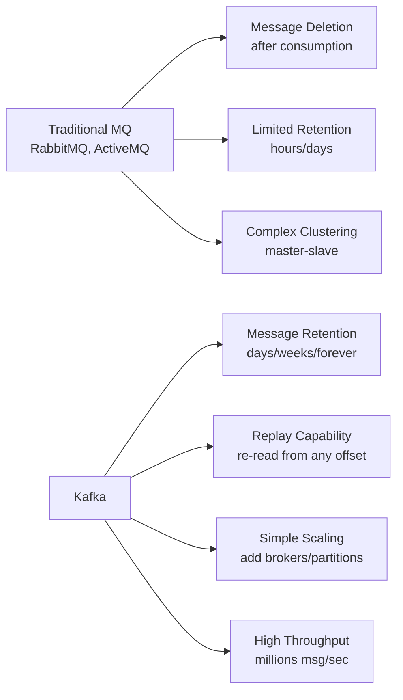
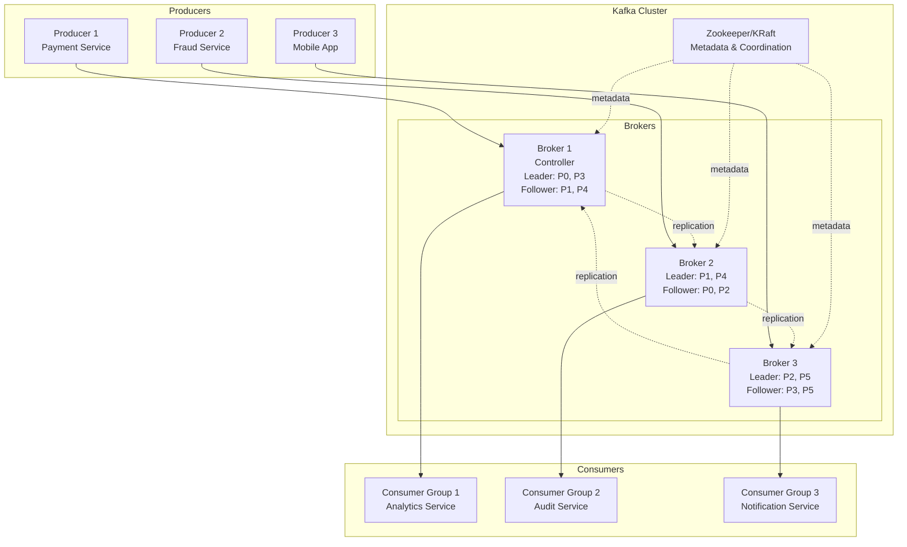
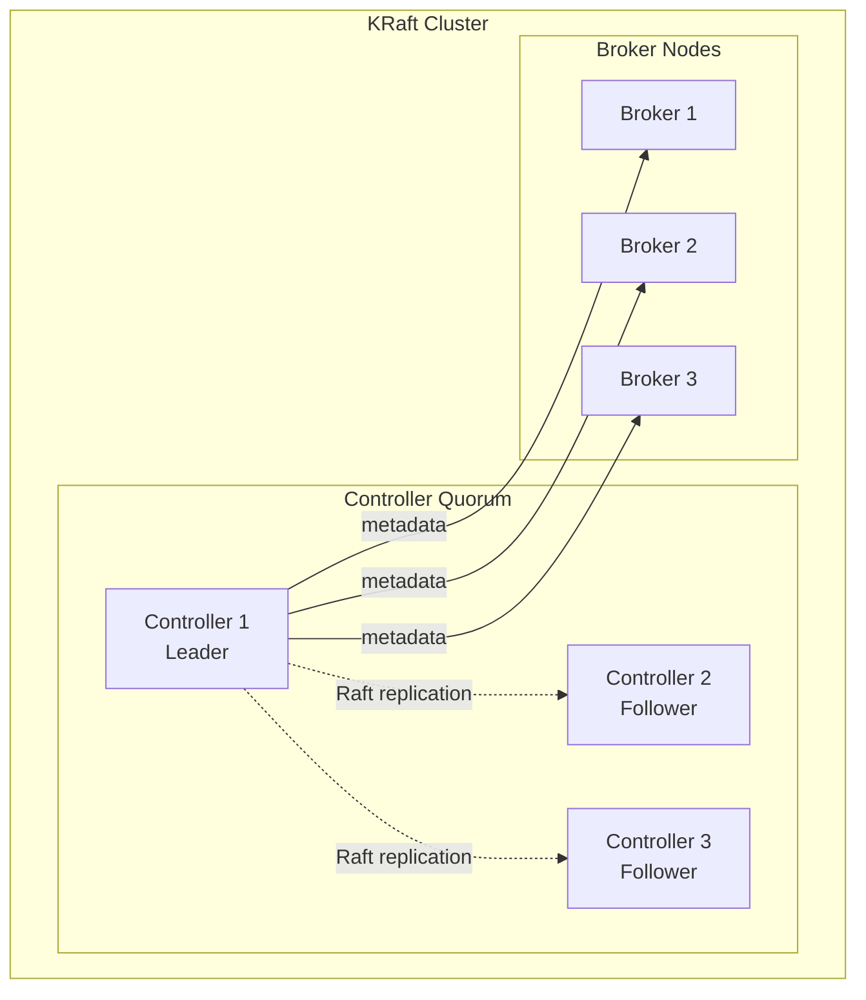
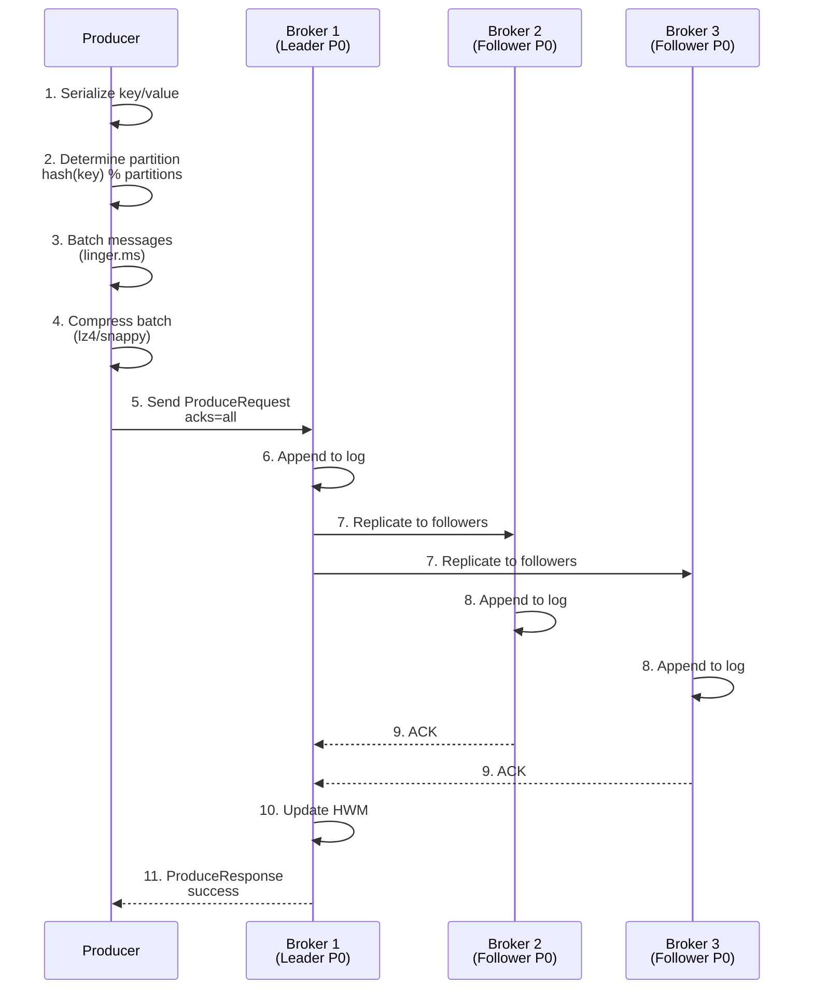
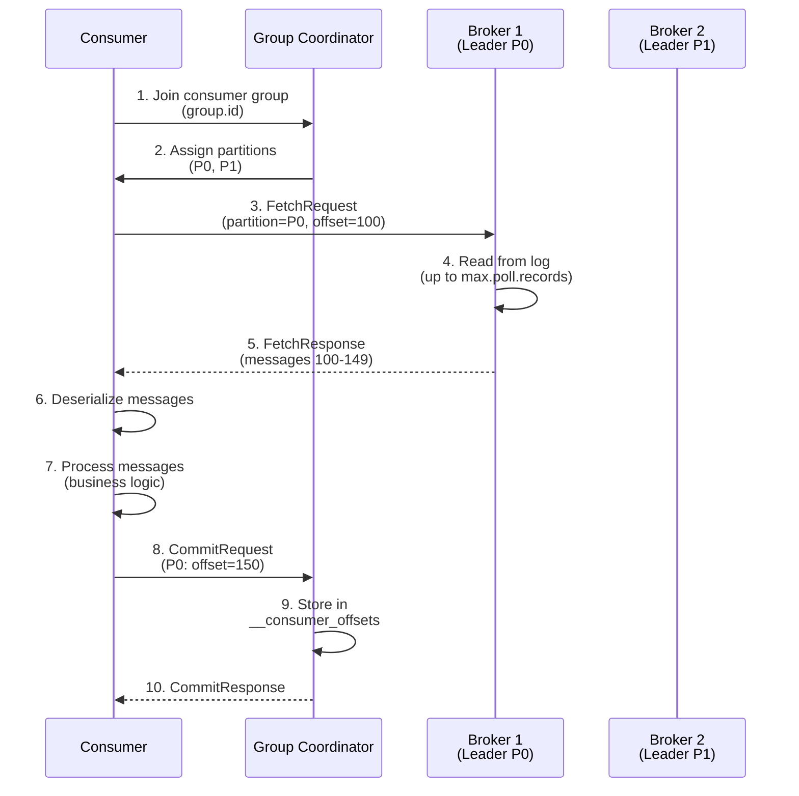
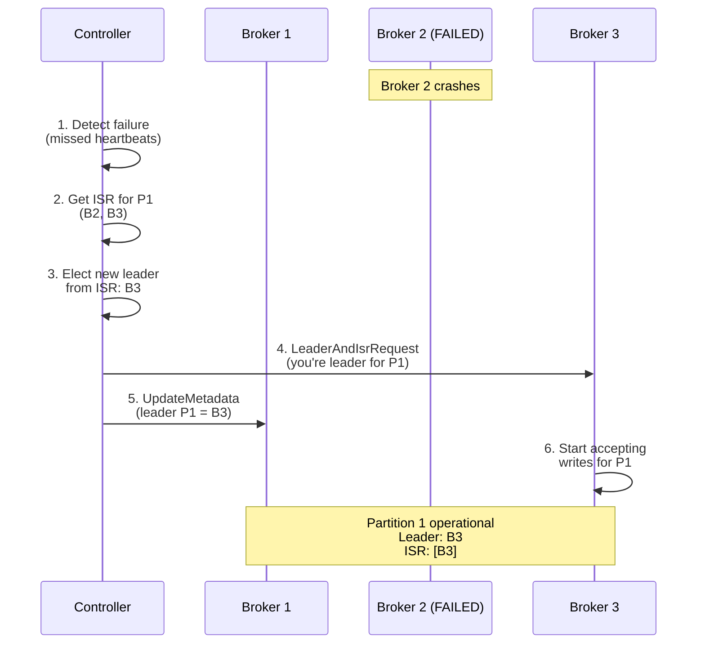

# Kafka Architecture and Fundamentals - Interview Preparation Guide

## Table of Contents
- [Overview](#overview)
- [What is Apache Kafka](#what-is-apache-kafka)
- [Core Concepts](#core-concepts)
- [Kafka Cluster Architecture](#kafka-cluster-architecture)
- [Zookeeper vs KRaft](#zookeeper-vs-kraft)
- [Message Flow](#message-flow)
- [Interview Questions & Answers](#interview-questions--answers)
- [Real-World Enterprise Scenarios](#real-world-enterprise-scenarios)
- [Common Pitfalls](#common-pitfalls)
- [Comparison Tables](#comparison-tables)
- [Key Takeaways](#key-takeaways)

---

## Overview

Apache Kafka is a distributed event streaming platform that has become the backbone of event-driven architectures in enterprise banking and financial services. Understanding Kafka's architecture is critical for Staff/Principal Engineer interviews, as it demonstrates your ability to design scalable, fault-tolerant systems for high-volume transaction processing.

**Why Interviewers Ask About Kafka**: At senior levels, you're expected to explain not just *what* Kafka does, but *why* it's designed the way it is, how it achieves durability and scalability, and when to use Kafka vs traditional message queues. Questions often focus on trade-offs, failure scenarios, and production operations.

**Real-World Relevance**: In banking, Kafka powers payment processing pipelines (processing millions of transactions/day), fraud detection systems (real-time pattern analysis), audit trails (immutable event logs), and data synchronization across microservices. A deep understanding of Kafka internals is essential for designing systems that meet SLAs and regulatory requirements.

---

## What is Apache Kafka

### Definition and Purpose

Apache Kafka is:
1. **Distributed Streaming Platform**: Handles continuous streams of events at scale
2. **Publish-Subscribe System**: Decouples producers and consumers
3. **Distributed Commit Log**: Durable, ordered, immutable sequence of records
4. **Message Queue++**: Beyond traditional queuing with replay capability and horizontal scaling

### Why Kafka Exists

**Problems Kafka Solves**:
- **Data Integration**: Move data between systems reliably (100+ connectors)
- **Real-Time Processing**: Process streams as they arrive (not batch)
- **Event Sourcing**: Store complete history of state changes
- **Decoupling**: Producers don't know about consumers (temporal and spatial decoupling)
- **Scalability**: Handle millions of messages/second across thousands of topics

### Kafka vs Traditional Message Queues



| Feature | Traditional MQ (RabbitMQ) | Kafka |
|---------|---------------------------|-------|
| **Message Retention** | Deleted after ACK | Retained for configured time/size |
| **Replay** | No (message gone after ACK) | Yes (re-read from any offset) |
| **Throughput** | ~20K msg/sec per broker | ~1M msg/sec per broker |
| **Ordering** | Queue-level (limited) | Partition-level (strong guarantee) |
| **Persistence** | Optional (in-memory preferred) | Always persistent (disk-based) |
| **Consumer Model** | Push (broker pushes to consumers) | Pull (consumers pull at their pace) |
| **Scaling** | Vertical (bigger machines) | Horizontal (more brokers) |
| **Use Case** | Task queues, RPC patterns | Event streaming, log aggregation, data pipelines |

**When to Use Kafka**:
- High throughput requirements (>10K msg/sec)
- Need for message replay (audit, reprocessing)
- Multiple consumers need same data
- Event sourcing or CQRS patterns
- Real-time analytics and monitoring

**When NOT to Use Kafka**:
- Low message volume (<1K msg/sec) - overhead not justified
- Complex routing logic (RabbitMQ's exchange types are better)
- Priority queues (Kafka is FIFO within partition)
- Transient messaging (no need for persistence)

---

## Core Concepts

### Topics

**What**: Logical category or feed name to which records are published.

**Why It Matters**: Topics organize data streams by business domain (e.g., `payments.initiated`, `fraud.alerts`, `customer.events`).

**Characteristics**:
- Multi-producer: Multiple producers can write to same topic
- Multi-consumer: Multiple consumer groups can read independently
- Immutable: Once written, messages cannot be modified
- Configurable retention: Time-based (7 days) or size-based (100GB)

**Naming Conventions** (Banking Example):
```
<domain>.<entity>.<event>
finance.payments.initiated
finance.payments.completed
finance.payments.failed
compliance.transactions.flagged
fraud.alerts.high-risk
```

### Partitions

**What**: Physical division of a topic across multiple log files.

**Why Critical**:
- **Scalability**: More partitions = more parallelism
- **Ordering**: Messages in same partition maintain order
- **Throughput**: Each partition can be on different broker/disk

**How They Work**:
```
Topic: payments.initiated (3 partitions)

Partition 0: [msg1][msg4][msg7]  ← Broker 1
Partition 1: [msg2][msg5][msg8]  ← Broker 2
Partition 2: [msg3][msg6][msg9]  ← Broker 3

Key-based routing: hash(key) % 3 → determines partition
```

**Partition Count Considerations**:
- **Too Few**: Limited parallelism, single broker bottleneck
- **Too Many**: More overhead (file handles, replication, end-to-end latency)
- **Rule of Thumb**:
  - Start with 3-5 partitions per topic
  - Plan for throughput: (target throughput MB/s) / (max throughput per partition MB/s)
  - Plan for consumers: Max consumers = partition count

**Important**: You can only **increase** partition count (never decrease). Plan ahead!

### Offsets

**What**: Sequential ID number assigned to each message within a partition.

**Why It Matters**: Offsets enable:
- **Consumer tracking**: "I've read up to offset 1234"
- **Replay**: "Start reading from offset 500"
- **Exactly-once semantics**: "I've already processed offset 999, skip it"

**Offset Mechanics**:
```
Partition 0:
Offset:    0      1      2      3      4      5
Message: [msg1][msg2][msg3][msg4][msg5][msg6]
                              ↑
                    Consumer committed offset: 3
                    (next read starts at 4)
```

**Types of Offsets**:
- **Current Offset**: Last committed offset by consumer
- **Log End Offset (LEO)**: Highest offset in partition (latest message)
- **High Water Mark (HWM)**: Highest offset replicated to all ISR (available to consumers)
- **Consumer Lag**: LEO - Current Offset (how far behind consumer is)

### Messages (Records)

**Structure**:
```
ProducerRecord:
  - Topic: "payments.initiated"
  - Partition: 2 (or null for auto-assignment)
  - Key: "account-12345" (optional, determines partition)
  - Value: {"amount": 500, "currency": "USD", ...} (payload)
  - Headers: {"source": "mobile-app", "version": "2.0"} (metadata)
  - Timestamp: 1699564800000 (epoch milliseconds)
```

**Why Each Field Matters**:
- **Key**: Determines partition (same key → same partition → ordering)
- **Value**: The actual event data (JSON, Avro, Protobuf, etc.)
- **Headers**: Metadata for routing, tracing, versioning
- **Timestamp**: Event time (producer sets) or ingestion time (broker sets)

**Key vs Value**:
```java
// Payment with account_id as key → ensures all payments for same account are ordered
ProducerRecord<String, Payment> record = new ProducerRecord<>(
    "payments.initiated",    // topic
    payment.getAccountId(),  // key (routing + ordering)
    payment                  // value (event data)
);
```

### Brokers

**What**: Kafka server that stores data and serves clients.

**Responsibilities**:
1. Receive messages from producers
2. Store messages on disk (append to log)
3. Serve messages to consumers
4. Replicate partitions to other brokers
5. Handle leader election for partitions

**Broker Characteristics**:
- **Stateless for compute**: Logic is simple (append, serve)
- **Stateful for storage**: Each broker stores subset of partitions
- **Identified by ID**: broker.id (0, 1, 2, ...)
- **Horizontally scalable**: Add more brokers for more capacity

### Clusters

**What**: Collection of Kafka brokers working together.

**Why Needed**:
- **Fault Tolerance**: If one broker fails, others continue
- **Load Distribution**: Spread partitions across brokers
- **Horizontal Scaling**: Add brokers to handle more load

**Cluster Size Considerations**:
- **Small (1-3 brokers)**: Dev/test environments
- **Medium (5-10 brokers)**: Production (typical)
- **Large (50+ brokers)**: Large enterprises (LinkedIn runs 1000+ broker clusters)

**Minimum for Production**: 3 brokers (allows replication factor of 3)

---

## Kafka Cluster Architecture

### Complete Kafka Ecosystem



### Controller

**What**: Special broker responsible for cluster-wide administrative operations.

**Election**:
- First broker to register in Zookeeper (legacy) or win KRaft election becomes controller
- Only **one controller** at a time (other brokers are followers)

**Responsibilities**:
1. **Partition Leader Election**: When leader fails, elect new leader from ISR
2. **Topic Management**: Create/delete topics, increase partitions
3. **Broker Failure Detection**: Monitor broker health, reassign partitions
4. **ISR Management**: Track which replicas are in-sync
5. **Metadata Distribution**: Push metadata changes to all brokers

**Controller Epoch**: Version number incremented on each controller election (prevents stale controllers)

**Failure Scenario**:
```
1. Controller (Broker 1) fails
2. Remaining brokers (2, 3) detect failure
3. New controller election (Broker 2 wins)
4. Controller epoch incremented (5 → 6)
5. Broker 2 starts managing cluster
6. Old controller (Broker 1) recovers but sees stale epoch → becomes follower
```

**Monitoring**: `kafka.controller:type=KafkaController,name=ActiveControllerCount` (should be 1)

---

## Zookeeper vs KRaft

### Zookeeper (Legacy Architecture)

**What**: External coordination service used by Kafka for metadata and coordination (until Kafka 3.x).

**Responsibilities in Kafka**:
- Controller election
- Broker registry (which brokers are alive)
- Topic configuration storage
- Partition leader metadata
- ACL (Access Control List) storage

**Problems with Zookeeper**:
1. **Operational Complexity**: Separate system to maintain (3-5 Zookeeper nodes)
2. **Metadata Scalability**: Zookeeper limits (metadata stored in memory)
3. **Recovery Time**: Slow metadata loading after controller failover (minutes for large clusters)
4. **Partition Limit**: ~200K partitions max (Zookeeper bottleneck)
5. **Split Brain Risk**: Network partition between Kafka and Zookeeper

### KRaft (Kafka Raft Metadata Mode)

**What**: Built-in consensus protocol replacing Zookeeper (Kafka 3.0+, production-ready in 3.3+).

**How It Works**:
- Metadata stored in Kafka topic (`__cluster_metadata`)
- Dedicated controller quorum (3 or 5 controller nodes)
- Uses Raft consensus algorithm
- Other brokers replicate metadata log

**Benefits**:
1. **Simpler Operations**: No external dependency
2. **Faster Recovery**: Metadata replay from log (seconds vs minutes)
3. **Higher Scale**: Millions of partitions supported
4. **Better Resource Usage**: Metadata not limited by Zookeeper memory
5. **Improved Reliability**: No split-brain scenarios

**Architecture**:


**Migration Path**:
- Kafka 2.8: KRaft preview (dev only)
- Kafka 3.0: KRaft feature-complete (still preview)
- Kafka 3.3+: KRaft production-ready
- Kafka 3.5+: Zookeeper deprecation notice
- Kafka 4.0 (future): Zookeeper support removed

**Production Recommendation**: Use KRaft for new clusters (Kafka 3.3+), plan migration for existing.

---

## Message Flow

### Producer to Broker

**Step-by-Step Flow**:



**Key Points**:
- **Batching**: Improves throughput (fewer network calls)
- **Compression**: Reduces network bandwidth (happens at producer)
- **Replication**: Leader waits for followers before ACK (acks=all)
- **High Water Mark**: Only updated when all ISR acknowledge

### Broker to Consumer

**Step-by-Step Flow**:



**Key Points**:
- **Consumer Pull**: Consumers pull at their own pace (not pushed)
- **Offset Commit**: Stores progress in internal topic (`__consumer_offsets`)
- **Partition Assignment**: Group coordinator assigns partitions to consumers
- **Batch Fetching**: Consumer fetches multiple messages per request

---

## Interview Questions & Answers

### Q1: What is Apache Kafka and how does it differ from traditional message queues?

**Answer**:
Apache Kafka is a distributed event streaming platform designed for high-throughput, fault-tolerant data pipelines. Unlike traditional message queues (RabbitMQ, ActiveMQ):

1. **Message Persistence**: Kafka retains messages for configured time (days/weeks) even after consumption. Traditional MQs delete after ACK.

2. **Replay Capability**: Consumers can re-read messages from any offset. Traditional MQs can't replay consumed messages.

3. **Throughput**: Kafka handles millions of messages/second (1M+ msg/sec per broker) vs traditional MQs (20-50K msg/sec).

4. **Consumer Model**: Kafka uses pull model (consumers pull at their pace), traditional MQs push messages.

5. **Ordering**: Kafka guarantees order within a partition, traditional MQs have limited ordering guarantees.

**Banking Example**: Payment processing systems use Kafka because:
- Audit requires replaying all payment events (regulatory compliance)
- Multiple systems need same payment data (fraud detection, accounting, notifications)
- High volume (100K+ payments/day) requires Kafka's throughput

**Follow-up**: "How would you choose between Kafka and RabbitMQ?"
**Answer**: Use Kafka for high-throughput event streaming, analytics, audit trails. Use RabbitMQ for task queues, complex routing, priority queues, low-volume transactional messaging.

---

### Q2: Explain Kafka's partition concept and why it's critical for scalability.

**Answer**:
Partitions are the fundamental unit of parallelism in Kafka. Each topic is divided into multiple ordered logs (partitions).

**Why Critical**:
1. **Parallel Processing**: Each partition can be consumed by different consumer (max consumers = partition count)
2. **Distributed Storage**: Partitions distributed across brokers (horizontal scaling)
3. **Ordering Guarantee**: Messages in same partition maintain strict order
4. **Throughput**: Each partition limited by single disk/broker; more partitions = more aggregate throughput

**How Partition Assignment Works**:
```
Producer sends message with key "account-12345"
→ Kafka computes: hash("account-12345") % 10 = 7
→ Message goes to Partition 7
→ All messages with key "account-12345" go to Partition 7 (ordered)
```

**Banking Example**: Payment topic with 10 partitions:
- Key = account_id → ensures all payments for same account are ordered
- 10 consumer instances → each processes 1 partition (parallelism)
- 100K payments/day → 10K per partition (load distribution)

**Trade-offs**:
- **Too Few Partitions**: Limited parallelism, single broker bottleneck
- **Too Many Partitions**: More overhead (open files, replication traffic, end-to-end latency)
- **Cannot Decrease**: Once created with N partitions, can only increase (never decrease)

---

### Q3: What is an offset in Kafka and why does it matter?

**Answer**:
An offset is a sequential ID (0, 1, 2, ...) assigned to each message within a partition. It's Kafka's mechanism for tracking consumer progress and enabling message replay.

**Three Key Offset Types**:
1. **Current Offset**: Last committed offset by consumer ("I've processed up to offset 1234")
2. **Log End Offset (LEO)**: Highest offset in partition (latest message)
3. **Consumer Lag**: LEO - Current Offset (how far behind consumer is)

**Why It Matters**:
- **Consumer Tracking**: Consumers commit offsets to track progress
- **Fault Recovery**: If consumer crashes, it resumes from last committed offset
- **Replay**: Can reset offset to re-process messages (e.g., offset=0 for full replay)
- **Exactly-Once**: Prevents duplicate processing by tracking processed offsets

**Banking Example - Payment Processing**:
```
Partition 0 (payments.initiated):
Offset:    0      1      2      3      4      5
Message: [P001][P002][P003][P004][P005][P006]

Consumer committed offset: 3
→ Next fetch starts at offset 4
→ If consumer crashes and restarts, it resumes at offset 4
→ Messages 0-3 won't be reprocessed (at-least-once semantics)
```

**Consumer Lag Monitoring**:
```
LEO = 10000 (latest message)
Current Offset = 9500 (last processed)
Consumer Lag = 500 messages (consumer is 500 messages behind)
```
If lag keeps growing, consumer can't keep up → need to scale consumers or optimize processing.

---

### Q4: Explain the role of the Kafka Controller.

**Answer**:
The controller is a special broker responsible for cluster-wide administrative operations. **Only one controller exists** at a time; other brokers are followers.

**Controller Responsibilities**:
1. **Partition Leader Election**: When a broker fails, controller elects new leaders from ISR
2. **Broker Failure Detection**: Monitors broker health via heartbeats
3. **Topic Management**: Handles create/delete topic requests
4. **ISR Management**: Tracks which replicas are in-sync
5. **Metadata Distribution**: Pushes metadata updates to all brokers

**Election Process**:
- **Zookeeper (legacy)**: First broker to create ephemeral node `/controller` becomes controller
- **KRaft**: Raft election among controller quorum (3-5 controller nodes)

**Controller Epoch**: Version number incremented on each election (prevents stale controllers from making decisions).

**Failure Scenario**:
```
1. Controller (Broker 1) fails
2. Other brokers detect failure (missed heartbeats)
3. New election → Broker 2 becomes controller
4. Controller epoch: 5 → 6
5. Broker 2 starts partition leader elections
6. Old controller (Broker 1) recovers but sees stale epoch → becomes follower
```

**Monitoring**:
- **ActiveControllerCount**: Should be exactly 1 across entire cluster
- **ControllerState**: 1 = active controller, 0 = follower

**Why It Matters**: Controller failure causes temporary unavailability of administrative operations (can't create topics, elect leaders). In KRaft, recovery is faster (seconds vs minutes with Zookeeper).

---

### Q5: What's the difference between Zookeeper and KRaft? Why the migration?

**Answer**:
**Zookeeper (Legacy)**:
- External coordination service for metadata and consensus
- Kafka used it for controller election, broker registry, topic metadata
- Requires separate 3-5 node Zookeeper ensemble

**Problems**:
1. **Operational Complexity**: Maintaining separate Zookeeper cluster
2. **Metadata Scalability**: Limited to ~200K partitions (Zookeeper stores metadata in memory)
3. **Slow Recovery**: Controller failover takes minutes (reload metadata from Zookeeper)
4. **Split Brain**: Network partition between Kafka and Zookeeper causes issues

**KRaft (Kafka 3.0+)**:
- Built-in Raft consensus protocol (no external dependency)
- Metadata stored in Kafka topic (`__cluster_metadata`)
- Dedicated controller quorum (3-5 controller nodes)

**Benefits**:
1. **Simpler Operations**: One less system to maintain
2. **Faster Recovery**: Metadata replay from log (seconds vs minutes)
3. **Higher Scale**: Millions of partitions supported
4. **Better Reliability**: No split-brain scenarios

**Migration Timeline**:
- Kafka 2.8: KRaft preview
- Kafka 3.3+: KRaft production-ready
- Kafka 3.5+: Zookeeper deprecation notice
- Kafka 4.0: Zookeeper removal planned

**Interview Context**: "We're migrating from Zookeeper to KRaft because our cluster has 500K partitions and controller failover takes 5 minutes. KRaft reduces recovery to under 30 seconds and removes operational burden of maintaining Zookeeper."

---

### Q6: How does message routing work in Kafka? How are partitions assigned?

**Answer**:
Message routing happens at the **producer** based on the message key.

**Partition Assignment Algorithm**:
```java
// If key is provided:
partition = hash(key) % number_of_partitions

// If key is null:
partition = round-robin across available partitions
```

**Three Scenarios**:

**1. With Key (Most Common)**:
```java
// Payment with account_id as key
ProducerRecord<String, Payment> record = new ProducerRecord<>(
    "payments.initiated",     // topic
    payment.getAccountId(),   // key: "ACC-12345"
    payment                   // value
);

// Hash of "ACC-12345" % 10 partitions = 7
// Message goes to Partition 7
// All payments for ACC-12345 go to Partition 7 (ordered)
```

**2. Without Key**:
```java
ProducerRecord<String, Payment> record = new ProducerRecord<>(
    "payments.initiated",     // topic
    null,                     // no key
    payment                   // value
);

// Uses sticky partitioner (Kafka 2.4+)
// Batches messages to same partition until batch is full
// Then switches to next partition (improves batching efficiency)
```

**3. Custom Partitioner**:
```java
public class CustomPartitioner implements Partitioner {
    public int partition(String topic, Object key, byte[] keyBytes,
                        Object value, byte[] valueBytes,
                        Cluster cluster) {
        Payment payment = (Payment) value;

        // Route high-priority payments to Partition 0
        if (payment.getPriority() == Priority.HIGH) {
            return 0;
        }

        // Route others by account_id
        return hash(payment.getAccountId()) % cluster.partitionCountForTopic(topic);
    }
}
```

**Why It Matters**:
- **Ordering**: Same key → same partition → guaranteed order
- **Load Balancing**: Hash distributes messages evenly
- **Consumer Affinity**: Partition 7 always goes to same consumer (until rebalancing)

**Banking Example**: Payment processing
```
Topic: payments.initiated (10 partitions)
Key: account_id

Payment for ACC-001 → Partition 3
Payment for ACC-001 → Partition 3 (same partition, ordered)
Payment for ACC-002 → Partition 7
Payment for ACC-002 → Partition 7 (same partition, ordered)
```
Ensures all payments for same account are processed in order (critical for balance calculations).

---

### Q7: Explain Kafka's storage model. How are messages persisted?

**Answer**:
Kafka stores messages in an append-only log on disk, organized by partition.

**Directory Structure**:
```
/var/lib/kafka/data/
  payments.initiated-0/    ← Partition 0
    00000000000000000000.log
    00000000000000000000.index
    00000000000000000000.timeindex
  payments.initiated-1/    ← Partition 1
    00000000000000000000.log
    00000000000000000000.index
```

**Log Segments**:
- **Active Segment**: Currently being written (one per partition)
- **Closed Segments**: Immutable, candidates for deletion/compaction
- **Segment Rolling**: New segment created when size (log.segment.bytes=1GB) or time (log.segment.ms=7 days) limit reached

**Why Append-Only Log**:
1. **Fast Writes**: Sequential disk writes ~100MB/s (vs random writes ~1MB/s)
2. **OS Page Cache**: Recently written data cached in RAM (fast reads)
3. **Simple Replication**: Followers just copy log segments
4. **Durability**: fsync to disk ensures no data loss

**Index Files**:
- **Offset Index**: Maps offset → byte position in log file (sparse index)
- **Timestamp Index**: Maps timestamp → offset (for time-based queries)
- **Binary Search**: O(log N) lookup using index

**Message Format** (simplified):
```
[Offset: 8 bytes][Size: 4 bytes][CRC: 4 bytes][Key][Value]
```

**Retention Policies**:
- **Time-based**: `log.retention.hours=168` (7 days) - delete old segments
- **Size-based**: `log.retention.bytes=1073741824` (1GB) - delete when size exceeded
- **Log Compaction**: Keep only latest value per key (for stateful topics)

**Banking Example**:
```
Topic: transactions.audit (retention=90 days for compliance)
- Stores all transaction events for 90 days
- After 90 days, old segments deleted
- Total storage: 1M transactions/day × 1KB/transaction × 90 days = 90GB
```

---

### Q8: What happens when a broker fails in Kafka?

**Answer**:
Kafka handles broker failures through **replication** and **leader election**.

**Scenario**: Broker 2 fails (was leader for Partition 1)

**Step-by-Step Recovery**:



**What Happens**:
1. **Detection**: Controller detects broker failure (missed heartbeats)
2. **Leader Election**: For each partition where failed broker was leader:
   - Controller picks new leader from ISR (In-Sync Replicas)
   - If no ISR available → partition offline (if `unclean.leader.election.enable=false`)
3. **Metadata Update**: Controller updates metadata, broadcasts to all brokers
4. **Traffic Redirected**: Producers/consumers redirect requests to new leader
5. **Replication**: New leader accepts writes, surviving follower replicates

**Impact**:
- **Partitions led by failed broker**: Temporarily unavailable (~few seconds) during election
- **Partitions where it was follower**: No impact (leader still available)
- **ISR shrinks**: Failed broker removed from ISR lists

**Recovery When Broker Returns**:
```
1. Broker 2 restarts
2. Rejoins cluster
3. Becomes follower for partitions it held
4. Catches up by replicating from leaders
5. Once caught up, added back to ISR
```

**Banking Implications**:
- **Replication Factor 3**: Ensures 2 copies survive single broker failure
- **Min ISR = 2**: Ensures at least 2 replicas acknowledge write (prevents data loss)
- **Monitoring**: Alert on `OfflinePartitionsCount > 0` (critical issue)

---

### Q9: How does Kafka achieve high throughput?

**Answer**:
Kafka achieves million+ messages/second through several design choices:

**1. Sequential Disk I/O**:
- **Append-Only Log**: Sequential writes (~100MB/s) vs random writes (~1MB/s)
- **No Updates**: Never modifies existing messages (immutable)
- **Segment Files**: Large contiguous files on disk

**2. Page Cache (OS-level)**:
- **Zero-Copy**: Data flows from disk → page cache → network (skips application memory)
- **Recent Data Cached**: OS caches recently written/read data in RAM
- **Kafka Heap Small**: 6-8GB heap (rest for page cache)

**3. Batching**:
- **Producer Batching**: `batch.size=16KB`, `linger.ms=10ms` (accumulate messages before send)
- **Consumer Batching**: `max.poll.records=500` (fetch multiple messages per request)
- **Network Efficiency**: Fewer network round-trips

**4. Compression**:
- **At Producer**: Compress entire batch (better compression ratio)
- **Supported**: LZ4 (best for Kafka), Snappy, GZIP, ZSTD
- **Network Savings**: 60-80% reduction in bytes transferred

**5. Zero-Copy** (sendfile() syscall):
```
Traditional:
Disk → OS buffer → Kafka app memory → Socket buffer → Network
(4 copies, 2 context switches)

Kafka (zero-copy):
Disk → OS buffer → Network
(2 copies, no context switches)
```

**6. Efficient Serialization**:
- **Binary Formats**: Avro, Protobuf (compact, fast)
- **No JSON Parsing**: Binary deserialization faster than JSON

**Benchmarks** (per broker on modern hardware):
- **Write**: 2M messages/sec (100MB/s)
- **Read**: 5M messages/sec (250MB/s) - from page cache
- **Replication**: 1M messages/sec (50MB/s) per follower

**Banking Example**:
```
Payment processing: 100K payments/day
= 100,000 / (24 × 60 × 60) = 1.15 msg/sec (trivial for Kafka)

But peak load: 10K payments in 1 minute (end-of-day batch)
= 10,000 / 60 = 166 msg/sec (still trivial)

Kafka headroom: 2M msg/sec = 12,000× current peak
```

---

### Q10: What is consumer lag and why does it matter?

**Answer**:
Consumer lag is the difference between the latest message in a partition (Log End Offset) and the last committed offset by a consumer.

**Formula**:
```
Consumer Lag = Log End Offset (LEO) - Current Offset
```

**Example**:
```
Partition 0:
  Latest message offset (LEO): 10,000
  Consumer committed offset: 9,500
  Consumer Lag: 500 messages (consumer is 500 messages behind)
```

**Why It Matters**:
1. **Processing Speed**: High lag = consumer can't keep up with producer rate
2. **Freshness**: High lag = stale data (e.g., fraud detection delayed)
3. **Capacity Planning**: Growing lag = need to scale consumers
4. **SLA Violations**: Payment processing lag > 5 mins might breach SLA

**Causes of High Lag**:
- **Slow Processing**: Consumer logic takes too long per message
- **Under-Provisioned**: Not enough consumer instances (max = partition count)
- **GC Pauses**: Long GC pauses in consumer application
- **Network Issues**: Slow fetch from brokers
- **Rebalancing**: Consumers pause during rebalance

**Monitoring**:
```bash
# Check consumer lag
kafka-consumer-groups --bootstrap-server localhost:9092 \
  --describe --group payment-processor

GROUP             TOPIC              PARTITION  CURRENT-OFFSET  LOG-END-OFFSET  LAG
payment-processor payments.initiated 0          9500            10000           500
payment-processor payments.initiated 1          8200            8200            0
```

**Remediation**:
1. **Scale Consumers**: Add more consumer instances (up to partition count)
2. **Optimize Processing**: Reduce time spent processing each message
3. **Increase Partitions**: More partitions = more parallelism (requires topic recreation)
4. **Batch Processing**: Process messages in batches (e.g., bulk database inserts)

**Banking SLA**:
```
Payment Processing SLA: 95% processed within 5 minutes
→ Consumer lag must stay under 5 minutes of messages
→ Alert threshold: lag > 300 seconds × 100 msg/sec = 30,000 messages
```

---

## Real-World Enterprise Scenarios

### Scenario 1: Payment Processing Pipeline

**Use Case**: Process 500K payments/day with strict ordering per account.

**Design**:
```
Topic: payments.initiated
Partitions: 20 (allows 20 parallel consumers)
Replication Factor: 3 (durability)
Retention: 30 days (regulatory requirement)

Partition Key: account_id
→ All payments for same account go to same partition
→ Ensures ordering: deposit before withdrawal
```

**Producer Configuration**:
```properties
# Exactly-once semantics
enable.idempotence=true
acks=all
retries=Integer.MAX_VALUE

# Performance
batch.size=32768       # 32KB batches
linger.ms=10           # Wait 10ms for more messages
compression.type=lz4   # Fast compression
```

**Consumer Configuration**:
```properties
# Manual offset commit (at-least-once)
enable.auto.commit=false
isolation.level=read_committed  # Skip uncommitted transactions

# Throughput
max.poll.records=500
fetch.min.bytes=1024
```

**Monitoring**:
- Consumer lag < 1000 messages (SLA: process within 1 minute)
- UnderReplicatedPartitions = 0 (all partitions fully replicated)

---

### Scenario 2: Fraud Detection (Real-Time)

**Use Case**: Detect fraudulent transactions within 100ms.

**Design**:
```
Topic: transactions.raw (high volume)
Partitions: 50 (high parallelism)
Retention: 7 days (no need to keep long-term)

Kafka Streams Application:
- Window: 5-minute tumbling window
- Aggregate: Count transactions per account
- Filter: Flag if count > threshold (velocity check)
- Output: fraud.alerts topic
```

**Why Kafka**:
- **Low Latency**: Sub-100ms processing (in-memory state)
- **Exactly-Once**: No duplicate fraud alerts
- **Stateful**: Track transaction counts per account (state store)

**Performance**:
```
Input: 10K transactions/sec
Processing: 50 stream threads (1 per partition)
Latency: p99 < 50ms (from transaction to fraud alert)
```

---

## Common Pitfalls

### Pitfall 1: Not Planning Partition Count

**Problem**: Start with 1 partition, realize you need more later.

**Issue**: Cannot decrease partition count (only increase). Increasing changes key-to-partition mapping (breaks ordering for existing keys).

**Solution**: Plan for peak load:
```
Target throughput: 10,000 msg/sec
Max throughput per partition: 1,000 msg/sec
→ Need 10 partitions minimum
→ Add 50% buffer: 15 partitions
```

---

### Pitfall 2: No Partition Key (Random Assignment)

**Problem**: Messages distributed randomly → no ordering guarantee.

**Example**:
```java
// ❌ BAD: No key
new ProducerRecord<>("payments", payment);
→ Payment 1 for ACC-001 → Partition 5
→ Payment 2 for ACC-001 → Partition 2
→ Payments out of order!

// ✅ GOOD: Key ensures ordering
new ProducerRecord<>("payments", payment.getAccountId(), payment);
→ All payments for ACC-001 → Same partition → Ordered
```

---

### Pitfall 3: Ignoring Consumer Lag

**Problem**: Consumer lag grows unnoticed → SLA violations.

**Solution**: Monitor and alert:
```bash
# Set alert: consumer lag > 10,000 messages
kafka.consumer:type=consumer-fetch-manager-metrics,
  client-id=*:records-lag-max > 10000
```

---

## Comparison Tables

### Kafka vs Other Messaging Systems

| Feature | Kafka | RabbitMQ | AWS SQS |
|---------|-------|----------|---------|
| **Throughput** | 1M+ msg/sec | 20K msg/sec | 3K msg/sec |
| **Retention** | Days/weeks | Minutes/hours | 14 days max |
| **Replay** | Yes (any offset) | No | No (limited) |
| **Ordering** | Per-partition (strong) | Per-queue (limited) | FIFO queues only |
| **Persistence** | Always (disk) | Optional | Always (cloud) |
| **Multi-Consumer** | Yes (consumer groups) | Yes (competing consumers) | No (message deleted after read) |
| **Use Case** | Event streaming, logs | Task queues, RPC | Simple queues, serverless |

---

## Key Takeaways

1. **Kafka = Distributed Commit Log**: Not just a message queue; designed for event streaming and data pipelines.

2. **Partitions = Parallelism**: More partitions = more consumers = higher throughput. Plan partition count based on peak load.

3. **Key-Based Routing**: Message key determines partition. Same key → same partition → guaranteed ordering.

4. **Offset = Consumer Position**: Offsets enable replay, fault recovery, and exactly-once semantics.

5. **Controller = Cluster Brain**: Single controller manages leader election, metadata, broker failures. Monitor `ActiveControllerCount = 1`.

6. **KRaft Replaces Zookeeper**: Kafka 3.3+ uses built-in Raft consensus. Simpler operations, faster recovery, higher scale.

7. **Consumer Lag = SLA Indicator**: Monitor lag to detect slow consumers. High lag = need to scale or optimize.

8. **Replication = Durability**: Replication factor 3 with min.insync.replicas=2 ensures no data loss on single broker failure.

---

## Further Reading

### Official Documentation
- [Apache Kafka Documentation](https://kafka.apache.org/documentation/)
- [Kafka Improvement Proposals (KIPs)](https://cwiki.apache.org/confluence/display/KAFKA/Kafka+Improvement+Proposals)
- [Confluent Documentation](https://docs.confluent.io/)

### Books
- **"Kafka: The Definitive Guide"** by Neha Narkhede, Gwen Shapira, Todd Palino (O'Reilly)
- **"Designing Event-Driven Systems"** by Ben Stopford (Confluent)
- **"Kafka Streams in Action"** by William Bejeck (Manning)

### Articles
- [Kafka Design Documentation](https://kafka.apache.org/documentation/#design)
- [Confluent Blog](https://www.confluent.io/blog/)
- [LinkedIn Engineering Blog - Kafka](https://engineering.linkedin.com/blog/topic/kafka)
