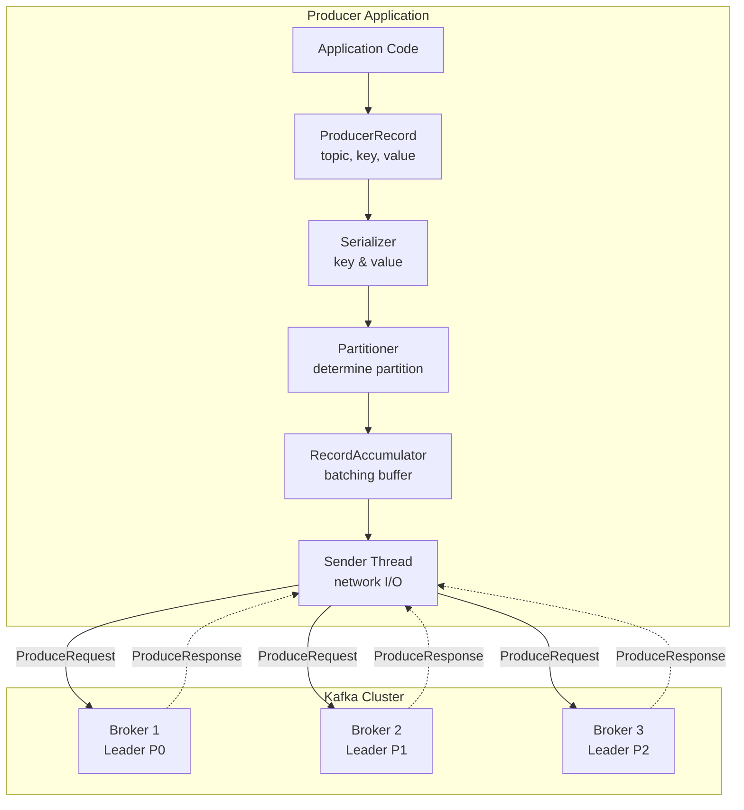
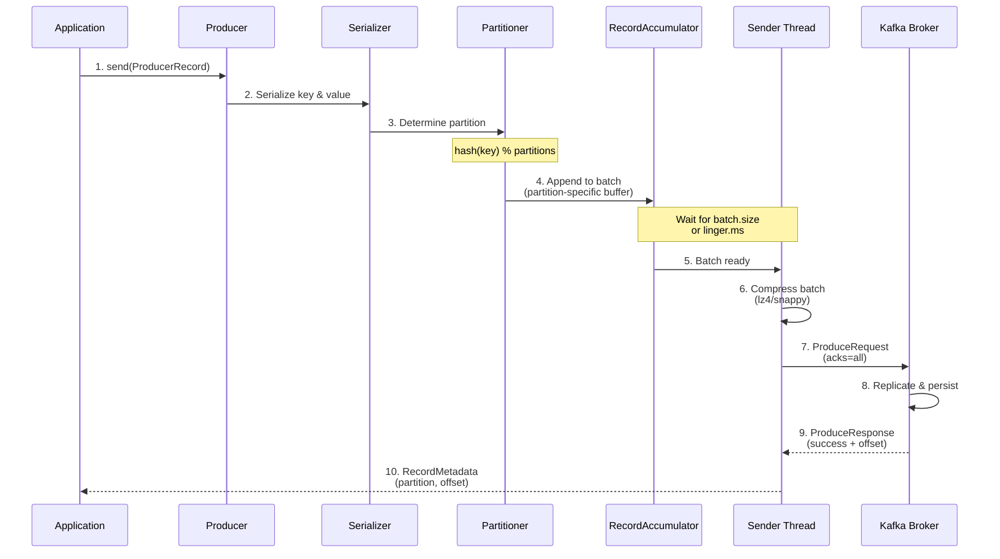
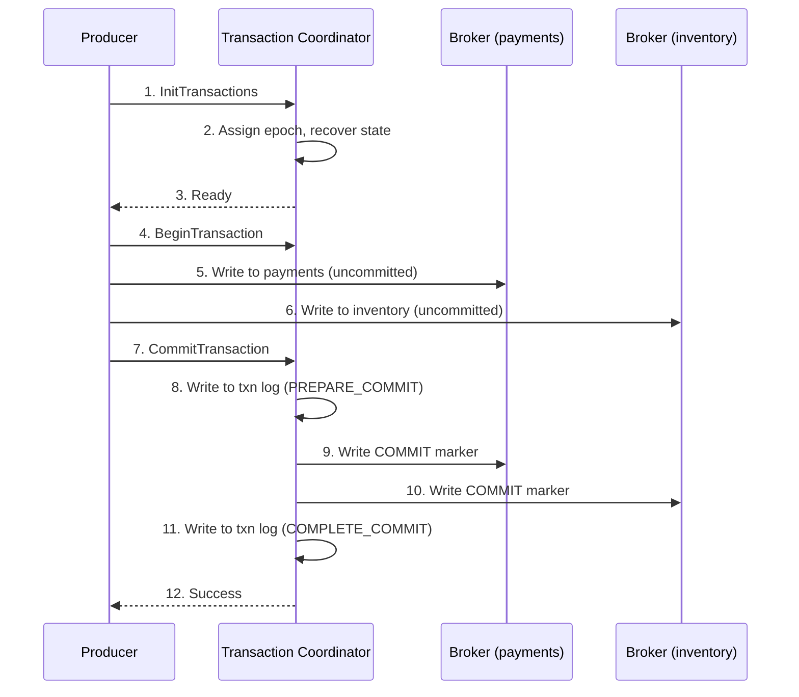

# Kafka Producer Internals - Interview Preparation Guide

## Table of Contents
- [Overview](#overview)
- [Producer Architecture](#producer-architecture)
- [Producer Workflow](#producer-workflow)
- [Partitioning Strategies](#partitioning-strategies)
- [Batching and Compression](#batching-and-compression)
- [Acknowledgments and Guarantees](#acknowledgments-and-guarantees)
- [Idempotent Producer](#idempotent-producer)
- [Transactional Producer](#transactional-producer)
- [Producer Configuration](#producer-configuration)
- [Error Handling](#error-handling)
- [Performance Tuning](#performance-tuning)
- [Interview Questions & Answers](#interview-questions--answers)
- [Real-World Enterprise Scenarios](#real-world-enterprise-scenarios)
- [Common Pitfalls](#common-pitfalls)
- [Key Takeaways](#key-takeaways)

---

## Overview

The Kafka producer is responsible for publishing records to Kafka topics. Understanding producer internals is critical for senior-level interviews because it demonstrates your ability to design reliable, high-performance data pipelines in enterprise banking systems.

**Why Interviewers Focus on Producers**: Producer configuration directly impacts data durability, throughput, latency, and delivery guarantees. In payment processing, incorrect producer settings can lead to duplicate payments (financial loss) or lost transactions (compliance violations).

**Real-World Relevance**: Enterprise banking systems use producers to publish payment events, transaction logs, audit trails, and customer interactions. A payment service producing 100K events/day needs exactly-once semantics to prevent duplicate charges, while a logging service needs high throughput without strict guarantees.

---

## Producer Architecture

### High-Level Components



### Key Components Explained

**1. ProducerRecord**: The message to be sent
```java
ProducerRecord<String, Payment> record = new ProducerRecord<>(
    "payments.initiated",           // topic
    payment.getAccountId(),         // key (optional)
    payment,                        // value
    System.currentTimeMillis(),     // timestamp (optional)
    headers                         // headers (optional)
);
```

**2. Serializer**: Converts objects to byte arrays
- Key Serializer: Converts key object → bytes
- Value Serializer: Converts value object → bytes
- Built-in: StringSerializer, IntegerSerializer, ByteArraySerializer
- Custom: AvroSerializer, ProtobufSerializer, JsonSerializer

**3. Partitioner**: Determines target partition
- Default: Hash-based partitioning (hash(key) % partitions)
- Custom: Implement `Partitioner` interface for business logic

**4. RecordAccumulator**: Batching buffer
- Stores records in memory per partition
- Batches messages together before sending
- Configurable batch size and linger time

**5. Sender Thread**: Network I/O
- Runs in background, sends batches to brokers
- Manages in-flight requests per broker
- Handles acknowledgments and retries

---

## Producer Workflow

### Step-by-Step Message Journey



### Detailed Steps

**Step 1: Application Calls send()**
```java
// Fire-and-forget (fastest, no guarantee)
producer.send(record);

// Synchronous (slowest, guaranteed)
RecordMetadata metadata = producer.send(record).get();

// Asynchronous (best practice)
producer.send(record, (metadata, exception) -> {
    if (exception != null) {
        // Handle error
    } else {
        // Success: metadata.partition(), metadata.offset()
    }
});
```

**Step 2: Serialization**
- Key and value converted to byte arrays
- Custom serializers for complex objects (Avro, Protobuf)
- **Failure**: `SerializationException` thrown immediately (non-retriable)

**Step 3: Partitioning**
- Determines target partition (0 to N-1)
- **With key**: `hash(key) % partition_count`
- **Without key**: Round-robin or sticky partitioner (Kafka 2.4+)

**Step 4: Append to RecordAccumulator**
- Record added to per-partition batch buffer
- Buffer size: `buffer.memory` (default 32MB)
- If buffer full: blocks for `max.block.ms` (default 60s), then throws `TimeoutException`

**Step 5: Batch Ready**
- **Batch full**: `batch.size` reached (default 16KB)
- **Time elapsed**: `linger.ms` passed (default 0ms - send immediately)
- Whichever comes first triggers send

**Step 6: Compression**
- Entire batch compressed (better compression ratio than per-message)
- Algorithms: `none`, `gzip`, `snappy`, `lz4` (recommended), `zstd`

**Step 7: Send to Broker**
- Sender thread sends `ProduceRequest` to partition leader
- `max.in.flight.requests.per.connection`: Max unacknowledged requests (default 5)

**Step 8: Broker Replication**
- Leader appends to log
- Replicates to followers (if `acks=all`)
- Updates high water mark

**Step 9: Acknowledgment**
- Broker sends `ProduceResponse` with offset
- **Success**: Callback invoked with `RecordMetadata`
- **Failure**: Retry (if retriable) or invoke callback with exception

---

## Partitioning Strategies

### Default Partitioner (Hash-Based)

**With Key**:
```java
partition = hash(key) % partition_count

// Example:
hash("account-12345") % 10 = 7
→ Message goes to Partition 7
→ All messages with key "account-12345" → Partition 7 (ordered)
```

**Without Key (Kafka 2.4+: Sticky Partitioner)**:
- Fills one partition batch, then switches to next
- Improves batching efficiency (better throughput)
- **Before 2.4**: Round-robin (poor batching)

### Custom Partitioner

**Use Cases**:
- Priority routing (VIP customers to dedicated partition)
- Load balancing based on message size
- Geographic routing

**Example**: Route high-priority payments to Partition 0
```java
public class PriorityPartitioner implements Partitioner {
    @Override
    public int partition(String topic, Object key, byte[] keyBytes,
                        Object value, byte[] valueBytes, Cluster cluster) {
        Payment payment = (Payment) value;

        // High-priority → Partition 0 (dedicated consumer for fast processing)
        if (payment.getPriority() == Priority.HIGH) {
            return 0;
        }

        // Normal priority → hash-based partitioning
        return Math.abs(Utils.murmur2(keyBytes)) %
               (cluster.partitionCountForTopic(topic) - 1) + 1;
    }
}

// Configuration
props.put(ProducerConfig.PARTITIONER_CLASS_CONFIG,
          PriorityPartitioner.class.getName());
```

### Partition Key Selection (Critical Decision)

**Banking Example**:

| Use Case | Partition Key | Reasoning |
|----------|---------------|-----------|
| Payment Processing | `account_id` | Ensures all payments for same account are ordered |
| Fraud Detection | `user_id` | Aggregates user activity in single partition |
| Audit Trail | `transaction_id` | Groups related events (initiated, validated, completed) |
| Analytics | `null` (round-robin) | Distribute load evenly, no ordering needed |

**Trade-offs**:
- **Same key = same partition**: Ordering guaranteed, but potential hot partition
- **Random distribution**: Even load, but no ordering guarantee
- **Custom logic**: Flexibility, but complexity

---

## Batching and Compression

### Batching

**Purpose**: Improve throughput by sending multiple messages in one network call.

**Configuration**:
```properties
# Batch size in bytes (default: 16384 = 16KB)
batch.size=32768  # 32KB

# Max time to wait before sending batch (default: 0ms)
linger.ms=10  # Wait up to 10ms for more messages
```

**How It Works**:
```
RecordAccumulator:
  Partition 0 batch: [msg1][msg2][msg3]... (16KB)
  Partition 1 batch: [msg4][msg5]... (8KB)

Send when:
  - Batch reaches 16KB (batch.size), OR
  - 10ms elapsed (linger.ms), OR
  - Producer flush() called
```

**Trade-offs**:

| Configuration | Throughput | Latency | Use Case |
|---------------|------------|---------|----------|
| `batch.size=1KB, linger.ms=0` | Low | Low | Real-time alerts (sub-10ms) |
| `batch.size=16KB, linger.ms=10` | Medium | Medium | Typical (balanced) |
| `batch.size=64KB, linger.ms=100` | High | High | Batch data pipelines |

### Compression

**Purpose**: Reduce network bandwidth and disk usage.

**Algorithms**:

| Algorithm | Compression Ratio | CPU Usage | Use Case |
|-----------|-------------------|-----------|----------|
| `none` | 1.0× | None | Low CPU, high bandwidth available |
| `gzip` | 2.5× | High | Best compression, slow |
| `snappy` | 1.5× | Low | Balanced (Kafka default before 2.1) |
| `lz4` | 1.7× | Very Low | **Recommended** (Kafka default 2.1+) |
| `zstd` | 2.8× | Medium | Best compression, newer (Kafka 2.1+) |

**Configuration**:
```properties
compression.type=lz4
```

**How It Works**:
- Compression happens at **batch level** (not per-message)
- Producer compresses entire batch before sending
- Broker stores compressed (saves disk space)
- Consumers decompress on read

**Benchmark** (1000 messages, 1KB each):
```
Uncompressed: 1000KB
With lz4:     600KB (40% reduction)
With gzip:    400KB (60% reduction, 3× CPU cost)
```

**Banking Example**:
```
Payment events: 100K/day × 2KB = 200MB/day
With lz4 compression: 200MB × 0.6 = 120MB/day
Savings: 80MB/day × 30 days = 2.4GB/month
```

---

## Acknowledgments and Guarantees

### acks Configuration

**Purpose**: Control durability vs latency trade-off.

**Options**:

```properties
# acks=0: Fire-and-forget (no guarantee)
acks=0

# acks=1: Leader acknowledgment (default)
acks=1

# acks=all (or -1): All in-sync replicas acknowledge
acks=all
```

### acks=0 (No Acknowledgment)

**Behavior**: Producer doesn't wait for broker response.

**Guarantees**: None (message may be lost)

**Latency**: Lowest (~1ms)

**Use Cases**:
- Metrics, logs (acceptable loss)
- High-volume, low-importance data

**Risk**: Message loss if leader fails before replication.

### acks=1 (Leader Acknowledgment)

**Behavior**: Leader writes to log, sends ACK (doesn't wait for followers).

**Guarantees**: Message persisted on leader (may be lost if leader fails before followers replicate).

**Latency**: Medium (~5-10ms)

**Use Cases**:
- Balanced durability/performance
- Non-critical business events

**Risk**: Data loss if leader crashes before followers catch up.

### acks=all (All ISR Acknowledgment)

**Behavior**: Leader waits for all in-sync replicas to acknowledge.

**Guarantees**: Message replicated to all ISR (no data loss if min.insync.replicas configured).

**Latency**: Highest (~15-30ms)

**Use Cases**:
- **Payment processing** (financial transactions)
- Audit trails (regulatory compliance)
- Critical business events

**Configuration**:
```properties
acks=all
min.insync.replicas=2  # At least 2 replicas must ACK (broker/topic config)
```

**Example**:
```
Replication Factor = 3 (Leader + 2 Followers)
min.insync.replicas = 2

Producer sends message with acks=all:
1. Leader writes to log
2. Leader waits for 1 follower ACK (total 2 including leader)
3. Leader sends ACK to producer
4. If only 1 replica available → NotEnoughReplicasException
```

### Delivery Guarantees

| Configuration | Guarantee | Data Loss Risk | Use Case |
|---------------|-----------|----------------|----------|
| `acks=0` | At-most-once | High | Logs, metrics |
| `acks=1` | At-least-once | Medium | General events |
| `acks=all` + `min.insync.replicas=2` | At-least-once | Very Low | Payments, audit |
| `acks=all` + `enable.idempotence=true` | **Exactly-once** | None | Critical transactions |

---

## Idempotent Producer

### Problem: Duplicate Messages

**Scenario**:
```
Producer sends message → Leader writes → Network timeout
Producer doesn't receive ACK → Retries
Leader receives duplicate → Two identical messages in log
```

### Solution: Idempotent Producer

**Configuration**:
```properties
enable.idempotence=true  # Kafka 0.11+
```

**How It Works**:
1. Producer assigned unique **Producer ID (PID)** by broker
2. Each message tagged with **sequence number** (per partition)
3. Broker tracks (PID, partition, sequence) → deduplicates

**Sequence Numbers**:
```
Producer (PID=123) sends to Partition 0:
  Message 1: PID=123, Seq=0
  Message 2: PID=123, Seq=1
  Message 3: PID=123, Seq=2

Retry scenario:
  Producer resends Message 2: PID=123, Seq=1
  Broker: "Already have PID=123, Seq=1" → Discard (ACK sent)
```

**Guarantees**:
- **Exactly-once per partition**: No duplicates within same producer session
- **Ordering**: Ensures messages written in order (no out-of-order writes)

**Automatic Configuration**:
When `enable.idempotence=true`, Kafka automatically sets:
```properties
acks=all                               # Requires all ISR
max.in.flight.requests.per.connection=5  # Allows pipelining
retries=Integer.MAX_VALUE              # Retry indefinitely
```

**Limitations**:
- Only deduplicates within same producer session (PID changes on restart)
- Doesn't deduplicate across applications (need transactional producer)

**Banking Example**:
```java
// Payment producer with idempotence
Properties props = new Properties();
props.put(ProducerConfig.ENABLE_IDEMPOTENCE_CONFIG, true);
props.put(ProducerConfig.ACKS_CONFIG, "all");

KafkaProducer<String, Payment> producer = new KafkaProducer<>(props);

// If network error causes retry, broker deduplicates
producer.send(new ProducerRecord<>("payments", accountId, payment));
// No duplicate payment charged even if retry happens
```

---

## Transactional Producer

### Problem: Atomic Multi-Partition Writes

**Scenario**: Payment processing (read from `orders`, write to `payments` and `inventory`)
```
1. Read order from orders topic
2. Create payment record → Write to payments topic
3. Update inventory → Write to inventory topic

What if step 3 fails?
→ Payment created but inventory not updated (inconsistency)
```

### Solution: Transactional Producer

**Configuration**:
```properties
enable.idempotence=true              # Required for transactions
transactional.id=payment-processor-1  # Unique per producer instance
```

**API**:
```java
producer.initTransactions();  // Initialize transaction coordinator

try {
    producer.beginTransaction();

    // Write to multiple topics atomically
    producer.send(new ProducerRecord<>("payments", payment));
    producer.send(new ProducerRecord<>("inventory", inventoryUpdate));
    producer.send(new ProducerRecord<>("notifications", notification));

    producer.commitTransaction();  // All-or-nothing
} catch (Exception e) {
    producer.abortTransaction();   // Rollback all writes
}
```

### How Transactions Work

**Components**:
1. **Transaction Coordinator**: Broker managing transaction state
2. **Transaction Log**: Internal topic (`__transaction_state`) storing transaction metadata
3. **Control Messages**: Markers in topic logs (COMMIT or ABORT)

**Flow**:


**Consumer Side**:
```properties
# Only read committed messages (skip aborted)
isolation.level=read_committed
```

**Guarantees**:
- **Atomicity**: All writes succeed or all fail
- **Exactly-once**: Across read-process-write (consume from Kafka, produce to Kafka)
- **Ordering**: Messages within transaction maintain order

**Banking Example**:
```java
// Payment processing with transactions
Properties props = new Properties();
props.put(ProducerConfig.TRANSACTIONAL_ID_CONFIG, "payment-processor-1");

KafkaProducer<String, Event> producer = new KafkaProducer<>(props);
producer.initTransactions();

// Consume order, create payment, update inventory - all atomic
while (true) {
    ConsumerRecords<String, Order> orders = consumer.poll(Duration.ofMillis(100));

    producer.beginTransaction();
    try {
        for (ConsumerRecord<String, Order> orderRecord : orders) {
            Order order = orderRecord.value();

            // Create payment
            producer.send(new ProducerRecord<>("payments.initiated",
                payment.getId(), payment));

            // Update inventory
            producer.send(new ProducerRecord<>("inventory.reserved",
                order.getProductId(), inventoryUpdate));

            // Send notification
            producer.send(new ProducerRecord<>("notifications",
                order.getCustomerId(), notification));
        }

        // Commit consumer offsets within transaction
        producer.sendOffsetsToTransaction(getOffsets(orders),
            consumer.groupMetadata());

        producer.commitTransaction();  // All-or-nothing
    } catch (Exception e) {
        producer.abortTransaction();  // Rollback everything
    }
}
```

**Performance Impact**:
- ~20-30% throughput reduction (two-phase commit overhead)
- Use only when atomicity across topics required

---

## Producer Configuration

### Critical Configurations

```properties
# === Reliability ===
acks=all                              # Wait for all ISR
enable.idempotence=true               # Exactly-once per partition
retries=Integer.MAX_VALUE             # Retry indefinitely
max.in.flight.requests.per.connection=5  # Pipelining with idempotence

# === Performance ===
batch.size=32768                      # 32KB batches (vs 16KB default)
linger.ms=10                          # Wait 10ms for more messages
compression.type=lz4                  # Fast compression
buffer.memory=67108864                # 64MB buffer (vs 32MB default)

# === Timeouts ===
request.timeout.ms=30000              # 30s max request time
delivery.timeout.ms=120000            # 2min total delivery timeout
max.block.ms=60000                    # 60s max block on send()

# === Serialization ===
key.serializer=org.apache.kafka.common.serialization.StringSerializer
value.serializer=io.confluent.kafka.serializers.KafkaAvroSerializer

# === Partitioning ===
partitioner.class=org.apache.kafka.clients.producer.internals.DefaultPartitioner

# === Transactions (if needed) ===
transactional.id=payment-processor-1  # Unique per instance
```

### Configuration Profiles

**Profile 1: High Throughput (Batch Processing)**
```properties
acks=1                    # Leader ACK only
batch.size=65536          # 64KB batches
linger.ms=100             # Wait up to 100ms
compression.type=lz4      # Fast compression
buffer.memory=134217728   # 128MB buffer

# Use case: Log aggregation, analytics pipelines
# Throughput: ~500MB/s per producer
# Latency: ~100-150ms (p99)
```

**Profile 2: Low Latency (Real-Time)**
```properties
acks=1                    # Leader ACK only
batch.size=1024           # 1KB batches (small)
linger.ms=0               # Send immediately
compression.type=none     # No compression overhead
buffer.memory=33554432    # 32MB buffer

# Use case: Fraud alerts, real-time notifications
# Throughput: ~50MB/s per producer
# Latency: ~5-10ms (p99)
```

**Profile 3: Maximum Durability (Payments)**
```properties
acks=all                          # All ISR ACK
enable.idempotence=true           # Exactly-once
min.insync.replicas=2             # At least 2 replicas
batch.size=16384                  # 16KB batches (default)
linger.ms=10                      # Small batching delay
compression.type=lz4              # Balanced compression
retries=Integer.MAX_VALUE         # Retry indefinitely

# Use case: Financial transactions, audit trails
# Throughput: ~100MB/s per producer
# Latency: ~20-30ms (p99)
```

---

## Error Handling

### Error Types

**1. Retriable Errors** (Producer auto-retries):
- `NotEnoughReplicasException`: ISR < min.insync.replicas
- `NetworkException`: Connection to broker lost
- `LeaderNotAvailableException`: Partition leader election in progress
- `TimeoutException`: Request timeout (broker overloaded)

**2. Non-Retriable Errors** (Immediate failure):
- `SerializationException`: Key/value serialization failed
- `RecordTooLargeException`: Message exceeds `max.request.size`
- `InvalidTopicException`: Topic name invalid
- `OffsetOutOfRangeException`: Invalid offset

### Error Handling Patterns

**Pattern 1: Async with Callback (Recommended)**
```java
producer.send(record, (metadata, exception) -> {
    if (exception != null) {
        if (exception instanceof RetriableException) {
            // Already retrying automatically, just log
            log.warn("Retriable error, will retry: {}", exception.getMessage());
        } else {
            // Non-retriable, send to DLQ or alert
            sendToDeadLetterQueue(record);
            alertOps("Non-retriable producer error", exception);
        }
    } else {
        // Success
        log.debug("Message sent to partition {} offset {}",
                 metadata.partition(), metadata.offset());
    }
});
```

**Pattern 2: Synchronous (Simple, Blocks)**
```java
try {
    RecordMetadata metadata = producer.send(record).get();
    // Success
} catch (ExecutionException e) {
    if (e.getCause() instanceof RetriableException) {
        // Retries exhausted
    } else {
        // Non-retriable error
    }
}
```

**Pattern 3: Dead Letter Queue (DLQ)**
```java
public void sendWithDLQ(ProducerRecord<String, Payment> record) {
    producer.send(record, (metadata, exception) -> {
        if (exception != null && !(exception instanceof RetriableException)) {
            // Send failed message to DLQ for manual review
            ProducerRecord<String, FailedMessage> dlqRecord = new ProducerRecord<>(
                "payments.dlq",
                record.key(),
                new FailedMessage(record, exception.getMessage())
            );
            dlqProducer.send(dlqRecord);
        }
    });
}
```

---

## Performance Tuning

### Throughput Optimization

**Increase Batch Size**:
```properties
# More messages per network call
batch.size=65536  # 64KB (vs 16KB default)

# Impact: 2-3× throughput improvement
# Trade-off: Higher latency (messages wait in buffer)
```

**Increase Linger Time**:
```properties
# Wait longer to fill batches
linger.ms=50  # 50ms (vs 0ms default)

# Impact: Better batching, higher throughput
# Trade-off: +50ms latency
```

**Enable Compression**:
```properties
compression.type=lz4

# Impact: 40-60% reduction in bytes sent
# Trade-off: +5-10ms CPU overhead
```

**Increase Buffer Memory**:
```properties
buffer.memory=134217728  # 128MB (vs 32MB default)

# Impact: More messages buffered (handles bursts)
# Trade-off: More memory usage
```

### Latency Optimization

**Reduce Batching**:
```properties
batch.size=1024   # Small batches
linger.ms=0       # Send immediately
```

**Disable Compression**:
```properties
compression.type=none  # Skip compression overhead
```

**Leader-Only ACK**:
```properties
acks=1  # Don't wait for followers
```

### Monitoring Metrics

**Key Producer Metrics** (JMX):

| Metric | Meaning | Alert Threshold |
|--------|---------|-----------------|
| `record-send-rate` | Messages sent/sec | < expected rate |
| `record-error-rate` | Errors/sec | > 0 (investigate) |
| `request-latency-avg` | Avg request time | > 100ms |
| `buffer-available-bytes` | Available buffer space | < 10% (memory pressure) |
| `compression-rate-avg` | Compression ratio | Track for cost savings |
| `record-retry-rate` | Retries/sec | > 1% (cluster issues) |

**Example Monitoring**:
```bash
# Check producer metrics via JMX
kafka.producer:type=producer-metrics,client-id=payment-producer

# Critical metrics:
- record-send-rate: 1000 msg/sec (good)
- record-error-rate: 0 (no errors)
- request-latency-avg: 25ms (acceptable)
- buffer-available-bytes: 60MB / 64MB (healthy)
```

---

## Interview Questions & Answers

### Q1: Explain the producer workflow from send() to broker acknowledgment.

**Answer**: The producer workflow has 10 steps:

1. **Application calls send()**: Creates ProducerRecord
2. **Serialization**: Key/value → bytes (SerializationException if fails)
3. **Partitioning**: Determine target partition (hash(key) % partitions or custom logic)
4. **RecordAccumulator**: Append to per-partition batch buffer
5. **Batching Wait**: Wait until batch.size reached OR linger.ms elapsed
6. **Compression**: Compress entire batch (lz4, snappy, gzip)
7. **Send to Broker**: Sender thread sends ProduceRequest to partition leader
8. **Replication**: Leader writes to log, replicates to followers (if acks=all)
9. **Acknowledgment**: Broker sends ProduceResponse with offset
10. **Callback**: Producer invokes callback with RecordMetadata or exception

**Key Point**: Steps 4-6 happen in background (producer.send() is async). Callback notified after step 10.

**Banking Example**: Payment producer sends 1000 payments/sec:
- Batching (linger.ms=10) → ~100 network calls/sec (10 messages per batch)
- Without batching → 1000 network calls/sec (1× worse)

---

### Q2: What's the difference between acks=0, acks=1, and acks=all?

**Answer**:

**acks=0** (Fire-and-Forget):
- Producer doesn't wait for broker response
- **Guarantee**: None (message may be lost)
- **Latency**: ~1ms (fastest)
- **Use Case**: Metrics, logs (acceptable loss)

**acks=1** (Leader Acknowledgment):
- Leader writes to log, sends ACK (doesn't wait for followers)
- **Guarantee**: Message on leader (may be lost if leader crashes before replication)
- **Latency**: ~5-10ms
- **Use Case**: General events, balanced durability/performance

**acks=all** (All ISR Acknowledgment):
- Leader waits for all in-sync replicas to acknowledge
- **Guarantee**: Message replicated to all ISR (no data loss with min.insync.replicas=2)
- **Latency**: ~15-30ms (slowest)
- **Use Case**: Payments, audit trails, critical data

**Critical for Banking**:
```properties
# Payment processing configuration
acks=all
min.insync.replicas=2  # At least 2 replicas must ACK

# Prevents: Single broker failure causing payment loss
# Ensures: Payment persisted on 2+ brokers before ACK
```

**Follow-up**: "What happens if min.insync.replicas=2 but only 1 replica available?"
**Answer**: Producer gets `NotEnoughReplicasException` (retriable). System temporarily unavailable but no data loss.

---

### Q3: Explain idempotent producer and when to use it.

**Answer**: Idempotent producer prevents duplicate messages caused by network retries.

**Problem**:
```
Producer sends message → Leader writes → Network timeout
Producer doesn't get ACK → Retries
Leader receives duplicate → Two messages in log
```

**Solution** (`enable.idempotence=true`):
- Producer gets unique **Producer ID (PID)** from broker
- Each message tagged with **sequence number** (per partition)
- Broker deduplicates: (PID, partition, sequence) already seen → discard

**How It Works**:
```
Producer (PID=123) sends to Partition 0:
  Message 1: PID=123, Seq=0
  Message 2: PID=123, Seq=1

Retry scenario:
  Producer resends Message 1: PID=123, Seq=0
  Broker: "Already have PID=123, Seq=0" → Discard, send ACK

Result: Only one Message 1 in log (no duplicate)
```

**Automatic Configuration**:
```properties
enable.idempotence=true
→ acks=all (required)
→ retries=Integer.MAX_VALUE
→ max.in.flight.requests.per.connection=5
```

**When to Use**:
- **Always** (Kafka 3.0+ enables by default)
- No performance penalty
- Prevents duplicates from producer retries
- Essential for payment processing (no duplicate charges)

**Limitations**:
- Only deduplicates within same producer session (PID changes on restart)
- Need transactional producer for cross-topic atomicity

---

### Q4: When would you use transactional producer?

**Answer**: Use transactional producer when you need **atomicity across multiple topic writes** or **exactly-once read-process-write**.

**Use Cases**:

**1. Atomic Multi-Topic Writes**:
```java
// Problem: Write to payments AND inventory atomically
producer.beginTransaction();
producer.send(new ProducerRecord<>("payments", payment));
producer.send(new ProducerRecord<>("inventory", update));
producer.commitTransaction();  // Both succeed or both fail
```

**2. Exactly-Once Read-Process-Write**:
```java
// Consume from orders, produce to payments (no duplicates)
while (true) {
    ConsumerRecords<String, Order> orders = consumer.poll(100);

    producer.beginTransaction();
    for (Order order : orders) {
        Payment payment = processOrder(order);
        producer.send(new ProducerRecord<>("payments", payment));
    }
    producer.sendOffsetsToTransaction(offsets, groupMetadata);
    producer.commitTransaction();
}
```

**Benefits**:
- **Atomicity**: All writes succeed or all fail (no partial updates)
- **Exactly-Once**: Consumer offsets committed with messages (no duplicates on restart)
- **Isolation**: Consumers with `isolation.level=read_committed` skip aborted messages

**Banking Example**: Payment orchestration
```
Read order from orders topic
→ Create payment (payments topic)
→ Update inventory (inventory topic)
→ Send notification (notifications topic)

If any step fails:
→ All rolled back (no partial state)
→ Consumer offset not committed (replay on restart)
```

**Performance Cost**: ~20-30% throughput reduction (two-phase commit overhead)

**When NOT to Use**:
- Single topic writes (idempotent producer sufficient)
- High-throughput scenarios where atomicity not required
- Low-latency requirements (<10ms)

---

### Q5: How does batching improve producer performance?

**Answer**: Batching amortizes network overhead by sending multiple messages in one request.

**Without Batching**:
```
Send Message 1 → Network call (10ms overhead)
Send Message 2 → Network call (10ms overhead)
Send Message 3 → Network call (10ms overhead)
Total: 30ms overhead for 3 messages
```

**With Batching**:
```
Accumulate [Message 1, Message 2, Message 3] in batch
Send batch → One network call (10ms overhead)
Total: 10ms overhead for 3 messages (3× improvement)
```

**Configuration**:
```properties
batch.size=32768  # 32KB (more messages per batch)
linger.ms=10      # Wait up to 10ms for more messages
```

**Trade-offs**:

| Configuration | Throughput | Latency | Batching |
|---------------|------------|---------|----------|
| `batch.size=1KB, linger.ms=0` | Low | 5ms | Poor |
| `batch.size=16KB, linger.ms=10` | Medium | 15ms | Good |
| `batch.size=64KB, linger.ms=100` | High | 105ms | Excellent |

**Real Numbers**:
```
Scenario: 10,000 messages/sec, 1KB each

Without batching:
- 10,000 network calls/sec
- Network overhead: 10,000 × 5ms = 50,000ms CPU time

With batching (linger.ms=10, batch.size=16KB):
- ~16 messages per batch
- 625 network calls/sec (16× reduction)
- Network overhead: 625 × 5ms = 3,125ms CPU time
- Result: 16× less network overhead, 16× higher throughput
```

**Banking Example**: Payment ingestion
```
Peak load: 5000 payments in 1 minute (end-of-day batch)
= 83 payments/sec

Without batching: 83 network calls/sec
With batching (linger.ms=10): ~8 batches/sec (10 payments per batch)
Result: 10× fewer network calls, smoother broker load
```

---

### Q6: What's the purpose of compression in producers?

**Answer**: Compression reduces network bandwidth and disk usage by compressing message batches.

**How It Works**:
- Producer compresses entire **batch** (not individual messages)
- Broker stores compressed (saves disk space)
- Consumer decompresses on read

**Algorithms**:

| Algorithm | Ratio | Speed | CPU | Use Case |
|-----------|-------|-------|-----|----------|
| `lz4` | 1.7× | Fastest | Very Low | **Recommended** (default Kafka 2.1+) |
| `snappy` | 1.5× | Fast | Low | Legacy default |
| `gzip` | 2.5× | Slow | High | Best compression, slow |
| `zstd` | 2.8× | Medium | Medium | Best compression, newer |

**Configuration**:
```properties
compression.type=lz4
```

**Benchmark** (1000 messages, 1KB each):
```
Uncompressed: 1000KB
lz4:          600KB (40% reduction, <1ms CPU)
gzip:         400KB (60% reduction, 10ms CPU)

Network savings with lz4:
- 1000 msg/sec × 1KB = 1MB/sec uncompressed
- With lz4: 0.6MB/sec (400KB/sec network savings)
- 1 year: 400KB/sec × 31M sec = 12TB saved
```

**When to Use**:
- **Always** (lz4 has minimal CPU overhead)
- Exceptions: Ultra-low latency (<5ms), CPU-constrained producers

**Banking Impact**:
```
Payment events: 100K/day × 2KB = 200MB/day
With lz4: 200MB × 0.6 = 120MB/day (80MB savings)
Network cost: $0.10/GB → $0.10 × 0.08GB × 365 = $2.92/year per producer
Disk cost: $0.02/GB/month → $0.02 × 0.08GB × 12 = $0.019/year per partition

At scale (100 producers, 1000 partitions):
Network savings: $2.92 × 100 = $292/year
Disk savings: $0.019 × 1000 = $19/year
Total: $311/year (plus faster transfers)
```

---

### Q7: How do you handle producer failures in production?

**Answer**: Multi-layered approach with retries, monitoring, and fallback strategies.

**1. Automatic Retries**:
```properties
retries=Integer.MAX_VALUE          # Retry indefinitely
retry.backoff.ms=100               # Wait 100ms between retries
delivery.timeout.ms=120000         # Total timeout 2 minutes
```

**2. Idempotence** (prevent duplicates from retries):
```properties
enable.idempotence=true
```

**3. Error Callback Handling**:
```java
producer.send(record, (metadata, exception) -> {
    if (exception != null) {
        if (exception instanceof RetriableException) {
            // Retrying automatically, just log
            log.warn("Retriable error: {}", exception.getMessage());
            metrics.increment("producer.retries");
        } else {
            // Non-retriable, send to DLQ
            sendToDeadLetterQueue(record, exception);
            alertOps("Producer non-retriable error", exception);
        }
    }
});
```

**4. Dead Letter Queue (DLQ)**:
```java
// Failed messages sent to DLQ for manual review
public void sendToDeadLetterQueue(ProducerRecord<K, V> failedRecord,
                                  Exception exception) {
    ProducerRecord<String, FailedMessage> dlqRecord = new ProducerRecord<>(
        "payments.dlq",
        new FailedMessage(failedRecord, exception.getMessage(),
                         System.currentTimeMillis())
    );
    dlqProducer.send(dlqRecord);
}
```

**5. Monitoring & Alerts**:
```java
// Metrics to track
- producer.send.error.rate > 0.1%     → Alert
- producer.buffer.available < 10%     → Alert (memory pressure)
- producer.request.latency.p99 > 100ms → Investigate
```

**6. Circuit Breaker** (prevent cascading failures):
```java
CircuitBreaker breaker = CircuitBreaker.ofDefaults("payment-producer");

breaker.executeSupplier(() -> {
    producer.send(record);
});

// If failures exceed threshold:
// - Open circuit (reject requests)
// - Half-open after timeout (test recovery)
// - Close circuit (resume normal operation)
```

**Banking Production Setup**:
```
Primary Kafka Cluster (99.99% availability)
↓
Circuit Breaker (detect outages)
↓
Dead Letter Queue (non-retriable errors)
↓
Alert System (page on-call engineer)
↓
Backup Kafka Cluster (disaster recovery)
```

---

## Real-World Enterprise Scenarios

### Scenario 1: High-Throughput Payment Ingestion

**Requirements**:
- 100K payments/day (peak: 1000/min)
- Exactly-once semantics (no duplicate charges)
- Sub-second latency (p99 < 500ms)

**Producer Configuration**:
```properties
# Exactly-once
enable.idempotence=true
acks=all
min.insync.replicas=2

# Performance
batch.size=32768        # 32KB batches
linger.ms=10            # Small batching delay
compression.type=lz4    # Fast compression

# Reliability
retries=Integer.MAX_VALUE
delivery.timeout.ms=120000
```

**Monitoring**:
```
- record-send-rate: 1000 msg/min (expected)
- request-latency-p99: <500ms (SLA)
- record-error-rate: 0 (no errors)
- consumer-lag: <100 messages (real-time processing)
```

---

### Scenario 2: Low-Latency Fraud Alerts

**Requirements**:
- Real-time fraud detection (<100ms end-to-end)
- Acceptable loss (alerts can be regenerated)
- Low overhead

**Producer Configuration**:
```properties
# Low latency
acks=1                  # Leader ACK only
batch.size=1024         # Small batches
linger.ms=0             # Send immediately
compression.type=none   # No compression overhead

# Lightweight
retries=3               # Limited retries
```

**Trade-offs**:
- Lower durability (acks=1) for lower latency
- No compression to save CPU
- Small batches for immediate send

---

## Common Pitfalls

### Pitfall 1: Not Enabling Idempotence

**Problem**: Network retries cause duplicate messages.

**Impact**: Duplicate payment charges, financial loss.

**Solution**:
```properties
enable.idempotence=true  # Always enable (Kafka 3.0+ default)
```

---

### Pitfall 2: Small Buffer Memory

**Problem**: `buffer.memory=32MB` too small for bursts.

**Symptom**: `TimeoutException` on send() during peak load.

**Solution**:
```properties
buffer.memory=134217728  # 128MB (handle bursts)
```

---

### Pitfall 3: No Error Handling

**Problem**: Fire-and-forget with no callback.

**Issue**: Silent failures (messages lost, no alerts).

**Solution**: Always use callback:
```java
producer.send(record, (metadata, exception) -> {
    if (exception != null) {
        handleError(record, exception);
    }
});
```

---

## Key Takeaways

1. **Producer Workflow**: send() → serialize → partition → batch → compress → send to broker → ACK

2. **Batching = Throughput**: `batch.size` and `linger.ms` amortize network overhead (10-100× improvement)

3. **acks=all + min.insync.replicas=2**: Essential for durability (payments, audit trails)

4. **Idempotence = No Duplicates**: `enable.idempotence=true` prevents duplicate messages from retries

5. **Transactions = Atomicity**: Use transactional producer for multi-topic writes or exactly-once read-process-write

6. **Compression (lz4) = Free Performance**: 40-60% bandwidth savings with minimal CPU cost

7. **Monitor Consumer Lag**: Growing lag = producer faster than consumer (scale consumers)

8. **Error Handling**: Use callbacks, DLQ, and monitoring (never fire-and-forget in production)

---

## Further Reading

- [Kafka Producer Documentation](https://kafka.apache.org/documentation/#producerapi)
- [KIP-98: Exactly Once Delivery](https://cwiki.apache.org/confluence/display/KAFKA/KIP-98+-+Exactly+Once+Delivery+and+Transactional+Messaging)
- [Producer Performance Tuning](https://docs.confluent.io/platform/current/installation/configuration/producer-configs.html)
