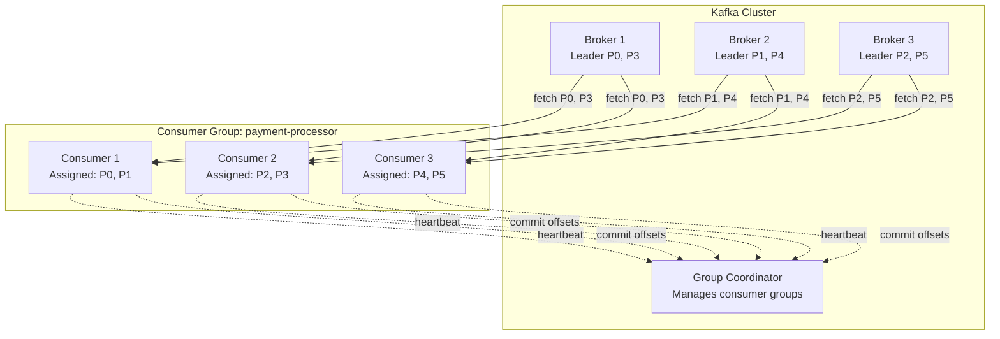
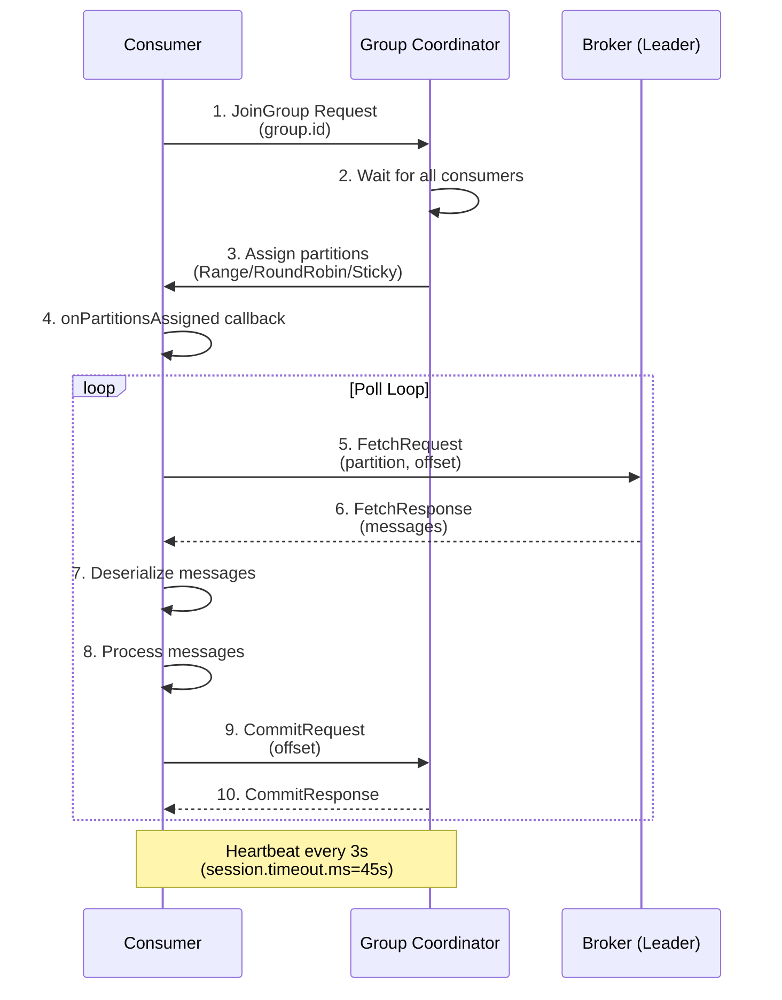
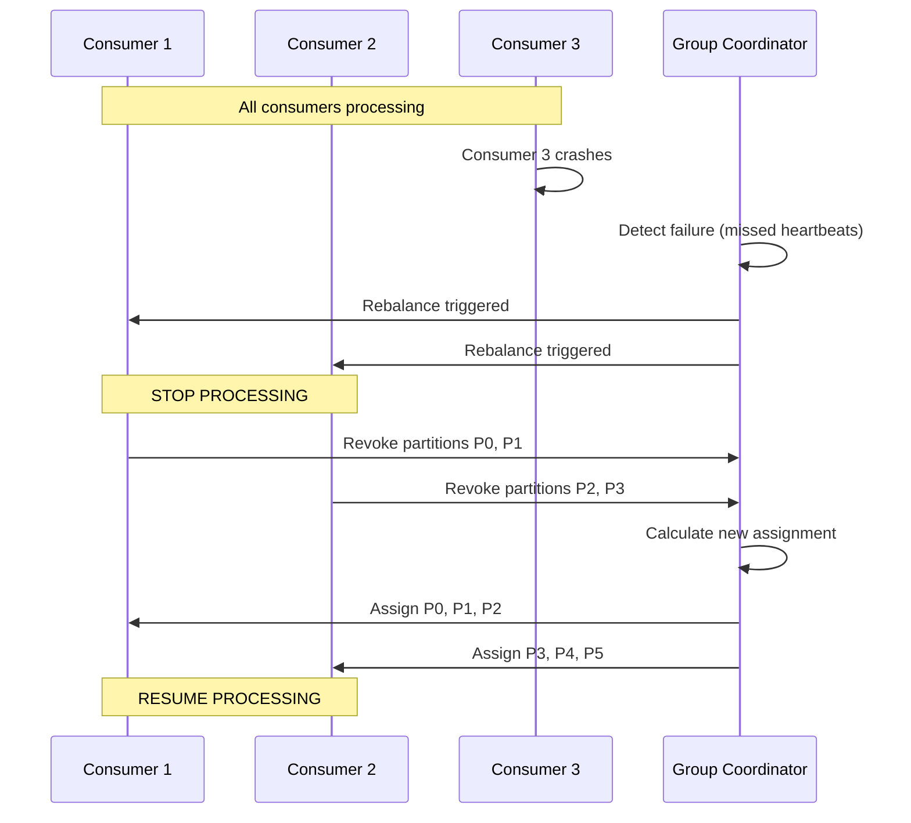

# Kafka Consumer Internals - Interview Preparation Guide

## Table of Contents
- [Overview](#overview)
- [Consumer Architecture](#consumer-architecture)
- [Consumer Groups](#consumer-groups)
- [Partition Assignment](#partition-assignment)
- [Offset Management](#offset-management)
- [Rebalancing](#rebalancing)
- [Consumer Guarantees](#consumer-guarantees)
- [Consumer Lag](#consumer-lag)
- [Consumer Configuration](#consumer-configuration)
- [Performance Tuning](#performance-tuning)
- [Interview Questions & Answers](#interview-questions--answers)
- [Real-World Enterprise Scenarios](#real-world-enterprise-scenarios)
- [Common Pitfalls](#common-pitfalls)
- [Key Takeaways](#key-takeaways)

---

## Overview

Kafka consumers read messages from topics and process them. Understanding consumer internals is essential for senior-level interviews because consumer design directly impacts throughput, latency, exactly-once processing, and system scalability in enterprise banking applications.

**Why Interviewers Focus on Consumers**: Consumer configuration affects processing guarantees (at-most-once, at-least-once, exactly-once), lag management, and failure recovery. In payment processing, incorrect consumer settings can cause duplicate processing (financial loss) or message skipping (compliance violations).

**Real-World Relevance**: Banking systems use consumers to process payment events, aggregate transactions for fraud detection, update analytics dashboards, and sync data across microservices. A payment processor consuming 100K events/day needs exactly-once semantics and automatic failure recovery.

---

## Consumer Architecture

### High-Level Components



### Consumer vs Consumer Group

**Consumer**: Single instance reading from Kafka.

**Consumer Group**: Set of consumers working together to consume a topic (load balancing).

**Key Concept**: Each partition is consumed by **exactly one consumer** within a group (no two consumers in same group read same partition).

**Example**:
```
Topic: payments.initiated (6 partitions)

Consumer Group: payment-processor (3 consumers)
→ Consumer 1: Partition 0, 1
→ Consumer 2: Partition 2, 3
→ Consumer 3: Partition 4, 5

Consumer Group: analytics-processor (2 consumers)
→ Consumer 1: Partition 0, 1, 2
→ Consumer 2: Partition 3, 4, 5

Both groups consume ALL partitions independently
```

### Consumer Workflow



---

## Consumer Groups

### Purpose of Consumer Groups

**Load Balancing**: Distribute partitions across consumers (parallelism).

**Fault Tolerance**: If consumer fails, partitions reassigned to remaining consumers.

**Scalability**: Add consumers to process more data (up to partition count).

### Group Coordinator

**What**: Broker responsible for managing a consumer group.

**Selection**: Group coordinator = broker owning `__consumer_offsets` partition for group ID.
```
partition = hash(group.id) % 50  # __consumer_offsets has 50 partitions
```

**Responsibilities**:
1. **Group Membership**: Track which consumers are in group
2. **Partition Assignment**: Assign partitions to consumers
3. **Offset Management**: Store committed offsets
4. **Rebalancing**: Coordinate partition reassignment on consumer join/leave
5. **Heartbeat Monitoring**: Detect consumer failures

### Consumer Group States

```
Empty → PreparingRebalance → CompletingRebalance → Stable → PreparingRebalance (on change)
```

**Empty**: No consumers in group.

**PreparingRebalance**: Rebalance triggered (consumer joined/left), waiting for all consumers.

**CompletingRebalance**: All consumers joined, coordinator assigning partitions.

**Stable**: All consumers processing, no rebalance.

### Multiple Consumer Groups

**Key Concept**: Different consumer groups consume same topic **independently**.

**Example**: Payment processing
```
Topic: payments.initiated

Consumer Group 1: payment-processor
→ Processes payments (debits accounts)

Consumer Group 2: fraud-detector
→ Analyzes transactions for fraud

Consumer Group 3: analytics-aggregator
→ Updates dashboards

All three groups consume same messages independently
```

---

## Partition Assignment

### Assignment Strategies

**1. Range Assignor** (Default)
- Assigns contiguous partitions to consumers
- Per-topic assignment (not global)

**Algorithm**:
```
Partitions: [P0, P1, P2, P3, P4, P5]
Consumers: [C1, C2, C3]

Partitions per consumer = 6 / 3 = 2
Extra partitions = 6 % 3 = 0

Assignment:
C1: P0, P1
C2: P2, P3
C3: P4, P5
```

**Problem with Multiple Topics**:
```
Topic A (6 partitions), Topic B (6 partitions)
Consumers: [C1, C2, C3]

Topic A:
C1: P0, P1
C2: P2, P3
C3: P4, P5

Topic B:
C1: P0, P1  ← C1 gets 4 total partitions
C2: P2, P3  ← C2 gets 4 total partitions
C3: P4, P5  ← C3 gets 4 total partitions

(Balanced by chance, but can be uneven with different partition counts)
```

**2. Round-Robin Assignor**
- Distributes partitions evenly across consumers
- Global assignment (considers all topics)

**Algorithm**:
```
Topic A: [P0, P1, P2, P3]
Topic B: [P0, P1, P2, P3]
Consumers: [C1, C2, C3]

All partitions: [A-P0, A-P1, A-P2, A-P3, B-P0, B-P1, B-P2, B-P3]

Round-robin:
C1: A-P0, A-P3, B-P2
C2: A-P1, B-P0, B-P3
C3: A-P2, B-P1

(More balanced globally)
```

**3. Sticky Assignor** (Recommended)
- Minimizes partition movement during rebalance
- Maintains assignment from previous rebalance if possible

**Example**:
```
Initial assignment (3 consumers):
C1: P0, P1
C2: P2, P3
C3: P4, P5

Consumer C3 leaves:
Range assignor (recalculates from scratch):
C1: P0, P1, P2  ← P2 moved from C2 to C1 (unnecessary)
C2: P3, P4, P5

Sticky assignor (minimize movement):
C1: P0, P1, P4  ← Only P4, P5 moved (minimal change)
C2: P2, P3, P5
```

**4. Cooperative Sticky Assignor** (Kafka 2.4+, Best)
- Incremental rebalancing (no stop-the-world)
- Only revokes partitions that need reassignment
- Consumers keep processing during rebalance

**Configuration**:
```properties
# Recommended for production
partition.assignment.strategy=org.apache.kafka.clients.consumer.CooperativeStickyAssignor
```

### Static Group Membership

**Problem**: Consumer restarts trigger rebalance (partitions reassigned).

**Solution**: Static group membership (Kafka 2.3+)
```properties
group.instance.id=payment-processor-1  # Static ID per consumer instance
```

**Benefit**: Consumer can restart within `session.timeout.ms` without triggering rebalance.

**Use Case**: Stateful processing (Kafka Streams) - avoids rebuilding state on restart.

---

## Offset Management

### Offsets Explained

**Current Offset**: Last offset **committed** by consumer (stored in Kafka).

**Position**: Next offset consumer will **fetch** (in memory, not committed).

**Example**:
```
Partition 0 messages:
Offset: 0    1    2    3    4    5    6

Consumer reads 0-3:
Position = 4 (next to fetch)
Current Offset = 3 (last committed)

If consumer crashes and restarts:
Resumes from Current Offset 3 → fetches from offset 4
(Messages 0-3 already processed, won't be re-read)
```

### Offset Storage

**Internal Topic**: `__consumer_offsets` (50 partitions, replication factor 3)

**Format**:
```
Key: (group.id, topic, partition)
Value: offset, metadata, timestamp
```

**Example**:
```
Key: (payment-processor, payments.initiated, 0)
Value: {offset: 12345, timestamp: 1699564800000}
```

### Auto-Commit vs Manual Commit

**Auto-Commit** (Default):
```properties
enable.auto.commit=true
auto.commit.interval.ms=5000  # Commit every 5 seconds
```

**How It Works**:
- Background thread commits offsets every 5 seconds
- Commits offset **at time of poll()** (not after processing)

**Problem**: At-most-once semantics
```
1. Consumer polls messages 0-99 (position = 100)
2. Auto-commit commits offset 100 (background)
3. Consumer crashes while processing message 50
4. Consumer restarts, fetches from offset 100
→ Messages 50-99 lost (not processed)
```

**Manual Commit** (Recommended for Banking):
```properties
enable.auto.commit=false
```

**Synchronous Commit** (blocks until committed):
```java
while (true) {
    ConsumerRecords<String, Payment> records = consumer.poll(Duration.ofMillis(100));

    for (ConsumerRecord<String, Payment> record : records) {
        processPayment(record.value());  // Process message
    }

    consumer.commitSync();  // Commit after processing (at-least-once)
}
```

**Asynchronous Commit** (non-blocking, better throughput):
```java
consumer.commitAsync((offsets, exception) -> {
    if (exception != null) {
        log.error("Commit failed: {}", exception.getMessage());
    }
});
```

**Hybrid Approach** (best practice):
```java
try {
    while (true) {
        ConsumerRecords<String, Payment> records = consumer.poll(100);

        for (ConsumerRecord<String, Payment> record : records) {
            processPayment(record.value());
        }

        consumer.commitAsync();  // Async commit (fast)
    }
} finally {
    consumer.commitSync();  // Sync commit on shutdown (ensure last batch committed)
}
```

### Commit Strategies

**Strategy 1: Commit After Each Batch** (at-least-once):
```java
while (true) {
    ConsumerRecords<String, Payment> records = consumer.poll(100);
    processRecords(records);
    consumer.commitSync();  // Commit after processing batch
}

// Duplicate risk: Crash after processing but before commit
```

**Strategy 2: Commit Per Message** (lower duplicate risk, slow):
```java
while (true) {
    ConsumerRecords<String, Payment> records = consumer.poll(100);

    for (ConsumerRecord<String, Payment> record : records) {
        processPayment(record.value());
        consumer.commitSync(Collections.singletonMap(
            new TopicPartition(record.topic(), record.partition()),
            new OffsetAndMetadata(record.offset() + 1)
        ));  // Commit after each message
    }
}

// Problem: Very slow (network call per message)
```

**Strategy 3: Idempotent Processing** (exactly-once):
```java
while (true) {
    ConsumerRecords<String, Payment> records = consumer.poll(100);

    for (ConsumerRecord<String, Payment> record : records) {
        // Check if already processed (database lookup)
        if (!isProcessed(record.offset())) {
            processPayment(record.value());
            markProcessed(record.offset());  // Store offset in database
        }
    }

    consumer.commitAsync();
}

// Exactly-once: Duplicate messages skipped via database check
```

### Seeking to Specific Offset

**Use Cases**: Replay messages, skip corrupted messages, time-based processing.

**Seek to Beginning**:
```java
consumer.seekToBeginning(consumer.assignment());  // Replay all messages
```

**Seek to End**:
```java
consumer.seekToEnd(consumer.assignment());  // Skip to latest
```

**Seek to Specific Offset**:
```java
TopicPartition partition = new TopicPartition("payments", 0);
consumer.seek(partition, 12345);  // Start from offset 12345
```

**Seek by Timestamp**:
```java
Map<TopicPartition, Long> timestampsToSearch = new HashMap<>();
timestampsToSearch.put(partition, 1699564800000L);  // Nov 9, 2024

Map<TopicPartition, OffsetAndTimestamp> offsets =
    consumer.offsetsForTimes(timestampsToSearch);

consumer.seek(partition, offsets.get(partition).offset());
```

---

## Rebalancing

### What is Rebalancing?

**Definition**: Process of reassigning partitions when consumer group membership changes.

**Triggers**:
1. New consumer joins group
2. Consumer leaves group (graceful shutdown)
3. Consumer crashes (missed heartbeats)
4. Partition count changes (topic modified)

### Stop-the-World Rebalancing (Legacy)

**Problem**: All consumers stop processing during rebalance.

**Flow**:


**Impact**:
- **Processing Pause**: All consumers stop for 5-30 seconds
- **Consumer Lag Spike**: Messages accumulate during rebalance
- **Duplicate Processing**: Messages fetched but not committed are re-processed

### Incremental Cooperative Rebalancing (Kafka 2.4+)

**Improvement**: Only affected partitions revoked (others keep processing).

**Configuration**:
```properties
partition.assignment.strategy=org.apache.kafka.clients.consumer.CooperativeStickyAssignor
```

**Flow**:
```
Initial assignment (3 consumers, 6 partitions):
C1: P0, P1
C2: P2, P3
C3: P4, P5

Consumer C3 crashes:

Stop-the-world rebalance:
→ All consumers stop
→ C1, C2 revoke all partitions
→ Reassign: C1: P0, P1, P2 | C2: P3, P4, P5
→ All consumers resume

Cooperative rebalance:
→ C1 keeps P0, P1 (still processing)
→ C2 keeps P2, P3 (still processing)
→ Only P4, P5 revoked (not assigned yet)
→ Reassign: C1: P0, P1, P4 | C2: P2, P3, P5
→ Minimal disruption
```

**Benefits**:
- **Minimal Pause**: Only affected consumers stop briefly
- **Lower Lag Spike**: Most consumers keep processing
- **Faster Recovery**: Smaller partition movement

### Rebalance Listeners

**Use Cases**: Cleanup before partition revocation, initialize state on assignment.

**Example**:
```java
consumer.subscribe(Arrays.asList("payments"), new ConsumerRebalanceListener() {
    @Override
    public void onPartitionsRevoked(Collection<TopicPartition> partitions) {
        // Called before partitions removed
        log.info("Partitions revoked: {}", partitions);

        // Commit offsets before losing partitions
        consumer.commitSync();

        // Cleanup resources (close database connections, flush caches)
        cleanup(partitions);
    }

    @Override
    public void onPartitionsAssigned(Collection<TopicPartition> partitions) {
        // Called after partitions assigned
        log.info("Partitions assigned: {}", partitions);

        // Initialize state (load from database, rebuild cache)
        initialize(partitions);
    }

    @Override
    public void onPartitionsLost(Collection<TopicPartition> partitions) {
        // Called when partitions lost unexpectedly (no chance to commit)
        log.warn("Partitions lost: {}", partitions);
    }
});
```

### Minimizing Rebalance Frequency

**Problem**: Frequent rebalances cause processing pauses and lag spikes.

**Solutions**:

**1. Increase Session Timeout**:
```properties
# Allow consumer to be silent longer before considered dead
session.timeout.ms=45000  # 45 seconds (default: 10s)
heartbeat.interval.ms=3000  # Send heartbeat every 3s
```

**2. Increase Max Poll Interval**:
```properties
# Allow longer processing time between polls
max.poll.interval.ms=300000  # 5 minutes (default: 5 minutes)
```

**3. Use Static Group Membership**:
```properties
# Consumer can restart without triggering rebalance
group.instance.id=payment-processor-1
```

**4. Process Messages Faster**:
- Reduce processing time per message
- Use async processing (threads/executors)
- Batch database writes

**5. Use Cooperative Rebalancing**:
```properties
partition.assignment.strategy=org.apache.kafka.clients.consumer.CooperativeStickyAssignor
```

---

## Consumer Guarantees

### At-Most-Once Delivery

**Configuration**: Auto-commit enabled, commit before processing.

**Behavior**:
```
1. Consumer polls messages 0-99
2. Auto-commit commits offset 100 (immediately)
3. Consumer processes messages
4. Consumer crashes at message 50
5. Consumer restarts, fetches from offset 100
→ Messages 50-99 lost (not processed)
```

**Guarantee**: Message processed **0 or 1 times** (never duplicated, may be lost).

**Use Case**: Metrics, logs (acceptable loss).

### At-Least-Once Delivery

**Configuration**: Manual commit, commit **after** processing.

**Behavior**:
```
1. Consumer polls messages 0-99
2. Consumer processes messages 0-49
3. Consumer crashes (offset 99 not yet committed)
4. Consumer restarts, fetches from last committed offset (0)
→ Messages 0-49 re-processed (duplicates)
```

**Guarantee**: Message processed **1 or more times** (never lost, may be duplicated).

**Use Case**: Payments (better duplicate than lose), audit trails.

**Handling Duplicates**: Idempotent processing (database unique constraints, deduplication keys).

### Exactly-Once Delivery

**Configuration**: Transactional producer + consumer with isolation level.

**Producer**:
```properties
enable.idempotence=true
transactional.id=payment-processor-1
```

**Consumer**:
```properties
isolation.level=read_committed  # Skip uncommitted/aborted messages
```

**Pattern**: Read-process-write within transaction.
```java
while (true) {
    ConsumerRecords<String, Order> orders = consumer.poll(100);

    producer.beginTransaction();
    try {
        for (ConsumerRecord<String, Order> order : orders) {
            Payment payment = processOrder(order.value());
            producer.send(new ProducerRecord<>("payments", payment));
        }

        // Commit consumer offsets within transaction
        producer.sendOffsetsToTransaction(
            getOffsets(orders),
            consumer.groupMetadata()
        );

        producer.commitTransaction();  // Atomic: offsets + produced messages
    } catch (Exception e) {
        producer.abortTransaction();  // Rollback everything
    }
}
```

**Guarantee**: Message processed **exactly once** (never lost, never duplicated).

**Use Case**: Financial transactions (critical, no tolerance for loss or duplication).

---

## Consumer Lag

### Definition

**Consumer Lag**: Difference between latest message in partition and consumer's committed offset.

```
Log End Offset (LEO): 10000  ← Latest message
Current Offset: 9500         ← Last committed by consumer
Consumer Lag: 500 messages   ← Consumer is 500 messages behind
```

### Causes of High Lag

1. **Slow Processing**: Consumer logic takes too long per message
2. **Under-Provisioned**: Not enough consumers (max consumers = partition count)
3. **GC Pauses**: Long garbage collection pauses in consumer JVM
4. **Network Issues**: Slow fetch from brokers
5. **Rebalancing**: Consumers pause during rebalance
6. **Producer Spike**: Sudden burst of messages

### Monitoring Consumer Lag

**CLI**:
```bash
kafka-consumer-groups --bootstrap-server localhost:9092 \
  --describe --group payment-processor

GROUP              TOPIC              PARTITION  CURRENT-OFFSET  LOG-END-OFFSET  LAG
payment-processor  payments.initiated 0          9500            10000           500
payment-processor  payments.initiated 1          8200            8200            0
```

**JMX Metrics**:
```
kafka.consumer:type=consumer-fetch-manager-metrics,client-id=*:records-lag-max
→ Maximum lag across all partitions (alert if > threshold)

kafka.consumer:type=consumer-fetch-manager-metrics,client-id=*:records-lag-avg
→ Average lag
```

**Monitoring Tools**:
- **Burrow** (LinkedIn): Consumer lag monitoring service
- **Confluent Control Center**: Visual lag monitoring
- **Prometheus + Grafana**: JMX exporter + dashboards

### Remediation Strategies

**1. Scale Consumers** (up to partition count):
```
Topic: 10 partitions
Current: 3 consumers
Lag: 5000 messages

Add consumers:
3 consumers → 10 consumers (1 per partition)
Result: 3× faster processing, lag drops to near-zero
```

**2. Optimize Processing**:
```java
// ❌ SLOW: Database write per message
for (ConsumerRecord<String, Payment> record : records) {
    database.insert(record.value());  // Network call
}

// ✅ FAST: Batch database writes
List<Payment> batch = new ArrayList<>();
for (ConsumerRecord<String, Payment> record : records) {
    batch.add(record.value());
}
database.batchInsert(batch);  // Single network call
```

**3. Increase Fetch Size**:
```properties
# Fetch more messages per request
max.poll.records=500      # 500 messages per poll (default)
fetch.min.bytes=1024      # Wait for 1KB before returning
max.partition.fetch.bytes=1048576  # 1MB max per partition
```

**4. Parallel Processing** (within consumer):
```java
ExecutorService executor = Executors.newFixedThreadPool(10);

while (true) {
    ConsumerRecords<String, Payment> records = consumer.poll(100);

    // Process messages in parallel
    List<Future<?>> futures = new ArrayList<>();
    for (ConsumerRecord<String, Payment> record : records) {
        futures.add(executor.submit(() -> processPayment(record.value())));
    }

    // Wait for all to complete
    for (Future<?> future : futures) {
        future.get();
    }

    consumer.commitSync();
}
```

**5. Increase Partitions** (requires topic recreation):
```bash
# Increase from 10 to 20 partitions (allows 20 consumers)
kafka-topics --bootstrap-server localhost:9092 \
  --alter --topic payments.initiated --partitions 20

# Note: Breaks key-based ordering (keys rehashed to new partition count)
```

---

## Consumer Configuration

### Critical Configurations

```properties
# === Consumer Group ===
group.id=payment-processor            # Consumer group ID

# === Assignment ===
partition.assignment.strategy=org.apache.kafka.clients.consumer.CooperativeStickyAssignor

# === Offset Management ===
enable.auto.commit=false              # Manual commit (recommended)
auto.offset.reset=earliest            # Start from beginning if no offset

# === Fetch Behavior ===
max.poll.records=500                  # Max messages per poll
fetch.min.bytes=1024                  # Min bytes to fetch (batching)
fetch.max.wait.ms=500                 # Max wait for fetch.min.bytes
max.partition.fetch.bytes=1048576     # 1MB max per partition

# === Session Management ===
session.timeout.ms=45000              # 45s max silence before considered dead
heartbeat.interval.ms=3000            # Send heartbeat every 3s
max.poll.interval.ms=300000           # 5min max between polls

# === Deserialization ===
key.deserializer=org.apache.kafka.common.serialization.StringDeserializer
value.deserializer=io.confluent.kafka.serializers.KafkaAvroDeserializer

# === Transactions (if needed) ===
isolation.level=read_committed        # Skip uncommitted messages
```

### Configuration Profiles

**Profile 1: High Throughput**:
```properties
max.poll.records=1000       # More messages per poll
fetch.min.bytes=10240       # Wait for 10KB (better batching)
fetch.max.wait.ms=500       # Max 500ms wait
max.partition.fetch.bytes=2097152  # 2MB per partition

# Use case: Batch analytics, data pipelines
# Throughput: ~100K messages/sec
# Latency: ~500ms
```

**Profile 2: Low Latency**:
```properties
max.poll.records=100        # Small batches
fetch.min.bytes=1           # Return immediately
fetch.max.wait.ms=0         # No wait
max.partition.fetch.bytes=524288  # 512KB per partition

# Use case: Real-time fraud detection
# Throughput: ~10K messages/sec
# Latency: <50ms
```

**Profile 3: Reliable Processing**:
```properties
enable.auto.commit=false    # Manual commit
isolation.level=read_committed  # Exactly-once
max.poll.records=100        # Small batches (easier to reprocess)
session.timeout.ms=60000    # Longer timeout (avoid false failures)

# Use case: Payment processing
# Throughput: ~50K messages/sec
# Latency: ~100ms
```

---

## Performance Tuning

### Throughput Optimization

**1. Increase Parallelism** (scale consumers):
```
Partitions: 10
Consumers: 3 → 10 (one per partition)
Result: 3× faster processing
```

**2. Fetch More Messages**:
```properties
max.poll.records=1000       # More messages per poll
fetch.min.bytes=10240       # Larger fetch size
```

**3. Batch Processing**:
```java
// Process messages in batches (reduce per-message overhead)
while (true) {
    ConsumerRecords<String, Payment> records = consumer.poll(100);

    List<Payment> payments = new ArrayList<>();
    for (ConsumerRecord<String, Payment> record : records) {
        payments.add(record.value());
    }

    // Batch database insert (1 network call vs 1000)
    database.batchInsert(payments);

    consumer.commitSync();
}
```

### Latency Optimization

**1. Reduce Fetch Wait**:
```properties
fetch.min.bytes=1           # Don't wait for min bytes
fetch.max.wait.ms=0         # Return immediately
```

**2. Smaller Poll Batches**:
```properties
max.poll.records=50         # Process quickly, poll frequently
```

### Monitoring Metrics

| Metric | Meaning | Alert Threshold |
|--------|---------|-----------------|
| `records-lag-max` | Max lag across partitions | > 10000 messages |
| `records-consumed-rate` | Messages/sec | < expected rate |
| `fetch-latency-avg` | Avg fetch time | > 100ms |
| `commit-latency-avg` | Avg commit time | > 50ms |
| `assigned-partitions` | Partitions assigned | 0 (no assignment) |

---

## Interview Questions & Answers

### Q1: What is a consumer group and why is it important?

**Answer**: A consumer group is a set of consumers that work together to consume a topic, with each partition consumed by exactly one consumer in the group.

**Why Important**:
1. **Load Balancing**: Partitions distributed across consumers (parallelism)
2. **Fault Tolerance**: If consumer fails, partitions reassigned to remaining consumers
3. **Scalability**: Add consumers to process more data (up to partition count)
4. **Independent Consumption**: Different groups consume same data independently

**Example**: Payment processing
```
Topic: payments.initiated (10 partitions)

Consumer Group: payment-processor (5 consumers)
→ Each consumer processes 2 partitions
→ 100K payments/day ÷ 5 consumers = 20K per consumer

Consumer Group: fraud-detector (10 consumers)
→ Each consumer processes 1 partition
→ Same 100K payments analyzed for fraud (independently)
```

**Follow-up**: "What if you have more consumers than partitions?"
**Answer**: Extra consumers remain idle. Maximum parallelism = partition count. If topic has 10 partitions, 11th consumer does nothing.

---

### Q2: Explain offset management. What's the difference between auto-commit and manual commit?

**Answer**:

**Auto-Commit** (`enable.auto.commit=true`):
- Background thread commits offsets every 5 seconds (configurable)
- Commits offset **at time of poll()** (before processing)
- **Risk**: If consumer crashes mid-processing, messages may be lost (at-most-once)

**Manual Commit** (`enable.auto.commit=false`):
- Application explicitly commits offsets after processing
- **commitSync()**: Blocks until committed (slower, guaranteed)
- **commitAsync()**: Non-blocking (faster, no guarantee)
- **Guarantee**: At-least-once (messages may be duplicated on failure, but never lost)

**Banking Recommendation**: Manual commit
```java
while (true) {
    ConsumerRecords<String, Payment> records = consumer.poll(100);

    for (ConsumerRecord<String, Payment> record : records) {
        processPayment(record.value());  // Debit account
    }

    consumer.commitSync();  // Commit AFTER processing
}

// If crash before commit:
// → Messages reprocessed (duplicate payment risk)
// → Use idempotent processing (database unique constraint)
```

**Follow-up**: "How do you achieve exactly-once?"
**Answer**: Use transactional producer + consumer with `isolation.level=read_committed` + commit offsets within transaction.

---

### Q3: What is rebalancing and how does it impact consumers?

**Answer**: Rebalancing is the process of reassigning partitions when consumer group membership changes (consumer joins/leaves/crashes or partition count changes).

**Triggers**:
1. New consumer joins
2. Consumer gracefully shuts down
3. Consumer crashes (missed heartbeats)
4. Partition count increases

**Impact**:
- **Processing Pause**: Consumers stop processing during rebalance (5-30 seconds)
- **Consumer Lag Spike**: Messages accumulate while paused
- **Duplicate Processing**: Messages fetched but not committed are re-processed

**Example**:
```
Initial: 3 consumers, 6 partitions
C1: P0, P1
C2: P2, P3
C3: P4, P5

Consumer C3 crashes:
→ Rebalance triggered
→ All consumers stop processing
→ Partitions reassigned:
   C1: P0, P1, P2
   C2: P3, P4, P5
→ Consumers resume

Lag spike:
- Before rebalance: 0 lag
- During rebalance (30s): 3000 messages produced (100 msg/sec)
- After rebalance: 3000 lag (consumers catch up)
```

**Minimizing Rebalance Impact**:
1. **Cooperative Rebalancing**: Only revoke affected partitions (Kafka 2.4+)
2. **Static Group Membership**: Consumer can restart without rebalance
3. **Longer Session Timeout**: Tolerate temporary slowness

---

### Q4: What is consumer lag and how do you monitor it?

**Answer**: Consumer lag is the difference between the latest message in a partition (Log End Offset) and the consumer's committed offset.

**Formula**: `Lag = Log End Offset - Current Offset`

**Example**:
```
Partition 0:
Latest message (LEO): 10,000
Consumer committed: 9,500
Lag: 500 messages (consumer is 500 messages behind)
```

**Monitoring**:

**CLI**:
```bash
kafka-consumer-groups --bootstrap-server localhost:9092 \
  --describe --group payment-processor

LAG column shows lag per partition
```

**JMX Metrics**:
```
records-lag-max: Maximum lag across all partitions
records-lag-avg: Average lag
```

**Tools**: Burrow, Confluent Control Center, Prometheus

**Alerting**:
```
Alert if lag > 10,000 messages
Alert if lag growing over time (consumer can't keep up)
```

**Remediation**:
1. Scale consumers (up to partition count)
2. Optimize processing (batch DB writes, parallel processing)
3. Increase fetch size (process more messages per poll)
4. Increase partition count (allows more consumers)

**Banking SLA**: Payment processing within 5 minutes
```
Producer rate: 100 messages/sec
Max acceptable lag: 100 msg/sec × 300 sec = 30,000 messages
Alert threshold: lag > 30,000
```

---

### Q5: Explain the difference between at-most-once, at-least-once, and exactly-once delivery.

**Answer**:

**At-Most-Once** (auto-commit before processing):
- **Guarantee**: Message processed 0 or 1 times (may be lost, never duplicated)
- **Configuration**: `enable.auto.commit=true`
- **Use Case**: Metrics, logs (acceptable loss)

**At-Least-Once** (manual commit after processing):
- **Guarantee**: Message processed 1 or more times (never lost, may be duplicated)
- **Configuration**: `enable.auto.commit=false`, commit after processing
- **Use Case**: Payments (better duplicate than lose, use idempotent processing)

**Exactly-Once** (transactional consumer + producer):
- **Guarantee**: Message processed exactly 1 time (never lost, never duplicated)
- **Configuration**: Transactional producer + `isolation.level=read_committed`
- **Use Case**: Financial transactions (critical, no tolerance for loss or duplication)

**Code Examples**:

**At-Least-Once**:
```java
while (true) {
    ConsumerRecords<String, Payment> records = consumer.poll(100);
    processRecords(records);
    consumer.commitSync();  // Commit AFTER processing
}
// Crash before commit → messages reprocessed (duplicate)
```

**Exactly-Once**:
```java
while (true) {
    ConsumerRecords<String, Order> orders = consumer.poll(100);

    producer.beginTransaction();
    try {
        processOrders(orders);
        producer.sendOffsetsToTransaction(offsets, groupMetadata);
        producer.commitTransaction();  // Atomic: offsets + output
    } catch (Exception e) {
        producer.abortTransaction();  // Rollback
    }
}
// Crash before commit → transaction aborted, nothing committed
```

---

### Q6: How do you handle slow consumers causing lag?

**Answer**: Multi-pronged approach:

**1. Scale Consumers** (most effective):
```
Current: 5 consumers, 10 partitions, lag 10,000
Add consumers: 5 → 10 (one per partition)
Result: 2× faster processing, lag drops
```

**2. Optimize Processing**:
```java
// ❌ SLOW: Individual DB writes
for (Payment p : payments) {
    db.insert(p);  // 1000 network calls
}

// ✅ FAST: Batch DB writes
db.batchInsert(payments);  // 1 network call
```

**3. Parallel Processing**:
```java
ExecutorService executor = Executors.newFixedThreadPool(10);

while (true) {
    ConsumerRecords<String, Payment> records = consumer.poll(100);

    // Process in parallel threads
    List<Future<?>> futures = records.stream()
        .map(record -> executor.submit(() -> process(record)))
        .collect(Collectors.toList());

    // Wait for all
    futures.forEach(f -> f.get());

    consumer.commitSync();
}
```

**4. Increase Fetch Size**:
```properties
max.poll.records=1000      # More messages per poll
fetch.min.bytes=10240      # Larger batches
```

**5. Increase Partitions** (last resort, breaks key ordering):
```bash
# Allows more consumers
kafka-topics --alter --topic payments --partitions 20
```

**6. Monitor and Alert**:
```
Alert: lag > 10,000 messages
Alert: lag growth rate > 100 msg/sec
Runbook: Scale consumers, check processing time, review logs
```

---

### Q7: What happens when a consumer crashes?

**Answer**: The consumer's partitions are reassigned to remaining consumers via rebalancing.

**Step-by-Step**:
```
Initial: 3 consumers, 6 partitions
C1: P0, P1 (healthy)
C2: P2, P3 (healthy)
C3: P4, P5 (crashes)

1. Consumer C3 stops sending heartbeats
2. After session.timeout.ms (45s), coordinator detects failure
3. Coordinator triggers rebalance
4. C1 and C2 stop processing
5. Coordinator reassigns partitions:
   C1: P0, P1, P4
   C2: P2, P3, P5
6. C1 and C2 resume processing
7. Messages in P4, P5 reprocessed from last committed offset
```

**Impact**:
- **Rebalance Time**: 5-30 seconds (consumers paused)
- **Duplicate Processing**: Messages fetched by C3 but not committed are reprocessed
- **Lag Spike**: Messages accumulate during rebalance

**Mitigation**:
1. **Cooperative Rebalancing**: Minimize pause
2. **Idempotent Processing**: Handle duplicate messages
3. **Static Group Membership**: C3 can restart within `session.timeout.ms` without rebalance

---

## Real-World Enterprise Scenarios

### Scenario 1: Payment Processing (Exactly-Once)

**Requirements**:
- 100K payments/day
- Exactly-once processing (no duplicate charges)
- Sub-second latency (p99 < 500ms)

**Consumer Configuration**:
```properties
group.id=payment-processor
enable.auto.commit=false
isolation.level=read_committed
max.poll.records=100
```

**Implementation**:
```java
while (true) {
    ConsumerRecords<String, PaymentEvent> events = consumer.poll(100);

    for (ConsumerRecord<String, PaymentEvent> event : events) {
        // Idempotent processing (database unique constraint on payment_id)
        if (!database.paymentExists(event.value().getId())) {
            processPayment(event.value());
        }
    }

    consumer.commitSync();  // At-least-once + idempotence = exactly-once
}
```

---

### Scenario 2: High-Throughput Analytics (At-Least-Once)

**Requirements**:
- 1M events/day
- Aggregate for dashboards
- Tolerate duplicates (counters approximate)

**Consumer Configuration**:
```properties
group.id=analytics-aggregator
enable.auto.commit=true
max.poll.records=1000
fetch.min.bytes=10240
```

**Implementation**:
```java
while (true) {
    ConsumerRecords<String, ClickEvent> events = consumer.poll(100);

    // Batch aggregate
    Map<String, Long> counts = events.stream()
        .collect(Collectors.groupingBy(
            r -> r.value().getUserId(),
            Collectors.counting()
        ));

    // Batch update database
    database.batchUpdateCounts(counts);
}
```

---

## Common Pitfalls

### Pitfall 1: Auto-Commit for Financial Data

**Problem**: Messages may be lost on crash.

**Solution**: Always use manual commit for payments.

---

### Pitfall 2: Not Handling Rebalancing

**Problem**: Consumer doesn't commit before partitions revoked → large duplicate processing.

**Solution**: Use rebalance listener:
```java
consumer.subscribe(topics, new ConsumerRebalanceListener() {
    public void onPartitionsRevoked(Collection<TopicPartition> partitions) {
        consumer.commitSync();  // Commit before losing partitions
    }
});
```

---

### Pitfall 3: Ignoring Consumer Lag

**Problem**: Lag grows unchecked → SLA violations.

**Solution**: Monitor lag, alert, scale consumers.

---

## Key Takeaways

1. **Consumer Group**: Set of consumers sharing partition load (max consumers = partition count)

2. **Offset Management**: Manual commit after processing = at-least-once (recommended for banking)

3. **Rebalancing**: Partitions reassigned on membership change (causes processing pause)

4. **Consumer Lag**: LEO - Current Offset (monitor with Burrow, alert on threshold)

5. **Cooperative Rebalancing**: Minimize pause by only revoking affected partitions (Kafka 2.4+)

6. **Exactly-Once**: Transactional consumer + idempotent processing (critical for payments)

7. **Scale Consumers**: Up to partition count for higher throughput (add partitions if needed)

8. **Batch Processing**: Process messages in batches (reduce per-message overhead)

---

## Further Reading

- [Kafka Consumer Documentation](https://kafka.apache.org/documentation/#consumerapi)
- [Consumer Group Protocol](https://kafka.apache.org/documentation/#consumerconfigs)
- [Burrow: Consumer Lag Monitoring](https://github.com/linkedin/Burrow)
