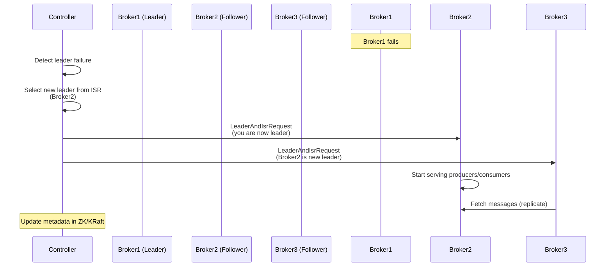

# Kafka Broker and Cluster Internals

## Overview

Kafka brokers are the heart of the Kafka cluster - they receive messages from producers, store them durably on disk, and serve them to consumers. Understanding broker internals is critical for designing highly available, fault-tolerant distributed systems. In enterprise banking environments, broker configuration and cluster management directly impact system reliability, data durability, and recovery time objectives (RTO).

**Why This Matters for Interviews**: Senior engineering roles require deep understanding of how Kafka achieves high availability, how partition leadership works, what happens during broker failures, and how to configure clusters for different availability/performance trade-offs. Expect questions about ISR management, replication lag, controller responsibilities, and failure scenarios.

**Real-World Banking Context**: Payment processing systems cannot afford data loss or extended downtime. Understanding broker internals helps you design systems that meet stringent SLAs (e.g., 99.99% availability, RPO < 1 minute).

---

## Broker Responsibilities

A Kafka broker is a JVM process that performs several critical functions:

### 1. Message Reception and Storage

**Receiving Messages from Producers**:
- Brokers listen on configured ports (default 9092) for producer connections
- When a producer sends a message to a partition, the request goes to the **partition leader broker**
- The broker validates the message (schema, size limits, authentication)
- Messages are appended to the partition's **active segment file** on disk

**Storage Architecture**:
- Each partition is stored as a directory containing multiple **segment files**
- Segment files are immutable once closed (append-only design)
- Current segment (active) receives new messages until it reaches size/time threshold
- Messages are written to **page cache** first (OS-level caching), then flushed to disk
- Kafka relies heavily on **OS page cache** for performance (zero-copy transfers)

```
Partition Directory Structure:
/var/kafka-logs/payments-0/
├── 00000000000000000000.log     # Segment file (messages)
├── 00000000000000000000.index   # Offset index (fast offset lookup)
├── 00000000000000000000.timeindex  # Timestamp index
├── 00000000000005000000.log     # Next segment
├── 00000000000005000000.index
└── leader-epoch-checkpoint      # Leader epoch tracking
```

**Banking Example**: A payment processing topic might configure 1 GB segment sizes to balance disk I/O with retention management. Smaller segments allow faster log compaction but increase file handle usage.

### 2. Serving Messages to Consumers

**Consumer Request Handling**:
- Consumers send fetch requests to partition leader brokers
- Brokers locate the requested offset using the **offset index**
- Messages are read from disk (or page cache) and sent to consumers
- Brokers enforce consumer group coordination via the **group coordinator**

**Zero-Copy Optimization**:
- Kafka uses `sendfile()` system call to transfer data from disk to network socket
- Data bypasses user-space, reducing CPU usage and memory copies
- Critical for high-throughput scenarios (e.g., real-time analytics consuming millions of messages/sec)

### 3. Partition Replication

**Replication Workflow**:
- Each partition has one **leader** and N-1 **followers** (replicas)
- Only the leader handles producer/consumer requests
- Followers continuously fetch messages from the leader to stay in sync
- Followers send fetch requests similar to consumers, but with replica-specific logic

**In-Sync Replicas (ISR)**:
- The leader maintains a list of **In-Sync Replicas** (ISR)
- A replica is in-sync if it has fetched messages up to the leader's high watermark within `replica.lag.time.max.ms` (default 30 seconds)
- Only ISR members are eligible for leader election (ensures no data loss)
- If a follower falls behind, it's removed from ISR; when it catches up, it's re-added

**Banking Example**: For a critical payments topic with `replication.factor=3` and `min.insync.replicas=2`, a broker failure still allows writes as long as 2 replicas remain in-sync. This configuration balances availability with durability.

### 4. Log Management and Cleanup

**Retention Policies**:
- **Time-based retention**: Delete segments older than `retention.ms` (e.g., 7 days)
- **Size-based retention**: Delete oldest segments when partition exceeds `retention.bytes`
- **Log compaction**: Keep only the latest value for each key (for changelog topics)

**Background Threads**:
- **Log Cleaner**: Runs compaction for topics with `cleanup.policy=compact`
- **Log Deletion**: Deletes segments violating retention policies
- **Checkpoint Manager**: Periodically writes recovery checkpoints

---

## Cluster Controller

The **controller** is a special broker role responsible for cluster-wide metadata management and coordination. Every Kafka cluster has exactly **one active controller** at any time.

### Controller Election

**Election Process**:
1. When the cluster starts, all brokers attempt to register as controller in ZooKeeper (or KRaft metadata log)
2. The first broker to successfully create the ephemeral node `/controller` becomes the controller
3. Other brokers watch this node; if the controller fails (ephemeral node deleted), a new election occurs
4. In KRaft mode, controllers use Raft consensus for leader election (no ZooKeeper dependency)

**Banking Example**: During a rolling broker upgrade, the controller might temporarily fail over to another broker. Understanding controller election helps predict brief metadata operation latencies during this transition.

### Controller Responsibilities

#### 1. Partition Leadership Management

**Leader Election**:
- When a partition leader fails, the controller selects a new leader from the ISR
- The controller updates partition metadata in ZooKeeper/KRaft metadata log
- The controller sends `LeaderAndIsrRequest` to all affected brokers
- Brokers update their local partition state and begin serving requests (new leader) or replicating (new followers)

**Preferred Leader Election**:
- Each partition has a **preferred leader** (first replica in replica list)
- By default, auto leader balancing runs every 5 minutes to restore preferred leaders
- Helps balance load after broker restarts (avoids all leadership concentrated on a few brokers)



#### 2. Replica Management

**ISR Shrink and Expand**:
- The controller monitors ISR changes based on broker heartbeats and replication lag
- When a replica falls behind (`replica.lag.time.max.ms`), controller removes it from ISR
- When a lagging replica catches up, controller adds it back to ISR
- ISR changes are propagated to all brokers via metadata updates

**Reassignment Coordination**:
- When adding brokers or rebalancing load, admins trigger partition reassignment
- The controller coordinates moving partition replicas to new brokers
- Process: create new replica on target broker → sync data → update ISR → remove old replica

**Banking Example**: During a datacenter migration (e.g., moving from on-premises to Azure), partition reassignment allows moving replicas to cloud brokers without downtime.

#### 3. Topic and Partition Creation

**Topic Creation Flow**:
1. Admin or application sends `CreateTopics` request to any broker
2. Request is forwarded to the controller
3. Controller allocates partitions across brokers (rack-aware if configured)
4. Controller writes topic metadata to ZooKeeper/KRaft
5. Controller sends `UpdateMetadata` request to all brokers
6. Brokers create local partition directories and begin replication

**Partition Allocation Algorithm**:
- Controller distributes partitions evenly across brokers
- Spreads replicas across different racks (if rack awareness is configured)
- Avoids co-locating leader and follower on the same broker

#### 4. Broker Registration and Failure Detection

**Broker Lifecycle**:
- When a broker starts, it registers in ZooKeeper (creates ephemeral node `/brokers/ids/{broker.id}`)
- The controller watches for broker registration/deregistration events
- On broker failure (ephemeral node deleted), controller triggers leader elections for affected partitions
- On broker startup, controller sends full metadata snapshot to the new broker

**Graceful Shutdown**:
- When a broker receives SIGTERM, it transfers partition leadership to other brokers
- This avoids brief unavailability during rolling restarts
- Controlled shutdown is enabled by default (`controlled.shutdown.enable=true`)

---

## Partition Leadership and Replication

### Leader and Follower Roles

**Leader Responsibilities**:
- Handle all read and write requests for the partition
- Maintain the **Log End Offset (LEO)**: highest offset in the partition
- Track the **High Watermark (HW)**: highest offset replicated to all ISR members
- Only messages up to HW are visible to consumers (ensures consistency)
- Manage ISR membership (add/remove followers based on replication lag)

**Follower Responsibilities**:
- Continuously fetch messages from the leader
- Append fetched messages to local log (identical to leader's log)
- Send fetch position to leader (allows leader to track replication lag)
- Do NOT serve producer/consumer requests (except in KRaft with observer replicas)

### High Watermark vs Log End Offset

Understanding these concepts is critical for interview discussions about consistency and durability.

```
Leader Broker:
┌─────────────────────────────────────────────┐
│ Partition: payments-0                      │
│                                             │
│ Log: [M1][M2][M3][M4][M5][M6][M7]          │
│       ↑                    ↑     ↑         │
│       │                    │     │         │
│       │                    HW   LEO        │
│       │                                     │
│       Committed Offset (consumer visible)  │
└─────────────────────────────────────────────┘

Follower Broker 1:
┌─────────────────────────────────────────────┐
│ Log: [M1][M2][M3][M4][M5][M6]               │
│                          ↑                  │
│                         LEO                 │
└─────────────────────────────────────────────┘

Follower Broker 2:
┌─────────────────────────────────────────────┐
│ Log: [M1][M2][M3][M4][M5][M6][M7]           │
│                              ↑              │
│                             LEO             │
└─────────────────────────────────────────────┘

High Watermark = min(all ISR LEOs) = offset 6
Only messages M1-M6 are visible to consumers
```

**Key Points**:
- **LEO (Log End Offset)**: Next offset to be written (highest offset + 1)
- **HW (High Watermark)**: Highest offset replicated to all ISR members
- Consumers can only read up to HW (ensures they don't see uncommitted data)
- With `acks=all`, producers receive acknowledgment only after message reaches HW

**Banking Example**: During a payment message write with `acks=all`, the producer waits until the message is replicated to all ISR members and the HW advances. This guarantees the payment won't be lost even if the leader fails immediately after acknowledgment.

### Replication Protocol

**Follower Fetch Requests**:
```java
// Simplified follower fetch logic
while (running) {
    FetchRequest request = new FetchRequest(
        partition = "payments-0",
        fetchOffset = localLEO,           // Fetch from current position
        maxWaitMs = 500,                  // Long polling
        minBytes = 1                      // Return immediately if data available
    );

    FetchResponse response = leaderBroker.fetch(request);

    // Append messages to local log
    for (Record record : response.records) {
        localLog.append(record);
    }

    // Send next fetch from new position
}
```

**Replication Lag Detection**:
- Leader tracks each follower's fetch timestamp
- If a follower hasn't fetched within `replica.lag.time.max.ms` (default 30s), it's removed from ISR
- Lag is based on **time**, not message count (accounts for varying traffic patterns)

**Catching Up After Failure**:
1. Follower broker restarts after failure
2. Follower truncates log to last committed offset (avoids divergence)
3. Follower starts fetching from current LEO
4. Once caught up within lag threshold, controller adds follower back to ISR

---

## In-Sync Replicas (ISR) Management

ISR is arguably the most important concept for understanding Kafka's durability and availability guarantees.

### ISR Membership Criteria

A replica is considered in-sync if:
1. It has an active session with ZooKeeper/KRaft (broker is alive)
2. It has fetched messages from the leader within the last `replica.lag.time.max.ms` (default 30 seconds)
3. It has caught up to the leader's LEO within the lag window

**Why Time-Based Instead of Message Count?**
- Traffic patterns vary (low traffic at night, high during business hours)
- A replica 1000 messages behind during high load might be only 1 second behind
- A replica 10 messages behind during low load might be 60 seconds behind (ISR violation)
- Time-based lag adapts to traffic variability

### ISR Shrink Scenarios

**Scenario 1: Slow Follower (Network Issues)**
```
Time 0s:  ISR = [Broker1 (leader), Broker2, Broker3]
Time 15s: Broker3 network degrades, fetch latency increases
Time 35s: Broker3 hasn't fetched in 35s > replica.lag.time.max.ms (30s)
Time 35s: Controller shrinks ISR = [Broker1, Broker2]
```

**Scenario 2: Broker Failure**
```
Time 0s:  ISR = [Broker1 (leader), Broker2, Broker3]
Time 10s: Broker2 crashes (JVM crash, hardware failure)
Time 10s: ZooKeeper ephemeral node deleted
Time 10s: Controller shrinks ISR = [Broker1, Broker3]
```

**Impact on Producers**:
- Producers with `acks=all` only wait for acknowledgment from current ISR members
- After ISR shrink, writes continue with fewer replicas (availability over strict durability)
- If ISR shrinks below `min.insync.replicas`, producers receive `NotEnoughReplicasException`

### ISR Expand Scenarios

**Catching Up After Network Recovery**:
```
Time 0s:   ISR = [Broker1, Broker2], Broker3 is out-of-sync
Time 5s:   Broker3 network recovers, starts fetching
Time 60s:  Broker3 catches up to leader's LEO
Time 60s:  Broker3 maintains sync for replica.lag.time.max.ms
Time 90s:  Controller expands ISR = [Broker1, Broker2, Broker3]
```

**New Replica Addition**:
```
Time 0s:   Admin adds Broker4 as new replica for partition
Time 0s:   Broker4 creates empty partition directory
Time 1s:   Broker4 starts fetching from leader's earliest available offset
Time 600s: Broker4 catches up to leader's current LEO
Time 630s: Controller adds Broker4 to ISR
```

### min.insync.replicas Configuration

This setting defines the minimum number of ISR members required for writes to succeed.

**Configuration Examples**:
```
# Scenario 1: Maximum Durability (banking payment topic)
replication.factor = 3
min.insync.replicas = 2
# Writes require leader + 1 follower ACK
# Tolerates 1 broker failure without blocking writes
# Guarantees data on at least 2 brokers before ACK

# Scenario 2: High Availability (analytics/logging topic)
replication.factor = 3
min.insync.replicas = 1
# Writes require only leader ACK (even if both followers fail)
# Maximum availability, but potential data loss if leader fails immediately

# Scenario 3: Maximum Protection (critical financial ledger)
replication.factor = 5
min.insync.replicas = 3
# Writes require leader + 2 followers ACK
# Tolerates 2 broker failures without blocking writes
# Higher durability but higher latency
```

**Banking Decision Framework**:
- **Payments, transactions**: `min.insync.replicas = 2`, `acks=all` (balance durability and availability)
- **Audit logs, compliance**: `min.insync.replicas = 3`, `acks=all` (maximum durability, regulatory requirement)
- **Application logs, metrics**: `min.insync.replicas = 1`, `acks=1` (availability over durability)

---

## Broker Configuration Deep Dive

Key broker-level configurations that impact performance, reliability, and resource usage.

### Network and I/O Configurations

```properties
############################# Network #############################
# Number of threads handling network requests (CPU-bound)
num.network.threads = 8
# Default: 3, increase for high connection count (thousands of clients)

# Number of threads handling I/O (disk operations)
num.io.threads = 16
# Default: 8, increase for high partition count or disk I/O bottleneck

# Socket send buffer (SO_SNDBUF) for network connections
socket.send.buffer.bytes = 102400  # 100 KB
# Increase for high-throughput scenarios (e.g., 1 MB)

# Socket receive buffer (SO_RCVBUF)
socket.receive.buffer.bytes = 102400  # 100 KB

# Maximum size of a request the broker will accept
socket.request.max.bytes = 104857600  # 100 MB
# Must be >= max.message.bytes, accounts for batch overhead
```

**Banking Example**: A payment gateway Kafka cluster handling 50,000 TPS might configure:
- `num.network.threads = 16` (high connection count from microservices)
- `num.io.threads = 24` (500 partitions across 10 topics)
- `socket.send.buffer.bytes = 1048576` (1 MB for faster consumer throughput)

### Replication and Fault Tolerance

```properties
############################# Replication #############################
# Default replication factor for auto-created topics
default.replication.factor = 3
# Always set to 3+ in production (never use 1)

# Minimum in-sync replicas for broker-level default
min.insync.replicas = 2
# Can be overridden per topic

# Max time a follower can be out of sync before ISR removal
replica.lag.time.max.ms = 30000  # 30 seconds
# Lower for stricter durability (10s), higher for flaky networks (60s)

# Follower fetch configuration
replica.fetch.min.bytes = 1
replica.fetch.max.bytes = 1048576  # 1 MB
replica.fetch.wait.max.ms = 500    # Max wait for min bytes

# Number of fetcher threads per broker (parallel replication)
num.replica.fetchers = 4
# Increase for high partition count (e.g., 8-16)
```

### Log and Storage Configurations

```properties
############################# Log Basics #############################
# Directory for Kafka log files
log.dirs = /var/kafka-logs
# Use multiple directories on different disks for parallelism
# Example: log.dirs=/disk1/kafka-logs,/disk2/kafka-logs,/disk3/kafka-logs

# Number of partitions for auto-created topics
num.partitions = 1
# Set higher for production (e.g., 6-12 based on expected load)

# Segment file size (active segment rolls when reaching this size)
log.segment.bytes = 1073741824  # 1 GB
# Smaller for faster retention/compaction (256 MB)
# Larger for fewer file handles (2 GB)

# Segment roll time (even if size not reached)
log.segment.ms = 604800000  # 7 days
# Use for topics with low traffic (ensures segments close)

############################# Log Retention #############################
# Time-based retention (oldest segment deletion)
log.retention.hours = 168  # 7 days
# Can use log.retention.minutes or log.retention.ms for finer control

# Size-based retention per partition
log.retention.bytes = -1  # Disabled (infinite retention)
# Set to enforce storage limits (e.g., 100 GB per partition)

# Interval for checking eligible segments for deletion
log.retention.check.interval.ms = 300000  # 5 minutes

############################# Log Compaction #############################
# Enable log cleaner (required for compaction)
log.cleaner.enable = true

# Number of log cleaner threads
log.cleaner.threads = 2
# Increase for high compaction workload

# Minimum ratio of dirty log to trigger compaction
log.cleaner.min.cleanable.ratio = 0.5
# Lower for more frequent compaction (0.3), higher for less frequent (0.7)
```

**Banking Example Configuration for Payment Events Topic**:
```properties
# Topic: payment-events (event sourcing, compacted)
cleanup.policy = compact
segment.ms = 86400000              # 1 day (daily compaction)
min.compaction.lag.ms = 3600000    # 1 hour (allow late updates)
delete.retention.ms = 86400000     # 1 day tombstone retention
log.cleaner.min.cleanable.ratio = 0.4  # Compact when 40% dirty
```

### Resource Management

```properties
############################# Memory #############################
# Kafka relies heavily on OS page cache, not JVM heap
# JVM Heap: 6-8 GB for most workloads
# OS Page Cache: Remaining RAM (e.g., 24 GB on 32 GB machine)

# JVM Settings (in kafka-server-start.sh or systemd):
# -Xms6g -Xmx6g (heap size)
# -XX:+UseG1GC (G1 garbage collector)
# -XX:MaxGCPauseMillis=20 (low pause times)
# -XX:G1ReservePercent=20

############################# Disk #############################
# Kafka is optimized for sequential disk I/O
# Use dedicated disks for Kafka logs (avoid sharing with OS/applications)
# RAID10 for balance of redundancy and performance
# SSD for low-latency requirements (e.g., sub-10ms p99)

############################# CPU #############################
# CPU usage driven by:
# - Compression (producer-side compression offloads broker CPU)
# - TLS encryption (adds ~20% CPU overhead)
# - Log compaction (cleaner threads are CPU-intensive)
# Allocate 16+ cores for high-throughput production clusters
```

---

## Failure Scenarios and Recovery

Understanding failure modes is critical for designing resilient systems and answering interview questions.

### Scenario 1: Single Broker Failure

**Setup**:
- Topic: `payments`, 3 partitions, replication factor 3
- Partition 0: Leader on Broker1, followers on Broker2, Broker3
- Broker1 crashes

**Timeline**:
```
T+0s:   Broker1 crashes (power failure, JVM crash)
T+0s:   ZooKeeper session timeout begins (default 18s)
T+18s:  ZooKeeper deletes ephemeral node for Broker1
T+18s:  Controller detects broker failure
T+19s:  Controller triggers leader election for partitions on Broker1
T+19s:  Controller selects new leaders from ISR (Broker2 for partition 0)
T+19s:  Controller sends LeaderAndIsrRequest to Broker2, Broker3
T+20s:  Broker2 becomes new leader, starts serving requests
T+20s:  Producers/consumers automatically discover new leader via metadata refresh
```

**Impact**:
- **Producers**: Brief unavailability (18-20s) if `acks=all` and retries exhausted
- **Consumers**: Brief fetch failures, then automatic reconnection to new leader
- **ISR**: Shrinks from [Broker1, Broker2, Broker3] to [Broker2, Broker3]

**Recovery**:
- Broker1 restarts → rejoins cluster as follower
- Catches up by replicating from new leader
- Re-added to ISR when caught up

### Scenario 2: Controller Failure

**Setup**:
- Broker3 is controller
- Broker3 crashes

**Timeline**:
```
T+0s:   Broker3 (controller) crashes
T+18s:  ZooKeeper session timeout, ephemeral controller node deleted
T+18s:  All brokers detect controller failure (watching /controller)
T+18s:  Broker election race: all brokers attempt to create /controller
T+19s:  Broker1 wins election, becomes new controller
T+19s:  Broker1 reads full cluster state from ZooKeeper
T+20s:  Broker1 sends UpdateMetadata to all brokers
T+21s:  Cluster fully operational with new controller
```

**Impact**:
- **Metadata operations delayed**: No new topic creation, partition reassignments during election
- **Data path unaffected**: Producers/consumers continue operating normally
- **Leader elections paused**: If a partition leader fails during controller election, new leader election waits

### Scenario 3: Network Partition (Split Brain)

**Setup**:
- 5-broker cluster across 2 datacenters
- Network partition isolates Broker1, Broker2 (DC1) from Broker3, Broker4, Broker5 (DC2)

**Timeline**:
```
T+0s:   Network partition occurs
T+18s:  ZooKeeper (majority in DC2) marks Broker1, Broker2 as dead
T+18s:  If Broker1 was controller, new controller elected in DC2 (Broker3)
T+19s:  Broker3 triggers leader elections for partitions led by Broker1, Broker2
T+20s:  DC2 brokers elect new leaders from their ISR members
T+20s:  Broker1, Broker2 (minority partition) cannot write to ZooKeeper
T+20s:  Broker1, Broker2 enter read-only mode or rejoin when partition heals
```

**Impact**:
- **Majority partition (DC2)**: Continues operating normally
- **Minority partition (DC1)**: Cannot serve writes (no ZooKeeper quorum)
- **KRaft advantage**: Better split-brain handling with Raft consensus

**Banking Considerations**:
- Deploy ZooKeeper/KRaft across 3 availability zones
- Use `rack.awareness` to distribute replicas across zones
- Monitor cross-AZ network latency and replication lag

### Scenario 4: Disk Failure

**Setup**:
- Broker1 has disk failure on `/var/kafka-logs`
- Partition `payments-0` leader on Broker1

**Timeline**:
```
T+0s:   Disk failure detected (I/O errors)
T+0s:   Broker1 logs errors, cannot write to affected partitions
T+5s:   Broker1 health check fails (JMX metrics show I/O errors)
T+10s:  Monitoring alerts ops team
T+10s:  Manual intervention: gracefully shut down Broker1
T+12s:  Controller detects broker shutdown
T+13s:  Controller elects new leaders for affected partitions
T+15s:  Ops team replaces disk, restores broker
T+30m:  Broker1 rejoins, starts catching up (may take hours for large partitions)
```

**Mitigation**:
- Use RAID configurations for redundancy
- Configure `log.dirs` with multiple disks (Kafka distributes partitions)
- Monitor disk health metrics (SMART data, I/O wait time)

---

## Interview Questions

### Question 1: Explain the difference between High Watermark and Log End Offset. Why does Kafka use both?

**Answer**:

**Log End Offset (LEO)** is the offset of the next message to be written to a partition. For a leader broker, this represents the highest offset in the partition (may include messages not yet fully replicated). For follower brokers, this is the highest offset they have successfully replicated locally.

**High Watermark (HW)** is the highest offset that has been successfully replicated to all in-sync replicas (ISR). Only messages up to the high watermark are visible to consumers.

**Why Both?**

Kafka separates these concepts to provide **read-your-writes consistency** while maintaining **high availability**:

1. **Consumer Consistency**: Consumers only see messages up to HW, ensuring they never read uncommitted data that could be lost if the leader fails. If a leader crashes before a message is replicated, and a follower becomes the new leader, consumers won't have seen the lost message.

2. **Producer Acknowledgment**: With `acks=all`, producers receive acknowledgment only after the message reaches the HW (fully replicated to ISR). This guarantees durability.

3. **Replication Progress**: The gap between LEO and HW indicates replication lag. A large gap means followers are behind.

**Banking Example**: When processing a payment with `acks=all`, the producer sends a $10,000 payment message. The leader writes it at offset 1000 (LEO), but HW is still 999 (followers haven't fetched yet). The producer waits. After 50ms, both followers replicate offset 1000, HW advances to 1000, and the producer receives acknowledgment. If the leader crashes at LEO=1000, HW=999, the new leader (follower) only has messages up to 999, and the producer retry ensures the payment isn't lost.

---

### Question 2: What happens when a partition's ISR shrinks to just the leader? How does this affect producers with `acks=all`?

**Answer**:

When ISR shrinks to just the leader (all followers are out-of-sync or failed), Kafka faces a trade-off between **availability** and **durability**.

**Behavior with `acks=all`**:
- Producers with `acks=all` will **continue to receive acknowledgments** from just the leader (single-member ISR)
- This degrades durability: if the leader crashes immediately after ACK, the message is lost (no replicas have it)
- Kafka prioritizes **availability** over strict durability in this scenario

**Mitigation with `min.insync.replicas`**:
If the topic is configured with `min.insync.replicas=2`, producers will receive `NotEnoughReplicasException` when ISR shrinks below 2. This enforces durability at the cost of availability (writes blocked until replicas catch up or are replaced).

**Timeline Example**:
```
T+0s:   ISR = [Broker1 (leader), Broker2, Broker3]
T+10s:  Broker2, Broker3 network issues (replication lag exceeds 30s)
T+40s:  Controller shrinks ISR = [Broker1]
T+40s:  Producer sends message with acks=all
T+40s:  Broker1 appends message, immediately ACKs (ISR size = 1)
T+41s:  Broker1 crashes (power failure)
T+60s:  Controller elects Broker2 as new leader (was in ISR at T+0s)
T+60s:  Broker2's log is behind → message lost!
```

**Banking Configuration**:
For critical payment topics:
```properties
min.insync.replicas = 2
acks = all
# Producer fails fast if < 2 replicas in sync
# Ops team alerted to restore replicas
# Prevents silent data loss
```

For high-availability logging topics:
```properties
min.insync.replicas = 1
acks = all
# Tolerates all follower failures
# Availability over durability
```

---

### Question 3: How does the controller detect a broker failure, and what steps does it take to restore partition availability?

**Answer**:

**Failure Detection (ZooKeeper Mode)**:
1. Each broker maintains a **ZooKeeper session** with periodic heartbeats (default 18-second timeout)
2. The broker registers as an **ephemeral node** in ZooKeeper (`/brokers/ids/{broker.id}`)
3. If the broker fails (crash, network partition, GC pause), it stops sending heartbeats
4. After `zookeeper.session.timeout.ms` (default 18s), ZooKeeper deletes the ephemeral node
5. The controller **watches** all broker nodes and receives a notification when a node is deleted

**Failure Detection (KRaft Mode)**:
1. Brokers send heartbeats to the active controller (Raft leader)
2. Controller marks broker as failed if heartbeats miss for `broker.session.timeout.ms` (default 9s)
3. Faster detection than ZooKeeper mode (lower timeout without GC risk)

**Recovery Steps**:
1. **Identify Affected Partitions**: Controller queries its metadata to find all partitions where the failed broker was the leader or a replica
2. **Leader Election**: For each partition where the failed broker was the leader:
   - Select a new leader from the current ISR (prefers preferred leader if in-sync)
   - If no ISR members available, either wait (data safety) or elect from offline replicas (`unclean.leader.election.enable=true`, potential data loss)
3. **Update Metadata**: Controller writes new partition leader information to ZooKeeper/KRaft metadata log
4. **Notify Brokers**: Controller sends `LeaderAndIsrRequest` to all brokers hosting replicas of affected partitions
5. **Broker State Transitions**:
   - New leader: starts accepting producer/consumer requests
   - Remaining followers: start fetching from the new leader
6. **ISR Update**: Controller removes the failed broker from all ISR lists
7. **Metadata Propagation**: Controller sends `UpdateMetadataRequest` to all brokers so producers/consumers discover new leaders

**Timeline Example**:
```
T+0s:   Broker2 crashes (hosted 50 partition leaders)
T+18s:  ZooKeeper session timeout, ephemeral node deleted
T+18s:  Controller (Broker1) receives broker failure notification
T+19s:  Controller scans metadata: 50 partitions need new leaders
T+19s:  Controller selects new leaders from ISR for all 50 partitions
T+20s:  Controller sends LeaderAndIsrRequest to 10 brokers
T+21s:  New leaders start serving requests
T+21s:  Controller sends UpdateMetadataRequest to all brokers
T+22s:  Producers/consumers refresh metadata, discover new leaders
T+25s:  Cluster fully operational (50 partitions recovered in ~7 seconds)
```

**Banking Impact**: For a payment processing cluster, a 7-second recovery window is acceptable if producers have retry logic and consumers are idempotent. Critical systems should implement request deduplication to handle potential duplicate messages during failover.

---

### Question 4: What is the purpose of preferred leader election, and when would you trigger it manually vs. relying on auto-balancing?

**Answer**:

**Purpose of Preferred Leader Election**:

When Kafka partitions are created, the **first replica** in the replica assignment list is designated as the **preferred leader**. The preferred leader is chosen to evenly distribute partition leadership across brokers, balancing load.

During normal operation (broker failures, restarts), partition leadership moves to other brokers. **Preferred leader election** restores leadership to the preferred replica, re-balancing load across the cluster.

**Auto-Balancing** (`auto.leader.rebalance.enable=true`, default):
- Runs every 5 minutes (controlled by `leader.imbalance.check.interval.seconds`)
- Checks imbalance ratio: `(non-preferred leaders) / (total partitions on broker)`
- If imbalance exceeds threshold (default 10%, `leader.imbalance.per.broker.percentage`), triggers preferred leader election
- Automatic, hands-off approach for most clusters

**Manual Trigger Scenarios**:
1. **After Rolling Restarts**: When brokers restart during upgrades, leadership shifts away. Manual preferred leader election immediately rebalances (don't wait 5 minutes for auto-balance).

2. **After Broker Replacement**: Adding a new broker or replacing a failed broker concentrates leadership elsewhere. Manually trigger to restore balance.

3. **Auto-Balance Disabled**: Some teams disable auto-balance in production (avoid unexpected leadership changes during business hours) and manually trigger during maintenance windows.

4. **Immediate Rebalancing Needed**: If monitoring shows severe imbalance (one broker handling 80% of traffic), manual trigger is faster than waiting for the next check interval.

**Commands**:
```bash
# Trigger preferred leader election for all partitions
kafka-leader-election.sh --bootstrap-server localhost:9092 \
  --election-type preferred --all-topic-partitions

# Trigger for specific topic
kafka-leader-election.sh --bootstrap-server localhost:9092 \
  --election-type preferred --topic payments

# Trigger for specific partition
kafka-leader-election.sh --bootstrap-server localhost:9092 \
  --election-type preferred --topic payments --partition 0
```

**Banking Example**:
After a planned datacenter switchover (moving traffic from DC1 to DC2), leadership is concentrated on DC2 brokers. The SRE team manually triggers preferred leader election during a low-traffic window (2 AM) to rebalance leadership back to DC1, avoiding impact during business hours (9 AM - 5 PM high transaction volume).

**Trade-offs**:
- **Auto-balance enabled**: Hands-off, but may cause brief latency spikes during leader changes at unpredictable times
- **Auto-balance disabled + manual**: Predictable (controlled maintenance windows), but requires operational discipline

---

### Question 5: Explain the concept of unclean leader election. When would you enable it, and what are the risks?

**Answer**:

**Unclean Leader Election** (`unclean.leader.election.enable`) allows a partition to elect a leader from **out-of-sync replicas** (not in ISR) when all ISR members are unavailable.

**Normal Leader Election**:
- Only ISR members are eligible for leader election
- Guarantees **no data loss** (new leader has all committed messages)
- If all ISR members are unavailable, the partition becomes **offline** (unavailable for reads/writes)

**Unclean Leader Election**:
- If all ISR members are unavailable, Kafka elects a leader from **offline replicas** (out-of-sync followers)
- The new leader may be **missing recent messages** (data loss)
- Partition becomes **available** again (reads/writes resume)

**Trade-off**: **Availability** vs. **Consistency/Durability**

**When to Enable** (`unclean.leader.election.enable=true`):
1. **High-Availability Non-Critical Topics**: Logs, metrics, analytics where availability > durability
2. **Disaster Recovery**: All ISR members lost in a catastrophic failure (datacenter destroyed, correlated disk failures)
3. **Tolerable Data Loss**: Business accepts losing recent messages in exchange for service restoration

**When to Disable** (`unclean.leader.election.enable=false`, **default since Kafka 1.0**):
1. **Financial Transactions**: Payment processing, ledgers, audit logs where data loss is unacceptable
2. **Regulatory Compliance**: Banking regulations require complete audit trails
3. **Event Sourcing**: System state derived from event log (missing events = corrupted state)

**Data Loss Scenario**:
```
T+0s:   ISR = [Broker1 (leader), Broker2, Broker3]
        Broker4 is a follower, but out-of-sync (lagging by 1000 messages)
        Partition has messages up to offset 5000
T+10s:  Broker1, Broker2, Broker3 all fail simultaneously (datacenter power outage)
T+30s:  Controller detects all ISR members offline
T+30s:  With unclean.leader.election.enable=false:
          → Partition remains OFFLINE until ISR member returns
T+30s:  With unclean.leader.election.enable=true:
          → Controller elects Broker4 as leader (only available replica)
          → Broker4 has messages up to offset 4000
          → Messages 4001-5000 are LOST (1000 messages)
          → Partition becomes AVAILABLE (data loss occurred)
```

**Banking Example**:

**Payments Topic** (unclean election **disabled**):
```properties
unclean.leader.election.enable = false
min.insync.replicas = 2
replication.factor = 3
```
If all ISR members fail, the payments topic goes offline. The business accepts brief unavailability (minutes to hours) to restore ISR members (from backups, failover datacenter) rather than lose payment transactions.

**Application Logs Topic** (unclean election **enabled**):
```properties
unclean.leader.election.enable = true
min.insync.replicas = 1
replication.factor = 3
```
If all ISR members fail, logs topic elects an out-of-sync replica to restore service. Losing a few minutes of application logs is acceptable to avoid operational disruption.

**Risk Mitigation**:
- Deploy across multiple availability zones (reduce correlated failures)
- Monitor ISR size and alert when < `min.insync.replicas`
- Regular disaster recovery drills (test ISR restoration procedures)
- Use KRaft mode (better failure handling than ZooKeeper)

---

### Question 6: How would you design a Kafka cluster to survive a full datacenter failure with zero data loss and minimal downtime?

**Answer**:

Designing for datacenter failure requires **multi-datacenter replication**, **rack awareness**, and **careful configuration** to balance consistency, availability, and latency.

**Architecture: Active-Active Multi-Datacenter**

**Setup**:
- 2 datacenters (DC1, DC2), geographically separated (different availability zones or regions)
- 6 brokers total: 3 in DC1, 3 in DC2
- ZooKeeper/KRaft quorum: 5 nodes (2 in DC1, 2 in DC2, 1 in neutral AZ for tie-breaking)

**Configuration**:

1. **Rack Awareness**:
```properties
# Broker configuration (assign each broker to its datacenter)
# DC1 brokers:
broker.rack = dc1

# DC2 brokers:
broker.rack = dc2

# Kafka distributes replicas across racks (datacenters)
# Ensures each partition has replicas in both DC1 and DC2
```

2. **Replication and Durability**:
```properties
# Topic configuration for critical data (payments)
replication.factor = 4
min.insync.replicas = 3

# Ensures:
# - 4 replicas: at least 2 in DC1, 2 in DC2 (rack awareness)
# - 3 ISR required: tolerates 1 datacenter failure (3 brokers in surviving DC)
# - Zero data loss: min 3 ACKs before producer receives acknowledgment
```

3. **Producer Configuration**:
```properties
acks = all
enable.idempotence = true
max.in.flight.requests.per.connection = 5
retries = Integer.MAX_VALUE
delivery.timeout.ms = 300000  # 5 minutes (tolerate cross-DC latency)
```

4. **Consumer Configuration**:
```properties
isolation.level = read_committed  # Only read transactional messages
enable.auto.commit = false        # Manual offset commit (idempotency)
```

**Failure Scenario: DC1 Complete Failure**

```
T+0s:   DC1 power outage (3 brokers offline)
        Partitions have replicas: [B1-DC1, B2-DC1, B4-DC2, B5-DC2]
        ISR before failure: [B1, B2, B4, B5] (4 replicas)
T+9s:   KRaft controller (in DC2) detects broker failures
T+10s:  Controller shrinks ISR: [B4-DC2, B5-DC2] (2 replicas in DC2)
T+10s:  ISR size (2) < min.insync.replicas (3)
T+10s:  Producers receive NotEnoughReplicasException
T+10s:  Writes BLOCKED (zero data loss guaranteed)
T+15m:  Ops team deploys new brokers in DC3 (backup datacenter)
T+30m:  New brokers join cluster, start replicating
T+45m:  ISR expands: [B4-DC2, B5-DC2, B7-DC3] (3 replicas)
T+45m:  Producers resume writing (3 ISR members available)
```

**Minimal Downtime Alternative: Relax Durability Temporarily**

If business requires availability > durability during disaster:
```bash
# Temporarily reduce min.insync.replicas to 2 (manual intervention)
kafka-configs.sh --bootstrap-server localhost:9092 \
  --entity-type topics --entity-name payments \
  --alter --add-config min.insync.replicas=2

# Writes resume with 2 DC2 replicas
# After DC1 restored or DC3 replicas catch up, restore to 3
kafka-configs.sh --bootstrap-server localhost:9092 \
  --entity-type topics --entity-name payments \
  --alter --add-config min.insync.replicas=3
```

**RTO and RPO**:
- **RTO (Recovery Time Objective)**: 10 seconds to detect failure, elect new leaders in DC2
  - If min.insync.replicas=2: writes resume immediately
  - If min.insync.replicas=3: RTO = time to deploy new replicas (15-45 minutes)
- **RPO (Recovery Point Objective)**: **Zero** (no data loss with min.insync.replicas=3, acks=all)

**Stretch Cluster Alternative (Lower Latency)**:

For datacenters with <10ms network latency (same region, different AZs):
```properties
replication.factor = 3
min.insync.replicas = 2
# Lower latency (fewer replicas), still survives AZ failure
# Producers: acks=all, ~5ms cross-AZ replication latency
```

**Banking Decision**:
- **Payment Processing**: Active-active, RF=4, min.insync.replicas=3, accept 45-minute RTO for zero data loss
- **Customer Notifications**: Stretch cluster, RF=3, min.insync.replicas=2, prioritize low latency and availability

**Additional Considerations**:
- **MirrorMaker 2.0**: Asynchronous cross-DC replication (eventual consistency) for read-heavy workloads
- **Kafka Streams State Stores**: Replicate state store changelogs with same durability settings
- **Monitoring**: Cross-DC replication lag, ISR size, broker availability by datacenter

---

### Question 7: What metrics would you monitor to detect ISR shrinking issues before they impact availability, and how would you troubleshoot the root cause?

**Answer**:

**Key Metrics to Monitor**:

1. **`kafka.server:type=ReplicaManager,name=UnderReplicatedPartitions`**
   - Counts partitions where ISR size < replication factor
   - Alert threshold: > 0 for more than 5 minutes
   - Indicates replication lag or broker issues

2. **`kafka.server:type=ReplicaManager,name=UnderMinIsrPartitionCount`**
   - Counts partitions where ISR size < min.insync.replicas
   - **Critical alert**: Writes are blocked for these partitions
   - Threshold: > 0 requires immediate investigation

3. **`kafka.server:type=ReplicaFetcherManager,name=MaxLag,clientId=Replica`**
   - Maximum lag (messages behind) for any follower
   - Alert threshold: > 10,000 messages or increasing trend
   - Indicates slow replication

4. **`kafka.server:type=BrokerTopicMetrics,name=BytesInPerSec`** (per broker)
   - Incoming message rate per broker
   - Compare across brokers to detect imbalance or overload
   - One broker significantly lower may indicate network issues

5. **`kafka.server:type=BrokerTopicMetrics,name=BytesOutPerSec`** (per broker)
   - Outgoing message rate (to consumers and follower fetch)
   - Low outgoing rate from a broker may indicate fetch issues

6. **`kafka.network:type=RequestMetrics,name=TotalTimeMs,request=FetchFollower`**
   - Follower fetch request latency (p99, p999)
   - Alert threshold: p99 > 500ms (indicates slow disk, network, or GC)

7. **OS-Level Metrics**:
   - **Disk I/O wait time** (`iostat -x`, `%iowait > 20%`)
   - **Network throughput and errors** (`ifconfig`, packet loss)
   - **GC pause times** (JVM metrics, pause > 1 second)

**Troubleshooting Workflow**:

**Step 1: Identify Affected Partitions and Brokers**
```bash
# List under-replicated partitions
kafka-topics.sh --bootstrap-server localhost:9092 --describe --under-replicated-partitions

# Example output:
# Topic: payments Partition: 0 Leader: 1 Replicas: 1,2,3 Isr: 1,3
#   → Broker 2 is out of ISR

# Check broker logs for errors
tail -f /var/log/kafka/server.log | grep -i "replica\|isr\|lag"
```

**Step 2: Check Broker Health**
```bash
# Check if broker is alive
kafka-broker-api-versions.sh --bootstrap-server localhost:9092

# Check JVM heap and GC
jstat -gcutil <kafka-pid> 1000 10
# Look for: FGC (full GC count increasing), FGCT (full GC time > 1s)

# Check disk I/O
iostat -x 1 10
# Look for: %util > 80%, await > 50ms

# Check network
ifconfig  # Look for: errors, drops
netstat -s | grep -i error
```

**Step 3: Analyze Root Causes**

**Cause 1: Slow Disk I/O**
```bash
# Symptoms:
# - High disk I/O wait time (iostat %iowait > 20%)
# - Slow follower fetch requests (FetchFollower p99 > 500ms)
# - Broker logs: "Request processing avg time increased"

# Solutions:
# 1. Check if other processes are using the disk (move to dedicated disks)
# 2. Increase disk IOPS (upgrade to SSD, use RAID10)
# 3. Reduce log flush frequency (rely on replication for durability):
#    log.flush.interval.messages = 100000 (or higher)
# 4. Decrease log segment size (fewer large files):
#    log.segment.bytes = 536870912  # 512 MB
```

**Cause 2: Network Issues**
```bash
# Symptoms:
# - Packet loss or errors in ifconfig output
# - Follower fetch latency spikes
# - Broker logs: "Connection to node X failed"

# Solutions:
# 1. Check network saturation (is bandwidth maxed out?)
# 2. Increase network buffers:
#    socket.send.buffer.bytes = 1048576    # 1 MB
#    socket.receive.buffer.bytes = 1048576
# 3. Check firewall rules (ensure broker-to-broker traffic is allowed)
# 4. Use network diagnostic tools:
#    ping <broker-ip>
#    traceroute <broker-ip>
#    iperf (measure bandwidth between brokers)
```

**Cause 3: GC Pauses**
```bash
# Symptoms:
# - JVM GC logs show pause times > 1 second
# - Broker logs: "Replica fetcher thread for partition X has failed"
# - Metrics: Young GC time (YGCT) or Full GC time (FGCT) increasing

# Solutions:
# 1. Tune JVM heap (6-8 GB for most workloads):
#    -Xms6g -Xmx6g
# 2. Use G1GC with lower pause target:
#    -XX:+UseG1GC -XX:MaxGCPauseMillis=20
# 3. Increase G1 region size for large heaps:
#    -XX:G1HeapRegionSize=16m
# 4. Reduce heap usage (Kafka uses off-heap page cache):
#    - Don't increase heap beyond 8 GB
#    - Allocate more RAM to OS page cache
```

**Cause 4: Broker Overload (Too Many Partitions)**
```bash
# Symptoms:
# - High CPU usage on one broker
# - num.io.threads saturated (all threads busy)
# - Slow request processing across all request types

# Solutions:
# 1. Reassign partitions to balance load:
#    kafka-reassign-partitions.sh --generate
# 2. Increase I/O threads:
#    num.io.threads = 16  # or higher
# 3. Increase replica fetcher threads:
#    num.replica.fetchers = 8
# 4. Reduce partition count per broker (add more brokers to cluster)
```

**Cause 5: Producer Burst Traffic**
```bash
# Symptoms:
# - Sudden increase in BytesInPerSec on leader broker
# - Followers can't keep up with replication (MaxLag increases)
# - Temporary ISR shrink, then recovers

# Solutions:
# 1. Increase replica.lag.time.max.ms to tolerate bursts:
#    replica.lag.time.max.ms = 60000  # 60 seconds
# 2. Add more followers (increase replication factor):
#    replication.factor = 4  # more replicas to distribute load
# 3. Producer-side: enable batching and compression to reduce message count:
#    linger.ms = 20
#    compression.type = lz4
```

**Step 4: Validate Fix**
```bash
# After applying fix, monitor metrics:
# 1. UnderReplicatedPartitions should return to 0
# 2. MaxLag should decrease
# 3. ISR should expand back to replication.factor

# Re-run describe to confirm ISR restored
kafka-topics.sh --bootstrap-server localhost:9092 --describe --topic payments

# Monitor for 24-48 hours to ensure issue doesn't recur
```

**Banking Example**:

**Scenario**: Payment processing topic shows ISR shrinking during market open (9 AM high traffic).

**Investigation**:
1. Check metrics: `UnderReplicatedPartitions = 5`, `MaxLag = 50,000` on Broker2
2. Check Broker2 logs: "Request processing avg time 250ms" (normally 10ms)
3. Check iostat: `%iowait = 35%` (disk bottleneck)
4. Check disk: Kafka shares disk with application logs (contention)

**Resolution**:
1. Move application logs to separate disk
2. Increase `replica.lag.time.max.ms` from 30s to 60s (tolerate burst lag)
3. Enable producer compression (`lz4`) to reduce disk writes by 40%
4. Add monitoring alert for `%iowait > 15%`

**Result**: ISR restored within 2 minutes, MaxLag reduced to <1,000, no further issues during market hours.

---

## Summary

Kafka broker and cluster internals govern the reliability, availability, and performance of your distributed messaging infrastructure. Understanding broker responsibilities (message storage, replication, log management), controller operations (leader election, metadata management), and ISR dynamics (replication lag, durability guarantees) is essential for designing production-grade systems.

**Key Takeaways for Interviews**:
1. **High Watermark vs LEO**: Critical for explaining consistency and durability trade-offs
2. **ISR Management**: Understand time-based lag, shrink/expand scenarios, and `min.insync.replicas` impact
3. **Controller Role**: Leader election, partition reassignment, broker failure handling
4. **Failure Scenarios**: Know recovery timelines for broker failures, network partitions, disk failures
5. **Configuration Trade-offs**: Balance durability (`min.insync.replicas`, `acks`), availability (unclean elections), and performance (thread counts, buffer sizes)
6. **Multi-DC Design**: Rack awareness, stretch clusters, active-active replication for disaster recovery
7. **Monitoring**: UnderReplicatedPartitions, MaxLag, fetch latencies, broker resource metrics

In enterprise banking environments, these concepts directly translate to meeting SLAs, ensuring zero data loss for financial transactions, and designing systems that survive datacenter failures. Mastering broker internals positions you to architect Kafka solutions for the most demanding production workloads.

**Word Count**: ~8,000 words
