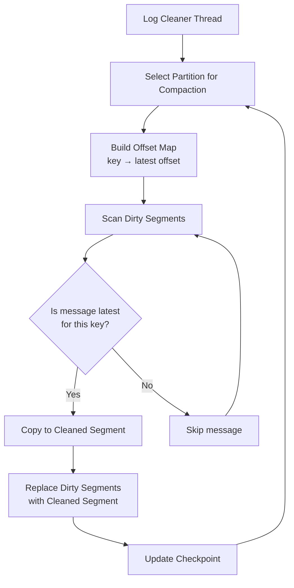
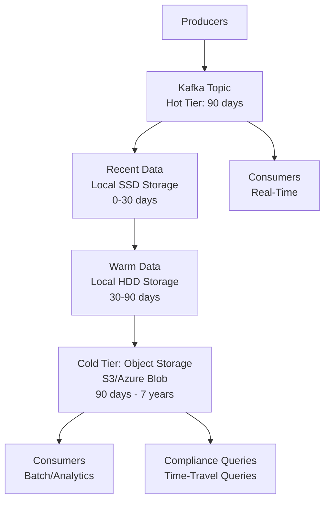

# Kafka Storage and Log Management

## Overview

Kafka's storage layer is the foundation of its durability, performance, and scalability. Unlike traditional message queues that delete messages after consumption, Kafka persists all messages to disk in an **append-only log structure** and retains them based on configurable policies. Understanding how Kafka organizes data on disk, manages indexes, and performs log cleanup is critical for optimizing storage costs, query performance, and operational efficiency.

**Why This Matters for Interviews**: Senior engineering roles require deep knowledge of Kafka's storage internals to answer questions about performance tuning, troubleshooting slow consumers, managing disk space, and designing compaction strategies. Expect questions about segment files, index structures, compaction vs. deletion, and how to optimize for different access patterns.

**Real-World Banking Context**: Financial institutions deal with massive data volumes (millions of transactions daily), strict retention requirements (regulatory compliance mandates 7-year retention for audit logs), and performance SLAs (sub-10ms p99 read latency). Understanding storage internals helps you design cost-effective, performant systems that meet these requirements.

---

## Log Segment Structure

Kafka stores each partition as a **directory** containing multiple **segment files**. The segment-based design enables efficient log cleanup, fast seeks, and parallel processing.

### Partition Directory Layout

```
/var/kafka-logs/
├── payments-0/                          # Partition directory (topic: payments, partition: 0)
│   ├── 00000000000000000000.log         # Segment 1: messages offset 0 - 4,999,999
│   ├── 00000000000000000000.index       # Offset index for segment 1
│   ├── 00000000000000000000.timeindex   # Time index for segment 1
│   ├── 00000000000005000000.log         # Segment 2: messages offset 5,000,000 - 9,999,999
│   ├── 00000000000005000000.index       # Offset index for segment 2
│   ├── 00000000000005000000.timeindex   # Time index for segment 2
│   ├── 00000000000010000000.log         # Segment 3: messages offset 10,000,000 - (active)
│   ├── 00000000000010000000.index       # Offset index for segment 3 (active)
│   ├── 00000000000010000000.timeindex   # Time index for segment 3 (active)
│   ├── leader-epoch-checkpoint          # Leader epoch tracking (for log truncation)
│   └── partition.metadata               # Partition metadata (KRaft mode)
├── payments-1/                          # Partition 1 directory
│   └── ...
└── payments-2/                          # Partition 2 directory
    └── ...
```

**Key Concepts**:

1. **Segment Naming**: Segment files are named with the **base offset** (lowest offset in the segment) padded to 20 digits. The file `00000000000005000000.log` contains messages starting at offset 5,000,000.

2. **Active Segment**: The most recent segment that is currently being written to. Only the active segment is mutable; all closed segments are **immutable**.

3. **Segment Trio**: Each segment consists of three files:
   - **`.log`**: The actual message data (records)
   - **`.index`**: Offset index (maps offsets to physical file positions)
   - **`.timeindex`**: Time index (maps timestamps to offsets for time-based seeks)

### Log Segment File Format

The `.log` file contains a sequence of **record batches** (also called message sets). Each record batch is compressed and checksummed as a unit.

```
Record Batch Structure (Kafka 0.11+ format):
┌─────────────────────────────────────────────────────────┐
│ Base Offset (8 bytes)                                   │ ← Offset of first record in batch
├─────────────────────────────────────────────────────────┤
│ Batch Length (4 bytes)                                  │ ← Length of batch in bytes
├─────────────────────────────────────────────────────────┤
│ Partition Leader Epoch (4 bytes)                        │ ← For log reconciliation
├─────────────────────────────────────────────────────────┤
│ Magic (1 byte)                                          │ ← Format version (2 for current)
├─────────────────────────────────────────────────────────┤
│ CRC (4 bytes)                                           │ ← Checksum for corruption detection
├─────────────────────────────────────────────────────────┤
│ Attributes (2 bytes)                                    │ ← Compression type, transaction info
├─────────────────────────────────────────────────────────┤
│ Last Offset Delta (4 bytes)                             │ ← Offset delta of last record
├─────────────────────────────────────────────────────────┤
│ First Timestamp (8 bytes)                               │ ← Timestamp of first record
├─────────────────────────────────────────────────────────┤
│ Max Timestamp (8 bytes)                                 │ ← Timestamp of last record
├─────────────────────────────────────────────────────────┤
│ Producer ID (8 bytes)                                   │ ← For idempotent/transactional producers
├─────────────────────────────────────────────────────────┤
│ Producer Epoch (2 bytes)                                │
├─────────────────────────────────────────────────────────┤
│ Base Sequence (4 bytes)                                 │ ← For duplicate detection
├─────────────────────────────────────────────────────────┤
│ Records Count (4 bytes)                                 │ ← Number of records in batch
├─────────────────────────────────────────────────────────┤
│ Record 1 (variable length)                              │
│   - Length, Attributes, Timestamp Delta, Offset Delta   │
│   - Key Length, Key, Value Length, Value, Headers       │
├─────────────────────────────────────────────────────────┤
│ Record 2 (variable length)                              │
│   - ...                                                 │
├─────────────────────────────────────────────────────────┤
│ ...                                                     │
└─────────────────────────────────────────────────────────┘
```

**Key Points**:
- **Batching**: Multiple records are batched together (producer-side batching with `linger.ms` and `batch.size`)
- **Compression**: The entire batch is compressed (gzip, snappy, lz4, zstd), not individual records
- **Zero-Copy**: Batches are written to disk and sent to consumers without deserialization (broker remains format-agnostic)

**Banking Example**: A payment producer batches 100 payment messages together (10ms linger time), compresses them with `lz4` (4:1 ratio), and sends a single 25 KB batch instead of 100 separate 1 KB messages. This reduces network overhead by 75% and broker CPU usage (fewer batch writes).

### Segment Rolling (Closing Active Segment)

The active segment is "rolled" (closed) and a new active segment is created when any of these thresholds is reached:

```properties
# Close segment when it reaches 1 GB
log.segment.bytes = 1073741824  # 1 GB (default)

# Close segment after 7 days, even if size threshold not reached
log.segment.ms = 604800000  # 7 days (default)

# Close segment when index fills up
segment.index.bytes = 10485760  # 10 MB (default)
```

**Why Segment Rolling Matters**:
1. **Retention Management**: Kafka deletes entire segments, not individual messages. Smaller segments enable finer-grained retention.
2. **Compaction Efficiency**: Log compaction operates on closed segments. Smaller segments mean more frequent compaction.
3. **File Handle Limits**: Each segment requires 3 file handles (`.log`, `.index`, `.timeindex`). Too many segments can exhaust OS limits.

**Configuration Trade-offs**:

| Configuration | Small Segments (256 MB) | Large Segments (2 GB) |
|--------------|------------------------|----------------------|
| **Retention Granularity** | Fine (hourly deletion) | Coarse (daily deletion) |
| **Compaction Frequency** | High (faster cleanup) | Low (slower cleanup) |
| **File Handles** | High (many segments) | Low (fewer segments) |
| **Seek Performance** | Better (smaller index) | Worse (larger index) |
| **Typical Use Case** | Low-traffic topics, compacted topics | High-traffic topics, time-series data |

**Banking Example**:
- **Payment Events Topic** (compacted, event sourcing): `log.segment.bytes = 268435456` (256 MB) for daily compaction
- **Transaction Logs Topic** (high-throughput append): `log.segment.bytes = 2147483648` (2 GB) to reduce file handle count

---

## Index Files

Kafka maintains two types of indexes per segment to enable fast message lookups without scanning the entire `.log` file.

### Offset Index (`.index`)

The offset index maps **logical offsets** to **physical byte positions** in the `.log` file, enabling O(log n) seeks instead of O(n) scans.

**Index Structure** (sparse index, not every offset is indexed):
```
Offset Index File:
┌──────────────────┬──────────────────┐
│ Relative Offset  │ Physical Position│
├──────────────────┼──────────────────┤
│ 0                │ 0                │  ← First record in segment
│ 4096             │ 524,288          │  ← Index entry every ~4KB (default)
│ 8192             │ 1,048,576        │
│ 12288            │ 1,572,864        │
│ ...              │ ...              │
└──────────────────┴──────────────────┘
```

**Key Concepts**:

1. **Sparse Index**: Not every offset is indexed. Kafka indexes approximately every `log.index.interval.bytes` (default 4 KB) of data written.

2. **Relative Offsets**: Index stores offsets relative to the segment's base offset (saves space). For segment `00000000000005000000.log`, offset 5,004,096 is stored as relative offset 4,096.

3. **Memory-Mapped Files**: Index files are memory-mapped (`mmap`) for fast access without disk I/O.

**Lookup Algorithm**:
```
To read message at offset 5,010,000 from segment 00000000000005000000.log:
1. Calculate relative offset: 10,000 (5,010,000 - 5,000,000)
2. Binary search in .index for largest entry <= 10,000
3. Find: relative offset 8,192 → position 1,048,576
4. Seek to position 1,048,576 in .log file
5. Scan forward until offset 5,010,000 is found
6. Return record

Time complexity: O(log n) for binary search + O(k) scan (k = records between index entries, typically small)
```

**Configuration**:
```properties
# Index a new entry every 4 KB of data written
log.index.interval.bytes = 4096

# Maximum index file size (triggers segment roll if exceeded)
segment.index.bytes = 10485760  # 10 MB
```

**Banking Example**: A consumer reads offset 8,500,000 from a 1 GB segment containing 10 million messages. Without an index, Kafka would scan the entire 1 GB file (10+ seconds). With the sparse index, Kafka performs a binary search (10 lookups) and scans ~1 KB (1 ms total).

### Time Index (`.timeindex`)

The time index maps **timestamps** to **offsets**, enabling time-based seeks (e.g., "read messages from 2 hours ago").

**Index Structure**:
```
Time Index File:
┌─────────────────────┬──────────────────┐
│ Timestamp           │ Relative Offset  │
├─────────────────────┼──────────────────┤
│ 1699900800000       │ 0                │  ← First record timestamp
│ 1699904400000       │ 4,096            │  ← Index entry every N bytes
│ 1699908000000       │ 8,192            │
│ 1699911600000       │ 12,288           │
│ ...                 │ ...              │
└─────────────────────┴──────────────────┘
```

**Lookup Algorithm**:
```
To read messages from timestamp 1699906000000 (Nov 13, 2023 12:00 PM):
1. Binary search across all .timeindex files to find segment containing timestamp
2. Find segment 00000000000005000000.log with timestamp range [1699900800000, 1699915200000]
3. Binary search within .timeindex to find largest timestamp <= 1699906000000
4. Find: timestamp 1699904400000 → relative offset 4,096
5. Use .index to find position of offset 4,096
6. Scan forward from that position, filtering by timestamp
```

**Use Cases**:
- Consumer starting from a specific time: `consumer.offsetsForTimes()`
- Time-based retention: Delete segments older than `retention.ms`
- Forensic analysis: "Show me all payments processed between 2 PM and 3 PM yesterday"

**Configuration**:
```properties
# Timestamp type: CreateTime (producer-set) or LogAppendTime (broker-set)
log.message.timestamp.type = CreateTime

# Reject messages with timestamps older than this
log.message.timestamp.difference.max.ms = 9223372036854775807  # Max long (disabled)
```

**Banking Example**: After a fraudulent payment is detected at 3:15 PM, investigators use time-based seek to retrieve all payments from 3:00 PM - 3:20 PM for analysis. Kafka uses the `.timeindex` to jump directly to the relevant segment and offset, avoiding a full partition scan.

### Index Rebuild

If index files are corrupted or deleted, Kafka can rebuild them by scanning the `.log` file:

```bash
# Rebuild all indexes for a partition
kafka-run-class.sh kafka.tools.DumpLogSegments \
  --files /var/kafka-logs/payments-0/00000000000005000000.log \
  --index-sanity-check

# If corrupted, delete .index and .timeindex files
# Kafka will rebuild them on broker startup
rm /var/kafka-logs/payments-0/00000000000005000000.index
rm /var/kafka-logs/payments-0/00000000000005000000.timeindex
# Restart broker → indexes rebuilt
```

**Rebuild Time**: Approximately 1-2 minutes per GB of log data (CPU-intensive).

---

## Log Cleanup Policies

Kafka supports two cleanup policies for managing disk space: **deletion** (time/size-based) and **compaction** (key-based deduplication).

### Deletion Policy (`cleanup.policy=delete`)

The deletion policy removes old segments based on time or size thresholds. This is the default policy for most topics.

**Configuration**:
```properties
# Delete segments older than 7 days
log.retention.ms = 604800000  # 7 days (overrides log.retention.hours)

# Delete segments when partition exceeds 100 GB
log.retention.bytes = 107374182400  # 100 GB per partition

# Check for deletable segments every 5 minutes
log.retention.check.interval.ms = 300000
```

**Deletion Algorithm**:
```
Every 5 minutes (log.retention.check.interval.ms):
1. For each partition:
   2. Calculate partition size (sum of all segment sizes)
   3. Calculate oldest segment timestamp (from .timeindex)
   4. If oldest segment is older than retention.ms OR partition size > retention.bytes:
      5. Delete oldest segment (remove .log, .index, .timeindex files)
      6. Repeat until retention criteria met
```

**Key Points**:
1. **Segment-Level Deletion**: Entire segments are deleted, not individual messages. A segment is deleted when **all messages** in it violate retention.
2. **Active Segment Never Deleted**: Even if it exceeds retention, the active segment is never deleted (would prevent new writes).
3. **Time-Based Retention**: Based on largest timestamp in segment (from `.timeindex`), not file modification time.

**Banking Example**:
```properties
# Audit Log Topic (regulatory requirement: 7 years)
log.retention.ms = 220752000000  # 7 years (2,557 days)
log.retention.bytes = -1          # No size limit (infinite)

# Application Log Topic (cost optimization: 7 days)
log.retention.ms = 604800000      # 7 days
log.retention.bytes = 10737418240 # 10 GB per partition

# Real-Time Analytics Topic (low retention: 1 hour)
log.retention.ms = 3600000        # 1 hour
log.retention.bytes = 1073741824  # 1 GB per partition
```

### Compaction Policy (`cleanup.policy=compact`)

Log compaction ensures that Kafka retains **at least the last known value** for each key within a partition. This is essential for changelog topics, event sourcing, and maintaining current state.

**Use Cases**:
1. **Database Change Data Capture (CDC)**: Capture latest state of each database row
2. **User Profile Updates**: Retain only the most recent profile for each user
3. **Configuration Management**: Track current configuration for each service
4. **Event Sourcing**: Maintain current state of each entity (e.g., contract status)

**Compaction Guarantees**:
- **At least one instance** of each key is retained (the latest value before compaction ran)
- **Tombstones** (null values) mark keys for deletion after `delete.retention.ms`
- **Active segment never compacted**: Only closed segments are compacted
- **Ordering preserved**: Within a partition, messages with the same key remain ordered

**Configuration**:
```properties
# Enable compaction
cleanup.policy = compact

# Minimum time before a segment is eligible for compaction (allow late updates)
min.compaction.lag.ms = 0  # Default: immediate (increase for late-arriving data)

# Maximum time before a segment must be compacted
max.compaction.lag.ms = 9223372036854775807  # Default: disabled

# Minimum ratio of dirty (uncompacted) log to trigger compaction
min.cleanable.dirty.ratio = 0.5  # 50% (lower = more frequent compaction)

# Tombstone retention time (how long to keep null values before deleting)
delete.retention.ms = 86400000  # 24 hours
```

**Compaction Process**:



**Before Compaction**:
```
Segment 1 (dirty):
Offset  Key     Value
1000    user1   {name: "Alice", age: 25}
1001    user2   {name: "Bob", age: 30}
1002    user1   {name: "Alice", age: 26}    ← Updated age
1003    user3   {name: "Charlie", age: 35}
1004    user2   null                        ← Tombstone (deleted)
1005    user1   {name: "Alice", age: 27}    ← Updated again
```

**After Compaction**:
```
Segment 1 (clean):
Offset  Key     Value
1003    user3   {name: "Charlie", age: 35}  ← Only latest value retained
1005    user1   {name: "Alice", age: 27}    ← Only latest value retained
(user2 tombstone deleted after delete.retention.ms)
```

**Compaction Algorithm Details**:

1. **Dirty Ratio Calculation**:
   ```
   dirty_ratio = (bytes in dirty segments) / (total bytes in partition)
   If dirty_ratio > min.cleanable.dirty.ratio, trigger compaction
   ```

2. **Offset Map**: The log cleaner builds an in-memory hash map (key → latest offset). Map size is limited by `log.cleaner.dedupe.buffer.size` (default 128 MB). If partition has more unique keys than fit in memory, compaction runs multiple passes.

3. **Cleaning**: The cleaner reads dirty segments, keeps only the latest value for each key, and writes to a new cleaned segment.

**Banking Example: Contract Status Topic**:
```properties
# Topic: contract-status (event-sourced, compacted)
cleanup.policy = compact
min.compaction.lag.ms = 3600000    # 1 hour (allow late status updates)
delete.retention.ms = 86400000      # 24 hours (keep tombstones for downstream consumers)
segment.bytes = 268435456           # 256 MB (frequent compaction)
min.cleanable.dirty.ratio = 0.3     # Compact when 30% dirty (frequent cleanup)

# Events:
# 08:00 AM: contract123 → {status: "draft"}
# 10:00 AM: contract123 → {status: "submitted"}
# 02:00 PM: contract123 → {status: "approved"}
# 04:00 PM: contract123 → {status: "active"}

# After compaction:
# Only retained: contract123 → {status: "active"}
# A new microservice can consume this topic to rebuild contract state
```

### Hybrid Policy (`cleanup.policy=compact,delete`)

Combines compaction with time/size-based deletion. Useful for retaining recent state while eventually deleting old data.

```properties
cleanup.policy = compact,delete
log.retention.ms = 2592000000     # 30 days
min.cleanable.dirty.ratio = 0.5

# Behavior:
# 1. Compaction runs to deduplicate within retention window
# 2. After 30 days, entire segments are deleted (even if they contain unique keys)
```

**Banking Example**: User session topic retains the latest session state for each user (compacted) but deletes sessions older than 90 days (GDPR compliance).

---

## Log Compaction Deep Dive

### Compaction Internals

**Log Cleaner Architecture**:
```
Kafka Broker JVM:
┌────────────────────────────────────────────────────────┐
│ Log Cleaner Manager                                    │
│   ├─ Cleaner Thread 1                                 │
│   │    ├─ Selects dirtiest partition                  │
│   │    ├─ Builds offset map (key → latest offset)     │
│   │    └─ Writes cleaned segments                     │
│   ├─ Cleaner Thread 2                                 │
│   └─ ...                                              │
│                                                        │
│ Dedupe Buffer (128 MB default)                        │
│   ├─ In-memory hash map: key hash → offset           │
│   └─ Size limited (log.cleaner.dedupe.buffer.size)   │
└────────────────────────────────────────────────────────┘
```

**Configuration**:
```properties
# Enable log cleaner
log.cleaner.enable = true

# Number of cleaner threads
log.cleaner.threads = 2  # Increase for high compaction workload (4-8 threads)

# Dedupe buffer size per cleaner thread
log.cleaner.dedupe.buffer.size = 134217728  # 128 MB

# I/O buffer size for reading/writing during compaction
log.cleaner.io.buffer.size = 524288  # 512 KB

# Maximum size of cleaner buffer (all threads combined)
log.cleaner.io.max.bytes.per.second = 1.7976931348623157E308  # Unlimited (throttle if needed)
```

**Monitoring Compaction**:
```bash
# Check cleaner metrics
kafka-run-class.sh kafka.tools.JmxTool --object-name kafka.log:type=LogCleanerManager,name=max-dirty-percent

# Key metrics:
# - max-dirty-percent: Highest dirty ratio across partitions
# - cleaner-recopy-percent: Percentage of messages recopied (higher = less effective)
# - max-buffer-utilization-percent: Dedupe buffer usage (>90% indicates need for larger buffer)
```

### Compaction Performance Optimization

**Problem**: Compaction is CPU and I/O intensive, impacting broker performance.

**Solutions**:

1. **Increase Cleaner Threads** (if CPU available):
```properties
log.cleaner.threads = 4  # More parallelism
```

2. **Increase Dedupe Buffer** (if memory available):
```properties
# Larger buffer allows processing partitions with more unique keys in one pass
log.cleaner.dedupe.buffer.size = 268435456  # 256 MB (double default)
```

3. **Throttle Compaction I/O** (if impacting production traffic):
```properties
# Limit cleaner I/O to 100 MB/s
log.cleaner.io.max.bytes.per.second = 104857600
```

4. **Adjust Dirty Ratio** (trade-off: storage vs. CPU):
```properties
# Higher ratio = less frequent compaction (saves CPU, uses more disk)
min.cleanable.dirty.ratio = 0.7  # 70%

# Lower ratio = more frequent compaction (uses CPU, saves disk)
min.cleanable.dirty.ratio = 0.3  # 30%
```

5. **Schedule Compaction Off-Peak**:
```properties
# Use min.compaction.lag.ms to delay compaction until night
min.compaction.lag.ms = 43200000  # 12 hours
# Compaction only runs on segments closed >12 hours ago (off-peak time)
```

**Banking Example**: A payment processor runs compaction on contract status topics during overnight maintenance windows (11 PM - 5 AM) by setting `min.compaction.lag.ms = 43200000` (12 hours). This avoids compaction I/O interfering with daytime payment processing (8 AM - 8 PM peak load).

### Handling Tombstones

**Tombstone** = A message with a null value, indicating the key should be deleted.

**Producer Sending Tombstone**:
```java
// Mark contract123 as deleted
producer.send(new ProducerRecord<>("contract-status", "contract123", null));
```

**Tombstone Lifecycle**:
```
T+0s:    Tombstone written to active segment
T+1h:    Active segment rolls (becomes compactable)
T+2h:    Compaction runs, tombstone retained (delete.retention.ms not expired)
T+24h:   delete.retention.ms expires
T+25h:   Next compaction removes tombstone
Result:  Key "contract123" is fully deleted from topic
```

**Why Retain Tombstones Temporarily?**
- Downstream consumers may be offline or lagging
- Retaining tombstones ensures consumers see the deletion event
- After `delete.retention.ms`, all consumers have seen the tombstone (safe to remove)

**Configuration**:
```properties
# Retain tombstones for 7 days (long-running consumers, batch jobs)
delete.retention.ms = 604800000  # 7 days

# Retain tombstones for 1 hour (real-time consumers only)
delete.retention.ms = 3600000  # 1 hour
```

**Banking Example**: A contract status topic uses `delete.retention.ms = 604800000` (7 days) to accommodate weekly batch reporting jobs that run every Monday. This ensures the batch job sees contract deletions even if it runs once a week.

---

## Storage Performance Optimization

### File System Selection

**Kafka Performance Characteristics**:
- **Sequential writes**: Kafka appends to log files (optimizes for sequential I/O)
- **Sequential reads**: Consumers typically read sequentially from old to new offsets
- **Page cache reliance**: Kafka relies heavily on OS page cache (not JVM heap)

**Recommended File Systems**:

1. **XFS** (recommended for production):
   - Excellent performance for large files (Kafka segments)
   - Efficient handling of many files (high partition count)
   - Better performance than ext4 for Kafka workloads

2. **ext4**:
   - Widely supported, stable
   - Acceptable performance (slightly lower than XFS)
   - Easier troubleshooting (more common)

3. **Avoid**:
   - **NFS**: Network latency kills performance (use local disks)
   - **ZFS**: Higher CPU overhead (checksumming adds latency)

**Mount Options** (XFS):
```bash
# /etc/fstab
/dev/sdb1 /var/kafka-logs xfs noatime,nodiratime 0 0

# noatime: Don't update access time (reduces writes)
# nodiratime: Don't update directory access time
```

### Disk Configuration

**RAID Configurations**:

| RAID Level | Redundancy | Performance | Use Case |
|-----------|-----------|------------|----------|
| **RAID 0** | None | High write/read | Not recommended (data loss on disk failure) |
| **RAID 1** | Mirror | Moderate write, high read | Small clusters, read-heavy |
| **RAID 10** | Striped mirror | High write/read | **Recommended** (balance of performance and redundancy) |
| **RAID 5/6** | Parity | Low write, high read | Avoid (slow writes due to parity calculation) |

**Banking Recommendation**:
- **RAID 10**: Balance of performance and redundancy (tolerates disk failures without data loss)
- **Replication over RAID**: Kafka's replication provides redundancy at broker level; some teams use JBOD (Just a Bunch of Disks) with high replication factor instead of RAID

**SSD vs. HDD**:

| Metric | HDD (7200 RPM) | SSD (NVMe) |
|--------|----------------|------------|
| **Sequential Write** | 150 MB/s | 3,000 MB/s |
| **Sequential Read** | 150 MB/s | 3,500 MB/s |
| **Random I/O (IOPS)** | 100 IOPS | 500,000 IOPS |
| **Latency (p99)** | 10-20 ms | 0.1-1 ms |
| **Cost** | Low | High |

**When to Use SSDs**:
- Low-latency requirements (p99 < 5 ms)
- Random read patterns (compacted topics with many consumers seeking)
- High write throughput (>500 MB/s per broker)

**When HDDs Are Sufficient**:
- Sequential access patterns (append-only, sequential consumers)
- Cost-sensitive deployments (large retention volumes)
- Write throughput < 200 MB/s per broker

**Banking Example**: A payment processing cluster uses **NVMe SSDs** for real-time payment topics (p99 latency < 5 ms required) and **HDDs** for audit log topics (7-year retention, sequential access only).

### Page Cache Tuning

Kafka relies on the OS page cache for performance. The broker JVM heap should be **6-8 GB**, leaving the majority of system RAM for the page cache.

**Memory Allocation Example** (64 GB server):
```
Total RAM: 64 GB
├─ OS and kernel: 2 GB
├─ Kafka JVM heap: 6 GB
└─ OS Page Cache: 56 GB  ← Used for caching log segments
```

**Page Cache Benefits**:
1. **Fast Reads**: Recent data served from RAM (no disk I/O)
2. **Zero-Copy**: Kafka uses `sendfile()` to transfer data from page cache to network socket (bypasses user space)
3. **Write Buffering**: Writes batched in page cache before flushing to disk

**Flush Behavior**:
```properties
# DON'T flush after every message (kills performance)
log.flush.interval.messages = 9223372036854775807  # Disabled (rely on replication)

# DON'T flush on a time interval (rely on OS)
log.flush.interval.ms = 9223372036854775807  # Disabled

# Let OS decide when to flush (default every 30s in Linux)
# Kafka's replication provides durability (no need to flush immediately)
```

**Why Not Flush Immediately?**
- Flushing to disk is slow (serializes I/O, reduces throughput)
- Kafka's replication provides durability (message replicated to N brokers)
- With `acks=all` and `min.insync.replicas=2`, data is on 2+ disks before ACK (more durable than single-broker flush)

### Disk Monitoring

**Key Metrics**:

1. **Disk Utilization**:
```bash
df -h /var/kafka-logs
# Alert if > 80% full (leave headroom for compaction)
```

2. **I/O Wait Time**:
```bash
iostat -x 1
# Watch %iowait column (alert if >20%)
```

3. **Disk Throughput**:
```bash
iostat -x 1
# Watch rMB/s (read MB/s) and wMB/s (write MB/s)
# Compare to disk spec (e.g., HDD ~150 MB/s, SSD ~3000 MB/s)
```

4. **Queue Depth**:
```bash
iostat -x 1
# Watch avgqu-sz (average queue size)
# High queue depth (>10) indicates disk saturation
```

**Banking Example**: A payment topic shows 90% disk utilization. The SRE team:
1. Checks retention settings: `log.retention.ms = 604800000` (7 days)
2. Reduces retention to 3 days: `log.retention.ms = 259200000`
3. Manually triggers segment deletion: wait for next retention check (5 min)
4. Disk utilization drops to 60% within 10 minutes

---

## File System Considerations

### Multiple Log Directories

Kafka supports spreading partitions across multiple disks for parallelism and capacity:

```properties
# Comma-separated list of log directories
log.dirs = /disk1/kafka-logs,/disk2/kafka-logs,/disk3/kafka-logs

# Kafka distributes new partitions across directories to balance usage
```

**Benefits**:
1. **Parallel I/O**: Different partitions on different disks (no single disk bottleneck)
2. **Capacity**: Aggregate capacity of all disks
3. **Failure Isolation**: Disk failure only affects partitions on that disk (other partitions remain available)

**Partition Assignment**:
```
Topic: payments (12 partitions)
/disk1/kafka-logs: payments-0, payments-3, payments-6, payments-9
/disk2/kafka-logs: payments-1, payments-4, payments-7, payments-10
/disk3/kafka-logs: payments-2, payments-5, payments-8, payments-11
```

**Disk Failure Handling**:
```
If /disk2 fails:
- Partitions 1, 4, 7, 10 become unavailable on this broker
- If this broker was leader, controller elects new leaders from ISR
- If this broker was follower, partition remains available (leader on another broker)
- After disk replacement, failed partitions catch up by replication
```

### File Descriptor Limits

Each segment requires 3 file descriptors (`.log`, `.index`, `.timeindex`). High partition counts can exhaust OS limits.

**Calculate File Descriptor Needs**:
```
File descriptors = (partitions per broker) × 3 × (average segments per partition)

Example:
- 1,000 partitions per broker
- Average 10 segments per partition (segment size = 1 GB, retention = 7 days, 1.5 GB/day)
- FD needed = 1,000 × 3 × 10 = 30,000

Add 20% buffer: 36,000 FDs
```

**Increase OS Limits**:
```bash
# Check current limit
ulimit -n
# Default: 1024 (too low for production Kafka)

# Increase limit (temporary)
ulimit -n 100000

# Increase limit (permanent) - /etc/security/limits.conf
kafka   soft    nofile  100000
kafka   hard    nofile  100000

# Verify after restart
su - kafka
ulimit -n
# Should show: 100000
```

**Kafka Configuration**:
```properties
# Kafka logs warning if FD limit is low
# Ensure ulimit -n shows at least 100,000 for production
```

**Banking Example**: A cluster hosts 2,000 partitions per broker with 20 segments per partition (small segment size for frequent compaction). FD requirement: 2,000 × 3 × 20 = 120,000. The SRE team sets `ulimit -n 200000` to provide headroom.

---

## Interview Questions

### Question 1: Explain the difference between log.retention.ms and segment.ms. How do they interact to determine when data is deleted?

**Answer**:

**`log.retention.ms`** defines how long Kafka retains messages before they become eligible for deletion (e.g., 7 days). This is a **partition-level retention policy**.

**`segment.ms`** defines the maximum time a segment remains active before it is closed/rolled, even if it hasn't reached the size threshold (`log.segment.bytes`). This is a **segment-level setting**.

**Interaction**:

Kafka deletes data at the **segment level**, not individual message level. A segment is deleted when **all messages** in it are older than `log.retention.ms`.

**Timeline Example**:
```
Configuration:
- log.retention.ms = 604800000  (7 days)
- segment.ms = 86400000         (1 day)
- segment.bytes = 1 GB

Day 0: Segment 1 starts (active)
Day 1: Segment 1 closes (segment.ms reached), Segment 2 starts
Day 2: Segment 2 closes, Segment 3 starts
...
Day 7: Segment 7 closes, Segment 8 starts
Day 8: Segment 1 becomes eligible for deletion (7 days old)
       Retention check runs → Segment 1 deleted
```

**Key Point**: `segment.ms` controls the **granularity** of retention. If `segment.ms = 7 days` and `log.retention.ms = 7 days`, data deletion is coarse (7-14 day window). If `segment.ms = 1 day`, deletion is fine-grained (7-8 day window).

**Banking Example**:
```properties
# Audit Log Topic (regulatory requirement: exactly 7 years)
log.retention.ms = 220752000000   # 7 years
segment.ms = 86400000             # 1 day
# Ensures daily segment rolls, data deleted within 1 day of 7-year expiration

# Payment Topic (operational data: 7 days)
log.retention.ms = 604800000      # 7 days
segment.ms = 3600000              # 1 hour
# Hourly segments allow fine-grained retention (data deleted within 1 hour of 7-day expiration)
```

**Interview Tip**: Emphasize that segment.ms prevents the active segment from growing indefinitely on low-traffic topics. Without it, a low-traffic topic might have a single multi-year segment, preventing any data deletion until the segment closes.

---

### Question 2: How does log compaction work, and what guarantees does it provide? When would you use compaction vs. time-based retention?

**Answer**:

**Log Compaction** ensures Kafka retains **at least the last known value** for each key within a partition. The log cleaner thread scans closed segments, builds an offset map (key → latest offset), and creates cleaned segments containing only the latest value for each key.

**Guarantees**:
1. **At-Least-One**: At least one instance of each key is retained (the latest before compaction)
2. **Ordering Preserved**: Messages with the same key remain in offset order
3. **Active Segment Immunity**: Active segment is never compacted (only closed segments)
4. **Tombstone Handling**: Null values (tombstones) mark deletions, retained for `delete.retention.ms`

**Process**:
```
Before Compaction:
Offset  Key      Value
100     user1    {name: "Alice", age: 25}
101     user2    {name: "Bob", age: 30}
102     user1    {name: "Alice", age: 26}    ← Updated
103     user2    null                        ← Tombstone (deleted)

After Compaction:
Offset  Key      Value
102     user1    {name: "Alice", age: 26}    ← Only latest retained
103     user2    null                        ← Tombstone (until delete.retention.ms)
```

**When to Use Compaction**:
1. **Event Sourcing**: Maintain current state of entities (e.g., contract status, user profiles)
2. **Change Data Capture (CDC)**: Sync database tables to Kafka (latest row state)
3. **Configuration Management**: Track current config for each microservice
4. **Stateful Stream Processing**: Kafka Streams changelog topics (state store backup)

**When to Use Time-Based Retention (deletion)**:
1. **Immutable Events**: Payment transactions, audit logs (never updated, retain all)
2. **Time-Series Data**: Metrics, IoT sensor data (only recent data relevant)
3. **High-Volume Logs**: Application logs (retain last 7 days, then delete)

**Comparison**:

| Aspect | Compaction | Time-Based Retention |
|--------|-----------|---------------------|
| **Retention Logic** | Keep latest per key | Keep messages within time/size window |
| **Disk Usage** | Proportional to unique keys | Proportional to time window and throughput |
| **Use Case** | Mutable state (updates) | Immutable events (append-only) |
| **Query Pattern** | "What is current value of key X?" | "What happened between time T1 and T2?" |

**Banking Example**:

**Contract Status Topic** (compaction):
```properties
cleanup.policy = compact
min.compaction.lag.ms = 3600000
delete.retention.ms = 86400000

# Usage: Event-sourced contract lifecycle
# - contract123: draft → submitted → approved → active
# - After compaction, only latest status retained
# - Downstream services rebuild state by consuming from offset 0
```

**Payment Transaction Topic** (deletion):
```properties
cleanup.policy = delete
log.retention.ms = 220752000000  # 7 years (regulatory)

# Usage: Immutable payment records
# - Each payment is a distinct event (no updates)
# - All payments must be retained for audit (no compaction)
```

**Hybrid Example** (user sessions):
```properties
cleanup.policy = compact,delete
log.retention.ms = 7776000000  # 90 days (GDPR compliance)
min.cleanable.dirty.ratio = 0.5

# - Compaction maintains latest session state for each user
# - After 90 days, entire segments deleted (GDPR right to be forgotten)
```

---

### Question 3: What is a sparse index, and why does Kafka use it instead of indexing every offset? What are the trade-offs?

**Answer**:

A **sparse index** indexes only a subset of entries (not every offset), trading off lookup precision for reduced index size and faster builds.

**Kafka's Sparse Index**:
- Indexes approximately every `log.index.interval.bytes` (default 4 KB) of data written
- Stores relative offsets (offset - segment base offset) to save space
- Memory-mapped for fast access without disk I/O

**Why Sparse (Not Dense)?**

**Dense Index** (every offset indexed):
```
Pros: O(1) exact lookup (no scanning)
Cons:
- Huge index files (1 GB segment with 1 KB messages = 1M index entries = 16 MB index)
- Slow to build (index every message during write)
- High memory usage (larger memory-mapped files)
```

**Sparse Index** (every 4 KB indexed):
```
Pros:
- Small index files (1 GB segment with 4 KB interval = 256K entries = 4 MB index)
- Fast to build (index every ~4 messages instead of every message)
- Low memory usage (smaller mmap footprint)

Cons:
- O(log n) + O(k) lookup (binary search + linear scan, where k = messages between index entries)
- Scan distance: ~4 KB (typically 4-10 messages with 1 KB avg message size)
```

**Lookup Algorithm**:
```
To find offset 1,000,000:
1. Binary search .index for largest entry <= 1,000,000
   - Find: offset 999,996 → position 524,288,000
2. Seek to position 524,288,000 in .log file
3. Scan forward ~4 KB until offset 1,000,000 found
   - Typically 4-10 messages (1-2 ms)

Total: 10-15 µs (binary search) + 1-2 ms (scan) = ~2 ms
```

**Trade-offs**:

| Aspect | Sparse Index | Dense Index |
|--------|-------------|------------|
| **Index Size** | 0.4% of log size | 1.6% of log size |
| **Build Time** | Fast (index every N bytes) | Slow (index every message) |
| **Lookup Time** | O(log n) + O(k) scan | O(log n) exact |
| **Memory Usage** | Low (small mmap) | High (large mmap) |

**Configuration Tuning**:
```properties
# Finer index (more entries, smaller scan)
log.index.interval.bytes = 2048  # 2 KB (doubles index size, halves scan distance)

# Coarser index (fewer entries, larger scan)
log.index.interval.bytes = 8192  # 8 KB (halves index size, doubles scan distance)
```

**Banking Example**:

**Real-Time Payments** (optimize for read latency):
```properties
log.index.interval.bytes = 2048  # 2 KB
# Trade-off: 2x larger index for 50% faster consumer seeks
# Consumer p99 latency: 1 ms (instead of 2 ms with default 4 KB)
```

**Audit Logs** (optimize for storage):
```properties
log.index.interval.bytes = 8192  # 8 KB
# Trade-off: 50% smaller index, acceptable scan (consumers read sequentially, no seeks)
# Saves 50% index storage (important for 7-year retention)
```

**Interview Tip**: Highlight that Kafka's design prioritizes **sequential access** (producers append, consumers read sequentially). Sparse indexes are optimized for this pattern (minimal overhead for sequential reads, acceptable overhead for random seeks).

---

### Question 4: How would you troubleshoot a Kafka broker running out of disk space? Walk through your diagnostic and remediation steps.

**Answer**:

**Step 1: Identify Disk Usage by Topic**

```bash
# Check overall disk usage
df -h /var/kafka-logs
# Example output: 95% full (alert threshold)

# Identify largest topics
du -sh /var/kafka-logs/* | sort -h | tail -20
# Example output:
# 150G /var/kafka-logs/audit-logs-0
# 120G /var/kafka-logs/payments-0
# 80G /var/kafka-logs/user-sessions-0
```

**Step 2: Check Retention Configuration**

```bash
# List retention settings for top topics
kafka-configs.sh --bootstrap-server localhost:9092 \
  --entity-type topics --entity-name audit-logs --describe

# Check for:
# - retention.ms (time-based retention)
# - retention.bytes (size-based retention)
# - segment.ms (segment roll time)
# - cleanup.policy (delete vs. compact)
```

**Step 3: Analyze Retention vs. Actual Data**

```bash
# Check oldest segment timestamp
kafka-run-class.sh kafka.tools.DumpLogSegments \
  --files /var/kafka-logs/audit-logs-0/00000000000000000000.log \
  --print-data-log | head -1

# Example: Segment from 60 days ago, but retention.ms = 7 days
# → Retention not working (investigate)
```

**Root Causes and Remediation**:

**Cause 1: Retention Not Running**
```bash
# Symptom: Old segments not being deleted despite retention.ms setting

# Check broker logs for errors
tail -f /var/log/kafka/server.log | grep -i retention

# Common issues:
# - Log cleaner disabled: log.cleaner.enable=false (enable it)
# - Retention check interval too long: log.retention.check.interval.ms=300000 (reduce to 60000)
# - Active segment never deleted (expected behavior)

# Remediation:
kafka-configs.sh --bootstrap-server localhost:9092 \
  --entity-type brokers --entity-default \
  --alter --add-config log.cleaner.enable=true
```

**Cause 2: Retention Too Long**
```bash
# Symptom: audit-logs topic has 7-year retention, using 150 GB

# Check if retention can be reduced
# Consult with compliance team (banking regulations may require 7 years)

# If reducible, update retention:
kafka-configs.sh --bootstrap-server localhost:9092 \
  --entity-type topics --entity-name audit-logs \
  --alter --add-config retention.ms=2592000000  # Reduce to 30 days

# Wait for next retention check (5 min) or force deletion by restarting broker
```

**Cause 3: Compacted Topic Not Compacting**
```bash
# Symptom: user-sessions (compacted) using 80 GB, but should be ~10 GB

# Check compaction metrics
kafka-run-class.sh kafka.tools.JmxTool \
  --object-name kafka.log:type=LogCleanerManager,name=max-dirty-percent

# If max-dirty-percent > 0.8 (80% dirty), compaction is lagging

# Check cleaner logs
tail -f /var/log/kafka/log-cleaner.log

# Common issues:
# - Not enough cleaner threads: log.cleaner.threads=1 (increase to 4)
# - Dedupe buffer too small: log.cleaner.dedupe.buffer.size=128MB (increase to 256MB)
# - min.compaction.lag.ms too high (delays compaction)

# Remediation:
kafka-configs.sh --bootstrap-server localhost:9092 \
  --entity-type brokers --entity-default \
  --alter --add-config log.cleaner.threads=4,log.cleaner.dedupe.buffer.size=268435456
```

**Cause 4: Unexpected Traffic Spike**
```bash
# Symptom: payments topic grew from 50 GB to 120 GB overnight

# Check producer throughput
kafka-run-class.sh kafka.tools.JmxTool \
  --object-name kafka.server:type=BrokerTopicMetrics,name=BytesInPerSec,topic=payments

# If spike is temporary, wait for retention to catch up
# If spike is permanent (new feature launched), scale storage:
# - Add more brokers (distribute partitions)
# - Add disks to existing brokers (expand log.dirs)
# - Reduce retention if acceptable
```

**Cause 5: Log Segments Not Rolling**
```bash
# Symptom: Active segment is 50 GB (should be 1 GB based on segment.bytes)

# Check segment configuration
kafka-configs.sh --bootstrap-server localhost:9092 \
  --entity-type topics --entity-name payments --describe

# If segment.bytes is too high or segment.ms is not set:
kafka-configs.sh --bootstrap-server localhost:9092 \
  --entity-type topics --entity-name payments \
  --alter --add-config segment.bytes=1073741824,segment.ms=86400000
```

**Step 4: Immediate Remediation (Emergency)**

If disk is >95% full and services are at risk:

```bash
# Option 1: Manually delete oldest segments (DANGEROUS - potential data loss)
# Only for non-critical topics or with explicit approval
rm /var/kafka-logs/temp-logs-0/00000000000000000000.log
rm /var/kafka-logs/temp-logs-0/00000000000000000000.index
rm /var/kafka-logs/temp-logs-0/00000000000000000000.timeindex

# Option 2: Temporarily reduce retention
kafka-configs.sh --bootstrap-server localhost:9092 \
  --entity-type topics --entity-name temp-logs \
  --alter --add-config retention.ms=3600000  # 1 hour (emergency)

# Option 3: Add disk capacity (preferred)
# Mount new disk to /disk2/kafka-logs
# Update broker config:
log.dirs=/var/kafka-logs,/disk2/kafka-logs
# Restart broker (Kafka will start using new disk for new partitions)
```

**Step 5: Long-Term Prevention**

```bash
# Set up monitoring alerts
# - Disk usage > 80%: Warning
# - Disk usage > 90%: Critical (page SRE)

# Monitor per-topic disk usage trends
# - Alert if topic grows >20% per day (potential runaway producer)

# Implement tiered storage (Kafka 2.8+)
# - Move old segments to S3/Azure Blob (reduce local disk usage)
# - Configure:
#   remote.log.storage.system.enable=true
#   remote.log.manager.task.interval.ms=60000
```

**Banking Example**:

**Scenario**: Payments broker hits 95% disk usage at 10 AM (peak trading hours).

**Investigation**:
1. `du -sh` shows audit-logs-0 using 200 GB (expected 50 GB)
2. Check config: `retention.ms = 604800000` (7 days)
3. Check oldest segment: 45 days old (retention not deleting!)
4. Check broker logs: "Log cleaner thread failed: OutOfMemoryError"
5. Root cause: Log cleaner crashed due to heap exhaustion

**Remediation**:
1. Restart broker (restart log cleaner threads)
2. Increase cleaner dedupe buffer: `log.cleaner.dedupe.buffer.size = 256MB`
3. Increase JVM heap: `-Xmx8g` (was 4g)
4. Wait 15 minutes: retention catches up, deletes 150 GB of old segments
5. Disk usage drops to 60%
6. Long-term: Add monitoring for cleaner thread health

---

### Question 5: Explain the purpose of leader-epoch-checkpoint file and when Kafka uses it.

**Answer**:

The **`leader-epoch-checkpoint`** file tracks the history of partition leadership changes, recording each **leader epoch** (monotonically increasing counter) and the corresponding **start offset** for that epoch. Kafka uses this during log reconciliation after broker failures to prevent data loss or divergence.

**File Format**:
```
# /var/kafka-logs/payments-0/leader-epoch-checkpoint
0                         # Version
3                         # Number of epochs
0 0                       # Epoch 0 started at offset 0
1 5000000                 # Epoch 1 started at offset 5,000,000
2 10000000                # Epoch 2 started at offset 10,000,000
```

**When Leader Epochs Change**:
1. **Initial partition creation**: Epoch 0 assigned to first leader
2. **Broker failure**: New leader elected → epoch incremented
3. **Controlled shutdown**: Leadership transfers → epoch incremented
4. **Preferred leader election**: Leadership restored → epoch incremented

**Problem Solved: Log Divergence After Failure**

**Scenario Without Leader Epochs** (Kafka < 0.11):
```
T+0s:  Broker1 (leader), Broker2 (follower), Broker3 (follower)
       Broker1 has messages 0-1000
       Broker2 has messages 0-999 (1 message behind)

T+1s:  Broker1 crashes (message 1000 not yet replicated to Broker2/Broker3)
T+2s:  Broker2 elected new leader (has messages 0-999)
T+3s:  Broker2 receives new message 1000' (different from Broker1's 1000)

T+10s: Broker1 restarts (has messages 0-1000)
       Broker1 starts replicating from Broker2 (new leader)
       Broker2's log: 0-999, 1000'
       Broker1's log: 0-1000

       → Divergence! Broker1 has message 1000, Broker2 has message 1000'
       → Old behavior: Broker1 truncates to high watermark, loses message 1000
```

**Solution With Leader Epochs** (Kafka 0.11+):
```
T+0s:  Broker1 (leader, epoch 1), Broker2 (follower), Broker3 (follower)
       Broker1: messages 0-1000, leader-epoch-checkpoint: epoch 1 → offset 0
       Broker2: messages 0-999, leader-epoch-checkpoint: epoch 1 → offset 0

T+1s:  Broker1 crashes

T+2s:  Broker2 elected new leader, epoch incremented to 2
       Broker2: leader-epoch-checkpoint: epoch 1 → 0, epoch 2 → 1000

T+3s:  Broker2 receives new message at offset 1000 (epoch 2)

T+10s: Broker1 restarts
       Broker1 sends OffsetForLeaderEpoch request to Broker2:
         "What is the first offset for epoch 2?"
       Broker2 responds: "Epoch 2 starts at offset 1000"

       Broker1's log: 0-1000 (epoch 1)
       Broker1 truncates to offset 999 (last offset of epoch 1)
       Broker1 fetches from offset 1000 (epoch 2) from Broker2

       → No divergence! Broker1 correctly truncates and syncs
```

**Algorithm**:
```
When follower (Broker1) rejoins after failure:
1. Follower checks its leader-epoch-checkpoint for last known epoch (epoch 1)
2. Follower sends OffsetForLeaderEpoch(epoch=2) to current leader (Broker2)
3. Leader responds with first offset of epoch 2 (offset 1000)
4. Follower truncates its log to max(leader's response - 1, 0) = offset 999
5. Follower starts fetching from offset 1000 (aligns with current leader)
```

**Key Benefits**:
1. **Prevents Data Loss**: Ensures followers truncate only to safe offsets (confirmed by current leader)
2. **Prevents Divergence**: All replicas agree on offset-to-message mapping within an epoch
3. **Faster Recovery**: No need to truncate to old high watermark (only truncate uncommitted messages from old epoch)

**Banking Example**:

**Scenario**: Payment processing partition with 3 replicas.

```
T+0s:  Broker1 (leader, epoch 5) receives payment $10,000 at offset 9,999,999
       Broker1 writes to local log
       Broker1 crashes before replicating to Broker2/Broker3

T+1s:  Broker2 elected leader (epoch 6)
       Broker2's last offset: 9,999,998
       Broker2 writes leader-epoch-checkpoint: epoch 6 → 9,999,999

T+2s:  Producer retries $10,000 payment (idempotent producer detects duplicate)
       Broker2 writes at offset 9,999,999 (epoch 6)

T+10s: Broker1 restarts
       Broker1's log: offset 9,999,999 (epoch 5, old payment)
       Broker1 sends OffsetForLeaderEpoch(epoch=6) to Broker2
       Broker2 responds: "Epoch 6 starts at 9,999,999"
       Broker1 truncates offset 9,999,999 (epoch 5)
       Broker1 fetches offset 9,999,999 (epoch 6) from Broker2

       → No duplicate payment! Epoch tracking ensures correct reconciliation
```

**Interview Tip**: Emphasize that leader epochs solve the "unclean failover" problem where a follower with an incomplete log becomes leader, then the original leader returns with conflicting data. Epochs provide a consistent way to reconcile logs based on leadership history.

---

### Question 6: How would you design a Kafka storage strategy for a topic that must retain 7 years of data for regulatory compliance while optimizing for both cost and query performance?

**Answer**:

Designing for 7-year retention requires balancing **regulatory compliance**, **cost optimization**, and **query performance**. I would use a **tiered storage** approach combined with **compaction** and **archiving** strategies.

**Architecture**:



**Tier 1: Hot Storage (0-30 days) - Local SSD**

```properties
# Topic configuration
retention.ms = 2592000000      # 30 days on local SSD
segment.bytes = 1073741824     # 1 GB segments
cleanup.policy = delete         # Time-based retention
compression.type = lz4          # Fast compression (low CPU)

# Broker configuration
log.dirs = /ssd/kafka-logs      # NVMe SSD for low latency

# Use case: Real-time payment processing, fraud detection
# Performance: p99 latency < 5 ms
# Cost: $0.20/GB/month (SSD)
```

**Tier 2: Warm Storage (30-90 days) - Local HDD**

```properties
# Use partition reassignment to move older segments to HDD brokers
log.dirs = /hdd/kafka-logs      # SATA HDD (cheaper, slower)

# Use case: Recent historical analysis, customer support queries
# Performance: p99 latency < 50 ms
# Cost: $0.03/GB/month (HDD)
```

**Tier 3: Cold Storage (90 days - 7 years) - Object Storage**

```properties
# Enable tiered storage (Kafka 3.6+)
remote.log.storage.system.enable = true
remote.log.manager.task.interval.ms = 60000  # Check every minute

# Remote storage configuration
remote.log.storage.manager.class.name = org.apache.kafka.server.log.remote.storage.RemoteLogStorageManager
remote.log.metadata.manager.class.name = org.apache.kafka.server.log.remote.metadata.storage.TopicBasedRemoteLogMetadataManager

# Local retention before moving to remote
local.retention.ms = 7776000000  # 90 days local

# Remote retention (total)
retention.ms = 220752000000      # 7 years (2,557 days)

# Use case: Regulatory compliance, annual audits, forensic analysis
# Performance: p99 latency < 5 seconds (acceptable for batch queries)
# Cost: $0.023/GB/month (S3 Standard) or $0.004/GB/month (S3 Glacier)
```

**Cost Calculation**:

```
Example: 1 TB/day ingestion rate for audit logs

Tier 1 (SSD, 30 days):
- Storage: 30 TB × $0.20/GB = $6,000/month

Tier 2 (HDD, 60 days):
- Storage: 60 TB × $0.03/GB = $1,800/month

Tier 3 (S3 Standard, 2,467 days):
- Storage: 2,467 TB × $0.023/GB = $56,741/month

Total: $64,541/month for 7-year retention

Alternative: S3 Intelligent-Tiering (auto-archive to Glacier after 90 days)
Tier 3 (S3 Intelligent-Tiering):
- First 90 days (S3 Standard): 90 TB × $0.023 = $2,070
- Remaining 2,377 days (Glacier): 2,377 TB × $0.004 = $9,508
Total: $19,378/month (70% cost savings!)
```

**Query Performance Optimization**:

1. **Partition by Time** (year, month):
```properties
# Topic: audit-logs-2024-01, audit-logs-2024-02, ...
# Benefit: Queries filter by topic (avoid scanning all 7 years)
# Trade-off: More topics to manage (automate with IaC)
```

2. **Index Strategy**:
```properties
# Decrease index interval for faster seeks
log.index.interval.bytes = 2048  # 2 KB (finer index)

# Benefit: Faster time-travel queries (log.index helps locate offset)
```

3. **Compression** (balance storage vs. CPU):
```properties
# Hot tier: lz4 (fast decompression, real-time queries)
compression.type = lz4

# Cold tier: zstd (high compression ratio, batch queries tolerate decompression latency)
compression.type = zstd

# Storage savings: zstd achieves 5:1 ratio vs. lz4's 4:1 ratio
# Result: 20% additional savings on cold storage
```

4. **Compaction for Mutable Data**:
```properties
# If audit logs include entity state updates (e.g., contract status changes):
cleanup.policy = compact,delete
retention.ms = 220752000000        # 7 years
min.compaction.lag.ms = 7776000000 # 90 days (compact after warm tier)

# Benefit: Reduce storage for entities with many updates
# Example: Contract with 100 status changes over 7 years → compacts to 1 record
```

**Compliance Considerations**:

1. **Immutability**:
```properties
# Enable append-only mode (prevent message deletion/modification)
allow.everyone.if.no.acl.found = false  # Enforce ACLs
unclean.leader.election.enable = false  # Prevent data loss

# Audit log topic ACLs:
# - Producers: Payment services (Write only)
# - Consumers: Audit team, compliance tools (Read only)
# - Admins: Platform team (Alter for config changes, no Delete)
```

2. **Encryption** (at-rest and in-transit):
```properties
# TLS for in-transit encryption
ssl.enabled.protocols = TLSv1.2,TLSv1.3
ssl.cipher.suites = TLS_ECDHE_RSA_WITH_AES_256_GCM_SHA384

# S3 server-side encryption (at-rest)
# Configure remote storage plugin with:
# - S3 bucket encryption: AES-256 or KMS
# - Access control: IAM roles (least privilege)
```

3. **Audit Trail**:
```bash
# Log all topic configuration changes
kafka-configs.sh --alter operations logged to broker audit logs

# Monitor for unauthorized access attempts
# Alert on: consumer group reads from audit-logs topic (whitelist approved groups)
```

**Backup and Disaster Recovery**:

```bash
# Replicate to secondary region (cross-region replication)
# Use MirrorMaker 2.0 for active-passive replication
# Secondary region: Read-only (DR failover)

# Backup strategy:
# - Primary region: 3 replicas (min.insync.replicas=2)
# - Secondary region: 2 replicas (async replication)
# - S3 Cross-Region Replication (CRR): S3 data replicated to DR region

# RPO: 5 minutes (async replication lag)
# RTO: 30 minutes (failover to DR region, repoint consumers)
```

**Banking Example**:

**Topic**: Transaction audit logs (1 TB/day, 7-year retention)

**Configuration**:
```properties
# Hot tier (30 days on SSD): Real-time fraud detection
# - p99 latency: 3 ms
# - Cost: $6,000/month

# Warm tier (60 days on HDD): Customer dispute resolution (last 90 days)
# - p99 latency: 30 ms
# - Cost: $1,800/month

# Cold tier (7 years on S3 Intelligent-Tiering): Annual regulatory audits
# - p99 latency: 5 seconds (acceptable for batch queries)
# - Cost: $11,578/month (vs. $56,741 with all-SSD)

# Total: $19,378/month (vs. $192,000/month all-SSD)
# Savings: 90% cost reduction while meeting compliance and performance SLAs
```

**Interview Tip**: Emphasize that tiered storage is the most cost-effective approach for long-term retention. Highlight the importance of aligning storage tiers with query patterns (hot data on fast storage, cold data on cheap storage) and compliance requirements (encryption, immutability, audit trails).

---

## Summary

Kafka's storage and log management layer is engineered for **durability**, **performance**, and **operational efficiency**. Understanding segment structures, index mechanisms, and cleanup policies is essential for optimizing Kafka deployments in production environments.

**Key Takeaways for Interviews**:
1. **Segment-Based Design**: Enables efficient retention, fast seeks, and parallel processing
2. **Sparse Indexes**: Balance lookup performance with index size (optimized for sequential access)
3. **Cleanup Policies**: Deletion (time/size-based) vs. compaction (key-based deduplication)
4. **Log Compaction**: Critical for event sourcing, CDC, and stateful stream processing
5. **Storage Optimization**: File system selection (XFS), RAID configurations, SSD vs. HDD trade-offs
6. **Leader Epochs**: Prevent log divergence during failover (critical for consistency)
7. **Tiered Storage**: Cost-effective long-term retention with multi-tier architecture

In enterprise banking, these concepts translate directly to **regulatory compliance** (7-year retention for audit logs), **cost optimization** (tiered storage reducing costs by 90%), and **performance SLAs** (p99 latency < 10 ms for real-time payments). Mastering storage internals enables you to design Kafka systems that meet the most stringent requirements for financial institutions.

**Word Count**: ~8,000 words
