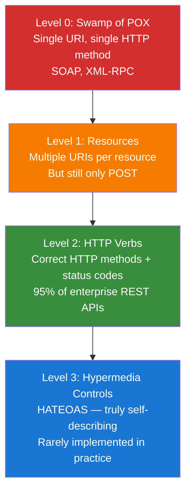
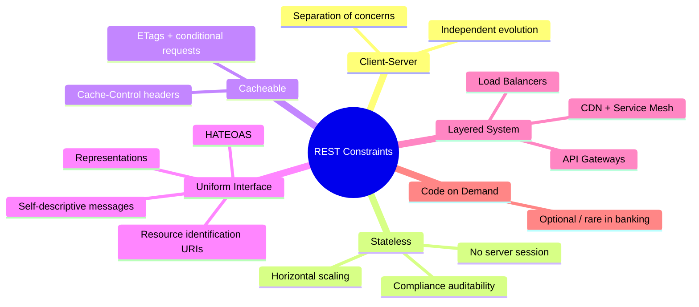
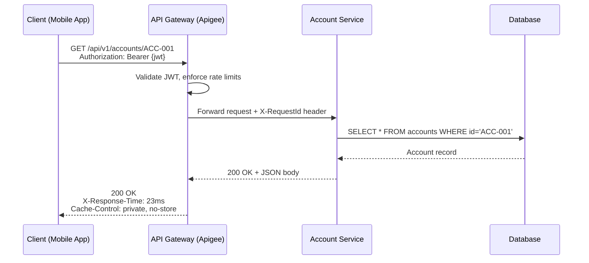

# REST Fundamentals & Architectural Principles

## Overview

REST (Representational State Transfer) is an architectural style for distributed hypermedia systems, introduced by Roy Fielding in his 2000 doctoral dissertation. REST is not a protocol or a standard — it is a set of architectural constraints that, when applied, yield scalability, simplicity, modifiability, visibility, and reliability.

For interviews at JP Morgan, UBS, or Goldman Sachs, REST fundamentals reveal not just whether you CAN build APIs, but whether you understand *why* certain design choices matter at scale.

---

## Foundational Concepts

### What is REST?

| Word | Meaning |
|---|---|
| **Representational** | Data transferred as a *representation* of a resource (JSON, XML) |
| **State** | The state of the resource at a given moment |
| **Transfer** | State transferred between client and server via representations |

REST is **not**:
- A protocol (HTTP is the protocol)
- A standard (no REST RFC exists)
- The same as "HTTP API"

### Roy Fielding's Dissertation

Fielding's 2000 dissertation (UC Irvine) analysed the WWW's architecture and distilled its success into six constraints. He was not inventing REST — he was *describing* the web's existing architecture. Crucially, Fielding co-authored HTTP/1.1, so REST and HTTP were designed together.

---

## Technical Deep Dive: REST Architectural Constraints

### 1. Client-Server
**Constraint**: UI concerns (client) separated from data/logic (server).

**Why it matters**: Enables independent evolution — the mobile app team can redesign UI without touching the API. The backend team can swap databases without affecting clients.

**Banking example**: Trading platform React UI and iOS mobile app both consume the same Account API. Redesigning the mobile app doesn't change the API contract.

### 2. Statelessness
**Constraint**: Each request must contain ALL information needed. Server stores NO client session state between requests.

**Why it matters**:
- **Scalability**: Any server in a cluster handles any request (no sticky sessions)
- **Reliability**: Server failure doesn't lose client state
- **Visibility**: Each request is independently loggable/auditable for compliance
- **Simplicity**: No complex distributed session management

**Implication**: Auth state must be in every request (JWT tokens, API keys, certificates).

### 3. Cacheability
**Constraint**: Responses must define themselves as cacheable or non-cacheable.

**Banking example**: 
- Reference data (currency codes, branch data): `Cache-Control: max-age=3600` ✅
- Account balances: `Cache-Control: no-store` — must never be cached ❌

### 4. Uniform Interface
The central REST constraint. Four sub-constraints:

**4a. Resource Identification**: Resources identified by URIs, separate from their representation.
```
URI:            /api/v1/accounts/ACC-001
Resource:       The bank account with ID ACC-001
Representation: {"id":"ACC-001","balance":50000.00,"currency":"GBP"}
```

**4b. Resource Manipulation Through Representations**: Clients hold representations and use them to modify resources (PUT/PATCH).

**4c. Self-Descriptive Messages**: HTTP methods, headers (Content-Type, Accept), status codes provide all processing metadata. No out-of-band knowledge needed.

**4d. HATEOAS**: Responses include hypermedia links to related actions/resources.
```json
{
  "id": "ACC-001",
  "balance": 50000.00,
  "_links": {
    "self":         { "href": "/api/v1/accounts/ACC-001" },
    "transactions": { "href": "/api/v1/accounts/ACC-001/transactions" },
    "transfer":     { "href": "/api/v1/accounts/ACC-001/transfers", "method": "POST" },
    "close":        { "href": "/api/v1/accounts/ACC-001", "method": "DELETE" }
  }
}
```

### 5. Layered System
**Constraint**: Client cannot tell if connected to origin server or an intermediary.

**Banking architecture layers**:
1. **API Gateway** (Apigee/Kong) — authentication, rate limiting, routing
2. **Load Balancer** — traffic distribution across service instances
3. **CDN** — edge caching for reference data
4. **Security Proxy/WAF** — OWASP inspection
5. **Service Mesh** (Istio) — mTLS between microservices

### 6. Code on Demand (Optional)
Servers can send executable code (JS, WebAssembly) to extend client capability. Rarely used in banking APIs due to security constraints.

---

## Richardson Maturity Model (RMM)



| Level | URIs | HTTP Methods | Status Codes | HATEOAS |
|---|---|---|---|---|
| 0 (Swamp) | Single | POST only | Minimal | ❌ |
| 1 (Resources) | Multiple | POST only | Minimal | ❌ |
| 2 (HTTP Verbs) | Multiple | GET/POST/PUT/DELETE | Full | ❌ |
| 3 (Hypermedia) | Multiple | GET/POST/PUT/DELETE | Full | ✅ |

**Interview insight**: "Most enterprise APIs are Level 2 — this is the honest, pragmatic answer. HATEOAS adds complexity with limited tooling support and is rarely justified for tightly-coupled bank client applications."

---

## REST vs SOAP vs GraphQL vs gRPC

| Dimension | REST | SOAP | GraphQL | gRPC |
|---|---|---|---|---|
| Protocol | HTTP | HTTP/SMTP | HTTP | HTTP/2 |
| Format | JSON/XML | XML only | JSON | Protocol Buffers |
| Schema | OpenAPI (optional) | WSDL (required) | GraphQL Schema | .proto files |
| Type Safety | Weak | Strong | Strong | Very Strong |
| Browser Support | ✅ | ⚠️ | ✅ | ❌ |
| Streaming | SSE/WebSockets | ❌ | Subscriptions | ✅ Native |
| HTTP Caching | ✅ Native | ❌ Complex | ❌ POST-based | ❌ Custom |
| Banking Usage | External APIs (dominant) | Legacy/mainframe | Internal/BFF | Internal microservices |

---

## Resources vs Representations

**Resource**: An abstract conceptual entity (Account ACC-001).
**Representation**: A serialised snapshot in a specific format (JSON, XML, CSV).

The same account resource returns different representations:
```http
GET /api/v1/accounts/ACC-001
Accept: application/json
→ {"id":"ACC-001","balance":50000.00,"currency":"GBP"}

GET /api/v1/accounts/ACC-001
Accept: application/xml
→ <account><id>ACC-001</id><balance>50000.00</balance></account>

GET /api/v1/accounts/ACC-001
Accept: text/csv
→ ACC-001,50000.00,GBP,SAVINGS
```

### Common Banking API Content Types

| Content Type | Usage |
|---|---|
| `application/json` | Standard REST APIs |
| `application/xml` | Legacy/SWIFT integrations |
| `application/hal+json` | HATEOAS with HAL format |
| `application/problem+json` | RFC 7807 error responses |
| `text/csv` | Bulk transaction exports |
| `multipart/form-data` | KYC document uploads |

---

## Visual Representations

### REST Constraints Mind Map


### HTTP Request/Response Flow


---

## Code Examples

### Spring Boot REST Controller (Level 2)

```java
package com.bank.accounts.controller;

import com.bank.accounts.dto.*;
import com.bank.accounts.service.AccountService;
import jakarta.validation.Valid;
import org.springframework.http.ResponseEntity;
import org.springframework.web.bind.annotation.*;
import org.springframework.web.servlet.support.ServletUriComponentsBuilder;
import java.net.URI;

@RestController                          // @Controller + @ResponseBody
@RequestMapping("/api/v1/accounts")      // URI path versioning
public class AccountController {

    private final AccountService accountService;

    // Constructor injection — preferred for testability
    public AccountController(AccountService accountService) {
        this.accountService = accountService;
    }

    // GET — Safe + Idempotent + Cacheable
    @GetMapping("/{accountId}")
    public ResponseEntity<AccountResponse> getAccount(@PathVariable String accountId) {
        return accountService.findById(accountId)
                .map(ResponseEntity::ok)
                .orElse(ResponseEntity.notFound().build()); // 404 if not found
    }

    // POST — NOT idempotent. Returns 201 Created + Location header
    @PostMapping
    public ResponseEntity<AccountResponse> createAccount(
            @Valid @RequestBody CreateAccountRequest request) {
        AccountResponse created = accountService.create(request);
        URI location = ServletUriComponentsBuilder
                .fromCurrentRequest()
                .path("/{id}")
                .buildAndExpand(created.getId())
                .toUri();
        return ResponseEntity.created(location).body(created); // 201 + Location
    }

    // PUT — Idempotent, full replacement
    @PutMapping("/{accountId}")
    public ResponseEntity<AccountResponse> updateAccount(
            @PathVariable String accountId,
            @Valid @RequestBody UpdateAccountRequest request) {
        return ResponseEntity.ok(accountService.update(accountId, request));
    }

    // DELETE — Idempotent. Returns 204 No Content
    @DeleteMapping("/{accountId}")
    public ResponseEntity<Void> closeAccount(@PathVariable String accountId) {
        accountService.close(accountId);
        return ResponseEntity.noContent().build(); // 204
    }
}
```

### curl Examples
```bash
# GET account
curl -X GET https://api.bank.com/api/v1/accounts/ACC-001 \
  -H "Authorization: Bearer eyJ..." \
  -H "Accept: application/json"

# POST create account — returns 201 + Location header
curl -X POST https://api.bank.com/api/v1/accounts \
  -H "Authorization: Bearer eyJ..." \
  -H "Content-Type: application/json" \
  -d '{"customerId":"CUST-123","accountType":"SAVINGS","currency":"GBP","initialDeposit":1000.00}'
# Response: Location: /api/v1/accounts/ACC-002

# DELETE account — returns 204
curl -X DELETE https://api.bank.com/api/v1/accounts/ACC-001 \
  -H "Authorization: Bearer eyJ..."
```

---

## Interview Questions & Model Answers

### Q1: What is REST and who invented it?
**Answer**: REST is an architectural style for distributed hypermedia systems, defined by Roy Fielding in his 2000 PhD dissertation at UC Irvine. Fielding also co-authored HTTP/1.1. REST describes six constraints that, when satisfied, yield scalable, evolvable distributed systems. It's not a protocol, standard, or framework — it's a design philosophy.

*Interviewer trap*: "Is every HTTP API RESTful?" — **No.** Many HTTP APIs violate statelessness (server sessions) or uniform interface (verb URIs like `/getAccount`).

### Q2: Explain the statelessness constraint and its implications.
**Answer**: Statelessness means the server holds zero client context between requests. Every request must be self-contained — authentication, parameters, body. This enables: horizontal scaling (any server handles any request), fault tolerance (server crash doesn't lose state), compliance auditability (each request independently logged). Trade-off: request tokens add overhead, managed via compact JWT formats and HTTP/2 compression.

### Q3: Richardson Maturity Model — where do enterprise APIs sit?
**Answer**: Level 2 — they use multiple resource URIs with correct HTTP methods and status codes, but rarely implement HATEOAS (Level 3). HATEOAS adds complexity with limited tooling. Bank clients are tightly coupled to known API contracts, making dynamic discovery less valuable. The pragmatic trade-off is Level 2 with comprehensive OpenAPI specs.

### Q4: What is HATEOAS and when is it worth implementing?
**Answer**: HATEOAS (Hypermedia as the Engine of Application State) means API responses include links to related states/actions. Like browsing a website — you follow links, don't memorise URLs. HATEOAS is worth it when: clients are generic HTTP clients (not app-specific), the API has complex workflows with branching state machines, or API discoverability is important for third-party partners. In practice, most enterprise banking APIs use Level 2 with documented API contracts instead.

### Q5: Resource vs representation — explain the distinction.
**Answer**: A resource is an abstract conceptual entity (Account ACC-001). A representation is a serialised snapshot in a specific format. The URI identifies the resource; Content-Type negotiation selects the representation. One resource can produce JSON for REST clients, XML for legacy SWIFT, CSV for bulk exports — all via the same URI with different Accept headers. This is the Uniform Interface constraint in practice.

### Q6: How does the Layered System constraint benefit banking?
**Answer**: It allows transparent intermediaries between client and server. In banking: API Gateway handles auth/rate limiting, Load Balancer distributes traffic, CDN caches reference data, WAF inspects for OWASP threats, Service Mesh provides mTLS between microservices. The mobile app communicates with one endpoint, unaware of this infrastructure. The layers can be added, scaled, or replaced without client changes — critical for zero-downtime deployments.

### Q7: REST vs SOAP — when use SOAP in banking?
**Answer**: SOAP for: legacy mainframe integration (core banking SOAP interfaces), WS-Security (message-level digital signatures for SWIFT), WS-ReliableMessaging (guaranteed delivery), formal WSDL contracts. REST for: external partner APIs, mobile backends, microservices. Many banks use a "strangler fig" pattern: REST APIs as front-end with anti-corruption layers translating to legacy SOAP backends.

### Q8: Design a RESTful URL for payment transactions.
**Answer**:
```
POST   /api/v1/accounts/{accountId}/payments          # Initiate payment
GET    /api/v1/accounts/{accountId}/payments           # List payments
GET    /api/v1/accounts/{accountId}/payments/{payId}   # Get payment status
DELETE /api/v1/accounts/{accountId}/payments/{payId}   # Cancel scheduled payment
GET    /api/v1/payments/{payId}/audit-trail            # Cross-account audit
```
Resources are nouns, not verbs. Hierarchy reflects domain model. Versioning via URI path for visibility and routing simplicity.

---

## Common Pitfalls & Best Practices

### Anti-Patterns
1. **Verbs in URIs**: `/getAccount`, `/createUser`, `/deleteOrder/123` — violates Uniform Interface
2. **Not truly stateless**: Server-side sessions with JSESSIONID cookies — kills horizontal scaling
3. **One status code for all**: Returning 200 OK for errors — clients can't handle errors properly
4. **Deep URI nesting**: `/api/v1/banks/{bankId}/branches/{branchId}/customers/{custId}/accounts/{accId}/transactions/{txId}` — prefer flat resources with filters
5. **Confusing REST with microservices**: REST is API style; microservices is deployment style

### Best Practices
1. Design **resources** not **operations** — think nouns, not verbs
2. Use HTTP **semantics** correctly — GET is safe+idempotent, POST is not
3. Return **useful status codes** — 201 Created with Location, 422 for validation errors, not always 400
4. **Version from day one** — adding `/v2/` later is a breaking change
5. Document your **maturity level** — honest Level 2 beats dishonest Level 3

---

## Key Takeaways

- **REST = six constraints, not a protocol** — architectural style defined by Fielding in 2000
- **Statelessness enables horizontal scaling** — most impactful constraint for cloud-native systems
- **Most enterprise APIs are Richardson Level 2** — HTTP verbs + status codes, no HATEOAS
- **HATEOAS is theoretically ideal but pragmatically rare** — document this trade-off in interviews
- **Uniform Interface is REST's differentiator** from RPCs and SOAP
- **HTTP and REST were co-designed** — Fielding authored both
- **Layered architecture is a REST feature, not a workaround** — API Gateways, CDNs are REST-compliant

---

## Further Reading
- [Roy Fielding's Dissertation (2000)](https://www.ics.uci.edu/~fielding/pubs/dissertation/top.htm)
- [Richardson Maturity Model — Martin Fowler](https://martinfowler.com/articles/richardsonMaturityModel.html)
- RFC 9110: HTTP Semantics (2022)
- "RESTful Web APIs" — Richardson & Amundsen (O'Reilly)
- "REST API Design Rulebook" — Mark Massé (O'Reilly)
