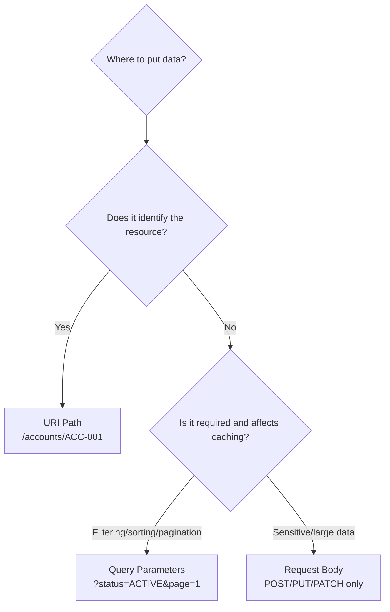
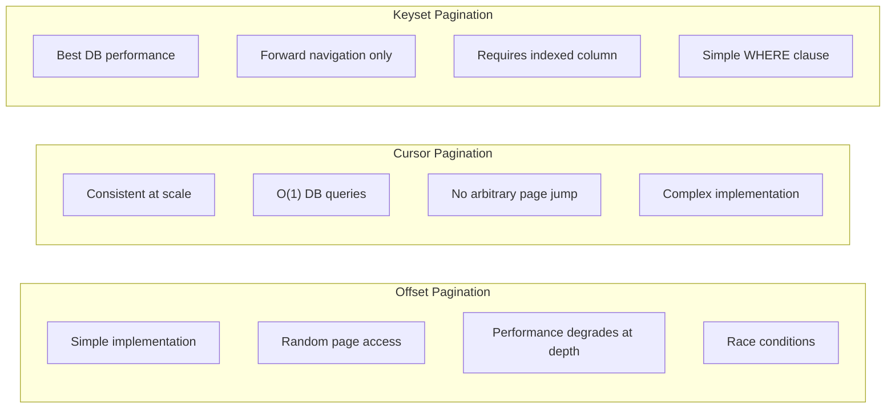

# API Design Best Practices

## Overview

API design is where 13+ years of engineering experience becomes visible. Anyone can expose a CRUD endpoint; an expert designs APIs that are intuitive, evolvable, secure, and performant — APIs that stand the test of 5+ years of changing requirements without breaking clients.

At Staff/Principal Engineer level in banking, interview questions on API design test your ability to make and justify design decisions: URI conventions, pagination strategies, error formats, HATEOAS trade-offs. These decisions have direct impact on developer productivity, system scalability, and regulatory compliance.

---

## URI Design Principles

### Resource Naming Conventions

**Golden Rule**: URIs identify **resources** (nouns), not **actions** (verbs).

```
✅ GOOD                              ❌ BAD
/api/v1/accounts                     /api/v1/getAccounts
/api/v1/accounts/ACC-001             /api/v1/account/retrieve?id=ACC-001
/api/v1/accounts/ACC-001/transactions /api/v1/getTransactionsForAccount/ACC-001
POST /api/v1/payments                 POST /api/v1/executePayment
DELETE /api/v1/accounts/ACC-001       GET /api/v1/closeAccount?id=ACC-001
```

**Plural resource names**: Use plural for collections, singular for individual resources:
```
/api/v1/accounts         ← Collection of accounts
/api/v1/accounts/ACC-001 ← Single account resource
/api/v1/customers        ← Collection
/api/v1/customers/CUST-123/accounts ← Accounts belonging to a customer
```

**Hierarchical relationships**:
```
/api/v1/accounts/{accountId}/transactions        ← Transactions for an account
/api/v1/accounts/{accountId}/beneficiaries       ← Beneficiaries on an account
/api/v1/payments/{paymentId}/audit-trail         ← Audit trail for a payment
```

**Avoid deep nesting** (>3 levels). Instead of:
```
/api/v1/banks/{bankId}/branches/{branchId}/customers/{custId}/accounts/{accId}/transactions
```
Flatten using query parameters:
```
/api/v1/transactions?accountId=ACC-001&branchId=BR-100
```

### URI Conventions

| Convention | Example | Notes |
|---|---|---|
| Lowercase letters | `/api/v1/accounts` | Case-sensitive by RFC |
| Hyphens for readability | `/api/v1/payment-templates` | Not underscores |
| No file extensions | `/api/v1/accounts` | Not `/api/v1/accounts.json` |
| No trailing slash | `/api/v1/accounts` | Not `/api/v1/accounts/` |
| Resource IDs in path | `/api/v1/accounts/ACC-001` | Not in query string |
| Version in path | `/api/v1/accounts` | Required from day one |

### Path vs Query Parameters vs Request Body



**Path parameters** (`/accounts/{accountId}`): Resource identification, routing, always required.
**Query parameters** (`?status=ACTIVE&page=1`): Optional filtering, sorting, pagination, field selection.
**Request body** (`POST/PUT/PATCH`): Complex data, sensitive data, large payloads.
**Headers** (`Authorization`, `Idempotency-Key`): Cross-cutting concerns, authentication, tracing.

---

## Request/Response Design

### Request Body Design

```json
{
  "accountType": "SAVINGS",
  "currency": "GBP",
  "customerId": "CUST-123",
  "initialDeposit": {
    "amount": 1000.00,
    "currency": "GBP"
  },
  "overdraftFacility": {
    "enabled": true,
    "limit": 2000.00
  }
}
```

**Best practices**:
- Use **camelCase** for field names (JSON convention)
- Use **ISO 8601** for dates: `"2026-02-25T12:00:00Z"`
- Use **strings for monetary amounts** or dedicated amount objects to avoid floating-point precision
- Separate currency from amount: `{"amount": "50000.00", "currency": "GBP"}`
- Make optional fields truly optional (not required with null value)

### Response Body Design: Envelope vs Direct

**Direct response** (simpler, preferred for simple resources):
```json
{
  "id": "ACC-001",
  "balance": "50000.00",
  "currency": "GBP",
  "status": "ACTIVE"
}
```

**Envelope pattern** (for pagination, metadata, consistency):
```json
{
  "data": [{...}, {...}],
  "meta": {
    "totalElements": 1250,
    "totalPages": 63,
    "currentPage": 1,
    "pageSize": 20
  },
  "links": {
    "self": "/api/v1/accounts?page=1&size=20",
    "next": "/api/v1/accounts?page=2&size=20",
    "last": "/api/v1/accounts?page=63&size=20"
  }
}
```

### Error Response Format (RFC 7807 Problem Details)

RFC 7807 defines a standard error format. Spring Boot 3.x/Spring Framework 6 supports this natively.

```json
{
  "type": "https://api.bank.com/problems/insufficient-funds",
  "title": "Insufficient Funds",
  "status": 422,
  "detail": "Account ACC-001 has insufficient funds for transfer of GBP 5000.00. Available balance: GBP 3200.00",
  "instance": "/api/v1/payments/PAY-789",
  "traceId": "550e8400-e29b-41d4-a716-446655440000",
  "timestamp": "2026-02-25T12:00:00Z",
  "errors": [
    {
      "field": "amount",
      "code": "AMOUNT_EXCEEDS_BALANCE",
      "message": "Transfer amount GBP 5000.00 exceeds available balance GBP 3200.00"
    }
  ]
}
```

**Fields**:
- `type`: URI identifying error type (links to documentation)
- `title`: Human-readable short summary (invariant — same for all instances of this error type)
- `status`: HTTP status code (redundant but helpful for clients that lose the status)
- `detail`: Human-readable explanation specific to this occurrence
- `instance`: URI of the specific request that caused the error
- Custom extensions: `traceId`, `timestamp`, `errors` for validation details

---

## Pagination Strategies

### 1. Offset-Based Pagination

```http
GET /api/v1/accounts?page=2&size=20 HTTP/1.1

Response:
{
  "data": [...],
  "meta": {"currentPage": 2, "pageSize": 20, "totalElements": 1250}
}
```

**How it works**: `OFFSET = (page - 1) * size`, `LIMIT = size`
```sql
SELECT * FROM transactions ORDER BY created_at DESC
OFFSET 20 LIMIT 20;
```

**Problems**:
- **Performance**: `OFFSET 10000 LIMIT 20` scans 10,020 rows to return 20
- **Inconsistency**: New inserts during pagination cause duplicate/missing records
- **Not suitable for real-time data**: Transaction ledger keeps inserting

### 2. Cursor-Based Pagination

```http
GET /api/v1/transactions?cursor=eyJpZCI6MTIzfQ==&limit=20 HTTP/1.1

Response:
{
  "data": [...],
  "meta": {"limit": 20},
  "links": {
    "next": "/api/v1/transactions?cursor=eyJpZCI6MTQ0fQ==&limit=20",
    "prev": "/api/v1/transactions?cursor=eyJpZCI6MTAxfQ==&offset=prev"
  }
}
```

**Cursor**: Base64-encoded opaque pointer (e.g., last item's ID or a composite key).
```json
{"id": 123, "createdAt": "2026-02-24T10:00:00Z"}  →  base64 → "eyJpZCI6MTIzfQ=="
```

**Advantages**:
- O(1) database query (index seek, not scan)
- Consistent even with inserts/deletes during pagination
- Scales to billions of rows

**Disadvantages**:
- Cannot jump to arbitrary page
- Complex implementation
- Cursor must be opaque (implementation details hidden)

### 3. Keyset Pagination (Seek Method)

```http
GET /api/v1/transactions?afterId=TXN-123&limit=20 HTTP/1.1
```

```sql
SELECT * FROM transactions
WHERE id > 'TXN-123'
ORDER BY id
LIMIT 20;
```

**Advantages**: Fast with indexed columns. Simple implementation (just a WHERE clause).
**Disadvantages**: Can only navigate forward (or backward with explicit `beforeId`).

### Pagination Strategy Comparison



| Use Case | Recommended Strategy |
|---|---|
| Admin list pages (< 100k rows) | Offset |
| Transaction history (millions of rows) | Keyset/Cursor |
| Real-time feeds with constant inserts | Cursor |
| Report export (sequential) | Keyset |
| Search results with relevance scoring | Offset (Elasticsearch handles depth) |

**Banking preference**: Cursor or keyset for transaction history. Offset for reference data lists.

---

## Filtering, Sorting, and Searching

### Filtering Patterns

**Simple filters**:
```
GET /api/v1/transactions?status=COMPLETED&currency=GBP&type=DEBIT
```

**Range filters** (LHS bracket notation):
```
GET /api/v1/transactions?amount[gte]=1000&amount[lte]=10000&date[gte]=2026-01-01
```

**Multiple values (OR)**:
```
GET /api/v1/transactions?status=COMPLETED,PENDING
```

### Sorting

```
GET /api/v1/transactions?sort=amount:desc,createdAt:asc
GET /api/v1/transactions?sort=-amount,+createdAt  ← Alternative notation
```

**Validation**: Always validate sort field names to prevent SQL injection.

### Field Selection (Sparse Fieldsets)

```
GET /api/v1/accounts/ACC-001?fields=id,balance,currency
Response: {"id":"ACC-001","balance":"50000.00","currency":"GBP"}
```

**Benefits**: Reduces payload size significantly for wide resources. Especially useful for mobile clients.

---

## HATEOAS Implementation

### HAL (Hypertext Application Language)

HAL is the most widely used hypermedia format. Content-Type: `application/hal+json`.

```json
{
  "id": "ACC-001",
  "balance": "50000.00",
  "currency": "GBP",
  "_links": {
    "self": {
      "href": "/api/v1/accounts/ACC-001"
    },
    "transactions": {
      "href": "/api/v1/accounts/ACC-001/transactions{?page,size,sort}",
      "templated": true
    },
    "transfer": {
      "href": "/api/v1/accounts/ACC-001/transfers",
      "method": "POST"
    },
    "statement": {
      "href": "/api/v1/accounts/ACC-001/statement{?from,to}",
      "templated": true
    }
  },
  "_embedded": {
    "recentTransactions": [
      { "id": "TXN-456", "amount": "-120.00", "_links": {"self": {"href": "/api/v1/transactions/TXN-456"}} }
    ]
  }
}
```

---

## Code Examples

### Spring Boot — RFC 7807 Problem Details

```java
package com.bank.api.exception;

import org.springframework.http.*;
import org.springframework.web.bind.annotation.*;
import org.springframework.web.bind.MethodArgumentNotValidException;
import jakarta.validation.ConstraintViolationException;

// Global exception handler for all controllers
@RestControllerAdvice
public class GlobalExceptionHandler {

    // Bean validation failure (@Valid annotation)
    @ExceptionHandler(MethodArgumentNotValidException.class)
    public ProblemDetail handleValidation(MethodArgumentNotValidException ex) {
        ProblemDetail problem = ProblemDetail.forStatusAndDetail(
            HttpStatus.UNPROCESSABLE_ENTITY,
            "Request validation failed"
        );
        problem.setType(URI.create("https://api.bank.com/problems/validation-error"));
        problem.setTitle("Validation Error");

        // Field-level validation errors
        List<Map<String, String>> fieldErrors = ex.getBindingResult()
            .getFieldErrors().stream()
            .map(fe -> Map.of(
                "field", fe.getField(),
                "code", fe.getCode(),
                "message", fe.getDefaultMessage()
            )).toList();

        problem.setProperty("errors", fieldErrors);
        problem.setProperty("traceId", MDC.get("traceId"));
        return problem;
    }

    // Business rule violations
    @ExceptionHandler(InsufficientFundsException.class)
    public ProblemDetail handleInsufficientFunds(InsufficientFundsException ex,
                                                  HttpServletRequest request) {
        ProblemDetail problem = ProblemDetail.forStatusAndDetail(
            HttpStatus.UNPROCESSABLE_ENTITY, ex.getMessage()
        );
        problem.setType(URI.create("https://api.bank.com/problems/insufficient-funds"));
        problem.setTitle("Insufficient Funds");
        problem.setInstance(URI.create(request.getRequestURI()));
        problem.setProperty("availableBalance", ex.getAvailableBalance());
        problem.setProperty("requestedAmount", ex.getRequestedAmount());
        return problem;
    }

    // Resource not found
    @ExceptionHandler(ResourceNotFoundException.class)
    public ProblemDetail handleNotFound(ResourceNotFoundException ex) {
        ProblemDetail problem = ProblemDetail.forStatusAndDetail(
            HttpStatus.NOT_FOUND, ex.getMessage()
        );
        problem.setType(URI.create("https://api.bank.com/problems/resource-not-found"));
        return problem;
    }
}
```

### Spring Boot — Pagination with Cursor

```java
package com.bank.transactions.controller;

import org.springframework.web.bind.annotation.*;
import java.util.Base64;

@RestController
@RequestMapping("/api/v1/accounts/{accountId}/transactions")
public class TransactionController {

    @GetMapping
    public ResponseEntity<TransactionPage> listTransactions(
            @PathVariable String accountId,
            @RequestParam(required = false) String cursor,      // Opaque cursor
            @RequestParam(defaultValue = "20") int limit,
            @RequestParam(required = false) String sort,
            @RequestParam(required = false) String status,
            @RequestParam(required = false) @DateTimeFormat(iso = DateTimeFormat.ISO.DATE)
                    LocalDate dateFrom,
            @RequestParam(required = false) @DateTimeFormat(iso = DateTimeFormat.ISO.DATE)
                    LocalDate dateTo) {

        // Decode cursor if provided
        TransactionCursor decodedCursor = cursor != null
            ? decodeCursor(cursor)
            : null;

        // Fetch limit+1 to know if there's a next page
        List<Transaction> transactions = transactionService
            .findByAccount(accountId, decodedCursor, limit + 1, status, dateFrom, dateTo);

        boolean hasNext = transactions.size() > limit;
        if (hasNext) transactions = transactions.subList(0, limit);

        // Encode next cursor from last item
        String nextCursor = hasNext
            ? encodeCursor(transactions.get(transactions.size() - 1))
            : null;

        TransactionPage page = TransactionPage.builder()
            .data(transactions)
            .meta(PageMeta.builder().limit(limit).hasNext(hasNext).build())
            .links(buildLinks(accountId, nextCursor, limit))
            .build();

        return ResponseEntity.ok(page);
    }

    private String encodeCursor(Transaction tx) {
        String raw = String.format("{\"id\":\"%s\",\"createdAt\":\"%s\"}",
            tx.getId(), tx.getCreatedAt());
        return Base64.getUrlEncoder().encodeToString(raw.getBytes());
    }

    private TransactionCursor decodeCursor(String cursor) {
        try {
            String json = new String(Base64.getUrlDecoder().decode(cursor));
            return objectMapper.readValue(json, TransactionCursor.class);
        } catch (Exception e) {
            throw new IllegalArgumentException("Invalid cursor format");
        }
    }
}
```

### Spring HATEOAS

```java
package com.bank.accounts.controller;

import org.springframework.hateoas.*;
import org.springframework.hateoas.server.mvc.WebMvcLinkBuilder;

@RestController
@RequestMapping("/api/v1/accounts")
public class AccountHateoasController {

    @GetMapping("/{accountId}")
    public EntityModel<AccountResponse> getAccount(@PathVariable String accountId) {
        AccountResponse account = accountService.findById(accountId)
            .orElseThrow(() -> new ResourceNotFoundException("Account not found: " + accountId));

        return EntityModel.of(account,
            // Self link
            WebMvcLinkBuilder.linkTo(
                WebMvcLinkBuilder.methodOn(AccountHateoasController.class)
                    .getAccount(accountId)).withSelfRel(),
            // Transactions link
            WebMvcLinkBuilder.linkTo(
                WebMvcLinkBuilder.methodOn(TransactionController.class)
                    .listTransactions(accountId, null, 20, null, null, null, null))
                .withRel("transactions"),
            // Transfer link
            WebMvcLinkBuilder.linkTo(
                WebMvcLinkBuilder.methodOn(PaymentController.class)
                    .initiateTransfer(accountId, null))
                .withRel("transfer")
        );
    }

    @GetMapping
    public CollectionModel<EntityModel<AccountResponse>> listAccounts() {
        List<EntityModel<AccountResponse>> accounts = accountService.findAll()
            .stream()
            .map(account -> EntityModel.of(account,
                WebMvcLinkBuilder.linkTo(
                    WebMvcLinkBuilder.methodOn(this.getClass())
                        .getAccount(account.getId())).withSelfRel()))
            .toList();

        return CollectionModel.of(accounts,
            WebMvcLinkBuilder.linkTo(
                WebMvcLinkBuilder.methodOn(this.getClass()).listAccounts()).withSelfRel());
    }
}
```

### curl Examples

```bash
# Filtered, sorted, paginated transaction list (cursor-based)
curl -X GET "https://api.bank.com/api/v1/accounts/ACC-001/transactions?limit=20&status=COMPLETED&sort=createdAt:desc" \
  -H "Authorization: Bearer eyJ..."

# Get next page using cursor from previous response
curl -X GET "https://api.bank.com/api/v1/accounts/ACC-001/transactions?cursor=eyJpZCI6MTIzfQ%3D%3D&limit=20" \
  -H "Authorization: Bearer eyJ..."

# Sparse field selection
curl -X GET "https://api.bank.com/api/v1/accounts/ACC-001?fields=id,balance,currency" \
  -H "Authorization: Bearer eyJ..."

# Filter with range
curl -X GET "https://api.bank.com/api/v1/transactions?amount%5Bgte%5D=1000&date%5Bgte%5D=2026-01-01" \
  -H "Authorization: Bearer eyJ..."
```

---

## Interview Questions & Model Answers

### Q1: Design RESTful APIs for a payment system
**Answer**:
```
# Account operations
GET    /api/v1/accounts                          # List customer accounts
POST   /api/v1/accounts                          # Open new account
GET    /api/v1/accounts/{accountId}              # Get account details
PUT    /api/v1/accounts/{accountId}              # Update account settings
DELETE /api/v1/accounts/{accountId}              # Close account

# Transaction operations
GET    /api/v1/accounts/{accountId}/transactions # Transaction history
POST   /api/v1/payments                          # Initiate payment (→ 202 Accepted)
GET    /api/v1/payments/{paymentId}              # Payment status
DELETE /api/v1/payments/{paymentId}              # Cancel scheduled payment

# Beneficiaries
GET    /api/v1/accounts/{accountId}/beneficiaries
POST   /api/v1/accounts/{accountId}/beneficiaries
DELETE /api/v1/accounts/{accountId}/beneficiaries/{beneficiaryId}
```
Design rationale: Account is the aggregate root. Payments are first-class resources (separate from accounts) as they cross account boundaries.

### Q2: Offset vs cursor pagination — when to use each?
**Answer**: 
- **Offset**: Use when total count is needed (UI shows "Page 3 of 63"), dataset is < 100k rows, random page access is required. Simple to implement. Problem: degrades at depth (OFFSET 10000 scans 10020 rows), race conditions with real-time data.
- **Cursor**: Use for large datasets (millions of transactions), real-time data with constant writes, when performance is critical. Consistent regardless of concurrent inserts. Cannot jump to arbitrary page.

**Banking**: Transaction history → cursor (millions of records, constant inserts, forward navigation only needed). Admin account list → offset (smaller dataset, total count useful for pagination UI).

### Q3: What is RFC 7807 and why should you use it?
**Answer**: RFC 7807 "Problem Details for HTTP APIs" defines a standard JSON/XML format for error responses. Format: `type` (URI), `title` (invariant string), `status` (HTTP status), `detail` (occurrence-specific), `instance` (URI of the failing request), plus extensions.

**Why important**: Consistent error format enables client libraries to parse all errors the same way. `type` URI allows documentation links. Extensions (field-level errors, traceId) make errors actionable. Spring Boot 3.x/Spring Framework 6 supports `ProblemDetail` natively.

**Anti-pattern to avoid**: Different error formats from different endpoints, or returning `{"error": "something went wrong"}` with no actionable detail.

### Q4: How would you handle monetary amounts in API design?
**Answer**: Never use floating-point for money. Options:
1. **String representation**: `"amount": "50000.00"` — avoids float precision issues, transparent
2. **Integer minor units**: `"amountPence": 5000000` (pence for GBP) — JSON-safe, compact, needs documentation
3. **Amount object**: `{"value": "50000.00", "currency": "GBP"}` — most explicit, currency always paired with amount

Banking APIs should use the amount object pattern. ISO 4217 for currencies. Amounts as strings. Never `"amount": 50000.0` — JavaScript parses floating-point inconsistently.

### Q5: Should you use path, query params, or body for filtering?
**Answer**: 
- **Path parameters**: Identify the resource (`/accounts/ACC-001`). If it's part of the resource identity, it's a path param.
- **Query parameters**: Optional filtering, sorting, pagination. Don't affect resource identity. Cacheable (included in cache key by default). `?status=ACTIVE&sort=createdAt:desc`
- **Headers**: Cross-cutting concerns (auth, tracing, content negotiation). Not visible in URLs.
- **Body**: Never for filtering in GET requests (GET body has undefined semantics in HTTP/1.1). Use body only for POST/PUT/PATCH complex data.

---

## Common Pitfalls & Best Practices

### Anti-Patterns
1. **Verbs in URIs**: `POST /api/v1/executePayment` — makes versioning and routing complex
2. **Using query parameters for resource identity**: `GET /api/v1/account?id=ACC-001` — hides the resource hierarchy
3. **Inconsistent naming**: `/api/v1/account` (singular) vs `/api/v1/customers` (plural)
4. **Floating decimal for money**: `"amount": 50000.0` — JavaScript drops trailing zero, float precision issues
5. **Deep URI nesting**: More than 3 levels makes refactoring painful
6. **No pagination on collection endpoints**: `/api/v1/transactions` returning all records — OOM and timeout risk

### Best Practices
1. **Design the API contract first** (API-first) before implementing
2. **Use RFC 7807** for all error responses consistently
3. **Cursor pagination** for all real-time, high-volume collection endpoints
4. **Sparse fieldsets** support for mobile client bandwidth optimisation
5. **All monetary amounts** as strings with explicit currency field

---

## Key Takeaways

- **URIs identify resources (nouns), not actions (verbs)** — fundamental design principle
- **422 for business validation, 400 for structural validation** — important status code distinction
- **RFC 7807 Problem Details** is the standard error format — Spring Boot 3.x supports it natively
- **Cursor pagination over offset for high-volume data** — transaction history must use cursor/keyset
- **Monetary amounts must be strings or integer minor units** — never IEEE 754 floats
- **Sparse fieldsets reduce mobile bandwidth** — `?fields=id,balance` is a cheap optimisation
- **HATEOAS is Level 3 REST but rarely justified** — Level 2 with OpenAPI docs is pragmatic choice

---

## Further Reading
- RFC 7807: Problem Details for HTTP APIs — [https://www.rfc-editor.org/rfc/rfc7807](https://www.rfc-editor.org/rfc/rfc7807)
- RFC 8288: Web Linking (Link header pagination)
- [REST API Design — Best Practices](https://www.vinaysahni.com/best-practices-for-a-pragmatic-restful-api)
- "API Design Patterns" — JJ Geewax (Manning)
- [Microsoft REST API Guidelines](https://github.com/microsoft/api-guidelines)
- [Google API Design Guide](https://cloud.google.com/apis/design)
