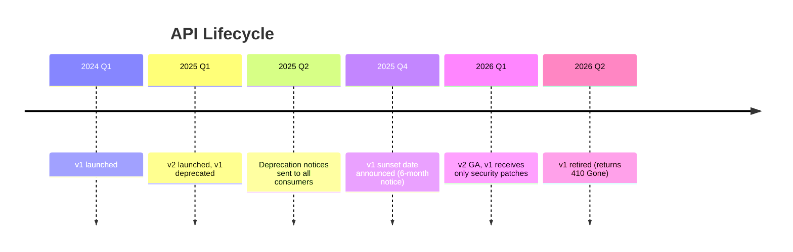

# API Versioning Strategies

## Overview

API versioning is one of the most frequently debated topics in API design, and one of the most revealing interview questions. Having a versioning strategy signals that you think about API evolution proactively — that you understand APIs as living contracts with consumers who depend on stability.

In enterprise banking, an API may have dozens of consuming applications: mobile apps, trading platforms, third-party fintechs (via Open Banking), internal microservices, batch processing jobs, and regulatory reporting systems. Breaking any one of these in production can trigger SLA breaches, regulatory incidents, and customer impact.

**Core principle**: An API is a promise. Versioning is how you keep that promise while evolving.

---

## Foundational Concepts

### What is a Breaking vs Non-Breaking Change?

**Breaking changes** (require version bump):
- Removing a field from response
- Renaming a field (`amount` → `transactionAmount`)
- Changing a field's data type (`String` → `Number`)
- Adding a required request parameter
- Changing HTTP method for an endpoint
- Changing status codes (200 → 201)
- Removing an endpoint
- Changing authentication scheme

**Non-breaking changes** (backward-compatible, no version bump):
- Adding a new optional field to response
- Adding a new optional request parameter with default
- Adding a new endpoint
- Adding a new enum value (⚠️ — tolerant reader handling needed)
- Relaxing validation constraints (min length 10 → min length 5)
- Adding a new HTTP method to an existing resource

---

## Versioning Approaches

### 1. URI Path Versioning (Industry Standard)

```http
GET /api/v1/accounts/ACC-001 HTTP/1.1
GET /api/v2/accounts/ACC-001 HTTP/1.1
```

**Pros**:
- ✅ Immediately visible in URL — easy to test in browser/curl
- ✅ Easy to route at API gateway level
- ✅ Easy to log and monitor by version
- ✅ Can run v1 and v2 simultaneously with different service instances
- ✅ Developer-friendly (no header manipulation required)

**Cons**:
- ❌ Violates REST principle (URI should identify resource, not version of representation)
- ❌ Version "pollution" in URIs
- ❌ `Cache-Control` includes URI in cache key — no cache sharing between versions

**Banking reality**: URI path versioning is the dominant approach in enterprise banking APIs. Practical visibility and routing simplicity outweigh theoretical REST purity.

```
https://api.bank.com/api/v1/accounts
https://api.bank.com/api/v2/accounts   ← New version, v1 still running
```

### 2. Query Parameter Versioning

```http
GET /api/accounts/ACC-001?version=2 HTTP/1.1
GET /api/accounts/ACC-001?api-version=2025-01-01 HTTP/1.1
```

**Pros**:
- ✅ Clean resource URIs
- ✅ Version is optional (defaults to current or latest)
- ✅ Backward-compatible rollout

**Cons**:
- ❌ Cache complications (query params in cache key)
- ❌ Easy to forget in client requests
- ❌ Complex routing (can't route by URL prefix)
- ❌ Version may be stripped by intermediaries

**Example**: Azure REST APIs use `?api-version=2024-07-01`.

### 3. Header Versioning

```http
GET /api/accounts/ACC-001 HTTP/1.1
Accept: application/vnd.bank.accounts.v2+json

# Or custom header:
GET /api/accounts/ACC-001 HTTP/1.1
API-Version: 2
```

**Pros**:
- ✅ Clean URIs — same URL regardless of version
- ✅ Most "RESTful" approach (representation negotiation, not URI versioning)
- ✅ Same URL can serve multiple versions via content negotiation

**Cons**:
- ❌ Not visible in URL — harder to test in browser
- ❌ Headers may be stripped by intermediaries
- ❌ Complicates API gateway routing (must inspect headers)
- ❌ Swagger/OpenAPI tooling support is limited

**Vendor Media Type format**: `application/vnd.{company}.{resource}.v{version}+{format}`
```
application/vnd.bank.accounts.v2+json
application/vnd.bank.payments.v1+json
```

### 4. Date-Based Versioning

```http
GET /api/accounts/ACC-001 HTTP/1.1
Stripe-Version: 2024-06-20
```

Stripe uses this approach. The version is a date string, and the API evolves while maintaining each client's pinned version.

**Pros**:
- ✅ Familiar from Stripe — well-proven approach
- ✅ Associates version with point in time (useful for changelogs)

**Cons**:
- ❌ Unusual for enterprise banking
- ❌ Custom implementation required

### Versioning Strategy Comparison

```mermaid
graph TB
    subgraph URI["URI Path (/v1/)"]
        direction TB
        U1[✅ Visible, routable]
        U2[✅ Browser testable]
        U3[❌ Not truly RESTful]
        U4[Industry favourite]
    end
    subgraph QP["Query Param (?version=2)"]
        direction TB
        Q1[✅ Optional fallback]
        Q2[❌ Cache complications]
        Q3[❌ Easy to forget]
        Q4[Azure API style]
    end
    subgraph Header["Header (Accept: vnd.v2)"]
        direction TB
        H1[✅ Clean URIs]
        H2[✅ Most RESTful]
        H3[❌ Hidden from URL]
        H4[❌ Tooling gaps]
    end
```



| Approach | Visibility | REST Purity | Routing | Tooling | Banking Fit |
|---|---|---|---|---|---|
| URI Path (`/v1/`) | ✅ High | ❌ Low | ✅ Easy | ✅ Good | ✅ Best |
| Query Param | ✅ Medium | ✅ Medium | ⚠️ Complex | ✅ Good | ⚠️ OK |
| Header | ❌ Low | ✅ High | ⚠️ Complex | ❌ Limited | ❌ Poor |

---

## Technical Deep Dive

### Semantic Versioning for APIs

Following SemVer (`MAJOR.MINOR.PATCH`) adapted for APIs:
- **MAJOR** (v1 → v2): Breaking changes. Consumers must migrate.
- **MINOR** (v1.1 → v1.2): Non-breaking additions (new optional fields, new endpoints).
- **PATCH** (v1.1.0 → v1.1.1): Bug fixes with no contract change.

In URI path versioning, typically only major version is in the URI: `/api/v2/accounts`. Minor/patch changes are non-breaking and don't require new version.

### Deprecation & Sunset Strategy

API deprecation is a formal process with client obligations and SLA commitments.



**Sunset header (RFC 8594)**:
```http
HTTP/1.1 200 OK
Deprecation: Sat, 01 Mar 2025 00:00:00 GMT
Sunset: Sat, 01 Mar 2026 00:00:00 GMT
Link: <https://api.bank.com/docs/migration/v1-to-v2>; rel="deprecation"
```

Clients that monitor response headers see the deprecation and sunset dates, and the migration guide URL.

### Consumer-Driven Contract Testing

Rather than guessing what changes are breaking, use contract testing:

1. **Consumers** define a contract (what they use from the API)
2. **Provider** runs contract tests to verify it still satisfies all consumer contracts
3. Changes that break any consumer contract require version bump

**Tools**: Pact framework, Spring Cloud Contract.

```
Consumer (mobile app) defines:
  GET /api/v1/accounts/{id}
  → Must return: id, balance, currency, status
  → Does NOT require: internalCode, auditFields

Provider adds field 'internalCode': Not a breaking change (consumer doesn't use it)
Provider removes field 'status': Breaking change (consumer uses it) → v2 required
```

---

## Code Examples

### Spring Boot — Parallel Version Support

```java
package com.bank.accounts.controller;

// Version 1 controller
@RestController
@RequestMapping("/api/v1/accounts")
public class AccountControllerV1 {

    @GetMapping("/{accountId}")
    public ResponseEntity<AccountResponseV1> getAccount(@PathVariable String accountId) {
        Account account = accountService.findById(accountId);
        // V1 response: simple format
        return ResponseEntity.ok(AccountResponseV1.from(account));
    }
}

// Version 2 controller — new response format with nested address, links
@RestController
@RequestMapping("/api/v2/accounts")
public class AccountControllerV2 {

    @GetMapping("/{accountId}")
    public ResponseEntity<AccountResponseV2> getAccount(@PathVariable String accountId) {
        Account account = accountService.findById(accountId);
        // V2 response: enriched format with monetary object + HAL links
        return ResponseEntity.ok(AccountResponseV2.from(account));
    }
}
```

### V1 vs V2 Response Comparison

```java
// V1 Response (legacy flat format)
public record AccountResponseV1(
    String id,
    String customerId,
    BigDecimal balance,          // Plain decimal — problematic for float precision
    String currency,
    String accountType,
    String status
) {}

// V2 Response (improved format — backward-incompatible changes)
public record AccountResponseV2(
    String id,
    String customerId,
    MonetaryAmount balance,      // Nested object with amount + currency
    String accountType,
    AccountStatus status,        // Enum with I8N display mapping
    AccountHolder holder,        // New nested holder info
    List<Link> links             // HATEOAS links added
) {
    public record MonetaryAmount(String value, String currency) {}
    public record AccountHolder(String name, String sortCode) {}
}
```

### Deprecation Headers Filter

```java
package com.bank.api.filter;

import jakarta.servlet.*;
import jakarta.servlet.http.HttpServletRequest;
import jakarta.servlet.http.HttpServletResponse;

@Component
@Order(1)
public class DeprecationHeaderFilter implements Filter {

    @Override
    public void doFilter(ServletRequest req, ServletResponse res, FilterChain chain)
            throws IOException, ServletException {

        HttpServletRequest request = (HttpServletRequest) req;
        HttpServletResponse response = (HttpServletResponse) res;

        // Add deprecation headers for all /api/v1/* requests
        if (request.getRequestURI().startsWith("/api/v1/")) {
            response.setHeader("Deprecation",
                "Sat, 01 Mar 2025 00:00:00 GMT");
            response.setHeader("Sunset",
                "Sat, 01 Mar 2026 00:00:00 GMT");
            response.setHeader("Link",
                "<https://api.bank.com/docs/migration/v1-to-v2>; rel=\"deprecation\"");
        }

        chain.doFilter(req, res);
    }
}
```

### curl Examples

```bash
# Test v1 endpoint
curl https://api.bank.com/api/v1/accounts/ACC-001 \
  -H "Authorization: Bearer eyJ..." \
  -v 2>&1 | grep -E "(Deprecation|Sunset|Link)"
# > Deprecation: Sat, 01 Mar 2025 00:00:00 GMT
# > Sunset: Sat, 01 Mar 2026 00:00:00 GMT

# Test v2 endpoint
curl https://api.bank.com/api/v2/accounts/ACC-001 \
  -H "Authorization: Bearer eyJ..."
# → No deprecation headers

# Header-versioned API (if using Accept header approach)
curl https://api.bank.com/api/accounts/ACC-001 \
  -H "Authorization: Bearer eyJ..." \
  -H "Accept: application/vnd.bank.accounts.v2+json"
```

---

## Interview Questions & Model Answers

### Q1: What are the main API versioning strategies and which would you choose for a bank?
**Answer**: Four main strategies: URI path (`/v1/`), query parameter (`?version=2`), Accept header (`vnd.company.v2+json`), date-based (`API-Version: 2024-01-01`).

For enterprise banking, I would choose **URI path versioning** because:
1. Immediately visible in logs, monitoring dashboards, API gateway routing rules
2. Browser-testable without special tooling
3. Easy for API gateway to route different versions to different service deployments
4. Industry standard — most developers expect it
5. Works perfectly with OpenAPI tooling

The theoretical REST argument for header versioning is valid but pragmatically outweighed by operational benefits.

### Q2: What is a breaking change vs backward-compatible change?
**Answer**: A **breaking change** forces existing clients to update or break:
- Removing/renaming a response field
- Changing a field's data type
- Adding a required request parameter
- Changing endpoint URL structure, HTTP method, or status code

A **backward-compatible change** can be deployed without client updates:
- Adding new optional response fields (clients ignore unknown fields)
- Adding new optional request parameters with defaults
- Adding new endpoints
- Relaxing validation constraints

**Interview nuance**: Adding a new enum value is technically backward-compatible but can break strongly-typed clients that don't handle unknown enum values. Use "tolerant reader" pattern (ignore unknown enum values).

### Q3: How would you deprecate a v1 API and migrate clients to v2?
**Answer**:
1. **Launch v2** — both v1 and v2 run in parallel
2. **Communicate proactively** — alert all API consumers via developer portal, email, changelog
3. **Add deprecation headers** — `Deprecation` and `Sunset` headers (RFC 8594) on all v1 responses
4. **Migration guide** — document every changed field in v1→v2 changelog
5. **Provide tooling** — code examples, SDK updates, migration scripts
6. **Monitor adoption** — track v1 traffic in API gateway metrics
7. **Grace period** — minimum 6-12 months for banking APIs (longer for regulatory clients)
8. **Final sunset** — change v1 to return 410 Gone on sunset date

Banking-specific consideration: Regulatory clients (auditors, regulators) may have fixed integration schedules — provide at least 12-month notice.

### Q4: What is consumer-driven contract testing?
**Answer**: Contract testing is where API consumers define the contract they depend on (specific fields, response formats), and the provider runs automated tests to verify every consumer's contract is still satisfied before deployment.

**Pact workflow**:
1. Consumer writes Pact test specifying what response fields it expects
2. Pact generates a "pact file" recording the contract
3. Before provider deploys, it runs "provider verification" against all consumer pacts
4. If any consumer pact breaks, deployment blocked

**Advantage over integration tests**: Discovers breaking changes before production, without running all services simultaneously. Especially valuable in microservices where different teams own different services.

### Q5: How do you handle versioning in a microservices architecture?
**Answer**: Each microservice owns its own API version independently. Key decisions:
1. **Version at service boundary** — API gateway routes `/api/v2/accounts/*` to account-service-v2
2. **Consumer-driven contracts** — each consuming service has pact tests against the provider
3. **Independent deployability** — v1 and v2 of account service can run simultaneously during migration
4. **Avoid chain breaking** — if Account API v2 changes, what services consume Account API? Update their contracts too.

**API Gateway routing**:
```
/api/v1/accounts/* → account-service:8081
/api/v2/accounts/* → account-service:8082 (new deployment)
/api/v1/payments/* → payment-service:8083
```

### Q6: What is the Sunset header and why does it matter?
**Answer**: The `Sunset` header (RFC 8594) indicates when an API version will stop being available. Format: `Sunset: Sat, 01 Mar 2026 00:00:00 GMT`. Paired with `Deprecation` header (when deprecation started) and `Link` header pointing to migration documentation.

**Why important**: Clients that monitor response headers can automatically alert their teams before the sunset date. Rather than discovering breakage in production, teams can proactively plan migration. In banking, SLA obligations may require 3-6 months notice for API retirements.

---

## Common Pitfalls & Best Practices

### Anti-Patterns
1. **No versioning from day one**: Adding `/v2/` after clients already use `/` is a bigger breaking change than the feature that required v2
2. **Too many versions simultaneously**: Maintaining v1, v2, v3, v4 creates significant operational overhead. Retire old versions aggressively.
3. **Breaking changes without version bump**: Removing/renaming fields in "minor" updates
4. **Silent deprecation**: Retiring APIs without notification. Legally/contractually problematic in Open Banking contexts.
5. **Year-based eternal support**: Promising "we'll never break v1" — impossible guarantee

### Best Practices
1. **Version from day one** — `/api/v1/` from the first deployment
2. **Deprecation headers on every v1 response** — automated, not manual
3. **Consumer-driven contract tests** — prevent breaking changes from reaching production
4. **Min 6-month sunset notice** — 12 months for regulatory/partner APIs
5. **API changelog** — document every change in a public changelog with v1→v2 migration guide
6. **Monitor version adoption** — track v1 vs v2 traffic in API gateway; can't retire until v1 traffic < threshold

---

## Key Takeaways

- **URI path versioning is the enterprise banking standard** — visibility and routing simplicity win over REST purity
- **Non-breaking = backward-compatible = no version bump** — adding optional fields is always safe
- **Breaking changes require major version bump and migration period** — minimum 6 months notice
- **RFC 8594 Sunset header** is the standardised way to communicate API retirement
- **Consumer-driven contracts catch breaking changes before production** — Pact or Spring Cloud Contract
- **Every API must be versioned from day one** — retrofitting `/v1/` after clients are live is painful
- **Monitor version adoption in API gateway metrics** — prerequisite to safe retirement

---

## Further Reading
- RFC 8594: The Sunset HTTP Header Field — [https://www.rfc-editor.org/rfc/rfc8594](https://www.rfc-editor.org/rfc/rfc8594)
- [Microsoft API Versioning Guidelines](https://github.com/microsoft/api-guidelines/blob/vNext/azure/Guidelines.md#versioning)
- [Stripe's API versioning](https://stripe.com/blog/api-versioning) — date-based versioning in practice
- [Pact Contract Testing Framework](https://pact.io/)
- [Spring Cloud Contract](https://spring.io/projects/spring-cloud-contract)
- "API Change Management" — Fielding & Taylor
