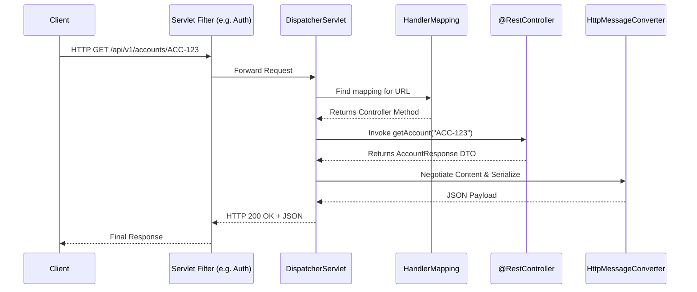

# REST API Implementation with Spring Boot

## Overview

While REST is a language-agnostic architectural style, Spring Boot has become the de facto standard for implementing enterprise REST APIs in the Java ecosystem. For a Senior/Staff Engineer in banking, simply knowing how to annotate a method with `@GetMapping` is not enough. You must understand the internal mechanics: how Spring translates HTTP semantics into Java method calls, how message converters handle content negotiation, how to structure global error handling conforming to RFC 7807, and when to adopt reactive paradigms.

Interviewers look for engineers who can write production-grade, secure, and resilient Spring Boot code that adheres to both REST principles and banking regulatory standards, rather than toy examples.

---

## Foundational Concepts

### Dispelling Spring MVC Myths

**Myth 1: Spring Boot is a web framework.**
*Reality*: Spring Boot is a convention-over-configuration auto-configuration engine. The actual REST implementation relies on **Spring Web MVC** (imperative, servlet-based) or **Spring WebFlux** (reactive, non-blocking).

**Myth 2: `@RestController` makes an API RESTful.**
*Reality*: `@RestController` merely combines `@Controller` and `@ResponseBody`. It tells Spring to bind the method return value directly to the HTTP response body instead of resolving a view template. It does not enforce REST constraints (statelessness, hypermedia, appropriate status codes).

**Myth 3: You must use DTOs for everything.**
*Reality*: While using Data Transfer Objects (DTOs) to decouple API representations from JPA entities is an enterprise best practice, Spring doesn't strictly enforce it. However, returning JPA entities directly is highly discouraged in banking due to security (leaking internal structures) and performance (N+1 query problems during serialization).

---

## Technical Deep Dive

### Spring MVC REST Controllers

#### Annotations Breakdown

- **`@RestController`**: Indicates that the class handles REST requests. Every method automatically serializes its return value to the HTTP response body.
- **Mapping Annotations**: `@GetMapping`, `@PostMapping`, `@PutMapping`, `@PatchMapping`, `@DeleteMapping` correspond to standard HTTP methods. Use the `path` or `value` attributes to define URIs.
- **Request Extraction**:
  - `@PathVariable`: Extracts values from the URI pattern (e.g., `/accounts/{accountId}`). Crucial for resource identification.
  - `@RequestParam`: Extracts query string parameters (e.g., `?status=ACTIVE`). Used for filtering, pagination, sorting.
  - `@RequestBody`: Deserializes the HTTP request body (JSON/XML) into a Java object.
  - `@RequestHeader`: Extracts specific HTTP headers (e.g., `Idempotency-Key`).

#### Handling Status Codes in Spring

By default, Spring returns `200 OK` for successful method execution without an uncaught exception. For REST compliance, you must explicitly manage status codes:

1.  **`ResponseEntity<T>`**: The most flexible approach. Allows setting body, headers, and status code dynamically. Essential for things like returning a `201 Created` with a `Location` header.
2.  **`@ResponseStatus`**: Can be applied to methods or custom exception classes. Good for simple scenarios, but inflexible.
3.  **`ResponseStatusException`**: A programmatic way to throw an exception with a specific status code (since Spring 5).

### Exception Handling & Problem Details (RFC 7807)

Proper error handling is non-negotiable. Exposing a raw stack trace to an API consumer is a severe security risk and a horrible developer experience.

#### The Hierarchy of Exception Handling
1.  **Method Level**: `try-catch` block inside the controller. (Avoid: litters business logic with HTTP concerns).
2.  **Controller Level**: `@ExceptionHandler` within the specific controller.
3.  **Global Level (Best Practice)**: `@RestControllerAdvice` combined with `@ExceptionHandler`. Provides centralized error mapping across all controllers.

#### RFC 7807: Problem Details for HTTP APIs
Spring Framework 6 (Spring Boot 3) introduced native support for RFC 7807 via the `ProblemDetail` class and the `ErrorResponse` interface. This standardizes error responses with standard fields: `type`, `title`, `status`, `detail`, and `instance`.

### Request Validation (Bean Validation)

Never trust client input. In banking, invalid data can lead to security breaches or regulatory violations. Spring Boot integrates with Hibernate Validator (Jakarta Bean Validation JSR-380).

**Key Annotations**:
- `@Valid` or `@Validated`: Triggers validation on method arguments.
- `@NotNull`, `@NotBlank`: Ensures fields are present.
- `@Size(min=, max=)`, `@Min`, `@Max`: Boundary checks.
- `@Pattern(regexp=...)`: Validates against regular expressions (e.g., checking ISO currency code formats).

**Exception Mapping**: Validation failures throw `MethodArgumentNotValidException`, which must be caught in the `@RestControllerAdvice` to translate field-level errors into a user-friendly response.

### Content Negotiation and Message Converters

Content negotiation determines which representation (e.g., JSON, XML) is returned to the client based on the `Accept` header.

Spring relies on `HttpMessageConverter`s to serialize/deserialize objects.
- **Jackson**: The default for JSON (`MappingJackson2HttpMessageConverter`).
- **JAXB / Jackson XML**: Used for XML, common in legacy banking integrations.

**Customizing Jackson**:
- `@JsonProperty("bank_code")`: Changes the JSON key name.
- `@JsonIgnore`: Prevents sensitive fields (like passwords) from being serialized.
- `@JsonFormat(pattern="yyyy-MM-dd")`: Formats dates.
- `@JsonInclude(Include.NON_NULL)`: Omits null fields from the response, reducing payload size.

### Spring HATEOAS

Spring HATEOAS provides APIs to create REST Level 3 representations by adding hypermedia links.
- **`RepresentationModel`**: Base class for adding links to your DTOs.
- **`WebMvcLinkBuilder`**: A utility to dynamically build links by inspecting the controller mappings, rather than hardcoding URLs.
- **HAL (Hypertext Application Language)**: The default format used by Spring HATEOAS (`application/hal+json`).

*Note: While powerful, HATEOAS is rarely used strictly in banking APIs over Level 2 REST with OpenAPI documentation, due to client complexity.*

### Reactive REST APIs (Spring WebFlux)

Enterprise banks process thousands of concurrent requests (payments, market data feeds). Spring WebFlux (based on Project Reactor) provides a non-blocking, event-loop driven alternative to Spring MVC's thread-per-request model.

- **`Mono<T>`**: Emits 0 or 1 item (e.g., getting a single account).
- **`Flux<T>`**: Emits 0 to N items (e.g., streaming a list of transactions or a continuous price feed).

**When to use WebFlux**: High-concurrency scenarios, streaming data, API gateways.
**When NOT to use WebFlux**: When consuming blocking dependencies (e.g., traditional JDBC relational databases). If any step blocks, the event loop blocks, destroying performance.

---

## Visual Representations

### Spring MVC Request Processing Lifecycle



### MVC vs. WebFlux Threading Model

```mermaid
graph TD
    subgraph Spring Web MVC (Thread-per-Request)
        A1[Request 1] --> T1[Thread 1] --> DB1[Blocking DB Call]
        A2[Request 2] --> T2[Thread 2] --> DB2[Blocking API Call]
        A3[Request 3] --> T3[Thread 3 - Wait in Pool]
    end
    
    subgraph Spring WebFlux (Event Loop)
        B1[Request 1] --> EL[Event Loop Thread]
        B2[Request 2] --> EL
        EL --> |Non-blocking| R2[R2DBC / WebClient]
        R2 --> |Callback/Event| EL
    end
```

---

## Code Examples

### 1. Robust REST Controller (Level 2)

This example demonstrates proper status code management, header utilization, and validation in a banking context.

```java
package com.bank.api.controller;

import com.bank.api.dto.AccountResponse;
import com.bank.api.dto.CreateAccountRequest;
import com.bank.api.service.AccountService;
import jakarta.validation.Valid;
import org.springframework.http.HttpStatus;
import org.springframework.http.ResponseEntity;
import org.springframework.web.bind.annotation.*;
import org.springframework.web.servlet.support.ServletUriComponentsBuilder;

import java.net.URI;

@RestController
@RequestMapping("/api/v1/accounts")
public class AccountController {

    private final AccountService accountService;

    // Best Practice: constructor injection
    public AccountController(AccountService accountService) {
        this.accountService = accountService;
    }

    /**
     * Retrieves an account.
     * Uses Service that returns Optional. Maps correctly to 200 or 404.
     */
    @GetMapping("/{accountId}")
    public ResponseEntity<AccountResponse> getAccount(@PathVariable String accountId) {
        return accountService.findById(accountId)
                .map(ResponseEntity::ok)
                .orElseGet(() -> ResponseEntity.notFound().build());
    }

    /**
     * Creates an account (POST).
     * Must return 201 Created and a Location header pointing to the new resource.
     * @Valid ensures CreateAccountRequest is validated before method execution.
     */
    @PostMapping
    public ResponseEntity<AccountResponse> createAccount(
            @RequestHeader(value = "Idempotency-Key", required = false) String idempotencyKey,
            @Valid @RequestBody CreateAccountRequest request) {
            
        AccountResponse createdAccount = accountService.createAccount(request, idempotencyKey);

        // Best Practice: Build location dynamically based on current request
        URI location = ServletUriComponentsBuilder
            .fromCurrentRequest()
            .path("/{id}")
            .buildAndExpand(createdAccount.id())
            .toUri();

        return ResponseEntity.created(location).body(createdAccount);
    }
    
    /**
     * Closes an account (DELETE).
     * Returns 204 No Content for a successful deletion.
     */
    @DeleteMapping("/{accountId}")
    public ResponseEntity<Void> closeAccount(@PathVariable String accountId) {
        accountService.closeAccount(accountId);
        return ResponseEntity.noContent().build();
    }
}
```

### 2. Global Exception Handling (RFC 7807 Problem Details)

Spring Boot 3 native support for RFC 7807 using `@RestControllerAdvice`.

```java
package com.bank.api.exception;

import org.springframework.http.HttpStatus;
import org.springframework.http.ProblemDetail;
import org.springframework.http.ResponseEntity;
import org.springframework.web.bind.MethodArgumentNotValidException;
import org.springframework.web.bind.annotation.ExceptionHandler;
import org.springframework.web.bind.annotation.RestControllerAdvice;
import org.springframework.web.context.request.WebRequest;

import java.net.URI;
import java.time.Instant;
import java.util.List;
import java.util.stream.Collectors;

@RestControllerAdvice
public class GlobalExceptionHandler {

    // 1. Handling Business Exceptions (e.g., Insufficient Funds)
    @ExceptionHandler(BusinessRuleViolationException.class)
    public ProblemDetail handleBusinessRuleViolation(BusinessRuleViolationException ex, WebRequest request) {
        ProblemDetail problem = ProblemDetail.forStatusAndDetail(HttpStatus.UNPROCESSABLE_ENTITY, ex.getMessage());
        problem.setType(URI.create("https://developer.bank.com/errors/business-rule-violation"));
        problem.setTitle("Business Rule Violation");
        problem.setProperty("timestamp", Instant.now());
        problem.setProperty("errorCode", ex.getErrorCode());
        return problem;
    }

    // 2. Handling Resource Not Found
    @ExceptionHandler(ResourceNotFoundException.class)
    public ProblemDetail handleResourceNotFound(ResourceNotFoundException ex) {
        ProblemDetail problem = ProblemDetail.forStatusAndDetail(HttpStatus.NOT_FOUND, ex.getMessage());
        problem.setType(URI.create("https://developer.bank.com/errors/not-found"));
        problem.setTitle("Resource Not Found");
        return problem;
    }

    // 3. Handling Validation Errors (MethodArgumentNotValidException)
    @ExceptionHandler(MethodArgumentNotValidException.class)
    public ProblemDetail handleValidationExceptions(MethodArgumentNotValidException ex) {
        ProblemDetail problem = ProblemDetail.forStatusAndDetail(HttpStatus.BAD_REQUEST, "Validation failed for request body.");
        problem.setType(URI.create("https://developer.bank.com/errors/invalid-request"));
        problem.setTitle("Invalid Request");
        
        // Extract field-level errors
        List<ValidationError> errors = ex.getBindingResult().getFieldErrors().stream()
                .map(error -> new ValidationError(error.getField(), error.getDefaultMessage()))
                .collect(Collectors.toList());
        
        problem.setProperty("invalidParams", errors);
        return problem;
    }

    record ValidationError(String field, String message) {}
}
```

### 3. Request Validation (DTO)

```java
package com.bank.api.dto;

import jakarta.validation.constraints.DecimalMin;
import jakarta.validation.constraints.NotBlank;
import jakarta.validation.constraints.NotNull;
import jakarta.validation.constraints.Pattern;

import java.math.BigDecimal;

public record CreateAccountRequest(
    @NotBlank(message = "Customer ID is required")
    String customerId,

    @NotBlank(message = "Account Product Type is required")
    @Pattern(regexp = "^(SAVINGS|CURRENT|CREDIT)$", message = "Invalid account type")
    String accountType,

    @NotBlank(message = "Currency code is required")
    @Pattern(regexp = "^[A-Z]{3}$", message = "Currency must be a valid 3-letter ISO code")
    String currency,

    @NotNull(message = "Initial deposit amount must be provided")
    @DecimalMin(value = "0.00", message = "Initial deposit cannot be negative")
    BigDecimal initialDeposit
) {}
```

---

## Real-World Enterprise Scenarios

### Scenario: API Gateway Offloading

**Context**: A banking microservices ecosystem relies heavily on Spring Boot applications deployed behind an API Gateway (e.g., Kong or Spring Cloud Gateway).
**Implication for Spring REST**: 
- **Authentication**: JWT token processing and verification happen at the Gateway. The Spring Boot application only needs to extract the validated headers/claims injected by the Gateway (e.g., `X-User-ID`), avoiding the overhead of deep security configuration logic within the controller.
- **TLS Termination**: The Gateway handles HTTPS. The internal load balancer forwards requests as HTTP to the Spring application. The application must be configured to respect `X-Forwarded-Proto`, `X-Forwarded-Host`, and `X-Forwarded-Port` to generate correct HATEOAS links or pagination URLs via `ServletUriComponentsBuilder`.

### Scenario: Reactive Payment Processing (WebFlux)

**Context**: A Payment Gateway service receives millions of transaction updates per second from a core banking engine and distributes them to analytics services.
**Execution**: Spring WebFlux is utilized. The controller method returns a `Flux<PaymentEvent>` with a `MediaType.APPLICATION_NDJSON_VALUE` (Newline Delimited JSON). This keeps memory footprint extremely low, processing a stream of events reactively rather than loading large arrays of payment objects into memory (which would cause massive Garbage Collection pauses).

---

## Interview Questions & Model Answers

### Q1: What is the difference between `@Controller` and `@RestController` in Spring?
**Answer**: `@Controller` is an essential component in the traditional Spring MVC flow where methods typically return a String representing a View name (like a Thymeleaf template). If you want to return a JSON payload, you must annotate the specific method with `@ResponseBody`. `@RestController` is a convenience composed annotation that combines `@Controller` and `@ResponseBody`. It instructs Spring that every method inside the class will serialize its output directly into the HTTP response body, bypassing view resolution completely.

### Q2: How do you return a 201 Created status and a Location header when creating a resource in Spring Boot?
**Answer**: Instead of returning the created object directly, return a `ResponseEntity<T>`. You use the `ServletUriComponentsBuilder.fromCurrentRequest().path("/{id}").buildAndExpand(createdResource.getId()).toUri()` to dynamically construct the URL of the newly created resource based on the incoming request context. Then, return `ResponseEntity.created(location).body(createdResource);`. This explicitly meets the REST Level 2 requirement for POST requests.

### Q3: How do you handle exceptions globally in a Spring Boot REST API?
**Answer**: By using the `@RestControllerAdvice` annotation combined with `@ExceptionHandler` methods. When an exception is thrown anywhere in the controller layer (or lower layers if uncaught), it bubbles up to the `@RestControllerAdvice` component. The appropriate `@ExceptionHandler` method maps the internal exception (like `ResourceNotFoundException`) to an HTTP status code (404) and serializes a consistent error body, preferably conforming to the RFC 7807 Problem Details specification utilizing Spring 6's `ProblemDetail` class.

### Q4: When would you use Spring WebFlux over standard Spring Web MVC?
**Answer**: Spring Web MVC is perfectly suited for typical CRUD applications and standard enterprise logic that relies on blocking I/O (like traditional relational databases via JDBC). WebFlux, built on Project Reactor, uses an event-loop non-blocking model. I would choose WebFlux for high-concurrency systems (API Gateways), streaming data (Server-Sent Events), or highly concurrent orchestration services where many slow, external API calls are made. Importantly, WebFlux requires the entire stack (including the database driver, e.g., R2DBC) to be non-blocking; introducing a blocking call into a Reactive flow severely degrades performance.

### Q5: How do you ensure Spring HATEOAS links function correctly behind an API Gateway or Load Balancer?
**Answer**: When deploying behind a proxy, the internal application server sees an incoming request to an internal IP and HTTP port, while the client requested a public domain over HTTPS. If HATEOAS generated links based on the internal request, they would be broken. To fix this, you must set `server.forward-headers-strategy=framework` in `application.properties`. This forces Spring to construct absolute URIs using the `X-Forwarded-Host`, `X-Forwarded-Proto`, and `X-Forwarded-Port` headers supplied by the API Gateway.

---

## Common Pitfalls & Best Practices

### Pitfalls
- **Returning Null**: Returning `null` from a controller method produces an empty `200 OK` response. Instead, return `ResponseEntity.notFound().build()` (404) using `Optional`.
- **Exposing Database Entities**: Returning JPA entities (annotated with `@Entity`) directly from a controller can lead to circular reference issues during Jackson serialization, exposure of sensitive fields, and N+1 query problems.
- **Hardcoding URLs**: Building URI strings manually (`"https://auth.bank.com/api/v1/accounts/" + id`) breaks across environments. Always use `UriComponentsBuilder`.

### Best Practices
- **Use DTOs**: Always use dedicated Data Transfer Objects (`CreateAccountRequest`, `AccountResponse`) for inbound and outbound communication. Use Java 16+ `record` types to make them immutable and concise.
- **Constructor Injection**: Inject dependencies (Services) via constructors instead of `@Autowired` fields. This ensures controllers cannot be instantiated without dependencies and facilitates easier unit testing.
- **Fail Fast with Validation**: Utilize `@Valid` on `@RequestBody`. Do not write manual `if (request.getAmount() < 0)` checks in the controller logic if Bean Validation can handle it declaratively.

---

## Comparison Tables

### ResponseEntity vs. @ResponseStatus vs. Exceptions

| Approach | Flexibility | Best Use Case | Drawbacks |
|---|---|---|---|
| **`ResponseEntity<T>`** | High (Status, Headers, Body) | Controller methods (e.g., POST 201 + Location) | Verbose. |
| **`@ResponseStatus`** | Low (Static Status Code) | Simple DELETE methods or annotating Exception classes. | Cannot dynamically set headers or body based on logic. |
| **`@RestControllerAdvice`** | High (Global Error Mapping) | Enforcing standard error payload contracts (RFC 7807). | Disconnects exception throwing from handling context. |

---

## Key Takeaways

-   **`@RestController`** simplifies REST implementation but does not enforce adherence to REST architectural constraints on its own.
-   **Explicit Status Handling**: Return `ResponseEntity` to accurately represent HTTP semantics (e.g., `201 Created` with a `Location` header).
-   **Security via Interfaces**: Separate JPA Database Entities from API responses using **DTOs** to prevent sensitive data leakage.
-   **RFC 7807**: Use `@RestControllerAdvice` and `ProblemDetail` (Spring 6+) to centralize and standardize API error formats.
-   **WebFlux is not a silver bullet**: Choose reactive only when you have high concurrency, streaming needs, and a fully non-blocking architectural stack downstream.

---

## Further Reading
- [Spring Framework Reference: Web on Servlet Stack](https://docs.spring.io/spring-framework/reference/web/webmvc.html)
- [RFC 7807: Problem Details for HTTP APIs](https://datatracker.ietf.org/doc/html/rfc7807)
- [Spring WebFlux Official Documentation](https://docs.spring.io/spring-framework/reference/web/webflux.html)
- [Spring Boot Validation](https://spring.io/guides/gs/validating-form-input/)
