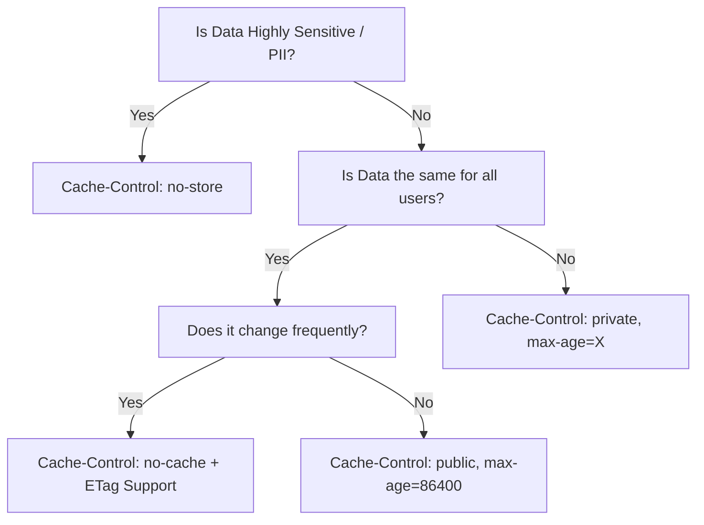
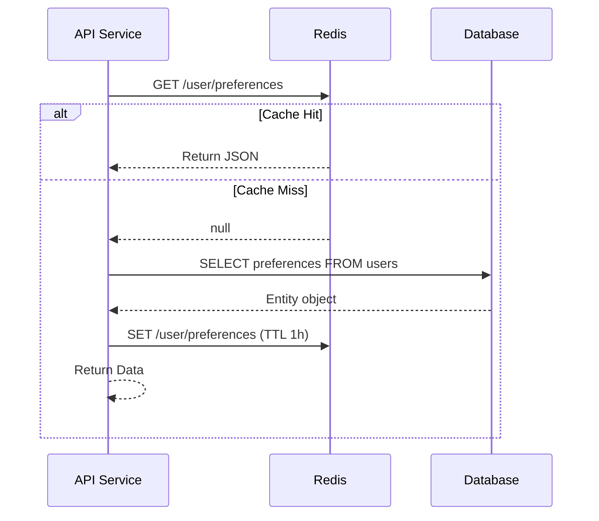

# API Performance & Optimization

## Overview

In enterprise banking/financial services, API performance is directly tied to customer trust, regulatory compliance, and bottom-line revenue. High-frequency trading execution APIs, real-time payment processors, and account aggregation systems have ultra-stringent SLAs (often targeting 99.99% availability with P99 latencies under 50-100ms). 

For a Senior/Principal Engineer, performance tuning isn't just about tweaking JVM flags; it's about holistic system design. It involves placing caches at the right network edges, designing intelligent pagination, minimizing payload sizes, protecting systems from sudden traffic spikes, and utilizing optimal connection management strategies.

---

## Foundational Concepts

### The Hierarchy of Performance Optimizations
1.  **Network/Edge Level**: Prevent requests from ever hitting your servers (CDNs, ETag/Conditional GETs, Edge Caching).
2.  **Application Architecture Level**: Asynchronous processing, pagination, GraphQL-style sparse fieldsets.
3.  **Application Logic Level**: Application-level caching (Redis/Memcached), connection pooling, thread optimization.
4.  **Payload Level**: Compression (GZIP/Brotli), compact serialization formats (JSON vs. Protobuf).

---

## Technical Deep Dive

### 1. HTTP Caching Strategies

HTTP caching is the most effective way to scale REST APIs because it leverages intermediaries (browsers, CDNs, API Gateways) to serve responses without invoking backend logic.

#### The `Cache-Control` Header
The primary mechanism for specifying caching rules.
- `public`: Any cache (browser, proxy, CDN) may store the response.
- `private`: Only the end-user's browser may cache it (no shared proxies).
- `no-cache`: The client can cache, but MUST revalidate with the server using ETags before using the cached copy.
- `no-store`: Absolutely no caching allowed. Mandatory for sensitive data (e.g., account balances, PII).
- `max-age=X`: Time to live in seconds.
- `s-maxage=X`: Time to live in seconds, targeting shared caches (CDNs) specifically.

#### ETags and Conditional Requests
Entity Tags (`ETag`) are identifiers assigned to a specific version of a resource (often a hash of the content or a DB version number). 
1. Server sends `ETag: "v123"`.
2. Client sends sub-sequent request with `If-None-Match: "v123"`.
3. If unchanged, server returns `304 Not Modified` with an empty body, saving massive bandwidth and DB read costs.

### 2. Application-Level Caching

When HTTP caching isn't viable (e.g., internal services or data heavily personalized), application caching is employed.

- **Distributed Caches**: Redis or Memcached. Crucial for load-balanced, stateless APIs.
- **Cache-Aside Pattern**: Application code explicitly requests data from the cache. If a cache miss occurs, the code queries the DB, populates the cache, and returns the data.
- **Cache Invalidation**: "There are only two hard things in Computer Science: cache invalidation and naming things." Use Webhooks or database change data capture (CDC via tools like Debezium) to proactively invalidate stale Redis entries when backend data changes.

### 3. Rate Limiting & Throttling

Protecting the API from "noisy neighbors" and DDoS attacks ensures consistent performance for everyone. 

- **Algorithms**:
  - *Token Bucket*: Allows bursts of traffic up to a maximum bucket size.
  - *Leaky Bucket*: Smooths out traffic into a steady stream.
  - *Fixed Window*: Simple, but suffers from spikes at the window boundaries.
  - *Sliding Window Log/Counter*: Smoothest and most accurate, but memory-intensive.

- **API Headers**: Communicate limits via standard headers: `X-RateLimit-Limit`, `X-RateLimit-Remaining`, `X-RateLimit-Reset`. If limits are exceeded, return `429 Too Many Requests` with a `Retry-After` header.

### 4. Connection Management & Resilience

- **Connection Pools**: Creating new TCP connections to databases or downstream HTTP services is extremely expensive computationally. Use connection pools like **HikariCP** (for DBs) and configure Apache / OkHttp Client connection managers to reuse sockets (HTTP keep-alive).
- **Circuit Breakers**: Use patterns (via libraries like Resilience4j) to short-circuit calls to failing or slow downstream APIs, preventing thread exhaustion in your own service.

### 5. Payload Optimization & Compression

- **Compression**: Apply GZIP or Brotli compression via HTTP headers (`Accept-Encoding: gzip`, `Content-Encoding: gzip`). Vital for text-based formats like JSON. Ensure it only activates over a configurable size threshold (e.g., > 2KB) to save CPU overhead on tiny payloads.
- **Sparse Fieldsets**: Allow clients to request only the fields they need. E.g., `GET /accounts/123?fields=id,balance`. Reduces serialization time and network payload drastically for mobile clients.

---

## Visual Representations

### Caching Strategy Decision Tree



### Application Cache-Aside Flow



---

## Code Examples

### 1. Spring Boot: Implementing ETag and HTTP Caching

Spring `ShallowEtagHeaderFilter` computes an ETag automatically by hashing the response payload. However, for true performance, you should evaluate the ETag *before* querying the database to prevent the DB call entirely (Deep ETag).

```java
package com.bank.api.controller;

import com.bank.api.domain.Account;
import org.springframework.http.CacheControl;
import org.springframework.http.ResponseEntity;
import org.springframework.web.bind.annotation.*;
import org.springframework.web.context.request.WebRequest;

import java.util.concurrent.TimeUnit;

@RestController
@RequestMapping("/api/v1/accounts")
public class AccountCacheController {

    private final AccountService accountService;

    public AccountCacheController(AccountService accountService) {
        this.accountService = accountService;
    }

    @GetMapping("/{id}")
    public ResponseEntity<AccountResponse> getAccount(
            @PathVariable String id, 
            WebRequest webRequest) {
        
        // 1. Fetch lightweight version/hash from DB to construct ETag
        long accountVersion = accountService.getAccountVersionId(id);
        String etag = "W/\"" + accountVersion + "\"";

        // 2. Check client's If-None-Match header
        // If matches, Spring sets 304 Not Modified automatically and returns it.
        if (webRequest.checkNotModified(etag)) {
            // Null return is expected when checkNotModified is true;
            // Spring handles the 304 response.
            return null; 
        }

        // 3. Cache miss: Fetch full heavy entity
        Account account = accountService.getAccountDetails(id);
        
        // 4. Return Data with Cache directives
        return ResponseEntity.ok()
            .eTag(etag)
            // Account data is sensitive, so cache on browser only for a short time
            .cacheControl(CacheControl.maxAge(60, TimeUnit.SECONDS).cachePrivate())
            .body(new AccountResponse(account));
    }
}
```

### 2. Spring Caching Abstraction (Redis)

Requires `@EnableCaching` on the configuration class.

```java
import org.springframework.cache.annotation.Cacheable;
import org.springframework.cache.annotation.CacheEvict;
import org.springframework.stereotype.Service;

@Service
public class CurrencyReferenceService {

    // Automatically check cache "exchangeRates" with key 'currencyPair'
    @Cacheable(value = "exchangeRates", key = "#currencyPair")
    public BigDecimal getExchangeRate(String currencyPair) {
        // Simulating heavy, slow external API call or Complex DB Calculation
        return externalExchangeRateProvider.fetchRate(currencyPair);
    }
    
    // Proactively clear cache when admin updates the rate
    @CacheEvict(value = "exchangeRates", key = "#currencyPair")
    public void updateExchangeRate(String currencyPair, BigDecimal newRate) {
        database.updateRate(currencyPair, newRate);
    }
}
```

---

## Real-World Enterprise Scenarios

### Scenario: The Retail Banking Dashboard Load Limit
**Problem**: When a million customers log in to their mobile banking apps simultaneously on payday ("The Thundering Herd"), the "Dashboard API" aggregates data from Accounts, Credit Cards, and Loans. The underlying mainframe systems get overwhelmed.
**Optimization Solutions**:
1.  **Dumb Caching**: Reference data (branch locations, interest rate products) is cached aggressively via CDN (Akamai/Cloudflare) using `Cache-Control: public, s-maxage=86400`. The API Gateway handles these without passing traffic to Spring.
2.  **Async/BFF**: The Backend-For-Frontend queries the individual services asynchronously using `CompletableFuture` or Spring WebFlux, aggregating the payload rapidly rather than sequentially blocking threads.
3.  **Circuit Breaking**: If the "Rewards System" is slow, the Circuit Breaker trips and returns a fallback empty array for the rewards section, enabling the critical Path (checking balances) to display within 100ms instead of timing out the entire dashboard.

### Scenario: Rate Limiting Payment Initiation
**Problem**: A malicious actor attempts to brute-force a vulnerability by making thousands of micro-payment endpoints requests a second.
**Optimization Solution**:
The API Gateway enacts a strict **Token Bucket** rate limitation policy (e.g., max 10 requests per minute per authenticated user for `/payments`). Requests exceeding this receive `429 Too Many Requests` with a `Retry-After: 60` header. This prevents the costly encryption, database writes, and compliance checks on the backend from being executed unnecessarily.

---

## Interview Questions & Model Answers

### Q1: What is the difference between a Strong ETag and a Weak ETag?
**Answer**: A **Strong ETag** indicates that the resource is byte-for-byte identical. It means the response representation is perfectly preserved, allowing for byte-range caching (useful for partial content / video streaming). A **Weak ETag** (prefixed with `W/`, like `W/"12345"`) implies semantic equivalence—the meaningful data is identical, but the formatting or structure might differ slightly. In most REST APIs handling JSON data, Weak ETags are sufficient and easier to compute based on business entity version numbers.

### Q2: Briefly explain how you would avoid a "Cache Stampede" (Thundering Herd) when a highly accessed cache key expires?
**Answer**: A cache stampede occurs when a popular cache entry (e.g., an aggregated daily exchange rate) expires, and thousands of concurrent requests all miss the cache, hitting the database simultaneously and causing a bottleneck. Solutions include:
1.  **Distributed Locking**: Use a lock (like Redis Redisson) so only the first request queries the DB to regenerate the entry, while others wait for the cache to be populated.
2.  **Probabilistic Early Expiration / Soft TTL**: Recompute the cache in a background thread *before* it strictly expires.
3.  **Stale-While-Revalidate**: Serve the stale data immediately to all users while asynchronously spinning up a thread to fetch fresh data and update the cache.

### Q3: How do you identify whether performance issues are arising from the Spring Boot application or the Database layer?
**Answer**: This is where Application Performance Monitoring (APM) tools (Dynatrace, AppDynamics) and Distributed Tracing (OpenTelemetry) are crucial. I'd look at the trace spans.
- If the span for the DB query is fast, but total request time is high, the issue is Application/Serialization, or JVM limits (Garbage Collection pauses, maxed-out connection pools, exhausted Tomcat threading).
- If the DB query span itself assumes the bulk of the latency, the issue is structural datastore problems (missing indexes, N+1 query structures, or locking issues).

### Q4: Explain Sparse Fieldsets and why they improve API performance.
**Answer**: Sparse Fieldsets let a client tell the API exactly which fields it wants to receive (e.g., `?fields=accountId,balance`). It drastically improves performance in two ways:
1.  **Network Bandwidth**: Reduces payload size, specifically critical for mobile applications on slow cellular networks.
2.  **Compute/DB Load**: If properly implemented down the architectural chain, the backend avoids joining tables or retrieving BLOB columns to construct fields the client doesn't even need, saving heavy backend computational cycles.

---

## Common Pitfalls & Best Practices

### Anti-Patterns
1.  **Caching PII publicly**: Accidental configuration of `Cache-Control: public` on responses containing customer names or balances, causing CDNs to serve User A's data to User B.
2.  **N+1 Query Architectures**: Fetching a list of 100 transactions, then iterating through them to make a separate DB/API call to get the merchant details for each.
3.  **Ignoring Connection Pool sizing**: Using default database pool parameters (like HikariCP's default 10). If you have 200 Tomcat web threads but only 10 DB connections, 190 threads will block waiting for a connection under load.

### Best Practices
1.  **Always set Timeouts**: Never make an HTTP or network call without defining firm connection and read timeouts. Unbounded blocking calls are the #1 cause of cascading failures.
2.  **Enable GZIP for JSON**: Always compress JSON responses above a certain size limit (typically > 1KB).
3.  **Measure Percentiles, not Averages**: When evaluating performance SLAs, monitor P95 and P99 queries. Averages hide outliers and give a false sense of security.

---

## Comparison Tables

### Rate Limiting Algorithms Comparison

| Algorithm | Pros | Cons | Best Use Case |
|---|---|---|---|
| **Fixed Window** | Simple to implement, low memory. | "Spike" problem at window borders. | Simple quota limits (e.g., API pricing tiers daily). |
| **Sliding Window** | Prevents border spikes perfectly. | Memory-intensive to record timestamps. | High-fidelity protection against burst attacks. |
| **Token Bucket** | Smooths out flow while allowing minor bursts. | Complex logic tuning. | API Gateways for stable banking traffic flows. |

---

## Key Takeaways

-   **HTTP Context is King**: Leverage `Cache-Control` properly; the fastest request is the one your server never has to process.
-   **ETags enable 304 Not Modified**: Saves enormous database load payload transmission.
-   **Protect the Infrastructure**: Apply API-Gateway level Rate Limiting (Token Buckets) to prevent unintentional self-induced DDoS attacks.
-   **Connection Defaults are dangerous**: Overriding and tuning thread pools (Tomcat) and database connection pools (HikariCP) is essential for predictable high-load performance.
-   **Measure correctly**: Analyze P95/P99 latencies to ensure reliable customer experience at scale.

---

## Further Reading
- [MDN Web Docs: HTTP Caching](https://developer.mozilla.org/en-US/docs/Web/HTTP/Caching)
- [HikariCP Connection Pool Best Practices](https://github.com/brettwooldridge/HikariCP/wiki/About-Pool-Sizing)
- [Resilience4j Official Documentation](https://resilience4j.readme.io/docs)
- [Rate Limiting Algorithms explained (Stripe Engineering)](https://stripe.com/blog/rate-limiters)
