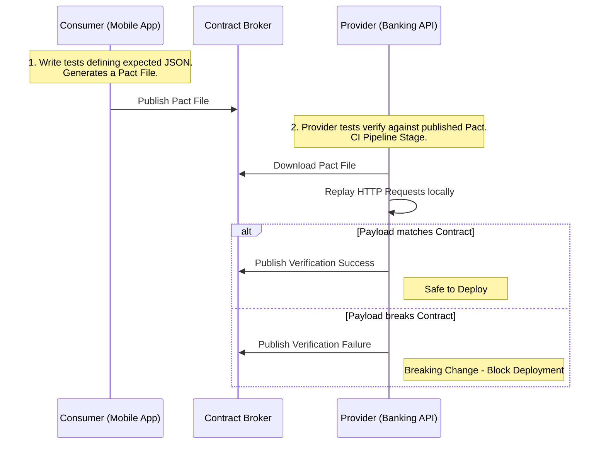

# API Testing Strategies

## Overview

In enterprise banking environments—where a code defect can lead to millions in financial loss and immediate regulatory censure—software testing is uncompromising. Testing REST APIs transitions beyond simply pinging an endpoint and asserting a `200 OK`. It involves rigorous isolation, behavior emulation, simulating network chaos, load benchmarking, and automated security penetration.

For Principal and Staff positions, interviewers assess how you architect the verification pipeline. They expect a "Shift-Left" mindset, emphasizing the "Test Pyramid," Consumer-Driven Contract testing, and containerized integration patterns over manual regression suites.

---

## Foundational Concepts

### The Test Pyramid for APIs

A healthy API test strategy relies heavily on fast integration and unit tests, and minimizes slow, brittle End-to-End browser/UI-driven tests.

1.  **Unit Tests (Fastest, Largest Volume)**: Controller logic, DTO mapping, validations, business services.
2.  **API Integration/Component Tests (Medium Speed)**: Focus on the REST API boundary, DB interactions, and request/response serialization.
3.  **Contract Tests (Fast, Inter-service)**: Verify that the API Provider respects the payload expectations of remote API Consumers.
4.  **End-to-End / Blackbox API Tests (Slow, Smallest Volume)**: Complete system walk-through ensuring configuration, API gateways, and downstream microservices coordinate correctly.

---

## Technical Deep Dive

### 1. Unit Testing REST APIs (Slice Testing in Spring)

In Spring Boot, the `@WebMvcTest` slice isolates the web layer. It disables full application context initialization (no DB, no heavy services), loading only the Controller under test and Spring MVC infrastructure (filters, interceptors, message converters).

- **Tools**: **MockMvc** to simulate HTTP requests and assertions without starting a real servlet container. **Mockito** to mock the underlying business services.
- **Focus**: HTTP status codes, routing constraints, header validation, JSON mapping (Serialization/Deserialization), `@Valid` payload validation.

### 2. Integration Testing

Integration testing requires the API to connect to external lifecycles (Databases, Message Queues). In modern setups, relying on an in-memory database like H2 for testing while running PostgreSQL/Oracle in production is considered an anti-pattern due to dialect differences and false positives.

- **Testcontainers**: The industry standard. Spins up genuine Docker containers (e.g., PostgreSQL, Redis, Kafka) specifically during test execution and tears them down. This ensures complete environment parity.
- **`@SpringBootTest(webEnvironment = WebEnvironment.RANDOM_PORT)`**: Boots the entire application context and a real web server (Tomcat/Jetty) for heavy testing via `TestRestTemplate` or `WebTestClient`.

### 3. Contract Testing

In an architecture with hundreds of microservices, integration testing all services simultaneously is almost impossible. Contract Testing is the solution.

- **Consumer-Driven Contracts (CDC)**: The Consumer (e.g., Mobile App) defines a "contract" specifying exactly what request it sends and what response structure it expects.
- **Provider Verification**: The Provider (The Backend API) pulls these contracts and executes tests against its endpoints locally to ensure it hasn't broken the agreed-upon interface.
- **Frameworks**: **Pact**, **Spring Cloud Contract**. 

CDC strictly answers: *If I deploy my API changes right now, will I break the mobile app?*

### 4. External Dependency Mocking

Your Banking API likely relies on an external Credit Bureau or Swift network API. You cannot reliably test against production third-party APIs during CI runs.

- **WireMock**: A tool for mocking HTTP-based APIs. It acts as a realistic standalone web server during tests that can supply canned JSON responses, simulate network faults, massive latencies, and 500 server errors, verifying how your application's Circuit Breakers react under duress.

### 5. Load and Performance Testing

Will the API survive "Payday Thundering Herds"?

- **Load Testing**: Assessing behavior under expected maximum load.
- **Stress Testing**: Pushing the API beyond its limits to find the breaking point (Memory Leaks, Connection Pool exhaustion).
- **Tools**: **k6.io** (modern, JS-based scripts, excellent integration into CI/CD pipelines), **Gatling** (Scala), **JMeter** (Legacy UI). Focus on Latency Percentiles (P95, P99), not just RPS (Requests Per Second).

### 6. Security Testing

Security must be automated in the pipeline (DevSecOps).

- **DAST (Dynamic Application Security Testing)**: Tools like **OWASP ZAP** spider the API endpoints running in a test environment attempting SQL injection, Cross-Site Scripting (XSS), and testing for misconfigured headers.
- **Authentication Bypass**: Ensuring endpoints properly reject requests lacking valid JWTs or insufficient OAuth scopes.

---

## Visual Representations

### The Consumer-Driven Contract (CDC) Flow



---

## Code Examples

### 1. Spring Boot MockMvc (Web Slice Test)

Testing the Web Layer while completely mocking business logic.

```java
import org.junit.jupiter.api.Test;
import org.springframework.beans.factory.annotation.Autowired;
import org.springframework.boot.test.autoconfigure.web.servlet.WebMvcTest;
import org.springframework.boot.test.mock.mockito.MockBean;
import org.springframework.http.MediaType;
import org.springframework.test.web.servlet.MockMvc;

import static org.mockito.ArgumentMatchers.any;
import static org.mockito.Mockito.when;
import static org.springframework.test.web.servlet.request.MockMvcRequestBuilders.post;
import static org.springframework.test.web.servlet.result.MockMvcResultMatchers.*;

@WebMvcTest(controllers = AccountController.class)
class AccountControllerTest {

    @Autowired
    private MockMvc mockMvc;

    @MockBean
    private AccountService accountService;

    @Test
    void whenPostValidRequest_thenReturns201AndLocationHeader() throws Exception {
        // Arrange
        AccountResponse mockResponse = new AccountResponse("ACC-123", "SAVINGS");
        when(accountService.createAccount(any(), any())).thenReturn(mockResponse);

        String jsonPayload = """
            { "customerId": "CUST-999", "accountType": "SAVINGS", "currency": "GBP", "initialDeposit": 500.00 }
        """;

        // Act & Assert
        mockMvc.perform(post("/api/v1/accounts")
                .contentType(MediaType.APPLICATION_JSON)
                .content(jsonPayload)
                .header("Idempotency-Key", "uuid-xxxx"))
               .andExpect(status().isCreated())
               .andExpect(header().string("Location", "http://localhost/api/v1/accounts/ACC-123"))
               .andExpect(jsonPath("$.id").value("ACC-123"));
    }
    
    @Test
    void whenPostInvalidRequest_thenReturns400WithErrors() throws Exception {
        // Request missing 'currency' triggering Bean Validation error
        String jsonPayload = """
            { "customerId": "CUST-999", "accountType": "SAVINGS", "initialDeposit": 500.00 }
        """;

        mockMvc.perform(post("/api/v1/accounts")
                .contentType(MediaType.APPLICATION_JSON)
                .content(jsonPayload))
               .andExpect(status().isBadRequest())
               .andExpect(jsonPath("$.invalidParams[0].field").value("currency"));
    }
}
```

### 2. Integration Testing with TestContainers

Using a real database (PostgreSQL) loaded into Docker during the test phase.

```java
import org.junit.jupiter.api.Test;
import org.springframework.beans.factory.annotation.Autowired;
import org.springframework.boot.test.context.SpringBootTest;
import org.springframework.boot.test.web.client.TestRestTemplate;
import org.springframework.http.HttpStatus;
import org.springframework.http.ResponseEntity;
import org.testcontainers.containers.PostgreSQLContainer;
import org.testcontainers.junit.jupiter.Container;
import org.testcontainers.junit.jupiter.Testcontainers;

import static org.assertj.core.api.Assertions.assertThat;

@SpringBootTest(webEnvironment = SpringBootTest.WebEnvironment.RANDOM_PORT)
@Testcontainers // JUnit 5 extension to automatically start/stop containers
class AccountIntegrationTest {

    // Bootstraps a real PostgreSQL DB container locally for complete data cycle tests
    @Container
    static PostgreSQLContainer<?> postgres = new PostgreSQLContainer<>("postgres:15-alpine");

    @Autowired
    private TestRestTemplate restTemplate;

    @Test
    void integration_shouldCreateAndRetrieveAccountFullContext() {
        // Create Request (POST)
        CreateAccountRequest request = new CreateAccountRequest("CUST-1", "SAVINGS", "USD", BigDecimal.ZERO);
        ResponseEntity<AccountResponse> postResponse = restTemplate.postForEntity("/api/v1/accounts", request, AccountResponse.class);
        
        assertThat(postResponse.getStatusCode()).isEqualTo(HttpStatus.CREATED);
        String accountId = postResponse.getBody().id();

        // Retrieve the deeply persisted data (GET)
        ResponseEntity<AccountResponse> getResponse = restTemplate.getForEntity("/api/v1/accounts/" + accountId, AccountResponse.class);
        
        assertThat(getResponse.getStatusCode()).isEqualTo(HttpStatus.OK);
        assertThat(getResponse.getBody().customerId()).isEqualTo("CUST-1");
    }
}
```

---

## Real-World Enterprise Scenarios

### Scenario: The Legacy System Timeout
**Context**: A banking API depends on a legacy Mainframe system to query Credit Card authorization status. Under high load, the Mainframe randomly stutters, holding connections open for 30+ seconds without responding.
**Testing Approach**: 
A unit test utilizing a Mock cannot simulate this network anomaly easily. The team introduces **WireMock** into the integration test suite. WireMock is configured to act as the legacy Mainframe and intentionally injects a 60-second delay for specific API calls (`.withFixedDelay(60000)`). The integration test subsequently fires requests and asserts that the API's Circuit Breaker opens correctly within 3 seconds, returning a `503 Service Unavailable` with a `Retry-After` header, ensuring API threads are protected and fast-failing properly.

### Scenario: The Silent Field Removal
**Context**: A backend developer decides the `preferredBranch` field in the `/customer/profile` response is redundant and deletes it. The unit tests are updated and pass.
**Testing Approach**: 
During the CI/CD pipeline, the **Consumer-Driven Contract Tests (Pact Verification)** immediately fail and halt the deployment pipeline. The Pact tests prove that the iOS Banking App team established a contract expecting the `preferredBranch` field as a non-optional String. The deployment is blocked, saving the mobile app from a NullPointer Null crash in production. 

---

## Interview Questions & Model Answers

### Q1: What is the primary difference between a Unit Test utilizing MockMvc and an Integration Test utilizing TestRestTemplate?
**Answer**: Unit tests with `MockMvc` (using `@WebMvcTest`) test the HTTP interface of the controller in isolation. They do not start a real network HTTP server, nor do they load the database or repository beans. They mock the business tier to rigorously test routing, validation, status codes, and JSON serialization swiftly. `TestRestTemplate` (with full `@SpringBootTest`), on the other hand, starts a genuine embedded HTTP server (like Tomcat), initializes the entire application context, wires up databases, and tests the complete top-to-bottom operation, focusing on data consistency and configuration accuracy.

### Q2: Why is testing Idempotency critical in API pipelines, and how do you test for it?
**Answer**: In distributed systems, network packets fail. If an API is not idempotent, a client retrying a timed-out `POST /payments` request may result in double charging a customer. To test it, an integration test explicitly issues a valid POST request with a specific `Idempotency-Key` header, validating the 201 Created response. Then, the test *immediately fires the identical request a second time*. The assertion checks that the system does not create a duplicate record or throw a 500 error, but rather returns the exact same 201 Created (or 200 OK) response from the initial captured execution, verifying the idempotency cache/storage mechanisms correctly trapped the retry.

### Q3: What makes End-to-End (E2E) UI testing inferior to Consumer-Driven Contract testing for API protection?
**Answer**: E2E tests are brittle, extremely slow, and difficult to maintain. They often fail due to network blips or unrelated issues outside the API context. Furthermore, an E2E test requires the entire environment (Auth servers, APIs, databases, UI) to be spun up synchronously. CDC Testing focuses strictly on the API contract border. They operate in milliseconds and isolate failure immediately to the API payload contract violation, allowing developers to catch interface breakages on their local machine long before a heavy integration environment is deployed. 

### Q4: How do you verify API backward compatibility during deployment?
**Answer**: To verify backward compatibility, I run the new version of the API against the existing Consumer-Driven Contracts (Pact files) generated by clients currently running in production. If the new API code (V2 iteration) satisfies the V1 client contracts (e.g., all expected fields are present, status codes are honored), the upgrade is considered backward compatible. If the test fails, it's a breaking change necessitating a new major version or routing namespace.

---

## Common Pitfalls & Best Practices

### Anti-Patterns
1.  **Over-Mocking**: Mocking everything inside an integration test until the test becomes effectively useless because it doesn't exercise reality.
2.  **Relying purely on Postman manual tests**: Manual execution cannot be enforced in pipeline gates and drifts from the truth.
3.  **Using H2 in-memory DB for complex testing**: Using an H2 Database to verify querying logic that will be deployed to Oracle or Postgres. The SQL dialects and native functions often behave differently, resulting in production bugs.

### Best Practices
1.  **Test Boundary Values**: For every API, test zero values, exceedingly large values, null values, and characters that might trigger cross-site scripting (XSS).
2.  **Fuzz Your APIs**: Utilize tools that throw randomized, malformed, and erratic payload structures against the API to observe if it handles garbage data gracefully without throwing internal 500 stack traces.
3.  **Use Testcontainers**: The standard approach for predictable, reproducible infrastructure dependent integration testing. Let Docker handle parity.

---

## Key Takeaways

-   **MockMvc** provides high-speed execution to test Web Layer serialization, validation, and HTTP concepts.
-   **Testcontainers** eliminates the "It works on my machine" problem by booting genuine infrastructure implementations.
-   **Consumer-Driven Contracts (CDC)** is the definitive standard for assuring microservices integrations won't crash when released.
-   **WireMock** removes the unpredictability of testing dependent external APIs. 
-   **Security and Load Testing** must be automated into the deployment pipeline; they are not afterthoughts.

---

## Further Reading
- [Spring Boot Testing Documentation](https://docs.spring.io/spring-boot/docs/current/reference/html/features.html#features.testing)
- [Pact Framework (Consumer-Driven Contracts)](https://docs.pact.io/)
- [Testcontainers Java](https://www.testcontainers.org/)
- [k6 Performance Testing Tool](https://k6.io/docs/)
- [Martin Fowler - The Practical Test Pyramid](https://martinfowler.com/articles/practical-test-pyramid.html)
