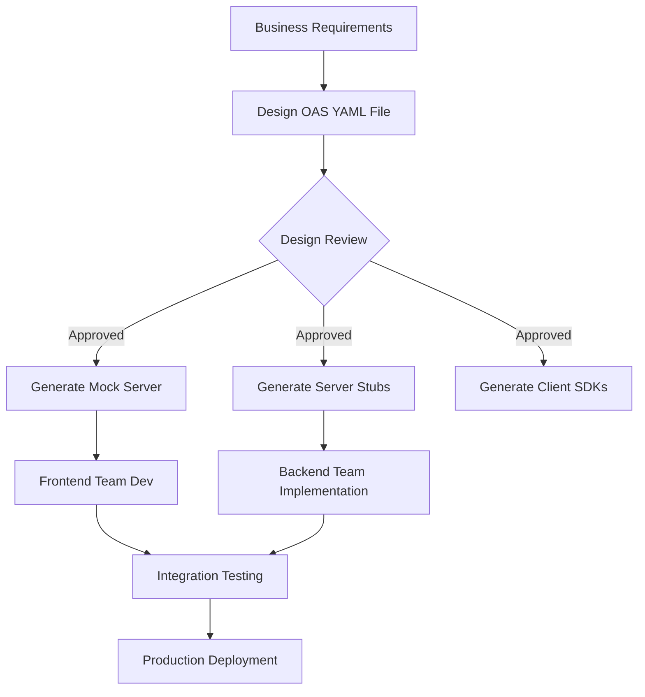

# API Documentation: OpenAPI Specification

## Overview

In the modern enterprise, an API without documentation is essentially a broken API. For Staff and Principal Engineers, documentation is not an afterthought handled by technical writers; it is the **API Product's storefront** and the primary contractual interface between systems. 

The industry standard for documenting REST APIs is the **OpenAPI Specification (OAS)**, previously known as Swagger. A well-crafted OAS file (YAML or JSON) enables automated client SDK generation, interactive documentation portals, and robust contract testing, drastically reducing integration friction between the bank and its third-party partners or internal frontend teams.

---

## Foundational Concepts

### OpenAPI vs. Swagger

This is a common point of confusion.
- **OpenAPI**: The formal *specification* (currently v3.1) managed by the Linux Foundation. It dictates the structure, format, and rules for describing a REST API.
- **Swagger**: The suite of *tools* built by SmartBear (Swagger UI, Swagger Editor, Swagger Codegen) that implement and render the OpenAPI specification. 

*Analogy*: OpenAPI is like the Java Language Specification; Swagger is like the JDK/IntelliJ.

### The OpenAPI File Structure

An OAS v3 file consists of several root-level objects:
1.  **`openapi`**: The semantic version of the specification used (e.g., `3.0.3`).
2.  **`info`**: Metadata including Title, Description, Terms of Service, and Version.
3.  **`servers`**: Base URLs for different environments (Production, Sandbox, Dev).
4.  **`paths`**: The core definition of endpoints (e.g., `/accounts`), their HTTP methods (GET, POST), parameters, and responses.
5.  **`components`**: Reusable building blocks defined once and referenced via `$ref`. Includes `schemas` (data models), `securitySchemes`, `parameters`, and `responses`.
6.  **`security`**: Global security requirements applied to all paths (unless overridden).

---

## Technical Deep Dive

### API-First vs. Code-First Design

This is a critical architectural decision for any new enterprise project.

#### Code-First (Implementation-First)
Developers write the Spring Boot controllers and DTOs using annotations. The documentation tool (like `springdoc-openapi`) inspects the compiled code at runtime and auto-generates the OAS JSON/YAML.
- **Pros**: Very fast for developers; the documentation is guaranteed to match the actual implementation.
- **Cons**: Front-end teams or external partners must wait until the backend is coded before they can start their integration. Often leads to API designs that overly reflect the internal database schema rather than consumer needs.

#### API-First (Design-First)
Architects and business analysts write the OAS YAML file *before* a single line of Java is written. This YAML file is the single source of truth.
- **Pros**: Parallel development (Frontend teams can generate mock servers from the YAML immediately). Results in a much cleaner, consumer-focused API design. Strict governance.
- **Cons**: Requires up-front effort to write YAML. Can drift from implementation if developers don't use strict generative tooling (like OpenAPI Generator to create Spring controller interfaces).

**Banking Recommendation**: For external Open Banking APIs (PSD2) or critical partner integrations, strictly use **API-First**. For rapid internal microservices, **Code-First** with rigorous review is often acceptable.

### SpringDoc OpenAPI Integration

In the Spring Boot 3.x ecosystem, **SpringFox (Swagger2)** is dead and incompatible. You must use **SpringDoc**.

SpringDoc automatically traverses your `@RestController` classes, inspects standard Spring annotations (`@GetMapping`, `@RequestBody`), reads Bean Validation annotations (`@NotNull`, `@Size`), and generates an OAS 3 document.

To enrich the documentation with human-readable descriptions, use `io.swagger.v3.oas.annotations`:

| Annotation | Applicability | Purpose |
|---|---|---|
| `@OpenAPIDefinition` | Configuration Class | Global metadata, Title, Contact info. |
| `@Tag` | Controller Class | Groups related endpoints logically in the UI. |
| `@Operation` | Controller Method | Provides a summary and detailed description of the endpoint's behavior. |
| `@Parameter` | Method Argument | Documents path variables or query strings. |
| `@ApiResponse` | Controller Method | Documents explicit HTTP status configurations and the payloads they return. |
| `@Schema` | DTO Class / Field | Details field purpose, constraints, hidden status, and crucially: **Examples**. |

---

## Visual Representations

### The API-First Lifecycle



---

## Code Examples

### 1. Fully Documented Spring Boot Controller (Code-First)

Notice how the documentation annotations wrap around the standard Spring annotations without interfering with execution logic.

```java
package com.bank.api.controller;

import io.swagger.v3.oas.annotations.Operation;
import io.swagger.v3.oas.annotations.Parameter;
import io.swagger.v3.oas.annotations.media.Content;
import io.swagger.v3.oas.annotations.media.Schema;
import io.swagger.v3.oas.annotations.responses.ApiResponse;
import io.swagger.v3.oas.annotations.responses.ApiResponses;
import io.swagger.v3.oas.annotations.security.SecurityRequirement;
import io.swagger.v3.oas.annotations.tags.Tag;
import org.springframework.http.ProblemDetail;
import org.springframework.http.ResponseEntity;
import org.springframework.web.bind.annotation.*;

@RestController
@RequestMapping("/api/v1/payments")
// Groups all endpoints in this controller under "Payments" in Swagger UI
@Tag(name = "Payments", description = "Endpoints for initiating and managing generic fund transfers")
// Specifies that these endpoints require a Bearer token
@SecurityRequirement(name = "bearerAuth") 
public class PaymentController {

    @Operation(
        summary = "Initiate a new payment",
        description = "Processes a transfer from the authenticated user's account to a distinct destination."
    )
    @ApiResponses({
        @ApiResponse(
            responseCode = "201", 
            description = "Payment successfully accepted for processing",
            content = @Content(schema = @Schema(implementation = PaymentResponse.class))
        ),
        @ApiResponse(
            responseCode = "400", 
            description = "Invalid request payload (e.g., negative amount)",
            content = @Content(schema = @Schema(implementation = ProblemDetail.class))
        ),
        @ApiResponse(
            responseCode = "422", 
            description = "Business rule violation (e.g., Insufficient Funds)",
            content = @Content(schema = @Schema(implementation = ProblemDetail.class))
        )
    })
    @PostMapping
    public ResponseEntity<PaymentResponse> initiatePayment(
            @Parameter(description = "Idempotency key to safely retry requests", required = true)
            @RequestHeader("Idempotency-Key") String idempotencyKey,
            @RequestBody @Valid PaymentRequest request) {
        
        // Business processing
        return ResponseEntity.status(201).body(paymentService.process(request, idempotencyKey));
    }
}
```

### 2. Documenting DTOs with Schemas

Examples are the most critical part of the UI to help developers grasp valid API usage.

```java
import io.swagger.v3.oas.annotations.media.Schema;
import jakarta.validation.constraints.DecimalMin;
import jakarta.validation.constraints.NotBlank;
import java.math.BigDecimal;

@Schema(description = "Payload required to initiate a new domestic payment")
public record PaymentRequest(

    @NotBlank
    @Schema(description = "The source account ID from which funds will be debited", 
            example = "ACC-904321-UK")
    String sourceAccountId,

    @NotBlank
    @Schema(description = "The destination account Sort Code and Account Number", 
            example = "404004-12345678")
    String destinationAccountId,

    @DecimalMin("0.01")
    @Schema(description = "The positive monetary value to transfer", 
            example = "150.50")
    BigDecimal amount,

    @NotBlank
    @Schema(description = "ISO 4217 Currency Code", 
            example = "GBP")
    String currency,

    // Internal field that shouldn't appear in public Swagger Documentation
    @Schema(hidden = true)
    String internalAuditFlag
) {}
```

### 3. Global Security Configuration

Connecting the `@SecurityRequirement` in the controller to an actual definition in the OpenAPI output.

```java
import io.swagger.v3.oas.models.Components;
import io.swagger.v3.oas.models.OpenAPI;
import io.swagger.v3.oas.models.info.Info;
import io.swagger.v3.oas.models.security.SecurityScheme;
import org.springframework.context.annotation.Bean;
import org.springframework.context.annotation.Configuration;

@Configuration
public class OpenApiConfig {

    @Bean
    public OpenAPI customOpenAPI() {
        return new OpenAPI()
                .info(new Info()
                        .title("Enterprise Banking API")
                        .version("v1.0")
                        .description("Core banking services for retail customers."))
                .components(new Components()
                        // Defines 'bearerAuth' used by @SecurityRequirement
                        .addSecuritySchemes("bearerAuth",
                                new SecurityScheme()
                                        .type(SecurityScheme.Type.HTTP)
                                        .scheme("bearer")
                                        .bearerFormat("JWT")));
    }
}
```

---

## Real-World Enterprise Scenarios

### Scenario: The Legacy System Expansion
**Context**: A retail bank decides to open its proprietary "Credit Check" system API, originally developed for internal Java microservices, to external FinTech partners.
**Documentation Shift**: The API was originally designed via "Code-First," using massive, bloated DTOs because internal speed was prioritized over clean contracts. When exposing it externally, the Principal Engineer dictates dropping the Code-First approach. The team rewrites the external-facing contract exclusively via "API-First" YAML design. They implement an Anti-Corruption Layer (ACL) controller that adheres to the clean OpenAPI spec, stripping away internal legacy database flags before forwarding requests, completely hiding the internal mess from external consumers relying on the Swagger UI.

---

## Interview Questions & Model Answers

### Q1: What is the primary advantage of the `components/schemas` section in an OpenAPI v3 definition?
**Answer**: Modularity and DRY (Don't Repeat Yourself) principles. In enterprise environments, the "Customer" object might be returned across dozens of different endpoints (Accounts, Profile, Loans). By defining the Customer schema exactly once inside `components/schemas`, any endpoint can use a `$ref` to point to it. This vastly reduces the size of the YAML specification and guarantees that if the Customer object structure changes, the modification is reflected universally across the documentation automatically.

### Q2: What's your perspective on API-First vs. Code-First development?
**Answer**: I prefer API-First for any API that spans team or organizational boundaries. Writing the YAML specification upfront acts as a binding contract. It allows frontend developers to instantly generate Postman mocks and begin their UI work while the backend engineers are still spinning up databases. However, for deeply internal APIs (e.g., a data-processing microservice strictly consumed by one other intimately known service), Code-First using annotations like SpringDoc is perfectly pragmatic and accelerates delivery by removing the synchronization overhead of managing a separate YAML artifact.

### Q3: How do you document file uploads via multipart/form-data in OpenAPI?
**Answer**: In OpenAPI 3, dealing with file uploads requires defining the request body content type as `multipart/form-data`. Within that schema type, you configure an object where one of the properties is declared normally (e.g., an ID), and the file property is defined as `type: string` with a specific `format: binary`. The Swager UI reads this and automatically renders a functional "File Upload" browser button to test the endpoint.

### Q4: When reading an OpenAPI document, how do you handle sensitive internal fields you don't want external partners to see?
**Answer**: If generating Code-First via SpringDoc, I utilize the `@Schema(hidden = true)` annotation on the property inside the Java DTO. The documentation generator will completely ignore the field. Alternatively, if doing API-First design, we utilize API Gateway features or build-time tools (like OpenAPI-filter) to maintain a "Master" internal YAML file, and automatically publish a sanitized "External" YAML file that strips out internal schema properties prior to being deployed to the Developer Portal.

---

## Common Pitfalls & Best Practices

### Anti-Patterns
1.  **Refusal to provide Example Values**: A completely valid, machine-readable specification that lacks concrete string/number examples for its payload fields. Developers relying on the docs are forced to guess valid ISO date formats or currency structures.
2.  **Missing Status Codes**: Documenting the `200 OK` path, but failing to explicitly document the payload structures returned under `400 Bad Request`, `401 Unauthorized`, or `422 Unprocessable Entity` events.
3.  **Using `type: object` without properties**: Defining a JSON payload simply as a loose "object" without enumerating its properties disables strong typing and prevents client SDK generators from creating meaningful object classes in Java/TypeScript.

### Best Practices
1.  **Automate Validation**: Integrate a tool like `Spectral` into your CI/CD pipeline to lint the OpenAPI YAML file. It automatically enforces API style guide rules (e.g., "All paths must be snake_case", "All responses must define 4xx errors") before a build passes.
2.  **Separate UI from API**: Never run Swagger UI directly on your highly secured Production API servers. Serve the static YAML file independently through an isolated Developer Portal (like Backstage or Apigee).

---

## Key Takeaways

-   **OpenAPI** is the specification; **Swagger** is the tooling ecosystem.
-   **API-First Design** forces developers to think about the consumer experience before the database schema.
-   **SpringDoc** is the standard for auto-generating OpenAPI 3 artifacts via code inspection in Spring Boot.
-   **Explicit Documentation**: Every status code, every error shape, and every payload constraint must be represented in the specification.

---

## Further Reading
- [OpenAPI Specification v3.1.0](https://spec.openapis.org/oas/latest.html)
- [SpringDoc OpenAPI documentation](https://springdoc.org/)
- [Zalando RESTful API Guidelines](https://opensource.zalando.com/restful-api-guidelines/)
