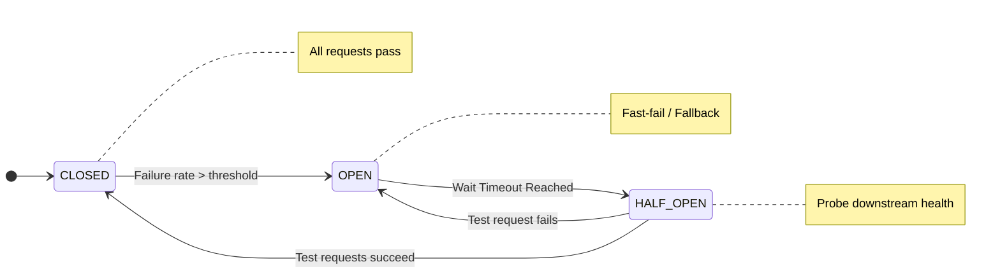

# API Gateway & Microservices Patterns

## Overview

A standalone REST API is practically non-existent in an enterprise banking environment. Today’s architectures involve hundreds of independent Spring Boot or Go microservices communicating concurrently. At the Staff/Principal level, you are responsible for abstracting the chaos of this distributed system behind a unified, secure, and resilient entry point.

This domain focuses on solving cross-cutting concerns (Authentication, SSL Termination, Threat Protection) holistically rather than repeating code in every microservice, and explores patterns for service-to-service communication ensuring the architecture gracefully handles inevitable network turbulence.

---

## Foundational Concepts

### The API Gateway Pattern

An API Gateway operates as the single "Front Door" (Reverse Proxy) for all external clients (Mobile apps, Web SPAs, B2B Partners). It encapsulates the internal system architecture.

**Crucial Responsibilities (Offloading):**
1.  **Routing & Composition**: Receives `/api/v1/user/dashboard`, translates it into downstream calls to User Service, Account Service, and Rewards Service, and combines the responses.
2.  **Security & Auth**: Validates the OAuth 2.0 JWT signature at the perimeter. Downstream microservices blindly trust the `X-User-ID` header injected by the Gateway.
3.  **Rate Limiting & Threat Protection**: Shields the internal network from DDoS bursts and rapid automated enumeration attacks.
4.  **SSL/TLS Termination**: Decrypts HTTPS traffic. Communication behind the gateway across the private VPC can proceed via faster HTTP.
5.  **Analytics & Billing**: Meters API traffic consumption for varying B2B tiers.

### The Backend for Frontend (BFF) Pattern

A monolithic API Gateway eventually becomes a bloated bottleneck. The BFF pattern dictates creating multiple specialized API gateways tailored to the specific needs of distinct client types.

- **Mobile BFF**: Aggregates data aggressively to save cellular battery and trims large JSON payloads down to essential display fields.
- **Web App BFF**: Provides richer data-sets and focuses on orchestrating complex dashboard loading states.
- **Partner BFF**: Focuses heavily on strict OAuth compliance, schema validation, and rigorous rate-limiting.

---

## Technical Deep Dive: Resilience Patterns

Microservices communicate over networks; networks fail. When Service A calls Service B, and Service B is slow, Service A's thread pool exhausts rapidly, taking down Service A. This is a "Cascading Failure."

### 1. Circuit Breaker Pattern (Resilience4j)

A Circuit Breaker operates identically to an electrical circuit breaker. It prevents an application from repeatedly trying to execute an operation that is likely to fail, saving CPU cycles and thread blocking.

- **Closed State (Normal)**: Requests pass through freely. Metrics are recorded (Failure rate vs Success rate).
- **Open State (Tripped)**: The failure rate (e.g., >50% timeouts) breaches the configured threshold. The Circuit Breaker trips immediately. Subsequent requests fail fast instantly without execution, returning an HTTP `503 Service Unavailable` or invoking a fallback method (returning empty arrays or cached data). 
- **Half-Open State (Testing)**: After a configured "Wait Duration" (e.g., 5 seconds), the breaker allows a limited number of test requests through. If they succeed, it closes the circuit. If they snag, it reopens it.

### 2. Retry Pattern with Exponential Backoff

For transient network blips (like a connection reset), immediately resending the request is pragmatic.
- **Strategy**: Try once. Fail. Wait 100ms. Try again. Fail. Wait 200ms. Try again. Fail. Wait 400ms. 
- **Jitter**: Always add randomized "Jitter" to the timing so that 10,000 failing clients don't all retry at the exact same millisecond, executing a self-inflicted DDoS on a recovering system.

### 3. Bulkhead Pattern

Historically derived from ship design (if one compartment floods, the ship stays afloat). In software, if a banking gateway routes traffic to the "Core Checking" API and the "Promotions" API, and Promotions crashes causing thread hangs, we don't want the Gateway's total thread pool exhausted.
**Solution**: Allocate discrete thread pools or semaphores for specific downstream services. If the "Promotions" pool hits 100% capacity, standard traffic to "Core Checking" functions smoothly via its isolated resources.

---

## Service Mesh (Istio, Linkerd) vs API Gateway

This is a critical architectural distinction.

- **API Gateway (North/South Traffic)**: Handles ingress external traffic entering the cluster from the violent public internet. Focuses on JWTs, Edge Routing, and Client Throttling.
- **Service Mesh (East/West Traffic)**: Handles traffic *between* internal microservices deeply within the cluster. Utilizes the "Sidecar Proxy Pattern."
  - Every microservice container boots alongside a tiny Proxy container (Envoy).
  - Microservice A calls Microservice B via `http://localhost`. The sidecar transparently intercepts it, encrypts it (mTLS), routes it across the network to Microservice B's sidecar, which decrypts it and hands it to the application.
  - Resolves internal service discovery, injects telemetry, and enforces Zero-Trust security strictly without writing a line of Java.

---

## Visual Representations

### The Backend-For-Frontend (BFF) Architecture

```mermaid
graph TD
    subgraph Clients
        Mob[Mobile App]
        Web[Web SPA]
        Part[Third-Party Open Banking Partner]
    end
    
    subgraph Gateways / BFF
        BFF1[Mobile BFF / GraphQL]
        BFF2[Web BFF / REST]
        BFF3[Partner BFF / Strict API Gateway]
    end
    
    subgraph Internal Microservices (Service Mesh)
        S1[Accounts Service]
        S2[Payments Service]
        S3[Fraud Intelligence Service]
    end
    
    Mob --> BFF1
    Web --> BFF2
    Part --> BFF3
    
    BFF1 --> S1 & S2
    BFF2 --> S1 & S2 & S3
    BFF3 --> S1 & S3
```

### Circuit Breaker State Transition



---

## Code Examples

### Spring Cloud Gateway Configuration (YAML)

Spring Cloud Gateway provides an immediate, reactive way to construct a high-performance Edge Gateway.

```yaml
spring:
  cloud:
    gateway:
      routes:
        - id: payment-service-route
          # Load balancer targeting Eureka/Kubernetes service discovery
          uri: lb://payment-service
          predicates:
            - Path=/api/v1/payments/**
            - Method=POST,GET
          filters:
            # Add basic global resilience
            - name: Retry
              args:
                retries: 3
                statuses: BAD_GATEWAY, GATEWAY_TIMEOUT
                backoff:
                  firstBackoff: 50ms
                  maxBackoff: 500ms
                  factor: 2
                  basedOnPreviousValue: false
            # Strip the prefix to match internal controller routing structure
            - StripPrefix=1 
```

### Applying Circuit Breaker inside a Microservice (Resilience4j)

Using Resilience4j to protect a Spring Boot service calling a flaky legacy system.

```java
import io.github.resilience4j.circuitbreaker.annotation.CircuitBreaker;
import org.springframework.stereotype.Service;

@Service
public class CreditCheckService {

    private final LegacyMainframeClient mainframeClient;

    public CreditCheckService(LegacyMainframeClient mainframeClient) {
        this.mainframeClient = mainframeClient;
    }

    /**
     * Attempts call. If mainframe trips the configured error threshold,
     * immediately redirects traffic to the named fallbackMethod.
     */
    @CircuitBreaker(name = "mainframeCreditBreaker", fallbackMethod = "creditCheckFallback")
    public CreditScore getLiveCreditScore(String customerId) {
        // Blocks thread waiting for slow REST call
        return mainframeClient.callSlowEndpoint(customerId);
    }

    /**
     * Fallback method MUST possess the exact identical method signature plus
     * the Throwable parameter representing the error state.
     */
    public CreditScore creditCheckFallback(String customerId, Throwable throwable) {
        // Return a cached default or a downgraded feature state
        // This ensures the calling Customer Service doesn't explode when the mainframe dies.
        return new CreditScore("UNAVAILABLE", Optional.empty(), "Fallback Triggered");
    }
}
```

---

## Interview Questions & Model Answers

### Q1: When establishing a Microservices architecture, why not let the Frontend applications call the individual services directly?
**Answer**: Frontend-to-Microservice direct coupling is an anti-pattern. 
1. **Chattiness**: If rendering a dashboard requires data from six services, the mobile app traverses the noisy public internet six separate times, destroying battery life and UX latency. An API gateway groups these calls on the high-speed internal backend network.
2. **Security**: Every single microservice would individually be responsible for implementing OAuth JWT validation and CORS, multiplying the attack surface area drastically rather than securing a solitary perimeter.
3. **Refactoring Flexibility**: An API Gateway abstracts backend topology. You can split one microservice into three privately without affecting the frontend's singular URL interaction.

### Q2: What is the risk of implementing infinite or excessive connection Retries?
**Answer**: The "Retry Storm" phenomenon. If a downstream service is struggling heavily under load, applying a rigid retry policy (e.g., 5 swift retries) effectively multiplies the traffic burden on the failing service by 500%, ensuring its complete destruction. Retries must always be accompanied by an **Exponential Backoff** to create breathing room, and more crucially, paired with a **Circuit Breaker** to cap the retries if failure is guaranteed.

### Q3: Explain the difference between an API Gateway and a Load Balancer.
**Answer**: A Load Balancer (e.g., AWS ALB, NGINX) largely operates on OSI Layer 4 to Layer 7, distributing TCP/HTTP connections evenly across multiple healthy IP addresses in a server group to ensure scale. An API Gateway is firmly a Layer 7 appliance enforcing "Business Level Rules". While it does inherently route traffic dynamically (incorporating load balancing traits), its main purpose is request composition, API version routing, strict data transformation, and global authentication application.

### Q4: In an Enterprise Bank, what advantages does a Service Mesh (Istio) offer over the API Gateway for Service-to-Service traffic?
**Answer**: An API Gateway handles "North-South" traffic (external-to-internal), securing the perimeter from foreign entities. However, banks operate on "Zero-Trust" internal networks; we cannot blindly trust internal "East-West" traffic. If an API calls the Ledger Service, that inter-container communication must be encrypted. A Service Mesh provides localized Sidecar proxies attached to every single container. It forces automatic Mutual TLS (mTLS) encryption on all internal requests, ensures hyper-local telemetry generation, and prevents unauthorized inter-service communication silently without mandating developers to integrate heavy Java libraries like Spring Cloud Netflix into every service.

---

## Common Pitfalls & Best Practices

### Anti-Patterns
1.  **The Overstuffed Gateway**: Implementing critical business logic (data manipulation, banking rules) directly inside the API Gateway's routing tiers. The Gateway should remain computationally "dumb" and strictly forward and authenticate traffic. Business logic belongs in microservices.
2.  **Missing Fallback Definitions**: Integrating a Circuit Breaker but failing to write a meaningful fallback method or caching strategy, leaving the application returning a naked `503` when user degradation could be handled gracefully.

### Best Practices
1.  **Always enforce Timeouts first**: Before worrying about Circuit Breakers, ensure every outbound HTTP RestTemplate/WebClient call has a strict 1–3-second timeout. Unbounded network reads cause the highest percentage of catastrophic service failures.
2.  **Sidecars for Uniformity**: In polyglot organizations (Java, Go, Node.js), offload resilience and tracing patterns to a Service Mesh. Duplicating CircuitBreaker library implementations across languages leads to inconsistent system behavior.

---

## Key Takeaways

-   **API Gateways** consolidate security and orchestrate requests at the external perimeter (North/South).
-   **Service Meshes** (Istio/Envoy) apply uniform mTLS, networking rules, and telemetry natively inside the internal topology (East/West).
-   **BFF (Backend For Frontend)** aligns API structures tightly to specific client needs instead of forcing a singular generic graph to rule them all.
-   **Resilience (Circuit Breaker, Bulkhead, Retry)** is mandatory; distributed network calls will fail eventually, and software must survive the event.
