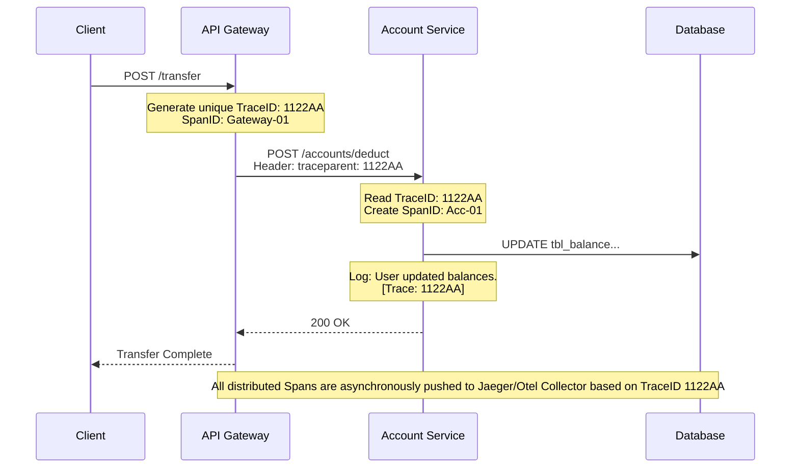

# API Observability & Monitoring

## Overview

In the realm of enterprise banking and high-stakes microservice architectures, knowing that a system "crashed" is significantly less valuable than understanding *why* it crashed or degrading exactly *where* the bottleneck formed.

At the Staff/Principal engineering tier, **Monitoring** answers the question, "Is the API broken?" while **Observability** answers the question, "How do I rapidly understand the internal state of my application based solely on its external outputs?"

Robust observability is the critical backbone for complying with SLA agreements (99.99%), reducing Mean Time To Recovery (MTTR) during sev-1 incidents, and proving auditability traits required by regulatory bodies.

---

## Foundational Concepts

### The Three Pillars of Observability

1.  **Metrics (The "What")**: Highly aggregatable, numeric representations of data measured over time. Identifies trends and fires immediate alerts (e.g., Memory utilization %, Request rates). Extremely cheap to store.
2.  **Logs (The "Why")**: Immutably recorded, specific, high-fidelity context blocks detailing discrete events (e.g., Uncaught exceptions with stack traces, invalid payload rejection reasons). Expensive to store long-term.
3.  **Traces (The "Where")**: Represents the end-to-end journey of a single, continuous request across process boundaries and distributed microservices. Pinpoints accurately which exact system delayed an entire transaction.

### RED and USE Methodologies

To filter the noise of thousands of available metrics, standard measurement frameworks are employed.

- **RED Method (Service/API Focus):**
  - **R**ate: The number of requests your API is processing per second.
  - **E**rrors: The percentage of those requests resulting in failure (typically 5xx statuses).
  - **D**uration: The distributions of latency (P50, P90, P99 percentile speeds).
- **USE Method (Infrastructure Focus):**
  - **U**tilization: Percentage of system capacity in use (CPU 85%).
  - **S**aturation: Volume of extra work queued up, unable to process (Thread pool waits).
  - **E**rrors: System layer failures (packet drops, disk faulty sectors).

---

## Technical Deep Dive

### 1. Spring Boot Actuator & Micrometer

Spring Boot abstracts operational monitoring capabilities via the **Actuator** framework.

- `GET /actuator/health`: Emits the liveness status of the Node, checking dependencies like DB Connectivity and Disk Space. Essential for Kubernetes pod orchestrators.
- `GET /actuator/prometheus`: Exposes real-time Java and application telemetry in the scraping format exclusively required by **Prometheus**, the industry-standard dimensional time-series database.

**Micrometer** acts as the SLF4J (facade) for the metric ecosystem. It allows developers to register custom `Counter`, `Timer`, and `Gauge` interfaces within application logic without permanently binding the code to a specific tool (like Datadog or Prometheus).

### 2. Distributed Tracing (OpenTelemetry / Sleuth)

When a mobile banking customer clicks "Transfer Funds", the request hits the API Gateway, routes to the Account Microservice, verifies with the Auth Microservice, interacts with the Fraud Engine, and finally interacts with the Core Ledger Database.

If the request takes 4 seconds, inspecting logs from 5 servers randomly is impossible.

**Distributed Tracing implementation:**
- **Trace ID**: A globally unique identifier (e.g., UUID-X) assigned by the API Gateway the moment the transaction originates. This ID is passed deep down the stack in the HTTP Headers (usually standard `W3C traceparent`).
- **Span ID**: Distinct components of work within a single trace. A DB query is a span; an external REST call is a separate span.
- **Result**: Visual tooling (Jaeger, Zipkin) aggregates these IDs to form a waterfall chart visually highlighting exactly which downstream system caused the 4-second delay.

**(Note: Spring Cloud Sleuth has been deprecated in Spring Boot 3; replaced fully by Micrometer Tracing native utilizing the vendor-neutral OpenTelemetry standard.)**

### 3. Log Masking and Regulatory Compliance

In finance, Security/Compliance policies (GDPR, PCI-DSS) strictly forbid retaining Personal Identifiable Information (PII) or Primary Account Numbers (PANs) on disk or scattered across centralized logging platforms (Splunk/ELK).

Logging frameworks (Logback/Log4j2) must be securely configured with systemic Regex Layout Encoders to automatically identify patterns resembling 16-digit credit card integers or Email addresses and forcefully mask them (`4111********1234`) before the logger flushes to disk.

### 4. Kubernetes Health Probes: Liveness vs Readiness

Actuator interfaces explicitly interact with K8s traffic management:
- **Liveness Probe**: Asks "Is the container completely deadlocked?" If the `/actuator/health/liveness` call fails entirely, Kubernetes aggressively assassinates the pod and launches a fresh replacement.
- **Readiness Probe**: Asks "Is the container alive but momentarily incapable of serving traffic?" (e.g., updating a local cache mass, connection to Postgres dropped). K8s stops forwarding HTTP traffic from the load balancer to this specific pod dynamically until the probe passes, sparing users from experiencing 500 errors.

---

## Visual Representations

### Distributed Trace Header Propagation Flow



---

## Code Examples

### 1. Registering Custom Business Metrics (Micrometer)

Adding high-value custom dimensional metric tagging for dashboard graphing.

```java
import io.micrometer.core.instrument.Counter;
import io.micrometer.core.instrument.MeterRegistry;
import org.springframework.stereotype.Service;

@Service
public class TransferService {

    private final MeterRegistry registry;
    private final Counter riskyTransferCounter;

    public TransferService(MeterRegistry registry) {
        this.registry = registry;
        
        // Registering a custom Promtheus counter metric
        this.riskyTransferCounter = Counter.builder("bank.transfers.risky")
                .description("Counts transfers marked as potentially fraudulent based on threshold rules")
                // Adding dimensional tags for highly granular Grafana filtering
                .tag("region", "EMEA")
                .register(registry);
    }

    public void processTransfer(TransferRequest request) {
        if (request.amount().compareTo(A_SIGNIFICANT_THRESHOLD) > 0) {
            // Increment the custom business metric
            riskyTransferCounter.increment();
            initiateDeepFraudCheck(request);
        }
    }
}
```

### 2. Logback Automated PII Masking (Logback XML Config)

Configuring the logging engine itself rather than relying on developers to remember to strip outputs during `logger.info()`.

```xml
<configuration>
    <!-- Custom layout parsing the output before disk flush -->
    <appender name="STDOUT" class="ch.qos.logback.core.ConsoleAppender">
        <encoder>
            <pattern>%d{HH:mm:ss.SSS} [%thread] %-5level %logger{36} [trace=%X{traceId}] - %replace(%msg){'\b(?:4[0-9]{12}(?:[0-9]{3})?|[25][1-7][0-9]{14}|6(?:011|5[0-9][0-9])[0-9]{12}|3[47][0-9]{13}|3(?:0[0-5]|[68][0-9])[0-9]{11}|(?:2131|1800|35\d{3})\d{11})\b', 'XXXX-PII-REDACTED-XXXX'}%n</pattern>
        </encoder>
    </appender>

    <root level="INFO">
        <appender-ref ref="STDOUT" />
    </root>
</configuration>
```

---

## Real-World Enterprise Scenarios

### Scenario: Correlating The Disgruntled Customer Support Ticket
**Context**: A banking customer attempts to wire a down-payment on a home. The mobile app spins indefinitely and throws a generic "System Error." The customer furiously contacts the bank resolution desk supplying only their Customer ID.
**Observability Execution**: 
Without correlation IDs, searching a centralized logging platform (Splunk) for "Customer 1234 Error" across 50 microservices generating 5 terabytes of logs daily yields no usable results. 
Because the system utilizes **Mapped Diagnostic Context (MDC)** combined with OpenTelemetry, searching the central Log repository for `customerId=1234` immediately pinpoints the originating API Gateway event timestamp, retrieving the unique `X-Trace-ID`. Entering that Trace-ID into the system queries instantly extracts all related logs sequentially across the cluster, definitively proving the transaction failed accurately because the core ledger connection timed out awaiting a heavy database lock, rapidly guiding the platform engineering response.

---

## Interview Questions & Model Answers

### Q1: Can you explain the difference between Monitoring and Observability?
**Answer**: Monitoring relies on pre-determined, predictable failure modes—creating static dashboards to inform me when CPU hits 95% or Error HTTP Rates jump beyond 3% ("The system is broken"). Observability, conversely, focuses on outputting rich enough system state and context via high-cardinality telemetry (Logs, dispersed traces, and event maps), allowing me to ask entirely novel, unpredicted architectural questions after a complex failure surfaces ("Why exactly did the system break under these unique operational conditions?")

### Q2: Why measure distribution latencies focusing heavily on the P99 percentile instead of the Mathematical Average (Mean)?
**Answer**: Averages brutally camouflage outliers in high-throughput environments. If an API processes 1,000 requests per second with a mean latency of 150ms, it might appear perfectly healthy. However, surveying the P99 metric isolates the slowest 1% of transactions. If the P99 reads 5,000ms, it signifies that at scale, thousands of distinct customers every single day are suffering a 5-second painful loading screen, which indicates probable JVM Garbage Collection stalls or database locking problems that absolutely require severe architectural tuning. Averages lie; Percentiles illuminate structural client agony.

### Q3: How do Spring Microservices ensure standard correlation IDs are automatically appended tracking an execution thread?
**Answer**: Utilizing Micrometer Tracing (in Spring Boot 3), the underlying libraries intercept incoming HTTP requests dynamically. If a standard standardized header like `W3C traceparent` exists, it adopts it; otherwise, it auto-generates a highly unique UUID. Through tight integration with `SLF4J`, this Trace-ID is subsequently forcefully injected into the `MDC` (Mapped Diagnostic Context), guaranteeing that any arbitrary `logger.info()` call developers emit automatically outputs the specific trace details seamlessly. Additionally, it instruments standard outbound network wrappers (`RestTemplate` / `WebClient`) injecting those contextual variables downstream into network headers forwarding the chain.

### Q4: An Actuator Health check returning HTTP 200 signifies the application is perfectly fine, correct?
**Answer**: Incorrect. A standard lightweight `/health` check merely indicates the web server thread acknowledges the ping. In a microservices cluster, if your Spring Boot service successfully boots but the mandatory backing Redis cache or PostgreSQL database undergoes network detachment, the application is fundamentally useless despite running software. Deep Health Indicators (like Spring's `DataSourceHealthIndicator`) must evaluate the absolute connectivity state of critical peripheral resources, failing the pod's "Readiness Probe" until operational health fully restores.

---

## Common Pitfalls & Best Practices

### Anti-Patterns
1.  **Logging Extreme Noise**: The classic "Logging every single database query result" architecture. Beyond being severely expensive to stream and host externally in Datadog/Splunk, the "Haystack" grows so absurdly immense tracking down the needle (the authentic error string) becomes arduous. Log effectively at WARN and ERROR bounds cleanly, reserve INFO exclusively for decisive state changes.
2.  **Lack of High Cardinality Tags**: Producing a metric titled "failed_payments" is mostly useless. A high cardinality metric named "failed_payments" tagged distinctively by `error_type=INSUFFICIENT_FUNDS`, `region=LATAM`, and `client_type=MOBILE_APP` unlocks immensely precise dashboard visualizations.

### Best Practices
1.  **Adopt the OpenTelemetry Standard**: Moving forward, instrumenting code exclusively leveraging raw proprietary Vendor libraries (E.g. Pure NewRelic Agents) commits you irreversibly to massive contractual vendor lock-in. Implement OpenTelemetry SDKs outputting normalized data models—modifying providers universally happens solely within collector configuration files.
2.  **Format Logs as Strict JSON**: Traditional flat text log lines require clunky, rigid REGEX parsing tools to decipher efficiently at scale. Produce structured distinct JSON blocks strictly. Logging clusters natively map JSON keys (`timestamp`, `traceId`, `eventType`) into fully indexed, queryable columns instantaneously.

---

## Key Takeaways

-   Monitoring notifies you of a disruption; **Observability Enables Diagnostic Triage.**
-   Evaluate latency strictly via **Percentiles (P95/P99)**, comprehensively ignoring averages.
-   Instrumenting Custom Business Metrics explicitly bridges the divide between software engineering stability and raw commercial insight tracking.
-   **Distributed Tracing (Trace IDs & Spans)** resolves the core friction of Microservice diagnostic architecture.
-   **PII Masking** isn't merely a best-practice; it dictates stringent Legal and Auditing survival inside High-Finance.
