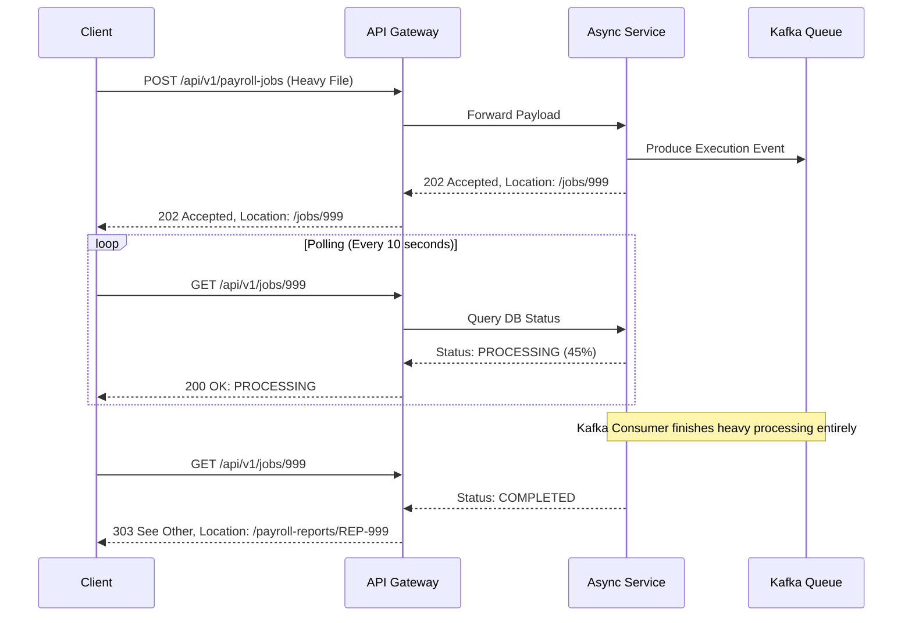
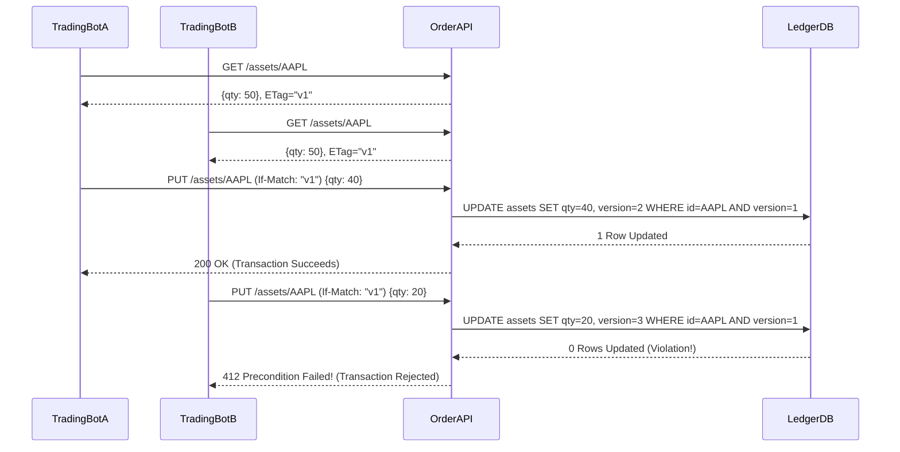

# Part 12: Advanced REST API Topics

## Overview

As you transcend from a Senior Engineer to a Staff or Principal role within an enterprise banking environment, the nature of the problems you solve shifts dramatically. You are no longer primarily tasked with establishing basic CRUD endpoints (`GET`, `POST`, `PUT`, `DELETE`). Instead, you are confronted with the "Hard Problems" of distributed systems operating via HTTP.

These problems occur at scale, under immense concurrent pressure, and involve the movement of high-value financial assets. A network timeout during a "Transfer Funds" request is not a simple UI glitch; it is a potential dual-charging incident that violates regulatory trust and inflicts significant financial damage.

This chapter dissects the advanced patterns mandated for robust, fail-safe REST APIs in Top-Tier financial institutions: absolute Idempotency, high-throughput Concurrency Control, Bulk Data Processing methodologies, Webhook implementations for asynchronous event streams, and rigorous API Evolution strategies.

---

## 12.1 Idempotency in Distributed Systems

### The Distributed Systems Phenomenon: "At-Least-Once" Delivery
In distributed networks, communication over HTTP is inherently unreliable. The **Two Generals' Problem** proves that over a lossy network, two nodes can never be 100% certain they share the identical state.

Consider a mobile banking application issuing a `POST /api/v1/payments/transfers`.
1.  The App sends the request.
2.  The API processes the payment successfully and deducts $500.
3.  The API dispatches a `201 Created` HTTP response.
4.  A cellular network drop occurs; the `201 Created` response is lost.
5.  The Mobile App times out after 10 seconds.
6.  *The User, assuming failure, taps "Submit Payment" again.*
7.  Without idempotency guarantees, the API processes the retry as a novel, independent request, deducting a secondary $500.

**Idempotency** guarantees that executing an identical operation multiple times results in the identical final state as executing it exactly once.

### Mathematical Idempotency vs. HTTP Semantics
By definition (RFC 7231):
- **Safe & Idempotent**: `GET`, `HEAD`, `OPTIONS` (State is unaffected).
- **Idempotent / Unsafe**: `PUT`, `DELETE` (State mutates, but repeating the identical mutation yields no further change).
- **Not Idempotent**: `POST`, `PATCH` (Continually generating new resources or applying relative scalar increments).

### The "Idempotency-Key" Header Pattern
To enforce idempotency on inherently non-idempotent `POST` requests, the industry standard relies on client-generated **Idempotency Keys** (popularized heavily by Stripe).

**The Workflow:**
1.  **Client Generation**: The mobile application generates a mathematically unique identifier (e.g., UUID v4) localized to the specific transaction intent.
2.  **Header Injection**: The client attaches this to the HTTP Request: `Idempotency-Key: 8a9b2c-4d5e-6f7g`.
3.  **Edge Verification**: The API Gateway or Microservice interrogates a central, high-speed distributed Datastore (e.g., Redis Cluster or a transactional Database `idempotency_ledger` table).
    - If the Key **does not exist**: The system acquires a lock, processes the financial transaction, archives the HTTP Response status and JSON payload against the Key in Datastore, and returns the Response.
    - If the Key **exists, and status is 'PROCESSING'**: A concurrent race condition is actively occurring. Return `409 Conflict` (or block and long-poll until the sibling thread completes).
    - If the Key **exists, and status is 'COMPLETED'**: The client is retrying a successful action. The system *completely bypasses all business logic* and blindly re-emits the cached JSON payload and original HTTP Status Code stored during the initial execution.

### Idempotency Example in Spring Boot + Redis

```java
import org.springframework.data.redis.core.StringRedisTemplate;
import org.springframework.http.HttpStatus;
import org.springframework.http.ResponseEntity;
import org.springframework.web.bind.annotation.*;
import java.time.Duration;

@RestController
@RequestMapping("/api/v1/payments")
public class PaymentController {

    private final PaymentService paymentService;
    private final StringRedisTemplate redisTemplate;

    public PaymentController(PaymentService paymentService, StringRedisTemplate redisTemplate) {
        this.paymentService = paymentService;
        this.redisTemplate = redisTemplate;
    }

    @PostMapping("/transfers")
    public ResponseEntity<PaymentResponse> transferFunds(
            @RequestHeader(value = "Idempotency-Key", required = true) String idempotencyKey,
            @RequestBody PaymentRequest request) {

        String cacheKey = "idemp:payment:" + idempotencyKey;

        // Atomic operation: Set if Not Exists (SETNX)
        // If it returns true, we acquired the lock to process.
        Boolean lockAcquired = redisTemplate.opsForValue().setIfAbsent(cacheKey, "PROCESSING", Duration.ofHours(24));

        if (Boolean.FALSE.equals(lockAcquired)) {
            String cachedStatus = redisTemplate.opsForValue().get(cacheKey);
            if ("PROCESSING".equals(cachedStatus)) {
                // Client retried too fast while we are still processing
                return ResponseEntity.status(HttpStatus.CONFLICT).build();
            } else {
                // CachedStatus contains the previously serialized JSON result payload
                // Re-emit immediately, bypassing all database logic
                PaymentResponse cachedResponse = deserializeOrFetchFromDB(cachedStatus);
                return ResponseEntity.ok(cachedResponse);
            }
        }

        try {
            // Process actual core payment logic (DB transactions, Kafka events)
            PaymentResponse response = paymentService.executeTransfer(request);
            
            // Cache the successful outcome payload
            String serializedResponse = serializeToJson(response);
            redisTemplate.opsForValue().set(cacheKey, serializedResponse, Duration.ofHours(24));
            
            return ResponseEntity.status(HttpStatus.CREATED).body(response);

        } catch (Exception e) {
            // CRITICAL: On catastrophic failure, release the idempotency lock
            // to allow genuine retries to attempt processing again.
            redisTemplate.delete(cacheKey);
            throw e;
        }
    }
}
```

---

## 12.2 Concurrency Control (Optimistic Locking)

When managing a high-frequency trading platform or an aggregated banking ledger, thousands of discrete microservices and automated batch jobs may attempt to mutate the exact same `Account` record simultaneously. 

Without Concurrency Controls, you suffer the **Lost Update Problem**.
- Thread A reads Account balance as $100.
- Thread B reads Account balance as $100.
- Thread A adds $50, writes $150.
- Thread B deducts $20, writes $80 (Overwriting Thread A's transaction completely; $50 evaporated).

### Pessimistic Locking (The Legacy Approach)
The relational database strictly locks the row (`SELECT * FROM accounts WHERE id=123 FOR UPDATE`). No other thread across the entire distributed system can read or write to that specific row until Thread A commits and releases the lock.
**Why we avoid it in REST**: It annihilates horizontal scalability, induces massive API latency spikes, and introduces systemic deadlock cascades across microservices.

### Optimistic Locking (The Modern Approach)
Optimistic concurrency assumes collisions are statistically rare. It permits unlimited concurrent thread access uninhibited but violently halts the transaction mathematically at the exact millisecond of the write if the underlying state was altered by a rogue sibling thread unexpectedly.

**Implementation via REST and HTTP ETags (Entity Tags)**
1.  **Read (`GET`)**: The client requests the Account. The API reads the database, generating a hash of the content or extracting an explicit database `@Version` integer block. It returns the response with the HTTP header `ETag: "v5"`.
2.  **Mutate (`PUT` or `PATCH`)**: The client modifies the JSON and submits the update request, actively appending the header `If-Match: "v5"`.
3.  **Verification**: 
    - The API executes an atomic SQL constraint: `UPDATE accounts SET balance = 80, version = 6 WHERE id = 123 AND version = 5;`
    - If the SQL engine reports `1 Row Updated`, the transaction succeeds, returning `200 OK` and generating a new `ETag: "v6"`.
    - If the SQL engine reports `0 Rows Updated` (because Thread B previously incremented the database version to 6 secretly), the API rolls back the transaction entirely and rejects the request utilizing **`412 Precondition Failed`**.
4.  **Client Resolution**: The client catching the `412` is forced to re-execute a `GET` command, reconciling the modified truth before attempting to `PUT` again.

### Spring Data JPA implementation
Implementing Optimistic Locking in Spring requires barely any code. Provide an `@Version` entity attribute, and Spring automatically injects the `WHERE version=?` into every JPA generated `UPDATE` block implicitly.

```java
import jakarta.persistence.*;

@Entity
@Table(name = "customer_accounts")
public class Account {
    @Id
    @GeneratedValue(strategy = GenerationType.IDENTITY)
    private Long id;

    private BigDecimal balance;

    // This single annotation enables rigorous Optimistic Locking cluster-wide
    @Version
    @Column(name = "opt_lock_version")
    private Long version;

    // Getters / Setters
}

// Global Exception Handler translating the JPA violation into the HTTP 412 status code.
@RestControllerAdvice
public class ConcurrencyExceptionHandler {

    @ExceptionHandler(ObjectOptimisticLockingFailureException.class)
    public ResponseEntity<ProblemDetail> handleOptimisticLocking(ObjectOptimisticLockingFailureException ex) {
        ProblemDetail problem = ProblemDetail.forStatusAndDetail(
                HttpStatus.PRECONDITION_FAILED, 
                "The resource has been modified by another transaction. Please reload and retry.");
        return ResponseEntity.status(HttpStatus.PRECONDITION_FAILED).body(problem);
    }
}
```

---

## 12.3 Bulk/Batch Operations

Standard REST endpoints are scalar (one resource manipulated exclusively). e.g., `POST /payments`.
However, during end-of-day Corporate Payroll processing, a corporation might submit a ledger requiring 50,000 distinct salary payments. Triggering 50,000 individual `POST /payments` REST calls invokes immense TCP connection overhead, destroys load balancers, and severely compromises total execution time.

### Pattern 1: The Synchronous Bulk Endpoint (Small Batches < 500 records)
Exposing an endpoint accepting a JSON Array.
`POST /api/v1/payments/bulk`

**The Dilemma: Partial Failures**
If a client posts 100 payments, and Payment #45 fails (Insufficient Funds), what should the HTTP Status code be?
- Returning `200 OK` is critically deceptive.
- Returning `400 Bad Request` or `422 Unprocessable Entity` implies the complete payload was rejected.

**The Solution: `207 Multi-Status`**
The WebDAV extension to HTTP introduced `207 Multi-Status`, which has been adopted universally by modern APIs handling batching. The response payload encapsulates an array outlining the explicit outcome (Success, Error Message, Resource URI) of the exact status mapped to each individual array element inputted.

### Pattern 2: The Asynchronous Job / Long-Running Process (Large Batches > 500 records)
A REST connection generally times out at the Gateway load balancer (NGINX/AWS ALB) around a 30 to 60-second limit. Parsing a 50,000-line CSV uploaded symmetrically via chunked form-data will undeniably breach this timeout. 

The canonical REST solution transforms the action into an Asynchronous State Machine leveraging the `202 Accepted` status explicitly.

1.  **Submission**: Client initiates: `POST /api/v1/payroll-jobs` attaching the heavy CSV/JSON array.
2.  **Acceptance**: The Server aggressively parses the request syntax, validates the Auth, pushes the raw payload onto an internal Kafka queue, and responds practically instantaneously (under 100ms) with **`HTTP 202 Accepted`**.
3.  **Location Routing**: The 202 Response must comprise a `Location` header pointing to the newly established tracking resource: `Location: /api/v1/jobs/JOB-999-UUID`
4.  **Client Polling**: The client polls `GET /api/v1/jobs/JOB-999-UUID` periodically.
5.  **State Inspection**: 
    - While processing, the API returns `200 OK` portraying `{ "status": "PROCESSING", "progress_percentage": 45 }`.
    - Upon completion, the API returns `303 See Other` containing a `Location` header redirecting exactly to the `/api/v1/payroll-reports/REP-999` resource housing the ultimate results, or a `200 OK` depicting `{ "status": "COMPLETED", "successes": 49000, "failures": 1000 }`.

---

## 12.4 Webhooks (Event-Driven Notifications)

Relentlessly polling (`GET /api/v1/jobs/123` every 5 seconds) squanders enormous bandwidth and pollutes the application server Thread Pools processing useless `No Change` states. 
A superior architectural evolution incorporates **Webhooks**—shifting the mechanism from "Client Pull" to "Server Push".

Instead of the API client asking "Is it done yet?", the Server API actively reaches out and initiates an HTTP `POST` to a pre-defined URL owned by the client the absolute millisecond the asynchronous event completes.

### The Architectural Components of Webhooks
1.  **Subscription Endpoint**: A mechanism allowing third parties to register their receiving URL (`POST /api/v1/webhooks/subscriptions`) alongside the explicit events they request (e.g., `PAYMENT_CLEARED`, `ACCOUNT_OVERDRAWN`).
2.  **Dispatch Engine**: An isolated Microservice managing Kafka topic observations. When a `PAYMENT_CLEARED` event fires internally on Kafka, the Webhook Dispatch Engine constructs an HTTP payload and transmits it aggressively to the subscribed Partner URL.

### Rigorous Security Constraints for Banking Webhooks
When a banking system transmits sensitive transaction alerts across the open internet to a remote B2B Partner server, extreme cryptographic safeguards are non-negotiable.

- **Authentication via Signatures (HMAC)**: Because Webhooks are publicly accessible endpoints on the Partner's server, an attacker could simulate a fake webhook. The Bank mitigates this by generating a mathematically robust Hash-based Message Authentication Code (HMAC).
- **Execution**: The Bank hashes the entire JSON Request Body using a strict shared cryptographic secret (e.g., `SHA-256`) explicitly provisioned to the partner beforehand.
- **Verification**: The Bank transmits this hash in the Header (`X-Bank-Webhook-Signature: sha256=a1b2c3d4e5...`). Upon receiving the webhook, the Partner recalculates the SHA-256 hash utilizing the raw JSON body and identical secret. Absolute parity confirms the payload authentically originated from the Bank and was untampered during network transit.

### Resilience Design: Exponential Backoff & Dead Letter Queues
A webhook transmission is an HTTP call to an external network; it will inevitably fail. 

The Webhook Dispatch Engine must contain a robust Retry mechanism utilizing **Exponential Backoff with Jitter**.
- Attempt 1. Partner Server responds `503 Unavailable`.
- Attempt 2 (Retries strictly after 2^1 seconds + random jitter).
- Attempt 3 (Retries perfectly after 2^2 seconds + random jitter).
- Beyond maximum retries (e.g., 5 attempts / 24 hours), the webhook logic is forcefully diverted into a **Dead Letter Queue (DLQ)** database table. Administrators can manually inspect the DLQ and initiate emergency re-transmission queues.

---

## 12.5 API Evolution and Backward Compatibility

"Versioning" an API (v1, v2) is an expensive operational procedure demanding mass migrations and parallel code maintenance. The primary axiom of robust API design is: **Never break backward compatibility**. Evolve the API aggressively, gracefully, inside its established Version Namespace.

### Rules of Safe Evolution (Non-Breaking Changes)
1.  **Adding New Endpoints**: Completely Safe.
2.  **Adding New Optional Properties inside JSON Responses**: Safe. Well-designed REST clients must silently ignore JSON keys they don't explicitly recognize natively (Robustness Principle: "Be conservative in what you do, be liberal in what you accept from others").
3.  **Adding New Optional Query Parameters**: Safe.
4.  **Adding HTTP Headers**: Safe, provided the application logic does not catastrophically fail if the client omits them.

### Catastrophic (Breaking) Changes
1.  **Renaming Fields**: Changing `"customerId"` to `"client_id"`. This will instantaneously crash thousands of mobile applications employing strict object mappers (Gson/Jackson).
2.  **Changing Data Types**: Shifting `"balance": "100.00"` (String) to `"balance": 100.00` (Float/Decimal).
3.  **Demanding New Required Inputs**: Altering an endpoint to aggressively require a brand new Header (`X-Authorization-Tier`) or refusing to process legacy JSON payloads missing newly appended mandatory objects.
4.  **Altering Routing Hierarchy**: Modifying `/api/v1/users/{id}/accounts` to `/api/v1/accounts?userId={id}`. 

### Sunsetting and End-of-Life (RFC 8594)
When evolving the API necessitates a new breaking major namespace (e.g., `/api/v2/`), the legacy `/api/v1/` infrastructure cannot be unceremoniously annihilated. Banks provide partners a 6 to 18-month migration window.

1.  **`Deprecation` Header (RFC 8594)**: Injected dynamically into `/v1/` responses alerting the client developer programmatically that this endpoint is transitioning to an unsupported status. E.g., `Deprecation: @1633544521` (Boolean true or Timestamp).
2.  **`Sunset` Header (RFC 8594)**: Indicates the explicit, precise, immutable timestamp when the API endpoint will be violently shut down and subsequently return `410 Gone`. E.g., `Sunset: Wed, 11 Nov 2026 23:59:59 GMT`.
3.  **`Link` Header**: Guides the client dynamically bridging them to superior tooling. E.g., `Link: <https://api.bank.com/v2/docs>; rel="deprecation"; type="text/html"`.

---

## Technical Visualizations

### The Asynchronous Job Flow Diagram (202 Accepted)


### Optimistic Concurrency Race Condition Rejection


---

## Advanced Interview Questions & Defensive Responses

### Q1: Is the HTTP protocol inherently Idempotent? Or must applications define it?
**Answer**: By formal definition, certain HTTP Verbs (`GET`, `PUT`, `DELETE`) are strictly designated as mathematically idempotent by RFC specifications. However, the protocol itself enforcing idempotency natively is a widespread misconception. A standard NGINX proxy or Tomcat server cannot and will not intercept a duplicate `PUT` request automatically. Implementing idempotency logic and ensuring compliance alongside the `Idempotency-Key` or database constraints rests entirely within the absolute purview of the Software Engineer designing the application code structure. 

### Q2: You are designing a Webhook Dispatch Engine. The partner server you are invoking repeatedly returns `503`. How do you manage this without exhausting resources?
**Answer**: I would integrate a resilient architecture pattern incorporating explicit Exponential Backoff combined tightly with Jitter mechanics, executing within a Queue system (e.g., RabbitMQ or an asynchronous scheduled polling mechanism). The backoff multiplier aggressively extends the interval delay iteratively between recursive delivery attempts (2 sec, 4 sec, 8 sec, 16 sec...) mitigating DDoS scenarios on recovering downstream networks. Jitter provides mathematical randomization (+- 10%), ensuring thousands of simultaneous failing webhooks don't violently re-surge concurrently during exact identical clock intervals. If strict delivery thresholds expire, the payload migrates securely to a Dead Letter Queue indicating manual failure reporting.

### Q3: When designing an Async Polling system vs Webhooks, what are the primary architectural trade-offs to present to B2B clients integrating with your platform?
**Answer**: Synchronous polling architectures demand immensely lower engineering effort for the Consumer to establish simply scheduling `GET` routines locally in a thread. However, polling architectures scale horribly. They flood my API Gateway infrastructure with an overwhelmingly disproportionate volume of requests yielding entirely sterile data (`Status: Still Pending`) squandering network cycles.
Webhooks deliver absolute optimal mathematical efficiency ("Push" precisely at the microsecond of change) minimizing overall bandwidth utilization completely. However, they force massive operational complexity onto the integrating Partner; they must securely provision public HTTPS servers, meticulously manage firewall configurations, construct HMAC validation logic, explicitly code idempotency checking, and establish internal resilience handling. Generally, Banking platforms mandate establishing Webhooks primarily, offering Polling purely as a secondary degraded fallback execution.

### Q4: If an enterprise partner complains your newly deployed `POST` API JSON Response deleted an extraneous field completely, thus classifying it a "Breaking Change," how do you respond architecturally?
**Answer**: While abruptly obliterating a field without establishing deprecation protocol represents poor etiquette intuitively, standard "Robustness Criteria" established historically within REST API integration specifies explicitly: It shouldn't break an intelligently abstracted client. Removing an obscure non-vital property shouldn't instantiate application compilation crashes exclusively unless the client deployed exceptionally brittle deserialization routines prohibiting ignored properties or enforcing rigid absolute DTO mappings. True catastrophic "Breaking Changes" are mathematically categorized primarily through modifying URI hierarchy, demanding brand new requisite scalar inputs, or irrevocably manipulating datatype casting definitions (Int to String).

---

## Conclusion

Mastering Advanced REST Topics segregates average contributors from genuine System Architects. 
When navigating scale, standard paradigms evaporate rapidly. Incorporating strict Idempotency Key validation secures enterprise integrity. Implementing non-blocking Optimistic Concurrency circumvents systemic transactional deadlocks identically. Employing Asynchronous Flow capabilities dictates surviving immense data transmission demands natively bypassing intrinsic Load Balancing timeouts gracefully. Adhering to these patterns assures high-velocity REST integrations perform seamlessly while subjected to unparalleled computational and volume duress.
