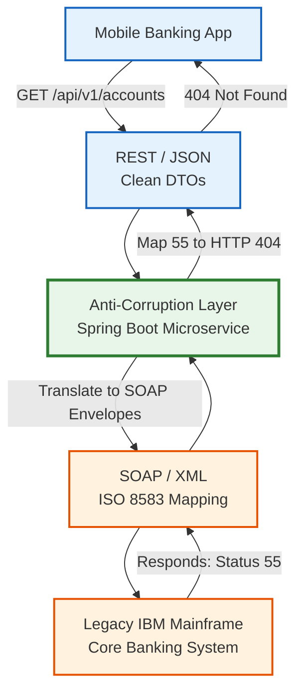
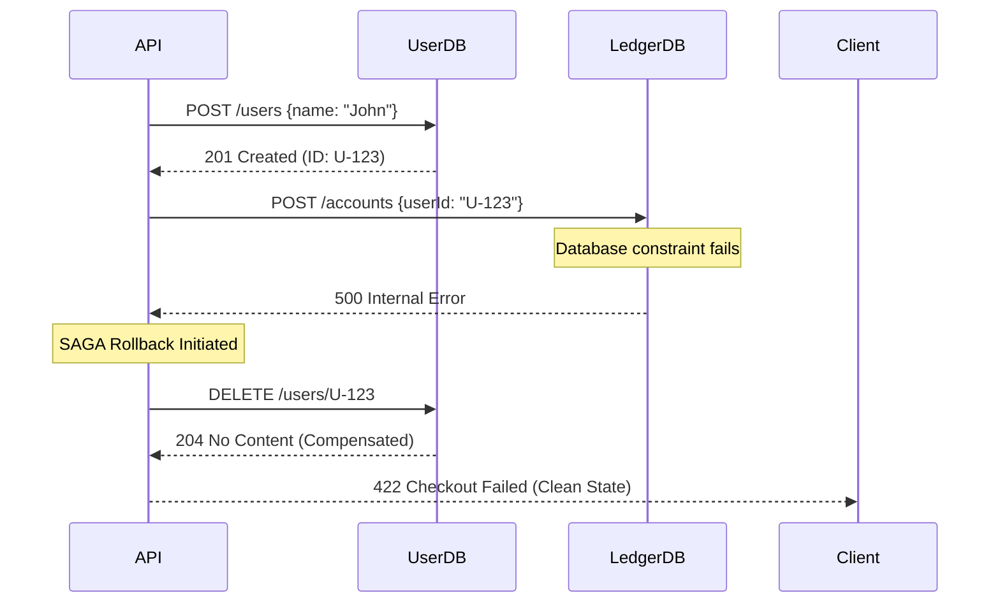

# Part 13: Enterprise Banking API Patterns

## Overview

Designing REST APIs for a modern Silicon Valley startup is fundamentally distinct from architecting APIs for a 150-year-old global banking institution. In enterprise finance, the stakes are existential. A single poorly designed endpoint can result in millions of dollars in fraudulent wire transfers, catastrophic regulatory fines, and irreparable reputational damage.

At the Staff/Principal engineering tier, you must navigate an environment characterized by decades of monolithic legacy Mainframe systems (IBM AS/400), complex cryptographic security mandates (mTLS, FAPI), and uncompromising regulatory frameworks (PSD2, GDPR, PCI-DSS).

This chapter dissects the specialized architectural patterns required to integrate modern, agile REST abstractions seamlessly over rigid legacy core processors, while strictly enforcing Open Banking initiatives and impenetrable compliance constraints.

---

## 13.1 Open Banking APIs & PSD2 Mandates

The Revised Payment Services Directive (PSD2) mathematically shattered the traditional banking monopoly. It legally compelled financial institutions (primarily in Europe and the UK, but rapidly establishing global precedents) to expose customer account data universally to authorized Third-Party Providers (TPPs) through standardized, open API interfaces.

### Core Open Banking Architectures
1.  **Account Information Service (AIS)**: Read-only API channels empowering TPPs (e.g., Mint, YNAB) to aggregate a consumer's balances and historical transactional ledgers securely across multiple dispersed banks into a singular application dashboard safely.
2.  **Payment Initiation Service (PIS)**: Write-channel APIs authorizing TPPs to explicitly initiate and execute bank-to-bank electronic fund transfers synchronously, entirely circumventing traditional Visa/Mastercard processing network interchange fees.
3.  **Confirmation of Payee (CoP)**: Fraud-prevention logic immediately validating that the destination Account Number legitimately aligns with the Name of the individual designated prior to executing the clearance routine.

### The FAPI (Financial-grade API) Standard
Standard RFC-compliant OAuth 2.0 utilizing Bearer Tokens is inherently vulnerable. If an attacker intercepts a Bearer Token from a browser's local storage or a compromised proxy, they can execute a malicious `POST /payments` indefinitely before the token expires.

The OpenID Foundation constructed the **FAPI Profile** to cryptographically harden OAuth 2.0 specifically to mitigate financial risk.
- **Mutual TLS (mTLS) Sender-Constrained Tokens**: Ordinary TLS solely authenticates the Bank's Server to the Client. Mutual TLS mandates the Third-Party Client additionally present its own cryptographically signed X.509 Certificate during the initial exact TCP Handshake. 
  The Authorization Server subsequently binds the issued Access Token mathematically to that specific Client Certificate (via the thumbprint). If a hacker steals the token and attempts to execute an API call from their laptop, the API Gateway immediately rejects it because the TLS handshake wasn't negotiated using the authentic, original, hardware-backed Client Certificate.
- **JARM (JWT Secured Authorization Response Mode)**: Ensures that the standard OAuth Authorization Codes returned to the browser via the URL redirect are structurally signed identically as a JSON Web Token (JWT). This neutralizes Man-in-the-Middle (MitM) or browser extension tampering risks modifying the parameters before redemption natively.

---

## 13.2 Payment Processing APIs: Architecting the Ledger

Executing a payment in a microservices ecosystem is an intricate distributed choreography. Monolithic architectures encapsulated this inside a singular Oracle Database Transaction (`BEGIN... COMMIT;`). Microservices demand intricate Saga patterns to ensure absolute data consistency.

### CQRS (Command Query Responsibility Segregation)
In banking, a `Read` requirement (Displaying Balance) is executed exponentially more frequently than a `Write` requirement (Executing Wire Transfer).
- **Command APIs**: A `POST /transfers` validates the payload context, enforces rigorous Idempotency, inserts an immutable event record into the Kafka stream, and swiftly returns `202 Accepted` returning the transaction ID exclusively.
- **Query APIs**: The heavy Kafka processor validates Fraud protocols asynchronously and systematically updates a materialized Read-Replica "Summary Database" (e.g., Elasticsearch or MongoDB). The Mobile App continually issues `GET /accounts/123` querying this distinct datastore independently.

### The Immutable Audit Ledger & Event Sourcing
Traditional applications alter state mutably. 
`UPDATE accounts SET balance = $50 WHERE id = 123` is a terrifying anti-pattern in high finance because the mathematical history of *why* the balance became $50 is irrevocably annihilated.

Instead, Enterprise Payments utilize **Event Sourcing**:
1. You append a sequential, read-only event uniformly into an append-only transaction table: `Event: DEBIT, Amount: $50, Type: ATM_WITHDRAWAL, Timestamp: 10:05AM`.
2. The current account balance fundamentally does not physically exist as a hardcoded column. It is mathematically materialized dynamically by folding/summing the entire chronological sequence of events mathematically from point zero. 
3. This creates absolute cryptographic auditability. If an auditor demands proof of a transaction, the ledger history is indisputable.

### ISO 20022 Interoperability
The entire global financial ecosystem (SWIFT, CHAPS, SEPA) is actively migrating exclusively to the ISO 20022 XML messaging standard. Modern PIS APIs often translate minimalist JSON (`{"amount": 500, "currency": "USD"}`) internally into verbose, strictly structured ISO 20022 `pacs.008` (Customer Credit Transfer) XML envelopes prior to integrating with the central clearing networks identically.

---

## 13.3 Regulatory Compliance (PCI-DSS, GDPR, SOX)

### PCI-DSS (Payment Card Industry Data Security Standard)
APIs handling Primary Account Numbers (PANs - 16-digit credit card numbers) face extreme liability.
- **Tokenization**: A microservice must practically never store, log, or transmit raw 16-digit PANs inside a standard JSON payload natively. The PCI boundary is sharply isolated. The `Card_Microservice` exclusively captures the PAN, securely transmits it to a third-party token vault (e.g., VGS or Stripe), and receives an inert cryptographic `Token` (e.g., `tok_189ABC`). The REST API universe only communicates utilizing this benign Token, slashing the compliance blast radius dynamically.
- **Format-Preserving Encryption (FPE)**: When returning data inside `GET /cards` API responses, PANs must be heavily truncated masked components (`XXXX-XXXX-XXXX-1234`), preserving layout but concealing exploit potential completely.

### GDPR (Right to Erasure vs. Data Retention)
A massive architectural friction point: The GDPR "Right to be Forgotten" mandates you delete a consumer's data unconditionally. However, Anti-Money Laundering (AML) / KYC statutes demand you retain financial transactional records unmodified for strictly 7 years for forensic auditing identically.
- **The API Solution (Crypto-Shredding)**: The data architecture encrypts all strictly Personally Identifiable Information (PII) like 'Name' and 'Email' utilizing a unique specific cryptographic cipher Key specifically assigned per individual user.
- When an API receives `DELETE /users/123`, the API *physically annihilates the unique user Key from the KMS (Key Management Service)*. The physical PII data remains physically residing on the disk structurally but transforms instantly into completely indecipherable, mathematically irreversible garbage blocks. The transactional ledger history (Amount $50) remains structurally intact but flawlessly anonymized natively obeying both mandates harmoniously.

### SOX (Sarbanes-Oxley)
SOX strictly enforces that individuals implementing code cannot symmetrically authorize the execution of that code dynamically in production. API release velocity requires continuous deployment pipelines explicitly demonstrating automated deployment gates universally segregating Duty responsibilities.

---

## 13.4 Enterprise Integration Patterns

### The Anti-Corruption Layer (ACL)
Core Banking Mainframes (AS/400, Z-Series) process the primary Ledger utilizing rigidly positional IBM MQ structures, convoluted SOAP endpoints, or proprietary TCP ISO 8583 connections established identically in 1985.
Subjecting modern React frontends or external Node.js microservices directly to these archaic constraints instantly infects the entire new ecosystem with antiquated technical debt constraints.

**The Solution:** The Anti-Corruption Layer microservice operates strictly as an architectural buffer exactly isolating the paradigms.
1. The Mobile application calls a pristine, beautifully engineered REST Endpoint structurally: `GET /api/v1/mortgages/123/balances`.
2. The ACL intercepts this, mapping the minimalist JSON. 
3. The ACL translates it seamlessly into a monolithic XML SOAP Envelope containing 45 mandatory empty legacy `<ns1:FillerBlock>` elements and initiates the TCP procedure specifically.
4. The Mainframe responds returning an obscure `StatusCode 99`.
5. The ACL interprets `99`, translates it dynamically into an `HTTP 409 Conflict`, formatting the response universally into an RFC 7807 Problem Details object, insulating the Mobile Application completely from comprehending what an AS/400 error constitutes identically.

### Saga Patterns for Distributed Transactions
When launching a `POST /mortgages/applications` request, it might require orchestrating updates across three distinct non-relational database ecosystems explicitly (The User_DB, the Risk_DB, and the Ledger_DB).
You possess precisely zero SQL `COMMIT` capabilities across these disparate network components.
- **Choreography**: Each service emits a Kafka event sequentially (`UserCreated` -> triggers `RiskCalculated`). If `LedgerFailed` executes ultimately, the system must trigger compensating transactional REST/Kafka commands structurally cascading backwards (`CancelRisk`, `DeleteUser`) to revert the aggregate state synthetically because traditional SQL Rollbacks cannot natively operate across network perimeters.

---

## Technical Visualizations

### The Anti-Corruption Layer Adapter Flow

### Saga Pattern: Synchronous Rest Compensating Transaction

---

## Advanced Interview Questions & Definitive Responses

### Q1: Detail the concept behind 'Sender-Constrained Tokens' utilizing mTLS within high-value Open Banking platforms. Why is OAuth 2.0 PKCE insufficient independently?
**Answer**: Standard OAuth 2.0 PKCE perfectly guards against authorization code interception initially during the browser redirection phases on mobile devices natively. However, once the Client extracts the ultimate Access Token (Bearer Token), PKCE ceases to offer value natively. If a network proxy or a malicious browser extension captures that string, it's globally functional universally. 
The FAPI profile introduces Mutual TLS (mTLS) to strictly construct 'Sender-Constrained Tokens'. The bank Authorization Server cryptographically binds the exact X.509 thumbprint certificate originally presented by the Client establishing the TCP connection directly into the JWT structure inherently. If a hacker steals the token and initiates a `POST /payments` request remotely, the API gateway aggressively audits the TLS handshake. It realizes the hacker cannot supply the identical underlying cryptographic X.509 digital certificate corresponding to the token bindings universally, comprehensively rejecting the transaction regardless of token validity implicitly. 

### Q2: You are migrating away from a Core Mainframe Architecture. How does an Anti-Corruption Layer (ACL) facilitate the Strangler Fig Pattern natively?
**Answer**: The Strangler Fig Pattern defines migrating a legacy monolithic system incrementally without initiating a catastrophic "Big Bang" release schedule globally. The Anti-Corruption Layer (ACL) serves as the indispensable structural foundation. We initially force all new modern REST microservices and Mobile Clients to exclusively interact exclusively utilizing the newly architected, pristine ACL APIs perfectly mirroring our ideal future Domain architecture dynamically. Behind the scenes, the ACL physically connects backwards mapping everything into the Mainframe implicitly. 
Over the next three years, as we systematically build the replacement modern microservices, we merely update the routing dynamically inside the ACL tier natively pointing at the new microservices exclusively instead of the Mainframe. The frontend Mobile Clients and consumers recognize precisely zero disruption, completely oblivious that the underlying legacy engine was physically substituted entirely. 

### Q3: When complying symmetrically with PCI-DSS regulations and GDPR erasure requests, how do you manage physical data destruction effectively in an append-only Event Sourced Architecture?
**Answer**: Event-Sourced ledgers are fundamentally immutable dynamically; executing standard SQL `DELETE` or `UPDATE` commands violates their core architectural purpose establishing identical forensic history fundamentally. To delete information physically adhering to GDPR we utilize a technique entitled "Crypto-Shredding."
All structurally sensitive Personal Identifiable Information (Names, PAN tokens, Phone Numbers) written symmetrically to the Kafka Event Stream is aggressively encrypted independently utilizing a unique cryptographic cipher key generated specifically isolating that precise user identity. These specific encryption keys are housed completely separately inside a restricted Key Management Service (AWS KMS). When a client legally invokes a `DELETE /account` request triggering GDPR execution rules natively, we do not attempt to alter the million rows of immutable historic Event Store blocks individually. We simply execute a singular deletion action physically destroying the exact Key isolated within the KMS natively. Instantly, all corresponding PII distributed widely throughout the immutable event streams becomes mathematically unrecoverable cryptographic garbage symmetrically, absolutely satisfying GDPR erasure mandates securely while retaining abstract transactional numeric flow data permanently satisfying AML auditing components equivalently.

### Q4: Detail specifically why caching Payment Account limits presents severe operational complexities structurally in Enterprise Banking, and how you architect around it globally? 
**Answer**: Caching static metadata explicitly like "Branch Hours" is trivial. Caching highly volatile financial limit evaluations specifically (e.g., "$10,000 daily wire limit") is exponentially dangerous. If a user wires $9,000 symmetrically, the transaction successfully traverses the Risk Engine globally updating the primary Database properly. If the API continues serving a profoundly stale replicated Cache indiscriminately declaring the limit remains pristine untouched at $10,000, configuring the identical user transferring an additional $9,000 subsequently a second later illegally bypasses the risk constraint completely triggering fraudulent processing exposure.
To navigate this safely while retaining scale, Banking APIs abandon standard simplistic Time-To-Live (TTL) cache structures completely regarding limit execution. We utilize centralized caching explicitly (Redis) functioning as an absolute single-source truth lock sequentially intercepting and atomically decrementing limits natively using Redis `DECR` capabilities directly inside RAM guaranteeing atomic synchronous subtraction independent of Database write latencies.

---

## Conclusion

Enterprise Banking REST API architecture supersedes generating elegant URI endpoints exclusively. The Staff level mandates orchestrating complex distributed transactions mathematically safely across volatile networks employing Saga choreography. It requires deploying impenetrable mTLS cryptographic boundaries defending Open Banking partner networks proactively. It forces the seamless translation between elegant JSON payload constructs and rigid IBM Mainframe TCP topologies preserving domain isolation dynamically. Adhering rigorously to these patterns dictates navigating high-finance microservice integration resiliently preventing compromise natively.
