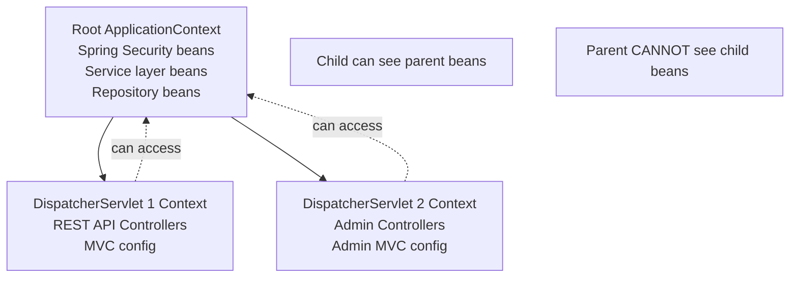
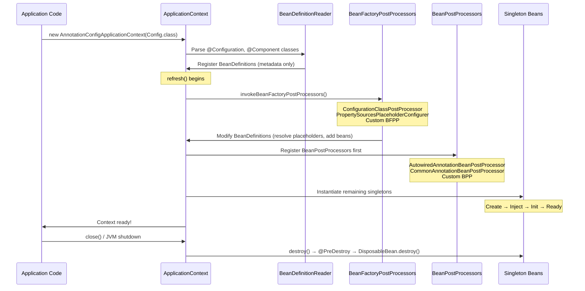
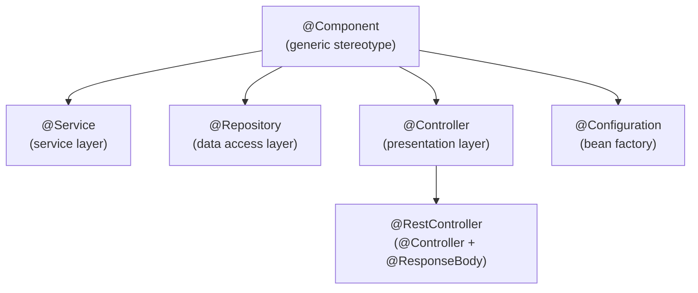

# Spring Core: IoC Container and Dependency Injection

## Overview

Inversion of Control (IoC) is the foundational principle of the Spring Framework, representing a paradigm shift from traditional object creation patterns. In conventional programming, your code creates and manages its own dependencies; with IoC, that control is *inverted* — the framework takes responsibility for creating, wiring, and managing object lifecycles. This inversion is precisely why these interviews probe deeply into IoC: it reflects a senior architect's understanding of software design principles, testability, and maintainability at scale.

In enterprise banking systems, IoC becomes critical when managing hundreds of beans across complex service hierarchies. A Payment Service doesn't manually create its TransactionRepository, AuditLogger, RiskEngine, and FraudDetectionService — Spring's IoC container wires them all together based on configuration, enabling clean separation of concerns and allowing each component to be replaced, mocked, or configured independently per environment.

Interviewers ask about IoC and DI because the answers reveal architectural maturity. A junior developer knows how to annotate a class with `@Component`. A senior architect understands *why* the container uses CGLIB proxying for `@Configuration` classes, when `BeanFactory` vs `ApplicationContext` is appropriate, and how the container resolves circular dependencies.

---

## Foundational Concepts

### What is Inversion of Control (IoC)?

IoC is a design principle where the control of object creation and lifecycle management is transferred from the application code to a framework or container. Instead of:

```java
// TRADITIONAL: You control everything (tight coupling, hard to test)
public class PaymentService {
    private TransactionRepository repository;
    
    public PaymentService() {
        // Tight coupling - cannot easily swap implementations
        this.repository = new JdbcTransactionRepository(new DataSource(...));
    }
}
```

With IoC:
```java
// IOC: Spring controls object creation (loose coupling, testable)
@Service
public class PaymentService {
    private final TransactionRepository repository;
    
    // Spring injects the dependency — PaymentService doesn't know HOW it's created
    public PaymentService(TransactionRepository repository) {
        this.repository = repository;
    }
}
```

The key insight: **dependencies flow IN (are injected), rather than being created internally**.

### IoC Container Architecture

```mermaid
graph TB
    subgraph "Spring IoC Container"
        BF[BeanFactory<br/>Core container interface]
        AC[ApplicationContext<br/>extends BeanFactory]
        BF --> AC
        
        subgraph "ApplicationContext Implementations"
            ACAC[AnnotationConfigApplicationContext<br/>Java-based config]
            CPXAC[ClassPathXmlApplicationContext<br/>XML config]
            GWAC[GenericWebApplicationContext<br/>Web applications]
            SBAC[AnnotationConfigServletWebServerApplicationContext<br/>Spring Boot Web]
        end
        
        AC --> ACAC
        AC --> CPXAC
        AC --> GWAC
        AC --> SBAC
    end
    
    subgraph "Input Sources"
        JAVA[@Configuration classes]
        XML[XML Files]
        ANNOT[@Component, @Service, @Repository]
        PROPS[Properties/YAML]
    end
    
    JAVA --> ACAC
    XML --> CPXAC
    ANNOT --> ACAC
    PROPS --> ACAC
    
    subgraph "Outputs"
        BEANS[Configured Bean Instances]
        ENV[Environment]
        EVTS[Application Events]
    end
    
    AC --> BEANS
    AC --> ENV
    AC --> EVTS
```

### BeanFactory vs ApplicationContext

| Feature | BeanFactory | ApplicationContext |
|---|---|---|
| **Bean instantiation** | Lazy (on demand) | Eager (by default for singletons) |
| **Internationalization** | ❌ Not supported | ✅ MessageSource |
| **Event publishing** | ❌ Not supported | ✅ ApplicationEventPublisher |
| **AOP integration** | Manual only | ✅ Auto-detection |
| **@PostConstruct / @PreDestroy** | ❌ Requires config | ✅ Auto-detected |
| **BeanPostProcessors** | Manual registration | ✅ Auto-detected |
| **Environment/Profiles** | ❌ Not supported | ✅ Full Environment abstraction |
| **Resource loading** | Basic ResourceLoader | ✅ ResourcePatternResolver |
| **Ideal use case** | Embedded systems, IoT | Enterprise applications |

> **Interview insight**: In practice, you almost always use `ApplicationContext`. `BeanFactory` exists for constrained environments (mobile, IoT) where the additional `ApplicationContext` features would be wasteful.

---

## Technical Deep Dive

### ApplicationContext Hierarchy

Spring supports parent-child container hierarchies, crucial for complex enterprise applications (like monoliths being broken into modules, or Spring MVC applications with a parent context):



```java
// Creating a parent-child context hierarchy
AnnotationConfigApplicationContext parent = new AnnotationConfigApplicationContext(ServiceConfig.class);
AnnotationConfigApplicationContext child = new AnnotationConfigApplicationContext();
child.setParent(parent);
child.register(WebConfig.class);
child.refresh();
```

### Container Lifecycle: Startup, Refresh, Shutdown



### Dependency Injection Mechanisms

#### 1. Constructor Injection (Preferred)

```java
@Service
public class PaymentProcessingService {
    
    private final PaymentRepository paymentRepository;
    private final FraudDetectionService fraudService;
    private final AuditLogger auditLogger;
    
    // @Autowired is OPTIONAL when there's only ONE constructor (Spring 4.3+)
    // With multiple constructors, @Autowired designates which to use
    public PaymentProcessingService(
            PaymentRepository paymentRepository,
            FraudDetectionService fraudService,
            AuditLogger auditLogger) {
        this.paymentRepository = paymentRepository;
        this.fraudService = fraudService;
        this.auditLogger = auditLogger;
    }
}
```

**Why constructor injection is preferred**:
- ✅ All dependencies are guaranteed to be set at object creation time
- ✅ Fields can be `final` — immutability by design
- ✅ Circular dependency failures are detected at startup (not at runtime)
- ✅ Objects are always in a valid state after construction
- ✅ Works in unit tests without Spring — just `new PaymentProcessingService(mock, mock, mock)`
- ✅ Forces you to notice when a class has too many dependencies (design smell)

#### 2. Setter Injection

```java
@Service
public class ReportingService {
    
    private EmailService emailService;
    
    // Use for OPTIONAL dependencies or when circular dependency resolution is needed
    @Autowired(required = false)  // optional dependency
    public void setEmailService(EmailService emailService) {
        this.emailService = emailService;
    }
}
```

**When setter injection makes sense**:
- Optional dependencies (`required = false`)
- When you need to re-configure beans after construction
- Breaking circular dependencies (though circular deps are a design smell)

#### 3. Field Injection (Discouraged)

```java
@Service
public class TransactionService {
    
    // ❌ DISCOURAGED - cannot be final, harder to test without Spring
    @Autowired
    private TransactionRepository repository;
    
    // ❌ DISCOURAGED - hidden dependency, not visible in constructor
    @Autowired
    private FraudService fraudService;
}
```

**Why field injection is discouraged**:
- ❌ Cannot make fields `final` — no immutability guarantee
- ❌ Requires Spring to test — cannot use plain `new`
- ❌ `NullPointerException` in unit tests if Spring isn't running
- ❌ Hides dependencies — violates single responsibility principle
- ❌ Reflection-based — slightly slower than constructor injection

#### 4. Method Injection (Lookup Method)

For injecting prototype-scoped beans into singleton beans:

```java
@Component
public abstract class CommandProcessor {
    
    // Spring generates a subclass that overrides this method
    // Each call returns a FRESH instance of ProcessingCommand
    @Lookup
    public abstract ProcessingCommand createCommand();
    
    public void processNextTransaction(Transaction tx) {
        ProcessingCommand command = createCommand(); // always fresh instance
        command.execute(tx);
    }
}

@Component
@Scope("prototype")
public class ProcessingCommand {
    // New instance every time createCommand() is called
}
```

### @Autowired, @Inject, @Resource: Key Differences

| Annotation | Package | Resolution Order | nullability |
|---|---|---|---|
| `@Autowired` | `org.springframework` | **Type first**, then qualifier, then name | `required = false` |
| `@Inject` | `jakarta.inject` (JSR-330) | **Type first**, then qualifier, then name | No `required` attribute |
| `@Resource` | `jakarta.annotation` (JSR-250) | **Name first**, then type | No `required` attribute |

```java
// @Autowired - Spring-specific, very common
@Autowired
private PaymentGateway gateway; // finds by type

// @Inject - JSR-330, framework-agnostic, interchangeable with @Autowired
@Inject
private PaymentGateway gateway;

// @Resource - finds by name FIRST (field name = "oracleGateway"), then type
@Resource(name = "oraclePaymentGateway")
private PaymentGateway gateway;
```

### Resolving Ambiguity: @Qualifier and @Primary

When multiple beans of the same type exist:

```java
@Component("stripeGateway")
public class StripePaymentGateway implements PaymentGateway { ... }

@Component("adyenGateway")
@Primary  // Default when no qualifier specified
public class AdyenPaymentGateway implements PaymentGateway { ... }

@Service
public class CheckoutService {
    
    @Autowired
    @Qualifier("stripeGateway")  // Explicit selection
    private PaymentGateway stripeGateway;
    
    @Autowired
    private PaymentGateway defaultGateway;  // Gets AdyenPaymentGateway (@Primary)
}
```

**Custom Qualifier Annotations** (enterprise pattern):

```java
// Define custom qualifier
@Target({ElementType.FIELD, ElementType.PARAMETER, ElementType.TYPE})
@Retention(RetentionPolicy.RUNTIME)
@Qualifier
public @interface ProductionGateway {}

@Target({ElementType.FIELD, ElementType.PARAMETER, ElementType.TYPE})
@Retention(RetentionPolicy.RUNTIME)
@Qualifier
public @interface SandboxGateway {}

// Apply custom qualifiers
@Component
@ProductionGateway
public class ProductionPaymentGateway implements PaymentGateway { ... }

@Component
@SandboxGateway
public class SandboxPaymentGateway implements PaymentGateway { ... }

// Inject with custom qualifier — readable and type-safe
@Service
public class PaymentRouter {
    
    @Autowired @ProductionGateway
    private PaymentGateway productionGateway;
    
    @Autowired @SandboxGateway
    private PaymentGateway sandboxGateway;
}
```

### Injecting Collections

```java
@Service
public class PaymentValidationService {
    
    // Spring injects ALL PaymentValidator beans into this list
    // Order can be controlled with @Order or Ordered interface
    private final List<PaymentValidator> validators;
    
    // Spring injects all PaymentValidator beans in a Map<bean-name, bean>
    private final Map<String, PaymentGateway> gatewaysByName;
    
    public PaymentValidationService(
            List<PaymentValidator> validators,
            Map<String, PaymentGateway> gatewaysByName) {
        this.validators = validators;
        this.gatewaysByName = gatewaysByName;
    }
    
    public void validate(Payment payment) {
        // Apply all validators in @Order sequence
        validators.forEach(v -> v.validate(payment));
    }
    
    public PaymentGateway getGateway(String type) {
        return gatewaysByName.get(type + "PaymentGateway");
    }
}
```

### Bean Definition and Registration

#### Stereotype Annotations



Key distinction: `@Repository` adds automatic **PersistenceExceptionTranslation** — Spring translates JPA/JDBC exceptions into Spring's `DataAccessException` hierarchy:

```java
@Repository  // Enables exception translation
public class JpaAccountRepository implements AccountRepository {
    // JPA PersistenceException → Spring DataAccessException
    // This allows callers to catch Spring exceptions, not JPA-specific ones
}
```

#### Programmatic Bean Registration

```java
@Configuration
public class DynamicBeanConfig implements BeanDefinitionRegistryPostProcessor {
    
    @Override
    public void postProcessBeanDefinitionRegistry(BeanDefinitionRegistry registry) {
        // Register beans conditionally or dynamically
        if (System.getenv("USE_ORACLE_GATEWAY") != null) {
            BeanDefinitionBuilder builder = BeanDefinitionBuilder
                .genericBeanDefinition(OraclePaymentGateway.class);
            builder.addPropertyValue("url", System.getenv("ORACLE_URL"));
            registry.registerBeanDefinition("paymentGateway", builder.getBeanDefinition());
        }
    }
    
    @Override
    public void postProcessBeanFactory(ConfigurableListableBeanFactory beanFactory) {
        // Additional factory post-processing
    }
}
```

#### FactoryBean Interface

```java
// FactoryBean creates complex objects that Spring can't create directly
@Component
public class CryptoServiceFactoryBean implements FactoryBean<CryptoService> {
    
    @Value("${crypto.keystore.path}")
    private String keystorePath;
    
    @Override
    public CryptoService getObject() throws Exception {
        // Complex initialization requiring multiple steps
        KeyStore keyStore = KeyStore.getInstance("PKCS12");
        keyStore.load(new FileInputStream(keystorePath), ...);
        return new CryptoService(keyStore);
    }
    
    @Override
    public Class<?> getObjectType() {
        return CryptoService.class;
    }
    
    @Override
    public boolean isSingleton() {
        return true; // Same instance every time
    }
}

// Usage: Spring auto-unwraps the FactoryBean
@Service
public class PaymentService {
    
    @Autowired
    private CryptoService cryptoService;  // Gets the CryptoService, not the FactoryBean
    
    @Autowired
    @Qualifier("&cryptoServiceFactoryBean")  // & prefix gets the FactoryBean itself
    private FactoryBean<CryptoService> factoryBean;
}
```

#### Conditional Bean Registration

```java
@Configuration
public class DataSourceConfig {
    
    // Only creates this bean if we're in Azure environment
    @Bean
    @ConditionalOnProperty(name = "cloud.provider", havingValue = "azure")
    @ConditionalOnClass(name = "com.microsoft.azure.spring.cloud.context.core.util.Memoizer")
    public DataSource azureDataSource() {
        return new AzureDataSource(...);
    }
    
    // Creates this bean ONLY if no DataSource bean exists
    @Bean
    @ConditionalOnMissingBean(DataSource.class)
    public DataSource defaultDataSource() {
        return new HikariDataSource(...);
    }
    
    // Custom @Conditional implementation
    @Bean
    @Conditional(IsProductionCondition.class)
    public AuditService strictAuditService() {
        return new StrictAuditService();
    }
}

// Custom Condition
public class IsProductionCondition implements Condition {
    @Override
    public boolean matches(ConditionContext context, AnnotatedTypeMetadata metadata) {
        Environment env = context.getEnvironment();
        return "production".equals(env.getProperty("spring.profiles.active"));
    }
}
```

### Component Scanning Configuration

```java
@Configuration
@ComponentScan(
    basePackages = "com.bank",
    includeFilters = {
        @ComponentScan.Filter(type = FilterType.ANNOTATION, classes = BankingComponent.class),
        @ComponentScan.Filter(type = FilterType.ASSIGNABLE_TYPE, classes = BatchProcessor.class)
    },
    excludeFilters = {
        @ComponentScan.Filter(type = FilterType.REGEX, pattern = "com\\.bank\\.legacy\\..*"),
        @ComponentScan.Filter(type = FilterType.ANNOTATION, classes = Deprecated.class)
    }
)
public class AppConfig {
    // @ComponentScan.Filter types:
    // ANNOTATION - has a specific annotation
    // ASSIGNABLE_TYPE - is/extends a specific type  
    // REGEX - class name matches regex pattern
    // ASPECTJ - matches AspectJ type expression
    // CUSTOM - implements TypeFilter interface
}
```

---

## Interview Questions & Model Answers

### Q1: What is the difference between BeanFactory and ApplicationContext?

**Model Answer**: Both are IoC container implementations in Spring. `BeanFactory` is the basic container that provides DI, while `ApplicationContext` extends it with enterprise-grade features.

Key differences: `ApplicationContext` supports i18n (MessageSource), application events (ApplicationEventPublisher), AOP integration, and profiles/environment abstraction. It also auto-detects `BeanPostProcessor` and `BeanFactoryPostProcessor` beans, which `BeanFactory` requires to be manually registered. 

In practice, you always use `ApplicationContext` in enterprise Java. `BeanFactory` is only appropriate for severely resource-constrained environments. In Spring Boot, `SpringApplication` always creates an `ApplicationContext`.

**Follow-up**: *When does ApplicationContext eagerly instantiate beans?* — Singleton beans are eagerly instantiated during `refresh()` by default. This catches configuration errors at startup rather than at runtime when the bean is first requested.

---

### Q2: Why is constructor injection preferred over field injection?

**Model Answer**: There are four strong reasons:

**1. Immutability**: Constructor injection allows fields to be `final`, preventing accidental re-assignment and making the object's state clear from the moment it's created.

**2. Testability**: With constructor injection, you test with plain Java: `new PaymentService(mockRepo, mockFraudService)`. Field injection requires either Spring context or reflection to inject mocks — both slow down and complicate tests.

**3. Fail-fast**: If a required dependency is missing, the application fails at startup with a clear error. Field injection can result in NullPointerExceptions at runtime.

**4. Design feedback**: Classes with too many constructor arguments are obvious — this signals violation of single responsibility and prompts refactoring. Field injection hides this.

The Spring team's own recommendation is constructor injection for required dependencies. See Spring Documentation and Josh Long's talks consistently using constructor injection.

---

### Q3: How does Spring resolve circular dependencies?

**Model Answer**: Spring handles circular dependencies differently based on injection type.

**Setter/field injection**: Spring CAN resolve circular dependencies. It creates bean A, creates bean B, injects A into B (using a partially-initialized A), then injects B into A. This is possible because singleton beans are placed in a three-level cache during creation.

**Constructor injection**: Spring CANNOT resolve circular dependencies. It fails at startup with `BeanCurrentlyInCreationException`. This is actually the *desired* behavior — circular dependencies between constructors indicate a design problem.

The three-level cache used for singleton beans:
- Level 1 (`singletonObjects`): fully initialized beans
- Level 2 (`earlySingletonObjects`): early exposed beans (not yet fully initialized)  
- Level 3 (`singletonFactories`): factories for creating early references

**Best practice**: Circular dependency is usually a design smell. Refactor by extracting shared logic into a third service, using events (`ApplicationEventPublisher`), or using `@Lazy` injection.

---

### Q4: What is the difference between @Component, @Service, @Repository, and @Controller?

**Model Answer**: All four are specializations of `@Component` and result in Spring-managed beans. However:

- `@Repository` adds **exception translation** via `PersistenceExceptionTranslationPostProcessor` — JPA/JDBC exceptions are automatically translated into Spring's `DataAccessException` hierarchy. This decouples your service layer from specific persistence technology exceptions.

- `@Service` has no special behaviour beyond `@Component` — it's a semantic marker for the service layer that communicates intent to developers and tools. Some AOP frameworks use it as a pointcut target.

- `@Controller` integrates with Spring MVC's handler mapping and creates a controller that can return view names.

- `@RestController` = `@Controller` + `@ResponseBody`, making every method return data (typically JSON) rather than view names.

**Interview insight**: The key technical difference is `@Repository`'s exception translation. The others are primarily semantic markers. This shows you understand why each annotation exists, not just that they *exist*.

---

### Q5: What is @Autowired and how does Spring resolve which bean to inject?

**Model Answer**: `@Autowired` instructs Spring to inject a dependency automatically. Spring's resolution algorithm is:

1. **By type**: Find all beans matching the required type
2. **If exactly one match**: inject it
3. **If multiple matches**: check for `@Primary` — inject the primary bean
4. **If still ambiguous**: use `@Qualifier` to specify by bean name
5. **If still not resolved**: use the field/parameter name as a fallback qualifier
6. **If still not resolved** and `required = true` (default): throw `NoUniqueBeanDefinitionException`

Example scenario from banking: You have `StripeGateway`, `AdyenGateway`, and `BraintreeGateway` all implementing `PaymentGateway`. Without `@Primary` or `@Qualifier`, Spring throws an exception. You'd annotate `AdyenGateway` with `@Primary` for the default production gateway, and use `@Qualifier("stripeGateway")` for specific injection points.

---

### Q6: Explain the @Configuration "full mode" vs "lite mode" distinction.

**Model Answer**: This is a subtle but important Spring internal.

**Full mode** (`@Configuration` on a class): Spring generates a CGLIB subclass of your config class. All `@Bean` methods are proxied, so calling one `@Bean` method from another returns the same singleton from the container:

```java
@Configuration  // FULL MODE - CGLIB proxy generated
public class ServiceConfig {
    @Bean
    public DataSource dataSource() { return new HikariDataSource(...); }
    
    @Bean
    public TransactionManager txManager() {
        // This call goes through the CGLIB proxy → returns SAME DataSource singleton
        return new DataSourceTransactionManager(dataSource());
    }
}
```

**Lite mode** (`@Configuration(proxyBeanMethods = false)` or just `@Component`): No CGLIB proxy. Inter-bean method calls are regular Java calls — each call creates a NEW instance:

```java
@Configuration(proxyBeanMethods = false)  // LITE MODE - no proxy, faster startup
public class ServiceConfig {
    @Bean
    public DataSource dataSource() { return new HikariDataSource(...); }
    
    @Bean  
    public TransactionManager txManager() {
        // This creates a NEW DataSource — NOT the container singleton!
        return new DataSourceTransactionManager(dataSource());
    }
}
```

**Why it matters**: Lite mode starts faster and avoids CGLIB overhead, but is ONLY safe when your `@Bean` methods don't call each other. Spring Boot auto-configuration classes use lite mode extensively for performance.

---

## Real-World Enterprise Scenarios

### Banking Microservice Bean Configuration

```java
// Production-grade configuration for a payment microservice
@Configuration
@EnableTransactionManagement
@EnableAspectJAutoProxy
@PropertySource("classpath:payment-service.properties")
public class PaymentServiceConfig {
    
    @Value("${hikari.pool.size:20}")
    private int poolSize;
    
    @Bean
    @Primary
    public DataSource primaryDataSource(
            @Value("${db.primary.url}") String url,
            @Value("${db.primary.username}") String username,
            @Value("${db.primary.password}") String password) {
        
        HikariConfig config = new HikariConfig();
        config.setJdbcUrl(url);
        config.setUsername(username);
        config.setPassword(password);
        config.setMaximumPoolSize(poolSize);
        config.setConnectionTimeout(30_000);
        config.setIdleTimeout(600_000);
        config.setMaxLifetime(1_800_000);
        config.setReadOnly(false);
        return new HikariDataSource(config);
    }
    
    @Bean("readReplicaDataSource")
    public DataSource readReplicaDataSource(
            @Value("${db.replica.url}") String url,
            @Value("${db.replica.username}") String username,
            @Value("${db.replica.password}") String password) {
        
        HikariConfig config = new HikariConfig();
        config.setJdbcUrl(url);
        config.setUsername(username);
        config.setPassword(password);
        config.setMaximumPoolSize(poolSize * 2); // More read replicas
        config.setReadOnly(true);
        return new HikariDataSource(config);
    }
    
    @Bean
    public PlatformTransactionManager transactionManager(DataSource primaryDataSource) {
        return new DataSourceTransactionManager(primaryDataSource);
    }
}
```

### Multi-Environment Configuration with Profiles

```java
@Configuration
@Profile("production")
public class ProductionConfig {
    
    @Bean
    public AuditService strictAuditService() {
        return new DatabaseAuditService(); // Writes to audit DB in production
    }
    
    @Bean
    public PaymentGateway adyenGateway(@Value("${adyen.api.key}") String apiKey) {
        return new AdyenPaymentGateway(apiKey, AdyenEnvironment.PRODUCTION);
    }
}

@Configuration
@Profile("sandbox | test")
public class SandboxConfig {
    
    @Bean
    public AuditService loggingAuditService() {
        return new LoggingAuditService(); // Just logs in test/sandbox
    }
    
    @Bean
    public PaymentGateway mockGateway() {
        return new StubPaymentGateway(StubPaymentGateway.ALWAYS_SUCCEED);
    }
}
```

---

## Common Pitfalls & Best Practices

### Anti-pattern 1: Field Injection in Production Code

```java
// ❌ BAD - common in legacy code
@Service
public class LegacyPaymentService {
    @Autowired private TransactionRepository repo;    // Cannot be final
    @Autowired private FraudService fraudService;    // Requires Spring to test
    @Autowired private AuditLogger logger;           // Hidden dependency
}

// ✅ GOOD
@Service
public class PaymentService {
    private final TransactionRepository repo;
    private final FraudService fraudService;
    private final AuditLogger logger;
    
    public PaymentService(TransactionRepository repo, FraudService fraudService, AuditLogger logger) {
        this.repo = repo;
        this.fraudService = fraudService;
        this.logger = logger;
    }
}
```

### Anti-pattern 2: Overusing @Autowired

```java
// ❌ BAD - @Autowired is not needed on constructors since Spring 4.3
@Service
public class AccountService {
    private final AccountRepository repository;
    
    @Autowired  // Redundant when there's ONE constructor
    public AccountService(AccountRepository repository) {
        this.repository = repository;
    }
}
```

### Anti-pattern 3: Circular Dependencies

```java
// ❌ CIRCULAR - design problem, not a Spring limitation
@Service
class OrderService {
    @Autowired PaymentService paymentService; // OrderService → PaymentService
}

@Service  
class PaymentService {
    @Autowired OrderService orderService;     // PaymentService → OrderService  
}

// ✅ FIX OPTION 1: Extract shared logic
@Service
class AmountCalculatorService { ... }  // Both depend on this

// ✅ FIX OPTION 2: Use application events
@Service
class OrderService {
    @Autowired ApplicationEventPublisher eventPublisher;
    
    public void completeOrder(Order order) {
        eventPublisher.publishEvent(new OrderCompletedEvent(order));
        // PaymentService listens and handles, no circular dep
    }
}
```

---

## Key Takeaways

- **IoC = Dependency inversion**: The container creates and wires objects; your code just declares what it needs
- **ApplicationContext > BeanFactory**: Always use `ApplicationContext` in enterprise apps; it adds events, i18n, AOP, profiles
- **Constructor injection is preferred**: Enables immutability (`final`), testability without Spring, and fail-fast startup
- **@Repository adds exception translation**: The only technical difference between stereotypes; others are semantic
- **@Autowired resolution order**: Type → @Primary → @Qualifier → field name — know this for interview
- **@Configuration full mode uses CGLIB**: Inter-`@Bean`-method calls return container singletons due to CGLIB proxying
- **Circular dependencies are design smells**: They're sometimes unavoidable, but always worth questioning
- **Custom qualifiers over string-based `@Qualifier`**: Type-safe, refactoring-safe custom qualifier annotations

---

## Further Reading

- [Spring Framework Reference — IoC Container](https://docs.spring.io/spring-framework/reference/core/beans.html)
- [Spring Framework Reference — Dependency Injection](https://docs.spring.io/spring-framework/reference/core/beans/dependencies/factory-collaborators.html)
- "Spring in Action" by Craig Walls, 6th Edition — Chapter 1-3
- [Baeldung — Spring Dependency Injection](https://www.baeldung.com/spring-dependency-injection)
- [Spring Blog — Understanding Spring's Configuration](https://spring.io/blog)
