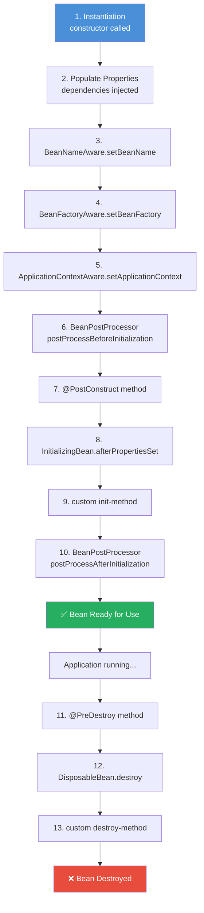
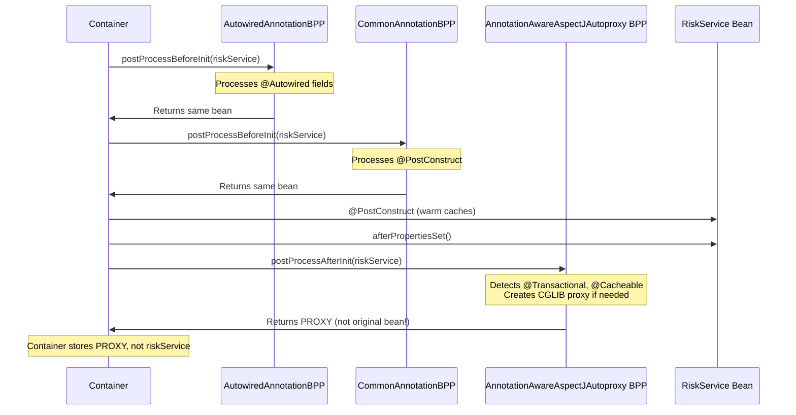
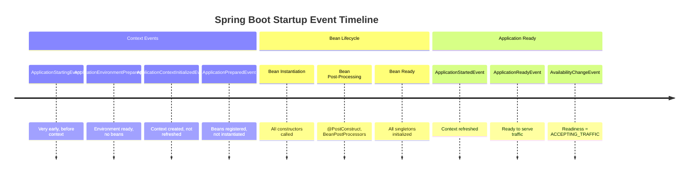
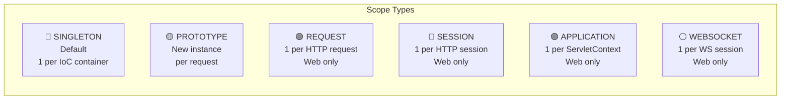
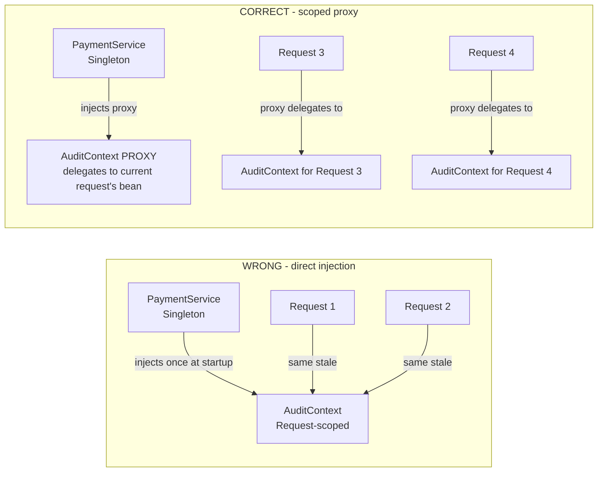
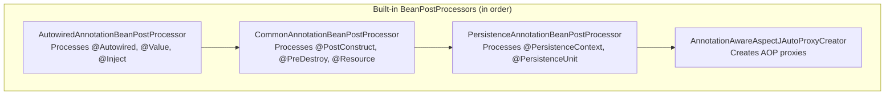

# Spring Bean Lifecycle and Scopes

## Overview

The Spring bean lifecycle is one of the most frequently tested topics in senior Java interviews. Understanding the complete lifecycle — from bean definition to destruction — demonstrates that you truly understand what Spring's IoC container does under the hood, rather than just using its annotations. At Staff/Principal level, interviewers expect you to know not just the sequence, but *why* each phase exists, what extension points are available at each stage, and how to use them in enterprise patterns like auditing, connection management, and security initialisation.

In banking systems, bean lifecycle hooks are used extensively: initialising connection pools (`@PostConstruct`), registering with service meshes, warming caches at startup, setting up cryptographic key material, and gracefully releasing resources (`@PreDestroy`) during rolling deployments. Bean scopes determine how your application handles concurrent requests, session state, and prototype pattern implementations.

Interviewers use lifecycle questions to separate developers who have used Spring from engineers who understand Spring. The ability to explain CGLIB proxy creation, `BeanPostProcessor` ordering, and scoped proxy injection shows architectural depth.

---

## Foundational Concepts

### The Complete Bean Lifecycle



### Key Phases Explained

| Phase | When | Extensions |
|---|---|---|
| Instantiation | Container creates bean instance | Custom constructor logic |
| Property Population | DI fills in all dependencies | `@Autowired`, `@Value` etc |
| Aware callbacks | Bean receives container references | `BeanNameAware`, `ApplicationContextAware` |
| BeanPostProcessor (before) | Called for ALL beans | Annotation processing, proxy creation |
| Init callbacks | Bean-specific initialization | `@PostConstruct`, `InitializingBean`, init-method |
| BeanPostProcessor (after) | Called for ALL beans | AOP proxy wrapping happens HERE |
| Ready | Bean available for use | — |
| Destroy callbacks | Container shutdown | `@PreDestroy`, `DisposableBean`, destroy-method |

---

## Technical Deep Dive

### Phase 1: Instantiation

Spring creates the bean using its constructor. If using `@Configuration` full mode, CGLIB-generated subclasses are instantiated instead of your actual class:

```java
@Service
public class RiskAssessmentService {
    private static final Logger log = LoggerFactory.getLogger(RiskAssessmentService.class);
    
    // Spring calls this constructor during Phase 1
    public RiskAssessmentService(RiskRuleRepository ruleRepository) {
        log.info("RiskAssessmentService instantiated");
        // At this point: NO other dependencies yet, NO @PostConstruct yet
        // DO NOT call other beans here - they might not be ready
    }
}
```

### Phases 3-5: Aware Callbacks

Aware interfaces provide beans with awareness of their Spring container context. Use sparingly — they create tight coupling to Spring:

```java
@Component
public class AuditContextHolder implements BeanNameAware, ApplicationContextAware {
    
    private String beanName;
    private ApplicationContext applicationContext;
    
    @Override
    public void setBeanName(String name) {
        this.beanName = name;
        // Called with the bean's name as registered in the container
    }
    
    @Override
    public void setApplicationContext(ApplicationContext ctx) {
        this.applicationContext = ctx;
        // Now you can publish events, get other beans, etc.
        // Called AFTER setBeanName but BEFORE @PostConstruct
    }
    
    // ⚠️ Consider ApplicationContextAware a design smell in most cases
    // Prefer constructor injection of specific beans instead
}
```

**When Aware interfaces are legitimate**:
- Framework libraries that need container access (custom starters)
- Infrastructure beans that manage other beans
- Test utilities

### Phase 6: BeanPostProcessor (Before Initialization)

This is where Spring processes annotations like `@Autowired`, `@Value`, validation annotations, etc.:

```java
@Component
public class MetricsAnnotationBeanPostProcessor implements BeanPostProcessor {
    
    private final MeterRegistry meterRegistry;
    
    public MetricsAnnotationBeanPostProcessor(MeterRegistry meterRegistry) {
        this.meterRegistry = meterRegistry;
    }
    
    @Override
    public Object postProcessBeforeInitialization(Object bean, String beanName) throws BeansException {
        // Called for EVERY bean BEFORE their init methods
        // Scan for custom @Timed annotations on methods
        Class<?> beanClass = bean.getClass();
        for (Method method : beanClass.getDeclaredMethods()) {
            if (method.isAnnotationPresent(MetricsTimeable.class)) {
                log.info("Registering timer for {}.{}", beanName, method.getName());
            }
        }
        return bean; // MUST return the bean (or a wrapper)
    }
    
    @Override
    public Object postProcessAfterInitialization(Object bean, String beanName) throws BeansException {
        // Called for EVERY bean AFTER their init methods
        // This is where AOP proxies are created!
        // If you return a different object here, the PROXY is what goes into the container
        return bean;
    }
}
```



### Phases 7-9: Initialization Callbacks

Three ways to trigger post-construction initialization, in order of precedence:

```java
@Service
public class CacheWarmingService implements InitializingBean {
    
    private final ProductCache productCache;
    private final TransactionRepository repository;
    private Map<String, BigDecimal> fxRates;
    
    public CacheWarmingService(ProductCache productCache, TransactionRepository repository) {
        this.productCache = productCache;
        this.repository = repository;
    }
    
    // ✅ OPTION 1: @PostConstruct (JSR-250) - PREFERRED
    // Framework-agnostic, clear intent
    @PostConstruct
    public void initializeCache() {
        log.info("Warming FX rate cache...");
        fxRates = repository.loadCurrentFxRates();
        productCache.warmUp();
        log.info("Cache warm-up complete. {} FX rates loaded", fxRates.size());
    }
    
    // ✅ OPTION 2: InitializingBean.afterPropertiesSet() - AVOID
    // Creates Spring dependency in your business code
    @Override
    public void afterPropertiesSet() throws Exception {
        // Called AFTER @PostConstruct
    }
}

// ✅ OPTION 3: init-method attribute — useful for third-party classes
@Configuration
public class ThirdPartyConfig {
    
    @Bean(initMethod = "initialize", destroyMethod = "cleanup")
    public LegacyConnectionPool legacyPool() {
        return new LegacyConnectionPool(...); // Class you don't own
    }
}
```

**Order**: `@PostConstruct` → `afterPropertiesSet()` → `init-method`

### Phases 11-13: Destruction Callbacks

```java
@Service
public class DatabaseConnectionService implements DisposableBean {
    
    private final HikariDataSource dataSource;
    private final ScheduledExecutorService scheduler;
    
    // ✅ OPTION 1: @PreDestroy (JSR-250) - PREFERRED
    @PreDestroy
    public void shutdown() {
        log.info("Shutting down ConnectionService, draining in-flight requests...");
        
        // 1. Stop accepting new connections
        scheduler.shutdown();
        
        // 2. Wait for in-flight work
        try {
            scheduler.awaitTermination(30, TimeUnit.SECONDS);
        } catch (InterruptedException e) {
            Thread.currentThread().interrupt();
        }
        
        // 3. Close connection pool
        dataSource.close();
        log.info("ConnectionService shutdown complete");
    }
    
    // ✅ OPTION 2: DisposableBean - AVOID (Spring coupling)
    @Override
    public void destroy() throws Exception {
        // Called AFTER @PreDestroy
    }
}
```

> **Production insight**: For graceful shutdown in Kubernetes, combine `@PreDestroy` with Spring Boot's graceful shutdown:
> ```yaml
> server:
>   shutdown: graceful
> spring:
>   lifecycle:
>     timeout-per-shutdown-phase: 30s
> ```

### Spring Boot ApplicationContext Events

```java
@Component
public class ApplicationStartupListener {
    
    // Called BEFORE refresh — context not fully initialized
    @EventListener
    public void onApplicationStarting(ApplicationStartingEvent event) {
        // Very early, almost nothing is available
    }
    
    // Called AFTER context refresh — all beans are ready
    @EventListener
    public void onApplicationReady(ApplicationReadyEvent event) {
        log.info("Application fully started and serving traffic");
        // Safe to call any Spring bean here — all initialized
    }
    
    // Called on graceful shutdown initiation
    @EventListener
    public void onApplicationStop(ApplicationReadyEvent event) {
        // Configure health checks to return degraded status
        // Give load balancers time to stop sending traffic
    }
}
```



---

## Bean Scopes

### The Six Built-in Scopes



### Singleton Scope (Default)

```java
@Service  // Singleton by default
public class AccountValidationService {
    // Single instance shared across all requests (and all threads!)
    // MUST be thread-safe — no mutable state, or use proper synchronisation
    
    private final AccountRepository repository;  // Singleton - fine
    
    // ❌ DANGER: Mutable state in singleton is NOT thread-safe
    // private Account lastValidated; // RACE CONDITION!
    
    public ValidationResult validate(Account account) {
        // Stateless logic — safe for singleton
        return ValidationResult.of(account);
    }
}
```

### Prototype Scope

```java
@Component
@Scope("prototype")  // Or @Scope(ConfigurableBeanFactory.SCOPE_PROTOTYPE)
public class TransactionProcessor {
    // New instance every time you get it from the container
    // Spring creates it and injects dependencies, but does NOT manage destruction
    // @PreDestroy is NOT called for prototypes!
    
    private final UUID processorId = UUID.randomUUID();
    private TransactionState state = TransactionState.INITIAL;  // Safe —— separate instance
    
    public void process(Transaction transaction) {
        this.state = TransactionState.PROCESSING;
        // ... process ...
        this.state = TransactionState.COMPLETE;
    }
}
```

### Injecting Narrow-Scope Beans into Wider-Scope Beans

**The Problem**: A singleton `PaymentService` injects a `request`-scoped `AuditContext`. The singleton is created once, but the `AuditContext` should be different per request:



```java
// ✅ CORRECT: Use scoped proxy for request-scoped bean in singleton
@Component
@RequestScope  // Equivalent to @Scope(value = "request", proxyMode = ScopedProxyMode.TARGET_CLASS)
// OR:
@Scope(value = WebApplicationContext.SCOPE_REQUEST, proxyMode = ScopedProxyMode.TARGET_CLASS)
public class TransactionAuditContext {
    private String requestId;
    private String userId;
    private Instant requestTime;
    // ... request-specific state
}

@Service  // Singleton
public class PaymentService {
    
    // Spring injects a PROXY, not the actual TransactionAuditContext
    // The proxy forwards calls to the correct request-scoped bean
    private final TransactionAuditContext auditContext;  
    
    public PaymentService(TransactionAuditContext auditContext) {
        // auditContext is a CGLIB proxy
        this.auditContext = auditContext;
    }
    
    public PaymentResult process(PaymentRequest request) {
        // Each request: proxy finds the correct TransactionAuditContext for THIS request
        auditContext.setRequestId(request.getId());
        // ...
    }
}
```

### Session Scope for Banking Workflows

```java
@Component
@SessionScope  // One instance per HTTP session
public class OnboardingWorkflowState implements Serializable {
    
    // Stores multi-step form data across HTTP requests in same session
    private CustomerDetails customerDetails;
    private KycDocuments kycDocuments;
    private AccountPreferences preferences;
    private OnboardingStep currentStep = OnboardingStep.PERSONAL_DETAILS;
    
    public void advanceTo(OnboardingStep nextStep) {
        validateTransition(currentStep, nextStep);
        this.currentStep = nextStep;
    }
    
    // Must implement Serializable for session replication in cluster
}
```

### Custom Scope Implementation

```java
// Example: A "batch" scope — one instance per batch job execution
public class BatchJobScope implements Scope {
    
    private final ThreadLocal<Map<String, Object>> batchScopeMap = 
        ThreadLocal.withInitial(HashMap::new);
    
    @Override
    public Object get(String name, ObjectFactory<?> objectFactory) {
        Map<String, Object> scope = batchScopeMap.get();
        return scope.computeIfAbsent(name, k -> objectFactory.getObject());
    }
    
    @Override
    public Object remove(String name) {
        return batchScopeMap.get().remove(name);
    }
    
    @Override
    public void registerDestructionCallback(String name, Runnable callback) {
        // Register callback to run when scope ends
    }
    
    @Override
    public String getConversationId() {
        return Thread.currentThread().getName(); // One per thread/batch
    }
}

// Register custom scope
@Configuration
public class BatchConfig {
    
    @Bean
    public static CustomScopeConfigurer customScopeConfigurer() {
        CustomScopeConfigurer configurer = new CustomScopeConfigurer();
        configurer.addScope("batch", new BatchJobScope());
        return configurer;
    }
}

// Use custom scope
@Component
@Scope("batch")
public class BatchAuditTrail { ... }
```

---

## BeanPostProcessor Deep Dive

### The Most Important BeanPostProcessors



### Writing a Custom BeanPostProcessor

```java
/**
 * Validates that all @Service beans implement at least one interface
 * (ensuring testability via interface-based mocking)
 */
@Component
public class InterfaceRequirementBeanPostProcessor implements BeanPostProcessor {
    
    @Override
    public Object postProcessAfterInitialization(Object bean, String beanName) throws BeansException {
        if (bean.getClass().isAnnotationPresent(Service.class)) {
            Class<?>[] interfaces = bean.getClass().getInterfaces();
            if (interfaces.length == 0) {
                throw new BeanInitializationException(
                    "Service bean '" + beanName + "' does not implement any interface. " +
                    "All services must implement an interface for testability.");
            }
        }
        return bean;
    }
}

/**
 * Enterprise pattern: Auto-register beans with a service registry
 */
@Component
public class ServiceRegistryBeanPostProcessor implements BeanPostProcessor {
    
    private final ServiceRegistry serviceRegistry;
    
    public ServiceRegistryBeanPostProcessor(ServiceRegistry serviceRegistry) {
        this.serviceRegistry = serviceRegistry;
    }
    
    @Override
    public Object postProcessAfterInitialization(Object bean, String beanName) throws BeansException {
        RegisterableService annotation = AnnotationUtils.findAnnotation(
            bean.getClass(), RegisterableService.class);
        
        if (annotation != null) {
            // Auto-register with service mesh
            serviceRegistry.register(annotation.name(), bean);
        }
        return bean;
    }
}
```

### BeanFactoryPostProcessor vs BeanPostProcessor

| Aspect | BeanFactoryPostProcessor | BeanPostProcessor |
|---|---|---|
| **When invoked** | After bean definitions are loaded, BEFORE beans instantiated | Around each bean's initialization |
| **What it operates on** | Bean definitions (metadata) | Actual bean instances |
| **Use cases** | Property placeholder resolution, bean definition modification | AOP proxying, annotation processing |
| **Examples** | `PropertySourcesPlaceholderConfigurer`, `ConfigurationClassPostProcessor` | `AutowiredAnnotationBeanPostProcessor`, AOP creators |

```java
@Component
public class DatabaseUrlSecurityBFPP implements BeanFactoryPostProcessor {
    
    @Override
    public void postProcessBeanFactory(ConfigurableListableBeanFactory beanFactory) {
        // Modify bean DEFINITIONS before any beans are created
        String[] beanNames = beanFactory.getBeanDefinitionNames();
        for (String beanName : beanNames) {
            BeanDefinition definition = beanFactory.getBeanDefinition(beanName);
            
            // Example: ensure all DataSource beans use SSL
            MutablePropertyValues props = definition.getPropertyValues();
            if (props.contains("url")) {
                String url = (String) props.get("url");
                if (url != null && !url.contains("ssl=true")) {
                    throw new BeanDefinitionValidationException(
                        "DataSource URL must include SSL=true: " + url);
                }
            }
        }
    }
}
```

---

## Interview Questions & Model Answers

### Q1: Walk me through the complete Spring bean lifecycle.

**Model Answer**: I'll trace a typical singleton bean:

1. **Instantiation**: Spring calls the constructor (or factory method). All constructor dependencies are injected.
2. **Property population**: `@Autowired`/`@Value` fields and setter injections are applied.
3. **Aware callbacks**: If the bean implements `BeanNameAware`, `ApplicationContextAware`, etc., Spring calls those setters.
4. **BeanPostProcessor before-init**: Every registered `BeanPostProcessor`'s `postProcessBeforeInitialization` is called. This is where annotation processing for `@PostConstruct` is prepared.
5. **@PostConstruct**: The method annotated with `@PostConstruct` executes.
6. **InitializingBean.afterPropertiesSet**: If implemented, called after `@PostConstruct`.
7. **Custom init-method**: `@Bean(initMethod = "...")` custom method, if any.
8. **BeanPostProcessor after-init**: `postProcessAfterInitialization` is called. **This is where AOP proxies are created** — the proxy replaces the original bean in the container.
9. **Ready**: The bean (or its proxy) is stored in the singleton pool and available for use.
10. **@PreDestroy**: Called on container shutdown.
11. **DisposableBean.destroy**: If implemented, called after `@PreDestroy`.
12. **Custom destroy-method**: Called last.

---

### Q2: Why doesn't @PreDestroy work for prototype beans?

**Model Answer**: Spring manages the complete lifecycle for singleton beans — creation through destruction. For prototype beans, Spring creates them and injects dependencies, but **does not track instances after creation**. Once you receive a prototype bean, Spring "forgets" about it.

The reason is memory management: if Spring tracked every prototype instance it ever created, it would create a memory leak. Prototypes are meant to be short-lived; it's the caller's responsibility to release them.

If you need destruction callbacks for prototype beans, you have two options:
1. Implement `Closeable` and manage lifecycle in your code
2. Inject the `ApplicationContext` and call `destroyScopedBean(beanName)` programmatically

---

### Q3: What is the difference between BeanPostProcessor and BeanFactoryPostProcessor?

**Model Answer**: Both are extension points but operate at different stages:

`BeanFactoryPostProcessor` runs **before any beans are instantiated**. It has access to bean *definitions* (metadata) and can modify them. Classic examples: `PropertySourcesPlaceholderConfigurer` (resolves `${...}` placeholders) and `ConfigurationClassPostProcessor` (processes `@Configuration` classes).

`BeanPostProcessor` runs **around each bean's initialization** (before/after init-methods). It has access to actual bean *instances*. Classic examples: `AutowiredAnnotationBeanPostProcessor` (processes `@Autowired`), `AnnotationAwareAspectJAutoProxyCreator` (creates AOP proxies).

**Critical detail**: `BeanPostProcessors` themselves are instantiated *before* other beans, so they must be self-sufficient (cannot have `@Autowired` dependencies on business beans). If you declare a `@Bean` of type `BeanPostProcessor`, it's eagerly instantiated before all other beans.

---

### Q4: When would you use prototype scope vs creating objects with `new`?

**Model Answer**: Use prototype scope when you need Spring to:
1. **Inject dependencies** into the prototype object (Spring fills `@Autowired` fields)
2. **Manage the lifecycle** (at least creation and DI, even if not destruction)
3. **Apply AOP** to the prototype (Spring wraps it in a proxy for `@Transactional`, `@Cacheable`, etc.)
4. **Apply BeanPostProcessors** to the prototype

Use `new` when:
- The object is a value object or DTO (no Spring dependencies)
- The object doesn't need AOP proxying
- You need raw performance (no Spring overhead)
- The object is truly transient and not managed

**The prototype scope problem**: If a singleton bean needs multiple prototype instances, injecting the prototype directly only works once. You need `@Lookup`, `ObjectFactory<>`, `ObjectProvider<>`, or `ApplicationContext.getBean()` to get fresh instances.

---

### Q5: What is a scoped proxy and when do you need one?

**Model Answer**: A scoped proxy is a wrapper around a narrower-scoped bean that allows it to be injected into a wider-scoped bean.

**The problem**: A singleton service needs a request-scoped audit context. But the singleton is created once at startup, when there's no HTTP request. Direct injection would fail.

**The solution**: Spring creates a proxy object with the same interface/class. The singleton holds a reference to this proxy. At runtime, each method call on the proxy is delegated to the actual request-scoped bean for the CURRENT HTTP request.

```java
@RequestScope  // = @Scope(value="request", proxyMode=ScopedProxyMode.TARGET_CLASS)
public class RequestAuditContext { ... }
```

`ScopedProxyMode.TARGET_CLASS` uses CGLIB (class-based proxy). Use `INTERFACES` when the bean implements interfaces.

---

## Common Pitfalls & Best Practices

```java
// ❌ PITFALL: Using ApplicationContext to look up beans in @PostConstruct
@Service
public class BadService implements ApplicationContextAware {
    private ApplicationContext ctx;
    
    @Override
    public void setApplicationContext(ApplicationContext ctx) {
        this.ctx = ctx;
    }
    
    @PostConstruct
    public void init() {
        // ❌ DANGEROUS: Other beans may not be fully initialized yet
        OtherService other = ctx.getBean(OtherService.class);
        other.initialize();  // OtherService might not have run @PostConstruct yet!
    }
}

// ✅ CORRECT: Use ApplicationReadyEvent to ensure all beans are ready
@Service
public class GoodService {
    private final OtherService otherService;
    
    @EventListener(ApplicationReadyEvent.class)
    public void onApplicationReady() {
        // ALL beans fully initialized at this point
        otherService.initialize();
    }
}
```

```java
// ❌ PITFALL: Mutable state in singleton
@Service
public class StatefulSingleton {
    private List<String> processingQueue = new ArrayList<>();  // NOT THREAD-SAFE!
    
    public void addToQueue(String item) {
        processingQueue.add(item);  // Race condition in multi-threaded environment!
    }
}

// ✅ CORRECT: Use thread-safe collections or ThreadLocal
@Service
public class StatelessSingleton {
    // If you need per-request state, use ThreadLocal or request scope
    private final ThreadLocal<String> currentUserId = new ThreadLocal<>();
}
```

---

## Key Takeaways

- **Lifecycle order**: Instantiate → Inject → Aware → BPP-before → @PostConstruct → afterPropertiesSet → init-method → BPP-after → Ready → @PreDestroy → destroy → destroy-method
- **AOP proxies are created in BPP postProcessAfterInitialization** — the proxy is what gets stored, not the original bean
- **@PreDestroy is NOT called for prototype beans** — Spring doesn't track prototype instances
- **Narrow scopes in wide scopes need scoped proxies** (request in singleton, session in singleton)
- **BeanFactoryPostProcessor** = modifies bean *definitions* before instantiation
- **BeanPostProcessor** = modifies bean *instances* around initialization
- **@PostConstruct is preferred** over `InitializingBean` — framework-agnostic, clear intent
- **Singletons must be thread-safe** — no mutable instance state without synchronisation

---

## Further Reading

- [Spring Bean Lifecycle Documentation](https://docs.spring.io/spring-framework/reference/core/beans/factory-nature.html)
- [Spring Bean Scopes Reference](https://docs.spring.io/spring-framework/reference/core/beans/factory-scopes.html)
- "Spring in Action" - Chapter 2 (Wiring Beans)
- [Baeldung — Spring Bean Lifecycle](https://www.baeldung.com/spring-bean-lifecycle)
- [Baeldung — Spring Bean Scopes](https://www.baeldung.com/spring-bean-scopes)
