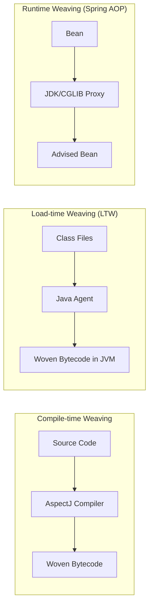
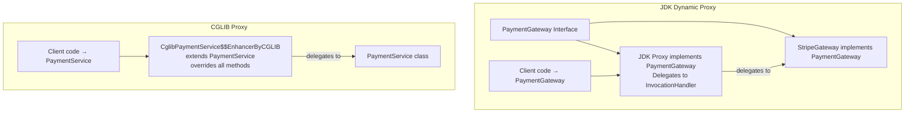
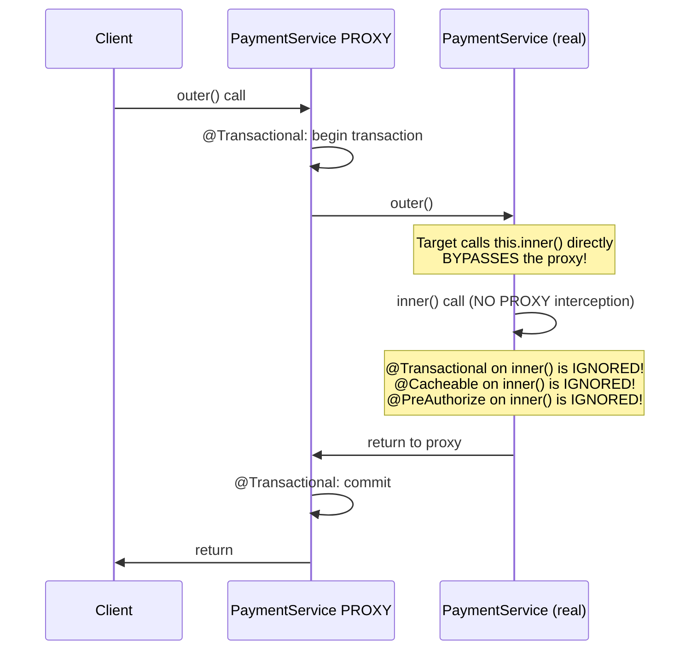

# Spring AOP: Aspect-Oriented Programming

## Overview

Aspect-Oriented Programming (AOP) addresses **cross-cutting concerns** — functionality that spans multiple modules (logging, security, transactions, performance monitoring, auditing) without being core to any single module's business logic. Without AOP, these concerns scatter across your codebase as boilerplate: every service method starts with a security check, logs entry/exit, and wraps logic in transaction management. AOP eliminates this duplication by modularising it into separate *aspects*.

In enterprise banking systems, AOP is the invisible foundation of critical infrastructure. Every `@Transactional` annotation, every `@PreAuthorize` security check, every `@Cacheable` call — all are powered by Spring AOP. A Staff Engineer must understand not just how to use these annotations, but how Spring *implements* them via proxies, what their limitations are (the self-invocation problem!), and how to write custom aspects for audit logging, performance tracking, and regulatory compliance.

Interviewers use AOP questions to distinguish engineers who understand Spring's internals from those who merely use its annotations. The self-invocation problem is a classic gotcha — experienced developers who rely on `@Transactional` without understanding its proxy mechanism get burned in production.

---

## Foundational Concepts

### AOP Terminology

| Term | Definition | Banking Example |
|---|---|---|
| **Aspect** | A module encapsulating a cross-cutting concern | `AuditAspect`, `PerformanceAspect` |
| **Join Point** | A specific point in program execution (method call, exception) | `transferFunds()` method call |
| **Advice** | Action executed at a join point | Log the transfer before/after |
| **Pointcut** | Expression selecting which join points to advise | All methods in `PaymentService` |
| **Weaving** | Process of linking aspects with application code | At compile time, load time, or runtime |
| **Target** | Object being advised | `PaymentService` instance |
| **Proxy** | AOP-created wrapper around the target | CGLIB/JDK proxy of `PaymentService` |

### AOP Weaving Types



**Spring AOP** uses **runtime proxy-based weaving** — the default approach. It creates a proxy around your bean that intercepts method calls and applies advice. This is simpler but has limitations (self-invocation!).

**AspectJ** (full AOP framework integrated with Spring) supports compile-time and load-time weaving — more powerful, no proxy limitations, but more complex setup.

---

## Technical Deep Dive

### JDK Dynamic Proxy vs CGLIB Proxy

This is a critical interview topic:



| Feature | JDK Dynamic Proxy | CGLIB Proxy |
|---|---|---|
| **Requirement** | Bean must implement at least one interface | Bean can be a concrete class |
| **Proxy type** | Implements same interface(s) as target | Subclasses the target class |
| **Works on** | Interface methods only | Any non-final, non-private method |
| **Final methods** | N/A (interface methods can't be final) | Cannot proxy `final` methods |
| **Performance** | Slightly faster (reflection-based) | Slightly slower (subclassing) |
| **Spring Boot default** | CGLIB since Spring Boot 2.0 | CGLIB since Spring Boot 2.0 |

```yaml
# Force CGLIB (or JDK) proxying:
spring:
  aop:
    proxy-target-class: true   # CGLIB (default in Spring Boot)
    # proxy-target-class: false  # JDK Dynamic Proxy
```

> **Interview insight**: Spring Boot 2.0+ uses CGLIB by default (changed from JDK Dynamic Proxy). This prevents bugs where autowiring by class type fails when only the interface was used as the proxy type.

### Advice Types in Detail

```java
@Aspect
@Component
public class BankingAuditAspect {
    
    private final AuditLogger auditLogger;
    private final MeterRegistry meterRegistry;
    
    public BankingAuditAspect(AuditLogger auditLogger, MeterRegistry meterRegistry) {
        this.auditLogger = auditLogger;
        this.meterRegistry = meterRegistry;
    }
    
    // ═══════════════════════════════════════════════════════════════
    // 1. @Before - runs BEFORE method execution
    // ═══════════════════════════════════════════════════════════════
    @Before("execution(* com.bank.payment..*Service.*(..)) && @annotation(com.bank.audit.Audited)")
    public void beforePaymentOperation(JoinPoint joinPoint) {
        String methodName = joinPoint.getSignature().getName();
        Object[] args = joinPoint.getArgs();
        auditLogger.logOperationStart(methodName, args);
        // Cannot prevent method execution from @Before (throw exception to abort)
    }
    
    // ═══════════════════════════════════════════════════════════════
    // 2. @AfterReturning - runs after SUCCESSFUL return
    // ═══════════════════════════════════════════════════════════════
    @AfterReturning(
        pointcut = "execution(* com.bank.payment.*Service.processPayment(..))",
        returning = "result"  // Bind return value
    )
    public void afterSuccessfulPayment(JoinPoint joinPoint, PaymentResult result) {
        auditLogger.logPaymentSuccess(result.getTransactionId(), result.getAmount());
        meterRegistry.counter("payment.success", "gateway", result.getGateway()).increment();
    }
    
    // ═══════════════════════════════════════════════════════════════
    // 3. @AfterThrowing - runs when method throws exception
    // ═══════════════════════════════════════════════════════════════
    @AfterThrowing(
        pointcut = "execution(* com.bank.payment.*Service.*(..))",
        throwing = "exception"
    )
    public void afterPaymentFailure(JoinPoint joinPoint, Exception exception) {
        auditLogger.logPaymentFailure(joinPoint.getSignature().getName(), exception);
        meterRegistry.counter("payment.failure", "reason", exception.getClass().getSimpleName()).increment();
        // Note: CANNOT suppress exception from @AfterThrowing
    }
    
    // ═══════════════════════════════════════════════════════════════
    // 4. @After (finally) - runs ALWAYS (success or failure)
    // ═══════════════════════════════════════════════════════════════
    @After("execution(* com.bank..*Controller.*(..))")
    public void recordApiCall(JoinPoint joinPoint) {
        // Equivalent to finally block
        auditLogger.recordApiCallCompleted(joinPoint.getSignature().getName());
    }
    
    // ═══════════════════════════════════════════════════════════════
    // 5. @Around - MOST POWERFUL: wraps entire method execution
    // ═══════════════════════════════════════════════════════════════
    @Around("@annotation(performanceMonitored)")
    public Object monitorPerformance(ProceedingJoinPoint pjp, PerformanceMonitored performanceMonitored) 
            throws Throwable {
        
        String methodName = pjp.getSignature().toShortString();
        long threshold = performanceMonitored.thresholdMs();
        
        Instant start = Instant.now();
        try {
            Object result = pjp.proceed();  // ← Actually calls the method
            // Can also call: pjp.proceed(newArgs) to modify arguments
            return result;
        } catch (Exception e) {
            // Can catch, rethrow, or wrap exceptions
            // Can even suppress exceptions and return fallback
            throw e;
        } finally {
            long elapsed = Duration.between(start, Instant.now()).toMillis();
            meterRegistry.timer("method.performance", "method", methodName)
                .record(elapsed, TimeUnit.MILLISECONDS);
            
            if (elapsed > threshold) {
                log.warn("SLOW METHOD: {} took {}ms (threshold: {}ms)", methodName, elapsed, threshold);
            }
        }
    }
}
```

### Pointcut Expressions

```java
@Aspect
@Component
public class PointcutLibrary {
    
    // ─── execution() - most common ───────────────────────────────────
    // execution(modifiers? return-type declaring-type? method-name(param-pattern) throws?)
    
    @Pointcut("execution(public * *(..))")
    public void publicMethods() {}
    
    @Pointcut("execution(* com.bank.payment..*Service.*(..))")
    // Any method, in com.bank.payment or subpackages, in a class ending in Service
    public void paymentServiceMethods() {}
    
    @Pointcut("execution(* com.bank..*(.., com.bank.domain.Account, ..))")
    // Methods with at least one Account parameter (anywhere in param list)
    public void methodsAcceptingAccount() {}
    
    // ─── within() - restricts by type ────────────────────────────────
    @Pointcut("within(com.bank.payment..*)")
    public void inPaymentPackage() {}
    
    @Pointcut("within(com.bank..*Controller)")
    public void inControllerClasses() {}
    
    // ─── @annotation() - by annotation ───────────────────────────────
    @Pointcut("@annotation(com.bank.audit.Audited)")
    public void auditedMethods() {}
    
    @Pointcut("@annotation(org.springframework.transaction.annotation.Transactional)")
    public void transactionalMethods() {}
    
    // ─── @within() - by class-level annotation ────────────────────────
    @Pointcut("@within(org.springframework.stereotype.Service)")
    public void inServiceClasses() {}
    
    // ─── args() - by parameter types ─────────────────────────────────
    @Pointcut("args(java.lang.String, ..)")                   // First param is String
    public void methodsWithStringFirst() {}
    
    @Pointcut("args(com.bank.domain.MonetaryAmount)")
    public void methodsWithMonetaryAmount() {}
    
    // ─── bean() - by bean name ────────────────────────────────────────
    @Pointcut("bean(*Service)")
    public void allServiceBeans() {}
    
    @Pointcut("bean(paymentService)")
    public void paymentServiceBean() {}
    
    // ─── Combining pointcuts with &&, ||, ! ───────────────────────────
    @Pointcut("paymentServiceMethods() && auditedMethods()")
    public void auditedPaymentMethods() {}
    
    @Pointcut("inPaymentPackage() && !within(com.bank.payment.internal..*)")
    public void publicPaymentMethods() {}
    
    // ─── ADVANCED: Binding parameters ────────────────────────────────
    @Around("execution(* com.bank..*Service.*(..)) && args(amount, ..)")
    public Object moneyAdvice(ProceedingJoinPoint pjp, BigDecimal amount) throws Throwable {
        if (amount.compareTo(MONITORING_THRESHOLD) > 0) {
            log.info("Large transaction detected: {}", amount);
        }
        return pjp.proceed();
    }
}
```

### The Self-Invocation Problem (CRITICAL Interview Topic)



```java
@Service
public class PaymentService {
    
    @Transactional  // ✅ Works - called through proxy from outside
    public void processPayment(Payment payment) {
        // ...
        this.recordAuditLog(payment);  // ❌ SELF-INVOCATION - bypasses proxy!
    }
    
    @Transactional(propagation = REQUIRES_NEW)  // ❌ IGNORED - never intercepted!
    @Audited                                    // ❌ IGNORED - never intercepted!
    public void recordAuditLog(Payment payment) {
        // This @Transactional and @Audited have NO EFFECT
        // because this.recordAuditLog() goes directly to the target object
    }
}
```

**Solutions to Self-Invocation**:

```java
// SOLUTION 1: Inject the proxy via @Autowired self-reference (Spring 4.3+)
@Service
public class PaymentService {
    
    @Autowired
    @Lazy  // Prevents circular dependency
    private PaymentService self;  // This is the PROXY
    
    public void processPayment(Payment payment) {
        self.recordAuditLog(payment);  // Goes through PROXY → @Transactional works!
    }
    
    @Transactional(propagation = REQUIRES_NEW)
    public void recordAuditLog(Payment payment) { ... }
}

// SOLUTION 2: Move inner method to another bean (PREFERRED)
@Service
public class PaymentAuditService {  // Separate bean = separate proxy
    
    @Transactional(propagation = REQUIRES_NEW)
    public void recordAuditLog(Payment payment) { ... }
}

@Service
public class PaymentService {
    private final PaymentAuditService auditService;  // Injected
    
    public void processPayment(Payment payment) {
        auditService.recordAuditLog(payment);  // Goes through proxy ✅
    }
}

// SOLUTION 3: Use AspectJ weaving (compile-time or LTW) - no proxy limitation
// spring.aop.aspectj-weaving=autodetect (requires spring-aspects dependency)
```

### AOP Use Cases in Enterprise Banking

```java
// ═══════════════════════════════════════════════
// 1. AUDIT LOGGING ASPECT
// ═══════════════════════════════════════════════
@Aspect
@Component
public class FinancialAuditAspect {
    
    @Around("@annotation(Audited)")
    public Object auditOperation(ProceedingJoinPoint pjp, Audited audited) throws Throwable {
        String userId = SecurityContextHolder.getContext().getAuthentication().getName();
        String operation = pjp.getSignature().getName();
        Object[] args = pjp.getArgs();
        
        AuditRecord record = AuditRecord.builder()
            .userId(userId)
            .operation(operation)
            .timestamp(Instant.now())
            .arguments(sanitize(args))  // Remove sensitive data
            .correlationId(MDC.get("correlationId"))
            .build();
        
        try {
            Object result = pjp.proceed();
            record.setStatus("SUCCESS");
            return result;
        } catch (Exception e) {
            record.setStatus("FAILURE");
            record.setErrorMessage(e.getMessage());
            throw e;
        } finally {
            auditRepository.save(record);  // Non-transactional to ensure audit saved
        }
    }
}

// ═══════════════════════════════════════════════
// 2. RATE LIMITING ASPECT  
// ═══════════════════════════════════════════════
@Aspect
@Component
public class RateLimitingAspect {
    
    private final RateLimiterRegistry limiterRegistry;
    
    @Around("@annotation(RateLimit)")
    public Object enforceRateLimit(ProceedingJoinPoint pjp, RateLimit limit) throws Throwable {
        String key = pjp.getSignature().getName() + "-" + getCurrentUser();
        RateLimiter limiter = limiterRegistry.rateLimiter(key, () -> 
            RateLimiterConfig.custom()
                .limitForPeriod(limit.permitsPerSecond())
                .limitRefreshPeriod(Duration.ofSeconds(1))
                .build());
        
        if (!limiter.acquirePermission()) {
            throw new RateLimitExceededException("Rate limit exceeded for operation: " + key);
        }
        return pjp.proceed();
    }
}
```

### Custom Annotation Example

```java
// Define custom annotation
@Target(ElementType.METHOD)
@Retention(RetentionPolicy.RUNTIME)
@Documented
public @interface Idempotent {
    int ttlMinutes() default 60;
    String keyExpression() default "";  // SpEL expression for idempotency key
}

// Aspect implementation
@Aspect
@Component
public class IdempotencyAspect {
    
    private final RedisTemplate<String, Object> redisTemplate;
    
    @Around("@annotation(idempotent)")
    public Object enforceIdempotency(ProceedingJoinPoint pjp, Idempotent idempotent) 
            throws Throwable {
        
        // Calculate idempotency key from annotation SpEL or header
        String key = calculateKey(pjp, idempotent);
        String cacheKey = "idempotency:" + key;
        
        // Check if already processed
        Object cachedResult = redisTemplate.opsForValue().get(cacheKey);
        if (cachedResult != null) {
            log.info("Returning cached idempotent result for key: {}", key);
            return cachedResult;  // Return previous result without re-executing
        }
        
        // Execute and cache result
        Object result = pjp.proceed();
        redisTemplate.opsForValue().set(cacheKey, result, 
            idempotent.ttlMinutes(), TimeUnit.MINUTES);
        
        return result;
    }
}

// Usage in payment service
@PostMapping("/payments")
@Idempotent(ttlMinutes = 60, keyExpression = "#request.idempotencyKey")
public PaymentResponse createPayment(@RequestBody PaymentRequest request) {
    return paymentService.process(request);
}
```

---

## Interview Questions & Model Answers

### Q1: What are the limitations of Spring AOP compared to AspectJ?

**Model Answer**: Spring AOP is proxy-based, so it has several key limitations:

1. **Self-invocation**: When a bean's method calls another method on `this`, it bypasses the proxy. `@Transactional`, `@Cacheable`, etc. won't work on self-invoked methods.

2. **Final methods**: CGLIB proxies work by subclassing; they cannot override `final` methods. Annotating a `final` method with `@Transactional` silently does nothing.

3. **Private/package-private methods**: Spring AOP only intercepts methods visible to subclasses (public and protected). Annotations on private methods are ignored.

4. **JDK class methods**: Cannot advise methods on JDK classes (like `String`, `List`) since Spring can't create proxies for classes it doesn't manage.

5. **Non-Spring beans**: Only manages beans in the Spring container; objects created with `new` are not proxied.

AspectJ weaving (compile-time or load-time) eliminates ALL of these limitations by modifying actual bytecode.

---

### Q2: How does @Transactional work internally in Spring?

**Model Answer**: `@Transactional` is implemented via Spring AOP:

1. When Spring initializes a `@Transactional` bean, `AnnotationAwareAspectJAutoProxyCreator` (a `BeanPostProcessor`) detects the annotation and creates a CGLIB proxy wrapping the original bean.

2. The proxy has a `TransactionInterceptor` (which implements `MethodInterceptor`) that intercepts method calls.

3. When you call a `@Transactional` method:
   - `TransactionInterceptor.invoke()` is called on the proxy
   - It looks up the `PlatformTransactionManager` bean
   - Checks if a transaction already exists based on `Propagation`
   - Creates/joins a transaction according to propagation rules
   - Sets the transaction bound to the current thread via `TransactionSynchronizationManager` (which uses a `ThreadLocal` internally)
   - Calls the actual method
   - On success: commits
   - On exception matching `rollbackFor` rules: rolls back
   - Returns the result

The key insight: **transactions are thread-bound** (via `ThreadLocal`). That's why `@Transactional` doesn't work across threads, and why asynchronous execution (`@Async`) requires special handling.

---

### Q3: What is the difference between @Before, @After, @Around advice?

**Model Answer**:

- **@Before**: Runs before the method. Cannot prevent execution (only by throwing exception), cannot access the return value.

- **@AfterReturning**: Runs only when method returns normally (no exception). Can access and use the return value via `returning` attribute.

- **@AfterThrowing**: Runs only when method throws exception. Can access the thrown exception but cannot suppress it (only re-throw).

- **@After**: Like Java's `finally` — runs regardless of success or failure. Cannot access the return value or exception.

- **@Around**: The most powerful. Controls whether the method executes at all (via `pjp.proceed()`), can modify arguments (`pjp.proceed(newArgs)`), modify the return value, catch and suppress exceptions, or even call the method multiple times. It is required to call `pjp.proceed()` or the original method will never execute.

**When to use each**: Use `@Before`/`@After`/`@AfterReturning` for simple scenarios (logging, metrics) because they're easier to reason about. Use `@Around` when you need full control: retry logic, idempotency, caching, circuit breaking, timing.

---

### Q4: How do you prevent AOP interception for specific methods?

**Model Answer**: Several strategies:

1. **Make the method `final`**: CGLIB cannot proxy final methods (crude but effective for CGLIB).

2. **Use pointcut expressions to exclude**: Add `&& !execution(* *.excludedMethod(..))` to your pointcut.

3. **Create a no-advise marker annotation** and use `!@annotation(NoAdvise)` in pointcut.

4. **Use `@EnableAspectJAutoProxy(exposeProxy = false)`** — but this affects all beans globally.

For testing, use `@MockBean` which bypasses the real proxy, or restructure tests to verify behaviour through the public API.

---

## Key Takeaways

- **Spring AOP is proxy-based** — knows this limitation: self-invocation bypasses proxy
- **CGLIB is Spring Boot's default** — subclasses your bean; requires non-final methods
- **JDK Dynamic Proxy** requires interface implementation; uses reflection
- **`@Around` is the most powerful** advice type — controls method execution entirely
- **Self-invocation problem**: `this.method()` never goes through proxy — use a separate bean
- **`@Transactional` on final/private methods does nothing** — silently ignored
- **AOP proxy created in BPP postProcessAfterInitialization** — container stores proxy, not original
- **Business logic in `@Around` must call `pjp.proceed()`** or method never executes

---

## Further Reading

- [Spring Framework AOP Reference](https://docs.spring.io/spring-framework/reference/core/aop.html)
- [Spring AOP vs AspectJ](https://docs.spring.io/spring-framework/reference/core/aop/choosing.html)
- "Spring in Action" Chapter 4 — Aspect-Oriented Spring
- [Baeldung — Introduction to Spring AOP](https://www.baeldung.com/spring-aop)
- [Baeldung — Spring AOP Pointcut Expressions](https://www.baeldung.com/spring-aop-pointcut-tutorial)
