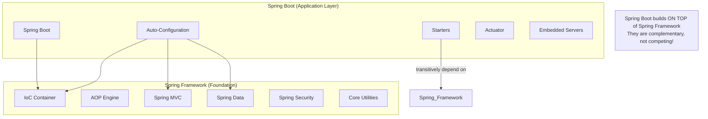
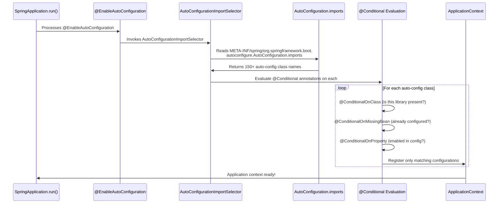

# Spring Boot Fundamentals and Auto-Configuration

## Overview

Spring Boot transforms Spring application development through two core principles: **convention over configuration** and **opinionated defaults**. Before Spring Boot, configuring a Spring web application required explicit setup of every component — DispatcherServlet, ViewResolver, DataSource, TransactionManager, ObjectMapper. Spring Boot eliminates this ceremony by auto-configuring these components based on what's on your classpath and how you've configured the application.

Auto-configuration is arguably Spring Boot's most important and misunderstood feature. Understanding how it works internally — the role of `@Conditional` annotations, the `AutoConfiguration.imports` file, the ordering mechanisms, and the debugging tools — separates senior engineers from junior ones. In enterprise banking environments, you'll need to write custom starters, disable conflicting auto-configurations, and understand exactly what Spring Boot is configuring (and why) when something unexpected happens in production.

---

## Foundational Concepts

### Spring Boot vs Spring Framework



**What Spring Boot adds**:
1. **Auto-configuration**: Automatically configures everything it can infer from the classpath
2. **Starters**: Curated dependency groupings (one dep → many transitive deps)
3. **Embedded servers**: `spring-boot-starter-web` includes an embedded Tomcat
4. **Opinionated defaults**: Production-ready defaults for HikariCP, Logback, Jackson etc.
5. **Actuator**: Production metrics, health checks, and management endpoints

### @SpringBootApplication

```java
// This single annotation is shorthand for THREE annotations:
@SpringBootApplication
public class BankingApplicationMain {
    public static void main(String[] args) {
        SpringApplication.run(BankingApplicationMain.class, args);
    }
}

// Equivalent to:
@SpringBootConfiguration     // = @Configuration: marks as config class
@EnableAutoConfiguration     // Triggers auto-configuration
@ComponentScan               // Scans current package and sub-packages
public class BankingApplicationMain { ... }
```

---

## Auto-Configuration Deep Dive

### How Auto-Configuration Works



### AutoConfiguration.imports (Spring Boot 3.x)

In Spring Boot 2.x, auto-configuration classes were listed in `META-INF/spring.factories`:
```properties
# Spring Boot 2.x (DEPRECATED in 3.x)
org.springframework.boot.autoconfigure.EnableAutoConfiguration=\
  org.springframework.boot.autoconfigure.web.servlet.WebMvcAutoConfiguration,\
  org.springframework.boot.autoconfigure.data.jpa.JpaRepositoriesAutoConfiguration,\
  ...
```

In Spring Boot 3.x (changed in 2.7, finalized in 3.0):
```
# META-INF/spring/org.springframework.boot.autoconfigure.AutoConfiguration.imports
org.springframework.boot.autoconfigure.web.servlet.WebMvcAutoConfiguration
org.springframework.boot.autoconfigure.data.jpa.JpaRepositoriesAutoConfiguration
org.springframework.boot.autoconfigure.security.servlet.SecurityAutoConfiguration
# ... 150+ lines
```

### Real Auto-Configuration Example: DataSource

```java
// Spring Boot's DataSourceAutoConfiguration (simplified for learning)
@AutoConfiguration
@ConditionalOnClass({ DataSource.class, EmbeddedDatabaseType.class })
@ConditionalOnMissingBean(type = "io.r2dbc.spi.ConnectionFactory")
@EnableConfigurationProperties(DataSourceProperties.class)
@Import({ DataSourcePoolMetadataProvidersConfiguration.class,
          DataSourceCheckpointRestoreConfiguration.class })
public class DataSourceAutoConfiguration {

    @Configuration(proxyBeanMethods = false)
    @Conditional(EmbeddedDatabaseCondition.class)
    @ConditionalOnMissingBean({ DataSource.class, XADataSource.class })
    @Import(EmbeddedDataSourceConfiguration.class)
    protected static class EmbeddedDatabaseConfiguration {
        // Only creates H2/HSQL/Derby in-memory datasource
        // when no explicit DataSource bean exists
    }

    @Configuration(proxyBeanMethods = false)
    @Conditional(PooledDataSourceCondition.class)
    @ConditionalOnMissingBean({ DataSource.class, XADataSource.class })
    @Import({ DataSourceConfiguration.Hikari.class,
              DataSourceConfiguration.Tomcat.class,
              DataSourceConfiguration.Dbcp2.class })
    protected static class PooledDataSourceConfiguration {
        // Creates HikariCP (preferred) if hikari is on classpath
    }
}

// HikariCP gets selected automatically:
@Configuration(proxyBeanMethods = false)
@ConditionalOnClass(HikariDataSource.class)
@ConditionalOnMissingBean(DataSource.class)
@ConditionalOnProperty(name = "spring.datasource.type", havingValue = "com.zaxxer.hikari.HikariDataSource",
                       matchIfMissing = true)
static class Hikari {
    @Bean
    @ConfigurationProperties(prefix = "spring.datasource.hikari")
    HikariDataSource dataSource(DataSourceProperties properties) {
        HikariDataSource dataSource = createDataSource(properties, HikariDataSource.class);
        return dataSource;
    }
}
```

**What this means**: When you add `spring-boot-starter-data-jpa`:
1. `HikariCP` is on the classpath → `@ConditionalOnClass(HikariDataSource.class)` → ✅
2. No `DataSource` bean configured → `@ConditionalOnMissingBean(DataSource.class)` → ✅
3. `spring.datasource.type` not set → `matchIfMissing = true` → ✅
4. **Result**: HikariCP `DataSource` is automatically configured with `spring.datasource.*` properties

### The @Conditional Annotation Family

```java
@Configuration
public class ConditionalExamplesConfig {

    // ─── Class-based conditions ───────────────────────────────────────
    @Bean
    @ConditionalOnClass(KafkaTemplate.class)  // Only if spring-kafka is on classpath
    public KafkaHealthIndicator kafkaHealthIndicator() { ... }
    
    @Bean
    @ConditionalOnMissingClass("io.r2dbc.spi.ConnectionFactory")  // Only if R2DBC NOT present
    public JdbcDataSource jdbcDataSource() { ... }
    
    // ─── Bean-based conditions ────────────────────────────────────────
    @Bean
    @ConditionalOnBean(DataSource.class)  // Only if DataSource bean already exists
    public TransactionManager txManager(DataSource ds) { ... }
    
    @Bean
    @ConditionalOnMissingBean(CacheManager.class)  // Only if no CacheManager defined
    public CaffeineCacheManager defaultCacheManager() { ... }
    
    // ─── Property-based conditions ────────────────────────────────────
    @Bean
    @ConditionalOnProperty(
        prefix = "app.metrics",
        name = "enabled",
        havingValue = "true",
        matchIfMissing = false  // Default: don't create if property absent
    )
    public MetricsCollector metricsCollector() { ... }
    
    // ─── Web application conditions ───────────────────────────────────
    @Bean
    @ConditionalOnWebApplication(type = ConditionalOnWebApplication.Type.SERVLET)
    public RequestContextFilter requestContextFilter() { ... }
    
    @Bean
    @ConditionalOnWebApplication(type = ConditionalOnWebApplication.Type.REACTIVE)
    public ReactiveRequestContextFilter reactiveFilter() { ... }
    
    // ─── Resource-based conditions ────────────────────────────────────
    @Bean
    @ConditionalOnResource(resources = "classpath:custom-config.xml")
    public XmlDrivenConfig xmlConfig() { ... }
    
    // ─── Expression-based conditions ─────────────────────────────────
    @Bean
    @ConditionalOnExpression("${app.feature.newgateway:false} and !${app.legacy.mode:false}")
    public NewPaymentGateway newGateway() { ... }
    
    // ─── Java-based conditions ────────────────────────────────────────
    @Bean
    @ConditionalOnJava(JavaVersion.TWENTY_ONE)  // Only on Java 21+
    public VirtualThreadExecutor virtualThreadPool() { ... }
}
```

### Auto-Configuration Ordering

```java
// Controlling which auto-configurations run before/after others:
@AutoConfiguration(
    before = WebMvcAutoConfiguration.class,     // Run BEFORE Web MVC config
    after = DataSourceAutoConfiguration.class   // Run AFTER DataSource config
)
@ConditionalOnClass(MultipartResolver.class)
public class MultipartAutoConfiguration {
    
    @Bean
    @ConditionalOnMissingBean(MultipartResolver.class)
    public StandardServletMultipartResolver multipartResolver() {
        return new StandardServletMultipartResolver();
    }
}
```

### Debugging Auto-Configuration

```bash
# Start application with debug output - shows ConditionEvaluationReport
java -jar payment-service.jar --debug

# Properties file
spring.application.debug=true

# Or activate via actuator (no restart needed!)
curl -X POST localhost:8080/actuator/loggers/org.springframework.boot.autoconfigure \
  -H "Content-Type: application/json" \
  -d '{"configuredLevel": "DEBUG"}'
```

Output shows three sections:
```
============================
CONDITIONS EVALUATION REPORT
============================

Positive matches:     (Configuration or condition evaluated to true)
-----------------
DataSourceAutoConfiguration matched:
   - @ConditionalOnClass found required classes 'javax.sql.DataSource', 'org.springframework.jdbc.datasource.embedded.EmbeddedDatabaseType'
   - @ConditionalOnMissingBean (types: io.r2dbc.spi.ConnectionFactory; SearchStrategy: all) did not find any beans

Negative matches:     (Configuration or condition evaluated to false)
-----------------
ActiveMQAutoConfiguration did not match:
   - @ConditionalOnClass did not find required class 'jakarta.jms.ConnectionFactory'

Exclusions:           (Auto-configurations explicitly excluded)
-----------
org.springframework.boot.autoconfigure.jdbc.DataSourceAutoConfiguration

Unconditional classes:
----------------------
org.springframework.boot.autoconfigure.context.ConfigurationPropertiesAutoConfiguration
```

---

## Spring Boot Starters

### How Starters Work

A starter is just a Maven/Gradle module with:
1. A `pom.xml` declaring dependencies (the actual libraries)
2. Optionally: auto-configuration classes
3. The `META-INF/spring/...AutoConfiguration.imports` file listing auto-configs

```xml
<!-- spring-boot-starter-data-jpa: just a POM with dependencies -->
<dependencies>
    <dependency>
        <groupId>org.springframework.boot</groupId>
        <artifactId>spring-boot-starter-aop</artifactId>        <!-- AOP support -->
    </dependency>
    <dependency>
        <groupId>org.springframework.boot</groupId>
        <artifactId>spring-boot-starter-jdbc</artifactId>        <!-- JDBC + HikariCP -->
    </dependency>
    <dependency>
        <groupId>jakarta.transaction</groupId>
        <artifactId>jakarta.transaction-api</artifactId>
    </dependency>
    <dependency>
        <groupId>org.springframework.data</groupId>
        <artifactId>spring-data-jpa</artifactId>                 <!-- Spring Data -->
    </dependency>
    <dependency>
        <groupId>org.hibernate.orm</groupId>
        <artifactId>hibernate-core</artifactId>                  <!-- Hibernate -->
    </dependency>
</dependencies>
```

### Creating a Custom Starter

For enterprise teams: create a `payment-gateway-spring-boot-starter` for shared infrastructure:

```
payment-gateway-starter/
├── payment-gateway-autoconfigure/           # Auto-configuration module
│   ├── src/main/java/
│   │   └── com/bank/payment/autoconfigure/
│   │       ├── PaymentGatewayAutoConfiguration.java
│   │       └── PaymentGatewayProperties.java
│   └── src/main/resources/
│       └── META-INF/spring/
│           └── org.springframework.boot.autoconfigure.AutoConfiguration.imports
└── payment-gateway-starter/                 # Starter module (just a POM)
    └── pom.xml
```

```java
// PaymentGatewayProperties.java
@ConfigurationProperties(prefix = "bank.payment.gateway")
@Validated
public class PaymentGatewayProperties {
    
    @NotBlank
    private String apiKey;
    
    @NotNull
    private GatewayType type = GatewayType.ADYEN;
    
    @Min(1) @Max(60)
    private int timeoutSeconds = 30;
    
    private boolean sandboxMode = false;
    
    @NotNull
    private RetryConfig retry = new RetryConfig();
    
    @Data
    public static class RetryConfig {
        private int maxAttempts = 3;
        private long backoffMs = 1000;
    }
    
    // getters and setters
}

// PaymentGatewayAutoConfiguration.java
@AutoConfiguration
@ConditionalOnClass(PaymentGatewayClient.class)  // Our library class
@ConditionalOnProperty(prefix = "bank.payment.gateway", name = "api-key")
@EnableConfigurationProperties(PaymentGatewayProperties.class)
public class PaymentGatewayAutoConfiguration {
    
    @Bean
    @ConditionalOnMissingBean  // Allow users to override with custom bean
    public PaymentGatewayClient paymentGatewayClient(PaymentGatewayProperties properties) {
        return PaymentGatewayClient.builder()
            .apiKey(properties.getApiKey())
            .type(properties.getType())
            .timeout(Duration.ofSeconds(properties.getTimeoutSeconds()))
            .sandboxMode(properties.isSandboxMode())
            .maxRetries(properties.getRetry().getMaxAttempts())
            .build();
    }
    
    @Bean
    @ConditionalOnMissingBean(PaymentGatewayHealthIndicator.class)
    public PaymentGatewayHealthIndicator gatewayHealthIndicator(PaymentGatewayClient client) {
        return new PaymentGatewayHealthIndicator(client);
    }
}
```

```
# AutoConfiguration.imports
com.bank.payment.autoconfigure.PaymentGatewayAutoConfiguration
```

---

## Externalized Configuration

### Property Source Hierarchy (17 Levels)

Spring Boot loads properties from 17 locations, in decreasing precedence:

```
HIGHEST PRIORITY (wins):
1. Command-line arguments          --server.port=9090
2. SPRING_APPLICATION_JSON env var  (JSON key-value)
3. ServletConfig/ServletContext init params
4. JNDI attributes (java:comp/env)
5. Java System Properties (JVM args -D...)
6. OS environment variables         SERVER_PORT=9090
7. application-{profile}.properties OUTSIDE jar
8. application.properties OUTSIDE jar
9. application-{profile}.properties INSIDE jar
10. application.properties INSIDE jar
11. @PropertySource annotations
12. Default properties (SpringApplication.setDefaultProperties())
LOWEST PRIORITY (easily overridden)
```

### @ConfigurationProperties (Type-Safe Configuration)

```java
// Strongly-typed configuration binding
@ConfigurationProperties(prefix = "bank.transaction")
@Validated  // Enable JSR-303 validation
public class TransactionProperties {
    
    /** Maximum transaction amount in GBP */
    @NotNull
    @DecimalMax("1000000.00")
    private BigDecimal maxAmount = BigDecimal.valueOf(10000);
    
    /** Timeout for external payment gateway calls */
    @NotNull
    @DurationUnit(ChronoUnit.SECONDS)
    private Duration gatewayTimeout = Duration.ofSeconds(30);
    
    /** Supported currencies */
    @NotEmpty
    private List<String> supportedCurrencies = List.of("GBP", "USD", "EUR");
    
    /** Configuration per payment type */
    private Map<String, PaymentTypeConfig> paymentTypes = new HashMap<>();
    
    @Data
    public static class PaymentTypeConfig {
        private boolean enabled = true;
        private BigDecimal dailyLimit;
        private int maxRetries = 3;
    }
    
    // Relaxed binding: bank.transaction.max-amount = bank.transaction.maxAmount
    // works with kebab-case, snake_case, UPPER_CASE env vars
}
```

```yaml
# application.yml
bank:
  transaction:
    max-amount: 50000.00          # Relaxed binding: maps to maxAmount
    gateway-timeout: 45s          # Duration: '45s', '1m30s', 'PT45S'
    supported-currencies:
      - GBP
      - USD
      - EUR
      - CHF
    payment-types:
      wire-transfer:
        enabled: true
        daily-limit: 500000.00
        max-retries: 2
      card-payment:
        enabled: true
        daily-limit: 10000.00
        max-retries: 5
```

### Disabling Specific Auto-Configurations

```java
// Method 1: Exclude in @SpringBootApplication
@SpringBootApplication(exclude = {
    DataSourceAutoConfiguration.class,       // Manage DataSource manually
    SecurityAutoConfiguration.class,         // Custom Security config
    FlywayAutoConfiguration.class            // Custom migration strategy
})
public class PaymentServiceApplication { ... }

// Method 2: Property-based exclusion
// application.yml:
// spring.autoconfigure.exclude: org.springframework.boot.autoconfigure.jdbc.DataSourceAutoConfiguration

// Method 3: In test code
@SpringBootTest
@ImportAutoConfiguration(exclude = KafkaAutoConfiguration.class)
class PaymentServiceTest { ... }
```

---

## Spring Boot Actuator

### Built-in Endpoints

```yaml
management:
  endpoints:
    web:
      exposure:
        include: health, info, metrics, prometheus, loggers, env, configprops, beans, mappings
        # In production: only expose health and metrics!
  endpoint:
    health:
      show-details: when-authorized      # Show details only for authenticated users
      show-components: always
      probes:
        enabled: true                    # /health/liveness, /health/readiness for K8s
    metrics:
      enabled: true
  server:
    port: 9090                           # Separate port for management endpoints
    base-path: /management               # Security: different base path
```

### Kubernetes Health Probes

```java
// Spring Boot 2.3+ automatically provides:
// /actuator/health/liveness  → ApplicationAvailability.LivenessState
// /actuator/health/readiness → ApplicationAvailability.ReadinessState

@Component
public class DatabaseReadinessIndicator implements HealthIndicator {
    
    private final DataSource dataSource;
    
    @Override
    public Health health() {
        try (Connection conn = dataSource.getConnection()) {
            boolean valid = conn.isValid(1);
            if (valid) {
                return Health.up()
                    .withDetail("pool.active", getActiveConnections())
                    .withDetail("pool.idle", getIdleConnections())
                    .build();
            }
            return Health.down().withDetail("reason", "Connection invalid").build();
        } catch (SQLException e) {
            return Health.down(e).build();
        }
    }
}

// Control readiness during deployments:
@Component
public class DeploymentReadinessManager {
    
    private final ApplicationAvailability availability;
    
    @EventListener(ApplicationReadyEvent.class)
    public void markReady() {
        // Only mark ready after cache warmup, etc.
        availability.onStateChange(ReadinessState.ACCEPTING_TRAFFIC, "Ready after init");
    }
    
    @EventListener(ShutdownEvent.class)
    public void markNotReady() {
        // Mark not ready BEFORE shutdown — tell load balancer to stop sending traffic
        availability.onStateChange(ReadinessState.REFUSING_TRAFFIC, "Shutting down");
    }
}
```

### Custom Actuator Endpoint

```java
// Creating a custom /actuator/payment-config endpoint
@Component
@Endpoint(id = "payment-config")
public class PaymentConfigEndpoint {
    
    private final TransactionProperties transactionProperties;
    
    @ReadOperation  // Maps to GET
    public Map<String, Object> getConfig() {
        return Map.of(
            "maxAmount", transactionProperties.getMaxAmount(),
            "supportedCurrencies", transactionProperties.getSupportedCurrencies(),
            "gatewayTimeout", transactionProperties.getGatewayTimeout().toString()
        );
    }
    
    @WriteOperation  // Maps to POST
    public void updateMaxAmount(@Selector String currency, BigDecimal limit) {
        // Dynamic configuration update (for configuring per-currency limits)
        transactionProperties.getPaymentTypes()
            .computeIfAbsent(currency, k -> new TransactionProperties.PaymentTypeConfig())
            .setDailyLimit(limit);
    }
    
    @DeleteOperation  // Maps to DELETE
    public void resetConfig() {
        // Reset to defaults
    }
}
```

---

## Interview Questions & Model Answers

### Q1: How does Spring Boot auto-configuration work?

**Model Answer**: Spring Boot auto-configuration is built on three pillars:

**1. Class scanning**: When you add `spring-boot-starter-data-jpa`, Hibernate, Spring Data JPA, and HikariCP JAR files land on your classpath.

**2. The AutoConfiguration registry**: `@EnableAutoConfiguration` triggers `AutoConfigurationImportSelector`, which reads `META-INF/spring/org.springframework.boot.autoconfigure.AutoConfiguration.imports`. This file lists 150+ auto-configuration classes.

**3. Conditional evaluation**: Each auto-configuration class is annotated with `@Conditional` variants. `JpaRepositoriesAutoConfiguration` has `@ConditionalOnClass(JpaRepository.class)` — it only activates when JPA is on the classpath. `@ConditionalOnMissingBean(EntityManagerFactory.class)` ensures it doesn't override your custom configuration.

The result: seeing JPA on the classpath, Spring Boot automatically configures a `DataSource`, `EntityManagerFactory`, `TransactionManager`, and JPA repositories without any explicit configuration.

**Follow-up**: *How would you disable an auto-configuration?* — Use `exclude` attribute in `@SpringBootApplication(exclude = DataSourceAutoConfiguration.class)` or set `spring.autoconfigure.exclude` property.

---

### Q2: What is the difference between spring.factories and AutoConfiguration.imports?

**Model Answer**: Both are Spring Boot's mechanisms for registering auto-configuration classes, but they evolved:

**`spring.factories`** (Spring Boot 1.x/2.x): A single properties file under `META-INF/` listing multiple types of Spring Boot extensions including auto-configurations under the key `org.springframework.boot.autoconfigure.EnableAutoConfiguration`. Loading all extensions from one file created startup overhead.

**`AutoConfiguration.imports`** (Spring Boot 2.7+ / 3.x): A dedicated file `META-INF/spring/org.springframework.boot.autoconfigure.AutoConfiguration.imports` listing only auto-configuration classes, one per line. Classes must be annotated with `@AutoConfiguration` (not just `@Configuration`). This separation improves startup performance and clarity. Spring Boot 3.0 fully removed support for the old `spring.factories` mechanism for auto-configurations.

---

### Q3: How do you write a custom auto-configuration?

**Model Answer**: Three steps:

1. **Create the auto-configuration class** annotated with `@AutoConfiguration` with appropriate `@Conditional` guards. Use `@ConditionalOnMissingBean` to allow users to override defaults. Register configuration properties with `@EnableConfigurationProperties`.

2. **Register it**: Create `META-INF/spring/org.springframework.boot.autoconfigure.AutoConfiguration.imports` in your resources folder with the fully qualified class name.

3. **Create a starter module** (optional but recommended): A POM-only module that declares `spring-boot-autoconfigure` and your auto-configuration module as dependencies. Teams then include just the starter, not knowing about the details.

Key principle: **Always use `@ConditionalOnMissingBean`** — never hard-code behaviour that prevents users from customising it with their own beans.

---

## Key Takeaways

- **Spring Boot = opinionated defaults + auto-configuration** — it configures what it can infer from your classpath and properties
- **Auto-configuration is conditional** — `@ConditionalOnClass`, `@ConditionalOnMissingBean` etc. ensure it never overrides your explicit config
- **`AutoConfiguration.imports`** replaced `spring.factories` in Spring Boot 3.x
- **`--debug` or `spring.application.debug=true`** prints the ConditionEvaluationReport — essential for debugging
- **Starters are just POMs** with curated dependencies + auto-configuration references
- **`@ConditionalOnMissingBean` is the key pattern** for allowing user override
- **Actuator `/health` provides K8s readiness/liveness** probes automatically
- **Custom starters are production practice** for sharing Spring Boot infrastructure across microservices

---

## Further Reading

- [Spring Boot Auto-Configuration Reference](https://docs.spring.io/spring-boot/reference/using/auto-configuration.html)
- [Spring Boot — Creating Your Own Starter](https://docs.spring.io/spring-boot/reference/features/developing-auto-configuration.html)
- [Spring Boot Actuator Reference](https://docs.spring.io/spring-boot/reference/actuator/index.html)
- "Spring Boot in Action" by Craig Walls
- "Cloud Native Spring in Action" by Thomas Vitale
