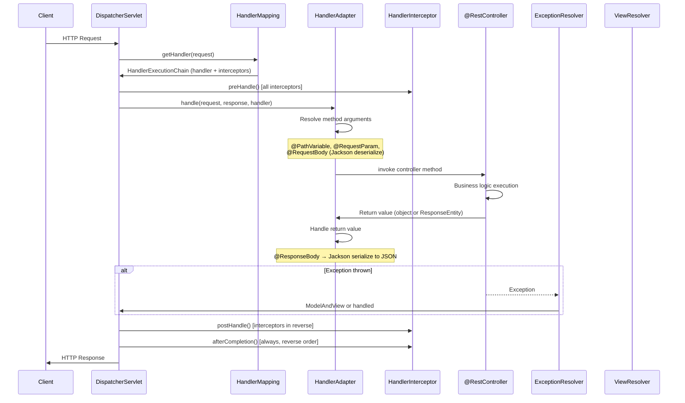

# Spring MVC Deep Dive

## Overview

Spring MVC is the foundation of the web layer in Spring Boot applications. It implements the **Front Controller** design pattern via `DispatcherServlet`, providing a clean, configurable request processing pipeline. Understanding Spring MVC's internal architecture — how a request flows from HTTP reception to controller method execution to response rendering — is fundamental for Staff/Principal-level interviews.

In enterprise banking, Spring MVC underlies all REST API implementations, from payment APIs to account management services. Interview questions probe whether you know how `HandlerMapping` resolves requests, how `HandlerInterceptor` differs from filters, how exception handling cascades, and how to design production-grade REST APIs with proper content negotiation, validation, and error responses.

---

## DispatcherServlet Architecture

### Complete Request Processing Flow



### DispatcherServlet Configuration (Spring Boot Auto-Configured)

```java
// Spring Boot auto-configures DispatcherServlet
// DispatcherServletAutoConfiguration creates this:
@Bean(name = DEFAULT_DISPATCHER_SERVLET_BEAN_NAME)
public DispatcherServlet dispatcherServlet(WebMvcProperties webMvcProperties) {
    DispatcherServlet dispatcherServlet = new DispatcherServlet();
    dispatcherServlet.setDispatchOptionsRequest(webMvcProperties.isDispatchOptionsRequest());
    dispatcherServlet.setDispatchTraceRequest(webMvcProperties.isDispatchTraceRequest());
    dispatcherServlet.setThrowExceptionIfNoHandlerFound(webMvcProperties.isThrowExceptionIfNoHandlerFound());
    dispatcherServlet.setPublishEvents(webMvcProperties.isPublishRequestHandledEvents());
    dispatcherServlet.setEnableLoggingRequestDetails(webMvcProperties.isLogRequestDetails());
    return dispatcherServlet;
}
```

---

## Controller Layer

### @Controller vs @RestController

```java
// @RestController = @Controller + @ResponseBody
@RestController  // All methods implicitly have @ResponseBody
@RequestMapping("/api/v1/payments")
public class PaymentController {
    
    // ─── Request Mapping Variants ──────────────────────────────────
    @GetMapping("/{paymentId}")
    public PaymentResponse getPayment(
            @PathVariable UUID paymentId,
            @RequestHeader(value = "X-Correlation-ID", required = false) String correlationId) {
        return paymentService.findById(paymentId);
        // Return value automatically serialized to JSON (or XML based on Accept header)
    }
    
    @PostMapping
    @ResponseStatus(HttpStatus.CREATED)  // Default 201 status for successful creation
    public PaymentResponse createPayment(
            @RequestBody @Valid CreatePaymentRequest request,
            UriComponentsBuilder uriBuilder) {
        PaymentResponse payment = paymentService.create(request);
        // Return 201 Created with Location header
        return payment;
    }
    
    // ─── Full Response Control with ResponseEntity ─────────────────
    @PostMapping("/bulk")
    public ResponseEntity<BulkPaymentResponse> createBulkPayment(
            @RequestBody @Valid List<CreatePaymentRequest> requests) {
        
        BulkPaymentResponse response = paymentService.createBulk(requests);
        
        // Full control over status code, headers, body
        return ResponseEntity
            .status(HttpStatus.MULTI_STATUS)
            .header("X-Total-Count", String.valueOf(response.getTotalCount()))
            .header("X-Success-Count", String.valueOf(response.getSuccessCount()))
            .body(response);
    }
    
    @PatchMapping("/{paymentId}/status")
    public ResponseEntity<Void> updateStatus(
            @PathVariable UUID paymentId,
            @RequestBody StatusUpdateRequest request) {
        
        paymentService.updateStatus(paymentId, request.getStatus());
        return ResponseEntity.noContent().build();  // 204 No Content
    }
    
    @DeleteMapping("/{paymentId}")
    public ResponseEntity<Void> cancelPayment(@PathVariable UUID paymentId) {
        paymentService.cancel(paymentId);
        return ResponseEntity.noContent().build();
    }
    
    // ─── Pagination with Spring Data ──────────────────────────────
    @GetMapping
    public ResponseEntity<Page<PaymentSummary>> listPayments(
            @RequestParam(required = false) String status,
            @RequestParam(defaultValue = "0") int page,
            @RequestParam(defaultValue = "20") int size,
            @RequestParam(defaultValue = "createdAt,desc") String[] sort,
            Pageable pageable) {  // Spring auto-builds Pageable from query params
        
        Page<PaymentSummary> payments = paymentService.findAll(status, pageable);
        
        return ResponseEntity.ok()
            .header("X-Total-Elements", String.valueOf(payments.getTotalElements()))
            .body(payments);
    }
}
```

### Request Parameter Extraction

```java
@RestController
@RequestMapping("/api/v1/accounts")
public class AccountController {
    
    // @PathVariable: /accounts/ACC-123
    @GetMapping("/{accountId}")
    public Account getById(@PathVariable("accountId") String id) { ... }
    
    // @RequestParam: /accounts?status=ACTIVE&currency=GBP
    @GetMapping
    public List<Account> findByStatus(
            @RequestParam(required = false) String status,
            @RequestParam(defaultValue = "GBP") String currency) { ... }
    
    // @RequestHeader: Extracting HTTP headers
    @PostMapping
    public Account create(
            @RequestBody @Valid CreateAccountRequest request,
            @RequestHeader("X-User-ID") String userId,
            @RequestHeader(value = "X-Idempotency-Key", required = false) String idempotencyKey) { ... }
    
    // @CookieValue: Extracting cookies
    @GetMapping("/session")
    public SessionInfo getSession(
            @CookieValue("SESSION_TOKEN") String sessionToken) { ... }
    
    // @MatrixVariable: /accounts;country=UK;type=savings
    @GetMapping("/{id}")
    public Account getWithMatrix(
            @PathVariable String id,
            @MatrixVariable(required = false, defaultValue = "active") String status) { ... }
    
    // Multiple path variables in complex URIs
    @GetMapping("/{accountId}/transactions/{transactionId}")
    public Transaction getTransaction(
            @PathVariable UUID accountId,
            @PathVariable UUID transactionId) { ... }
}
```

---

## Exception Handling

### Three-Tier Exception Handling Strategy

```mermaid
graph TB
    EX[Exception occurs in Controller/Service]
    
    EX --> L1{@ExceptionHandler<br/>in same Controller?}
    L1 -->|Yes| CTRL_EH[Controller-level<br/>@ExceptionHandler method]
    L1 -->|No| L2{@ControllerAdvice<br/>with @ExceptionHandler?}
    L2 -->|Yes| GLOBAL_EH[Global @ControllerAdvice<br/>@ExceptionHandler]
    L2 -->|No| L3{HandlerExceptionResolver?}
    L3 -->|Yes| HER[ResponseStatusExceptionResolver<br/>DefaultHandlerExceptionResolver]
    L3 -->|No| UNHANDLED[500 Internal Server Error]
```

### Global Exception Handler with RFC 7807 ProblemDetail

```java
// Spring 6 / Spring Boot 3: ProblemDetail (RFC 7807)
@RestControllerAdvice
public class GlobalExceptionHandler {
    
    private static final Logger log = LoggerFactory.getLogger(GlobalExceptionHandler.class);
    
    // ─── Business Domain Exceptions ────────────────────────────────────
    @ExceptionHandler(InsufficientFundsException.class)
    @ResponseStatus(HttpStatus.UNPROCESSABLE_ENTITY)  // 422
    public ProblemDetail handleInsufficientFunds(InsufficientFundsException ex, HttpServletRequest request) {
        log.warn("Insufficient funds for account: {}", ex.getAccountId());
        
        ProblemDetail problem = ProblemDetail.forStatusAndDetail(
            HttpStatus.UNPROCESSABLE_ENTITY,
            "Account has insufficient funds for this transaction"
        );
        problem.setTitle("Insufficient Funds");
        problem.setType(URI.create("https://errors.bank.com/insufficient-funds"));
        problem.setInstance(URI.create(request.getRequestURI()));
        
        // RFC 7807 extension members
        problem.setProperty("accountId", ex.getAccountId());
        problem.setProperty("availableBalance", ex.getAvailableBalance());
        problem.setProperty("requestedAmount", ex.getRequestedAmount());
        
        return problem;
    }
    
    @ExceptionHandler(PaymentLimitExceededException.class)
    @ResponseStatus(HttpStatus.FORBIDDEN)
    public ProblemDetail handleLimitExceeded(PaymentLimitExceededException ex) {
        ProblemDetail problem = ProblemDetail.forStatusAndDetail(
            HttpStatus.FORBIDDEN, "Payment limit exceeded"
        );
        problem.setTitle("Payment Limit Exceeded");
        problem.setProperty("limitType", ex.getLimitType());
        problem.setProperty("currentLimit", ex.getLimit());
        problem.setProperty("resetAt", ex.getResetAt());
        return problem;
    }
    
    // ─── Validation Exceptions ─────────────────────────────────────────
    @ExceptionHandler(MethodArgumentNotValidException.class)
    @ResponseStatus(HttpStatus.BAD_REQUEST)
    public ProblemDetail handleValidationErrors(MethodArgumentNotValidException ex) {
        List<FieldError> fieldErrors = ex.getBindingResult().getFieldErrors().stream()
            .map(e -> new FieldError(e.getField(), e.getDefaultMessage()))
            .toList();
        
        ProblemDetail problem = ProblemDetail.forStatus(HttpStatus.BAD_REQUEST);
        problem.setTitle("Validation Failed");
        problem.setDetail("Request validation failed. See 'errors' for details.");
        problem.setProperty("errors", fieldErrors);
        return problem;
    }
    
    @ExceptionHandler(ConstraintViolationException.class)
    @ResponseStatus(HttpStatus.BAD_REQUEST)
    public ProblemDetail handleConstraintViolation(ConstraintViolationException ex) {
        List<String> errors = ex.getConstraintViolations().stream()
            .map(v -> v.getPropertyPath() + ": " + v.getMessage())
            .sorted()
            .toList();
        
        ProblemDetail problem = ProblemDetail.forStatus(HttpStatus.BAD_REQUEST);
        problem.setTitle("Constraint Violation");
        problem.setProperty("violations", errors);
        return problem;
    }
    
    // ─── Security Exceptions ───────────────────────────────────────────
    @ExceptionHandler(AccessDeniedException.class)
    @ResponseStatus(HttpStatus.FORBIDDEN)
    public ProblemDetail handleAccessDenied(AccessDeniedException ex) {
        ProblemDetail problem = ProblemDetail.forStatus(HttpStatus.FORBIDDEN);
        problem.setTitle("Access Denied");
        problem.setDetail("You do not have permission to perform this operation");
        return problem;
    }
    
    // ─── Generic Fallback ──────────────────────────────────────────────
    @ExceptionHandler(Exception.class)
    @ResponseStatus(HttpStatus.INTERNAL_SERVER_ERROR)
    public ProblemDetail handleGenericException(Exception ex, HttpServletRequest request) {
        // NEVER expose internal details in production
        String correlationId = UUID.randomUUID().toString();
        log.error("Unhandled exception [correlationId={}]", correlationId, ex);
        
        ProblemDetail problem = ProblemDetail.forStatus(HttpStatus.INTERNAL_SERVER_ERROR);
        problem.setTitle("Internal Server Error");
        problem.setDetail("An unexpected error occurred. Please contact support with reference: " + correlationId);
        problem.setProperty("correlationId", correlationId);
        return problem;
    }
    
    record FieldError(String field, String message) {}
}
```

---

## Validation

### Bean Validation with Jakarta Validation

```java
// Request DTO with comprehensive validation
public record CreatePaymentRequest(
    
    @NotBlank(message = "Sender account ID is required")
    @Pattern(regexp = "ACC-[A-Z0-9]{10}", message = "Invalid account ID format")
    String senderAccountId,
    
    @NotBlank(message = "Receiver account ID is required")
    String receiverAccountId,
    
    @NotNull(message = "Amount is required")
    @DecimalMin(value = "0.01", message = "Amount must be positive")
    @DecimalMax(value = "1000000.00", message = "Amount exceeds maximum allowed")
    @Digits(integer = 10, fraction = 2, message = "Amount must have at most 2 decimal places")
    BigDecimal amount,
    
    @NotBlank
    @Size(min = 3, max = 3, message = "Currency must be a 3-letter ISO code")
    String currency,
    
    @Size(max = 500, message = "Reference cannot exceed 500 characters")
    String reference,
    
    @FutureOrPresent(message = "Execution date cannot be in the past")
    LocalDate executionDate,
    
    @Valid  // Validates nested object's constraints
    @NotNull
    PaymentTypeDetails paymentType
) {}

// Custom constraint annotation
@Target({ElementType.FIELD, ElementType.PARAMETER})
@Retention(RetentionPolicy.RUNTIME)
@Constraint(validatedBy = IBANValidator.class)
@Documented
public @interface ValidIBAN {
    String message() default "Invalid IBAN format";
    Class<?>[] groups() default {};
    Class<? extends Payload>[] payload() default {};
}

// Custom constraint validator
public class IBANValidator implements ConstraintValidator<ValidIBAN, String> {
    
    private static final Pattern IBAN_PATTERN = 
        Pattern.compile("[A-Z]{2}[0-9]{2}[A-Z0-9]{4}[0-9]{7}([A-Z0-9]?){0,16}");
    
    @Override
    public boolean isValid(String iban, ConstraintValidatorContext context) {
        if (iban == null) return true;  // Use @NotNull for null check
        return IBAN_PATTERN.matcher(iban).matches() && isValidChecksum(iban);
    }
    
    private boolean isValidChecksum(String iban) {
        // Implement MOD97 checksum validation
        String rearranged = iban.substring(4) + iban.substring(0, 4);
        String numeric = rearranged.chars()
            .mapToObj(c -> Character.isLetter(c) ? String.valueOf(c - 'A' + 10) : String.valueOf((char) c))
            .collect(Collectors.joining());
        return new BigInteger(numeric).mod(BigInteger.valueOf(97)).equals(BigInteger.ONE);
    }
}
```

---

## HandlerInterceptor

### When to Use Interceptors vs Filters

| Aspect | `HandlerInterceptor` | `Filter` (javax/jakarta) |
|---|---|---|
| **Level** | Spring MVC layer | Servlet container level |
| **Context** | Has access to handler/controller info | No Spring context by default |
| **Execution** | After DispatcherServlet resolves handler | Before DispatcherServlet |
| **`@ResponseBody` access** | Yes, via `ModelAndView` | Yes, via response wrapper |
| **Spring Security** | Integrates naturally | Used heavily in security (before MVC) |
| **Exception handling** | Through Spring's mechanism | Requires separate handling |

```java
@Component
public class CorrelationIdInterceptor implements HandlerInterceptor {
    
    @Override
    public boolean preHandle(HttpServletRequest request, HttpServletResponse response, Object handler)
            throws Exception {
        
        // Extract or generate correlation ID
        String correlationId = request.getHeader("X-Correlation-ID");
        if (correlationId == null || correlationId.isBlank()) {
            correlationId = UUID.randomUUID().toString();
        }
        
        // Set in MDC for log correlation
        MDC.put("correlationId", correlationId);
        MDC.put("userId", extractUserId(request));
        
        // Thread-local storage for downstream access
        CorrelationContext.set(correlationId);
        
        // Add to response header
        response.setHeader("X-Correlation-ID", correlationId);
        
        return true;  // Continue processing; false = abort request
    }
    
    @Override
    public void afterCompletion(HttpServletRequest request, HttpServletResponse response,
            Object handler, Exception ex) throws Exception {
        // Always clean up ThreadLocal to prevent memory leaks
        MDC.clear();
        CorrelationContext.clear();
    }
}

@Component
public class RateLimitInterceptor implements HandlerInterceptor {
    
    private final RateLimiterService rateLimiterService;
    
    @Override
    public boolean preHandle(HttpServletRequest request, HttpServletResponse response, Object handler) 
            throws Exception {
        
        String clientId = request.getHeader("X-Client-ID");
        if (!rateLimiterService.tryAcquire(clientId)) {
            response.setStatus(HttpStatus.TOO_MANY_REQUESTS.value());
            response.setHeader("Retry-After", "60");
            response.setHeader("X-RateLimit-Reset", String.valueOf(rateLimiterService.getResetTime(clientId)));
            response.getWriter().write("{\"error\":\"rate limit exceeded\"}");
            return false;  // Abort — do not call controller
        }
        return true;
    }
}

// Register interceptors
@Configuration
public class WebMvcConfig implements WebMvcConfigurer {
    
    @Override
    public void addInterceptors(InterceptorRegistry registry) {
        registry
            .addInterceptor(correlationIdInterceptor)
            .addPathPatterns("/api/**")
            .order(1);  // Run first
        
        registry
            .addInterceptor(rateLimitInterceptor)
            .addPathPatterns("/api/**")
            .excludePathPatterns("/api/v1/health/**")
            .order(2);
    }
}
```

---

## Content Negotiation and Jackson Configuration

```java
@Configuration
public class JacksonConfig {
    
    @Bean
    public Jackson2ObjectMapperBuilderCustomizer jsonCustomizer() {
        return builder -> builder
            // Serialization features
            .featuresToDisable(
                SerializationFeature.WRITE_DATES_AS_TIMESTAMPS  // Dates as ISO strings
            )
            .featuresToEnable(
                SerializationFeature.WRITE_ENUMS_USING_TO_STRING
            )
            // Deserialization
            .featuresToDisable(
                DeserializationFeature.FAIL_ON_UNKNOWN_PROPERTIES  // Ignore extra fields
            )
            // Naming strategy
            .propertyNamingStrategy(PropertyNamingStrategies.SNAKE_CASE)
            // Custom serializer for BigDecimal
            .serializerByType(BigDecimal.class, new BigDecimalSerializer())
            // Date handling
            .modules(new JavaTimeModule())  // Java 8+ date/time support
            // Visibility
            .visibility(PropertyAccessor.FIELD, JsonAutoDetect.Visibility.ANY);
    }
    
    // Custom BigDecimal serializer for banking precision
    static class BigDecimalSerializer extends JsonSerializer<BigDecimal> {
        @Override
        public void serialize(BigDecimal value, JsonGenerator gen, SerializerProvider provider) 
                throws IOException {
            // Always serialize as string to preserve precision
            gen.writeString(value.toPlainString());
        }
    }
}
```

---

## REST API Versioning Strategies

```java
// ─── STRATEGY 1: URI Path Versioning (Most common) ─────────────────
@RestController
@RequestMapping("/api/v1/payments")
public class PaymentControllerV1 { ... }

@RestController
@RequestMapping("/api/v2/payments")
public class PaymentControllerV2 { ... }

// ─── STRATEGY 2: Header Versioning ────────────────────────────────
@RestController
@RequestMapping("/api/payments")
public class PaymentController {
    
    @GetMapping(headers = "X-API-Version=1")
    public PaymentResponseV1 getPaymentV1(@PathVariable UUID id) { ... }
    
    @GetMapping(headers = "X-API-Version=2")
    public PaymentResponseV2 getPaymentV2(@PathVariable UUID id) { ... }
}

// ─── STRATEGY 3: Accept Header (Content Negotiation) ────────────────
@GetMapping(
    produces = "application/vnd.bank.payment-v1+json"
)
public PaymentResponseV1 getV1() { ... }

@GetMapping(
    produces = "application/vnd.bank.payment-v2+json"
)
public PaymentResponseV2 getV2() { ... }

// ─── STRATEGY 4: Query Parameter ───────────────────────────────────
@GetMapping(params = "version=1")
public PaymentResponseV1 getV1() { ... }
```

| Strategy | Pros | Cons |
|---|---|---|
| URI Path | Simple, explicit, cacheable | URL changes per version |
| Header | Clean URLs, RESTful | Harder to test manually |
| Accept Header | Most RESTful | Complex negotiation |
| Query Param | Easy to test | Not truly RESTful |

---

## Interview Questions & Model Answers

### Q1: How does DispatcherServlet process a request?

**Model Answer**: DispatcherServlet uses a chain of specialized strategy objects:

1. **HandlerMapping**: Determines which controller handles the URL. `RequestMappingHandlerMapping` scans all `@RequestMapping` annotations and builds an index at startup.

2. **HandlerAdapter**: Bridges DispatcherServlet to different handler types. `RequestMappingHandlerAdapter` handles `@Controller` classes; it resolves method arguments (calls `HandlerMethodArgumentResolver` for each parameter) and processes return values.

3. **HandlerInterceptor chain**: Runs `preHandle()` before, `postHandle()` after, and `afterCompletion()` always.

4. **ViewResolver** (for non-REST): Resolves logical view names to templates.

5. **HandlerExceptionResolver**: When exceptions occur, DispatcherServlet asks each resolver in order. `ExceptionHandlerExceptionResolver` handles `@ExceptionHandler` methods.

The key insight: DispatcherServlet delegates to strategy objects rather than doing everything itself — this is the **Strategy design pattern**, making each component independently replaceable.

---

### Q2: What is the difference between @ControllerAdvice and @RestControllerAdvice?

**Model Answer**: `@RestControllerAdvice` = `@ControllerAdvice` + `@ResponseBody`. Both enable global exception handling and model attribute binding across multiple controllers.

`@ControllerAdvice` is used when your application serves both traditional MVC views and REST APIs — exception handlers can return `ModelAndView` objects for view-based responses.

`@RestControllerAdvice` is used in REST API applications — all exception handlers implicitly serialize their return values to JSON/XML (via `@ResponseBody`).

You can also scope them: `@ControllerAdvice(assignableTypes = {PaymentController.class})` or `@ControllerAdvice(basePackages = "com.bank.payment")` to limit which controllers they apply to.

---

### Q3: How does Spring MVC handle @RequestBody deserialization?

**Model Answer**: When a controller method has `@RequestBody`, Spring uses `HttpMessageConverter` to deserialize the request body. The process:

1. Spring checks the `Content-Type` header (e.g., `application/json`)
2. It finds a compatible `HttpMessageConverter` — for JSON, `MappingJackson2HttpMessageConverter`
3. The converter reads bytes from the `HttpServletRequest` input stream
4. Jackson's `ObjectMapper` deserializes to the target type
5. If `@Valid` or `@Validated` is present, JSR-303 validation runs after deserialization
6. If validation fails, `MethodArgumentNotValidException` is thrown

Key edge cases: The body is a stream — it can only be read ONCE. Filters/interceptors that need to read the body must use `ContentCachingRequestWrapper`. Large payloads have configurable size limits (`spring.servlet.multipart.max-request-size`).

---

## Key Takeaways

- **DispatcherServlet is Front Controller** — single entry point delegating via HandlerMapping → HandlerAdapter → Controller
- **@RestControllerAdvice provides global exception handling** — prefer RFC 7807 ProblemDetail in Spring Boot 3.x
- **HandlerInterceptor vs Filter**: Use interceptors for Spring MVC-specific concerns; use filters for cross-cutting concerns at the Servlet level (security, CORS)
- **Validation**: `@Valid` triggers Bean Validation; `@Validated` supports validation groups; always handle `MethodArgumentNotValidException`
- **Content negotiation**: `Accept` header drives response format; `@ResponseBody` + `HttpMessageConverter` drives serialization
- **URI versioning** is the most common REST API versioning strategy in enterprise banking

---

## Further Reading

- [Spring MVC Reference Documentation](https://docs.spring.io/spring-framework/reference/web/webmvc.html)
- [Spring REST Exception Handling — ProblemDetail](https://docs.spring.io/spring-framework/reference/web/webmvc/ann-rest-exceptions.html)
- [Baeldung — Spring MVC Exception Handling](https://www.baeldung.com/exception-handling-for-rest-with-spring)
- "Spring in Action" Chapter 7 — REST services
