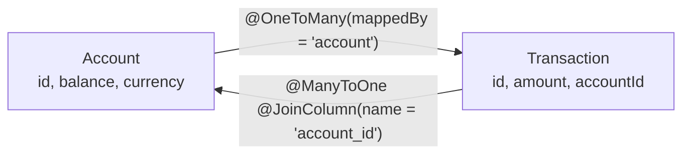
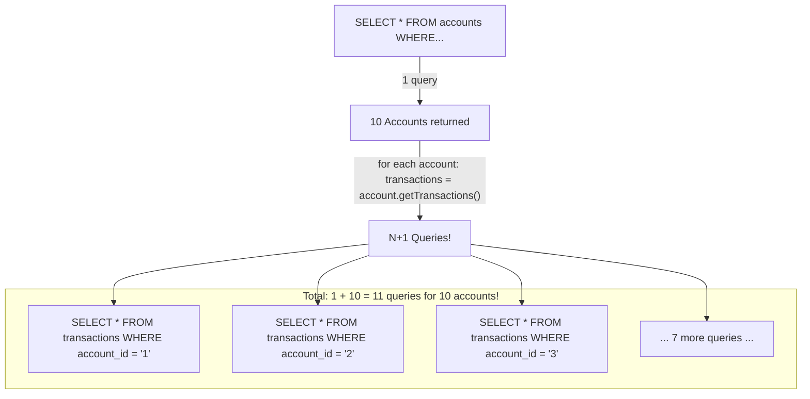

# Spring Data JPA: Repository Abstraction and Entity Management

## Overview

Spring Data JPA dramatically reduces boilerplate in data access layers by providing repository abstractions that eliminate hand-written SQL for common operations. Yet understanding JPA deeply — entity relationships, fetch strategies, the N+1 problem, and transaction boundaries — is what separates engineers who use Spring Data from engineers who wield it effectively.

In enterprise banking systems, data access is critical: millions of transactions per day, ACID compliance requirements, reporting queries over billions of records, and strict performance SLAs. The N+1 problem, improper cascade types, and misconfigured fetch types can cause catastrophic performance degradation in production. Staff/Principal engineers must be able to diagnose these issues from query logs and apply the correct solutions.

---

## Repository Abstraction Hierarchy

```mermaid
graph TB
    REPO[Repository<T, ID><br/>Marker interface]
    CRUD[CrudRepository<T, ID><br/>save, findById, findAll, delete, count]
    PAS[PagingAndSortingRepository<T, ID><br/>findAll(Pageable), findAll(Sort)]
    LISTCRUD[ListCrudRepository<T, ID><br/>findAll() returns List, Spring 3.0+]
    JPA[JpaRepository<T, ID><br/>saveAll, flush, deleteInBatch<br/>getReferenceById]

    REPO --> CRUD
    CRUD --> PAS
    CRUD --> LISTCRUD
    PAS --> JPA
    LISTCRUD --> JPA
```

### Basic Repository Usage

```java
// 1. Define your entity
@Entity
@Table(name = "payments", indexes = {
    @Index(name = "idx_payments_account_id", columnList = "account_id"),
    @Index(name = "idx_payments_status_created", columnList = "status, created_at")
})
public class Payment {
    
    @Id
    @GeneratedValue(strategy = GenerationType.UUID)
    private UUID id;
    
    @Column(name = "account_id", nullable = false)
    private UUID accountId;
    
    @Column(nullable = false, precision = 19, scale = 4)
    private BigDecimal amount;
    
    @Column(length = 3, nullable = false)
    private String currency;
    
    @Enumerated(EnumType.STRING)
    @Column(nullable = false)
    private PaymentStatus status;
    
    @Column(name = "created_at", nullable = false, updatable = false)
    private Instant createdAt;
    
    @Version  // Optimistic locking
    private Long version;
    
    @PrePersist
    protected void onCreate() {
        this.createdAt = Instant.now();
        if (this.status == null) this.status = PaymentStatus.PENDING;
    }
}

// 2. Define repository - Spring generates implementation at startup!
@Repository
public interface PaymentRepository extends JpaRepository<Payment, UUID> {
    
    // ─── Method Name Derivation ────────────────────────────────────────
    List<Payment> findByAccountId(UUID accountId);
    
    Optional<Payment> findByIdAndAccountId(UUID id, UUID accountId);
    
    List<Payment> findByStatusOrderByCreatedAtDesc(PaymentStatus status);
    
    long countByStatusAndAccountId(PaymentStatus status, UUID accountId);
    
    boolean existsByIdAndStatus(UUID id, PaymentStatus status);
    
    // Pageable + status filter
    Page<Payment> findByAccountIdAndStatus(
        UUID accountId, PaymentStatus status, Pageable pageable);
    
    // Date range query
    List<Payment> findByAccountIdAndCreatedAtBetween(
        UUID accountId, Instant from, Instant to);
    
    // ─── @Query with JPQL ─────────────────────────────────────────────
    @Query("""
        SELECT p FROM Payment p
        WHERE p.accountId = :accountId
          AND p.status = :status
          AND p.amount >= :minAmount
        ORDER BY p.createdAt DESC
        """)
    List<Payment> findFilteredPayments(
        @Param("accountId") UUID accountId,
        @Param("status") PaymentStatus status,
        @Param("minAmount") BigDecimal minAmount);
    
    // ─── @Query with Native SQL ────────────────────────────────────────
    @Query(
        value = """
            SELECT * FROM payments p
            WHERE p.account_id = :accountId
              AND p.created_at >= NOW() - INTERVAL '30 days'
              AND p.status IN ('COMPLETED', 'SETTLED')
            LIMIT :limit
            """,
        nativeQuery = true
    )
    List<Payment> findRecentCompletedPayments(
        @Param("accountId") UUID accountId,
        @Param("limit") int limit);
    
    // ─── Modifying Queries ────────────────────────────────────────────
    @Modifying
    @Query("UPDATE Payment p SET p.status = :newStatus WHERE p.id = :id AND p.status = :currentStatus")
    int updateStatus(
        @Param("id") UUID id,
        @Param("currentStatus") PaymentStatus current,
        @Param("newStatus") PaymentStatus newStatus);
    
    // Bulk delete
    @Modifying
    @Transactional
    @Query("DELETE FROM Payment p WHERE p.status = 'ABANDONED' AND p.createdAt < :before")
    int deleteAbandonedPayments(@Param("before") Instant before);
}
```

---

## Entity Relationships

### @OneToMany and @ManyToOne (The Most Common Relationship)



```java
@Entity
@Table(name = "accounts")
public class Account {
    
    @Id
    @GeneratedValue(strategy = GenerationType.UUID)
    private UUID id;
    
    @OneToMany(
        mappedBy = "account",          // References the field in Transaction
        fetch = FetchType.LAZY,         // ✅ ALWAYS lazy for collections
        cascade = {CascadeType.PERSIST, CascadeType.MERGE},  // NOT REMOVE — don't cascade deletes
        orphanRemoval = false           // Don't auto-delete detached transactions
    )
    @BatchSize(size = 50)              // When loaded, load in batches of 50
    private List<Transaction> transactions = new ArrayList<>();
    
    // Helper methods to maintain bidirectional consistency
    public void addTransaction(Transaction transaction) {
        transactions.add(transaction);
        transaction.setAccount(this);
    }
    
    public void removeTransaction(Transaction transaction) {
        transactions.remove(transaction);
        transaction.setAccount(null);
    }
}

@Entity
@Table(name = "transactions")
public class Transaction {
    
    @Id
    @GeneratedValue(strategy = GenerationType.UUID)
    private UUID id;
    
    @ManyToOne(fetch = FetchType.LAZY)  // ✅ ALWAYS lazy
    @JoinColumn(name = "account_id", nullable = false)
    private Account account;
    
    @Column(nullable = false, precision = 19, scale = 4)
    private BigDecimal amount;
    
    @Column(nullable = false)
    private Instant executedAt;
}
```

### The N+1 Problem: Most Critical JPA Interview Topic



```java
// ❌ N+1 Problem
List<Account> accounts = accountRepository.findAll();
for (Account account : accounts) {
    // LAZY fetch triggers 1 SELECT per account!
    account.getTransactions().size();  // N separate queries!
}

// ✅ SOLUTION 1: JOIN FETCH (JPQL)
@Query("""
    SELECT DISTINCT a FROM Account a
    LEFT JOIN FETCH a.transactions t
    WHERE a.status = :status
    """)
List<Account> findAllWithTransactions(@Param("status") AccountStatus status);

// ✅ SOLUTION 2: @EntityGraph
@EntityGraph(attributePaths = {"transactions", "transactions.merchant"})
List<Account> findByStatus(AccountStatus status);

// Named EntityGraph on entity
@Entity
@NamedEntityGraph(
    name = "Account.withTransactions",
    attributeNodes = @NamedAttributeNode(
        value = "transactions",
        subgraph = "transaction-detail"
    ),
    subgraphs = @NamedSubgraph(
        name = "transaction-detail",
        attributeNodes = @NamedAttributeNode("merchant")
    )
)
public class Account { ... }

@Repository
public interface AccountRepository extends JpaRepository<Account, UUID> {
    @EntityGraph("Account.withTransactions")
    List<Account> findByStatusIn(List<AccountStatus> statuses);
}

// ✅ SOLUTION 3: @BatchSize (fetches in bulk, not 1-by-1)
// Best when you sometimes need transactions, sometimes not
@BatchSize(size = 100)  // On the collection field
private List<Transaction> transactions;
// Spring will: SELECT WHERE account_id IN (id1, id2, ... id100)
// Instead of 100 separate queries

// ✅ SOLUTION 4: Projections (DTOs) — only fetch what you need
public interface AccountSummary {
    UUID getId();
    String getName();
    BigDecimal getBalance();
    // No transactions — don't load what you don't need!
}

List<AccountSummary> findAllProjectedBy();
```

---

## Projections

```java
// ─── Interface Projection (Spring Data generates proxy) ───────────────
public interface PaymentSummary {
    UUID getId();
    BigDecimal getAmount();
    String getCurrency();
    PaymentStatus getStatus();
    
    // SpEL in @Value for computed properties
    @Value("#{target.amount + ' ' + target.currency}")
    String getFormattedAmount();
}

List<PaymentSummary> findByAccountId(UUID accountId);

// ─── DTO Projection (Class-based) ─────────────────────────────────────
public record PaymentDTO(UUID id, BigDecimal amount, String currency, PaymentStatus status) {}

// Constructor expression in JPQL:
@Query("SELECT new com.bank.dto.PaymentDTO(p.id, p.amount, p.currency, p.status) FROM Payment p WHERE p.accountId = :accountId")
List<PaymentDTO> findPaymentDTOsByAccountId(@Param("accountId") UUID accountId);

// ─── Dynamic Projections ───────────────────────────────────────────────
<T> T findById(UUID id, Class<T> type);
<T> List<T> findByAccountId(UUID accountId, Class<T> type);

// Usage:
PaymentSummary summary = repo.findById(id, PaymentSummary.class);
Payment full = repo.findById(id, Payment.class);
```

---

## Specifications (Dynamic Queries)

```java
// JPA Criteria API via Spring Data Specifications
public class PaymentSpecifications {
    
    public static Specification<Payment> byAccountId(UUID accountId) {
        return (root, query, builder) ->
            accountId == null ? null : builder.equal(root.get("accountId"), accountId);
    }
    
    public static Specification<Payment> byStatus(PaymentStatus status) {
        return (root, query, builder) ->
            status == null ? null : builder.equal(root.get("status"), status);
    }
    
    public static Specification<Payment> byAmountBetween(BigDecimal min, BigDecimal max) {
        return (root, query, builder) -> {
            if (min == null && max == null) return null;
            if (min == null) return builder.lessThanOrEqualTo(root.get("amount"), max);
            if (max == null) return builder.greaterThanOrEqualTo(root.get("amount"), min);
            return builder.between(root.get("amount"), min, max);
        };
    }
    
    public static Specification<Payment> createdAfter(Instant after) {
        return (root, query, builder) ->
            after == null ? null : builder.greaterThan(root.get("createdAt"), after);
    }
}

// Repository must extend JpaSpecificationExecutor
public interface PaymentRepository extends JpaRepository<Payment, UUID>, 
                                           JpaSpecificationExecutor<Payment> { }

// Usage: Compose specifications dynamically
Specification<Payment> spec = Specification.where(byAccountId(accountId))
    .and(byStatus(status))
    .and(byAmountBetween(minAmount, maxAmount))
    .and(createdAfter(from));

Page<Payment> payments = paymentRepository.findAll(spec, pageable);
```

---

## Cascade Types and Orphan Removal

```java
// Understanding cascades — one of the most misused JPA features
@Entity
public class Order {
    
    @OneToMany(
        mappedBy = "order",
        cascade = CascadeType.ALL,  // ❌ DANGEROUS: includes REMOVE
        orphanRemoval = true         // ✅ OK here: order items are part of order
    )
    private List<OrderItem> items = new ArrayList<>();
    
    // CascadeType.ALL includes REMOVE:
    // entityManager.remove(order) → also removes all items
    // This is fine for OrderItem (belongs to Order), but DANGEROUS for Payment
}

@Entity
public class Account {
    
    @OneToMany(
        mappedBy = "account",
        // ✅ Limited cascades: don't cascade REMOVE — transactions outlive accounts!
        cascade = {CascadeType.PERSIST, CascadeType.MERGE}
    )
    private List<Transaction> transactions;
    // If account is deleted, transactions should be archived, NOT cascade-deleted!
}
```

| CascadeType | Meaning | Banking Use Case |
|---|---|---|
| `PERSIST` | Save child when parent is saved | Create account → auto-save default settings |
| `MERGE` | Update child when parent is merged | Update order → update order items |
| `REMOVE` | Delete child when parent deleted | Delete cart → delete cart items |
| `REFRESH` | Reload child when parent reloaded | — |
| `DETACH` | Detach child when parent detached | — |
| `ALL` | All of the above | Order → OrderItems (parent-child with no independent lifecycle) |

---

## Database Migrations with Flyway

```yaml
# application.yml
spring:
  flyway:
    enabled: true
    locations: classpath:db/migration
    baseline-on-migrate: true          # Useful for existing databases
    out-of-order: false                # Strict ordering required
    validate-on-migrate: true          # Validate checksums on startup (default)
    schemas: payment_schema
    table: flyway_schema_history       # Custom history table name
    
  # HikariCP configuration
  datasource:
    hikari:
      maximum-pool-size: 20
      minimum-idle: 5
      connection-timeout: 30000
      idle-timeout: 600000
      max-lifetime: 1800000
      leak-detection-threshold: 60000   # Log if connection held > 60s
      data-source-properties:
        cachePrepStmts: true
        prepStmtCacheSize: 250
        prepStmtCacheSqlLimit: 2048
```

```sql
-- V1__create_payments_table.sql
CREATE TABLE payments (
    id          UUID PRIMARY KEY DEFAULT gen_random_uuid(),
    account_id  UUID NOT NULL,
    amount      DECIMAL(19, 4) NOT NULL,
    currency    CHAR(3) NOT NULL,
    status      VARCHAR(20) NOT NULL DEFAULT 'PENDING',
    reference   VARCHAR(500),
    created_at  TIMESTAMP WITH TIME ZONE NOT NULL DEFAULT NOW(),
    updated_at  TIMESTAMP WITH TIME ZONE,
    version     BIGINT NOT NULL DEFAULT 0
);

CREATE INDEX idx_payments_account_id ON payments(account_id);
CREATE INDEX idx_payments_status_created ON payments(status, created_at DESC);

-- V2__add_payment_audit_log.sql
CREATE TABLE payment_audit_log (
    id          UUID PRIMARY KEY DEFAULT gen_random_uuid(),
    payment_id  UUID NOT NULL REFERENCES payments(id),
    old_status  VARCHAR(20),
    new_status  VARCHAR(20) NOT NULL,
    changed_by  VARCHAR(100),
    changed_at  TIMESTAMP WITH TIME ZONE NOT NULL DEFAULT NOW(),
    reason      TEXT
);
```

---

## Interview Questions & Model Answers

### Q1: What is the N+1 problem and how do you solve it?

**Model Answer**: The N+1 problem occurs when you load N entities and then lazily load a related collection for each, resulting in 1 initial query + N additional queries.

Example: Load 100 accounts, then access `account.getTransactions()` for each — you get 1 + 100 = 101 queries.

**Solutions in order of preference**:

1. **JOIN FETCH** (JPQL): `SELECT DISTINCT a FROM Account a LEFT JOIN FETCH a.transactions` — single query with JOIN. Best when you always need the collection.

2. **@EntityGraph**: Declarative JOIN FETCH — can be applied to derived query methods. Cleaner than JPQL.

3. **@BatchSize**: Hibernate loads the collection in batches (e.g., 50 at a time) using `IN` clauses. Best when you sometimes need the collection — avoids Cartesian product risk.

4. **Projections/DTOs**: If you only need summary data, use interface or class projections to avoid loading entities entirely.

5. **`subselect` fetch mode**: `@Fetch(FetchMode.SUBSELECT)` — loads all collections in one subselect query. Useful for reports.

**Never fix N+1 by changing lazy to eager** — this creates worse problems (Cartesian products, loading data you don't need).

---

### Q2: What is optimistic locking and when do you use it?

**Model Answer**: Optimistic locking is a concurrency control mechanism that assumes conflicts are rare and only validates at commit time, rather than holding database locks throughout a transaction.

In JPA, add `@Version` to an entity field (typically `Long` or `Integer`). JPA automatically:
- Increments the version on each update
- Includes the version in UPDATE WHERE clauses: `UPDATE accounts SET balance = ? WHERE id = ? AND version = ?`
- If the version doesn't match (another thread updated first), the UPDATE affects 0 rows → JPA throws `OptimisticLockException`

**Banking use case**: Concurrent balance updates. Thread A reads account balance (version=1), Thread B reads same account (version=1), both calculate new balance, Thread A updates (version becomes 2), Thread B tries to update with version=1 — fails! Thread B must retry with fresh data.

Use optimistic locking when: data read-to-write ratio is high, conflicts are infrequent, and you can handle retry logic.

Use pessimistic locking (`@Lock(LockModeType.PESSIMISTIC_WRITE)`) when: conflicts are frequent, data is hotly contested, or you cannot tolerate retries.

---

### Q3: When would you use Spring Data JDBC over JPA?

**Model Answer**: Spring Data JPA introduces full ORM semantics — session management, lazy loading, the persistence context, change detection. This power comes with complexity and potential for subtle bugs.

Use **Spring Data JDBC** when:
- You want **simpler, explicit data access** — no lazy loading surprises, no session management
- Objects map to **aggregates** (DDD) rather than an object graph
- You want **predictable queries** — each repository method maps to explicit SQL
- You're building on a team where JPA's complexity causes production issues
- Your domain model doesn't have complex inheritance or polymorphic relationships
- **Performance** is critical and you want complete control over every query

Use **Spring Data JPA** when:
- Complex object relationships with navigation are required
- You want change detection (modify entity, auto-generates UPDATE)
- Second-level caching is needed
- Query derivation from method names is valuable to your team
- The team has strong JPA/Hibernate expertise

In banking, **JdbcTemplate** or **Spring Data JDBC** is often preferred for high-volume transaction writes where predictability and performance matter more than ORM convenience.

---

## Key Takeaways

- **N+1 is the #1 JPA performance issue** — solve with JOIN FETCH, @EntityGraph, or @BatchSize
- **Always use `FetchType.LAZY`** for collections — EAGER loading causes Cartesian products
- **@Version enables optimistic locking** — essential for concurrent financial transactions
- **Projections (interface/DTO)** reduce data fetched — use when full entity not needed
- **Flyway/Liquibase for migrations** — never modify production schema without versioned migration scripts
- **HikariCP is Spring Boot's default pool** — configure pool size based on: `(core_count × 2) + effective_spindle_count`
- **@Modifying requires @Transactional** — modifying queries clear persistence context by default
- **CascadeType.ALL is dangerous** — never cascade REMOVE across independent aggregate boundaries

---

## Further Reading

- [Spring Data JPA Reference Documentation](https://docs.spring.io/spring-data/jpa/reference/)
- [Hibernate Performance Tuning Tips](https://hibernate.org/orm/documentation/)
- [Vlad Mihalcea's Blog — The Best JPA Resource](https://vladmihalcea.com/blog/)
- "Java Persistence with Hibernate" by Christian Bauer and Gavin King
- [Baeldung — Spring Data JPA](https://www.baeldung.com/the-persistence-layer-with-spring-data-jpa)
