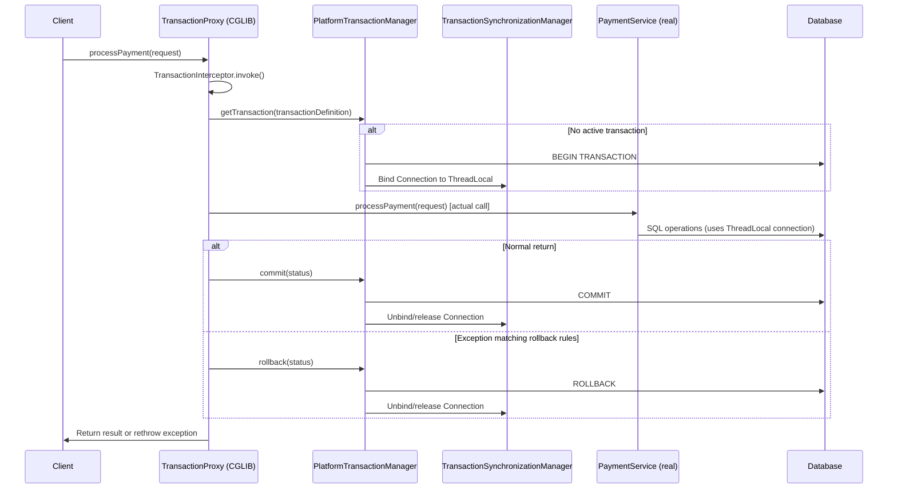
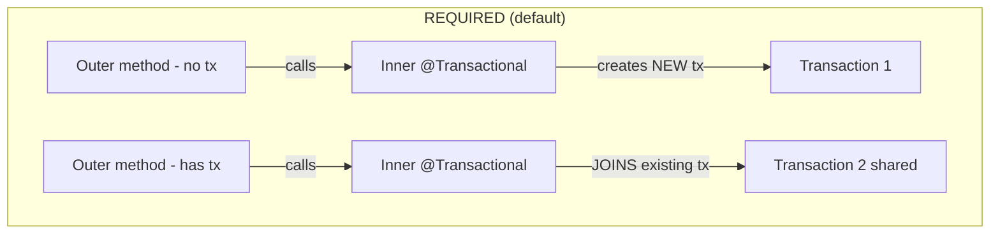

# Transaction Management in Spring

## Overview

Transaction management is one of the most critical — and most misunderstood — topics in enterprise Java development. `@Transactional` appears deceptively simple: annotate a method, and Spring wraps it in a transaction. But the internals reveal a sophisticated proxy-based mechanism with propagation behaviours, isolation levels, rollback rules, and subtle gotchas that trap even experienced developers in production.

In banking systems, transactions are the bedrock of correctness. An account debit must be atomic with its corresponding credit. A payment record must be saved with its audit trail. A failed fraud check must roll back the entire payment initiation. Understanding propagation types (`REQUIRED`, `REQUIRES_NEW`, `NESTED`) and isolation levels (`READ_COMMITTED`, `REPEATABLE_READ`, `SERIALIZABLE`) directly maps to preventing phantom reads, dirty reads, and lost updates in high-concurrency financial systems.

---

## Foundational Concepts

### What is a Transaction?

A transaction is a sequence of operations that must execute as a single logical unit with ACID properties:

| Property | Meaning | Banking Example |
|---|---|---|
| **Atomicity** | All operations succeed, or all fail | Debit + Credit must both succeed |
| **Consistency** | Database moves from one valid state to another | Balance cannot go negative |
| **Isolation** | Concurrent transactions don't interfere | Two clerks updating same account |
| **Durability** | Committed data survives failures | Power loss after commit → data survives |

---

## @Transactional Deep Dive

### Internal Mechanism



### The Key: TransactionSynchronizationManager

Transactions are **thread-bound** — the database connection is stored in a `ThreadLocal`:

```java
// Simplified view of how Spring binds transactions to threads
public class TransactionSynchronizationManager {
    
    // ThreadLocal stores the current connection for each thread
    private static final ThreadLocal<Map<Object, Object>> resources = 
        new NamedThreadLocal<>("Transactional resources");
    
    public static Object getResource(Object key) {
        return resources.get().get(key);  // Gets connection for this thread
    }
    
    public static void bindResource(Object key, Object value) {
        resources.get().put(key, value);   // Binds connection to this thread
    }
}
```

**Critical implication**: `@Transactional` does NOT work across threads! If you use `@Async` inside a `@Transactional` method, the async method runs in a different thread with NO transaction.

---

## Transaction Propagation Types



```java
@Service
@Transactional  // Class-level — all methods are transactional by default
public class PaymentServiceImpl implements PaymentService {
    
    private final PaymentRepository paymentRepo;
    private final AuditService auditService;
    private final FraudService fraudService;
    
    // ─── REQUIRED (Default) ──────────────────────────────────────────────
    // If a transaction exists: join it.
    // If no transaction: create one.
    @Transactional  // Joins outer transaction if exists
    public void processPayment(PaymentRequest request) {
        Payment payment = new Payment(request);
        paymentRepo.save(payment);
        
        // auditService.recordPayment() joins the SAME transaction
        // If it fails → ENTIRE transaction rolls back
        auditService.recordPayment(payment);
    }
    
    // ─── REQUIRES_NEW ────────────────────────────────────────────────────
    // ALWAYS creates a new transaction.
    // SUSPENDS the outer transaction while inner runs.
    // Outer rollback does NOT affect inner (and vice versa).
    @Transactional(propagation = Propagation.REQUIRES_NEW)
    public void recordSecurityAuditLog(SecurityEvent event) {
        // This commits INDEPENDENTLY of the outer transaction
        // Even if the payment transaction rolls back, this audit is saved
        // Essential for regulatory compliance: audit must persist even on payment failure!
        securityAuditRepo.save(event);
    }
    
    // ─── NESTED ──────────────────────────────────────────────────────────
    // Creates a savepoint within the current transaction.
    // Inner rollback rolls back to savepoint only (outer continues).
    // NOT supported by all databases (PostgreSQL supports it).
    @Transactional(propagation = Propagation.NESTED)
    public void tryEnrichPayment(Payment payment) {
        // If enrichment fails, only enrichment rolls back
        // Payment processing continues without enrichment data
        enrichmentService.enrich(payment);
    }
    
    // ─── SUPPORTS ────────────────────────────────────────────────────────
    // If transaction exists: use it. If not: run without transaction.
    @Transactional(propagation = Propagation.SUPPORTS)
    @Transactional(readOnly = true)
    public Payment findById(UUID id) {
        return paymentRepo.findById(id).orElseThrow();
    }
    
    // ─── NOT_SUPPORTED ────────────────────────────────────────────────────
    // ALWAYS runs without transaction. Suspends outer if exists.
    @Transactional(propagation = Propagation.NOT_SUPPORTED)
    public void runReportWithoutTransaction() {
        // Long-running report query — no lock held for the entire duration
    }
    
    // ─── MANDATORY ────────────────────────────────────────────────────────
    // MUST have an existing transaction. Throws if none.
    @Transactional(propagation = Propagation.MANDATORY)
    public void criticalInnerOperation() {
        // Fails with IllegalTransactionStateException if called without transaction
        // Design signal: this method is internal, not a service entry point
    }
    
    // ─── NEVER ────────────────────────────────────────────────────────────
    // MUST NOT have a transaction. Throws if one exists.
    @Transactional(propagation = Propagation.NEVER)
    public void nonTransactionalBatchOperation() {
        // Explicitly forbidden from running inside a transaction
    }
}
```

### Propagation Decision Matrix

```
When to use each:

REQUIRED        → Default. Use for standard business operations.
REQUIRES_NEW    → Audit/security logging that must persist regardless of outer tx outcome.
                  Child transactions that must succeed independently.
NESTED          → Optional sub-operations inside a transaction that can fail gracefully.
                  (savepoint-based, needs database support)
SUPPORTS        → Read operations that can work with or without a transaction.
NOT_SUPPORTED   → Long-running read-only operations that should not hold locks.
MANDATORY       → Internal helper methods that must only be called from a tx context.
NEVER           → Operations that are explicitly forbidden to run in a transaction.
```

---

## Transaction Isolation Levels

### The Four Read Phenomena

| Phenomenon | Description | Example |
|---|---|---|
| **Dirty Read** | Read uncommitted data from another transaction | Reading balance that hasn't committed yet |
| **Non-repeatable Read** | Same row read twice gives different values | Balance changes between two reads |
| **Phantom Read** | Same query returns different number of rows | New transaction inserted between queries |
| **Lost Update** | Two concurrent updates, one overwrites the other | Both add £100, net result is only +£100 |

### Isolation Level Protection

| Isolation Level | Dirty Read | Non-repeatable Read | Phantom Read | Performance |
|---|---|---|---|---|
| `READ_UNCOMMITTED` | ✅ Possible | ✅ Possible | ✅ Possible | Fastest |
| `READ_COMMITTED` | ❌ Prevented | ✅ Possible | ✅ Possible | High |
| `REPEATABLE_READ` | ❌ Prevented | ❌ Prevented | ✅ Possible | Medium |
| `SERIALIZABLE` | ❌ Prevented | ❌ Prevented | ❌ Prevented | Slowest |

```java
@Service
public class AccountService {
    
    // ─── Default: READ_COMMITTED ──────────────────────────────────────
    // Appropriate for most operations in banking (PostgreSQL's default)
    @Transactional(isolation = Isolation.READ_COMMITTED)
    public Payment processPayment(PaymentRequest req) {
        Account account = accountRepo.findById(req.getAccountId()).orElseThrow();
        account.debit(req.getAmount());
        accountRepo.save(account);
        return paymentRepo.save(new Payment(req));
    }
    
    // ─── REPEATABLE_READ ─────────────────────────────────────────────
    // Use when: reading same data multiple times and must see consistent values
    @Transactional(isolation = Isolation.REPEATABLE_READ)
    public ComplianceReport generateComplianceReport(UUID accountId, DateRange range) {
        // First read
        List<Transaction> txns = transactionRepo.findInRange(accountId, range);
        BigDecimal balance = accountRepo.findBalance(accountId);
        
        // Complex calculations...
        
        // Second read of same data — GUARANTEED to return same values as first read
        List<Transaction> verificationTxns = transactionRepo.findInRange(accountId, range);
        // Without REPEATABLE_READ: another transaction could insert new txns between these reads
    }
    
    // ─── SERIALIZABLE ──────────────────────────────────────────────────
    // Use for absolute consistency (e.g., account opening, limit setting)
    @Transactional(isolation = Isolation.SERIALIZABLE)
    public Account openNewAccount(AccountOpeningRequest request) {
        // Prevent another concurrent "open account for same customer" from sneaking in
        boolean exists = accountRepo.existsByCustomerIdAndType(
            request.getCustomerId(), request.getAccountType());
        if (exists) throw new DuplicateAccountException();
        return accountRepo.save(new Account(request));
    }
    
    // ─── Read-only optimization ─────────────────────────────────────────
    @Transactional(readOnly = true)
    public AccountStatement getStatement(UUID accountId, DateRange range) {
        // readOnly = true:
        // - Hibernate skips dirty checking (no change tracking overhead)
        // - Some databases optimize for read-only transactions
        // - Can route to read replicas
        // - FlushMode set to MANUAL (no accidental writes)
        return buildStatement(accountRepo.findById(accountId).orElseThrow(), 
                              transactionRepo.findInRange(accountId, range));
    }
}
```

---

## Rollback Rules

```java
@Service
public class PaymentProcessingService {
    
    // ─── Default rollback rules ────────────────────────────────────────
    // RuntimeException/Error → rollback
    // Checked Exception → NO rollback (unless configured)
    @Transactional
    public void process(Payment payment) throws CheckedException {
        paymentRepo.save(payment);
        externalService.notify(payment);  // Throws CheckedException → NO rollback by default!
    }
    
    // ─── Custom rollback rules ─────────────────────────────────────────
    @Transactional(
        rollbackFor = {PaymentException.class, Exception.class},   // Rollback for these
        noRollbackFor = {NotificationException.class}               // Don't rollback for these
    )
    public void processWithCustomRules(Payment payment) {
        paymentRepo.save(payment);
        try {
            notificationService.send(payment);  // NotificationException → no rollback
        } catch (NotificationException e) {
            log.warn("Notification failed, payment still committed", e);
        }
    }
    
    // ─── Programmatic rollback ────────────────────────────────────────
    @Transactional
    public void processWithManualRollback(Payment payment) {
        try {
            paymentRepo.save(payment);
            riskyOperation();
        } catch (ConditionalException e) {
            if (e.requiresRollback()) {
                TransactionAspectSupport.currentTransactionStatus().setRollbackOnly();
                // Transaction will roll back even if exception is swallowed
            }
        }
    }
}
```

---

## Programmatic Transaction Management

```java
@Service
public class BulkPaymentService {
    
    private final TransactionTemplate transactionTemplate;
    private final PlatformTransactionManager transactionManager;
    
    public BulkPaymentService(PlatformTransactionManager transactionManager) {
        this.transactionManager = transactionManager;
        this.transactionTemplate = new TransactionTemplate(transactionManager);
        this.transactionTemplate.setPropagationBehavior(TransactionDefinition.PROPAGATION_REQUIRED);
        this.transactionTemplate.setIsolationLevel(TransactionDefinition.ISOLATION_READ_COMMITTED);
        this.transactionTemplate.setTimeout(30); // 30 seconds timeout
    }
    
    // Programmatic transaction with TransactionTemplate
    public void processBatchPayments(List<PaymentRequest> requests) {
        for (PaymentRequest request : requests) {
            transactionTemplate.execute(status -> {
                try {
                    Payment payment = new Payment(request);
                    paymentRepo.save(payment);
                    return payment;
                } catch (Exception e) {
                    status.setRollbackOnly();  // Mark for rollback
                    throw e;
                }
            });
        }
    }
    
    // Lower-level programmatic transaction management
    public void executeWithFineGrainedControl(List<PaymentRequest> requests) {
        DefaultTransactionDefinition def = new DefaultTransactionDefinition();
        def.setName("BulkPaymentTransaction");
        def.setPropagationBehavior(TransactionDefinition.PROPAGATION_REQUIRED);
        
        TransactionStatus status = transactionManager.getTransaction(def);
        try {
            requests.forEach(req -> paymentRepo.save(new Payment(req)));
            transactionManager.commit(status);
        } catch (Exception ex) {
            transactionManager.rollback(status);
            throw new PaymentProcessingException("Bulk payment failed", ex);
        }
    }
}
```

---

## @TransactionalEventListener

```java
// Execute logic AFTER the outer transaction commits
@Service
public class PaymentNotificationService {
    
    @TransactionalEventListener(phase = TransactionPhase.AFTER_COMMIT)
    public void onPaymentCompleted(PaymentCompletedEvent event) {
        // Called ONLY when transaction commits successfully
        // If transaction rolls back, this is NOT called
        notificationService.sendPaymentConfirmation(event.getPayment());
        kafkaTemplate.send("payment-completed", event.getPayment());
    }
    
    @TransactionalEventListener(phase = TransactionPhase.AFTER_ROLLBACK)
    public void onPaymentFailed(PaymentCompletedEvent event) {
        // Called when transaction rolls back
        alertService.notifyPaymentFailure(event.getPayment());
    }
    
    @TransactionalEventListener(phase = TransactionPhase.BEFORE_COMMIT)
    public void beforePaymentCommit(PaymentCompletedEvent event) {
        // Called before commit — still in transaction
        // Can still cause rollback by throwing exception
    }
    
    // Publisher:
    @Service
    public class PaymentService {
        private final ApplicationEventPublisher publisher;
        
        @Transactional
        public void processPayment(Payment payment) {
            paymentRepo.save(payment);
            publisher.publishEvent(new PaymentCompletedEvent(payment));
            // Event is queued until AFTER commit if @TransactionalEventListener
        }
    }
}
```

---

## Common Pitfalls

### 1. Self-Invocation Problem (Most Common @Transactional Bug)

```java
@Service
public class PaymentService {
    
    @Transactional
    public void outerMethod() {
        // This calls inner() on `this` — BYPASSES the proxy!
        this.innerMethod();  // @Transactional on innerMethod is IGNORED!
    }
    
    @Transactional(propagation = Propagation.REQUIRES_NEW)  // 🚫 NEVER executed!
    public void innerMethod() {
        // This NEVER runs in a new transaction — runs in outer's transaction
    }
}

// FIX: Separate bean
@Service
public class PaymentAuditService {
    @Transactional(propagation = Propagation.REQUIRES_NEW)
    public void auditPayment(Payment payment) { ... }  // ✅ New transaction always
}
```

### 2. @Transactional on Private Methods

```java
@Service
public class AccountService {
    
    // ❌ @Transactional on private method — SILENTLY IGNORED!
    @Transactional
    private void privateTransactional() {
        // No proxy interception for private methods
        // Annotation is useless here
    }
}
```

### 3. Long Transactions (Performance Anti-Pattern)

```java
// ❌ BAD: Transaction held during external HTTP call!
@Transactional
public Payment processPayment(PaymentRequest request) {
    Payment payment = paymentRepo.save(new Payment(request));
    
    // External call while holding DB transaction lock!
    // 30+ second timeout → connection pool exhaustion → service outage!
    ExternalResponse response = httpClient.callExternalGateway(payment);  // SLOW!
    
    payment.setExternalRef(response.getRef());
    return paymentRepo.save(payment);
}

// ✅ GOOD: Minimise transaction scope
public Payment processPayment(PaymentRequest request) {
    // Step 1: Save initial payment (short transaction)
    Payment payment = createPaymentRecord(request);
    
    // Step 2: External call OUTSIDE transaction
    ExternalResponse response = httpClient.callExternalGateway(payment);
    
    // Step 3: Update with result (short transaction)
    return updatePaymentWithResult(payment.getId(), response);
}

@Transactional
private Payment createPaymentRecord(PaymentRequest request) {
    return paymentRepo.save(new Payment(request));
}

@Transactional
private Payment updatePaymentWithResult(UUID paymentId, ExternalResponse response) {
    Payment payment = paymentRepo.findById(paymentId).orElseThrow();
    payment.setExternalRef(response.getRef());
    payment.setStatus(PaymentStatus.PROCESSING);
    return paymentRepo.save(payment);
}
```

---

## Interview Questions & Model Answers

### Q1: Why doesn't @Transactional work on private methods?

**Model Answer**: `@Transactional` is implemented via Spring AOP, which works by creating a proxy around the bean. Spring uses either JDK dynamic proxies (interface-based) or CGLIB proxies (subclass-based). In either case, the proxy can only intercept methods that are visible to the subclass or interface — public methods (and protected for CGLIB).

Private methods are invisible to proxies, so the proxy cannot wrap them. When a private method is called, it goes directly to the target object without interception. Spring ignores `@Transactional` on private methods without throwing an error — a common source of subtle bugs.

**Similarly affected**: `final` methods with CGLIB proxies (cannot be overridden), and self-invocation via `this.method()`.

---

### Q2: Explain the difference between REQUIRES_NEW and NESTED propagation.

**Model Answer**: Both create inner transaction demarcation, but with fundamental differences:

**`REQUIRES_NEW`**: Suspends the outer transaction and creates a completely independent new transaction. The inner transaction commits or rolls back independently. If the outer rolls back, the inner transaction is already committed — its changes persist. If the inner rolls back, the outer continues. Uses a separate database connection.

Use case: Audit logging in banking — when a payment fails and rolls back, the audit record logging that failure must still be saved.

**`NESTED`**: Creates a savepoint within the existing transaction. The inner transaction is NOT independent — it uses the SAME database connection. If the inner rolls back, only the savepoint is rolled back (outer continues). But if the OUTER rolls back, the entire transaction rolls back (including nested work). Requires database support for savepoints (PostgreSQL yes, MySQL InnoDB yes, Oracle yes).

Use case: Optional enrichment — try to enrich a payment with metadata, if enrichment fails just continue without it, but if the whole payment processing fails, enrichment should also roll back.

---

### Q3: What does `readOnly = true` do in @Transactional?

**Model Answer**: `readOnly = true` is a hint to both Spring and the underlying database/ORM that the transaction will not modify data:

In **Hibernate**: Disables dirty checking (Hibernate normally tracks all changes to entities in the session; with readOnly, it skips this expensive traversal), sets FlushMode to MANUAL (preventing accidental writes), and may optimise internal state tracking.

In **JDBC/DataSource**: Some databases and JDBC drivers use the hint to internally optimise reading (e.g., read from read-only replica, use shared locks instead of X locks).

In **Spring Data JPA**: Repositories annotated with `@Transactional(readOnly = true)` at the class level benefit from these optimisations for all query methods.

Importantly: `readOnly = true` does NOT create a read-only connection at the database level in most databases — it's more of a hint and optimisation. It won't prevent you from accidentally issuing a write (the write would still happen), but Hibernate's FlushMode.MANUAL means entity changes won't be auto-flushed.

---

## Key Takeaways

- **@Transactional creates an AOP proxy** — understating this leads to the self-invocation bug
- **REQUIRED joins existing tx; REQUIRES_NEW always creates new** — know both for audit scenarios
- **Transactions are thread-bound** (ThreadLocal) — @Async breaks transactions
- **Private methods ignore @Transactional** — always public; self-invocation bypasses proxy
- **ReadOnly = true optimises Hibernate** — use for all query-only operations
- **Long transactions are dangerous** — don't hold DB connections during external calls
- **CheckedExceptions don't rollback by default** — use `rollbackFor = Exception.class` if needed
- **@TransactionalEventListener for post-commit actions** — Kafka publish after successful payment save

---

## Further Reading

- [Spring Transaction Management Reference](https://docs.spring.io/spring-framework/reference/data-access/transaction.html)
- [Vlad Mihalcea — Spring @Transactional Best Practices](https://vladmihalcea.com/spring-transactional-annotation/)
- "Spring in Action" — Chapter Data Persistence (Transaction sections)
- [Baeldung — Spring @Transactional Propagation](https://www.baeldung.com/spring-transactional-propagation-isolation)
