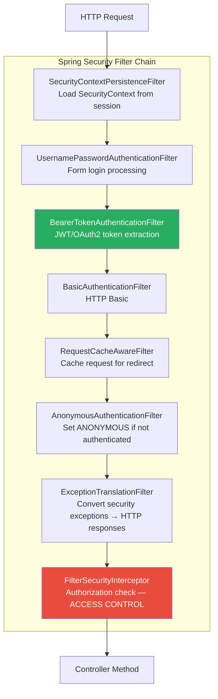
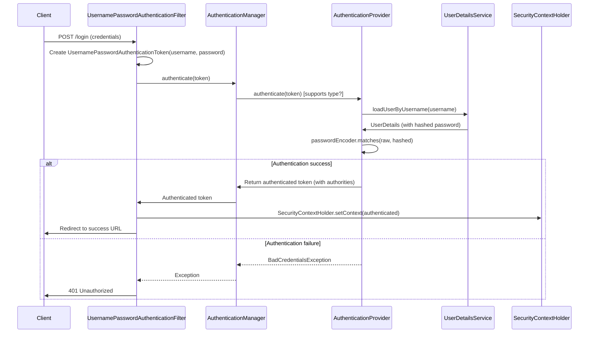

# Spring Security: Authentication Architecture

## Overview

Spring Security is the most comprehensive security framework for Java enterprise applications. It provides authentication (who you are), authorisation (what you can do), and a rich filter-chain architecture that intercepts every HTTP request. Modern Spring Security (6.x with Spring Boot 3.x) has undergone significant changes — the removal of `WebSecurityConfigurerAdapter`, the Lambda DSL, and the `SecurityFilterChain` bean-based configuration model.

In enterprise banking, security is non-negotiable and governs every component: REST APIs must enforce JWT or OAuth2 tokens, admin endpoints must require MFA, PII data must only be accessible to authorised roles, and every security event must be audited for regulatory compliance (PCI-DSS, SOX). Staff/Principal engineers must design Spring Security configurations that are both robust and maintainable at scale.

---

## Authentication Architecture

### The Security Filter Chain



### Core Authentication Flow



### Modern Spring Security Configuration (Spring Boot 3.x / Spring Security 6.x)

```java
// ✅ Spring Security 6.x - Bean-based approach (WebSecurityConfigurerAdapter REMOVED)
@Configuration
@EnableWebSecurity
@EnableMethodSecurity(prePostEnabled = true)  // Enables @PreAuthorize, @PostAuthorize
public class SecurityConfig {
    
    private final JwtAuthenticationFilter jwtAuthFilter;
    private final UserDetailsService userDetailsService;
    
    @Bean
    public SecurityFilterChain securityFilterChain(HttpSecurity http) throws Exception {
        return http
            // ─── CSRF ──────────────────────────────────────────────────
            .csrf(csrf -> csrf.disable())  // Stateless API → no CSRF needed
            
            // ─── Session Management ────────────────────────────────────
            .sessionManagement(session -> session
                .sessionCreationPolicy(SessionCreationPolicy.STATELESS))  // No sessions for JWT
            
            // ─── Authorization Rules ──────────────────────────────────
            .authorizeHttpRequests(auth -> auth
                .requestMatchers("/api/v1/auth/**").permitAll()        // Login, refresh token
                .requestMatchers("/actuator/health/**").permitAll()    // K8s health probes
                .requestMatchers("/actuator/**").hasRole("ADMIN")      // Actuator: admin only
                .requestMatchers(HttpMethod.GET, "/api/v1/payments/**").hasAnyRole("VIEWER", "OPERATOR", "ADMIN")
                .requestMatchers(HttpMethod.POST, "/api/v1/payments/**").hasAnyRole("OPERATOR", "ADMIN")
                .requestMatchers("/api/v1/admin/**").hasRole("ADMIN")
                .anyRequest().authenticated()
            )
            
            // ─── JWT Filter ────────────────────────────────────────────
            .addFilterBefore(jwtAuthFilter, UsernamePasswordAuthenticationFilter.class)
            
            // ─── Exception Handling ────────────────────────────────────
            .exceptionHandling(ex -> ex
                .authenticationEntryPoint(customAuthenticationEntryPoint())  // 401 handler
                .accessDeniedHandler(customAccessDeniedHandler()))            // 403 handler
            
            // ─── CORS ──────────────────────────────────────────────────
            .cors(cors -> cors.configurationSource(corsConfigurationSource()))
            
            .build();
    }
    
    @Bean
    public AuthenticationManager authenticationManager(AuthenticationConfiguration config) 
            throws Exception {
        return config.getAuthenticationManager();
    }
    
    @Bean
    public PasswordEncoder passwordEncoder() {
        // BCrypt with strength 12 (2^12 = 4096 iterations) — good default for banking
        return new BCryptPasswordEncoder(12);
    }
    
    @Bean
    public AuthenticationEntryPoint customAuthenticationEntryPoint() {
        return (request, response, authException) -> {
            response.setStatus(HttpStatus.UNAUTHORIZED.value());
            response.setContentType(MediaType.APPLICATION_JSON_VALUE);
            response.getWriter().write("""
                {"error":"unauthorized","message":"Authentication required"}
                """);
        };
    }
    
    @Bean
    public AccessDeniedHandler customAccessDeniedHandler() {
        return (request, response, accessDeniedException) -> {
            response.setStatus(HttpStatus.FORBIDDEN.value());
            response.setContentType(MediaType.APPLICATION_JSON_VALUE);
            response.getWriter().write("""
                {"error":"forbidden","message":"Insufficient permissions"}
                """);
        };
    }
    
    @Bean
    public CorsConfigurationSource corsConfigurationSource() {
        CorsConfiguration config = new CorsConfiguration();
        config.setAllowedOrigins(List.of("https://banking.mybank.com"));
        config.setAllowedMethods(List.of("GET", "POST", "PUT", "PATCH", "DELETE", "OPTIONS"));
        config.setAllowedHeaders(List.of("Authorization", "Content-Type", "X-Correlation-ID"));
        config.setExposedHeaders(List.of("X-Total-Count", "X-Correlation-ID"));
        config.setAllowCredentials(true);
        config.setMaxAge(3600L);
        
        UrlBasedCorsConfigurationSource source = new UrlBasedCorsConfigurationSource();
        source.registerCorsConfiguration("/api/**", config);
        return source;
    }
}
```

---

## JWT Authentication

### JWT Structure

```
Header.Payload.Signature

eyJhbGciOiJSUzI1NiIsInR5cCI6IkpXVCJ9  ← Header (Base64URL encoded)
.
eyJzdWIiOiJ1c2VyMTIzIiwiaWF0IjoxNjc...  ← Payload (Base64URL encoded)
.
SflKxwRJSMeKKF2QT4fwpMeJf36POk6yJV...  ← Signature (RS256/HS256)
```

```json
// Header
{
  "alg": "RS256",  // RSA-SHA256 — asymmetric (PREFERRED for distributed systems)
  "typ": "JWT"
}

// Payload (Claims)
{
  "sub": "user-uuid-123",           // Subject (user ID)
  "email": "user@bank.com",
  "roles": ["ROLE_OPERATOR"],
  "permissions": ["PAYMENTS_READ", "PAYMENTS_WRITE"],
  "iss": "https://auth.mybank.com", // Issuer
  "aud": "payment-service",         // Audience
  "iat": 1700000000,                // Issued At
  "exp": 1700003600,                // Expiry (1 hour)
  "jti": "unique-token-id"          // JWT ID (for revocation)
}
```

### JWT Authentication Filter

```java
@Component
public class JwtAuthenticationFilter extends OncePerRequestFilter {
    
    private final JwtService jwtService;
    private final UserDetailsService userDetailsService;
    
    @Override
    protected void doFilterInternal(
            HttpServletRequest request,
            HttpServletResponse response,
            FilterChain filterChain) throws ServletException, IOException {
        
        final String authorizationHeader = request.getHeader("Authorization");
        
        // No token or wrong format → continue filter chain (will fail at authorization)
        if (authorizationHeader == null || !authorizationHeader.startsWith("Bearer ")) {
            filterChain.doFilter(request, response);
            return;
        }
        
        final String jwtToken = authorizationHeader.substring(7);
        
        try {
            final String userEmail = jwtService.extractSubject(jwtToken);
            
            // Only authenticate if not already authenticated
            if (userEmail != null && SecurityContextHolder.getContext().getAuthentication() == null) {
                UserDetails userDetails = userDetailsService.loadUserByUsername(userEmail);
                
                if (jwtService.isTokenValid(jwtToken, userDetails)) {
                    UsernamePasswordAuthenticationToken authToken = 
                        new UsernamePasswordAuthenticationToken(
                            userDetails,
                            null,
                            userDetails.getAuthorities()
                        );
                    authToken.setDetails(new WebAuthenticationDetailsSource().buildDetails(request));
                    
                    // Set the authentication in SecurityContext
                    SecurityContextHolder.getContext().setAuthentication(authToken);
                }
            }
        } catch (JwtException e) {
            log.warn("JWT validation failed: {}", e.getMessage());
            // Don't set authentication — request will fail at authorization
        }
        
        filterChain.doFilter(request, response);
    }
}

@Service
public class JwtService {
    
    @Value("${app.security.jwt.secret-key}")
    private String secretKey;
    
    @Value("${app.security.jwt.expiration-ms:3600000}")  // 1 hour
    private long expirationMs;
    
    @Value("${app.security.jwt.refresh-expiration-ms:86400000}")  // 24 hours
    private long refreshExpirationMs;
    
    public String generateToken(UserDetails userDetails) {
        Map<String, Object> extraClaims = new HashMap<>();
        extraClaims.put("roles", userDetails.getAuthorities().stream()
            .map(GrantedAuthority::getAuthority)
            .toList());
        return buildToken(extraClaims, userDetails, expirationMs);
    }
    
    public String generateRefreshToken(UserDetails userDetails) {
        return buildToken(new HashMap<>(), userDetails, refreshExpirationMs);
    }
    
    private String buildToken(Map<String, Object> extraClaims, UserDetails userDetails, long expiration) {
        return Jwts.builder()
            .claims(extraClaims)
            .subject(userDetails.getUsername())
            .issuedAt(new Date())
            .expiration(new Date(System.currentTimeMillis() + expiration))
            .signWith(getSignInKey(), Jwts.SIG.HS256)
            .compact();
    }
    
    public boolean isTokenValid(String token, UserDetails userDetails) {
        final String username = extractSubject(token);
        return username.equals(userDetails.getUsername()) && !isTokenExpired(token);
    }
    
    public String extractSubject(String token) {
        return extractClaim(token, Claims::getSubject);
    }
    
    private boolean isTokenExpired(String token) {
        return extractClaim(token, Claims::getExpiration).before(new Date());
    }
    
    private <T> T extractClaim(String token, Function<Claims, T> claimsResolver) {
        Claims claims = Jwts.parser()
            .verifyWith(getSignInKey())
            .build()
            .parseSignedClaims(token)
            .getPayload();
        return claimsResolver.apply(claims);
    }
    
    private SecretKey getSignInKey() {
        byte[] keyBytes = Decoders.BASE64.decode(secretKey);
        return Keys.hmacShaKeyFor(keyBytes);
    }
}
```

---

## OAuth 2.0 Resource Server Configuration

```java
// Spring Boot 3.x OAuth2 Resource Server
@Configuration
@EnableWebSecurity
public class ResourceServerConfig {
    
    @Bean
    public SecurityFilterChain securityFilterChain(HttpSecurity http) throws Exception {
        return http
            .oauth2ResourceServer(oauth2 -> oauth2
                .jwt(jwt -> jwt
                    .decoder(jwtDecoder())
                    .jwtAuthenticationConverter(jwtAuthenticationConverter())
                )
            )
            .authorizeHttpRequests(auth -> auth
                .anyRequest().authenticated()
            )
            .build();
    }
    
    @Bean
    public JwtDecoder jwtDecoder() {
        // Validates JWT signature against public key from JWKS endpoint
        return NimbusJwtDecoder.withJwkSetUri("https://auth.mybank.com/.well-known/jwks.json")
            .build();
    }
    
    // Maps JWT claims to Spring Security authorities
    @Bean
    public JwtAuthenticationConverter jwtAuthenticationConverter() {
        JwtGrantedAuthoritiesConverter grantedAuthoritiesConverter = new JwtGrantedAuthoritiesConverter();
        grantedAuthoritiesConverter.setAuthoritiesClaimName("roles");
        grantedAuthoritiesConverter.setAuthorityPrefix("ROLE_");
        
        JwtAuthenticationConverter jwtAuthenticationConverter = new JwtAuthenticationConverter();
        jwtAuthenticationConverter.setJwtGrantedAuthoritiesConverter(grantedAuthoritiesConverter);
        return jwtAuthenticationConverter;
    }
}
```

```yaml
# application.yml OAuth2 Resource Server configuration
spring:
  security:
    oauth2:
      resourceserver:
        jwt:
          jwk-set-uri: https://auth.mybank.com/.well-known/jwks.json
          issuer-uri: https://auth.mybank.com
```

---

## Method-Level Security

```java
@RestController
@RequestMapping("/api/v1/payments")
public class PaymentController {
    
    // ─── @PreAuthorize ────────────────────────────────────────────────
    @GetMapping("/{id}")
    @PreAuthorize("hasRole('VIEWER') or hasRole('OPERATOR') or hasRole('ADMIN')")
    public PaymentResponse getPayment(@PathVariable UUID id) { ... }
    
    // SpEL with method parameters
    @GetMapping("/account/{accountId}")
    @PreAuthorize("hasRole('ADMIN') or #accountId == authentication.principal.accountId")
    public List<PaymentResponse> getAccountPayments(@PathVariable UUID accountId) { ... }
    
    // ─── @PostAuthorize ───────────────────────────────────────────────
    // Run AFTER method, check return value
    @GetMapping("/{id}")
    @PostAuthorize("returnObject.accountId == authentication.principal.accountId or hasRole('ADMIN')")
    public PaymentResponse getPaymentSecure(@PathVariable UUID id) {
        return paymentService.findById(id);
    }
    
    // ─── @PreFilter and @PostFilter ───────────────────────────────────
    @GetMapping
    @PostFilter("filterObject.accountId == authentication.principal.accountId or hasRole('ADMIN')")
    public List<PaymentResponse> getAllPayments() {
        return paymentService.findAll();  // Filters returned list by security expression
    }
    
    // ─── Custom permission evaluator ──────────────────────────────────
    @DeleteMapping("/{id}")
    @PreAuthorize("hasPermission(#id, 'Payment', 'DELETE')")
    public void cancelPayment(@PathVariable UUID id) { ... }
}

// Custom PermissionEvaluator
@Component
public class PaymentPermissionEvaluator implements PermissionEvaluator {
    
    private final PaymentRepository paymentRepo;
    
    @Override
    public boolean hasPermission(Authentication auth, Object targetDomainObject, Object permission) {
        if (targetDomainObject instanceof Payment payment) {
            return switch (permission.toString()) {
                case "READ" -> payment.getAccountId().equals(getCurrentUserId(auth));
                case "DELETE" -> payment.getStatus() == PaymentStatus.PENDING 
                                 && payment.getAccountId().equals(getCurrentUserId(auth));
                default -> false;
            };
        }
        return false;
    }
    
    @Override
    public boolean hasPermission(Authentication auth, Serializable targetId, String targetType, Object permission) {
        if ("Payment".equals(targetType)) {
            Payment payment = paymentRepo.findById((UUID) targetId).orElse(null);
            if (payment == null) return false;
            return hasPermission(auth, payment, permission);
        }
        return false;
    }
}
```

---

## Security Best Practices for Banking

```java
// ─── 1. Password Encoding ─────────────────────────────────────────────
@Bean
public PasswordEncoder passwordEncoder() {
    // BCrypt: adaptive, salted — PCI-DSS compliant
    // Strength 12: ~250ms per hash on modern hardware (good balance)
    return new BCryptPasswordEncoder(12);
    
    // Alternative: DelegatingPasswordEncoder (supports multiple encoders)
    // return PasswordEncoderFactories.createDelegatingPasswordEncoder();
}

// ─── 2. Security Headers ─────────────────────────────────────────────
http.headers(headers -> headers
    .frameOptions(frame -> frame.deny())                    // Clickjacking protection
    .xssProtection(xss -> xss.enable())                    // XSS header
    .contentSecurityPolicy(csp -> csp
        .policyDirectives("default-src 'self'; script-src 'self'"))
    .httpStrictTransportSecurity(hsts -> hsts
        .includeSubDomains(true)
        .maxAgeInSeconds(31_536_000))                       // HSTS 1 year
    .referrerPolicy(referrer -> referrer
        .policy(ReferrerPolicyHeaderWriter.ReferrerPolicy.NO_REFERRER))
);

// ─── 3. Brute Force Protection ───────────────────────────────────────
@Service
public class LoginAttemptService {
    
    private final Cache<String, AtomicInteger> attemptsCache;
    private static final int MAX_ATTEMPTS = 5;
    private static final Duration LOCK_DURATION = Duration.ofMinutes(15);
    
    public LoginAttemptService() {
        this.attemptsCache = Caffeine.newBuilder()
            .expireAfterWrite(LOCK_DURATION)
            .build();
    }
    
    public void loginFailed(String ipAddress) {
        AtomicInteger attempts = attemptsCache.get(ipAddress, k -> new AtomicInteger(0));
        int count = attempts.incrementAndGet();
        if (count >= MAX_ATTEMPTS) {
            log.warn("Account locked due to {} failed attempts from IP: {}", count, ipAddress);
        }
    }
    
    public boolean isBlocked(String ipAddress) {
        AtomicInteger attempts = attemptsCache.getIfPresent(ipAddress);
        return attempts != null && attempts.get() >= MAX_ATTEMPTS;
    }
    
    public void loginSucceeded(String ipAddress) {
        attemptsCache.invalidate(ipAddress);
    }
}
```

---

## CORS Configuration

```java
// Banking API CORS: strict origin whitelist
@Bean
public CorsConfigurationSource corsConfigurationSource() {
    CorsConfiguration config = new CorsConfiguration();
    
    // ❌ NEVER do this in production: config.setAllowedOrigins(List.of("*"));
    
    // ✅ Explicit origin whitelist
    config.setAllowedOrigins(List.of(
        "https://banking.mybank.com",
        "https://mobile.mybank.com",
        "https://admin.mybank.com"
    ));
    
    config.setAllowedMethods(List.of("GET", "POST", "PUT", "PATCH", "DELETE", "OPTIONS"));
    config.setAllowedHeaders(List.of(
        "Authorization",
        "Content-Type",
        "X-Correlation-ID",
        "X-Idempotency-Key"
    ));
    config.setExposedHeaders(List.of(
        "X-Total-Count",
        "X-Correlation-ID",
        "X-Rate-Limit-Remaining"
    ));
    config.setAllowCredentials(true);
    config.setMaxAge(3600L);  // Cache preflight for 1 hour
    
    UrlBasedCorsConfigurationSource source = new UrlBasedCorsConfigurationSource();
    source.registerCorsConfiguration("/api/**", config);
    return source;
}
```

---

## Interview Questions & Model Answers

### Q1: How does Spring Security's filter chain work?

**Model Answer**: Spring Security intercepts HTTP requests via a chain of `Filter` implementations, managed by `FilterChainProxy` (which is registered as a Servlet Filter via `DelegatingFilterProxy`).

Each `SecurityFilterChain` bean represents a chain of filters applied to matching requests. By default, Spring Security registers ~15 filters, each responsible for a specific security concern:

- **SecurityContextPersistenceFilter** (or `SecurityContextHolderFilter` in 6.x): Loads/saves the `SecurityContext` from/to the session.
- **UsernamePasswordAuthenticationFilter**: Handles form-based login.
- **BearerTokenAuthenticationFilter**: Extracts and validates JWT tokens.
- **ExceptionTranslationFilter**: Converts `AccessDeniedException` → 403, `AuthenticationException` → 401.
- **AuthorizationFilter** (previously FilterSecurityInterceptor): Final authorization check.

The filter chain processes sequentially; any filter can abort processing by sending a response directly (like `JwtAuthFilter` returning 401 for invalid tokens). Multiple `SecurityFilterChain` beans with different `requestMatcher` conditions allow different security rules for different URL patterns.

---

### Q2: What changed between Spring Security 5.x and 6.x?

**Model Answer**: Spring Security 6.0 (released with Spring Boot 3.0) introduced several breaking changes:

1. **`WebSecurityConfigurerAdapter` removed**: Previously, you extended this class and overrode `configure(HttpSecurity)`. Now you declare `SecurityFilterChain` as a `@Bean`.

2. **`antMatchers()` replaced by `requestMatchers()`**: `antMatchers("/api/**")` becomes `requestMatchers("/api/**")`.

3. **`authorizeRequests()` replaced by `authorizeHttpRequests()`**: Uses `AuthorizationManager` instead of `AccessDecisionManager`.

4. **`HttpSecurity` configuration via Lambda DSL**: Instead of chained methods, Spring 6.x prefers: `http.csrf(csrf -> csrf.disable())`.

5. **Jakarta namespace migration**: All `javax.servlet.*` → `jakarta.servlet.*`.

6. **WebSecurityCustomizer** for ignoring paths (previously `configure(WebSecurity)`).

7. **`SecurityContextHolder` strategy changed** — `SecurityContextHolderFilter` replaces `SecurityContextPersistenceFilter`.

---

### Q3: When should you use JWT vs session-based authentication?

**Model Answer**: 

**Session-based (stateful)**:
- Server stores session in memory or Redis
- Client sends session cookie every request
- ✅ Easy revocation (delete server-side session)
- ✅ Less security risk if session compromised (short-lived)
- ❌ Requires sticky sessions or central session store in microservices
- ❌ Doesn't scale horizontally without external session storage

**JWT (stateless)**:
- Token is self-contained (claims embedded)
- Client stores token (localStorage or httpOnly cookie)
- ✅ Stateless — any server can validate without session store
- ✅ Natural for microservices — services validate tokens independently
- ❌ Revocation is hard — must use token blacklist (Redis) or short expiry + refresh tokens
- ❌ Larger per-request overhead (token size)

**For banking microservices**: JWT with short expiry (15 min - 1 hour) + refresh tokens stored in httpOnly cookies is the standard. Use Redis-based token blacklist for immediate revocation on logout or compromise.

---

## Key Takeaways

- **`WebSecurityConfigurerAdapter` is REMOVED in Spring Security 6.x** — use `SecurityFilterChain` bean
- **JWT filter goes BEFORE `UsernamePasswordAuthenticationFilter`** — use `addFilterBefore()`
- **`@PreAuthorize` requires `@EnableMethodSecurity`** — enable in security configuration
- **CSRF disable for REST APIs** — REST APIs are stateless; no CSRF needed (but security headers still matter)
- **BCrypt strength 12** is the recommended minimum for banking systems (PCI-DSS)
- **OAuth2 Resource Server** validates tokens against JWKS endpoint automatically
- **`@PostAuthorize` filters after execution** — computationally expensive; prefer `@PreAuthorize` + `hasPermission()`
- **ExceptionTranslationFilter** converts `AccessDeniedException` → 403, `AuthenticationException` → 401

---

## Further Reading

- [Spring Security Reference Documentation](https://docs.spring.io/spring-security/reference/)
- [Spring Security OAuth2 Resource Server](https://docs.spring.io/spring-security/reference/servlet/oauth2/resource-server/index.html)
- "Spring Security in Action" by Laurentiu Spilca
- [Baeldung — Spring Security Tutorials](https://www.baeldung.com/security-spring)
- [OWASP API Security Top 10](https://owasp.org/www-project-api-security/)
