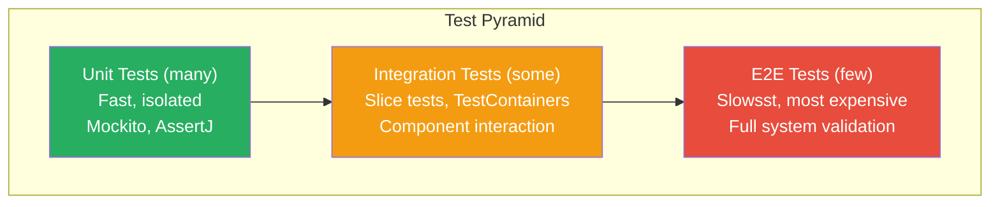

# Spring Boot Testing: Comprehensive Guide

## Overview

Testing in Spring Boot is a first-class citizen — the framework provides rich test infrastructure including slice tests, integration test utilities, container support, and mock MVC. Understanding when to use which test type is critical for Staff/Principal engineers: using `@SpringBootTest` for every test is an anti-pattern that creates slow, brittle test suites; using too many unit tests misses integration issues.

In enterprise banking, testing strategy directly impacts deployment confidence. Payment processing, fraud detection, and account management require thorough test coverage at all levels — unit tests for business logic, integration tests for database interactions, and contract tests for API compatibility across microservices.

---

## Testing Pyramid



---

## Unit Testing with Mockito

```java
@ExtendWith(MockitoExtension.class)
class PaymentServiceTest {
    
    @Mock
    private PaymentRepository paymentRepository;
    
    @Mock
    private FraudDetectionService fraudService;
    
    @Mock
    private AuditLogger auditLogger;
    
    @InjectMocks  // Creates PaymentService and injects above mocks
    private PaymentService paymentService;
    
    @Captor
    private ArgumentCaptor<Payment> paymentCaptor;
    
    @Test
    void processPayment_whenValidRequest_shouldCreatePendingPayment() {
        // ARRANGE
        PaymentRequest request = new PaymentRequest(
            UUID.randomUUID(), new BigDecimal("100.00"), "GBP"
        );
        Payment expectedPayment = Payment.builder()
            .id(UUID.randomUUID())
            .amount(request.amount())
            .status(PaymentStatus.PENDING)
            .build();
        
        when(fraudService.assess(any(PaymentRequest.class)))
            .thenReturn(FraudAssessment.CLEAN);
        when(paymentRepository.save(any(Payment.class)))
            .thenReturn(expectedPayment);
        
        // ACT
        PaymentResult result = paymentService.process(request);
        
        // ASSERT
        assertThat(result.status()).isEqualTo(PaymentStatus.PENDING);
        assertThat(result.paymentId()).isEqualTo(expectedPayment.getId());
        
        // Verify interactions
        verify(fraudService).assess(request);
        verify(paymentRepository).save(paymentCaptor.capture());
        verify(auditLogger).logPaymentCreated(any());
        
        // Verify captured argument
        Payment savedPayment = paymentCaptor.getValue();
        assertThat(savedPayment.getAmount()).isEqualByComparingTo(new BigDecimal("100.00"));
        assertThat(savedPayment.getStatus()).isEqualTo(PaymentStatus.PENDING);
    }
    
    @Test
    void processPayment_whenFraudDetected_shouldRejectPayment() {
        // ARRANGE
        PaymentRequest request = new PaymentRequest(UUID.randomUUID(), new BigDecimal("50000"), "GBP");
        
        when(fraudService.assess(any(PaymentRequest.class)))
            .thenReturn(FraudAssessment.HIGH_RISK);
        
        // ACT + ASSERT
        assertThatThrownBy(() -> paymentService.process(request))
            .isInstanceOf(PaymentRejectedException.class)
            .hasMessageContaining("fraud");
        
        verifyNoInteractions(paymentRepository);  // Payment should NOT be saved
        verify(auditLogger).logPaymentRejected(request, FraudAssessment.HIGH_RISK);
    }
    
    @Test
    void processPayment_whenRepositoryFails_shouldPropagateException() {
        PaymentRequest request = new PaymentRequest(UUID.randomUUID(), new BigDecimal("100"), "GBP");
        
        when(fraudService.assess(any())).thenReturn(FraudAssessment.CLEAN);
        when(paymentRepository.save(any())).thenThrow(new DataAccessException("DB error") {});
        
        assertThatThrownBy(() -> paymentService.process(request))
            .isInstanceOf(DataAccessException.class);
    }
    
    @Test
    void processPayment_withSpy_shouldCallRealMethodPartially() {
        // @Spy: real object but can override specific methods
        PaymentService spy = Mockito.spy(paymentService);
        doReturn(true).when(spy).isWithinDailyLimit(any());  // Override specific method
        
        // Calls real logic for everything else
    }
}
```

---

## Spring Boot Test Slices

### @WebMvcTest — Controller Layer Only

```java
// Loads ONLY Spring MVC infrastructure + the listed controllers
@WebMvcTest(PaymentController.class)
class PaymentControllerTest {
    
    @Autowired
    private MockMvc mockMvc;
    
    @Autowired
    private ObjectMapper objectMapper;
    
    // @MockBean creates a Spring-managed mock (replaces the real bean in context)
    @MockBean
    private PaymentService paymentService;
    
    @MockBean
    private JwtService jwtService;
    
    @Test
    @WithMockUser(roles = "OPERATOR")  // Simulates authenticated user
    void createPayment_withValidRequest_returns201() throws Exception {
        // ARRANGE
        CreatePaymentRequest request = new CreatePaymentRequest(
            UUID.randomUUID(), new BigDecimal("500.00"), "GBP", "TEST_REF"
        );
        PaymentResponse response = new PaymentResponse(UUID.randomUUID(), PaymentStatus.PENDING);
        
        when(paymentService.create(any(CreatePaymentRequest.class))).thenReturn(response);
        
        // ACT + ASSERT
        mockMvc.perform(post("/api/v1/payments")
                .contentType(MediaType.APPLICATION_JSON)
                .content(objectMapper.writeValueAsString(request))
                .header("X-Correlation-ID", "test-correlation-1"))
            .andDo(print())  // Print request/response for debugging
            .andExpect(status().isCreated())
            .andExpect(content().contentType(MediaType.APPLICATION_JSON))
            .andExpect(jsonPath("$.status").value("PENDING"))
            .andExpect(jsonPath("$.paymentId").exists())
            .andExpect(header().exists("X-Correlation-ID"));
        
        verify(paymentService).create(any(CreatePaymentRequest.class));
    }
    
    @Test
    @WithMockUser(roles = "OPERATOR")
    void createPayment_withInvalidAmount_returns400WithValidationErrors() throws Exception {
        CreatePaymentRequest invalidRequest = new CreatePaymentRequest(
            null,          // Missing required field
            new BigDecimal("-100"),  // Negative amount
            "INVALID",    // Invalid currency
            null
        );
        
        mockMvc.perform(post("/api/v1/payments")
                .contentType(MediaType.APPLICATION_JSON)
                .content(objectMapper.writeValueAsString(invalidRequest)))
            .andExpect(status().isBadRequest())
            .andExpect(jsonPath("$.title").value("Validation Failed"))
            .andExpect(jsonPath("$.errors").isArray())
            .andExpect(jsonPath("$.errors.length()").value(greaterThan(0)));
    }
    
    @Test
    void createPayment_withoutAuthentication_returns401() throws Exception {
        mockMvc.perform(post("/api/v1/payments")
                .contentType(MediaType.APPLICATION_JSON)
                .content("{}"))
            .andExpect(status().isUnauthorized());
    }
    
    @Test
    @WithMockUser(roles = "VIEWER")  // Wrong role — only OPERATOR/ADMIN can create
    void createPayment_withInsufficientRole_returns403() throws Exception {
        mockMvc.perform(post("/api/v1/payments")
                .contentType(MediaType.APPLICATION_JSON)
                .content(objectMapper.writeValueAsString(validRequest())))
            .andExpect(status().isForbidden());
    }
}
```

### @DataJpaTest — Repository Layer Only

```java
// Loads only JPA infrastructure: EntityManager, DataSource, JPA repositories
// Uses embedded H2 database by default (can override with @AutoConfigureTestDatabase)
@DataJpaTest
@AutoConfigureTestDatabase(replace = AutoConfigureTestDatabase.Replace.NONE)  // Use real DB
@ActiveProfiles("test")
class PaymentRepositoryTest {
    
    @Autowired
    private PaymentRepository paymentRepository;
    
    @Autowired
    private TestEntityManager entityManager;
    
    @BeforeEach
    void setUp() {
        entityManager.clear();
    }
    
    @Test
    void findByAccountId_shouldReturnPaymentsForAccount() {
        // ARRANGE: Save test entities directly via TestEntityManager
        UUID accountId = UUID.randomUUID();
        Payment p1 = entityManager.persistAndFlush(
            Payment.builder().accountId(accountId).amount(new BigDecimal("100")).status(PENDING).build()
        );
        Payment p2 = entityManager.persistAndFlush(
            Payment.builder().accountId(accountId).amount(new BigDecimal("200")).status(COMPLETED).build()
        );
        Payment other = entityManager.persistAndFlush(
            Payment.builder().accountId(UUID.randomUUID()).amount(new BigDecimal("300")).build()
        );
        
        // ACT
        List<Payment> payments = paymentRepository.findByAccountId(accountId);
        
        // ASSERT
        assertThat(payments).hasSize(2);
        assertThat(payments).extracting(Payment::getId).containsExactlyInAnyOrder(p1.getId(), p2.getId());
        assertThat(payments).noneMatch(p -> p.getAccountId().equals(other.getAccountId()));
    }
    
    @Test
    void updateStatus_whenStatusMatches_shouldUpdateSuccessfully() {
        Payment payment = entityManager.persistAndFlush(
            Payment.builder().accountId(UUID.randomUUID()).status(PENDING).build()
        );
        
        int updated = paymentRepository.updateStatus(payment.getId(), PENDING, PROCESSING);
        
        assertThat(updated).isEqualTo(1);
        entityManager.refresh(payment);  // Refresh from DB
        assertThat(payment.getStatus()).isEqualTo(PROCESSING);
    }
    
    @Test
    void updateStatus_whenStatusMismatch_shouldReturnZero() {
        Payment payment = entityManager.persistAndFlush(
            Payment.builder().status(COMPLETED).build()
        );
        
        int updated = paymentRepository.updateStatus(payment.getId(), PENDING, PROCESSING);
        
        // Status was COMPLETED, tried to update from PENDING → optimistic concurrency check
        assertThat(updated).isEqualTo(0);
    }
}
```

### @SpringBootTest — Full Integration Test

```java
// Loads the FULL application context — use sparingly!
@SpringBootTest(webEnvironment = SpringBootTest.WebEnvironment.RANDOM_PORT)
@ActiveProfiles("test")
@Testcontainers  // Manages Docker containers
class PaymentIntegrationTest {
    
    // TestContainers: Real PostgreSQL in Docker
    @Container
    static PostgreSQLContainer<?> postgres = new PostgreSQLContainer<>("postgres:15")
        .withDatabaseName("payment_test")
        .withUsername("test")
        .withPassword("test");
    
    // TestContainers: Real Kafka in Docker
    @Container
    static KafkaContainer kafka = new KafkaContainer(DockerImageName.parse("confluentinc/cp-kafka:7.4.0"));
    
    // Connect Spring to containers
    @DynamicPropertySource
    static void configureProperties(DynamicPropertyRegistry registry) {
        registry.add("spring.datasource.url", postgres::getJdbcUrl);
        registry.add("spring.datasource.username", postgres::getUsername);
        registry.add("spring.datasource.password", postgres::getPassword);
        registry.add("spring.kafka.bootstrap-servers", kafka::getBootstrapServers);
    }
    
    @Autowired
    private TestRestTemplate restTemplate;
    
    @Autowired
    private PaymentRepository paymentRepository;
    
    @Autowired
    private KafkaConsumerRecords<String, String> kafkaRecords;
    
    @BeforeEach
    void setUp() {
        paymentRepository.deleteAll();  // Clean state between tests
    }
    
    @Test
    void createPayment_endToEnd_shouldPersistAndPublishEvent() {
        // ARRANGE
        CreatePaymentRequest request = new CreatePaymentRequest(
            UUID.randomUUID(), new BigDecimal("500.00"), "GBP", "E2E-TEST"
        );
        
        // ACT: Call actual HTTP endpoint
        ResponseEntity<PaymentResponse> response = restTemplate.withBasicAuth("user", "password")
            .postForEntity("/api/v1/payments", request, PaymentResponse.class);
        
        // ASSERT: HTTP Response
        assertThat(response.getStatusCode()).isEqualTo(HttpStatus.CREATED);
        assertThat(response.getBody()).isNotNull();
        assertThat(response.getBody().status()).isEqualTo(PaymentStatus.PENDING);
        
        // ASSERT: Database state
        Optional<Payment> savedPayment = paymentRepository.findById(response.getBody().paymentId());
        assertThat(savedPayment).isPresent();
        assertThat(savedPayment.get().getAmount()).isEqualByComparingTo("500.00");
        
        // ASSERT: Kafka message published
        // Wait up to 10 seconds for Kafka message
        await().atMost(10, TimeUnit.SECONDS).untilAsserted(() -> {
            ConsumerRecords<String, String> records = KafkaTestUtils.getRecords(kafkaConsumer);
            assertThat(records).isNotEmpty();
        });
    }
}
```

---

## Test Configuration and Slices Summary

| Annotation | What it Loads | Use For | DB |
|---|---|---|---|
| `@WebMvcTest` | MVC layer only | Controller tests | None |
| `@DataJpaTest` | JPA + H2/real DB | Repository tests | Embedded/real |
| `@DataJdbcTest` | JDBC + embedded DB | JdbcTemplate tests | Embedded |
| `@WebFluxTest` | WebFlux controllers | Reactive controller tests | None |
| `@JsonTest` | Jackson only | JSON serialization tests | None |
| `@RestClientTest` | RestClient + MockRestServiceServer | HTTP client tests | None |
| `@SpringBootTest` | Full application | Integration tests | Real/TC |

```java
// @TestConfiguration — additional beans only for tests
@TestConfiguration
public class TestSecurityConfig {
    
    @Bean
    @Primary  // Override production bean
    public UserDetailsService testUserDetailsService() {
        return username -> User.withDefaultPasswordEncoder()
            .username("test-user")
            .password("password")
            .roles("OPERATOR")
            .build();
    }
}

// Test-specific properties
@SpringBootTest
@TestPropertySource(properties = {
    "app.feature.payment-limit=false",
    "app.kafka.enabled=false"
})
class FeatureFlagTest { ... }

// Or via test profile
@SpringBootTest
@ActiveProfiles("test")
class ServiceTest { ... }
```

---

## MockMvc Advanced Usage

```java
// MockMvc with WebTestClient style (Spring 6.2+ MockMvcTester)
@WebMvcTest(AccountController.class)
class AccountControllerTest {
    
    @Autowired
    private MockMvc mockMvc;
    
    @Test
    void getAccount_withPagination_verifyResponseStructure() throws Exception {
        when(accountService.findAll(any(Pageable.class)))
            .thenReturn(Page.empty());
        
        mockMvc.perform(get("/api/v1/accounts")
                .param("page", "0")
                .param("size", "10")
                .param("sort", "createdAt,desc")
                .accept(MediaType.APPLICATION_JSON))
            .andExpect(status().isOk())
            .andExpect(jsonPath("$.content").isArray())
            .andExpect(jsonPath("$.totalElements").isNumber())
            .andExpect(jsonPath("$.pageable.pageNumber").value(0))
            .andExpect(jsonPath("$.pageable.pageSize").value(10));
    }
    
    @Test
    void getAccount_verifySecurityHeaders() throws Exception {
        mockMvc.perform(get("/api/v1/public/info"))
            .andExpect(header().string("X-Content-Type-Options", "nosniff"))
            .andExpect(header().string("X-Frame-Options", "DENY"));
    }
}
```

---

## Interview Questions & Model Answers

### Q1: What is the difference between @Mock and @MockBean?

**Model Answer**: `@Mock` is a Mockito annotation that creates a Mockito mock using `Mockito.mock(Class)`. It works without Spring — just the Mockito extension. The mock is NOT in the Spring context.

`@MockBean` is a Spring Boot Test annotation that creates a Mockito mock and **registers it as a Spring bean in the application context**, replacing any existing bean of the same type. It requires a Spring context to run (used with `@WebMvcTest`, `@SpringBootTest`, etc.).

Use `@Mock` in unit tests with `@ExtendWith(MockitoExtension.class)` — faster, no Spring startup.
Use `@MockBean` in slice tests where Spring needs to inject the mock into other beans.

**Important (Spring Boot 3.4+)**: `@MockBean` and `@SpyBean` are being deprecated in favour of Spring Framework's native `@MockitoBean` and `@MockitoSpyBean` annotations.

---

### Q2: When would you use @SpringBootTest vs @WebMvcTest?

**Model Answer**: These serve different purposes in the testing pyramid:

**`@WebMvcTest`** loads only the web/MVC layer: controllers, `@ControllerAdvice`, `WebMvcConfigurer`, `Filter`s, `Converter`s, and Spring Security. It does NOT load services, repositories, or full auto-configuration. This makes it fast (seconds vs tens of seconds for full context). Use it for testing controller logic: request mapping, validation, exception handling, security policies, JSON serialization.

**`@SpringBootTest`** loads the entire application context — closest to production behaviour. Use for integration testing where component interaction is what you're testing, not just one layer. Combine with TestContainers for real database/message broker interaction.

The anti-pattern: using `@SpringBootTest` for every test makes the test suite slow and fragile. The pyramid: many `@Mock`/unit tests, moderate `@WebMvcTest`/`@DataJpaTest` slice tests, few `@SpringBootTest` integration tests.

---

### Q3: How do you test @Transactional boundaries in integration tests?

**Model Answer**: There's a subtle issue: `@DataJpaTest` and `@Transactional` on test methods auto-rollback after each test, which is usually desired. But this means the `@Transactional` on your service methods JOINS the test transaction rather than creating new ones.

If you want to test actual `@Transactional` propagation behaviour (like `REQUIRES_NEW`), you need `@Transactional` to NOT apply to the test method, and you need a real commit to happen. Solutions:

1. Use `@Commit` or `@Rollback(false)` on specific tests and clean up manually.
2. Use `@SpringBootTest` with `WebEnvironment.RANDOM_PORT` — HTTP calls go through the full stack and real transaction commits happen.
3. Use TestContainers with a real database for complete isolation.

For testing that `REQUIRES_NEW` audit logs persist even when the outer transaction rolls back: test via HTTP endpoint (full stack) with a real database, not via `@DataJpaTest` with auto-rollback.

---

## Key Takeaways

- **Test pyramid**: Many unit tests (Mockito), moderate slice tests (@WebMvcTest, @DataJpaTest), few @SpringBootTest
- **@Mock = Mockito-only**, **@MockBean = Spring-managed mock** (replaces context bean)
- **@WebMvcTest for controllers**: Tests MVC layer without services or repositories
- **@DataJpaTest for repositories**: Uses embedded DB; exclude for real DB tests with `@AutoConfigureTestDatabase(replace=NONE)`
- **TestContainers for integration tests**: Real databases, Kafka, Redis — exact production environment
- **@DynamicPropertySource** connects Spring to dynamic TestContainers ports
- **@WithMockUser / @WithUserDetails** for security testing in @WebMvcTest
- **@TransactionalEventListener** requires real transaction commit — test via HTTP, not unit test

---

## Further Reading

- [Spring Boot Testing Reference](https://docs.spring.io/spring-boot/reference/testing/index.html)
- [Testcontainers Spring Boot Integration](https://testcontainers.com/guides/testing-spring-boot-rest-api-using-testcontainers/)
- [Baeldung — Guide to Spring Boot Testing](https://www.baeldung.com/spring-boot-testing)
- "Testing Java Microservices" by Alex Soto Bueno
