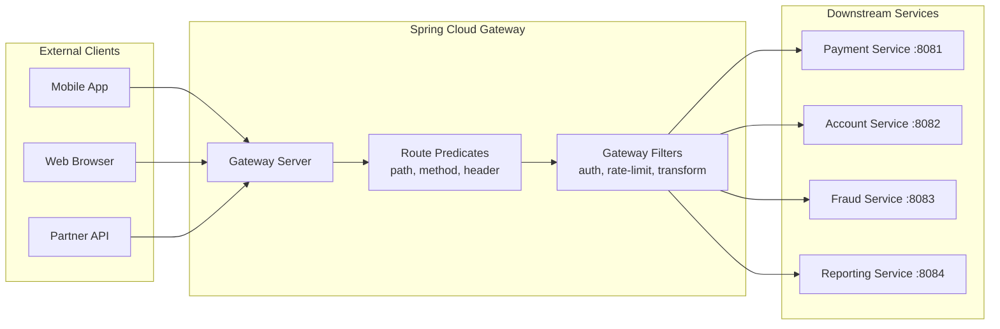
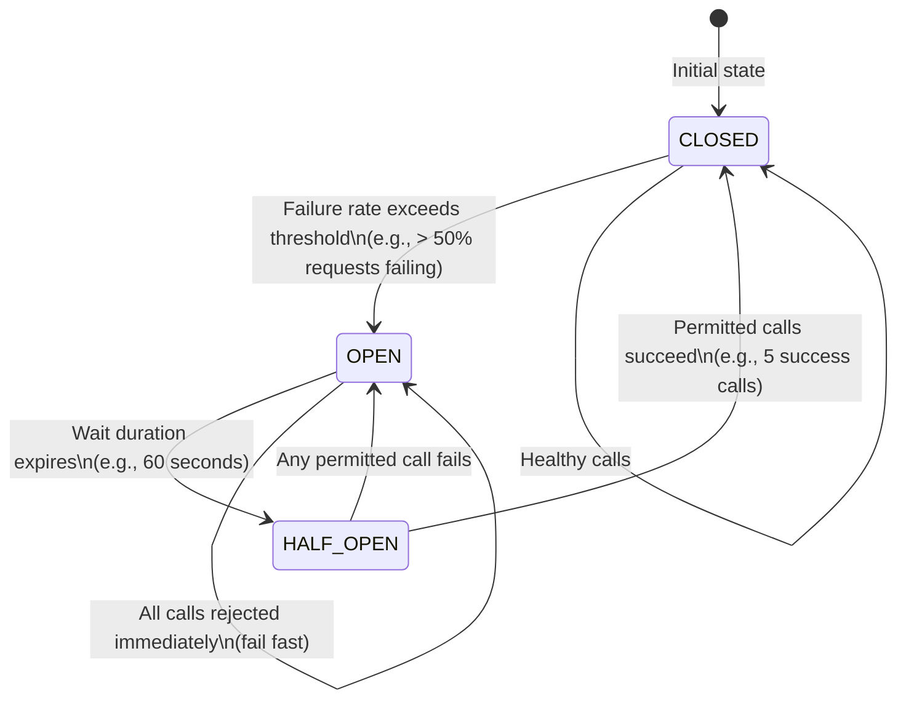
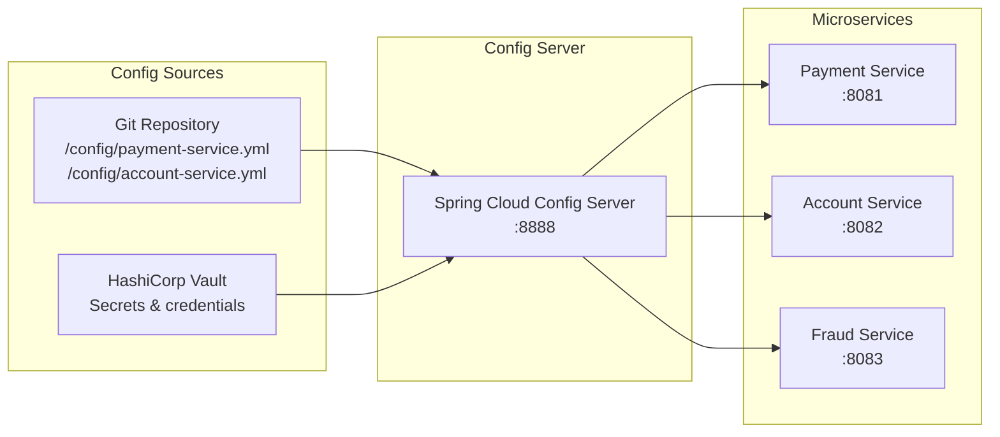
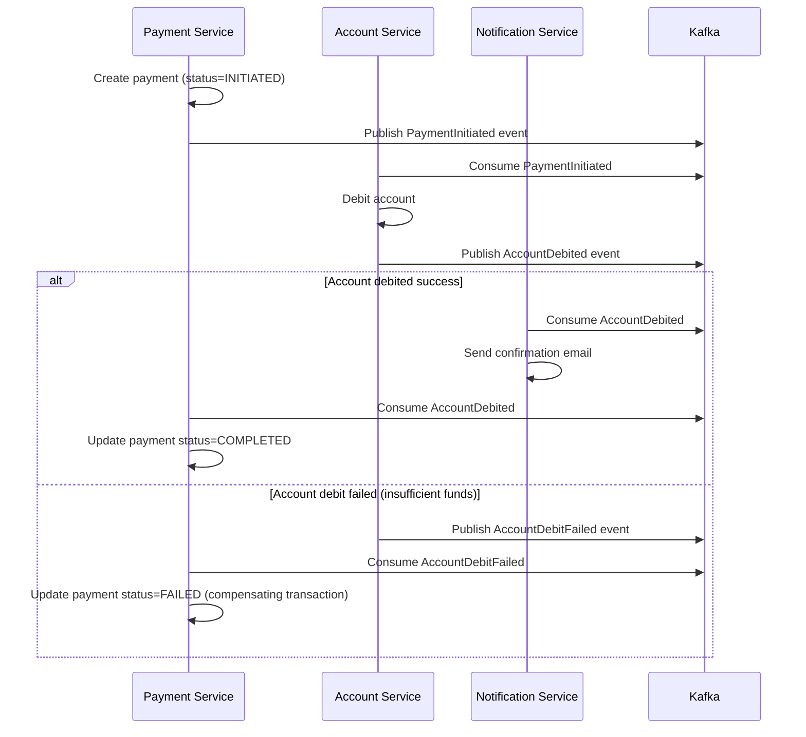

# Spring Cloud Microservices Patterns

## Overview

Spring Cloud is the ecosystem of tools for building production-ready microservices on top of Spring Boot. It addresses the fundamental challenges of distributed systems: service discovery, configuration management, inter-service communication, resilience, and observability. Understanding when and how to apply these patterns — and their trade-offs — is what distinguishes microservices architects from developers who just split monoliths into services.

In enterprise banking, microservices architecture enables independent deployment of payment processing, fraud detection, account management, and reporting services. However, the distributed nature introduces partial failures, network latency, and consistency challenges that don't exist in monoliths.

---

## API Gateway with Spring Cloud Gateway

### Gateway Architecture



### Spring Cloud Gateway Configuration

```java
@Configuration
public class GatewayConfig {
    
    @Bean
    public RouteLocator customRouteLocator(RouteLocatorBuilder builder,
                                           AuthenticationFilter authFilter,
                                           RateLimitFilter rateLimitFilter) {
        return builder.routes()
            
            // ─── Payment Service Routes ──────────────────────────────────
            .route("payment-service", r -> r
                .path("/api/v1/payments/**")
                .and().method(HttpMethod.GET, HttpMethod.POST, HttpMethod.PATCH)
                .filters(f -> f
                    .filter(authFilter.apply(new AuthenticationFilter.Config()))
                    .filter(rateLimitFilter.apply(RateLimitFilter.Config.of(100, Duration.ofMinutes(1))))
                    .addRequestHeader("X-Gateway-Source", "banking-gateway")
                    .removeRequestHeader("Cookie")              // Strip session cookies
                    .rewritePath("/api/v1/payments(?<segment>/?.*)", "/api/v1${segment}")
                    .circuitBreaker(config -> config
                        .setName("paymentCircuitBreaker")
                        .setFallbackUri("forward:/fallback/payment"))
                    .retry(retryConfig -> retryConfig
                        .setRetries(3)
                        .setStatuses(HttpStatus.BAD_GATEWAY, HttpStatus.GATEWAY_TIMEOUT)
                        .setMethods(HttpMethod.GET)
                        .setBackoff(Duration.ofMillis(100), Duration.ofSeconds(2), 2, true))
                )
                .uri("lb://PAYMENT-SERVICE")  // Load-balanced URI via service discovery
            )
            
            // ─── Account Service Routes ──────────────────────────────────
            .route("account-service", r -> r
                .path("/api/v1/accounts/**")
                .filters(f -> f
                    .filter(authFilter.apply(new AuthenticationFilter.Config()))
                    .requestRateLimiter(config -> config
                        .setRateLimiter(redisRateLimiter())
                        .setKeyResolver(userKeyResolver())
                    )
                )
                .uri("lb://ACCOUNT-SERVICE")
            )
            
            .build();
    }
    
    // Redis-based rate limiter (for distributed, stateful rate limiting)
    @Bean
    public RedisRateLimiter redisRateLimiter() {
        return new RedisRateLimiter(20, 40, 1);  // 20 req/s, burst of 40
    }
    
    @Bean
    public KeyResolver userKeyResolver() {
        return exchange -> exchange.getPrincipal()
            .map(Principal::getName)
            .defaultIfEmpty("anonymous")
            .map(Mono::just)
            .flatMap(m -> m);
    }
}
```

```yaml
# Equivalent YAML configuration
spring:
  cloud:
    gateway:
      routes:
        - id: payment-service
          uri: lb://PAYMENT-SERVICE
          predicates:
            - Path=/api/v1/payments/**
            - Method=GET,POST,PATCH
          filters:
            - AuthenticationFilter
            - name: CircuitBreaker
              args:
                name: paymentCircuitBreaker
                fallbackUri: forward:/fallback/payment
            - name: Retry
              args:
                retries: 3
                statuses: BAD_GATEWAY,GATEWAY_TIMEOUT
```

---

## Resilience4j: Circuit Breaker

### Circuit Breaker State Machine



```yaml
# Resilience4j configuration
resilience4j:
  circuitbreaker:
    instances:
      fraud-service:
        sliding-window-type: COUNT_BASED          # Or TIME_BASED
        sliding-window-size: 10                   # Last 10 requests
        minimum-number-of-calls: 5                # Minimum before evaluating
        failure-rate-threshold: 50                # 50% failure → OPEN
        slow-call-rate-threshold: 100             # 100ms+ is slow
        slow-call-duration-threshold: 2s          # 2 seconds = slow
        wait-duration-in-open-state: 60s          # How long to stay OPEN
        permitted-number-of-calls-in-half-open-state: 3
        automatic-transition-from-open-to-half-open-enabled: true
        record-exceptions:
          - java.io.IOException
          - java.net.SocketTimeoutException
          - feign.FeignException
        ignore-exceptions:
          - com.bank.exception.BusinessException   # Don't count business errors

  retry:
    instances:
      payment-gateway:
        max-attempts: 3
        wait-duration: 500ms
        exponential-backoff-multiplier: 2          # 500ms, 1000ms, 2000ms
        retry-exceptions:
          - java.io.IOException
          - java.net.SocketTimeoutException
        ignore-exceptions:
          - com.bank.exception.PaymentRejectedException

  bulkhead:
    instances:
      fraud-service:
        max-concurrent-calls: 20                   # Semaphore-based: 20 concurrent calls max
        max-wait-duration: 100ms                   # Wait 100ms if all slots taken

  timelimiter:
    instances:
      payment-gateway:
        timeout-duration: 3s                       # Timeout individual calls
        cancel-running-future: true
```

```java
@Service
public class FraudCheckService {
    
    private final FraudServiceClient fraudServiceClient;
    
    // ─── @CircuitBreaker with fallback ────────────────────────────────
    @CircuitBreaker(name = "fraud-service", fallbackMethod = "defaultFraudAssessment")
    @Retry(name = "fraud-service")
    @TimeLimiter(name = "fraud-service")
    @Bulkhead(name = "fraud-service")
    public CompletableFuture<FraudAssessment> assessFraud(Payment payment) {
        return CompletableFuture.supplyAsync(() -> 
            fraudServiceClient.assess(payment)
        );
    }
    
    // Fallback method - must have same signature + exception parameter
    private CompletableFuture<FraudAssessment> defaultFraudAssessment(
            Payment payment, Exception ex) {
        
        log.warn("Fraud service unavailable, using rule-based fallback for payment: {}",
            payment.getId(), ex);
        
        // Simplified rule-based assessment when ML service is down
        FraudRisk risk = payment.getAmount().compareTo(AUTOMATIC_APPROVE_LIMIT) <= 0
            ? FraudRisk.LOW : FraudRisk.MANUAL_REVIEW;
        
        return CompletableFuture.completedFuture(
            FraudAssessment.of(risk, "FALLBACK_RULE_BASED")
        );
    }
    
    // ─── Programmatic circuit breaker usage ───────────────────────────
    @Autowired
    private CircuitBreakerRegistry circuitBreakerRegistry;
    
    public void monitorCircuitBreakers() {
        CircuitBreaker cb = circuitBreakerRegistry.circuitBreaker("fraud-service");
        
        log.info("Circuit breaker state: {}", cb.getState());
        log.info("Failure rate: {}%", cb.getMetrics().getFailureRate());
        log.info("Slow call rate: {}%", cb.getMetrics().getSlowCallRate());
        
        // Register state change listener
        cb.getEventPublisher().onStateTransition(event ->
            alertingService.notifyCircuitBreakerStateChange(event));
    }
}
```

---

## Spring Cloud Config Server

### Configuration Management Architecture



```java
// Config Server Application
@SpringBootApplication
@EnableConfigServer
public class ConfigServerApplication {
    public static void main(String[] args) {
        SpringApplication.run(ConfigServerApplication.class, args);
    }
}
```

```yaml
# Config Server: application.yml
spring:
  cloud:
    config:
      server:
        git:
          uri: https://github.com/mybank/config-repo
          default-label: main
          search-paths: '{application}'  # Subfolder per service
          clone-on-start: true           # Fail fast if git unavailable
          timeout: 10                    # Connection timeout
        composite:
          - type: git
            uri: https://github.com/mybank/config-repo
          - type: vault
            authentication: TOKEN
            host: vault.mybank.internal
            port: 8200

# Config Client: bootstrap.yml (or spring.config.import in Boot 2.4+)
spring:
  application:
    name: payment-service
  config:
    import:
      - "configserver:http://config-server:8888"
  cloud:
    config:
      fail-fast: true                    # Fail startup if config server unavailable
      retry:
        initial-interval: 1000
        max-attempts: 6
        max-interval: 2000
```

### Dynamic Configuration Refresh

```java
// Beans annotated with @RefreshScope are re-created when /actuator/refresh is called
@RefreshScope
@Component
public class PaymentLimitConfiguration {
    
    @Value("${payment.daily.limit:10000}")
    private BigDecimal dailyLimit;
    
    @Value("${payment.single.transaction.limit:5000}")
    private BigDecimal singleTransactionLimit;
    
    public BigDecimal getDailyLimit() { return dailyLimit; }
    public BigDecimal getSingleTransactionLimit() { return singleTransactionLimit; }
}

// Trigger refresh via Spring Cloud Bus (Kafka/RabbitMQ):
// POST /actuator/busrefresh → broadcasts to ALL instances
// POST /actuator/refresh → only THIS instance
```

---

## Distributed Tracing

```yaml
# Spring Boot 3.x — Micrometer Tracing (replaced Sleuth)
management:
  tracing:
    sampling:
      probability: 1.0   # Sample 100% in dev; use 0.1 (10%) in production
  zipkin:
    tracing:
      endpoint: http://zipkin:9411/api/v2/spans

# application.yml
spring:
  application:
    name: payment-service  # This becomes the service name in traces
```

```java
@Service
public class PaymentService {
    
    private final Tracer tracer;  // Micrometer Tracer
    
    @NewSpan("payment-processing")  // Creates new span
    public Payment processPayment(@SpanTag("payment.type") String type, PaymentRequest request) {
        
        // Access current span
        Span currentSpan = tracer.currentSpan();
        if (currentSpan != null) {
            currentSpan.tag("account.id", request.getAccountId().toString());
            currentSpan.event("fraud-check-start");
        }
        
        FraudAssessment assessment = fraudService.assess(request);
        
        if (currentSpan != null) {
            currentSpan.event("fraud-check-complete");
            currentSpan.tag("fraud.risk", assessment.getRisk().name());
        }
        
        return processInternal(request);
    }
    
    // Span automatically propagated via ThreadLocal to all downstream calls
    // Every MDC log entry includes traceId and spanId:
    // {"traceId":"6bef47302b62148a","spanId":"2279ac96e84e3b5f","message":"Processing payment"}
}
```

```xml
<!-- POM: Micrometer Tracing dependencies -->
<dependency>
    <groupId>io.micrometer</groupId>
    <artifactId>micrometer-tracing-bridge-otel</artifactId>  <!-- OpenTelemetry bridge -->
</dependency>
<dependency>
    <groupId>io.opentelemetry</groupId>
    <artifactId>opentelemetry-exporter-zipkin</artifactId>
</dependency>
```

---

## Inter-Service Communication

### Synchronous: OpenFeign Client

```java
// OpenFeign: Declarative HTTP client
@FeignClient(
    name = "fraud-service",
    url = "${services.fraud-service.url}",
    fallback = FraudServiceFallback.class,
    configuration = FeignClientConfig.class
)
public interface FraudServiceClient {
    
    @PostMapping("/api/v1/fraud/assess")
    @Headers({"X-Service-Name: payment-service"})
    FraudAssessmentResponse assessTransaction(@RequestBody FraudAssessmentRequest request);
    
    @GetMapping("/api/v1/fraud/history/{accountId}")
    List<FraudEvent> getFraudHistory(
        @PathVariable("accountId") UUID accountId,
        @RequestParam("fromDate") LocalDate fromDate
    );
}

// Fallback implementation
@Component
public class FraudServiceFallback implements FraudServiceClient {
    
    @Override
    public FraudAssessmentResponse assessTransaction(FraudAssessmentRequest request) {
        log.warn("Fraud service unavailable, using conservative default");
        return FraudAssessmentResponse.of(FraudRisk.MANUAL_REVIEW, "SERVICE_UNAVAILABLE");
    }
    
    @Override
    public List<FraudEvent> getFraudHistory(UUID accountId, LocalDate fromDate) {
        return List.of();  // Return empty history on fallback
    }
}

// Feign configuration
@Configuration
public class FeignClientConfig {
    
    @Bean
    public ErrorDecoder errorDecoder() {
        return (methodKey, response) -> {
            if (response.status() == 404) {
                return new FraudAssessmentNotFoundException(methodKey);
            }
            if (response.status() >= 500) {
                return new RetryableException(response.status(), "Server error", 
                    Request.HttpMethod.GET, null, null);
            }
            return new FeignException.FeignClientException(response.status(), 
                "Client error", response.request(), null, null);
        };
    }
    
    @Bean
    public Retryer retryer() {
        return new Retryer.Default(100L, 2000L, 3);  // min 100ms, max 2s, max 3 attempts
    }
    
    @Bean
    public Request.Options options() {
        return new Request.Options(
            Duration.ofSeconds(3),   // Connect timeout
            Duration.ofSeconds(10),  // Read timeout
            true
        );
    }
}
```

### Asynchronous: Event-Driven Communication

```java
// Producer: PaymentService publishes event
@Service
public class PaymentService {
    
    private final KafkaTemplate<String, PaymentEvent> kafkaTemplate;
    
    @Transactional
    public Payment processPayment(PaymentRequest request) {
        Payment payment = paymentRepository.save(new Payment(request));
        
        // Publish AFTER successful transaction commit via @TransactionalEventListener
        applicationEventPublisher.publishEvent(new PaymentProcessedDomainEvent(payment));
        
        return payment;
    }
    
    @TransactionalEventListener(phase = TransactionPhase.AFTER_COMMIT)
    public void onPaymentProcessed(PaymentProcessedDomainEvent event) {
        PaymentEvent kafkaEvent = PaymentEvent.from(event.getPayment());
        kafkaTemplate.send("payment-events", event.getPayment().getId().toString(), kafkaEvent);
    }
}

// Consumer: FraudService listens to payment events
@Service
public class FraudEventConsumer {
    
    @KafkaListener(
        topics = "payment-events",
        groupId = "fraud-detection-group",
        containerFactory = "paymentEventListenerContainerFactory"
    )
    public void handlePaymentEvent(
            @Payload PaymentEvent event,
            @Header(KafkaHeaders.RECEIVED_TOPIC) String topic,
            @Header(KafkaHeaders.RECEIVED_PARTITION) int partition,
            @Header(KafkaHeaders.OFFSET) long offset) {
        
        log.info("Processing payment event: paymentId={}, partition={}, offset={}", 
            event.getPaymentId(), partition, offset);
        
        fraudDetectionService.analyzePayment(event);
    }
}
```

---

## Saga Pattern for Distributed Transactions



```java
// Saga Orchestrator Pattern
@Service
public class PaymentSagaOrchestrator {
    
    @KafkaListener(topics = "payment-saga-events")
    public void handleSagaStep(PaymentSagaEvent event) {
        switch (event.getStep()) {
            case PAYMENT_INITIATED -> initiateAccountDebit(event);
            case ACCOUNT_DEBITED -> initiateNotification(event);
            case ACCOUNT_DEBIT_FAILED -> compensate(event);
            case SAGA_COMPLETED -> markPaymentComplete(event.getPaymentId());
        }
    }
    
    private void compensate(PaymentSagaEvent event) {
        log.warn("Compensating payment saga for payment: {}", event.getPaymentId());
        paymentRepository.findById(event.getPaymentId())
            .ifPresent(payment -> {
                payment.setStatus(PaymentStatus.FAILED);
                payment.setFailureReason(event.getFailureReason());
                paymentRepository.save(payment);
            });
        kafkaTemplate.send("email-events", EmailEvent.paymentFailed(event));
    }
}
```

---

## Interview Questions & Model Answers

### Q1: What is the circuit breaker pattern and when does it open?

**Model Answer**: The circuit breaker is a resilience pattern inspired by electrical circuit breakers. In software, it prevents cascading failures by stopping calls to a failing downstream service.

Three states:
- **CLOSED**: All requests pass through. The circuit breaker monitors success/failure rates.
- **OPEN**: After the failure rate exceeds the threshold (e.g., 50% of last 10 calls failed), the circuit opens. All calls fail immediately without attempting the downstream service (fail fast). Reduces load on the already-struggling service.
- **HALF_OPEN**: After a wait duration (e.g., 60 seconds), a limited number of test calls are allowed. If they succeed, the circuit closes. If any fail, it opens again.

In banking: if the fraud detection service is down, the circuit breaker prevents payment service from waiting for timeouts on every payment attempt. With the circuit open, payments either use a simpler rule-based fallback or fail fast. This prevents the payment service's thread pool from exhausting waiting on fraud service timeouts.

---

### Q2: How do you maintain data consistency across microservices?

**Model Answer**: In a distributed system, you cannot use distributed ACID transactions in most cases (two-phase commit is slow and fragile). Instead:

1. **Saga Pattern**: Break the distributed transaction into a sequence of local transactions, each publishing an event. Use compensating transactions for rollback. In banking: payment initiation → account debit → notification, with compensation if any step fails.

2. **Outbox Pattern**: Instead of publishing to Kafka directly in a transaction, write to an "outbox" table in your local database within the same transaction. A separate processor (Debezium, polling) reads the outbox and publishes to Kafka — at-least-once delivery guaranteed.

3. **Event Sourcing**: Store state as a sequence of events rather than current state. The current state is derived by replaying events. Inherently consistent when combined with Kafka and event streaming.

4. **Eventual consistency acceptance**: Accept that different services will be temporarily inconsistent, and design UX to handle this (e.g., "payment processing" state before final confirmation).

5. **Idempotent consumers**: Messages can be delivered multiple times (at-least-once) — design consumers to be idempotent (same message processed twice = same outcome).

---

## Key Takeaways

- **API Gateway centralises cross-cutting concerns**: Auth, rate limiting, routing, circuit breaking
- **Circuit Breaker states**: CLOSED (normal) → OPEN (failing, reject fast) → HALF_OPEN (testing)
- **Resilience4j replaces Hystrix** (Hystrix maintenance mode) — annotation-driven with Spring Boot starter
- **Config Server externalises config**: All microservice config in Git; refresh via Actuator or Spring Cloud Bus
- **Distributed tracing with Micrometer Tracing** (replaces Spring Cloud Sleuth in Boot 3.x)
- **Saga for distributed transactions**: Choreography (events) or Orchestration (central coordinator)
- **Outbox pattern ensures at-least-once delivery**: Write to outbox table + transactionally with domain event

---

## Further Reading

- [Spring Cloud Gateway Reference](https://docs.spring.io/spring-cloud-gateway/reference/)
- [Resilience4j Documentation](https://resilience4j.readme.io/docs/getting-started-3)
- [Spring Cloud Config Reference](https://docs.spring.io/spring-cloud-config/reference/)
- "Cloud Native Spring in Action" by Thomas Vitale
- [Microservices Patterns by Chris Richardson](https://microservices.io/patterns/index.html)
