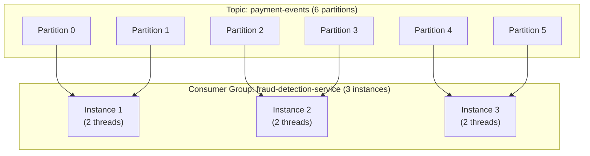

# Spring Kafka: Messaging and Event-Driven Architecture

## Overview

Apache Kafka with Spring Kafka is the backbone of event-driven microservices in enterprise banking. Real-time fraud detection, payment status propagation, audit event streaming, and the Outbox pattern all rely on Kafka. Spring Kafka provides a `KafkaTemplate` for production, `@KafkaListener` for consumption, and rich error handling infrastructure including dead letter topics and retry mechanisms.

Understanding Kafka's partitioning model, consumer group semantics, exactly-once semantics, and Spring's error handling strategies at interview level means explaining *why* certain choices are made — partition count vs parallelism, when to use transactions, and how to build truly idempotent consumers.

---

## Spring Kafka Producer: KafkaTemplate

```java
@Configuration
public class KafkaProducerConfig {
    
    @Bean
    public ProducerFactory<String, Object> producerFactory() {
        Map<String, Object> configProps = new HashMap<>();
        configProps.put(ProducerConfig.BOOTSTRAP_SERVERS_CONFIG, "${spring.kafka.bootstrap-servers}");
        configProps.put(ProducerConfig.KEY_SERIALIZER_CLASS_CONFIG, StringSerializer.class);
        configProps.put(ProducerConfig.VALUE_SERIALIZER_CLASS_CONFIG, JsonSerializer.class);
        
        // ─── Reliability settings ──────────────────────────────────────
        // acks=all: Leader + all in-sync replicas must acknowledge
        configProps.put(ProducerConfig.ACKS_CONFIG, "all");
        
        // Idempotent producer: exactly-once when retrying
        configProps.put(ProducerConfig.ENABLE_IDEMPOTENCE_CONFIG, true);
        
        // Max in-flight requests per connection (must be 1 for strict ordering)
        configProps.put(ProducerConfig.MAX_IN_FLIGHT_REQUESTS_PER_CONNECTION, 1);
        
        // Retries (with idempotence, safe to retry)
        configProps.put(ProducerConfig.RETRIES_CONFIG, Integer.MAX_VALUE);
        configProps.put(ProducerConfig.RETRY_BACKOFF_MS_CONFIG, 100);
        
        // Batching for throughput
        configProps.put(ProducerConfig.BATCH_SIZE_CONFIG, 16384);
        configProps.put(ProducerConfig.LINGER_MS_CONFIG, 5);  // Wait 5ms to batch
        configProps.put(ProducerConfig.COMPRESSION_TYPE_CONFIG, "snappy");
        
        // Timeout
        configProps.put(ProducerConfig.REQUEST_TIMEOUT_MS_CONFIG, 30000);
        configProps.put(ProducerConfig.DELIVERY_TIMEOUT_MS_CONFIG, 120000);
        
        return new DefaultKafkaProducerFactory<>(configProps);
    }
    
    @Bean
    public KafkaTemplate<String, Object> kafkaTemplate(ProducerFactory<String, Object> pf) {
        KafkaTemplate<String, Object> template = new KafkaTemplate<>(pf);
        template.setObservationEnabled(true);  // Micrometer tracing integration
        return template;
    }
}

@Service
public class PaymentEventPublisher {
    
    private final KafkaTemplate<String, Object> kafkaTemplate;
    
    // ─── Fire and forget ──────────────────────────────────────────────
    public void publishPaymentInitiated(Payment payment) {
        PaymentInitiatedEvent event = PaymentInitiatedEvent.from(payment);
        
        // Use payment ID as key → same payment always goes to same partition (ordering)
        kafkaTemplate.send("payment-events", payment.getId().toString(), event)
            .whenComplete((result, ex) -> {
                if (ex != null) {
                    log.error("Failed to publish payment event: {}", payment.getId(), ex);
                    // Consider: save to outbox table for retry
                } else {
                    log.debug("Published to {}-{} at offset {}",
                        result.getRecordMetadata().topic(),
                        result.getRecordMetadata().partition(),
                        result.getRecordMetadata().offset());
                }
            });
    }
    
    // ─── Synchronous send (ensure delivery before returning) ──────────
    public void publishCriticalEvent(AuditEvent auditEvent) throws Exception {
        var future = kafkaTemplate.send("audit-events", 
            auditEvent.getEntityId().toString(), auditEvent);
        
        // Block and wait - use for critical events that must confirm delivery
        SendResult<String, Object> result = future.get(10, TimeUnit.SECONDS);
        log.info("Audit event committed to partition {} at offset {}",
            result.getRecordMetadata().partition(),
            result.getRecordMetadata().offset());
    }
    
    // ─── Send with headers (metadata propagation) ─────────────────────
    public void publishWithTracing(Transaction transaction) {
        ProducerRecord<String, Object> record = new ProducerRecord<>(
            "transaction-events",
            null,                                         // Partition (null = auto)
            transaction.getId().toString(),               // Key
            TransactionEvent.from(transaction)            // Value
        );
        
        // Propagate trace context
        record.headers().add("X-Correlation-ID", 
            MDC.get("correlationId").getBytes(StandardCharsets.UTF_8));
        record.headers().add("X-Trace-ID", 
            MDC.get("traceId").getBytes(StandardCharsets.UTF_8));
        record.headers().add("X-Source-Service", 
            "payment-service".getBytes(StandardCharsets.UTF_8));
        
        kafkaTemplate.send(record);
    }
}
```

---

## Spring Kafka Consumer: @KafkaListener

```java
@Configuration
public class KafkaConsumerConfig {
    
    @Bean
    public ConsumerFactory<String, PaymentEvent> paymentEventConsumerFactory() {
        Map<String, Object> props = new HashMap<>();
        props.put(ConsumerConfig.BOOTSTRAP_SERVERS_CONFIG, bootstrapServers);
        props.put(ConsumerConfig.GROUP_ID_CONFIG, "fraud-detection-service");
        props.put(ConsumerConfig.KEY_DESERIALIZER_CLASS_CONFIG, StringDeserializer.class);
        props.put(ConsumerConfig.VALUE_DESERIALIZER_CLASS_CONFIG, JsonDeserializer.class);
        props.put(JsonDeserializer.TRUSTED_PACKAGES, "com.bank.events.*");
        
        // ─── Offset management ──────────────────────────────────────────
        // earliest: read from beginning (use for new consumer groups)
        // latest: read only new messages (use for existing consumers)
        props.put(ConsumerConfig.AUTO_OFFSET_RESET_CONFIG, "earliest");
        
        // Manual commit for exactly-once processing guarantees
        props.put(ConsumerConfig.ENABLE_AUTO_COMMIT_CONFIG, false);
        
        // Heartbeat and session timeout
        props.put(ConsumerConfig.HEARTBEAT_INTERVAL_MS_CONFIG, 3000);
        props.put(ConsumerConfig.SESSION_TIMEOUT_MS_CONFIG, 45000);
        
        // Fetch settings for throughput tuning
        props.put(ConsumerConfig.MAX_POLL_RECORDS_CONFIG, 500);
        props.put(ConsumerConfig.FETCH_MIN_BYTES_CONFIG, 1024);
        props.put(ConsumerConfig.FETCH_MAX_WAIT_MS_CONFIG, 500);
        
        return new DefaultKafkaConsumerFactory<>(props);
    }
    
    @Bean
    public ConcurrentKafkaListenerContainerFactory<String, PaymentEvent> paymentListenerContainerFactory(
            ConsumerFactory<String, PaymentEvent> consumerFactory,
            DefaultErrorHandler errorHandler) {
        
        ConcurrentKafkaListenerContainerFactory<String, PaymentEvent> factory = 
            new ConcurrentKafkaListenerContainerFactory<>();
        
        factory.setConsumerFactory(consumerFactory);
        factory.setConcurrency(6);  // 6 consumer threads (should match partition count)
        
        // Manual acknowledgment mode
        factory.getContainerProperties().setAckMode(ContainerProperties.AckMode.MANUAL_IMMEDIATE);
        
        // Error handler with retry + DLT
        factory.setCommonErrorHandler(errorHandler);
        
        // Enable Micrometer observation (tracing)
        factory.getContainerProperties().setObservationEnabled(true);
        
        factory.setBatchListener(false);  // Process one record at a time (use true for batch)
        
        return factory;
    }
    
    @Bean
    public DefaultErrorHandler errorHandler(KafkaTemplate<String, Object> kafkaTemplate) {
        // Dead Letter Topic publisher
        DeadLetterPublishingRecoverer recoverer = new DeadLetterPublishingRecoverer(kafkaTemplate,
            (record, exception) -> {
                log.error("Publishing to DLT: topic={}, partition={}, offset={}, error={}",
                    record.topic(), record.partition(), record.offset(), exception.getMessage());
                // DLT topic: payment-events.DLT
                return new TopicPartition(record.topic() + ".DLT", record.partition());
            });
        
        // Retry with exponential backoff: 1s, 2s, 4s (max 3 attempts)
        ExponentialBackOffWithMaxRetries backoff = new ExponentialBackOffWithMaxRetries(3);
        backoff.setInitialInterval(1000L);
        backoff.setMultiplier(2.0);
        backoff.setMaxInterval(10000L);
        
        DefaultErrorHandler errorHandler = new DefaultErrorHandler(recoverer, backoff);
        
        // Don't retry on these exceptions (data errors, not transient)
        errorHandler.addNotRetryableExceptions(
            DeserializationException.class,
            IllegalArgumentException.class
        );
        
        return errorHandler;
    }
}
```

### @KafkaListener Implementations

```java
@Service
public class FraudDetectionConsumer {
    
    private final FraudDetectionService fraudService;
    private final PaymentRepository paymentRepository;
    
    // ─── Basic listener ───────────────────────────────────────────────
    @KafkaListener(
        topics = "payment-events",
        groupId = "fraud-detection-service",
        containerFactory = "paymentListenerContainerFactory",
        concurrency = "6"  // 6 threads = 6 partitions consumed in parallel
    )
    public void handlePaymentEvent(
            @Payload PaymentEvent event,
            @Header(KafkaHeaders.RECEIVED_TOPIC) String topic,
            @Header(KafkaHeaders.RECEIVED_PARTITION) int partition,
            @Header(KafkaHeaders.OFFSET) long offset,
            @Header(KafkaHeaders.RECEIVED_TIMESTAMP) long timestamp,
            Acknowledgment acknowledgment) {  // Manual acknowledgment
        
        log.info("Processing payment: id={}, partition={}, offset={}", 
            event.getPaymentId(), partition, offset);
        
        try {
            FraudAssessment result = fraudService.analyze(event);
            
            if (result.getRisk() == FraudRisk.HIGH) {
                paymentRepository.updateStatus(event.getPaymentId(), PaymentStatus.BLOCKED);
                alertService.notifyFraud(event, result);
            }
            
            acknowledgment.acknowledge();  // Commit offset after successful processing
            
        } catch (TransientException e) {
            // Don't acknowledge — message will be re-delivered
            log.warn("Transient error processing payment {}: {}", event.getPaymentId(), e.getMessage());
            throw e;  // Let error handler retry
        }
    }
    
    // ─── Batch listener ──────────────────────────────────────────────
    @KafkaListener(
        topics = "payment-events-batch",
        groupId = "fraud-batch-group",
        containerFactory = "batchListenerFactory"
    )
    public void handleBatch(
            List<PaymentEvent> events,
            List<Acknowledgment> acks) {
        
        log.info("Processing batch of {} payment events", events.size());
        
        List<FraudAssessment> assessments = fraudService.analyzeBatch(events);
        
        // Process each and acknowledge individually
        for (int i = 0; i < events.size(); i++) {
            try {
                processAssessment(events.get(i), assessments.get(i));
                acks.get(i).acknowledge();
            } catch (Exception e) {
                log.error("Failed to process event at index {}: {}", i, e.getMessage());
                // Individual NACK — rest of batch still committed
                acks.get(i).nack(Duration.ofSeconds(5));
            }
        }
    }
    
    // ─── Multiple topics ─────────────────────────────────────────────
    @KafkaListener(topics = {"payment-events", "transfer-events"}, groupId = "audit-group")
    public void handleMultipleTopics(
            @Payload Object event,
            @Header(KafkaHeaders.RECEIVED_TOPIC) String sourceTopic) {
        
        auditService.logEvent(sourceTopic, event);
    }
    
    // ─── DLT Consumer: process failed messages ────────────────────────
    @KafkaListener(topics = "payment-events.DLT", groupId = "dlt-processor")
    @Transactional
    public void handleDeadLetterTopic(
            @Payload byte[] rawPayload,
            @Header(KafkaHeaders.DLT_EXCEPTION_MESSAGE) String errorMessage,
            @Header(KafkaHeaders.DLT_ORIGINAL_TOPIC) String originalTopic,
            @Header(KafkaHeaders.DLT_ORIGINAL_OFFSET) long originalOffset) {
        
        log.error("DLT message: originalTopic={}, originalOffset={}, error={}", 
            originalTopic, originalOffset, errorMessage);
        
        // Save to dead letter database for manual review / replay
        deadLetterRepository.save(DeadLetterRecord.builder()
            .payload(rawPayload)
            .errorMessage(errorMessage)
            .originalTopic(originalTopic)
            .originalOffset(originalOffset)
            .receivedAt(Instant.now())
            .status(DeadLetterStatus.PENDING_REVIEW)
            .build());
    }
}
```

---

## Kafka Transactions: Exactly-Once Semantics

```java
@Configuration
public class KafkaTransactionConfig {
    
    @Bean
    public ProducerFactory<String, Object> transactionalProducerFactory() {
        Map<String, Object> props = new HashMap<>();
        // ... other props ...
        props.put(ProducerConfig.ENABLE_IDEMPOTENCE_CONFIG, true);
        props.put(ProducerConfig.TRANSACTIONAL_ID_CONFIG, "payment-service-tx-1");
        // Each producer instance needs unique transactional ID
        // Use: applicationName + "-tx-" + UUID for distributed deployments
        
        DefaultKafkaProducerFactory<String, Object> factory = new DefaultKafkaProducerFactory<>(props);
        factory.setTransactionIdPrefix("payment-tx-");
        return factory;
    }
}

@Service
public class TransactionalPaymentProcessor {
    
    private final KafkaTemplate<String, Object> kafkaTemplate;
    private final PaymentRepository paymentRepository;
    
    // Exactly-once: consume-transform-produce in a single Kafka transaction
    @Transactional("kafkaTransactionManager")
    @KafkaListener(topics = "raw-payments", groupId = "payment-processor")
    public void processRawPayment(ConsumerRecord<String, RawPaymentEvent> record) {
        
        RawPaymentEvent raw = record.value();
        
        // Transform raw event into processed payment
        Payment payment = paymentTransformer.transform(raw);
        paymentRepository.save(payment);  // DB write (part of Spring @Transactional)
        
        // Publish to output topic (part of Kafka transaction)
        kafkaTemplate.send("processed-payments", payment.getId().toString(), 
            ProcessedPaymentEvent.from(payment));
        
        // Both DB and Kafka operations are atomic:
        // If anything fails → DB rolled back AND Kafka message NOT committed
    }
}
```

---

## Kafka Consumer Group and Partition Assignment



**Key rules**:
- Each partition is consumed by exactly ONE consumer in a group at a time
- Maximum parallelism = number of partitions
- Consumers > partitions → idle consumers
- Use `@KafkaListener(concurrency = "6")` to match partition count

---

## Outbox Pattern for Reliable Messaging

```java
// Outbox Pattern: ensures at-least-once delivery WITHOUT 2-phase commit
@Entity
@Table(name = "outbox_events")
public class OutboxEvent {
    @Id @GeneratedValue
    private UUID id;
    
    private String aggregateType;   // "Payment"
    private UUID aggregateId;       // paymentId
    private String eventType;       // "PaymentInitiated"
    private String payload;         // JSON-serialized event
    private OutboxStatus status;    // PENDING, PUBLISHED, FAILED
    private Instant createdAt;
    private int attemptCount;
    private Instant nextAttemptAt;
}

@Service
@Transactional  // Same DB transaction as business data
public class PaymentService {
    
    private final PaymentRepository paymentRepo;
    private final OutboxEventRepository outboxRepo;
    private final ObjectMapper objectMapper;
    
    public Payment createPayment(PaymentRequest request) throws JsonProcessingException {
        // 1. Save payment
        Payment payment = paymentRepo.save(new Payment(request));
        
        // 2. Save outbox event in SAME transaction — atomically!
        outboxRepo.save(OutboxEvent.builder()
            .aggregateType("Payment")
            .aggregateId(payment.getId())
            .eventType("PaymentInitiated")
            .payload(objectMapper.writeValueAsString(PaymentInitiatedEvent.from(payment)))
            .status(OutboxStatus.PENDING)
            .createdAt(Instant.now())
            .nextAttemptAt(Instant.now())
            .build());
        
        return payment;  // Transaction commits — both payment AND outbox event saved
    }
}

// Outbox Relay: periodically publishes pending outbox events to Kafka
@Component
public class OutboxEventRelay {
    
    private final OutboxEventRepository outboxRepo;
    private final KafkaTemplate<String, String> kafkaTemplate;
    
    @Scheduled(fixedDelay = 1000)  // Every second
    @Transactional
    public void relayPendingEvents() {
        List<OutboxEvent> pendingEvents = outboxRepo
            .findByStatusAndNextAttemptAtBefore(OutboxStatus.PENDING, Instant.now(), 
                PageRequest.of(0, 100));
        
        for (OutboxEvent event : pendingEvents) {
            try {
                String topic = topicFor(event.getEventType());
                kafkaTemplate.send(topic, event.getAggregateId().toString(), event.getPayload())
                    .get(5, TimeUnit.SECONDS);
                
                event.setStatus(OutboxStatus.PUBLISHED);
            } catch (Exception e) {
                event.setAttemptCount(event.getAttemptCount() + 1);
                event.setNextAttemptAt(calculateBackoff(event.getAttemptCount()));
                if (event.getAttemptCount() >= 10) {
                    event.setStatus(OutboxStatus.FAILED);
                    alertService.notifyOutboxFailure(event);
                }
            }
            outboxRepo.save(event);
        }
    }
}

// Alternative: Use Debezium CDC to watch outbox table changes → Kafka
// This eliminates polling latency and uses Kafka Connect
```

---

## Interview Questions & Model Answers

### Q1: How do you guarantee exactly-once message processing with Spring Kafka?

**Model Answer**: True exactly-once requires coordination at multiple levels:

**Producer side** (`enable.idempotence=true`): Kafka assigns a producer ID and sequence numbers. If a producer retries a message (network failure), Kafka deduplicates based on producer ID + sequence number — the message is written only once.

**Consumer side**: The challenge is processing a message exactly once. Solutions:

1. **Kafka Transactions** (`transactional.id`): Group consumer offset commit and producer publish in a single Kafka transaction. If processing fails, the offset is not committed (message re-delivered) and the output message is not visible to consumers. This is "read-process-write" EOS.

2. **Idempotent consumers**: Each message has a unique ID. Before processing, check if this ID has already been processed (Redis, DB). If yes, skip. This works even with at-least-once delivery.

3. **Outbox Pattern**: Write the processed result AND the output event to the database atomically. A relay publishes the outbox event to Kafka. Even if the outbox event is published twice (relay retry), the consumer's idempotency check handles it.

In practice for banking: use idempotent consumers backed by a Redis or PostgreSQL deduplication store, with Kafka's producer idempotence for network-level deduplication.

---

### Q2: What is the DefaultErrorHandler and how does it differ from SeekToCurrentErrorHandler?

**Model Answer**: `SeekToCurrentErrorHandler` was the Spring Kafka 2.x error handler that retried by seeking the consumer back to the failed record. In Spring Kafka 2.8+, it was renamed and its functionality merged into `DefaultErrorHandler` with additional improvements.

`DefaultErrorHandler` provides:
- Configurable retry with backoff (exponential backoff, max retries)
- Dead Letter Topic (DLT) publishing via `DeadLetterPublishingRecoverer`
- Per-exception configuration (some exceptions skip retry)
- Batch error mode for batch listeners

Unlike the old approach, `DefaultErrorHandler` uses `BackOff` for timing between retries, making it more flexible and configurable.

For critical banking systems: configure 3-5 retries with exponential backoff (1s, 2s, 4s), publish to DLT on exhaustion, and have a DLT consumer that saves to a database for manual review/replay.

---

## Key Takeaways

- **Partitions determine parallelism** — consumer threads should equal partition count
- **Use key for message ordering** — messages with same key always go to same partition
- **Manual acknowledgment (`MANUAL_IMMEDIATE`)** — only commit offset after successful processing
- **DefaultErrorHandler for retry + DLT** — exponential backoff + dead letter for failed messages
- **Outbox pattern ensures no message loss** — same DB transaction as business data
- **`acks=all` + idempotent producer** — prevents message loss AND duplication on network errors
- **Consumer group > partition count = idle consumers** — always match concurrency to partition count
- **Kafka transactions for EOS** — atomic consume-process-produce in single Kafka transaction

---

## Further Reading

- [Spring for Apache Kafka Reference](https://docs.spring.io/spring-kafka/reference/)
- [Confluent Kafka Documentation](https://docs.confluent.io/kafka/)
- [Baeldung — Introduction to Spring Kafka](https://www.baeldung.com/spring-kafka)
- "Kafka: The Definitive Guide" by Neha Narkhede
