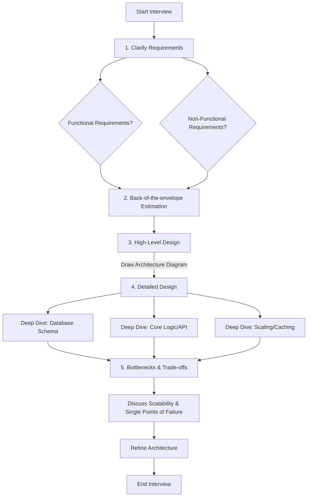

# System Design Fundamentals

## Overview

System design is the process of defining the architecture, modules, interfaces, and data for a system to satisfy specified requirements. In the context of modern software engineering, especially for enterprise banking and financial services, system design focuses on distributed systems design. It involves taking complex, ambiguous business problems, such as "design a global payment processing system," and translating them into a scalable, reliable, and secure technical architecture. For Staff and Principal Engineers, mastering system design is crucial as their decisions dictate the technical direction, cost profile, and robustness of the entire platform.

Interviewers ask system design questions to evaluate a candidate's ability to navigate ambiguity, architect at scale, and make justified trade-offs. The interview simulates a day at work where an engineer must collaborate to solve a hard problem. It tests not just technical knowledge (how a database works), but also systems thinking (how components interact when pushed to their limits), communication skills, and an awareness of operational realities like latency, cost, and failure modes.

In enterprise banking, a poor system design doesn't just result in a slow webpage; it can mean dropped financial transactions, regulatory fines (PCI-DSS/GDPR breaches), or significant reconciliation headaches. Financial systems demand high consistency, extreme auditability, and robust disaster recovery mechanisms, often layered on top of legacy core banking frameworks. Understanding the fundamentals ensures you can balance these stringent enterprise requirements with the need for modern, high-throughput architectures.

## Foundational Concepts

### The Step-By-Step Interview Framework
Approaching a system design interview requires a structured methodology to avoid getting lost in the weeds or running out of time.

1.  **Clarify Requirements (5-10 mins)**: Never jump straight to the solution. Ask questions to narrow down the scope. Understand functional (what the system does) and non-functional requirements (how well the system does it).
2.  **Back-of-the-Envelope Estimation (5 mins)**: Use napkin math to gauge the scale. This dictates your architectural choices—a system handling 100 requests per second (QPS) looks vastly different from one handling 100,000 QPS.
3.  **High-Level Design (10-15 mins)**: Identify the core components (API Gateway, App Servers, Databases, Caches) and how data flows between them. Draw a 30,000-foot view.
4.  **Detailed Design (15-20 mins)**: Deep dive into 2-3 critical components. This is where you demonstrate seniority—discussing database schema, API design, sharding strategies, or the internals of a messaging queue.
5.  **Bottlenecks and Trade-offs (5 mins)**: Identify single points of failure, scaling limits, and discuss what trade-offs you made (e.g., trading consistency for lower latency).

### Functional vs. Non-Functional Requirements (NFRs)
- **Functional Requirements**: Behaviors the system must support (e.g., "Users can send money to other users", "The system must generate a monthly statement").
- **Non-Functional Requirements (NFRs)**: Qualities of the system (e.g., "The system must have 99.99% availability", "Read latency must be < 50ms"). NFRs drive the system's architecture.

## Technical Deep Dive

### Key Non-Functional Requirements (NFRs)

#### 1. Availability
Availability measures the percentage of time a system is operational and accessible. In banking, high availability (HA) is paramount.
*   **99% (Two Nines)**: ~3.65 days of downtime/year. Acceptable for internal batch tools.
*   **99.9% (Three Nines)**: ~8.77 hours/year. Standard for many enterprise apps.
*   **99.99% (Four Nines)**: ~52.6 minutes/year. Typical target for core banking services.
*   **99.999% (Five Nines)**: ~5.26 minutes/year. Required for critical trading platforms or ATM networks. Achieving this requires active-active multi-region deployments and extreme fault tolerance.

#### 2. Consistency vs. Durability
*   **Consistency**: Does every read receive the most recent write or an error? In banking, moving money between accounts often requires *strong consistency* (ACID transactions). However, the profile picture of a user can tolerate *eventual consistency*.
*   **Durability**: Once a transaction is committed, it will remain so, even in the event of a crash. This means data is safely written to non-volatile storage.

#### 3. Scalability (Horizontal vs. Vertical)
*   **Vertical Scaling (Scale-Up)**: Adding more CPU/RAM to a single machine. It's simple but has a hard upper limit and introduces a single point of failure (SPOF).
*   **Horizontal Scaling (Scale-Out)**: Adding more machines to the pool of resources. This is preferred for distributed systems as it provides fault tolerance and near-infinite scaling, but requires application state to be managed effectively (e.g., stateless services).

#### 4. Fault Tolerance and Disaster Recovery
*   **Fault Tolerance**: The system's ability to continue operating amidst component failures.
*   **RPO (Recovery Point Objective)**: The maximum acceptable amount of data loss measured in time (e.g., 5 minutes of lost transactions). Zero RPO in banking requires synchronous cross-region replication.
*   **RTO (Recovery Time Objective)**: The maximum acceptable time the system can be offline before being restored.

### Back-of-the-Envelope Estimation

Estimations show your ability to plan for capacity. You should know common powers of 2 (e.g., 2^10 = 1KB, 2^20 = 1MB) and standard latency numbers.

**Napkin Math Strategy:**
1.  **Traffic (QPS)**: `Daily Active Users (DAU) * average actions per user / 86,400 seconds`. Always calculate both Average QPS and Peak QPS (usually 2x to 5x average).
2.  **Storage**: `Average size of action data * actions per day * 365 days * 5 years`. This determines if you need a single DB or a sharded cluster.
3.  **Bandwidth**: `Requests per second * request size`. Important for calculating network costs and identifying network bottlenecks.

**Latency Numbers Every Engineer Should Know (Approximations):**
*   L1 cache reference: 0.5 ns
*   Mutex lock/unlock: 25 ns
*   Main memory reference: 100 ns
*   Compress 1K bytes with Zippy: 3,000 ns (3 µs)
*   Send 2K bytes over 1 Gbps network: 20,000 ns (20 µs)
*   Read 1 MB sequentially from memory: 250,000 ns (250 µs)
*   Round trip within same datacenter: 500,000 ns (0.5 ms)
*   Disk seek (SSD): 1,000,000 ns (1 ms)
*   Disk seek (HDD): 10,000,000 ns (10 ms)
*   Packet roundtrip CA to Netherlands: 150,000,000 ns (150 ms)

## Visual Representations

### The System Design Interview Framework Flow



## Code/Configuration Examples

While system design fundamental answers are mostly conceptual, demonstrating an understanding of how NFRs are translated into code or configuration is a strong signal in a Staff Engineer interview.

### Example: Translating Availability into Kubernetes Configuration
To achieve high availability, you must deploy multiple replicas and ensure traffic is only routed to healthy instances.

```yaml
# Kubernetes Deployment defining High Availability
apiVersion: apps/v1
kind: Deployment
metadata:
  name: payment-service
spec:
  replicas: 3 # Achieving HA through horizontal scaling (Scale-Out)
  selector:
    matchLabels:
      app: payment-service
  template:
    metadata:
      labels:
        app: payment-service
    spec:
      containers:
      - name: payment-service
        image: enterprise-bank/payment-service:v1.2.0
        # Readiness probe ensures traffic only flows when the app is ready
        readinessProbe:
          httpGet:
            path: /actuator/health/readiness
            port: 8080
          initialDelaySeconds: 10
          periodSeconds: 5
        # Liveness probe restarts the container if it deadlocks
        livenessProbe:
          httpGet:
            path: /actuator/health/liveness
            port: 8080
          initialDelaySeconds: 30
          periodSeconds: 15
```

## Interview Questions & Model Answers

**Q1: How do you approach a system design problem where the requirements are extremely vague, e.g., "Design a global transfer system"?**
*Answer*: I start by framing the scope through clarifying questions. I divide my questions into Functional and Non-Functional categories. For a global transfer system, functionally, I need to know: Does it support cross-currency? What is the expected settlement time? Is it B2B or P2P? Non-functionally, I ask about scale: How many transactions per day? What are the availability targets (e.g., 99.99%)? What are the regulatory and data residency requirements? Once I have this, I proceed to back-of-the-envelope estimations to size the storage and throughput needs before proposing a high-level architecture.

**Q2: What is the difference between RPO and RTO, and how do they apply to a core banking database?**
*Answer*: RPO (Recovery Point Objective) is the maximum acceptable amount of data loss measured in time. In core banking (like a ledger), RPO must be strictly zero—we cannot lose committed financial transactions. This requires synchronous replication across availability zones. RTO (Recovery Time Objective) is how quickly the system must be restored after an outage. For core banking, RTO might be a few minutes. Achieving a low RTO requires automated failover mechanisms, such as a database cluster where a replica is automatically promoted to primary if the leader fails, guided by a consensus algorithm.

**Q3: Walk me through a back-of-the-envelope estimation for a system processing 50 million card transactions a day.**
*Answer*:
1. **Traffic**: 50,000,000 transactions / 86,400 seconds ≈ 580 QPS on average. Because retail transactions peak during holidays/lunch hours, I'd estimate peak traffic at 5x, so ~3,000 QPS.
2. **Storage**: Assuming a single transaction payload (JSON) is about 1KB. Metadata and indexing might add another 1KB. So 2KB per transaction. 50M * 2KB = 100GB of new data per day. Over 5 years (standard retention): 100GB * 365 * 5 ≈ 180 TB of storage. This indicates we cannot use a single monolithic relational database instance; we will need a sharding strategy or a distributed NoSQL/NewSQL datastore.
3. **Bandwidth**: 3,000 QPS * 2KB = 6 MB/s ingress. This is well within the limits of modern network interfaces, so network bandwidth is not our primary bottleneck.

**Q4: Can you give an example of where eventual consistency is acceptable in a financial application?**
*Answer*: Absolute strong consistency is expensive and adds latency. While ledger balances require strong consistency, eventual consistency is perfectly fine for calculating analytical risks, updating a user's statement view (which can be delayed by seconds or minutes), search indexing for past transactions, or sending promotional notifications.

## Real-World Enterprise Scenarios

**Scenario: Designing for Zero Data Loss in Cloud Regions**
In a Tier-1 banking application, deploying to AWS or Azure requires mitigating whole-region failures.
*   **Challenge**: Guaranteeing an RPO of 0 across geographically distant locations without making the application unbearably slow.
*   **Architecture**: You typically have a primary active region and a secondary standby region. Within the active region, you use synchronous replication across Availability Zones (AZs) to ensure intra-region HA and zero RPO. To the secondary region, you use asynchronous replication to prevent high latency on the primary writes. If the entire primary region goes down, there is a risk of a small data loss (the lag of the async replica) or you have to build complex consensus-based distributed systems like Google Spanner/CockroachDB which perform synchronous commits across regions with atomic clocks (TrueTime), but taking a hit on latency bounds.
*   **Trade-off**: Latency vs. absolute geographic disaster durability.

## Common Pitfalls & Best Practices

**Pitfalls:**
*   **Premature Scaling**: Designing a complex microservices mesh with Kafka and Cassandra for a system that expects 10 QPS. Start simple.
*   **Ignoring the Database**: Software engineers often draw "DB" as a single cylinder. The database is usually the hardest part to scale. You must specify *what type* of database and *how* it scales (read replicas, sharding, partitioning).
*   **Skipping the Math**: Failing to do estimations means you cannot justify your architectural choices.

**Best Practices:**
*   **Drive the Conversation**: You should be doing 70-80% of the talking. The interviewer is there to provide course corrections and answer requirement queries.
*   **"It Depends"**: Whenever you make a choice, say "it depends" and list the factors. "I'm choosing PostgreSQL over MongoDB. While MongoDB offers schema flexibility, financial data is highly structured and requires strict ACID compliance, which mature RDBMS systems are built to provide."
*   **Think in Failures**: For every box you draw, ask yourself, "What happens if this dies?" Design with circuit breakers, retries, and fallbacks.

## Comparison Tables

| Scale Dimension | Indicator | Solution Pattern |
| :--- | :--- | :--- |
| **Traffic (QPS)** | > 1,000 QPS | Load balancing, scale-out app servers, caching layer |
| **Data Size** | > 1 TB / year | Database sharding, NoSQL column-stores, Data archiving |
| **Response Latency**| < 50 ms | In-memory caching (Redis), CDN, Read-heavy DB replicas |
| **Availability** | 99.999% | Multi-region active-active, Automated failover, Chaos testing |

## Key Takeaways

*   **Structure is Everything**: Always follow the framework: Clarify -> Estimate -> High-Level Design -> Detail Design -> Trade-offs.
*   **NFRs drive architecture**: Capacity (QPS, Storage), Latency, Availability, and Consistency requirements dictate whether you use a monolithic SQL DB or a horizontally sharded NoSQL cluster.
*   **Memorize napkin math**: Know powers of 2, seconds in a day (86,400), and relative latency costs (L1 cache vs network vs disk seek).
*   **Everything is a Trade-off**: There is no perfect system. If you choose High Availability, acknowledge the impact on Consistency (CAP Theorem). If you encrypt everything, acknowledge the CPU latency overhead.

## Further Reading
*   *Alex Xu, System Design Interview – An Insider's Guide (Volume 1 & 2)* - Excellent overview of the estimation and interview framework.
*   *Gergely Orosz, The Software Engineer's Guidebook* - Specifically the sections on Staff Engineering architectures.
*   [Latencies Every Programmer Should Know - GitHub](https://github.com/sirupsen/napkin-math)
*   [Site Reliability Engineering Fundamentals (Google)](https://sre.google/sre-book/part-II-principles/)
