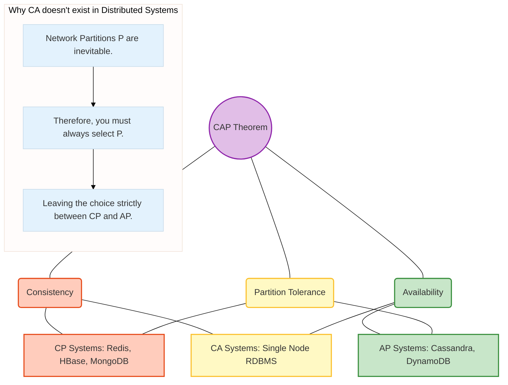
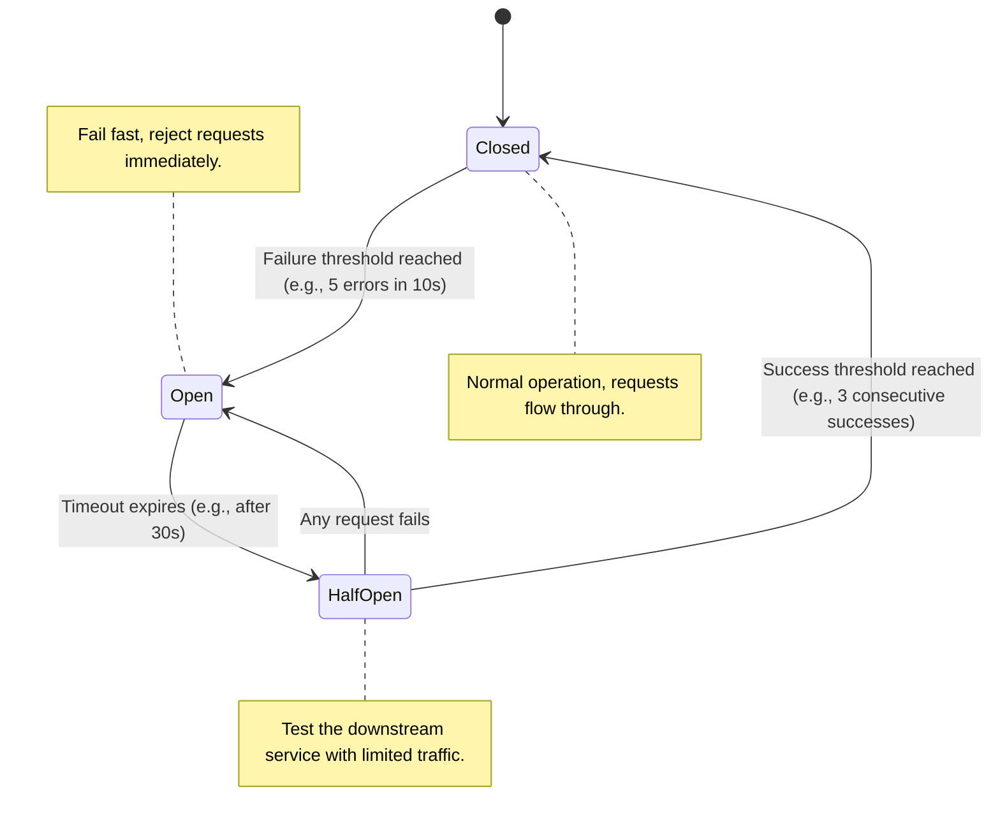

# Distributed Systems Fundamentals

## Overview

A distributed system is a collection of independent computers that appear to its users as a single coherent system. In enterprise banking and modern scale-out architectures, virtually all systems are distributed. This is because no single machine is large enough or reliable enough to handle the throughput, data volume, and availability requirements of a global financial institution.

For a Senior or Principal Engineer, deeply understanding distributed systems is non-negotiable. While junior engineers focus on making a single application work, senior engineers focus on what happens when pieces of a system fail, communicate slowly, or fundamentally disagree on the state of the world. Interviewers probe this area extensively to ensure you understand the guarantees (or lack thereof) provided by databases, messaging queues, and microservices in a distributed environment.

In banking, the stakes are highest. Money cannot be lost, double-spent, or made inaccessible. Understanding the theoretical limits (like the CAP Theorem) and practical failure modes of distributed systems is how you architect systems that survive network partitions, data center outages, and sudden spikes in trading volume.

## Foundational Concepts

### The Fallacies of Distributed Computing
Before diving into the mechanics, you must unlearn assumptions from single-node computing. Peter Deutsch formulated eight fallacies—assumptions developers often make that cause distributed systems to fail:
1.  **The network is reliable.** (It isn't; switches fail, cables are cut, packets drop).
2.  **Latency is zero.** (It isn't; speed of light is a hard limit).
3.  **Bandwidth is infinite.** (It isn't; network saturation happens).
4.  **The network is secure.** (It isn't; zero-trust architectures are required).
5.  **Topology doesn't change.** (It does; containers spin up and down dynamically).
6.  **There is one administrator.** (There isn't; different teams manage different domains).
7.  **Transport cost is zero.** (It isn't; serialization/deserialization and cloud egress costs exist).
8.  **The network is homogeneous.** (It isn't; different hardware and protocols exist everywhere).

### The CAP Theorem
Formulated by Eric Brewer, the CAP theorem states that a distributed data store can only simultaneously provide two of the following three guarantees:
*   **Consistency (C)**: Every read receives the most recent write or an error. When one node is updated, all subsequent reads from any node see that update.
*   **Availability (A)**: Every request receives a (non-error) response, without the guarantee that it contains the most recent write. All healthy nodes must respond.
*   **Partition Tolerance (P)**: The system continues to operate despite an arbitrary number of messages being dropped or delayed by the network between nodes.

**The Reality of CAP**: In a distributed system, a network partition is inevitable (switches fail, routers misconfigure). Therefore, you cannot "choose" not to have P. When a partition occurs, your system *must* choose between **C** (Consistency - reject the request because you can't guarantee it's the latest data) or **A** (Availability - serve the request with potentially stale data).
*   **CP Systems**: MongoDB, HBase, Redis (in some configs), Zookeeper. They prioritize consistency. During a network split, minority partitions stop accepting writes.
*   **AP Systems**: Cassandra, DynamoDB, Riak. They prioritize availability. They continue to accept reads/writes and resolve conflicts later (eventual consistency).

### PACELC Theorem
CAP only describes what happens *during a partition*. PACELC (by Daniel Abadi) extends this to normal operations:
**P**artition? choose **A**vailability or **C**onsistency.
**E**lse (normal operation)? choose **L**atency or **C**onsistency.

If a system replicates data synchronously across nodes, it ensures Consistency but increases Latency. If it replicates asynchronously, it lowers Latency but sacrifices Consistency.

## Technical Deep Dive

### Applying CAP to Real-World Banking Systems

Banking systems do not uniformly apply one side of the CAP theorem; they use different data stores for different subdomains based on business requirements.

1.  **Core Ledger / Account Balances (CP)**:
    *   **Requirement**: You absolutely cannot double-spend money. If a user transfers $100 out of an account, an ATM read fractions of a second later *must* reflect that deduction.
    *   **Choice**: **CP (Consistency & Partition Tolerance)** over Availability. If the network between the primary database and a regional replica fails, the system will reject transactions rather than risk an overdrawn account. It also chooses **Consistency over Latency (PACELC)** by using synchronous replication or two-phase commit (2PC) before confirming a transaction.
    *   **Technologies**: Relational databases configured for synchronous replication (PostgreSQL, Oracle) or NewSQL (Spanner, CockroachDB).

2.  **Transaction History / Statement Views (AP)**:
    *   **Requirement**: Users logging into their mobile app want to see their recent transactions. It is acceptable if a transaction made 5 seconds ago doesn't appear immediately, but the app itself must load.
    *   **Choice**: **AP (Availability & Partition Tolerance)**. During a network partition, show the user their cached or slightly stale transaction list. Else, choose **Latency over Consistency (PACELC)** to ensure the mobile app feels snappy.
    *   **Technologies**: Cassandra, Elasticsearch (for searching transactions), caching layers like Redis.

3.  **Fraud Detection Systems (AP/Latency-driven)**:
    *   **Requirement**: A fraud check must happen in < 100ms during a payment authorization. Waiting for strong consistency across global nodes would timeout the payment gateway.
    *   **Choice**: **AP** and **Latency** focus. The system evaluates the transaction against the *mostly* up-to-date ML model and profile data. Local availability and speed trump global consistency.

### Failure Modes and Fault Tolerance

In distributed systems, failures are not binary (working vs. crashed). They are complex and unpredictable.

*   **Crash Failures**: A node simply stops working. Easily detected if it stops sending heartbeats.
*   **Omission Failures**: A node fails to send or receive messages (e.g., buffer overflow).
*   **Timing Failures**: A node responds, but too late. In trading platforms, a late response is a wrong response.
*   **Byzantine Failures**: The hardest failure mode. A node behaves maliciously or arbitrarily, sending contradictory information to different parts of the system (e.g., bit flips, hacked nodes, software bugs).

**Mitigation Patterns:**
*   **Timeouts and Retries**: Set strict bounded time limits on network calls. If a timeout occurs, retry with **Exponential Backoff and Jitter** to avoid overwhelming a recovering service.
*   **Circuit Breakers**: If a downstream service is failing repeatedly, trip the circuit to fail fast, preventing resource exhaustion (thread starvation) in the calling service.
*   **Bulkheads**: Isolate resources (like thread pools or database connections) so a failure in one component doesn't cascade and take down the entire application.
*   **Idempotency**: Because network requests can fail and be retried, APIs must be idempotent (safe to call multiple times with the same result). Crucial for payments: `POST /payments` with `Idempotency-Key: 12345`.

## Visual Representations

### CAP Theorem and Database Placement



### The Circuit Breaker Pattern in Microservices



## Code/Configuration Examples

### Implementing Relational Idempotency (Java/Spring Boot)
In banking, distributed retries without idempotency lead to double-charged accounts. Here is a pattern for ensuring a payment is only processed once using an `Idempotency-Key` and a database unique constraint.

```java
@RestController
@RequestMapping("/api/v1/payments")
public class PaymentController {

    private final PaymentService paymentService;

    // The client generates a UUID and sends it in the header
    @PostMapping
    public ResponseEntity<PaymentResponse> processPayment(
            @RequestHeader("Idempotency-Key") String idempotencyKey,
            @RequestBody PaymentRequest request) {
        
        try {
            // Service attempts to insert into a table with idempotencyKey as a UNIQUE constraint
            PaymentResult result = paymentService.executePayment(idempotencyKey, request);
            return ResponseEntity.ok(new PaymentResponse("Success", result.getTransactionId()));
            
        } catch (DataIntegrityViolationException e) {
            // UNIQUE constraint violation means this key was already processed
            // We fetch the existing transaction instead of running it again
            PaymentResult existingResult = paymentService.getPaymentByKey(idempotencyKey);
            
            // Return 200 OK (or 201) with the PREVIOUS result.
            // This satisfies the API client's retry while protecting the backend ledger.
            return ResponseEntity.ok(new PaymentResponse("Already Processed", existingResult.getTransactionId()));
        } catch (Exception e) {
            // If it's a transient failure (e.g. timeout), we return 500, allowing the client to safely retry
            return ResponseEntity.status(HttpStatus.INTERNAL_SERVER_ERROR).build();
        }
    }
}
```

### Circuit Breaker Configuration (Resilience4j)
When communicating with a legacy core banking mainframe, you must protect your modern microservices from hanging threads if the mainframe slows down.

```yaml
resilience4j.circuitbreaker:
  instances:
    coreBankingMainframe:
      registerHealthIndicator: true
      slidingWindowSize: 10
      minimumNumberOfCalls: 5
      permittedNumberOfCallsInHalfOpenState: 3
      automaticTransitionFromOpenToHalfOpenEnabled: true
      waitDurationInOpenState: 10s
      failureRateThreshold: 50
      eventConsumerBufferSize: 10
```

## Interview Questions & Model Answers

**Q1: Explain the CAP theorem. Can a system be strictly CA?**
*Answer*: The CAP theorem states that a distributed data store can provide at most two of three guarantees: Consistency, Availability, and Partition Tolerance. In reality, network partitions (P) are unavoidable in distributed systems. Therefore, a strictly "CA" system is impossible in a distributed environment; it only exists as a theoretical single-node system. When a partition occurs, you must choose between rejecting requests to maintain consistency (CP) or serving potentially stale data to remain available (AP).

**Q2: We are designing a shopping cart for an e-commerce platform. Which side of the CAP theorem do you choose and why?**
*Answer*: I would choose AP (Availability and Partition Tolerance). If a user wants to add an item to their cart, we must accept that write even if the specific database node they are talking to is isolated from the rest of the cluster. Rejecting the "add to cart" action directly translates to lost revenue. We can resolve conflicts later (e.g., using Dynamo's vector clocks) when they proceed to checkout. At the actual checkout/payment phase, we shift to a CP model.

**Q3: How do you handle a scenario where a downstream service starts returning 500 errors or timing out?**
*Answer*: I would use a Circuit Breaker pattern combined with timeouts and fallbacks. First, strict timeouts ensure my service's threads don't hang indefinitely. Second, the Circuit Breaker monitors the failure rate. If it breaches a threshold (e.g., 50% failures in a 10-second window), the breaker opens, and my service immediately fails fast for subsequent requests without hitting the downstream service. This prevents cascading failure. I would also return a sensible default or a cached fallback response if applicable to the business logic.

**Q4: What is the PACELC theorem and how does it relate to latency?**
*Answer*: PACELC extends CAP by acknowledging that even when the network is perfectly healthy (no partition), systems still face a trade-off. "Else (no partition), choose Latency or Consistency". If I want strong consistency, I must synchronously replicate my data across nodes before acknowledging a write to the user, which increases Latency. If I want low latency, I acknowledge the write immediately and replicate asynchronously, sacrificing strict Consistency.

**Q5: What is a Byzantine failure and how does it apply to a banking network?**
*Answer*: A Byzantine failure occurs when a component fails arbitrarily, such as sending conflicting data to different parts of the system or acting maliciously. In banking, this could be a compromised node generating fraudulent transactions, or a software bug corrupting numeric payloads in transit. Protecting against this requires Byzantine Fault Tolerant (BFT) consensus algorithms, cryptographic signing of payloads (mTLS and message-level encryption), and rigorous input validation at boundary edges.

## Real-World Enterprise Scenarios

**Scenario: Designing a Resilient Payment Gateway Integration**
*   **Context**: Your microservice needs to call an external Payment Service Provider (PSP) like Stripe or Visa.
*   **Problem**: External networks are unreliable. The PSP might be undergoing maintenance, or the network connection might drop right after you send the authorization request but before you get the response.
*   **Solution**:
    1.  **Timeouts**: Set a strict read timeout (e.g., 5 seconds) on the HTTP client.
    2.  **Idempotency Key**: Generate a UUID (`payment_attempt_id`) before making the call. Save this in your local database in a "PENDING" state.
    3.  **Circuit Breaker**: Wrap the call in a circuit breaker. If the PSP is completely down, fail fast and tell the user to try another card/method.
    4.  **Reconciliation**: If a timeout occurs, you do *not* know if the PSP processed the payment. You cannot simply show an error and let the user click "Pay" again (risk of double billing). You must have a background worker that polls the PSP's status API using the Idempotency Key to determine the final state, and update your local database accordingly.

## Common Pitfalls & Best Practices

**Pitfalls:**
*   **Assuming Asynchronous Messages are Ordered**: In systems like RabbitMQ or Kafka (across multiple partitions), absolute global ordering is rarely guaranteed natively without severely restricting throughput. Don't design applications that break if `Event B` arrives before `Event A`.
*   **The "Retry Storm"**: Implementing infinite retries without delays. If a downstream service is struggling, 100 upstream clients retrying instantly will DDOS it to death.

**Best Practices:**
*   **Exponential Backoff and Jitter**: When retrying failed network calls, wait exponentially longer (1s, 2s, 4s, 8s) and add random jitter (e.g., +/- 200ms) to prevent synchronized waves of retries from multiple clients.
*   **Design for Failure**: Assume every network call will fail, every disk will fill up, and every database will stall. Write the catch block before the try block.

## Key Takeaways

*   **CAP is inescapable**: You must choose AP or CP during partitions. You cannot buy your way out of physics.
*   **Consistency = High Latency**: Synchronous coordination across varied geographies takes time (PACELC theorem).
*   **Fail Fast**: Circuit breakers and timeouts protect your system from cascading failures caused by slow or dead downstream dependencies.
*   **Idempotency is Mandatory**: In distributed transactions, network responses get lost. Clients will retry. Your APIs must safely handle duplicate requests.

## Further Reading
*   *Designing Data-Intensive Applications by Martin Kleppmann* - Chapter 8: The Trouble with Distributed Systems.
*   [A plain english introduction to CAP Theorem](http://ksat.me/a-plain-english-introduction-to-cap-theorem/)
*   [Fallacies of Distributed Computing Explained](https://architecturenotes.co/fallacies-of-distributed-computing/)
*   [AWS Builder's Library - Timeouts, retries, and backoff with jitter](https://aws.amazon.com/builders-library/timeouts-retries-and-backoff-with-jitter/)
