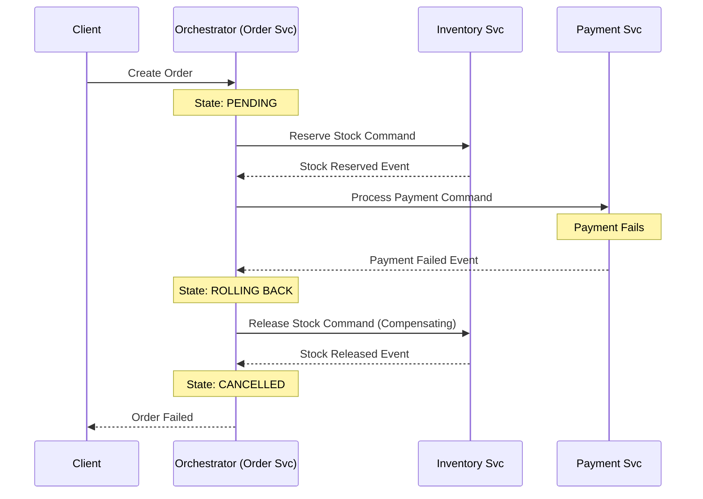
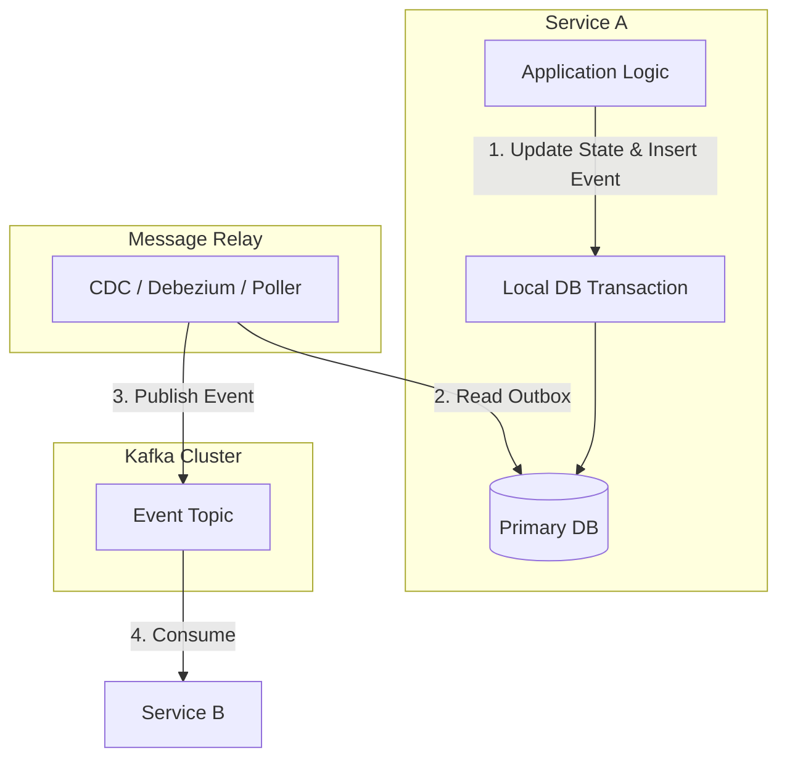

# Consistency, Consensus, and Distributed Transactions

## Overview

In a single-node database, transactions are straightforward: you lock a row, update it, and commit. In a distributed system with nodes spanning multiple continents, agreeing on the state of the data is one of the hardest problems in computer science. When a user in New York transfers $1,000 to a user in London, databases in both regions must flawlessly agree that the transfer occurred exactly once, or not at all.

This chapter dives deep into the spectrum of consistency models (from strong to eventual), the consensus algorithms that allow decentralized nodes to agree on state (Paxos, Raft), and the patterns used to manage transactions that span multiple microservices (2PC, Sagas, Outbox). For a Staff or Principal Engineer, mastering these concepts is critical. Choosing the wrong consistency model or transaction pattern in a banking environment can lead to corrupted ledgers, unexplainable balances, and severe regulatory penalties.

Interviewers use these topics to separate developers who just use tools from engineers who understand how those tools work under the hood. You will be tested on your ability to handle the "split-brain" problem, clock drift, and orchestrating complex business processes without Distributed Monolith antipatterns.

## Foundational Concepts

### Consistency Models
Consistency determines what a reader sees after a write occurs in a distributed system. It is a spectrum, not a binary choice.

1.  **Strong Consistency (Linearizability)**: The system behaves as if there is only one copy of the data. Once a write completes, all subsequent reads—regardless of which node they hit—will return that value. It requires synchronous replication and is slow but mathematically safe.
2.  **Sequential Consistency**: Slightly weaker. Operations appear to take place in some total order consistent with the order of operations on each individual process, but not necessarily in real-time order.
3.  **Causal Consistency**: If A causes B (e.g., a reply to a comment), A will be seen before B by all processes. Unrelated events can be seen in any order. Based on "happens-before" relationships.
4.  **Read-Your-Writes (Session Guarantees)**: A user will always see their own updates immediately, even if they read from a replica that hasn't received updates from other users yet. Usually achieved by routing a user's reads to the leader node or a tightly coupled replica for a short window after they write.
5.  **Monotonic Reads**: If a user reads a value, they will never subsequently read an older value. Prevents the "time-travel" anomaly where a user refreshes a page and sees older data because they hit a stale replica.
6.  **Eventual Consistency**: If no new updates are made, eventually all accesses will return the last updated value. High availability, low latency, but requires conflict resolution (e.g., LWW - Last Write Wins, or Vector Clocks).

### Why Consensus is Hard
Consensus is the process of getting multiple nodes to agree on a single data value or a sequence of actions. It is hard because nodes crash, messages are delayed or dropped, and networks partition.
*   **Split-Brain**: If a network partition splits a 5-node cluster into a 2-node group and a 3-node group, both groups might think the other died and try to elect a new leader. Without a strict *quorum* (majority rule), you get two active leaders simultaneously writing conflicting data.
*   **Fencing Tokens**: When a former leader pauses (e.g., GC pause), the cluster elects a new leader. When the old leader wakes up, it still thinks it's in charge. Systems use monotonically increasing fencing tokens (version numbers) so external storage can reject writes from the "zombie" leader.

## Technical Deep Dive

### Consensus Algorithms

#### 1. Raft
Raft was designed to be understandable (unlike Paxos). It breaks consensus down into:
*   **Leader Election**: Nodes are Followers, Candidates, or Leaders. If a Follower hears no heartbeat from the Leader, it becomes a Candidate and requests votes. The Candidate with the majority of votes in a term becomes the Leader.
*   **Log Replication**: The Leader accepts client requests, appends them to its local log, and sends `AppendEntries` RPCs to Followers. Once a majority of Followers acknowledge the entry, the Leader commits it and applies it to its state machine.
*   **Safety**: Raft guarantees that if a leader has committed a log entry, that entry will be present in the logs of all future leaders.

#### 2. Paxos & ZAB
*   **Paxos**: The academic granddaddy of consensus. Extremely difficult to implement correctly. Multi-Paxos optimizes the protocol for a continuous stream of requests by electing a stable leader. Google Spanner uses Paxos.
*   **ZAB (ZooKeeper Atomic Broadcast)**: Specifically built for Apache ZooKeeper. It focuses on primary-backup continuous state replication rather than individual consensus decisions, ensuring FIFO client order.

### Distributed Transactions across Microservices

In microservices, you cannot use a single database transaction (`BEGIN...COMMIT`) spanning multiple services. The "Database-per-Service" pattern forces us to use distributed transaction patterns.

#### 1. Two-Phase Commit (2PC) / XA Transactions
A coordinator manages the transaction across multiple databases.
*   **Phase 1 (Prepare)**: The coordinator asks all databases, "Are you ready to commit?" They lock rows and reply Yes or No.
*   **Phase 2 (Commit/Rollback)**: If all say Yes, the coordinator sends "Commit". If any say No, it sends "Rollback".
*   **Problem**: It is blocking and synchronous. If the coordinator crashes between Phase 1 and 2, the databases are stuck holding locks indefinitely. XA protocols are generally avoided in modern high-throughput scalable microservices due to terrible performance and tight coupling.

#### 2. The Saga Pattern
A Saga breaks a distributed transaction into a sequence of local database transactions. It relies on asynchronous messaging.
*   **Choreography**: Each service publishes an event (e.g., `OrderCreated`). Other services listen and react (e.g., Inventory service reserves stock).
*   **Orchestration**: A central service (the Orchestrator) tells other services what to do (using commands like `ReserveStock`, `ProcessPayment`).
*   **Compensating Transactions**: If step 3 fails, the Saga must execute compensating transactions to undo step 2 and step 1 (e.g., `RefundPayment`, `ReleaseStock`). Sagas do *not* provide ACID isolation; you must deal with intermediate states being visible to other processes (lack of "I" in ACID).

#### 3. The Transactional Outbox Pattern
How do you consistently update your database *and* publish an event to Kafka without 2PC? If you update the DB and then Kafka is down, the system is inconsistent.
*   **Solution**: Within a single local DB transaction, save the business entity *and* insert an event record into an `Outbox` table. A separate background process (e.g., Debezium using Change Data Capture) tails the Outbox table or WAL (Write-Ahead Log) and safely publishes the events to Kafka with at-least-once delivery guarantees.

### Clocks and Ordering
You cannot rely on server system clocks (`System.currentTimeMillis()`) to order events in a distributed system because of **Clock Drift**. NTP synchronization is not accurate enough for microsecond precision.

*   **Logical Clocks (Lamport Timestamps)**: A simple counter. Every node increments its counter for every operation. When sending a message, it includes the counter. The receiver updates its counter to `max(local_counter, received_counter) + 1`. It defines causal ordering, but doesn't tell you *when* an event happened in real time.
*   **Vector Clocks**: Used in Dynamo/Cassandra. Instead of a single counter, a vector of counters `[NodeA:2, NodeB:1, NodeC:0]` tracks updates per node. Used to detect concurrent writes and enforce conflict resolution.
*   **Google TrueTime**: Used in Spanner. Uses GPS receivers and atomic clocks in datacenters to provide a guaranteed upper bound on clock uncertainty (e.g., +/- 4ms). If the system waits out the uncertainty window before committing, it guarantees strict linearizability globally.

## Visual Representations

### The Saga Pattern (Orchestration)



### The Transactional Outbox Pattern



## Code/Configuration Examples

### Implementing Tunable Consistency (Cassandra/Java)
In Cassandra, you tune consistency per query. You set the Replication Factor (RF) globally, but the Consistency Level (CL) per read/write.

```java
// Example using Datastax Java Driver
import com.datastax.oss.driver.api.core.CqlSession;
import com.datastax.oss.driver.api.core.DefaultConsistencyLevel;
import com.datastax.oss.driver.api.core.cql.SimpleStatement;

public class StatementRepository {
    private final CqlSession session;

    // Banking Scenario: Writing a Ledger Entry
    // Requires strong consistency. CL = QUORUM (majority of replicas must acknowledge)
    // If RF=3, at least 2 replicas must write successfully.
    public void writeLedgerEntry(LedgerEntry entry) {
        SimpleStatement stmt = SimpleStatement.builder("INSERT INTO ledger ...")
                .setConsistencyLevel(DefaultConsistencyLevel.QUORUM)
                .build();
        session.execute(stmt);
    }

    // Banking Scenario: Reading a user's profile view (non-critical)
    // Requires high availability, eventual consistency is fine. CL = ONE
    // Only 1 replica needs to respond. Fast, but might return stale data.
    public UserProfile readProfile(UUID userId) {
         SimpleStatement stmt = SimpleStatement.builder("SELECT * FROM profiles WHERE user_id = ?")
                .addPositionalValue(userId)
                .setConsistencyLevel(DefaultConsistencyLevel.ONE)
                .build();
        return mapToProfile(session.execute(stmt).one());
    }
}
```

## Interview Questions & Model Answers

**Q1: What is the "Split-Brain" problem, and how do consensus algorithms prevent it?**
*Answer*: Split-brain occurs when a network partition divides a cluster, and both sides believe the other is dead, resulting in two nodes electing themselves as the leader and accepting conflicting writes. Consensus algorithms like Raft and Paxos prevent this by requiring a strict *quorum* (a majority, typically N/2 + 1) to elect a leader or commit a write. In a 5-node cluster, a partition might create a group of 2 and a group of 3. Only the group of 3 has the quorum to elect a leader; the group of 2 will pause operations, heavily favoring Consistency over partial Availability.

**Q2: In a microservices architecture, how do you handle a scenario where money is debited from Account A in Service 1, but the network fails before crediting Account B in Service 2?**
*Answer*: I cannot use a distributed 2PC transaction due to blocking and availability concerns. Instead, I would use an Orchestrated Saga Pattern combined with the Outbox Pattern. 
1. The Transfer Orchestrator updates Account A and writes a `CreditAccountB` event to its local Outbox table in a single local transaction. 
2. A message relay (Debezium) reliably streams that event to Kafka. 
3. Service B consumes it and credits Account B. 
4. If Service B fails business validation (e.g., account frozen), it publishes a `CreditFailed` event. 
5. The Orchestrator consumes this and executes a Compensating Transaction to refund Account A. Throughout this, all API endpoints and event consumers must be idempotent to handle retries safely.

**Q3: Explain the limitations of Two-Phase Commit (2PC). Why is it rarely used in modern cloud-native systems?**
*Answer*: 2PC is a blocking protocol. During Phase 1, all participating databases lock their resources. If the central transaction coordinator crashes after Phase 1 but before Phase 2, the databases are stuck holding locks, leading to deadlocks and massive system degradation. Furthermore, 2PC couples services tightly together at the database level, violating the "database-per-service" microservice principle and severely limiting horizontal scalability.

**Q4: How does Cassandra achieve high availability during a partition while maintaining tunable consistency?**
*Answer*: Cassandra uses a decentralized, masterless architecture with a Dynamo-style partitioned hash ring. It achieves high availability because any node can accept reads/writes. Consistency is tunable per request using combinations like `Read CL + Write CL > Replication Factor (RF)`. For example, if `RF=3`, setting `Read = QUORUM (2)` and `Write = QUORUM (2)` guarantees you will always read the latest write (strong consistency). If you want high availability during partitions, you can set `Read=ONE` and `Write=ONE`, relying on read-repair and anti-entropy (Merkle trees) to reach eventual consistency in the background.

## Real-World Enterprise Scenarios

**Scenario: Designing a Cross-Border Remittance System**
*   **Context**: Sending money from US (USD) to India (INR) involving a US Bank Service, an FX (Foreign Exchange) Pricing Service, and an Indian Bank Integration Service.
*   **Architecture**: This requires a Saga Orchestrator. The state machine explicitly models intermediate states (`FX_LOCKED`, `FUNDS_DEBITED_US`, `FUNDS_CREDITED_IN`).
*   **Trade-off**: Because this process can take minutes or hours (due to international clearing networks), long-running ACID transactions are impossible. We accept the lack of Isolation. A user viewing their balance in the US will see the funds gone, but the Indian recipient won't see them yet. We handle this business reality with clear UI states ("Processing Transfer") rather than trying to force database consistency across continents.

## Common Pitfalls & Best Practices

**Pitfalls:**
*   **Assuming Sagas Provide ACID**: Sagas do not have Isolation (the 'I' in ACID). If a Saga is halfway through modifying data, other transactions can read that partial state. This is called the *lost update* or *dirty read* anomaly.
*   **Ignoring Compensating Failure**: What happens if the compensating transaction itself fails (e.g., the refund service is down)? You must build retry loops, dead-letter queues, and eventually alert human operators for manual intervention.

**Best Practices:**
*   **Semantic Lock**: To handle isolation issues in Sagas, utilize a "Semantic Lock." Instead of a database lock, add a status column to the row (e.g., `status = PENDING_TRANSFER`). Any other process trying to modify that row must check the status and either wait or abort.
*   **The Outbox Pattern is Non-Negotiable**: In event-driven microservices, if you write to the DB and then call `kafkaTemplate.send()`, you will eventually lose messages. Network calls fail. Always use the Outbox pattern for critical dual-writes.

## Comparison Tables

| Consistency Model | Latency | Network Partition Behavior | Typical Tech Stack |
| :--- | :--- | :--- | :--- |
| **Linearizability (Strong)** | High (Coordination required) | Blocks writes/reads to maintain state | Spanner, CockroachDB |
| **Sequential** | Medium-High | Leader handles writes safely | ZooKeeper (ZAB), Raft based DBs |
| **Eventual Consistency** | Low | Highly available, resolves later | Cassandra (CL=ONE), DynamoDB |

| Pattern | Pros | Cons | Use Case |
| :--- | :--- | :--- | :--- |
| **2PC / XA** | Strong ACID guarantees | Blocking, terrible scaling, SPOF | Legacy monolithic RDBMS clusters |
| **Saga (Choreography)**| No central SPOF, decentralized | Hard to track flow, cyclical dependencies| Small microservice chains (2-3 services)|
| **Saga (Orchestration)**| Central monitoring, complex logic allowed | Orchestrator becomes a bottleneck/SPOF| Complex banking workflows (e.g., KYC) |

## Key Takeaways

*   **Consistency is a spectrum**: Don't default to strong consistency for everything. Match the consistency model to the business requirement (e.g., high for ledger, low for analytics).
*   **Use Quorums to beat Split-Brain**: You need `N/2 + 1` nodes to agree on a state or elect a leader safely. This is the foundation of Paxos and Raft.
*   **Dual-Writes require Outbox**: Never write to a DB and a Message Queue sequentially in application code without a Transactional Outbox to guarantee atomic eventual consistency.
*   **Don't rely on timestamps**: Time in distributed systems is relative. Use logical clocks, sequence numbers, or vectorized clocks for ordering events.

## Further Reading
*   *Microservices Patterns by Chris Richardson* - The definitive guide on Sagas and the Outbox Pattern.
*   [In Search of an Understandable Consensus Algorithm (Raft Paper)](https://raft.github.io/raft.pdf)
*   [Jepsen Analysis of Databases](https://jepsen.io/analyses) - Kyle Kingsbury's incredible work testing the consistency claims of modern databases.
*   [Debezium Outbox Pattern Documentation](https://debezium.io/blog/2019/02/19/reliable-microservices-data-exchange-with-the-outbox-pattern/)
