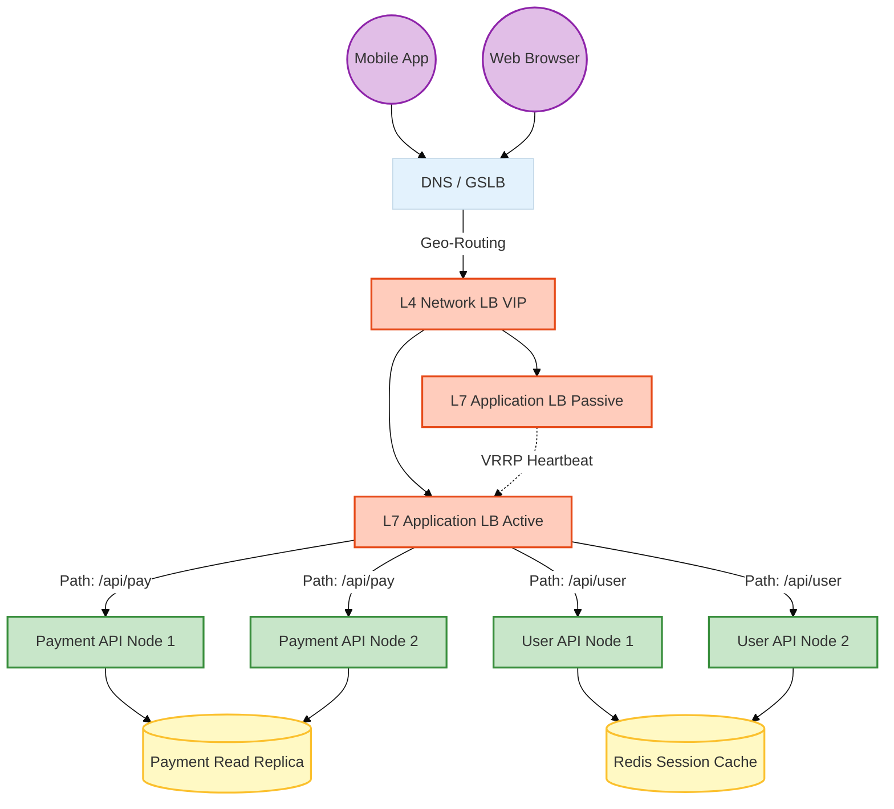

# Scalability Patterns

## Overview

Scalability is a system's ability to handle increasing amounts of work by adding resources to the system. In the context of enterprise banking, "work" translates to user logins during market opening hours, end-of-day batch processing of millions of transactions, or sudden spikes in mobile app traffic during a promotional campaign. 

A system that cannot scale will either crash under load (sacrificing availability) or become unacceptably slow (sacrificing latency). In technical interviews for Staff/Principal roles, candidates are expected to understand the nuances of scaling stateless vs. stateful systems, the trade-offs between vertical and horizontal scaling, and the critical role of load balancers, caching, and rate limiting in protecting backend resources. 

In a modern cloud-native environment, scaling is often automated, but automation applied to a poorly designed architecture simply results in distributed failures happening much faster. Understanding the fundamental patterns of scalability is crucial for designing robust, cost-effective, and highly available systems.

## Foundational Concepts

### Horizontal vs. Vertical Scaling

*   **Vertical Scaling (Scale-Up)**: Adding more CPU, RAM, or faster disks to a single server.
    *   *Pros*: Simple, no code changes required, deterministic latency (no network hops).
    *   *Cons*: Hardware has hard physical limits, cost increases non-linearly (a server with 2x RAM costs more than 2x the price), and it creates a Single Point of Failure (SPOF). Downsizing requires at least some downtime.
*   **Horizontal Scaling (Scale-Out)**: Adding more servers to a pool of resources.
    *   *Pros*: Near-infinite scalability, natural fault tolerance (if one node dies, others take over), and cost-effective (uses commodity hardware).
    *   *Cons*: Drastically increases architectural complexity. Data consistency, session management, and load balancing become significant challenges.

### Stateless vs. Stateful Services

*   **Stateless Services**: A service is stateless if any server in the cluster can handle any request. The service does not store client session data locally between requests. All state is kept externally (e.g., in a database or distributed cache). This is the pre-requisite for easy horizontal scaling.
*   **Stateful Services**: A service that remembers previous interactions or stores data locally (e.g., an in-memory session cache, a database, or a Kafka broker). Scaling stateful services requires complex coordination, data replication, and partitioning strategies.

### Load Balancing

A Load Balancer (LB) acts as the "traffic cop" sitting in front of your servers, routing client requests across all servers capable of fulfilling them in a manner that maximizes speed and capacity utilization while ensuring that no one server is overworked.

*   **Layer 4 (L4) Load Balancing**: Operates at the transport layer (TCP/UDP). It makes routing decisions based solely on source/destination IP addresses and ports without inspecting the packet contents. Extremely fast but limited in flexibility. (e.g., AWS Network Load Balancer).
*   **Layer 7 (L7) Load Balancing**: Operates at the application layer (HTTP/HTTPS). It inspects the content of the request (URL paths, headers, cookies) and makes intelligent routing decisions. For example, routing `/api/users` to the User Service and `/api/payments` to the Payment Service. (e.g., AWS Application Load Balancer, Nginx, HAProxy).

## Technical Deep Dive

### Load Balancing Algorithms

Choosing the right algorithm is critical for optimal resource utilization.

1.  **Round Robin**: Distributes requests sequentially across the cluster. Best for homogeneous servers and stateless requests of roughly equal execution time.
2.  **Weighted Round Robin**: Servers are assigned a weight based on their capacity (e.g., a 16-core machine gets a higher weight than an 8-core machine).
3.  **Least Connections**: Routes the request to the server with the fewest active connections. Excellent for long-lived connections (e.g., WebSockets, slow database queries).
4.  **IP Hash**: Calculates a hash of the client's IP address to determine the server. Ensures a single client is consistently routed to the same server. Useful for maintaining sticky sessions (though distributed caches are generally preferred).
5.  **Consistent Hashing**: Used extensively in distributed caching (like Redis Cluster) and NoSQL databases to distribute data across nodes. It minimizes the number of keys that need to be remapped when a node is added or removed.

### Load Balancer High Availability (HA)

A single load balancer is a catastrophic Single Point of Failure. To achieve HA, LBs are deployed in pairs.
*   **Active-Passive**: One LB handles all traffic. The passive LB monitors the active one via heartbeats. If the active LB fails, a mechanism like Keepalived uses VRRP (Virtual Router Redundancy Protocol) to instantaneously move the virtual IP (VIP) to the passive LB.
*   **Active-Active**: Both LBs handle traffic concurrently. DNS round-robin or Anycast routing distributes traffic between them.

### Global Server Load Balancing (GSLB) and Geo-Routing

For a global banking application, traffic must be routed to the datacenter closest to the user to minimize latency, or redirected to a completely different region during a disaster.

*   **Geo-Routing**: Uses IP geolocation databases to route a user in London to the `eu-west` datacenter and a user in New York to the `us-east` datacenter.
*   **GSLB**: Often implemented at the DNS level (e.g., AWS Route 53, Cloudflare). If the `eu-west` application goes down completely, the GSLB detects the failure via health checks and updates DNS records to route European traffic to `us-east`.

## Visual Representations

### Multi-Tier Load Balancing Architecture



## Code/Configuration Examples

### Nginx L7 Load Balancing with Health Checks

In an enterprise environment, your load balancer must actively monitor the health of backend nodes and stop sending traffic to instances taking too long or returning 5xx errors.

```nginx
# Define the upstream server pool
upstream payment_backend {
    # Least connections is often better than round-robin for APIs
    least_conn; 
    
    # max_fails and fail_timeout act as a primitive circuit breaker at the LB level
    server 10.0.1.10:8080 max_fails=3 fail_timeout=30s;
    server 10.0.1.11:8080 max_fails=3 fail_timeout=30s;
    server 10.0.1.12:8080 backup; # Only used if the primary servers fail
}

server {
    listen 443 ssl http2;
    server_name api.enterprisebank.com;

    # SSL Configuration (TLS 1.2+ mandatory for banking)
    ssl_certificate /etc/nginx/ssl/cert.pem;
    ssl_certificate_key /etc/nginx/ssl/key.pem;

    location /api/payments {
        # Limit the rate of requests per IP to prevent Abuse/DDoS
        limit_req zone=api_limit burst=10 nodelay;
        
        proxy_pass http://payment_backend;
        proxy_set_header Host $host;
        proxy_set_header X-Real-IP $remote_addr;
        proxy_set_header X-Forwarded-For $proxy_addrs;
        
        # Read timeout is critical. Don't let the LB wait indefinitely for a stuck backend
        proxy_read_timeout 5s; 
    }
}
```

## Interview Questions & Model Answers

**Q1: We are migrating a legacy monolithic application to the cloud. Currently, users log in, and their session state is stored in the JVM memory. What happens if we put a load balancer in front of three instances of this application?**
*Answer*: You will break the application. If User A logs in and the LB routes the request to Node 1, Node 1 creates the session in memory. When User A makes their next request, the LB (using round-robin) might route it to Node 2. Node 2 has no knowledge of the session and will ask the user to log in again. To fix this, we must either use IP Hash load balancing (Sticky Sessions) so the user always hits Node 1, or better, refactor the application to be stateless by externalizing the session store to a distributed cache like Redis. Sticky sessions are an anti-pattern as they thwart automated scaling and cause unequal load distribution.

**Q2: What is the difference between a Layer 4 and Layer 7 load balancer, and when would you use each?**
*Answer*: Layer 4 (Transport) makes routing decisions based on IP and Port. It doesn't decrypt SSL or inspect HTTP headers, making it incredibly fast and efficient. It's often used at the edge of the network for massive throughput or for non-HTTP traffic (e.g., routing database connections). Layer 7 (Application) terminates SSL, inspects HTTP headers, URLs, and cookies, and can route traffic based on the application context (e.g., `/images` goes to an object store, `/api` goes to microservices). It uses more CPU but offers fine-grained control and is essential for microservice architectures.

**Q3: Explain Consistent Hashing and why it is crucial for scaling a distributed cache like Redis.**
*Answer*: In a traditional hash distribution `server_index = hash(key) % N` (where N is the number of servers), adding or removing a server changes `N`. This causes almost every key to hash to a different server, resulting in a massive cache miss storm that brings down the primary database. Consistent Hashing maps both the servers and the keys onto a circular hash ring. A key is assigned to the first server it encounters moving clockwise on the ring. When a server is added or removed, only a small fraction of keys (those immediately adjacent to the server) need to be remapped, preserving the vast majority of the cache layout and preventing cache stampedes during scaling events.

**Q4: How do you perform a zero-downtime deployment for a stateful database schema change in a horizontally scaled application?**
*Answer*: You cannot do this in one step. It requires the "Expand and Contract" pattern. 
1. **Expand**: Add the new column/table to the database. The old application code ignores it.
2. **Deploy V1.1**: Deploy a version of the app that writes to *both* the old and new schema but still reads from the old. Wait until all nodes are updated.
3. **Data Migration**: Run a batch script to backfill data from the old schema to the new schema for existing records.
4. **Deploy V1.2**: Deploy the app version that reads from the *new* schema.
5. **Contract**: Once V1.2 is stable, drop the old column/table.

## Real-World Enterprise Scenarios

**Scenario: High-Frequency Trading (HFT) API Gateway**
*   **Context**: Designing an entry point for algorithmic traders submitting millions of orders per second. Latency is the only metric that matters.
*   **Architecture**: You *cannot* use a heavy Layer 7 load balancer like an AWS ALB because parsing the HTTP headers adds unacceptable microsecond delays.
*   **Solution**: Use a Layer 4 Network Load Balancer (or even direct UDP multicast if the protocol allows). Terminate SSL as close to the hardware layer as possible using specialized F5 Big-IP hardware or highly optimized Nginx setups. Move all complex routing logic out of the critical path.

## Common Pitfalls & Best Practices

**Pitfalls:**
*   **Thundering Herd Problem**: When hundreds of App Servers boot up simultaneously (e.g., after an auto-scaling event) and all instantly request configuration or open database connections, crashing the central resource.
*   **Sticky Sessions**: Relying on the load balancer to route a user to the same server every time. If that server dies, the user is logged out. It also prevents the LB from shedding load effectively.

**Best Practices:**
*   **Stateless by Default**: Make the web layer completely stateless. Any server should be able to process any request at any time. Externalize state to Redis, DynamoDB, or PostgreSQL.
*   **Graceful Shutdown**: When scaling *down*, ensure your application intercepts `SIGTERM` signals from Docker/Kubernetes, finishes processing active requests, and closes database connections cleanly before exiting. Do not just `kill -9` the process.

## Comparison Tables

| Scaling Dimension | Layer 4 Load Balancing | Layer 7 Load Balancing |
| :--- | :--- | :--- |
| **OSI Layer** | Transport (TCP/UDP) | Application (HTTP/HTTPS/gRPC) |
| **Routing Decision** | IP Address, Port | URL path, Headers, Cookies |
| **Performance** | Extremely Fast (low CPU overhead) | Slower (requires SSL decrypt/re-encrypt) |
| **Use Case**| DB routing, massive sustained throughput | Microservice routing, API Gateways, WAF |

| Feature | Scale-Up (Vertical) | Scale-Out (Horizontal) |
| :--- | :--- | :--- |
| **Implementation** | Easy (change instance type) | Hard (requires stateless design) |
| **Cost** | Non-linear (exponentially expensive) | Linear (commodity hardware) |
| **Availability** | Single Point of Failure | Highly Available |
| **Limits** | Physical hardware constraints | Theoretically infinite |

## Key Takeaways

*   **Statelessness enables scaling**: You cannot effectively auto-scale out an application that holds user sessions in local memory.
*   **Layer 7 for logic, Layer 4 for speed**: Choose your load balancing tier based on the latency budget and routing complexity.
*   **Load balancers must be HA**: A single load balancer is an unacceptable single point of failure in an enterprise environment.
*   **Consistent Hashing is essential**: When splitting data across multiple nodes (caches or NoSQL), use consistent hashing to prevent massive rebalancing when scaling the cluster up or down.

## Further Reading
*   [AWS Elastic Load Balancing Documentation](https://aws.amazon.com/elasticloadbalancing/)
*   [Introduction to Consistent Hashing](https://www.toptal.com/big-data/consistent-hashing)
*   [Nginx Load Balancing Algorithms](https://docs.nginx.com/nginx/admin-guide/load-balancer/http-load-balancer/)
